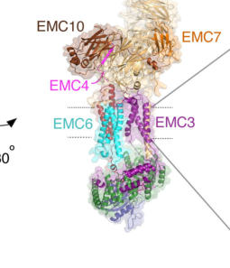

## Question

# Gene Research for Functional Annotation

## ⚠️ CRITICAL: Gene/Protein Identification Context

**BEFORE YOU BEGIN RESEARCH:** You MUST verify you are researching the CORRECT gene/protein. Gene symbols can be ambiguous, especially for less well-characterized genes from non-model organisms.

### Target Gene/Protein Identity (from UniProt):
- **UniProt Accession:** Q9NPA0
- **Protein Description:** RecName: Full=Endoplasmic reticulum membrane protein complex subunit 7; AltName: Full=ER membrane protein complex subunit 7; Flags: Precursor;
- **Gene Information:** Name=EMC7; Synonyms=C11orf3, C15orf24; ORFNames=HT022, UNQ905/PRO1926;
- **Organism (full):** Homo sapiens (Human).
- **Protein Family:** Belongs to the EMC7 family. .
- **Key Domains:** Beta_sandwich_EMC7. (IPR019008); Carb-bd-like_fold. (IPR013784); EMC7. (IPR039163); EMC7_beta-sandw (PF09430)

### MANDATORY VERIFICATION STEPS:

1. **Check if the gene symbol "EMC7" matches the protein description above**
2. **Verify the organism is correct:** Homo sapiens (Human).
3. **Check if protein family/domains align with what you find in literature**
4. **If you find literature for a DIFFERENT gene with the same or similar symbol, STOP**

### If Gene Symbol is Ambiguous or You Cannot Find Relevant Literature:

**DO NOT PROCEED WITH RESEARCH ON A DIFFERENT GENE.** Instead:
- State clearly: "The gene symbol 'EMC7' is ambiguous or literature is limited for this specific protein"
- Explain what you found (e.g., "Found extensive literature on a different gene with the same symbol in a different organism")
- Describe the protein based ONLY on the UniProt information provided above
- Suggest that the protein function can be inferred from domain/family information

### Research Target:

Please provide a comprehensive research report on the gene **EMC7** (gene ID: EMC7, UniProt: Q9NPA0) in human.

The research report should be a detailed narrative explaining the function, biological processes, and localization of the gene product. Citations should be given for all claims.

You should prioritize authoritative reviews and primary scientific literature when conducting research. You can supplement
this with annotations you find in gene/protein databases, but these can be outdated or inaccurate.

We are specifically interested in the primary function of the gene - for enzymes, what reaction is catalyzed, and what is the substrate specificity? For transporters, what is the substrate? For structural proteins or adapters, what is the broader structural role? For signaling molecules, what is the role in the pathway.

We are interested in where in or outside the cell the gene product carries out its function.

We are also interested in the signaling or biochemical pathways in which the gene functions. We are less interested in broad pleiotropic effects, except where these elucidate the precise role.

Include evidence where possible. We are interested in both experimental evidence as well as inference from structure, evolution, or bioinformatic analysis. Precise studies should be prioritized over high-throughput, where available.

## Output

Question: You are an expert researcher providing comprehensive, well-cited information.

Provide detailed information focusing on:
1. Key concepts and definitions with current understanding
2. Recent developments and latest research (prioritize 2023-2024 sources)
3. Current applications and real-world implementations
4. Expert opinions and analysis from authoritative sources
5. Relevant statistics and data from recent studies

Format as a comprehensive research report with proper citations. Include URLs and publication dates where available.
Always prioritize recent, authoritative sources and provide specific citations for all major claims.

# Gene Research for Functional Annotation

## ⚠️ CRITICAL: Gene/Protein Identification Context

**BEFORE YOU BEGIN RESEARCH:** You MUST verify you are researching the CORRECT gene/protein. Gene symbols can be ambiguous, especially for less well-characterized genes from non-model organisms.

### Target Gene/Protein Identity (from UniProt):
- **UniProt Accession:** Q9NPA0
- **Protein Description:** RecName: Full=Endoplasmic reticulum membrane protein complex subunit 7; AltName: Full=ER membrane protein complex subunit 7; Flags: Precursor;
- **Gene Information:** Name=EMC7; Synonyms=C11orf3, C15orf24; ORFNames=HT022, UNQ905/PRO1926;
- **Organism (full):** Homo sapiens (Human).
- **Protein Family:** Belongs to the EMC7 family. .
- **Key Domains:** Beta_sandwich_EMC7. (IPR019008); Carb-bd-like_fold. (IPR013784); EMC7. (IPR039163); EMC7_beta-sandw (PF09430)

### MANDATORY VERIFICATION STEPS:

1. **Check if the gene symbol "EMC7" matches the protein description above**
2. **Verify the organism is correct:** Homo sapiens (Human).
3. **Check if protein family/domains align with what you find in literature**
4. **If you find literature for a DIFFERENT gene with the same or similar symbol, STOP**

### If Gene Symbol is Ambiguous or You Cannot Find Relevant Literature:

**DO NOT PROCEED WITH RESEARCH ON A DIFFERENT GENE.** Instead:
- State clearly: "The gene symbol 'EMC7' is ambiguous or literature is limited for this specific protein"
- Explain what you found (e.g., "Found extensive literature on a different gene with the same symbol in a different organism")
- Describe the protein based ONLY on the UniProt information provided above
- Suggest that the protein function can be inferred from domain/family information

### Research Target:

Please provide a comprehensive research report on the gene **EMC7** (gene ID: EMC7, UniProt: Q9NPA0) in human.

The research report should be a detailed narrative explaining the function, biological processes, and localization of the gene product. Citations should be given for all claims.

You should prioritize authoritative reviews and primary scientific literature when conducting research. You can supplement
this with annotations you find in gene/protein databases, but these can be outdated or inaccurate.

We are specifically interested in the primary function of the gene - for enzymes, what reaction is catalyzed, and what is the substrate specificity? For transporters, what is the substrate? For structural proteins or adapters, what is the broader structural role? For signaling molecules, what is the role in the pathway.

We are interested in where in or outside the cell the gene product carries out its function.

We are also interested in the signaling or biochemical pathways in which the gene functions. We are less interested in broad pleiotropic effects, except where these elucidate the precise role.

Include evidence where possible. We are interested in both experimental evidence as well as inference from structure, evolution, or bioinformatic analysis. Precise studies should be prioritized over high-throughput, where available.

## Research report: Human **EMC7** (UniProt: **Q9NPA0**; gene: **EMC7**; synonyms: **C11orf3**, C15orf24)

### 0) Target identity verification (critical)
The requested protein corresponds to the human **endoplasmic reticulum (ER) membrane protein complex (EMC) subunit 7**, commonly called **EMC7**. In the primary literature and authoritative reviews, the same subunit is also referred to by the legacy human gene symbol **C11orf3** and is conserved with a yeast homolog **Sop4**, supporting that the “EMC7” discussed here is the same ER-resident EMC subunit as in UniProt Q9NPA0. (chitwood2019theroleof pages 2-4, chitwood2019theroleof pages 1-2)

### 1) Key concepts and definitions (current understanding)

#### 1.1 The ER membrane protein complex (EMC)
The **EMC** is a conserved, abundant ER membrane machinery implicated in **membrane protein biogenesis**. Its most established biochemical role is as an **insertase** for certain transmembrane domains (TMDs), with additional roles in later folding/assembly steps for some membrane proteins. (hegde2022thefunctionstructure pages 1-2)

Mechanistically, cryo-EM structures and structure-guided biochemistry support a model in which substrates are handled through a **cytosol-facing hydrophilic vestibule** located within the membrane and formed primarily by **EMC3 and EMC6**; insertion is proposed to be aided by features such as local membrane thinning and electrostatic/structural determinants in and around the vestibule. (pleiner2020structuralbasisfor pages 1-3, hegde2022thefunctionstructure pages 13-14)

#### 1.2 What is EMC7?
**EMC7** is a subunit of the EMC that contributes structural and regulatory elements rather than being the catalytic core insertase (which is centered on EMC3–EMC6). EMC7 is consistently described as one of the smaller EMC membrane subunits and has an appreciable lumenal domain contributing to the lumenal mass of the complex. (chitwood2019theroleof pages 2-4)

### 2) EMC7 protein localization, topology, domains, and structure

#### 2.1 Subcellular localization
EMC7 is an **ER membrane protein** and a constituent of the ER-resident EMC. (bagchi2020selectiveemcsubunits pages 10-11, pleiner2020structuralbasisfor pages 1-3)

#### 2.2 Membrane topology
Multiple experimental lines support that human EMC7 is a **type I, single-pass ER membrane protein** (lumenal N-terminus, cytosolic C-terminus). In vitro translation/protease protection with N- and C-terminal tags showed protection of the N-terminal tag but protease accessibility of the C-terminal tag, consistent with a **single-spanning type I topology**. (pleiner2023aselectivityfilter pages 19-23)

Cryo-EM-based models place EMC7’s N-terminus in the **lumenal region** (with EMC1/EMC4/EMC10) and observe weak density consistent with a flexible transmembrane helix emerging from EMC7’s lumenal domain. (pleiner2020structuralbasisfor pages 1-3)

#### 2.3 Domain organization and placement in EMC architecture
Structural work on human EMC places EMC7 within the **L-shaped lumenal region** and shows EMC7 contains a **β-sandwich** fold (the EMC7 “β-sandwich” domain) as part of the lumenal assembly. (pleiner2020structuralbasisfor media 0c26243d, pleiner2020structuralbasisfor media ab1f47b2, pleiner2020structuralbasisfor pages 1-3)

At the membrane-domain level, EMC7 contributes a **single transmembrane helix** to a more dynamic “front-side” subdomain near the EMC3/EMC6 core, and crosslinking supports EMC7 proximity to EMC3. (hegde2022thefunctionstructure pages 13-14)

### 3) Primary molecular function: what EMC7 does
EMC7 has no evidence in this corpus for intrinsic catalytic (enzyme) activity; instead, its molecular function is best understood as **participation in a multi-subunit insertase/chaperone machine**.

#### 3.1 EMC7’s mechanistic role in substrate capture and insertion (TA/single-pass clients)
A major EMC7-specific mechanistic result is that EMC7 contributes **conserved hydrophobic cytosolic loop(s)** located immediately beneath the EMC hydrophilic vestibule that physically interact with substrate TMDs. These loops likely act as an initial **transient capture site** during insertion; mutational analysis indicates that **hydrophobicity** of this region (rather than precise sequence) is important for function. (pleiner2023aselectivityfilter pages 8-10)

Consistent with this, biochemical work (preprint evidence) further emphasizes that EMC7’s cytosolic elements (including a **C-terminal amphipathic helix**) are required for efficient biogenesis of EMC-dependent tail-anchored substrates such as **squalene synthase (SQS)**; disrupting the amphipathic helix strongly impaired SQS biogenesis and approximated an EMC7 knockout phenotype. (pleiner2022aselectivityfilter pages 5-7)

#### 3.2 EMC7 contribution to the “dynamic subunit” environment around the vestibule
In the selectivity-filter model, EMC7 is among subunits whose **dynamic transmembrane domains** help form a protected environment that allows nascent TMDs to sample the bilayer, contributing to rapid accept/reject decisions during insertion. (pleiner2023aselectivityfilter pages 10-11)

### 4) Pathways and biological processes influenced by EMC7 (with concrete examples)

#### 4.1 Membrane protein biogenesis and proteostasis in the ER
At the EMC level, the best-supported function is **TMD insertion**, especially for **tail-anchored** and certain **signal-anchored** proteins, plus broader roles in multipass client maturation. (hegde2022thefunctionstructure pages 20-22, hegde2022thefunctionstructure pages 1-2)

A concrete, well-studied mammalian metabolic example is **cholesterol homeostasis**, where EMC supports biogenesis of sterol-related enzymes including **SQS** (tail-anchored, weakly hydrophobic TA) and **SOAT1** (polytopic ER enzyme), thereby influencing sterol flux and storage. (volkmar2019theermembrane pages 1-3)

EMC7 itself is experimentally required for SQS biogenesis in human cells in the 2023 selectivity-filter study, supporting that EMC7 participates directly in this sterol-pathway node via its role in TA insertion/handling. (pleiner2023aselectivityfilter pages 19-23)

#### 4.2 Post-translational topology rectification of multipass proteins (context for EMC7)
A major recent conceptual advance is that EMC does not only act co-translationally; it can also **rectify topology post-translationally** by inserting **C-terminal/terminal TMDs** of multipass membrane proteins after release from the ribosome–Sec61 complex. This mechanism is proposed to apply to approximately **~250** diverse human multipass proteins. (wu2024emcrectifiesthe pages 1-2)

While this 2024 study does not assign a unique catalytic role to EMC7, it substantially expands the set of physiological situations where EMC7-containing EMC complexes are likely required, including biogenesis of pharmacologically important targets such as pentameric ion-channel subunits. (wu2024emcrectifiesthe pages 1-2)

### 5) Interaction partners and molecular networks

#### 5.1 Within the EMC
Human EMC7’s lumenal domain associates with lumenal EMC architecture (including EMC1/EMC10 in structural studies), and EMC7’s single TMD lies near EMC3/EMC6 in the dynamic front subdomain with crosslinking-based support for proximity to EMC3. (hegde2022thefunctionstructure pages 13-14, pleiner2020structuralbasisfor pages 1-3)

#### 5.2 Non-canonical roles: organelle tethering and viral entry
A distinct EMC7 function reported in cell biology/virology is participation (with EMC4) as an **ER–late endosome tether** that supports polyomavirus **SV40** delivery from late endosomes to the ER.

Mechanistic evidence includes: (i) EMC7 is a type I single-pass ER protein whose **cytosolic C-terminal tail** contains disordered/low-complexity segments that mediate binding to the late endosomal GTPase **Rab7**; (ii) EMC7 (and EMC4) also binds the ER SNARE **syntaxin18 (Stx18)**; (iii) depletion of EMC7 blocks SV40 infection by preventing late endosome-to-ER targeting, with quantitative results reported as means ± SD over **three independent experiments** (e.g., infections around MOI ~2). (bagchi2020selectiveemcsubunits pages 10-11)

A 2023 expert review synthesizes this as evidence that—beyond insertase activity—the EMC facilitates **ER membrane contact sites (MCSs)** with other organelles, highlighting EMC4/EMC7-dependent ER–endosome tethering in SV40 entry. (woo2023howhoster pages 4-5)

#### 5.3 Mitochondria–ER contact sites: EMC7 interaction with VDAC
A 2024 cryo-EM study reports EMC association with **VDAC1** at mitochondria–ER contacts and identifies EMC7 as a principal contributor to the binding interface. In the EMC–VDAC1 complex, EMC7’s transmembrane helix becomes ordered (being “invisible” in apo EMC) and contributes roughly **one-third** of the EMC–VDAC1 interface area; the complex buries ~2,336 Ų at the interface overall and is supported by in-cell NanoBiT/BiFC assays localizing the association to mitochondria–ER contact sites. (li2024structuralinsightsinto pages 3-5)

### 6) Recent developments (prioritizing 2023–2024)

#### 6.1 2023: EMC selectivity filter and EMC7’s role in substrate handling
A 2023 Journal of Cell Biology paper presents a **selectivity filter** framework for the EMC vestibule and assigns EMC7 a role in **substrate capture** via conserved hydrophobic loops beneath the vestibule. The same work provides experimental confirmation that EMC7 is a **type I single-pass** subunit and supports its functional requirement for SQS biogenesis. (pleiner2023aselectivityfilter pages 8-10, pleiner2023aselectivityfilter pages 19-23)

#### 6.2 2023: EMC7 in virus entry and ER–endosome MCS biology
A 2023 Journal of Cell Science review emphasizes EMC subunits as multifunctional host factors exploited by viruses and frames EMC7 (with EMC4) as mediating ER–endosome membrane contacts required for SV40 entry. (woo2023howhoster pages 4-5)

#### 6.3 2024: EMC-driven topology rectification for ~250 multipass proteins
A 2024 Nature Structural & Molecular Biology study argues that EMC-mediated **post-translational terminal-TMD insertion** is a general solution for multipass proteins whose final TMDs are not fully inserted co-translationally, and estimates applicability to **~250** multipass proteins. (wu2024emcrectifiesthe pages 1-2)

#### 6.4 2024: EMC7 as a structural mediator of EMC–VDAC interaction
A 2024 cryo-EM study proposes EMC7-dependent structural switching at mitochondria–ER contact sites, where EMC7’s helix becomes ordered and forms a substantial fraction of the EMC–VDAC interface, potentially modulating EMC’s insertase state. (li2024structuralinsightsinto pages 3-5)

### 7) Applications and real-world implementations

1. **Antiviral host-factor biology (SV40 model):** EMC7 (with EMC4) is directly implicated as a molecular tether promoting late endosome-to-ER delivery of SV40 and efficient infection, via Rab7 and syntaxin18 interactions. This is a concrete, mechanistically dissected example of how an ER biogenesis complex subunit is repurposed for organelle communication and pathogen trafficking. (bagchi2020selectiveemcsubunits pages 10-11)

2. **Membrane-protein biogenesis as a biomedical lever:** Because many membrane proteins are drug targets, EMC function (including EMC7-dependent client handling and topology enforcement) is relevant to production/stability of receptors and channels. A 2024 study explicitly highlights pentameric ion channel subunits as substrates in the EMC-dependent topology-rectification mechanism. (wu2024emcrectifiesthe pages 1-2)

3. **Metabolic robustness (cholesterol homeostasis):** EMC-dependent SQS and SOAT1 biogenesis provides a mechanistic link between membrane insertion machinery (including EMC7-dependent steps for at least SQS) and cellular adaptation to cholesterol availability. (volkmar2019theermembrane pages 1-3, pleiner2023aselectivityfilter pages 19-23)

### 8) Human genetics and disease associations (with caution)

#### 8.1 GWAS signal near EMC7 in sickle cell disease HbF variability (2024)
A 2024 GWAS of **520** sickle cell disease subjects reported a genome-wide significant locus at **15q14** with lead SNP **rs8182015** (P = **2.07 × 10⁻⁸**) described as being **near EMC7**, identified in analyses of fetal hemoglobin (HbF). The authors present this as a locus near EMC7 and note eQTL links to other nearby genes, so the causal gene is not established. (tsukahara2024identificationofgenetic pages 1-2, tsukahara2024identificationofgenetic pages 5-6)

#### 8.2 OpenTargets aggregated evidence
OpenTargets lists EMC7 associations for several disease ontology terms (e.g., neurodegenerative disease, lysosomal storage disease), driven by functional-screen evidence (e.g., CRISPRi neuronal survival/lysotracker studies linked to PMID 34031600). This is useful for hypothesis generation but should not be interpreted as direct causal genetics without follow-up. (OpenTargets Search: -EMC7)

### 9) Expert synthesis and analysis (authoritative interpretation)

Across structural, biochemical, and cell-biological data, EMC7 is best annotated as a **single-pass ER membrane subunit** that helps shape a **dynamic, substrate-interacting region** of the EMC, with experimentally supported roles in: (i) **transient TMD capture** via hydrophobic cytosolic loops beneath the hydrophilic vestibule; (ii) supporting **biogenesis of at least some EMC-dependent tail-anchored clients** (notably SQS); and (iii) **non-canonical organelle tethering** functions at ER–endosome contacts in SV40 entry. (pleiner2023aselectivityfilter pages 8-10, pleiner2023aselectivityfilter pages 19-23, bagchi2020selectiveemcsubunits pages 10-11)

Recent work suggests EMC7’s conformational plasticity can also be exploited in alternate EMC states—e.g., binding VDAC1 at mitochondria–ER contacts where EMC7 contributes a substantial fraction of the binding interface—supporting a broader view of EMC7 as a regulatory/structural element that can participate in switching EMC between functional modes or cellular contexts. (li2024structuralinsightsinto pages 3-5)

### 10) Summary table (evidence map)
| Category | Key points | Evidence/citation IDs to support |
|---|---|---|
| concept/definition | Human EMC7 is the ER membrane protein complex subunit 7, a conserved EMC component; literature also uses the legacy human name **C11orf3** and notes the yeast homolog **Sop4**. EMC7 is not the catalytic insertase core itself, but part of the EMC machine that supports membrane protein biogenesis. | (chitwood2019theroleof pages 2-4, chitwood2019theroleof pages 1-2, hegde2022thefunctionstructure pages 1-2) |
| localization/topology | EMC7 is an **ER membrane** subunit with a **lumenal N-terminus** and **type I single-pass topology**; protease-protection experiments support a single membrane span, and cryo-EM places EMC7 in the EMC lumenal/front dynamic region with a flexible TMD. | (pleiner2023aselectivityfilter pages 19-23, pleiner2020structuralbasisfor pages 1-3, hegde2022thefunctionstructure pages 13-14) |
| molecular function/mechanism | At the complex level, EMC acts as a **co-/post-translational insertase** and membrane-protein biogenesis factor using a hydrophilic vestibule centered on EMC3/EMC6. EMC7 contributes a **dynamic TMD** and **cytosolic hydrophobic loops** beneath the vestibule that help transiently capture incoming substrate TMDs; an EMC7 C-terminal amphipathic element is functionally important for client biogenesis. | (pleiner2020structuralbasisfor pages 1-3, hegde2022thefunctionstructure pages 13-14, pleiner2022aselectivityfilter pages 5-7, pleiner2022aselectivityfilter pages 7-9, pleiner2023aselectivityfilter pages 8-10, pleiner2023aselectivityfilter pages 10-11) |
| interaction partners | Within EMC, EMC7 associates with **EMC1** and **EMC10** in the lumenal domain and is proximal to **EMC3** in the membrane region. Beyond the complex, EMC7 binds **Rab7** and **syntaxin18/Stx18** in ER-late endosome tethering, and its TMH forms a major interface with **VDAC1** at mitochondria-ER contact sites. | (li2024structuralinsightsinto pages 3-5, bagchi2020selectiveemcsubunits pages 10-11, hegde2022thefunctionstructure pages 13-14, millervedam2020structuralandmechanistic pages 18-21, pleiner2020structuralbasisfor pages 1-3) |
| substrates/clients | EMC7-specific experiments show it is required for biogenesis of the EMC client **squalene synthase (SQS)**; more broadly, EMC supports clients such as **SOAT1** and many multipass membrane proteins, but most substrate assignments are **complex-level** rather than uniquely EMC7-specific. EMC7 loss can reduce TA clients and retain multipass clients in the ER. | (volkmar2019theermembrane pages 1-3, pleiner2023aselectivityfilter pages 19-23, li2024structuralinsightsinto pages 21-25, millervedam2020structuralandmechanistic pages 18-21) |
| recent 2023-2024 developments | **2023:** EMC7 was mechanistically assigned a role in early substrate capture/selectivity and experimentally confirmed as a type I single-pass subunit. **2024:** EMC7 TMH was shown to become ordered upon **VDAC1** binding and to contribute about **one-third** of the EMC-VDAC1 interface; EMC context was expanded by the finding that EMC rectifies topology of ~**250** multipass proteins post-translationally. | (pleiner2023aselectivityfilter pages 19-23, pleiner2023aselectivityfilter pages 8-10, pleiner2023aselectivityfilter pages 10-11, li2024structuralinsightsinto pages 3-5, wu2024emcrectifiesthe pages 1-2) |
| human genetics/clinical | Direct disease causality for human EMC7 remains limited. A **2024 GWAS** in **520** sickle cell disease subjects identified a genome-wide significant locus **near EMC7** for HbF (**rs8182015, P=2.07×10⁻⁸**), but the paper explicitly supports cautious interpretation because proximity does not prove EMC7 causality. OpenTargets also lists disease associations for EMC7 based largely on functional-screen evidence rather than Mendelian proof. | (tsukahara2024identificationofgenetic pages 1-2, tsukahara2024identificationofgenetic pages 3-5, tsukahara2024identificationofgenetic pages 5-6, OpenTargets Search: -EMC7) |
| applications | EMC7 has real-world relevance as part of a host pathway exploited in **SV40** entry, where EMC7/EMC4 tether late endosomes to the ER through Rab7 and cooperate with Stx18. At the broader EMC level, this biology matters because EMC governs biogenesis of pharmacologically important membrane proteins, including **GPCRs**, **ion channels**, and sterol-homeostasis enzymes. | (woo2023howhoster pages 6-7, woo2023howhoster pages 4-5, bagchi2020selectiveemcsubunits pages 10-10, bagchi2020selectiveemcsubunits pages 10-11, bagchi2020selectiveemcsubunits pages 1-2, volkmar2019theermembrane pages 1-3, wu2024emcrectifiesthe pages 1-2) |

*Table: This table condenses the strongest functional-annotation evidence for human EMC7 (UniProt Q9NPA0), separating EMC7-specific findings from broader complex-level EMC biology. It is useful as a quick reference for function, localization, mechanism, interactions, recent studies, and biomedical relevance.*

### Key cited source URLs and publication dates (selection)
- Pleiner et al., **Science**, **2020-07**: “Structural basis for membrane insertion by the human ER membrane protein complex.” https://doi.org/10.1126/science.abb5008 (pleiner2020structuralbasisfor pages 1-3)
- Hegde, **Annual Review of Biochemistry**, **2022-06**: “The function, structure, and origins of the ER membrane protein complex.” https://doi.org/10.1146/annurev-biochem-032620-104553 (hegde2022thefunctionstructure pages 13-14)
- Pleiner et al., **Journal of Cell Biology**, **2023-05**: “A selectivity filter in the ER membrane protein complex limits protein misinsertion at the ER.” https://doi.org/10.1083/jcb.202212007 (pleiner2023aselectivityfilter pages 8-10)
- Woo et al., **Journal of Cell Science**, **2023-07**: “How host ER membrane chaperones and morphogenic proteins support virus infection.” https://doi.org/10.1242/jcs.261121 (woo2023howhoster pages 4-5)
- Li et al., **Aging (Albany NY)**, **2024-03**: “Structural insights into human EMC and its interaction with VDAC.” https://doi.org/10.18632/aging.205660 (li2024structuralinsightsinto pages 3-5)
- Wu et al., **Nature Structural & Molecular Biology**, **2024-11**: “EMC rectifies the topology of multipass membrane proteins.” https://doi.org/10.1038/s41594-023-01120-6 (wu2024emcrectifiesthe pages 1-2)
- Tsukahara et al., **Scientific Reports**, **2024-08**: “Identification of genetic variants associated with clinical features of sickle cell disease.” https://doi.org/10.1038/s41598-024-70922-5 (tsukahara2024identificationofgenetic pages 1-2)

### Notes on evidence limitations
- The retrieved papers did not explicitly state the UniProt accession **Q9NPA0** in-text; UniProt mapping is therefore taken from the provided UniProt record, while literature here supports the same biological entity via subunit name/synonym mapping (EMC7/C11orf3/Sop4). (chitwood2019theroleof pages 2-4)
- Many substrate/client claims are **EMC-complex-level**; only a subset are directly tested as EMC7-dependent in the retrieved excerpts (e.g., SQS). (pleiner2023aselectivityfilter pages 19-23, volkmar2019theermembrane pages 1-3)

References

1. (chitwood2019theroleof pages 2-4): Patrick J. Chitwood and Ramanujan S. Hegde. The role of emc during membrane protein biogenesis. Trends in cell biology, 29 5:371-384, May 2019. URL: https://doi.org/10.1016/j.tcb.2019.01.007, doi:10.1016/j.tcb.2019.01.007. This article has 97 citations and is from a domain leading peer-reviewed journal.

2. (chitwood2019theroleof pages 1-2): Patrick J. Chitwood and Ramanujan S. Hegde. The role of emc during membrane protein biogenesis. Trends in cell biology, 29 5:371-384, May 2019. URL: https://doi.org/10.1016/j.tcb.2019.01.007, doi:10.1016/j.tcb.2019.01.007. This article has 97 citations and is from a domain leading peer-reviewed journal.

3. (hegde2022thefunctionstructure pages 1-2): Ramanujan S. Hegde. The function, structure, and origins of the er membrane protein complex. Annual Review of Biochemistry, 91:651-678, Jun 2022. URL: https://doi.org/10.1146/annurev-biochem-032620-104553, doi:10.1146/annurev-biochem-032620-104553. This article has 65 citations and is from a domain leading peer-reviewed journal.

4. (pleiner2020structuralbasisfor pages 1-3): Tino Pleiner, Giovani Pinton Tomaleri, Kurt Januszyk, Alison J. Inglis, Masami Hazu, and Rebecca M. Voorhees. Structural basis for membrane insertion by the human er membrane protein complex. Jul 2020. URL: https://doi.org/10.1126/science.abb5008, doi:10.1126/science.abb5008. This article has 192 citations and is from a highest quality peer-reviewed journal.

5. (hegde2022thefunctionstructure pages 13-14): Ramanujan S. Hegde. The function, structure, and origins of the er membrane protein complex. Annual Review of Biochemistry, 91:651-678, Jun 2022. URL: https://doi.org/10.1146/annurev-biochem-032620-104553, doi:10.1146/annurev-biochem-032620-104553. This article has 65 citations and is from a domain leading peer-reviewed journal.

6. (bagchi2020selectiveemcsubunits pages 10-11): Parikshit Bagchi, Mauricio Torres, Ling Qi, and Billy Tsai. Selective emc subunits act as molecular tethers of intracellular organelles exploited during viral entry. Nature Communications, Feb 2020. URL: https://doi.org/10.1038/s41467-020-14967-w, doi:10.1038/s41467-020-14967-w. This article has 31 citations and is from a highest quality peer-reviewed journal.

7. (pleiner2023aselectivityfilter pages 19-23): Tino Pleiner, Masami Hazu, Giovani Pinton Tomaleri, Vy N. Nguyen, Kurt Januszyk, and Rebecca M. Voorhees. A selectivity filter in the er membrane protein complex limits protein misinsertion at the er. The Journal of Cell Biology, May 2023. URL: https://doi.org/10.1083/jcb.202212007, doi:10.1083/jcb.202212007. This article has 28 citations.

8. (pleiner2020structuralbasisfor media 0c26243d): Tino Pleiner, Giovani Pinton Tomaleri, Kurt Januszyk, Alison J. Inglis, Masami Hazu, and Rebecca M. Voorhees. Structural basis for membrane insertion by the human er membrane protein complex. Jul 2020. URL: https://doi.org/10.1126/science.abb5008, doi:10.1126/science.abb5008. This article has 192 citations and is from a highest quality peer-reviewed journal.

9. (pleiner2020structuralbasisfor media ab1f47b2): Tino Pleiner, Giovani Pinton Tomaleri, Kurt Januszyk, Alison J. Inglis, Masami Hazu, and Rebecca M. Voorhees. Structural basis for membrane insertion by the human er membrane protein complex. Jul 2020. URL: https://doi.org/10.1126/science.abb5008, doi:10.1126/science.abb5008. This article has 192 citations and is from a highest quality peer-reviewed journal.

10. (pleiner2023aselectivityfilter pages 8-10): Tino Pleiner, Masami Hazu, Giovani Pinton Tomaleri, Vy N. Nguyen, Kurt Januszyk, and Rebecca M. Voorhees. A selectivity filter in the er membrane protein complex limits protein misinsertion at the er. The Journal of Cell Biology, May 2023. URL: https://doi.org/10.1083/jcb.202212007, doi:10.1083/jcb.202212007. This article has 28 citations.

11. (pleiner2022aselectivityfilter pages 5-7): Tino Pleiner, Masami Hazu, Giovani Pinton Tomaleri, Vy Nguyen, Kurt Januszyk, and Rebecca M. Voorhees. A selectivity filter in the emc limits protein mislocalization to the er. bioRxiv, Dec 2022. URL: https://doi.org/10.1101/2022.11.29.518402, doi:10.1101/2022.11.29.518402. This article has 2 citations.

12. (pleiner2023aselectivityfilter pages 10-11): Tino Pleiner, Masami Hazu, Giovani Pinton Tomaleri, Vy N. Nguyen, Kurt Januszyk, and Rebecca M. Voorhees. A selectivity filter in the er membrane protein complex limits protein misinsertion at the er. The Journal of Cell Biology, May 2023. URL: https://doi.org/10.1083/jcb.202212007, doi:10.1083/jcb.202212007. This article has 28 citations.

13. (hegde2022thefunctionstructure pages 20-22): Ramanujan S. Hegde. The function, structure, and origins of the er membrane protein complex. Annual Review of Biochemistry, 91:651-678, Jun 2022. URL: https://doi.org/10.1146/annurev-biochem-032620-104553, doi:10.1146/annurev-biochem-032620-104553. This article has 65 citations and is from a domain leading peer-reviewed journal.

14. (volkmar2019theermembrane pages 1-3): Norbert Volkmar, Maria-Laetitia Thezenas, Sharon M. Louie, Szymon Juszkiewicz, Daniel K. Nomura, Ramanujan S. Hegde, Benedikt M. Kessler, and John C. Christianson. The er membrane protein complex promotes biogenesis of sterol-related enzymes maintaining cholesterol homeostasis. Journal of Cell Science, Jan 2019. URL: https://doi.org/10.1242/jcs.223453, doi:10.1242/jcs.223453. This article has 121 citations and is from a domain leading peer-reviewed journal.

15. (wu2024emcrectifiesthe pages 1-2): Haoxi Wu, Luka Smalinskaitė, and Ramanujan S. Hegde. Emc rectifies the topology of multipass membrane proteins. Nature Structural & Molecular Biology, 31:32-41, Nov 2024. URL: https://doi.org/10.1038/s41594-023-01120-6, doi:10.1038/s41594-023-01120-6. This article has 41 citations and is from a highest quality peer-reviewed journal.

16. (woo2023howhoster pages 4-5): Tai-Ting Woo, Jeffrey M. Williams, and Billy Tsai. How host er membrane chaperones and morphogenic proteins support virus infection. Journal of cell science, Jul 2023. URL: https://doi.org/10.1242/jcs.261121, doi:10.1242/jcs.261121. This article has 12 citations and is from a domain leading peer-reviewed journal.

17. (li2024structuralinsightsinto pages 3-5): Mingyue Li, Chunli Zhang, Yuntao Xu, Shaobai Li, Chenhui Huang, Jian Wu, and Ming Lei. Structural insights into human emc and its interaction with vdac. Aging (Albany NY), 16:5501-5525, Mar 2024. URL: https://doi.org/10.18632/aging.205660, doi:10.18632/aging.205660. This article has 6 citations.

18. (tsukahara2024identificationofgenetic pages 1-2): Katharine Tsukahara, Xiao Chang, Frank Mentch, Kim Smith-Whitley, Anita Bhandari, Cindy Norris, Joseph T. Glessner, and Hakon Hakonarson. Identification of genetic variants associated with clinical features of sickle cell disease. Scientific Reports, Aug 2024. URL: https://doi.org/10.1038/s41598-024-70922-5, doi:10.1038/s41598-024-70922-5. This article has 6 citations and is from a peer-reviewed journal.

19. (tsukahara2024identificationofgenetic pages 5-6): Katharine Tsukahara, Xiao Chang, Frank Mentch, Kim Smith-Whitley, Anita Bhandari, Cindy Norris, Joseph T. Glessner, and Hakon Hakonarson. Identification of genetic variants associated with clinical features of sickle cell disease. Scientific Reports, Aug 2024. URL: https://doi.org/10.1038/s41598-024-70922-5, doi:10.1038/s41598-024-70922-5. This article has 6 citations and is from a peer-reviewed journal.

20. (OpenTargets Search: -EMC7): Open Targets Query (-EMC7, 5 results). Buniello, A. et al. (2025). Open Targets Platform: facilitating therapeutic hypotheses building in drug discovery. Nucleic Acids Research.

21. (pleiner2022aselectivityfilter pages 7-9): Tino Pleiner, Masami Hazu, Giovani Pinton Tomaleri, Vy Nguyen, Kurt Januszyk, and Rebecca M. Voorhees. A selectivity filter in the emc limits protein mislocalization to the er. bioRxiv, Dec 2022. URL: https://doi.org/10.1101/2022.11.29.518402, doi:10.1101/2022.11.29.518402. This article has 2 citations.

22. (millervedam2020structuralandmechanistic pages 18-21): Lakshmi E. Miller-Vedam, Bastian Bräuning, Katerina D. Popova, Nicole T. Schirle Oakdale, Jessica L. Bonnar, Jesuraj Rajan Prabu, Elizabeth A. Boydston, Natalia Sevillano, Matthew J. Shurtleff, Robert M. Stroud, Charles S. Craik, Brenda A. Schulman, Adam Frost, and Jonathan S. Weissman. Structural and mechanistic basis of the emc-dependent biogenesis of distinct transmembrane clients. eLife, Sep 2020. URL: https://doi.org/10.1101/2020.09.02.280008, doi:10.1101/2020.09.02.280008. This article has 102 citations and is from a domain leading peer-reviewed journal.

23. (li2024structuralinsightsinto pages 21-25): Mingyue Li, Chunli Zhang, Yuntao Xu, Shaobai Li, Chenhui Huang, Jian Wu, and Ming Lei. Structural insights into human emc and its interaction with vdac. Aging (Albany NY), 16:5501-5525, Mar 2024. URL: https://doi.org/10.18632/aging.205660, doi:10.18632/aging.205660. This article has 6 citations.

24. (tsukahara2024identificationofgenetic pages 3-5): Katharine Tsukahara, Xiao Chang, Frank Mentch, Kim Smith-Whitley, Anita Bhandari, Cindy Norris, Joseph T. Glessner, and Hakon Hakonarson. Identification of genetic variants associated with clinical features of sickle cell disease. Scientific Reports, Aug 2024. URL: https://doi.org/10.1038/s41598-024-70922-5, doi:10.1038/s41598-024-70922-5. This article has 6 citations and is from a peer-reviewed journal.

25. (woo2023howhoster pages 6-7): Tai-Ting Woo, Jeffrey M. Williams, and Billy Tsai. How host er membrane chaperones and morphogenic proteins support virus infection. Journal of cell science, Jul 2023. URL: https://doi.org/10.1242/jcs.261121, doi:10.1242/jcs.261121. This article has 12 citations and is from a domain leading peer-reviewed journal.

26. (bagchi2020selectiveemcsubunits pages 10-10): Parikshit Bagchi, Mauricio Torres, Ling Qi, and Billy Tsai. Selective emc subunits act as molecular tethers of intracellular organelles exploited during viral entry. Nature Communications, Feb 2020. URL: https://doi.org/10.1038/s41467-020-14967-w, doi:10.1038/s41467-020-14967-w. This article has 31 citations and is from a highest quality peer-reviewed journal.

27. (bagchi2020selectiveemcsubunits pages 1-2): Parikshit Bagchi, Mauricio Torres, Ling Qi, and Billy Tsai. Selective emc subunits act as molecular tethers of intracellular organelles exploited during viral entry. Nature Communications, Feb 2020. URL: https://doi.org/10.1038/s41467-020-14967-w, doi:10.1038/s41467-020-14967-w. This article has 31 citations and is from a highest quality peer-reviewed journal.

## Artifacts

- [Edison artifact artifact-00](EMC7-deep-research-falcon_artifacts/artifact-00.md)

## Citations

1. hegde2022thefunctionstructure pages 1-2
2. chitwood2019theroleof pages 2-4
3. pleiner2023aselectivityfilter pages 19-23
4. pleiner2020structuralbasisfor pages 1-3
5. hegde2022thefunctionstructure pages 13-14
6. pleiner2023aselectivityfilter pages 8-10
7. pleiner2022aselectivityfilter pages 5-7
8. pleiner2023aselectivityfilter pages 10-11
9. volkmar2019theermembrane pages 1-3
10. wu2024emcrectifiesthe pages 1-2
11. bagchi2020selectiveemcsubunits pages 10-11
12. woo2023howhoster pages 4-5
13. li2024structuralinsightsinto pages 3-5
14. tsukahara2024identificationofgenetic pages 1-2
15. chitwood2019theroleof pages 1-2
16. hegde2022thefunctionstructure pages 20-22
17. tsukahara2024identificationofgenetic pages 5-6
18. pleiner2022aselectivityfilter pages 7-9
19. millervedam2020structuralandmechanistic pages 18-21
20. li2024structuralinsightsinto pages 21-25
21. tsukahara2024identificationofgenetic pages 3-5
22. woo2023howhoster pages 6-7
23. bagchi2020selectiveemcsubunits pages 10-10
24. bagchi2020selectiveemcsubunits pages 1-2
25. https://doi.org/10.1126/science.abb5008
26. https://doi.org/10.1146/annurev-biochem-032620-104553
27. https://doi.org/10.1083/jcb.202212007
28. https://doi.org/10.1242/jcs.261121
29. https://doi.org/10.18632/aging.205660
30. https://doi.org/10.1038/s41594-023-01120-6
31. https://doi.org/10.1038/s41598-024-70922-5
32. https://doi.org/10.1016/j.tcb.2019.01.007,
33. https://doi.org/10.1146/annurev-biochem-032620-104553,
34. https://doi.org/10.1126/science.abb5008,
35. https://doi.org/10.1038/s41467-020-14967-w,
36. https://doi.org/10.1083/jcb.202212007,
37. https://doi.org/10.1101/2022.11.29.518402,
38. https://doi.org/10.1242/jcs.223453,
39. https://doi.org/10.1038/s41594-023-01120-6,
40. https://doi.org/10.1242/jcs.261121,
41. https://doi.org/10.18632/aging.205660,
42. https://doi.org/10.1038/s41598-024-70922-5,
43. https://doi.org/10.1101/2020.09.02.280008,