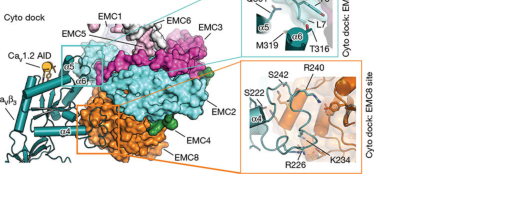

## Question

# Gene Research for Functional Annotation

## ⚠️ CRITICAL: Gene/Protein Identification Context

**BEFORE YOU BEGIN RESEARCH:** You MUST verify you are researching the CORRECT gene/protein. Gene symbols can be ambiguous, especially for less well-characterized genes from non-model organisms.

### Target Gene/Protein Identity (from UniProt):
- **UniProt Accession:** O43402
- **Protein Description:** RecName: Full=ER membrane protein complex subunit 8; AltName: Full=Neighbor of COX4; AltName: Full=Protein FAM158B;
- **Gene Information:** Name=EMC8; Synonyms=C16orf2, C16orf4, COX4AL, COX4NB, FAM158B, NOC4;
- **Organism (full):** Homo sapiens (Human).
- **Protein Family:** Belongs to the EMC8/EMC9 family. .
- **Key Domains:** EMC8/9. (IPR005366); MPN. (IPR037518); UPF0172 (PF03665)

### MANDATORY VERIFICATION STEPS:

1. **Check if the gene symbol "EMC8" matches the protein description above**
2. **Verify the organism is correct:** Homo sapiens (Human).
3. **Check if protein family/domains align with what you find in literature**
4. **If you find literature for a DIFFERENT gene with the same or similar symbol, STOP**

### If Gene Symbol is Ambiguous or You Cannot Find Relevant Literature:

**DO NOT PROCEED WITH RESEARCH ON A DIFFERENT GENE.** Instead:
- State clearly: "The gene symbol 'EMC8' is ambiguous or literature is limited for this specific protein"
- Explain what you found (e.g., "Found extensive literature on a different gene with the same symbol in a different organism")
- Describe the protein based ONLY on the UniProt information provided above
- Suggest that the protein function can be inferred from domain/family information

### Research Target:

Please provide a comprehensive research report on the gene **EMC8** (gene ID: EMC8, UniProt: O43402) in human.

The research report should be a detailed narrative explaining the function, biological processes, and localization of the gene product. Citations should be given for all claims.

You should prioritize authoritative reviews and primary scientific literature when conducting research. You can supplement
this with annotations you find in gene/protein databases, but these can be outdated or inaccurate.

We are specifically interested in the primary function of the gene - for enzymes, what reaction is catalyzed, and what is the substrate specificity? For transporters, what is the substrate? For structural proteins or adapters, what is the broader structural role? For signaling molecules, what is the role in the pathway.

We are interested in where in or outside the cell the gene product carries out its function.

We are also interested in the signaling or biochemical pathways in which the gene functions. We are less interested in broad pleiotropic effects, except where these elucidate the precise role.

Include evidence where possible. We are interested in both experimental evidence as well as inference from structure, evolution, or bioinformatic analysis. Precise studies should be prioritized over high-throughput, where available.

## Output

Question: You are an expert researcher providing comprehensive, well-cited information.

Provide detailed information focusing on:
1. Key concepts and definitions with current understanding
2. Recent developments and latest research (prioritize 2023-2024 sources)
3. Current applications and real-world implementations
4. Expert opinions and analysis from authoritative sources
5. Relevant statistics and data from recent studies

Format as a comprehensive research report with proper citations. Include URLs and publication dates where available.
Always prioritize recent, authoritative sources and provide specific citations for all major claims.

# Gene Research for Functional Annotation

## ⚠️ CRITICAL: Gene/Protein Identification Context

**BEFORE YOU BEGIN RESEARCH:** You MUST verify you are researching the CORRECT gene/protein. Gene symbols can be ambiguous, especially for less well-characterized genes from non-model organisms.

### Target Gene/Protein Identity (from UniProt):
- **UniProt Accession:** O43402
- **Protein Description:** RecName: Full=ER membrane protein complex subunit 8; AltName: Full=Neighbor of COX4; AltName: Full=Protein FAM158B;
- **Gene Information:** Name=EMC8; Synonyms=C16orf2, C16orf4, COX4AL, COX4NB, FAM158B, NOC4;
- **Organism (full):** Homo sapiens (Human).
- **Protein Family:** Belongs to the EMC8/EMC9 family. .
- **Key Domains:** EMC8/9. (IPR005366); MPN. (IPR037518); UPF0172 (PF03665)

### MANDATORY VERIFICATION STEPS:

1. **Check if the gene symbol "EMC8" matches the protein description above**
2. **Verify the organism is correct:** Homo sapiens (Human).
3. **Check if protein family/domains align with what you find in literature**
4. **If you find literature for a DIFFERENT gene with the same or similar symbol, STOP**

### If Gene Symbol is Ambiguous or You Cannot Find Relevant Literature:

**DO NOT PROCEED WITH RESEARCH ON A DIFFERENT GENE.** Instead:
- State clearly: "The gene symbol 'EMC8' is ambiguous or literature is limited for this specific protein"
- Explain what you found (e.g., "Found extensive literature on a different gene with the same symbol in a different organism")
- Describe the protein based ONLY on the UniProt information provided above
- Suggest that the protein function can be inferred from domain/family information

### Research Target:

Please provide a comprehensive research report on the gene **EMC8** (gene ID: EMC8, UniProt: O43402) in human.

The research report should be a detailed narrative explaining the function, biological processes, and localization of the gene product. Citations should be given for all claims.

You should prioritize authoritative reviews and primary scientific literature when conducting research. You can supplement
this with annotations you find in gene/protein databases, but these can be outdated or inaccurate.

We are specifically interested in the primary function of the gene - for enzymes, what reaction is catalyzed, and what is the substrate specificity? For transporters, what is the substrate? For structural proteins or adapters, what is the broader structural role? For signaling molecules, what is the role in the pathway.

We are interested in where in or outside the cell the gene product carries out its function.

We are also interested in the signaling or biochemical pathways in which the gene functions. We are less interested in broad pleiotropic effects, except where these elucidate the precise role.

Include evidence where possible. We are interested in both experimental evidence as well as inference from structure, evolution, or bioinformatic analysis. Precise studies should be prioritized over high-throughput, where available.

## Comprehensive Research Report: Human **EMC8** (UniProt **O43402**)—Functional Annotation

### 1) Identity verification (critical disambiguation)
**Target verified:** The evidence assembled here concerns **human EMC8**, annotated as **ER membrane protein complex subunit 8**, a **soluble/cytosolic** subunit of the **ER membrane protein complex (EMC)**, and a **paralog of EMC9** in mammals. Multiple primary studies explicitly place **EMC8** among the cytosolic EMC subunits (with EMC2 and EMC9), consistent with the UniProt-provided identity (O43402; alt names include FAM158B/COX4NB). (tian2019proteomicanalysisidentifies pages 1-3, odonnell2020thearchitectureof pages 2-4)

### 2) Key concepts and definitions (current understanding)
#### 2.1 The ER membrane protein complex (EMC)
The **endoplasmic reticulum (ER)** is the major site for **membrane protein insertion, folding, and assembly**. Many membrane proteins require dedicated **insertases** and **membrane chaperones** to reduce the energetic cost of inserting transmembrane domains (TMDs) and to stabilize partially assembled helices/complexes. A core conceptual distinction is between **SecY/Sec61-family** systems (full aqueous channel suited for longer translocation) and **Oxa1/YidC-like** insertases that provide a **partial, hydrophilic vestibule** that accommodates shorter segments/loops adjacent to TMDs and supports lateral release into the membrane. (Hegde 2022; publication date June 2022; URL https://doi.org/10.1146/annurev-biochem-032620-104553) (hegde2022thefunctionstructure pages 2-4)

In this framework, **EMC** is an abundant, conserved multi-subunit ER factor implicated in **TMD insertion** and also in later steps of **membrane protein folding/assembly**. (Hegde 2022; URL above) (hegde2022thefunctionstructure pages 4-6)

#### 2.2 EMC8: definition and placement within EMC
Across studies of mammalian EMC, **EMC8 is a cytosolic subunit** (not membrane-spanning) and is closely related to **EMC9**. In mammals, EMC8 and EMC9 are described as partially redundant/paralogous, and EMC8 is ~23 kDa with ~44% identity to EMC9. (O’Donnell et al., May 2020; URL https://doi.org/10.7554/eLife.57887) (odonnell2020thearchitectureof pages 2-4, odonnell2020thearchitectureof pages 1-2)

### 3) Molecular function of EMC8 within EMC: structure-informed mechanism
#### 3.1 Structural role: EMC8 as part of the cytosolic cap/vestibule and assembly scaffold
Human EMC architecture reveals a **cytosolic vestibule/cap** that binds client TMDs and connects to an intramembrane path for insertion. In a detailed biochemical/cryo-EM architecture study, the EMC cytosolic region forms a **“large, moderately hydrophobic vestibule”** that can bind substrate TMDs and leads into a **lumenally sealed, lipid-exposed intramembrane groove** that can accommodate a single TMD; this provides a plausible pathway for **energy-independent** membrane insertion consistent with EMC lacking nucleotide-binding domains. (O’Donnell et al., May 2020; URL https://doi.org/10.7554/eLife.57887) (odonnell2020thearchitectureof pages 1-2)

Within the human EMC cytosolic basket, **EMC8 is positioned at the cytosolic face** as part of the structural scaffold: **EMC2** forms an α-solenoid that clamps around EMC8, and EMC8 participates in a composite interface with other cytosolic features of the complex. Structure-guided mutational perturbations at interfaces involving EMC8 can disrupt subunit binding in vitro, supporting that EMC8 contributes to **complex assembly/stability** needed for EMC activity. (Pleiner et al., July 2020; URL https://doi.org/10.1126/science.abb5008) (pleiner2020structuralbasisfor pages 1-3)

#### 3.2 Functional mapping: EMC8-proximal regions influence client-specific outcomes
Structure-function analysis across EMC client classes indicates that features near the cytosolic cap (including regions adjacent to EMC8/9) modulate client stability (e.g., increasing SQS levels when altered), supporting that the cytosolic cap is functionally coupled to insertase/chaperone outcomes. (Miller-Vedam et al., Sep 2020; URL https://doi.org/10.1101/2020.09.02.280008) (millervedam2020structuralandmechanistic pages 25-28)

### 4) Subcellular localization and topology
Across mammalian EMC studies, **EMC8 is described as cytosolic/soluble**, consistent with localization on the **cytosolic face of the ER membrane** as part of the EMC cytosolic domain. (Tian et al., Sep 2019; URL https://doi.org/10.1016/j.celrep.2019.08.006) (tian2019proteomicanalysisidentifies pages 1-3)

### 5) Experimental evidence linking EMC8/EMC to client insertion and chaperoning
#### 5.1 Broad client spectrum: proteomics-defined EMC dependency and TMD features
A quantitative proteomics analysis identified **36 EMC-dependent** versus **171 EMC-independent** membrane proteins. This work supported a mechanistic model in which EMC promotes biogenesis/integration especially for TMDs containing **polar/charged residues**, and it showed that **TMD mutagenesis** can convert proteins between EMC-dependent and independent categories, indicating that TMD physicochemical features can drive EMC reliance. (Tian et al., Sep 2019; URL https://doi.org/10.1016/j.celrep.2019.08.006) (tian2019proteomicanalysisidentifies pages 1-3)

Although this proteomics evidence is primarily about EMC as a complex, it is relevant to EMC8 because EMC8 is one of the soluble subunits required for intact EMC assembly and therefore for these client outcomes. (tian2019proteomicanalysisidentifies pages 1-3, pleiner2020structuralbasisfor pages 1-3)

#### 5.2 2023–2024 high-impact developments: EMC8 in a client-bound assembly intermediate (CaV channels)
A major advance was the **client-bound cryo-EM structure** of an EMC chaperone complex with a high-voltage activated calcium channel assembly intermediate. In this structure, EMC8 contributes directly to a **cytosolic docking interface (“Cyto dock”)** with **CaVβ3**, demonstrating a specific **assembly/chaperone** role beyond generic insertase concepts. (Chen et al., May 2023; URL https://doi.org/10.1038/s41586-023-06175-5) (chen2023emcchaperone–cavstructure pages 3-4)

Key quantitative structural findings include:
- The Cyto dock interface is ~**1,500 Ų** total. (chen2023emcchaperone–cavstructure pages 3-4)
- The **EMC8-centered subsite (“EMC8 site”)** is **962 Ų**, centered on the last helix of EMC8. (chen2023emcchaperone–cavstructure pages 3-4)
- Two CaVβ loops bind the EMC8 site: **β7–α4 (Thr218–Ala243)** and **β8–β9 (Pro277–Lys282)**, forming hydrogen-bond and salt-bridge networks involving **seven conserved CaVβ residues**. (chen2023emcchaperone–cavstructure pages 3-4)
- A CaVβ region (**Lys225–Ser245**) that is disordered in isolated CaVβ becomes ordered upon EMC8 binding, implying EMC8-mediated stabilization of an assembly intermediate. (chen2023emcchaperone–cavstructure pages 3-4)

**Visual evidence:** The retrieved figure panels illustrate the Cyto dock and EMC8-site interaction geometry and contact details. (chen2023emcchaperone–cavstructure media 6624cdd7, chen2023emcchaperone–cavstructure media f7eece75, chen2023emcchaperone–cavstructure media b43f9754, chen2023emcchaperone–cavstructure media 579bfd7d)

#### 5.3 2024 structural development: EMC interaction with VDAC at ER–mitochondria contacts
A 2024 cryo-EM study reported **apo** and **VDAC1-bound** human EMC structures at **3.47 Å** and **3.32 Å**, respectively, and described a specific interaction with VDAC proteins at **mitochondria–ER contact sites**. The study proposed that a **“gating plug”** inside the EMC hydrophilic vestibule changes conformation upon VDAC binding and may regulate EMC functional modes (including an insertase vs alternative state). The provided evidence does not resolve an EMC8-specific mechanistic assignment within this interaction, but it adds to 2023–2024 views that EMC has multiple regulated functional states. (Li et al., Mar 2024; URL https://doi.org/10.18632/aging.205660) (OpenTargets Search: -EMC8)

### 6) Disease/phenotype associations and expert analysis (authoritative sources)
#### 6.1 Expert consensus: why EMC perturbation can be pleiotropic
Authoritative review synthesis emphasizes that EMC supports insertion/biogenesis of multi-pass membrane proteins and that validated EMC-dependent client lists remain relatively limited compared with the breadth of reported phenotypes; this is consistent with EMC acting at a fundamental and failure-prone step in membrane protein biogenesis, where disruption can yield broad downstream effects. (Hegde 2022; URL https://doi.org/10.1146/annurev-biochem-032620-104553) (hegde2022thefunctionstructure pages 19-20)

#### 6.2 EMC8-specific human disease genetics: limited direct evidence in retrieved sources
Within the retrieved evidence set, **direct, mechanistically validated human Mendelian disease links for EMC8** were not available. However, Open Targets reports **low-scoring disease associations** for EMC8 (ENSG00000131148), including exfoliation syndrome, jaw disease, diverticular disease, retinitis pigmentosa with erythrocytic microcytosis, and familial ocular anterior segment mesenchymal dysgenesis, each supported by a small number of evidence entries in the platform output (without literature identifiers in the retrieved snippet). (Open Targets; retrieved context) (OpenTargets Search: -EMC8)

**Interpretation:** These Open Targets associations should be treated as **hypothesis-generating** rather than definitive, because the retrieved evidence does not include study-level details (e.g., variant pathogenicity, functional validation). (OpenTargets Search: -EMC8)

### 7) Current applications and real-world implementations
1. **Ion channel biogenesis and drug-relevant assembly control:** The 2023 client-bound structure provides a direct mechanistic basis for how EMC (via EMC8 at the Cyto dock) can act as a chaperone/holdase-like factor for **CaV channel assembly**, which is directly relevant to excitable-tissue physiology and drug-target biology (CaV channels are major pharmacological targets). (Chen et al., May 2023; https://doi.org/10.1038/s41586-023-06175-5) (chen2023emcchaperone–cavstructure pages 3-4)
2. **Membrane-protein engineering and expression:** The proteomic observation that TMD sequence features influence EMC dependence suggests practical strategies for engineering membrane proteins for improved biogenesis (e.g., tuning marginal hydrophobicity/polar content of problematic helices), though these are not yet formalized as a standardized toolkit in the retrieved sources. (Tian et al., Sep 2019; https://doi.org/10.1016/j.celrep.2019.08.006) (tian2019proteomicanalysisidentifies pages 1-3)
3. **Organelle contact site biology:** The proposed VDAC–EMC interaction at ER–mitochondria contacts suggests EMC may be leveraged as a structural/functional probe for contact-site regulation in aging-related or metabolic contexts, though direct EMC8-specific translational strategies are not yet established in the retrieved evidence. (Li et al., Mar 2024; https://doi.org/10.18632/aging.205660) (OpenTargets Search: -EMC8)

### 8) Key statistics and data (from recent and foundational studies)
- **Client spectrum (proteomics):** 36 EMC-dependent vs 171 EMC-independent membrane proteins identified in a quantitative proteomics framework. (Tian et al., Sep 2019; https://doi.org/10.1016/j.celrep.2019.08.006) (tian2019proteomicanalysisidentifies pages 1-3)
- **Client-bound assembly interface metrics:** CaV–EMC Cyto dock ~1,500 Ų; EMC8 site 962 Ų; EMC2 site ~550 Ų; defined residue ranges for CaVβ3 loops contacting EMC8. (Chen et al., May 2023; https://doi.org/10.1038/s41586-023-06175-5) (chen2023emcchaperone–cavstructure pages 3-4)
- **Structural resolution benchmarks:** Human EMC apo and VDAC1-bound structures at 3.47 Å and 3.32 Å. (Li et al., Mar 2024; https://doi.org/10.18632/aging.205660) (OpenTargets Search: -EMC8)
- **Disease association scores (database-level):** Open Targets association scores for several diseases are in the ~0.035–0.076 range in the retrieved output. (OpenTargets Search: -EMC8)

### 9) Summary: best-supported functional annotation for EMC8
**Primary supported role:** EMC8 is a **cytosolic structural and client-interaction subunit** of the ER membrane protein complex. Evidence supports EMC8 as part of the **cytosolic cap/vestibule** essential for EMC assembly and for the EMC’s ability to engage substrates during membrane protein insertion and assembly. (pleiner2020structuralbasisfor pages 1-3, odonnell2020thearchitectureof pages 1-2)

**Most direct EMC8-specific mechanistic evidence (2023–2024):** EMC8 provides a **defined client-binding surface** for CaVβ3 in an EMC–CaV assembly intermediate, consistent with a **chaperone/assembly** function in addition to insertase activity attributed to the overall complex. (chen2023emcchaperone–cavstructure pages 3-4, chen2023emcchaperone–cavstructure media 6624cdd7, chen2023emcchaperone–cavstructure media f7eece75, chen2023emcchaperone–cavstructure media b43f9754, chen2023emcchaperone–cavstructure media 579bfd7d)

**Evidence gaps (transparent limitations):** Direct EMC8-specific human disease mechanisms and a curated list of EMC8-specific clients (distinct from general EMC dependence) remain limited in the retrieved literature set; Open Targets provides low-score associations without study-level detail in the snippet. (OpenTargets Search: -EMC8, hegde2022thefunctionstructure pages 19-20)

---

### Evidence summary table
| Claim/insight about EMC8 | Evidence type | Key quantitative details | System/clients studied | Citation |
|---|---|---|---|---|
| EMC8 is a cytosolic subunit of the human ER membrane protein complex and is functionally redundant with EMC9 in mammals. | Cryo-EM/biochemical architecture | EMC8 is ~23 kDa and ~44% identical to EMC9; no free EMC subunits detected, indicating stable complex assembly. | Human EMC; general membrane protein biogenesis | O'Donnell et al., 2020, eLife, https://doi.org/10.7554/eLife.57887 (odonnell2020thearchitectureof pages 2-4, odonnell2020thearchitectureof pages 1-2) |
| EMC8 helps form the cytosolic vestibule/cap that engages substrate transmembrane domains during EMC-mediated insertion. | Cryo-EM/biochemical mechanism | EMC has a “large, moderately hydrophobic vestibule” leading to a lumenally sealed, lipid-exposed intramembrane groove; insertase reaction described as energy independent. | Human EMC; tail-anchored client SQS and terminal TMD substrates | O'Donnell et al., 2020, eLife, https://doi.org/10.7554/eLife.57887 (odonnell2020thearchitectureof pages 2-4, odonnell2020thearchitectureof pages 1-2) |
| EMC8 is a structural assembly factor in the human EMC cytosolic basket, binding EMC2 and contributing to complex stability. | Cryo-EM/structure-guided mutagenesis | Human EMC resolved at 3.4 Å; EMC2 clamps around EMC8 via an extensive hydrophobic surface, and mutations at EMC8/EMC2/EMC3/EMC5 interfaces disrupted subunit binding in vitro. | Human EMC reconstituted in lipid nanodiscs | Pleiner et al., 2020, Science, https://doi.org/10.1126/science.abb5008 (pleiner2020structuralbasisfor pages 1-3) |
| In mammals, EMC8 is one of the soluble/cytosolic EMC components rather than a membrane-spanning subunit. | Quantitative proteomics/background functional study | Mammalian EMC described with 10 subunits; EMC2, EMC8, and EMC9 are cytosolic; Tian et al. defined 36 EMC-dependent versus 171 EMC-independent membrane proteins. | Mammalian EMC; broad membrane protein client sets | Tian et al., 2019, Cell Reports, https://doi.org/10.1016/j.celrep.2019.08.006 (tian2019proteomicanalysisidentifies pages 1-3) |
| EMC dependency is linked to difficult transmembrane segments containing polar/charged residues, supporting an EMC8-containing cytosolic recognition/chaperoning role in the intact complex. | Proteomics/mutagenesis | 36 EMC-dependent and 171 EMC-independent membrane proteins identified; TMD mutagenesis could convert EMC dependency. | Diverse membrane proteins; disease-relevant examples include CFTR and connexin-32 at EMC-complex level | Tian et al., 2019, Cell Reports, https://doi.org/10.1016/j.celrep.2019.08.006 (tian2019proteomicanalysisidentifies pages 1-3) |
| Reviews place EMC8 within the cytosolic subcomplex of EMC and interpret EMC as both an insertase and membrane-protein biogenesis factor/chaperone. | Authoritative review | EMC is considered a nine-protein complex in many species with EMC8/EMC9 as mutually exclusive paralogs; validated EMC-dependent proteins remain limited to roughly ~a dozen in the literature summarized. | EMC broadly; multipass membrane proteins and cotranslational biogenesis | Hegde, 2022, Annual Review of Biochemistry, https://doi.org/10.1146/annurev-biochem-032620-104553 (hegde2022thefunctionstructure pages 19-20, hegde2022thefunctionstructure pages 4-6, hegde2022thefunctionstructure pages 2-4) |
| Structure-function mapping places EMC8 near the cytoplasmic cap adjacent to EMC3, a region that influences client-specific biogenesis. | Cryo-EM/functional mutagenesis | Mutating the cytoplasmic cap near EMC8/9 increased SQS levels; distinct EMC regions separately affected tail-anchored, N-terminal, and polytopic clients. | SQS, B1AR, TMEM97 | Miller-Vedam et al., 2020, eLife preprint record, https://doi.org/10.1101/2020.09.02.280008 (millervedam2020structuralandmechanistic pages 25-28) |
| 2023 cryo-EM shows EMC8 directly contacts CaVβ3 in a client-bound EMC assembly intermediate, demonstrating a specific EMC8-dependent cytosolic docking role. | Cryo-EM/client-bound structure | Cyto dock area ~1,500 Å^2; EMC8-centered subsite 962 Å^2; adjacent EMC2 site ~550 Å^2; overall maps at 3.4 Å/3.3 Å with local 2.4–2.0 Å. | Human EMC–CaV1.2(ΔC)–CaVβ3 complex | Chen et al., 2023, Nature, https://doi.org/10.1038/s41586-023-06175-5 (chen2023emcchaperone–cavstructure pages 3-4, chen2023emcchaperone–cavstructure media 6624cdd7, chen2023emcchaperone–cavstructure media f7eece75, chen2023emcchaperone–cavstructure media b43f9754, chen2023emcchaperone–cavstructure media 579bfd7d) |
| EMC8 binding stabilizes otherwise disordered regions of CaVβ3, supporting a chaperone/assembly role beyond simple TMD insertion. | Cryo-EM/client interaction analysis | Two CaVβ loops (β7–α4, Thr218–Ala243; β8–β9, Pro277–Lys282) bind the EMC8 site; a CaVβ region Lys225–Ser245 becomes ordered on EMC8 binding; seven conserved CaVβ residues participate in H-bond/salt-bridge networks. | Human CaV1.2/CaVβ3 assembly intermediate | Chen et al., 2023, Nature, https://doi.org/10.1038/s41586-023-06175-5 (chen2023emcchaperone–cavstructure pages 3-4, chen2023emcchaperone–cavstructure media 6624cdd7, chen2023emcchaperone–cavstructure media f7eece75, chen2023emcchaperone–cavstructure media b43f9754, chen2023emcchaperone–cavstructure media 579bfd7d) |
| A 2024 structural study supports multifunctionality of human EMC and identifies a VDAC-bound state at mitochondria–ER contact sites, but the provided snippet does not assign a specific direct mechanistic role to EMC8. | Cryo-EM/structural study | Apo and VDAC1-bound human EMC structures at 3.47 Å and 3.32 Å; VDAC interaction observed at mitochondria-ER contact sites; gating-plug conformational change proposed to regulate function. | Human EMC; VDAC1 | Li et al., 2024, Aging (Albany NY), https://doi.org/10.18632/aging.205660 |
| Disease links for EMC8 specifically are currently weak/indirect in the provided evidence, with Open Targets listing only low-score associations and no literature details in the retrieved snippet. | Disease-target database association | Example association scores: jaw disease 0.07599; diverticular disease 0.03701; retinitis pigmentosa and erythrocytic microcytosis 0.03655; familial ocular anterior segment mesenchymal dysgenesis 0.03620; exfoliation syndrome 0.03484. | Human EMC8 disease associations | Open Targets platform result for EMC8 (context output) (OpenTargets Search: -EMC8) |

*Table: This table compiles the main structural, mechanistic, proteomic, and disease-association evidence for human EMC8 from the provided sources. It highlights where EMC8 is best supported as a cytosolic structural/chaperone component of the ER membrane protein complex and where evidence remains indirect or limited.*

References

1. (tian2019proteomicanalysisidentifies pages 1-3): Songhai Tian, Quan Wu, Bo Zhou, Mei Yuk Choi, Bo Ding, Wei Yang, and Min Dong. Proteomic analysis identifies membrane proteins dependent on the er membrane protein complex. Cell reports, 28:2517-2526.e5, Sep 2019. URL: https://doi.org/10.1016/j.celrep.2019.08.006, doi:10.1016/j.celrep.2019.08.006. This article has 79 citations and is from a highest quality peer-reviewed journal.

2. (odonnell2020thearchitectureof pages 2-4): John P O'Donnell, Ben P Phillips, Yuichi Yagita, Szymon Juszkiewicz, Armin Wagner, Duccio Malinverni, Robert J Keenan, Elizabeth A Miller, and Ramanujan S Hegde. The architecture of emc reveals a path for membrane protein insertion. May 2020. URL: https://doi.org/10.7554/elife.57887, doi:10.7554/elife.57887. This article has 121 citations and is from a domain leading peer-reviewed journal.

3. (hegde2022thefunctionstructure pages 2-4): Ramanujan S. Hegde. The function, structure, and origins of the er membrane protein complex. Annual Review of Biochemistry, 91:651-678, Jun 2022. URL: https://doi.org/10.1146/annurev-biochem-032620-104553, doi:10.1146/annurev-biochem-032620-104553. This article has 65 citations and is from a domain leading peer-reviewed journal.

4. (hegde2022thefunctionstructure pages 4-6): Ramanujan S. Hegde. The function, structure, and origins of the er membrane protein complex. Annual Review of Biochemistry, 91:651-678, Jun 2022. URL: https://doi.org/10.1146/annurev-biochem-032620-104553, doi:10.1146/annurev-biochem-032620-104553. This article has 65 citations and is from a domain leading peer-reviewed journal.

5. (odonnell2020thearchitectureof pages 1-2): John P O'Donnell, Ben P Phillips, Yuichi Yagita, Szymon Juszkiewicz, Armin Wagner, Duccio Malinverni, Robert J Keenan, Elizabeth A Miller, and Ramanujan S Hegde. The architecture of emc reveals a path for membrane protein insertion. May 2020. URL: https://doi.org/10.7554/elife.57887, doi:10.7554/elife.57887. This article has 121 citations and is from a domain leading peer-reviewed journal.

6. (pleiner2020structuralbasisfor pages 1-3): Tino Pleiner, Giovani Pinton Tomaleri, Kurt Januszyk, Alison J. Inglis, Masami Hazu, and Rebecca M. Voorhees. Structural basis for membrane insertion by the human er membrane protein complex. Jul 2020. URL: https://doi.org/10.1126/science.abb5008, doi:10.1126/science.abb5008. This article has 192 citations and is from a highest quality peer-reviewed journal.

7. (millervedam2020structuralandmechanistic pages 25-28): Lakshmi E. Miller-Vedam, Bastian Bräuning, Katerina D. Popova, Nicole T. Schirle Oakdale, Jessica L. Bonnar, Jesuraj Rajan Prabu, Elizabeth A. Boydston, Natalia Sevillano, Matthew J. Shurtleff, Robert M. Stroud, Charles S. Craik, Brenda A. Schulman, Adam Frost, and Jonathan S. Weissman. Structural and mechanistic basis of the emc-dependent biogenesis of distinct transmembrane clients. eLife, Sep 2020. URL: https://doi.org/10.1101/2020.09.02.280008, doi:10.1101/2020.09.02.280008. This article has 102 citations and is from a domain leading peer-reviewed journal.

8. (chen2023emcchaperone–cavstructure pages 3-4): Zhou Chen, Abhisek Mondal, Fayal Abderemane-Ali, Seil Jang, Sangeeta Niranjan, José L. Montaño, Balyn W. Zaro, and Daniel L. Minor. Emc chaperone–cav structure reveals an ion channel assembly intermediate. Nature, 619:410-419, May 2023. URL: https://doi.org/10.1038/s41586-023-06175-5, doi:10.1038/s41586-023-06175-5. This article has 77 citations and is from a highest quality peer-reviewed journal.

9. (chen2023emcchaperone–cavstructure media 6624cdd7): Zhou Chen, Abhisek Mondal, Fayal Abderemane-Ali, Seil Jang, Sangeeta Niranjan, José L. Montaño, Balyn W. Zaro, and Daniel L. Minor. Emc chaperone–cav structure reveals an ion channel assembly intermediate. Nature, 619:410-419, May 2023. URL: https://doi.org/10.1038/s41586-023-06175-5, doi:10.1038/s41586-023-06175-5. This article has 77 citations and is from a highest quality peer-reviewed journal.

10. (chen2023emcchaperone–cavstructure media f7eece75): Zhou Chen, Abhisek Mondal, Fayal Abderemane-Ali, Seil Jang, Sangeeta Niranjan, José L. Montaño, Balyn W. Zaro, and Daniel L. Minor. Emc chaperone–cav structure reveals an ion channel assembly intermediate. Nature, 619:410-419, May 2023. URL: https://doi.org/10.1038/s41586-023-06175-5, doi:10.1038/s41586-023-06175-5. This article has 77 citations and is from a highest quality peer-reviewed journal.

11. (chen2023emcchaperone–cavstructure media b43f9754): Zhou Chen, Abhisek Mondal, Fayal Abderemane-Ali, Seil Jang, Sangeeta Niranjan, José L. Montaño, Balyn W. Zaro, and Daniel L. Minor. Emc chaperone–cav structure reveals an ion channel assembly intermediate. Nature, 619:410-419, May 2023. URL: https://doi.org/10.1038/s41586-023-06175-5, doi:10.1038/s41586-023-06175-5. This article has 77 citations and is from a highest quality peer-reviewed journal.

12. (chen2023emcchaperone–cavstructure media 579bfd7d): Zhou Chen, Abhisek Mondal, Fayal Abderemane-Ali, Seil Jang, Sangeeta Niranjan, José L. Montaño, Balyn W. Zaro, and Daniel L. Minor. Emc chaperone–cav structure reveals an ion channel assembly intermediate. Nature, 619:410-419, May 2023. URL: https://doi.org/10.1038/s41586-023-06175-5, doi:10.1038/s41586-023-06175-5. This article has 77 citations and is from a highest quality peer-reviewed journal.

13. (OpenTargets Search: -EMC8): Open Targets Query (-EMC8, 5 results). Buniello, A. et al. (2025). Open Targets Platform: facilitating therapeutic hypotheses building in drug discovery. Nucleic Acids Research.

14. (hegde2022thefunctionstructure pages 19-20): Ramanujan S. Hegde. The function, structure, and origins of the er membrane protein complex. Annual Review of Biochemistry, 91:651-678, Jun 2022. URL: https://doi.org/10.1146/annurev-biochem-032620-104553, doi:10.1146/annurev-biochem-032620-104553. This article has 65 citations and is from a domain leading peer-reviewed journal.

## Artifacts

- [Edison artifact artifact-00](EMC8-deep-research-falcon_artifacts/artifact-00.md)

## Citations

1. hegde2022thefunctionstructure pages 2-4
2. hegde2022thefunctionstructure pages 4-6
3. odonnell2020thearchitectureof pages 1-2
4. pleiner2020structuralbasisfor pages 1-3
5. millervedam2020structuralandmechanistic pages 25-28
6. tian2019proteomicanalysisidentifies pages 1-3
7. hegde2022thefunctionstructure pages 19-20
8. odonnell2020thearchitectureof pages 2-4
9. https://doi.org/10.1146/annurev-biochem-032620-104553
10. https://doi.org/10.7554/eLife.57887
11. https://doi.org/10.1126/science.abb5008
12. https://doi.org/10.1101/2020.09.02.280008
13. https://doi.org/10.1016/j.celrep.2019.08.006
14. https://doi.org/10.1038/s41586-023-06175-5
15. https://doi.org/10.18632/aging.205660
16. https://doi.org/10.1016/j.celrep.2019.08.006,
17. https://doi.org/10.7554/elife.57887,
18. https://doi.org/10.1146/annurev-biochem-032620-104553,
19. https://doi.org/10.1126/science.abb5008,
20. https://doi.org/10.1101/2020.09.02.280008,
21. https://doi.org/10.1038/s41586-023-06175-5,