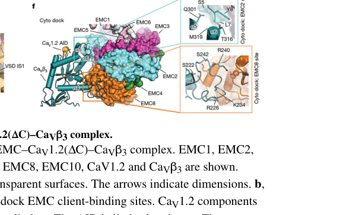

## Question

# Gene Research for Functional Annotation

## ⚠️ CRITICAL: Gene/Protein Identification Context

**BEFORE YOU BEGIN RESEARCH:** You MUST verify you are researching the CORRECT gene/protein. Gene symbols can be ambiguous, especially for less well-characterized genes from non-model organisms.

### Target Gene/Protein Identity (from UniProt):
- **UniProt Accession:** Q9Y3B6
- **Protein Description:** RecName: Full=ER membrane protein complex subunit 9; AltName: Full=Protein FAM158A;
- **Gene Information:** Name=EMC9; Synonyms=C14orf122, FAM158A; ORFNames=CGI-112;
- **Organism (full):** Homo sapiens (Human).
- **Protein Family:** Belongs to the EMC8/EMC9 family. .
- **Key Domains:** EMC8/9. (IPR005366); MPN. (IPR037518); UPF0172 (PF03665)

### MANDATORY VERIFICATION STEPS:

1. **Check if the gene symbol "EMC9" matches the protein description above**
2. **Verify the organism is correct:** Homo sapiens (Human).
3. **Check if protein family/domains align with what you find in literature**
4. **If you find literature for a DIFFERENT gene with the same or similar symbol, STOP**

### If Gene Symbol is Ambiguous or You Cannot Find Relevant Literature:

**DO NOT PROCEED WITH RESEARCH ON A DIFFERENT GENE.** Instead:
- State clearly: "The gene symbol 'EMC9' is ambiguous or literature is limited for this specific protein"
- Explain what you found (e.g., "Found extensive literature on a different gene with the same symbol in a different organism")
- Describe the protein based ONLY on the UniProt information provided above
- Suggest that the protein function can be inferred from domain/family information

### Research Target:

Please provide a comprehensive research report on the gene **EMC9** (gene ID: EMC9, UniProt: Q9Y3B6) in human.

The research report should be a detailed narrative explaining the function, biological processes, and localization of the gene product. Citations should be given for all claims.

You should prioritize authoritative reviews and primary scientific literature when conducting research. You can supplement
this with annotations you find in gene/protein databases, but these can be outdated or inaccurate.

We are specifically interested in the primary function of the gene - for enzymes, what reaction is catalyzed, and what is the substrate specificity? For transporters, what is the substrate? For structural proteins or adapters, what is the broader structural role? For signaling molecules, what is the role in the pathway.

We are interested in where in or outside the cell the gene product carries out its function.

We are also interested in the signaling or biochemical pathways in which the gene functions. We are less interested in broad pleiotropic effects, except where these elucidate the precise role.

Include evidence where possible. We are interested in both experimental evidence as well as inference from structure, evolution, or bioinformatic analysis. Precise studies should be prioritized over high-throughput, where available.

## Output

Question: You are an expert researcher providing comprehensive, well-cited information.

Provide detailed information focusing on:
1. Key concepts and definitions with current understanding
2. Recent developments and latest research (prioritize 2023-2024 sources)
3. Current applications and real-world implementations
4. Expert opinions and analysis from authoritative sources
5. Relevant statistics and data from recent studies

Format as a comprehensive research report with proper citations. Include URLs and publication dates where available.
Always prioritize recent, authoritative sources and provide specific citations for all major claims.

# Gene Research for Functional Annotation

## ⚠️ CRITICAL: Gene/Protein Identification Context

**BEFORE YOU BEGIN RESEARCH:** You MUST verify you are researching the CORRECT gene/protein. Gene symbols can be ambiguous, especially for less well-characterized genes from non-model organisms.

### Target Gene/Protein Identity (from UniProt):
- **UniProt Accession:** Q9Y3B6
- **Protein Description:** RecName: Full=ER membrane protein complex subunit 9; AltName: Full=Protein FAM158A;
- **Gene Information:** Name=EMC9; Synonyms=C14orf122, FAM158A; ORFNames=CGI-112;
- **Organism (full):** Homo sapiens (Human).
- **Protein Family:** Belongs to the EMC8/EMC9 family. .
- **Key Domains:** EMC8/9. (IPR005366); MPN. (IPR037518); UPF0172 (PF03665)

### MANDATORY VERIFICATION STEPS:

1. **Check if the gene symbol "EMC9" matches the protein description above**
2. **Verify the organism is correct:** Homo sapiens (Human).
3. **Check if protein family/domains align with what you find in literature**
4. **If you find literature for a DIFFERENT gene with the same or similar symbol, STOP**

### If Gene Symbol is Ambiguous or You Cannot Find Relevant Literature:

**DO NOT PROCEED WITH RESEARCH ON A DIFFERENT GENE.** Instead:
- State clearly: "The gene symbol 'EMC9' is ambiguous or literature is limited for this specific protein"
- Explain what you found (e.g., "Found extensive literature on a different gene with the same symbol in a different organism")
- Describe the protein based ONLY on the UniProt information provided above
- Suggest that the protein function can be inferred from domain/family information

### Research Target:

Please provide a comprehensive research report on the gene **EMC9** (gene ID: EMC9, UniProt: Q9Y3B6) in human.

The research report should be a detailed narrative explaining the function, biological processes, and localization of the gene product. Citations should be given for all claims.

You should prioritize authoritative reviews and primary scientific literature when conducting research. You can supplement
this with annotations you find in gene/protein databases, but these can be outdated or inaccurate.

We are specifically interested in the primary function of the gene - for enzymes, what reaction is catalyzed, and what is the substrate specificity? For transporters, what is the substrate? For structural proteins or adapters, what is the broader structural role? For signaling molecules, what is the role in the pathway.

We are interested in where in or outside the cell the gene product carries out its function.

We are also interested in the signaling or biochemical pathways in which the gene functions. We are less interested in broad pleiotropic effects, except where these elucidate the precise role.

Include evidence where possible. We are interested in both experimental evidence as well as inference from structure, evolution, or bioinformatic analysis. Precise studies should be prioritized over high-throughput, where available.

## Comprehensive functional annotation research report: Human **EMC9** (UniProt Q9Y3B6)

### 0) Target verification (gene/protein identity)
The target is **human EMC9**, also referred to in the literature as **FAM158A**, and described as a **soluble/cytosolic subunit of the ER membrane protein complex (EMC)** that is **paralogous to EMC8** (~40–44% identity in mammals). This matches the UniProt-specified identity (Q9Y3B6) as “ER membrane protein complex subunit 9 / FAM158A” and places EMC9 in the **EMC8/EMC9 family** as a non-transmembrane, cytosol-facing EMC component. (chitwood2019theroleof pages 2-4, odonnell2020thearchitectureof pages 2-4, volkmar2020squaringtheemc pages 5-6)

### 1) Key concepts, definitions, and current understanding

#### 1.1 The ER membrane protein complex (EMC): what it is
The **ER membrane protein complex (EMC)** is an ER-resident multiprotein machine implicated in **membrane protein biogenesis**, particularly the insertion and maturation of **“difficult” transmembrane domains (TMDs)** that have **mixed hydrophobic/hydrophilic character** or otherwise suboptimal properties for canonical Sec61-mediated insertion. Reviews and primary work converge on the view that EMC acts as an **insertase** and, for some clients, as a **holdase/chaperone** during later folding/assembly steps. (volkmar2020squaringtheemc pages 2-3, stanton2026theermembrane pages 1-3, chen2023emcchaperone–cavstructure pages 1-3)

A key mechanistic model from structural work is that EMC provides a **cytosolic vestibule** that can bind a client TMD and guide it toward an **intramembrane groove** that is lipid-exposed, consistent with **energy-independent** TMD insertion for certain substrates. (odonnell2020thearchitectureof pages 1-2, odonnell2020thearchitectureof pages 8-10)

#### 1.2 Where EMC9 fits in EMC (subunit role and topology)
Across multiple sources, **EMC9 is consistently categorized as a soluble/cytosolic EMC subunit**, with **EMC2** and **EMC8** as the other cytosolic components, whereas many other EMC subunits are membrane-embedded. (volkmar2020squaringtheemc pages 5-6, tian2019proteomicanalysisidentifies pages 6-8)

A review of EMC architecture emphasizes that **EMC2/EMC8/EMC9 lack ER-targeting signals and transmembrane domains** and thus form part of the **cytoplasmic interface** of EMC. (volkmar2020squaringtheemc pages 5-6)

#### 1.3 EMC9 is not an enzyme/transporter; its “primary function” is structural/chaperone-like
No evidence in the retrieved primary literature supports EMC9 as a catalytic enzyme or transporter. Instead, EMC9’s primary molecular role is best described as a **structural and functional component of the EMC cytosolic module**, partnering with EMC2 to help form/shape the **client-binding vestibule** and participate in early steps of membrane-protein topogenesis. (odonnell2020thearchitectureof pages 2-4, odonnell2020thearchitectureof pages 8-10)

### 2) Molecular function and structural features of EMC9

#### 2.1 EMC9 as an EMC2-binding subunit in the cytosolic module
A central piece of direct, EMC9-specific biochemical evidence is that EMC9 forms a stable **1:1 complex with EMC2**. In O’Donnell et al. (eLife, 2020; published May 2020; https://doi.org/10.7554/eLife.57887), SEC-MALS showed **EMC2·EMC9** is a stable complex at the expected molecular weight (**~59 kDa**), supporting EMC9 as a bona fide EMC2 partner within the cytosolic domain. (odonnell2020thearchitectureof pages 2-4)

#### 2.2 EMC8 and EMC9: paralogs that appear mutually exclusive in binding EMC2
In the same study, **EMC8** was monomeric (**~23 kDa**) and **did not form a ternary complex** when added to preformed EMC2·EMC9, consistent with the idea that EMC8 and EMC9 are alternative, substitutable subunits in a shared “slot” of the cytosolic EMC module. (odonnell2020thearchitectureof pages 2-4)

This provides a mechanistic basis for why many papers refer to an **“EMC8/9”** position in human EMC. (chitwood2019theroleof pages 2-4, millervedam2020structuralandmechanistic pages 1-3)

#### 2.3 Placement of EMC2·EMC9 within EMC and access to substrate-binding cavity
Docking of EMC2·EMC9 into a 6.4 Å cryo-EM map of native EMC positioned the complex such that **EMC2’s TPR repeats are proximal to the membrane** and the **substrate-binding cavity/vestibule** has access to both bulk cytosol and the membrane domain, providing a plausible path for client TMD movement from cytosol into the membrane insertion groove. (odonnell2020thearchitectureof pages 8-10)

### 3) Subcellular localization
The data in this corpus support the conclusion that EMC9 is a **cytosolic/peripheral subunit associated with the ER-localized EMC**, rather than an independently membrane-integrated protein. This conclusion is based on consistent classification of EMC9 as **soluble/cytosolic** (in contrast to EMC subunits bearing transmembrane helices) and its role in forming the **cytoplasmic interface** of EMC with EMC2 and EMC8. (volkmar2020squaringtheemc pages 5-6, tian2019proteomicanalysisidentifies pages 6-8)

### 4) Biological processes and pathways influenced by EMC9 (via EMC)

#### 4.1 Membrane protein topogenesis and proteostasis
EMC broadly supports **membrane protein topogenesis** and **proteostasis** for a defined set of clients enriched for **polar/charged residues in TMDs**, which are features that tend to make TMD insertion challenging. Quantitative proteomics in EMC-deficient models identified **36 EMC-dependent** and **171 EMC-independent** transmembrane proteins (using stringent criteria) and reinforced the theme that EMC-dependent proteins contain at least one TMD with **polar and/or charged residues**. Although this study did not isolate EMC9-only perturbations, it is directly relevant to interpreting EMC9 function because EMC9 is part of the EMC client-handling module. (tian2019proteomicanalysisidentifies pages 6-8)

#### 4.2 WNT signaling as a downstream readout of EMC9-dependent transmembrane protein biogenesis (developmental context)
A key 2023 study argues that EMC9 dysfunction can manifest as impaired **WNT signaling** in vivo by destabilizing transmembrane receptors.

Marquez et al. (genesis, June 2023; https://doi.org/10.1002/dvg.23520) used CRISPR depletion of **emc9** in *Xenopus tropicalis* embryos and reported decreased levels of the **WNT receptor Fzd7** and a **marked reduction in nuclear β-catenin**, consistent with impaired WNT pathway output secondary to impaired transmembrane protein topogenesis. (marquez2023expandingemcfoldopathies pages 6-12)

### 5) Recent developments (prioritizing 2023–2024)

#### 5.1 2023: First structural view of an EMC–client complex; defines cytosolic client-binding interface
Chen et al. (Nature, published May 2023; PMID availability indicated by author manuscript; https://doi.org/10.1038/s41586-023-06175-5) reported cryo-EM structures of an ~**0.6 MDa** complex containing human **EMC bound to CaV1.2–CaVβ3**, and the fully assembled CaV1.2–CaVβ3–CaVα2δ-1 channel. Reported overall resolutions were **3.4 Å** (EMC–CaV complex) and **3.3 Å** (assembled channel). (chen2023emcchaperone–cavstructure pages 1-3)

This work identified two client interaction sites (“TM dock” and “Cyto dock”) and showed that **CaVβ binding at the Cyto dock involves EMC2 and EMC8 regions** (i.e., the cytosolic module closely related to where EMC9 sits in EMC2·EMC9 alternative complexes). This is a major mechanistic advance supporting the idea that the EMC cytosolic module can directly bind clients, beyond simply supporting membrane insertion. (chen2023emcchaperone–cavstructure pages 11-13)

**Visual evidence:** cropped figure panels from Chen et al. show the EMC architecture and Cyto dock with EMC2/EMC8 labeled. (chen2023emcchaperone–cavstructure media 4da9ffb7, chen2023emcchaperone–cavstructure media 384bfa4d)

#### 5.2 2023: Expansion of “EMC foldopathies” to include EMC9 variants and developmental phenotypes
Marquez et al. (genesis, June 2023; https://doi.org/10.1002/dvg.23520) compiled reported human variants and framed EMC subunit-associated congenital disorders as developmental **“foldopathies”** (diseases of protein folding/topogenesis). They report **mutations in EMC9 and EMC10 in 18 individuals from 10 families** with congenital anomalies (Table 1). (marquez2023expandingemcfoldopathies pages 6-12)

In *Xenopus*, emc9 depletion reduced neural crest marker expression (sox10) and produced craniofacial and neuromuscular phenotypes with defined sample sizes: **sox10 WISH n=60/condition over 3 replicates**, **craniofacial cartilage staining n=60/condition over 3 replicates**, and **motility and NMJ analyses n=30/group**. (marquez2023expandingemcfoldopathies pages 6-12)

#### 5.3 2024: Database curation lag for EMC9 disease association
Open Targets (accessed via tool output; https://platform.opentargets.org/target/ENSG00000100908) returned only a generic “genetic disorder” association row for EMC9 with **evidence score 0** and no evidence rows, indicating that curated target–disease evidence for EMC9 is currently sparse relative to emerging primary literature. (OpenTargets Search: All diseases-EMC9)

### 6) Current applications and real-world implementations

#### 6.1 Clinical genetics and diagnosis (congenital anomalies)
The clearest “real-world” use case in the current evidence set is **clinical genetics**: putatively damaging EMC9 variants have been observed in cohorts with congenital anomalies, summarized as **18 individuals from 10 families** in a 2023 synthesis, supporting EMC9 as a candidate gene in diagnostic interpretation of congenital heart disease, craniofacial dysmorphology, and neurodevelopmental phenotypes in relevant contexts. (marquez2023expandingemcfoldopathies pages 6-12)

#### 6.2 Therapeutic implications (proteostasis-focused strategies; pharmacology context)
Marquez et al. explicitly suggest future therapeutic approaches might aim to **alleviate excess misfolded proteins** to reduce disease burden, reflecting a proteostasis-centric therapeutic hypothesis for EMC-related developmental disorders (rather than attempting to directly target WNT signaling). (marquez2023expandingemcfoldopathies pages 6-12)

Separately, Chen et al. provide a structural framework connecting EMC-mediated calcium-channel assembly to clinically used **gabapentinoid drugs** that bind CaVα2δ, highlighting that understanding EMC-dependent biogenesis can interface with pharmacology even if EMC9 itself is not the drug target. (chen2023emcchaperone–cavstructure pages 1-3)

### 7) Expert opinions / authoritative synthesis
Two highly cited reviews provide consensus framing:
- Chitwood & Hegde (Trends Cell Biol, May 2019; https://doi.org/10.1016/j.tcb.2019.01.007) positions EMC8/9 as cytosolic subunits of the multi-subunit insertase, notes **EMC8 and EMC9 are paralogs (~40% identity)**, and discusses EMC client classes and phenotypes across organisms. (chitwood2019theroleof pages 2-4)
- Volkmar & Christianson (J Cell Sci, April 2020; https://doi.org/10.1242/jcs.243519) emphasizes EMC as a key node for membrane-protein biogenesis and quality control and places EMC9 at the cytoplasmic interface as a non-transmembrane peripheral subunit with EMC2/EMC8. (volkmar2020squaringtheemc pages 5-6)

These authoritative sources support interpreting EMC9’s function primarily through its role in the EMC cytosolic module rather than as an independent effector protein. (chitwood2019theroleof pages 2-4, volkmar2020squaringtheemc pages 5-6)

### 8) Key statistics and quantitative data points (recent and foundational)
- **EMC2·EMC9 stoichiometry:** stable 1:1 complex; **~59 kDa** by SEC-MALS (O’Donnell 2020). (odonnell2020thearchitectureof pages 2-4)
- **EMC8 size:** **~23 kDa** and does not form EMC2·EMC8·EMC9 ternary complex when added to EMC2·EMC9 (supports mutual exclusivity) (O’Donnell 2020). (odonnell2020thearchitectureof pages 2-4)
- **Structural resolution and complex size:** EMC–CaV complex **~0.6 MDa**, cryo-EM at **3.4 Å**; assembled channel at **3.3 Å** (Chen 2023). (chen2023emcchaperone–cavstructure pages 1-3)
- **Human genetics synthesis:** EMC9/EMC10 mutations in **18 individuals from 10 families** with congenital anomalies (Marquez 2023). (marquez2023expandingemcfoldopathies pages 6-12)
- **Xenopus emc9 LOF sample sizes:** neural crest marker assay **n=60/condition**, craniofacial cartilage assay **n=60/condition**, motility/NMJ assays **n=30/group**, pooled immunoblots **n=30/stage/condition** (Marquez 2023). (marquez2023expandingemcfoldopathies pages 6-12)
- **Proteomics client sets:** 2019 quantitative proteomics identified **36 EMC-dependent** and **171 EMC-independent** transmembrane proteins using stringent criteria; EMC dependence correlated with polar/charged residues in TMDs (Tian 2019). (tian2019proteomicanalysisidentifies pages 6-8)

### 9) Limitations and open questions (what remains unclear from current evidence)
- **Direct human-cell EMC9 knockout phenotypes and EMC9-specific client lists** were not recovered in the available full-text evidence set; many client/phenotype data are for EMC disruption broadly (core subunits, EMC4/EMC6, etc.) or rely on inference from EMC8/EMC9 paralogy. (tian2019proteomicanalysisidentifies pages 6-8, chen2023emcchaperone–cavstructure pages 1-3)
- Structural visualization in the 2023 EMC–CaV complex primarily labels **EMC8** at the Cyto dock; EMC9’s involvement is therefore inferred via alternative complex composition rather than directly observed in those structures. (chen2023emcchaperone–cavstructure pages 11-13, chen2023emcchaperone–cavstructure media 4da9ffb7)

### Embedded evidence tables

| Year | Citation (first author) | Publication (journal/preprint) | URL | What it shows about EMC9 (identity, localization, paralog status) | Key quantitative/data points | Notes/limitations |
|---|---|---|---|---|---|---|
| 2019 | Chitwood et al. | *Trends in Cell Biology* (review) | https://doi.org/10.1016/j.tcb.2019.01.007 | Defines human EMC9 (FAM158A) as one of the cytosolic EMC subunits; EMC8 and EMC9 are paralogs with ~40% sequence identity; mammalian EMC contains EMC8/9 as metazoan-specific component(s) (chitwood2019theroleof pages 2-4) | EMC8 ~24 kDa; EMC9 ~23 kDa; purified mammalian EMC estimated at ~250–300 kDa with ~1 copy of each subunit (chitwood2019theroleof pages 2-4) | Review, not EMC9-specific primary experiment; summarizes broader EMC field rather than direct EMC9 perturbation |
| 2019 | Tian et al. | *Cell Reports* | https://doi.org/10.1016/j.celrep.2019.08.006 | Places EMC9 among the soluble/cytosolic EMC subunits in mammalian cells, supporting peripheral localization on the cytosolic face of the ER-associated complex (tian2019proteomicanalysisidentifies pages 6-8) | Quantitative proteomics identified 36 EMC-dependent and 171 EMC-independent transmembrane proteins in EMC-deficient cells; mechanistic theme: EMC dependence tracks with polar/charged TMD features (tian2019proteomicanalysisidentifies pages 6-8) | Focuses on EMC4/EMC6-deficient models and client classes; does not directly test EMC9-specific knockout phenotypes |
| 2020 | O'Donnell et al. | *eLife* | https://doi.org/10.7554/eLife.57887 | Provides direct structural/biochemical context for EMC9: EMC9 is a cytosolic EMC subunit, ~44% identical to EMC8 in mammals, forms a stable 1:1 complex with EMC2, and likely occupies the cytosolic vestibule leading to the insertase pathway (odonnell2020thearchitectureof pages 2-4, odonnell2020thearchitectureof pages 1-2, odonnell2020thearchitectureof pages 8-10) | EMC2·EMC9 complex measured at expected 59 kDa; EMC8 monomer ~23 kDa; no ternary EMC2·EMC8·EMC9 complex formed in reconstitution; full EMC cryo-EM map at 6.4 Å used to place EMC2·EMC9 (odonnell2020thearchitectureof pages 2-4, odonnell2020thearchitectureof pages 8-10) | Key primary source for EMC9 architecture, but could not resolve whether EMC8 and EMC9 coexist in one 10-subunit EMC or substitute in alternative 9-subunit complexes |
| 2020 | Volkmar & Christianson | *Journal of Cell Science* (review) | https://doi.org/10.1242/jcs.243519 | Interprets EMC9, EMC8, and EMC2 as lacking ER-targeting signals/TMDs and therefore forming the cytoplasmic interface of EMC; classifies EMC9 among peripheral, non-core subunits (volkmar2020squaringtheemc pages 2-3, volkmar2020squaringtheemc pages 5-6, volkmar2020squaringtheemc pages 1-2) | EMC9 length noted as ~208 aa; depletion of peripheral subunits such as EMC9 generally reported to have mild/no major effect on overall EMC stability versus core subunits (volkmar2020squaringtheemc pages 2-3) | Review-level synthesis; statements about stability are generalized across subunits and not from EMC9-only perturbation |
| 2022 | Bai & Li | *The FEBS Journal* (review) | https://doi.org/10.1111/febs.15786 | Summarizes cryo-EM structures showing that an aqueous subunit, either EMC8 or EMC9, sits atop EMC2 in the human EMC cytosolic region, reinforcing EMC9’s role as the EMC8 paralog in the cytosolic module (stanton2026theermembrane pages 1-3) | Synthesizes four recent cryo-EM studies; no new EMC9-specific quantitative perturbation data in the review excerpt (stanton2026theermembrane pages 1-3) | Review; useful for structural consensus but not direct EMC9 experimentation |
| 2022 | Hegde | *Annual Review of Biochemistry* (review) | https://doi.org/10.1146/annurev-biochem-032620-104553 | Presents current mechanistic understanding: EMC2, EMC8, and EMC9 are cytosolic; EMC8/9-containing cytosolic cradle likely participates in early membrane-protein engagement before insertion/folding (stanton2026theermembrane pages 1-3) | Review emphasizes EMC as a nine-protein complex built around a conserved EMC3-EMC6 core and discusses insertase plus later folding/assembly roles (stanton2026theermembrane pages 1-3) | Broad EMC review; informative for functional model but limited EMC9-specific experimental granularity |
| 2023 | Chen et al. | *Nature* | https://doi.org/10.1038/s41586-023-06175-5 | Shows the EMC cytoplasmic “Cyto dock” can bind CaVβ through EMC2 and EMC8 regions in a human EMC-client structure, demonstrating a client-binding role for the cytosolic module closely related to EMC9’s paralogous position in alternative complexes (chen2023emcchaperone–cavstructure pages 11-13, chen2023emcchaperone–cavstructure pages 1-3, chen2023emcchaperone–cavstructure media 4da9ffb7) | Human EMC–CaV1.2–CaVβ3 complex solved at ~3.4 Å; assembled CaV1.2–CaVβ3–CaVα2δ-1 at ~3.3 Å; EMC–client complex ~0.6 MDa (chen2023emcchaperone–cavstructure pages 1-3) | Structure directly visualizes EMC2/EMC8 rather than EMC2/EMC9, so EMC9 involvement is inferred by paralogy/alternative complex composition rather than directly observed |
| 2023 | Marquez et al. | *genesis* | https://doi.org/10.1002/dvg.23520 | Most relevant recent disease-focused source: links damaging EMC9 variants to congenital anomalies and supports non-redundant developmental importance of EMC9 despite similarity to EMC8; Xenopus CRISPR depletion implicates EMC9 in neural crest, craniofacial, neuromuscular, and WNT-related biology (marquez2023expandingemcfoldopathies pages 4-6, marquez2023expandingemcfoldopathies pages 6-12, marquez2023expandingemcfoldopathies pages 1-4) | Table 1 summarizes mutations in EMC9/EMC10 across 18 individuals from 10 families; sox10 assay n=60/condition over 3 replicates; craniofacial cartilage assay n=60/condition; motility assay control n=30 and emc9-depleted n=30; pooled immunoblots used n=30/stage/condition (marquez2023expandingemcfoldopathies pages 6-12) | Combines EMC9 and EMC10 in some analyses and uses Xenopus rather than human cell mechanistic assays; strong developmental evidence but limited biochemical dissection of EMC9-specific molecular action |
| 2024 | Open Targets platform | Database/knowledgebase | https://platform.opentargets.org/target/ENSG00000100908 | Indicates no well-supported disease-target evidence currently curated specifically for human EMC9 despite recognition as a target entry; supports conclusion that clinical annotation remains sparse and emerging (OpenTargets Search: All diseases-EMC9) | Returned one generic “genetic disorder” association row with evidence score 0 and no supporting evidence rows (OpenTargets Search: All diseases-EMC9) | Useful as a negative/coverage signal rather than mechanistic evidence; database evidence can lag primary literature |
| 2026* | Stanton et al. | *bioRxiv* preprint | https://doi.org/10.64898/2026.01.14.699575 | Suggests EMC8- and EMC9-containing EMC complexes can be functionally distinct, with EMC8-specific binding to CaVβ and developmental non-redundancy of EMC9 cited from prior work (stanton2026theermembrane pages 9-11, stanton2026theermembrane pages 1-3) | Reports tissue-varying EMC8:EMC9 expression ratios and argues EMC9 loss is not redundant developmentally (stanton2026theermembrane pages 9-11) | *Outside requested 2019–2024 focus*; preprint and later than requested, so should be used cautiously and mainly as forward-looking context |

*Table: This table summarizes the most useful sources for functional annotation of human EMC9, emphasizing recent structural, mechanistic, and disease-related evidence. It highlights where EMC9 is directly studied versus where conclusions are inferred from the broader EMC or EMC8/EMC9 paralog context.*

| Evidence type | System | Perturbation | Readouts | Key quantitative results (n, resolution, kDa, patient counts) | Interpretation for EMC9 function | Source (with URL) |
|---|---|---|---|---|---|---|
| Biochemical/structural | Recombinant human proteins; native human EMC cryo-EM map | Reconstitution of EMC2 with EMC9; EMC8 added to pre-formed EMC2·EMC9 complex | SEC-MALS complex formation; cryo-EM docking of EMC2·EMC9 into EMC density; substrate-binding vestibule placement | EMC2·EMC9 formed a stable 1:1 complex at expected ~59 kDa; EMC8 monomer ~23 kDa; no ternary EMC2·EMC9·EMC8 complex detected; full EMC map used for positioning at 6.4 Å (odonnell2020thearchitectureof pages 2-4, odonnell2020thearchitectureof pages 8-10) | EMC9 is a cytosolic EMC subunit that binds EMC2 directly and likely occupies the EMC8/9 slot in a mutually exclusive manner, contributing to the cytosolic vestibule that engages client TMDs (odonnell2020thearchitectureof pages 2-4, odonnell2020thearchitectureof pages 8-10) | O'Donnell et al., 2020, eLife, https://doi.org/10.7554/eLife.57887 (odonnell2020thearchitectureof pages 2-4, odonnell2020thearchitectureof pages 8-10) |
| Biochemical/client-binding | Recombinant EMC2·EMC8 and EMC2·EMC9 complexes | In vitro substrate-binding assays with EMC2·EMC8 or EMC2·EMC9 | Ability of complexes to bind client transmembrane domains and protect them from aggregation | Both EMC2·EMC8 and EMC2·EMC9 were reported to bind substrate TMDs; EMC8 and EMC9 are ~44% identical in mammals (odonnell2020thearchitectureof pages 2-4) | EMC9 is functionally competent in the cytosolic client-engagement module and can substitute for EMC8 in early TMD handling at least in vitro (odonnell2020thearchitectureof pages 2-4) | O'Donnell et al., 2020, eLife, https://doi.org/10.7554/eLife.57887 (odonnell2020thearchitectureof pages 2-4) |
| Structural/mechanistic context for EMC8/9 module | Human EMC bound to CaV1.2–CaVβ3 | Cryo-EM structure of EMC-client complex | Identification of TM dock and Cyto dock; client interaction through cytosolic domain | EMC–CaV complex ~0.6 MDa; structures solved at 3.4 Å and 3.3 Å; Cyto dock involves EMC2 and EMC8 regions (chen2023emcchaperone–cavstructure pages 1-3, chen2023emcchaperone–cavstructure pages 11-13) | Although EMC9 was not directly visualized, the structure demonstrates that the EMC2–EMC8/9 cytosolic module can participate directly in client binding and channel assembly, supporting functional annotation of EMC9 by paralogy and alternative complex occupancy (chen2023emcchaperone–cavstructure pages 1-3, chen2023emcchaperone–cavstructure pages 11-13) | Chen et al., 2023, Nature, https://doi.org/10.1038/s41586-023-06175-5 (chen2023emcchaperone–cavstructure pages 1-3, chen2023emcchaperone–cavstructure pages 11-13) |
| Human genetic/clinical | Human patients/families compiled from literature | Putatively damaging EMC9 and EMC10 variants associated with congenital anomalies | Clinical phenotype aggregation | Table summarized mutations in EMC9/EMC10 in 18 individuals from 10 families; reported phenotypes included congenital heart disease, neurodevelopmental delay, and craniofacial dysmorphology (marquez2023expandingemcfoldopathies pages 6-12) | Human genetic evidence supports EMC9 as disease-relevant and non-dispensable in development, consistent with a role in membrane-protein topogenesis rather than a redundant accessory factor (marquez2023expandingemcfoldopathies pages 6-12) | Marquez et al., 2023, genesis, https://doi.org/10.1002/dvg.23520 (marquez2023expandingemcfoldopathies pages 6-12) |
| Model organism developmental genetics | Xenopus tropicalis embryos/tadpoles | CRISPR/Cas9 F0 emc9 loss of function targeting exon 2 | sox10 whole-mount in situ hybridization; craniofacial cartilage staining; motility assay; neuromuscular AChR labeling | sox10 assay n=60/condition over 3 replicates; cartilage assay n=60/condition over 3 replicates; motility control n=30 and emc9-depleted n=30 over 3 replicates; sparse nAChR signal in n=30 animals (marquez2023expandingemcfoldopathies pages 6-12) | emc9 depletion disrupts neural crest development, craniofacial morphogenesis, and neuromuscular organization, indicating EMC9 is required for developmental programs dependent on proper membrane protein biogenesis (marquez2023expandingemcfoldopathies pages 6-12) | Marquez et al., 2023, genesis, https://doi.org/10.1002/dvg.23520 (marquez2023expandingemcfoldopathies pages 6-12) |
| Model organism mechanistic signaling evidence | Xenopus tropicalis tadpoles | CRISPR/Cas9 emc9 depletion | Immunoblotting for Fzd7 and nuclear β-catenin | Pooled immunoblots used n=30 per stage per condition; emc9 depletion decreased Fzd7 and markedly reduced nuclear β-catenin (marquez2023expandingemcfoldopathies pages 6-12) | Supports a mechanism in which EMC9 loss impairs biogenesis/stability of transmembrane signaling proteins, with downstream reduction in WNT signaling output (marquez2023expandingemcfoldopathies pages 6-12) | Marquez et al., 2023, genesis, https://doi.org/10.1002/dvg.23520 (marquez2023expandingemcfoldopathies pages 6-12) |
| Review-backed localization/family evidence | Mammalian/human EMC literature synthesis | None (review synthesis) | Sequence/topology and complex-organization summaries | EMC9 reported as ~208 aa or ~23 kDa; EMC8 and EMC9 share ~40% sequence identity; cytosolic/peripheral localization with EMC2 at the cytoplasmic face of ER-resident EMC (volkmar2020squaringtheemc pages 2-3, chitwood2019theroleof pages 2-4, volkmar2020squaringtheemc pages 5-6) | Supports the core functional annotation that EMC9 is not an enzyme or transporter but a soluble EMC subunit contributing to ER membrane protein insertion/biogenesis machinery (volkmar2020squaringtheemc pages 2-3, chitwood2019theroleof pages 2-4, volkmar2020squaringtheemc pages 5-6) | Volkmar & Christianson, 2020, https://doi.org/10.1242/jcs.243519; Chitwood & Hegde, 2019, https://doi.org/10.1016/j.tcb.2019.01.007 (volkmar2020squaringtheemc pages 2-3, chitwood2019theroleof pages 2-4, volkmar2020squaringtheemc pages 5-6) |
| Database curation status | Open Targets | None | Disease-target evidence coverage | One generic “genetic disorder” association row with score 0 and no supporting evidence rows (OpenTargets Search: All diseases-EMC9) | Curated target-disease annotation for EMC9 remains sparse despite emerging primary literature, so disease interpretation currently depends more on individual genetic/developmental studies than on mature target databases (OpenTargets Search: All diseases-EMC9) | Open Targets Platform, https://platform.opentargets.org/target/ENSG00000100908 (OpenTargets Search: All diseases-EMC9) |

*Table: This table compiles supported EMC9-specific experimental and disease evidence across biochemical, structural, genetic, and developmental studies. It helps distinguish directly demonstrated EMC9 findings from broader EMC or EMC8/9-module inferences.*

References

1. (chitwood2019theroleof pages 2-4): Patrick J. Chitwood and Ramanujan S. Hegde. The role of emc during membrane protein biogenesis. Trends in cell biology, 29 5:371-384, May 2019. URL: https://doi.org/10.1016/j.tcb.2019.01.007, doi:10.1016/j.tcb.2019.01.007. This article has 97 citations and is from a domain leading peer-reviewed journal.

2. (odonnell2020thearchitectureof pages 2-4): John P O'Donnell, Ben P Phillips, Yuichi Yagita, Szymon Juszkiewicz, Armin Wagner, Duccio Malinverni, Robert J Keenan, Elizabeth A Miller, and Ramanujan S Hegde. The architecture of emc reveals a path for membrane protein insertion. May 2020. URL: https://doi.org/10.7554/elife.57887, doi:10.7554/elife.57887. This article has 121 citations and is from a domain leading peer-reviewed journal.

3. (volkmar2020squaringtheemc pages 5-6): Norbert Volkmar and John C. Christianson. Squaring the emc – how promoting membrane protein biogenesis impacts cellular functions and organismal homeostasis. Journal of Cell Science, Apr 2020. URL: https://doi.org/10.1242/jcs.243519, doi:10.1242/jcs.243519. This article has 59 citations and is from a domain leading peer-reviewed journal.

4. (volkmar2020squaringtheemc pages 2-3): Norbert Volkmar and John C. Christianson. Squaring the emc – how promoting membrane protein biogenesis impacts cellular functions and organismal homeostasis. Journal of Cell Science, Apr 2020. URL: https://doi.org/10.1242/jcs.243519, doi:10.1242/jcs.243519. This article has 59 citations and is from a domain leading peer-reviewed journal.

5. (stanton2026theermembrane pages 1-3): Marinda Stanton, Bharti Singal, Mahamaya Biswal, Megha Agarwal, Caroline Elizabeth Scheuing, Gerardo Dasaev Vargas, Alex Gao, Casey A Gifford, and Tino Pleiner. The er membrane protein complex acts as a chaperone to promote the biogenesis of multi-bundle membrane proteins. bioRxiv, Jan 2026. URL: https://doi.org/10.64898/2026.01.14.699575, doi:10.64898/2026.01.14.699575. This article has 0 citations.

6. (chen2023emcchaperone–cavstructure pages 1-3): Zhou Chen, Abhisek Mondal, Fayal Abderemane-Ali, Seil Jang, Sangeeta Niranjan, José L. Montaño, Balyn W. Zaro, and Daniel L. Minor. Emc chaperone–cav structure reveals an ion channel assembly intermediate. Nature, 619:410-419, May 2023. URL: https://doi.org/10.1038/s41586-023-06175-5, doi:10.1038/s41586-023-06175-5. This article has 77 citations and is from a highest quality peer-reviewed journal.

7. (odonnell2020thearchitectureof pages 1-2): John P O'Donnell, Ben P Phillips, Yuichi Yagita, Szymon Juszkiewicz, Armin Wagner, Duccio Malinverni, Robert J Keenan, Elizabeth A Miller, and Ramanujan S Hegde. The architecture of emc reveals a path for membrane protein insertion. May 2020. URL: https://doi.org/10.7554/elife.57887, doi:10.7554/elife.57887. This article has 121 citations and is from a domain leading peer-reviewed journal.

8. (odonnell2020thearchitectureof pages 8-10): John P O'Donnell, Ben P Phillips, Yuichi Yagita, Szymon Juszkiewicz, Armin Wagner, Duccio Malinverni, Robert J Keenan, Elizabeth A Miller, and Ramanujan S Hegde. The architecture of emc reveals a path for membrane protein insertion. May 2020. URL: https://doi.org/10.7554/elife.57887, doi:10.7554/elife.57887. This article has 121 citations and is from a domain leading peer-reviewed journal.

9. (tian2019proteomicanalysisidentifies pages 6-8): Songhai Tian, Quan Wu, Bo Zhou, Mei Yuk Choi, Bo Ding, Wei Yang, and Min Dong. Proteomic analysis identifies membrane proteins dependent on the er membrane protein complex. Cell reports, 28:2517-2526.e5, Sep 2019. URL: https://doi.org/10.1016/j.celrep.2019.08.006, doi:10.1016/j.celrep.2019.08.006. This article has 79 citations and is from a highest quality peer-reviewed journal.

10. (millervedam2020structuralandmechanistic pages 1-3): Lakshmi E. Miller-Vedam, Bastian Bräuning, Katerina D. Popova, Nicole T. Schirle Oakdale, Jessica L. Bonnar, Jesuraj Rajan Prabu, Elizabeth A. Boydston, Natalia Sevillano, Matthew J. Shurtleff, Robert M. Stroud, Charles S. Craik, Brenda A. Schulman, Adam Frost, and Jonathan S. Weissman. Structural and mechanistic basis of the emc-dependent biogenesis of distinct transmembrane clients. eLife, Sep 2020. URL: https://doi.org/10.1101/2020.09.02.280008, doi:10.1101/2020.09.02.280008. This article has 102 citations and is from a domain leading peer-reviewed journal.

11. (marquez2023expandingemcfoldopathies pages 6-12): Jonathan Marquez, Faiza Aslam, and Mustafa K. Khokha. Expanding <scp>emc</scp> foldopathies: topogenesis deficits alter the neural crest. genesis, Jun 2023. URL: https://doi.org/10.1002/dvg.23520, doi:10.1002/dvg.23520. This article has 4 citations and is from a peer-reviewed journal.

12. (chen2023emcchaperone–cavstructure pages 11-13): Zhou Chen, Abhisek Mondal, Fayal Abderemane-Ali, Seil Jang, Sangeeta Niranjan, José L. Montaño, Balyn W. Zaro, and Daniel L. Minor. Emc chaperone–cav structure reveals an ion channel assembly intermediate. Nature, 619:410-419, May 2023. URL: https://doi.org/10.1038/s41586-023-06175-5, doi:10.1038/s41586-023-06175-5. This article has 77 citations and is from a highest quality peer-reviewed journal.

13. (chen2023emcchaperone–cavstructure media 4da9ffb7): Zhou Chen, Abhisek Mondal, Fayal Abderemane-Ali, Seil Jang, Sangeeta Niranjan, José L. Montaño, Balyn W. Zaro, and Daniel L. Minor. Emc chaperone–cav structure reveals an ion channel assembly intermediate. Nature, 619:410-419, May 2023. URL: https://doi.org/10.1038/s41586-023-06175-5, doi:10.1038/s41586-023-06175-5. This article has 77 citations and is from a highest quality peer-reviewed journal.

14. (chen2023emcchaperone–cavstructure media 384bfa4d): Zhou Chen, Abhisek Mondal, Fayal Abderemane-Ali, Seil Jang, Sangeeta Niranjan, José L. Montaño, Balyn W. Zaro, and Daniel L. Minor. Emc chaperone–cav structure reveals an ion channel assembly intermediate. Nature, 619:410-419, May 2023. URL: https://doi.org/10.1038/s41586-023-06175-5, doi:10.1038/s41586-023-06175-5. This article has 77 citations and is from a highest quality peer-reviewed journal.

15. (OpenTargets Search: All diseases-EMC9): Open Targets Query (All diseases-EMC9, 1 results). Buniello, A. et al. (2025). Open Targets Platform: facilitating therapeutic hypotheses building in drug discovery. Nucleic Acids Research.

16. (volkmar2020squaringtheemc pages 1-2): Norbert Volkmar and John C. Christianson. Squaring the emc – how promoting membrane protein biogenesis impacts cellular functions and organismal homeostasis. Journal of Cell Science, Apr 2020. URL: https://doi.org/10.1242/jcs.243519, doi:10.1242/jcs.243519. This article has 59 citations and is from a domain leading peer-reviewed journal.

17. (marquez2023expandingemcfoldopathies pages 4-6): Jonathan Marquez, Faiza Aslam, and Mustafa K. Khokha. Expanding <scp>emc</scp> foldopathies: topogenesis deficits alter the neural crest. genesis, Jun 2023. URL: https://doi.org/10.1002/dvg.23520, doi:10.1002/dvg.23520. This article has 4 citations and is from a peer-reviewed journal.

18. (marquez2023expandingemcfoldopathies pages 1-4): Jonathan Marquez, Faiza Aslam, and Mustafa K. Khokha. Expanding <scp>emc</scp> foldopathies: topogenesis deficits alter the neural crest. genesis, Jun 2023. URL: https://doi.org/10.1002/dvg.23520, doi:10.1002/dvg.23520. This article has 4 citations and is from a peer-reviewed journal.

19. (stanton2026theermembrane pages 9-11): Marinda Stanton, Bharti Singal, Mahamaya Biswal, Megha Agarwal, Caroline Elizabeth Scheuing, Gerardo Dasaev Vargas, Alex Gao, Casey A Gifford, and Tino Pleiner. The er membrane protein complex acts as a chaperone to promote the biogenesis of multi-bundle membrane proteins. bioRxiv, Jan 2026. URL: https://doi.org/10.64898/2026.01.14.699575, doi:10.64898/2026.01.14.699575. This article has 0 citations.

## Artifacts

- [Edison artifact artifact-00](EMC9-deep-research-falcon_artifacts/artifact-00.md)
- [Edison artifact artifact-01](EMC9-deep-research-falcon_artifacts/artifact-01.md)

## Citations

1. volkmar2020squaringtheemc pages 5-6
2. odonnell2020thearchitectureof pages 2-4
3. odonnell2020thearchitectureof pages 8-10
4. tian2019proteomicanalysisidentifies pages 6-8
5. marquez2023expandingemcfoldopathies pages 6-12
6. chitwood2019theroleof pages 2-4
7. volkmar2020squaringtheemc pages 2-3
8. stanton2026theermembrane pages 1-3
9. stanton2026theermembrane pages 9-11
10. odonnell2020thearchitectureof pages 1-2
11. millervedam2020structuralandmechanistic pages 1-3
12. volkmar2020squaringtheemc pages 1-2
13. marquez2023expandingemcfoldopathies pages 4-6
14. marquez2023expandingemcfoldopathies pages 1-4
15. https://doi.org/10.7554/eLife.57887
16. https://doi.org/10.1002/dvg.23520
17. https://doi.org/10.1038/s41586-023-06175-5
18. https://platform.opentargets.org/target/ENSG00000100908
19. https://doi.org/10.1016/j.tcb.2019.01.007
20. https://doi.org/10.1242/jcs.243519
21. https://doi.org/10.1016/j.celrep.2019.08.006
22. https://doi.org/10.1111/febs.15786
23. https://doi.org/10.1146/annurev-biochem-032620-104553
24. https://doi.org/10.64898/2026.01.14.699575
25. https://doi.org/10.1242/jcs.243519;
26. https://doi.org/10.1016/j.tcb.2019.01.007,
27. https://doi.org/10.7554/elife.57887,
28. https://doi.org/10.1242/jcs.243519,
29. https://doi.org/10.64898/2026.01.14.699575,
30. https://doi.org/10.1038/s41586-023-06175-5,
31. https://doi.org/10.1016/j.celrep.2019.08.006,
32. https://doi.org/10.1101/2020.09.02.280008,
33. https://doi.org/10.1002/dvg.23520,