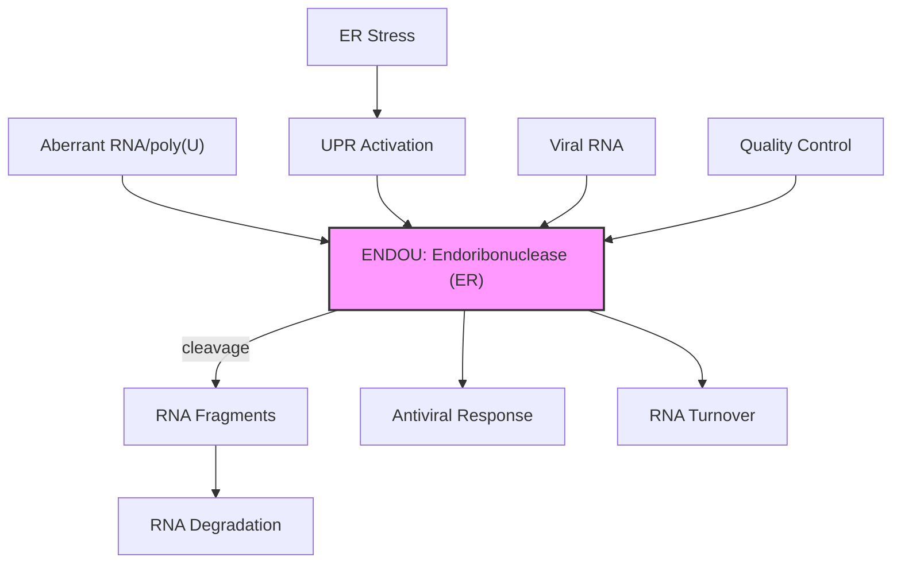

# Pathway Summary for ENDOU

## Overview
ENDOU (Poly(U)-specific endoribonuclease) is an endoribonuclease that specifically cleaves single-stranded RNA at uridine residues. It functions in RNA quality control and turnover, particularly in processing defective or unwanted RNA molecules. ENDOU localizes to the endoplasmic reticulum and participates in cellular stress responses and RNA metabolism.

## Core Pathways

### RNA Quality Control
ENDOU participates in RNA surveillance by:
- Cleaving aberrant poly(U) sequences
- Removing defective mRNAs
- Processing stress-induced RNAs
- Contributing to RNA turnover

### ER Stress Response
During ER stress, ENDOU:
- Processes ER-localized RNAs
- Contributes to unfolded protein response
- Regulates RNA stability under stress
- Modulates protein synthesis

## Pathway Diagram

## Molecular Function
- **Substrate specificity**: Poly(U) and U-rich sequences
- **Catalytic mechanism**: Metal-independent endonuclease
- **Localization**: ER membrane-associated
- **Conservation**: Present across eukaryotes

## Clinical Significance
- **Viral infections**: Potential role in antiviral defense
- **ER stress diseases**: Implicated in protein misfolding disorders
- **RNA metabolism disorders**: Disrupted RNA quality control
