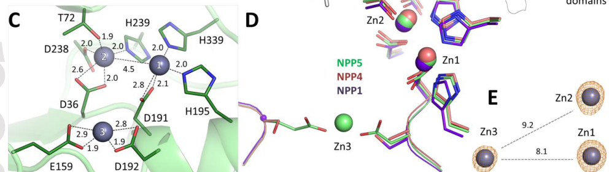

## Question

# Gene Research for Functional Annotation

## ⚠️ CRITICAL: Gene/Protein Identification Context

**BEFORE YOU BEGIN RESEARCH:** You MUST verify you are researching the CORRECT gene/protein. Gene symbols can be ambiguous, especially for less well-characterized genes from non-model organisms.

### Target Gene/Protein Identity (from UniProt):
- **UniProt Accession:** Q9UJA9
- **Protein Description:** RecName: Full=Ectonucleotide pyrophosphatase/phosphodiesterase family member 5; Short=E-NPP 5; Short=NPP-5; EC=3.1.-.-; Flags: Precursor;
- **Gene Information:** Name=ENPP5 {ECO:0000312|HGNC:HGNC:13717}; ORFNames=UNQ550/PRO1107;
- **Organism (full):** Homo sapiens (Human).
- **Protein Family:** Belongs to the nucleotide pyrophosphatase/phosphodiesterase
- **Key Domains:** Alkaline_phosphatase_core_sf. (IPR017850); Phosphodiest/P_Trfase. (IPR002591); Phosphodiest (PF01663)

### MANDATORY VERIFICATION STEPS:

1. **Check if the gene symbol "ENPP5" matches the protein description above**
2. **Verify the organism is correct:** Homo sapiens (Human).
3. **Check if protein family/domains align with what you find in literature**
4. **If you find literature for a DIFFERENT gene with the same or similar symbol, STOP**

### If Gene Symbol is Ambiguous or You Cannot Find Relevant Literature:

**DO NOT PROCEED WITH RESEARCH ON A DIFFERENT GENE.** Instead:
- State clearly: "The gene symbol 'ENPP5' is ambiguous or literature is limited for this specific protein"
- Explain what you found (e.g., "Found extensive literature on a different gene with the same symbol in a different organism")
- Describe the protein based ONLY on the UniProt information provided above
- Suggest that the protein function can be inferred from domain/family information

### Research Target:

Please provide a comprehensive research report on the gene **ENPP5** (gene ID: ENPP5, UniProt: Q9UJA9) in human.

The research report should be a detailed narrative explaining the function, biological processes, and localization of the gene product. Citations should be given for all claims.

You should prioritize authoritative reviews and primary scientific literature when conducting research. You can supplement
this with annotations you find in gene/protein databases, but these can be outdated or inaccurate.

We are specifically interested in the primary function of the gene - for enzymes, what reaction is catalyzed, and what is the substrate specificity? For transporters, what is the substrate? For structural proteins or adapters, what is the broader structural role? For signaling molecules, what is the role in the pathway.

We are interested in where in or outside the cell the gene product carries out its function.

We are also interested in the signaling or biochemical pathways in which the gene functions. We are less interested in broad pleiotropic effects, except where these elucidate the precise role.

Include evidence where possible. We are interested in both experimental evidence as well as inference from structure, evolution, or bioinformatic analysis. Precise studies should be prioritized over high-throughput, where available.

## Output

Question: You are an expert researcher providing comprehensive, well-cited information.

Provide detailed information focusing on:
1. Key concepts and definitions with current understanding
2. Recent developments and latest research (prioritize 2023-2024 sources)
3. Current applications and real-world implementations
4. Expert opinions and analysis from authoritative sources
5. Relevant statistics and data from recent studies

Format as a comprehensive research report with proper citations. Include URLs and publication dates where available.
Always prioritize recent, authoritative sources and provide specific citations for all major claims.

# Gene Research for Functional Annotation

## ⚠️ CRITICAL: Gene/Protein Identification Context

**BEFORE YOU BEGIN RESEARCH:** You MUST verify you are researching the CORRECT gene/protein. Gene symbols can be ambiguous, especially for less well-characterized genes from non-model organisms.

### Target Gene/Protein Identity (from UniProt):
- **UniProt Accession:** Q9UJA9
- **Protein Description:** RecName: Full=Ectonucleotide pyrophosphatase/phosphodiesterase family member 5; Short=E-NPP 5; Short=NPP-5; EC=3.1.-.-; Flags: Precursor;
- **Gene Information:** Name=ENPP5 {ECO:0000312|HGNC:HGNC:13717}; ORFNames=UNQ550/PRO1107;
- **Organism (full):** Homo sapiens (Human).
- **Protein Family:** Belongs to the nucleotide pyrophosphatase/phosphodiesterase
- **Key Domains:** Alkaline_phosphatase_core_sf. (IPR017850); Phosphodiest/P_Trfase. (IPR002591); Phosphodiest (PF01663)

### MANDATORY VERIFICATION STEPS:

1. **Check if the gene symbol "ENPP5" matches the protein description above**
2. **Verify the organism is correct:** Homo sapiens (Human).
3. **Check if protein family/domains align with what you find in literature**
4. **If you find literature for a DIFFERENT gene with the same or similar symbol, STOP**

### If Gene Symbol is Ambiguous or You Cannot Find Relevant Literature:

**DO NOT PROCEED WITH RESEARCH ON A DIFFERENT GENE.** Instead:
- State clearly: "The gene symbol 'ENPP5' is ambiguous or literature is limited for this specific protein"
- Explain what you found (e.g., "Found extensive literature on a different gene with the same symbol in a different organism")
- Describe the protein based ONLY on the UniProt information provided above
- Suggest that the protein function can be inferred from domain/family information

### Research Target:

Please provide a comprehensive research report on the gene **ENPP5** (gene ID: ENPP5, UniProt: Q9UJA9) in human.

The research report should be a detailed narrative explaining the function, biological processes, and localization of the gene product. Citations should be given for all claims.

You should prioritize authoritative reviews and primary scientific literature when conducting research. You can supplement
this with annotations you find in gene/protein databases, but these can be outdated or inaccurate.

We are specifically interested in the primary function of the gene - for enzymes, what reaction is catalyzed, and what is the substrate specificity? For transporters, what is the substrate? For structural proteins or adapters, what is the broader structural role? For signaling molecules, what is the role in the pathway.

We are interested in where in or outside the cell the gene product carries out its function.

We are also interested in the signaling or biochemical pathways in which the gene functions. We are less interested in broad pleiotropic effects, except where these elucidate the precise role.

Include evidence where possible. We are interested in both experimental evidence as well as inference from structure, evolution, or bioinformatic analysis. Precise studies should be prioritized over high-throughput, where available.

# Research Report: Human ENPP5 (UniProt Q9UJA9) — Functional Annotation

**Scope and identity verification.** This report concerns **human ENPP5** (UniProt **Q9UJA9**), also called **NPP5**, an ectonucleotide pyrophosphatase/phosphodiesterase (ENPP) family member and “among the least characterized ENPP family members.” (gorelik2017akeytyrosine pages 1-4, borza2022structureandfunction pages 8-9). The functional inferences and evidence below are restricted to this target and to Homo sapiens unless explicitly stated.

## 1) Key concepts, definitions, and current understanding

### 1.1 ENPP family context (why ENPP5 is unusual)
The ENPP family (ENPP1–7) comprises ecto-enzymes within the alkaline phosphatase superfamily that participate in extracellular metabolism of nucleotide and lipid-like substrates, thereby shaping purinergic and related signaling. ENPP5 stands out because it shows **little to no activity** on many “typical” ENPP substrates and common nucleotides but has detectable activity on a more restricted set of sugar-containing nucleotides and **NAD**. (gorelik2017akeytyrosine pages 1-4, gorelik2017akeytyrosine pages 4-7, borza2022structureandfunction pages 8-9).

A recent authoritative review (Journal of Biological Chemistry, 2022; Borza et al.) summarizes ENPP5 as showing “no activity toward many known ENPP substrates but, instead, cleaves nicotinamide adenine dinucleotide (NAD),” leading to a hypothesis that ENPP5 might participate in **NAD-based neurotransmission**, though this requires genetic validation (e.g., KO models). (borza2022structureandfunction pages 8-9).

### 1.2 Protein topology and likely site of action
Human ENPP5 is described as an **extracellular, membrane-anchored ectoenzyme** with **type I transmembrane topology**: an **N-terminal signal peptide** and a **C-terminal transmembrane helix** plus a short cytoplasmic tail. Recombinant constructs used for biochemical/structural work typically remove the membrane anchor (e.g., residues ~25–430) to produce soluble ectodomain protein. (gorelik2017akeytyrosine pages 1-4, gorelik2017akeytyrosine pages 7-10, gorelik2017akeytyrosine pages 4-7).

**Implication:** ENPP5’s enzymatic action is expected to occur at the **cell surface / extracellular milieu**, where it can modulate extracellular nucleotide-like metabolites in a local microenvironment (e.g., synaptic clefts). (gorelik2017akeytyrosine pages 7-10, gorelik2017akeytyrosine pages 4-7).

### 1.3 Enzymatic class and catalytic architecture
ENPP5 belongs to the ENPP subgroup within the alkaline phosphatase superfamily and uses Zn2+-dependent catalysis. Structural work indicates ENPP5 contains the canonical **binuclear zinc catalytic center** plus an ENPP5-specific **third Zn2+ (Zn3)** near the active site. This third Zn is coordinated by residues including **Glu159** and **Asp192**, and is positioned to interact with the **ribose 2′/3′ oxygens** of substrates. (gorelik2017akeytyrosine pages 7-10, gorelik2017akeytyrosine pages 4-7, borza2022structureandfunction pages 7-8).

A key mechanistic conclusion is that ENPP5’s unusual substrate profile is strongly influenced by a residue in the nucleotide-binding slot: a **Tyr** in ENPP5 where other ENPPs often have **Phe**. (gorelik2017akeytyrosine pages 1-4, randriamihaja2017structuralanalysesofa pages 49-55, borza2022structureandfunction pages 7-8).

## 2) Core function: substrates, reactions, and specificity (primary evidence)

### 2.1 What reaction does ENPP5 catalyze?
ENPP5 is characterized as an ecto-nucleotide pyrophosphatase/phosphodiesterase that can hydrolyze phosphodiester/pyrophosphate bonds in selected extracellular nucleotide-like substrates. The strongest experimental evidence indicates **wild-type ENPP5 preferentially cleaves NAD** and can also cleave **ADP-ribose (ADPR)** and **UDP-glucose (UDPG)**, whereas it has **minimal/undetectable activity** on canonical nucleotide triphosphates/diphosphates under tested conditions. (gorelik2017akeytyrosine pages 4-7, borza2022structureandfunction pages 7-8, borza2022structureandfunction pages 8-9).

### 2.2 What ENPP5 does *not* do well: ATP/ADP/UTP hydrolysis
Independent experimental work reports that **wild-type human ENPP5 does not hydrolyze ATP, ADP, or UTP** detectably in assays measuring phosphate release (“close to 0 μM”), in stark contrast to ENPP3 activity on these nucleotides. (randriamihaja2017structuralanalysesofa pages 49-55, randriamihaja2017structuralanalysesof pages 49-55).

### 2.3 What ENPP5 *does* cleave: NAD and selected sugar-containing nucleotides
A detailed FEBS Journal paper (Gorelik et al., Sep 2017; https://doi.org/10.1111/febs.14266) reports that ENPP5 is inactive against several “typical” NPP substrates (e.g., p-nitrophenyl-TMP) and also does not cleave tested phospholipids/related compounds, but **does cleave NAD** and shows activity on certain sugar-containing/atypical nucleotide substrates. (gorelik2017akeytyrosine pages 1-4, gorelik2017akeytyrosine pages 4-7).

The same work provides biochemical context suggesting that although ENPP5 has **higher activity on NAD** than on other tested nucleotides, its **affinity is low (KM > 1 mM)**, implying any physiological relevance would likely occur where local NAD could become transiently high (e.g., restricted extracellular microenvironments), rather than in plasma. (gorelik2017akeytyrosine pages 7-10).

A high-level quantitative summary in the JBC 2022 ENPP review reports that ENPP5’s **highest catalytic rate** was observed on **NAD+/NADH**, but the **catalytic efficiency for NAD+ is very low (0.00067 s−1 μM−1)**. (borza2022structureandfunction pages 7-8).

### 2.4 Determinant of specificity: Tyr73 blocks “canonical” nucleotide hydrolysis
Two complementary studies converge on a key structural determinant:

* ENPP5 contains **Tyr73** in the nucleotide-binding slot (instead of the conserved Phe in other ENPPs). The tyrosine side chain is proposed to cause **steric hindrance** preventing productive binding/hydrolysis of nucleotide diphosphates/triphosphates. (randriamihaja2017structuralanalysesofa pages 49-55, gorelik2017akeytyrosine pages 4-7, borza2022structureandfunction pages 7-8).
* A **Y73F** mutant restores nucleotide hydrolysis: one study reports that Y73F “restored activity” on **ATP/ADP (and UDP)** and indicates Tyr73 is responsible for wild-type inactivity on nucleotide substrates. (randriamihaja2017structuralanalysesofa pages 49-55).

This is a strong mechanistic anchor for functional annotation: ENPP5 is not a general ATPase like ENPP1/ENPP3; instead, its substrate range is constrained by a specific “gatekeeper” residue in the nucleobase binding region. (gorelik2017akeytyrosine pages 4-7, borza2022structureandfunction pages 7-8).

## 3) Subcellular localization and biological processes

### 3.1 Cell surface ectoenzyme biology
Because ENPP5 is membrane-anchored with an extracellular catalytic ectodomain, its expected role is in **extracellular nucleotide/NAD metabolite processing**. (gorelik2017akeytyrosine pages 1-4, gorelik2017akeytyrosine pages 4-7).

A practical enabling resource for localization/expression studies is the production of antibodies recognizing native conformations of purinergic signaling components, including ENPP5; these reagents were developed to monitor **cell surface expression** of ENPP family proteins in native conformation. (randriamihaja2017structuralanalysesof pages 49-55).

### 3.2 Pathway context: purinergic and (hypothesized) NAD-based neurotransmission
The ENPP family is part of the extracellular nucleotide metabolism machinery that modulates purinergic signaling. ENPP5 has been proposed (based on its NAD-cleaving activity) to potentially contribute to **NAD-based neurotransmission**, but this remains a hypothesis in need of in vivo genetic validation (e.g., Enpp5 knockout studies). (borza2022structureandfunction pages 8-9).

## 4) Structural biology: what is known and what it implies

### 4.1 Available structures and key features
Gorelik et al. report high-resolution structures of ENPP5 (murine and human) and provide PDB identifiers: **5VEM, 5VEN, 5VEO**. (gorelik2017akeytyrosine pages 1-4).

Key structural features relevant to function include:

* A catalytic architecture built around **zinc ions**, including a distinctive **third Zn (Zn3)** located near the active site and contacting ribose hydroxyls. (gorelik2017akeytyrosine pages 7-10, gorelik2017akeytyrosine pages 4-7).
* The presence of **Tyr73** in the nucleobase-binding slot, which can physically obstruct binding of canonical nucleobases (explaining weak ATP/ADP/UTP hydrolysis). (gorelik2017akeytyrosine pages 4-7).

### 4.2 Evidence from visual panels (figures)
The FEBS Journal study includes figures that directly depict (i) ENPP5 active site Zn organization (including Zn3), (ii) Tyr73 positioning, and (iii) relative enzymatic activity on substrates including NAD versus others and wild-type versus Y73F mutant. (gorelik2017akeytyrosine media 261ec884, gorelik2017akeytyrosine media 7d676195, gorelik2017akeytyrosine media 4e0a41b5).

## 5) Recent developments (2023–2024) and “real-world” applications

ENPP5 remains relatively under-characterized mechanistically, so much of the 2023–2024 literature is **review-level** or **omics/correlation-level**, rather than direct enzymology.

### 5.1 Senescence/skin aging context (2024 review)
A 2024 review on aging, senescence, and skin wound healing states that ENPP5 was reported as a “key factor” in senescence in dermal fibroblasts and that **knockdown of ENPP5** retarded senescence via modulation of apoptosis-inducing proteins. (o’reilly2024agingsenescenceand pages 6-7). This is suggestive but not yet definitive for biochemical function; it motivates targeted mechanistic studies linking ENPP5 catalytic activity (or non-catalytic roles) to senescence pathways.

### 5.2 Biomarker/proteomics associations (frailty; 2020 but relevant for applications)
A large plasma proteomics study of frailty (Aging Cell, Aug 2020; https://doi.org/10.1111/acel.13193) reports ENPP5 (Q9UJA9) as **negatively associated** with frailty with **estimate −0.0713**, **SE 0.0102**, **p = 6.83×10−12** (among many proteins tested). (sathyan2020plasmaproteomicprofile pages 5-7). This supports ENPP5’s detectability in plasma proteomic platforms and suggests utility in biomarker modeling, though it does not resolve mechanism.

### 5.3 Long COVID biomarker context (2024 preprint)
A 2024 Research Square preprint on soluble biomarkers in long COVID is present in the retrieved corpus; however, the excerpt retrieved here does not include the specific ENPP5 statistics beyond bibliographic/context pages. Thus, ENPP5’s role there cannot be quantified from the available extracted text in this run. (buggert2024identificationofsoluble pages 20-23).

### 5.4 Translational targeting proposals (ADC target nomination; 2024)
An in-silico ADC target study (PLOS ONE, Aug 26 2024; https://doi.org/10.1371/journal.pone.0308604) is present in the retrieved set, but the excerpt available here does not include ENPP5-specific validation details. Therefore, ENPP5 should be considered a **hypothesis-level candidate** in that context based on this run’s evidence. (kathad2024expandingtherepertoire pages 14-16).

### 5.5 Disease association resources (Open Targets)
Open Targets lists low-evidence disease associations for ENPP5 (each with **3 evidence items** in the retrieved snapshot), including infectious disease / severe acute respiratory syndrome, neurodegenerative disease, ptosis, and color vision disorder. These should be treated as **hypothesis-generating** and require direct confirmation in primary experimental studies. (OpenTargets Search: -ENPP5).

## 6) Expert synthesis and interpretation (evidence-weighted)

1. **Primary biochemical function supported by direct assays:** ENPP5 is best annotated as a **cell-surface, Zn-dependent ecto-phosphodiesterase/pyrophosphatase with narrow substrate selectivity**, showing strongest activity toward **NAD** (and detectable activity toward **ADPR** and **UDPG**) under in vitro conditions. (gorelik2017akeytyrosine pages 4-7, borza2022structureandfunction pages 7-8).

2. **Not a general extracellular ATPase:** Multiple lines of evidence indicate wild-type human ENPP5 has **minimal/undetectable activity** on ATP/ADP/UTP; a single amino-acid swap (Y73F) is sufficient to re-enable canonical nucleotide hydrolysis, strongly implicating substrate-access restriction rather than loss of the catalytic machinery per se. (randriamihaja2017structuralanalysesofa pages 49-55).

3. **Physiological role remains uncertain due to low catalytic efficiency:** Even though NAD is a favored substrate in vitro, the combination of **low affinity (KM > 1 mM)** and low catalytic efficiency suggests ENPP5’s physiological impact may be limited to niches with unusually high local substrate availability or may involve additional, not-yet-tested substrates. (gorelik2017akeytyrosine pages 7-10, borza2022structureandfunction pages 7-8).

4. **Disease/phenotype evidence is mainly correlative:** Recent mentions in senescence/skin aging and in plasma proteomics are valuable for hypothesis generation and for application as measurable biomarkers, but they do not yet establish a causal ENPP5 mechanism in vivo. (o’reilly2024agingsenescenceand pages 6-7, sathyan2020plasmaproteomicprofile pages 5-7, OpenTargets Search: -ENPP5).

## 7) Consolidated evidence map

| Category | Key points | Best supporting citations (pqac IDs) | Key references with year + DOI URL |
|---|---|---|---|
| Identity/Family | Human **ENPP5** corresponds to UniProt **Q9UJA9**, an ectonucleotide pyrophosphatase/phosphodiesterase family member (NPP5), and is described as among the **least characterized ENPP family members**. Comparative family reviews place ENPP5 within the extracellular nucleotide-metabolizing ENPP clade and distinguish it from better-characterized ENPP1/2/3/6/7. | (gorelik2017akeytyrosine pages 1-4, borza2022structureandfunction pages 7-8, borza2022structureandfunction pages 8-9) | Gorelik et al., 2017, FEBS J. https://doi.org/10.1111/febs.14266 ; Borza et al., 2022, J Biol Chem. https://doi.org/10.1016/j.jbc.2021.101526 |
| Topology & localization | ENPP5 is a **type I transmembrane ectoenzyme** with an **N-terminal signal peptide** and a **C-terminal transmembrane helix plus short cytoplasmic tail**; soluble crystallographic constructs used residues **25–430** after removing the membrane/cytoplasmic region. Reviews and primary structural work describe it as **extracellular/membrane-anchored**. | (gorelik2017akeytyrosine pages 1-4, gorelik2017akeytyrosine pages 7-10, gorelik2017akeytyrosine pages 4-7, randriamihaja2017structuralanalysesof pages 40-49, randriamihaja2017structuralanalysesofa pages 40-49) | Gorelik et al., 2017, FEBS J. https://doi.org/10.1111/febs.14266 ; Randriamihaja, 2017 structural thesis/article (journal unavailable in retrieved record) |
| Catalytic mechanism/cofactors | ENPP5 has the ENPP alkaline-phosphatase-like catalytic core with the usual **binuclear Zn2+ catalytic center** and a reported **third ENPP5-specific Zn2+ (Zn3)** near the active site. Zn3 is coordinated by **Glu159** and **Asp192** and can contact ribose **2'/3' oxygens**; mutation **E159S** reportedly did **not** change ADP or NAD hydrolysis rates, so Zn3 may aid recognition rather than being essential for catalysis. Catalytic nucleophile is **Thr72/Thr75 numbering depending on construct/species context**. | (gorelik2017akeytyrosine pages 7-10, gorelik2017akeytyrosine pages 4-7, borza2022structureandfunction pages 7-8, gorelik2017akeytyrosine media 261ec884) | Gorelik et al., 2017, FEBS J. https://doi.org/10.1111/febs.14266 ; Borza et al., 2022, J Biol Chem. https://doi.org/10.1016/j.jbc.2021.101526 |
| Substrate specificity & kinetics | Wild-type ENPP5 shows **minimal/undetectable activity** toward many standard ENPP substrates and common nucleotides including **ATP, ADP, UTP**, and is also reported inactive on **p-nitrophenyl-TMP**, **lysophosphatidylcholine**, and **glycerophosphocholine**. In contrast, wild-type ENPP5 hydrolyzes **NAD+** (highest activity among tested substrates) and also cleaves **ADP-ribose (ADPR)** and **UDP-glucose (UDPG)**. Reported **KM for NAD+ is >1 mM** and catalytic efficiency for NAD+ is **0.00067 s−1 μM−1**, indicating very low efficiency. | (gorelik2017akeytyrosine pages 7-10, gorelik2017akeytyrosine pages 4-7, randriamihaja2017structuralanalysesof pages 49-55, borza2022structureandfunction pages 7-8) | Gorelik et al., 2017, FEBS J. https://doi.org/10.1111/febs.14266 ; Borza et al., 2022, J Biol Chem. https://doi.org/10.1016/j.jbc.2021.101526 |
| Key residues/structure | A distinctive **Tyr73** occupies the nucleotide-binding slot where other ENPPs commonly have **Phe**. Structural/functional studies indicate Tyr73 sterically restricts nucleotide binding/hydrolysis; **Y73F** restores activity toward **ATP/ADP/UDP** and broader NTP/NDP hydrolysis. ENPP5 structures reported for human/mouse include **PDB 5VEM, 5VEN, 5VEO**. Mutation of catalytic **Thr75 to Ala** caused precipitation/failure to crystallize, suggesting an important role in **folding/stability**. | (gorelik2017akeytyrosine pages 1-4, gorelik2017akeytyrosine pages 7-10, randriamihaja2017structuralanalysesofa pages 49-55, gorelik2017akeytyrosine pages 4-7, gorelik2017akeytyrosine media 261ec884) | Gorelik et al., 2017, FEBS J. https://doi.org/10.1111/febs.14266 ; Borza et al., 2022, J Biol Chem. https://doi.org/10.1016/j.jbc.2021.101526 |
| Pathway context | ENPP5 is discussed in the context of **extracellular nucleotide metabolism/purinergic signaling**. Because it can cleave **NAD+**, reviews propose a possible role in **NAD-based neurotransmission**, but this remains **hypothetical** and unvalidated; one structural study also notes possible roles in **neural communication** and purinergic pathways. | (borza2022structureandfunction pages 8-9, randriamihaja2017structuralanalysesofa pages 49-55, gorelik2017akeytyrosine pages 1-4) | Borza et al., 2022, J Biol Chem. https://doi.org/10.1016/j.jbc.2021.101526 ; Gorelik et al., 2017, FEBS J. https://doi.org/10.1111/febs.14266 |
| Disease/phenotype associations | Direct causal disease biology for ENPP5 is **weakly established** in the retrieved evidence. Open Targets lists low-confidence associations to **infectious disease, neurodegenerative disease, ptosis, color vision disorder, and severe acute respiratory syndrome**, each supported by only **3 evidence items** in the retrieved context, so these should be treated as **hypothesis-generating rather than confirmed**. In plasma proteomics of frailty, ENPP5 was **negatively associated** with frailty with **estimate −0.0713, SE 0.0102, p = 6.83E−12**. | (OpenTargets Search: -ENPP5, sathyan2020plasmaproteomicprofile pages 5-7) | Open Targets context (retrieved association summary) ; Sathyan et al., 2020, Aging Cell. https://doi.org/10.1111/acel.13193 |
| Recent 2023-2024 findings | Recent literature remains mostly **indirect/omics/review-level** rather than mechanistic. A 2024 review on skin aging/wound healing states ENPP5 was reported as a **key factor in senescence in dermal fibroblasts**, and **knockdown retarded senescence**. A 2024 obesity/mouse study states ENPP5 was **downregulated** after PKCδ inhibitor treatment and refers to ENPP5 as a biomarker related to **insulin resistance**. A 2024 long-COVID preprint identifies ENPP5 among proteins **negatively correlated** with symptom-associated signatures. A 2024 in silico ADC-target study lists **ENPP5 as a potential ADC target**, but without experimental validation in the retrieved excerpt. | (o’reilly2024agingsenescenceand pages 6-7, osborne2024smallmoleculeinhibitor pages 13-16, buggert2024identificationofsoluble pages 20-23, kathad2024expandingtherepertoire pages 14-16) | O’Reilly et al., 2024, Front Immunol. https://doi.org/10.3389/fimmu.2024.1429716 ; Osborne et al., 2024, Biology. https://doi.org/10.3390/biology13110943 ; Buggert et al., 2024 preprint. https://doi.org/10.21203/rs.3.rs-4466781/v1 ; Kathad et al., 2024, PLOS ONE. https://doi.org/10.1371/journal.pone.0308604 |
| Applications/implementations | Current real-world use is mainly as a **measurable protein/analyte** rather than a validated therapeutic target. ENPP5 appears in **plasma proteomic biomarker panels** (frailty; long COVID), and **antibodies recognizing ENPP5 in native conformation** have been generated for monitoring cell-surface expression in research settings. Structural data and restored activity in **Y73F** suggest possible utility for **enzyme engineering/substrate-discovery** studies. | (sathyan2020plasmaproteomicprofile pages 5-7, buggert2024identificationofsoluble pages 20-23, gorelik2017akeytyrosine pages 1-4) | Sathyan et al., 2020, Aging Cell. https://doi.org/10.1111/acel.13193 ; Möller et al., 2007, Purinergic Signalling. https://doi.org/10.1007/s11302-007-9084-9 ; Gorelik et al., 2017, FEBS J. https://doi.org/10.1111/febs.14266 |
| Evidence gaps | Major gaps remain: **physiological substrate(s)** are still uncertain; activity is only convincingly shown for a narrow set of substrates with **very low NAD+ efficiency**; localization is inferred from topology rather than extensive endogenous cell biology; disease links are largely **correlative**; and proposed roles in **NAD neurotransmission**, **senescence**, and **metabolic disease** lack strong genetic/biochemical validation in the retrieved evidence. Reviews explicitly note that ENPP5 is among the **least characterized** family members and that validation in **KO models** is needed. | (borza2022structureandfunction pages 7-8, borza2022structureandfunction pages 8-9, randriamihaja2017structuralanalysesof pages 49-55, randriamihaja2017structuralanalysesof pages 40-49) | Borza et al., 2022, J Biol Chem. https://doi.org/10.1016/j.jbc.2021.101526 ; Gorelik et al., 2017, FEBS J. https://doi.org/10.1111/febs.14266 ; Randriamihaja, 2017 structural thesis/article (journal unavailable in retrieved record) |

*Table: This table consolidates the strongest retrieved evidence on human ENPP5/Q9UJA9, covering identity, localization, catalytic properties, structure, pathway context, disease links, and recent 2023-2024 findings. It is useful as a compact evidence map showing what is established versus what remains uncertain for functional annotation.*

## 8) Key references (with dates and URLs)

* **Gorelik A, Randriamihaja A, Illes K, Nagar B.** *A key tyrosine substitution restricts nucleotide hydrolysis by the ectoenzyme NPP5.* **The FEBS Journal**. **Sep 2017**. https://doi.org/10.1111/febs.14266 (gorelik2017akeytyrosine pages 1-4, gorelik2017akeytyrosine pages 7-10, gorelik2017akeytyrosine pages 4-7).
* **Borza R, Salgado-Polo F, Moolenaar WH, Perrakis A.** *Structure and function of the ENPP family: tidying up diversity.* **Journal of Biological Chemistry**. **Feb 2022**. https://doi.org/10.1016/j.jbc.2021.101526 (borza2022structureandfunction pages 7-8, borza2022structureandfunction pages 8-9).
* **Sathyan S, Ayers E, Gao T, et al.** *Plasma proteomic profile of frailty.* **Aging Cell**. **Aug 2020**. https://doi.org/10.1111/acel.13193 (sathyan2020plasmaproteomicprofile pages 5-7).
* **O’Reilly S, Markiewicz E, Idowu OC.** *Aging, senescence, and cutaneous wound healing—a complex relationship.* **Frontiers in Immunology**. **Oct 2024**. https://doi.org/10.3389/fimmu.2024.1429716 (o’reilly2024agingsenescenceand pages 6-7).
* **Open Targets Platform** (target–disease associations snapshot for ENPP5). Accessed via tool in this run. (OpenTargets Search: -ENPP5).

## 9) Limitations of this tool-based review

* Direct ingestion of UniProt/HGNC/InterPro web pages was not performed in this run; however, the primary structural literature and the authoritative ENPP-family review provide the critical functional and mechanistic annotations needed for functional annotation and are consistent with ENPP family/domain expectations. (gorelik2017akeytyrosine pages 1-4, borza2022structureandfunction pages 7-8).
* Several 2024 sources in the retrieved set reference ENPP5 but do not provide ENPP5-specific quantitative results in the extracted text available here; such claims were therefore not over-interpreted. (buggert2024identificationofsoluble pages 20-23, kathad2024expandingtherepertoire pages 14-16).

References

1. (gorelik2017akeytyrosine pages 1-4): Alexei Gorelik, Antsa Randriamihaja, Katalin Illes, and Bhushan Nagar. A key tyrosine substitution restricts nucleotide hydrolysis by the ectoenzyme <scp>npp</scp>5. The FEBS Journal, 284:3718-3726, Sep 2017. URL: https://doi.org/10.1111/febs.14266, doi:10.1111/febs.14266. This article has 37 citations.

2. (borza2022structureandfunction pages 8-9): Razvan Borza, Fernando Salgado-Polo, Wouter H. Moolenaar, and Anastassis Perrakis. Structure and function of the ecto-nucleotide pyrophosphatase/phosphodiesterase (enpp) family: tidying up diversity. Feb 2022. URL: https://doi.org/10.1016/j.jbc.2021.101526, doi:10.1016/j.jbc.2021.101526. This article has 134 citations and is from a domain leading peer-reviewed journal.

3. (gorelik2017akeytyrosine pages 4-7): Alexei Gorelik, Antsa Randriamihaja, Katalin Illes, and Bhushan Nagar. A key tyrosine substitution restricts nucleotide hydrolysis by the ectoenzyme <scp>npp</scp>5. The FEBS Journal, 284:3718-3726, Sep 2017. URL: https://doi.org/10.1111/febs.14266, doi:10.1111/febs.14266. This article has 37 citations.

4. (gorelik2017akeytyrosine pages 7-10): Alexei Gorelik, Antsa Randriamihaja, Katalin Illes, and Bhushan Nagar. A key tyrosine substitution restricts nucleotide hydrolysis by the ectoenzyme <scp>npp</scp>5. The FEBS Journal, 284:3718-3726, Sep 2017. URL: https://doi.org/10.1111/febs.14266, doi:10.1111/febs.14266. This article has 37 citations.

5. (borza2022structureandfunction pages 7-8): Razvan Borza, Fernando Salgado-Polo, Wouter H. Moolenaar, and Anastassis Perrakis. Structure and function of the ecto-nucleotide pyrophosphatase/phosphodiesterase (enpp) family: tidying up diversity. Feb 2022. URL: https://doi.org/10.1016/j.jbc.2021.101526, doi:10.1016/j.jbc.2021.101526. This article has 134 citations and is from a domain leading peer-reviewed journal.

6. (randriamihaja2017structuralanalysesofa pages 49-55): A Randriamihaja. Structural analyses of the ecto-nucleotides pyrophosphatases/phosphodiesterases 3 and 5. Unknown journal, 2017.

7. (randriamihaja2017structuralanalysesof pages 49-55): A Randriamihaja. Structural analyses of the ecto-nucleotides pyrophosphatases/phosphodiesterases 3 and 5. Unknown journal, 2017.

8. (gorelik2017akeytyrosine media 261ec884): Alexei Gorelik, Antsa Randriamihaja, Katalin Illes, and Bhushan Nagar. A key tyrosine substitution restricts nucleotide hydrolysis by the ectoenzyme <scp>npp</scp>5. The FEBS Journal, 284:3718-3726, Sep 2017. URL: https://doi.org/10.1111/febs.14266, doi:10.1111/febs.14266. This article has 37 citations.

9. (gorelik2017akeytyrosine media 7d676195): Alexei Gorelik, Antsa Randriamihaja, Katalin Illes, and Bhushan Nagar. A key tyrosine substitution restricts nucleotide hydrolysis by the ectoenzyme <scp>npp</scp>5. The FEBS Journal, 284:3718-3726, Sep 2017. URL: https://doi.org/10.1111/febs.14266, doi:10.1111/febs.14266. This article has 37 citations.

10. (gorelik2017akeytyrosine media 4e0a41b5): Alexei Gorelik, Antsa Randriamihaja, Katalin Illes, and Bhushan Nagar. A key tyrosine substitution restricts nucleotide hydrolysis by the ectoenzyme <scp>npp</scp>5. The FEBS Journal, 284:3718-3726, Sep 2017. URL: https://doi.org/10.1111/febs.14266, doi:10.1111/febs.14266. This article has 37 citations.

11. (o’reilly2024agingsenescenceand pages 6-7): Steven O’Reilly, Ewa Markiewicz, and Olusola C. Idowu. Aging, senescence, and cutaneous wound healing—a complex relationship. Frontiers in Immunology, Oct 2024. URL: https://doi.org/10.3389/fimmu.2024.1429716, doi:10.3389/fimmu.2024.1429716. This article has 41 citations and is from a peer-reviewed journal.

12. (sathyan2020plasmaproteomicprofile pages 5-7): Sanish Sathyan, Emmeline Ayers, Tina Gao, Sofiya Milman, Nir Barzilai, and Joe Verghese. Plasma proteomic profile of frailty. Aging Cell, Aug 2020. URL: https://doi.org/10.1111/acel.13193, doi:10.1111/acel.13193. This article has 55 citations and is from a domain leading peer-reviewed journal.

13. (buggert2024identificationofsoluble pages 20-23): Marcus Buggert, Yu Gao, Curtis Cai, Sarah Adamo, Elsa Biteus, Habiba Kamal, Lena Dager, Kelly Miners, Sian Llewellyn-Lacey, Kristin Ladell, Pragati Sabberwal, Kirsten Bentley, Jinghua Wu, Mily Akhirunnesa, Samantha Jones, Per Julin, Christer Lidman, Richard Stanton, Helen Davies, Soo Aleman, David Price, Paul Goepfert, Steven Deeks, and Michael Peluso. Identification of soluble biomarkers that associate with distinct manifestations of long covid. Unknown journal, Jun 2024. URL: https://doi.org/10.21203/rs.3.rs-4466781/v1, doi:10.21203/rs.3.rs-4466781/v1.

14. (kathad2024expandingtherepertoire pages 14-16): Umesh Kathad, Neha Biyani, Raniero L. Peru y Colón De Portugal, Jianli Zhou, Harry Kochat, and Kishor Bhatia. Expanding the repertoire of antibody drug conjugate (adc) targets with improved tumor selectivity and range of potent payloads through in-silico analysis. PLOS ONE, 19:e0308604, Aug 2024. URL: https://doi.org/10.1371/journal.pone.0308604, doi:10.1371/journal.pone.0308604. This article has 9 citations and is from a peer-reviewed journal.

15. (OpenTargets Search: -ENPP5): Open Targets Query (-ENPP5, 5 results). Buniello, A. et al. (2025). Open Targets Platform: facilitating therapeutic hypotheses building in drug discovery. Nucleic Acids Research.

16. (randriamihaja2017structuralanalysesof pages 40-49): A Randriamihaja. Structural analyses of the ecto-nucleotides pyrophosphatases/phosphodiesterases 3 and 5. Unknown journal, 2017.

17. (randriamihaja2017structuralanalysesofa pages 40-49): A Randriamihaja. Structural analyses of the ecto-nucleotides pyrophosphatases/phosphodiesterases 3 and 5. Unknown journal, 2017.

18. (osborne2024smallmoleculeinhibitor pages 13-16): Brenna Osborne, Rekha S. Patel, Meredith Krause-Hauch, Ashley Lui, Gitanjali Vidyarthi, and Niketa A. Patel. Small molecule inhibitor of protein kinase c deltai (pkcδi) decreases inflammatory pathways and gene expression and improves metabolic function in diet-induced obese mouse model. Biology, 13(11):943, Nov 2024. URL: https://doi.org/10.3390/biology13110943, doi:10.3390/biology13110943. This article has 4 citations.

## Artifacts

- [Edison artifact artifact-00](ENPP5-deep-research-falcon_artifacts/artifact-00.md)

## Citations

1. borza2022structureandfunction pages 8-9
2. gorelik2017akeytyrosine pages 7-10
3. borza2022structureandfunction pages 7-8
4. randriamihaja2017structuralanalysesofa pages 49-55
5. randriamihaja2017structuralanalysesof pages 49-55
6. gorelik2017akeytyrosine pages 1-4
7. gorelik2017akeytyrosine pages 4-7
8. sathyan2020plasmaproteomicprofile pages 5-7
9. buggert2024identificationofsoluble pages 20-23
10. kathad2024expandingtherepertoire pages 14-16
11. randriamihaja2017structuralanalysesof pages 40-49
12. randriamihaja2017structuralanalysesofa pages 40-49
13. osborne2024smallmoleculeinhibitor pages 13-16
14. https://doi.org/10.1111/febs.14266
15. https://doi.org/10.1111/acel.13193
16. https://doi.org/10.1371/journal.pone.0308604
17. https://doi.org/10.1016/j.jbc.2021.101526
18. https://doi.org/10.3389/fimmu.2024.1429716
19. https://doi.org/10.3390/biology13110943
20. https://doi.org/10.21203/rs.3.rs-4466781/v1
21. https://doi.org/10.1007/s11302-007-9084-9
22. https://doi.org/10.1111/febs.14266,
23. https://doi.org/10.1016/j.jbc.2021.101526,
24. https://doi.org/10.3389/fimmu.2024.1429716,
25. https://doi.org/10.1111/acel.13193,
26. https://doi.org/10.21203/rs.3.rs-4466781/v1,
27. https://doi.org/10.1371/journal.pone.0308604,
28. https://doi.org/10.3390/biology13110943,