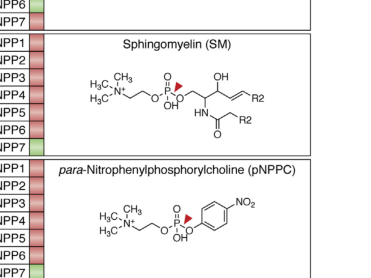

## Question

# Gene Research for Functional Annotation

## ⚠️ CRITICAL: Gene/Protein Identification Context

**BEFORE YOU BEGIN RESEARCH:** You MUST verify you are researching the CORRECT gene/protein. Gene symbols can be ambiguous, especially for less well-characterized genes from non-model organisms.

### Target Gene/Protein Identity (from UniProt):
- **UniProt Accession:** Q6UWV6
- **Protein Description:** RecName: Full=Ectonucleotide pyrophosphatase/phosphodiesterase family member 7; Short=E-NPP 7; Short=NPP-7; EC=3.1.4.12 {ECO:0000269|PubMed:12671034, ECO:0000269|PubMed:12885774, ECO:0000269|PubMed:15205117, ECO:0000269|PubMed:28292932}; AltName: Full=Alkaline sphingomyelin phosphodiesterase; AltName: Full=Intestinal alkaline sphingomyelinase {ECO:0000303|PubMed:12671034, ECO:0000303|PubMed:12885774}; Short=Alk-SMase {ECO:0000303|PubMed:12885774, ECO:0000303|PubMed:28292932}; Flags: Precursor;
- **Gene Information:** Name=ENPP7 {ECO:0000312|EMBL:AAH41453.2, ECO:0000312|HGNC:HGNC:23764}; ORFNames=UNQ3077/PRO9912;
- **Organism (full):** Homo sapiens (Human).
- **Protein Family:** Belongs to the nucleotide pyrophosphatase/phosphodiesterase
- **Key Domains:** Alkaline_phosphatase_core_sf. (IPR017850); Phosphodiest/P_Trfase. (IPR002591); Phosphodiest (PF01663)

### MANDATORY VERIFICATION STEPS:

1. **Check if the gene symbol "ENPP7" matches the protein description above**
2. **Verify the organism is correct:** Homo sapiens (Human).
3. **Check if protein family/domains align with what you find in literature**
4. **If you find literature for a DIFFERENT gene with the same or similar symbol, STOP**

### If Gene Symbol is Ambiguous or You Cannot Find Relevant Literature:

**DO NOT PROCEED WITH RESEARCH ON A DIFFERENT GENE.** Instead:
- State clearly: "The gene symbol 'ENPP7' is ambiguous or literature is limited for this specific protein"
- Explain what you found (e.g., "Found extensive literature on a different gene with the same symbol in a different organism")
- Describe the protein based ONLY on the UniProt information provided above
- Suggest that the protein function can be inferred from domain/family information

### Research Target:

Please provide a comprehensive research report on the gene **ENPP7** (gene ID: ENPP7, UniProt: Q6UWV6) in human.

The research report should be a detailed narrative explaining the function, biological processes, and localization of the gene product. Citations should be given for all claims.

You should prioritize authoritative reviews and primary scientific literature when conducting research. You can supplement
this with annotations you find in gene/protein databases, but these can be outdated or inaccurate.

We are specifically interested in the primary function of the gene - for enzymes, what reaction is catalyzed, and what is the substrate specificity? For transporters, what is the substrate? For structural proteins or adapters, what is the broader structural role? For signaling molecules, what is the role in the pathway.

We are interested in where in or outside the cell the gene product carries out its function.

We are also interested in the signaling or biochemical pathways in which the gene functions. We are less interested in broad pleiotropic effects, except where these elucidate the precise role.

Include evidence where possible. We are interested in both experimental evidence as well as inference from structure, evolution, or bioinformatic analysis. Precise studies should be prioritized over high-throughput, where available.

## Output

Question: You are an expert researcher providing comprehensive, well-cited information.

Provide detailed information focusing on:
1. Key concepts and definitions with current understanding
2. Recent developments and latest research (prioritize 2023-2024 sources)
3. Current applications and real-world implementations
4. Expert opinions and analysis from authoritative sources
5. Relevant statistics and data from recent studies

Format as a comprehensive research report with proper citations. Include URLs and publication dates where available.
Always prioritize recent, authoritative sources and provide specific citations for all major claims.

# Gene Research for Functional Annotation

## ⚠️ CRITICAL: Gene/Protein Identification Context

**BEFORE YOU BEGIN RESEARCH:** You MUST verify you are researching the CORRECT gene/protein. Gene symbols can be ambiguous, especially for less well-characterized genes from non-model organisms.

### Target Gene/Protein Identity (from UniProt):
- **UniProt Accession:** Q6UWV6
- **Protein Description:** RecName: Full=Ectonucleotide pyrophosphatase/phosphodiesterase family member 7; Short=E-NPP 7; Short=NPP-7; EC=3.1.4.12 {ECO:0000269|PubMed:12671034, ECO:0000269|PubMed:12885774, ECO:0000269|PubMed:15205117, ECO:0000269|PubMed:28292932}; AltName: Full=Alkaline sphingomyelin phosphodiesterase; AltName: Full=Intestinal alkaline sphingomyelinase {ECO:0000303|PubMed:12671034, ECO:0000303|PubMed:12885774}; Short=Alk-SMase {ECO:0000303|PubMed:12885774, ECO:0000303|PubMed:28292932}; Flags: Precursor;
- **Gene Information:** Name=ENPP7 {ECO:0000312|EMBL:AAH41453.2, ECO:0000312|HGNC:HGNC:23764}; ORFNames=UNQ3077/PRO9912;
- **Organism (full):** Homo sapiens (Human).
- **Protein Family:** Belongs to the nucleotide pyrophosphatase/phosphodiesterase
- **Key Domains:** Alkaline_phosphatase_core_sf. (IPR017850); Phosphodiest/P_Trfase. (IPR002591); Phosphodiest (PF01663)

### MANDATORY VERIFICATION STEPS:

1. **Check if the gene symbol "ENPP7" matches the protein description above**
2. **Verify the organism is correct:** Homo sapiens (Human).
3. **Check if protein family/domains align with what you find in literature**
4. **If you find literature for a DIFFERENT gene with the same or similar symbol, STOP**

### If Gene Symbol is Ambiguous or You Cannot Find Relevant Literature:

**DO NOT PROCEED WITH RESEARCH ON A DIFFERENT GENE.** Instead:
- State clearly: "The gene symbol 'ENPP7' is ambiguous or literature is limited for this specific protein"
- Explain what you found (e.g., "Found extensive literature on a different gene with the same symbol in a different organism")
- Describe the protein based ONLY on the UniProt information provided above
- Suggest that the protein function can be inferred from domain/family information

### Research Target:

Please provide a comprehensive research report on the gene **ENPP7** (gene ID: ENPP7, UniProt: Q6UWV6) in human.

The research report should be a detailed narrative explaining the function, biological processes, and localization of the gene product. Citations should be given for all claims.

You should prioritize authoritative reviews and primary scientific literature when conducting research. You can supplement
this with annotations you find in gene/protein databases, but these can be outdated or inaccurate.

We are specifically interested in the primary function of the gene - for enzymes, what reaction is catalyzed, and what is the substrate specificity? For transporters, what is the substrate? For structural proteins or adapters, what is the broader structural role? For signaling molecules, what is the role in the pathway.

We are interested in where in or outside the cell the gene product carries out its function.

We are also interested in the signaling or biochemical pathways in which the gene functions. We are less interested in broad pleiotropic effects, except where these elucidate the precise role.

Include evidence where possible. We are interested in both experimental evidence as well as inference from structure, evolution, or bioinformatic analysis. Precise studies should be prioritized over high-throughput, where available.

## Comprehensive research report: Human **ENPP7** (UniProt **Q6UWV6**) — functional annotation

### 1) Gene/protein identity verification (to avoid symbol ambiguity)
The target is **human ENPP7** (ectonucleotide pyrophosphatase/phosphodiesterase family member 7), also widely referred to as **alkaline sphingomyelinase (Alk-SMase)** or **NPP7**, and described as an ENPP-family ectoenzyme repurposed for phospholipid (not nucleotide) hydrolysis. This matches the UniProt description (Q6UWV6) and the ENPP-family structural/functional review describing ENPP7 as alkaline sphingomyelinase (borza2022structureandfunction pages 1-3, borza2022structureandfunction pages 7-8).

### 2) Key concepts and current understanding (definitions, catalytic function, localization)

#### 2.1 Core biochemical definition
ENPP7 is best understood as an **intestinal ecto-phosphodiesterase/phospholipase** that cleaves **choline-containing phospholipids**, with its canonical physiological substrate being **dietary sphingomyelin (SM)**. In current mechanistic summaries, ENPP7’s primary reaction is:

- **Sphingomyelin + H2O → ceramide + phosphocholine** (often described as occurring during intestinal digestion). (imam2024structuralandfunctional pages 14-15, borza2022structureandfunction pages 7-8)

This places ENPP7 at the interface between dietary sphingolipid digestion and generation of bioactive lipids (ceramide) plus a choline-containing headgroup (phosphocholine). (imam2024structuralandfunctional pages 14-15, wang2024evolutionaryconservationanalysis pages 1-3)

#### 2.2 Substrate specificity beyond sphingomyelin
Beyond sphingomyelin, ENPP7 is reported to function as a **lyso-phospholipase C (lyso-PLC)** and to hydrolyze:

- **Lysophosphatidylcholine (LPC/lyso-PC)** and **platelet-activating factor (PAF)** to yield phosphocholine-containing products (reviewed in ENPP family structure/function synthesis). (borza2022structureandfunction pages 7-8)
- The artificial substrate **p-nitrophenylphosphorylcholine (pNPPC)**. (borza2022structureandfunction pages 7-8)

A compiled functional summary additionally notes PLC activity toward palmitoyl lyso-phosphocholine and provides qualitative inhibitor information (ATP, imidazole, orthovanadate, Zn²⁺). (humanUnknownyeardatasheet(cat. pages 1-2)

#### 2.3 Catalytic mechanism and structural determinants (how substrate recognition works)
A key current insight is that ENPP7’s active site is tuned to recognize the **choline headgroup** of substrates. In the ENPP-family structural review:

- ENPP7’s catalytic site is described as **solvent-exposed** and **lacking a nucleotide-binding slot**, consistent with specialization for phospholipids rather than nucleotide substrates. (borza2022structureandfunction pages 7-8)
- The choline moiety is stabilized by a **“cation–π box”** composed of **Tyr109, Tyr166, and Tyr194**, providing a structural rationale for preference toward choline-containing substrates. (borza2022structureandfunction pages 7-8, borza2022structureandfunction media a48f87f3)
- Structural reference discussed includes **PDB 5TCD** (reviewed). (borza2022structureandfunction pages 7-8, borza2022structureandfunction media a48f87f3)

Figure evidence supporting these concepts (reaction scheme and substrate-recognition features) is captured from Borza et al. 2022. (borza2022structureandfunction media a48f87f3, borza2022structureandfunction media 1f839b96)

#### 2.4 Localization and where ENPP7 acts
ENPP7 is primarily described as an intestinal enzyme:

- A 2024 review situates ENPP7 as **predominantly expressed in the intestinal tract** and acting during digestion to hydrolyze sphingomyelin. (imam2024structuralandfunctional pages 14-15)
- A 2023 diabetes-progression biomarker paper explicitly states ENPP7 is **strongly expressed in the small intestine** and involved in sphingomyelin hydrolysis and absorption of resulting products. (slieker2023identificationofbiomarkers pages 8-9)

A compiled localization summary further specifies intestinal epithelial subcellular placement:

- ENPP7 is described as localized to the **microvillar (brush-border) membrane** of small-intestinal enterocytes, with additional localization reported for **Golgi** and **endosome-like structures**, and presence in **human bile**. (humanUnknownyeardatasheet(cat. pages 1-2)

### 3) Recent developments and latest research (prioritizing 2023–2024)

#### 3.1 2023: ENPP7 as a circulating protein biomarker linked to diabetes progression
Slieker et al. (Nature Communications, **2023-05**, https://doi.org/10.1038/s41467-023-38148-7) performed multi-omics biomarker discovery for glycaemic deterioration (time to insulin requirement) and report that:

- ENPP7 was among plasma proteins associated with faster diabetes progression, described as being upregulated at baseline in individuals who later required insulin. (slieker2023identificationofbiomarkers pages 2-4)
- The proteomics component measured **~1,195 proteins** (SomaScan) in **1,188 individuals**. (slieker2023identificationofbiomarkers pages 11-12)
- The study reports multiple cohort sizes, including **discovery proteomics** (DCS: **600**; GoDARTS: **600** with 599 remaining after QC) and **validation** in ANDIS (**1,992**) and ACCELERATE (**1,850**). (slieker2023identificationofbiomarkers pages 2-4, slieker2023identificationofbiomarkers pages 10-11)
- The paper also notes ENPP7’s strong expression in small intestine and its role in sphingomyelin hydrolysis/absorption of ceramide and phosphocholine, linking the biomarker signal to plausible lipid metabolic physiology. (slieker2023identificationofbiomarkers pages 8-9)

This work is an example of a modern “functional biomarker” framework: while ENPP7 itself was not functionally manipulated in this study (the paper’s functional experiments focused on other proteins), ENPP7 was prioritized as a measurable plasma marker with additional support for assay specificity via cis-pQTL confirmation for a subset of top proteins including ENPP7. (slieker2023identificationofbiomarkers pages 2-4)

#### 3.2 2024: Integration into choline metabolism and intestinal digestion context
A 2024 Metabolites review (Imam et al., **2024-11**, https://doi.org/10.3390/metabo14120659) frames ENPP7 as:

- An ENPP family enzyme **predominantly expressed in intestine** with primary activity hydrolyzing SM to **ceramide + phosphocholine** during digestion. (imam2024structuralandfunctional pages 14-15)
- Part of a putative extracellular **choline-precursor pathway** where phosphocholine generated by ENPP7 (and ENPP6) could be further processed by alkaline phosphatase activities, implying ENPP7’s reaction products may be metabolically integrated beyond local lipid digestion. (imam2024structuralandfunctional pages 14-15)

#### 3.3 2024: Sphingomyelin pathway context and quantitative background
A 2024 Heliyon paper (Wang et al., **2024-12**, https://doi.org/10.1016/j.heliyon.2024.e40810) contextualizes ENPP7 within sphingomyelin metabolism and notes:

- Sphingomyelin is abundant in animal membranes (reported as ~**23% of total membrane lipids**), and dietary sphingomyelin is primarily hydrolyzed by alkaline sphingomyelinase activity in the intestinal mucosa into ceramide and phosphocholine. (wang2024evolutionaryconservationanalysis pages 1-3)

While this is not an ENPP7-specific kinetic dataset, it provides recent quantitative context for why ENPP7-mediated SM hydrolysis is physiologically meaningful.

#### 3.4 2023–2024: Human genetic association signals (GWAS credible sets)
Open Targets disease–target evidence links ENPP7 to multiple phenotypes, including liver-related traits and intrahepatic cholestasis of pregnancy, based on GWAS credible-set evidence; the platform records literature PMIDs including **35977952, 36653562, 39024449, 40069456**. (OpenTargets Search: -ENPP7)

These associations are hypothesis-generating (genetic association evidence) rather than direct biochemical mechanism demonstrations, but they motivate further functional investigation of ENPP7 in hepatobiliary physiology.

### 4) Current applications and real-world implementations

1. **Biomarker development for metabolic disease progression:** The 2023 Nature Communications study demonstrates a real-world clinical-research implementation of measuring ENPP7 in plasma as part of large-scale proteomic panels to stratify risk for faster progression to insulin requirement in type 2 diabetes. (slieker2023identificationofbiomarkers pages 2-4, slieker2023identificationofbiomarkers pages 11-12)

2. **Mechanism-informed assay targets (structure → substrate specificity):** The structural rationale for choline-headgroup recognition (cation–π box) is directly relevant for designing and interpreting enzymatic assays (e.g., pNPPC or choline-containing lysophospholipid substrates) and for future inhibitor discovery approaches, though validated ENPP7-directed therapies were not identified in the retrieved evidence set. (borza2022structureandfunction pages 7-8, borza2022structureandfunction media a48f87f3)

3. **Nutritional/lipid digestion context:** ENPP7 is positioned as a digestive ectoenzyme generating ceramide and phosphocholine from dietary sphingomyelin, which can be integrated into broader sphingolipid signaling and choline metabolism. (imam2024structuralandfunctional pages 14-15, wang2024evolutionaryconservationanalysis pages 1-3)

### 5) Expert opinions and authoritative synthesis (interpretation)

- A highly cited ENPP-family review (Borza et al., JBC **2022-02**, https://doi.org/10.1016/j.jbc.2021.101526) provides the most concentrated mechanistic interpretation in the retrieved evidence: ENPP7 is an ENPP-family member that evolved toward phospholipid substrates; structural features explain its choline-phospholipid specificity and help distinguish it from nucleotide-hydrolyzing ENPPs. (borza2022structureandfunction pages 7-8, borza2022structureandfunction pages 1-3)

- A 2024 Metabolites review integrates ENPP7 into a larger framework of alkaline phosphatase superfamily cooperation, proposing that ENPP7-derived phosphocholine could feed into extracellular choline availability via downstream phosphatase activity. This is an interpretive pathway-level synthesis rather than direct measurement of metabolite flux, but it represents current expert integration. (imam2024structuralandfunctional pages 14-15)

### 6) Statistics and quantitative data from recent studies (what is available in retrieved evidence)

- **Diabetes progression biomarker study scale (2023):** proteomics on **~1,195 proteins** in **1,188** individuals, with discovery cohorts including **600** DCS and **600** GoDARTS (599 post-QC), and validation cohorts including ANDIS (**1,992**) and ACCELERATE (**1,850**). (slieker2023identificationofbiomarkers pages 2-4, slieker2023identificationofbiomarkers pages 11-12, slieker2023identificationofbiomarkers pages 10-11)
- **Sphingomyelin abundance (2024):** sphingomyelin reported as ~**23% of total membrane lipids** (contextual statistic). (wang2024evolutionaryconservationanalysis pages 1-3)

ENPP7-specific hazard ratios/odds ratios were not extractable from the retrieved text segments for Slieker et al. 2023; the available excerpts support cohort sizes and qualitative association direction but not ENPP7-specific effect estimates. (slieker2023identificationofbiomarkers pages 2-4, slieker2023identificationofbiomarkers pages 8-9)

### Supporting summary table
| Category | Key details | Key sources with year, DOI/URL |
|---|---|---|
| Identity/aliases | Human **ENPP7** encodes **ectonucleotide pyrophosphatase/phosphodiesterase 7**, also called **alkaline sphingomyelinase (Alk-SMase)** and **NPP7**. It is an ENPP family member with the conserved phosphodiesterase catalytic core; ENPP4–7 retain this PDE domain, and ENPP7 is a **single-pass type I membrane protein** adapted as a phospholipase rather than a nucleotide-hydrolyzing ENPP. UniProt target identity in the cited sources matches the requested human ENPP7/Q6UWV6 annotation. (borza2022structureandfunction pages 1-3, borza2022structureandfunction pages 7-8, imam2024structuralandfunctional pages 14-15) | **Borza et al., 2022**, *J Biol Chem*, DOI: 10.1016/j.jbc.2021.101526, https://doi.org/10.1016/j.jbc.2021.101526; **Imam et al., 2024**, *Metabolites*, DOI: 10.3390/metabo14120659, https://doi.org/10.3390/metabo14120659 |
| Enzymatic reactions & substrates | Best-supported native activity is **hydrolysis of sphingomyelin (SM)**. ENPP7 also shows **lyso-phospholipase C (lyso-PLC)** activity toward **lysophosphatidylcholine (LPC/lyso-PC)** and **platelet-activating factor (PAF)**, and hydrolyzes the artificial substrate **p-nitrophenylphosphorylcholine (pNPPC)**. The datasheet additionally notes phospholipase C activity toward palmitoyl lyso-phosphocholine. (borza2022structureandfunction pages 7-8, humanUnknownyeardatasheet(cat. pages 1-2) | **Borza et al., 2022**, https://doi.org/10.1016/j.jbc.2021.101526; **ENPP7 datasheet** (compiled functional summary cited in evidence snippet) (humanUnknownyeardatasheet(cat. pages 1-2) |
| Products | For sphingomyelin, ENPP7 generates **ceramide + phosphocholine**. This is consistently described in the ENPP review and recent reviews of alkaline phosphatase/sphingomyelin metabolism; phosphocholine is highlighted as a precursor that can feed extracellular choline metabolism. (imam2024structuralandfunctional pages 14-15, borza2022structureandfunction pages 7-8, wang2024evolutionaryconservationanalysis pages 1-3) | **Imam et al., 2024**, https://doi.org/10.3390/metabo14120659; **Borza et al., 2022**, https://doi.org/10.1016/j.jbc.2021.101526; **Wang et al., 2024**, DOI: 10.1016/j.heliyon.2024.e40810, https://doi.org/10.1016/j.heliyon.2024.e40810 |
| Mechanism/structural determinants | ENPP7 uses the ENPP/alkaline phosphatase superfamily catalytic architecture with **two Zn²⁺ ions** in the active site. Structural work/reviewed models indicate a **solvent-exposed catalytic site**, **absence of a nucleotide-binding slot**, and a **cation-π box** formed by **Tyr109, Tyr166, Tyr194** that stabilizes the positively charged **choline headgroup** of substrates; this explains preference for choline-containing phospholipids. A nearby **hydrophobic loop (342–351)** and surface cationic patches may support interaction with bile salt micelles. Structural reference noted as **PDB 5TCD**. (borza2022structureandfunction pages 7-8, borza2022structureandfunction pages 1-3, borza2022structureandfunction media a48f87f3) | **Borza et al., 2022**, https://doi.org/10.1016/j.jbc.2021.101526 |
| Localization/tissue | ENPP7 is described as **predominantly expressed in the intestinal tract/small intestine** and functioning during digestion. The datasheet localizes it to the **surface of the microvillar membrane (brush border) of small-intestinal enterocytes**, and also to **Golgi** and **endosome-like structures**; it is reported in **human bile** as well. As a type I membrane ectoenzyme, it acts at the extracellular/luminal side of intestinal epithelial membranes. (imam2024structuralandfunctional pages 14-15, humanUnknownyeardatasheet(cat. pages 1-2, borza2022structureandfunction pages 1-3, slieker2023identificationofbiomarkers pages 8-9) | **Imam et al., 2024**, https://doi.org/10.3390/metabo14120659; **Slieker et al., 2023**, *Nat Commun*, DOI: 10.1038/s41467-023-38148-7, https://doi.org/10.1038/s41467-023-38148-7; **ENPP7 datasheet** (humanUnknownyeardatasheet(cat. pages 1-2) |
| Pathways/physiology | ENPP7 participates in **dietary sphingomyelin digestion in intestinal mucosa**, producing **ceramide** and **phosphocholine**. Recent review evidence further places ENPP7 in **extracellular choline-associated lipid hydrolysis**, with likely downstream dephosphorylation of phosphocholine by **TNAP/alkaline phosphatase** to support **choline availability**. Wang et al. note that sphingomyelin is abundant in membranes (~**23% of total membrane lipids**) and that intestinal sphingomyelin hydrolysis links dietary lipids to ceramide/sphingolipid signaling and metabolic effects. ENPP7 deficiency is linked in review text to **defective sphingomyelin digestion**. (imam2024structuralandfunctional pages 14-15, wang2024evolutionaryconservationanalysis pages 1-3) | **Imam et al., 2024**, https://doi.org/10.3390/metabo14120659; **Wang et al., 2024**, https://doi.org/10.1016/j.heliyon.2024.e40810 |
| Disease/biomarker links 2023-2024 | In a 2023 multi-cohort diabetes biomarker study, plasma **ENPP7** was among proteins associated with **faster glycaemic deterioration / time to insulin requirement**; ENPP7 was one of six top proteins with aptamer specificity supported by a **cis-pQTL**. Study scale: ~**1,195 proteins** measured in **1,188** individuals; discovery proteomics included **DCS n=600** and **GoDARTS n=600** (599 post-QC), with validation in **ANDIS n=1,992** and **ACCELERATE n=1,850**; the paper also states ENPP7 is strongly expressed in the small intestine and involved in sphingomyelin hydrolysis/absorption of ceramide and phosphocholine. Open Targets/GWAS-credible-set evidence links ENPP7 to **liver disease**, **intrahepatic cholestasis of pregnancy**, **cholestasis, intrahepatic, of pregnancy 3**, **hypocalcemia**, and **bipolar disorder**, citing PMIDs including **35977952, 36653562, 39024449, 40069456**. (slieker2023identificationofbiomarkers pages 2-4, slieker2023identificationofbiomarkers pages 8-9, slieker2023identificationofbiomarkers pages 10-11, OpenTargets Search: -ENPP7) | **Slieker et al., 2023**, https://doi.org/10.1038/s41467-023-38148-7; **Open Targets Platform query for ENPP7** (GWAS credible-set associations; PMIDs listed in evidence) (OpenTargets Search: -ENPP7) |
| Evidence/notes | Additional functional notes from the datasheet: ENPP7 activity is reported to be **inhibited dose-dependently by ATP, imidazole, orthovanadate, and zinc ions**. The strongest evidence base in the supplied snippets supports **intestinal digestive/luminal phospholipid metabolism**, especially sphingomyelin cleavage, plus broader choline-containing lysophospholipid hydrolysis. Quantitative enzyme kinetics were **not provided** in the available snippets, so substrate scope is supported qualitatively rather than by Km/kcat values here. (humanUnknownyeardatasheet(cat. pages 1-2, borza2022structureandfunction pages 7-8) | **ENPP7 datasheet** (humanUnknownyeardatasheet(cat. pages 1-2); **Borza et al., 2022**, https://doi.org/10.1016/j.jbc.2021.101526 |

*Table: This table summarizes the supported functional annotation of human ENPP7/Q6UWV6, including catalytic activities, structural determinants, localization, physiology, and recent disease/biomarker links. It is restricted to claims backed by the provided evidence snippets and includes source URLs/DOIs for quick verification.*

### Key figure evidence from ENPP-family structural review
The Borza et al. review includes figures illustrating (i) the ENPP7 reaction (SM → ceramide + phosphocholine) and (ii) the structural substrate-recognition concept (cation–π box for choline headgroup). (borza2022structureandfunction media a48f87f3, borza2022structureandfunction media 1f839b96)

### References (URLs and publication dates where available)
- Borza R, Salgado-Polo F, Moolenaar WH, Perrakis A. *Journal of Biological Chemistry* (**2022-02**). “Structure and function of the ecto-nucleotide pyrophosphatase/phosphodiesterase (ENPP) family: Tidying up diversity.” https://doi.org/10.1016/j.jbc.2021.101526 (borza2022structureandfunction pages 7-8, borza2022structureandfunction pages 1-3)
- Slieker RC et al. *Nature Communications* (**2023-05**). “Identification of biomarkers for glycaemic deterioration in type 2 diabetes.” https://doi.org/10.1038/s41467-023-38148-7 (slieker2023identificationofbiomarkers pages 2-4, slieker2023identificationofbiomarkers pages 11-12, slieker2023identificationofbiomarkers pages 8-9, slieker2023identificationofbiomarkers pages 10-11)
- Imam I et al. *Metabolites* (**2024-11**). “Structural and Functional Integration of Tissue-Nonspecific Alkaline Phosphatase Within the Alkaline Phosphatase Superfamily: Evolutionary Insights and Functional Implications.” https://doi.org/10.3390/metabo14120659 (imam2024structuralandfunctional pages 14-15)
- Wang S et al. *Heliyon* (**2024-12**). “Evolutionary conservation analysis of human sphingomyelin metabolism pathway genes.” https://doi.org/10.1016/j.heliyon.2024.e40810 (wang2024evolutionaryconservationanalysis pages 1-3)
- Open Targets Platform ENPP7 disease associations (accessed via tool; GWAS credible-set evidence; PMIDs listed in excerpt). https://platform.opentargets.org/ (OpenTargets Search: -ENPP7)

### Scope note (evidence limitations)
Within the retrieved full texts/snippets, ENPP7’s enzymatic activities, substrate classes, and structural basis for choline-headgroup recognition are well supported, but **enzyme kinetic constants (Km/kcat), quantitative intestinal activity levels, and direct intervention studies targeting ENPP7 in humans** were not available in the current evidence set. (borza2022structureandfunction pages 7-8, imam2024structuralandfunctional pages 14-15, slieker2023identificationofbiomarkers pages 2-4)

References

1. (borza2022structureandfunction pages 1-3): Razvan Borza, Fernando Salgado-Polo, Wouter H. Moolenaar, and Anastassis Perrakis. Structure and function of the ecto-nucleotide pyrophosphatase/phosphodiesterase (enpp) family: tidying up diversity. Feb 2022. URL: https://doi.org/10.1016/j.jbc.2021.101526, doi:10.1016/j.jbc.2021.101526. This article has 134 citations and is from a domain leading peer-reviewed journal.

2. (borza2022structureandfunction pages 7-8): Razvan Borza, Fernando Salgado-Polo, Wouter H. Moolenaar, and Anastassis Perrakis. Structure and function of the ecto-nucleotide pyrophosphatase/phosphodiesterase (enpp) family: tidying up diversity. Feb 2022. URL: https://doi.org/10.1016/j.jbc.2021.101526, doi:10.1016/j.jbc.2021.101526. This article has 134 citations and is from a domain leading peer-reviewed journal.

3. (imam2024structuralandfunctional pages 14-15): Iliass Imam, Gilles Rautureau, Sébastien Violot, Eva Drevet Mulard, David Magne, and Lionel Ballut. Structural and functional integration of tissue-nonspecific alkaline phosphatase within the alkaline phosphatase superfamily: evolutionary insights and functional implications. Metabolites, 14:659, Nov 2024. URL: https://doi.org/10.3390/metabo14120659, doi:10.3390/metabo14120659. This article has 10 citations.

4. (wang2024evolutionaryconservationanalysis pages 1-3): Siyuan Wang, Huan Jiang, Moran Hu, Yingyun Gong, and Hongwen Zhou. Evolutionary conservation analysis of human sphingomyelin metabolism pathway genes. Dec 2024. URL: https://doi.org/10.1016/j.heliyon.2024.e40810, doi:10.1016/j.heliyon.2024.e40810. This article has 7 citations.

5. (humanUnknownyeardatasheet(cat. pages 1-2): RH Human. Data sheet (cat. no. tmpy-01070). Unknown journal, Unknown year.

6. (borza2022structureandfunction media a48f87f3): Razvan Borza, Fernando Salgado-Polo, Wouter H. Moolenaar, and Anastassis Perrakis. Structure and function of the ecto-nucleotide pyrophosphatase/phosphodiesterase (enpp) family: tidying up diversity. Feb 2022. URL: https://doi.org/10.1016/j.jbc.2021.101526, doi:10.1016/j.jbc.2021.101526. This article has 134 citations and is from a domain leading peer-reviewed journal.

7. (borza2022structureandfunction media 1f839b96): Razvan Borza, Fernando Salgado-Polo, Wouter H. Moolenaar, and Anastassis Perrakis. Structure and function of the ecto-nucleotide pyrophosphatase/phosphodiesterase (enpp) family: tidying up diversity. Feb 2022. URL: https://doi.org/10.1016/j.jbc.2021.101526, doi:10.1016/j.jbc.2021.101526. This article has 134 citations and is from a domain leading peer-reviewed journal.

8. (slieker2023identificationofbiomarkers pages 8-9): Roderick C. Slieker, Louise A. Donnelly, Elina Akalestou, Livia Lopez-Noriega, Rana Melhem, Ayşim Güneş, Frederic Abou Azar, Alexander Efanov, Eleni Georgiadou, Hermine Muniangi-Muhitu, Mahsa Sheikh, Giuseppe N. Giordano, Mikael Åkerlund, Emma Ahlqvist, Ashfaq Ali, Karina Banasik, Søren Brunak, Marko Barovic, Gerard A. Bouland, Frédéric Burdet, Mickaël Canouil, Iulian Dragan, Petra J. M. Elders, Celine Fernandez, Andreas Festa, Hugo Fitipaldi, Phillippe Froguel, Valborg Gudmundsdottir, Vilmundur Gudnason, Mathias J. Gerl, Amber A. van der Heijden, Lori L. Jennings, Michael K. Hansen, Min Kim, Isabelle Leclerc, Christian Klose, Dmitry Kuznetsov, Dina Mansour Aly, Florence Mehl, Diana Marek, Olle Melander, Anne Niknejad, Filip Ottosson, Imre Pavo, Kevin Duffin, Samreen K. Syed, Janice L. Shaw, Over Cabrera, Timothy J. Pullen, Kai Simons, Michele Solimena, Tommi Suvitaival, Asger Wretlind, Peter Rossing, Valeriya Lyssenko, Cristina Legido Quigley, Leif Groop, Bernard Thorens, Paul W. Franks, Gareth E. Lim, Jennifer Estall, Mark Ibberson, Joline W. J. Beulens, Leen M ’t Hart, Ewan R. Pearson, and Guy A. Rutter. Identification of biomarkers for glycaemic deterioration in type 2 diabetes. Nature Communications, May 2023. URL: https://doi.org/10.1038/s41467-023-38148-7, doi:10.1038/s41467-023-38148-7. This article has 46 citations and is from a highest quality peer-reviewed journal.

9. (slieker2023identificationofbiomarkers pages 2-4): Roderick C. Slieker, Louise A. Donnelly, Elina Akalestou, Livia Lopez-Noriega, Rana Melhem, Ayşim Güneş, Frederic Abou Azar, Alexander Efanov, Eleni Georgiadou, Hermine Muniangi-Muhitu, Mahsa Sheikh, Giuseppe N. Giordano, Mikael Åkerlund, Emma Ahlqvist, Ashfaq Ali, Karina Banasik, Søren Brunak, Marko Barovic, Gerard A. Bouland, Frédéric Burdet, Mickaël Canouil, Iulian Dragan, Petra J. M. Elders, Celine Fernandez, Andreas Festa, Hugo Fitipaldi, Phillippe Froguel, Valborg Gudmundsdottir, Vilmundur Gudnason, Mathias J. Gerl, Amber A. van der Heijden, Lori L. Jennings, Michael K. Hansen, Min Kim, Isabelle Leclerc, Christian Klose, Dmitry Kuznetsov, Dina Mansour Aly, Florence Mehl, Diana Marek, Olle Melander, Anne Niknejad, Filip Ottosson, Imre Pavo, Kevin Duffin, Samreen K. Syed, Janice L. Shaw, Over Cabrera, Timothy J. Pullen, Kai Simons, Michele Solimena, Tommi Suvitaival, Asger Wretlind, Peter Rossing, Valeriya Lyssenko, Cristina Legido Quigley, Leif Groop, Bernard Thorens, Paul W. Franks, Gareth E. Lim, Jennifer Estall, Mark Ibberson, Joline W. J. Beulens, Leen M ’t Hart, Ewan R. Pearson, and Guy A. Rutter. Identification of biomarkers for glycaemic deterioration in type 2 diabetes. Nature Communications, May 2023. URL: https://doi.org/10.1038/s41467-023-38148-7, doi:10.1038/s41467-023-38148-7. This article has 46 citations and is from a highest quality peer-reviewed journal.

10. (slieker2023identificationofbiomarkers pages 11-12): Roderick C. Slieker, Louise A. Donnelly, Elina Akalestou, Livia Lopez-Noriega, Rana Melhem, Ayşim Güneş, Frederic Abou Azar, Alexander Efanov, Eleni Georgiadou, Hermine Muniangi-Muhitu, Mahsa Sheikh, Giuseppe N. Giordano, Mikael Åkerlund, Emma Ahlqvist, Ashfaq Ali, Karina Banasik, Søren Brunak, Marko Barovic, Gerard A. Bouland, Frédéric Burdet, Mickaël Canouil, Iulian Dragan, Petra J. M. Elders, Celine Fernandez, Andreas Festa, Hugo Fitipaldi, Phillippe Froguel, Valborg Gudmundsdottir, Vilmundur Gudnason, Mathias J. Gerl, Amber A. van der Heijden, Lori L. Jennings, Michael K. Hansen, Min Kim, Isabelle Leclerc, Christian Klose, Dmitry Kuznetsov, Dina Mansour Aly, Florence Mehl, Diana Marek, Olle Melander, Anne Niknejad, Filip Ottosson, Imre Pavo, Kevin Duffin, Samreen K. Syed, Janice L. Shaw, Over Cabrera, Timothy J. Pullen, Kai Simons, Michele Solimena, Tommi Suvitaival, Asger Wretlind, Peter Rossing, Valeriya Lyssenko, Cristina Legido Quigley, Leif Groop, Bernard Thorens, Paul W. Franks, Gareth E. Lim, Jennifer Estall, Mark Ibberson, Joline W. J. Beulens, Leen M ’t Hart, Ewan R. Pearson, and Guy A. Rutter. Identification of biomarkers for glycaemic deterioration in type 2 diabetes. Nature Communications, May 2023. URL: https://doi.org/10.1038/s41467-023-38148-7, doi:10.1038/s41467-023-38148-7. This article has 46 citations and is from a highest quality peer-reviewed journal.

11. (slieker2023identificationofbiomarkers pages 10-11): Roderick C. Slieker, Louise A. Donnelly, Elina Akalestou, Livia Lopez-Noriega, Rana Melhem, Ayşim Güneş, Frederic Abou Azar, Alexander Efanov, Eleni Georgiadou, Hermine Muniangi-Muhitu, Mahsa Sheikh, Giuseppe N. Giordano, Mikael Åkerlund, Emma Ahlqvist, Ashfaq Ali, Karina Banasik, Søren Brunak, Marko Barovic, Gerard A. Bouland, Frédéric Burdet, Mickaël Canouil, Iulian Dragan, Petra J. M. Elders, Celine Fernandez, Andreas Festa, Hugo Fitipaldi, Phillippe Froguel, Valborg Gudmundsdottir, Vilmundur Gudnason, Mathias J. Gerl, Amber A. van der Heijden, Lori L. Jennings, Michael K. Hansen, Min Kim, Isabelle Leclerc, Christian Klose, Dmitry Kuznetsov, Dina Mansour Aly, Florence Mehl, Diana Marek, Olle Melander, Anne Niknejad, Filip Ottosson, Imre Pavo, Kevin Duffin, Samreen K. Syed, Janice L. Shaw, Over Cabrera, Timothy J. Pullen, Kai Simons, Michele Solimena, Tommi Suvitaival, Asger Wretlind, Peter Rossing, Valeriya Lyssenko, Cristina Legido Quigley, Leif Groop, Bernard Thorens, Paul W. Franks, Gareth E. Lim, Jennifer Estall, Mark Ibberson, Joline W. J. Beulens, Leen M ’t Hart, Ewan R. Pearson, and Guy A. Rutter. Identification of biomarkers for glycaemic deterioration in type 2 diabetes. Nature Communications, May 2023. URL: https://doi.org/10.1038/s41467-023-38148-7, doi:10.1038/s41467-023-38148-7. This article has 46 citations and is from a highest quality peer-reviewed journal.

12. (OpenTargets Search: -ENPP7): Open Targets Query (-ENPP7, 6 results). Buniello, A. et al. (2025). Open Targets Platform: facilitating therapeutic hypotheses building in drug discovery. Nucleic Acids Research.

## Artifacts

- [Edison artifact artifact-00](ENPP7-deep-research-falcon_artifacts/artifact-00.md)

## Citations

1. borza2022structureandfunction pages 7-8
2. imam2024structuralandfunctional pages 14-15
3. slieker2023identificationofbiomarkers pages 8-9
4. slieker2023identificationofbiomarkers pages 2-4
5. slieker2023identificationofbiomarkers pages 11-12
6. wang2024evolutionaryconservationanalysis pages 1-3
7. borza2022structureandfunction pages 1-3
8. slieker2023identificationofbiomarkers pages 10-11
9. https://doi.org/10.1038/s41467-023-38148-7
10. https://doi.org/10.3390/metabo14120659
11. https://doi.org/10.1016/j.heliyon.2024.e40810
12. https://doi.org/10.1016/j.jbc.2021.101526
13. https://doi.org/10.1016/j.jbc.2021.101526;
14. https://doi.org/10.3390/metabo14120659;
15. https://doi.org/10.1038/s41467-023-38148-7;
16. https://platform.opentargets.org/
17. https://doi.org/10.1016/j.jbc.2021.101526,
18. https://doi.org/10.3390/metabo14120659,
19. https://doi.org/10.1016/j.heliyon.2024.e40810,
20. https://doi.org/10.1038/s41467-023-38148-7,