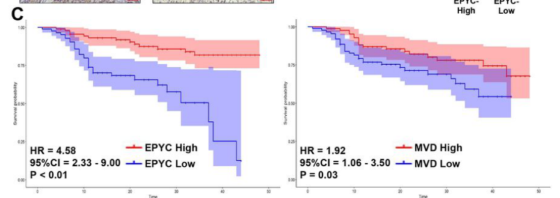

## Question

# Gene Research for Functional Annotation

## ⚠️ CRITICAL: Gene/Protein Identification Context

**BEFORE YOU BEGIN RESEARCH:** You MUST verify you are researching the CORRECT gene/protein. Gene symbols can be ambiguous, especially for less well-characterized genes from non-model organisms.

### Target Gene/Protein Identity (from UniProt):
- **UniProt Accession:** Q99645
- **Protein Description:** RecName: Full=Epiphycan; AltName: Full=Dermatan sulfate proteoglycan 3; AltName: Full=Proteoglycan-Lb; Short=PG-Lb; AltName: Full=Small chondroitin/dermatan sulfate proteoglycan; Flags: Precursor;
- **Gene Information:** Name=EPYC; Synonyms=DSPG3, PGLB, SLRR3B;
- **Organism (full):** Homo sapiens (Human).
- **Protein Family:** Belongs to the small leucine-rich proteoglycan (SLRP)
- **Key Domains:** Leu-rich_rpt. (IPR001611); Leu-rich_rpt_typical-subtyp. (IPR003591); LRR_dom_sf. (IPR032675); LRRNT. (IPR000372); Mimecan/Epiphycan/Opticin. (IPR043547)

### MANDATORY VERIFICATION STEPS:

1. **Check if the gene symbol "EPYC" matches the protein description above**
2. **Verify the organism is correct:** Homo sapiens (Human).
3. **Check if protein family/domains align with what you find in literature**
4. **If you find literature for a DIFFERENT gene with the same or similar symbol, STOP**

### If Gene Symbol is Ambiguous or You Cannot Find Relevant Literature:

**DO NOT PROCEED WITH RESEARCH ON A DIFFERENT GENE.** Instead:
- State clearly: "The gene symbol 'EPYC' is ambiguous or literature is limited for this specific protein"
- Explain what you found (e.g., "Found extensive literature on a different gene with the same symbol in a different organism")
- Describe the protein based ONLY on the UniProt information provided above
- Suggest that the protein function can be inferred from domain/family information

### Research Target:

Please provide a comprehensive research report on the gene **EPYC** (gene ID: EPYC, UniProt: Q99645) in human.

The research report should be a detailed narrative explaining the function, biological processes, and localization of the gene product. Citations should be given for all claims.

You should prioritize authoritative reviews and primary scientific literature when conducting research. You can supplement
this with annotations you find in gene/protein databases, but these can be outdated or inaccurate.

We are specifically interested in the primary function of the gene - for enzymes, what reaction is catalyzed, and what is the substrate specificity? For transporters, what is the substrate? For structural proteins or adapters, what is the broader structural role? For signaling molecules, what is the role in the pathway.

We are interested in where in or outside the cell the gene product carries out its function.

We are also interested in the signaling or biochemical pathways in which the gene functions. We are less interested in broad pleiotropic effects, except where these elucidate the precise role.

Include evidence where possible. We are interested in both experimental evidence as well as inference from structure, evolution, or bioinformatic analysis. Precise studies should be prioritized over high-throughput, where available.

## Output

Question: You are an expert researcher providing comprehensive, well-cited information.

Provide detailed information focusing on:
1. Key concepts and definitions with current understanding
2. Recent developments and latest research (prioritize 2023-2024 sources)
3. Current applications and real-world implementations
4. Expert opinions and analysis from authoritative sources
5. Relevant statistics and data from recent studies

Format as a comprehensive research report with proper citations. Include URLs and publication dates where available.
Always prioritize recent, authoritative sources and provide specific citations for all major claims.

# Gene Research for Functional Annotation

## ⚠️ CRITICAL: Gene/Protein Identification Context

**BEFORE YOU BEGIN RESEARCH:** You MUST verify you are researching the CORRECT gene/protein. Gene symbols can be ambiguous, especially for less well-characterized genes from non-model organisms.

### Target Gene/Protein Identity (from UniProt):
- **UniProt Accession:** Q99645
- **Protein Description:** RecName: Full=Epiphycan; AltName: Full=Dermatan sulfate proteoglycan 3; AltName: Full=Proteoglycan-Lb; Short=PG-Lb; AltName: Full=Small chondroitin/dermatan sulfate proteoglycan; Flags: Precursor;
- **Gene Information:** Name=EPYC; Synonyms=DSPG3, PGLB, SLRR3B;
- **Organism (full):** Homo sapiens (Human).
- **Protein Family:** Belongs to the small leucine-rich proteoglycan (SLRP)
- **Key Domains:** Leu-rich_rpt. (IPR001611); Leu-rich_rpt_typical-subtyp. (IPR003591); LRR_dom_sf. (IPR032675); LRRNT. (IPR000372); Mimecan/Epiphycan/Opticin. (IPR043547)

### MANDATORY VERIFICATION STEPS:

1. **Check if the gene symbol "EPYC" matches the protein description above**
2. **Verify the organism is correct:** Homo sapiens (Human).
3. **Check if protein family/domains align with what you find in literature**
4. **If you find literature for a DIFFERENT gene with the same or similar symbol, STOP**

### If Gene Symbol is Ambiguous or You Cannot Find Relevant Literature:

**DO NOT PROCEED WITH RESEARCH ON A DIFFERENT GENE.** Instead:
- State clearly: "The gene symbol 'EPYC' is ambiguous or literature is limited for this specific protein"
- Explain what you found (e.g., "Found extensive literature on a different gene with the same symbol in a different organism")
- Describe the protein based ONLY on the UniProt information provided above
- Suggest that the protein function can be inferred from domain/family information

### Research Target:

Please provide a comprehensive research report on the gene **EPYC** (gene ID: EPYC, UniProt: Q99645) in human.

The research report should be a detailed narrative explaining the function, biological processes, and localization of the gene product. Citations should be given for all claims.

You should prioritize authoritative reviews and primary scientific literature when conducting research. You can supplement
this with annotations you find in gene/protein databases, but these can be outdated or inaccurate.

We are specifically interested in the primary function of the gene - for enzymes, what reaction is catalyzed, and what is the substrate specificity? For transporters, what is the substrate? For structural proteins or adapters, what is the broader structural role? For signaling molecules, what is the role in the pathway.

We are interested in where in or outside the cell the gene product carries out its function.

We are also interested in the signaling or biochemical pathways in which the gene functions. We are less interested in broad pleiotropic effects, except where these elucidate the precise role.

Include evidence where possible. We are interested in both experimental evidence as well as inference from structure, evolution, or bioinformatic analysis. Precise studies should be prioritized over high-throughput, where available.

## Comprehensive Research Report: Human **EPYC (Epiphycan)** — Functional Annotation (UniProt: **Q99645**)

### 0) Scope and identity verification (mandatory)
The literature and database context retrieved here consistently refers to **EPYC** as **epiphycan**, also called **dermatan sulfate proteoglycan 3 (DSPG3)** / **proteoglycan-Lb (PG-Lb)**, in the **small leucine-rich proteoglycan (SLRP)** family, matching the user-specified UniProt identity (Q99645) and domain family expectations (LRR-containing extracellular proteoglycan). EPYC is described as a **dermatan sulfate (DS) SLRP** found in **epiphyseal cartilage**, and it is characterized by a leucine-rich repeat architecture (reported as **7 LRRs** in one review). (hayes2018biodiversityofcsproteoglycan pages 7-8, halari2021rolesoftwo pages 4-6)

### 1) Key concepts and definitions (current understanding)

#### 1.1 Small leucine-rich proteoglycans (SLRPs) and where EPYC fits
SLRPs are extracellular matrix (ECM) proteoglycans characterized by a protein core containing **leucine-rich repeats (LRRs)** and, in many family members, covalently attached glycosaminoglycan (GAG) chains such as **dermatan sulfate (DS)** or **chondroitin sulfate (CS)**. In a review focused on SLRPs, EPYC is explicitly listed as **epiphycan**, a DS*/CS# SLRP, with chromosomal location **12q21.33**, and SLRPs are described as ECM-resident components involved in tissue structure and collagen organization/fibrillogenesis. (halari2021rolesoftwo pages 4-6)

A second authoritative review focused on CS/DS proteoglycans places **epiphycan (EPYC)** among DS SLRPs found in **epiphyseal cartilage**, and it specifies that epiphycan contains **7 LRRs** (fewer than the 10–11 LRRs typical of many other SLRPs). (hayes2018biodiversityofcsproteoglycan pages 7-8)

#### 1.2 EPYC/epiphycan as an ECM structural regulator rather than an enzyme
Across the retrieved sources, EPYC is treated as a **structural ECM proteoglycan** rather than a catalytic enzyme/transport protein. Its repeatedly cited “primary” molecular role is in **collagen fibril formation (fibrillogenesis)** and cartilage matrix organization, which is consistent with SLRP family biology. (hayes2018biodiversityofcsproteoglycan pages 7-8, halari2021rolesoftwo pages 4-6, yang2024epycfunctionsas pages 1-2)

### 2) Core biological function, processes, and localization

#### 2.1 Subcellular/extracellular localization
EPYC is described as an **extracellular matrix (ECM)** proteoglycan in SLRP reviews. (halari2021rolesoftwo pages 4-6)

More recent mechanistic work in cancer contexts treats EPYC as a **secreted/soluble ECM-associated** factor that can be supplied as recombinant protein (rhEPYC) and can act on other cells (e.g., endothelial cells), consistent with an extracellular role. Additionally, GO/KEGG enrichment in that laryngeal-cancer study associated EPYC-containing signatures with **“extracellular matrix organization,” “extracellular region,”** and **“ECM-receptor interaction.”** (zhou2024epycpromoteslaryngeal pages 1-5, zhou2024epycpromoteslaryngeal pages 5-8)

#### 2.2 Biological process: cartilage matrix maturation and collagen fibrillogenesis
Evidence spanning cartilage-focused and broader ECM literature supports EPYC as part of cartilage ECM organization:

* **Cartilage localization:** epiphycan (EPYC) is explicitly reported as a DS SLRP **found in epiphyseal cartilage**. (hayes2018biodiversityofcsproteoglycan pages 7-8)
* **Chondrogenic matrix maturation:** in a human mesenchymal stem cell (MSC) chondrogenesis model, EPYC is described as a “novel” proteoglycan that appears in a later **maturation** phase of matrix development, with epiphycan described as **characteristic of articular cartilage** in that experimental context. (sorrell2018humanmesenchymalstem pages 10-14)
* **Collagen fibril formation:** a 2024 pancreatic-cancer paper reiterates a cartilage/ECM-centric concept of EPYC biology: EPYC “can regulate the fibril formation by interacting with collagen fibrils and other extracellular matrix proteins.” (yang2024epycfunctionsas pages 1-2)

Together, these sources support a functional annotation in which EPYC/epiphycan is a **secreted ECM SLRP** that contributes to **collagen fibrillogenesis and cartilage ECM assembly**, influencing chondrogenesis/matrix maturation. (hayes2018biodiversityofcsproteoglycan pages 7-8, sorrell2018humanmesenchymalstem pages 10-14, yang2024epycfunctionsas pages 1-2)

#### 2.3 Tissue and cell-type expression highlights (including 2024 developments)
A 2024 preprint studying growth plate resting-zone biology used **Epyc** as a marker in scRNAseq-based tissue annotation and reports **Epyc specifically expressed in growth plate chondrocytes and absent from articular chondrocytes and perichondrial cells** (in the murine tissue analyzed). This supports a strong association with **growth plate/epiphyseal chondrocytes**, aligning with the epiphyseal cartilage localization reported in the proteoglycan review. (otsuru2024apolipoproteineis pages 1-4, hayes2018biodiversityofcsproteoglycan pages 7-8)

Note: another experimental system (human MSC chondrogenesis) described epiphycan as “characteristic of articular cartilage,” illustrating that EPYC expression can depend on developmental stage/model and that “cartilage” can encompass distinct zones with different gene programs. (sorrell2018humanmesenchymalstem pages 10-14, otsuru2024apolipoproteineis pages 1-4)

### 3) Recent developments and latest research (prioritizing 2023–2024)
Direct 2023–2024 mechanistic studies focused on EPYC in human cartilage biology were limited in the retrieved corpus; however, multiple 2024 studies substantially expand EPYC’s **disease-context mechanistic literature**, particularly in oncology, while still citing/leveraging EPYC’s ECM/collagen biology.

#### 3.1 2024: EPYC as a mechanistic driver of angiogenesis and Wnt/VEGF signaling in laryngeal cancer
A 2024 Research Square preprint reports EPYC as an angiogenesis-related hub gene in laryngeal cancer and provides mechanistic evidence that EPYC promotes carcinogenesis and angiogenesis via **Wnt/Axin/β-catenin** and **VEGFR1/VEGF** axes:

* EPYC knockdown increased **Axin** and decreased nuclear **β-catenin**, consistent with EPYC promoting Wnt/β-catenin signaling by suppressing Axin. (zhou2024epycpromoteslaryngeal pages 10-13, zhou2024epycpromoteslaryngeal media e7b39943)
* EPYC was proposed to bind **VEGFR1**, with reported binding and downstream promotion of VEGFR1 degradation (proteasome dependence supported by MG132 rescue) and effects on VEGF signaling output; the study reports a binding affinity **KD ~44.1 µM**. (zhou2024epycpromoteslaryngeal pages 10-13, zhou2024epycpromoteslaryngeal pages 5-8)
* Single-cell analysis in this study highlighted EPYC expression in vascular endothelial cells, consistent with an extracellular factor active in the tumor microenvironment. (zhou2024epycpromoteslaryngeal pages 10-13, zhou2024epycpromoteslaryngeal media 717e387a)

These findings represent a notable 2024 expansion of EPYC biology into extracellular regulation of **growth factor receptor availability** and **canonical Wnt signaling**, albeit in a cancer microenvironment rather than cartilage. (zhou2024epycpromoteslaryngeal pages 10-13, zhou2024epycpromoteslaryngeal pages 1-5, zhou2024epycpromoteslaryngeal media e7b39943)

#### 3.2 2024: EPYC in pancreatic cancer via PI3K–AKT signaling
A peer-reviewed 2024 Scientific Reports paper proposes EPYC as a prognostic biomarker for pancreatic cancer and reports functional assays in which EPYC promotes proliferation “via **PI3K-AKT signaling** in vivo and in vitro.” The paper also re-states EPYC’s ECM role in regulating fibril formation through collagen/ECM interactions. (yang2024epycfunctionsas pages 1-2)

#### 3.3 2024: EPYC as a candidate breast cancer biomarker (with clinical qRT-PCR)
A 2024 BMC Cancer study identified EPYC among four candidate diagnostic biomarkers derived from integrative bioinformatics and validated via **qRT-PCR** in **55 breast cancer patients** (tumor vs adjacent non-tumor). EPYC mRNA was significantly upregulated (P < 0.0001), but the reported overall survival association for EPYC was weak/non-significant (OS HR = 1.04; log-rank P = 0.72). (golestan2024unveilingpromisingbreast pages 6-8)

### 4) Current applications and real-world implementations

#### 4.1 Biomarker development in oncology (2024)
Multiple 2024 studies frame EPYC as a candidate diagnostic/prognostic biomarker in distinct cancers (breast, pancreatic, laryngeal). These implementations are currently best characterized as **transcript-level biomarkers** and hypothesis-generating functional targets, rather than established clinical biomarkers:

* **Breast cancer:** EPYC among proposed diagnostic markers, validated by qRT-PCR in paired tissues. (golestan2024unveilingpromisingbreast pages 6-8)
* **Pancreatic cancer:** EPYC incorporated into prognostic modeling and functional validation, suggesting potential target/biomarker status. (yang2024epycfunctionsas pages 1-2, yang2024epycfunctionsas pages 8-11)
* **Laryngeal cancer:** EPYC used in ML-derived risk modeling and mechanistic angiogenesis assays, suggesting potential therapeutic target. (zhou2024epycpromoteslaryngeal pages 1-5, zhou2024epycpromoteslaryngeal pages 5-8)

#### 4.2 Musculoskeletal biology: EPYC as a marker of cartilage zones/cell states
In 2024, EPYC/Epyc is used as a **marker gene** to distinguish **growth plate chondrocytes** from other cartilage-associated cell types in scRNAseq-based analyses. This is a practical implementation in developmental skeletal biology and spatial annotation workflows. (otsuru2024apolipoproteineis pages 1-4)

### 5) Expert opinions and analysis (authoritative synthesis)

#### 5.1 What authoritative reviews imply about EPYC’s primary function
Review literature describing EPYC as a DS SLRP localized to epiphyseal cartilage and emphasizing SLRP roles in ECM organization/collagen fibrillogenesis supports a conservative “primary function” annotation: EPYC is likely a **structural organizer/modulator** of collagen fibrils and cartilage ECM assembly rather than a signaling ligand in the classical sense. (hayes2018biodiversityofcsproteoglycan pages 7-8, halari2021rolesoftwo pages 4-6)

#### 5.2 Interpreting cancer-mechanism papers in the context of ECM SLRP biology
The 2024 laryngeal cancer study suggests EPYC can directly modulate receptor stability (VEGFR1) and Wnt signaling. A plausible integrative interpretation—consistent with known proteoglycan biology—is that an ECM proteoglycan can act as a **context-dependent extracellular regulator** by binding proteins at the cell surface or in the pericellular milieu, thereby influencing signaling gradients and receptor availability. However, these cancer-context mechanisms should be treated as **disease-context expansions** of function, not necessarily EPYC’s evolutionarily primary role (which the cartilage-focused and SLRP-focused sources point toward). (hayes2018biodiversityofcsproteoglycan pages 7-8, zhou2024epycpromoteslaryngeal pages 10-13, zhou2024epycpromoteslaryngeal pages 1-5)

### 6) Relevant statistics and data (recent studies)

Key quantitative values explicitly extractable from 2024 literature in the retrieved corpus include:

* **Breast cancer (BMC Cancer; Jan 2024; https://doi.org/10.1186/s12885-024-11913-7):** EPYC significantly upregulated in tumor vs adjacent tissue by qRT-PCR (n=55 pairs; **P < 0.0001**), but overall survival association reported as **OS HR = 1.04** with **log-rank P = 0.72**. (golestan2024unveilingpromisingbreast pages 6-8)
* **Pancreatic cancer (Scientific Reports; Jan 2024; https://doi.org/10.1038/s41598-024-51478-w):** prognostic modeling reported **c-index 0.72** (training) and **0.70** (test) for a model including EPYC. (yang2024epycfunctionsas pages 8-11)
* **Laryngeal cancer (Research Square; Apr 2024; https://doi.org/10.21203/rs.3.rs-4182627/v1):** EPYC included in an angiogenesis risk score with coefficient **0.25**; reported EPYC–VEGFR1 binding affinity **KD ~44.1 µM**. (zhou2024epycpromoteslaryngeal pages 5-8, zhou2024epycpromoteslaryngeal pages 10-13)
* **Cartilage disease model (Disease Models & Mechanisms; Nov 2020; https://doi.org/10.1242/dmm.046425):** Epyc among the most strongly downregulated transcripts in hip articular cartilage from Gnptgko mice (**log2 ratio ≈ −4**). (westermann2020imbalancedcellularmetabolism pages 9-11)

### 7) Disease associations and genetics resources (database-level)
Open Targets disease–target association results linked EPYC to several phenotypes/diseases including **osteoarthritis**, **abnormality of the skeletal system**, and **hip dysplasia (Beukes type)** (among others), indicating that human-genetics and curated evidence streams consider EPYC relevant to skeletal/cartilage phenotypes (though the evidence details were not expanded in the retrieved context). (OpenTargets Search: -EPYC)

### 8) Visual evidence from 2024 mechanistic work
Cropped figure panels retrieved from the 2024 laryngeal-cancer study show (i) EPYC-associated survival and (ii) mechanistic experiments implicating Axin/β-catenin regulation and VEGFR1 binding/degradation as the basis of pro-angiogenic effects, supporting the textual mechanism summary. (zhou2024epycpromoteslaryngeal media e7b39943, zhou2024epycpromoteslaryngeal media 717e387a, zhou2024epycpromoteslaryngeal media f7ef9b71, zhou2024epycpromoteslaryngeal media c240e33d)

### 9) Summary of functional annotation (concise)
**EPYC (epiphycan; UniProt Q99645)** is best annotated as a **secreted extracellular matrix small leucine-rich proteoglycan (DS/CS SLRP)** with **LRR architecture** (reported 7 LRRs in one review), localized to cartilage (including **epiphyseal/growth plate cartilage**) and implicated in **collagen fibrillogenesis and cartilage matrix maturation**. Recent 2024 literature extends EPYC’s known biology into **cancer microenvironment signaling**, including regulation of **PI3K–AKT** (pancreatic cancer) and **Wnt/Axin/β-catenin** plus **VEGFR1/VEGF**-linked angiogenesis (laryngeal cancer), supporting a model in which an ECM proteoglycan can modulate cell signaling in a context-dependent fashion. (hayes2018biodiversityofcsproteoglycan pages 7-8, yang2024epycfunctionsas pages 1-2, zhou2024epycpromoteslaryngeal pages 10-13, otsuru2024apolipoproteineis pages 1-4)

---

### Evidence map table
| Aspect | Summary | Key sources with publication date and URL |
|---|---|---|
| Identity/Family | **EPYC** encodes **epiphycan** (human UniProt **Q99645**), a **small leucine-rich proteoglycan (SLRP)** carrying **dermatan sulfate and/or chondroitin sulfate (DS/CS)** chains; reviewed as an ECM proteoglycan at **12q21.33**. Open Targets also maps the approved symbol **EPYC** to disease associations including osteoarthritis and skeletal-system abnormalities, supporting correct human gene identity. (hayes2018biodiversityofcsproteoglycan pages 7-8, halari2021rolesoftwo pages 4-6, OpenTargets Search: -EPYC) | Hayes et al., **2018** — https://doi.org/10.1042/bcj20170820; Halari et al., **2021** — https://doi.org/10.3390/ijms221910584; Open Targets context (OpenTargets Search: -EPYC) |
| Domains/structure | EPYC is an **SLRP with leucine-rich repeats (LRRs)**; the cited review notes epiphycan contains **7 LRRs**, fewer than the **10–11 LRRs** typical of many other SLRPs. SLRPs share a core LRR-rich protein architecture with extracellular matrix structural roles. (hayes2018biodiversityofcsproteoglycan pages 7-8, halari2021rolesoftwo pages 4-6) | Hayes et al., **2018** — https://doi.org/10.1042/bcj20170820; Halari et al., **2021** — https://doi.org/10.3390/ijms221910584 |
| Localization | Evidence supports EPYC as a **secreted/extracellular matrix proteoglycan**. Reviews place SLRPs in the ECM, and 2024 laryngeal-cancer work explicitly treats EPYC as a **soluble/secreted ECM-associated SLRP** acting on endothelial/tumor microenvironment signaling; GO/KEGG enrichment linked EPYC-containing signatures to **extracellular matrix organization**, **extracellular region**, and **ECM-receptor interaction**. (halari2021rolesoftwo pages 4-6, zhou2024epycpromoteslaryngeal pages 1-5, zhou2024epycpromoteslaryngeal pages 5-8) | Halari et al., **2021** — https://doi.org/10.3390/ijms221910584; Zhou et al., **2024** — https://doi.org/10.21203/rs.3.rs-4182627/v1 |
| Core biological role | Current evidence supports a primary **structural ECM role in cartilage**, especially **collagen fibrillogenesis / fibril formation** and cartilage matrix maturation. Reviews identify EPYC as a cartilage SLRP; chondrogenic human MSC cultures show EPYC appearing during **matrix maturation** and being characteristic of a more mature **articular-cartilage-like matrix**. A 2024 pancreatic-cancer study reiterates that EPYC **regulates fibril formation by interacting with collagen fibrils and other ECM proteins**. (hayes2018biodiversityofcsproteoglycan pages 7-8, sorrell2018humanmesenchymalstem pages 10-14, yang2024epycfunctionsas pages 1-2) | Hayes et al., **2018** — https://doi.org/10.1042/bcj20170820; Sorrell et al., **2018** — https://doi.org/10.1002/jor.23820; Yang et al., **2024** — https://doi.org/10.1038/s41598-024-51478-w |
| Key tissues/cell types | EPYC is reported in **epiphyseal/growth plate cartilage** and cartilage-forming cells. Review evidence places epiphycan in **epiphyseal cartilage**; human MSC chondrogenesis links EPYC to **articular-cartilage-type matrix maturation**; mouse work found **Epyc specifically expressed in growth plate chondrocytes and absent from articular chondrocytes/perichondrial cells** in that model; separate cartilage transcriptomics showed strong **downregulation in articular cartilage** under disease-model conditions. (hayes2018biodiversityofcsproteoglycan pages 7-8, sorrell2018humanmesenchymalstem pages 10-14, otsuru2024apolipoproteineis pages 1-4, westermann2020imbalancedcellularmetabolism pages 9-11) | Hayes et al., **2018** — https://doi.org/10.1042/bcj20170820; Sorrell et al., **2018** — https://doi.org/10.1002/jor.23820; Otsuru et al., **2024** — https://doi.org/10.21203/rs.3.rs-4656728/v1; Westermann et al., **2020** — https://doi.org/10.1242/dmm.046425 |
| Pathways/signaling links | Native/cartilage biology evidence mainly supports ECM assembly roles rather than enzymatic catalysis. In 2024 cancer studies, EPYC was linked to **PI3K-AKT** signaling in pancreatic cancer and to **Wnt/Axin/β-catenin** plus **VEGFR1/VEGF** signaling in laryngeal cancer. The laryngeal study further reported **direct EPYC–VEGFR1 binding** and VEGFR1 degradation, consistent with extracellular signaling modulation by a secreted matrix proteoglycan. (yang2024epycfunctionsas pages 1-2, zhou2024epycpromoteslaryngeal pages 10-13, zhou2024epycpromoteslaryngeal pages 1-5, zhou2024epycpromoteslaryngeal media e7b39943) | Yang et al., **2024** — https://doi.org/10.1038/s41598-024-51478-w; Zhou et al., **2024** — https://doi.org/10.21203/rs.3.rs-4182627/v1 |
| Disease/biomarker evidence (2023-2024) | Recent studies propose EPYC as a **biomarker/functional contributor** in several diseases: **pancreatic cancer** prognostic biomarker with functional proliferation effects; **laryngeal cancer** angiogenesis/carcinogenesis promoter; **breast cancer** diagnostic biomarker candidate; Open Targets lists associations with **osteoarthritis**, **abnormality of the skeletal system**, and **hip dysplasia, Beukes type**. These disease links are promising but context-dependent and do not supersede EPYC’s likely core ECM/cartilage function. (yang2024epycfunctionsas pages 1-2, zhou2024epycpromoteslaryngeal pages 1-5, golestan2024unveilingpromisingbreast pages 6-8, OpenTargets Search: -EPYC) | Yang et al., **2024** — https://doi.org/10.1038/s41598-024-51478-w; Zhou et al., **2024** — https://doi.org/10.21203/rs.3.rs-4182627/v1; Golestan et al., **2024** — https://doi.org/10.1186/s12885-024-11913-7; Open Targets context (OpenTargets Search: -EPYC) |
| Quantitative stats (2024) | Reported 2024 quantitative findings include: breast cancer **qRT-PCR in 55 paired samples** showed EPYC upregulation (**P < 0.0001**), but overall-survival association was weak/non-significant (**HR 1.04, log-rank P = 0.72**). Pancreatic-cancer prognostic modeling reported **c-index 0.72** (training) and **0.70** (test) in a model retaining EPYC. Laryngeal-cancer work reported **EPYC coefficient = 0.25** in its risk score and **EPYC–VEGFR1 binding KD ~44.1 µM**. In cartilage disease-model tissue, **Epyc log2 ratio ~ -4** in hip articular cartilage was reported. (golestan2024unveilingpromisingbreast pages 6-8, yang2024epycfunctionsas pages 8-11, zhou2024epycpromoteslaryngeal pages 5-8, zhou2024epycpromoteslaryngeal pages 10-13, westermann2020imbalancedcellularmetabolism pages 9-11) | Golestan et al., **2024** — https://doi.org/10.1186/s12885-024-11913-7; Yang et al., **2024** — https://doi.org/10.1038/s41598-024-51478-w; Zhou et al., **2024** — https://doi.org/10.21203/rs.3.rs-4182627/v1; Westermann et al., **2020** — https://doi.org/10.1242/dmm.046425 |

*Table: This table summarizes the verified identity, structure, localization, biological role, tissue expression, signaling links, and recent disease evidence for human EPYC (epiphycan). It is useful as a compact evidence map for functional annotation grounded in the cited contexts only.*

References

1. (hayes2018biodiversityofcsproteoglycan pages 7-8): Anthony Hayes, Kazuyuki Sugahara, Brooke Farrugia, John M. Whitelock, Bruce Caterson, and James Melrose. Biodiversity of cs-proteoglycan sulphation motifs: chemical messenger recognition modules with roles in information transfer, control of cellular behaviour and tissue morphogenesis. The Biochemical journal, 475 3:587-620, Feb 2018. URL: https://doi.org/10.1042/bcj20170820, doi:10.1042/bcj20170820. This article has 63 citations.

2. (halari2021rolesoftwo pages 4-6): Chidambra D. Halari, Michael Zheng, and Peeyush K. Lala. Roles of two small leucine-rich proteoglycans decorin and biglycan in pregnancy and pregnancy-associated diseases. International Journal of Molecular Sciences, 22:10584, Sep 2021. URL: https://doi.org/10.3390/ijms221910584, doi:10.3390/ijms221910584. This article has 35 citations.

3. (yang2024epycfunctionsas pages 1-2): Zhen Yang, Honglin Li, Jie Hao, Hanwei Mei, Minghan Qiu, Huaqing Wang, and Ming Gao. Epyc functions as a novel prognostic biomarker for pancreatic cancer. Scientific Reports, Jan 2024. URL: https://doi.org/10.1038/s41598-024-51478-w, doi:10.1038/s41598-024-51478-w. This article has 15 citations and is from a peer-reviewed journal.

4. (zhou2024epycpromoteslaryngeal pages 1-5): Dongmei Zhou, Fan Liu, Xiaoqi Li, and Fei Lv. Epyc promotes laryngeal cancer carcinogenesis and angiogenesis via thewnt-axin-β-catenin/vegfr1 pathway. Unknown journal, Apr 2024. URL: https://doi.org/10.21203/rs.3.rs-4182627/v1, doi:10.21203/rs.3.rs-4182627/v1.

5. (zhou2024epycpromoteslaryngeal pages 5-8): Dongmei Zhou, Fan Liu, Xiaoqi Li, and Fei Lv. Epyc promotes laryngeal cancer carcinogenesis and angiogenesis via thewnt-axin-β-catenin/vegfr1 pathway. Unknown journal, Apr 2024. URL: https://doi.org/10.21203/rs.3.rs-4182627/v1, doi:10.21203/rs.3.rs-4182627/v1.

6. (sorrell2018humanmesenchymalstem pages 10-14): J. Michael Sorrell, Rodrigo A. Somoza, and Arnold I. Caplan. Human mesenchymal stem cells induced to differentiate as chondrocytes follow a biphasic pattern of extracellular matrix production. Journal of Orthopaedic Research®, 36:1757-1766, Jun 2018. URL: https://doi.org/10.1002/jor.23820, doi:10.1002/jor.23820. This article has 25 citations.

7. (otsuru2024apolipoproteineis pages 1-4): Satoru Otsuru, Joe Kodama, Takeshi Oichi, Kevin Wilkinson, Joshua Abzug, Takashi Kaito, Motomi Iwamoto-Enomoto, and Masahiro Iwamoto. Apolipoprotein e is a novel marker for chondrocytes in the growth plate resting zone. Research Square, Aug 2024. URL: https://doi.org/10.21203/rs.3.rs-4656728/v1, doi:10.21203/rs.3.rs-4656728/v1. This article has 1 citations.

8. (zhou2024epycpromoteslaryngeal pages 10-13): Dongmei Zhou, Fan Liu, Xiaoqi Li, and Fei Lv. Epyc promotes laryngeal cancer carcinogenesis and angiogenesis via thewnt-axin-β-catenin/vegfr1 pathway. Unknown journal, Apr 2024. URL: https://doi.org/10.21203/rs.3.rs-4182627/v1, doi:10.21203/rs.3.rs-4182627/v1.

9. (zhou2024epycpromoteslaryngeal media e7b39943): Dongmei Zhou, Fan Liu, Xiaoqi Li, and Fei Lv. Epyc promotes laryngeal cancer carcinogenesis and angiogenesis via thewnt-axin-β-catenin/vegfr1 pathway. Unknown journal, Apr 2024. URL: https://doi.org/10.21203/rs.3.rs-4182627/v1, doi:10.21203/rs.3.rs-4182627/v1.

10. (zhou2024epycpromoteslaryngeal media 717e387a): Dongmei Zhou, Fan Liu, Xiaoqi Li, and Fei Lv. Epyc promotes laryngeal cancer carcinogenesis and angiogenesis via thewnt-axin-β-catenin/vegfr1 pathway. Unknown journal, Apr 2024. URL: https://doi.org/10.21203/rs.3.rs-4182627/v1, doi:10.21203/rs.3.rs-4182627/v1.

11. (golestan2024unveilingpromisingbreast pages 6-8): Ali Golestan, Ahmad Tahmasebi, Nafiseh Maghsoodi, Seyed Nooreddin Faraji, Cambyz Irajie, and Amin Ramezani. Unveiling promising breast cancer biomarkers: an integrative approach combining bioinformatics analysis and experimental verification. BMC Cancer, Jan 2024. URL: https://doi.org/10.1186/s12885-024-11913-7, doi:10.1186/s12885-024-11913-7. This article has 37 citations and is from a peer-reviewed journal.

12. (yang2024epycfunctionsas pages 8-11): Zhen Yang, Honglin Li, Jie Hao, Hanwei Mei, Minghan Qiu, Huaqing Wang, and Ming Gao. Epyc functions as a novel prognostic biomarker for pancreatic cancer. Scientific Reports, Jan 2024. URL: https://doi.org/10.1038/s41598-024-51478-w, doi:10.1038/s41598-024-51478-w. This article has 15 citations and is from a peer-reviewed journal.

13. (westermann2020imbalancedcellularmetabolism pages 9-11): Lena Marie Westermann, Lutz Fleischhauer, Jonas Vogel, Zsuzsa Jenei-Lanzl, Nataniel Floriano Ludwig, Lynn Schau, Fabio Morellini, Anke Baranowsky, Timur A. Yorgan, Giorgia Di Lorenzo, Michaela Schweizer, Bruna de Souza Pinheiro, Nicole Ruas Guarany, Fernanda Sperb-Ludwig, Fernanda Visioli, Thiago Oliveira Silva, Jamie Soul, Gretl Hendrickx, J. Simon Wiegert, Ida V. D. Schwartz, Hauke Clausen-Schaumann, Frank Zaucke, Thorsten Schinke, Sandra Pohl, and Tatyana Danyukova. Imbalanced cellular metabolism compromises cartilage homeostasis and joint function in a mouse model of mucolipidosis type iii gamma. Disease Models &amp; Mechanisms, Nov 2020. URL: https://doi.org/10.1242/dmm.046425, doi:10.1242/dmm.046425. This article has 10 citations and is from a domain leading peer-reviewed journal.

14. (OpenTargets Search: -EPYC): Open Targets Query (-EPYC, 5 results). Buniello, A. et al. (2025). Open Targets Platform: facilitating therapeutic hypotheses building in drug discovery. Nucleic Acids Research.

15. (zhou2024epycpromoteslaryngeal media f7ef9b71): Dongmei Zhou, Fan Liu, Xiaoqi Li, and Fei Lv. Epyc promotes laryngeal cancer carcinogenesis and angiogenesis via thewnt-axin-β-catenin/vegfr1 pathway. Unknown journal, Apr 2024. URL: https://doi.org/10.21203/rs.3.rs-4182627/v1, doi:10.21203/rs.3.rs-4182627/v1.

16. (zhou2024epycpromoteslaryngeal media c240e33d): Dongmei Zhou, Fan Liu, Xiaoqi Li, and Fei Lv. Epyc promotes laryngeal cancer carcinogenesis and angiogenesis via thewnt-axin-β-catenin/vegfr1 pathway. Unknown journal, Apr 2024. URL: https://doi.org/10.21203/rs.3.rs-4182627/v1, doi:10.21203/rs.3.rs-4182627/v1.

## Artifacts

- [Edison artifact artifact-00](EPYC-deep-research-falcon_artifacts/artifact-00.md)

## Citations

1. halari2021rolesoftwo pages 4-6
2. hayes2018biodiversityofcsproteoglycan pages 7-8
3. sorrell2018humanmesenchymalstem pages 10-14
4. yang2024epycfunctionsas pages 1-2
5. golestan2024unveilingpromisingbreast pages 6-8
6. otsuru2024apolipoproteineis pages 1-4
7. yang2024epycfunctionsas pages 8-11
8. westermann2020imbalancedcellularmetabolism pages 9-11
9. zhou2024epycpromoteslaryngeal pages 1-5
10. zhou2024epycpromoteslaryngeal pages 5-8
11. zhou2024epycpromoteslaryngeal pages 10-13
12. https://doi.org/10.1186/s12885-024-11913-7
13. https://doi.org/10.1038/s41598-024-51478-w
14. https://doi.org/10.21203/rs.3.rs-4182627/v1
15. https://doi.org/10.1242/dmm.046425
16. https://doi.org/10.1042/bcj20170820;
17. https://doi.org/10.3390/ijms221910584;
18. https://doi.org/10.3390/ijms221910584
19. https://doi.org/10.1002/jor.23820;
20. https://doi.org/10.21203/rs.3.rs-4656728/v1;
21. https://doi.org/10.1038/s41598-024-51478-w;
22. https://doi.org/10.21203/rs.3.rs-4182627/v1;
23. https://doi.org/10.1186/s12885-024-11913-7;
24. https://doi.org/10.1042/bcj20170820,
25. https://doi.org/10.3390/ijms221910584,
26. https://doi.org/10.1038/s41598-024-51478-w,
27. https://doi.org/10.21203/rs.3.rs-4182627/v1,
28. https://doi.org/10.1002/jor.23820,
29. https://doi.org/10.21203/rs.3.rs-4656728/v1,
30. https://doi.org/10.1186/s12885-024-11913-7,
31. https://doi.org/10.1242/dmm.046425,