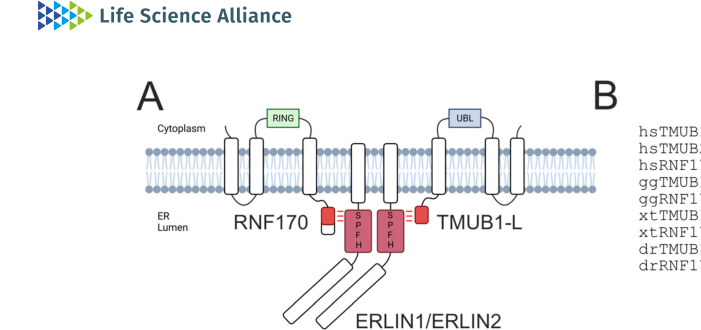

## Question

# Gene Research for Functional Annotation

## ⚠️ CRITICAL: Gene/Protein Identification Context

**BEFORE YOU BEGIN RESEARCH:** You MUST verify you are researching the CORRECT gene/protein. Gene symbols can be ambiguous, especially for less well-characterized genes from non-model organisms.

### Target Gene/Protein Identity (from UniProt):
- **UniProt Accession:** O75477
- **Protein Description:** RecName: Full=Erlin-1 {ECO:0000303|PubMed:16835267}; AltName: Full=Endoplasmic reticulum lipid raft-associated protein 1; AltName: Full=Protein KE04 {ECO:0000305|PubMed:11118313}; AltName: Full=Stomatin-prohibitin-flotillin-HflC/K domain-containing protein 1; Short=SPFH domain-containing protein 1;
- **Gene Information:** Name=ERLIN1 {ECO:0000312|HGNC:HGNC:16947}; Synonyms=C10orf69 {ECO:0000312|HGNC:HGNC:16947}, KE04 {ECO:0000303|PubMed:11118313}, KEO4, SPFH1 {ECO:0000303|PubMed:19240031};
- **Organism (full):** Homo sapiens (Human).
- **Protein Family:** Belongs to the band 7/mec-2 family. .
- **Key Domains:** Band_7. (IPR001107); Band_7/SPFH_dom_sf. (IPR036013); Erlin1/2. (IPR033294); Band_7 (PF01145)

### MANDATORY VERIFICATION STEPS:

1. **Check if the gene symbol "ERLIN1" matches the protein description above**
2. **Verify the organism is correct:** Homo sapiens (Human).
3. **Check if protein family/domains align with what you find in literature**
4. **If you find literature for a DIFFERENT gene with the same or similar symbol, STOP**

### If Gene Symbol is Ambiguous or You Cannot Find Relevant Literature:

**DO NOT PROCEED WITH RESEARCH ON A DIFFERENT GENE.** Instead:
- State clearly: "The gene symbol 'ERLIN1' is ambiguous or literature is limited for this specific protein"
- Explain what you found (e.g., "Found extensive literature on a different gene with the same symbol in a different organism")
- Describe the protein based ONLY on the UniProt information provided above
- Suggest that the protein function can be inferred from domain/family information

### Research Target:

Please provide a comprehensive research report on the gene **ERLIN1** (gene ID: ERLIN1, UniProt: O75477) in human.

The research report should be a detailed narrative explaining the function, biological processes, and localization of the gene product. Citations should be given for all claims.

You should prioritize authoritative reviews and primary scientific literature when conducting research. You can supplement
this with annotations you find in gene/protein databases, but these can be outdated or inaccurate.

We are specifically interested in the primary function of the gene - for enzymes, what reaction is catalyzed, and what is the substrate specificity? For transporters, what is the substrate? For structural proteins or adapters, what is the broader structural role? For signaling molecules, what is the role in the pathway.

We are interested in where in or outside the cell the gene product carries out its function.

We are also interested in the signaling or biochemical pathways in which the gene functions. We are less interested in broad pleiotropic effects, except where these elucidate the precise role.

Include evidence where possible. We are interested in both experimental evidence as well as inference from structure, evolution, or bioinformatic analysis. Precise studies should be prioritized over high-throughput, where available.

## Output

Question: You are an expert researcher providing comprehensive, well-cited information.

Provide detailed information focusing on:
1. Key concepts and definitions with current understanding
2. Recent developments and latest research (prioritize 2023-2024 sources)
3. Current applications and real-world implementations
4. Expert opinions and analysis from authoritative sources
5. Relevant statistics and data from recent studies

Format as a comprehensive research report with proper citations. Include URLs and publication dates where available.
Always prioritize recent, authoritative sources and provide specific citations for all major claims.

# Gene Research for Functional Annotation

## ⚠️ CRITICAL: Gene/Protein Identification Context

**BEFORE YOU BEGIN RESEARCH:** You MUST verify you are researching the CORRECT gene/protein. Gene symbols can be ambiguous, especially for less well-characterized genes from non-model organisms.

### Target Gene/Protein Identity (from UniProt):
- **UniProt Accession:** O75477
- **Protein Description:** RecName: Full=Erlin-1 {ECO:0000303|PubMed:16835267}; AltName: Full=Endoplasmic reticulum lipid raft-associated protein 1; AltName: Full=Protein KE04 {ECO:0000305|PubMed:11118313}; AltName: Full=Stomatin-prohibitin-flotillin-HflC/K domain-containing protein 1; Short=SPFH domain-containing protein 1;
- **Gene Information:** Name=ERLIN1 {ECO:0000312|HGNC:HGNC:16947}; Synonyms=C10orf69 {ECO:0000312|HGNC:HGNC:16947}, KE04 {ECO:0000303|PubMed:11118313}, KEO4, SPFH1 {ECO:0000303|PubMed:19240031};
- **Organism (full):** Homo sapiens (Human).
- **Protein Family:** Belongs to the band 7/mec-2 family. .
- **Key Domains:** Band_7. (IPR001107); Band_7/SPFH_dom_sf. (IPR036013); Erlin1/2. (IPR033294); Band_7 (PF01145)

### MANDATORY VERIFICATION STEPS:

1. **Check if the gene symbol "ERLIN1" matches the protein description above**
2. **Verify the organism is correct:** Homo sapiens (Human).
3. **Check if protein family/domains align with what you find in literature**
4. **If you find literature for a DIFFERENT gene with the same or similar symbol, STOP**

### If Gene Symbol is Ambiguous or You Cannot Find Relevant Literature:

**DO NOT PROCEED WITH RESEARCH ON A DIFFERENT GENE.** Instead:
- State clearly: "The gene symbol 'ERLIN1' is ambiguous or literature is limited for this specific protein"
- Explain what you found (e.g., "Found extensive literature on a different gene with the same symbol in a different organism")
- Describe the protein based ONLY on the UniProt information provided above
- Suggest that the protein function can be inferred from domain/family information

### Research Target:

Please provide a comprehensive research report on the gene **ERLIN1** (gene ID: ERLIN1, UniProt: O75477) in human.

The research report should be a detailed narrative explaining the function, biological processes, and localization of the gene product. Citations should be given for all claims.

You should prioritize authoritative reviews and primary scientific literature when conducting research. You can supplement
this with annotations you find in gene/protein databases, but these can be outdated or inaccurate.

We are specifically interested in the primary function of the gene - for enzymes, what reaction is catalyzed, and what is the substrate specificity? For transporters, what is the substrate? For structural proteins or adapters, what is the broader structural role? For signaling molecules, what is the role in the pathway.

We are interested in where in or outside the cell the gene product carries out its function.

We are also interested in the signaling or biochemical pathways in which the gene functions. We are less interested in broad pleiotropic effects, except where these elucidate the precise role.

Include evidence where possible. We are interested in both experimental evidence as well as inference from structure, evolution, or bioinformatic analysis. Precise studies should be prioritized over high-throughput, where available.

# Research Report: Human **ERLIN1** (UniProt **O75477**; Gene **ERLIN1**; synonyms **KE04/SPFH1/C10orf69**) — Functional Annotation

## 1) Target verification and definitions (gene/protein identity)

**ERLIN1** (ER lipid raft–associated protein 1; UniProt O75477) is an **endoplasmic-reticulum (ER) membrane** protein in the **SPFH/band7 (prohibitin/PHB-domain) superfamily** and forms **high–molecular-weight oligomers** with its close paralog **ERLIN2** in **cholesterol-rich, detergent-resistant ER nanodomains** (“ER lipid rafts”). (manganelli2021roleoferlins pages 1-2, manganelli2021roleoferlins pages 3-5, veronese2024erlin12scaffoldsbridge pages 1-2)

Operationally in the recent literature, “**ERLIN1/2 complex**” refers to **hetero-oligomeric ERLIN1+ERLIN2 scaffolds** that (i) recruit specific client proteins and (ii) organize lipid/protein microdomains that couple **lipid homeostasis** with **protein quality control** and **membrane trafficking**. (veronese2024erlin12scaffoldsbridge pages 4-6, veronese2024erlin12scaffoldsbridge pages 1-2)

## 2) Current understanding: molecular functions, pathways, and localization

### 2.1 ER membrane nanodomain scaffold controlling cholesterol esterification and secretory trafficking (major 2024 advance)

A 2024 mechanistic study (Life Science Alliance; publication month **May 2024**) provides direct experimental evidence that ERLIN1 (with ERLIN2) forms **ER scaffolds/nanodomains** that:

* **Bridge RNF170 and TMUB1-L**: mass-spectrometry interaction mapping and reciprocal co-immunoprecipitations identified **RNF170** (E3 ligase) and **TMUB1 (long isoform, TMUB1-L)** among enriched ERLIN interactors, and **loss of ERLINs completely prevented the TMUB1–RNF170 interaction**. (veronese2024erlin12scaffoldsbridge pages 2-4, veronese2024erlin12scaffoldsbridge pages 4-6)
* **Restrict cholesterol esterification**: ERLIN deficiency perturbed cholesterol esterification and lipid-droplet phenotypes; the authors propose that **cholesterol bound within luminal ERLIN “cups” is less accessible to SOAT1**, thereby **limiting cholesterol esterification** and favoring **ER-to-Golgi cholesterol transport**. (veronese2024erlin12scaffoldsbridge pages 12-12)
* **Maintain secretory pathway architecture**: ERLIN1/2 double knockout caused **tubular ER collapse**, **Golgi fragmentation**, altered distribution of secretory-route proteins in detergent-resistant fractions, and **cell migration defects**, linking ERLIN nanodomain organization to secretory pathway function. (veronese2024erlin12scaffoldsbridge pages 12-12, veronese2024erlin12scaffoldsbridge pages 4-6)

Quantitatively, this study reports: (i) interaction/proteomics work at the scale of **2,742 proteins** in a post-nuclear supernatant dataset and **N=4 biological replicates** for key proteomics comparisons; (ii) a tendency to increased SOAT1 abundance in ERLIN double knockout cells (**SOAT1 log2FC = 0.40; q = 0.07**); and (iii) rescue of lipid-droplet accumulation phenotypes using a **SOAT1 inhibitor (avasimibe)**. (veronese2024erlin12scaffoldsbridge pages 4-6, veronese2024erlin12scaffoldsbridge pages 12-12, veronese2024erlin12scaffoldsbridge pages 2-4)

**URL / date:** Veronese et al. “ERLIN1/2 scaffolds bridge TMUB1 and RNF170 and restrict cholesterol esterification to regulate the secretory pathway.” *Life Science Alliance* (**May 2024**). https://doi.org/10.26508/lsa.202402620 (veronese2024erlin12scaffoldsbridge pages 1-2)

**Visual evidence:** the ERLIN1/2–RNF170–TMUB1-L scaffold model is depicted in a schematic (Figure 3A). (veronese2024erlin12scaffoldsbridge media 40d635ea)

### 2.2 ER-associated degradation (ERAD) of activated IP3 receptors and Ca2+ signaling

Multiple sources converge on a core pathway-level role for ERLIN1/2 in **IP3 receptor (IP3R) turnover** via ERAD:

* In the 2024 ERLIN scaffold study, ERLINs are placed mechanistically upstream of **RNF170**, an ER-membrane E3 ligase linked to **ERAD of activated IP3Rs**, connecting scaffold organization to proteostasis control at ER microdomains. (veronese2024erlin12scaffoldsbridge pages 1-2, veronese2024erlin12scaffoldsbridge pages 12-12)
* A 2024 clinical genetics series on **biallelic ERLIN1 variants** (SPG62) explicitly interprets ERLIN1 loss-of-function as disrupting ERLIN1/2 complex formation and thereby compromising the ability to recruit RNF170 to degrade activated **IP3R1**, leading to impaired Ca2+ signaling. (cogan2024biallelicvariantsin pages 12-16)

A particularly specific quantitative statement highlighted in that 2024 disease analysis is that **unique ablation of ERLIN1 expression is sufficient to increase IP3R1 levels by ~73% in vitro**, consistent with reduced IP3R ERAD and altered ER Ca2+ release dynamics. (cogan2024biallelicvariantsin pages 12-16)

**URL / date:** Cogan et al. “Biallelic variants in ERLIN1: a series of 13 individuals with spastic paraparesis.” *Human Genetics* (**Oct 2024**). https://doi.org/10.1007/s00439-024-02702-0 (cogan2024biallelicvariantsin pages 1-6)

### 2.3 Mitochondria-associated membranes (MAMs), lipid microdomains, and autophagy initiation (ERLIN1–AMBRA1)

ERLIN1 can function at specialized ER subdomains, including **mitochondria-associated membranes (MAMs)**. A detailed review synthesizing primary evidence reports that:

* ERLIN1 is enriched in **raft-like microdomains** at MAMs and its MAM localization is linked to **MFN2**-dependent ER–mitochondria tethering. (manganelli2021roleoferlins pages 7-9)
* Upon autophagy induction, ERLIN1 **physically interacts with AMBRA1** at MAM raft-like microdomains (supported by **co-immunoprecipitation and FRET** in the summarized evidence). (manganelli2021roleoferlins pages 7-9)
* Perturbing raft/microdomain integrity (e.g., ganglioside-dependent organization) impairs ERLIN1–AMBRA1 association and **hinders autophagosome formation** under nutrient deprivation. (manganelli2021roleoferlins pages 7-9)

These data support a model where ERLIN1 contributes to **microdomain-dependent recruitment/organization of autophagy initiation machinery** at ER–mitochondria contact sites.

**URL / date:** Manganelli et al. “Role of ERLINs in the Control of Cell Fate through Lipid Rafts.” *Cells* (**Sep 2021**). https://doi.org/10.3390/cells10092408 (manganelli2021roleoferlins pages 1-2)

## 3) Recent developments (prioritizing 2023–2024)

### 3.1 2024: ERLIN1/2 as nanodomain scaffolds linking lipid metabolism to secretory function

The Veronese et al. 2024 work materially advances functional annotation by showing ERLIN1/2 are not only “markers” of ER rafts but **active organizers** of an ER nanodomain network that:

* **physically connects** TMUB1-L with RNF170 (protein–protein scaffolding), and
* couples that protein network to **cholesterol handling** (esterification vs transport) and **ER/Golgi secretory architecture**. (veronese2024erlin12scaffoldsbridge pages 4-6, veronese2024erlin12scaffoldsbridge pages 12-12)

This provides a more mechanistic explanation for how ERLIN1 variants might cause disease beyond a single-client ERAD model—i.e., by perturbing an integrated **lipid–proteostasis–trafficking** hub. (veronese2024erlin12scaffoldsbridge pages 12-12)

### 3.2 2024: expanded SPG62 case series defining genotype–phenotype patterns

Cogan et al. (Oct 2024) report the **largest series** of biallelic ERLIN1 variants to date: **13 individuals from 6 families** with early-onset spastic paraparesis. (cogan2024biallelicvariantsin pages 1-6, cogan2024biallelicvariantsin pages 6-9)

Key statistics and clinical features:

* **Mean onset 1.8 years** (range 9 months–4 years). (cogan2024biallelicvariantsin pages 12-16)
* **Walking aid** typically required **10–15 years after onset** (slow progression). (cogan2024biallelicvariantsin pages 12-16)
* Recurrent splice-region variant **c.430+3_430+6del** in **6 individuals from 4 families**, with RNA evidence of **exon 5 skipping**; additional intronic variants altered splicing leading to exon skipping and frameshift in some cases. (cogan2024biallelicvariantsin pages 9-12, cogan2024biallelicvariantsin pages 6-9)
* **Thin corpus callosum** in **5/13 (~40%)**; **gait ataxia** in **6/13**; intellectual disability uncommon in this cohort (only one individual). (cogan2024biallelicvariantsin pages 12-16, cogan2024biallelicvariantsin pages 1-6)

Mechanistically, variants were interpreted as impairing ERLIN1/2 cage formation (PHB/SPFH region), consistent with disruption of IP3R ERAD/Ca2+ signaling and potentially broader ER microdomain functions. (cogan2024biallelicvariantsin pages 9-12, cogan2024biallelicvariantsin pages 12-16)

## 4) Current applications and real-world implementations

### 4.1 Clinical genetics: ERLIN1 as a molecular diagnosis for hereditary spastic paraplegia (SPG62)

The 2024 SPG62 series demonstrates direct real-world implementation of ERLIN1 knowledge in **diagnostic genomics**:

* ERLIN1 is a validated disease gene in hereditary spastic paraplegia, and the paper emphasizes detection of **non-coding/intronic splice-altering variants** confirmed by **RNA-seq/RT-PCR**, highlighting the clinical value of transcript-informed variant interpretation. (cogan2024biallelicvariantsin pages 9-12, cogan2024biallelicvariantsin pages 18-27)

### 4.2 Functional cell biology: perturbation of ERLIN1/2 to probe lipid–secretory coupling

The 2024 ERLIN scaffold study provides a blueprint for experimental implementation:

* **CRISPR double knockout** of ERLIN1/ERLIN2 in HeLa cells, with phenotyping of ER/Golgi morphology, lipid droplets, and secretory trafficking, and **chemical rescue** of lipid droplet phenotypes via **SOAT1 inhibition (avasimibe)**—a tractable framework for dissecting ER lipid nanodomain function. (veronese2024erlin12scaffoldsbridge pages 12-12, veronese2024erlin12scaffoldsbridge pages 2-4)

### 4.3 Infection biology: ERLIN1 as a host factor for hepatitis C virus (HCV)

A well-controlled cell-culture study shows that ERLIN1 is required for efficient HCV infection and particle production:

* ERLIN1 knockdown produced **~7–10-fold reduction** in progeny virus production; in single-cycle infections, ERLIN1 depletion caused a **modest 2–3-fold decrease** in intracellular HCV RNA but a **~10-fold reduction** in infectious virus and a **~4–10-fold reduction** in viral protein accumulation (core/NS3/NS5A), consistent with roles in **initiation of RNA replication** and a **post-replication assembly step**. (whittenbauer2019thehostfactor pages 5-6, whittenbauer2019thehostfactor pages 9-12, whittenbauer2019thehostfactor pages 15-18)

**URL / date:** Whitten-Bauer et al. “The Host Factor Erlin-1 is Required for Efficient Hepatitis C Virus Infection.” *Cells* (**Dec 2019**). https://doi.org/10.3390/cells8121555 (whittenbauer2019thehostfactor pages 1-3)

### 4.4 Systems immunology / biomarker-style signals: ERLIN1 induction in sepsis datasets

A transcriptome-mining plus validation study reports that ERLIN1 is consistently upregulated in septic immune contexts, especially neutrophil-associated settings:

* Across curated transcriptomic datasets, ERLIN1 upregulation was reported in the range **3.26–5.29-fold**. (huang2021transcriptomeandliterature pages 1-2)
* In whole blood stimulated ex vivo with LPS/peptidoglycan, ERLIN1 expression increased **2.6-fold (p<0.01)**; the validation experiment used **n=8** donors. (huang2021transcriptomeandliterature pages 7-9, huang2021transcriptomeandliterature pages 9-11)
* A dataset example showed **5.29-fold** induction in neutrophils exposed to septic plasma; other examples included **1.34-fold** (S. aureus infection), **1.18-fold** (ICU sepsis), and **6.12-fold** (neonatal sepsis). (huang2021transcriptomeandliterature pages 5-6)

**URL / date:** Huang et al. “Transcriptome and Literature Mining Highlight the Differential Expression of ERLIN1 in Immune Cells during Sepsis.” *Biology* (**Aug 2021**). https://doi.org/10.3390/biology10080755 (huang2021transcriptomeandliterature pages 1-2)

## 5) Expert synthesis and interpretation (authoritative analysis grounded in cited sources)

### 5.1 Primary functional role: ER membrane scaffold coupling lipid microdomains to client handling and trafficking

The combined 2024 mechanistic and 2024 clinical-genetic evidence supports a coherent primary functional annotation:

1. **Scaffold/nanodomain organizer:** ERLIN1 oligomerizes with ERLIN2 into stable ER membrane assemblies that define specialized, cholesterol-rich ER nanodomains. (veronese2024erlin12scaffoldsbridge pages 1-2, manganelli2021roleoferlins pages 1-2)
2. **Client recruitment and process coupling:** These scaffolds recruit proteins such as **RNF170** (E3 ligase) and **TMUB1-L**, thereby coupling **ERAD-related ubiquitination machinery** with **cholesterol accessibility/esterification** and with **ER→Golgi trafficking/secretory pathway integrity**. (veronese2024erlin12scaffoldsbridge pages 4-6, veronese2024erlin12scaffoldsbridge pages 12-12)
3. **Physiology and disease relevance:** In neurons, disruption of ERLIN1 (biallelic loss-of-function) plausibly increases IP3R1 abundance and perturbs ER Ca2+ signaling, contributing to corticospinal tract vulnerability in SPG62. (cogan2024biallelicvariantsin pages 12-16, cogan2024biallelicvariantsin pages 1-6)

### 5.2 Relationship to autophagy and MAMs

ERLIN1’s association with MAM raft-like microdomains and AMBRA1 suggests ERLIN1 scaffolds can be repurposed at ER contact sites to support **autophagy initiation**, potentially by organizing lipid microdomains that recruit core autophagy regulators. (manganelli2021roleoferlins pages 7-9)

## 6) Consolidated functional annotation table

| Function/pathway | Key mechanistic role | Key interaction partners | Subcellular localization/microdomain | Evidence type | Quantitative/other notable data | Key citations (context IDs) and source (authors, year, DOI URL) |
|---|---|---|---|---|---|---|
| ERLIN1 identity and core complex biology | Human ERLIN1 (UniProt O75477; ER lipid raft-associated protein 1) is a ~40 kDa ER membrane SPFH/PHB-family protein that hetero-oligomerizes with ERLIN2 to form large ring/cage-like scaffolds in cholesterol-rich ER nanodomains | ERLIN2 | Endoplasmic reticulum; detergent-resistant/lipid raft-like ER membrane domains; MAMs under some conditions | Review synthesis; biochemical fractionation; structural/topology inference | ERLIN1/2 described as ~40 kDa transmembrane glycoproteins; ERLIN1 is 348 aa; complexes reported as ~1000 kDa or ~40-subunit/ring-like assemblies depending on method/model | (manganelli2021roleoferlins pages 1-2, manganelli2021roleoferlins pages 3-5, veronese2024erlin12scaffoldsbridge pages 1-2, cogan2024biallelicvariantsin pages 1-6) Manganelli et al., 2021, https://doi.org/10.3390/cells10092408; Veronese et al., 2024, https://doi.org/10.26508/lsa.202402620; Cogan et al., 2024, https://doi.org/10.1007/s00439-024-02702-0 |
| Cholesterol esterification control and secretory pathway regulation | ERLIN1/2 scaffolds bridge TMUB1-L and RNF170 at ER nanodomains, restricting cholesterol esterification, favoring ER-to-Golgi cholesterol transport, and maintaining ER/Golgi architecture and secretory trafficking | ERLIN2, TMUB1-L, RNF170, TMEM259, RNF185, FAF2, VCP, ARF1/4, SOAT1 | ER membrane nanodomains; detergent-resistant membranes; ER-Golgi contact-associated regions | CRISPR/Cas9 ERLIN1/2 double KO; MS-IP; reciprocal co-IP; AlphaFold-Multimer modeling; proteomics; DRM flotation; rescue experiments | Loss of ERLINs completely prevented TMUB1-RNF170 interaction; proteomics quantified 2,742 proteins and identified 34 significant hits; SOAT1 tended to increase in DKO (log2FC 0.40, q=0.07); ERLIN loss caused ER tubule collapse, Golgi fragmentation, lipid droplet accumulation, impaired post-Golgi trafficking and migration defects; N=4 biological replicates in key proteomics | (veronese2024erlin12scaffoldsbridge pages 4-6, veronese2024erlin12scaffoldsbridge pages 12-12, veronese2024erlin12scaffoldsbridge pages 2-4, veronese2024erlin12scaffoldsbridge pages 1-2, veronese2024erlin12scaffoldsbridge media 40d635ea) Veronese et al., 2024, https://doi.org/10.26508/lsa.202402620 |
| ERAD of activated IP3 receptors and Ca2+ signaling | ERLIN1/2 complex recruits or scaffolds RNF170 to promote ubiquitination and ER-associated degradation of activated IP3 receptors, thereby shaping ER Ca2+ release signaling | ERLIN2, RNF170, IP3R/IP3R1 | ER membrane lipid raft-like microdomains; MAM-associated Ca2+ signaling domains | Foundational mechanistic literature summarized in reviews and disease papers; patient-genetic interpretation | In disease-oriented synthesis, unique ERLIN1 ablation was noted to increase IP3R1 levels by ~73% in vitro; disturbed IP3R degradation is proposed to impair Ca2+ signaling relevant to long-axon vulnerability | (cogan2024biallelicvariantsin pages 12-16, cogan2024biallelicvariantsin pages 1-6, veronese2024erlin12scaffoldsbridge pages 12-12, huang2021transcriptomeandliterature pages 9-11, huang2021transcriptomeandliterature pages 11-13) Cogan et al., 2024, https://doi.org/10.1007/s00439-024-02702-0; Veronese et al., 2024, https://doi.org/10.26508/lsa.202402620; Huang et al., 2021, https://doi.org/10.3390/biology10080755 |
| MAM lipid raft microdomains and autophagy initiation | ERLIN1 associates with AMBRA1 in ganglioside-rich raft-like MAM microdomains; this interaction supports starvation-induced autophagosome formation and couples ER-mitochondria membrane organization to autophagy initiation | AMBRA1, MFN2, GD3/ganglioside pathway components, BECN1 | Mitochondria-associated ER membranes (MAMs); raft-like microdomains enriched in cholesterol/gangliosides | Co-immunoprecipitation; FRET; knockdown of ERLIN1, MFN2, and GD3-synthase; autophagy assays | ERLIN1-AMBRA1 interaction increased with autophagy induction; depletion of ERLIN1 impaired nutrient-deprivation-induced autophagy; interaction depended on GD3 and MFN2 integrity | (manganelli2021roleoferlins pages 7-9, manganelli2021roleoferlins pages 1-2, manganelli2021roleoferlins pages 3-5) Manganelli et al., 2021, https://doi.org/10.3390/cells10092408; Manganelli et al., 2021, https://doi.org/10.1080/15548627.2020.1834207 |
| Hereditary spastic paraplegia SPG62 / patient genetics | Biallelic ERLIN1 variants disrupt splicing or the PHB/SPFH structural region, likely destabilizing ERLIN1/2 oligomers and perturbing IP3R ERAD/Ca2+ homeostasis in motor-system disease | ERLIN2; functionally linked RNF170 and IP3R1 | ER membrane complex in neurons and other cells | Human cohort genetics; RNA-seq/RT-PCR splice validation; structural modeling | Largest reported series: 13 individuals from 6 families; early onset mean 1.8 years (range 9 months-4 years); recurrent c.430+3_430+6del in 6 individuals from 4 families; thin corpus callosum in 5/13 (~40%); gait ataxia in 6/13; aid for walking typically needed 10-15 years after onset | (cogan2024biallelicvariantsin pages 18-27, cogan2024biallelicvariantsin pages 9-12, cogan2024biallelicvariantsin pages 12-16, cogan2024biallelicvariantsin pages 1-6, cogan2024biallelicvariantsin pages 6-9) Cogan et al., 2024, https://doi.org/10.1007/s00439-024-02702-0 |
| Viral infection biology (HCV host factor) | ERLIN1 is a positive host factor for efficient hepatitis C virus infection, acting after entry and primary translation to promote initiation of RNA replication and a later assembly-related step | HCV proteins/core, NS3, NS5A; lipid droplets; ERLIN2 was tested but not equivalent functionally | ER detergent-resistant membranes; cholesterol-rich ER microdomains | siRNA knockdown in Huh-7 cells; reporter replicons; pseudoparticle entry assays; infectivity titration; RT-qPCR; western blot; microscopy | ERLIN1 knockdown caused ~7-10-fold lower progeny virus production; ~2-3-fold lower intracellular HCV RNA in single-cycle infection; ~4-10-fold lower core/NS3/NS5A accumulation; ~50% lower reporter activity at 48-72 h and 30-60% of control at 96 h; no effect on entry or primary IRES translation | (whittenbauer2019thehostfactor pages 18-19, whittenbauer2019thehostfactor pages 9-12, whittenbauer2019thehostfactor pages 5-6, whittenbauer2019thehostfactor pages 6-9, whittenbauer2019thehostfactor pages 15-18, whittenbauer2019thehostfactor pages 12-15, whittenbauer2019thehostfactor pages 1-3) Whitten-Bauer et al., 2019, https://doi.org/10.3390/cells8121555 |
| Immune-cell modulation in sepsis | ERLIN1 is transcriptionally upregulated in sepsis-associated immune contexts, especially neutrophil-related settings, suggesting ER stress/proteostasis, Ca2+ signaling, and cholesterol-homeostasis roles in innate immune activation | Functionally linked RNF170, IP3R, SREBP-SCAP-INSIG axis; cell-context associations in neutrophils/monocytes/whole blood | Whole blood leukocytes; neutrophils; monocytes; HL60 neutrophil-like cells | Transcriptome mining across public datasets; RT-qPCR in stimulated whole blood; flow cytometry in leukocyte subsets and HL60 model | Public datasets showed 3.26-5.29-fold ERLIN1 increase overall; 5.29-fold increase in healthy neutrophils exposed to septic plasma; 2.6-fold increase in LPS/PGN-stimulated whole blood (p<0.01); additional examples included 1.34-fold in S. aureus infection, 1.18-fold in ICU sepsis, and 6.12-fold in neonatal sepsis; whole-blood donor experiment n=8; HL60 MFI fold changes 2.4, 1.06, and -2.36 at 6, 12, 24 h (n=3) | (huang2021transcriptomeandliterature pages 1-2, huang2021transcriptomeandliterature pages 9-11, huang2021transcriptomeandliterature pages 2-4, huang2021transcriptomeandliterature pages 7-9, huang2021transcriptomeandliterature pages 5-6, huang2021transcriptomeandliterature pages 11-13) Huang et al., 2021, https://doi.org/10.3390/biology10080755 |

*Table: This table summarizes experimentally supported functions, pathways, interaction partners, localization, and disease relevance of human ERLIN1 (UniProt O75477). It highlights both foundational and recent studies, including 2024 work on ERLIN1/2 scaffolds in cholesterol homeostasis and secretory pathway regulation.*

## 7) Key figure supporting the 2024 ERLIN scaffold model

Veronese et al. provide a schematic model of the ERLIN1/2 scaffold bridging **RNF170** and **TMUB1-L** at the ER membrane. (veronese2024erlin12scaffoldsbridge media 40d635ea)

## 8) Notes on evidence coverage and recency

The strongest **2023–2024** primary evidence obtained here is from **two 2024 peer-reviewed studies**: Veronese et al. (mechanistic cell biology) and Cogan et al. (clinical genetics). (veronese2024erlin12scaffoldsbridge pages 1-2, cogan2024biallelicvariantsin pages 1-6) Additional mechanistic context (autophagy/MAMs; infection biology; sepsis transcriptomics) is supported by 2019–2021 literature. (whittenbauer2019thehostfactor pages 1-3, manganelli2021roleoferlins pages 1-2, huang2021transcriptomeandliterature pages 1-2) 

## 9) Practical takeaways for functional annotation workflows

* For experimental annotation, ERLIN1 is best treated as an **ER membrane SPFH scaffold protein** rather than an enzyme/transporter; functional assays should focus on **protein–protein interactions**, **detergent-resistant microdomain behavior**, **cholesterol esterification/transport balance**, **ERAD client turnover (IP3R)**, and **ER/Golgi architecture/trafficking outputs**. (veronese2024erlin12scaffoldsbridge pages 4-6, veronese2024erlin12scaffoldsbridge pages 12-12)
* For clinical annotation, ERLIN1 is a **confirmed HSP/SPG62 gene** with recurrent intronic splice variants; incorporating RNA-based assays can be essential for variant interpretation. (cogan2024biallelicvariantsin pages 9-12, cogan2024biallelicvariantsin pages 18-27)

References

1. (manganelli2021roleoferlins pages 1-2): Valeria Manganelli, Agostina Longo, Vincenzo Mattei, Serena Recalchi, Gloria Riitano, Daniela Caissutti, Antonella Capozzi, Maurizio Sorice, Roberta Misasi, and Tina Garofalo. Role of erlins in the control of cell fate through lipid rafts. Cells, 10:2408, Sep 2021. URL: https://doi.org/10.3390/cells10092408, doi:10.3390/cells10092408. This article has 42 citations.

2. (manganelli2021roleoferlins pages 3-5): Valeria Manganelli, Agostina Longo, Vincenzo Mattei, Serena Recalchi, Gloria Riitano, Daniela Caissutti, Antonella Capozzi, Maurizio Sorice, Roberta Misasi, and Tina Garofalo. Role of erlins in the control of cell fate through lipid rafts. Cells, 10:2408, Sep 2021. URL: https://doi.org/10.3390/cells10092408, doi:10.3390/cells10092408. This article has 42 citations.

3. (veronese2024erlin12scaffoldsbridge pages 1-2): Matteo Veronese, Sebastian Kallabis, Alexander Tobias Kaczmarek, Anushka Das, Lennart Robers, Simon Schumacher, Alessia Lofrano, Susanne Brodesser, Stefan Müller, Kay Hofmann, Marcus Krüger, and Elena I Rugarli. Erlin1/2 scaffolds bridge tmub1 and rnf170 and restrict cholesterol esterification to regulate the secretory pathway. Life Science Alliance, 7:e202402620, May 2024. URL: https://doi.org/10.26508/lsa.202402620, doi:10.26508/lsa.202402620. This article has 8 citations and is from a peer-reviewed journal.

4. (veronese2024erlin12scaffoldsbridge pages 4-6): Matteo Veronese, Sebastian Kallabis, Alexander Tobias Kaczmarek, Anushka Das, Lennart Robers, Simon Schumacher, Alessia Lofrano, Susanne Brodesser, Stefan Müller, Kay Hofmann, Marcus Krüger, and Elena I Rugarli. Erlin1/2 scaffolds bridge tmub1 and rnf170 and restrict cholesterol esterification to regulate the secretory pathway. Life Science Alliance, 7:e202402620, May 2024. URL: https://doi.org/10.26508/lsa.202402620, doi:10.26508/lsa.202402620. This article has 8 citations and is from a peer-reviewed journal.

5. (veronese2024erlin12scaffoldsbridge pages 2-4): Matteo Veronese, Sebastian Kallabis, Alexander Tobias Kaczmarek, Anushka Das, Lennart Robers, Simon Schumacher, Alessia Lofrano, Susanne Brodesser, Stefan Müller, Kay Hofmann, Marcus Krüger, and Elena I Rugarli. Erlin1/2 scaffolds bridge tmub1 and rnf170 and restrict cholesterol esterification to regulate the secretory pathway. Life Science Alliance, 7:e202402620, May 2024. URL: https://doi.org/10.26508/lsa.202402620, doi:10.26508/lsa.202402620. This article has 8 citations and is from a peer-reviewed journal.

6. (veronese2024erlin12scaffoldsbridge pages 12-12): Matteo Veronese, Sebastian Kallabis, Alexander Tobias Kaczmarek, Anushka Das, Lennart Robers, Simon Schumacher, Alessia Lofrano, Susanne Brodesser, Stefan Müller, Kay Hofmann, Marcus Krüger, and Elena I Rugarli. Erlin1/2 scaffolds bridge tmub1 and rnf170 and restrict cholesterol esterification to regulate the secretory pathway. Life Science Alliance, 7:e202402620, May 2024. URL: https://doi.org/10.26508/lsa.202402620, doi:10.26508/lsa.202402620. This article has 8 citations and is from a peer-reviewed journal.

7. (veronese2024erlin12scaffoldsbridge media 40d635ea): Matteo Veronese, Sebastian Kallabis, Alexander Tobias Kaczmarek, Anushka Das, Lennart Robers, Simon Schumacher, Alessia Lofrano, Susanne Brodesser, Stefan Müller, Kay Hofmann, Marcus Krüger, and Elena I Rugarli. Erlin1/2 scaffolds bridge tmub1 and rnf170 and restrict cholesterol esterification to regulate the secretory pathway. Life Science Alliance, 7:e202402620, May 2024. URL: https://doi.org/10.26508/lsa.202402620, doi:10.26508/lsa.202402620. This article has 8 citations and is from a peer-reviewed journal.

8. (cogan2024biallelicvariantsin pages 12-16): Guillaume Cogan, Maha S. Zaki, Mahmoud Issa, Boris Keren, Marine Guillaud-Bataille, Florence Renaldo, Arnaud Isapof, Pauline Lallemant, Giovanni Stevanin, Lena Guillot-Noel, Thomas Courtin, Julien Buratti, Cécile Freihuber, Joseph G. Gleeson, Robyn Howarth, Alexandra Durr, Jean-Madeleine de Sainte Agathe, and Cyril Mignot. Biallelic variants in erlin1: a series of 13 individuals with spastic paraparesis. Human genetics, 143:1353-1362, Oct 2024. URL: https://doi.org/10.1007/s00439-024-02702-0, doi:10.1007/s00439-024-02702-0. This article has 3 citations and is from a peer-reviewed journal.

9. (cogan2024biallelicvariantsin pages 1-6): Guillaume Cogan, Maha S. Zaki, Mahmoud Issa, Boris Keren, Marine Guillaud-Bataille, Florence Renaldo, Arnaud Isapof, Pauline Lallemant, Giovanni Stevanin, Lena Guillot-Noel, Thomas Courtin, Julien Buratti, Cécile Freihuber, Joseph G. Gleeson, Robyn Howarth, Alexandra Durr, Jean-Madeleine de Sainte Agathe, and Cyril Mignot. Biallelic variants in erlin1: a series of 13 individuals with spastic paraparesis. Human genetics, 143:1353-1362, Oct 2024. URL: https://doi.org/10.1007/s00439-024-02702-0, doi:10.1007/s00439-024-02702-0. This article has 3 citations and is from a peer-reviewed journal.

10. (manganelli2021roleoferlins pages 7-9): Valeria Manganelli, Agostina Longo, Vincenzo Mattei, Serena Recalchi, Gloria Riitano, Daniela Caissutti, Antonella Capozzi, Maurizio Sorice, Roberta Misasi, and Tina Garofalo. Role of erlins in the control of cell fate through lipid rafts. Cells, 10:2408, Sep 2021. URL: https://doi.org/10.3390/cells10092408, doi:10.3390/cells10092408. This article has 42 citations.

11. (cogan2024biallelicvariantsin pages 6-9): Guillaume Cogan, Maha S. Zaki, Mahmoud Issa, Boris Keren, Marine Guillaud-Bataille, Florence Renaldo, Arnaud Isapof, Pauline Lallemant, Giovanni Stevanin, Lena Guillot-Noel, Thomas Courtin, Julien Buratti, Cécile Freihuber, Joseph G. Gleeson, Robyn Howarth, Alexandra Durr, Jean-Madeleine de Sainte Agathe, and Cyril Mignot. Biallelic variants in erlin1: a series of 13 individuals with spastic paraparesis. Human genetics, 143:1353-1362, Oct 2024. URL: https://doi.org/10.1007/s00439-024-02702-0, doi:10.1007/s00439-024-02702-0. This article has 3 citations and is from a peer-reviewed journal.

12. (cogan2024biallelicvariantsin pages 9-12): Guillaume Cogan, Maha S. Zaki, Mahmoud Issa, Boris Keren, Marine Guillaud-Bataille, Florence Renaldo, Arnaud Isapof, Pauline Lallemant, Giovanni Stevanin, Lena Guillot-Noel, Thomas Courtin, Julien Buratti, Cécile Freihuber, Joseph G. Gleeson, Robyn Howarth, Alexandra Durr, Jean-Madeleine de Sainte Agathe, and Cyril Mignot. Biallelic variants in erlin1: a series of 13 individuals with spastic paraparesis. Human genetics, 143:1353-1362, Oct 2024. URL: https://doi.org/10.1007/s00439-024-02702-0, doi:10.1007/s00439-024-02702-0. This article has 3 citations and is from a peer-reviewed journal.

13. (cogan2024biallelicvariantsin pages 18-27): Guillaume Cogan, Maha S. Zaki, Mahmoud Issa, Boris Keren, Marine Guillaud-Bataille, Florence Renaldo, Arnaud Isapof, Pauline Lallemant, Giovanni Stevanin, Lena Guillot-Noel, Thomas Courtin, Julien Buratti, Cécile Freihuber, Joseph G. Gleeson, Robyn Howarth, Alexandra Durr, Jean-Madeleine de Sainte Agathe, and Cyril Mignot. Biallelic variants in erlin1: a series of 13 individuals with spastic paraparesis. Human genetics, 143:1353-1362, Oct 2024. URL: https://doi.org/10.1007/s00439-024-02702-0, doi:10.1007/s00439-024-02702-0. This article has 3 citations and is from a peer-reviewed journal.

14. (whittenbauer2019thehostfactor pages 5-6): Christina Whitten-Bauer, Josan Chung, Andoni Gómez-Moreno, Pilar Gomollón-Zueco, Michael D. Huber, Larry Gerace, and Urtzi Garaigorta. The host factor erlin-1 is required for efficient hepatitis c virus infection. Cells, 8:1555, Dec 2019. URL: https://doi.org/10.3390/cells8121555, doi:10.3390/cells8121555. This article has 9 citations.

15. (whittenbauer2019thehostfactor pages 9-12): Christina Whitten-Bauer, Josan Chung, Andoni Gómez-Moreno, Pilar Gomollón-Zueco, Michael D. Huber, Larry Gerace, and Urtzi Garaigorta. The host factor erlin-1 is required for efficient hepatitis c virus infection. Cells, 8:1555, Dec 2019. URL: https://doi.org/10.3390/cells8121555, doi:10.3390/cells8121555. This article has 9 citations.

16. (whittenbauer2019thehostfactor pages 15-18): Christina Whitten-Bauer, Josan Chung, Andoni Gómez-Moreno, Pilar Gomollón-Zueco, Michael D. Huber, Larry Gerace, and Urtzi Garaigorta. The host factor erlin-1 is required for efficient hepatitis c virus infection. Cells, 8:1555, Dec 2019. URL: https://doi.org/10.3390/cells8121555, doi:10.3390/cells8121555. This article has 9 citations.

17. (whittenbauer2019thehostfactor pages 1-3): Christina Whitten-Bauer, Josan Chung, Andoni Gómez-Moreno, Pilar Gomollón-Zueco, Michael D. Huber, Larry Gerace, and Urtzi Garaigorta. The host factor erlin-1 is required for efficient hepatitis c virus infection. Cells, 8:1555, Dec 2019. URL: https://doi.org/10.3390/cells8121555, doi:10.3390/cells8121555. This article has 9 citations.

18. (huang2021transcriptomeandliterature pages 1-2): Susie S. Y. Huang, Mohammed Toufiq, Luis R. Saraiva, Nicholas Van Panhuys, Damien Chaussabel, and Mathieu Garand. Transcriptome and literature mining highlight the differential expression of erlin1 in immune cells during sepsis. Biology, 10:755, Aug 2021. URL: https://doi.org/10.3390/biology10080755, doi:10.3390/biology10080755. This article has 8 citations.

19. (huang2021transcriptomeandliterature pages 7-9): Susie S. Y. Huang, Mohammed Toufiq, Luis R. Saraiva, Nicholas Van Panhuys, Damien Chaussabel, and Mathieu Garand. Transcriptome and literature mining highlight the differential expression of erlin1 in immune cells during sepsis. Biology, 10:755, Aug 2021. URL: https://doi.org/10.3390/biology10080755, doi:10.3390/biology10080755. This article has 8 citations.

20. (huang2021transcriptomeandliterature pages 9-11): Susie S. Y. Huang, Mohammed Toufiq, Luis R. Saraiva, Nicholas Van Panhuys, Damien Chaussabel, and Mathieu Garand. Transcriptome and literature mining highlight the differential expression of erlin1 in immune cells during sepsis. Biology, 10:755, Aug 2021. URL: https://doi.org/10.3390/biology10080755, doi:10.3390/biology10080755. This article has 8 citations.

21. (huang2021transcriptomeandliterature pages 5-6): Susie S. Y. Huang, Mohammed Toufiq, Luis R. Saraiva, Nicholas Van Panhuys, Damien Chaussabel, and Mathieu Garand. Transcriptome and literature mining highlight the differential expression of erlin1 in immune cells during sepsis. Biology, 10:755, Aug 2021. URL: https://doi.org/10.3390/biology10080755, doi:10.3390/biology10080755. This article has 8 citations.

22. (huang2021transcriptomeandliterature pages 11-13): Susie S. Y. Huang, Mohammed Toufiq, Luis R. Saraiva, Nicholas Van Panhuys, Damien Chaussabel, and Mathieu Garand. Transcriptome and literature mining highlight the differential expression of erlin1 in immune cells during sepsis. Biology, 10:755, Aug 2021. URL: https://doi.org/10.3390/biology10080755, doi:10.3390/biology10080755. This article has 8 citations.

23. (whittenbauer2019thehostfactor pages 18-19): Christina Whitten-Bauer, Josan Chung, Andoni Gómez-Moreno, Pilar Gomollón-Zueco, Michael D. Huber, Larry Gerace, and Urtzi Garaigorta. The host factor erlin-1 is required for efficient hepatitis c virus infection. Cells, 8:1555, Dec 2019. URL: https://doi.org/10.3390/cells8121555, doi:10.3390/cells8121555. This article has 9 citations.

24. (whittenbauer2019thehostfactor pages 6-9): Christina Whitten-Bauer, Josan Chung, Andoni Gómez-Moreno, Pilar Gomollón-Zueco, Michael D. Huber, Larry Gerace, and Urtzi Garaigorta. The host factor erlin-1 is required for efficient hepatitis c virus infection. Cells, 8:1555, Dec 2019. URL: https://doi.org/10.3390/cells8121555, doi:10.3390/cells8121555. This article has 9 citations.

25. (whittenbauer2019thehostfactor pages 12-15): Christina Whitten-Bauer, Josan Chung, Andoni Gómez-Moreno, Pilar Gomollón-Zueco, Michael D. Huber, Larry Gerace, and Urtzi Garaigorta. The host factor erlin-1 is required for efficient hepatitis c virus infection. Cells, 8:1555, Dec 2019. URL: https://doi.org/10.3390/cells8121555, doi:10.3390/cells8121555. This article has 9 citations.

26. (huang2021transcriptomeandliterature pages 2-4): Susie S. Y. Huang, Mohammed Toufiq, Luis R. Saraiva, Nicholas Van Panhuys, Damien Chaussabel, and Mathieu Garand. Transcriptome and literature mining highlight the differential expression of erlin1 in immune cells during sepsis. Biology, 10:755, Aug 2021. URL: https://doi.org/10.3390/biology10080755, doi:10.3390/biology10080755. This article has 8 citations.

## Artifacts

- [Edison artifact artifact-00](ERLIN1-deep-research-falcon_artifacts/artifact-00.md)

## Citations

1. cogan2024biallelicvariantsin pages 12-16
2. cogan2024biallelicvariantsin pages 1-6
3. manganelli2021roleoferlins pages 7-9
4. manganelli2021roleoferlins pages 1-2
5. whittenbauer2019thehostfactor pages 1-3
6. huang2021transcriptomeandliterature pages 1-2
7. huang2021transcriptomeandliterature pages 5-6
8. manganelli2021roleoferlins pages 3-5
9. cogan2024biallelicvariantsin pages 6-9
10. cogan2024biallelicvariantsin pages 9-12
11. cogan2024biallelicvariantsin pages 18-27
12. whittenbauer2019thehostfactor pages 5-6
13. whittenbauer2019thehostfactor pages 9-12
14. whittenbauer2019thehostfactor pages 15-18
15. huang2021transcriptomeandliterature pages 7-9
16. huang2021transcriptomeandliterature pages 9-11
17. huang2021transcriptomeandliterature pages 11-13
18. whittenbauer2019thehostfactor pages 18-19
19. whittenbauer2019thehostfactor pages 6-9
20. whittenbauer2019thehostfactor pages 12-15
21. huang2021transcriptomeandliterature pages 2-4
22. https://doi.org/10.26508/lsa.202402620
23. https://doi.org/10.1007/s00439-024-02702-0
24. https://doi.org/10.3390/cells10092408
25. https://doi.org/10.3390/cells8121555
26. https://doi.org/10.3390/biology10080755
27. https://doi.org/10.3390/cells10092408;
28. https://doi.org/10.26508/lsa.202402620;
29. https://doi.org/10.1007/s00439-024-02702-0;
30. https://doi.org/10.1080/15548627.2020.1834207
31. https://doi.org/10.3390/cells10092408,
32. https://doi.org/10.26508/lsa.202402620,
33. https://doi.org/10.1007/s00439-024-02702-0,
34. https://doi.org/10.3390/cells8121555,
35. https://doi.org/10.3390/biology10080755,