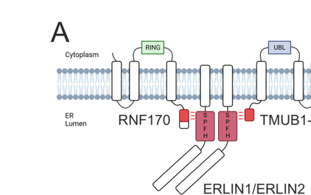

## Question

# Gene Research for Functional Annotation

## ⚠️ CRITICAL: Gene/Protein Identification Context

**BEFORE YOU BEGIN RESEARCH:** You MUST verify you are researching the CORRECT gene/protein. Gene symbols can be ambiguous, especially for less well-characterized genes from non-model organisms.

### Target Gene/Protein Identity (from UniProt):
- **UniProt Accession:** O94905
- **Protein Description:** RecName: Full=Erlin-2; AltName: Full=Endoplasmic reticulum lipid raft-associated protein 2; AltName: Full=Stomatin-prohibitin-flotillin-HflC/K domain-containing protein 2; Short=SPFH domain-containing protein 2;
- **Gene Information:** Name=ERLIN2; Synonyms=C8orf2, SPFH2; ORFNames=UNQ2441/PRO5003/PRO9924;
- **Organism (full):** Homo sapiens (Human).
- **Protein Family:** Belongs to the band 7/mec-2 family. .
- **Key Domains:** Band_7. (IPR001107); Band_7/SPFH_dom_sf. (IPR036013); Erlin1/2. (IPR033294); Band_7 (PF01145)

### MANDATORY VERIFICATION STEPS:

1. **Check if the gene symbol "ERLIN2" matches the protein description above**
2. **Verify the organism is correct:** Homo sapiens (Human).
3. **Check if protein family/domains align with what you find in literature**
4. **If you find literature for a DIFFERENT gene with the same or similar symbol, STOP**

### If Gene Symbol is Ambiguous or You Cannot Find Relevant Literature:

**DO NOT PROCEED WITH RESEARCH ON A DIFFERENT GENE.** Instead:
- State clearly: "The gene symbol 'ERLIN2' is ambiguous or literature is limited for this specific protein"
- Explain what you found (e.g., "Found extensive literature on a different gene with the same symbol in a different organism")
- Describe the protein based ONLY on the UniProt information provided above
- Suggest that the protein function can be inferred from domain/family information

### Research Target:

Please provide a comprehensive research report on the gene **ERLIN2** (gene ID: ERLIN2, UniProt: O94905) in human.

The research report should be a detailed narrative explaining the function, biological processes, and localization of the gene product. Citations should be given for all claims.

You should prioritize authoritative reviews and primary scientific literature when conducting research. You can supplement
this with annotations you find in gene/protein databases, but these can be outdated or inaccurate.

We are specifically interested in the primary function of the gene - for enzymes, what reaction is catalyzed, and what is the substrate specificity? For transporters, what is the substrate? For structural proteins or adapters, what is the broader structural role? For signaling molecules, what is the role in the pathway.

We are interested in where in or outside the cell the gene product carries out its function.

We are also interested in the signaling or biochemical pathways in which the gene functions. We are less interested in broad pleiotropic effects, except where these elucidate the precise role.

Include evidence where possible. We are interested in both experimental evidence as well as inference from structure, evolution, or bioinformatic analysis. Precise studies should be prioritized over high-throughput, where available.

## Output

Question: You are an expert researcher providing comprehensive, well-cited information.

Provide detailed information focusing on:
1. Key concepts and definitions with current understanding
2. Recent developments and latest research (prioritize 2023-2024 sources)
3. Current applications and real-world implementations
4. Expert opinions and analysis from authoritative sources
5. Relevant statistics and data from recent studies

Format as a comprehensive research report with proper citations. Include URLs and publication dates where available.
Always prioritize recent, authoritative sources and provide specific citations for all major claims.

# Gene Research for Functional Annotation

## ⚠️ CRITICAL: Gene/Protein Identification Context

**BEFORE YOU BEGIN RESEARCH:** You MUST verify you are researching the CORRECT gene/protein. Gene symbols can be ambiguous, especially for less well-characterized genes from non-model organisms.

### Target Gene/Protein Identity (from UniProt):
- **UniProt Accession:** O94905
- **Protein Description:** RecName: Full=Erlin-2; AltName: Full=Endoplasmic reticulum lipid raft-associated protein 2; AltName: Full=Stomatin-prohibitin-flotillin-HflC/K domain-containing protein 2; Short=SPFH domain-containing protein 2;
- **Gene Information:** Name=ERLIN2; Synonyms=C8orf2, SPFH2; ORFNames=UNQ2441/PRO5003/PRO9924;
- **Organism (full):** Homo sapiens (Human).
- **Protein Family:** Belongs to the band 7/mec-2 family. .
- **Key Domains:** Band_7. (IPR001107); Band_7/SPFH_dom_sf. (IPR036013); Erlin1/2. (IPR033294); Band_7 (PF01145)

### MANDATORY VERIFICATION STEPS:

1. **Check if the gene symbol "ERLIN2" matches the protein description above**
2. **Verify the organism is correct:** Homo sapiens (Human).
3. **Check if protein family/domains align with what you find in literature**
4. **If you find literature for a DIFFERENT gene with the same or similar symbol, STOP**

### If Gene Symbol is Ambiguous or You Cannot Find Relevant Literature:

**DO NOT PROCEED WITH RESEARCH ON A DIFFERENT GENE.** Instead:
- State clearly: "The gene symbol 'ERLIN2' is ambiguous or literature is limited for this specific protein"
- Explain what you found (e.g., "Found extensive literature on a different gene with the same symbol in a different organism")
- Describe the protein based ONLY on the UniProt information provided above
- Suggest that the protein function can be inferred from domain/family information

### Research Target:

Please provide a comprehensive research report on the gene **ERLIN2** (gene ID: ERLIN2, UniProt: O94905) in human.

The research report should be a detailed narrative explaining the function, biological processes, and localization of the gene product. Citations should be given for all claims.

You should prioritize authoritative reviews and primary scientific literature when conducting research. You can supplement
this with annotations you find in gene/protein databases, but these can be outdated or inaccurate.

We are specifically interested in the primary function of the gene - for enzymes, what reaction is catalyzed, and what is the substrate specificity? For transporters, what is the substrate? For structural proteins or adapters, what is the broader structural role? For signaling molecules, what is the role in the pathway.

We are interested in where in or outside the cell the gene product carries out its function.

We are also interested in the signaling or biochemical pathways in which the gene functions. We are less interested in broad pleiotropic effects, except where these elucidate the precise role.

Include evidence where possible. We are interested in both experimental evidence as well as inference from structure, evolution, or bioinformatic analysis. Precise studies should be prioritized over high-throughput, where available.

# Research Report: Functional Annotation of Human **ERLIN2** (UniProt O94905)

## 0. Target verification (critical identity check)
The literature reviewed here matches the UniProt-provided target: **ERLIN2** (ER lipid raft-associated protein 2; “Erlin-2”), encoded by **ERLIN2** in **Homo sapiens**, a ~40 kDa **band 7/SPFH-domain** ER membrane protein that forms an ERLIN1/2 hetero-oligomeric complex in cholesterol-rich ER membrane nanodomains. This description is consistent across mechanistic cell biology and disease genetics literature used in this report, supporting correct gene/protein identity alignment with UniProt accession **O94905**. (veronese2024erlin12scaffoldsbridge pages 1-2, manganelli2021roleoferlins pages 5-7)

## 1. Key concepts and current understanding

### 1.1 ERLIN2 as an ER “lipid-raft-like” nanodomain scaffold (definition)
“ER lipid rafts” (also described as detergent-resistant membranes/nanodomains) refer to **cholesterol-enriched microdomains** within the endoplasmic reticulum that organize specific proteins and lipids into functional assemblies. ERLIN2 (with ERLIN1) is widely treated as a marker and organizer of these ER raft-like domains, functioning as a **non-enzymatic scaffold** rather than a catalytic enzyme. (veronese2024erlin12scaffoldsbridge pages 1-2, manganelli2021roleoferlins pages 5-7)

### 1.2 ERLIN2 in ER-associated degradation (ERAD): adaptor/scaffold role
ER-associated degradation (ERAD) removes specific ER and ER membrane proteins by ubiquitination and extraction (often via p97/VCP) followed by proteasomal degradation. ERLIN2 contributes to ERAD primarily by **organizing client proteins and ubiquitination/extraction machinery** within ER nanodomains, rather than directly ubiquitinating substrates. The best-supported example is activated **inositol 1,4,5-trisphosphate receptors (IP3Rs)**, which undergo ubiquitination and ERAD after activation. (veronese2024erlin12scaffoldsbridge pages 1-2, manganelli2021roleoferlins pages 5-7)

### 1.3 ERLIN2 and lipid/cholesterol homeostasis
A major theme is that ERLIN2 binds cholesterol and participates in pathways that connect ER cholesterol status to (i) regulation of **SREBP** (sterol regulatory element-binding proteins) activation and (ii) downstream effects on lipid storage (e.g., cholesteryl ester formation) and secretory pathway function. (veronese2024erlin12scaffoldsbridge pages 1-2, veronese2024erlin12scaffoldsbridge pages 12-12, manganelli2021roleoferlins pages 5-7)

## 2. Molecular function, subcellular localization, complexes, and pathways (experimental evidence)

### 2.1 Subcellular localization
ERLIN2 localizes to the **endoplasmic reticulum membrane**, enriched in **cholesterol-rich ER detergent-resistant membrane fractions/nanodomains**. Evidence from recent mechanistic work also supports functional presence near **ER–Golgi contact regions**, consistent with roles in cholesterol flux to the Golgi and regulation of Golgi morphology/secretory trafficking. (veronese2024erlin12scaffoldsbridge pages 1-2, veronese2024erlin12scaffoldsbridge pages 12-12)

### 2.2 Core molecular function: large ERLIN1/2 scaffold complex
ERLIN2 assembles with ERLIN1 into large **ring-like hetero-oligomeric scaffold structures** on the ER membrane. These scaffolds provide multivalent binding surfaces that can recruit luminal motifs and stabilize interactions among client proteins and regulators. A 2024 study (Life Science Alliance) directly connects this scaffolding role to the formation of an interaction bridge between the ER proteins **TMUB1** and **RNF170**. (veronese2024erlin12scaffoldsbridge pages 1-2)

**Visual evidence (mechanistic model and phenotype):** ERLIN1/2 scaffold organization and its link to cholesterol esterification phenotypes and rescue by SOAT1 inhibition are summarized in the figures retrieved from Veronese et al. 2024. (veronese2024erlin12scaffoldsbridge media 30054738, veronese2024erlin12scaffoldsbridge media bd5fdacb, veronese2024erlin12scaffoldsbridge media 2c4467d5, veronese2024erlin12scaffoldsbridge media bf33204b, veronese2024erlin12scaffoldsbridge media c1b3c978)

### 2.3 Interaction partners and mechanistic pathway context
**RNF170 and IP3R ERAD.** RNF170 is an ER membrane ubiquitin ligase implicated in ubiquitination of activated IP3Rs, with ERLIN scaffolds serving as platforms that recruit or support RNF170 function toward IP3Rs. This supports ERLIN2’s role in the **IP3R ubiquitination → extraction → degradation** axis, linking ERLIN2 to calcium signaling control via IP3R abundance. (veronese2024erlin12scaffoldsbridge pages 1-2, cioffi2024hereditaryspasticparaparesis pages 1-2, manganelli2021roleoferlins pages 5-7)

**TMUB1, p97/VCP extraction, and ERAD coupling.** TMUB1 is described as an ER-resident escort factor that promotes p97-mediated extraction of membrane proteins. The 2024 mechanistic study shows ERLIN scaffolds bridging TMUB1 and RNF170 via conserved luminal motifs, providing a concrete model for how ERLIN2-containing scaffolds can couple **ubiquitination (RNF170)** with **extraction (TMUB1/p97)** within ER nanodomains. (veronese2024erlin12scaffoldsbridge pages 1-2, veronese2024erlin12scaffoldsbridge pages 19-20)

**Lipid regulation module (INSIG/SREBP/SCAP).** Erlins physically interact with components of the SREBP regulatory system (SREBP–SCAP–INSIG) and are proposed to contribute to sterol-dependent retention/processing, thereby connecting ERLIN2 scaffolds to sterol-sensing control of lipid biosynthesis. (manganelli2021roleoferlins pages 5-7)

### 2.4 Cholesterol esterification control and secretory pathway regulation (2024 primary research)
Veronese et al. (May 2024) provide direct functional evidence that ERLIN1/2 scaffolds **restrict cholesterol esterification** and influence **Golgi morphology** and the **secretory pathway**.

* Mechanistic model: ERLIN scaffolds bind cholesterol and modulate its accessibility to the ER cholesterol esterification enzyme **SOAT1**, thereby favoring **ER-to-Golgi cholesterol transport** and maintaining secretory pathway organization. (veronese2024erlin12scaffoldsbridge pages 1-2, veronese2024erlin12scaffoldsbridge pages 12-12)
* Pharmacologic intervention: the study reports that **SOAT1 inhibition** (using **avasimibe**) can rescue ERLIN-deficiency-associated phenotypes, including excessive large lipid droplets and Golgi fragmentation, supporting causality of cholesterol esterification imbalance downstream of ERLIN loss. (veronese2024erlin12scaffoldsbridge media 30054738, veronese2024erlin12scaffoldsbridge media bf33204b)
* Quantitative datapoint explicitly available in the retrieved text: ERLIN double knockout cells showed a tendency toward increased SOAT1 abundance (**log2FC = 0.40; q = 0.07**). (veronese2024erlin12scaffoldsbridge pages 12-12)

## 3. Recent developments (prioritizing 2023–2024)

### 3.1 Patient-derived stem cell models implicate Ca2+ dysregulation in ERLIN2-linked HSP (2023)
Zhu et al. (Jun 2023) used **patient-derived iPSC models** and identified a heterozygous ERLIN2 missense variant (**p.Val71Ala**) in an HSP family. Their mechanistic interpretation was that mutant ERLIN2 recruited the E3 ligase **RNF213**, promoting degradation of **IP3R1**, which lowered intracellular free Ca2+, induced **ER-stress-mediated apoptosis**, and suppressed **MAPK signaling**, reducing proliferation in patient-derived neural cells. This work proposes a specific autosomal-dominant disease mechanism via altered IP3R abundance and calcium homeostasis. (zhu2023disruptionofintracellular pages 1-2)

### 3.2 Clinical expansion and inheritance patterns in SPG18 (2024)
Two 2024 clinical genetics studies expand phenotype and inheritance considerations for ERLIN2-related spastic paraplegia:

* Cioffi et al. (Mar 2024) emphasize that SPG18 is classically recessive but that monoallelic/autosomal dominant presentations have been described; they also report **HSP-to-ALS phenoconversion in 2 of 5 cases** in their series. They note screening scale in one diagnostic workflow: **944 clinically suspected HSP patients tested over 8 years**. (cioffi2024hereditaryspasticparaparesis pages 1-2)
* Trinchillo et al. (Apr 2024) report an autosomal dominant ERLIN2 mutation segregating in a large family with variable expressivity, including complicated presentations, further supporting phenotypic breadth beyond “pure” HSP in some ERLIN2 variant contexts. (trinchillo2024expandingspg18clinical pages 8-9)

### 3.3 Connecting ERLIN scaffolds to neurologic disease mechanisms (2024 cell biology)
The 2024 scaffold study explicitly links ERLIN complex biology (TMUB1/RNF170 and cholesterol esterification control) to variants previously linked to hereditary spastic paraplegia, framing disease as potentially involving disruption of nanodomain scaffold interactions that couple lipid handling and ERAD/client processing. (veronese2024erlin12scaffoldsbridge pages 1-2, veronese2024erlin12scaffoldsbridge pages 12-12)

## 4. Current applications and real-world implementations

### 4.1 Clinical genetics and diagnostics
ERLIN2 is now a recognized disease gene in hereditary spastic paraplegia gene panels and exome/genome sequencing workflows; the 2024 Italian series provides real-world scale metrics (944 suspected HSP patients screened over 8 years) and highlights the practical diagnostic implication that HSP gene panels may be relevant even in familial ALS-like presentations due to observed phenoconversion in some ERLIN2-linked cases. (cioffi2024hereditaryspasticparaparesis pages 1-2)

### 4.2 Experimental pharmacology / pathway “druggability” signals
While no approved ERLIN2-targeted therapy exists in the evidence reviewed, Veronese et al. provide a proof-of-principle that modulating downstream lipid metabolism can correct ERLIN-loss phenotypes: **SOAT1 inhibition (avasimibe)** rescued lipid droplet and Golgi phenotypes in ERLIN-deficient cells. This suggests a potential translational direction (pathway-level intervention rather than direct ERLIN2 targeting) for disorders where cholesterol esterification imbalance is a driver. (veronese2024erlin12scaffoldsbridge media 30054738, veronese2024erlin12scaffoldsbridge media bf33204b)

### 4.3 Knowledgebase integration (target–disease association)
Open Targets aggregates literature-based evidence linking ERLIN2 to **hereditary spastic paraplegia 18** and broader hereditary spastic paraplegia disease concepts, as well as cancer-related associations (likely reflecting ERLIN2 amplification/ER-stress literature). This is useful for prioritization but should be interpreted as an evidence aggregation layer rather than direct mechanistic proof. (OpenTargets Search: -ERLIN2)

## 5. Expert synthesis and analysis (mechanism-focused)

### 5.1 Primary functional annotation (non-enzymatic scaffold)
The most defensible primary function for ERLIN2 is that of an **ER membrane nanodomain scaffold/adaptor** that integrates two major functional themes:

1. **Quality control / receptor turnover:** organizing ERAD machinery around activated clients such as **IP3Rs**, in coordination with ubiquitin ligases (e.g., RNF170) and extraction factors (p97/VCP machinery via TMUB1). (veronese2024erlin12scaffoldsbridge pages 1-2, manganelli2021roleoferlins pages 5-7)
2. **Lipid handling coupled to trafficking:** shaping local ER cholesterol accessibility and routing (restricting esterification; promoting ER-to-Golgi cholesterol movement), impacting Golgi morphology and secretion. (veronese2024erlin12scaffoldsbridge pages 1-2, veronese2024erlin12scaffoldsbridge pages 12-12)

This dual role provides a plausible bridge between (i) neurologic phenotypes driven by altered Ca2+ homeostasis (via IP3R regulation) and (ii) broader cell biology phenotypes involving secretory pathway dysfunction and lipid droplet accumulation.

### 5.2 Disease mechanism models supported by 2023–2024 evidence
Two non-mutually exclusive mechanisms are supported:

* **Ca2+ signaling perturbation via IP3R abundance:** patient-derived iPSC work supports a model where mutant ERLIN2 drives abnormal IP3R1 degradation and downstream Ca2+ depletion/ER stress and apoptosis in neural contexts. (zhu2023disruptionofintracellular pages 1-2)
* **Cholesterol esterification/secretory pathway imbalance:** ERLIN loss shifts cholesterol toward esterification and lipid droplet accumulation and disrupts Golgi morphology; SOAT1 inhibition rescues phenotypes, supporting causal linkage. (veronese2024erlin12scaffoldsbridge media 30054738, veronese2024erlin12scaffoldsbridge media bf33204b)

## 6. Key statistics and data points (from retrieved sources)
* **SOAT1 abundance trend in ERLIN DKO cells:** log2FC **0.40**; q **0.07**. (veronese2024erlin12scaffoldsbridge pages 12-12)
* **Phenoconversion in a 2024 SPG18 series:** **2/5 cases** reported with HSP→ALS phenoconversion. (cioffi2024hereditaryspasticparaparesis pages 1-2)
* **Diagnostic workflow scale:** **944** clinically suspected HSP patients screened over **8 years** in a single laboratory setting (contextualizing rarity and diagnostic throughput). (cioffi2024hereditaryspasticparaparesis pages 1-2)

## 7. Evidence summary table
The following table provides a structured evidence map linking ERLIN2 functional annotation components to key sources, including URLs/DOIs and explicitly captured quantitative points.

| Aspect | Key findings | Key sources (author year, journal) | URL/DOI |
|---|---|---|---|
| Identity/domain/localization | ERLIN2 is the verified human protein encoded by **ERLIN2** (UniProt **O94905**), an **ER lipid raft-associated** membrane protein in the **band 7/SPFH family** that hetero-oligomerizes with ERLIN1. It localizes mainly to **cholesterol-rich ER detergent-resistant nanodomains** and has also been linked to **ER–Golgi contact regions** and, under some conditions, **MAM-associated rafts** (veronese2024erlin12scaffoldsbridge pages 1-2, manganelli2021roleoferlins pages 5-7). | Veronese 2024, *Life Science Alliance*; Manganelli 2021, *Cells* | https://doi.org/10.26508/lsa.202402620 ; https://doi.org/10.3390/cells10092408 |
| Complex/partners | ERLIN2 forms large **ring-shaped ERLIN1/2 complexes** (likely ~24 subunits) that scaffold membrane proteins. Reported partners include **ERLIN1**, **RNF170**, **TMUB1**, **TMEM259**, **INSIG1**, **FAF2**, **VCP/p97**, and associations with other ERAD ligases. A 2024 study showed ERLIN scaffolds bridge **TMUB1 and RNF170** through a conserved luminal motif that binds adjacent ERLIN SPFH interfaces (veronese2024erlin12scaffoldsbridge pages 1-2, veronese2024erlin12scaffoldsbridge pages 12-12, veronese2024erlin12scaffoldsbridge pages 19-20). | Veronese 2024, *Life Science Alliance* | https://doi.org/10.26508/lsa.202402620 |
| Pathways/mechanism | Best-supported mechanism: ERLIN2 acts as a **non-enzymatic ER membrane scaffold/adaptor** in **ER-associated degradation (ERAD)**, especially for **activated IP3 receptors (IP3Rs)**. ERLIN2 helps recruit **RNF170** for IP3R ubiquitination/degradation and binds **cholesterol** and **PI3P**, supporting microdomain assembly and client handling. ERLINs also influence **SREBP/INSIG/SCAP** regulation, **HMG-CoA reductase** turnover, and **cholesterol partitioning/esterification**, thereby affecting **Golgi morphology** and the **secretory pathway** (veronese2024erlin12scaffoldsbridge pages 1-2, veronese2024erlin12scaffoldsbridge pages 12-12, manganelli2021roleoferlins pages 5-7). | Veronese 2024, *Life Science Alliance*; Manganelli 2021, *Cells* | https://doi.org/10.26508/lsa.202402620 ; https://doi.org/10.3390/cells10092408 |
| Disease links | Human genetics strongly links ERLIN2 to **SPG18 / hereditary spastic paraplegia (HSP)** with **autosomal recessive** and some **autosomal dominant** presentations. Clinical expansion includes developmental delay, seizures, contractures, hearing loss, and reported **HSP-to-ALS phenoconversion** in some families. Recent work also proposed a dominant mechanism in which mutant ERLIN2 alters IP3R control and Ca2+ homeostasis (cioffi2024hereditaryspasticparaparesis pages 1-2, zhu2023disruptionofintracellular pages 1-2, trinchillo2024expandingspg18clinical pages 8-9, OpenTargets Search: -ERLIN2). | Cioffi 2024, *Neurological Sciences*; Zhu 2023, *Human Mutation*; Trinchillo 2024, *Neurological Sciences*; Open Targets | https://doi.org/10.1007/s10072-024-07423-w ; https://doi.org/10.1155/2023/4834423 ; https://doi.org/10.1007/s10072-024-07500-0 ; https://platform.opentargets.org/target/ENSG00000147475 |
| Key quantitative findings | Explicit quantitative snippets reported in accessible evidence: **HeLa ERLIN double-knockout** cells showed a tendency toward increased **SOAT1** abundance (**log2FC = 0.40; q = 0.07**), consistent with increased cholesterol esterification pressure; in one 2024 SPG18 clinical series, **2 of 5 cases** showed **HSP→ALS phenoconversion**; the same report noted **944 clinically suspected HSP patients screened over 8 years** in one laboratory workflow (veronese2024erlin12scaffoldsbridge pages 12-12, cioffi2024hereditaryspasticparaparesis pages 1-2). | Veronese 2024, *Life Science Alliance*; Cioffi 2024, *Neurological Sciences* | https://doi.org/10.26508/lsa.202402620 ; https://doi.org/10.1007/s10072-024-07423-w |
| 2023–2024 mechanistic update | A 2023 patient-derived iPSC study of **ERLIN2 p.Val71Ala** proposed that mutant ERLIN2 recruits **RNF213** to drive **IP3R1 degradation**, lowering intracellular free **Ca2+**, triggering **ER-stress apoptosis**, and suppressing **MAPK signaling/cell proliferation**. A 2024 cell-biology study extended ERLIN function beyond classical ERAD, showing ERLIN scaffolds **restrict cholesterol esterification** and favor **ER-to-Golgi cholesterol transport** to support secretory-pathway organization (zhu2023disruptionofintracellular pages 1-2, veronese2024erlin12scaffoldsbridge pages 1-2). | Zhu 2023, *Human Mutation*; Veronese 2024, *Life Science Alliance* | https://doi.org/10.1155/2023/4834423 ; https://doi.org/10.26508/lsa.202402620 |

*Table: This table summarizes the core functional annotation evidence for human ERLIN2, emphasizing verified identity, molecular mechanism, disease relevance, and the most explicit quantitative findings from recent literature.*

## 8. Key sources (prioritized, with publication dates and URLs)
* **Veronese et al.** “ERLIN1/2 scaffolds bridge TMUB1 and RNF170 and restrict cholesterol esterification to regulate the secretory pathway.” *Life Science Alliance* (May 2024). https://doi.org/10.26508/lsa.202402620 (veronese2024erlin12scaffoldsbridge pages 1-2, veronese2024erlin12scaffoldsbridge pages 12-12, veronese2024erlin12scaffoldsbridge media 30054738)
* **Zhu et al.** “Disruption of Intracellular Calcium Homeostasis Leads to ERLIN2-Linked Hereditary Spastic Paraplegia in Patient-Derived Stem Cell Models.” *Human Mutation* (Jun 2023). https://doi.org/10.1155/2023/4834423 (zhu2023disruptionofintracellular pages 1-2)
* **Cioffi et al.** “Hereditary spastic paraparesis type 18 (SPG18): new ERLIN2 variants…” *Neurological Sciences* (Mar 2024). https://doi.org/10.1007/s10072-024-07423-w (cioffi2024hereditaryspasticparaparesis pages 1-2)
* **Trinchillo et al.** “Expanding SPG18 clinical spectrum: autosomal dominant mutation…” *Neurological Sciences* (Apr 2024). https://doi.org/10.1007/s10072-024-07500-0 (trinchillo2024expandingspg18clinical pages 8-9)
* **Manganelli et al.** “Role of ERLINs in the control of cell fate through lipid rafts.” *Cells* (Sep 2021). https://doi.org/10.3390/cells10092408 (manganelli2021roleoferlins pages 5-7)
* **Open Targets Platform (ERLIN2 target page)** (accessed via tool output). https://platform.opentargets.org/target/ENSG00000147475 (OpenTargets Search: -ERLIN2)

## 9. Limitations of this synthesis
Some mechanistic claims widely discussed in the ERLIN literature (e.g., detailed kinetics of IP3R ubiquitination steps, full substrate lists beyond IP3R/HMGR, and structural resolution of the oligomer) are referenced in the review and scaffold work but were not all available as fully inspectable primary evidence snippets in the retrieved text corpus for this run. Therefore, the report emphasizes mechanisms directly supported by the retrieved full-text evidence and figures. (veronese2024erlin12scaffoldsbridge pages 1-2, manganelli2021roleoferlins pages 5-7)

References

1. (veronese2024erlin12scaffoldsbridge pages 1-2): Matteo Veronese, Sebastian Kallabis, Alexander Tobias Kaczmarek, Anushka Das, Lennart Robers, Simon Schumacher, Alessia Lofrano, Susanne Brodesser, Stefan Müller, Kay Hofmann, Marcus Krüger, and Elena I Rugarli. Erlin1/2 scaffolds bridge tmub1 and rnf170 and restrict cholesterol esterification to regulate the secretory pathway. Life Science Alliance, 7:e202402620, May 2024. URL: https://doi.org/10.26508/lsa.202402620, doi:10.26508/lsa.202402620. This article has 8 citations and is from a peer-reviewed journal.

2. (manganelli2021roleoferlins pages 5-7): Valeria Manganelli, Agostina Longo, Vincenzo Mattei, Serena Recalchi, Gloria Riitano, Daniela Caissutti, Antonella Capozzi, Maurizio Sorice, Roberta Misasi, and Tina Garofalo. Role of erlins in the control of cell fate through lipid rafts. Cells, 10:2408, Sep 2021. URL: https://doi.org/10.3390/cells10092408, doi:10.3390/cells10092408. This article has 42 citations.

3. (veronese2024erlin12scaffoldsbridge pages 12-12): Matteo Veronese, Sebastian Kallabis, Alexander Tobias Kaczmarek, Anushka Das, Lennart Robers, Simon Schumacher, Alessia Lofrano, Susanne Brodesser, Stefan Müller, Kay Hofmann, Marcus Krüger, and Elena I Rugarli. Erlin1/2 scaffolds bridge tmub1 and rnf170 and restrict cholesterol esterification to regulate the secretory pathway. Life Science Alliance, 7:e202402620, May 2024. URL: https://doi.org/10.26508/lsa.202402620, doi:10.26508/lsa.202402620. This article has 8 citations and is from a peer-reviewed journal.

4. (veronese2024erlin12scaffoldsbridge media 30054738): Matteo Veronese, Sebastian Kallabis, Alexander Tobias Kaczmarek, Anushka Das, Lennart Robers, Simon Schumacher, Alessia Lofrano, Susanne Brodesser, Stefan Müller, Kay Hofmann, Marcus Krüger, and Elena I Rugarli. Erlin1/2 scaffolds bridge tmub1 and rnf170 and restrict cholesterol esterification to regulate the secretory pathway. Life Science Alliance, 7:e202402620, May 2024. URL: https://doi.org/10.26508/lsa.202402620, doi:10.26508/lsa.202402620. This article has 8 citations and is from a peer-reviewed journal.

5. (veronese2024erlin12scaffoldsbridge media bd5fdacb): Matteo Veronese, Sebastian Kallabis, Alexander Tobias Kaczmarek, Anushka Das, Lennart Robers, Simon Schumacher, Alessia Lofrano, Susanne Brodesser, Stefan Müller, Kay Hofmann, Marcus Krüger, and Elena I Rugarli. Erlin1/2 scaffolds bridge tmub1 and rnf170 and restrict cholesterol esterification to regulate the secretory pathway. Life Science Alliance, 7:e202402620, May 2024. URL: https://doi.org/10.26508/lsa.202402620, doi:10.26508/lsa.202402620. This article has 8 citations and is from a peer-reviewed journal.

6. (veronese2024erlin12scaffoldsbridge media 2c4467d5): Matteo Veronese, Sebastian Kallabis, Alexander Tobias Kaczmarek, Anushka Das, Lennart Robers, Simon Schumacher, Alessia Lofrano, Susanne Brodesser, Stefan Müller, Kay Hofmann, Marcus Krüger, and Elena I Rugarli. Erlin1/2 scaffolds bridge tmub1 and rnf170 and restrict cholesterol esterification to regulate the secretory pathway. Life Science Alliance, 7:e202402620, May 2024. URL: https://doi.org/10.26508/lsa.202402620, doi:10.26508/lsa.202402620. This article has 8 citations and is from a peer-reviewed journal.

7. (veronese2024erlin12scaffoldsbridge media bf33204b): Matteo Veronese, Sebastian Kallabis, Alexander Tobias Kaczmarek, Anushka Das, Lennart Robers, Simon Schumacher, Alessia Lofrano, Susanne Brodesser, Stefan Müller, Kay Hofmann, Marcus Krüger, and Elena I Rugarli. Erlin1/2 scaffolds bridge tmub1 and rnf170 and restrict cholesterol esterification to regulate the secretory pathway. Life Science Alliance, 7:e202402620, May 2024. URL: https://doi.org/10.26508/lsa.202402620, doi:10.26508/lsa.202402620. This article has 8 citations and is from a peer-reviewed journal.

8. (veronese2024erlin12scaffoldsbridge media c1b3c978): Matteo Veronese, Sebastian Kallabis, Alexander Tobias Kaczmarek, Anushka Das, Lennart Robers, Simon Schumacher, Alessia Lofrano, Susanne Brodesser, Stefan Müller, Kay Hofmann, Marcus Krüger, and Elena I Rugarli. Erlin1/2 scaffolds bridge tmub1 and rnf170 and restrict cholesterol esterification to regulate the secretory pathway. Life Science Alliance, 7:e202402620, May 2024. URL: https://doi.org/10.26508/lsa.202402620, doi:10.26508/lsa.202402620. This article has 8 citations and is from a peer-reviewed journal.

9. (cioffi2024hereditaryspasticparaparesis pages 1-2): Ettore Cioffi, Valeria Gioiosa, Alessandra Tessa, Antonio Petrucci, Rosanna Trovato, Filippo Maria Santorelli, and Carlo Casali. Hereditary spastic paraparesis type 18 (spg18): new erlin2 variants in a series of italian patients, shedding light upon genetic and phenotypic variability. Neurological Sciences, 45:3845-3852, Mar 2024. URL: https://doi.org/10.1007/s10072-024-07423-w, doi:10.1007/s10072-024-07423-w. This article has 3 citations and is from a peer-reviewed journal.

10. (veronese2024erlin12scaffoldsbridge pages 19-20): Matteo Veronese, Sebastian Kallabis, Alexander Tobias Kaczmarek, Anushka Das, Lennart Robers, Simon Schumacher, Alessia Lofrano, Susanne Brodesser, Stefan Müller, Kay Hofmann, Marcus Krüger, and Elena I Rugarli. Erlin1/2 scaffolds bridge tmub1 and rnf170 and restrict cholesterol esterification to regulate the secretory pathway. Life Science Alliance, 7:e202402620, May 2024. URL: https://doi.org/10.26508/lsa.202402620, doi:10.26508/lsa.202402620. This article has 8 citations and is from a peer-reviewed journal.

11. (zhu2023disruptionofintracellular pages 1-2): Xin Zhu, Xiaoyin Tan, Junwen Wang, Limeng Dai, Jia Li, Xingying Guan, Ziyi Wang, Mao Zhang, Junyan Hu, Yun Bai, and Hongen Guo. Disruption of intracellular calcium homeostasis leads to erlin2-linked hereditary spastic paraplegia in patient-derived stem cell models. Human Mutation, 2023:1-14, Jun 2023. URL: https://doi.org/10.1155/2023/4834423, doi:10.1155/2023/4834423. This article has 1 citations and is from a domain leading peer-reviewed journal.

12. (trinchillo2024expandingspg18clinical pages 8-9): Assunta Trinchillo, Valeria Valente, Marcello Esposito, Miriana Migliaccio, Aniello Iovino, Michele Picciocchi, Nunzia Cuomo, Carmela Caccavale, Cristofaro Nocerino, Laura De Rosa, Elena Salvatore, Giovanna Maria Pierantoni, Valeria Menchise, Simona Paladino, and Chiara Criscuolo. Expanding spg18 clinical spectrum: autosomal dominant mutation causes complicated hereditary spastic paraplegia in a large family. Neurological Sciences, 45:4373-4381, Apr 2024. URL: https://doi.org/10.1007/s10072-024-07500-0, doi:10.1007/s10072-024-07500-0. This article has 2 citations and is from a peer-reviewed journal.

13. (OpenTargets Search: -ERLIN2): Open Targets Query (-ERLIN2, 5 results). Buniello, A. et al. (2025). Open Targets Platform: facilitating therapeutic hypotheses building in drug discovery. Nucleic Acids Research.

## Artifacts

- [Edison artifact artifact-00](ERLIN2-deep-research-falcon_artifacts/artifact-00.md)

## Citations

1. manganelli2021roleoferlins pages 5-7
2. zhu2023disruptionofintracellular pages 1-2
3. cioffi2024hereditaryspasticparaparesis pages 1-2
4. https://doi.org/10.26508/lsa.202402620
5. https://doi.org/10.3390/cells10092408
6. https://doi.org/10.1007/s10072-024-07423-w
7. https://doi.org/10.1155/2023/4834423
8. https://doi.org/10.1007/s10072-024-07500-0
9. https://platform.opentargets.org/target/ENSG00000147475
10. https://doi.org/10.26508/lsa.202402620,
11. https://doi.org/10.3390/cells10092408,
12. https://doi.org/10.1007/s10072-024-07423-w,
13. https://doi.org/10.1155/2023/4834423,
14. https://doi.org/10.1007/s10072-024-07500-0,