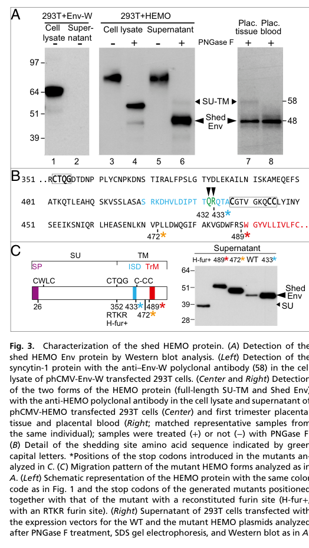

## Question

# Gene Research for Functional Annotation

## ⚠️ CRITICAL: Gene/Protein Identification Context

**BEFORE YOU BEGIN RESEARCH:** You MUST verify you are researching the CORRECT gene/protein. Gene symbols can be ambiguous, especially for less well-characterized genes from non-model organisms.

### Target Gene/Protein Identity (from UniProt):
- **UniProt Accession:** Q9H9K5
- **Protein Description:** RecName: Full=Endogenous retroviral envelope protein HEMO {ECO:0000305}; AltName: Full=Endogenous retrovirus group MER34 member 1 Env polyprotein {ECO:0000305}; AltName: Full=HERV-MER_4q12 provirus ancestral Env polyprotein; AltName: Full=Human endogenous MER34 (medium-reiteration-frequency-family-34) open reading frame {ECO:0000303|PubMed:28739914}; AltName: Full=Human endogenous MER34 ORF {ECO:0000303|PubMed:28739914}; Short=HEMO {ECO:0000303|PubMed:28739914}; Contains: RecName: Full=Endogenous retroviral envelope protein HEMO, secreted form {ECO:0000305}; AltName: Full=Endogenous retroviral envelope protein HEMO, 48 kDa form; Flags: Precursor;
- **Gene Information:** Name=ERVMER34-1 {ECO:0000312|HGNC:HGNC:42970}; Synonyms=HEMO {ECO:0000303|PubMed:28739914}; ORFNames=LP9056;
- **Organism (full):** Homo sapiens (Human).
- **Protein Family:** Belongs to the gamma type-C retroviral envelope protein
- **Key Domains:** TLV/ENV_coat_polyprotein. (IPR018154)

### MANDATORY VERIFICATION STEPS:

1. **Check if the gene symbol "ERVMER34-1" matches the protein description above**
2. **Verify the organism is correct:** Homo sapiens (Human).
3. **Check if protein family/domains align with what you find in literature**
4. **If you find literature for a DIFFERENT gene with the same or similar symbol, STOP**

### If Gene Symbol is Ambiguous or You Cannot Find Relevant Literature:

**DO NOT PROCEED WITH RESEARCH ON A DIFFERENT GENE.** Instead:
- State clearly: "The gene symbol 'ERVMER34-1' is ambiguous or literature is limited for this specific protein"
- Explain what you found (e.g., "Found extensive literature on a different gene with the same symbol in a different organism")
- Describe the protein based ONLY on the UniProt information provided above
- Suggest that the protein function can be inferred from domain/family information

### Research Target:

Please provide a comprehensive research report on the gene **ERVMER34-1** (gene ID: ERVMER34-1, UniProt: Q9H9K5) in human.

The research report should be a detailed narrative explaining the function, biological processes, and localization of the gene product. Citations should be given for all claims.

You should prioritize authoritative reviews and primary scientific literature when conducting research. You can supplement
this with annotations you find in gene/protein databases, but these can be outdated or inaccurate.

We are specifically interested in the primary function of the gene - for enzymes, what reaction is catalyzed, and what is the substrate specificity? For transporters, what is the substrate? For structural proteins or adapters, what is the broader structural role? For signaling molecules, what is the role in the pathway.

We are interested in where in or outside the cell the gene product carries out its function.

We are also interested in the signaling or biochemical pathways in which the gene functions. We are less interested in broad pleiotropic effects, except where these elucidate the precise role.

Include evidence where possible. We are interested in both experimental evidence as well as inference from structure, evolution, or bioinformatic analysis. Precise studies should be prioritized over high-throughput, where available.

## Output

Question: You are an expert researcher providing comprehensive, well-cited information.

Provide detailed information focusing on:
1. Key concepts and definitions with current understanding
2. Recent developments and latest research (prioritize 2023-2024 sources)
3. Current applications and real-world implementations
4. Expert opinions and analysis from authoritative sources
5. Relevant statistics and data from recent studies

Format as a comprehensive research report with proper citations. Include URLs and publication dates where available.
Always prioritize recent, authoritative sources and provide specific citations for all major claims.

# Gene Research for Functional Annotation

## ⚠️ CRITICAL: Gene/Protein Identification Context

**BEFORE YOU BEGIN RESEARCH:** You MUST verify you are researching the CORRECT gene/protein. Gene symbols can be ambiguous, especially for less well-characterized genes from non-model organisms.

### Target Gene/Protein Identity (from UniProt):
- **UniProt Accession:** Q9H9K5
- **Protein Description:** RecName: Full=Endogenous retroviral envelope protein HEMO {ECO:0000305}; AltName: Full=Endogenous retrovirus group MER34 member 1 Env polyprotein {ECO:0000305}; AltName: Full=HERV-MER_4q12 provirus ancestral Env polyprotein; AltName: Full=Human endogenous MER34 (medium-reiteration-frequency-family-34) open reading frame {ECO:0000303|PubMed:28739914}; AltName: Full=Human endogenous MER34 ORF {ECO:0000303|PubMed:28739914}; Short=HEMO {ECO:0000303|PubMed:28739914}; Contains: RecName: Full=Endogenous retroviral envelope protein HEMO, secreted form {ECO:0000305}; AltName: Full=Endogenous retroviral envelope protein HEMO, 48 kDa form; Flags: Precursor;
- **Gene Information:** Name=ERVMER34-1 {ECO:0000312|HGNC:HGNC:42970}; Synonyms=HEMO {ECO:0000303|PubMed:28739914}; ORFNames=LP9056;
- **Organism (full):** Homo sapiens (Human).
- **Protein Family:** Belongs to the gamma type-C retroviral envelope protein
- **Key Domains:** TLV/ENV_coat_polyprotein. (IPR018154)

### MANDATORY VERIFICATION STEPS:

1. **Check if the gene symbol "ERVMER34-1" matches the protein description above**
2. **Verify the organism is correct:** Homo sapiens (Human).
3. **Check if protein family/domains align with what you find in literature**
4. **If you find literature for a DIFFERENT gene with the same or similar symbol, STOP**

### If Gene Symbol is Ambiguous or You Cannot Find Relevant Literature:

**DO NOT PROCEED WITH RESEARCH ON A DIFFERENT GENE.** Instead:
- State clearly: "The gene symbol 'ERVMER34-1' is ambiguous or literature is limited for this specific protein"
- Explain what you found (e.g., "Found extensive literature on a different gene with the same symbol in a different organism")
- Describe the protein based ONLY on the UniProt information provided above
- Suggest that the protein function can be inferred from domain/family information

### Research Target:

Please provide a comprehensive research report on the gene **ERVMER34-1** (gene ID: ERVMER34-1, UniProt: Q9H9K5) in human.

The research report should be a detailed narrative explaining the function, biological processes, and localization of the gene product. Citations should be given for all claims.

You should prioritize authoritative reviews and primary scientific literature when conducting research. You can supplement
this with annotations you find in gene/protein databases, but these can be outdated or inaccurate.

We are specifically interested in the primary function of the gene - for enzymes, what reaction is catalyzed, and what is the substrate specificity? For transporters, what is the substrate? For structural proteins or adapters, what is the broader structural role? For signaling molecules, what is the role in the pathway.

We are interested in where in or outside the cell the gene product carries out its function.

We are also interested in the signaling or biochemical pathways in which the gene functions. We are less interested in broad pleiotropic effects, except where these elucidate the precise role.

Include evidence where possible. We are interested in both experimental evidence as well as inference from structure, evolution, or bioinformatic analysis. Precise studies should be prioritized over high-throughput, where available.

## Comprehensive Research Report: ERVMER34-1 (HEMO) Functional Annotation (Human; UniProt Q9H9K5)

### 0) Target verification (mandatory)
The literature analyzed matches the UniProt target **Q9H9K5**, encoding the **endogenous retroviral envelope protein HEMO**, whose gene is **ERVMER34-1** (synonym **HEMO**) in **Homo sapiens**. The defining primary reference explicitly identifies HEMO as a **MER34-derived env** gene at **chromosome 4q12** and characterizes its Env-like features, placental expression, and shedding into maternal blood, aligning with the UniProt description (heidmann2017hemoanancestral pages 2-3, heidmann2017hemoanancestral pages 1-1).

### 1) Key concepts, definitions, and current understanding

#### 1.1 What ERVMER34-1/HEMO is
**ERVMER34-1 (HEMO)** is a **co-opted (domesticated) endogenous retroviral envelope (Env)-like gene**. Unlike classical exogenous retroviral Env proteins that mediate viral entry and often require proteolytic processing into SU (surface) and TM (transmembrane) subunits, HEMO exhibits **unusual processing dominated by ectodomain shedding** rather than canonical SU–TM cleavage (heidmann2017hemoanancestral pages 4-4, heidmann2017hemoanancestral pages 2-3).

#### 1.2 Domain architecture (structure-level functional inference)
Heidmann et al. report HEMO as a **563-aa Env-like precursor** with multiple canonical gamma-type Env hallmarks, including:
- **N-terminal signal peptide** (secretory pathway targeting) (heidmann2017hemoanancestral pages 2-3)
- **SU-region motif** (CWLC) (heidmann2017hemoanancestral pages 2-3)
- **TM-region signatures**, including an **immunosuppressive-domain (ISD)-like segment** and a **C-X6-CC motif**, plus a **hydrophobic transmembrane segment** and cytoplasmic tail (heidmann2017hemoanancestral pages 2-3)
However, key canonical fusogenic features are disrupted:
- The **furin cleavage motif** is **mutated** (CTQG instead of R-X-R/K-R) (heidmann2017hemoanancestral pages 2-3)
- An **adjacent hydrophobic fusion peptide is absent**, consistent with non-fusogenic behavior (heidmann2017hemoanancestral pages 2-3)
These sequence-level features frame current understanding: HEMO is **Env-like**, but likely **not a classical membrane-fusion protein** (heidmann2017hemoanancestral pages 8-9, heidmann2017hemoanancestral pages 2-3).

#### 1.3 “Shedding” vs “secretion” in HEMO biology
A central concept for HEMO is **ectodomain shedding**: HEMO is synthesized as a membrane-anchored precursor but is **proteolytically cleaved upstream of the TM domain**, releasing a soluble extracellular form (heidmann2017hemoanancestral pages 1-1, heidmann2017hemoanancestral pages 4-4). This differs from “simple secretion” of a protein that is never membrane anchored.

### 2) Core molecular findings (function, processing, localization, expression)

#### 2.1 Processing mechanism and molecular forms
HEMO is made as an Env-like precursor but is predominantly observed as:
- A **cell-associated full-length SU–TM form (~58 kDa)**, and
- A major **shed/soluble form (~48 kDa)** found in supernatants and in vivo samples (heidmann2017hemoanancestral pages 4-4, heidmann2017hemoanancestral pages 4-5).
Key processing details include:
- The mature shed form begins near **residue 27** after signal peptide cleavage (heidmann2017hemoanancestral pages 4-4).
- Mass spectrometry mapped C-terminal truncation/cleavage mainly at **Q432** and **R433** (about **4:1** ratio), placing cleavage within/near the predicted ISD region (heidmann2017hemoanancestral pages 4-4).
- **Membrane anchoring is required** for efficient shedding: constructs truncated before the TM are not shed efficiently (heidmann2017hemoanancestral pages 4-4).
- Shedding is **consistent with metalloproteinase-mediated processing** and is inhibited by broad-spectrum **ADAM/MMP inhibitors** (Batimastat, Marimastat, GM6001; dose range shown ~0.1–10 μM) in transfected cells (heidmann2017hemoanancestral pages 4-5, heidmann2017hemoanancestral pages 8-9).
These biochemical observations are directly supported by Western blot and cleavage-mapping figure evidence (heidmann2017hemoanancestral media 5d20d2f9).

#### 2.2 Localization and tissue/cell-type expression (placenta and beyond)
**Placenta and pregnancy circulation** are the most firmly established physiological contexts:
- In first-trimester placenta, immunohistochemistry shows strongest staining in **villous cytotrophoblasts (CT)** and **extravillous trophoblasts (EVT)**, with more diffuse syncytiotrophoblast staining, consistent with release toward maternal circulation (heidmann2017hemoanancestral pages 5-6, heidmann2017hemoanancestral media 5d20d2f9).
- HEMO is detected in **placental blood** and in **peripheral blood of pregnant women**, reflecting its shed extracellular form (heidmann2017hemoanancestral pages 4-4, heidmann2017hemoanancestral pages 4-5).
A 2023 placental ERV review independently reiterates that **ERVMER34-1/HEMO is expressed in CT and EVT in early gestation and is detectable in blood of pregnant females**, and notes it has **no fusion activity** (shimode2023acquisitionandexaptation pages 6-7).

**Early embryo and pluripotent cells:** HEMO expression is also linked to “stemness” contexts:
- RNA-seq analyses indicate expression from the **eight-cell to blastocyst stage** and maintenance in derived **ESCs** (passages 0–10) (heidmann2017hemoanancestral pages 5-6).
- During reprogramming of CD34+ cells to **iPSCs**, HEMO is upregulated in parallel with OCT4, and the **~48 kDa shed protein** is detected in iPSC supernatants (heidmann2017hemoanancestral pages 5-6, heidmann2017hemoanancestral pages 6-7).

**Other normal tissues:** qRT-PCR across a tissue panel suggests placenta-dominant expression and **limited expression outside placenta**, particularly **kidney** (heidmann2017hemoanancestral pages 5-6, heidmann2017hemoanancestral pages 2-3).

#### 2.3 Quantitative data points (recently used baselines)
- Estimated peak maternal blood concentration in pregnancy: **~1–10 nM** (based on comparative Western blot), roughly **1–2 orders of magnitude below peak hCG** (heidmann2017hemoanancestral pages 5-6, heidmann2017hemoanancestral pages 4-5).
- Placenta qRT-PCR baseline: placenta values were means from **12 first-trimester placental samples (8–12 weeks)** (heidmann2017hemoanancestral pages 2-3).
- Tumor histotype sample sizes used in Heidmann et al.’s ovarian analyses: **clear cell (n=60)**, **endometrioid (n=96)**, **serous (n=289)**, **mucinous (n=34)** (heidmann2017hemoanancestral pages 5-6).

### 3) Functional interpretation: what HEMO likely does vs what remains unknown

#### 3.1 Experimentally supported functional statements
- **HEMO is not fusogenic** (no evidence for fusogenic activity), consistent with missing/degenerate Env fusion determinants (heidmann2017hemoanancestral pages 8-9, heidmann2017hemoanancestral pages 2-3).
- HEMO’s most clearly demonstrated “molecular function” is as a **membrane-anchored precursor generating a soluble shed ectodomain** via proteolytic processing, resulting in a circulating factor in pregnancy (heidmann2017hemoanancestral pages 1-1, heidmann2017hemoanancestral pages 4-4, heidmann2017hemoanancestral pages 4-5).

#### 3.2 Hypotheses discussed in authoritative sources
- A 2023 placenta-focused review suggests that because ERVMER34-1 localizes similarly to **Suppressyn/ERVH48-1** (an ERV-derived anti-fusogenic protein), ERVMER34-1 **may inhibit cell fusion**, but explicitly notes function is unknown (shimode2023acquisitionandexaptation pages 6-7).
- Sequence annotations include an **ISD-like motif** (heidmann2017hemoanancestral pages 2-3). Separate retroviral literature indicates TM “isu/ISD” peptides can modulate immune pathways (e.g., Ras-Raf-MEK-MAPK and PI3K-AKT-mTOR) and cytokine responses, but this evidence is **not specific to HEMO** and should be treated as mechanistic plausibility rather than demonstrated HEMO function (denner2026retrovirusinducedimmunosuppressiona pages 14-16).

#### 3.3 What is not yet established for HEMO (critical gaps)
In the retrieved evidence set, there is **no direct demonstration** for HEMO of:
- A specific **host receptor** or binding partner mediating signaling (HEMO is contrasted with other Env-derived proteins like Suppressyn that bind ASCT2) (shimode2023acquisitionandexaptation pages 6-7).
- A validated **signal transduction pathway** triggered by HEMO.
- Direct, HEMO-specific **immunosuppressive activity** in vitro or in vivo.
Thus, current annotation should emphasize **processing/localization/expression** as primary experimentally supported properties, with function remaining an open question (heidmann2017hemoanancestral pages 8-9, shimode2023acquisitionandexaptation pages 6-7).

### 4) Recent developments (prioritizing 2023–2024)

#### 4.1 Placental exaptation context (2023)
A 2023 review of ERV exaptation in placenta places ERVMER34-1/HEMO among multiple ERV env-derived proteins expressed in trophoblast lineages, reiterating: early-gestation CT/EVT expression, blood detectability, and lack of fusion activity, and proposes a possible anti-fusion role based on localization similarity to Suppressyn (shimode2023acquisitionandexaptation pages 6-7).
- Publication (review): Shimode, *Biomolecules* (Oct 2023). URL: https://doi.org/10.3390/biom13101482 (shimode2023acquisitionandexaptation pages 6-7)

#### 4.2 Protein-coding potential of HERVs in healthy tissues (2024)
A 2024 ribosome profiling study emphasizes that the protein-coding capacity of HERVs remains incompletely characterized and cites HEMO as an example of an ERV envelope protein expressed in placenta/pluripotent cells/tumors and detectable in blood (via the 2017 PNAS study) (dopkins2024ribosomalprofilingof pages 7-7).
- Publication: Dopkins et al., *BMC Genomics* (Jan 2024). URL: https://doi.org/10.1186/s12864-023-09909-x (dopkins2024ribosomalprofilingof pages 7-7)

### 5) Disease associations and real-world applications

#### 5.1 Pregnancy/placenta: circulating factor with biomarker potential
HEMO is **detectable in maternal blood** and rises during gestation, with an estimated peak concentration in the **1–10 nM range**, supporting feasibility as a **pregnancy-associated circulating biomarker** (though clinical sensitivity/specificity and disease stratification were not provided in the extracted evidence) (heidmann2017hemoanancestral pages 5-6, heidmann2017hemoanancestral pages 4-5).

#### 5.2 Cancer: expression patterns and proposed targeting
**Primary data (2017):** HEMO shows heterogeneous transcript expression across tumors, with particularly notable findings in ovarian cancer, where expression is **histotype-dependent** and HEMO protein is detected by IHC in **clear cell ovarian carcinoma** (heidmann2017hemoanancestral pages 5-6).

**Recent synthesis (2023 review):** A comprehensive 2023 HERV–cancer review describes ERVMER34-1/HEMO as:
- Inducible by **γ-radiation** in head and neck squamous cell carcinoma (HNSCC) cell lines, suggested as a potential target to overcome radioresistance, and
- “Hailed as a **pan-cancer target**” across many solid tumors and leukemias (review-level claim) (stricker2023hervsandcancer—a pages 28-29).
This reflects a shift toward considering HERV-derived proteins as immunotherapy targets, but the review also notes that clinical validation remains limited (stricker2023hervsandcancer—a pages 28-29).
- Publication: Stricker et al., *Biomedicines* (Mar 2023). URL: https://doi.org/10.3390/biomedicines11030936 (stricker2023hervsandcancer—a pages 28-29)

#### 5.3 Immunotherapy concept (contextual, not HEMO-specific clinical proof)
The broader cancer immunology literature summarized in 2023–2024 sources supports that HERV-derived peptides can be presented on HLA and recognized by T cells, motivating interest in HERV proteins (including HEMO) as tumor antigens (stricker2023hervsandcancer—a pages 28-29, dopkins2024ribosomalprofilingof pages 7-7). However, **direct evidence of successful HEMO-targeted immunotherapy** was not present in the retrieved excerpts (dopkins2024ribosomalprofilingof pages 7-7).

### 6) Regulatory mechanisms (gene control)
A key mechanistic insight is that HEMO is unusual among ERV-derived genes in being transcribed from a **CpG-rich, non-LTR promoter**:
- Transcript start site mapped by RACE to a CpG-rich region (heidmann2017hemoanancestral pages 2-3).
- A ~760 bp promoter fragment drove **>500-fold** luciferase activity (heidmann2017hemoanancestral pages 2-3).
- DNA methylation status correlated with expression across cell lines and could be derepressed by **5-Aza-dC** (heidmann2017hemoanancestral pages 2-3).
This supports an annotation of ERVMER34-1 as an ERV-derived coding sequence under **host-like promoter regulation**, including epigenetic control.

### 7) Evolutionary context and expert interpretation
Heidmann et al. infer that capture/retention of the HEMO locus likely occurred **>100 million years ago**, before the Laurasiatheria–Euarchontoglires split, with **purifying selection** maintaining a full-length ORF in simians and conserved shedding capacity (heidmann2017hemoanancestral pages 1-1, heidmann2017hemoanancestral pages 8-8). The paper frames HEMO as a rare example of a very ancient env-derived ORF that remains functional in expression and processing (heidmann2017hemoanancestral pages 1-1).

### 8) Evidence summary table
The following table compiles the most important evidence-backed points (structure, processing, expression, and applications) with quantitative details and source URLs:

| Aspect | Key findings | Evidence type/method | Source |
|---|---|---|---|
| Identity | ERVMER34-1 encodes HEMO, a human endogenous MER34 Env-like protein from the MER34 locus on chromosome 4q12; literature consistently maps HEMO to the human ERVMER34-1 gene/protein corresponding to UniProt Q9H9K5. | Primary gene/protein characterization; locus mapping; comparative annotation | Heidmann et al., 2017, *PNAS*, doi: https://doi.org/10.1073/pnas.1702204114 (heidmann2017hemoanancestral pages 1-1, heidmann2017hemoanancestral pages 2-3) |
| Structure/domains | HEMO is a 563-aa Env-like precursor with an N-terminal signal peptide; SU contains a CWLC motif; TM contains an immunosuppressive-domain-like region, a C-X6-CC motif, a 23-aa hydrophobic transmembrane domain, and a C-terminal cytoplasmic tail. The canonical furin cleavage motif is mutated to CTQG, and an adjacent hydrophobic fusion peptide is absent. | Sequence/domain analysis from primary paper | Heidmann et al., 2017, *PNAS*, doi: https://doi.org/10.1073/pnas.1702204114 (heidmann2017hemoanancestral pages 2-3) |
| Processing/shedding | HEMO is synthesized as a classical Env precursor; the mature shed form begins at residue 27 after signal peptide cleavage. A major secreted glycosylated species runs at ~48 kDa; MS mapped C-terminal truncation/cleavage mainly at Q432 and R433 (about 4:1 ratio). Full-length SU-TM is ~58 kDa and mainly cell-associated. Efficient shedding requires membrane anchoring; mutants truncated before the TM are not shed. A furin-engineered mutant (H-fur+) yields a smaller ~37-kDa SU-like product. | Transient transfection, Western blot, PNGase F deglycosylation, mass spectrometry, mutagenesis | Heidmann et al., 2017, *PNAS*, doi: https://doi.org/10.1073/pnas.1702204114 (heidmann2017hemoanancestral pages 4-4, heidmann2017hemoanancestral pages 8-9, heidmann2017hemoanancestral media 5d20d2f9) |
| Localization | HEMO is extracellularly shed and detectable in placental blood and maternal circulation during pregnancy. In first-trimester placenta, immunostaining is strongest in villous cytotrophoblasts (CTs) and extravillous trophoblasts (EVTs), with more diffuse syncytiotrophoblast staining, consistent with release toward maternal blood. | Immunohistochemistry, WGA enrichment, Western blot of placental blood/tissue | Heidmann et al., 2017, *PNAS*, doi: https://doi.org/10.1073/pnas.1702204114 (heidmann2017hemoanancestral pages 5-6, heidmann2017hemoanancestral pages 4-4, heidmann2017hemoanancestral media 5d20d2f9); Shimode, 2023, *Biomolecules*, doi: https://doi.org/10.3390/biom13101482 (shimode2023acquisitionandexaptation pages 6-7) |
| Expression (placenta) | Placenta is the dominant normal expression site. qRT-PCR across 20 tissues and 16 cell lines used placenta values as means from 12 first-trimester placentas; RNA-seq also showed significant placental expression with limited normal-tissue expression outside placenta, especially kidney. Placental samples analyzed included first-trimester tissues at 8–12 weeks gestation. | qRT-PCR, RNA-seq reanalysis, RACE, placental tissue profiling | Heidmann et al., 2017, *PNAS*, doi: https://doi.org/10.1073/pnas.1702204114 (heidmann2017hemoanancestral pages 2-3, heidmann2017hemoanancestral pages 5-6, heidmann2017hemoanancestral pages 8-9) |
| Expression (embryo/ESC/iPSC) | HEMO is expressed from the eight-cell stage through blastocyst and maintained in derived ESCs (reported across passages 0–10). It is reactivated during CD34+ cell reprogramming to iPSCs in parallel with OCT4; a shed ~48-kDa HEMO band is detectable in iPSC supernatants. RNA-seq panels included 124 single-cell embryo/ESC samples and 28 reprogramming/iPSC-related samples. | Single-cell and bulk RNA-seq analyses; Western blot of iPSC supernatants | Heidmann et al., 2017, *PNAS*, doi: https://doi.org/10.1073/pnas.1702204114 (heidmann2017hemoanancestral pages 5-6, heidmann2017hemoanancestral pages 6-7) |
| Maternal blood abundance | HEMO is present at low levels in men and nonpregnant women but rises during gestation; peak concentration in pregnant blood was estimated at ~1–10 nM, approximately 1–2 orders of magnitude below peak hCG. | Comparative Western blot quantification of sera/plasma | Heidmann et al., 2017, *PNAS*, doi: https://doi.org/10.1073/pnas.1702204114 (heidmann2017hemoanancestral pages 5-6, heidmann2017hemoanancestral media 5d20d2f9, heidmann2017hemoanancestral pages 4-5) |
| Tumor associations | Transcriptome screens found heterogeneous tumor expression with high-level signals in germ-line, liver, lung, breast, and ovary tumors. In ovarian cancer, expression showed histotype dependence: elevated in clear-cell carcinoma (n=60) and endometrioid cancers (n=96), but not clearly in serous (n=289) or mucinous (n=34) histotypes. HEMO protein was detected by IHC in clear-cell ovarian tumor cells. Dataset summaries included 1,033 normal and 2,315 neoplasm samples, plus 479 additional tumor samples. | Microarray/RNA-seq meta-analysis; ovarian tumor immunohistochemistry | Heidmann et al., 2017, *PNAS*, doi: https://doi.org/10.1073/pnas.1702204114 (heidmann2017hemoanancestral pages 5-6, heidmann2017hemoanancestral pages 1-1) |
| Regulatory mechanisms | Unlike many ERV genes, HEMO is transcribed from a non-LTR CpG-rich promoter. A 760-bp fragment around the start site showed strong promoter activity (>500-fold) in luciferase assays. CpG methylation inversely correlated with expression (methylated in 293T and BeWo; unmethylated in iPSC and CaCo-2), and 5-Aza-dC treatment derepressed transcription. | RACE-PCR, promoter luciferase assays, bisulfite methylation mapping, pharmacologic demethylation | Heidmann et al., 2017, *PNAS*, doi: https://doi.org/10.1073/pnas.1702204114 (heidmann2017hemoanancestral pages 2-3) |
| Evolutionary features | HEMO is described as the oldest captured full-length env in humans, with capture likely >100 Mya before the Laurasiatheria–Euarchontoglires split. The locus is highly degenerate as a provirus (no clear 5' LTR, truncated 3' LTR, degenerate pol), yet the env ORF is preserved in simians under purifying selection and retains shedding capacity. | Comparative genomics, synteny, phylogeny, selection analysis | Heidmann et al., 2017, *PNAS*, doi: https://doi.org/10.1073/pnas.1702204114 (heidmann2017hemoanancestral pages 1-1, heidmann2017hemoanancestral pages 2-3, heidmann2017hemoanancestral pages 8-8); Johnson, 2019, *Nat Rev Microbiol*, doi: https://doi.org/10.1038/s41579-019-0189-2 (timpona2018vsvvectorsas pages 38-43) |
| Hypothesized function | Direct function remains unresolved. Experimental evidence indicates HEMO has no detectable fusogenic activity. Because it localizes similarly to ERVH48-1/Suppressyn in CTs and EVTs and is shed into maternal blood, reviews have suggested it may act as a cell-fusion inhibitor or other secreted placental factor, but this remains hypothetical. No direct receptor-binding or immunosuppression assay for HEMO was reported in the cited contexts. | Negative functional assay for fusion; comparative interpretation in recent reviews | Heidmann et al., 2017, *PNAS*, doi: https://doi.org/10.1073/pnas.1702204114 (heidmann2017hemoanancestral pages 8-9, timpona2018vsvvectorsas pages 38-43); Shimode, 2023, *Biomolecules*, doi: https://doi.org/10.3390/biom13101482 (shimode2023acquisitionandexaptation pages 6-7) |
| Shedding mechanism | Shedding resembles proteolytic ectodomain release seen for some viral Env proteins and was inhibited dose-dependently in transfected cells by broad-spectrum ADAM/MMP inhibitors (Batimastat, Marimastat, GM6001; shown across ~0.1–10 µM), supporting metalloproteinase-mediated processing at the cell surface. | Inhibitor perturbation in transfected cells; Western blot readout | Heidmann et al., 2017, *PNAS*, doi: https://doi.org/10.1073/pnas.1702204114 (heidmann2017hemoanancestral pages 8-9, heidmann2017hemoanancestral pages 4-5) |

*Table: This table compiles evidence-backed findings for human ERVMER34-1/HEMO, including identity, structure, shedding, localization, expression, tumor associations, regulation, and proposed function. It highlights key quantitative details and the methods supporting each claim.*

### 9) Key figure evidence (visual)
- Western blot evidence of the **~48 kDa shed HEMO** form and processing/cleavage mapping is shown in Heidmann et al. figures (heidmann2017hemoanancestral media 5d20d2f9).
- Placental immunohistochemistry localizing HEMO to **CT/EVT** compartments in first-trimester placenta is shown in Heidmann et al. figures (heidmann2017hemoanancestral media 5246bf31).

### 10) Practical functional annotation (concise)
- **Primary molecular role (supported):** Env-like membrane precursor that undergoes **metalloproteinase-sensitive ectodomain shedding**, generating a soluble circulating protein in pregnancy (heidmann2017hemoanancestral pages 4-4, heidmann2017hemoanancestral pages 4-5).
- **Biological context (supported):** Placental trophoblast expression (CT/EVT predominant in early gestation) and detectable circulating protein in pregnant women (heidmann2017hemoanancestral pages 5-6, shimode2023acquisitionandexaptation pages 6-7).
- **Not supported / open:** Specific receptor, downstream signaling pathway, and direct immunosuppressive function for HEMO remain unproven in the retrieved primary evidence; ISD-like motifs motivate hypotheses but are not functional proof (heidmann2017hemoanancestral pages 2-3, denner2026retrovirusinducedimmunosuppressiona pages 14-16).

### References (URLs and publication dates)
- Heidmann O. et al. **“HEMO, an ancestral endogenous retroviral envelope protein shed in the blood of pregnant women and expressed in pluripotent stem cells and tumors.”** *PNAS* (Jul 2017). https://doi.org/10.1073/pnas.1702204114 (heidmann2017hemoanancestral pages 1-1)
- Shimode S. **“Acquisition and Exaptation of Endogenous Retroviruses in Mammalian Placenta.”** *Biomolecules* (Oct 2023). https://doi.org/10.3390/biom13101482 (shimode2023acquisitionandexaptation pages 6-7)
- Dopkins N. et al. **“Ribosomal profiling of human endogenous retroviruses in healthy tissues.”** *BMC Genomics* (Jan 2024). https://doi.org/10.1186/s12864-023-09909-x (dopkins2024ribosomalprofilingof pages 7-7)
- Stricker E. et al. **“HERVs and Cancer—A Comprehensive Review of the Relationship of Human Endogenous Retroviruses and Human Cancers.”** *Biomedicines* (Mar 2023). https://doi.org/10.3390/biomedicines11030936 (stricker2023hervsandcancer—a pages 28-29)

References

1. (heidmann2017hemoanancestral pages 2-3): Odile Heidmann, Anthony Béguin, Janio Paternina, Raphaël Berthier, Marc Deloger, Olivia Bawa, and Thierry Heidmann. Hemo, an ancestral endogenous retroviral envelope protein shed in the blood of pregnant women and expressed in pluripotent stem cells and tumors. Proceedings of the National Academy of Sciences, 114:E6642-E6651, Jul 2017. URL: https://doi.org/10.1073/pnas.1702204114, doi:10.1073/pnas.1702204114. This article has 92 citations and is from a highest quality peer-reviewed journal.

2. (heidmann2017hemoanancestral pages 1-1): Odile Heidmann, Anthony Béguin, Janio Paternina, Raphaël Berthier, Marc Deloger, Olivia Bawa, and Thierry Heidmann. Hemo, an ancestral endogenous retroviral envelope protein shed in the blood of pregnant women and expressed in pluripotent stem cells and tumors. Proceedings of the National Academy of Sciences, 114:E6642-E6651, Jul 2017. URL: https://doi.org/10.1073/pnas.1702204114, doi:10.1073/pnas.1702204114. This article has 92 citations and is from a highest quality peer-reviewed journal.

3. (heidmann2017hemoanancestral pages 4-4): Odile Heidmann, Anthony Béguin, Janio Paternina, Raphaël Berthier, Marc Deloger, Olivia Bawa, and Thierry Heidmann. Hemo, an ancestral endogenous retroviral envelope protein shed in the blood of pregnant women and expressed in pluripotent stem cells and tumors. Proceedings of the National Academy of Sciences, 114:E6642-E6651, Jul 2017. URL: https://doi.org/10.1073/pnas.1702204114, doi:10.1073/pnas.1702204114. This article has 92 citations and is from a highest quality peer-reviewed journal.

4. (heidmann2017hemoanancestral pages 8-9): Odile Heidmann, Anthony Béguin, Janio Paternina, Raphaël Berthier, Marc Deloger, Olivia Bawa, and Thierry Heidmann. Hemo, an ancestral endogenous retroviral envelope protein shed in the blood of pregnant women and expressed in pluripotent stem cells and tumors. Proceedings of the National Academy of Sciences, 114:E6642-E6651, Jul 2017. URL: https://doi.org/10.1073/pnas.1702204114, doi:10.1073/pnas.1702204114. This article has 92 citations and is from a highest quality peer-reviewed journal.

5. (heidmann2017hemoanancestral pages 4-5): Odile Heidmann, Anthony Béguin, Janio Paternina, Raphaël Berthier, Marc Deloger, Olivia Bawa, and Thierry Heidmann. Hemo, an ancestral endogenous retroviral envelope protein shed in the blood of pregnant women and expressed in pluripotent stem cells and tumors. Proceedings of the National Academy of Sciences, 114:E6642-E6651, Jul 2017. URL: https://doi.org/10.1073/pnas.1702204114, doi:10.1073/pnas.1702204114. This article has 92 citations and is from a highest quality peer-reviewed journal.

6. (heidmann2017hemoanancestral media 5d20d2f9): Odile Heidmann, Anthony Béguin, Janio Paternina, Raphaël Berthier, Marc Deloger, Olivia Bawa, and Thierry Heidmann. Hemo, an ancestral endogenous retroviral envelope protein shed in the blood of pregnant women and expressed in pluripotent stem cells and tumors. Proceedings of the National Academy of Sciences, 114:E6642-E6651, Jul 2017. URL: https://doi.org/10.1073/pnas.1702204114, doi:10.1073/pnas.1702204114. This article has 92 citations and is from a highest quality peer-reviewed journal.

7. (heidmann2017hemoanancestral pages 5-6): Odile Heidmann, Anthony Béguin, Janio Paternina, Raphaël Berthier, Marc Deloger, Olivia Bawa, and Thierry Heidmann. Hemo, an ancestral endogenous retroviral envelope protein shed in the blood of pregnant women and expressed in pluripotent stem cells and tumors. Proceedings of the National Academy of Sciences, 114:E6642-E6651, Jul 2017. URL: https://doi.org/10.1073/pnas.1702204114, doi:10.1073/pnas.1702204114. This article has 92 citations and is from a highest quality peer-reviewed journal.

8. (shimode2023acquisitionandexaptation pages 6-7): Sayumi Shimode. Acquisition and exaptation of endogenous retroviruses in mammalian placenta. Biomolecules, 13:1482, Oct 2023. URL: https://doi.org/10.3390/biom13101482, doi:10.3390/biom13101482. This article has 15 citations.

9. (heidmann2017hemoanancestral pages 6-7): Odile Heidmann, Anthony Béguin, Janio Paternina, Raphaël Berthier, Marc Deloger, Olivia Bawa, and Thierry Heidmann. Hemo, an ancestral endogenous retroviral envelope protein shed in the blood of pregnant women and expressed in pluripotent stem cells and tumors. Proceedings of the National Academy of Sciences, 114:E6642-E6651, Jul 2017. URL: https://doi.org/10.1073/pnas.1702204114, doi:10.1073/pnas.1702204114. This article has 92 citations and is from a highest quality peer-reviewed journal.

10. (denner2026retrovirusinducedimmunosuppressiona pages 14-16): Joachim Denner. Retrovirus-induced immunosuppression: a comprehensive review. Unknown journal, May 2026. URL: https://doi.org/10.20944/preprints202605.0768.v1, doi:10.20944/preprints202605.0768.v1.

11. (dopkins2024ribosomalprofilingof pages 7-7): Nicholas Dopkins, Bhavya Singh, Stephanie Michael, Panpan Zhang, Jez L. Marston, Tongyi Fei, Manvendra Singh, Cedric Feschotte, Nicholas Collins, Matthew L. Bendall, and Douglas F. Nixon. Ribosomal profiling of human endogenous retroviruses in healthy tissues. BMC Genomics, Jan 2024. URL: https://doi.org/10.1186/s12864-023-09909-x, doi:10.1186/s12864-023-09909-x. This article has 13 citations and is from a peer-reviewed journal.

12. (stricker2023hervsandcancer—a pages 28-29): Erik Stricker, Erin C. Peckham-Gregory, and Michael E. Scheurer. Hervs and cancer—a comprehensive review of the relationship of human endogenous retroviruses and human cancers. Biomedicines, 11:936, Mar 2023. URL: https://doi.org/10.3390/biomedicines11030936, doi:10.3390/biomedicines11030936. This article has 58 citations.

13. (heidmann2017hemoanancestral pages 8-8): Odile Heidmann, Anthony Béguin, Janio Paternina, Raphaël Berthier, Marc Deloger, Olivia Bawa, and Thierry Heidmann. Hemo, an ancestral endogenous retroviral envelope protein shed in the blood of pregnant women and expressed in pluripotent stem cells and tumors. Proceedings of the National Academy of Sciences, 114:E6642-E6651, Jul 2017. URL: https://doi.org/10.1073/pnas.1702204114, doi:10.1073/pnas.1702204114. This article has 92 citations and is from a highest quality peer-reviewed journal.

14. (timpona2018vsvvectorsas pages 38-43): J Timpona. Vsv vectors as vaccines for emerging viruses and as probes for entry pathways. Unknown journal, 2018.

15. (heidmann2017hemoanancestral media 5246bf31): Odile Heidmann, Anthony Béguin, Janio Paternina, Raphaël Berthier, Marc Deloger, Olivia Bawa, and Thierry Heidmann. Hemo, an ancestral endogenous retroviral envelope protein shed in the blood of pregnant women and expressed in pluripotent stem cells and tumors. Proceedings of the National Academy of Sciences, 114:E6642-E6651, Jul 2017. URL: https://doi.org/10.1073/pnas.1702204114, doi:10.1073/pnas.1702204114. This article has 92 citations and is from a highest quality peer-reviewed journal.

## Artifacts

- [Edison artifact artifact-00](ERVMER34-1-deep-research-falcon_artifacts/artifact-00.md)

## Citations

1. heidmann2017hemoanancestral pages 2-3
2. heidmann2017hemoanancestral pages 4-4
3. shimode2023acquisitionandexaptation pages 6-7
4. heidmann2017hemoanancestral pages 5-6
5. denner2026retrovirusinducedimmunosuppressiona pages 14-16
6. dopkins2024ribosomalprofilingof pages 7-7
7. heidmann2017hemoanancestral pages 1-1
8. timpona2018vsvvectorsas pages 38-43
9. heidmann2017hemoanancestral pages 8-9
10. heidmann2017hemoanancestral pages 4-5
11. heidmann2017hemoanancestral pages 6-7
12. heidmann2017hemoanancestral pages 8-8
13. https://doi.org/10.3390/biom13101482
14. https://doi.org/10.1186/s12864-023-09909-x
15. https://doi.org/10.3390/biomedicines11030936
16. https://doi.org/10.1073/pnas.1702204114
17. https://doi.org/10.1038/s41579-019-0189-2
18. https://doi.org/10.1073/pnas.1702204114,
19. https://doi.org/10.3390/biom13101482,
20. https://doi.org/10.20944/preprints202605.0768.v1,
21. https://doi.org/10.1186/s12864-023-09909-x,
22. https://doi.org/10.3390/biomedicines11030936,