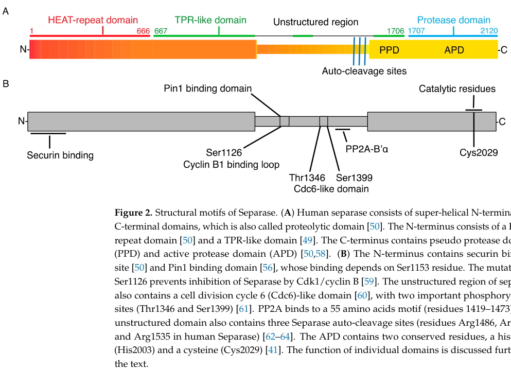

## Question

# Gene Research for Functional Annotation

## ⚠️ CRITICAL: Gene/Protein Identification Context

**BEFORE YOU BEGIN RESEARCH:** You MUST verify you are researching the CORRECT gene/protein. Gene symbols can be ambiguous, especially for less well-characterized genes from non-model organisms.

### Target Gene/Protein Identity (from UniProt):
- **UniProt Accession:** Q14674
- **Protein Description:** RecName: Full=Separin; EC=3.4.22.49; AltName: Full=Caspase-like protein ESPL1; AltName: Full=Extra spindle poles-like 1 protein; AltName: Full=Separase;
- **Gene Information:** Name=ESPL1; Synonyms=ESP1, KIAA0165;
- **Organism (full):** Homo sapiens (Human).
- **Protein Family:** Not specified in UniProt
- **Key Domains:** Peptidase_C50. (IPR005314); SEPARIN_core_dom. (IPR030397); Separin_C (PF03568)

### MANDATORY VERIFICATION STEPS:

1. **Check if the gene symbol "ESPL1" matches the protein description above**
2. **Verify the organism is correct:** Homo sapiens (Human).
3. **Check if protein family/domains align with what you find in literature**
4. **If you find literature for a DIFFERENT gene with the same or similar symbol, STOP**

### If Gene Symbol is Ambiguous or You Cannot Find Relevant Literature:

**DO NOT PROCEED WITH RESEARCH ON A DIFFERENT GENE.** Instead:
- State clearly: "The gene symbol 'ESPL1' is ambiguous or literature is limited for this specific protein"
- Explain what you found (e.g., "Found extensive literature on a different gene with the same symbol in a different organism")
- Describe the protein based ONLY on the UniProt information provided above
- Suggest that the protein function can be inferred from domain/family information

### Research Target:

Please provide a comprehensive research report on the gene **ESPL1** (gene ID: ESPL1, UniProt: Q14674) in human.

The research report should be a detailed narrative explaining the function, biological processes, and localization of the gene product. Citations should be given for all claims.

You should prioritize authoritative reviews and primary scientific literature when conducting research. You can supplement
this with annotations you find in gene/protein databases, but these can be outdated or inaccurate.

We are specifically interested in the primary function of the gene - for enzymes, what reaction is catalyzed, and what is the substrate specificity? For transporters, what is the substrate? For structural proteins or adapters, what is the broader structural role? For signaling molecules, what is the role in the pathway.

We are interested in where in or outside the cell the gene product carries out its function.

We are also interested in the signaling or biochemical pathways in which the gene functions. We are less interested in broad pleiotropic effects, except where these elucidate the precise role.

Include evidence where possible. We are interested in both experimental evidence as well as inference from structure, evolution, or bioinformatic analysis. Precise studies should be prioritized over high-throughput, where available.

## Output

Question: You are an expert researcher providing comprehensive, well-cited information.

Provide detailed information focusing on:
1. Key concepts and definitions with current understanding
2. Recent developments and latest research (prioritize 2023-2024 sources)
3. Current applications and real-world implementations
4. Expert opinions and analysis from authoritative sources
5. Relevant statistics and data from recent studies

Format as a comprehensive research report with proper citations. Include URLs and publication dates where available.
Always prioritize recent, authoritative sources and provide specific citations for all major claims.

# Gene Research for Functional Annotation

## ⚠️ CRITICAL: Gene/Protein Identification Context

**BEFORE YOU BEGIN RESEARCH:** You MUST verify you are researching the CORRECT gene/protein. Gene symbols can be ambiguous, especially for less well-characterized genes from non-model organisms.

### Target Gene/Protein Identity (from UniProt):
- **UniProt Accession:** Q14674
- **Protein Description:** RecName: Full=Separin; EC=3.4.22.49; AltName: Full=Caspase-like protein ESPL1; AltName: Full=Extra spindle poles-like 1 protein; AltName: Full=Separase;
- **Gene Information:** Name=ESPL1; Synonyms=ESP1, KIAA0165;
- **Organism (full):** Homo sapiens (Human).
- **Protein Family:** Not specified in UniProt
- **Key Domains:** Peptidase_C50. (IPR005314); SEPARIN_core_dom. (IPR030397); Separin_C (PF03568)

### MANDATORY VERIFICATION STEPS:

1. **Check if the gene symbol "ESPL1" matches the protein description above**
2. **Verify the organism is correct:** Homo sapiens (Human).
3. **Check if protein family/domains align with what you find in literature**
4. **If you find literature for a DIFFERENT gene with the same or similar symbol, STOP**

### If Gene Symbol is Ambiguous or You Cannot Find Relevant Literature:

**DO NOT PROCEED WITH RESEARCH ON A DIFFERENT GENE.** Instead:
- State clearly: "The gene symbol 'ESPL1' is ambiguous or literature is limited for this specific protein"
- Explain what you found (e.g., "Found extensive literature on a different gene with the same symbol in a different organism")
- Describe the protein based ONLY on the UniProt information provided above
- Suggest that the protein function can be inferred from domain/family information

### Research Target:

Please provide a comprehensive research report on the gene **ESPL1** (gene ID: ESPL1, UniProt: Q14674) in human.

The research report should be a detailed narrative explaining the function, biological processes, and localization of the gene product. Citations should be given for all claims.

You should prioritize authoritative reviews and primary scientific literature when conducting research. You can supplement
this with annotations you find in gene/protein databases, but these can be outdated or inaccurate.

We are specifically interested in the primary function of the gene - for enzymes, what reaction is catalyzed, and what is the substrate specificity? For transporters, what is the substrate? For structural proteins or adapters, what is the broader structural role? For signaling molecules, what is the role in the pathway.

We are interested in where in or outside the cell the gene product carries out its function.

We are also interested in the signaling or biochemical pathways in which the gene functions. We are less interested in broad pleiotropic effects, except where these elucidate the precise role.

Include evidence where possible. We are interested in both experimental evidence as well as inference from structure, evolution, or bioinformatic analysis. Precise studies should be prioritized over high-throughput, where available.

# Human ESPL1 (Separase; UniProt Q14674): Functional-Annotation Research Report

## Executive summary

The requested target is unambiguously **human ESPL1**, encoding **separase/separin** (UniProt **Q14674**; aliases **ESP1, KIAA0165**), not a similarly named protein from another organism. The literature consistently identifies human ESPL1 as a 2,120-amino-acid, approximately 233-kDa, clan-CD cysteine endopeptidase. Its conserved C-terminal catalytic region and large N-terminal regulatory scaffold agree with the supplied **Peptidase_C50, SEPARIN_core_dom, and Separin_C** annotations. No conflicting same-symbol target was encountered. (rosen2019cohesincleavageby pages 1-2, zhang2017biologyandinsights pages 2-3, zhang2017biologyandinsights pages 1-2)

Its primary function is irreversible cleavage of cohesin’s kleisin subunit—principally **RAD21/Scc1 in mitosis** and **REC8 in meiosis**—to release sister-chromatid cohesion at anaphase. Human separase recognizes cleavage sites containing **E-x-x-R↓**, cleaving after arginine, but efficient RAD21 cleavage additionally requires a separate **LPE docking motif**, demonstrating that physiological specificity depends on exosite-mediated substrate recruitment rather than the short cleavage sequence alone. (rosen2019cohesincleavageby pages 1-2, konecna2023separaseandroads pages 2-4)

Separase is tightly restrained by securin/PTTG1, CDK1–cyclin B1–CKS, and the spindle-checkpoint–APC/C network. This control prevents premature cohesin cleavage, aneuploidy, and centrosome defects. ESPL1 dysregulation is associated with multiple cancers, but current biomarker and treatment applications remain investigational: no ESPL1-directed approved drug or relevant clinical trial was identified. (konecna2023separaseandroads pages 6-7, konecna2023separaseandroads pages 4-6, OpenTargets Search: -ESPL1)

## 1. Identity verification and molecular architecture

### 1.1 Verified identity

Human **ESPL1** is the gene encoding separase, historically named extra spindle poles-like 1. The nomenclature, human origin, molecular size, catalytic function, and domain organization all match the supplied UniProt Q14674 record. The original full-length human cDNA characterization demonstrated that the encoded protein is the conserved protease required for normal human anaphase progression. (chestukhin2003processinglocalizationand pages 1-2)

### 1.2 Domain organization

Human separase contains:

- a large N-terminal superhelical regulatory region with HEAT- and TPR-like repeats;
- a flexible central region containing regulatory phosphorylation, protein-binding, nuclear-export, and autocleavage elements; and
- a conserved C-terminal proteolytic region containing pseudo-protease and active-protease components. (zhang2017biologyandinsights pages 2-3, konecna2023separaseandroads pages 2-4)

The catalytic residues are **His2003 and Cys2029**, consistent with classification as a caspase-like clan-CD cysteine endopeptidase. The published domain schematic places the HEAT-repeat region approximately at residues 1–666, the broader TPR-like region through approximately residue 1706, and the protease region at the C terminus; boundaries vary somewhat between annotation schemes because the large N-terminal scaffold is repeat-rich rather than a series of sharply delimited globular domains. (konecna2023separaseandroads pages 2-4, konecna2023separaseandroads media 07b3e821)

| Category | Verified annotation | Evidence type/strength |
|---|---|---|
| Identity and aliases | **Human ESPL1**, UniProt **Q14674**, encodes **separase/separin**, also called extra spindle poles-like 1, caspase-like protein ESPL1, ESP1, or KIAA0165. Literature consistently identifies human ESPL1 as the protease that triggers anaphase; no conflicting same-symbol target was encountered. (rosen2019cohesincleavageby pages 1-2, zhang2017biologyandinsights pages 1-2, chestukhin2003processinglocalizationand pages 1-2) | **Established human identity**; cloned full-length human cDNA and direct cellular characterization support the annotation. |
| Protein/domain architecture | Very large protein of **2,120 aa**, approximately **233 kDa**. It has an N-terminal superhelical regulatory region containing HEAT/TPR-like repeats, an intervening flexible regulatory region, and a conserved C-terminal separase protease region containing pseudo-protease and active-protease components. This architecture agrees with the supplied **Peptidase_C50**, **SEPARIN_core_dom**, and **Separin_C** annotations. (rosen2019cohesincleavageby pages 1-2, zhang2017biologyandinsights pages 2-3, konecna2023separaseandroads pages 2-4, konecna2023separaseandroads media 07b3e821) | **Strong human structural and biochemical evidence**, supported by cryo-EM-informed reviews and sequence/domain conservation. Exact domain boundaries vary among annotation schemes. |
| Catalytic class and active site | Clan-CD, caspase-like **cysteine endopeptidase**; the active protease domain contains the invariant catalytic residues **His2003** and **Cys2029**. (zhang2017biologyandinsights pages 2-3, zhang2017biologyandinsights pages 1-2, konecna2023separaseandroads pages 2-4) | **Established biochemical and evolutionary annotation**; catalytic-residue conservation plus loss-of-function studies support protease activity. |
| Reaction and canonical substrates | Catalyzes endoproteolytic hydrolysis of cohesin’s kleisin subunits: principally **RAD21/Scc1** during mitosis and **REC8** during meiosis. Kleisin cleavage opens/dissolves the cohesin ring, irreversibly releasing sister-chromatid cohesion and initiating chromosome segregation. (rosen2019cohesincleavageby pages 1-2, zhang2017biologyandinsights pages 1-2, chestukhin2003processinglocalizationand pages 1-2, konecna2023separaseandroads pages 2-4) | **RAD21/Scc1: established human/vertebrate mechanism. REC8: strongly conserved mammalian-meiosis mechanism**, with substantial evidence from mouse oocytes and other model systems. |
| Substrate specificity | Minimal cleavage preference is **E-x-x-R↓**, with hydrolysis immediately after the P1 arginine; acidic character near P4 and substrate phosphorylation can promote cleavage. Efficient human RAD21/Scc1 cleavage additionally requires a spatially separate **LPE docking motif**, indicating exosite-assisted recognition rather than reliance on the short cleavage sequence alone. (rosen2019cohesincleavageby pages 1-2, zhang2017biologyandinsights pages 1-2) | **Direct recombinant-human-enzyme evidence** for ExxR cleavage and LPE-dependent docking; phosphorylation dependence is partly derived from yeast and vertebrate studies and may be substrate/context specific. |
| Regulation | **Securin/PTTG1** acts both as a folding chaperone and inhibitor, blocking the active site as a pseudosubstrate and using its own LPE motif to obstruct substrate docking. When the spindle checkpoint is satisfied, **APC/C–CDC20** ubiquitinates securin and cyclin B, enabling their proteasomal destruction and abrupt separase activation. A mutually exclusive vertebrate inhibitory complex forms after phosphorylation of separase—especially **Ser1126** and residues in its Cdc6-like region—with **CDK1–cyclin B1–CKS**. Activated human separase autocleaves near **Arg1486, Arg1506, and Arg1535**; fragments remain associated, and autocleavage tunes activation timing and cyclin-B1 binding rather than being strictly required for catalysis. (rosen2019cohesincleavageby pages 1-2, konecna2023separaseandroads pages 4-6, chestukhin2003processinglocalizationand pages 1-2) | **Established human/vertebrate mechanism** for securin, APC/C, and CDK1–cyclin-B1 regulation. Human-cell experiments directly demonstrate autocatalytic processing; some physiological interpretations derive from vertebrate model systems. |
| Localization | Predominantly **cytoplasmic during interphase**, with nuclear accumulation after DNA damage; during mitosis it associates with chromosomes, centrosomes/spindle poles, and the spindle, losing spindle-pole association abruptly at anaphase. A nuclear-export sequence contributes to interphase exclusion from the nucleus. (konecna2023separaseandroads pages 6-7, zhang2017biologyandinsights pages 3-4, zhang2017biologyandinsights pages 2-3, chestukhin2003processinglocalizationand pages 1-2) | **Direct human-cell microscopy and fractionation evidence**, principally from HeLa and transformed cell lines; localization is dynamic and cell-cycle dependent. |
| Chromosome segregation | ESPL1 is the terminal proteolytic effector of the metaphase-to-anaphase transition. After prophase-pathway removal of most chromosome-arm cohesin, separase cleaves residual centromeric RAD21/Scc1, allowing sister chromatids to move to opposite spindle poles. Human separase depletion or noncleavable cohesin causes chromosomal bridges, multinucleation, multipolar spindles, and defective anaphase. (chestukhin2003processinglocalizationand pages 1-2, konecna2023separaseandroads pages 2-4) | **High-confidence, essential human function**, supported by depletion, substrate-mutant, biochemical, and imaging experiments. |
| Centrosome/centriole role | Separase contributes to **mother–daughter centriole disengagement**, thereby licensing centriole duplication in the next cell cycle. Proposed/direct substrates at centrosomes include cohesin/RAD21 and **pericentrin/kendrin**; activity is coordinated with PLK1. (zhang2017biologyandinsights pages 6-7, winter2015structuralinsightsinto pages 1-2) | **Strong human-cell functional evidence** for a separase requirement in centriole disengagement; the relative contributions of individual centrosomal substrates remain less settled and include evidence from multiple organisms. |
| Disease and translational status | ESPL1 overexpression or mistimed activity can promote premature cohesion loss, centrosome abnormalities, aneuploidy, and chromosomal instability. Elevated expression has been reported across human tumors, but most clinical associations are observational. In 2024, bladder-cancer datasets showed higher ESPL1 mRNA (**SMD 0.75, 95% CI 0.09–1.40; sROC AUC 0.88**) and gastric-cancer cell screens linked ESPL1 to apatinib resistance; neither establishes clinical utility. **Sepin-1** inhibits separase in vitro (**IC50 14.8 µM**) and suppresses cancer models, but remains preclinical. No relevant ESPL1-targeted clinical trial, approved inhibitor, validated companion diagnostic, or established therapeutic use was identified. (zhang2024genomewidecrisprscreen pages 10-13, zhang2014identificationandcharacterization pages 7-9, zhang2014identificationandcharacterization pages 1-3, zhang2024theupregulationand pages 1-2, zhang2024theupregulationand pages 3-9, OpenTargets Search: -ESPL1) | **Biologically plausible but clinically immature**: human tumor correlations plus cell-line and mouse preclinical evidence. Biomarker and drug-sensitivity claims require prospective validation; ESPL1 is not currently a clinically implemented target. |

*Table: Evidence-graded annotation of human ESPL1/separase Q14674, covering identity, catalytic mechanism, substrates, regulation, localization, cellular roles, and translational status. The table distinguishes established human mechanisms from model-organism inference and preclinical or correlative disease findings.*

## 2. Primary biochemical function

### 2.1 Catalyzed reaction

Separase catalyzes peptide-bond hydrolysis in cohesin kleisins. In functional terms:

**cohesin-bound RAD21/Scc1 + H₂O → cleaved RAD21 fragments → opening/dissolution of the cohesin linkage**.

This proteolysis removes the residual cohesin that holds sister centromeres together and thereby triggers sister-chromatid disjunction and poleward chromosome movement. It is an irreversible, switch-like step rather than a structural or reversible signaling interaction. Human depletion experiments and expression of noncleavable cohesin produce chromosome bridges, multinucleation, multipolar spindles, and defective anaphase, directly establishing the requirement for separase-mediated proteolysis. (chestukhin2003processinglocalizationand pages 1-2)

### 2.2 Physiological substrates

**RAD21/Scc1.** This is the canonical mitotic substrate. In vertebrate prophase, most arm cohesin is removed by a WAPL-dependent, nonproteolytic pathway, while protected centromeric cohesin remains. At anaphase, separase cleaves the remaining RAD21/Scc1, allowing sisters to segregate. (chestukhin2003processinglocalizationand pages 1-2, konecna2023separaseandroads pages 2-4)

**REC8.** In mammalian meiosis, separase cleaves the meiosis-specific kleisin REC8. Spatial protection of centromeric REC8 permits homolog separation at meiosis I while retaining sister-centromere cohesion until meiosis II. Much of the detailed mammalian evidence comes from mouse oocytes, so this mechanism is strongly conserved and mammalian, although not all regulatory details have been demonstrated directly in human germ cells. (konecna2023separaseandroads pages 2-4)

**Centrosomal substrates.** Cohesin/RAD21 and pericentrin/kendrin have been implicated in separase-dependent centriole disengagement. Evidence firmly establishes a requirement for separase activity in this centrosome-cycle transition, although the relative contribution of individual substrates and parallel PLK1-dependent structural changes remains less settled than the RAD21 mechanism at chromosomes. (zhang2017biologyandinsights pages 6-7, winter2015structuralinsightsinto pages 1-2)

### 2.3 Substrate specificity

The minimal recognized cleavage pattern is **E-x-x-R↓**, with the scissile bond immediately C-terminal to P1 arginine. Human RAD21 contains multiple sequence matches, but only a subset is efficiently cleaved in mitosis, showing that this short consensus is insufficient by itself. Recombinant human separase experiments identified an **LPE motif** in RAD21/Scc1, spatially separate from the cleavage site, that is necessary for rapid and selective cleavage. The motif likely binds a separase exosite and properly docks the substrate at the active site. (rosen2019cohesincleavageby pages 1-2)

Substrate phosphorylation can enhance separase cleavage, especially where phosphorylation occurs close to the cleavage region. However, the strongest residue-level phosphorylation evidence was initially derived from yeast and other model systems; it should not be generalized to every human substrate without direct testing. (zhang2017biologyandinsights pages 1-2, konecna2023separaseandroads pages 2-4)

## 3. Regulation and pathway placement

### 3.1 Spindle checkpoint–APC/C–separase axis

Separase is the terminal proteolytic effector of the metaphase-to-anaphase pathway:

1. Unattached or improperly attached kinetochores maintain the spindle-assembly checkpoint and inhibit APC/C–CDC20.
2. Once chromosomes are correctly bi-oriented, APC/C–CDC20 becomes active.
3. APC/C ubiquitinates securin and cyclin B, leading to proteasomal destruction.
4. Loss of securin and CDK1–cyclin-B inhibition permits abrupt separase activation.
5. Separase cleaves centromeric RAD21, initiating anaphase. (konecna2023separaseandroads pages 6-7, chestukhin2003processinglocalizationand pages 1-2)

This architecture couples an irreversible proteolytic event to completion of chromosome attachment and alignment.

### 3.2 Securin/PTTG1

Securin is both a **chaperone** and an **inhibitor**. It supports separase folding and solubility during biosynthesis but subsequently blocks protease activity. Inhibition is bimodal: securin provides an active-site pseudosubstrate and carries its own LPE motif, which competes with the RAD21 docking interaction. Thus, securin obstructs both catalytic-site access and exosite-dependent substrate recruitment. (rosen2019cohesincleavageby pages 1-2, konecna2023separaseandroads pages 4-6)

Separase-associated PP2A can stabilize bound securin by opposing phosphorylation linked to APC/C-dependent destruction. Once released, Pin1-dependent conformational isomerization contributes to a securin-resistant, active separase state. (konecna2023separaseandroads pages 4-6)

### 3.3 CDK1–cyclin B1–CKS

In vertebrates, phosphorylation of separase—particularly **Ser1126**, with additional contributions from the Cdc6-like regulatory region—enables binding of CDK1–cyclin B1–CKS. Structural work indicates mutual pseudosubstrate inhibition: the complex blocks separase’s active site, while separase also suppresses CDK1 activity. Securin-bound and CDK1–cyclin-B-bound states are largely mutually exclusive. APC/C-mediated cyclin-B destruction therefore coordinates separase activation with declining mitotic CDK activity. (konecna2023separaseandroads pages 4-6)

### 3.4 Autocleavage

Activated human separase undergoes autocatalytic processing near **Arg1486, Arg1506, and Arg1535**; direct human-cell work prominently detected cleavage at the latter two sites. The generated N- and C-terminal fragments remain associated, and cleavage is not required for catalytic activity in vitro. Rather, autocleavage tunes activation timing, PP2A association, and cyclin-B1 binding. Noncleavable separase can activate earlier but less strongly and is associated with chromosome bridges, spindle rocking, and segregation errors. (zhang2017biologyandinsights pages 2-3, chestukhin2003processinglocalizationand pages 1-2, konecna2023separaseandroads pages 4-6)

## 4. Cellular localization and site of action

Separase localization is dynamic rather than restricted to one organelle:

- **Interphase:** predominantly cytoplasmic in HeLa cells, partly because of a nuclear-export sequence.
- **DNA damage:** nuclear export can be suppressed, allowing nuclear accumulation; this has been linked to cohesin remodeling during repair.
- **Mitosis:** separase associates with chromosomes, spindle structures, centrosomes, and spindle poles.
- **Anaphase:** spindle-pole association is abruptly lost as separase becomes active and undergoes processing. (konecna2023separaseandroads pages 6-7, zhang2017biologyandinsights pages 3-4, chestukhin2003processinglocalizationand pages 1-2)

Accordingly, its principal catalytic sites are chromosome-associated cohesin at the metaphase–anaphase transition and centrosomal/centriole structures during mitotic exit. Reports of increased nuclear localization in tumor cells may reflect altered regulation but are not, by themselves, proof of a distinct tumor-specific function. (zhang2017biologyandinsights pages 3-4)

## 5. Biological processes

### 5.1 Chromosome segregation and genome stability

The most firmly established function is release of sister-chromatid cohesion. Premature activity causes precocious chromatid separation; inadequate activity causes persistent cohesion and chromosome bridges. Either direction can generate aneuploidy and chromosomal instability. This narrow activity window explains the multiple, partly redundant inhibitory systems acting on separase. (konecna2023separaseandroads pages 6-7, chestukhin2003processinglocalizationand pages 1-2)

### 5.2 Centrosome and centriole cycle

Separase promotes mother–daughter centriole disengagement, an event that licenses centriole duplication in the following cell cycle. Its centrosomal activity can occur with kinetics distinct from chromosome-associated cleavage and is modulated by PLK1 and local substrate accessibility. This provides a mechanistic link between chromosome-cycle completion and centrosome duplication. (zhang2017biologyandinsights pages 6-7, winter2015structuralinsightsinto pages 1-2)

### 5.3 DNA-damage response

Separase has been implicated in RAD21 removal at post-replicative DNA double-strand breaks. Nuclear-export control, sumoylation, and regulatory motifs in the flexible region support such an interphase function. Nevertheless, mechanistic detail is less complete in human cells than for anaphase, and some direct resection/repair evidence derives from yeast; this should be considered a supported secondary role rather than the defining primary annotation. (zhang2017biologyandinsights pages 3-4, zhang2017biologyandinsights pages 6-7, konecna2023separaseandroads pages 2-4)

## 6. Recent developments, 2023–2024

### 6.1 Updated mechanistic synthesis in 2023

A February 2023 review integrated human structural work with mammalian cell-cycle studies, emphasizing that separase control involves several independently distributed inhibitory pools. One cited quantitative analysis assigned approximately **59%** of separase to securin complexes, **35%** to Sgo2/Mad2 complexes, and **6%** to CDK1 complexes; after securin depletion, Sgo2/Mad2-associated separase rose to **85%**. These figures indicate compensatory inhibition, but their applicability depends on the experimental cell context and should not be treated as universal cellular stoichiometry. [Konecna et al., February 2023, DOI: https://doi.org/10.3390/ijms24054604] (konecna2023separaseandroads pages 6-7)

### 6.2 Gastric-cancer apatinib resistance, 2024

A February 2024 genome-wide CRISPR-activation screen identified ESPL1 among genes limiting gastric-cancer-cell response to apatinib. Resistant AGS and HGC27 cells were generated with **10 μg/mL apatinib for two weeks**, and ESPL1 expression was higher in resistant than parental cells (**P<0.001**). ESPL1 inhibition reduced proliferation and migration, increased apoptosis, and enhanced apatinib sensitivity. ESPL1 interacted with MDM2; MDM2 knockdown reduced ESPL1 protein and reversed resistance associated with ESPL1 overexpression. Reduced p-AKT, VEGF, and BCL-2 accompanied ESPL1 inhibition. [Zhang et al., February 2024, DOI: https://doi.org/10.1186/s12935-024-03233-4] (zhang2024genomewidecrisprscreen pages 10-13, zhang2024genomewidecrisprscreen pages 13-14, zhang2024genomewidecrisprscreen pages 9-10)

This is mechanistically interesting but remains predominantly cell-line evidence. The study did not establish an ESPL1 inhibitor in patients, and whether the ESPL1–MDM2 effect depends on p53 genotype remains unresolved. (zhang2024genomewidecrisprscreen pages 13-14)

### 6.3 Bladder-cancer expression study, 2024

A May 2024 multi-dataset analysis evaluated **1,391** samples for ESPL1 mRNA and used **202** in-house specimens for protein-level immunohistochemistry. Combined analysis found higher ESPL1 mRNA in bladder cancer, with **standardized mean difference 0.75 (95% CI 0.09–1.40)**; heterogeneity was high (**I²=88%**). The combined diagnostic discrimination was **sROC AUC 0.88 (95% CI 0.85–0.91)**, and IHC supported protein overexpression (**P<0.0001**). Single-cell analysis localized expression mainly to malignant epithelial cells. [Zhang et al., accepted May 12 and available May 15, 2024, DOI: https://doi.org/10.1016/j.heliyon.2024.e31192] (zhang2024theupregulationand pages 1-2, zhang2024theupregulationand pages 3-9)

The study predicted upstream H2AZ, IRF5, HIF1A, enhancer loops, miR-299-5p regulation, and associations with paclitaxel/gemcitabine response. These are hypothesis-generating bioinformatic associations and molecular-docking results, not prospective biomarker validation or proof of direct ESPL1 enzymatic involvement in Hippo, ErbB, PI3K–AKT, or Ras signaling. High between-cohort heterogeneity further limits immediate diagnostic interpretation. (zhang2024theupregulationand pages 1-2, zhang2024theupregulationand pages 3-9)

## 7. Disease relevance and quantitative evidence

Separase overexpression is biologically capable of driving chromosome instability: mouse mammary overexpression causes aneuploidy and tumorigenesis, while separase inhibition suppresses xenograft growth. In human tumors, elevated ESPL1 has been reported in breast, prostate, brain, bone, liver, bladder, and gastric cancers, but most patient-level evidence is expression–outcome correlation rather than a demonstration that ESPL1 is the initiating driver. (zhang2017biologyandinsights pages 6-7, zhang2017biologyandinsights pages 1-2)

Earlier compiled data reported approximately twofold transcript elevation across many breast-cancer subtypes, overexpression in **96% of breast tumors** and **84% of prostate tumors**, and an average coding-region mutation frequency of approximately **1.3%**. These observations suggest that altered abundance or regulation is more common than recurrent activating mutation. Because these numbers come from an older review aggregating heterogeneous datasets, contemporary cancer-cohort reanalysis would be necessary before clinical use. (zhang2017biologyandinsights pages 6-7)

Open Targets identifies literature-supported associations with breast carcinoma, hepatocellular carcinoma, and neoplasia, but the displayed association scores are low—approximately **0.095–0.129**—consistent with an emerging rather than clinically validated target–disease relationship. (OpenTargets Search: -ESPL1)

## 8. Applications and translational status

### 8.1 Experimental applications

Separase activity sensors based on cleavable RAD21 or kendrin sequences have been used to resolve local activity at centrosomes and chromosomes. These are valuable research tools for studying spatial activation, checkpoint escape, drug responses, and mitotic fidelity. The LPE docking motif also provides a rational basis for more selective biochemical substrates and inhibitor screens. (rosen2019cohesincleavageby pages 1-2, winter2015structuralinsightsinto pages 1-2)

### 8.2 Pharmacologic targeting

**Sepin-1** was discovered by screening **14,400 compounds**. Ninety-seven inhibited more than 50% of activity, 24 inhibited more than 80%, and five were confirmed as separase inhibitors. Sepin-1 is a noncompetitive inhibitor with an enzyme **IC50 of 14.8 μM** and inhibits cancer-cell proliferation and breast-cancer xenograft growth. Mouse studies used 10 mg/kg dosing; severe acute toxicity occurred at substantially higher intravenous doses, including death at 90 mg/kg. [Zhang et al., February/July 2014, DOI: https://doi.org/10.1177/1087057114520972] (zhang2014identificationandcharacterization pages 3-4, zhang2014identificationandcharacterization pages 7-9, zhang2014identificationandcharacterization pages 1-3)

These properties establish proof of concept, not clinical readiness. The micromolar potency, incomplete selectivity characterization, reactive-metabolite concerns, and lack of human pharmacology remain important barriers.

### 8.3 Current real-world implementation

No ESPL1/separase-targeted therapy is approved, and the clinical-trial search found no relevant ESPL1, separase, Sepin-1, or Walrycin-B interventional study. There is likewise no validated ESPL1 companion diagnostic or standard clinical separase-activity assay. Apatinib is clinically used in gastric cancer in China, but the proposed ESPL1/MDM2 resistance mechanism has not yet been implemented for patient selection or treatment modification. (zhang2024genomewidecrisprscreen pages 1-2)

## 9. Expert assessment

The authoritative mechanistic literature supports a high-confidence annotation of ESPL1 as the **regulated cohesin protease that executes anaphase**, with a secondary, well-supported role in centriole disengagement. The most consequential conceptual advance is that separase specificity is not encoded solely by an ExxR cleavage sequence: an LPE-dependent docking interaction and cell-cycle-controlled access provide the selectivity needed for rapid, localized substrate cleavage. (rosen2019cohesincleavageby pages 1-2)

Therapeutically, separase is attractive because tumors with high ESPL1 activity may depend on it for continued proliferation and because excessive inhibition can provoke mitotic failure. The same biology creates a narrow safety window: separase is essential in normal dividing cells, and both excess and deficiency destabilize the genome. Current cancer studies therefore support ESPL1 as a **preclinical target and candidate biomarker**, not an established oncologic intervention. Future development requires potent, selective chemical probes; target-engagement assays; normal-tissue toxicity studies; and prospective validation showing that ESPL1 abundance or activity predicts treatment response independently of proliferation rate.

## Conclusion

Human ESPL1/Q14674 is correctly identified as separase, a Peptidase_C50/caspase-like cysteine endopeptidase whose His2003–Cys2029 catalytic machinery cleaves RAD21/Scc1 and REC8 after arginine in context-dependent ExxR sites. Its essential action occurs on chromosome-associated cohesin at anaphase, with additional activity at centrosomes during centriole disengagement. Securin, APC/C, CDK1–cyclin B1, PP2A, Pin1, and autocleavage create a multilayered timing mechanism that protects genome stability. Recent 2023–2024 work has refined this regulatory model and linked ESPL1 expression to bladder-cancer discrimination and gastric-cancer apatinib resistance, but these findings remain correlative or preclinical. No ESPL1-directed treatment or diagnostic is currently established in clinical practice.

References

1. (rosen2019cohesincleavageby pages 1-2): Laura E. Rosen, Joseph E. Klebba, Jonathan B. Asfaha, Chloe M. Ghent, Melody G. Campbell, Yifan Cheng, and David O. Morgan. Cohesin cleavage by separase is enhanced by a substrate motif distinct from the cleavage site. Nature Communications, Nov 2019. URL: https://doi.org/10.1038/s41467-019-13209-y, doi:10.1038/s41467-019-13209-y. This article has 39 citations and is from a highest quality peer-reviewed journal.

2. (zhang2017biologyandinsights pages 2-3): Nenggang Zhang and Debananda Pati. Biology and insights into the role of cohesin protease separase in human malignancies. Biological Reviews, 92:2070-2083, Nov 2017. URL: https://doi.org/10.1111/brv.12321, doi:10.1111/brv.12321. This article has 52 citations and is from a domain leading peer-reviewed journal.

3. (zhang2017biologyandinsights pages 1-2): Nenggang Zhang and Debananda Pati. Biology and insights into the role of cohesin protease separase in human malignancies. Biological Reviews, 92:2070-2083, Nov 2017. URL: https://doi.org/10.1111/brv.12321, doi:10.1111/brv.12321. This article has 52 citations and is from a domain leading peer-reviewed journal.

4. (konecna2023separaseandroads pages 2-4): Marketa Konecna, Soodabeh Abbasi Sani, and Martin Anger. Separase and roads to disengage sister chromatids during anaphase. International Journal of Molecular Sciences, 24:4604, Feb 2023. URL: https://doi.org/10.3390/ijms24054604, doi:10.3390/ijms24054604. This article has 18 citations.

5. (konecna2023separaseandroads pages 6-7): Marketa Konecna, Soodabeh Abbasi Sani, and Martin Anger. Separase and roads to disengage sister chromatids during anaphase. International Journal of Molecular Sciences, 24:4604, Feb 2023. URL: https://doi.org/10.3390/ijms24054604, doi:10.3390/ijms24054604. This article has 18 citations.

6. (konecna2023separaseandroads pages 4-6): Marketa Konecna, Soodabeh Abbasi Sani, and Martin Anger. Separase and roads to disengage sister chromatids during anaphase. International Journal of Molecular Sciences, 24:4604, Feb 2023. URL: https://doi.org/10.3390/ijms24054604, doi:10.3390/ijms24054604. This article has 18 citations.

7. (OpenTargets Search: -ESPL1): Open Targets Query (-ESPL1, 5 results). Buniello, A. et al. (2025). Open Targets Platform: facilitating therapeutic hypotheses building in drug discovery. Nucleic Acids Research.

8. (chestukhin2003processinglocalizationand pages 1-2): Anton Chestukhin, Christian Pfeffer, Scott Milligan, James A. DeCaprio, and David Pellman. Processing, localization, and requirement of human separase for normal anaphase progression. Proceedings of the National Academy of Sciences of the United States of America, 100:4574-4579, Apr 2003. URL: https://doi.org/10.1073/pnas.0730733100, doi:10.1073/pnas.0730733100. This article has 111 citations and is from a highest quality peer-reviewed journal.

9. (konecna2023separaseandroads media 07b3e821): Marketa Konecna, Soodabeh Abbasi Sani, and Martin Anger. Separase and roads to disengage sister chromatids during anaphase. International Journal of Molecular Sciences, 24:4604, Feb 2023. URL: https://doi.org/10.3390/ijms24054604, doi:10.3390/ijms24054604. This article has 18 citations.

10. (zhang2017biologyandinsights pages 3-4): Nenggang Zhang and Debananda Pati. Biology and insights into the role of cohesin protease separase in human malignancies. Biological Reviews, 92:2070-2083, Nov 2017. URL: https://doi.org/10.1111/brv.12321, doi:10.1111/brv.12321. This article has 52 citations and is from a domain leading peer-reviewed journal.

11. (zhang2017biologyandinsights pages 6-7): Nenggang Zhang and Debananda Pati. Biology and insights into the role of cohesin protease separase in human malignancies. Biological Reviews, 92:2070-2083, Nov 2017. URL: https://doi.org/10.1111/brv.12321, doi:10.1111/brv.12321. This article has 52 citations and is from a domain leading peer-reviewed journal.

12. (winter2015structuralinsightsinto pages 1-2): Anja Winter, Ralf Schmid, and Richard Bayliss. Structural insights into separase architecture and substrate recognition through computational modelling of caspase-like and death domains. PLOS Computational Biology, 11:e1004548, Oct 2015. URL: https://doi.org/10.1371/journal.pcbi.1004548, doi:10.1371/journal.pcbi.1004548. This article has 22 citations and is from a highest quality peer-reviewed journal.

13. (zhang2024genomewidecrisprscreen pages 10-13): Bei Zhang, Yan Chen, Xinqi Chen, Zhiyao Ren, Hong Xiang, Lipeng Mao, and Guodong Zhu. Genome-wide crispr screen identifies espl1 limits the response of gastric cancer cells to apatinib. Cancer Cell International, Feb 2024. URL: https://doi.org/10.1186/s12935-024-03233-4, doi:10.1186/s12935-024-03233-4. This article has 11 citations and is from a peer-reviewed journal.

14. (zhang2014identificationandcharacterization pages 7-9): Nenggang Zhang, Kathleen Scorsone, Gouqing Ge, Caterina C. Kaffes, Lacey E. Dobrolecki, Malini Mukherjee, Michael T. Lewis, Stacey Berg, Clifford C. Stephan, and Debananda Pati. Identification and characterization of separase inhibitors (sepins) for cancer therapy. Jul 2014. URL: https://doi.org/10.1177/1087057114520972, doi:10.1177/1087057114520972. This article has 48 citations and is from a peer-reviewed journal.

15. (zhang2014identificationandcharacterization pages 1-3): Nenggang Zhang, Kathleen Scorsone, Gouqing Ge, Caterina C. Kaffes, Lacey E. Dobrolecki, Malini Mukherjee, Michael T. Lewis, Stacey Berg, Clifford C. Stephan, and Debananda Pati. Identification and characterization of separase inhibitors (sepins) for cancer therapy. Jul 2014. URL: https://doi.org/10.1177/1087057114520972, doi:10.1177/1087057114520972. This article has 48 citations and is from a peer-reviewed journal.

16. (zhang2024theupregulationand pages 1-2): Wei Zhang, Zi-Qian Liang, Rong-Quan He, Zhi-Guang Huang, Xiao-Min Wang, Mao-Yan Wei, Hui-Ling Su, Zhi-Su Liu, Yi-Sheng Zheng, Wan-Ying Huang, Han-Jie Zhang, Yi-Wu Dang, Sheng-Hua Li, Ji-Wen Cheng, Gang Chen, and Juan He. The upregulation and transcriptional regulatory mechanisms of extra spindle pole bodies like 1 in bladder cancer: an immunohistochemistry and high-throughput screening evaluation. Heliyon, 10(10):e31192, May 2024. URL: https://doi.org/10.1016/j.heliyon.2024.e31192, doi:10.1016/j.heliyon.2024.e31192. This article has 9 citations.

17. (zhang2024theupregulationand pages 3-9): Wei Zhang, Zi-Qian Liang, Rong-Quan He, Zhi-Guang Huang, Xiao-Min Wang, Mao-Yan Wei, Hui-Ling Su, Zhi-Su Liu, Yi-Sheng Zheng, Wan-Ying Huang, Han-Jie Zhang, Yi-Wu Dang, Sheng-Hua Li, Ji-Wen Cheng, Gang Chen, and Juan He. The upregulation and transcriptional regulatory mechanisms of extra spindle pole bodies like 1 in bladder cancer: an immunohistochemistry and high-throughput screening evaluation. Heliyon, 10(10):e31192, May 2024. URL: https://doi.org/10.1016/j.heliyon.2024.e31192, doi:10.1016/j.heliyon.2024.e31192. This article has 9 citations.

18. (zhang2024genomewidecrisprscreen pages 13-14): Bei Zhang, Yan Chen, Xinqi Chen, Zhiyao Ren, Hong Xiang, Lipeng Mao, and Guodong Zhu. Genome-wide crispr screen identifies espl1 limits the response of gastric cancer cells to apatinib. Cancer Cell International, Feb 2024. URL: https://doi.org/10.1186/s12935-024-03233-4, doi:10.1186/s12935-024-03233-4. This article has 11 citations and is from a peer-reviewed journal.

19. (zhang2024genomewidecrisprscreen pages 9-10): Bei Zhang, Yan Chen, Xinqi Chen, Zhiyao Ren, Hong Xiang, Lipeng Mao, and Guodong Zhu. Genome-wide crispr screen identifies espl1 limits the response of gastric cancer cells to apatinib. Cancer Cell International, Feb 2024. URL: https://doi.org/10.1186/s12935-024-03233-4, doi:10.1186/s12935-024-03233-4. This article has 11 citations and is from a peer-reviewed journal.

20. (zhang2014identificationandcharacterization pages 3-4): Nenggang Zhang, Kathleen Scorsone, Gouqing Ge, Caterina C. Kaffes, Lacey E. Dobrolecki, Malini Mukherjee, Michael T. Lewis, Stacey Berg, Clifford C. Stephan, and Debananda Pati. Identification and characterization of separase inhibitors (sepins) for cancer therapy. Jul 2014. URL: https://doi.org/10.1177/1087057114520972, doi:10.1177/1087057114520972. This article has 48 citations and is from a peer-reviewed journal.

21. (zhang2024genomewidecrisprscreen pages 1-2): Bei Zhang, Yan Chen, Xinqi Chen, Zhiyao Ren, Hong Xiang, Lipeng Mao, and Guodong Zhu. Genome-wide crispr screen identifies espl1 limits the response of gastric cancer cells to apatinib. Cancer Cell International, Feb 2024. URL: https://doi.org/10.1186/s12935-024-03233-4, doi:10.1186/s12935-024-03233-4. This article has 11 citations and is from a peer-reviewed journal.

## Artifacts

- [Edison artifact artifact-00](ESPL1-deep-research-falcon_artifacts/artifact-00.md)

## Citations

1. chestukhin2003processinglocalizationand pages 1-2
2. konecna2023separaseandroads pages 2-4
3. rosen2019cohesincleavageby pages 1-2
4. konecna2023separaseandroads pages 4-6
5. zhang2017biologyandinsights pages 3-4
6. konecna2023separaseandroads pages 6-7
7. zhang2024genomewidecrisprscreen pages 13-14
8. zhang2017biologyandinsights pages 6-7
9. zhang2024genomewidecrisprscreen pages 1-2
10. zhang2017biologyandinsights pages 2-3
11. zhang2017biologyandinsights pages 1-2
12. winter2015structuralinsightsinto pages 1-2
13. zhang2024genomewidecrisprscreen pages 10-13
14. zhang2014identificationandcharacterization pages 7-9
15. zhang2014identificationandcharacterization pages 1-3
16. zhang2024theupregulationand pages 1-2
17. zhang2024theupregulationand pages 3-9
18. zhang2024genomewidecrisprscreen pages 9-10
19. zhang2014identificationandcharacterization pages 3-4
20. Konecna et al., February 2023, DOI: https://doi.org/10.3390/ijms24054604
21. Zhang et al., February 2024, DOI: https://doi.org/10.1186/s12935-024-03233-4
22. Zhang et al., accepted May 12 and available May 15, 2024, DOI: https://doi.org/10.1016/j.heliyon.2024.e31192
23. Zhang et al., February/July 2014, DOI: https://doi.org/10.1177/1087057114520972
24. https://doi.org/10.3390/ijms24054604]
25. https://doi.org/10.1186/s12935-024-03233-4]
26. https://doi.org/10.1016/j.heliyon.2024.e31192]
27. https://doi.org/10.1177/1087057114520972]
28. https://doi.org/10.1038/s41467-019-13209-y,
29. https://doi.org/10.1111/brv.12321,
30. https://doi.org/10.3390/ijms24054604,
31. https://doi.org/10.1073/pnas.0730733100,
32. https://doi.org/10.1371/journal.pcbi.1004548,
33. https://doi.org/10.1186/s12935-024-03233-4,
34. https://doi.org/10.1177/1087057114520972,
35. https://doi.org/10.1016/j.heliyon.2024.e31192,