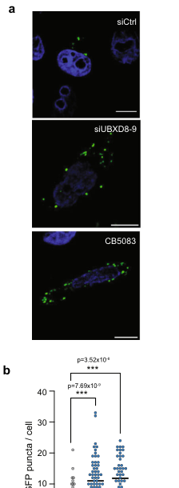

## Question

# Gene Research for Functional Annotation

## ⚠️ CRITICAL: Gene/Protein Identification Context

**BEFORE YOU BEGIN RESEARCH:** You MUST verify you are researching the CORRECT gene/protein. Gene symbols can be ambiguous, especially for less well-characterized genes from non-model organisms.

### Target Gene/Protein Identity (from UniProt):
- **UniProt Accession:** Q96CS3
- **Protein Description:** RecName: Full=FAS-associated factor 2; AltName: Full=UBX domain-containing protein 3B; AltName: Full=UBX domain-containing protein 8;
- **Gene Information:** Name=FAF2 {ECO:0000303|PubMed:34739333, ECO:0000312|HGNC:HGNC:24666}; Synonyms=ETEA {ECO:0000303|PubMed:12372427}, KIAA0887 {ECO:0000303|PubMed:10048485}, UBXD8, UBXN3B;
- **Organism (full):** Homo sapiens (Human).
- **Protein Family:** Not specified in UniProt
- **Key Domains:** FAF1_2-like_UAS. (IPR049483); Thioredoxin-like_sf. (IPR036249); UAS. (IPR006577); UBA-like_sf. (IPR009060); UBA_8. (IPR054109)

### MANDATORY VERIFICATION STEPS:

1. **Check if the gene symbol "FAF2" matches the protein description above**
2. **Verify the organism is correct:** Homo sapiens (Human).
3. **Check if protein family/domains align with what you find in literature**
4. **If you find literature for a DIFFERENT gene with the same or similar symbol, STOP**

### If Gene Symbol is Ambiguous or You Cannot Find Relevant Literature:

**DO NOT PROCEED WITH RESEARCH ON A DIFFERENT GENE.** Instead:
- State clearly: "The gene symbol 'FAF2' is ambiguous or literature is limited for this specific protein"
- Explain what you found (e.g., "Found extensive literature on a different gene with the same symbol in a different organism")
- Describe the protein based ONLY on the UniProt information provided above
- Suggest that the protein function can be inferred from domain/family information

### Research Target:

Please provide a comprehensive research report on the gene **FAF2** (gene ID: FAF2, UniProt: Q96CS3) in human.

The research report should be a detailed narrative explaining the function, biological processes, and localization of the gene product. Citations should be given for all claims.

You should prioritize authoritative reviews and primary scientific literature when conducting research. You can supplement
this with annotations you find in gene/protein databases, but these can be outdated or inaccurate.

We are specifically interested in the primary function of the gene - for enzymes, what reaction is catalyzed, and what is the substrate specificity? For transporters, what is the substrate? For structural proteins or adapters, what is the broader structural role? For signaling molecules, what is the role in the pathway.

We are interested in where in or outside the cell the gene product carries out its function.

We are also interested in the signaling or biochemical pathways in which the gene functions. We are less interested in broad pleiotropic effects, except where these elucidate the precise role.

Include evidence where possible. We are interested in both experimental evidence as well as inference from structure, evolution, or bioinformatic analysis. Precise studies should be prioritized over high-throughput, where available.

## Output

Question: You are an expert researcher providing comprehensive, well-cited information.

Provide detailed information focusing on:
1. Key concepts and definitions with current understanding
2. Recent developments and latest research (prioritize 2023-2024 sources)
3. Current applications and real-world implementations
4. Expert opinions and analysis from authoritative sources
5. Relevant statistics and data from recent studies

Format as a comprehensive research report with proper citations. Include URLs and publication dates where available.
Always prioritize recent, authoritative sources and provide specific citations for all major claims.

# Gene Research for Functional Annotation

## ⚠️ CRITICAL: Gene/Protein Identification Context

**BEFORE YOU BEGIN RESEARCH:** You MUST verify you are researching the CORRECT gene/protein. Gene symbols can be ambiguous, especially for less well-characterized genes from non-model organisms.

### Target Gene/Protein Identity (from UniProt):
- **UniProt Accession:** Q96CS3
- **Protein Description:** RecName: Full=FAS-associated factor 2; AltName: Full=UBX domain-containing protein 3B; AltName: Full=UBX domain-containing protein 8;
- **Gene Information:** Name=FAF2 {ECO:0000303|PubMed:34739333, ECO:0000312|HGNC:HGNC:24666}; Synonyms=ETEA {ECO:0000303|PubMed:12372427}, KIAA0887 {ECO:0000303|PubMed:10048485}, UBXD8, UBXN3B;
- **Organism (full):** Homo sapiens (Human).
- **Protein Family:** Not specified in UniProt
- **Key Domains:** FAF1_2-like_UAS. (IPR049483); Thioredoxin-like_sf. (IPR036249); UAS. (IPR006577); UBA-like_sf. (IPR009060); UBA_8. (IPR054109)

### MANDATORY VERIFICATION STEPS:

1. **Check if the gene symbol "FAF2" matches the protein description above**
2. **Verify the organism is correct:** Homo sapiens (Human).
3. **Check if protein family/domains align with what you find in literature**
4. **If you find literature for a DIFFERENT gene with the same or similar symbol, STOP**

### If Gene Symbol is Ambiguous or You Cannot Find Relevant Literature:

**DO NOT PROCEED WITH RESEARCH ON A DIFFERENT GENE.** Instead:
- State clearly: "The gene symbol 'FAF2' is ambiguous or literature is limited for this specific protein"
- Explain what you found (e.g., "Found extensive literature on a different gene with the same symbol in a different organism")
- Describe the protein based ONLY on the UniProt information provided above
- Suggest that the protein function can be inferred from domain/family information

### Research Target:

Please provide a comprehensive research report on the gene **FAF2** (gene ID: FAF2, UniProt: Q96CS3) in human.

The research report should be a detailed narrative explaining the function, biological processes, and localization of the gene product. Citations should be given for all claims.

You should prioritize authoritative reviews and primary scientific literature when conducting research. You can supplement
this with annotations you find in gene/protein databases, but these can be outdated or inaccurate.

We are specifically interested in the primary function of the gene - for enzymes, what reaction is catalyzed, and what is the substrate specificity? For transporters, what is the substrate? For structural proteins or adapters, what is the broader structural role? For signaling molecules, what is the role in the pathway.

We are interested in where in or outside the cell the gene product carries out its function.

We are also interested in the signaling or biochemical pathways in which the gene functions. We are less interested in broad pleiotropic effects, except where these elucidate the precise role.

Include evidence where possible. We are interested in both experimental evidence as well as inference from structure, evolution, or bioinformatic analysis. Precise studies should be prioritized over high-throughput, where available.

## Research report: Human **FAF2** (UniProt: **Q96CS3**; aliases **UBXD8**, **ETEA**, **UBXN3B**)—functional annotation

### 0) Target verification (critical disambiguation)
The literature in this report specifically addresses the human protein referred to as **FAF2/UBXD8** (and sometimes annotated with the alias UBXN3B in the retrieved texts). Multiple independent primary studies and a systematic VCP/p97 adaptor interactome consistently describe FAF2/UBXD8 as an **ER-tethered UBX-domain adaptor of the AAA+ ATPase p97/VCP** involved in **ERAD**, **lipid droplet regulation**, and **organelle membrane protein quality control** (raman2015systematicproteomicsof pages 4-6, koyano2024aaa+atpasechaperone pages 1-2). This matches the UniProt Q96CS3 description you provided.

### 1) Key concepts and current understanding

#### 1.1 What FAF2 is (core definition)
FAF2 (UBXD8) is best understood as a **membrane-tethered adaptor (“cofactor”) for p97/VCP**, positioning p97 at specific membranes and helping it engage ubiquitinated substrates for **extraction/unfolding** prior to downstream outcomes (often proteasomal degradation). This adaptor role is consistent across:
- an unbiased **VCP–UBXD adaptor network** map (raman2015systematicproteomicsof pages 4-6, raman2015systematicproteomicsof pages 3-4), and
- mechanistic cell biology on peroxisomes/pexophagy and contacts (koyano2024aaa+atpasechaperone pages 1-2, ganji2023thep97ubxd8complex pages 1-2).

#### 1.2 Relationship to p97/VCP “segregase/unfoldase” function
p97/VCP is an AAA+ ATPase that uses ATP hydrolysis to **extract** proteins from membranes or complexes. FAF2 provides **substrate engagement and localization**, and can also increase p97’s effective unfolding capacity and/or lower the ubiquitin “requirements” for productive processing depending on the system studied (fujisawa2022multipleubxproteins pages 7-9, huo2025aubhubxmodule pages 8-9).

#### 1.3 Domains and functional modules (operational view)
Across the primary evidence base, FAF2 is repeatedly treated as a multi-domain adaptor with:
- a **UBX domain** (p97-binding),
- a **UBA domain** (ubiquitin-binding in some contexts),
- a **hairpin (HP)/membrane-association element** important for membrane embedding/tethering,
- a **coiled-coil region** implicated in stimulating p97-UFD1-NPL4 unfoldase activity,
with additional mechanistic work identifying a **UBH-UBX module** (a UBX-adjacent ubiquitin-binding helix) that amplifies p97-UFD1L-NPLOC4 activity in reconstituted extraction systems (fujisawa2022multipleubxproteins pages 10-11, koyano2024aaa+atpasechaperone pages 9-10, huo2025aubhubxmodule pages 8-9).

### 2) Subcellular localization and interaction partners

#### 2.1 Localization
FAF2/UBXD8 is reported as a membrane-associated cofactor localizing to multiple organellar surfaces, with strong emphasis on:
- **endoplasmic reticulum (ER)** (ER-tethered adaptor; ERAD context) (raman2015systematicproteomicsof pages 4-6, koyano2024aaa+atpasechaperone pages 2-2),
- **lipid droplets (LDs)** (redistribution/partitioning ER↔LD; lipolysis regulation) (olzmann2013spatialregulationof pages 1-2, olzmann2013spatialregulationof pages 2-3),
- **ER–mitochondria contact sites (ERMCS/MAMs)** (enriched in MAM fractions; functional contact regulator) (ganji2023thep97ubxd8complex pages 3-4, ganji2023thep97ubxd8complex pages 1-2),
- **peroxisomes** (functional peroxisomal homeostasis via extraction of ubiquitinated PMPs) (koyano2024aaa+atpasechaperone pages 1-2, koyano2024aaa+atpasechaperone pages 9-10).

#### 2.2 Interaction partners (supported by experimental evidence)
Key FAF2-associated proteins from systematic AP-MS and targeted immunoprecipitation include:
- **p97/VCP** and core module **UFD1L–NPLOC4** (broad association in VCP adaptor datasets; peroxisome study shows complex with NPLOC4/UFD1) (raman2015systematicproteomicsof pages 3-4, koyano2024aaa+atpasechaperone pages 9-10),
- ERAD/membrane quality control factors such as **AMFR**, **DERLIN2**, **AUP1**, **BAG6**, **UBAC2** (proteomic network; also UBAC2 regulates ER↔LD partitioning) (raman2015systematicproteomicsof pages 4-6, olzmann2013spatialregulationof pages 1-2),
- Peroxisomal membrane proteins **PMP70** and **PEX16** and deubiquitylase **USP30** (co-IP evidence in pexophagy study) (koyano2024aaa+atpasechaperone pages 9-10).

### 3) Primary biological functions and pathways (evidence-based)

#### 3.1 Lipid droplet biology: regulation of ATGL-mediated lipolysis (real-world metabolic relevance)
A major, well-established FAF2/UBXD8 function is regulation of **lipid droplet turnover** by acting at lipid droplets with p97/VCP.

Mechanistic model supported by experiments:
- UBXD8 **traffics/partitions** between ER and LDs; the ER protein **UBAC2** restricts UBXD8 localization to LDs (olzmann2013spatialregulationof pages 1-2, olzmann2013spatialregulationof pages 2-3).
- LD-localized UBXD8 **binds ATGL** and reduces ATGL activity by promoting dissociation of ATGL from its coactivator **CGI-58**, a process requiring UBXD8’s ability to recruit **p97/VCP** via its UBX domain (olzmann2013spatialregulationof pages 3-4, olzmann2013spatialregulationof pages 5-6).

Representative quantitative findings:
- ATGL overexpression reduced lipid droplet content by ~**3–4-fold**, and this lipolytic effect was **largely abrogated** by co-overexpression of LD-localized UBXD8 (olzmann2013spatialregulationof pages 3-4).
- Split-YFP and biochemical assays showed UBXD8 modulates **ATGL–CGI-58 interaction** with statistically significant differences (P < 0.05 in cited experiments) (olzmann2013spatialregulationof pages 5-6, olzmann2013spatialregulationof pages 4-5).

Key primary source:
- Olzmann et al., *PNAS* (Jan 2013), https://doi.org/10.1073/pnas.1213738110 (olzmann2013spatialregulationof pages 3-4).

#### 3.2 ER–mitochondria contact site regulation via membrane lipid saturation (major 2023 advance)
A central recent development (2023) is that the **p97–UBXD8 complex regulates ER–mitochondria contact sites (ERMCS/MAMs)** by controlling membrane lipid saturation/composition.

Core mechanism:
- p97–UBXD8 localizes to ERMCS and **restricts excessive contacts**, requiring **p97 catalytic activity** (ganji2023thep97ubxd8complex pages 1-2, ganji2023thep97ubxd8complex pages 2-3).
- Loss of UBXD8 (or p97 inhibition) impairs **SREBP1 activation** and reduces **SCD1**-linked desaturation output, shifting membranes toward **higher saturation and increased order**; more ordered membranes are proposed to stabilize contacts by reducing lateral mobility of key tethering proteins (ganji2023thep97ubxd8complex pages 11-12, ganji2023thep97ubxd8complex pages 9-10).

Quantitative/statistical evidence:
- Quantitative proteomics of isolated ERMCS identified **4,499 proteins** and detected **102 enriched** and **112 depleted** proteins in UBXD8 KO MAM fractions under stated filtering criteria (ganji2023thep97ubxd8complex pages 3-4).
- Lipidomics showed that about **two-thirds** of measured PC/PE/LPC/LPE species were significantly increased in UBXD8 KO MAM fractions (example threshold: log2 KO:WT > 1, P < 0.05), with many elevated species consisting largely of **saturated/monounsaturated** tails (ganji2023thep97ubxd8complex pages 5-6).
- Multiple contact measurements had very strong significance (e.g., p-values reported down to ~10^-9) and rescue experiments supported causality (ganji2023thep97ubxd8complex pages 11-12, ganji2023thep97ubxd8complex pages 9-10).
- The paper reports rescue of contact phenotypes by **oleic acid (monounsaturated)** supplementation and by **SCD1 overexpression**, while saturated palmitate does not rescue (ganji2023thep97ubxd8complex pages 6-7, ganji2023thep97ubxd8complex pages 9-10).

Key primary source (2023):
- Ganji et al., *Nature Communications* (Feb 2023), https://doi.org/10.1038/s41467-023-36298-2 (ganji2023thep97ubxd8complex pages 1-2).

(Selected figure evidence from this paper is captured in the cropped figure panels.) (ganji2023thep97ubxd8complex media 5198145b).

#### 3.3 Peroxisome quality control: FAF2–p97 suppresses basal pexophagy (major 2024 advance)
A second major recent development (2024) is that FAF2/UBXD8 functions with p97/VCP to maintain peroxisome homeostasis by extracting ubiquitinated peroxisomal membrane proteins, thereby preventing unnecessary basal pexophagy.

Core findings and mechanism:
- FAF2 is described as an ER membrane protein/cofactor of p97/VCP that contributes to peroxisomal membrane protein turnover (koyano2024aaa+atpasechaperone pages 2-2, koyano2024aaa+atpasechaperone pages 1-2).
- FAF2-/- cells showed altered peroxisomal protein levels and accelerated pexophagy; the study proposes FAF2–p97 extracts ubiquitylated PMPs (example: **PMP70**, also **PEX16**), preventing recruitment of the autophagy adaptor **OPTN** and basal pexophagy (koyano2024aaa+atpasechaperone pages 10-11, koyano2024aaa+atpasechaperone pages 1-2).
- Biochemical data show FAF2 forms complexes with **p97/VCP, NPLOC4, UFD1** and physically associates with **PMP70/PEX16** and **USP30** (koyano2024aaa+atpasechaperone pages 9-10).

Quantitative findings:
- The FACS-based pexophagy assay shows a strong FAF2 dependence; in one quantified dataset, basal pexophagy increased from **3.9% to 15.5 ± 0.5%** in FAF2 KO and was rescued by FAF2 re-expression (huo2025aubhubxmodule pages 10-11).
- Multiple comparisons in figures included significant p-values (e.g., p = 1.25E-04; p = 6.46E-03) (koyano2024aaa+atpasechaperone pages 10-11).

Key primary source (2024):
- Koyano et al., *Nature Communications* (Oct 2024), https://doi.org/10.1038/s41467-024-53558-x (koyano2024aaa+atpasechaperone pages 1-2).

### 4) Mechanistic/biochemical framework: how FAF2 tunes p97 substrate processing
Even beyond specific organelle contexts, FAF2 appears to enhance p97 substrate processing efficiency in multiple in vitro and cellular systems.

#### 4.1 Lowering the ubiquitin threshold of the mammalian p97-UFD1-NPL4 unfoldase (2022)
In reconstituted CMG helicase disassembly, FAF2 (studied as a soluble FAF2ΔM construct lacking membrane tethering) functions as a UBX cofactor that **reduces the ubiquitin chain-length threshold** required for p97-UFD1-NPL4 to unfold/disassemble substrates.
- In the presence of UBX cofactors (including FAF2), disassembly could proceed when substrates carried **≥5 ubiquitins** (approaching yeast-like thresholds) (fujisawa2022multipleubxproteins pages 7-9, fujisawa2022multipleubxproteins pages 9-10).
- Domain mapping indicated FAF2’s **UBX** is required but its **UBA** is dispensable; a **coiled-coil plus UBX** fragment was sufficient whereas UBX alone was inactive (fujisawa2022multipleubxproteins pages 10-11).

Key primary source:
- Fujisawa et al., *eLife* (Aug 2022), https://doi.org/10.7554/eLife.76763 (fujisawa2022multipleubxproteins pages 10-11).

#### 4.2 UBH-UBX module and amplified “power output” (2025 mechanistic detail; included for completeness)
Mechanistic reconstitution work (2025) proposes an additional ubiquitin-binding element (UBH) adjacent to UBX that increases p97-UFD1L-NPLOC4 ATPase and unfolding output and supports membrane extraction.
- p97-UN ATPase rate increased from ~**2.7 s^-1** to ~**4.3 s^-1** with FAF2; unfolding signals increased about **2-fold** (huo2025aubhubxmodule pages 8-9).
- FAF2 knockout stabilized CD4 (ERAD client) by ~**10-fold** in that system (huo2025aubhubxmodule pages 1-2).

Key primary source:
- Huo et al., *Nature Communications* (Nov 2025), https://doi.org/10.1038/s41467-025-65166-4 (huo2025aubhubxmodule pages 1-2).

### 5) Current applications and real-world implementations

#### 5.1 Metabolic and lipid storage phenotypes (LD turnover)
FAF2/UBXD8’s demonstrated control of ATGL-mediated lipolysis positions it as a mechanistic node relevant to **fat storage phenotypes** and diseases characterized by altered lipolysis and triglyceride handling (e.g., steatosis), via a concrete molecular mechanism (ATGL–CGI-58 disassembly by UBXD8–p97) (olzmann2013spatialregulationof pages 3-4).

#### 5.2 Organelle contact sites as therapeutic-relevant biology (ERMCS and lipid saturation)
The 2023 work links p97–UBXD8 regulation of ERMCS to **lipid desaturation control** (SREBP1–SCD1 axis), and further connects impairment of this axis to **brains of p97 mutant mouse models** associated with neurodegeneration (ganji2023thep97ubxd8complex pages 1-2). While this is not yet a FAF2-targeted clinical intervention, it supports the idea that FAF2-linked p97 biology has **in vivo disease relevance** (ganji2023thep97ubxd8complex pages 1-2).

#### 5.3 Peroxisome homeostasis and selective autophagy modulation
The 2024 pexophagy study provides a mechanistic basis for manipulating peroxisome abundance via the FAF2–p97 axis and suggests FAF2 may be a useful handle for studying **peroxisome maintenance vs autophagic removal** in cell models (koyano2024aaa+atpasechaperone pages 1-2, koyano2024aaa+atpasechaperone pages 9-10).

### 6) Expert/authoritative analysis (what leading sources emphasize)
A high-confidence view emerging from systematic network mapping and mechanistic organelle-specific studies is that FAF2/UBXD8 is not a “single-pathway” protein but rather a **location-defining p97 adaptor** whose functional output depends on where it recruits/activates p97 and what ubiquitinated substrates are present.
- The VCP adaptor network emphasizes modularity and shared recruitment modules (UFD1L/NPLOC4 frequently co-associated), while assigning FAF2 to ER/membrane quality control and lipid droplet biology with defined ERAD interactors (AMFR, DERLIN2, AUP1, BAG6, UBAC2) (raman2015systematicproteomicsof pages 4-6, raman2015systematicproteomicsof pages 3-4).
- The 2023–2024 work extends this model to **contact-site lipid homeostasis** and **peroxisomal membrane protein surveillance**, respectively, consistent with a broader “organelle-proximal proteostasis and lipid regulation” role for FAF2 (ganji2023thep97ubxd8complex pages 1-2, koyano2024aaa+atpasechaperone pages 1-2).

### 7) Evidence map (summary table)
The following table consolidates the highest-value mechanistic and quantitative findings for FAF2/UBXD8 across major pathways.

| Biological process/pathway | Localization | Molecular role/mechanism | Key experimental evidence (assays/models) | Quantitative/statistical highlights | Key reference with publication date and URL |
|---|---|---|---|---|---|
| ER-associated degradation (ERAD) and membrane protein extraction | ER membrane; also reported at mitochondrial outer membrane and peroxisomes | FAF2 is an ER-tethered p97/VCP adaptor. Its UBX domain binds p97, and a UBH-UBX module enhances p97-UFD1L-NPLOC4 engagement with ubiquitinated substrates, boosting mechanical unfolding/extraction; FAF2 forms ternary complexes with p97 and ubiquitinated clients such as CD4. UBA is less important than UBH/UBX for extraction in these assays. (huo2025aubhubxmodule pages 1-2, huo2025aubhubxmodule pages 8-9) | Reconstituted extraction of ubiquitinated mCD4 from microsomes; tandem IP showing CD4–FAF2–p97 complex; FAF2 knockout/depletion assays monitoring CD4, TCRα, mTAP2, ABCG2-F208S degradation; ATPase and unfolding assays with purified p97-UN ± FAF2 constructs. (huo2025aubhubxmodule pages 1-2, huo2025aubhubxmodule pages 8-9) | FAF2 knockout increased steady-state CD4 by ~10-fold; FAF2 UBH-UBX raised p97 ATPase from ~2.7 s^-1 to ~4.3 s^-1 and increased unfolding ~2-fold; UBH mutants abolished/strongly impaired stimulation. (huo2025aubhubxmodule pages 1-2, huo2025aubhubxmodule pages 8-9) | Huo et al., *Nature Communications* (Nov 2025). https://doi.org/10.1038/s41467-025-65166-4 |
| Lipid droplet turnover / lipolysis control | ER and lipid droplets | LD-localized FAF2/UBXD8 recruits p97/VCP to lipid droplets, binds ATGL, and restrains ATGL-mediated triacylglycerol hydrolysis by promoting dissociation of ATGL from its activator CGI-58; UBAC2 restricts FAF2 trafficking from ER to LDs. (olzmann2013spatialregulationof pages 1-2, olzmann2013spatialregulationof pages 3-4, olzmann2013spatialregulationof pages 2-3) | Immunolocalization and LD fractionation after oleate loading; UBAC2 overexpression or knockdown to alter FAF2 partitioning; LD size/number quantification by BODIPY; ^14C-oleate pulse-chase TAG turnover; co-IP of UBXD8 with ATGL; split-YFP complementation for ATGL–CGI-58 interaction; ATGL-null MEFs. (olzmann2013spatialregulationof pages 5-6, olzmann2013spatialregulationof pages 4-5, olzmann2013spatialregulationof pages 3-4, olzmann2013spatialregulationof pages 2-3) | ATGL overexpression reduced LD content ~3- to 4-fold, largely abrogated by UBXD8-S; ATGL half-life ~45 min and >12 h with MG132, but UBXD8 did not change ATGL stability; dominant-negative p97/VCP and UBX deletion blocked UBXD8 LD effects; significance typically P < 0.05, with ~500–600 droplets quantified in some analyses. (olzmann2013spatialregulationof pages 3-4, olzmann2013spatialregulationof pages 2-3) | Olzmann et al., *PNAS* (Jan 2013). https://doi.org/10.1073/pnas.1213738110 |
| ER–mitochondria contact site regulation and lipid saturation control | ER–mitochondria contact sites / MAMs | The p97–UBXD8 complex localizes to ERMCS and limits excessive contacts by promoting INSIG1 turnover, enabling SREBP1 activation and SCD1-dependent lipid desaturation. Loss of the complex increases membrane saturation/order, stabilizing contacts; unsaturated fatty acids or SCD1 rescue the phenotype. (ganji2023thep97ubxd8complex pages 1-2, ganji2023thep97ubxd8complex pages 2-3, ganji2023thep97ubxd8complex pages 9-10) | Split-luciferase and SPLICS/split-GFP contact reporters; MAM fractionation; TMT proteomics of WT vs UBXD8 KO ERMCS; lipidomics of MAM fractions; pyrene-based membrane order assays; rescue with wild-type p97/UBXD8, SCD1 overexpression, oleic acid, or palmitic acid control; TEM/confocal contact measurements. (ganji2023thep97ubxd8complex pages 1-2, ganji2023thep97ubxd8complex pages 9-10, ganji2023thep97ubxd8complex pages 5-6, ganji2023thep97ubxd8complex pages 3-4, ganji2023thep97ubxd8complex media 5198145b) | Proteomics identified 4,499 proteins in ERMCS fractions, with 102 enriched and 112 depleted in UBXD8 KO; ~two-thirds of measured PC/PE/LPC/LPE species increased in UBXD8 KO ([log2 KO:WT] > 1, P < 0.05); many TG and DG species were ≥2-fold elevated; rescue comparisons showed strong significance (e.g., p = 7.46 × 10^-10; other panels p = 9 × 10^-9 to 1.89 × 10^-7). Oleic acid, but not palmitic acid, rescued increased contacts. (ganji2023thep97ubxd8complex pages 11-12, ganji2023thep97ubxd8complex pages 6-7, ganji2023thep97ubxd8complex pages 9-10, ganji2023thep97ubxd8complex pages 5-6, ganji2023thep97ubxd8complex pages 3-4) | Ganji et al., *Nature Communications* (Feb 2023). https://doi.org/10.1038/s41467-023-36298-2 |
| Peroxisomal membrane protein quality control and suppression of basal pexophagy | Peroxisomes; also ER/lipid droplets/mitochondria reported | FAF2 partners with p97/VCP, UFD1, and NPLOC4 to extract ubiquitylated peroxisomal membrane proteins such as PMP70/PEX16, thereby preventing OPTN recruitment and inappropriate basal pexophagy. HP/membrane-association is critical; UBA is dispensable in this context. (koyano2024aaa+atpasechaperone pages 10-11, koyano2024aaa+atpasechaperone pages 1-2, koyano2024aaa+atpasechaperone pages 9-10) | FAF2 knockout HCT116 cells; mKeima-SKL FACS pexophagy assay; IP of 3HA-FAF2 with PMP70, PEX16, USP30, p97/VCP, NPLOC4, UFD1; proximity ligation assay with PMP70; p97 inhibition (NMS-873); domain-mutant reconstitution; PMP70 knockdown rescue experiments. (koyano2024aaa+atpasechaperone pages 10-11, koyano2024aaa+atpasechaperone pages 15-16, koyano2024aaa+atpasechaperone pages 9-10) | FAF2 loss significantly accelerated pexophagy; one assay showed basal pexophagy rising from 3.9% to 15.5 ± 0.5% in FAF2 KO, rescued to 3.2 ± 0.2% by WT FAF2 but only to 7.0 ± 0.4% by a UBH mutant; reported statistics included p = 1.25E-04 and p = 6.46E-03, with multiple panels at p < 0.0001. (koyano2024aaa+atpasechaperone pages 10-11, huo2025aubhubxmodule pages 10-11, koyano2024aaa+atpasechaperone pages 9-10) | Koyano et al., *Nature Communications* (Oct 2024). https://doi.org/10.1038/s41467-024-53558-x |
| General stimulation of mammalian p97-UFD1-NPL4 unfoldase | Membrane-associated sites including ER, lipid droplets, and nuclear outer membrane/peripheral membranes | FAF2 is a UBX-family cofactor that lowers the ubiquitin-chain threshold required for mammalian p97-UFD1-NPL4 substrate processing. Its UBX domain is essential, the UBA domain is dispensable, and a coiled-coil region is required/sufficient together with UBX to stimulate unfoldase activity. (fujisawa2022multipleubxproteins pages 7-9, fujisawa2022multipleubxproteins pages 10-11, fujisawa2022multipleubxproteins pages 1-2, fujisawa2022multipleubxproteins pages 9-10) | In vitro CMG helicase disassembly assays with soluble FAF2ΔM; truncation/domain mutants; tests of dependence on UFD1-NPL4 and NPL4 groove; genetic interaction analyses with related UBX proteins. (fujisawa2022multipleubxproteins pages 7-9, fujisawa2022multipleubxproteins pages 10-11, fujisawa2022multipleubxproteins pages 9-10, fujisawa2022multipleubxproteins pages 14-15) | In the presence of FAF2/FAF1/UBXN7, human p97-UFD1-NPL4 could process substrates bearing ≥5 ubiquitins, reducing the otherwise high ubiquitin threshold toward the yeast-like minimum. (fujisawa2022multipleubxproteins pages 7-9, fujisawa2022multipleubxproteins pages 1-2, fujisawa2022multipleubxproteins pages 14-15) | Fujisawa et al., *eLife* (Aug 2022). https://doi.org/10.7554/eLife.76763 |
| Interaction network / adaptor classification | ER-tethered adaptor with links to mitochondria and membrane-trafficking systems | Systematic proteomics places FAF2/UBXD8 within the membrane-tethered UBXD adaptors of the VCP/p97 network, associated with ERAD, lipid droplet homeostasis, and possible mitochondrial/mitophagy-related functions. Interactors include AMFR, DERLIN2, AUP1, BAG6, UBAC2, and shared VCP-network components; UFD1L/NPLOC4 broadly associate with UBXD adaptors. (raman2015systematicproteomicsof pages 4-6, raman2015systematicproteomicsof pages 3-4, raman2015systematicproteomicsof pages 1-3) | Comparative AP-MS of VCP and 13 UBXD adaptors in human cells with CompPASS filtering, reciprocal validation, and localization analyses. (raman2015systematicproteomicsof pages 4-6, raman2015systematicproteomicsof pages 3-4, raman2015systematicproteomicsof pages 11-13) | Network study identified 169 high-confidence interacting proteins under stringent criteria and showed UFD1L/NPLOC4 association with 11/14 UBXD proteins in the dataset; FAF2 clustered with membrane/ERAD factors and partially colocalized with mitochondria. (raman2015systematicproteomicsof pages 4-6, raman2015systematicproteomicsof pages 3-4) | Raman et al., *Nature Cell Biology* (Sep 2015). https://doi.org/10.1038/ncb3238 |

*Table: This table summarizes experimentally supported functions, localizations, mechanisms, and quantitative findings for human FAF2/UBXD8/ETEA/UBXN3B. It is useful as a concise evidence map linking FAF2 to ERAD, lipid droplet biology, ER–mitochondria contacts, peroxisome quality control, and p97/VCP-dependent substrate extraction.*

### 8) References (URLs and publication dates)
- Ganji R. et al. *Nature Communications* (Feb 2023). “The p97-UBXD8 complex regulates ER-Mitochondria contact sites by altering membrane lipid saturation and composition.” https://doi.org/10.1038/s41467-023-36298-2 (ganji2023thep97ubxd8complex pages 1-2)
- Koyano F. et al. *Nature Communications* (Oct 2024). “AAA+ ATPase chaperone p97/VCPFAF2 governs basal pexophagy.” https://doi.org/10.1038/s41467-024-53558-x (koyano2024aaa+atpasechaperone pages 1-2)
- Olzmann J.A. et al. *PNAS* (Jan 2013). “Spatial regulation of UBXD8 and p97/VCP controls ATGL-mediated lipid droplet turnover.” https://doi.org/10.1073/pnas.1213738110 (olzmann2013spatialregulationof pages 3-4)
- Fujisawa R. et al. *eLife* (Aug 2022). “Multiple UBX proteins reduce the ubiquitin threshold of the mammalian p97-UFD1-NPL4 unfoldase.” https://doi.org/10.7554/eLife.76763 (fujisawa2022multipleubxproteins pages 1-2)
- Raman M. et al. *Nature Cell Biology* (Sep 2015). “Systematic proteomics of the VCP–UBXD adaptor network…” https://doi.org/10.1038/ncb3238 (raman2015systematicproteomicsof pages 4-6)
- Huo X.-Y. et al. *Nature Communications* (Nov 2025). “A UBH-UBX module amplifies p97/VCP’s unfolding power…” https://doi.org/10.1038/s41467-025-65166-4 (huo2025aubhubxmodule pages 1-2)

References

1. (raman2015systematicproteomicsof pages 4-6): Malavika Raman, Mikhail Sergeev, Maija Garnaas, John R. Lydeard, Edward L. Huttlin, Wolfram Goessling, Jagesh V. Shah, and J. Wade Harper. Systematic proteomics of the vcp–ubxd adaptor network identifies a role for ubxn10 in regulating ciliogenesis. Sep 2015. URL: https://doi.org/10.1038/ncb3238, doi:10.1038/ncb3238. This article has 99 citations and is from a highest quality peer-reviewed journal.

2. (koyano2024aaa+atpasechaperone pages 1-2): Fumika Koyano, Koji Yamano, Tomoyuki Hoshina, Hidetaka Kosako, Yukio Fujiki, Keiji Tanaka, and Noriyuki Matsuda. Aaa+ atpase chaperone p97/vcpfaf2 governs basal pexophagy. Nature Communications, Oct 2024. URL: https://doi.org/10.1038/s41467-024-53558-x, doi:10.1038/s41467-024-53558-x. This article has 17 citations and is from a highest quality peer-reviewed journal.

3. (raman2015systematicproteomicsof pages 3-4): Malavika Raman, Mikhail Sergeev, Maija Garnaas, John R. Lydeard, Edward L. Huttlin, Wolfram Goessling, Jagesh V. Shah, and J. Wade Harper. Systematic proteomics of the vcp–ubxd adaptor network identifies a role for ubxn10 in regulating ciliogenesis. Sep 2015. URL: https://doi.org/10.1038/ncb3238, doi:10.1038/ncb3238. This article has 99 citations and is from a highest quality peer-reviewed journal.

4. (ganji2023thep97ubxd8complex pages 1-2): Rakesh Ganji, Joao A. Paulo, Yuecheng Xi, Ian Kline, Jiang Zhu, Christoph S. Clemen, Conrad C. Weihl, John G. Purdy, Steve P. Gygi, and Malavika Raman. The p97-ubxd8 complex regulates er-mitochondria contact sites by altering membrane lipid saturation and composition. Nature Communications, Feb 2023. URL: https://doi.org/10.1038/s41467-023-36298-2, doi:10.1038/s41467-023-36298-2. This article has 51 citations and is from a highest quality peer-reviewed journal.

5. (fujisawa2022multipleubxproteins pages 7-9): Ryo Fujisawa, Cristian Polo Rivera, and Karim PM Labib. Multiple ubx proteins reduce the ubiquitin threshold of the mammalian p97-ufd1-npl4 unfoldase. Aug 2022. URL: https://doi.org/10.7554/elife.76763, doi:10.7554/elife.76763. This article has 40 citations and is from a domain leading peer-reviewed journal.

6. (huo2025aubhubxmodule pages 8-9): Xin-Yu Huo, Di Liu, Rong Zou, Zhao-Peng Li, Yunxia Li, Lifeng Pan, Yaoyang Zhang, and Zai-Rong Zhang. A ubh-ubx module amplifies p97/vcp’s unfolding power to facilitate protein extraction and degradation. Nature Communications, Nov 2025. URL: https://doi.org/10.1038/s41467-025-65166-4, doi:10.1038/s41467-025-65166-4. This article has 9 citations and is from a highest quality peer-reviewed journal.

7. (fujisawa2022multipleubxproteins pages 10-11): Ryo Fujisawa, Cristian Polo Rivera, and Karim PM Labib. Multiple ubx proteins reduce the ubiquitin threshold of the mammalian p97-ufd1-npl4 unfoldase. Aug 2022. URL: https://doi.org/10.7554/elife.76763, doi:10.7554/elife.76763. This article has 40 citations and is from a domain leading peer-reviewed journal.

8. (koyano2024aaa+atpasechaperone pages 9-10): Fumika Koyano, Koji Yamano, Tomoyuki Hoshina, Hidetaka Kosako, Yukio Fujiki, Keiji Tanaka, and Noriyuki Matsuda. Aaa+ atpase chaperone p97/vcpfaf2 governs basal pexophagy. Nature Communications, Oct 2024. URL: https://doi.org/10.1038/s41467-024-53558-x, doi:10.1038/s41467-024-53558-x. This article has 17 citations and is from a highest quality peer-reviewed journal.

9. (koyano2024aaa+atpasechaperone pages 2-2): Fumika Koyano, Koji Yamano, Tomoyuki Hoshina, Hidetaka Kosako, Yukio Fujiki, Keiji Tanaka, and Noriyuki Matsuda. Aaa+ atpase chaperone p97/vcpfaf2 governs basal pexophagy. Nature Communications, Oct 2024. URL: https://doi.org/10.1038/s41467-024-53558-x, doi:10.1038/s41467-024-53558-x. This article has 17 citations and is from a highest quality peer-reviewed journal.

10. (olzmann2013spatialregulationof pages 1-2): James A. Olzmann, Caleb M. Richter, and Ron R. Kopito. Spatial regulation of ubxd8 and p97/vcp controls atgl-mediated lipid droplet turnover. Proceedings of the National Academy of Sciences, 110:1345-1350, Jan 2013. URL: https://doi.org/10.1073/pnas.1213738110, doi:10.1073/pnas.1213738110. This article has 288 citations and is from a highest quality peer-reviewed journal.

11. (olzmann2013spatialregulationof pages 2-3): James A. Olzmann, Caleb M. Richter, and Ron R. Kopito. Spatial regulation of ubxd8 and p97/vcp controls atgl-mediated lipid droplet turnover. Proceedings of the National Academy of Sciences, 110:1345-1350, Jan 2013. URL: https://doi.org/10.1073/pnas.1213738110, doi:10.1073/pnas.1213738110. This article has 288 citations and is from a highest quality peer-reviewed journal.

12. (ganji2023thep97ubxd8complex pages 3-4): Rakesh Ganji, Joao A. Paulo, Yuecheng Xi, Ian Kline, Jiang Zhu, Christoph S. Clemen, Conrad C. Weihl, John G. Purdy, Steve P. Gygi, and Malavika Raman. The p97-ubxd8 complex regulates er-mitochondria contact sites by altering membrane lipid saturation and composition. Nature Communications, Feb 2023. URL: https://doi.org/10.1038/s41467-023-36298-2, doi:10.1038/s41467-023-36298-2. This article has 51 citations and is from a highest quality peer-reviewed journal.

13. (olzmann2013spatialregulationof pages 3-4): James A. Olzmann, Caleb M. Richter, and Ron R. Kopito. Spatial regulation of ubxd8 and p97/vcp controls atgl-mediated lipid droplet turnover. Proceedings of the National Academy of Sciences, 110:1345-1350, Jan 2013. URL: https://doi.org/10.1073/pnas.1213738110, doi:10.1073/pnas.1213738110. This article has 288 citations and is from a highest quality peer-reviewed journal.

14. (olzmann2013spatialregulationof pages 5-6): James A. Olzmann, Caleb M. Richter, and Ron R. Kopito. Spatial regulation of ubxd8 and p97/vcp controls atgl-mediated lipid droplet turnover. Proceedings of the National Academy of Sciences, 110:1345-1350, Jan 2013. URL: https://doi.org/10.1073/pnas.1213738110, doi:10.1073/pnas.1213738110. This article has 288 citations and is from a highest quality peer-reviewed journal.

15. (olzmann2013spatialregulationof pages 4-5): James A. Olzmann, Caleb M. Richter, and Ron R. Kopito. Spatial regulation of ubxd8 and p97/vcp controls atgl-mediated lipid droplet turnover. Proceedings of the National Academy of Sciences, 110:1345-1350, Jan 2013. URL: https://doi.org/10.1073/pnas.1213738110, doi:10.1073/pnas.1213738110. This article has 288 citations and is from a highest quality peer-reviewed journal.

16. (ganji2023thep97ubxd8complex pages 2-3): Rakesh Ganji, Joao A. Paulo, Yuecheng Xi, Ian Kline, Jiang Zhu, Christoph S. Clemen, Conrad C. Weihl, John G. Purdy, Steve P. Gygi, and Malavika Raman. The p97-ubxd8 complex regulates er-mitochondria contact sites by altering membrane lipid saturation and composition. Nature Communications, Feb 2023. URL: https://doi.org/10.1038/s41467-023-36298-2, doi:10.1038/s41467-023-36298-2. This article has 51 citations and is from a highest quality peer-reviewed journal.

17. (ganji2023thep97ubxd8complex pages 11-12): Rakesh Ganji, Joao A. Paulo, Yuecheng Xi, Ian Kline, Jiang Zhu, Christoph S. Clemen, Conrad C. Weihl, John G. Purdy, Steve P. Gygi, and Malavika Raman. The p97-ubxd8 complex regulates er-mitochondria contact sites by altering membrane lipid saturation and composition. Nature Communications, Feb 2023. URL: https://doi.org/10.1038/s41467-023-36298-2, doi:10.1038/s41467-023-36298-2. This article has 51 citations and is from a highest quality peer-reviewed journal.

18. (ganji2023thep97ubxd8complex pages 9-10): Rakesh Ganji, Joao A. Paulo, Yuecheng Xi, Ian Kline, Jiang Zhu, Christoph S. Clemen, Conrad C. Weihl, John G. Purdy, Steve P. Gygi, and Malavika Raman. The p97-ubxd8 complex regulates er-mitochondria contact sites by altering membrane lipid saturation and composition. Nature Communications, Feb 2023. URL: https://doi.org/10.1038/s41467-023-36298-2, doi:10.1038/s41467-023-36298-2. This article has 51 citations and is from a highest quality peer-reviewed journal.

19. (ganji2023thep97ubxd8complex pages 5-6): Rakesh Ganji, Joao A. Paulo, Yuecheng Xi, Ian Kline, Jiang Zhu, Christoph S. Clemen, Conrad C. Weihl, John G. Purdy, Steve P. Gygi, and Malavika Raman. The p97-ubxd8 complex regulates er-mitochondria contact sites by altering membrane lipid saturation and composition. Nature Communications, Feb 2023. URL: https://doi.org/10.1038/s41467-023-36298-2, doi:10.1038/s41467-023-36298-2. This article has 51 citations and is from a highest quality peer-reviewed journal.

20. (ganji2023thep97ubxd8complex pages 6-7): Rakesh Ganji, Joao A. Paulo, Yuecheng Xi, Ian Kline, Jiang Zhu, Christoph S. Clemen, Conrad C. Weihl, John G. Purdy, Steve P. Gygi, and Malavika Raman. The p97-ubxd8 complex regulates er-mitochondria contact sites by altering membrane lipid saturation and composition. Nature Communications, Feb 2023. URL: https://doi.org/10.1038/s41467-023-36298-2, doi:10.1038/s41467-023-36298-2. This article has 51 citations and is from a highest quality peer-reviewed journal.

21. (ganji2023thep97ubxd8complex media 5198145b): Rakesh Ganji, Joao A. Paulo, Yuecheng Xi, Ian Kline, Jiang Zhu, Christoph S. Clemen, Conrad C. Weihl, John G. Purdy, Steve P. Gygi, and Malavika Raman. The p97-ubxd8 complex regulates er-mitochondria contact sites by altering membrane lipid saturation and composition. Nature Communications, Feb 2023. URL: https://doi.org/10.1038/s41467-023-36298-2, doi:10.1038/s41467-023-36298-2. This article has 51 citations and is from a highest quality peer-reviewed journal.

22. (koyano2024aaa+atpasechaperone pages 10-11): Fumika Koyano, Koji Yamano, Tomoyuki Hoshina, Hidetaka Kosako, Yukio Fujiki, Keiji Tanaka, and Noriyuki Matsuda. Aaa+ atpase chaperone p97/vcpfaf2 governs basal pexophagy. Nature Communications, Oct 2024. URL: https://doi.org/10.1038/s41467-024-53558-x, doi:10.1038/s41467-024-53558-x. This article has 17 citations and is from a highest quality peer-reviewed journal.

23. (huo2025aubhubxmodule pages 10-11): Xin-Yu Huo, Di Liu, Rong Zou, Zhao-Peng Li, Yunxia Li, Lifeng Pan, Yaoyang Zhang, and Zai-Rong Zhang. A ubh-ubx module amplifies p97/vcp’s unfolding power to facilitate protein extraction and degradation. Nature Communications, Nov 2025. URL: https://doi.org/10.1038/s41467-025-65166-4, doi:10.1038/s41467-025-65166-4. This article has 9 citations and is from a highest quality peer-reviewed journal.

24. (fujisawa2022multipleubxproteins pages 9-10): Ryo Fujisawa, Cristian Polo Rivera, and Karim PM Labib. Multiple ubx proteins reduce the ubiquitin threshold of the mammalian p97-ufd1-npl4 unfoldase. Aug 2022. URL: https://doi.org/10.7554/elife.76763, doi:10.7554/elife.76763. This article has 40 citations and is from a domain leading peer-reviewed journal.

25. (huo2025aubhubxmodule pages 1-2): Xin-Yu Huo, Di Liu, Rong Zou, Zhao-Peng Li, Yunxia Li, Lifeng Pan, Yaoyang Zhang, and Zai-Rong Zhang. A ubh-ubx module amplifies p97/vcp’s unfolding power to facilitate protein extraction and degradation. Nature Communications, Nov 2025. URL: https://doi.org/10.1038/s41467-025-65166-4, doi:10.1038/s41467-025-65166-4. This article has 9 citations and is from a highest quality peer-reviewed journal.

26. (koyano2024aaa+atpasechaperone pages 15-16): Fumika Koyano, Koji Yamano, Tomoyuki Hoshina, Hidetaka Kosako, Yukio Fujiki, Keiji Tanaka, and Noriyuki Matsuda. Aaa+ atpase chaperone p97/vcpfaf2 governs basal pexophagy. Nature Communications, Oct 2024. URL: https://doi.org/10.1038/s41467-024-53558-x, doi:10.1038/s41467-024-53558-x. This article has 17 citations and is from a highest quality peer-reviewed journal.

27. (fujisawa2022multipleubxproteins pages 1-2): Ryo Fujisawa, Cristian Polo Rivera, and Karim PM Labib. Multiple ubx proteins reduce the ubiquitin threshold of the mammalian p97-ufd1-npl4 unfoldase. Aug 2022. URL: https://doi.org/10.7554/elife.76763, doi:10.7554/elife.76763. This article has 40 citations and is from a domain leading peer-reviewed journal.

28. (fujisawa2022multipleubxproteins pages 14-15): Ryo Fujisawa, Cristian Polo Rivera, and Karim PM Labib. Multiple ubx proteins reduce the ubiquitin threshold of the mammalian p97-ufd1-npl4 unfoldase. Aug 2022. URL: https://doi.org/10.7554/elife.76763, doi:10.7554/elife.76763. This article has 40 citations and is from a domain leading peer-reviewed journal.

29. (raman2015systematicproteomicsof pages 1-3): Malavika Raman, Mikhail Sergeev, Maija Garnaas, John R. Lydeard, Edward L. Huttlin, Wolfram Goessling, Jagesh V. Shah, and J. Wade Harper. Systematic proteomics of the vcp–ubxd adaptor network identifies a role for ubxn10 in regulating ciliogenesis. Sep 2015. URL: https://doi.org/10.1038/ncb3238, doi:10.1038/ncb3238. This article has 99 citations and is from a highest quality peer-reviewed journal.

30. (raman2015systematicproteomicsof pages 11-13): Malavika Raman, Mikhail Sergeev, Maija Garnaas, John R. Lydeard, Edward L. Huttlin, Wolfram Goessling, Jagesh V. Shah, and J. Wade Harper. Systematic proteomics of the vcp–ubxd adaptor network identifies a role for ubxn10 in regulating ciliogenesis. Sep 2015. URL: https://doi.org/10.1038/ncb3238, doi:10.1038/ncb3238. This article has 99 citations and is from a highest quality peer-reviewed journal.

## Artifacts

- [Edison artifact artifact-00](FAF2-deep-research-falcon_artifacts/artifact-00.md)

## Citations

1. olzmann2013spatialregulationof pages 3-4
2. huo2025aubhubxmodule pages 10-11
3. fujisawa2022multipleubxproteins pages 10-11
4. huo2025aubhubxmodule pages 8-9
5. huo2025aubhubxmodule pages 1-2
6. fujisawa2022multipleubxproteins pages 1-2
7. raman2015systematicproteomicsof pages 4-6
8. raman2015systematicproteomicsof pages 3-4
9. fujisawa2022multipleubxproteins pages 7-9
10. olzmann2013spatialregulationof pages 1-2
11. olzmann2013spatialregulationof pages 2-3
12. olzmann2013spatialregulationof pages 5-6
13. olzmann2013spatialregulationof pages 4-5
14. fujisawa2022multipleubxproteins pages 9-10
15. fujisawa2022multipleubxproteins pages 14-15
16. raman2015systematicproteomicsof pages 1-3
17. raman2015systematicproteomicsof pages 11-13
18. log2 KO:WT
19. https://doi.org/10.1073/pnas.1213738110
20. https://doi.org/10.1038/s41467-023-36298-2
21. https://doi.org/10.1038/s41467-024-53558-x
22. https://doi.org/10.7554/eLife.76763
23. https://doi.org/10.1038/s41467-025-65166-4
24. https://doi.org/10.1038/ncb3238
25. https://doi.org/10.1038/ncb3238,
26. https://doi.org/10.1038/s41467-024-53558-x,
27. https://doi.org/10.1038/s41467-023-36298-2,
28. https://doi.org/10.7554/elife.76763,
29. https://doi.org/10.1038/s41467-025-65166-4,
30. https://doi.org/10.1073/pnas.1213738110,