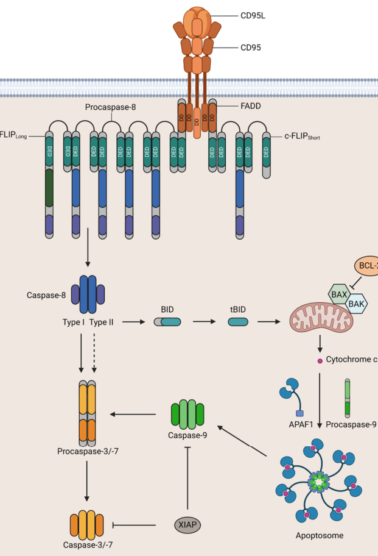

## Question

# Gene Research for Functional Annotation

## ⚠️ CRITICAL: Gene/Protein Identification Context

**BEFORE YOU BEGIN RESEARCH:** You MUST verify you are researching the CORRECT gene/protein. Gene symbols can be ambiguous, especially for less well-characterized genes from non-model organisms.

### Target Gene/Protein Identity (from UniProt):
- **UniProt Accession:** P25445
- **Protein Description:** RecName: Full=Tumor necrosis factor receptor superfamily member 6; AltName: Full=Apo-1 antigen; AltName: Full=Apoptosis-mediating surface antigen FAS; AltName: Full=FASLG receptor; AltName: CD_antigen=CD95; Flags: Precursor;
- **Gene Information:** Name=FAS; Synonyms=APT1, FAS1, TNFRSF6;
- **Organism (full):** Homo sapiens (Human).
- **Protein Family:** Not specified in UniProt
- **Key Domains:** DEATH-like_dom_sf. (IPR011029); Death_dom. (IPR000488); Fas_rcpt. (IPR008063); TNFR/NGFR_Cys_rich_reg. (IPR001368); TNFRSF6_death. (IPR033998)

### MANDATORY VERIFICATION STEPS:

1. **Check if the gene symbol "FAS" matches the protein description above**
2. **Verify the organism is correct:** Homo sapiens (Human).
3. **Check if protein family/domains align with what you find in literature**
4. **If you find literature for a DIFFERENT gene with the same or similar symbol, STOP**

### If Gene Symbol is Ambiguous or You Cannot Find Relevant Literature:

**DO NOT PROCEED WITH RESEARCH ON A DIFFERENT GENE.** Instead:
- State clearly: "The gene symbol 'FAS' is ambiguous or literature is limited for this specific protein"
- Explain what you found (e.g., "Found extensive literature on a different gene with the same symbol in a different organism")
- Describe the protein based ONLY on the UniProt information provided above
- Suggest that the protein function can be inferred from domain/family information

### Research Target:

Please provide a comprehensive research report on the gene **FAS** (gene ID: FAS, UniProt: P25445) in human.

The research report should be a detailed narrative explaining the function, biological processes, and localization of the gene product. Citations should be given for all claims.

You should prioritize authoritative reviews and primary scientific literature when conducting research. You can supplement
this with annotations you find in gene/protein databases, but these can be outdated or inaccurate.

We are specifically interested in the primary function of the gene - for enzymes, what reaction is catalyzed, and what is the substrate specificity? For transporters, what is the substrate? For structural proteins or adapters, what is the broader structural role? For signaling molecules, what is the role in the pathway.

We are interested in where in or outside the cell the gene product carries out its function.

We are also interested in the signaling or biochemical pathways in which the gene functions. We are less interested in broad pleiotropic effects, except where these elucidate the precise role.

Include evidence where possible. We are interested in both experimental evidence as well as inference from structure, evolution, or bioinformatic analysis. Precise studies should be prioritized over high-throughput, where available.

## Output

Question: You are an expert researcher providing comprehensive, well-cited information.

Provide detailed information focusing on:
1. Key concepts and definitions with current understanding
2. Recent developments and latest research (prioritize 2023-2024 sources)
3. Current applications and real-world implementations
4. Expert opinions and analysis from authoritative sources
5. Relevant statistics and data from recent studies

Format as a comprehensive research report with proper citations. Include URLs and publication dates where available.
Always prioritize recent, authoritative sources and provide specific citations for all major claims.

# Gene Research for Functional Annotation

## ⚠️ CRITICAL: Gene/Protein Identification Context

**BEFORE YOU BEGIN RESEARCH:** You MUST verify you are researching the CORRECT gene/protein. Gene symbols can be ambiguous, especially for less well-characterized genes from non-model organisms.

### Target Gene/Protein Identity (from UniProt):
- **UniProt Accession:** P25445
- **Protein Description:** RecName: Full=Tumor necrosis factor receptor superfamily member 6; AltName: Full=Apo-1 antigen; AltName: Full=Apoptosis-mediating surface antigen FAS; AltName: Full=FASLG receptor; AltName: CD_antigen=CD95; Flags: Precursor;
- **Gene Information:** Name=FAS; Synonyms=APT1, FAS1, TNFRSF6;
- **Organism (full):** Homo sapiens (Human).
- **Protein Family:** Not specified in UniProt
- **Key Domains:** DEATH-like_dom_sf. (IPR011029); Death_dom. (IPR000488); Fas_rcpt. (IPR008063); TNFR/NGFR_Cys_rich_reg. (IPR001368); TNFRSF6_death. (IPR033998)

### MANDATORY VERIFICATION STEPS:

1. **Check if the gene symbol "FAS" matches the protein description above**
2. **Verify the organism is correct:** Homo sapiens (Human).
3. **Check if protein family/domains align with what you find in literature**
4. **If you find literature for a DIFFERENT gene with the same or similar symbol, STOP**

### If Gene Symbol is Ambiguous or You Cannot Find Relevant Literature:

**DO NOT PROCEED WITH RESEARCH ON A DIFFERENT GENE.** Instead:
- State clearly: "The gene symbol 'FAS' is ambiguous or literature is limited for this specific protein"
- Explain what you found (e.g., "Found extensive literature on a different gene with the same symbol in a different organism")
- Describe the protein based ONLY on the UniProt information provided above
- Suggest that the protein function can be inferred from domain/family information

### Research Target:

Please provide a comprehensive research report on the gene **FAS** (gene ID: FAS, UniProt: P25445) in human.

The research report should be a detailed narrative explaining the function, biological processes, and localization of the gene product. Citations should be given for all claims.

You should prioritize authoritative reviews and primary scientific literature when conducting research. You can supplement
this with annotations you find in gene/protein databases, but these can be outdated or inaccurate.

We are specifically interested in the primary function of the gene - for enzymes, what reaction is catalyzed, and what is the substrate specificity? For transporters, what is the substrate? For structural proteins or adapters, what is the broader structural role? For signaling molecules, what is the role in the pathway.

We are interested in where in or outside the cell the gene product carries out its function.

We are also interested in the signaling or biochemical pathways in which the gene functions. We are less interested in broad pleiotropic effects, except where these elucidate the precise role.

Include evidence where possible. We are interested in both experimental evidence as well as inference from structure, evolution, or bioinformatic analysis. Precise studies should be prioritized over high-throughput, where available.

## Research report: Human **FAS** (TNFRSF6/CD95/APO-1; UniProt **P25445**) functional annotation and current translational landscape

### 1) Key concepts, definitions, and current understanding (verified gene/protein identity)

**Target verification (mandatory):** The gene symbol **FAS** here refers to the human cell-surface death receptor **CD95/APO-1**, a **type I transmembrane** member of the TNF receptor superfamily (TNFRSF6) with extracellular **cysteine-rich domains (CRDs)** and a cytosolic **death domain (DD)** that recruits the adaptor **FADD** to assemble a **death-inducing signaling complex (DISC)**, consistent with UniProt accession **P25445**. (hu2025fasmediatesapoptosis pages 1-2, seyrek2024thecrosstalkof pages 1-2)

**Core definition:** FAS/CD95 is a multifunctional receptor best known for initiating the **extrinsic apoptosis pathway** following engagement by its cognate ligand **FASLG/CD95L**, but it can also signal through **non-apoptotic** programs (e.g., NF-κB/MAPK) depending on stimulus strength, ligand form, and DISC composition. (seyrek2024thecrosstalkof pages 14-15, seyrek2024thecrosstalkof pages 2-4)

**Structural concepts (functional regions):**
- **Extracellular region:** 3 CRDs; ligand-binding is described primarily through **CRD2** and part of **CRD3**. A **pre-ligand assembly domain (PLAD)** (reported residues 59–82) promotes pre-association at the plasma membrane, facilitating signaling competence. (seyrek2024thecrosstalkof pages 2-4, seyrek2024thecrosstalkof pages 1-2)
- **Transmembrane segment:** a single-pass (~17 aa) TM region; intramembrane features contribute to receptor trimerization/clustering. (seyrek2024thecrosstalkof pages 2-4, seyrek2024thecrosstalkof pages 1-2)
- **Cytosolic death domain:** ~80 aa arranged as six antiparallel α-helices; it mediates homotypic DD interactions and binding to **FADD**, enabling DISC assembly. (seyrek2024thecrosstalkof pages 2-4, seyrek2024thecrosstalkof pages 1-2)

**Ligand forms matter (major checkpoint):** Reviews emphasize that **membrane-bound FASLG (mFASL)** is a strong apoptosis trigger, while **soluble FASLG (sFASL)** more often biases toward **non-apoptotic** outputs such as NF-κB signaling. (seyrek2024thecrosstalkof pages 14-15, hu2025fasmediatesapoptosis pages 1-2)

### 2) Mechanism and pathway placement

#### 2.1 Canonical apoptotic signaling (extrinsic apoptosis)
Upon ligand binding, conformational changes allow FAS DD engagement with **FADD**, which then recruits DED-containing proteins **procaspase-8/10** and **c-FLIP** isoforms to form the membrane-associated **DISC**; this supports procaspase-8 activation, which then activates effector caspases (e.g., caspase-3/-7) to execute apoptosis. DISC assembly is described as rapid (on the order of seconds). (hu2025fasmediatesapoptosis pages 1-2, seyrek2024thecrosstalkof pages 2-4)

A common conceptual framework is the presence of **type I vs type II** apoptotic responses downstream of death receptors (direct effector caspase activation vs mitochondrial amplification), and this is explicitly illustrated in the CD95 pathway schematics. (seyrek2024thecrosstalkof media 9097b778)

**Visual evidence (pathway schematic):** Seyrek et al. provide a figure depicting CD95L–CD95 engagement, DISC formation (FADD, procaspase-8, c-FLIP), and downstream type I/type II apoptotic routes. (seyrek2024thecrosstalkof media 9097b778, seyrek2024thecrosstalkof media cf4ad51c)

#### 2.2 Non-apoptotic (context-dependent) signaling
A key contemporary view is that CD95 can also act as a **multifunctional signaling receptor**, activating programs such as **NF-κB** and **MAPK (ERK/JNK/p38)**, supporting outcomes including chemokine release and cellular migration/invasion in certain contexts. (seyrek2024thecrosstalkof pages 14-15, seyrek2024thecrosstalkof pages 2-4)

**Mechanistic checkpoint—DISC composition and c-FLIP:** The level and isoform composition of **c-FLIP** at the DISC is highlighted as a central decision point: high c-FLIP can disrupt procaspase-8 DED filament formation, favoring non-apoptotic signaling; additionally, signaling intermediates associated with c-FLIP processing (e.g., p43-FLIP) are described to recruit components (e.g., TRAF2/RIPK1/RAF1) that connect to non-apoptotic pathways. (seyrek2024thecrosstalkof pages 14-15)

**Visual evidence (apoptotic vs non-apoptotic schematic):** A second figure in Seyrek et al. schematizes apoptotic and non-apoptotic signaling and depicts NF-κB activation downstream of CD95-associated complexes (including FADD/RIPK1/c-FLIP/caspases-8/10). (seyrek2024thecrosstalkof media 39ce50a4, seyrek2024thecrosstalkof media 9276d39c)

### 3) Cellular localization and where FAS acts

**Primary localization:** FAS is primarily a **plasma membrane/cell surface receptor**, broadly expressed across human cells and prominently in immune contexts; signaling is initiated at the membrane where receptor pre-association/clustering supports rapid assembly of signaling complexes. (hu2025fasmediatesapoptosis pages 1-2, seyrek2024thecrosstalkof pages 2-4, seyrek2024thecrosstalkof pages 1-2)

**Functional compartmentalization:** Current models separate membrane-proximal **DISC** (apoptotic) versus alternative membrane-associated complexes (often described as MISC/FADDosome-like) associated with non-apoptotic NF-κB/MAPK signaling. (seyrek2024thecrosstalkof pages 2-4, seyrek2024thecrosstalkof media 9097b778)

### 4) Regulation and expert synthesis (authoritative review perspectives)

Recent expert synthesis highlights that **cell fate downstream of CD95 is gated by multiple checkpoints**, including (i) ligand form (mFASL vs sFASL), (ii) stimulus strength/threshold effects, (iii) availability and PTMs of DISC components, and (iv) particularly the **c-FLIP:procaspase-8 balance** at the DISC. (seyrek2024thecrosstalkof pages 14-15, seyrek2024thecrosstalkof pages 2-4, seyrek2024thecrosstalkof pages 1-2)

Post-translational regulation is discussed as a life/death determinant, including **CD95 glycosylation** and PTMs that affect stability/turnover of DISC regulators (e.g., nitrosylation/ubiquitylation control of c-FLIP stability is summarized in the review-level evidence). (seyrek2024thecrosstalkof pages 14-15, seyrek2024thecrosstalkof pages 1-2)

### 5) Recent developments and latest research (prioritizing 2023–2024)

#### 5.1 Human genetics: FAS variants and autoimmune lymphoproliferative syndrome (ALPS)
A large 2024 cohort study of **802** individuals referred for ALPS NGS testing (May 2014–Jan 2023) provides quantitative, clinically grounded evidence linking FAS to immune homeostasis via apoptosis regulation:
- Definite diagnostic genetic findings in **7.7%** (62/802).
- Among diagnostic cases, **84%** (52/62) carried pathogenic/likely pathogenic **FAS** variants (6.5% of the total cohort).
- **46%** of unique diagnostic FAS variants were **novel** (17/37).
- Pathogenic variants were enriched in the intracellular region: **58%** (30/52) in the intracellular domain; among these, **57%** (17/30) were missense variants in the **death domain**.
These data support the DD as a critical functional module for apoptotic signaling competence in vivo. (xu2024genetictestingin pages 2-4, xu2024genetictestingin pages 1-2)

#### 5.2 Translational targeting: CD95 blockade by CD95-Fc (asunercept/APG101/CAN008)
A recurring translational theme is **therapeutic blockade of CD95–CD95L** using a soluble decoy/fusion protein (CD95 extracellular domain fused to Fc; commonly referred to as **asunercept/APG101/CAN008**), motivated by non-apoptotic tumor-promoting/invasive signaling in some contexts and by pathologic death signaling in others. (streuer2024treatmentwiththe pages 1-2)

**Glioblastoma (GBM):** A 2024 analysis of a phase 1/2 open-label trial cohort (NCT02853565) reports **10 enrolled** and **9 evaluable** newly diagnosed GBM patients receiving CAN008/asunercept plus standard chemoradiotherapy; high-dose weekly asunercept (400 mg/week; n=6) was associated with **2- and 5-year OS of 83% and 67%**, compared with **40.1% and 8.8%** in a historical Taiwanese GBM cohort (n=164), with historical median OS **20 months** and a reported *p*=0.0103 for improved OS in the high-dose group. The study also reports biomarker associations including **CD95L promoter methylation** and higher tumor **mutational burden** in responders. (chang2024can008prolongsoverall pages 1-2)

**Myelodysplastic neoplasms (MDS):** The ClinicalTrials.gov record for APG101 in MDS (NCT01736436; registry 2013) describes a phase 1, single-arm, open-label study with **20** enrolled, dosing **100 mg IV weekly for 12 weeks**, primary endpoint **safety/tolerability**, and secondary endpoints including transfusion frequency and bone marrow parameters. (NCT01736436 chunk 1)

A 2024 molecular substudy analyzing serial whole-exome sequencing in **12** low-risk MDS patients reports a **molecular response in 75%** (9/12), defined as ≥10% reduction in dominant clone VAF (mean decrease **20%**, range **10.5–39.2%**), with most decline after 12 weeks of treatment. (streuer2024treatmentwiththe pages 1-2)

**Severe COVID-19 (trial design):** The ClinicalTrials.gov record NCT04535674 (registry 2020) describes a multicenter, open-label, randomized phase 2 trial in hospitalized severe COVID-19 with **438** enrolled, comparing SoC vs SoC + weekly IV asunercept at 25/100/400 mg. The primary endpoint is time to sustained clinical improvement by ≥1 category on the WHO 9-point ordinal scale through day 29, with multiple secondary endpoints (oxygenation, ventilation, discharge, mortality). (NCT04535674 chunk 1)

### 6) Current applications and real-world implementations

**Clinical implementation:** The most concrete real-world implementation in the provided recent evidence is **CD95L/CD95 blockade** using asunercept/APG101/CAN008, evaluated across oncology (GBM), hematology (MDS), and infectious disease/inflammation (severe COVID-19) via interventional clinical trials with defined endpoints and substantial enrollment (e.g., NCT04535674). (chang2024can008prolongsoverall pages 1-2, NCT04535674 chunk 1, NCT01736436 chunk 1)

**Biomarker-driven considerations:** In GBM, CD95L promoter methylation and tumor mutational burden were linked to response, illustrating how CD95 pathway modulation is moving toward biomarker-informed use (hypothesis-generating at present). (chang2024can008prolongsoverall pages 1-2)

### 7) Summary tables (evidence-backed)

The following tables consolidate core functional annotation and quantitative translational evidence.

| Feature | Human FAS/CD95 annotation | Evidence note | Citation |
|---|---|---|---|
| Protein type / identity | Type I transmembrane death receptor of the TNF receptor superfamily; also called CD95, APO-1, TNFRSF6; human FAS corresponds to UniProt P25445 | Recent reviews explicitly match human FAS with CD95/APO-1 and describe it as a cell-surface TNFR-family death receptor mediating apoptotic and non-apoptotic signaling | (hu2025fasmediatesapoptosis pages 1-2, seyrek2024thecrosstalkof pages 1-2) |
| Extracellular cysteine-rich domains (CRDs) | N-terminal extracellular region contains three cysteine-rich domains; CRD2 and part of CRD3 contribute to ligand recognition | Structural summary identifies 3 CRDs and maps ligand-binding activity mainly to CRD2 plus part of CRD3, consistent with TNFR-family architecture | (seyrek2024thecrosstalkof pages 2-4, seyrek2024thecrosstalkof pages 1-2) |
| PLAD (pre-ligand assembly domain) | PLAD spans residues 59–82 and supports receptor pre-association/oligomerization before ligand binding | CD95 pre-oligomerization at the plasma membrane is highlighted as a signaling-facilitating feature, with PLAD specifically assigned to residues 59–82 | (seyrek2024thecrosstalkof pages 2-4, seyrek2024thecrosstalkof pages 1-2) |
| Transmembrane region | Single-pass transmembrane segment (~17 aa); intramembrane interactions contribute to receptor trimerization/clustering | Reviews describe a 17-aa TM region and note a proline-containing TM motif/intramembrane trimerization that helps organize signaling-competent receptor assemblies | (seyrek2024thecrosstalkof pages 2-4, seyrek2024thecrosstalkof pages 1-2) |
| Cytoplasmic death domain | Intracellular death domain (~80 aa) composed of six antiparallel α-helices; binds FADD through homotypic DD interactions | This domain is the core signaling module that converts ligand-induced receptor conformational changes into DISC assembly | (seyrek2024thecrosstalkof pages 2-4, seyrek2024thecrosstalkof pages 1-2) |
| Main ligand(s) | FAS ligand/CD95L is the cognate ligand; exists as membrane-bound (mFASL) and soluble (sFASL) forms | mFASL is emphasized as the potent apoptosis-inducing form, whereas sFASL more often favors non-apoptotic outputs such as NF-κB-linked signaling | (hu2025fasmediatesapoptosis pages 1-2, seyrek2024thecrosstalkof pages 14-15) |
| DISC adaptor proteins | FADD is the central adaptor; DISC recruits procaspase-8, procaspase-10, and c-FLIP isoforms | After FAS activation, FADD bridges the receptor death domain to DED-containing effectors/regulators, forming the membrane-bound DISC | (hu2025fasmediatesapoptosis pages 1-2, seyrek2024thecrosstalkof pages 2-4, seyrek2024thecrosstalkof media 9097b778) |
| Apoptotic signaling branch | Canonical extrinsic apoptosis via caspase-8 activation; type I cells rely mainly on direct effector caspase activation, type II cells amplify through mitochondria/BID/apoptosome | Figure-based and text evidence show DISC-driven caspase-8 activation followed by direct caspase-3/7 activation or mitochondrial amplification depending on cellular context | (seyrek2024thecrosstalkof pages 2-4, seyrek2024thecrosstalkof media 9097b778) |
| Non-apoptotic signaling branch | Can activate NF-κB and MAPK pathways (ERK, JNK, p38), supporting inflammation, migration, survival, regeneration, and tumor-promoting programs in some contexts | Current understanding is that FAS is multifunctional: low/altered stimulation or modified DISC composition can redirect signaling away from apoptosis toward survival/inflammatory programs | (seyrek2024thecrosstalkof pages 14-15, seyrek2024thecrosstalkof pages 2-4, seyrek2024thecrosstalkof media 9097b778) |
| Typical cellular localization | Primarily plasma membrane/cell surface receptor; signaling platforms include pre-associated oligomers and membrane microdomains; DISC assembles at the membrane | Reviews describe ubiquitous surface expression, especially on immune cells, with signaling initiated at membrane-associated receptor clusters | (hu2025fasmediatesapoptosis pages 1-2, seyrek2024thecrosstalkof pages 2-4, seyrek2024thecrosstalkof pages 1-2) |
| Key intracellular signaling compartments | Membrane-associated DISC for apoptotic signaling; non-apoptotic complexes including FADDosome/MISC have been proposed for NF-κB/MAPK signaling | Figure summary distinguishes DISC from non-apoptotic FADDosome-like assemblies containing FADD, RIPK1, c-FLIP, and caspases-8/10 | (seyrek2024thecrosstalkof pages 2-4, seyrek2024thecrosstalkof media 9097b778) |
| Ligand-form checkpoint | mFASL generally drives robust apoptotic signaling; sFASL preferentially supports non-apoptotic signaling | Ligand biochemical form is repeatedly cited as a major determinant of life/death outcome downstream of FAS | (hu2025fasmediatesapoptosis pages 1-2, seyrek2024thecrosstalkof pages 14-15) |
| c-FLIP checkpoint | c-FLIPL, c-FLIPS, and c-FLIPR modulate procaspase-8 activation; short isoforms inhibit caspase-8 activation, while c-FLIPL can be pro- or anti-apoptotic depending on abundance/ratio | DISC composition and especially c-FLIP level are presented as central switches controlling whether CD95 signaling remains apoptotic or becomes non-apoptotic | (seyrek2024thecrosstalkof pages 1-2, seyrek2024thecrosstalkof pages 14-15) |
| PTM / receptor regulation checkpoint | Glycosylation of CD95 and PTMs of DISC proteins influence signaling outcome; nitrosylation and ubiquitination control c-FLIP stability and apoptosis resistance | Reviews highlight PTMs as major checkpoints, though effects are context dependent and often act by reshaping DISC assembly or turnover of regulators | (seyrek2024thecrosstalkof pages 1-2, seyrek2024thecrosstalkof pages 14-15) |

*Table: This table summarizes the verified identity, domain architecture, signaling mechanisms, localization, and major regulatory checkpoints of human FAS/CD95 (UniProt P25445). It is useful as a compact functional annotation linking receptor structure to apoptotic versus non-apoptotic outcomes.*

| Evidence area | Study / source | Key quantitative or translational findings | URL | Publication / registry date | Citation |
|---|---|---|---|---|---|
| ALPS genetic testing cohort | Xu et al., *Journal of Clinical Immunology*; retrospective ALPS NGS testing cohort | 802 patients tested (May 2014–Jan 2023); median age 12 years; 63% male (504/802). Definite diagnostic yield 7.7% (62/802). Of diagnostic cases, 84% (52/62) had pathogenic/likely pathogenic **FAS** variants, equal to 6.5% of the full cohort (52/802). Diagnostic yield increased to 30% among patients also meeting abnormal ALPS immunology criteria. Among 37 unique diagnostic **FAS** variants, 46% (17/37) were novel. Domain distribution: 58% (30/52) of FAS-positive cases had heterozygous variants in the intracellular domain; of these, 57% (17/30) were missense variants in the death domain. | https://doi.org/10.1007/s10875-024-01772-z | Jul 2024 | (xu2024genetictestingin pages 2-4, xu2024genetictestingin pages 1-2) |
| GBM CAN008 / asunercept outcomes | Chang et al., *Biomedical Journal*; phase 1/2 open-label trial analysis in newly diagnosed glioblastoma | Trial NCT02853565 enrolled 10 patients; 9 evaluable. Dosing groups: 200 mg/week (n=3) and 400 mg/week (n=6) CAN008/asunercept plus standard CCRT. Compared with historical Taiwanese GBM cohort (n=164), high-dose CAN008 group showed OS at 2 and 5 years of 83% and 67% vs 40.1% and 8.8% in the historical cohort; historical cohort median OS 20 months; improved OS with high-dose CAN008, *p*=0.0103. Biomarker findings: low CD95L promoter CpG2 methylation associated with better response; better responders had higher variant count and tumor mutational burden. | https://doi.org/10.1016/j.bj.2023.100660 | Aug 2024 | (chang2024can008prolongsoverall pages 1-2) |
| MDS APG101 registry parameters | ClinicalTrials.gov NCT01736436; APG101/asunercept in transfusion-dependent low/intermediate-risk MDS | Phase 1, single-arm, open-label interventional study; enrollment 20. Intervention: APG101 100 mg IV weekly for 12 weeks with 6-month follow-up (37 weeks total). Primary objective/outcome: safety and tolerability (AEs/SAEs, ECGs, abdominal ultrasound, anti-drug antibodies, lymphocyte subsets/activation markers, ECOG). Secondary outcomes: overall survival, changes in transfusion frequency, bone marrow parameters (histologic/cytologic/cytogenetic), and hemoglobin levels. Key eligibility included adult WHO-classified de novo low/intermediate-risk MDS, blast count <5%, transfusion dependence, refractory/unlikely to respond to ESA. | https://clinicaltrials.gov/study/NCT01736436 | Registry 2013 | (NCT01736436 chunk 1) |
| MDS APG101 molecular substudy | Streuer et al., *Annals of Hematology*; molecular follow-up from NCT01736436 | Bone marrow from 12 low-risk MDS patients analyzed at 58 time points by serial whole-exome sequencing. Mean 3.5 molecularly defined subclones per patient (range 2–6). Molecular response defined as dominant clone VAF decrease ≥10% occurred in 9/12 patients (75%); mean VAF decrease 20%, range 10.5–39.2%. Most clonal decline occurred after completion of 12 weeks treatment. Early pronounced reductions were noted in subclones with DNMT3A, IDH2, or TET2 mutations. | https://doi.org/10.1007/s00277-024-05664-5 | Feb 2024 | (streuer2024treatmentwiththe pages 1-2) |
| Severe COVID-19 trial design | ClinicalTrials.gov NCT04535674; asunercept in hospitalized severe COVID-19 | Multicenter, open-label, randomized, phase 2 trial; enrollment 438 (actual). Parallel arms: Standard of Care alone vs SoC + asunercept at 25 mg, 100 mg, or 400 mg weekly IV. Primary endpoint: time to sustained clinical improvement of at least 1 category on the 9-category WHO ordinal scale, sustained for 2 consecutive days, measured Days 1–29. Secondary endpoints included NEWS-based recovery/discharge, oxygenation-free days, ventilator-free days, hospital/ICU outcomes, and mortality at days 15, 29, 60, and 90. | https://clinicaltrials.gov/study/NCT04535674 | Registry 2020 | (NCT04535674 chunk 1) |

*Table: This table compiles recent quantitative and clinical evidence for human FAS/CD95, spanning inherited disease genetics, oncology trials, hematology studies, and COVID-19 trial design. It is useful as a compact evidence map linking FAS biology to real-world human datasets and therapeutic development.*

### 8) Limitations of this synthesis

- While recent review evidence provides detailed mechanistic models (DISC vs non-apoptotic complexes), **precise numeric kinetic/biophysical parameters** (e.g., binding constants, absolute molecule counts per DISC) were not present in the extracted text snippets; the review points to such primary studies but they were not directly retrievable in the current evidence set. (seyrek2024thecrosstalkof pages 2-4, seyrek2024thecrosstalkof pages 20-21)
- Some highly relevant primary immunology work on non-apoptotic FAS signaling in human B cells (Science Immunology, 2024; doi:10.1126/sciimmunol.adj5948) was flagged as unobtainable in tool retrieval and therefore is not cited directly here.

### 9) Key recent sources (with dates and URLs)

- Seyrek K, Espe J, Reiss E, Lavrik IN. **The Crosstalk of Apoptotic and Non-Apoptotic Signaling in CD95 System.** *Cells.* **Nov 2024**. https://doi.org/10.3390/cells13211814 (seyrek2024thecrosstalkof pages 1-2)
- Xu X et al. **Genetic Testing in Patients with Autoimmune Lymphoproliferative Syndrome: Experience of 802 Patients…** *Journal of Clinical Immunology.* **Jul 2024**. https://doi.org/10.1007/s10875-024-01772-z (xu2024genetictestingin pages 1-2)
- Chang IY-F et al. **CAN008 prolongs overall survival… newly diagnosed GBM…** *Biomedical Journal.* **Aug 2024**. https://doi.org/10.1016/j.bj.2023.100660 (chang2024can008prolongsoverall pages 1-2)
- Streuer A et al. **Treatment with the apoptosis inhibitor Asunercept reduces clone sizes… lower risk MDS.** *Annals of Hematology.* **Feb 2024**. https://doi.org/10.1007/s00277-024-05664-5 (streuer2024treatmentwiththe pages 1-2)
- ClinicalTrials.gov. **NCT01736436: APG101 in Myelodysplastic Syndrome.** Registry **2013**. https://clinicaltrials.gov/study/NCT01736436 (NCT01736436 chunk 1)
- ClinicalTrials.gov. **NCT04535674: Asunercept in Patients With Severe COVID-19.** Registry **2020**. https://clinicaltrials.gov/study/NCT04535674 (NCT04535674 chunk 1)

References

1. (hu2025fasmediatesapoptosis pages 1-2): Liying Hu, Juane Lu, Hongfei Fan, Changcheng Niu, Yanping Han, Qinggele Caiyin, Hao Wu, and Jianjun Qiao. Fas mediates apoptosis, inflammation, and treatment of pathogen infection. Frontiers in Cellular and Infection Microbiology, Apr 2025. URL: https://doi.org/10.3389/fcimb.2025.1561102, doi:10.3389/fcimb.2025.1561102. This article has 25 citations.

2. (seyrek2024thecrosstalkof pages 1-2): Kamil Seyrek, Johannes Espe, Elisabeth Reiss, and Inna N. Lavrik. The crosstalk of apoptotic and non-apoptotic signaling in cd95 system. Cells, 13:1814, Nov 2024. URL: https://doi.org/10.3390/cells13211814, doi:10.3390/cells13211814. This article has 12 citations.

3. (seyrek2024thecrosstalkof pages 14-15): Kamil Seyrek, Johannes Espe, Elisabeth Reiss, and Inna N. Lavrik. The crosstalk of apoptotic and non-apoptotic signaling in cd95 system. Cells, 13:1814, Nov 2024. URL: https://doi.org/10.3390/cells13211814, doi:10.3390/cells13211814. This article has 12 citations.

4. (seyrek2024thecrosstalkof pages 2-4): Kamil Seyrek, Johannes Espe, Elisabeth Reiss, and Inna N. Lavrik. The crosstalk of apoptotic and non-apoptotic signaling in cd95 system. Cells, 13:1814, Nov 2024. URL: https://doi.org/10.3390/cells13211814, doi:10.3390/cells13211814. This article has 12 citations.

5. (seyrek2024thecrosstalkof media 9097b778): Kamil Seyrek, Johannes Espe, Elisabeth Reiss, and Inna N. Lavrik. The crosstalk of apoptotic and non-apoptotic signaling in cd95 system. Cells, 13:1814, Nov 2024. URL: https://doi.org/10.3390/cells13211814, doi:10.3390/cells13211814. This article has 12 citations.

6. (seyrek2024thecrosstalkof media cf4ad51c): Kamil Seyrek, Johannes Espe, Elisabeth Reiss, and Inna N. Lavrik. The crosstalk of apoptotic and non-apoptotic signaling in cd95 system. Cells, 13:1814, Nov 2024. URL: https://doi.org/10.3390/cells13211814, doi:10.3390/cells13211814. This article has 12 citations.

7. (seyrek2024thecrosstalkof media 39ce50a4): Kamil Seyrek, Johannes Espe, Elisabeth Reiss, and Inna N. Lavrik. The crosstalk of apoptotic and non-apoptotic signaling in cd95 system. Cells, 13:1814, Nov 2024. URL: https://doi.org/10.3390/cells13211814, doi:10.3390/cells13211814. This article has 12 citations.

8. (seyrek2024thecrosstalkof media 9276d39c): Kamil Seyrek, Johannes Espe, Elisabeth Reiss, and Inna N. Lavrik. The crosstalk of apoptotic and non-apoptotic signaling in cd95 system. Cells, 13:1814, Nov 2024. URL: https://doi.org/10.3390/cells13211814, doi:10.3390/cells13211814. This article has 12 citations.

9. (xu2024genetictestingin pages 2-4): Xinxiu Xu, James Denton, Yaning Wu, Jie Liu, Qiaoning Guan, D. Brian Dawson, Jack Bleesing, and Wenying Zhang. Genetic testing in patients with autoimmune lymphoproliferative syndrome: experience of 802 patients at cincinnati children’s hospital medical center. Journal of Clinical Immunology, Jul 2024. URL: https://doi.org/10.1007/s10875-024-01772-z, doi:10.1007/s10875-024-01772-z. This article has 5 citations and is from a domain leading peer-reviewed journal.

10. (xu2024genetictestingin pages 1-2): Xinxiu Xu, James Denton, Yaning Wu, Jie Liu, Qiaoning Guan, D. Brian Dawson, Jack Bleesing, and Wenying Zhang. Genetic testing in patients with autoimmune lymphoproliferative syndrome: experience of 802 patients at cincinnati children’s hospital medical center. Journal of Clinical Immunology, Jul 2024. URL: https://doi.org/10.1007/s10875-024-01772-z, doi:10.1007/s10875-024-01772-z. This article has 5 citations and is from a domain leading peer-reviewed journal.

11. (streuer2024treatmentwiththe pages 1-2): Alexander Streuer, Johann-Christoph Jann, Tobias Boch, Maximilian Mossner, Vladimir Riabov, Nanni Schmitt, Eva Altrock, Qingyu Xu, Marie Demmerle, Verena Nowak, Julia Oblaender, Iris Palme, Nadine Weimer, Felicitas Rapp, Georgia Metzgeroth, Anna Hecht, Thomas Höger, Christian Merz, Wolf-Karsten Hofmann, Florian Nolte, and Daniel Nowak. Treatment with the apoptosis inhibitor asunercept reduces clone sizes in patients with lower risk myelodysplastic neoplasms. Annals of Hematology, 103:1221-1233, Feb 2024. URL: https://doi.org/10.1007/s00277-024-05664-5, doi:10.1007/s00277-024-05664-5. This article has 3 citations and is from a peer-reviewed journal.

12. (chang2024can008prolongsoverall pages 1-2): Ian Yi-Feng Chang, Hong-Chieh Tsai, Chia-Hua Chen, Hsiu-Chi Chen, Chia-Wen Huang, Gerald F. Cox, Fang-Min Huang, You-Yu Lin, Ko-Ting Chen, Ya-Jui Lin, and Kuo-Chen Wei. Can008 prolongs overall survival in patients with newly diagnosed gbm characterized by high tumor mutational burden. Aug 2024. URL: https://doi.org/10.1016/j.bj.2023.100660, doi:10.1016/j.bj.2023.100660. This article has 1 citations.

13. (NCT01736436 chunk 1):  APG101 in Myelodysplastic Syndrome. Apogenix GmbH. 2013. ClinicalTrials.gov Identifier: NCT01736436

14. (NCT04535674 chunk 1):  Asunercept in Patients With Severe COVID-19. Apogenix AG. 2020. ClinicalTrials.gov Identifier: NCT04535674

15. (seyrek2024thecrosstalkof pages 20-21): Kamil Seyrek, Johannes Espe, Elisabeth Reiss, and Inna N. Lavrik. The crosstalk of apoptotic and non-apoptotic signaling in cd95 system. Cells, 13:1814, Nov 2024. URL: https://doi.org/10.3390/cells13211814, doi:10.3390/cells13211814. This article has 12 citations.

## Artifacts

- [Edison artifact artifact-00](FAS-deep-research-falcon_artifacts/artifact-00.md)
- [Edison artifact artifact-01](FAS-deep-research-falcon_artifacts/artifact-01.md)

## Citations

1. seyrek2024thecrosstalkof pages 14-15
2. streuer2024treatmentwiththe pages 1-2
3. seyrek2024thecrosstalkof pages 1-2
4. xu2024genetictestingin pages 1-2
5. hu2025fasmediatesapoptosis pages 1-2
6. seyrek2024thecrosstalkof pages 2-4
7. xu2024genetictestingin pages 2-4
8. seyrek2024thecrosstalkof pages 20-21
9. https://doi.org/10.1007/s10875-024-01772-z
10. https://doi.org/10.1016/j.bj.2023.100660
11. https://clinicaltrials.gov/study/NCT01736436
12. https://doi.org/10.1007/s00277-024-05664-5
13. https://clinicaltrials.gov/study/NCT04535674
14. https://doi.org/10.3390/cells13211814
15. https://doi.org/10.3389/fcimb.2025.1561102,
16. https://doi.org/10.3390/cells13211814,
17. https://doi.org/10.1007/s10875-024-01772-z,
18. https://doi.org/10.1007/s00277-024-05664-5,
19. https://doi.org/10.1016/j.bj.2023.100660,