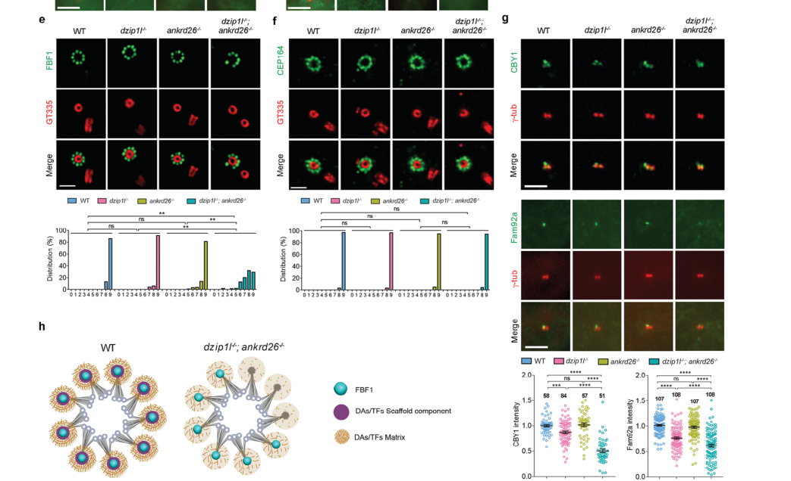

## Question

# Gene Research for Functional Annotation

## ⚠️ CRITICAL: Gene/Protein Identification Context

**BEFORE YOU BEGIN RESEARCH:** You MUST verify you are researching the CORRECT gene/protein. Gene symbols can be ambiguous, especially for less well-characterized genes from non-model organisms.

### Target Gene/Protein Identity (from UniProt):
- **UniProt Accession:** Q8TES7
- **Protein Description:** RecName: Full=Fas-binding factor 1; Short=FBF-1; AltName: Full=Protein albatross;
- **Gene Information:** Name=FBF1; Synonyms=ALB, KIAA1863;
- **Organism (full):** Homo sapiens (Human).
- **Protein Family:** Not specified in UniProt
- **Key Domains:** FBF1. (IPR033561); FBF1_C. (IPR049390); FBF1 (PF21007)

### MANDATORY VERIFICATION STEPS:

1. **Check if the gene symbol "FBF1" matches the protein description above**
2. **Verify the organism is correct:** Homo sapiens (Human).
3. **Check if protein family/domains align with what you find in literature**
4. **If you find literature for a DIFFERENT gene with the same or similar symbol, STOP**

### If Gene Symbol is Ambiguous or You Cannot Find Relevant Literature:

**DO NOT PROCEED WITH RESEARCH ON A DIFFERENT GENE.** Instead:
- State clearly: "The gene symbol 'FBF1' is ambiguous or literature is limited for this specific protein"
- Explain what you found (e.g., "Found extensive literature on a different gene with the same symbol in a different organism")
- Describe the protein based ONLY on the UniProt information provided above
- Suggest that the protein function can be inferred from domain/family information

### Research Target:

Please provide a comprehensive research report on the gene **FBF1** (gene ID: FBF1, UniProt: Q8TES7) in human.

The research report should be a detailed narrative explaining the function, biological processes, and localization of the gene product. Citations should be given for all claims.

You should prioritize authoritative reviews and primary scientific literature when conducting research. You can supplement
this with annotations you find in gene/protein databases, but these can be outdated or inaccurate.

We are specifically interested in the primary function of the gene - for enzymes, what reaction is catalyzed, and what is the substrate specificity? For transporters, what is the substrate? For structural proteins or adapters, what is the broader structural role? For signaling molecules, what is the role in the pathway.

We are interested in where in or outside the cell the gene product carries out its function.

We are also interested in the signaling or biochemical pathways in which the gene functions. We are less interested in broad pleiotropic effects, except where these elucidate the precise role.

Include evidence where possible. We are interested in both experimental evidence as well as inference from structure, evolution, or bioinformatic analysis. Precise studies should be prioritized over high-throughput, where available.

## Output

Question: You are an expert researcher providing comprehensive, well-cited information.

Provide detailed information focusing on:
1. Key concepts and definitions with current understanding
2. Recent developments and latest research (prioritize 2023-2024 sources)
3. Current applications and real-world implementations
4. Expert opinions and analysis from authoritative sources
5. Relevant statistics and data from recent studies

Format as a comprehensive research report with proper citations. Include URLs and publication dates where available.
Always prioritize recent, authoritative sources and provide specific citations for all major claims.

# Gene Research for Functional Annotation

## ⚠️ CRITICAL: Gene/Protein Identification Context

**BEFORE YOU BEGIN RESEARCH:** You MUST verify you are researching the CORRECT gene/protein. Gene symbols can be ambiguous, especially for less well-characterized genes from non-model organisms.

### Target Gene/Protein Identity (from UniProt):
- **UniProt Accession:** Q8TES7
- **Protein Description:** RecName: Full=Fas-binding factor 1; Short=FBF-1; AltName: Full=Protein albatross;
- **Gene Information:** Name=FBF1; Synonyms=ALB, KIAA1863;
- **Organism (full):** Homo sapiens (Human).
- **Protein Family:** Not specified in UniProt
- **Key Domains:** FBF1. (IPR033561); FBF1_C. (IPR049390); FBF1 (PF21007)

### MANDATORY VERIFICATION STEPS:

1. **Check if the gene symbol "FBF1" matches the protein description above**
2. **Verify the organism is correct:** Homo sapiens (Human).
3. **Check if protein family/domains align with what you find in literature**
4. **If you find literature for a DIFFERENT gene with the same or similar symbol, STOP**

### If Gene Symbol is Ambiguous or You Cannot Find Relevant Literature:

**DO NOT PROCEED WITH RESEARCH ON A DIFFERENT GENE.** Instead:
- State clearly: "The gene symbol 'FBF1' is ambiguous or literature is limited for this specific protein"
- Explain what you found (e.g., "Found extensive literature on a different gene with the same symbol in a different organism")
- Describe the protein based ONLY on the UniProt information provided above
- Suggest that the protein function can be inferred from domain/family information

### Research Target:

Please provide a comprehensive research report on the gene **FBF1** (gene ID: FBF1, UniProt: Q8TES7) in human.

The research report should be a detailed narrative explaining the function, biological processes, and localization of the gene product. Citations should be given for all claims.

You should prioritize authoritative reviews and primary scientific literature when conducting research. You can supplement
this with annotations you find in gene/protein databases, but these can be outdated or inaccurate.

We are specifically interested in the primary function of the gene - for enzymes, what reaction is catalyzed, and what is the substrate specificity? For transporters, what is the substrate? For structural proteins or adapters, what is the broader structural role? For signaling molecules, what is the role in the pathway.

We are interested in where in or outside the cell the gene product carries out its function.

We are also interested in the signaling or biochemical pathways in which the gene functions. We are less interested in broad pleiotropic effects, except where these elucidate the precise role.

Include evidence where possible. We are interested in both experimental evidence as well as inference from structure, evolution, or bioinformatic analysis. Precise studies should be prioritized over high-throughput, where available.

# Human FBF1 (UniProt Q8TES7): functional annotation and evidence report

## Identity and principal conclusion

**The research target is human FBF1**, Fas-binding factor 1, also called **albatross** (aliases ALB and KIAA1863 in the supplied UniProt record). Published human-cell studies identify this protein at the **distal appendages of the mother centriole**, which become **transition fibers at the base of a primary cilium**. Its experimentally best-supported function is **non-enzymatic organization of a selective ciliary gate**: FBF1 helps position intraflagellar-transport (IFT) machinery and maintain the appropriate complement of signaling proteins in cilia. The *Caenorhabditis elegans* orthologue used in cilia studies is **DYF-19**; it must not be confused with the unrelated nematode RNA-binding protein named **FBF-1**. The supplied FBF1, FBF1_C and PF21007 domain annotations are consistent with the specified protein identity, but do not establish catalytic activity or a biochemical substrate. No enzymatic reaction or transporter substrate is known for human FBF1. (yan2020talpid3andankrd26 pages 1-2, wei2013transitionfibreprotein pages 1-2, yang2018superresolutionarchitectureof pages 6-7)

The evidence is best understood as a hierarchy of **direct human-cell observations**, **conserved mechanisms tested in worms**, and **physiological findings from mice**. The following synopsis keeps those experimental systems separate. (wei2013transitionfibreprotein pages 1-2, chen2024thearpkdprotein pages 7-8, zhang2021fbf1deficiencypromotes pages 3-5)

| Activity/location | Strongest direct evidence | Interpretation/limitation |
|---|---|---|
| Distal-appendage matrix at the mother centriole and ciliary base; IFT recruitment and membrane-protein gating | Wei et al. (2013) found FBF1–IFT54 association and selective IFT-entry defects ([DOI](https://doi.org/10.1038/ncomms3750)). Yang et al. (2018) placed FBF1 between appendage blades with IFT88 and detected mature cilia in only approximately 14% of FBF1-knockout cells; ciliary SMO and somatostatin receptor SSTR3 were reduced, whereas ARL13B was preserved ([DOI](https://doi.org/10.1038/s41467-018-04469-1)). (yang2018superresolutionarchitectureof pages 7-8, wei2013transitionfibreprotein pages 7-8) | Best-supported primary function: a non-enzymatic distal-appendage gate or scaffold that organizes the IFT-containing matrix and selectively controls ciliary cargo entry or retention. SMO experiments favor defective retention over an absolute entry block. SSTR3 is a somatostatin receptor, not a serotonin receptor. |
| Transition-fiber AKAP9–PKA and BBS12–BBSome–Hedgehog signaling in adipocyte precursors | Zhang et al. (2021) showed that FBF1 associates with AKAP9 to constrain ciliary-base PKA–p38 beiging and recruits BBS12 for BBSome assembly and Hedgehog signaling. FBF1 knockdown reproduced beiging and adipogenic effects in primary human adipocyte precursors ([DOI](https://doi.org/10.1016/j.celrep.2021.109481)). (zhang2021fbf1deficiencypromotes pages 3-5, zhang2021fbf1deficiencypromotes pages 10-12, zhang2021fbf1deficiencypromotes pages 7-10) | Physiological support comes mainly from a mouse hypomorph retaining approximately 5% expression: approximately 50% prenatal mortality, 15% hydrocephalus with early death, and progressive “healthy obesity” among survivors. Severe developmental effects and residual expression preclude interpreting systemic FBF1 inhibition as a validated therapy. |
| DZIP1L–ANKRD26-dependent FBF1 organization at distal appendages in human RPE cells | Chen et al. (2024) used CRISPR and expansion microscopy to demonstrate compromised FBF1 anchoring and organization in DZIP1L–ANKRD26 double-knockout human RPE cells, while localization of structural component CEP164 remained intact ([DOI](https://doi.org/10.1002/advs.202308820)). (chen2024thearpkdprotein pages 7-8, chen2024thearpkdprotein media f23b56e3) | Human-cell evidence supports FBF1 as a functional matrix component downstream of DZIP1L and ANKRD26 rather than a core appendage-blade protein. Much of the assembly hierarchy and cargo mechanism was additionally established in *C. elegans* and is not direct human evidence. |
| Ciliary disassembly and Aurora A signaling in mouse fibroblasts | Je and Ko (2024) found normal ciliogenesis but delayed serum-induced ciliary resorption after Fbf1 siRNA in NIH3T3 cells. Depletion lowered Aurora A abundance, altered its basal-body localization, and increased G0/G1 retention ([DOI](https://doi.org/10.1186/s12964-024-01962-7)). (je2024distinctrolesof pages 5-9, je2024distinctrolesof pages 1-2) | Suggests an additional role in timely cilium disassembly during cell-cycle re-entry. Evidence is from mouse fibroblasts; direct FBF1–Aurora A binding and a causal stabilization mechanism were not demonstrated, and reduced Aurora A could be secondary to altered cell-cycle state. |
| Keratin-associated apical junctional complex in polarized human epithelial cells | Sugimoto et al. (2008) showed Albatross/FBF1 binding to keratins 8 and 18 and association with Par3. Knockdown disrupted ZO-1, afadin, desmoplakin, E-cadherin, and desmoglein-2 organization while largely preserving apical ezrin and microvilli ([DOI](https://doi.org/10.1083/jcb.200803133)). (sugimoto2008thekeratinbindingprotein pages 2-3, sugimoto2008thekeratinbindingprotein pages 6-9, sugimoto2008thekeratinbindingprotein pages 5-6) | Supports a non-ciliary scaffold role in epithelial polarity and lateral-membrane identity. Its mechanistic relationship to distal appendages remains unresolved, and this study did not test Fas signaling or apoptosis despite the name “Fas-binding factor 1.” |

*Table: Five experimentally supported functional contexts for human FBF1/Q8TES7, separated by species, cell type, and evidential limitation. The table distinguishes the established ciliary gate role from metabolic, disassembly, and epithelial-junction findings.*

## Molecular function and subcellular site

**A functional component of the distal-appendage matrix.** Distal appendages radiate from the mature mother centriole and participate in establishing the boundary between cytoplasm and cilium. In super-resolution maps of mammalian cells, CEP83, CEP89, SCLT1 and CEP164 define much of the appendage *blades*, whereas FBF1 lies toward the membrane-facing, distal end of the **matrix between blades**. IFT88 occupies this matrix and shares FBF1’s angular positions. Removing FBF1 contracts the radial distribution of IFT88 without visibly dismantling the CEP164 blade pattern. Thus, FBF1 is more precisely annotated as a **gate- or matrix-organizing protein** than as the principal load-bearing blade or a constituent of the adjacent transition zone. These localization and perturbation data come from Yang and colleagues’ peer-reviewed 2018 study, published in May: https://doi.org/10.1038/s41467-018-04469-1. (yang2018superresolutionarchitectureof pages 6-7, yang2018superresolutionarchitectureof pages 7-8)

**IFT access is a demonstrated molecular activity, with species-specific qualifications.** Wei and colleagues showed that nematode DYF-19 binds the IFT-B subunit DYF-11, the orthologue of mammalian **IFT54**. In *dyf-19* mutants, assembled IFT material accumulates below transition fibers, while IFT-A components and associated motors fail to populate the cilium normally; the fibers themselves are not generally lost. The same 2013 study detected mammalian FBF1–IFT54 association, mapped stronger interaction to FBF1’s C-terminal region, and observed FBF1 at the mammalian mother-centriole distal appendages. Following mammalian FBF1 depletion, residual shortened cilia still admitted the IFT-B marker **IFT88**, but showed defective entry of the IFT-A marker **IFT140**. It would therefore overstate the human-cell evidence to say that FBF1 blocks *all* IFT proteins from entering every cilium. Wei *et al.*, published November 2013: https://doi.org/10.1038/ncomms3750. (wei2013transitionfibreprotein pages 1-2, wei2013transitionfibreprotein pages 7-8)

**Selective ciliary membrane-protein enrichment is another demonstrated activity.** In the 2018 mammalian study, FBF1 loss reduced ciliary accumulation of **Smoothened (SMO)** and **SSTR3**, a *somatostatin* receptor, while the membrane-associated ciliary protein **ARL13B** remained enriched. Surface-cilium experiments favored a failure to **retain or enrich** SMO over an absolute inability of SMO to enter. Entry and retention were not conclusively separated, and these assays used expressed receptor reporters. In the studied FBF1-knockout population, early initiation markers—CP110 removal and TTBK2 recruitment—were present in approximately **70%**, versus **80%** of controls, yet mature cilia were detected in only approximately **14%** of knockout cells. FBF1 can consequently affect later ciliary maturation or maintenance as well as cargo composition, without acting like the core appendage factors required for the earliest docking steps. https://doi.org/10.1038/s41467-018-04469-1. (yang2018superresolutionarchitectureof pages 7-8)

**Recruitment of FBF1 is regulated by other ciliary-base proteins.** Yan and colleagues used worm genetics, protein-association assays and mammalian-cell imaging to identify a conserved **TALPID3–ANKRD26–FBF1** module: TALPID3 and ANKRD26 help place FBF1 at transition fibers. Importantly, depletion of FBF1 compromised gating without broadly removing the transition-fiber or transition-zone architecture. Yan *et al.*, May 2020: https://doi.org/10.1038/s41467-020-16042-w. A 2024 human retinal-pigment-epithelial-cell study further found that combined loss of **DZIP1L and ANKRD26** compromises FBF1’s precise appendage anchoring, while the blade marker CEP164 remains localized. Its expansion-microscopy evidence is particularly useful because conventional confocal imaging did not readily reveal the FBF1 misorganization. Double-mutant cells also showed impaired localization of IFT140, PKD2 and GLI3 in their remaining cilia; those are consequences of **DZIP1L/ANKRD26 loss**, not experiments demonstrating that FBF1 individually binds or directly transports each cargo. Chen *et al.*, published April 2024: https://doi.org/10.1002/advs.202308820. The original study’s cropped **Figure 7e–h** visually contrasts disturbed FBF1 organization with preserved CEP164 localization. (yan2020talpid3andankrd26 pages 9-10, chen2024thearpkdprotein pages 7-8, chen2024thearpkdprotein media f23b56e3)

## Biological pathways and additional localization

**Hedgehog signaling and adipocyte differentiation.** SMO, GLI proteins and GPR161 require regulated ciliary localization for Hedgehog signaling. In a 2021 study, FBF1-deficient adipose precursors exhibited impaired agonist-induced ciliary SMO/GLI3 localization, impaired GPR161 removal and reduced Hedgehog target-gene responses. FBF1 also associated with the BBS chaperonin component **BBS12** and supported its recruitment near transition fibers, connecting FBF1 to BBSome-dependent trafficking. In parallel, FBF1 associated with **AKAP9** at the ciliary base; its depletion increased locally accumulated PKA catalytic subunit and downstream p38-associated adipose *beiging*. Targeting a PKA inhibitor to the ciliary-base region reduced the beiging response, providing spatially informative evidence rather than a transcriptomic association alone. Comparable differentiation-related effects were reported following FBF1 knockdown in **primary human adipocyte precursors**, although organism-level outcomes were established in mice. Zhang *et al.*, published August 3, 2021: https://doi.org/10.1016/j.celrep.2021.109481. (zhang2021fbf1deficiencypromotes pages 3-5, zhang2021fbf1deficiencypromotes pages 5-7, zhang2021fbf1deficiencypromotes pages 12-14, zhang2021fbf1deficiencypromotes pages 7-10)

**Epithelial junctions are a separately demonstrated site of action.** Earlier work studied the same protein under its name **albatross**. In nonpolarized epithelial cells it associates with keratin intermediate filaments; in polarized cells it concentrates near the **apical junctional complex**. Keratins 8/18 bind and stabilize albatross, which associates with the polarity protein **PAR3**. Depletion disrupts junctional PAR3, ZO-1, afadin and desmoplakin, mispositions the lateral-membrane proteins E-cadherin and desmoglein 2, and weakens epithelial organization; apical ezrin and microvilli are relatively preserved. These experiments establish a non-ciliary **keratin-associated adaptor/scaffold role in epithelial polarity**, but do not establish how the junctional pool relates mechanistically to the distal-appendage pool. Sugimoto *et al.*, published October 6, 2008: https://doi.org/10.1083/jcb.200803133. (sugimoto2008thekeratinbindingprotein pages 2-3, sugimoto2008thekeratinbindingprotein pages 6-9, sugimoto2008thekeratinbindingprotein pages 5-6)

**Ciliary disassembly: a newer, less resolved role.** In a December 2024 study, siRNA depletion of **mouse Fbf1** in NIH3T3 fibroblasts left initial ciliogenesis comparatively intact but delayed cilium resorption after serum-induced cell-cycle re-entry. About **40%** of cells were ciliated before serum addition across groups; approximately **60% of control ciliated cells** had deciliated after **12 hours**, whereas Fbf1-depleted cells retained cilia longer and were more likely to remain in G0/G1. Aurora A abundance and basal-body localization were altered. These data implicate FBF1 in timely disassembly, **not** in a proven direct FBF1–Aurora A interaction: altered cell-cycle state could itself contribute to the lower Aurora A abundance. They are mouse-cell findings, not a demonstrated human-specific disassembly mechanism. Je and Ko, December 2024: https://doi.org/10.1186/s12964-024-01962-7. (je2024distinctrolesof pages 5-9, je2024distinctrolesof pages 1-2)

## Physiological relevance, recent developments and implementation

**Mouse phenotype establishes importance but cautions against simplistic intervention.** The extensively studied *Fbf1*^tm1a/tm1a^ line is **hypomorphic**, retaining approximately **5%** residual expression, rather than being a complete null. Approximately **50%** of homozygotes died before birth; another **15%** developed hydrocephalus, remained small and died within four weeks. Surviving animals developed obesity without increased food intake. Their fat mass exceeded **200% of control levels at 24 months**, yet adipose tissue showed enhanced beiging, predominantly hyperplastic rather than hypertrophic expansion, and favorable glucose- and insulin-tolerance findings, including under high-fat feeding. These striking results identify tissue-specific signaling consequences of reduced FBF1; the substantial developmental harm precludes treating systemic FBF1 inhibition as an established obesity or diabetes therapy. https://doi.org/10.1016/j.celrep.2021.109481. (zhang2021fbf1deficiencypromotes pages 3-5, zhang2021fbf1deficiencypromotes pages 12-14)

**The principal 2023–2024 advance** is a more discriminating account of *where* FBF1 acts: 2024 human-cell expansion microscopy places its DZIP1L/ANKRD26-dependent organization in the appendage-associated gating region, while 2024 mouse-cell experiments add a possible disassembly function. These findings refine—not replace—the earlier direct IFT, receptor-trafficking and epithelial-junction observations. A broad expert review of ciliary compartmentalization emphasizes that distal-base gating, transition-zone barriers, IFT and BBSome trafficking are interconnected but should not be collapsed into a single proven mechanism. Moran *et al.*, published online **October 23, 2023**, in a **2024** journal volume: https://doi.org/10.1038/s41581-023-00773-2. (chen2024thearpkdprotein pages 8-11, je2024distinctrolesof pages 5-9, moran2024transportandbarrier pages 14-15)

A subsequent **February 2025** human breast-cancer study proposed an additional FBF1–PI3K/AKT–SOX2 mechanism: FBF1 co-immunoprecipitated with PI3K, perturbing FBF1 altered stemness assays in human cancer cells and xenografts, and PI3K inhibition attenuated those effects. FBF1 expression was assessed in a microarray of **145 tumors and 30 para-carcinoma samples**; correlations with phospho-AKT and SOX2 were also examined in **24 human tumor samples**. These findings are **preclinical** and do not make FBF1 a validated diagnostic biomarker or established anticancer target; nor do they displace the stronger, independently replicated localization evidence for its ciliary-base function. Guo *et al.*, February 2025: https://doi.org/10.1186/s13287-025-04194-9. (guo2025fbf1maintainsstem pages 4-9, guo2025fbf1maintainsstem pages 1-2)

**Current practical use is primarily experimental:** FBF1 localization is measured as a distal-appendage/transition-fiber readout, and its perturbation helps distinguish structural appendage failure from selective IFT or receptor-composition defects. The studies reviewed here provide cellular models, imaging assays and disease-mechanism hypotheses; they do **not** establish a clinical FBF1-directed intervention or a specific human FBF1 monogenic disease diagnosis. Finally, the historical name “Fas-binding factor” should not, by itself, be taken to define FBF1’s main pathway as Fas-mediated apoptosis. An original 2000 report of CD95/Fas binding is cited in subsequent literature—https://doi.org/10.1016/S0167-4781(00)00163-9—but its full experimental account was not available for evaluation here; the directly examined functional studies establish the ciliary and epithelial roles described above. (sugimoto2008thekeratinbindingprotein pages 2-3, sugimoto2008thekeratinbindingprotein pages 10-10, chen2024thearpkdprotein media f23b56e3, wei2013transitionfibreprotein pages 7-8)

References

1. (yan2020talpid3andankrd26 pages 1-2): Hao Yan, Chuan Chen, Huicheng Chen, Hui Hong, Yan Huang, Kun Ling, Jinghua Hu, and Qing Wei. Talpid3 and ankrd26 selectively orchestrate fbf1 localization and cilia gating. Nature Communications, May 2020. URL: https://doi.org/10.1038/s41467-020-16042-w, doi:10.1038/s41467-020-16042-w. This article has 29 citations and is from a highest quality peer-reviewed journal.

2. (wei2013transitionfibreprotein pages 1-2): Qing Wei, Qingwen Xu, Yuxia Zhang, Yujie Li, Qing Zhang, Zeng Hu, Peter C. Harris, Vicente E. Torres, Kun Ling, and Jinghua Hu. Transition fibre protein fbf1 is required for the ciliary entry of assembled intraflagellar transport complexes. Nature communications, 4:2750-2750, Nov 2013. URL: https://doi.org/10.1038/ncomms3750, doi:10.1038/ncomms3750. This article has 143 citations and is from a highest quality peer-reviewed journal.

3. (yang2018superresolutionarchitectureof pages 6-7): T. Tony Yang, Weng Man Chong, Won-Jing Wang, Gregory Mazo, Barbara Tanos, Zhengmin Chen, Thi Minh Nguyet Tran, Yi-De Chen, Rueyhung Roc Weng, Chia-En Huang, Wann-Neng Jane, Meng-Fu Bryan Tsou, and Jung-Chi Liao. Super-resolution architecture of mammalian centriole distal appendages reveals distinct blade and matrix functional components. Nature Communications, May 2018. URL: https://doi.org/10.1038/s41467-018-04469-1, doi:10.1038/s41467-018-04469-1. This article has 265 citations and is from a highest quality peer-reviewed journal.

4. (chen2024thearpkdprotein pages 7-8): Huicheng Chen, Zhimao Wu, Ziwei Yan, Chuan Chen, Yingying Zhang, Qiaoling Wang, Yuqing Gao, Kun Ling, Jinghua Hu, and Qing Wei. The arpkd protein dzip1l regulates ciliary protein entry by modulating the architecture and function of ciliary transition fibers. Advanced Science, Apr 2024. URL: https://doi.org/10.1002/advs.202308820, doi:10.1002/advs.202308820. This article has 10 citations and is from a peer-reviewed journal.

5. (zhang2021fbf1deficiencypromotes pages 3-5): Yingyi Zhang, Jielu Hao, Mariana Tarrago, Gina Warner, Nino Giorgadze, Qing Wei, Yan Huang, Kai He, Chuan Chen, Thais Peclat, Thomas A. White, Kun Ling, Tamar Tchkonia, James L. Kirkland, Eduardo Chini, and Jinghua Hu. Fbf1 deficiency promotes beiging and healthy expansion of white adipose tissue. Cell reports, 36:109481-109481, Jan 2021. URL: https://doi.org/10.1016/j.celrep.2021.109481, doi:10.1016/j.celrep.2021.109481. This article has 36 citations and is from a highest quality peer-reviewed journal.

6. (yang2018superresolutionarchitectureof pages 7-8): T. Tony Yang, Weng Man Chong, Won-Jing Wang, Gregory Mazo, Barbara Tanos, Zhengmin Chen, Thi Minh Nguyet Tran, Yi-De Chen, Rueyhung Roc Weng, Chia-En Huang, Wann-Neng Jane, Meng-Fu Bryan Tsou, and Jung-Chi Liao. Super-resolution architecture of mammalian centriole distal appendages reveals distinct blade and matrix functional components. Nature Communications, May 2018. URL: https://doi.org/10.1038/s41467-018-04469-1, doi:10.1038/s41467-018-04469-1. This article has 265 citations and is from a highest quality peer-reviewed journal.

7. (wei2013transitionfibreprotein pages 7-8): Qing Wei, Qingwen Xu, Yuxia Zhang, Yujie Li, Qing Zhang, Zeng Hu, Peter C. Harris, Vicente E. Torres, Kun Ling, and Jinghua Hu. Transition fibre protein fbf1 is required for the ciliary entry of assembled intraflagellar transport complexes. Nature communications, 4:2750-2750, Nov 2013. URL: https://doi.org/10.1038/ncomms3750, doi:10.1038/ncomms3750. This article has 143 citations and is from a highest quality peer-reviewed journal.

8. (zhang2021fbf1deficiencypromotes pages 10-12): Yingyi Zhang, Jielu Hao, Mariana Tarrago, Gina Warner, Nino Giorgadze, Qing Wei, Yan Huang, Kai He, Chuan Chen, Thais Peclat, Thomas A. White, Kun Ling, Tamar Tchkonia, James L. Kirkland, Eduardo Chini, and Jinghua Hu. Fbf1 deficiency promotes beiging and healthy expansion of white adipose tissue. Cell reports, 36:109481-109481, Jan 2021. URL: https://doi.org/10.1016/j.celrep.2021.109481, doi:10.1016/j.celrep.2021.109481. This article has 36 citations and is from a highest quality peer-reviewed journal.

9. (zhang2021fbf1deficiencypromotes pages 7-10): Yingyi Zhang, Jielu Hao, Mariana Tarrago, Gina Warner, Nino Giorgadze, Qing Wei, Yan Huang, Kai He, Chuan Chen, Thais Peclat, Thomas A. White, Kun Ling, Tamar Tchkonia, James L. Kirkland, Eduardo Chini, and Jinghua Hu. Fbf1 deficiency promotes beiging and healthy expansion of white adipose tissue. Cell reports, 36:109481-109481, Jan 2021. URL: https://doi.org/10.1016/j.celrep.2021.109481, doi:10.1016/j.celrep.2021.109481. This article has 36 citations and is from a highest quality peer-reviewed journal.

10. (chen2024thearpkdprotein media f23b56e3): Huicheng Chen, Zhimao Wu, Ziwei Yan, Chuan Chen, Yingying Zhang, Qiaoling Wang, Yuqing Gao, Kun Ling, Jinghua Hu, and Qing Wei. The arpkd protein dzip1l regulates ciliary protein entry by modulating the architecture and function of ciliary transition fibers. Advanced Science, Apr 2024. URL: https://doi.org/10.1002/advs.202308820, doi:10.1002/advs.202308820. This article has 10 citations and is from a peer-reviewed journal.

11. (je2024distinctrolesof pages 5-9): Su-yeon Je and Hyuk Wan Ko. Distinct roles of centriole distal appendage proteins in ciliary assembly and disassembly. Cell Communication and Signaling : CCS, Dec 2024. URL: https://doi.org/10.1186/s12964-024-01962-7, doi:10.1186/s12964-024-01962-7. This article has 1 citations.

12. (je2024distinctrolesof pages 1-2): Su-yeon Je and Hyuk Wan Ko. Distinct roles of centriole distal appendage proteins in ciliary assembly and disassembly. Cell Communication and Signaling : CCS, Dec 2024. URL: https://doi.org/10.1186/s12964-024-01962-7, doi:10.1186/s12964-024-01962-7. This article has 1 citations.

13. (sugimoto2008thekeratinbindingprotein pages 2-3): Masahiko Sugimoto, Akihito Inoko, Takashi Shiromizu, Masanori Nakayama, Peng Zou, Shigenobu Yonemura, Yuko Hayashi, Ichiro Izawa, Mikio Sasoh, Yukitaka Uji, Kozo Kaibuchi, Tohru Kiyono, and Masaki Inagaki. The keratin-binding protein albatross regulates polarization of epithelial cells. The Journal of Cell Biology, 183:19-28, Oct 2008. URL: https://doi.org/10.1083/jcb.200803133, doi:10.1083/jcb.200803133. This article has 55 citations.

14. (sugimoto2008thekeratinbindingprotein pages 6-9): Masahiko Sugimoto, Akihito Inoko, Takashi Shiromizu, Masanori Nakayama, Peng Zou, Shigenobu Yonemura, Yuko Hayashi, Ichiro Izawa, Mikio Sasoh, Yukitaka Uji, Kozo Kaibuchi, Tohru Kiyono, and Masaki Inagaki. The keratin-binding protein albatross regulates polarization of epithelial cells. The Journal of Cell Biology, 183:19-28, Oct 2008. URL: https://doi.org/10.1083/jcb.200803133, doi:10.1083/jcb.200803133. This article has 55 citations.

15. (sugimoto2008thekeratinbindingprotein pages 5-6): Masahiko Sugimoto, Akihito Inoko, Takashi Shiromizu, Masanori Nakayama, Peng Zou, Shigenobu Yonemura, Yuko Hayashi, Ichiro Izawa, Mikio Sasoh, Yukitaka Uji, Kozo Kaibuchi, Tohru Kiyono, and Masaki Inagaki. The keratin-binding protein albatross regulates polarization of epithelial cells. The Journal of Cell Biology, 183:19-28, Oct 2008. URL: https://doi.org/10.1083/jcb.200803133, doi:10.1083/jcb.200803133. This article has 55 citations.

16. (yan2020talpid3andankrd26 pages 9-10): Hao Yan, Chuan Chen, Huicheng Chen, Hui Hong, Yan Huang, Kun Ling, Jinghua Hu, and Qing Wei. Talpid3 and ankrd26 selectively orchestrate fbf1 localization and cilia gating. Nature Communications, May 2020. URL: https://doi.org/10.1038/s41467-020-16042-w, doi:10.1038/s41467-020-16042-w. This article has 29 citations and is from a highest quality peer-reviewed journal.

17. (zhang2021fbf1deficiencypromotes pages 5-7): Yingyi Zhang, Jielu Hao, Mariana Tarrago, Gina Warner, Nino Giorgadze, Qing Wei, Yan Huang, Kai He, Chuan Chen, Thais Peclat, Thomas A. White, Kun Ling, Tamar Tchkonia, James L. Kirkland, Eduardo Chini, and Jinghua Hu. Fbf1 deficiency promotes beiging and healthy expansion of white adipose tissue. Cell reports, 36:109481-109481, Jan 2021. URL: https://doi.org/10.1016/j.celrep.2021.109481, doi:10.1016/j.celrep.2021.109481. This article has 36 citations and is from a highest quality peer-reviewed journal.

18. (zhang2021fbf1deficiencypromotes pages 12-14): Yingyi Zhang, Jielu Hao, Mariana Tarrago, Gina Warner, Nino Giorgadze, Qing Wei, Yan Huang, Kai He, Chuan Chen, Thais Peclat, Thomas A. White, Kun Ling, Tamar Tchkonia, James L. Kirkland, Eduardo Chini, and Jinghua Hu. Fbf1 deficiency promotes beiging and healthy expansion of white adipose tissue. Cell reports, 36:109481-109481, Jan 2021. URL: https://doi.org/10.1016/j.celrep.2021.109481, doi:10.1016/j.celrep.2021.109481. This article has 36 citations and is from a highest quality peer-reviewed journal.

19. (chen2024thearpkdprotein pages 8-11): Huicheng Chen, Zhimao Wu, Ziwei Yan, Chuan Chen, Yingying Zhang, Qiaoling Wang, Yuqing Gao, Kun Ling, Jinghua Hu, and Qing Wei. The arpkd protein dzip1l regulates ciliary protein entry by modulating the architecture and function of ciliary transition fibers. Advanced Science, Apr 2024. URL: https://doi.org/10.1002/advs.202308820, doi:10.1002/advs.202308820. This article has 10 citations and is from a peer-reviewed journal.

20. (moran2024transportandbarrier pages 14-15): Ailis L. Moran, Laura Louzao-Martinez, Dominic P. Norris, Dorien J. M. Peters, and Oliver E. Blacque. Transport and barrier mechanisms that regulate ciliary compartmentalization and ciliopathies. Nature Reviews Nephrology, 20:83-100, Oct 2024. URL: https://doi.org/10.1038/s41581-023-00773-2, doi:10.1038/s41581-023-00773-2. This article has 48 citations and is from a domain leading peer-reviewed journal.

21. (guo2025fbf1maintainsstem pages 4-9): Chunlei Guo, Shuang Li, Jiaqing Liu, Yuqiu Ma, Ang Liang, Yunwei Lou, Hui Liu, and Hui Wang. Fbf1 maintains stem cell-like properties in breast cancer via pi3k/akt/sox2 axis. Stem Cell Research & Therapy, Feb 2025. URL: https://doi.org/10.1186/s13287-025-04194-9, doi:10.1186/s13287-025-04194-9. This article has 7 citations and is from a peer-reviewed journal.

22. (guo2025fbf1maintainsstem pages 1-2): Chunlei Guo, Shuang Li, Jiaqing Liu, Yuqiu Ma, Ang Liang, Yunwei Lou, Hui Liu, and Hui Wang. Fbf1 maintains stem cell-like properties in breast cancer via pi3k/akt/sox2 axis. Stem Cell Research & Therapy, Feb 2025. URL: https://doi.org/10.1186/s13287-025-04194-9, doi:10.1186/s13287-025-04194-9. This article has 7 citations and is from a peer-reviewed journal.

23. (sugimoto2008thekeratinbindingprotein pages 10-10): Masahiko Sugimoto, Akihito Inoko, Takashi Shiromizu, Masanori Nakayama, Peng Zou, Shigenobu Yonemura, Yuko Hayashi, Ichiro Izawa, Mikio Sasoh, Yukitaka Uji, Kozo Kaibuchi, Tohru Kiyono, and Masaki Inagaki. The keratin-binding protein albatross regulates polarization of epithelial cells. The Journal of Cell Biology, 183:19-28, Oct 2008. URL: https://doi.org/10.1083/jcb.200803133, doi:10.1083/jcb.200803133. This article has 55 citations.

## Artifacts

- [Edison artifact artifact-00](FBF1-deep-research-falcon_artifacts/artifact-00.md)

## Citations

1. yang2018superresolutionarchitectureof pages 7-8
2. wei2013transitionfibreprotein pages 1-2
3. yang2018superresolutionarchitectureof pages 6-7
4. chen2024thearpkdprotein pages 7-8
5. wei2013transitionfibreprotein pages 7-8
6. je2024distinctrolesof pages 5-9
7. je2024distinctrolesof pages 1-2
8. sugimoto2008thekeratinbindingprotein pages 2-3
9. sugimoto2008thekeratinbindingprotein pages 6-9
10. sugimoto2008thekeratinbindingprotein pages 5-6
11. chen2024thearpkdprotein pages 8-11
12. moran2024transportandbarrier pages 14-15
13. sugimoto2008thekeratinbindingprotein pages 10-10
14. DOI
15. https://doi.org/10.1038/ncomms3750
16. https://doi.org/10.1038/s41467-018-04469-1
17. https://doi.org/10.1016/j.celrep.2021.109481
18. https://doi.org/10.1002/advs.202308820
19. https://doi.org/10.1186/s12964-024-01962-7
20. https://doi.org/10.1083/jcb.200803133
21. https://doi.org/10.1038/s41467-018-04469-1.
22. https://doi.org/10.1038/ncomms3750.
23. https://doi.org/10.1038/s41467-020-16042-w.
24. https://doi.org/10.1002/advs.202308820.
25. https://doi.org/10.1016/j.celrep.2021.109481.
26. https://doi.org/10.1083/jcb.200803133.
27. https://doi.org/10.1186/s12964-024-01962-7.
28. https://doi.org/10.1038/s41581-023-00773-2.
29. https://doi.org/10.1186/s13287-025-04194-9.
30. https://doi.org/10.1016/S0167-4781(00
31. https://doi.org/10.1038/s41467-020-16042-w,
32. https://doi.org/10.1038/ncomms3750,
33. https://doi.org/10.1038/s41467-018-04469-1,
34. https://doi.org/10.1002/advs.202308820,
35. https://doi.org/10.1016/j.celrep.2021.109481,
36. https://doi.org/10.1186/s12964-024-01962-7,
37. https://doi.org/10.1083/jcb.200803133,
38. https://doi.org/10.1038/s41581-023-00773-2,
39. https://doi.org/10.1186/s13287-025-04194-9,