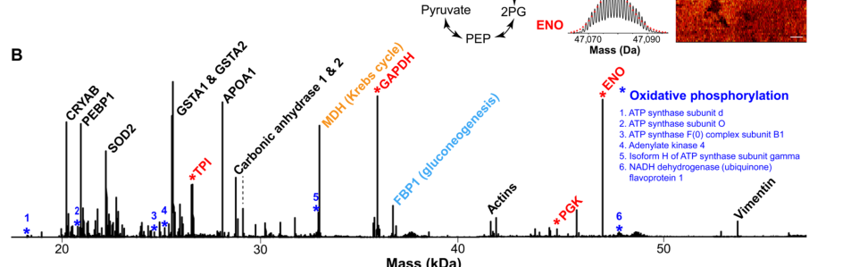

## Question

# Gene Research for Functional Annotation

## ⚠️ CRITICAL: Gene/Protein Identification Context

**BEFORE YOU BEGIN RESEARCH:** You MUST verify you are researching the CORRECT gene/protein. Gene symbols can be ambiguous, especially for less well-characterized genes from non-model organisms.

### Target Gene/Protein Identity (from UniProt):
- **UniProt Accession:** P09467
- **Protein Description:** RecName: Full=Fructose-1,6-bisphosphatase 1; Short=FBPase 1; EC=3.1.3.11 {ECO:0000269|PubMed:17350621, ECO:0000269|PubMed:8387495}; AltName: Full=D-fructose-1,6-bisphosphate 1-phosphohydrolase 1; AltName: Full=Liver FBPase;
- **Gene Information:** Name=FBP1; Synonyms=FBP;
- **Organism (full):** Homo sapiens (Human).
- **Protein Family:** Belongs to the FBPase class 1 family. .
- **Key Domains:** FBPase_C_dom. (IPR044015); FBPase_class-1. (IPR000146); FBPase_N. (IPR033391); FBPtase. (IPR028343); Fructose_bisphosphatase_AS. (IPR020548)

### MANDATORY VERIFICATION STEPS:

1. **Check if the gene symbol "FBP1" matches the protein description above**
2. **Verify the organism is correct:** Homo sapiens (Human).
3. **Check if protein family/domains align with what you find in literature**
4. **If you find literature for a DIFFERENT gene with the same or similar symbol, STOP**

### If Gene Symbol is Ambiguous or You Cannot Find Relevant Literature:

**DO NOT PROCEED WITH RESEARCH ON A DIFFERENT GENE.** Instead:
- State clearly: "The gene symbol 'FBP1' is ambiguous or literature is limited for this specific protein"
- Explain what you found (e.g., "Found extensive literature on a different gene with the same symbol in a different organism")
- Describe the protein based ONLY on the UniProt information provided above
- Suggest that the protein function can be inferred from domain/family information

### Research Target:

Please provide a comprehensive research report on the gene **FBP1** (gene ID: FBP1, UniProt: P09467) in human.

The research report should be a detailed narrative explaining the function, biological processes, and localization of the gene product. Citations should be given for all claims.

You should prioritize authoritative reviews and primary scientific literature when conducting research. You can supplement
this with annotations you find in gene/protein databases, but these can be outdated or inaccurate.

We are specifically interested in the primary function of the gene - for enzymes, what reaction is catalyzed, and what is the substrate specificity? For transporters, what is the substrate? For structural proteins or adapters, what is the broader structural role? For signaling molecules, what is the role in the pathway.

We are interested in where in or outside the cell the gene product carries out its function.

We are also interested in the signaling or biochemical pathways in which the gene functions. We are less interested in broad pleiotropic effects, except where these elucidate the precise role.

Include evidence where possible. We are interested in both experimental evidence as well as inference from structure, evolution, or bioinformatic analysis. Precise studies should be prioritized over high-throughput, where available.

## Output

Question: You are an expert researcher providing comprehensive, well-cited information.

Provide detailed information focusing on:
1. Key concepts and definitions with current understanding
2. Recent developments and latest research (prioritize 2023-2024 sources)
3. Current applications and real-world implementations
4. Expert opinions and analysis from authoritative sources
5. Relevant statistics and data from recent studies

Format as a comprehensive research report with proper citations. Include URLs and publication dates where available.
Always prioritize recent, authoritative sources and provide specific citations for all major claims.

# Gene Research for Functional Annotation

## ⚠️ CRITICAL: Gene/Protein Identification Context

**BEFORE YOU BEGIN RESEARCH:** You MUST verify you are researching the CORRECT gene/protein. Gene symbols can be ambiguous, especially for less well-characterized genes from non-model organisms.

### Target Gene/Protein Identity (from UniProt):
- **UniProt Accession:** P09467
- **Protein Description:** RecName: Full=Fructose-1,6-bisphosphatase 1; Short=FBPase 1; EC=3.1.3.11 {ECO:0000269|PubMed:17350621, ECO:0000269|PubMed:8387495}; AltName: Full=D-fructose-1,6-bisphosphate 1-phosphohydrolase 1; AltName: Full=Liver FBPase;
- **Gene Information:** Name=FBP1; Synonyms=FBP;
- **Organism (full):** Homo sapiens (Human).
- **Protein Family:** Belongs to the FBPase class 1 family. .
- **Key Domains:** FBPase_C_dom. (IPR044015); FBPase_class-1. (IPR000146); FBPase_N. (IPR033391); FBPtase. (IPR028343); Fructose_bisphosphatase_AS. (IPR020548)

### MANDATORY VERIFICATION STEPS:

1. **Check if the gene symbol "FBP1" matches the protein description above**
2. **Verify the organism is correct:** Homo sapiens (Human).
3. **Check if protein family/domains align with what you find in literature**
4. **If you find literature for a DIFFERENT gene with the same or similar symbol, STOP**

### If Gene Symbol is Ambiguous or You Cannot Find Relevant Literature:

**DO NOT PROCEED WITH RESEARCH ON A DIFFERENT GENE.** Instead:
- State clearly: "The gene symbol 'FBP1' is ambiguous or literature is limited for this specific protein"
- Explain what you found (e.g., "Found extensive literature on a different gene with the same symbol in a different organism")
- Describe the protein based ONLY on the UniProt information provided above
- Suggest that the protein function can be inferred from domain/family information

### Research Target:

Please provide a comprehensive research report on the gene **FBP1** (gene ID: FBP1, UniProt: P09467) in human.

The research report should be a detailed narrative explaining the function, biological processes, and localization of the gene product. Citations should be given for all claims.

You should prioritize authoritative reviews and primary scientific literature when conducting research. You can supplement
this with annotations you find in gene/protein databases, but these can be outdated or inaccurate.

We are specifically interested in the primary function of the gene - for enzymes, what reaction is catalyzed, and what is the substrate specificity? For transporters, what is the substrate? For structural proteins or adapters, what is the broader structural role? For signaling molecules, what is the role in the pathway.

We are interested in where in or outside the cell the gene product carries out its function.

We are also interested in the signaling or biochemical pathways in which the gene functions. We are less interested in broad pleiotropic effects, except where these elucidate the precise role.

Include evidence where possible. We are interested in both experimental evidence as well as inference from structure, evolution, or bioinformatic analysis. Precise studies should be prioritized over high-throughput, where available.

# Human FBP1: functional annotation and research report

## Identity and scope

**FBP1 is the correct human gene for UniProt P09467**, fructose-1,6-bisphosphatase 1 (FBPase 1; EC 3.1.3.11). It encodes the predominantly hepatic, or “liver,” isoform; the related **FBP2** gene encodes muscle FBPase and must not be conflated with it. Human FBP1 is a 338-amino-acid protein that assembles as a homotetramer. Its experimentally described substrate-, metal-, and AMP-binding regions are consistent with the FBPase class-1 family and domain annotations supplied in the question, although the individual InterPro identifiers were not independently verified in the retrieved primary papers. The UniProt entry is https://www.uniprot.org/uniprotkb/P09467/entry. (chandrasekhar2024infantilefructose16bisphosphatase pages 3-4, liu2018targetingfbpaseis pages 1-3, sakuma2023identificationofgenotype–biochemical pages 1-2)

## Primary molecular function and substrate specificity

FBP1 catalyzes **D-fructose-1,6-bisphosphate + H₂O → D-fructose-6-phosphate + inorganic phosphate**. It removes the phosphate at carbon 1, leaving fructose-6-phosphate, and requires a divalent-metal-dependent catalytic apparatus; Mg²⁺ and Mn²⁺ support activity in the reported biochemical descriptions. **Fructose-1,6-bisphosphate is the established physiological substrate.** The similarly named *fructose-2,6-bisphosphate* is instead a competitive inhibitor at the substrate-binding site; the evidence reviewed here does not establish it, or another sugar phosphate, as an alternative physiological FBP1 substrate. (sakuma2023identificationofgenotype–biochemical pages 1-2, proenca2020structuralspecificityof pages 1-2, timson2019fructose16bisphosphatasegetting pages 1-4)

This reaction is the fructose-bisphosphate step of **gluconeogenesis**, permitting production of glucose from carbon supplied by lactate, glycerol, and glucogenic amino acids. It bypasses glycolytic phosphofructokinase-1 (PFK1): PFK1 consumes ATP to convert fructose-6-phosphate into fructose-1,6-bisphosphate, whereas FBP1 hydrolyzes the latter without recovering that ATP. Coordinating these opposing reactions therefore helps avoid ATP-consuming futile cycling. Fructose metabolism can feed this gluconeogenic route, but dietary fructose itself is **not** the FBP1 enzyme substrate. (timson2019fructose16bisphosphatasegetting pages 1-4, zhou2020discoveryofnarylsulfonylindole2carboxamide pages 1-2, ni2024fructose16bisphosphatasedeficiencyestimation pages 1-2)

The tetramer provides distinct regulatory sites. **AMP inhibits allosterically** at a site distant from the catalytic pocket, promoting a less active tetramer conformation; **fructose-2,6-bisphosphate inhibits competitively**, and the two inhibitors act synergistically. Conversely, both AMP and fructose-2,6-bisphosphate favor PFK1-dependent glycolysis. These relationships place FBP1 at a metabolic control point linking energy status to glucose production, rather than making it a glucose transporter or a fructose-2,6-bisphosphatase. (timson2019fructose16bisphosphatasegetting pages 1-4, zhou2020discoveryofnarylsulfonylindole2carboxamide pages 1-2)

## Where FBP1 acts

The **canonical enzyme reaction occurs intracellularly, principally in the cytosol** of gluconeogenic hepatocytes and renal proximal-tubule cells; FBP1 is not characterized as a secreted enzyme. Human-enzyme literature identifies these two cell types, and immunofluorescence in a 2023 human FBP1 study showed a diffuse cytoplasmic distribution for wild-type protein. Human-kidney proteoform imaging independently identified FBP1/P09467 in kidney tissue; its mass spectrum confirms tissue-level protein detection but, by itself, does not pinpoint the protein to an individual nephron cell type or subcellular compartment. **Figure 2B, human kidney FBP1 signal:** (proenca2020structuralspecificityof pages 1-2, sakuma2023identificationofgenotype–biochemical pages 2-4, su2022highlymultiplexedlabelfree pages 5-6, su2022highlymultiplexedlabelfree pages 4-5, su2022highlymultiplexedlabelfree media 8404faf4)

A distinct, context-dependent function has been observed **in the nucleus of clear-cell renal carcinoma (ccRCC) cells**: FBP1 interacts with an inhibitory region of hypoxia-inducible factor (HIF) and restrains HIF-dependent programs independently of its phosphatase activity. The original study also found that FBP1 opposes glycolytic flux through its metabolic function and reported depletion across **more than 600 ccRCC tumors** examined. Nuclear HIF inhibition is therefore experimentally supported, but it should be annotated as a **noncanonical, cancer-context function**, not as the location or purpose of ordinary hepatic gluconeogenesis. (li2014fructose16bisphosphataseopposesrenal pages 1-2)

## Developments in 2023–2024 and physiological evidence

**Variant mechanism, July 2023.** Sakuma and colleagues studied human FBP1 **G164D and F194S** identified in a patient with hypoglycemic lactic acidosis. Complementation of FBP1-knockout HepG2 cells showed reduced protein abundance and loss of FBPase activity. Unlike diffuse wild-type protein, the variants formed cytoplasmic aggregates; patient-liver observations, ER-marker colocalization, fractionation, and chaperone-interaction analyses supported misfolding and abnormal intracellular processing. The authors distinguished variants that disrupt catalytic/metal-binding residues while retaining abundance from variants associated with substrate-pocket-adjacent misfolding and loss of abundance. A proposed pharmacological-chaperone approach for the latter remains **a research hypothesis**, not established treatment. [Sakuma *et al.*, *Communications Biology*, July 2023; https://doi.org/10.1038/s42003-023-05160-y.] (sakuma2023identificationofgenotype–biochemical pages 2-4, sakuma2023identificationofgenotype–biochemical pages 11-11, sakuma2023identificationofgenotype–biochemical pages 4-5)

**Human disease burden, July 2024.** Ni and colleagues curated **101 FBP1 variants**, used **97** classified pathogenic or likely pathogenic variants in prevalence modeling, and assembled clinical/genetic information on **122 patients** from their cohort and published reports. Their estimated prevalence of FBP1 deficiency in the Chinese population was **1 in 1,310,034**. This is a modeled, population-specific estimate—not a directly measured worldwide birth incidence. The study found associations between particular genotypes and features including urinary glycerol, ketosis, and hepatic steatosis, while emphasizing the diagnostic value of sequencing when clinical signs are nonspecific. [Ni *et al.*, *Frontiers in Genetics*, **5 July 2024**; https://doi.org/10.3389/fgene.2024.1296797.] (ni2024fructose16bisphosphatasedeficiencyestimation pages 1-2)

**Emerging metabolic regulation, November 2024.** Phosphoproteomic and metabolic work implicated protein-tyrosine phosphatase **PTPRK** in FBP1 regulation in **mouse hepatocytes**: PTPRK loss increased phosphorylated FBP1 and altered fructose-1,6-bisphosphate dynamics. The authors cautioned that the consequences of FBP1 tyrosine phosphorylation, its upstream kinase, and contributions from other glycolytic targets require further study. These are mechanistic leads, **not established residue-specific regulation of human FBP1**. [Gilglioni *et al.*, *Nature Communications*, November 2024; https://doi.org/10.1038/s41467-024-53733-0.] (gilglioni2024ptprkregulatesglycolysis pages 10-12)

## Current clinical and translational applications

Biallelic loss of FBP1 causes **autosomal-recessive fructose-1,6-bisphosphatase deficiency**. Inadequate glucose supply, particularly during fasting or illness, can expose the blocked gluconeogenic step, producing **ketotic hypoglycemia, elevated lactate, and metabolic acidosis**; fructose-rich intake may also precipitate symptoms. In practice, genetic testing helps establish the diagnosis, and management focuses on avoiding prolonged fasting, supplying carbohydrate or dextrose when needed, and individualized restriction of fructose-containing foods. A 2024 case report illustrates the need for monitoring beyond childhood: a woman managed with frequent complex-carbohydrate intake and glucose monitoring delivered a healthy **2,860-g infant at 37 weeks**, then experienced hypoglycemia and lactic acidosis during breastfeeding four months postpartum. One case cannot establish a universal pregnancy regimen. [Ferguson *et al.*, *JIMD Reports*, October 2024; https://doi.org/10.1002/jmd2.12453.] (sakuma2023identificationofgenotype–biochemical pages 1-2, ni2024fructose16bisphosphatasedeficiencyestimation pages 1-2, ferguson2024metabolicmanagementof pages 2-4, ferguson2024metabolicmanagementof pages 1-2)

Conversely, **inhibiting FBP1 is being investigated to reduce excessive hepatic glucose production in type 2 diabetes**. A biochemical and structural study reported that **Cpd118 inhibits human liver FBPase with IC₅₀ = 0.029 ± 0.006 μM**; glucose lowering was demonstrated in diabetic **mice and rats**, not established in patients by that study. Experiments with AMP-insensitive FBP1 knock-in mice also implicated FBP1 inhibition in part of metformin’s glucose-lowering mechanism, but they should not be interpreted as proof that direct FBP1 binding explains all metformin activity in humans. These efforts illustrate an important therapeutic distinction: inhibiting FBP1 could be useful when glucose output is excessive, while further loss of activity is undesirable in inherited FBP1 deficiency. [Zhou *et al.*, *Journal of Medicinal Chemistry*, August 2020; https://doi.org/10.1021/acs.jmedchem.0c00726. Hunter *et al.*, *Nature Medicine*, August 2018; https://doi.org/10.1038/s41591-018-0159-7.] (zhou2020discoveryofnarylsulfonylindole2carboxamide pages 1-2, hunter2018metforminreducesliver pages 1-2, timson2019fructose16bisphosphatasegetting pages 1-4)

**Functional-annotation conclusion:** The strongest primary annotation for **human FBP1/P09467** is a **cytosolic, metal-dependent fructose-1,6-bisphosphate 1-phosphohydrolase** that enables hepatic and renal gluconeogenesis. AMP and fructose-2,6-bisphosphate restrain that reaction; human loss-of-function variants and their clinical phenotype substantiate its physiological importance. Nuclear HIF repression in ccRCC and proposed drug-target roles are informative but should remain explicitly distinguished from its primary catalytic function. (sakuma2023identificationofgenotype–biochemical pages 1-2, proenca2020structuralspecificityof pages 1-2, sakuma2023identificationofgenotype–biochemical pages 2-4, li2014fructose16bisphosphataseopposesrenal pages 1-2)

The following evidence map summarizes the supporting findings and their limits.

| Question | High-confidence conclusion | Evidence | Interpretation / limit |
|---|---|---|---|
| **Molecular identity** | Target is **human FBP1**, liver fructose-1,6-bisphosphatase 1, **UniProt P09467**; it is not muscle **FBP2**. The supplied InterPro annotations identify an FBPase class-1 fold with N- and C-terminal regions. | P09467 is explicitly linked to human FBP1; liver FBP1 and muscle FBP2 are encoded by distinct genes. Human liver FBP1 is a 338-residue homotetramer (chandrasekhar2024infantilefructose16bisphosphatase pages 3-4, liu2018targetingfbpaseis pages 1-3, sakuma2023identificationofgenotype–biochemical pages 1-2). | The exact InterPro identifiers were supplied in the query and were not independently established by the retrieved papers; literature nevertheless supports the catalytic, metal-, substrate-, and AMP-binding architecture. |
| **Reaction and specificity** | **D-fructose-1,6-bisphosphate + H₂O → D-fructose-6-phosphate + Pi** (EC 3.1.3.11), requiring divalent metal ions such as Mg²⁺ or Mn²⁺. Fructose-1,6-bisphosphate is the established physiological substrate; **fructose-2,6-bisphosphate is a competitive inhibitor, not the normal substrate**. | Human liver FBP1 reaction and metal dependence are directly described; fructose-2,6-bisphosphate occupies the active site, whereas AMP binds a distant allosteric site (proenca2020structuralspecificityof pages 1-2, timson2019fructose16bisphosphatasegetting pages 1-4, sakuma2023identificationofgenotype–biochemical pages 1-2). | Retrieved evidence did not establish another physiological substrate through a rigorous human-enzyme substrate panel. The reaction bypasses the irreversible PFK1 step but does not regenerate the ATP consumed by PFK1. |
| **Cellular and tissue location** | Canonical catalysis occurs mainly in the **cytosol of hepatocytes and renal proximal-tubule cells**. Human kidney proteoform imaging directly detected P09467/FBP1. In ccRCC, **nuclear FBP1** can also repress HIF through a non-catalytic interaction. | Wild-type FBP1 shows diffuse cytoplasmic localization; human kidney PiMS identified P09467 at approximately 37 kDa. ccRCC experiments separated catalytic control of glycolysis from phosphatase-independent inhibition of HIF (sakuma2023identificationofgenotype–biochemical pages 2-4, su2022highlymultiplexedlabelfree pages 5-6, su2022highlymultiplexedlabelfree pages 4-5, su2022highlymultiplexedlabelfree media 8404faf4, li2014fructose16bisphosphataseopposesrenal pages 1-2). | Nuclear HIF regulation is a disease-associated moonlighting function and should not replace cytosolic gluconeogenesis as the primary annotation. Kidney PiMS proves tissue presence but does not alone assign every signal to a specific nephron cell type. |
| **2023 variant mechanism** | **G164D and F194S** reduce abundance and activity through misfolding, cytoplasmic aggregation, ER trapping, and degradation. This differs from “type 1” substitutions at catalytic or metal-binding residues, which impair activity while largely preserving abundance. | FBP1-knockout HepG2 complementation, activity assays, immunofluorescence, patient-liver staining, fractionation, chaperone interactomics, and kifunensine rescue supported the mechanism (sakuma2023identificationofgenotype–biochemical pages 2-4, sakuma2023identificationofgenotype–biochemical pages 7-11, sakuma2023identificationofgenotype–biochemical pages 11-11, sakuma2023identificationofgenotype–biochemical pages 4-5). | Pharmacological chaperones for misfolding variants are mechanistically plausible but remain experimental, not established treatment. |
| **2024 epidemiology** | Estimated Chinese FBP1-deficiency prevalence: **1 in 1,310,034**. Investigators collected **101 variants**, used 97 pathogenic or likely pathogenic variants for prevalence modeling, and pooled clinical/genetic information from **122 patients**. | Three estimation approaches were applied; genotype–phenotype associations and comparison with 68 hereditary-fructose-intolerance cases were also reported (ni2024fructose16bisphosphatasedeficiencyestimation pages 1-2). | This is a population-genetic estimate, not newborn-screening incidence. The pooled cases are susceptible to ascertainment and publication biases. |
| **2024 pregnancy management** | A pregnant woman with FBP1 deficiency received frequent complex-carbohydrate intake, glucose monitoring, avoidance of prolonged fasting, and fructose/sucrose restriction. She delivered a healthy **2,860-g infant at 37 weeks**, but developed hypoglycemia and lactic acidosis four months postpartum while breastfeeding. | The postpartum episode included lactate **8.9 mmol/L** and improved with intravenous dextrose (ferguson2024metabolicmanagementof pages 2-4, ferguson2024metabolicmanagementof pages 1-2). | This is one case, not a controlled trial. It supports intensified monitoring during pregnancy and lactation but cannot define a universal dietary regimen. |
| **Translational inhibition** | **Cpd118** inhibited human liver FBP1 with **IC₅₀ = 0.029 ± 0.006 μM** and had a structurally resolved binding mode. It lowered fasting/postprandial glucose and HbA1c in diabetic KKAy mice and ZDF rats. | Human-enzyme potency, X-ray complex analysis, 99.1% oral bioavailability, and rodent efficacy were reported (zhou2020discoveryofnarylsulfonylindole2carboxamide pages 1-2). | Human-enzyme inhibition does **not** demonstrate efficacy or safety in patients; glucose lowering was shown only in rodent disease models. |

*Table: Compact evidence map covering verified identity, catalytic function, localization, pathogenic variants, recent epidemiology, clinical management, and translational inhibition. Limitations distinguish direct human evidence from disease-specific or animal findings.*

References

1. (chandrasekhar2024infantilefructose16bisphosphatase pages 3-4): V Chandrasekhar, P Yelkur, and V Chandrasekhar Jr. Infantile fructose-1, 6-bisphosphatase deficiency masquerading as mitochondriopathy. Unknown journal, 2024.

2. (liu2018targetingfbpaseis pages 1-3): Gao-Min Liu and Yao-Ming Zhang. Targeting fbpase is an emerging novel approach for cancer therapy. Cancer Cell International, Mar 2018. URL: https://doi.org/10.1186/s12935-018-0533-z, doi:10.1186/s12935-018-0533-z. This article has 54 citations and is from a peer-reviewed journal.

3. (sakuma2023identificationofgenotype–biochemical pages 1-2): Ikki Sakuma, Hidekazu Nagano, Naoko Hashimoto, Masanori Fujimoto, Akitoshi Nakayama, Takahiro Fuchigami, Yuki Taki, Tatsuma Matsuda, Hiroyuki Akamine, Satomi Kono, Takashi Kono, Masataka Yokoyama, Motoi Nishimura, Koutaro Yokote, Tatsuki Ogasawara, Yoichi Fujii, Seishi Ogawa, Eunyoung Lee, Takashi Miki, and Tomoaki Tanaka. Identification of genotype–biochemical phenotype correlations associated with fructose 1,6-bisphosphatase deficiency. Communications Biology, Jul 2023. URL: https://doi.org/10.1038/s42003-023-05160-y, doi:10.1038/s42003-023-05160-y. This article has 13 citations and is from a peer-reviewed journal.

4. (proenca2020structuralspecificityof pages 1-2): Carina Proença, Ana Oliveira, Marisa Freitas, Daniela Ribeiro, Joana L. C. Sousa, Maria J. Ramos, Artur M. S. Silva, Pedro A. Fernandes, and Eduarda Fernandes. Structural specificity of flavonoids in the inhibition of human fructose 1,6-bisphosphatase. Journal of natural products, 83:1541-1552, May 2020. URL: https://doi.org/10.1021/acs.jnatprod.0c00014, doi:10.1021/acs.jnatprod.0c00014. This article has 26 citations and is from a peer-reviewed journal.

5. (timson2019fructose16bisphosphatasegetting pages 1-4): David J. Timson. Fructose 1,6-<i>bis</i>phosphatase: getting the message across. Bioscience Reports, Mar 2019. URL: https://doi.org/10.1042/bsr20190124, doi:10.1042/bsr20190124. This article has 56 citations and is from a peer-reviewed journal.

6. (zhou2020discoveryofnarylsulfonylindole2carboxamide pages 1-2): Jie Zhou, Jianbo Bie, Xiaoyu Wang, Quan Liu, Rongcui Li, Hualong Chen, Jinping Hu, Hui Cao, Wenming Ji, Yan Li, Shuainan Liu, Zhufang Shen, and Bailing Xu. Discovery of n-arylsulfonyl-indole-2-carboxamide derivatives as potent, selective, and orally bioavailable fructose-1,6-bisphosphatase inhibitors- design, synthesis, in vivo glucose lowering effects, and x-ray crystal complex analysis. Journal of medicinal chemistry, 63:10307-10329, Aug 2020. URL: https://doi.org/10.1021/acs.jmedchem.0c00726, doi:10.1021/acs.jmedchem.0c00726. This article has 29 citations and is from a highest quality peer-reviewed journal.

7. (ni2024fructose16bisphosphatasedeficiencyestimation pages 1-2): Qi Ni, Meiling Tang, Xiang Chen, Yulan Lu, Bingbing Wu, Huijun Wang, Wenhao Zhou, and Xinran Dong. Fructose-1,6-bisphosphatase deficiency: estimation of prevalence in the chinese population and analysis of genotype-phenotype association. Frontiers in Genetics, Jul 2024. URL: https://doi.org/10.3389/fgene.2024.1296797, doi:10.3389/fgene.2024.1296797. This article has 11 citations and is from a peer-reviewed journal.

8. (sakuma2023identificationofgenotype–biochemical pages 2-4): Ikki Sakuma, Hidekazu Nagano, Naoko Hashimoto, Masanori Fujimoto, Akitoshi Nakayama, Takahiro Fuchigami, Yuki Taki, Tatsuma Matsuda, Hiroyuki Akamine, Satomi Kono, Takashi Kono, Masataka Yokoyama, Motoi Nishimura, Koutaro Yokote, Tatsuki Ogasawara, Yoichi Fujii, Seishi Ogawa, Eunyoung Lee, Takashi Miki, and Tomoaki Tanaka. Identification of genotype–biochemical phenotype correlations associated with fructose 1,6-bisphosphatase deficiency. Communications Biology, Jul 2023. URL: https://doi.org/10.1038/s42003-023-05160-y, doi:10.1038/s42003-023-05160-y. This article has 13 citations and is from a peer-reviewed journal.

9. (su2022highlymultiplexedlabelfree pages 5-6): Pei Su, John P. McGee, Kenneth R. Durbin, Michael A. R. Hollas, Manxi Yang, Elizabeth K. Neumann, Jamie L. Allen, Bryon S. Drown, Fatma Ayaloglu Butun, Joseph B. Greer, Bryan P. Early, Ryan T. Fellers, Jeffrey M. Spraggins, Julia Laskin, Jeannie M. Camarillo, Jared O. Kafader, and Neil L. Kelleher. Highly multiplexed, label-free proteoform imaging of tissues by individual ion mass spectrometry. Science Advances, Aug 2022. URL: https://doi.org/10.1126/sciadv.abp9929, doi:10.1126/sciadv.abp9929. This article has 80 citations and is from a highest quality peer-reviewed journal.

10. (su2022highlymultiplexedlabelfree pages 4-5): Pei Su, John P. McGee, Kenneth R. Durbin, Michael A. R. Hollas, Manxi Yang, Elizabeth K. Neumann, Jamie L. Allen, Bryon S. Drown, Fatma Ayaloglu Butun, Joseph B. Greer, Bryan P. Early, Ryan T. Fellers, Jeffrey M. Spraggins, Julia Laskin, Jeannie M. Camarillo, Jared O. Kafader, and Neil L. Kelleher. Highly multiplexed, label-free proteoform imaging of tissues by individual ion mass spectrometry. Science Advances, Aug 2022. URL: https://doi.org/10.1126/sciadv.abp9929, doi:10.1126/sciadv.abp9929. This article has 80 citations and is from a highest quality peer-reviewed journal.

11. (su2022highlymultiplexedlabelfree media 8404faf4): Pei Su, John P. McGee, Kenneth R. Durbin, Michael A. R. Hollas, Manxi Yang, Elizabeth K. Neumann, Jamie L. Allen, Bryon S. Drown, Fatma Ayaloglu Butun, Joseph B. Greer, Bryan P. Early, Ryan T. Fellers, Jeffrey M. Spraggins, Julia Laskin, Jeannie M. Camarillo, Jared O. Kafader, and Neil L. Kelleher. Highly multiplexed, label-free proteoform imaging of tissues by individual ion mass spectrometry. Science Advances, Aug 2022. URL: https://doi.org/10.1126/sciadv.abp9929, doi:10.1126/sciadv.abp9929. This article has 80 citations and is from a highest quality peer-reviewed journal.

12. (li2014fructose16bisphosphataseopposesrenal pages 1-2): Bo Li, Bo Qiu, David S. M. Lee, Zandra E. Walton, Joshua D. Ochocki, Lijoy K. Mathew, Anthony Mancuso, Terence P. F. Gade, Brian Keith, Itzhak Nissim, and M. Celeste Simon. Fructose-1,6-bisphosphatase opposes renal carcinoma progression. Nature, 513:251-255, Jul 2014. URL: https://doi.org/10.1038/nature13557, doi:10.1038/nature13557. This article has 599 citations and is from a highest quality peer-reviewed journal.

13. (sakuma2023identificationofgenotype–biochemical pages 11-11): Ikki Sakuma, Hidekazu Nagano, Naoko Hashimoto, Masanori Fujimoto, Akitoshi Nakayama, Takahiro Fuchigami, Yuki Taki, Tatsuma Matsuda, Hiroyuki Akamine, Satomi Kono, Takashi Kono, Masataka Yokoyama, Motoi Nishimura, Koutaro Yokote, Tatsuki Ogasawara, Yoichi Fujii, Seishi Ogawa, Eunyoung Lee, Takashi Miki, and Tomoaki Tanaka. Identification of genotype–biochemical phenotype correlations associated with fructose 1,6-bisphosphatase deficiency. Communications Biology, Jul 2023. URL: https://doi.org/10.1038/s42003-023-05160-y, doi:10.1038/s42003-023-05160-y. This article has 13 citations and is from a peer-reviewed journal.

14. (sakuma2023identificationofgenotype–biochemical pages 4-5): Ikki Sakuma, Hidekazu Nagano, Naoko Hashimoto, Masanori Fujimoto, Akitoshi Nakayama, Takahiro Fuchigami, Yuki Taki, Tatsuma Matsuda, Hiroyuki Akamine, Satomi Kono, Takashi Kono, Masataka Yokoyama, Motoi Nishimura, Koutaro Yokote, Tatsuki Ogasawara, Yoichi Fujii, Seishi Ogawa, Eunyoung Lee, Takashi Miki, and Tomoaki Tanaka. Identification of genotype–biochemical phenotype correlations associated with fructose 1,6-bisphosphatase deficiency. Communications Biology, Jul 2023. URL: https://doi.org/10.1038/s42003-023-05160-y, doi:10.1038/s42003-023-05160-y. This article has 13 citations and is from a peer-reviewed journal.

15. (gilglioni2024ptprkregulatesglycolysis pages 10-12): Eduardo H. Gilglioni, Ao Li, Wadsen St-Pierre-Wijckmans, Tzu-Keng Shen, Israel Pérez-Chávez, Garnik Hovhannisyan, Michela Lisjak, Javier Negueruela, Valerie Vandenbempt, Julia Bauzá-Martinez, Jose M. Herranz, Daria Ezeriņa, Stéphane Demine, Zheng Feng, Thibaut Vignane, Lukas Otero Sanchez, Flavia Lambertucci, Alena Prašnická, Jacques Devière, David C. Hay, Jose A. Encinar, Sumeet Pal Singh, Joris Messens, Milos R. Filipovic, Hayley J. Sharpe, Eric Trépo, Wei Wu, and Esteban N. Gurzov. Ptprk regulates glycolysis and de novo lipogenesis to promote hepatocyte metabolic reprogramming in obesity. Nature Communications, Nov 2024. URL: https://doi.org/10.1038/s41467-024-53733-0, doi:10.1038/s41467-024-53733-0. This article has 31 citations and is from a highest quality peer-reviewed journal.

16. (ferguson2024metabolicmanagementof pages 2-4): Callie Ferguson, Anita Madison, Ada Hamosh, and Celide Koerner. Metabolic management of a successful pregnancy and postpartum complications in fructose‐1,6‐bisphosphatase deficiency. JIMD Reports, 65:401-405, Oct 2024. URL: https://doi.org/10.1002/jmd2.12453, doi:10.1002/jmd2.12453. This article has 3 citations and is from a peer-reviewed journal.

17. (ferguson2024metabolicmanagementof pages 1-2): Callie Ferguson, Anita Madison, Ada Hamosh, and Celide Koerner. Metabolic management of a successful pregnancy and postpartum complications in fructose‐1,6‐bisphosphatase deficiency. JIMD Reports, 65:401-405, Oct 2024. URL: https://doi.org/10.1002/jmd2.12453, doi:10.1002/jmd2.12453. This article has 3 citations and is from a peer-reviewed journal.

18. (hunter2018metforminreducesliver pages 1-2): Roger W. Hunter, Curtis C. Hughey, Louise Lantier, Elias I. Sundelin, Mark Peggie, Elton Zeqiraj, Frank Sicheri, Niels Jessen, David H. Wasserman, and Kei Sakamoto. Metformin reduces liver glucose production by inhibition of fructose-1-6-bisphosphatase. Nature medicine, 24:1395-1406, Aug 2018. URL: https://doi.org/10.1038/s41591-018-0159-7, doi:10.1038/s41591-018-0159-7. This article has 380 citations and is from a highest quality peer-reviewed journal.

19. (sakuma2023identificationofgenotype–biochemical pages 7-11): Ikki Sakuma, Hidekazu Nagano, Naoko Hashimoto, Masanori Fujimoto, Akitoshi Nakayama, Takahiro Fuchigami, Yuki Taki, Tatsuma Matsuda, Hiroyuki Akamine, Satomi Kono, Takashi Kono, Masataka Yokoyama, Motoi Nishimura, Koutaro Yokote, Tatsuki Ogasawara, Yoichi Fujii, Seishi Ogawa, Eunyoung Lee, Takashi Miki, and Tomoaki Tanaka. Identification of genotype–biochemical phenotype correlations associated with fructose 1,6-bisphosphatase deficiency. Communications Biology, Jul 2023. URL: https://doi.org/10.1038/s42003-023-05160-y, doi:10.1038/s42003-023-05160-y. This article has 13 citations and is from a peer-reviewed journal.

## Artifacts

- [Edison artifact artifact-00](FBP1-deep-research-falcon_artifacts/artifact-00.md)

## Citations

1. gilglioni2024ptprkregulatesglycolysis pages 10-12
2. liu2018targetingfbpaseis pages 1-3
3. proenca2020structuralspecificityof pages 1-2
4. su2022highlymultiplexedlabelfree pages 5-6
5. su2022highlymultiplexedlabelfree pages 4-5
6. ferguson2024metabolicmanagementof pages 2-4
7. ferguson2024metabolicmanagementof pages 1-2
8. hunter2018metforminreducesliver pages 1-2
9. Sakuma *et al.*, *Communications Biology*, July 2023; https://doi.org/10.1038/s42003-023-05160-y.
10. Ni *et al.*, *Frontiers in Genetics*, **5 July 2024**; https://doi.org/10.3389/fgene.2024.1296797.
11. Gilglioni *et al.*, *Nature Communications*, November 2024; https://doi.org/10.1038/s41467-024-53733-0.
12. Ferguson *et al.*, *JIMD Reports*, October 2024; https://doi.org/10.1002/jmd2.12453.
13. Zhou *et al.*, *Journal of Medicinal Chemistry*, August 2020; https://doi.org/10.1021/acs.jmedchem.0c00726. Hunter *et al.*, *Nature Medicine*, August 2018; https://doi.org/10.1038/s41591-018-0159-7.
14. https://www.uniprot.org/uniprotkb/P09467/entry.
15. https://doi.org/10.1038/s42003-023-05160-y.]
16. https://doi.org/10.3389/fgene.2024.1296797.]
17. https://doi.org/10.1038/s41467-024-53733-0.]
18. https://doi.org/10.1002/jmd2.12453.]
19. https://doi.org/10.1021/acs.jmedchem.0c00726.
20. https://doi.org/10.1038/s41591-018-0159-7.]
21. https://doi.org/10.1186/s12935-018-0533-z,
22. https://doi.org/10.1038/s42003-023-05160-y,
23. https://doi.org/10.1021/acs.jnatprod.0c00014,
24. https://doi.org/10.1042/bsr20190124,
25. https://doi.org/10.1021/acs.jmedchem.0c00726,
26. https://doi.org/10.3389/fgene.2024.1296797,
27. https://doi.org/10.1126/sciadv.abp9929,
28. https://doi.org/10.1038/nature13557,
29. https://doi.org/10.1038/s41467-024-53733-0,
30. https://doi.org/10.1002/jmd2.12453,
31. https://doi.org/10.1038/s41591-018-0159-7,