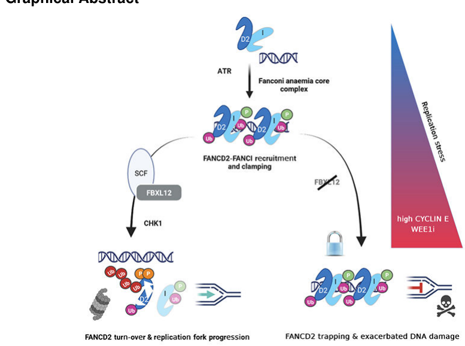

## Question

# Gene Research for Functional Annotation

## ⚠️ CRITICAL: Gene/Protein Identification Context

**BEFORE YOU BEGIN RESEARCH:** You MUST verify you are researching the CORRECT gene/protein. Gene symbols can be ambiguous, especially for less well-characterized genes from non-model organisms.

### Target Gene/Protein Identity (from UniProt):
- **UniProt Accession:** Q9NXK8
- **Protein Description:** RecName: Full=F-box/LRR-repeat protein 12; AltName: Full=F-box and leucine-rich repeat protein 12; AltName: Full=F-box protein FBL12;
- **Gene Information:** Name=FBXL12; Synonyms=FBL12;
- **Organism (full):** Homo sapiens (Human).
- **Protein Family:** Not specified in UniProt
- **Key Domains:** F-box-like_dom_sf. (IPR036047); F-box_dom. (IPR001810); LRR_dom_sf. (IPR032675); F-box-like (PF12937)

### MANDATORY VERIFICATION STEPS:

1. **Check if the gene symbol "FBXL12" matches the protein description above**
2. **Verify the organism is correct:** Homo sapiens (Human).
3. **Check if protein family/domains align with what you find in literature**
4. **If you find literature for a DIFFERENT gene with the same or similar symbol, STOP**

### If Gene Symbol is Ambiguous or You Cannot Find Relevant Literature:

**DO NOT PROCEED WITH RESEARCH ON A DIFFERENT GENE.** Instead:
- State clearly: "The gene symbol 'FBXL12' is ambiguous or literature is limited for this specific protein"
- Explain what you found (e.g., "Found extensive literature on a different gene with the same symbol in a different organism")
- Describe the protein based ONLY on the UniProt information provided above
- Suggest that the protein function can be inferred from domain/family information

### Research Target:

Please provide a comprehensive research report on the gene **FBXL12** (gene ID: FBXL12, UniProt: Q9NXK8) in human.

The research report should be a detailed narrative explaining the function, biological processes, and localization of the gene product. Citations should be given for all claims.

You should prioritize authoritative reviews and primary scientific literature when conducting research. You can supplement
this with annotations you find in gene/protein databases, but these can be outdated or inaccurate.

We are specifically interested in the primary function of the gene - for enzymes, what reaction is catalyzed, and what is the substrate specificity? For transporters, what is the substrate? For structural proteins or adapters, what is the broader structural role? For signaling molecules, what is the role in the pathway.

We are interested in where in or outside the cell the gene product carries out its function.

We are also interested in the signaling or biochemical pathways in which the gene functions. We are less interested in broad pleiotropic effects, except where these elucidate the precise role.

Include evidence where possible. We are interested in both experimental evidence as well as inference from structure, evolution, or bioinformatic analysis. Precise studies should be prioritized over high-throughput, where available.

## Output

Question: You are an expert researcher providing comprehensive, well-cited information.

Provide detailed information focusing on:
1. Key concepts and definitions with current understanding
2. Recent developments and latest research (prioritize 2023-2024 sources)
3. Current applications and real-world implementations
4. Expert opinions and analysis from authoritative sources
5. Relevant statistics and data from recent studies

Format as a comprehensive research report with proper citations. Include URLs and publication dates where available.
Always prioritize recent, authoritative sources and provide specific citations for all major claims.

# Gene Research for Functional Annotation

## ⚠️ CRITICAL: Gene/Protein Identification Context

**BEFORE YOU BEGIN RESEARCH:** You MUST verify you are researching the CORRECT gene/protein. Gene symbols can be ambiguous, especially for less well-characterized genes from non-model organisms.

### Target Gene/Protein Identity (from UniProt):
- **UniProt Accession:** Q9NXK8
- **Protein Description:** RecName: Full=F-box/LRR-repeat protein 12; AltName: Full=F-box and leucine-rich repeat protein 12; AltName: Full=F-box protein FBL12;
- **Gene Information:** Name=FBXL12; Synonyms=FBL12;
- **Organism (full):** Homo sapiens (Human).
- **Protein Family:** Not specified in UniProt
- **Key Domains:** F-box-like_dom_sf. (IPR036047); F-box_dom. (IPR001810); LRR_dom_sf. (IPR032675); F-box-like (PF12937)

### MANDATORY VERIFICATION STEPS:

1. **Check if the gene symbol "FBXL12" matches the protein description above**
2. **Verify the organism is correct:** Homo sapiens (Human).
3. **Check if protein family/domains align with what you find in literature**
4. **If you find literature for a DIFFERENT gene with the same or similar symbol, STOP**

### If Gene Symbol is Ambiguous or You Cannot Find Relevant Literature:

**DO NOT PROCEED WITH RESEARCH ON A DIFFERENT GENE.** Instead:
- State clearly: "The gene symbol 'FBXL12' is ambiguous or literature is limited for this specific protein"
- Explain what you found (e.g., "Found extensive literature on a different gene with the same symbol in a different organism")
- Describe the protein based ONLY on the UniProt information provided above
- Suggest that the protein function can be inferred from domain/family information

### Research Target:

Please provide a comprehensive research report on the gene **FBXL12** (gene ID: FBXL12, UniProt: Q9NXK8) in human.

The research report should be a detailed narrative explaining the function, biological processes, and localization of the gene product. Citations should be given for all claims.

You should prioritize authoritative reviews and primary scientific literature when conducting research. You can supplement
this with annotations you find in gene/protein databases, but these can be outdated or inaccurate.

We are specifically interested in the primary function of the gene - for enzymes, what reaction is catalyzed, and what is the substrate specificity? For transporters, what is the substrate? For structural proteins or adapters, what is the broader structural role? For signaling molecules, what is the role in the pathway.

We are interested in where in or outside the cell the gene product carries out its function.

We are also interested in the signaling or biochemical pathways in which the gene functions. We are less interested in broad pleiotropic effects, except where these elucidate the precise role.

Include evidence where possible. We are interested in both experimental evidence as well as inference from structure, evolution, or bioinformatic analysis. Precise studies should be prioritized over high-throughput, where available.

# Research report: Functional annotation of human **FBXL12** (UniProt **Q9NXK8**; *Homo sapiens*)

## 0. Gene/protein identity verification (mandatory)
The literature retrieved in this analysis consistently refers to **FBXL12** (also written **Fbl12/Fbxl12**) as an **F-box and leucine-rich repeat (LRR) protein** that functions as a substrate-recognition subunit within **SCF (SKP1–CUL1–RBX1–F-box)** ubiquitin E3 ligase complexes, matching the UniProt description provided (Q9NXK8; “F-box/LRR-repeat protein 12”). This identity is supported by multiple independent mechanistic studies that explicitly assign FBXL12 to SCF complexes and demonstrate substrate recognition and ubiquitin-dependent turnover of specific proteins (FANCD2, CaMKI, ALDH3A1/2, CDKN1B/p27), with pathway roles in replication stress, cell-cycle control, development, and immune differentiation (brunner2023fbxl12degradesfancd2 pages 5-6, mallampalli2013fbxl12triggersg1 pages 5-6, nishiyama2015fbxl12‐mediateddegradationof pages 5-6, zhao2019notchandthe pages 6-7).

## 1. Key concepts and definitions (current understanding)
### 1.1 SCF ubiquitin ligases and F-box proteins
SCF complexes are cullin-RING ubiquitin ligases (CRLs) in which the **F-box protein** is the **substrate receptor**: it binds **SKP1** via the F-box motif and binds substrate proteins via additional interaction domains (here, LRRs), thereby enabling RBX1-associated E2 enzymes to build ubiquitin chains on the substrate for downstream signaling—often proteasomal degradation. In the context of FBXL12, multiple studies directly demonstrate F-box dependence for SCF assembly and substrate ubiquitination (e.g., FBXL12 ΔF mutants fail to ubiquitinate substrates) (zhao2019notchandthe pages 3-4, nishiyama2015fbxl12‐mediateddegradationof pages 5-6, postow2013anscfcomplex pages 1-3).

### 1.2 Functional definition for FBXL12
Across contexts, the best-supported primary molecular function for human FBXL12 is:
- **SCF substrate-recognition subunit** that drives **ubiquitin-dependent remodeling of protein abundance** (often proteasomal degradation) for specific substrates in distinct biological programs: replication stress recovery (FANCD2), cell-cycle gating (CaMKI; CDKN1B/p27), and differentiation programs (ALDH3A1/2). (brunner2023fbxl12degradesfancd2 pages 5-6, mallampalli2013fbxl12triggersg1 pages 3-4, nishiyama2015fbxl12‐mediateddegradationof pages 5-6, zhao2019notchandthe pages 6-7)

## 2. Evidence-based biological functions, pathways, and localization

| Process/Pathway | Proposed FBXL12 molecular role | Direct substrate(s) and ubiquitin linkage if known | Key experimental evidence (assays/models) | Subcellular context | Publication (year, journal) and URL/DOI |
|---|---|---|---|---|---|
| Replication stress recovery / Fanconi anemia signaling / cancer cell survival | SCF^FBXL12 substrate receptor that recognizes chromatin-associated, CHK1-phosphorylated FANCD2 and promotes its proteasomal turnover to enable fork recovery | FANCD2; polyubiquitylation reported, linkage not specified in the extracted text; interaction with FANCI also detected | siRNA imaging screen; DNA fiber assays; neutral comet assays; co-IP; chromatin fractionation; CUL1 IP-MS; FBXL12 KO/rescue; MG132 rescue; FANCD2 phosphodegron analysis; viability assays in breast cancer cells | Primarily chromatin / replication forks; nuclear foci; chromatin-associated FANCD2 degradation | Brunner et al., 2023, *Molecular Cell* — https://doi.org/10.1016/j.molcel.2023.07.026 (brunner2023fbxl12degradesfancd2 pages 5-6, brunner2023fbxl12degradesfancd2 pages 1-3, brunner2023fbxl12degradesfancd2 pages 3-5) |
| DNA double-strand break response / NHEJ factor removal | SCF-Fbxl12 adaptor recruiting Cul1-Skp1 complex to DSB-bound Ku for damage-induced ubiquitylation and removal from DNA | Ku80; heavily K48-linked polyubiquitylation reported in Xenopus extract system | Xenopus egg extract DNA-bead assays modeling DSBs; immunodepletion of Fbxl12/Cul1; dominant-negative Cul1; chromatin binding and release assays; F-box mutant analysis | DSB-associated chromatin; recruited in a Ku-dependent manner to DNA ends | Postow & Funabiki, 2013, *Cell Cycle* — https://doi.org/10.4161/cc.23408 (Xenopus mechanism; conservation to human FBXL12 inferred) (postow2013anscfcomplex pages 3-4, postow2013anscfcomplex pages 1-3, postow2013anscfcomplex pages 7-9) |
| G1 cell-cycle control / lung epithelial signaling | SCF^FBXL12 substrate receptor promoting ubiquitin-proteasome degradation of CaMKI, thereby reducing p27 phosphorylation, disrupting cyclin D1/CDK4 assembly, and inducing G1 arrest | CaMKI; polyubiquitylation shown; K59 identified as a critical acceptor site on CaMKI; linkage not specified | Co-IP and pull-down; CHX chase; MG132 sensitivity; in vivo and in vitro ubiquitylation with purified SCF components; CaMKI lysine mutants (K59R/K110R); BrdU/flow cytometry; immunostaining | FBXL12 and CaMKI co-localize mainly in cytoplasm; downstream effect includes nuclear retention/mislocalization of p27 | Mallampalli et al., 2013, *Cellular Signalling* — https://doi.org/10.1016/j.cellsig.2013.05.012 (mallampalli2013fbxl12triggersg1 pages 9-10, mallampalli2013fbxl12triggersg1 pages 4-5, mallampalli2013fbxl12triggersg1 pages 5-6, mallampalli2013fbxl12triggersg1 pages 3-4, mallampalli2013fbxl12triggersg1 pages 6-7, mallampalli2013fbxl12triggersg1 pages 1-2) |
| Trophoblast differentiation / placental development | SCF^FBXL12 substrate receptor driving ubiquitin-dependent degradation of ALDH3 to permit trophoblast stem-cell differentiation | ALDH3A1 and ALDH3A2; direct ubiquitylation shown in vitro and in cells; linkage not specified | Differential proteomics (DiPIUS/LC-MS/MS); reciprocal co-IP; in vivo and in vitro ubiquitylation; shRNA depletion; CHX chase; ALDEFLUOR activity assay; Fbxl12 knockout mice; TSC differentiation and gossypol rescue | Placental junctional zone; trophoblast stem/differentiating cells | Nishiyama et al., 2015, *STEM CELLS* — https://doi.org/10.1002/stem.2088 (nishiyama2015fbxl12‐mediateddegradationof pages 9-10, nishiyama2015fbxl12‐mediateddegradationof pages 2-3, nishiyama2015fbxl12‐mediateddegradationof pages 1-2, nishiyama2015fbxl12‐mediateddegradationof pages 5-6, nishiyama2015fbxl12‐mediateddegradationof pages 3-5) |
| Thymocyte β-selection proliferation / pre-TCR and Notch signaling | SCF-Fbxl12 substrate receptor acting with SCF-Fbxl1 to degrade Cdkn1b/p27 downstream of pre-TCR and Notch-driven transcriptional induction | CDKN1B/p27; K48-linked polyubiquitylation; major ubiquitination site K165 | Conditional mouse knockout (Lck-Cre Fbxl12^fl/fl); anti-CD3 induction; OP9-DL1/DL4 cultures; HEK293T overexpression/ubiquitylation assays; MG132; genetic rescue by Cdkn1b deletion; cell-cycle profiling | DN/DP thymocytes; nuclear/cellular p27 turnover context in developing thymocytes | Zhao et al., 2019, *Nature Immunology* — https://doi.org/10.1038/s41590-019-0469-z (zhao2019notchandthe pages 4-5, zhao2019notchandthe pages 10-11, zhao2019notchandthe pages 6-7, zhao2019notchandthe pages 3-4, zhao2019notchandthe pages 1-2, zhao2019notchandthe pages 5-6, zhao2019notchandthe pages 2-3) |
| Targeted protein degradation (TPD) platform potential | Candidate broad-acting proximity-dependent degrader when forcibly recruited to heterologous substrates; role here is application-oriented rather than endogenous biology | Not a defined endogenous substrate in this review excerpt; tested across 10 model substrates with different localizations | Human ORFeome/proximity-dependent (de)stabilization screens using eGFP-ABI1 reporter, anti-GFP nanobody or PYL1/ABI1 dimerization, eGFP/BFP ratio readout; focused ligase screen | Activity reported across substrates with varied subcellular localizations | Hermanns & Hofmann, 2024, *Signal Transduction and Targeted Therapy* — https://doi.org/10.1038/s41392-024-01884-3 (summarizing screen results that included FBXL12) (hermanns2024proximitydependentprotein(de)stabilization pages 1-2) |
| General family annotation / baseline localization | F-box + leucine-rich repeat SCF substrate-recognition subunit; exact substrate spectrum still incomplete | Reported substrates/interactors across literature: ALDH3, Ku80, CaMKI, p21; linkage varies by substrate and is often unspecified in summaries | Review synthesis of primary studies | Cytoplasm and nucleus listed in review table | Tekcham et al., 2020, *Theranostics* — https://doi.org/10.7150/thno.42735 (tekcham2020fboxproteinsand pages 4-6, tekcham2020fboxproteinsand pages 11-12) |

*Table: This table summarizes the strongest published functional annotation evidence for human FBXL12, organized by pathway, substrate, mechanism, localization, and study. It is useful for quickly distinguishing well-supported endogenous roles from broader translational or screening-based observations.*

### 2.1 Replication stress tolerance via turnover of FANCD2 (2023–present)
A recent and mechanistically detailed study demonstrated that human **SCF^FBXL12** promotes **proteasomal degradation of FANCD2** to support **replication recovery** and survival under high replication stress (brunner2023fbxl12degradesfancd2 pages 1-3, brunner2023fbxl12degradesfancd2 pages 5-6). FBXL12 was identified as required for replication recovery (siRNA imaging screen) and then linked to a mechanism in which FBXL12 physically associates with SCF core components and Fanconi anemia proteins (FANCD2/FANCI), with interaction and regulation enriched in chromatin fractions (brunner2023fbxl12degradesfancd2 pages 5-6).

Mechanistic model: FANCD2 becomes a substrate of SCF^FBXL12 following **CHK1-dependent phosphorylation**, creating a phosphodegron that triggers FBXL12-dependent turnover, thereby helping clear “chromatin-trapped” FANCD2 at stalled forks and enabling replication restart (brunner2023fbxl12degradesfancd2 pages 1-3, brunner2023fbxl12degradesfancd2 pages 3-5). Functional phenotypes upon FBXL12 loss included replication-fork defects and increased DNA damage signaling (e.g., increased pan-γH2AX staining and CHK1 phosphorylation in some contexts), with strong viability dependencies in replication-stressed cancer models (brunner2023fbxl12degradesfancd2 pages 3-5, brunner2023fbxl12degradesfancd2 pages 5-6).

Visual evidence from this study shows the authors’ graphical model and quantitative DNA-fiber/viability/correlation analyses supporting the SCF^FBXL12–FANCD2 replication-stress axis (brunner2023fbxl12degradesfancd2 media dd0726f7, brunner2023fbxl12degradesfancd2 media 52998111).

### 2.2 DNA double-strand break response: Ku80 ubiquitylation/removal (mechanistic evidence; conservation inferred)
FBXL12 has also been implicated in DNA damage responses through targeting of **Ku80**, a key DNA end-binding factor in NHEJ. In a Xenopus egg extract system screening F-box proteins, an **SCF complex containing Fbxl12** was required for **DNA damage-induced Ku80 ubiquitylation**, removal from DNA ends, and subsequent degradation (postow2013anscfcomplex pages 3-4, postow2013anscfcomplex pages 1-3). Ku80 was reported to undergo heavy **K48-linked polyubiquitylation** in this DSB context, consistent with proteasome-directed turnover (postow2013anscfcomplex pages 1-3).

Quantitative/biophysical context included in the study: Ku’s DNA-binding affinity was cited as **Kd ~2 nM**, and Ku concentration in human cells was estimated at **~300 nM**, emphasizing the need for active mechanisms to remove Ku from DNA ends after repair initiation (postow2013anscfcomplex pages 1-3).

### 2.3 Cell-cycle control via CaMKI degradation and disruption of cyclin D1/CDK4 assembly (2013)
In lung epithelial cell models, FBXL12 (Fbxl12) was shown to mediate **ubiquitin–proteasome degradation of CaMKI**, causing **G1 arrest** via a mechanistic cascade involving p27 phosphorylation/localization and cyclin D1/CDK4 complex assembly (mallampalli2013fbxl12triggersg1 pages 1-2, mallampalli2013fbxl12triggersg1 pages 5-6). Direct biochemical evidence includes:
- **In vitro ubiquitination** of CaMKI using purified SCF components (CUL1/SKP1/RBX1 plus Fbxl12), E1, E2, and ubiquitin (mallampalli2013fbxl12triggersg1 pages 3-4).
- Identification of a key acceptor site: CaMKI **K59R** exhibited extended half-life and resistance to Fbxl12-driven degradation, supporting K59 as functionally important for ubiquitination-dependent turnover (mallampalli2013fbxl12triggersg1 pages 4-5).
- Proteasome dependence: MG132 stabilized CaMKI, whereas leupeptin did not (mallampalli2013fbxl12triggersg1 pages 3-4).

Subcellular context: Fbxl12 and CaMKI were reported to **co-localize in the cytoplasm** (mallampalli2013fbxl12triggersg1 pages 3-4). Downstream, p27 became predominantly **nuclear** when Fbxl12 was overexpressed, consistent with loss of CaMKI-driven p27 phosphorylation controlling p27 compartmentalization (mallampalli2013fbxl12triggersg1 pages 5-6).

Quantitative data example: flow cytometry readouts showed markedly lower S-phase percentages in Fbxl12 conditions compared with CaMKI overexpression across time points (S% values reported in the text/figures, e.g., Fbxl12 ~5.9–8.1 vs CaMKI up to ~40.2) consistent with G1 arrest (mallampalli2013fbxl12triggersg1 pages 6-7).

### 2.4 Placental development and trophoblast differentiation via ALDH3A1/2 degradation (2015)
A study in trophoblast stem cell (TSC) models and **Fbxl12 knockout mice** established that SCF^FBXL12 targets **ALDH3A1 and ALDH3A2** for ubiquitin-dependent degradation and that this is **essential for trophoblast differentiation** and proper placental development (nishiyama2015fbxl12‐mediateddegradationof pages 1-2, nishiyama2015fbxl12‐mediateddegradationof pages 5-6). Evidence included:
- **Reciprocal co-IP** showing specific interaction of endogenous FBXL12 with ALDH3A1/2 (nishiyama2015fbxl12‐mediateddegradationof pages 5-6).
- **In vivo and in vitro ubiquitination assays** demonstrating SCF^FBXL12-dependent ubiquitination of ALDH3A1, requiring canonical ubiquitination components (E1 Uba1, E2 UbcH5C, ubiquitin) and the SCF complex (nishiyama2015fbxl12‐mediateddegradationof pages 2-3, nishiyama2015fbxl12‐mediateddegradationof pages 5-6).
- Functional causality: ALDH3A1 overexpression phenocopied FBXL12 deficiency, while ALDH inhibition (gossypol) partially rescued differentiation marker expression (e.g., Tpbpa) (nishiyama2015fbxl12‐mediateddegradationof pages 5-6).

Quantitative developmental outcomes included significant differences in embryo/newborn weights (**p < .01**) and marker gene expression changes (**p < .01**, Student’s t-test) associated with Fbxl12 loss (nishiyama2015fbxl12‐mediateddegradationof pages 9-10, nishiyama2015fbxl12‐mediateddegradationof pages 10-13).

### 2.5 Thymocyte β-selection: pre-TCR/Notch coordination and CDKN1B/p27 ubiquitination (2019)
In thymocyte development, SCF^Fbxl12 was shown to promote β-selection-associated proliferation by targeting the CDK inhibitor **Cdkn1b (p27)** for proteasomal degradation, in coordination with a related SCF complex containing Fbxl1 (zhao2019notchandthe pages 1-2, zhao2019notchandthe pages 6-7). Key mechanistic evidence includes:
- In cell-based ubiquitination assays, SCF-Fbxl12 promoted **K48-linked polyubiquitination** of Cdkn1b, with a key ubiquitination site identified at **K165**; Cdkn1b(K165R) strongly reduced polyubiquitination (zhao2019notchandthe pages 6-7, zhao2019notchandthe pages 3-4).
- F-box dependence: an Fbxl12 ΔF mutant abolished Cdkn1b polyubiquitination (zhao2019notchandthe pages 3-4).
- In vivo genetics: conditional Fbxl12 deletion (Lck-Cre Fbxl12^fl/fl) increased Cdkn1b abundance and reduced cycling populations; importantly, **Cdkn1b deletion rescued** T cell development defects, supporting Cdkn1b as the principal relevant substrate in this developmental context (zhao2019notchandthe pages 4-5, zhao2019notchandthe pages 5-6).

Quantitative examples: reducing Fbxl1/Fbxl12 dosage by ~50% (compound heterozygotes) caused a **~twofold increase** in Cdkn1b and significantly attenuated cycling/proliferation (zhao2019notchandthe pages 10-11). The authors also contextualize β-selection as involving a large proliferative burst (estimated **100–200-fold** expansion) and show that Fbxl12 contributes to enabling this expansion by relieving Cdkn1b-mediated cell-cycle inhibition (zhao2019notchandthe pages 1-2).

## 3. Recent developments (prioritizing 2023–2024)
### 3.1 FBXL12 as a replication-stress dependency and potential therapeutic node (2023)
The 2023 *Molecular Cell* study positions FBXL12 as a component of **replication-stress tolerance**, especially in **Cyclin E-driven** contexts, where FBXL12 loss exacerbates replication-fork defects and compromises survival (brunner2023fbxl12degradesfancd2 pages 3-5, brunner2023fbxl12degradesfancd2 pages 5-6). This provides a specific, mechanistically grounded hypothesis for how FBXL12 may contribute to tumor fitness under oncogene-induced replication stress.

### 3.2 FBXL12 in targeted protein degradation (TPD) screens (2024)
A 2024 review of proximity-dependent (de)stabilization screening highlights FBXL12 among top candidate effectors that can destabilize multiple recruited substrates with different subcellular localizations (assayed via eGFP/BFP ratiometric reporters and recruitment by nanobody or chemical dimerization), consistent with interest in FBXL12 as a potential E3 recruiter in induced-proximity degrader technologies (hermanns2024proximitydependentprotein(de)stabilization pages 1-2).

## 4. Current applications and real-world implementations
### 4.1 Cancer biology: replication stress, DNA damage responses, and drug sensitivity
FBXL12’s role in clearing FANCD2 from chromatin under replication stress suggests that manipulating this axis could modulate cancer vulnerabilities tied to replication stress and fork recovery (brunner2023fbxl12degradesfancd2 pages 1-3, brunner2023fbxl12degradesfancd2 pages 3-5). In this framework, FBXL12 has been linked to drug-response phenotypes in replication-stressed cancer contexts (including sensitization patterns reported with WEE1 inhibition in the primary study) (brunner2023fbxl12degradesfancd2 pages 1-3, brunner2023fbxl12degradesfancd2 pages 5-6).

### 4.2 TPD/induced proximity engineering
The proximity-screen literature suggests FBXL12 can act as a relatively “broad” destabilizer when artificially recruited to targets, which is conceptually relevant to the development of molecular glues or bifunctional degraders that harness specific E3 ligases (hermanns2024proximitydependentprotein(de)stabilization pages 1-2).

### 4.3 Disease associations (genetics/functional genomics)
Open Targets reports disease associations for FBXL12 including osteoarthritis (knee/hip), bronchial disease, neurodegenerative disease, and skeletal system abnormalities, based on curated evidence connected to PubMed records (PMIDs 34031600 and 39024449 listed in the Open Targets evidence view) (OpenTargets Search: -FBXL12). These associations are not, by themselves, mechanistic proof; rather, they indicate where human genetics/functional-genomics signals have implicated FBXL12 and may motivate deeper mechanistic follow-up.

## 5. Expert synthesis and analysis
### 5.1 A unifying functional model
Across diverse tissues and pathways, the most coherent model is that **FBXL12 acts as a modular substrate receptor**, and its **biological “function” is best defined by its substrates in each context**:
- In replication stress: FBXL12 limits persistence of chromatin-associated FANCD2 to facilitate fork recovery (brunner2023fbxl12degradesfancd2 pages 1-3).
- In G1 control: FBXL12 restricts CaMKI abundance, impacting p27 phosphorylation/localization and cyclin D/CDK4 complexing (mallampalli2013fbxl12triggersg1 pages 5-6, mallampalli2013fbxl12triggersg1 pages 3-4).
- In developmental differentiation: FBXL12 reduces ALDH3A1/2 levels to permit trophoblast differentiation and placental morphogenesis (nishiyama2015fbxl12‐mediateddegradationof pages 5-6, nishiyama2015fbxl12‐mediateddegradationof pages 9-10).
- In thymocyte development: FBXL12 directly ubiquitinates p27 (Cdkn1b) with K48 chains to enable proliferative expansion at β-selection (zhao2019notchandthe pages 6-7, zhao2019notchandthe pages 1-2).

### 5.2 Localization: primarily intracellular, with nucleus–cytoplasm partitioning depending on substrate biology
Experimental localization evidence is substrate/context dependent. FBXL12 and CaMKI co-localize in the **cytoplasm** (mallampalli2013fbxl12triggersg1 pages 3-4), whereas FANCD2 regulation is described as occurring in **chromatin/replication-fork proximity** with nuclear foci (brunner2023fbxl12degradesfancd2 pages 5-6). Reviews also summarize FBXL12 as present in **cytoplasm and nucleus**, consistent with multiple compartments and roles (tekcham2020fboxproteinsand pages 11-12).

## 6. Key statistics and data highlights (from recent and authoritative studies)
- **Replication stress (2023)**: FBXL12 depletion increases stalled forks and new origin firing (DNA fiber assays) and compromises cancer cell viability under replication stress; visualized quantitative panels and correlation analyses are provided in the primary study figures (brunner2023fbxl12degradesfancd2 media 52998111, brunner2023fbxl12degradesfancd2 media b9665031).
- **NHEJ context**: Ku DNA-binding affinity **Kd ~2 nM**; Ku cellular concentration **~300 nM** (background quantitative context supporting need for active Ku removal) (postow2013anscfcomplex pages 1-3).
- **Thymocyte β-selection**: ~50% reduction in Fbxl1/Fbxl12 dosage leads to **~2-fold increase** in Cdkn1b and reduced cycling; β-selection proliferative burst estimated **100–200-fold** expansion (zhao2019notchandthe pages 10-11, zhao2019notchandthe pages 1-2).
- **Placental development**: Fbxl12 deficiency associated with statistically significant developmental phenotypes including embryo/newborn weight differences (**p < .01**) and trophoblast marker expression differences (**p < .01**) (nishiyama2015fbxl12‐mediateddegradationof pages 9-10, nishiyama2015fbxl12‐mediateddegradationof pages 10-13).

## 7. Reference URLs (most central sources)
- Brunner et al. *Molecular Cell* (published Oct 2023): https://doi.org/10.1016/j.molcel.2023.07.026 (brunner2023fbxl12degradesfancd2 pages 1-3)
- Hermanns & Hofmann *Signal Transduction and Targeted Therapy* (published Jul 2024): https://doi.org/10.1038/s41392-024-01884-3 (hermanns2024proximitydependentprotein(de)stabilization pages 1-2)
- Zhao et al. *Nature Immunology* (published Aug 2019): https://doi.org/10.1038/s41590-019-0469-z (zhao2019notchandthe pages 1-2)
- Nishiyama et al. *STEM CELLS* (published Nov 2015): https://doi.org/10.1002/stem.2088 (nishiyama2015fbxl12‐mediateddegradationof pages 1-2)
- Mallampalli et al. *Cellular Signalling* (published Oct 2013): https://doi.org/10.1016/j.cellsig.2013.05.012 (mallampalli2013fbxl12triggersg1 pages 1-2)
- Postow & Funabiki *Cell Cycle* (published Feb 2013): https://doi.org/10.4161/cc.23408 (postow2013anscfcomplex pages 1-3)

## 8. Limitations of this synthesis
Some assertions about FBXL12 in DNA DSB repair (Ku80) are supported by strong biochemical evidence in Xenopus extracts with human ortholog inference, but direct confirmation in human cells was not retrieved in the current evidence set (postow2013anscfcomplex pages 1-3). Additionally, disease associations from Open Targets provide hypothesis-generating links rather than validated mechanisms (OpenTargets Search: -FBXL12).

References

1. (brunner2023fbxl12degradesfancd2 pages 5-6): Andrä Brunner, Qiuzhen Li, Samuele Fisicaro, Alexandros Kourtesakis, Johanna Viiliäinen, Henrik J. Johansson, Vijaya Pandey, Adarsh K. Mayank, Janne Lehtiö, James A. Wohlschlegel, Charles Spruck, Juha K. Rantala, Lukas M. Orre, and Olle Sangfelt. Fbxl12 degrades fancd2 to regulate replication recovery and promote cancer cell survival under conditions of replication stress. Oct 2023. URL: https://doi.org/10.1016/j.molcel.2023.07.026, doi:10.1016/j.molcel.2023.07.026. This article has 18 citations and is from a highest quality peer-reviewed journal.

2. (mallampalli2013fbxl12triggersg1 pages 5-6): Rama K. Mallampalli, Leah Kaercher, Courtney Snavely, Roopa Pulijala, Bill B. Chen, Tiffany Coon, Jing Zhao, and Marianna Agassandian. Fbxl12 triggers g1 arrest by mediating degradation of calmodulin kinase i. Cellular signalling, 25 10:2047-59, Oct 2013. URL: https://doi.org/10.1016/j.cellsig.2013.05.012, doi:10.1016/j.cellsig.2013.05.012. This article has 29 citations and is from a peer-reviewed journal.

3. (nishiyama2015fbxl12‐mediateddegradationof pages 5-6): Masaaki Nishiyama, Akihiro Nita, Kanae Yumimoto, and Keiichi I. Nakayama. Fbxl12‐mediated degradation of aldh3 is essential for trophoblast differentiation during placental development. STEM CELLS, 33:3327-3340, Nov 2015. URL: https://doi.org/10.1002/stem.2088, doi:10.1002/stem.2088. This article has 20 citations and is from a highest quality peer-reviewed journal.

4. (zhao2019notchandthe pages 6-7): Bin Zhao, Kogulan Yoganathan, LiQi Li, Jan Y. Lee, Juan Carlos Zúñiga-Pflücker, and Paul E. Love. Notch and the pre-tcr coordinate thymocyte proliferation by induction of the scf subunits fbxl1 and fbxl12. Aug 2019. URL: https://doi.org/10.1038/s41590-019-0469-z, doi:10.1038/s41590-019-0469-z. This article has 42 citations and is from a highest quality peer-reviewed journal.

5. (zhao2019notchandthe pages 3-4): Bin Zhao, Kogulan Yoganathan, LiQi Li, Jan Y. Lee, Juan Carlos Zúñiga-Pflücker, and Paul E. Love. Notch and the pre-tcr coordinate thymocyte proliferation by induction of the scf subunits fbxl1 and fbxl12. Aug 2019. URL: https://doi.org/10.1038/s41590-019-0469-z, doi:10.1038/s41590-019-0469-z. This article has 42 citations and is from a highest quality peer-reviewed journal.

6. (postow2013anscfcomplex pages 1-3): Lisa Postow and Hironori Funabiki. An scf complex containing fbxl12 mediates dna damage-induced ku80 ubiquitylation. Cell Cycle, 12:587-595, Feb 2013. URL: https://doi.org/10.4161/cc.23408, doi:10.4161/cc.23408. This article has 82 citations and is from a peer-reviewed journal.

7. (mallampalli2013fbxl12triggersg1 pages 3-4): Rama K. Mallampalli, Leah Kaercher, Courtney Snavely, Roopa Pulijala, Bill B. Chen, Tiffany Coon, Jing Zhao, and Marianna Agassandian. Fbxl12 triggers g1 arrest by mediating degradation of calmodulin kinase i. Cellular signalling, 25 10:2047-59, Oct 2013. URL: https://doi.org/10.1016/j.cellsig.2013.05.012, doi:10.1016/j.cellsig.2013.05.012. This article has 29 citations and is from a peer-reviewed journal.

8. (brunner2023fbxl12degradesfancd2 pages 1-3): Andrä Brunner, Qiuzhen Li, Samuele Fisicaro, Alexandros Kourtesakis, Johanna Viiliäinen, Henrik J. Johansson, Vijaya Pandey, Adarsh K. Mayank, Janne Lehtiö, James A. Wohlschlegel, Charles Spruck, Juha K. Rantala, Lukas M. Orre, and Olle Sangfelt. Fbxl12 degrades fancd2 to regulate replication recovery and promote cancer cell survival under conditions of replication stress. Oct 2023. URL: https://doi.org/10.1016/j.molcel.2023.07.026, doi:10.1016/j.molcel.2023.07.026. This article has 18 citations and is from a highest quality peer-reviewed journal.

9. (brunner2023fbxl12degradesfancd2 pages 3-5): Andrä Brunner, Qiuzhen Li, Samuele Fisicaro, Alexandros Kourtesakis, Johanna Viiliäinen, Henrik J. Johansson, Vijaya Pandey, Adarsh K. Mayank, Janne Lehtiö, James A. Wohlschlegel, Charles Spruck, Juha K. Rantala, Lukas M. Orre, and Olle Sangfelt. Fbxl12 degrades fancd2 to regulate replication recovery and promote cancer cell survival under conditions of replication stress. Oct 2023. URL: https://doi.org/10.1016/j.molcel.2023.07.026, doi:10.1016/j.molcel.2023.07.026. This article has 18 citations and is from a highest quality peer-reviewed journal.

10. (postow2013anscfcomplex pages 3-4): Lisa Postow and Hironori Funabiki. An scf complex containing fbxl12 mediates dna damage-induced ku80 ubiquitylation. Cell Cycle, 12:587-595, Feb 2013. URL: https://doi.org/10.4161/cc.23408, doi:10.4161/cc.23408. This article has 82 citations and is from a peer-reviewed journal.

11. (postow2013anscfcomplex pages 7-9): Lisa Postow and Hironori Funabiki. An scf complex containing fbxl12 mediates dna damage-induced ku80 ubiquitylation. Cell Cycle, 12:587-595, Feb 2013. URL: https://doi.org/10.4161/cc.23408, doi:10.4161/cc.23408. This article has 82 citations and is from a peer-reviewed journal.

12. (mallampalli2013fbxl12triggersg1 pages 9-10): Rama K. Mallampalli, Leah Kaercher, Courtney Snavely, Roopa Pulijala, Bill B. Chen, Tiffany Coon, Jing Zhao, and Marianna Agassandian. Fbxl12 triggers g1 arrest by mediating degradation of calmodulin kinase i. Cellular signalling, 25 10:2047-59, Oct 2013. URL: https://doi.org/10.1016/j.cellsig.2013.05.012, doi:10.1016/j.cellsig.2013.05.012. This article has 29 citations and is from a peer-reviewed journal.

13. (mallampalli2013fbxl12triggersg1 pages 4-5): Rama K. Mallampalli, Leah Kaercher, Courtney Snavely, Roopa Pulijala, Bill B. Chen, Tiffany Coon, Jing Zhao, and Marianna Agassandian. Fbxl12 triggers g1 arrest by mediating degradation of calmodulin kinase i. Cellular signalling, 25 10:2047-59, Oct 2013. URL: https://doi.org/10.1016/j.cellsig.2013.05.012, doi:10.1016/j.cellsig.2013.05.012. This article has 29 citations and is from a peer-reviewed journal.

14. (mallampalli2013fbxl12triggersg1 pages 6-7): Rama K. Mallampalli, Leah Kaercher, Courtney Snavely, Roopa Pulijala, Bill B. Chen, Tiffany Coon, Jing Zhao, and Marianna Agassandian. Fbxl12 triggers g1 arrest by mediating degradation of calmodulin kinase i. Cellular signalling, 25 10:2047-59, Oct 2013. URL: https://doi.org/10.1016/j.cellsig.2013.05.012, doi:10.1016/j.cellsig.2013.05.012. This article has 29 citations and is from a peer-reviewed journal.

15. (mallampalli2013fbxl12triggersg1 pages 1-2): Rama K. Mallampalli, Leah Kaercher, Courtney Snavely, Roopa Pulijala, Bill B. Chen, Tiffany Coon, Jing Zhao, and Marianna Agassandian. Fbxl12 triggers g1 arrest by mediating degradation of calmodulin kinase i. Cellular signalling, 25 10:2047-59, Oct 2013. URL: https://doi.org/10.1016/j.cellsig.2013.05.012, doi:10.1016/j.cellsig.2013.05.012. This article has 29 citations and is from a peer-reviewed journal.

16. (nishiyama2015fbxl12‐mediateddegradationof pages 9-10): Masaaki Nishiyama, Akihiro Nita, Kanae Yumimoto, and Keiichi I. Nakayama. Fbxl12‐mediated degradation of aldh3 is essential for trophoblast differentiation during placental development. STEM CELLS, 33:3327-3340, Nov 2015. URL: https://doi.org/10.1002/stem.2088, doi:10.1002/stem.2088. This article has 20 citations and is from a highest quality peer-reviewed journal.

17. (nishiyama2015fbxl12‐mediateddegradationof pages 2-3): Masaaki Nishiyama, Akihiro Nita, Kanae Yumimoto, and Keiichi I. Nakayama. Fbxl12‐mediated degradation of aldh3 is essential for trophoblast differentiation during placental development. STEM CELLS, 33:3327-3340, Nov 2015. URL: https://doi.org/10.1002/stem.2088, doi:10.1002/stem.2088. This article has 20 citations and is from a highest quality peer-reviewed journal.

18. (nishiyama2015fbxl12‐mediateddegradationof pages 1-2): Masaaki Nishiyama, Akihiro Nita, Kanae Yumimoto, and Keiichi I. Nakayama. Fbxl12‐mediated degradation of aldh3 is essential for trophoblast differentiation during placental development. STEM CELLS, 33:3327-3340, Nov 2015. URL: https://doi.org/10.1002/stem.2088, doi:10.1002/stem.2088. This article has 20 citations and is from a highest quality peer-reviewed journal.

19. (nishiyama2015fbxl12‐mediateddegradationof pages 3-5): Masaaki Nishiyama, Akihiro Nita, Kanae Yumimoto, and Keiichi I. Nakayama. Fbxl12‐mediated degradation of aldh3 is essential for trophoblast differentiation during placental development. STEM CELLS, 33:3327-3340, Nov 2015. URL: https://doi.org/10.1002/stem.2088, doi:10.1002/stem.2088. This article has 20 citations and is from a highest quality peer-reviewed journal.

20. (zhao2019notchandthe pages 4-5): Bin Zhao, Kogulan Yoganathan, LiQi Li, Jan Y. Lee, Juan Carlos Zúñiga-Pflücker, and Paul E. Love. Notch and the pre-tcr coordinate thymocyte proliferation by induction of the scf subunits fbxl1 and fbxl12. Aug 2019. URL: https://doi.org/10.1038/s41590-019-0469-z, doi:10.1038/s41590-019-0469-z. This article has 42 citations and is from a highest quality peer-reviewed journal.

21. (zhao2019notchandthe pages 10-11): Bin Zhao, Kogulan Yoganathan, LiQi Li, Jan Y. Lee, Juan Carlos Zúñiga-Pflücker, and Paul E. Love. Notch and the pre-tcr coordinate thymocyte proliferation by induction of the scf subunits fbxl1 and fbxl12. Aug 2019. URL: https://doi.org/10.1038/s41590-019-0469-z, doi:10.1038/s41590-019-0469-z. This article has 42 citations and is from a highest quality peer-reviewed journal.

22. (zhao2019notchandthe pages 1-2): Bin Zhao, Kogulan Yoganathan, LiQi Li, Jan Y. Lee, Juan Carlos Zúñiga-Pflücker, and Paul E. Love. Notch and the pre-tcr coordinate thymocyte proliferation by induction of the scf subunits fbxl1 and fbxl12. Aug 2019. URL: https://doi.org/10.1038/s41590-019-0469-z, doi:10.1038/s41590-019-0469-z. This article has 42 citations and is from a highest quality peer-reviewed journal.

23. (zhao2019notchandthe pages 5-6): Bin Zhao, Kogulan Yoganathan, LiQi Li, Jan Y. Lee, Juan Carlos Zúñiga-Pflücker, and Paul E. Love. Notch and the pre-tcr coordinate thymocyte proliferation by induction of the scf subunits fbxl1 and fbxl12. Aug 2019. URL: https://doi.org/10.1038/s41590-019-0469-z, doi:10.1038/s41590-019-0469-z. This article has 42 citations and is from a highest quality peer-reviewed journal.

24. (zhao2019notchandthe pages 2-3): Bin Zhao, Kogulan Yoganathan, LiQi Li, Jan Y. Lee, Juan Carlos Zúñiga-Pflücker, and Paul E. Love. Notch and the pre-tcr coordinate thymocyte proliferation by induction of the scf subunits fbxl1 and fbxl12. Aug 2019. URL: https://doi.org/10.1038/s41590-019-0469-z, doi:10.1038/s41590-019-0469-z. This article has 42 citations and is from a highest quality peer-reviewed journal.

25. (hermanns2024proximitydependentprotein(de)stabilization pages 1-2): Thomas Hermanns and Kay Hofmann. Proximity-dependent protein (de)stabilization: screening the human orfeome for protein degraders and stabilizers. Signal Transduction and Targeted Therapy, Jul 2024. URL: https://doi.org/10.1038/s41392-024-01884-3, doi:10.1038/s41392-024-01884-3. This article has 0 citations and is from a peer-reviewed journal.

26. (tekcham2020fboxproteinsand pages 4-6): Dinesh Singh Tekcham, Di Chen, Yu Liu, Ting Ling, Yi Zhang, Huan Chen, Wen Wang, Wuxiyar Otkur, Huan Qi, Tian Xia, Xiaolong Liu, Hai-long Piao, and Hongxu Liu. F-box proteins and cancer: an update from functional and regulatory mechanism to therapeutic clinical prospects. Theranostics, 10:4150-4167, Mar 2020. URL: https://doi.org/10.7150/thno.42735, doi:10.7150/thno.42735. This article has 111 citations and is from a domain leading peer-reviewed journal.

27. (tekcham2020fboxproteinsand pages 11-12): Dinesh Singh Tekcham, Di Chen, Yu Liu, Ting Ling, Yi Zhang, Huan Chen, Wen Wang, Wuxiyar Otkur, Huan Qi, Tian Xia, Xiaolong Liu, Hai-long Piao, and Hongxu Liu. F-box proteins and cancer: an update from functional and regulatory mechanism to therapeutic clinical prospects. Theranostics, 10:4150-4167, Mar 2020. URL: https://doi.org/10.7150/thno.42735, doi:10.7150/thno.42735. This article has 111 citations and is from a domain leading peer-reviewed journal.

28. (brunner2023fbxl12degradesfancd2 media dd0726f7): Andrä Brunner, Qiuzhen Li, Samuele Fisicaro, Alexandros Kourtesakis, Johanna Viiliäinen, Henrik J. Johansson, Vijaya Pandey, Adarsh K. Mayank, Janne Lehtiö, James A. Wohlschlegel, Charles Spruck, Juha K. Rantala, Lukas M. Orre, and Olle Sangfelt. Fbxl12 degrades fancd2 to regulate replication recovery and promote cancer cell survival under conditions of replication stress. Oct 2023. URL: https://doi.org/10.1016/j.molcel.2023.07.026, doi:10.1016/j.molcel.2023.07.026. This article has 18 citations and is from a highest quality peer-reviewed journal.

29. (brunner2023fbxl12degradesfancd2 media 52998111): Andrä Brunner, Qiuzhen Li, Samuele Fisicaro, Alexandros Kourtesakis, Johanna Viiliäinen, Henrik J. Johansson, Vijaya Pandey, Adarsh K. Mayank, Janne Lehtiö, James A. Wohlschlegel, Charles Spruck, Juha K. Rantala, Lukas M. Orre, and Olle Sangfelt. Fbxl12 degrades fancd2 to regulate replication recovery and promote cancer cell survival under conditions of replication stress. Oct 2023. URL: https://doi.org/10.1016/j.molcel.2023.07.026, doi:10.1016/j.molcel.2023.07.026. This article has 18 citations and is from a highest quality peer-reviewed journal.

30. (nishiyama2015fbxl12‐mediateddegradationof pages 10-13): Masaaki Nishiyama, Akihiro Nita, Kanae Yumimoto, and Keiichi I. Nakayama. Fbxl12‐mediated degradation of aldh3 is essential for trophoblast differentiation during placental development. STEM CELLS, 33:3327-3340, Nov 2015. URL: https://doi.org/10.1002/stem.2088, doi:10.1002/stem.2088. This article has 20 citations and is from a highest quality peer-reviewed journal.

31. (OpenTargets Search: -FBXL12): Open Targets Query (-FBXL12, 5 results). Buniello, A. et al. (2025). Open Targets Platform: facilitating therapeutic hypotheses building in drug discovery. Nucleic Acids Research.

32. (brunner2023fbxl12degradesfancd2 media b9665031): Andrä Brunner, Qiuzhen Li, Samuele Fisicaro, Alexandros Kourtesakis, Johanna Viiliäinen, Henrik J. Johansson, Vijaya Pandey, Adarsh K. Mayank, Janne Lehtiö, James A. Wohlschlegel, Charles Spruck, Juha K. Rantala, Lukas M. Orre, and Olle Sangfelt. Fbxl12 degrades fancd2 to regulate replication recovery and promote cancer cell survival under conditions of replication stress. Oct 2023. URL: https://doi.org/10.1016/j.molcel.2023.07.026, doi:10.1016/j.molcel.2023.07.026. This article has 18 citations and is from a highest quality peer-reviewed journal.

## Artifacts

- [Edison artifact artifact-00](FBXL12-deep-research-falcon_artifacts/artifact-00.md)

## Citations

1. postow2013anscfcomplex pages 1-3
2. zhao2019notchandthe pages 3-4
3. zhao2019notchandthe pages 10-11
4. zhao2019notchandthe pages 1-2
5. tekcham2020fboxproteinsand pages 11-12
6. zhao2019notchandthe pages 6-7
7. postow2013anscfcomplex pages 3-4
8. postow2013anscfcomplex pages 7-9
9. zhao2019notchandthe pages 4-5
10. zhao2019notchandthe pages 5-6
11. zhao2019notchandthe pages 2-3
12. tekcham2020fboxproteinsand pages 4-6
13. https://doi.org/10.1016/j.molcel.2023.07.026
14. https://doi.org/10.4161/cc.23408
15. https://doi.org/10.1016/j.cellsig.2013.05.012
16. https://doi.org/10.1002/stem.2088
17. https://doi.org/10.1038/s41590-019-0469-z
18. https://doi.org/10.1038/s41392-024-01884-3
19. https://doi.org/10.7150/thno.42735
20. https://doi.org/10.1016/j.molcel.2023.07.026,
21. https://doi.org/10.1016/j.cellsig.2013.05.012,
22. https://doi.org/10.1002/stem.2088,
23. https://doi.org/10.1038/s41590-019-0469-z,
24. https://doi.org/10.4161/cc.23408,
25. https://doi.org/10.1038/s41392-024-01884-3,
26. https://doi.org/10.7150/thno.42735,