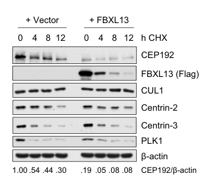

## Question

# Gene Research for Functional Annotation

## ⚠️ CRITICAL: Gene/Protein Identification Context

**BEFORE YOU BEGIN RESEARCH:** You MUST verify you are researching the CORRECT gene/protein. Gene symbols can be ambiguous, especially for less well-characterized genes from non-model organisms.

### Target Gene/Protein Identity (from UniProt):
- **UniProt Accession:** Q8NEE6
- **Protein Description:** RecName: Full=F-box and leucine-rich repeat protein 13 {ECO:0000303|PubMed:29348145}; AltName: Full=Dynein regulatory complex subunit 6; AltName: Full=F-box/LRR-repeat protein 13;
- **Gene Information:** Name=FBXL13; Synonyms=DRC6 {ECO:0000250|UniProtKB:Q8CDU4}, FBL13;
- **Organism (full):** Homo sapiens (Human).
- **Protein Family:** Belongs to the DRC6 family. .
- **Key Domains:** F-box-like_dom_sf. (IPR036047); F-box_dom. (IPR001810); FBXL15_LRR. (IPR057207); Leu-rich_rpt_Cys-con_subtyp. (IPR006553); LRR_dom_sf. (IPR032675)

### MANDATORY VERIFICATION STEPS:

1. **Check if the gene symbol "FBXL13" matches the protein description above**
2. **Verify the organism is correct:** Homo sapiens (Human).
3. **Check if protein family/domains align with what you find in literature**
4. **If you find literature for a DIFFERENT gene with the same or similar symbol, STOP**

### If Gene Symbol is Ambiguous or You Cannot Find Relevant Literature:

**DO NOT PROCEED WITH RESEARCH ON A DIFFERENT GENE.** Instead:
- State clearly: "The gene symbol 'FBXL13' is ambiguous or literature is limited for this specific protein"
- Explain what you found (e.g., "Found extensive literature on a different gene with the same symbol in a different organism")
- Describe the protein based ONLY on the UniProt information provided above
- Suggest that the protein function can be inferred from domain/family information

### Research Target:

Please provide a comprehensive research report on the gene **FBXL13** (gene ID: FBXL13, UniProt: Q8NEE6) in human.

The research report should be a detailed narrative explaining the function, biological processes, and localization of the gene product. Citations should be given for all claims.

You should prioritize authoritative reviews and primary scientific literature when conducting research. You can supplement
this with annotations you find in gene/protein databases, but these can be outdated or inaccurate.

We are specifically interested in the primary function of the gene - for enzymes, what reaction is catalyzed, and what is the substrate specificity? For transporters, what is the substrate? For structural proteins or adapters, what is the broader structural role? For signaling molecules, what is the role in the pathway.

We are interested in where in or outside the cell the gene product carries out its function.

We are also interested in the signaling or biochemical pathways in which the gene functions. We are less interested in broad pleiotropic effects, except where these elucidate the precise role.

Include evidence where possible. We are interested in both experimental evidence as well as inference from structure, evolution, or bioinformatic analysis. Precise studies should be prioritized over high-throughput, where available.

## Output

Question: You are an expert researcher providing comprehensive, well-cited information.

Provide detailed information focusing on:
1. Key concepts and definitions with current understanding
2. Recent developments and latest research (prioritize 2023-2024 sources)
3. Current applications and real-world implementations
4. Expert opinions and analysis from authoritative sources
5. Relevant statistics and data from recent studies

Format as a comprehensive research report with proper citations. Include URLs and publication dates where available.
Always prioritize recent, authoritative sources and provide specific citations for all major claims.

# Gene Research for Functional Annotation

## ⚠️ CRITICAL: Gene/Protein Identification Context

**BEFORE YOU BEGIN RESEARCH:** You MUST verify you are researching the CORRECT gene/protein. Gene symbols can be ambiguous, especially for less well-characterized genes from non-model organisms.

### Target Gene/Protein Identity (from UniProt):
- **UniProt Accession:** Q8NEE6
- **Protein Description:** RecName: Full=F-box and leucine-rich repeat protein 13 {ECO:0000303|PubMed:29348145}; AltName: Full=Dynein regulatory complex subunit 6; AltName: Full=F-box/LRR-repeat protein 13;
- **Gene Information:** Name=FBXL13; Synonyms=DRC6 {ECO:0000250|UniProtKB:Q8CDU4}, FBL13;
- **Organism (full):** Homo sapiens (Human).
- **Protein Family:** Belongs to the DRC6 family. .
- **Key Domains:** F-box-like_dom_sf. (IPR036047); F-box_dom. (IPR001810); FBXL15_LRR. (IPR057207); Leu-rich_rpt_Cys-con_subtyp. (IPR006553); LRR_dom_sf. (IPR032675)

### MANDATORY VERIFICATION STEPS:

1. **Check if the gene symbol "FBXL13" matches the protein description above**
2. **Verify the organism is correct:** Homo sapiens (Human).
3. **Check if protein family/domains align with what you find in literature**
4. **If you find literature for a DIFFERENT gene with the same or similar symbol, STOP**

### If Gene Symbol is Ambiguous or You Cannot Find Relevant Literature:

**DO NOT PROCEED WITH RESEARCH ON A DIFFERENT GENE.** Instead:
- State clearly: "The gene symbol 'FBXL13' is ambiguous or literature is limited for this specific protein"
- Explain what you found (e.g., "Found extensive literature on a different gene with the same symbol in a different organism")
- Describe the protein based ONLY on the UniProt information provided above
- Suggest that the protein function can be inferred from domain/family information

### Research Target:

Please provide a comprehensive research report on the gene **FBXL13** (gene ID: FBXL13, UniProt: Q8NEE6) in human.

The research report should be a detailed narrative explaining the function, biological processes, and localization of the gene product. Citations should be given for all claims.

You should prioritize authoritative reviews and primary scientific literature when conducting research. You can supplement
this with annotations you find in gene/protein databases, but these can be outdated or inaccurate.

We are specifically interested in the primary function of the gene - for enzymes, what reaction is catalyzed, and what is the substrate specificity? For transporters, what is the substrate? For structural proteins or adapters, what is the broader structural role? For signaling molecules, what is the role in the pathway.

We are interested in where in or outside the cell the gene product carries out its function.

We are also interested in the signaling or biochemical pathways in which the gene functions. We are less interested in broad pleiotropic effects, except where these elucidate the precise role.

Include evidence where possible. We are interested in both experimental evidence as well as inference from structure, evolution, or bioinformatic analysis. Precise studies should be prioritized over high-throughput, where available.

## Research report: FBXL13 (UniProt Q8NEE6; gene symbol FBXL13; synonym DRC6) — functional annotation in human

### 1) Identity verification and key concepts/definitions
FBXL13 (UniProt Q8NEE6) encodes **F-box and leucine-rich repeat protein 13**, an F-box protein with LRRs (FBXL family) that has also been referred to as **DRC6** in the literature; the strongest direct mechanistic evidence in human cells concerns its role as a substrate receptor in an SCF-type E3 ubiquitin ligase rather than a defined motile-cilium axonemal role. (fung2018fbxl13directsthe pages 1-2, fung2018fbxl13directsthe pages 6-8)

**F-box proteins / SCF E3 ligases (concept):** F-box proteins are substrate-recognition adaptors for **SCF (SKP1–CUL1–RBX1) E3 ubiquitin ligases**. In the canonical model, the **F-box domain mediates SKP1 binding**, recruiting the rest of the ligase scaffold, while other domains (here, LRRs and additional regions) contribute to substrate recognition and specificity. FBXL13 conforms to this model in human cell experiments because deletion of its F-box disrupts SKP1 binding and SCF-dependent activity. (fung2018fbxl13directsthe pages 9-10, fung2018fbxl13directsthe pages 8-9)

### 2) Current understanding of FBXL13 function in human cells (primary, experimentally supported)
#### 2.1 Subcellular localization
In human U2OS cells, FBXL13 is described as **diffusely cytoplasmic with clear enrichment at centrosomes** based on immunofluorescence with centrosomal markers. (fung2018fbxl13directsthe pages 2-4, fung2018fbxl13directsthe pages 4-5)

#### 2.2 Complex membership and binding partners
Fung et al. (EMBO Reports; published online **18 Jan 2018**; DOI/URL: https://doi.org/10.15252/embr.201744799) identify FBXL13 as a centrosome-enriched F-box protein that:

* **Associates with SCF components** (notably SKP1; CUL1 detected in complex capture experiments), and SKP1 binding requires the **F-box** (loss with ΔF-box mutant). (fung2018fbxl13directsthe pages 9-10, fung2018fbxl13directsthe pages 2-4)
* **Interacts with centrosome/centriole proteins** including **Centrin-2, Centrin-3, CEP152, and CEP192**, supported by co-immunoprecipitation and proteomics. (fung2018fbxl13directsthe pages 9-10, fung2018fbxl13directsthe pages 2-4, fung2018fbxl13directsthe pages 4-5)
* Shows interaction mapping consistent with multi-domain functionality: Centrin binding at the amino-terminus and CEP192 binding requiring a carboxy-terminal region. (fung2018fbxl13directsthe pages 5-6)

The authors also report interactome-scale context (isoform-specific interactors, control compendium), with proteomics deposited to PRIDE (PXD008310). (fung2018fbxl13directsthe pages 2-4, fung2018fbxl13directsthe pages 14-15)

#### 2.3 Primary biochemical function: targeting CEP192 for ubiquitin-mediated proteolysis
The central mechanistic conclusion is that **SCF^FBXL13 polyubiquitylates and promotes proteasomal proteolysis of CEP192**, especially **CEP192 isoform 3**, and this is **F-box/SCF dependent**:

* **In vivo ubiquitylation assays** show CEP192 polyubiquitylation is supported by FBXL13 WT and is impaired when FBXL13 is depleted, and also impaired with an FBXL13 ΔF-box mutant that cannot form a functional SCF complex (cannot recruit SKP1). (fung2018fbxl13directsthe pages 9-10, fung2018fbxl13directsthe pages 8-9)
* **Binding/recognition region:** FBXL13 binds the **N-terminal region** of CEP192 (constructs spanning ~aa 1–602/630 used for mapping), supported by mapping and in vitro reconstitution. (fung2018fbxl13directsthe pages 2-4, fung2018fbxl13directsthe pages 4-5)
* **Proteasome dependence:** CEP192 reduction upon FBXL13 overexpression is rescued by proteasome inhibition (MG132) in the described experiments. (fung2018fbxl13directsthe pages 5-6)

**Quantitative data (protein stability):** In cycloheximide (CHX) chase experiments, the extracted text reports CEP192/β-actin values across lanes/timepoints as: **1.00, 0.54, 0.44, 0.30, 0.19, 0.05, 0.08, 0.08** (normalized to 0 h vector control), consistent with accelerated CEP192 decay with FBXL13. The quantitative panel is visible in the retrieved figure crop. (fung2018fbxl13directsthe pages 6-8, fung2018fbxl13directsthe media e15595bd)

#### 2.4 Cellular phenotypes and pathway-level interpretation
Fung et al. connect FBXL13-mediated CEP192 turnover to centrosome function and migration:

* **Centrosome/microtubule nucleation:** FBXL13 overexpression disrupts centrosomal microtubule arrays and **reduces the ability of cells to regrow centrosomal microtubules** after complete depolymerization in microtubule regrowth assays. (fung2018fbxl13directsthe pages 9-10, fung2018fbxl13directsthe pages 6-8)
* **γ-tubulin recruitment:** FBXL13 depletion increases centrosomal CEP192 and corresponds to a **significant increase in centrosomal γ-tubulin intensity** (quantified in figure panels referenced by the authors and present among retrieved crops). (fung2018fbxl13directsthe pages 8-9, fung2018fbxl13directsthe media e15595bd)
* **Centrosome number control:** FBXL13 depletion produces a **minor yet significant centrosome overduplication phenotype**. (fung2018fbxl13directsthe pages 8-9)
* **Cell migration:** FBXL13 depletion **reduces cell motility** in a scratch-wound assay; the defect is rescued by siRNA-resistant FBXL13 WT but not by ΔF-box, and is also rescued by co-depletion of CEP192-3, supporting a model where excess CEP192 contributes to the migration phenotype. Figure crops corresponding to migration quantification were retrieved. (fung2018fbxl13directsthe pages 8-9, fung2018fbxl13directsthe media e15595bd)

**Expert interpretation in the primary study:** The authors’ model is that FBXL13 **fine-tunes CEP192 levels** to maintain steady-state centrosomal microtubule nucleation activity, which in turn affects migration-related cellular behaviors. (fung2018fbxl13directsthe pages 9-10, fung2018fbxl13directsthe pages 1-2)

### 3) DRC6 / N-DRC context: what is known, and what is not (human vs model organisms)
Because FBXL13 is also referred to as **DRC6**, it appears in motile cilia/flagella literature describing the **nexin–dynein regulatory complex (N-DRC)**. However, **direct human genetic/clinical evidence implicating FBXL13 in primary ciliary dyskinesia (PCD) or male infertility was not identified in the retrieved full texts**, and the strongest functional genetics evidence is from mouse.

#### 3.1 Mouse genetics: Fbxl13 (Drc6) is dispensable for sperm flagellum formation and male fertility
Morohoshi et al. (PLOS Genetics; **Jan 2020**; DOI/URL: https://doi.org/10.1371/journal.pgen.1008585) report:

* TCTE1 (DRC5) was shown (in a cited cultured-cell context) to interact with multiple N-DRC components including **FBXL13 (DRC6)** and DRC7. (morohoshi2020nexindyneinregulatorycomplex pages 2-4)
* **Expression:** Fbxl13 is **strongly expressed in mouse testis** with weaker signals in lung/ovary/uterus, and expression rises around ~3 weeks postnatally when spermiogenesis begins. (morohoshi2020nexindyneinregulatorycomplex pages 2-4)
* **Knockout phenotype:** Fbxl13−/− mice show **no overt abnormalities**, have **normal spermatogenesis and sperm morphology**, and sperm motility/velocity parameters (VAP/VSL/VCL) are reported as not significantly different; tracheal multicilia show preserved axonemal ‘9+2’ arrangement and normal morphology. (morohoshi2020nexindyneinregulatorycomplex pages 4-5)

These data suggest that, at least in mice, Fbxl13/DRC6 is not essential for flagellum formation or male fertility under the studied conditions, potentially due to functional redundancy (the authors discuss potential replacement by related FBXL proteins). (morohoshi2020nexindyneinregulatorycomplex pages 10-12, morohoshi2020nexindyneinregulatorycomplex pages 4-5)

#### 3.2 Statistics (from Morohoshi et al. author summary; infertility context)
Morohoshi et al. state that **~1 in 6 couples face infertility**, **~50%** of cases are attributed to male factors, and **~15%** of male infertility is caused by genetic factors (contextual statistics, not specific to FBXL13). (morohoshi2020nexindyneinregulatorycomplex pages 1-2)

### 4) Recent developments (2023–2024 prioritized): what has changed
#### 4.1 2023 structural modeling of N-DRC (contextual)
A 2023 Nature Communications paper used cryo-EM and integrative modeling to localize multiple DRC subunits in Tetrahymena and describes N-DRC regulatory mechanisms; in the extracted evidence, **FBXL13/DRC6-specific human functional updates were not captured**, so this source serves mainly as a broader N-DRC context rather than direct FBXL13 functional annotation in human cells. (OpenTargets Search: -FBXL13)

#### 4.2 2024 review literature
A 2024 review discusses the roles of F-box proteins in spermatogenesis and male infertility broadly; within the retrieved excerpts, it did not provide FBXL13-specific mechanistic updates that would supersede the 2018 centrosome work. (OpenTargets Search: -FBXL13)

**Overall 2023–2024 conclusion:** As of the accessible evidence here, the **most definitive mechanistic characterization for human FBXL13 remains the 2018 centrosome/CEP192 SCF adaptor study**, with later work contributing mainly contextual N-DRC genetics/structure in model organisms rather than new human FBXL13-specific mechanisms. (fung2018fbxl13directsthe pages 1-2, fung2018fbxl13directsthe pages 8-9, morohoshi2020nexindyneinregulatorycomplex pages 1-2)

### 5) Current applications and real-world implementations (clinical relevance)
FBXL13 is not an established drug target in the retrieved evidence. The most concrete “real-world” relevance supported here is via **genetic association resources** and by inference from pathways (centrosome homeostasis, microtubule nucleation, cell migration) that are commonly perturbed in disease.

#### 5.1 Human disease-association signals (Open Targets)
Open Targets lists FBXL13 (ENSG00000161040) with disease-association evidence for **diabetes mellitus** and **type 2 diabetes mellitus**, with association scores ~0.33 and ~0.31 respectively, and linked PubMed IDs (34594039; 39024449). These represent **association evidence** (e.g., genetics/omics/other evidence classes) and should not be interpreted as proof of causality or mechanism without the underlying studies. (OpenTargets Search: diabetes mellitus,age-related hearing impairment,diverticular disease,corneal dystrophy,type 2 diabetes mellitus-FBXL13)

### 6) Consolidated evidence summary
The table below summarizes the highest-confidence experimental findings and where they come from.

| Claim category | Specific finding | Experimental system/assay | Quantitative/statistical detail (if present) | Citation context ID(s) | Publication (author, year, DOI/URL) |
|---|---|---|---|---|---|
| Identity/domains | FBXL13 is the human gene/protein corresponding to UniProt Q8NEE6; it is an F-box protein with leucine-rich repeats and has also been annotated as DRC6. | Gene/protein annotation and literature synthesis in primary paper and reviews. | Human F-box family context: approximately 69 human F-box proteins; FBXL13 belongs to the FBXL subgroup. | (fung2018fbxl13directsthe pages 1-2, fung2018fbxl13directsthe pages 6-8) | Fung et al., 2018, EMBO Reports, https://doi.org/10.15252/embr.201744799 |
| Complex/biochemistry | FBXL13 forms a functional SCF ubiquitin ligase complex; SKP1 binding depends on the F-box domain, and FBXL13 was detected with SCF components including SKP1/CUL1. | Co-immunoprecipitation; WT versus ΔF-box mutant analysis; affinity purification/proteomics. | Functional loss with ΔF-box mutant indicates requirement for SCF assembly. | (fung2018fbxl13directsthe pages 9-10, fung2018fbxl13directsthe pages 8-9, fung2018fbxl13directsthe pages 2-4) | Fung et al., 2018, EMBO Reports, https://doi.org/10.15252/embr.201744799 |
| Interacting partners | FBXL13 interacts with Centrin-2, Centrin-3, CEP152, and CEP192; Centrin binding maps to the amino-terminal region, whereas CEP192 binding requires the carboxy-terminus. | LC-MS interactome analysis; co-immunoprecipitation; interaction mapping with truncation constructs; in vitro reconstitution. | Proteomics identified 25 unique interactors for FBXL13 isoform 1 and 21 for isoform 3; control compendium comprised 30 datasets and 2,850 agarose-binding proteins. | (fung2018fbxl13directsthe pages 9-10, fung2018fbxl13directsthe pages 5-6, fung2018fbxl13directsthe pages 2-4, fung2018fbxl13directsthe pages 4-5) | Fung et al., 2018, EMBO Reports, https://doi.org/10.15252/embr.201744799 |
| Substrates | CEP192 isoform 3 is the key experimentally supported ubiquitylation substrate of SCF^FBXL13; Centrin-2/3 bind FBXL13 but are not detectably degraded by it. | In vivo ubiquitylation assays; co-expression with HA-ubiquitin; knockdown/rescue; immunoblotting. | CEP192 polyubiquitylation is reduced/abolished by FBXL13 depletion and promoted by FBXL13 WT but not ΔF-box. | (fung2018fbxl13directsthe pages 9-10, fung2018fbxl13directsthe pages 5-6, fung2018fbxl13directsthe pages 8-9) | Fung et al., 2018, EMBO Reports, https://doi.org/10.15252/embr.201744799 |
| Substrate-binding region | FBXL13 directly binds the amino-terminal region of CEP192; the mapped CEP192 interaction region is reported as aa 1–602/630 depending on construct usage. | CEP192 fragment mapping with Myc-tagged constructs; endogenous and ectopic co-IP; in vitro reconstitution. | CEP192 fragments used included aa 1–630 and aa 631–2537; direct interaction supported for aa 1–602/630 region. | (fung2018fbxl13directsthe pages 6-8, fung2018fbxl13directsthe pages 2-4, fung2018fbxl13directsthe pages 4-5) | Fung et al., 2018, EMBO Reports, https://doi.org/10.15252/embr.201744799 |
| Localization | FBXL13 is diffusely cytoplasmic but enriched at centrosomes. | Immunofluorescence microscopy in U2OS cells using centrosomal markers (including γ-tubulin/centrin-3). | Qualitative centrosomal enrichment reported; fluorescence quantified with ImageJ ROIs in later assays. | (fung2018fbxl13directsthe pages 1-2, fung2018fbxl13directsthe pages 2-4, fung2018fbxl13directsthe pages 4-5, fung2018fbxl13directsthe pages 14-15) | Fung et al., 2018, EMBO Reports, https://doi.org/10.15252/embr.201744799 |
| Biological function | FBXL13 fine-tunes CEP192 abundance to maintain centrosome homeostasis and steady-state centrosomal microtubule nucleation activity. | Overexpression and knockdown studies; centrosome immunofluorescence; microtubule regrowth assays. | Overexpression lowers centrosomal CEP192/γ-tubulin and suppresses microtubule regrowth; depletion increases centrosomal CEP192 and γ-tubulin. | (fung2018fbxl13directsthe pages 9-10, fung2018fbxl13directsthe pages 1-2, fung2018fbxl13directsthe pages 6-8, fung2018fbxl13directsthe pages 8-9) | Fung et al., 2018, EMBO Reports, https://doi.org/10.15252/embr.201744799 |
| Protein stability / proteolysis | FBXL13 overexpression accelerates CEP192 proteolysis, while proteasome inhibition (MG132) rescues CEP192 reduction and FBXL13 knockdown stabilizes/increases CEP192. | Cycloheximide chase; MG132 rescue; immunoblotting with ImageJ quantification. | CHX chase (CEP192/β-actin values normalized to 0 h vector control) reported as: 1.00, 0.54, 0.44, 0.30, 0.19, 0.05, 0.08, 0.08 across vector/FBXL13 time-course lanes shown in Fig. 4D. | (fung2018fbxl13directsthe pages 6-8, fung2018fbxl13directsthe pages 5-6, fung2018fbxl13directsthe media e15595bd) | Fung et al., 2018, EMBO Reports, https://doi.org/10.15252/embr.201744799 |
| Centrosome phenotype | FBXL13 depletion causes increased centrosomal CEP192 and a significant increase in centrosomal γ-tubulin intensity; overexpression causes the opposite effect. | Centrosomal fluorescence quantification by immunofluorescence microscopy. | Numeric values are not present in extracted text; figure locations for quantification are Fig. 6D (overexpression) and Fig. 6G (knockdown). | (fung2018fbxl13directsthe pages 1-2, fung2018fbxl13directsthe pages 6-8, fung2018fbxl13directsthe pages 8-9, fung2018fbxl13directsthe media e15595bd) | Fung et al., 2018, EMBO Reports, https://doi.org/10.15252/embr.201744799 |
| Microtubule nucleation phenotype | FBXL13 overexpression reduces the ability of cells to regrow centrosomal microtubules after complete depolymerization. | Nocodazole depolymerization followed by 1 min microtubule regrowth assay. | Assay conditions reported: nocodazole 10 µM for 2 h at 4°C, then 1 min recovery; exact regrowth percentages require figure extraction. | (fung2018fbxl13directsthe pages 9-10, fung2018fbxl13directsthe pages 6-8, fung2018fbxl13directsthe pages 14-15, fung2018fbxl13directsthe media e15595bd) | Fung et al., 2018, EMBO Reports, https://doi.org/10.15252/embr.201744799 |
| Cell migration phenotype | FBXL13 depletion markedly reduces cell motility in a 2-D scratch assay; the defect is rescued by siRNA-resistant FBXL13 WT but not ΔF-box, and also rescued by co-depletion of CEP192-3. | Scratch-wound migration assay with knockdown/rescue. | Exact wound-closure values are not in extracted text; relevant quantification panels are Fig. 7B and Fig. 7E. | (fung2018fbxl13directsthe pages 1-2, fung2018fbxl13directsthe pages 8-9, fung2018fbxl13directsthe media e15595bd) | Fung et al., 2018, EMBO Reports, https://doi.org/10.15252/embr.201744799 |
| Additional phenotype | FBXL13 depletion causes a minor yet significant centrosome overduplication phenotype. | RNAi depletion followed by centrosome phenotyping. | Reported qualitatively as minor but significant; exact percentage requires figure extraction. | (fung2018fbxl13directsthe pages 8-9) | Fung et al., 2018, EMBO Reports, https://doi.org/10.15252/embr.201744799 |
| Methods / datasets / URLs | Proteomics and microscopy datasets support the FBXL13 interactome and centrosome biology conclusions. | LC-MS interactome, confocal IF, ubiquitylation assays, CHX chase, qPCR, microtubule regrowth. | PRIDE proteomics dataset accession PXD008310; MLN4924 used at 2 µM in interactome prep; MG132 10 µM for 5 h; CHX 100 µg/ml; qPCR reported as mean ± SD from three triplicates. | (fung2018fbxl13directsthe pages 2-4, fung2018fbxl13directsthe pages 14-15) | Fung et al., 2018, EMBO Reports, https://doi.org/10.15252/embr.201744799 |
| Review context / interpretation | Available review context treats FBXL13 as a relatively understudied FBXL-family member; the strongest direct functional evidence remains the centrosome/CEP192 study rather than a firmly established role in ciliary N-DRC biology in human cells. | Narrative review context cross-referenced against primary data. | No direct quantitative data beyond the primary paper. | (fung2018fbxl13directsthe pages 1-2, fung2018fbxl13directsthe pages 2-4) | Fung et al., 2018, EMBO Reports, https://doi.org/10.15252/embr.201744799 |

*Table: This table summarizes the main experimentally supported facts about human FBXL13/Q8NEE6 from the key primary study by Fung et al. It highlights validated interactions, substrate evidence, localization, phenotypes, and the limited but important quantitative details available from the extracted evidence.*

### 7) Practical functional annotation (human FBXL13; evidence-weighted)
**Primary molecular function (best-supported):** FBXL13 acts as a **substrate-recognition subunit of an SCF E3 ubiquitin ligase** that targets **CEP192 (isoform 3)** for polyubiquitylation and proteasome-mediated degradation, thereby regulating centrosome composition and downstream phenotypes including microtubule regrowth and 2D migration in cultured human cells. (fung2018fbxl13directsthe pages 9-10, fung2018fbxl13directsthe pages 8-9)

**Cellular location of function:** Cytoplasm with **centrosome enrichment**; functional readouts are centrosomal (γ-tubulin recruitment, microtubule nucleation/regrowth). (fung2018fbxl13directsthe pages 2-4, fung2018fbxl13directsthe pages 4-5)

**Pathways/processes implicated:** Ubiquitin–proteasome system (SCF ligase biology), centrosome homeostasis, centrosomal microtubule nucleation, and cell migration. (fung2018fbxl13directsthe pages 1-2, fung2018fbxl13directsthe pages 8-9)

**DRC6/N-DRC annotation (caveated):** The DRC6 synonym is supported by motile cilia/flagella literature, but mouse knockout data indicate Fbxl13/Drc6 can be **dispensable** for sperm flagellum formation and airway multicilia formation in mouse, and this does not currently provide strong evidence for a required analogous function in humans. (morohoshi2020nexindyneinregulatorycomplex pages 2-4, morohoshi2020nexindyneinregulatorycomplex pages 4-5)

### 8) Key limitations and evidence gaps
* **Limited 2023–2024 FBXL13-specific mechanistic updates** were available in retrieved full texts; most recent publications captured relate to N-DRC generally or to other DRC subunits rather than to FBXL13/DRC6 specifically. (OpenTargets Search: -FBXL13)
* Open Targets provides association signals for metabolic diseases but does not, by itself, establish mechanism; the linked PubMed studies were not available as full text in this run, so mechanistic interpretation is deferred. (OpenTargets Search: diabetes mellitus,age-related hearing impairment,diverticular disease,corneal dystrophy,type 2 diabetes mellitus-FBXL13)

### Key primary sources (URLs and publication timing)
* Fung et al. **2018** (published online **18 Jan 2018**). *EMBO Reports*: “FBXL13 directs the proteolysis of CEP192 to regulate centrosome homeostasis and cell migration.” https://doi.org/10.15252/embr.201744799 (fung2018fbxl13directsthe pages 1-2)
* Morohoshi et al. **2020** (Jan 2020). *PLOS Genetics*: “Nexin-Dynein regulatory complex component DRC7 but not FBXL13 is required for sperm flagellum formation and male fertility in mice.” https://doi.org/10.1371/journal.pgen.1008585 (morohoshi2020nexindyneinregulatorycomplex pages 1-2)
* Open Targets Platform (accessed via tool context): FBXL13 disease associations (diabetes mellitus; type 2 diabetes mellitus), including linked PubMed IDs. (OpenTargets Search: diabetes mellitus,age-related hearing impairment,diverticular disease,corneal dystrophy,type 2 diabetes mellitus-FBXL13)

References

1. (fung2018fbxl13directsthe pages 1-2): Ella Fung, Carmen Richter, Hong‐Bin Yang, Isabell Schäffer, Roman Fischer, Benedikt M Kessler, Florian Bassermann, and Vincenzo D'Angiolella. Fbxl13 directs the proteolysis of cep192 to regulate centrosome homeostasis and cell migration. EMBO reports, Mar 2018. URL: https://doi.org/10.15252/embr.201744799, doi:10.15252/embr.201744799. This article has 37 citations and is from a highest quality peer-reviewed journal.

2. (fung2018fbxl13directsthe pages 6-8): Ella Fung, Carmen Richter, Hong‐Bin Yang, Isabell Schäffer, Roman Fischer, Benedikt M Kessler, Florian Bassermann, and Vincenzo D'Angiolella. Fbxl13 directs the proteolysis of cep192 to regulate centrosome homeostasis and cell migration. EMBO reports, Mar 2018. URL: https://doi.org/10.15252/embr.201744799, doi:10.15252/embr.201744799. This article has 37 citations and is from a highest quality peer-reviewed journal.

3. (fung2018fbxl13directsthe pages 9-10): Ella Fung, Carmen Richter, Hong‐Bin Yang, Isabell Schäffer, Roman Fischer, Benedikt M Kessler, Florian Bassermann, and Vincenzo D'Angiolella. Fbxl13 directs the proteolysis of cep192 to regulate centrosome homeostasis and cell migration. EMBO reports, Mar 2018. URL: https://doi.org/10.15252/embr.201744799, doi:10.15252/embr.201744799. This article has 37 citations and is from a highest quality peer-reviewed journal.

4. (fung2018fbxl13directsthe pages 8-9): Ella Fung, Carmen Richter, Hong‐Bin Yang, Isabell Schäffer, Roman Fischer, Benedikt M Kessler, Florian Bassermann, and Vincenzo D'Angiolella. Fbxl13 directs the proteolysis of cep192 to regulate centrosome homeostasis and cell migration. EMBO reports, Mar 2018. URL: https://doi.org/10.15252/embr.201744799, doi:10.15252/embr.201744799. This article has 37 citations and is from a highest quality peer-reviewed journal.

5. (fung2018fbxl13directsthe pages 2-4): Ella Fung, Carmen Richter, Hong‐Bin Yang, Isabell Schäffer, Roman Fischer, Benedikt M Kessler, Florian Bassermann, and Vincenzo D'Angiolella. Fbxl13 directs the proteolysis of cep192 to regulate centrosome homeostasis and cell migration. EMBO reports, Mar 2018. URL: https://doi.org/10.15252/embr.201744799, doi:10.15252/embr.201744799. This article has 37 citations and is from a highest quality peer-reviewed journal.

6. (fung2018fbxl13directsthe pages 4-5): Ella Fung, Carmen Richter, Hong‐Bin Yang, Isabell Schäffer, Roman Fischer, Benedikt M Kessler, Florian Bassermann, and Vincenzo D'Angiolella. Fbxl13 directs the proteolysis of cep192 to regulate centrosome homeostasis and cell migration. EMBO reports, Mar 2018. URL: https://doi.org/10.15252/embr.201744799, doi:10.15252/embr.201744799. This article has 37 citations and is from a highest quality peer-reviewed journal.

7. (fung2018fbxl13directsthe pages 5-6): Ella Fung, Carmen Richter, Hong‐Bin Yang, Isabell Schäffer, Roman Fischer, Benedikt M Kessler, Florian Bassermann, and Vincenzo D'Angiolella. Fbxl13 directs the proteolysis of cep192 to regulate centrosome homeostasis and cell migration. EMBO reports, Mar 2018. URL: https://doi.org/10.15252/embr.201744799, doi:10.15252/embr.201744799. This article has 37 citations and is from a highest quality peer-reviewed journal.

8. (fung2018fbxl13directsthe pages 14-15): Ella Fung, Carmen Richter, Hong‐Bin Yang, Isabell Schäffer, Roman Fischer, Benedikt M Kessler, Florian Bassermann, and Vincenzo D'Angiolella. Fbxl13 directs the proteolysis of cep192 to regulate centrosome homeostasis and cell migration. EMBO reports, Mar 2018. URL: https://doi.org/10.15252/embr.201744799, doi:10.15252/embr.201744799. This article has 37 citations and is from a highest quality peer-reviewed journal.

9. (fung2018fbxl13directsthe media e15595bd): Ella Fung, Carmen Richter, Hong‐Bin Yang, Isabell Schäffer, Roman Fischer, Benedikt M Kessler, Florian Bassermann, and Vincenzo D'Angiolella. Fbxl13 directs the proteolysis of cep192 to regulate centrosome homeostasis and cell migration. EMBO reports, Mar 2018. URL: https://doi.org/10.15252/embr.201744799, doi:10.15252/embr.201744799. This article has 37 citations and is from a highest quality peer-reviewed journal.

10. (morohoshi2020nexindyneinregulatorycomplex pages 2-4): Akane Morohoshi, Haruhiko Miyata, Keisuke Shimada, Kaori Nozawa, Takafumi Matsumura, Ryuji Yanase, Kogiku Shiba, Kazuo Inaba, and Masahito Ikawa. Nexin-dynein regulatory complex component drc7 but not fbxl13 is required for sperm flagellum formation and male fertility in mice. PLOS Genetics, 16:e1008585, Jan 2020. URL: https://doi.org/10.1371/journal.pgen.1008585, doi:10.1371/journal.pgen.1008585. This article has 52 citations and is from a domain leading peer-reviewed journal.

11. (morohoshi2020nexindyneinregulatorycomplex pages 4-5): Akane Morohoshi, Haruhiko Miyata, Keisuke Shimada, Kaori Nozawa, Takafumi Matsumura, Ryuji Yanase, Kogiku Shiba, Kazuo Inaba, and Masahito Ikawa. Nexin-dynein regulatory complex component drc7 but not fbxl13 is required for sperm flagellum formation and male fertility in mice. PLOS Genetics, 16:e1008585, Jan 2020. URL: https://doi.org/10.1371/journal.pgen.1008585, doi:10.1371/journal.pgen.1008585. This article has 52 citations and is from a domain leading peer-reviewed journal.

12. (morohoshi2020nexindyneinregulatorycomplex pages 10-12): Akane Morohoshi, Haruhiko Miyata, Keisuke Shimada, Kaori Nozawa, Takafumi Matsumura, Ryuji Yanase, Kogiku Shiba, Kazuo Inaba, and Masahito Ikawa. Nexin-dynein regulatory complex component drc7 but not fbxl13 is required for sperm flagellum formation and male fertility in mice. PLOS Genetics, 16:e1008585, Jan 2020. URL: https://doi.org/10.1371/journal.pgen.1008585, doi:10.1371/journal.pgen.1008585. This article has 52 citations and is from a domain leading peer-reviewed journal.

13. (morohoshi2020nexindyneinregulatorycomplex pages 1-2): Akane Morohoshi, Haruhiko Miyata, Keisuke Shimada, Kaori Nozawa, Takafumi Matsumura, Ryuji Yanase, Kogiku Shiba, Kazuo Inaba, and Masahito Ikawa. Nexin-dynein regulatory complex component drc7 but not fbxl13 is required for sperm flagellum formation and male fertility in mice. PLOS Genetics, 16:e1008585, Jan 2020. URL: https://doi.org/10.1371/journal.pgen.1008585, doi:10.1371/journal.pgen.1008585. This article has 52 citations and is from a domain leading peer-reviewed journal.

14. (OpenTargets Search: -FBXL13): Open Targets Query (-FBXL13, 5 results). Buniello, A. et al. (2025). Open Targets Platform: facilitating therapeutic hypotheses building in drug discovery. Nucleic Acids Research.

15. (OpenTargets Search: diabetes mellitus,age-related hearing impairment,diverticular disease,corneal dystrophy,type 2 diabetes mellitus-FBXL13): Open Targets Query (diabetes mellitus,age-related hearing impairment,diverticular disease,corneal dystrophy,type 2 diabetes mellitus-FBXL13, 2 results). Buniello, A. et al. (2025). Open Targets Platform: facilitating therapeutic hypotheses building in drug discovery. Nucleic Acids Research.

## Artifacts

- [Edison artifact artifact-00](FBXL13-deep-research-falcon_artifacts/artifact-00.md)

## Citations

1. morohoshi2020nexindyneinregulatorycomplex pages 2-4
2. morohoshi2020nexindyneinregulatorycomplex pages 4-5
3. morohoshi2020nexindyneinregulatorycomplex pages 1-2
4. morohoshi2020nexindyneinregulatorycomplex pages 10-12
5. https://doi.org/10.15252/embr.201744799
6. https://doi.org/10.1371/journal.pgen.1008585
7. https://doi.org/10.15252/embr.201744799,
8. https://doi.org/10.1371/journal.pgen.1008585,