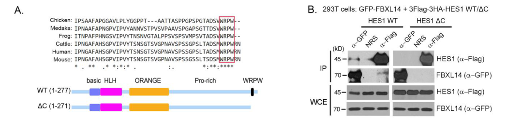

## Question

# Gene Research for Functional Annotation

## ⚠️ CRITICAL: Gene/Protein Identification Context

**BEFORE YOU BEGIN RESEARCH:** You MUST verify you are researching the CORRECT gene/protein. Gene symbols can be ambiguous, especially for less well-characterized genes from non-model organisms.

### Target Gene/Protein Identity (from UniProt):
- **UniProt Accession:** Q8N1E6
- **Protein Description:** RecName: Full=F-box/LRR-repeat protein 14; AltName: Full=F-box and leucine-rich repeat protein 14;
- **Gene Information:** Name=FBXL14; Synonyms=FBL14;
- **Organism (full):** Homo sapiens (Human).
- **Protein Family:** Not specified in UniProt
- **Key Domains:** F-box-like_dom_sf. (IPR036047); F-box_dom. (IPR001810); FBXL14_F-box. (IPR047932); FBXL15_LRR. (IPR057207); Leu-rich_rpt_Cys-con_subtyp. (IPR006553)

### MANDATORY VERIFICATION STEPS:

1. **Check if the gene symbol "FBXL14" matches the protein description above**
2. **Verify the organism is correct:** Homo sapiens (Human).
3. **Check if protein family/domains align with what you find in literature**
4. **If you find literature for a DIFFERENT gene with the same or similar symbol, STOP**

### If Gene Symbol is Ambiguous or You Cannot Find Relevant Literature:

**DO NOT PROCEED WITH RESEARCH ON A DIFFERENT GENE.** Instead:
- State clearly: "The gene symbol 'FBXL14' is ambiguous or literature is limited for this specific protein"
- Explain what you found (e.g., "Found extensive literature on a different gene with the same symbol in a different organism")
- Describe the protein based ONLY on the UniProt information provided above
- Suggest that the protein function can be inferred from domain/family information

### Research Target:

Please provide a comprehensive research report on the gene **FBXL14** (gene ID: FBXL14, UniProt: Q8N1E6) in human.

The research report should be a detailed narrative explaining the function, biological processes, and localization of the gene product. Citations should be given for all claims.

You should prioritize authoritative reviews and primary scientific literature when conducting research. You can supplement
this with annotations you find in gene/protein databases, but these can be outdated or inaccurate.

We are specifically interested in the primary function of the gene - for enzymes, what reaction is catalyzed, and what is the substrate specificity? For transporters, what is the substrate? For structural proteins or adapters, what is the broader structural role? For signaling molecules, what is the role in the pathway.

We are interested in where in or outside the cell the gene product carries out its function.

We are also interested in the signaling or biochemical pathways in which the gene functions. We are less interested in broad pleiotropic effects, except where these elucidate the precise role.

Include evidence where possible. We are interested in both experimental evidence as well as inference from structure, evolution, or bioinformatic analysis. Precise studies should be prioritized over high-throughput, where available.

## Output

Question: You are an expert researcher providing comprehensive, well-cited information.

Provide detailed information focusing on:
1. Key concepts and definitions with current understanding
2. Recent developments and latest research (prioritize 2023-2024 sources)
3. Current applications and real-world implementations
4. Expert opinions and analysis from authoritative sources
5. Relevant statistics and data from recent studies

Format as a comprehensive research report with proper citations. Include URLs and publication dates where available.
Always prioritize recent, authoritative sources and provide specific citations for all major claims.

# Gene Research for Functional Annotation

## ⚠️ CRITICAL: Gene/Protein Identification Context

**BEFORE YOU BEGIN RESEARCH:** You MUST verify you are researching the CORRECT gene/protein. Gene symbols can be ambiguous, especially for less well-characterized genes from non-model organisms.

### Target Gene/Protein Identity (from UniProt):
- **UniProt Accession:** Q8N1E6
- **Protein Description:** RecName: Full=F-box/LRR-repeat protein 14; AltName: Full=F-box and leucine-rich repeat protein 14;
- **Gene Information:** Name=FBXL14; Synonyms=FBL14;
- **Organism (full):** Homo sapiens (Human).
- **Protein Family:** Not specified in UniProt
- **Key Domains:** F-box-like_dom_sf. (IPR036047); F-box_dom. (IPR001810); FBXL14_F-box. (IPR047932); FBXL15_LRR. (IPR057207); Leu-rich_rpt_Cys-con_subtyp. (IPR006553)

### MANDATORY VERIFICATION STEPS:

1. **Check if the gene symbol "FBXL14" matches the protein description above**
2. **Verify the organism is correct:** Homo sapiens (Human).
3. **Check if protein family/domains align with what you find in literature**
4. **If you find literature for a DIFFERENT gene with the same or similar symbol, STOP**

### If Gene Symbol is Ambiguous or You Cannot Find Relevant Literature:

**DO NOT PROCEED WITH RESEARCH ON A DIFFERENT GENE.** Instead:
- State clearly: "The gene symbol 'FBXL14' is ambiguous or literature is limited for this specific protein"
- Explain what you found (e.g., "Found extensive literature on a different gene with the same symbol in a different organism")
- Describe the protein based ONLY on the UniProt information provided above
- Suggest that the protein function can be inferred from domain/family information

### Research Target:

Please provide a comprehensive research report on the gene **FBXL14** (gene ID: FBXL14, UniProt: Q8N1E6) in human.

The research report should be a detailed narrative explaining the function, biological processes, and localization of the gene product. Citations should be given for all claims.

You should prioritize authoritative reviews and primary scientific literature when conducting research. You can supplement
this with annotations you find in gene/protein databases, but these can be outdated or inaccurate.

We are specifically interested in the primary function of the gene - for enzymes, what reaction is catalyzed, and what is the substrate specificity? For transporters, what is the substrate? For structural proteins or adapters, what is the broader structural role? For signaling molecules, what is the role in the pathway.

We are interested in where in or outside the cell the gene product carries out its function.

We are also interested in the signaling or biochemical pathways in which the gene functions. We are less interested in broad pleiotropic effects, except where these elucidate the precise role.

Include evidence where possible. We are interested in both experimental evidence as well as inference from structure, evolution, or bioinformatic analysis. Precise studies should be prioritized over high-throughput, where available.

## Research report: Human **FBXL14** (UniProt **Q8N1E6**) functional annotation

### 0) Target verification (mandatory)
FBXL14 (UniProt Q8N1E6) is the human **F-box/LRR-repeat protein 14**, an FBXL-class F-box protein (~418 aa) containing an **N-terminal F-box** (Skp1-binding) and **~11 leucine-rich repeats (LRRs)** (substrate-binding), consistent across structural review and primary functional studies. (mason2020thefbxlfamily pages 3-4, mason2020thefbxlfamily pages 4-5, chen2017thee3ubiquitin pages 1-2)

---

### 1) Key concepts and definitions (current understanding)

#### 1.1 SCF/CRL1 E3 ubiquitin ligases
FBXL14 functions as a **substrate receptor** in an SCF (also termed **CRL1**) Cullin–RING E3 ubiquitin ligase complex. Canonical SCF architecture comprises **CUL1 (scaffold)**, **RBX1 (RING)**, **SKP1 (adaptor)**, and a variable **F-box protein** that confers substrate specificity. (chen2017thee3ubiquitin pages 1-2, tekcham2020fboxproteinsand pages 1-3, sato2010augmentationofthe pages 1-2)

Mechanistically, RBX1 recruits an E2~ubiquitin conjugate (for many SCF systems, classically CDC34 is emphasized), positioning ubiquitin for transfer to substrates brought in by the F-box receptor. (sato2010augmentationofthe pages 1-2, mason2020thefbxlfamily pages 2-3)

#### 1.2 FBXL family structural principles (how FBXL14 likely recognizes substrates)
FBXL proteins are defined by an N-terminal **F-box domain** that binds **Skp1** and a C-terminal array of **LRRs** that mediate substrate binding. (mason2020thefbxlfamily pages 3-4, mason2020thefbxlfamily pages 2-3, sato2010augmentationofthe pages 2-3)

The LRR domain forms a curved **“horseshoe” solenoid**; the **concave surface** is the dominant substrate-binding interface across structurally characterized FBXL members, providing a conceptual basis for FBXL14 substrate recognition. (mason2020thefbxlfamily pages 3-4, mason2020thefbxlfamily pages 5-6)

FBXL14 is repeatedly described as containing **11 LRRs** (and being ~418 aa), a feature consistent with its classification and with substrate-recognition via an LRR surface. (mason2020thefbxlfamily pages 4-5, chen2017thee3ubiquitin pages 1-2)

---

### 2) Core molecular functions of FBXL14 (primary functional annotation)

FBXL14 is best supported as an **SCF (CRL1) E3 ubiquitin ligase substrate receptor** that promotes **ubiquitin-dependent proteasomal degradation** of select transcriptional regulators, with validated direct substrates including **HES1** (Notch signaling effector) and **SNAIL1** (EMT transcription factor). (chen2017thee3ubiquitin pages 1-2, vinascastells2010thehypoxiacontrolledfbxl14 pages 1-2)

#### 2.1 FBXL14 → HES1 (Notch pathway; neuronal differentiation)
A strong body of biochemical and functional evidence supports that SCF^FBXL14 targets **HES1** for ubiquitin-dependent degradation:
- Knockdown of CRL1 components **CUL1** or **RBX1** increased HES1 abundance and prolonged HES1 half-life, implicating CRL1 machinery in HES1 turnover. (chen2017thee3ubiquitin pages 1-2)
- FBXL14 associates with HES1 and promotes HES1 ubiquitination and degradation; FBXL14 loss stabilizes HES1 and dampens oscillatory behavior. (chen2017thee3ubiquitin pages 18-20, chen2017thee3ubiquitin pages 16-18)
- **Substrate recognition motif:** the conserved **C-terminal WRPW motif** in HES1 is required for FBXL14 binding and for SCF^FBXL14-mediated ubiquitination and degradation; deleting WRPW reduces co-IP with FBXL14, increases HES1 stability in CHX chase, and decreases polyubiquitination. (chen2017thee3ubiquitin pages 18-20, chen2017thee3ubiquitin media 2535ebd1)
- **SCF dependence:** deleting the FBXL14 **F-box** (ΔF) reduces ubiquitination of HES1, consistent with the requirement for SCF complex assembly (Skp1/CUL1 engagement) to catalyze ubiquitin transfer. (chen2017thee3ubiquitin media 2535ebd1)

Functionally, this proteolysis promotes **neuronal differentiation**, positioning FBXL14 as a post-translational regulator of Notch/HES dynamics. (chen2017thee3ubiquitin pages 1-2)

#### 2.2 FBXL14 → SNAIL1 (EMT regulator; hypoxia/EMT coupling)
Primary data (JBC 2010) show that FBXL14 is a direct ubiquitin ligase for **SNAIL1**:
- FBXL14 interacts with SNAIL1 and promotes **proteasome-dependent degradation**; degradation is blocked by MG132 and requires an intact FBXL14 F-box (ΔF fails). (vinascastells2010thehypoxiacontrolledfbxl14 pages 4-6)
- FBXL14 is described to act **independently of GSK-3 phosphorylation** for SNAIL1 degradation, distinguishing it from the canonical GSK3β/β-TrCP axis. (vinascastells2010thehypoxiacontrolledfbxl14 pages 1-2)
- **Subcellular localization:** FBXL14 is reported as **mainly cytoplasmic** by immunofluorescence; in transfected cells it depletes nuclear SNAIL1, consistent with a model in which cytoplasmic ligase availability contributes to SNAIL1 turnover. (vinascastells2010thehypoxiacontrolledfbxl14 pages 4-6, vinascastells2010thehypoxiacontrolledfbxl14 pages 10-12)

**Substrate determinants and ubiquitination sites** were mapped:
- A minimal SNAIL1 region important for FBXL14-dependent degradation lies within **aa 120–151** (including a hydrophobic segment), based on deletion mapping summarized across sources. (vinascastells2010thehypoxiacontrolledfbxl14 pages 10-12, castells2013ubiquitinligasesinvolved pages 97-100)
- Major SNAIL1 ubiquitination acceptor lysines include **K98, K137, K146**: a triple mutant shows reduced ubiquitination and is highly stable (e.g., ~80% remaining after 4 h CHX in cited experiments). (vinascastells2010thehypoxiacontrolledfbxl14 pages 8-9, castells2013ubiquitinligasesinvolved pages 62-65)
- In CHX-chase experiments, depletion of FBXL14 increased exogenous SNAIL1 half-life from ~1 h to ~3 h, supporting FBXL14 as a key determinant of SNAIL1 proteostasis. (vinascastells2010thehypoxiacontrolledfbxl14 pages 8-9)

**Hypoxia regulation linking microenvironment to EMT:**
- Hypoxia down-regulates FBXL14 mRNA and stabilizes SNAIL1 protein without increasing Snail1 mRNA. (vinascastells2010thehypoxiacontrolledfbxl14 pages 1-2, vinascastells2010thehypoxiacontrolledfbxl14 pages 9-10)
- TWIST1 is required for this hypoxia response: Twist1 knockdown prevents hypoxia-induced FBXL14 down-modulation and prevents SNAIL1 stabilization. (vinascastells2010thehypoxiacontrolledfbxl14 pages 1-2, vinascastells2010thehypoxiacontrolledfbxl14 pages 9-10)

Together, these findings support FBXL14 as a mechanistic node coupling oxygen-sensing/transcriptional programs (HIF/TWIST) to EMT effector stability through ubiquitin-mediated proteolysis.

#### 2.3 FBXL14 → c-Myc (glioma stemness/differentiation axis; review-supported)
Cancer-focused reviews summarize primary evidence that FBXL14 targets **Thr58-phosphorylated c-Myc** for ubiquitination, with functional consequences in glioma:
- FBXL14 is reported to ubiquitylate **Thr58-phosphorylated c-Myc**; FBXL14 is low in glioma stem cells but higher in non–stem-like glioma cells/neural progenitors. (yumimoto2020fboxproteinsand pages 7-10)
- Overexpression of FBXL14 promotes differentiation and suppresses glioma stem cell tumor-forming capacity; expression of degradation-resistant **c-Myc(T58A)** reverses these effects, supporting a Thr58-dependent mechanism. (yumimoto2020fboxproteinsand pages 7-10, yumimoto2020fboxproteinsand pages 10-12)
- The deubiquitinase **USP13** is described (reviewing primary work) as antagonizing FBXL14-mediated Myc ubiquitination, thereby supporting glioblastoma stem cell maintenance. (tao2023rolesofubiquitin‑specific pages 8-9, tao2023rolesofubiquitin‑specific pages 5-6)

Because these points are largely review-derived within the retrieved corpus, they should be interpreted as strongly suggestive and motivated by primary literature (e.g., a cited J Exp Med 2017 study), but the underlying experimental details were not directly retrieved here. (tao2023rolesofubiquitin‑specific pages 8-9, tao2023rolesofubiquitin‑specific pages 5-6, yumimoto2020fboxproteinsand pages 7-10)

---

### 3) Subcellular localization and where FBXL14 acts
Across EMT-focused work and synthesis, FBXL14 is repeatedly described as predominantly **cytoplasmic**, consistent with:
- Cytoplasmic immunofluorescence localization and proposed targeting of newly synthesized/cytosolic SNAIL1. (vinascastells2010thehypoxiacontrolledfbxl14 pages 4-6, castells2013ubiquitinligasesinvolved pages 97-100)

In the Notch/HES1 study, subcellular localization of FBXL14 is not emphasized; however, SCF^FBXL14 activity requires CRL1 machinery (CUL1/RBX1), consistent with intracellular ubiquitin-proteasome regulation rather than extracellular action. (chen2017thee3ubiquitin pages 16-18, chen2017thee3ubiquitin pages 1-2)

---

### 4) Pathways and biological processes

#### 4.1 Notch signaling dynamics and neuronal differentiation
By promoting HES1 turnover via an SCF complex, FBXL14 participates in the post-translational control of Notch effector abundance and thereby influences cell fate decisions (neuronal differentiation), consistent with HES1’s role as a proneural gene repressor. (chen2017thee3ubiquitin pages 1-2, chen2017thee3ubiquitin pages 18-20)

#### 4.2 EMT regulation and tumor microenvironment (hypoxia)
FBXL14 destabilizes SNAIL1 and is described as a cytoplasmic Snail1 ubiquitin ligase; hypoxia-driven repression of FBXL14 stabilizes SNAIL1 and supports EMT. (vinascastells2010thehypoxiacontrolledfbxl14 pages 1-2, vinascastells2010thehypoxiacontrolledfbxl14 pages 9-10, vinascastells2010thehypoxiacontrolledfbxl14 pages 4-6)

---

### 5) Recent developments (prioritizing 2023–2024)

#### 5.1 3D genome regulation (Nature 2023)
A 2023 Nature high-throughput Oligopaint-based screen identified FBXL14 as a **validated hit** in 3D genome regulation. In follow-up across 13 genome-wide domain-pair boundaries, **depletion of FBXL14 significantly increased inter-TAD interactions at nearly all (≥12/13) boundaries tested**, supporting a role as a general factor limiting inappropriate inter-domain contacts. (park2023highthroughputoligopaintscreen pages 4-6)

This finding is mechanistically orthogonal to the classical substrate-by-substrate SCF paradigm and suggests either (i) an as-yet-unknown chromatin substrate or (ii) indirect network effects via ubiquitin-proteasome control of genome-organization regulators.

#### 5.2 FBXL14 as a candidate E3 for targeted protein degradation platforms (STTT 2024)
A 2024 Signal Transduction and Targeted Therapy article summarizing proteome-scale proximity-based screens reports FBXL14 among a small set of ligases that performed well across **ten model substrates** spanning different subcellular localizations, implying broad degradative capacity suitable for engineered proximity-inducing modalities (e.g., degrader design paradigms). (hermanns2024proximitydependentprotein(de)stabilization pages 1-2)

While this does not establish endogenous substrates, it is a key recent translationally oriented development: FBXL14 is highlighted as a potential **E3 effector module** beyond commonly used VHL/CRBN-centric approaches.

#### 5.3 2023 synthesis of USP13–FBXL14–Myc axis in tumors
A 2023 review of USP13 notes that USP13 maintains glioblastoma stem cells by antagonizing FBXL14-mediated Myc ubiquitination, reinforcing interest in the FBXL14–Myc axis in cancer biology and potentially in therapeutic strategies that modulate ubiquitination/deubiquitination balance. (tao2023rolesofubiquitin‑specific pages 8-9, tao2023rolesofubiquitin‑specific pages 5-6)

---

### 6) Expert opinions and interpretive synthesis (authoritative sources)

#### 6.1 Specificity challenges for targeting F-box proteins
Cancer reviews emphasize that F-box proteins can ubiquitinate both oncogenes and tumor suppressors; therefore **non-specific inhibition** risks side effects, and substrate-selective strategies (blocking specific F-box–substrate interfaces) are considered more plausible. This contextualizes FBXL14 therapeutics: manipulation would likely need to be pathway- and substrate-aware (e.g., EMT context vs neurodevelopmental context). (yumimoto2020fboxproteinsand pages 7-10)

#### 6.2 Structural rationale for motif-driven substrate selection
The FBXL family review frames substrate recognition as primarily mediated by the concave LRR interface and highlights that LRR organization can enable high-affinity interactions. In FBXL14 specifically, this aligns with demonstrated recognition of short motifs (HES1 WRPW) and mapped substrate regions (SNAIL1 aa120–151) that plausibly engage an LRR surface. (mason2020thefbxlfamily pages 3-4, chen2017thee3ubiquitin media 2535ebd1, vinascastells2010thehypoxiacontrolledfbxl14 pages 10-12)

---

### 7) Relevant statistics and data highlights

**Hypoxia/clinical tumor association (colon adenocarcinoma; n=33):**
- CA9 present in **30/33** tumors; FBXL14 RNA decreased in **25/33** tumors vs normal mucosa. (vinascastells2010thehypoxiacontrolledfbxl14 pages 9-10)
- FBXL14 inversely correlated with CA9: **r = −0.43, p = 0.013**. (vinascastells2010thehypoxiacontrolledfbxl14 pages 9-10)
- TWIST1-positive tumors show lower FBXL14 (geometric average **0.3** vs **0.81**, p = 0.046) and higher CA9 (geometric average **1.83** vs **0.09**, p = 0.012). (vinascastells2010thehypoxiacontrolledfbxl14 pages 9-10)

**SNAIL1 stability measurements (cell models):**
- Exogenous SNAIL1 half-life increased from ~**1 h** to ~**3 h** upon FBXL14 depletion. (vinascastells2010thehypoxiacontrolledfbxl14 pages 8-9)
- A SNAIL1 triple-lysine mutant (K98R/K137R/K146R) is highly stable with ~**80% remaining after 4 h** CHX and shows reduced ubiquitination. (vinascastells2010thehypoxiacontrolledfbxl14 pages 8-9, castells2013ubiquitinligasesinvolved pages 62-65)

**3D genome regulation validation statistic:**
- FBXL14 depletion increased inter-TAD interactions at **≥12/13** boundaries tested. (park2023highthroughputoligopaintscreen pages 4-6)

---

### 8) Current applications and real-world implementations

#### 8.1 Potential biomarker/prognostic use (evidence base still emerging)
The colon tumor dataset provides quantitative evidence that FBXL14 mRNA down-regulation associates with hypoxia (CA9) and TWIST1, consistent with an EMT-permissive program; this supports the plausibility of FBXL14 as a **context-dependent biomarker** of hypoxia/EMT state, although direct clinical implementation is not proposed in the source and would require validation. (vinascastells2010thehypoxiacontrolledfbxl14 pages 9-10)

#### 8.2 Targeted protein degradation (TPD) engineering
FBXL14’s identification as a strong proximity-induced destabilizer across multiple substrate localizations supports its candidacy as an **E3 ligase for engineered degrader systems** (a translational research direction rather than a deployed clinical technology). (hermanns2024proximitydependentprotein(de)stabilization pages 1-2)

#### 8.3 Drug discovery for chromatin architecture
By emerging as a “druggable” 3D genome regulator in a Nature screen, FBXL14 becomes a candidate node for chemical biology aimed at modulating chromatin folding; however, the mechanism and druggability at the protein-structure level remain to be established. (park2023highthroughputoligopaintscreen pages 4-6)

---

### 9) Evidence summary table
The following table consolidates direct substrates vs functional associations and highlights motifs, pathways, localization, and disease relevance.

| Substrate/Process | Evidence type | Key recognition motif/degron | Pathway/biological context | Subcellular location notes | Disease relevance | Key citation (paper, year, DOI/URL) |
|---|---|---|---|---|---|---|
| **HES1 (direct substrate)** | siRNA knockdown of **FBXL14**, **CUL1**, **RBX1**; co-IP; in vivo ubiquitination assay; CHX chase; proteasome inhibition (MG132); neuronal differentiation assays in mES/F9 cells | **C-terminal WRPW motif** in HES1 required for FBXL14 binding and ubiquitination; FBXL14 **F-box** required for SCF activity; modeling supports WRPW interaction with FBXL14 **LRR** domain | **Notch/HES1 oscillation** and repression of proneural genes; SCF^FBXL14 promotes **neuronal differentiation** by destabilizing HES1 | Specific FBXL14 localization not emphasized in this study; assays support action within **SCF(CUL1-SKP1-RBX1)-FBXL14** complex | Functional relevance to **development/neurogenesis**; cited in relation to neurological phenotypes | Chen et al., 2017, *J Biol Chem*, doi:10.1074/jbc.M117.815001, https://doi.org/10.1074/jbc.M117.815001 (chen2017thee3ubiquitin pages 18-20, chen2017thee3ubiquitin pages 16-18, chen2017thee3ubiquitin pages 1-2, chen2017thee3ubiquitin media 2535ebd1) |
| **SNAIL1 (direct substrate)** | Interaction and ubiquitination/degradation assays summarized in review of primary work; shRNA inhibition stabilizes ectopic and endogenous SNAIL1; domain mapping of minimal region required for FBXL14-mediated degradation | Minimal SNAIL1 region for FBXL14-mediated degradation maps to **aa 120-151**; both **phosphorylated and unphosphorylated** SNAIL1 can be targeted | **EMT** regulation; hypoxia/HIF-1α/TWIST1 axis represses FBXL14, stabilizing SNAIL1 | FBXL14 reported as **cytoplasmic** by immunofluorescence; proposed to act on newly synthesized cytoplasmic SNAIL1 | Linked to **tumor hypoxia**, EMT, invasion, and poorer prognosis when FBXL14 is downregulated | Viñas-Castells et al., 2010, *J Biol Chem*, doi:10.1074/jbc.M109.065995, https://doi.org/10.1074/jbc.M109.065995; summarized with localization/mechanism in later review (castells2013ubiquitinligasesinvolveda pages 97-100, castells2013ubiquitinligasesinvolved pages 97-100) |
| **c-Myc / Myc (direct substrate, supported mainly through cited primary studies and reviews)** | Review-cited primary studies report FBXL14-mediated **ubiquitination** of Myc; overexpression promotes differentiation and suppresses glioma stem-cell growth/tumorigenicity; effects reversed by degradation-resistant **c-Myc T58A** mutant | Recognition linked to **Thr58-phosphorylated c-Myc**; USP13 antagonizes FBXL14-mediated Myc ubiquitination | **Glioblastoma stem-cell maintenance/differentiation**; FBXL14 acts opposite to USP13 on Myc stability | No firm FBXL14 localization detail extracted from recent review excerpts | Lower FBXL14 in **glioma stem cells**; FBXL14 overexpression suppresses tumor-forming capacity, while **USP13** counteracts this axis | Tao et al., 2023, *Oncol Lett*, doi:10.3892/ol.2023.14191, https://doi.org/10.3892/ol.2023.14191; review cites primary glioblastoma studies including J Exp Med 2017. Supporting cancer review: Yumimoto et al., 2020, doi:10.3390/cancers12051249, https://doi.org/10.3390/cancers12051249 (tao2023rolesofubiquitin‑specific pages 8-9, tao2023rolesofubiquitin‑specific pages 9-10, tao2023rolesofubiquitin‑specific pages 5-6, yumimoto2020fboxproteinsand pages 7-10) |
| **3D genome regulation / inter-TAD insulation (functional hit, not established direct substrate)** | **HiDRO/Oligopaint** high-throughput depletion screen; validation across multiple genomic boundaries; knockdown increased inter-TAD interactions | No direct degron/substrate motif established for this phenotype | FBXL14 emerged as representative **ubiquitin ligase-class** regulator of **chromatin folding/3D genome organization** | No direct localization claim in excerpt; functional phenotype is genome-architecture associated | Identified as a potentially **druggable** 3D genome regulator; disease relevance indirect/technology-enabling rather than substrate-level | Park et al., 2023, *Nature*, doi:10.1038/s41586-023-06340-w, https://doi.org/10.1038/s41586-023-06340-w (park2023highthroughputoligopaintscreen pages 4-6) |
| **Broad protein-destabilization capacity (functional association, not a specific substrate assignment)** | Proteome-scale and proximity-dependent **degradation-effector** screens; activity tested against **10 model substrates** with different localizations | No specific degron defined; screen measures proximity-induced destabilization | Positions FBXL14 as a candidate **targeted protein degradation (TPD)** effector / E3-recruitment module | Active across model substrates with varied **subcellular localizations** | Translational relevance for **TPD/E3-ligase harnessing** rather than endogenous biology alone | Hermanns & Hofmann, 2024, *Signal Transduct Target Ther*, doi:10.1038/s41392-024-01884-3, https://doi.org/10.1038/s41392-024-01884-3 (summarizing Poirson et al., 2024, *Nature*) (hermanns2024proximitydependentprotein(de)stabilization pages 1-2) |

*Table: This table summarizes the best-supported functions and reported substrates or associations for human FBXL14, distinguishing direct substrates from broader functional hits. It highlights the evidence base, recognition motifs, pathway context, localization clues, and disease relevance for rapid functional annotation.*

---

### 10) Key figure evidence (visual)
Chen et al. (JBC 2017) Figure 4 provides direct visual evidence that the **HES1 WRPW** motif is required for FBXL14 binding/ubiquitination and that FBXL14 **F-box deletion** reduces HES1 polyubiquitination and degradation. (chen2017thee3ubiquitin media 2535ebd1, chen2017thee3ubiquitin media 2e33b0eb, chen2017thee3ubiquitin media a8a05436, chen2017thee3ubiquitin media f9d2cd0e)

---

### 11) Limitations of this synthesis
Some frequently cited FBXL14 substrates/phenotypes (e.g., CDCP1 in breast cancer; additional EMT factors such as TWIST/SLUG; developmental roles such as MKP3 in vertebrate axis formation) are referenced in reviews within the retrieved set but were not available here as directly retrieved primary full-text evidence. Accordingly, this report emphasizes **HES1** and **SNAIL1** as the most strongly supported direct substrates from primary mechanistic studies and treats additional claims as review-level context.

---

### 12) Primary references with dates and URLs (from retrieved corpus)
- Viñas-Castells R. et al. **2010-02**. *J Biol Chem*. “The Hypoxia-controlled FBXL14 Ubiquitin Ligase Targets SNAIL1 for Proteasome Degradation.” https://doi.org/10.1074/jbc.M109.065995 (vinascastells2010thehypoxiacontrolledfbxl14 pages 1-2, vinascastells2010thehypoxiacontrolledfbxl14 pages 8-9, vinascastells2010thehypoxiacontrolledfbxl14 pages 9-10, vinascastells2010thehypoxiacontrolledfbxl14 pages 4-6)
- Chen F. et al. **2017-12**. *J Biol Chem*. “The E3 ubiquitin ligase SCF^FBXL14 complex stimulates neuronal differentiation by targeting the Notch signaling factor HES1 for proteolysis.” https://doi.org/10.1074/jbc.M117.815001 (chen2017thee3ubiquitin pages 1-2, chen2017thee3ubiquitin pages 18-20, chen2017thee3ubiquitin media 2535ebd1)
- Park D.S. et al. **2023-07**. *Nature*. “High-throughput Oligopaint screen identifies druggable 3D genome regulators.” https://doi.org/10.1038/s41586-023-06340-w (park2023highthroughputoligopaintscreen pages 4-6)
- Hermanns T., Hofmann K. **2024-07**. *Signal Transduction and Targeted Therapy*. “Proximity-dependent protein (de)stabilization: screening the human ORFeome for protein degraders and stabilizers.” https://doi.org/10.1038/s41392-024-01884-3 (hermanns2024proximitydependentprotein(de)stabilization pages 1-2)
- Tao Y. et al. **2023-12**. *Oncology Letters* (Review). “Roles of ubiquitin-specific protease 13 in normal physiology and tumors.” https://doi.org/10.3892/ol.2023.14191 (tao2023rolesofubiquitin‑specific pages 8-9, tao2023rolesofubiquitin‑specific pages 5-6)
- Mason B., Laman H. **2020-11**. *Open Biology* (Review). “The FBXL family of F-box proteins: variations on a theme.” https://doi.org/10.1098/rsob.200319 (mason2020thefbxlfamily pages 3-4, mason2020thefbxlfamily pages 4-5)
- Yumimoto K. et al. **2020-05**. *Cancers* (Review). “F-Box Proteins and Cancer.” https://doi.org/10.3390/cancers12051249 (yumimoto2020fboxproteinsand pages 7-10, yumimoto2020fboxproteinsand pages 10-12)

References

1. (mason2020thefbxlfamily pages 3-4): Bethany Mason and Heike Laman. The fbxl family of f-box proteins: variations on a theme. Nov 2020. URL: https://doi.org/10.1098/rsob.200319, doi:10.1098/rsob.200319. This article has 51 citations and is from a peer-reviewed journal.

2. (mason2020thefbxlfamily pages 4-5): Bethany Mason and Heike Laman. The fbxl family of f-box proteins: variations on a theme. Nov 2020. URL: https://doi.org/10.1098/rsob.200319, doi:10.1098/rsob.200319. This article has 51 citations and is from a peer-reviewed journal.

3. (chen2017thee3ubiquitin pages 1-2): Fangfang Chen, Chunxiao Zhang, Haonan Wu, Yue Ma, Xiaomin Luo, Xinqi Gong, Fan Jiang, Yaoting Gui, Hui Zhang, and Fei Lu. The e3 ubiquitin ligase scffbxl14 complex stimulates neuronal differentiation by targeting the notch signaling factor hes1 for proteolysis. Journal of Biological Chemistry, 292:20100-20112, Dec 2017. URL: https://doi.org/10.1074/jbc.m117.815001, doi:10.1074/jbc.m117.815001. This article has 24 citations and is from a domain leading peer-reviewed journal.

4. (tekcham2020fboxproteinsand pages 1-3): Dinesh Singh Tekcham, Di Chen, Yu Liu, Ting Ling, Yi Zhang, Huan Chen, Wen Wang, Wuxiyar Otkur, Huan Qi, Tian Xia, Xiaolong Liu, Hai-long Piao, and Hongxu Liu. F-box proteins and cancer: an update from functional and regulatory mechanism to therapeutic clinical prospects. Theranostics, 10:4150-4167, Mar 2020. URL: https://doi.org/10.7150/thno.42735, doi:10.7150/thno.42735. This article has 111 citations and is from a domain leading peer-reviewed journal.

5. (sato2010augmentationofthe pages 1-2): Kazuyuki Sato and Kenichi Yoshida. Augmentation of the ubiquitin-mediated proteolytic system by f-box and additional motif-containing proteins (review). International journal of oncology, 37 5:1071-6, Nov 2010. URL: https://doi.org/10.3892/ijo\_00000758, doi:10.3892/ijo\_00000758. This article has 5 citations and is from a peer-reviewed journal.

6. (mason2020thefbxlfamily pages 2-3): Bethany Mason and Heike Laman. The fbxl family of f-box proteins: variations on a theme. Nov 2020. URL: https://doi.org/10.1098/rsob.200319, doi:10.1098/rsob.200319. This article has 51 citations and is from a peer-reviewed journal.

7. (sato2010augmentationofthe pages 2-3): Kazuyuki Sato and Kenichi Yoshida. Augmentation of the ubiquitin-mediated proteolytic system by f-box and additional motif-containing proteins (review). International journal of oncology, 37 5:1071-6, Nov 2010. URL: https://doi.org/10.3892/ijo\_00000758, doi:10.3892/ijo\_00000758. This article has 5 citations and is from a peer-reviewed journal.

8. (mason2020thefbxlfamily pages 5-6): Bethany Mason and Heike Laman. The fbxl family of f-box proteins: variations on a theme. Nov 2020. URL: https://doi.org/10.1098/rsob.200319, doi:10.1098/rsob.200319. This article has 51 citations and is from a peer-reviewed journal.

9. (vinascastells2010thehypoxiacontrolledfbxl14 pages 1-2): Rosa Viñas-Castells, Manuel Beltran, Gabriela Valls, Irene Gómez, José Miguel García, Bàrbara Montserrat-Sentís, Josep Baulida, Félix Bonilla, Antonio García de Herreros, and Víctor M. Díaz. The hypoxia-controlled fbxl14 ubiquitin ligase targets snail1 for proteasome degradation. Journal of Biological Chemistry, 285:3794-3805, Feb 2010. URL: https://doi.org/10.1074/jbc.m109.065995, doi:10.1074/jbc.m109.065995. This article has 205 citations and is from a domain leading peer-reviewed journal.

10. (chen2017thee3ubiquitin pages 18-20): Fangfang Chen, Chunxiao Zhang, Haonan Wu, Yue Ma, Xiaomin Luo, Xinqi Gong, Fan Jiang, Yaoting Gui, Hui Zhang, and Fei Lu. The e3 ubiquitin ligase scffbxl14 complex stimulates neuronal differentiation by targeting the notch signaling factor hes1 for proteolysis. Journal of Biological Chemistry, 292:20100-20112, Dec 2017. URL: https://doi.org/10.1074/jbc.m117.815001, doi:10.1074/jbc.m117.815001. This article has 24 citations and is from a domain leading peer-reviewed journal.

11. (chen2017thee3ubiquitin pages 16-18): Fangfang Chen, Chunxiao Zhang, Haonan Wu, Yue Ma, Xiaomin Luo, Xinqi Gong, Fan Jiang, Yaoting Gui, Hui Zhang, and Fei Lu. The e3 ubiquitin ligase scffbxl14 complex stimulates neuronal differentiation by targeting the notch signaling factor hes1 for proteolysis. Journal of Biological Chemistry, 292:20100-20112, Dec 2017. URL: https://doi.org/10.1074/jbc.m117.815001, doi:10.1074/jbc.m117.815001. This article has 24 citations and is from a domain leading peer-reviewed journal.

12. (chen2017thee3ubiquitin media 2535ebd1): Fangfang Chen, Chunxiao Zhang, Haonan Wu, Yue Ma, Xiaomin Luo, Xinqi Gong, Fan Jiang, Yaoting Gui, Hui Zhang, and Fei Lu. The e3 ubiquitin ligase scffbxl14 complex stimulates neuronal differentiation by targeting the notch signaling factor hes1 for proteolysis. Journal of Biological Chemistry, 292:20100-20112, Dec 2017. URL: https://doi.org/10.1074/jbc.m117.815001, doi:10.1074/jbc.m117.815001. This article has 24 citations and is from a domain leading peer-reviewed journal.

13. (vinascastells2010thehypoxiacontrolledfbxl14 pages 4-6): Rosa Viñas-Castells, Manuel Beltran, Gabriela Valls, Irene Gómez, José Miguel García, Bàrbara Montserrat-Sentís, Josep Baulida, Félix Bonilla, Antonio García de Herreros, and Víctor M. Díaz. The hypoxia-controlled fbxl14 ubiquitin ligase targets snail1 for proteasome degradation. Journal of Biological Chemistry, 285:3794-3805, Feb 2010. URL: https://doi.org/10.1074/jbc.m109.065995, doi:10.1074/jbc.m109.065995. This article has 205 citations and is from a domain leading peer-reviewed journal.

14. (vinascastells2010thehypoxiacontrolledfbxl14 pages 10-12): Rosa Viñas-Castells, Manuel Beltran, Gabriela Valls, Irene Gómez, José Miguel García, Bàrbara Montserrat-Sentís, Josep Baulida, Félix Bonilla, Antonio García de Herreros, and Víctor M. Díaz. The hypoxia-controlled fbxl14 ubiquitin ligase targets snail1 for proteasome degradation. Journal of Biological Chemistry, 285:3794-3805, Feb 2010. URL: https://doi.org/10.1074/jbc.m109.065995, doi:10.1074/jbc.m109.065995. This article has 205 citations and is from a domain leading peer-reviewed journal.

15. (castells2013ubiquitinligasesinvolved pages 97-100): R Viñas Castells. Ubiquitin ligases involved in the regulation of snail1. Unknown journal, 2013.

16. (vinascastells2010thehypoxiacontrolledfbxl14 pages 8-9): Rosa Viñas-Castells, Manuel Beltran, Gabriela Valls, Irene Gómez, José Miguel García, Bàrbara Montserrat-Sentís, Josep Baulida, Félix Bonilla, Antonio García de Herreros, and Víctor M. Díaz. The hypoxia-controlled fbxl14 ubiquitin ligase targets snail1 for proteasome degradation. Journal of Biological Chemistry, 285:3794-3805, Feb 2010. URL: https://doi.org/10.1074/jbc.m109.065995, doi:10.1074/jbc.m109.065995. This article has 205 citations and is from a domain leading peer-reviewed journal.

17. (castells2013ubiquitinligasesinvolved pages 62-65): R Viñas Castells. Ubiquitin ligases involved in the regulation of snail1. Unknown journal, 2013.

18. (vinascastells2010thehypoxiacontrolledfbxl14 pages 9-10): Rosa Viñas-Castells, Manuel Beltran, Gabriela Valls, Irene Gómez, José Miguel García, Bàrbara Montserrat-Sentís, Josep Baulida, Félix Bonilla, Antonio García de Herreros, and Víctor M. Díaz. The hypoxia-controlled fbxl14 ubiquitin ligase targets snail1 for proteasome degradation. Journal of Biological Chemistry, 285:3794-3805, Feb 2010. URL: https://doi.org/10.1074/jbc.m109.065995, doi:10.1074/jbc.m109.065995. This article has 205 citations and is from a domain leading peer-reviewed journal.

19. (yumimoto2020fboxproteinsand pages 7-10): Kanae Yumimoto, Yuhei Yamauchi, and Keiichi I. Nakayama. F-box proteins and cancer. Cancers, 12:1249, May 2020. URL: https://doi.org/10.3390/cancers12051249, doi:10.3390/cancers12051249. This article has 70 citations.

20. (yumimoto2020fboxproteinsand pages 10-12): Kanae Yumimoto, Yuhei Yamauchi, and Keiichi I. Nakayama. F-box proteins and cancer. Cancers, 12:1249, May 2020. URL: https://doi.org/10.3390/cancers12051249, doi:10.3390/cancers12051249. This article has 70 citations.

21. (tao2023rolesofubiquitin‑specific pages 8-9): Yun Tao, Xiaohong Xu, Rong Shen, Xiaobing Miao, and Song He. Roles of ubiquitin‑specific protease 13 in normal physiology and tumors (review). Oncology Letters, Dec 2023. URL: https://doi.org/10.3892/ol.2023.14191, doi:10.3892/ol.2023.14191. This article has 4 citations and is from a peer-reviewed journal.

22. (tao2023rolesofubiquitin‑specific pages 5-6): Yun Tao, Xiaohong Xu, Rong Shen, Xiaobing Miao, and Song He. Roles of ubiquitin‑specific protease 13 in normal physiology and tumors (review). Oncology Letters, Dec 2023. URL: https://doi.org/10.3892/ol.2023.14191, doi:10.3892/ol.2023.14191. This article has 4 citations and is from a peer-reviewed journal.

23. (park2023highthroughputoligopaintscreen pages 4-6): Daniel S. Park, Son C. Nguyen, Randi Isenhart, Parisha P. Shah, Wonho Kim, R. Jordan Barnett, Aditi Chandra, Jennifer M. Luppino, Jailynn Harke, May Wai, Patrick J. Walsh, Richard J. Abdill, Rachel Yang, Yemin Lan, Sora Yoon, Rebecca Yunker, Masato T. Kanemaki, Golnaz Vahedi, Jennifer E. Phillips-Cremins, Rajan Jain, and Eric F. Joyce. High-throughput oligopaint screen identifies druggable 3d genome regulators. Nature, 620:209-217, Jul 2023. URL: https://doi.org/10.1038/s41586-023-06340-w, doi:10.1038/s41586-023-06340-w. This article has 54 citations and is from a highest quality peer-reviewed journal.

24. (hermanns2024proximitydependentprotein(de)stabilization pages 1-2): Thomas Hermanns and Kay Hofmann. Proximity-dependent protein (de)stabilization: screening the human orfeome for protein degraders and stabilizers. Signal Transduction and Targeted Therapy, Jul 2024. URL: https://doi.org/10.1038/s41392-024-01884-3, doi:10.1038/s41392-024-01884-3. This article has 0 citations and is from a peer-reviewed journal.

25. (castells2013ubiquitinligasesinvolveda pages 97-100): R Viñas Castells. Ubiquitin ligases involved in the regulation of snail1. Unknown journal, 2013.

26. (tao2023rolesofubiquitin‑specific pages 9-10): Yun Tao, Xiaohong Xu, Rong Shen, Xiaobing Miao, and Song He. Roles of ubiquitin‑specific protease 13 in normal physiology and tumors (review). Oncology Letters, Dec 2023. URL: https://doi.org/10.3892/ol.2023.14191, doi:10.3892/ol.2023.14191. This article has 4 citations and is from a peer-reviewed journal.

27. (chen2017thee3ubiquitin media 2e33b0eb): Fangfang Chen, Chunxiao Zhang, Haonan Wu, Yue Ma, Xiaomin Luo, Xinqi Gong, Fan Jiang, Yaoting Gui, Hui Zhang, and Fei Lu. The e3 ubiquitin ligase scffbxl14 complex stimulates neuronal differentiation by targeting the notch signaling factor hes1 for proteolysis. Journal of Biological Chemistry, 292:20100-20112, Dec 2017. URL: https://doi.org/10.1074/jbc.m117.815001, doi:10.1074/jbc.m117.815001. This article has 24 citations and is from a domain leading peer-reviewed journal.

28. (chen2017thee3ubiquitin media a8a05436): Fangfang Chen, Chunxiao Zhang, Haonan Wu, Yue Ma, Xiaomin Luo, Xinqi Gong, Fan Jiang, Yaoting Gui, Hui Zhang, and Fei Lu. The e3 ubiquitin ligase scffbxl14 complex stimulates neuronal differentiation by targeting the notch signaling factor hes1 for proteolysis. Journal of Biological Chemistry, 292:20100-20112, Dec 2017. URL: https://doi.org/10.1074/jbc.m117.815001, doi:10.1074/jbc.m117.815001. This article has 24 citations and is from a domain leading peer-reviewed journal.

29. (chen2017thee3ubiquitin media f9d2cd0e): Fangfang Chen, Chunxiao Zhang, Haonan Wu, Yue Ma, Xiaomin Luo, Xinqi Gong, Fan Jiang, Yaoting Gui, Hui Zhang, and Fei Lu. The e3 ubiquitin ligase scffbxl14 complex stimulates neuronal differentiation by targeting the notch signaling factor hes1 for proteolysis. Journal of Biological Chemistry, 292:20100-20112, Dec 2017. URL: https://doi.org/10.1074/jbc.m117.815001, doi:10.1074/jbc.m117.815001. This article has 24 citations and is from a domain leading peer-reviewed journal.

## Artifacts

- [Edison artifact artifact-00](FBXL14-deep-research-falcon_artifacts/artifact-00.md)

## Citations

1. yumimoto2020fboxproteinsand pages 7-10
2. park2023highthroughputoligopaintscreen pages 4-6
3. mason2020thefbxlfamily pages 3-4
4. mason2020thefbxlfamily pages 4-5
5. tekcham2020fboxproteinsand pages 1-3
6. sato2010augmentationofthe pages 1-2
7. mason2020thefbxlfamily pages 2-3
8. sato2010augmentationofthe pages 2-3
9. mason2020thefbxlfamily pages 5-6
10. castells2013ubiquitinligasesinvolved pages 97-100
11. castells2013ubiquitinligasesinvolved pages 62-65
12. yumimoto2020fboxproteinsand pages 10-12
13. castells2013ubiquitinligasesinvolveda pages 97-100
14. https://doi.org/10.1074/jbc.M117.815001
15. https://doi.org/10.1074/jbc.M109.065995;
16. https://doi.org/10.3892/ol.2023.14191;
17. https://doi.org/10.3390/cancers12051249
18. https://doi.org/10.1038/s41586-023-06340-w
19. https://doi.org/10.1038/s41392-024-01884-3
20. https://doi.org/10.1074/jbc.M109.065995
21. https://doi.org/10.3892/ol.2023.14191
22. https://doi.org/10.1098/rsob.200319
23. https://doi.org/10.1098/rsob.200319,
24. https://doi.org/10.1074/jbc.m117.815001,
25. https://doi.org/10.7150/thno.42735,
26. https://doi.org/10.3892/ijo\_00000758,
27. https://doi.org/10.1074/jbc.m109.065995,
28. https://doi.org/10.3390/cancers12051249,
29. https://doi.org/10.3892/ol.2023.14191,
30. https://doi.org/10.1038/s41586-023-06340-w,
31. https://doi.org/10.1038/s41392-024-01884-3,