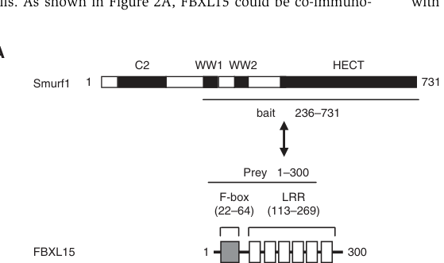

## Question

# Gene Research for Functional Annotation

## ⚠️ CRITICAL: Gene/Protein Identification Context

**BEFORE YOU BEGIN RESEARCH:** You MUST verify you are researching the CORRECT gene/protein. Gene symbols can be ambiguous, especially for less well-characterized genes from non-model organisms.

### Target Gene/Protein Identity (from UniProt):
- **UniProt Accession:** Q9H469
- **Protein Description:** RecName: Full=F-box/LRR-repeat protein 15; AltName: Full=F-box only protein 37;
- **Gene Information:** Name=FBXL15; Synonyms=FBXO37;
- **Organism (full):** Homo sapiens (Human).
- **Protein Family:** Belongs to the FBXL15 family. .
- **Key Domains:** F-box-like_dom_sf. (IPR036047); F-box_dom. (IPR001810); FBXL15_LRR. (IPR057207); Leu-rich_rpt_Cys-con_subtyp. (IPR006553); LRR_dom_sf. (IPR032675)

### MANDATORY VERIFICATION STEPS:

1. **Check if the gene symbol "FBXL15" matches the protein description above**
2. **Verify the organism is correct:** Homo sapiens (Human).
3. **Check if protein family/domains align with what you find in literature**
4. **If you find literature for a DIFFERENT gene with the same or similar symbol, STOP**

### If Gene Symbol is Ambiguous or You Cannot Find Relevant Literature:

**DO NOT PROCEED WITH RESEARCH ON A DIFFERENT GENE.** Instead:
- State clearly: "The gene symbol 'FBXL15' is ambiguous or literature is limited for this specific protein"
- Explain what you found (e.g., "Found extensive literature on a different gene with the same symbol in a different organism")
- Describe the protein based ONLY on the UniProt information provided above
- Suggest that the protein function can be inferred from domain/family information

### Research Target:

Please provide a comprehensive research report on the gene **FBXL15** (gene ID: FBXL15, UniProt: Q9H469) in human.

The research report should be a detailed narrative explaining the function, biological processes, and localization of the gene product. Citations should be given for all claims.

You should prioritize authoritative reviews and primary scientific literature when conducting research. You can supplement
this with annotations you find in gene/protein databases, but these can be outdated or inaccurate.

We are specifically interested in the primary function of the gene - for enzymes, what reaction is catalyzed, and what is the substrate specificity? For transporters, what is the substrate? For structural proteins or adapters, what is the broader structural role? For signaling molecules, what is the role in the pathway.

We are interested in where in or outside the cell the gene product carries out its function.

We are also interested in the signaling or biochemical pathways in which the gene functions. We are less interested in broad pleiotropic effects, except where these elucidate the precise role.

Include evidence where possible. We are interested in both experimental evidence as well as inference from structure, evolution, or bioinformatic analysis. Precise studies should be prioritized over high-throughput, where available.

## Output

Question: You are an expert researcher providing comprehensive, well-cited information.

Provide detailed information focusing on:
1. Key concepts and definitions with current understanding
2. Recent developments and latest research (prioritize 2023-2024 sources)
3. Current applications and real-world implementations
4. Expert opinions and analysis from authoritative sources
5. Relevant statistics and data from recent studies

Format as a comprehensive research report with proper citations. Include URLs and publication dates where available.
Always prioritize recent, authoritative sources and provide specific citations for all major claims.

# Gene Research for Functional Annotation

## ⚠️ CRITICAL: Gene/Protein Identification Context

**BEFORE YOU BEGIN RESEARCH:** You MUST verify you are researching the CORRECT gene/protein. Gene symbols can be ambiguous, especially for less well-characterized genes from non-model organisms.

### Target Gene/Protein Identity (from UniProt):
- **UniProt Accession:** Q9H469
- **Protein Description:** RecName: Full=F-box/LRR-repeat protein 15; AltName: Full=F-box only protein 37;
- **Gene Information:** Name=FBXL15; Synonyms=FBXO37;
- **Organism (full):** Homo sapiens (Human).
- **Protein Family:** Belongs to the FBXL15 family. .
- **Key Domains:** F-box-like_dom_sf. (IPR036047); F-box_dom. (IPR001810); FBXL15_LRR. (IPR057207); Leu-rich_rpt_Cys-con_subtyp. (IPR006553); LRR_dom_sf. (IPR032675)

### MANDATORY VERIFICATION STEPS:

1. **Check if the gene symbol "FBXL15" matches the protein description above**
2. **Verify the organism is correct:** Homo sapiens (Human).
3. **Check if protein family/domains align with what you find in literature**
4. **If you find literature for a DIFFERENT gene with the same or similar symbol, STOP**

### If Gene Symbol is Ambiguous or You Cannot Find Relevant Literature:

**DO NOT PROCEED WITH RESEARCH ON A DIFFERENT GENE.** Instead:
- State clearly: "The gene symbol 'FBXL15' is ambiguous or literature is limited for this specific protein"
- Explain what you found (e.g., "Found extensive literature on a different gene with the same symbol in a different organism")
- Describe the protein based ONLY on the UniProt information provided above
- Suggest that the protein function can be inferred from domain/family information

### Research Target:

Please provide a comprehensive research report on the gene **FBXL15** (gene ID: FBXL15, UniProt: Q9H469) in human.

The research report should be a detailed narrative explaining the function, biological processes, and localization of the gene product. Citations should be given for all claims.

You should prioritize authoritative reviews and primary scientific literature when conducting research. You can supplement
this with annotations you find in gene/protein databases, but these can be outdated or inaccurate.

We are specifically interested in the primary function of the gene - for enzymes, what reaction is catalyzed, and what is the substrate specificity? For transporters, what is the substrate? For structural proteins or adapters, what is the broader structural role? For signaling molecules, what is the role in the pathway.

We are interested in where in or outside the cell the gene product carries out its function.

We are also interested in the signaling or biochemical pathways in which the gene functions. We are less interested in broad pleiotropic effects, except where these elucidate the precise role.

Include evidence where possible. We are interested in both experimental evidence as well as inference from structure, evolution, or bioinformatic analysis. Precise studies should be prioritized over high-throughput, where available.

# Research report: Human **FBXL15** (UniProt **Q9H469**; gene **FBXL15**; synonym **FBXO37**)—functional annotation

## 0. Target verification (critical identity check)
The evidence reviewed here explicitly concerns **human FBXL15**, an **F-box / leucine-rich repeat (LRR) protein** that functions as a substrate receptor in an **SCF (Skp1–Cul1–Roc1) E3 ubiquitin ligase** complex. Its domain architecture reported in mechanistic work—**F-box (aa 22–64)** and **six LRRs (aa 113–269)**—matches the UniProt-provided F-box/LRR-repeat protein identity for **Q9H469**. (cui2011scffbxl15regulatesbmp pages 1-2, cui2011scffbxl15regulatesbmp media 37c24d2f)

## 1. Key concepts and definitions (current understanding)
### 1.1 FBXL proteins and SCF ubiquitin ligases
FBXL15 belongs to the **FBXL (F-box + LRR) family** of F-box proteins. In SCF complexes, the **F-box domain binds Skp1** and thereby couples the substrate receptor to the **Cul1–Roc1 catalytic core**, whereas additional domains (here LRRs) typically mediate **substrate recognition** and recruitment for ubiquitination and proteasome-dependent degradation. FBXL15 is experimentally shown to assemble into a functional SCF complex (Skp1/Cul1/Roc1-dependent) that catalyzes ubiquitination of specific targets. (cui2011scffbxl15regulatesbmp pages 5-6, cui2011scffbxl15regulatesbmp pages 1-2)

### 1.2 What “molecular function” means for FBXL15
FBXL15 is **not an enzyme that transfers ubiquitin directly** (that is the E2/E3 catalytic machinery of the SCF core). Its primary molecular function is as a **substrate-recognition adaptor** that confers target specificity to an **SCF-type RING E3 ligase**, thereby promoting **K48-like degradative ubiquitination** and **proteasomal turnover** of the recruited substrate(s). This is supported by direct in vivo and in vitro ubiquitination assays with SCF(FBXL15). (cui2011scffbxl15regulatesbmp pages 6-7, cui2011scffbxl15regulatesbmp pages 5-6)

## 2. Established molecular functions, substrates, and pathway roles (best-supported biology)

## 2.1 Core mechanistic finding: FBXL15 targets SMURF1 (and SMURF2) for ubiquitination and degradation
### Substrate: **SMURF1 (HECT-type E3 ligase; Nedd4 family)**
A seminal mechanistic study identified **SMURF1** as a direct substrate of **SCF(FBXL15)**. In HEK293T cells, FBXL15 co-expression increases SMURF1 ubiquitination; conversely, depletion of SCF components (**Cul1, Roc1**) or **FBXL15** decreases SMURF1 ubiquitination and stabilizes endogenous SMURF1 in cycloheximide chase experiments. In vitro reconstitution with a semi-purified **SCF–GST-FBXL15** complex further supports direct ubiquitination activity toward SMURF1 (with **UbcH5c** tested as an E2, among others). (cui2011scffbxl15regulatesbmp pages 6-7, cui2011scffbxl15regulatesbmp pages 5-6)

**Figure-based evidence** from the same study shows FBXL15 domain structure and representative ubiquitination experiments supporting SCF-dependent SMURF1 ubiquitination. (cui2011scffbxl15regulatesbmp media 37c24d2f, cui2011scffbxl15regulatesbmp media 80856dca)

### Substrate extension: **SMURF2**
The same work reports that FBXL15 associates with multiple Nedd4 family members and can ubiquitinate **SMURF2**, suggesting FBXL15 may regulate a subset of SMURF/Nedd4-like HECT ligases. (cui2011scffbxl15regulatesbmp pages 8-9)

### Substrate mapping / specificity determinants
SMURF1 ubiquitination and degradation depend on lysines in the SMURF1 **WW–HECT linker region**, with **K357** as a primary and **K355** as a secondary site for FBXL15-mediated degradation; a **K355/K357 double mutant** attenuates ubiquitination and stabilizes SMURF1, and a **triple K→R** mutation blocks degradation in the reported assays. (cui2011scffbxl15regulatesbmp pages 6-7)

## 2.2 Pathway role: positive regulation of **BMP (and broader TGF-β family) signaling**
SMURF1 is a negative regulator of BMP signaling; therefore, FBXL15-mediated SMURF1 degradation is expected to relieve this inhibition.

Consistent with this model, a **BMP-responsive BRE luciferase reporter** assay shows that SMURF1 suppresses BMP-induced reporter activity, whereas co-expression of **wild-type FBXL15** antagonizes this suppression; FBXL15 mutants lacking a functional F-box module do not show this rescue, supporting the requirement for SCF complex formation. (cui2011scffbxl15regulatesbmp pages 8-9, cui2011scffbxl15regulatesbmp media 37c24d2f)

At the transcriptional level, **FBXL15 knockdown** reduces BMP-2–stimulated signaling outputs, including reduced **BRE reporter activity** and decreased induction of BMP/Smad target genes **ID1** and **SMAD6** by qRT–PCR in the reported systems. (cui2011scffbxl15regulatesbmp pages 8-9)

### Authoritative synthesis / expert framing
A cancer-pathway review summarizes FBXL15 as an SCF substrate receptor that ubiquitinates SMURF1/SMURF2 and thereby intersects with TGF-β/BMP pathway components that are frequently implicated in oncogenesis and tumor suppression. This should be interpreted as pathway-contextual expert synthesis rather than new primary evidence for FBXL15 in cancer. (randle2016fboxproteininteractions pages 9-11)

## 2.3 Subcellular localization (what is known vs. not well supported)
Direct localization experiments for FBXL15 were not identified in the retrieved primary mechanistic excerpts. A curated cancer-focused review table lists FBXL15 as **cytoplasmic**, but annotates its broader function as “unclear” in that compilation despite listing SMURF1 as a substrate and BMP pathway linkage. This should be treated as **secondary annotation** pending additional experimental localization studies. (tekcham2020fboxproteinsand pages 11-12)

## 3. Recent developments (prioritizing 2023–2024)

## 3.1 2024: FBXL15 highlighted as a candidate ligase/adaptor for induced-proximity targeted protein degradation (TPD)
A 2024 research-highlight article (Signal Transduction and Targeted Therapy) summarizes Poirson et al. (Nature, 2024) proteome-scale screens for proximity-dependent protein (de)stabilization. In these experiments, effectors were recruited to a model substrate (eGFP-ABI1) and degradation was quantified by the **eGFP/BFP ratio**.

Key quantitative takeaways relevant to FBXL15:
- In a targeted screen of **~300 human ligases** tethered to a GFP-binding nanobody, **approximately half** significantly decreased the reporter ratio relative to control. (hermanns2024proximitydependentprotein(de)stabilization pages 1-2)
- When screened across **ten model substrates with different subcellular localizations**, **FBXL15** (along with FBXL12, FBXL14, KBTBD7, PRAME) destabilized most of them, implying relatively broad activity across localizations—an attractive property for induced-proximity degrader development. (hermanns2024proximitydependentprotein(de)stabilization pages 1-2)

This line of work does **not** establish endogenous FBXL15 substrates beyond those known from mechanistic studies; rather, it positions FBXL15 as a potentially useful **“recruitable” degradation effector** in engineered proximity systems. (hermanns2024proximitydependentprotein(de)stabilization pages 1-2)

**URLs / publication info**:
- Hermanns & Hofmann. *Signal Transduction and Targeted Therapy* (published online 2024-07). https://doi.org/10.1038/s41392-024-01884-3 (hermanns2024proximitydependentprotein(de)stabilization pages 1-2)
- Poirson et al. *Nature* (2024-03). https://doi.org/10.1038/s41586-024-07224-3 (supporting screen description and gating strategy in supplement excerpt) (poirson2024proteomescalediscoveryof pages 1-2)

## 3.2 2024: Evidence that FBXL15 itself is proteasome-regulated and influenced by terminal degron context (methodological but informative)
The DEGRONOPEDIA resource paper includes FBXL15 as an example protein for degron inspection and reports an experimental **HiBiT/LgBiT luminescence** assay comparing N- vs C-terminal tagging. A **4-hour cycloheximide chase** showed that **C-terminal HiBiT tagging** caused a notable increase in measured FBXL15 stability compared with N-terminal tagging, and the proteasome inhibitor **MG132** increased accumulation of both variants (particularly the C-terminally tagged protein). These results support that FBXL15 turnover is **proteasome-dependent** and emphasize that **terminal degron/sequence context** can strongly affect measured stability (relevant for construct design in functional studies and degrader engineering). (szulc2024degronopediaaweb pages 7-8)

**URL / publication info**:
- Szulc et al. *Nucleic Acids Research* (2024-04). https://doi.org/10.1093/nar/gkae238 (szulc2024degronopediaaweb pages 7-8)

## 4. Current applications and real-world implementations

## 4.1 Mechanism-informed applications: manipulating BMP signaling by modulating SMURF1 stability
The clearest mechanistic axis for FBXL15 is **FBXL15 → SMURF1 degradation → increased BMP signaling outputs**, supported by in-cell reporter and transcriptional readouts. This implies potential utility in experimental systems where BMP pathway tone is tuned by altering SMURF1 abundance or turnover. (cui2011scffbxl15regulatesbmp pages 8-9, cui2011scffbxl15regulatesbmp media 37c24d2f)

However, the retrieved evidence does not yet support a standardized clinical application (e.g., approved diagnostics or therapeutics) directly targeting FBXL15.

## 4.2 Technology application (2024): FBXL15 as a potential “recruitable” effector for targeted protein degradation platforms
Engineered proximity approaches (e.g., nanobody-based recruitment screens; broader PROTAC-like concepts) are increasingly interested in identifying ligases/adaptors that can degrade diverse targets. FBXL15’s performance as a “broad destabilizer” across substrates with different localizations suggests it may be a candidate for future TPD tool development, though this remains preclinical and platform-focused. (hermanns2024proximitydependentprotein(de)stabilization pages 1-2)

## 5. Disease relevance, genetics, and translational signals (strength of evidence)

## 5.1 Database-level associations (low confidence based on available output)
Open Targets returned low-score associations between FBXL15 and several disease terms including **deafness**, **autosomal recessive nonsyndromic hearing loss 9**, and several **MODY**-related terms (e.g., MODY, MODY type 3, MODY type 10), each with **evidence count = 5** but without linked literature identifiers in the retrieved evidence rows. These should be interpreted as **hypothesis-generating** rather than established causal roles. (OpenTargets Search: -FBXL15)

## 5.2 Cancer context (expert synthesis rather than direct FBXL15 clinical evidence)
Reviews discussing F-box proteins in cancer place FBXL15 in the conceptual framework of SCF ligases regulating hallmark pathways, in part due to its regulation of SMURF1/2 and thus BMP/TGF-β signaling nodes. The retrieved review material does not provide FBXL15-specific clinical statistics; instead, it contextualizes plausible pathway relevance. (randle2016fboxproteininteractions pages 9-11, tekcham2020fboxproteinsand pages 11-12)

## 6. Evidence-centric summary (what is known vs. uncertain)

| Claim / Functional annotation | Evidence type | Key experimental details (cell type / assay / mutants) | Main quantitative / statistical outputs if stated | Source (paper, year, DOI URL) |
|---|---|---|---|---|
| FBXL15 is the substrate-recognition subunit of a functional SCF E3 ubiquitin ligase complex | Biochemical, cell-based | Human FBXL15/FBXO37 identified as an F-box/LRR protein; co-immunoprecipitation showed association with Skp1, Cullin1, and Roc1; FBXL15 deletion mutants lacking an intact F-box failed to support activity; HEK293T-based ubiquitination/degradation assays | Domain architecture reported as F-box aa 22-64 and six LRRs aa 113-269; knockdown of Cullin1, Roc1, or FBXL15 stabilized endogenous Smurf1 and increased its half-life in CHX chase assays (cui2011scffbxl15regulatesbmp pages 5-6, cui2011scffbxl15regulatesbmp pages 1-2, cui2011scffbxl15regulatesbmp media 37c24d2f) | Cui et al., 2011, EMBO Journal, https://doi.org/10.1038/emboj.2011.155 (cui2011scffbxl15regulatesbmp pages 5-6, cui2011scffbxl15regulatesbmp pages 1-2, cui2011scffbxl15regulatesbmp media 37c24d2f) |
| Smurf1 is a direct FBXL15 substrate targeted for ubiquitination and proteasomal degradation | Biochemical, cell-based | Yeast two-hybrid and GST pull-down supported direct interaction; HEK293T co-expression of Myc-FBXL15 increased Smurf1 ubiquitination; denaturing IP ubiquitination assays; MG132-sensitive degradation; in vitro reconstituted SCF-GST-FBXL15 ubiquitination assay | FBXL15 promoted Smurf1 ubiquitination in vivo and in vitro; siRNA against Cullin1, Roc1, or FBXL15 reduced Smurf1 ubiquitination; UbcH5c used as E2 in vitro (UbcH7 also tested) (cui2011scffbxl15regulatesbmp pages 6-7, cui2011scffbxl15regulatesbmp pages 5-6, cui2011scffbxl15regulatesbmp media 37c24d2f) | Cui et al., 2011, EMBO Journal, https://doi.org/10.1038/emboj.2011.155 (cui2011scffbxl15regulatesbmp pages 6-7, cui2011scffbxl15regulatesbmp pages 5-6, cui2011scffbxl15regulatesbmp media 37c24d2f) |
| FBXL15-mediated ubiquitination of Smurf1 maps primarily to lysines in the WW-HECT linker | Biochemical, mutational mapping | Smurf1 lysine-to-arginine mutants tested in ubiquitination/degradation assays and CHX chase; mapping focused on linker between WW domains and HECT domain | K357 identified as the primary residue and K355 as a secondary residue for FBXL15-mediated degradation; K355+K357R attenuated ubiquitination and stabilized Smurf1; triple K-to-R mutation blocked degradation (cui2011scffbxl15regulatesbmp pages 6-7, cui2011scffbxl15regulatesbmp pages 1-2) | Cui et al., 2011, EMBO Journal, https://doi.org/10.1038/emboj.2011.155 (cui2011scffbxl15regulatesbmp pages 6-7, cui2011scffbxl15regulatesbmp pages 1-2) |
| FBXL15 also associates with and can ubiquitinate Smurf2, extending activity to multiple Nedd4-family ligases | Biochemical, cell-based | Interaction studies and ubiquitination assays reported association with multiple Nedd4 family members; Smurf2 specifically tested as an additional substrate candidate | Evidence snippet states FBXL15 associates with multiple Nedd4 family members and can ubiquitinate Smurf2; no effect size stated in snippet (cui2011scffbxl15regulatesbmp pages 8-9, randle2016fboxproteininteractions pages 9-11) | Cui et al., 2011, EMBO Journal, https://doi.org/10.1038/emboj.2011.155; summarized in Randle & Laman, 2016, https://doi.org/10.1016/j.semcancer.2015.09.013 (cui2011scffbxl15regulatesbmp pages 8-9, randle2016fboxproteininteractions pages 9-11) |
| FBXL15 positively regulates BMP signaling by counteracting Smurf1-mediated inhibition | Cell-based reporter assay | HEK293T/HepG2 BMP pathway assays; BMP-responsive BRE-luciferase reporter tested with Smurf1 and FBXL15 WT versus FBXL15 mutants (ΔF or F-box-only constructs) | Smurf1 inhibited BRE-luc activity, while WT FBXL15 antagonized this inhibition; ΔF and F-box-only mutants did not rescue reporter output (qualitative effect described in figure summary) (cui2011scffbxl15regulatesbmp pages 8-9, cui2011scffbxl15regulatesbmp media 37c24d2f) | Cui et al., 2011, EMBO Journal, https://doi.org/10.1038/emboj.2011.155 (cui2011scffbxl15regulatesbmp pages 8-9, cui2011scffbxl15regulatesbmp media 37c24d2f) |
| FBXL15 is required for full induction of BMP/Smad target genes after BMP-2 stimulation | Cell-based, gene expression | siRNA depletion of FBXL15 (and of Cullin1/Roc1 in related assays) followed by BMP-2 stimulation; qRT-PCR readout of canonical targets | Knockdown of FBXL15 reduced BMP-2-stimulated BRE reporter activity and diminished induction of ID1 and SMAD6 transcripts; no numeric fold changes stated in snippet (cui2011scffbxl15regulatesbmp pages 8-9) | Cui et al., 2011, EMBO Journal, https://doi.org/10.1038/emboj.2011.155 (cui2011scffbxl15regulatesbmp pages 8-9) |
| FBXL15 shows broad induced-proximity destabilizer activity in 2024 degrader screens, suggesting utility for targeted protein degradation platforms | Screen, functional genomics | Proteome-scale and focused induced-proximity screens tethered effectors to model substrates via anti-GFP nanobody or ABI1/PYL1 system; follow-up tested 10 model substrates with different subcellular localizations | Approximately half of ~300 tested human ligases significantly decreased the eGFP/BFP ratio; FBXL15 was among a small set (with FBXL12, FBXL14, KBTBD7, PRAME) that destabilized most tested substrates across localizations (hermanns2024proximitydependentprotein(de)stabilization pages 1-2) | Hermanns & Hofmann, 2024, Signal Transduction and Targeted Therapy, https://doi.org/10.1038/s41392-024-01884-3; discussing Poirson et al., 2024, Nature, https://doi.org/10.1038/s41586-024-07224-3 (hermanns2024proximitydependentprotein(de)stabilization pages 1-2, poirson2024proteomescalediscoveryof pages 1-2) |
| FBXL15 itself appears proteasome-regulated, and its C-terminus can influence apparent stability in tagging assays | Omics/methods, cell-based stability assay | DEGRONOPEDIA report used HiBiT/LgBiT luminescence with N- versus C-terminal HiBiT-tagged FBXL15; CHX chase and MG132 treatment used to monitor turnover | C-terminal HiBiT tagging caused a notable increase in FBXL15 stability after a 4-hour CHX chase versus N-terminal tagging; MG132 increased accumulation of both variants, especially the C-terminally tagged form (szulc2024degronopediaaweb pages 7-8) | Szulc et al., 2024, Nucleic Acids Research, https://doi.org/10.1093/nar/gkae238 (szulc2024degronopediaaweb pages 7-8) |
| Current disease links for FBXL15 are limited and low-confidence in target-disease databases rather than mechanistically established | Database | Open Targets search for FBXL15 target-disease associations | Reported associations included deafness, autosomal recessive nonsyndromic hearing loss 9, MODY, MODY type 3, and MODY type 10; each listed with evidence count = 5 and low association scores (~0.04-0.057); no supporting literature identifiers were provided in the retrieved evidence rows (OpenTargets Search: -FBXL15) | Open Targets Platform search result for FBXL15, accessed via tool output (OpenTargets Search: -FBXL15) |

*Table: This table compiles the strongest available evidence for the identity, molecular function, pathway role, and emerging translational relevance of human FBXL15/FBXO37. It separates direct mechanistic findings from newer screening-based and database-based observations so the final report can distinguish established function from inference and low-confidence associations.*

### High-confidence conclusions (direct experimental support)
1. **FBXL15 is an SCF substrate receptor** that assembles with Skp1/Cul1/Roc1 and drives substrate ubiquitination leading to proteasomal degradation. (cui2011scffbxl15regulatesbmp pages 5-6)
2. **SMURF1 is a direct substrate** of SCF(FBXL15); FBXL15 promotes SMURF1 ubiquitination in vivo and in vitro and decreases SMURF1 stability in an SCF-dependent manner. (cui2011scffbxl15regulatesbmp pages 6-7, cui2011scffbxl15regulatesbmp pages 5-6)
3. FBXL15-mediated SMURF1 degradation requires SMURF1 **linker lysines K355 and K357**, with K357 highlighted as primary in the reported mapping. (cui2011scffbxl15regulatesbmp pages 6-7)
4. FBXL15 **positively regulates BMP signaling outputs** (BRE reporter; ID1/SMAD6 induction), consistent with suppression of SMURF-mediated pathway inhibition. (cui2011scffbxl15regulatesbmp pages 8-9, cui2011scffbxl15regulatesbmp media 37c24d2f)

### Moderate-confidence extensions
- FBXL15 can ubiquitinate **SMURF2** (reported in the same mechanistic study), suggesting broader control of SMURF/Nedd4 family HECT ligases. (cui2011scffbxl15regulatesbmp pages 8-9)

### Uncertain / incomplete areas (insufficient direct evidence in retrieved texts)
- **Endogenous subcellular localization**: only secondary annotation of “cytoplasmic” was retrieved; primary localization studies were not captured in the extracted texts. (tekcham2020fboxproteinsand pages 11-12)
- **Human disease causality**: Open Targets suggests weak associations without supporting literature links in the retrieved output; no definitive genotype–phenotype or mechanistic disease study for FBXL15 was identified here. (OpenTargets Search: -FBXL15)

## 7. Key visual evidence
Cui et al. (2011) figure crops provide direct visual support for (i) FBXL15 domain architecture (F-box + LRRs), (ii) SCF-dependent SMURF1 ubiquitination assays, and (iii) BRE-luciferase pathway rescue by wild-type FBXL15 but not F-box mutants. (cui2011scffbxl15regulatesbmp media 37c24d2f, cui2011scffbxl15regulatesbmp media 80856dca, cui2011scffbxl15regulatesbmp media ff1c10bb)

## References (URLs and publication dates)
- Cui Y. et al. **“SCF^FBXL15 regulates BMP signalling by directing the degradation of HECT-type ubiquitin ligase Smurf1.”** *The EMBO Journal* (2011-07). https://doi.org/10.1038/emboj.2011.155 (cui2011scffbxl15regulatesbmp pages 6-7, cui2011scffbxl15regulatesbmp pages 5-6, cui2011scffbxl15regulatesbmp pages 8-9, cui2011scffbxl15regulatesbmp pages 1-2, cui2011scffbxl15regulatesbmp media 37c24d2f)
- Hermanns T., Hofmann K. **“Proximity-dependent protein (de)stabilization: screening the human ORFeome for protein degraders and stabilizers.”** *Signal Transduction and Targeted Therapy* (2024-07; Research Highlight). https://doi.org/10.1038/s41392-024-01884-3 (hermanns2024proximitydependentprotein(de)stabilization pages 1-2)
- Poirson J. et al. **“Proteome-scale discovery of protein degradation and stabilization effectors.”** *Nature* (2024-03). https://doi.org/10.1038/s41586-024-07224-3 (supplement excerpt) (poirson2024proteomescalediscoveryof pages 1-2)
- Szulc N.A. et al. **“DEGRONOPEDIA: a web server for proteome-wide inspection of degrons.”** *Nucleic Acids Research* (2024-04). https://doi.org/10.1093/nar/gkae238 (szulc2024degronopediaaweb pages 7-8)
- Randle S.J., Laman H. **“F-box protein interactions with the hallmark pathways in cancer.”** *Seminars in Cancer Biology* (2016-02). https://doi.org/10.1016/j.semcancer.2015.09.013 (randle2016fboxproteininteractions pages 9-11)
- Tekcham D.S. et al. **“F-box proteins and cancer: an update from functional and regulatory mechanism to therapeutic clinical prospects.”** *Theranostics* (2020-03). https://doi.org/10.7150/thno.42735 (table annotation including cytoplasmic localization and SMURF1 substrate listing) (tekcham2020fboxproteinsand pages 11-12)
- Open Targets Platform: FBXL15 disease associations (tool output; no literature links in retrieved rows). (OpenTargets Search: -FBXL15)

References

1. (cui2011scffbxl15regulatesbmp pages 1-2): Yu Cui, Shan He, Cencan Xing, Kefeng Lu, Jian Wang, Guichun Xing, Anming Meng, Shunji Jia, Fuchu He, and Lingqiang Zhang. Scffbxl15 regulates bmp signalling by directing the degradation of hect‐type ubiquitin ligase smurf1. The EMBO Journal, 30:2675-2689, Jul 2011. URL: https://doi.org/10.1038/emboj.2011.155, doi:10.1038/emboj.2011.155. This article has 79 citations.

2. (cui2011scffbxl15regulatesbmp media 37c24d2f): Yu Cui, Shan He, Cencan Xing, Kefeng Lu, Jian Wang, Guichun Xing, Anming Meng, Shunji Jia, Fuchu He, and Lingqiang Zhang. Scffbxl15 regulates bmp signalling by directing the degradation of hect‐type ubiquitin ligase smurf1. The EMBO Journal, 30:2675-2689, Jul 2011. URL: https://doi.org/10.1038/emboj.2011.155, doi:10.1038/emboj.2011.155. This article has 79 citations.

3. (cui2011scffbxl15regulatesbmp pages 5-6): Yu Cui, Shan He, Cencan Xing, Kefeng Lu, Jian Wang, Guichun Xing, Anming Meng, Shunji Jia, Fuchu He, and Lingqiang Zhang. Scffbxl15 regulates bmp signalling by directing the degradation of hect‐type ubiquitin ligase smurf1. The EMBO Journal, 30:2675-2689, Jul 2011. URL: https://doi.org/10.1038/emboj.2011.155, doi:10.1038/emboj.2011.155. This article has 79 citations.

4. (cui2011scffbxl15regulatesbmp pages 6-7): Yu Cui, Shan He, Cencan Xing, Kefeng Lu, Jian Wang, Guichun Xing, Anming Meng, Shunji Jia, Fuchu He, and Lingqiang Zhang. Scffbxl15 regulates bmp signalling by directing the degradation of hect‐type ubiquitin ligase smurf1. The EMBO Journal, 30:2675-2689, Jul 2011. URL: https://doi.org/10.1038/emboj.2011.155, doi:10.1038/emboj.2011.155. This article has 79 citations.

5. (cui2011scffbxl15regulatesbmp media 80856dca): Yu Cui, Shan He, Cencan Xing, Kefeng Lu, Jian Wang, Guichun Xing, Anming Meng, Shunji Jia, Fuchu He, and Lingqiang Zhang. Scffbxl15 regulates bmp signalling by directing the degradation of hect‐type ubiquitin ligase smurf1. The EMBO Journal, 30:2675-2689, Jul 2011. URL: https://doi.org/10.1038/emboj.2011.155, doi:10.1038/emboj.2011.155. This article has 79 citations.

6. (cui2011scffbxl15regulatesbmp pages 8-9): Yu Cui, Shan He, Cencan Xing, Kefeng Lu, Jian Wang, Guichun Xing, Anming Meng, Shunji Jia, Fuchu He, and Lingqiang Zhang. Scffbxl15 regulates bmp signalling by directing the degradation of hect‐type ubiquitin ligase smurf1. The EMBO Journal, 30:2675-2689, Jul 2011. URL: https://doi.org/10.1038/emboj.2011.155, doi:10.1038/emboj.2011.155. This article has 79 citations.

7. (randle2016fboxproteininteractions pages 9-11): Suzanne J. Randle and Heike Laman. F-box protein interactions with the hallmark pathways in cancer. Seminars in Cancer Biology, 36:3-17, Feb 2016. URL: https://doi.org/10.1016/j.semcancer.2015.09.013, doi:10.1016/j.semcancer.2015.09.013. This article has 74 citations and is from a peer-reviewed journal.

8. (tekcham2020fboxproteinsand pages 11-12): Dinesh Singh Tekcham, Di Chen, Yu Liu, Ting Ling, Yi Zhang, Huan Chen, Wen Wang, Wuxiyar Otkur, Huan Qi, Tian Xia, Xiaolong Liu, Hai-long Piao, and Hongxu Liu. F-box proteins and cancer: an update from functional and regulatory mechanism to therapeutic clinical prospects. Theranostics, 10:4150-4167, Mar 2020. URL: https://doi.org/10.7150/thno.42735, doi:10.7150/thno.42735. This article has 111 citations and is from a domain leading peer-reviewed journal.

9. (hermanns2024proximitydependentprotein(de)stabilization pages 1-2): Thomas Hermanns and Kay Hofmann. Proximity-dependent protein (de)stabilization: screening the human orfeome for protein degraders and stabilizers. Signal Transduction and Targeted Therapy, Jul 2024. URL: https://doi.org/10.1038/s41392-024-01884-3, doi:10.1038/s41392-024-01884-3. This article has 0 citations and is from a peer-reviewed journal.

10. (poirson2024proteomescalediscoveryof pages 1-2): Juline Poirson, Hanna Cho, Akashdeep Dhillon, Shahan Haider, Ahmad Zoheyr Imrit, Mandy Hiu Yi Lam, Nader Alerasool, Jessica Lacoste, Lamisa Mizan, Cassandra Wong, Anne-Claude Gingras, Daniel Schramek, and Mikko Taipale. Proteome-scale discovery of protein degradation and stabilization effectors. Nature, 628:878-886, Mar 2024. URL: https://doi.org/10.1038/s41586-024-07224-3, doi:10.1038/s41586-024-07224-3. This article has 81 citations and is from a highest quality peer-reviewed journal.

11. (szulc2024degronopediaaweb pages 7-8): Natalia A Szulc, Filip Stefaniak, Małgorzata Piechota, Anna Soszyńska, Gabriela Piórkowska, Andrea Cappannini, Janusz M Bujnicki, Chiara Maniaci, and Wojciech Pokrzywa. Degronopedia: a web server for proteome-wide inspection of degrons. Nucleic Acids Research, 52:W221-W232, Apr 2024. URL: https://doi.org/10.1093/nar/gkae238, doi:10.1093/nar/gkae238. This article has 38 citations and is from a highest quality peer-reviewed journal.

12. (OpenTargets Search: -FBXL15): Open Targets Query (-FBXL15, 5 results). Buniello, A. et al. (2025). Open Targets Platform: facilitating therapeutic hypotheses building in drug discovery. Nucleic Acids Research.

13. (cui2011scffbxl15regulatesbmp media ff1c10bb): Yu Cui, Shan He, Cencan Xing, Kefeng Lu, Jian Wang, Guichun Xing, Anming Meng, Shunji Jia, Fuchu He, and Lingqiang Zhang. Scffbxl15 regulates bmp signalling by directing the degradation of hect‐type ubiquitin ligase smurf1. The EMBO Journal, 30:2675-2689, Jul 2011. URL: https://doi.org/10.1038/emboj.2011.155, doi:10.1038/emboj.2011.155. This article has 79 citations.

## Artifacts

- [Edison artifact artifact-00](FBXL15-deep-research-falcon_artifacts/artifact-00.md)

## Citations

1. randle2016fboxproteininteractions pages 9-11
2. tekcham2020fboxproteinsand pages 11-12
3. poirson2024proteomescalediscoveryof pages 1-2
4. szulc2024degronopediaaweb pages 7-8
5. https://doi.org/10.1038/s41392-024-01884-3
6. https://doi.org/10.1038/s41586-024-07224-3
7. https://doi.org/10.1093/nar/gkae238
8. https://doi.org/10.1038/emboj.2011.155
9. https://doi.org/10.1038/emboj.2011.155;
10. https://doi.org/10.1016/j.semcancer.2015.09.013
11. https://doi.org/10.1038/s41392-024-01884-3;
12. https://doi.org/10.7150/thno.42735
13. https://doi.org/10.1038/emboj.2011.155,
14. https://doi.org/10.1016/j.semcancer.2015.09.013,
15. https://doi.org/10.7150/thno.42735,
16. https://doi.org/10.1038/s41392-024-01884-3,
17. https://doi.org/10.1038/s41586-024-07224-3,
18. https://doi.org/10.1093/nar/gkae238,