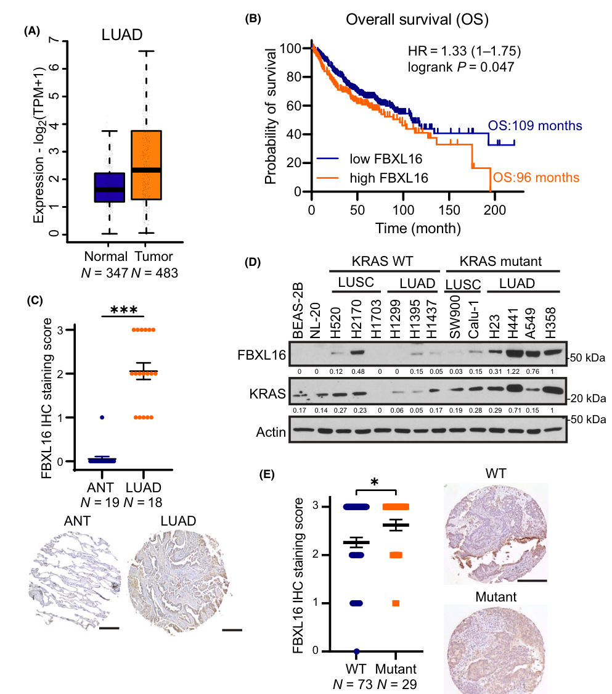
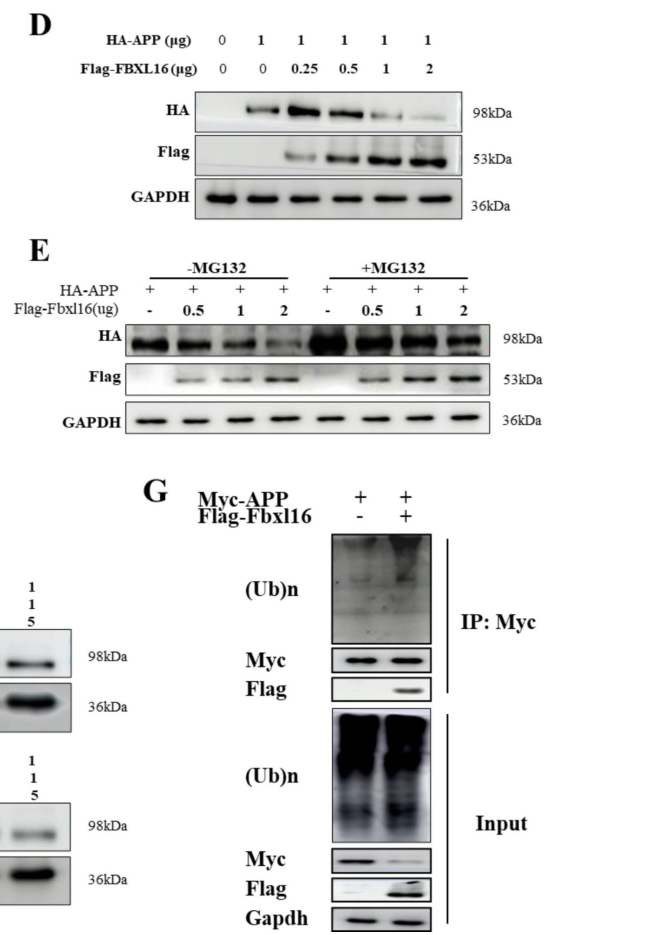

## Question

# Gene Research for Functional Annotation

## ⚠️ CRITICAL: Gene/Protein Identification Context

**BEFORE YOU BEGIN RESEARCH:** You MUST verify you are researching the CORRECT gene/protein. Gene symbols can be ambiguous, especially for less well-characterized genes from non-model organisms.

### Target Gene/Protein Identity (from UniProt):
- **UniProt Accession:** Q8N461
- **Protein Description:** RecName: Full=F-box/LRR-repeat protein 16; AltName: Full=F-box and leucine-rich repeat protein 16;
- **Gene Information:** Name=FBXL16; Synonyms=C16orf22, FBL16;
- **Organism (full):** Homo sapiens (Human).
- **Protein Family:** Not specified in UniProt
- **Key Domains:** F-box-like_dom_sf. (IPR036047); F-box_LRR-repeat. (IPR050648); FBXL15_LRR. (IPR057207); Leu-rich_rpt_Cys-con_subtyp. (IPR006553); LRR_dom_sf. (IPR032675)

### MANDATORY VERIFICATION STEPS:

1. **Check if the gene symbol "FBXL16" matches the protein description above**
2. **Verify the organism is correct:** Homo sapiens (Human).
3. **Check if protein family/domains align with what you find in literature**
4. **If you find literature for a DIFFERENT gene with the same or similar symbol, STOP**

### If Gene Symbol is Ambiguous or You Cannot Find Relevant Literature:

**DO NOT PROCEED WITH RESEARCH ON A DIFFERENT GENE.** Instead:
- State clearly: "The gene symbol 'FBXL16' is ambiguous or literature is limited for this specific protein"
- Explain what you found (e.g., "Found extensive literature on a different gene with the same symbol in a different organism")
- Describe the protein based ONLY on the UniProt information provided above
- Suggest that the protein function can be inferred from domain/family information

### Research Target:

Please provide a comprehensive research report on the gene **FBXL16** (gene ID: FBXL16, UniProt: Q8N461) in human.

The research report should be a detailed narrative explaining the function, biological processes, and localization of the gene product. Citations should be given for all claims.

You should prioritize authoritative reviews and primary scientific literature when conducting research. You can supplement
this with annotations you find in gene/protein databases, but these can be outdated or inaccurate.

We are specifically interested in the primary function of the gene - for enzymes, what reaction is catalyzed, and what is the substrate specificity? For transporters, what is the substrate? For structural proteins or adapters, what is the broader structural role? For signaling molecules, what is the role in the pathway.

We are interested in where in or outside the cell the gene product carries out its function.

We are also interested in the signaling or biochemical pathways in which the gene functions. We are less interested in broad pleiotropic effects, except where these elucidate the precise role.

Include evidence where possible. We are interested in both experimental evidence as well as inference from structure, evolution, or bioinformatic analysis. Precise studies should be prioritized over high-throughput, where available.

## Output

Question: You are an expert researcher providing comprehensive, well-cited information.

Provide detailed information focusing on:
1. Key concepts and definitions with current understanding
2. Recent developments and latest research (prioritize 2023-2024 sources)
3. Current applications and real-world implementations
4. Expert opinions and analysis from authoritative sources
5. Relevant statistics and data from recent studies

Format as a comprehensive research report with proper citations. Include URLs and publication dates where available.
Always prioritize recent, authoritative sources and provide specific citations for all major claims.

# Gene Research for Functional Annotation

## ⚠️ CRITICAL: Gene/Protein Identification Context

**BEFORE YOU BEGIN RESEARCH:** You MUST verify you are researching the CORRECT gene/protein. Gene symbols can be ambiguous, especially for less well-characterized genes from non-model organisms.

### Target Gene/Protein Identity (from UniProt):
- **UniProt Accession:** Q8N461
- **Protein Description:** RecName: Full=F-box/LRR-repeat protein 16; AltName: Full=F-box and leucine-rich repeat protein 16;
- **Gene Information:** Name=FBXL16; Synonyms=C16orf22, FBL16;
- **Organism (full):** Homo sapiens (Human).
- **Protein Family:** Not specified in UniProt
- **Key Domains:** F-box-like_dom_sf. (IPR036047); F-box_LRR-repeat. (IPR050648); FBXL15_LRR. (IPR057207); Leu-rich_rpt_Cys-con_subtyp. (IPR006553); LRR_dom_sf. (IPR032675)

### MANDATORY VERIFICATION STEPS:

1. **Check if the gene symbol "FBXL16" matches the protein description above**
2. **Verify the organism is correct:** Homo sapiens (Human).
3. **Check if protein family/domains align with what you find in literature**
4. **If you find literature for a DIFFERENT gene with the same or similar symbol, STOP**

### If Gene Symbol is Ambiguous or You Cannot Find Relevant Literature:

**DO NOT PROCEED WITH RESEARCH ON A DIFFERENT GENE.** Instead:
- State clearly: "The gene symbol 'FBXL16' is ambiguous or literature is limited for this specific protein"
- Explain what you found (e.g., "Found extensive literature on a different gene with the same symbol in a different organism")
- Describe the protein based ONLY on the UniProt information provided above
- Suggest that the protein function can be inferred from domain/family information

### Research Target:

Please provide a comprehensive research report on the gene **FBXL16** (gene ID: FBXL16, UniProt: Q8N461) in human.

The research report should be a detailed narrative explaining the function, biological processes, and localization of the gene product. Citations should be given for all claims.

You should prioritize authoritative reviews and primary scientific literature when conducting research. You can supplement
this with annotations you find in gene/protein databases, but these can be outdated or inaccurate.

We are specifically interested in the primary function of the gene - for enzymes, what reaction is catalyzed, and what is the substrate specificity? For transporters, what is the substrate? For structural proteins or adapters, what is the broader structural role? For signaling molecules, what is the role in the pathway.

We are interested in where in or outside the cell the gene product carries out its function.

We are also interested in the signaling or biochemical pathways in which the gene functions. We are less interested in broad pleiotropic effects, except where these elucidate the precise role.

Include evidence where possible. We are interested in both experimental evidence as well as inference from structure, evolution, or bioinformatic analysis. Precise studies should be prioritized over high-throughput, where available.

# Research report: FBXL16 (UniProt Q8N461; Homo sapiens)

## 0) Target verification (critical identity checks)
The literature summarized here is restricted to **human FBXL16**, an **F-box/LRR-repeat protein** matching UniProt **Q8N461** (also referenced as Q8N461/AlphaFold in the AD study), and not other similarly named F-box genes (e.g., FBXL6, FBXO16). Across the retrieved primary studies, the protein is consistently described as an **F-box protein with a C-terminal leucine-rich repeat (LRR) region** and implicated in ubiquitin–proteasome regulation, aligning with the UniProt description provided. (qu2024fbxl16anew pages 1-2, qu2024fbxl16anew pages 7-9)

## 1) Key concepts and definitions (current understanding)

### 1.1 What FBXL16 is (molecular class)
FBXL16 is generally described as an **F-box E3 ubiquitin ligase component** (or E3 regulator) bearing: (i) an **F-box motif** (classically mediating interaction with SKP1 in SCF complexes), and (ii) a **C-terminal LRR domain** used for substrate recognition; one report also describes an N-terminal proline-rich region. (qu2024fbxl16anew pages 1-2, shah2022fbxl16promotesbreast pages 110-114)

### 1.2 Canonical expectation vs. emerging non-canonical behavior
In canonical **SCF (SKP1–CUL1–F-box)** E3 ligases, the F-box protein recruits substrate while the CUL1/RBX1 module supports ubiquitin transfer. However, breast cancer-focused mechanistic work reports that FBXL16 can associate with **SKP1** yet shows **no detectable interaction with CUL1**, implying **non-canonical behavior** for an F-box protein and leaving the precise E3 architecture context-dependent or unresolved. (shah2022fbxl16promotesbreast pages 110-114, shah2022fbxl16promotesbreast pages 31-36)

### 1.3 Core functional theme from recent studies: bidirectional control of protein stability
Recent literature converges on FBXL16 as a regulator of **protein stability** with at least two modes:
- **Promoting ubiquitination and proteasomal degradation** of certain proteins (e.g., APP in AD models). (qu2024fbxl16anew pages 11-16, qu2024fbxl16anew media 3bf912ae)
- **Stabilizing** certain signaling proteins by increasing their half-life or decreasing their ubiquitination (e.g., IRS1 in KRAS-mutant LUAD; ERα in ER+ breast cancer). (morel2024fbxl16promotescell pages 7-9, morel2024fbxl16promotescell pages 10-11, shah2022fbxl16promotesbreast pages 7-10)

## 2) Recent developments and latest research (prioritizing 2023–2024)

### 2.1 2024—Alzheimer’s disease: FBXL16 drives ubiquitination-dependent APP degradation and improves cognition
**Study:** Qu et al., *Biomarker Research* (published **Nov 2024**). URL: https://doi.org/10.1186/s40364-024-00691-w (qu2024fbxl16anew pages 1-2)

**Key claims supported by experimental evidence:**
1. **FBXL16 promotes ubiquitination-dependent proteasomal degradation of APP.** Evidence includes co-immunoprecipitation and proteasome inhibition (MG132), cycloheximide (CHX) experiments, and direct ubiquitination readouts. (qu2024fbxl16anew pages 1-2, qu2024fbxl16anew pages 7-9, qu2024fbxl16anew media 3bf912ae)
2. **Cytoplasmic co-localization and binding:** FBXL16 and APP co-localize in the cytoplasm in neuronal cell models and co-immunoprecipitate (Flag-FBXL16 with Myc-APP). (qu2024fbxl16anew pages 7-9)
3. **In vivo functional outcomes:** Lentiviral hippocampal FBXL16 overexpression in 3×Tg AD mice is reported to **increase ubiquitination, decrease APP**, reduce neuroinflammation markers, and **improve cognition** in Morris water maze and Y-maze assays; conditional FBXL16 knockout worsens behavioral performance and increases APP levels. (qu2024fbxl16anew pages 11-16, qu2024fbxl16anew media 3bf912ae)

**Network/interactome insight:** Overexpression + Flag-IP LC–MS/MS identified **141 interacting proteins**, enriched for ubiquitin-dependent catabolic processes (reported enrichment p = 1.04E−09) and with links to cognition/aging traits in GAD analysis (reported p-values on the order of ~10−6). (qu2024fbxl16anew pages 7-9)

**Regulatory note:** The same work maps a core promoter region and reports transcriptional activation by **E2F1** via promoter assays. (qu2024fbxl16anew pages 7-9, qu2024fbxl16anew pages 11-16)

### 2.2 2024—KRAS-mutant lung adenocarcinoma: FBXL16 stabilizes IRS1 and promotes AKT signaling and drug resistance
**Study:** Morel & Long, *Molecular Oncology* (published **Jan 2024**). URL: https://doi.org/10.1002/1878-0261.13554 (morel2024fbxl16promotescell pages 7-9)

**Key mechanistic findings:**
1. **FBXL16 stabilizes IRS1 protein**, thereby enhancing **IGF1/IRS1/AKT signaling** outputs (pAKT, pS6K/pS6) and supporting growth/migration. (morel2024fbxl16promotescell pages 11-13, morel2024fbxl16promotescell pages 10-11)
2. **Protein half-life effect (CHX chase):**
   - In A549 cells, IRS1 half-life shifts from **~5.5 h (control)** to **~0.9 h (FBXL16 knockdown)**.
   - In NL-20 cells, IRS1 half-life shifts from **~1.8 h (control)** to **~8 h (FBXL16 overexpression)** (n = 3). (morel2024fbxl16promotescell pages 10-11)
3. **Domain requirement:** IRS1 interaction requires the **LRR domain**, and both **F-box and LRR domains** are necessary for IRS1 stabilization/signaling effects. (morel2024fbxl16promotescell pages 11-13)

**Quantitative clinical/statistical evidence:**
- **FBXL16–IRS1 correlation**: cell lines Pearson **r = 0.93**, **R² = 0.86**, **P < 0.001**; patient samples **N = 102**, **r = 0.6**, **R² = 0.36**, **P < 0.001**. (morel2024fbxl16promotescell pages 7-9)
- CPTAC comparison indicates IRS1 is upregulated in **KRAS-mutant** LUAD (KRAS WT N = 77 vs mutant N = 33). (morel2024fbxl16promotescell pages 7-9)

**Therapeutic relevance:** FBXL16 depletion increases sensitivity to the **KRASG12C inhibitor sotorasib** in resistant LUAD cells, consistent with reduced AKT pathway signaling upon combined treatment. (morel2024fbxl16promotescell pages 7-9)

**Visual corroboration:** The retrieved figure panels include expression/prognosis comparisons, IRS1 correlation, CHX stability assays, and AKT pathway signaling outputs. (morel2024fbxl16promotescell media f8a89b7d)

### 2.3 2024—COPD fibroblast biology: miR-1307-5p directly targets FBXL16 and promotes myofibroblast transdifferentiation
**Study:** Yao et al., *Respiratory Research* (published **Oct 2024**). URL: https://doi.org/10.1186/s12931-024-03007-6 (yao2024mir13075penhancesfibroblast pages 5-6)

**Key findings:**
- **miR-1307-5p is increased** in COPD blood and lung tissues (reported n = 6 per group) and in primary fibroblasts from COPD patients; TGF-β induces miR-1307-5p in MRC-5 fibroblasts and miR-1307-5p enhances fibroblast activation/transdifferentiation marker expression. (yao2024mir13075penhancesfibroblast pages 5-6)
- **FBXL16 is a direct miR-1307-5p target**: in silico prediction finds two seed matches in the FBXL16 3′UTR; miR-1307-5p suppresses FBXL16 mRNA and represses WT (but not mutant) FBXL16 3′UTR luciferase reporters, supporting direct targeting. (yao2024mir13075penhancesfibroblast pages 5-6)
- In smoke-exposed mice, miR-1307-5p overexpression worsens inflammatory cell infiltration and lung pathology/dysfunction. (yao2024mir13075penhancesfibroblast pages 5-6)

**Interpretation:** In this COPD model, FBXL16 is positioned functionally as part of an FBXL16/HIF1α axis (per study framing), with strong evidence for upstream miRNA repression of FBXL16 and downstream fibroblast activation phenotypes. (yao2024mir13075penhancesfibroblast pages 5-6)

## 3) Current applications and real-world implementations

### 3.1 Oncology: biomarker and combination-therapy target in KRAS-mutant LUAD
The LUAD study explicitly argues that FBXL16 may be a **therapeutic target** in KRAS-mutant lung adenocarcinoma, motivated by (i) selective upregulation in KRAS-mutant disease, (ii) functional dependence of growth/migration on FBXL16, and (iii) enhanced response to **sotorasib** when FBXL16 is depleted, consistent with overcoming PI3K/AKT-mediated resistance. (morel2024fbxl16promotescell pages 7-9, morel2024fbxl16promotescell media f8a89b7d)

**Real-world implementation angle:** These findings support FBXL16 as a candidate node for **combination strategies** (KRASG12C inhibitor + FBXL16 pathway blockade), and as a potential biomarker aligned with IRS1/AKT pathway activation (noting strong FBXL16–IRS1 correlation in patient samples). (morel2024fbxl16promotescell pages 7-9)

### 3.2 Neurodegeneration: UPS activation strategy focused on APP burden
In AD models, FBXL16 overexpression is used as a **functional intervention** (lentiviral hippocampal overexpression) that reduces APP and neuroinflammation with improved cognitive outcomes, positioning FBXL16 as a potential upstream lever in “activate UPS to dismantle disease-related proteins” strategies. (qu2024fbxl16anew pages 1-2, qu2024fbxl16anew pages 11-16, qu2024fbxl16anew media 3bf912ae)

### 3.3 Pulmonary disease: miRNA–FBXL16 axis as a mechanistic and therapeutic handle
The COPD study supports a plausible translational path in which modulation of **miR-1307-5p** (or protecting FBXL16 from miRNA repression) could alter fibroblast activation programs relevant to airway remodeling. (yao2024mir13075penhancesfibroblast pages 5-6)

## 4) Expert opinions and analysis (authoritative interpretations in retrieved sources)

### 4.1 FBXL16 appears context-dependent: degrader in one system, stabilizer in another
A key synthesis across studies is that FBXL16 does not behave as a simple “always-degrade” substrate receptor. Instead:
- In AD models, FBXL16 promotes ubiquitination and proteasomal degradation of **APP**. (qu2024fbxl16anew pages 11-16, qu2024fbxl16anew media 3bf912ae)
- In KRAS-mutant LUAD, FBXL16 increases IRS1 stability (increasing half-life and sustaining signaling), which is functionally pro-oncogenic and pro-resistance. (morel2024fbxl16promotescell pages 7-9, morel2024fbxl16promotescell pages 10-11)
- In ER+ breast cancer, FBXL16 is presented as a positive regulator of **ERα stability** and endocrine resistance (via reduced ubiquitination), and also reported to stabilize oncoproteins such as c-MYC and β-catenin in related contexts. (shah2022fbxl16promotesbreast pages 7-10, shah2022fbxl16promotesbreast pages 31-36)

A coherent mechanistic hypothesis (supported indirectly by the above) is that FBXL16 may act either as (i) a substrate receptor that promotes ubiquitination and degradation for some targets, or (ii) a competitor/antagonist/modulator of other ubiquitin ligases for other targets, thereby **stabilizing** them. The breast cancer work explicitly highlights uncertainty around canonical SCF assembly due to lack of detectable CUL1 interaction, reinforcing that **FBXL16’s E3 context may be non-canonical**. (shah2022fbxl16promotesbreast pages 110-114, shah2022fbxl16promotesbreast pages 31-36)

### 4.2 Subcellular localization and where FBXL16 acts
Direct localization evidence in the retrieved set includes **cytoplasmic co-localization of FBXL16 with APP** in neuronal cell models, consistent with cytoplasmic engagement of APP for ubiquitination and turnover. (qu2024fbxl16anew pages 7-9)

## 5) Relevant statistics and data highlights (from recent studies)

### 5.1 LUAD (Morel & Long 2024)
- FBXL16–IRS1 protein correlation: **cell lines r = 0.93 (R² = 0.86, P < 0.001)**; **patients N = 102 r = 0.6 (R² = 0.36, P < 0.001)**. (morel2024fbxl16promotescell pages 7-9)
- IRS1 half-life shifts with FBXL16 perturbation: **5.5 h → 0.9 h** (A549; knockdown) and **1.8 h → 8 h** (NL-20; overexpression), n = 3. (morel2024fbxl16promotescell pages 10-11)
- Visual panels substantiate expression/prognosis and pathway readouts. (morel2024fbxl16promotescell media f8a89b7d)

### 5.2 AD (Qu et al. 2024)
- Proteomics: **141** FBXL16-associated proteins identified; GO enrichment for ubiquitin-dependent protein catabolic process reported at **p = 1.04E−09**; cognition/aging trait enrichment at ~10−6 in GAD analysis. (qu2024fbxl16anew pages 7-9)
- In vivo: behavioral improvements and biochemical changes are reported as significant (*P*<0.05; *P*<0.01) under FBXL16 overexpression relative to controls; conditional knockout worsens behavioral performance and increases APP. (qu2024fbxl16anew pages 11-16, qu2024fbxl16anew media 3bf912ae)

### 5.3 COPD (Yao et al. 2024)
- Human sample size for miR-1307-5p elevation: **n = 6/group** (blood/lung tissues). (yao2024mir13075penhancesfibroblast pages 5-6)
- Direct targeting: WT vs mutant 3′UTR luciferase supports miR-1307-5p → FBXL16 regulation; statistical framework uses t-test/ANOVA with **p < 0.05 / p < 0.01** thresholds. (yao2024mir13075penhancesfibroblast pages 5-6)

## Summary of experimentally supported functional annotation
FBXL16 (Q8N461) is best annotated, based on the recent experimental literature retrieved here, as a **protein-stability regulator linked to the ubiquitin–proteasome system**, with evidence for both:
- **E3-like substrate degradation** (APP degradation in Alzheimer’s models), and
- **stabilization of signaling regulators** (IRS1 in KRAS-mutant LUAD; ERα in ER+ breast cancer),
with functional consequences across **neurodegeneration, cancer growth/drug resistance, and fibroblast activation in COPD**. (qu2024fbxl16anew pages 11-16, morel2024fbxl16promotescell pages 7-9, shah2022fbxl16promotesbreast pages 7-10, yao2024mir13075penhancesfibroblast pages 5-6)

## Evidence table
The following table consolidates substrates, contexts, evidence types, and quantitative highlights.

| Study (author, year, journal) | Disease/biological context | Proposed FBXL16 action (stabilizes vs degrades) | Direct target(s)/partner(s) | Key evidence types | Quantitative/statistical highlights | URL/DOI | Publication date (month/year) |
|---|---|---|---|---|---|---|---|
| Qu et al., 2024, *Biomarker Research* | Alzheimer’s disease; APP/PSEN and 3×Tg-AD mouse models; neuronal cell lines | Promotes ubiquitination-dependent **degradation** of APP | APP; broader interactome included 141 FBXL16-associated proteins, with proteomics highlighting USP17 family members, HSPA5, PSMD4, PRDX1/2, VIM, TXN, CTSD, LTF (qu2024fbxl16anew pages 7-9, qu2024fbxl16anew pages 1-2) | Flag-FBXL16 IP followed by LC-MS/MS; molecular docking; cytoplasmic colocalization; co-IP of FBXL16 with APP; MG132 and CHX assays; ubiquitination assay; stereotaxic lentiviral overexpression in hippocampus; IHC/ICC; Morris water maze and Y-maze; conditional knockout mice (qu2024fbxl16anew pages 7-9, qu2024fbxl16anew pages 2-4, qu2024fbxl16anew pages 11-16, qu2024fbxl16anew media 3bf912ae) | 141 interacting proteins identified; STRING/GO enrichment for ubiquitin-dependent protein catabolic process *p*=1.04E-09; GAD enrichment for cognition/aging 1.49E-06 and 1.56E-06; docking lowest-energy pose −41.228 kcal/mol; APP decreased dose-dependently with FBXL16 overexpression; behavioral and histologic improvements reported with *P*<0.05 or *P*<0.01 vs controls; APP levels significantly higher in FBXL16-cko mice (qu2024fbxl16anew pages 7-9, qu2024fbxl16anew pages 11-16, qu2024fbxl16anew media 3bf912ae) | https://doi.org/10.1186/s40364-024-00691-w | Nov 2024 |
| Morel & Long, 2024, *Molecular Oncology* | KRAS-mutant lung adenocarcinoma; drug resistance to sotorasib | **Stabilizes** IRS1 and upregulates IRS1/AKT signaling | IRS1; signaling outputs pAKT and pS6K/S6; IRS1 interaction requires LRR domain and both F-box/LRR needed for stabilization/signaling (morel2024fbxl16promotescell pages 7-9, morel2024fbxl16promotescell pages 11-13) | siRNA knockdown; stable overexpression; proteomic mass spectrometry; CHX chase; western blotting; soft-agar transformation; TMA/IHC; CPTAC data mining; growth and migration assays; drug-sensitivity assays with sotorasib (morel2024fbxl16promotescell pages 7-9, morel2024fbxl16promotescell pages 11-13, morel2024fbxl16promotescell pages 10-11, morel2024fbxl16promotescell media f8a89b7d) | FBXL16 vs IRS1 correlation in LUAD cell lines: *r*=0.93, *R*²=0.86, *P*<0.001; in LUAD patient samples (*N*=102): *r*=0.6, *R*²=0.36, *P*<0.001; IRS1 upregulated in KRAS-mutant CPTAC LUAD (KRAS WT *N*=77 vs mutant *N*=33); IRS1 half-life in A549 changed from 5.5 h to 0.9 h after FBXL16 knockdown; in NL-20 from 1.8 h to 8 h with FBXL16 overexpression; overexpression increased IRS1 half-life 4.4-fold; significance annotated as *P*<0.05, **P*<0.01, ***P*<0.001 (morel2024fbxl16promotescell pages 7-9, morel2024fbxl16promotescell pages 10-11, morel2024fbxl16promotescell media f8a89b7d) | https://doi.org/10.1002/1878-0261.13554 | Jan 2024 |
| Yao et al., 2024, *Respiratory Research* | COPD; fibroblast transdifferentiation/myofibroblast activation; cigarette smoke mouse model | FBXL16 is functionally **suppressed** by miR-1307-5p; reduced FBXL16 permits HIF1α-axis activation and fibroblast transdifferentiation | FBXL16 as a direct miR-1307-5p target; study title and abstract place FBXL16 in an FBXL16/HIF1α axis, but gathered evidence here directly supports miRNA→FBXL16 targeting rather than a direct FBXL16–HIF1α binding assay (yao2024mir13075penhancesfibroblast pages 5-6) | In silico seed prediction; luciferase reporter with WT vs mutant FBXL16 3′UTR; qPCR in MRC-5 cells; primary fibroblasts from COPD patients; chronic cigarette smoke mouse experiments; BALF inflammatory-cell analysis; lung pathology and pulmonary function readouts (yao2024mir13075penhancesfibroblast pages 5-6) | miR-1307-5p increased in COPD blood and lung tissues (*n*=6/group) and in COPD-derived primary lung fibroblasts; two seed matches predicted in FBXL16 3′UTR; miR-1307-5p agomir significantly repressed FBXL16 mRNA and WT 3′UTR luciferase but not mutant reporter; statistical framework reported as *t*-test/ANOVA with *P*<0.05 and *P*<0.01 thresholds (yao2024mir13075penhancesfibroblast pages 5-6) | https://doi.org/10.1186/s12931-024-03007-6 | Oct 2024 |
| Shah, 2022, journal not specified in gathered evidence | ER-positive breast cancer; fulvestrant response; endocrine resistance | **Stabilizes** ERα by decreasing polyubiquitination and antagonizing degradation; also reported to stabilize c-MYC, SRC-3, β-catenin; separate reported context suggests degradation of HIF1α in TNBC, but mechanism unresolved | ERα; FBXO45 antagonized in estradiol-induced ERα degradation; broader reported oncoproteins c-MYC, SRC-3, β-catenin; F-box motif mediates SKP1 interaction, but no detectable CUL1 interaction in gathered evidence (shah2022fbxl16promotesbreast pages 31-36, shah2022fbxl16promotesbreast pages 7-10, shah2022fbxl16promotesbreast pages 110-114, shah2022fbxl16promotesbreast pages 1-7) | Correlative tumor expression analyses; knockdown and overexpression; ERα half-life/stability assays; ubiquitination assays; ERE-luciferase transcription assay; evaluation of ERα S118 phosphorylation; fulvestrant-sensitivity experiments; mutant ERα-Y537S studies (shah2022fbxl16promotesbreast pages 7-10, shah2022fbxl16promotesbreast pages 36-43, shah2022fbxl16promotesbreast pages 1-7) | FBXL16 altered in ~14% of invasive breast carcinomas and ~9% of lung adenocarcinomas; FBXL16 mRNA significantly higher in ER+ luminal A/B tumors vs normal tissue (one-way ANOVA *p*<0.01); silencing reduced ERα protein and phospho-S118 and increased fulvestrant responsiveness; no additional numeric effect sizes available in gathered evidence (shah2022fbxl16promotesbreast pages 31-36, shah2022fbxl16promotesbreast pages 110-114, shah2022fbxl16promotesbreast pages 36-43) | URL/DOI not available in gathered evidence | 2022 |

*Table: This table summarizes experimentally supported FBXL16 actions, targets, and methods across the studies retrieved in this chat. It highlights where evidence is strongest for substrate degradation or stabilization, and where conclusions remain more indirect.*

References

1. (qu2024fbxl16anew pages 1-2): Liqun Qu, Yong Tang, Jianhui Wu, Xiaoyun Yun, Hang Hong Lo, Linlin Song, Xingxia Wang, Huimiao Wang, Ruilong Zhang, Menghan Liu, Cairen Wang, Jerome P. L. Ng, Xianjun Fu, Io Nam Wong, Vincent Kam Wai Wong, and Betty Yuen Kwan Law. Fbxl16: a new regulator of neuroinflammation and cognition in alzheimer’s disease through the ubiquitination-dependent degradation of amyloid precursor protein. Biomarker Research, Nov 2024. URL: https://doi.org/10.1186/s40364-024-00691-w, doi:10.1186/s40364-024-00691-w. This article has 14 citations and is from a peer-reviewed journal.

2. (qu2024fbxl16anew pages 7-9): Liqun Qu, Yong Tang, Jianhui Wu, Xiaoyun Yun, Hang Hong Lo, Linlin Song, Xingxia Wang, Huimiao Wang, Ruilong Zhang, Menghan Liu, Cairen Wang, Jerome P. L. Ng, Xianjun Fu, Io Nam Wong, Vincent Kam Wai Wong, and Betty Yuen Kwan Law. Fbxl16: a new regulator of neuroinflammation and cognition in alzheimer’s disease through the ubiquitination-dependent degradation of amyloid precursor protein. Biomarker Research, Nov 2024. URL: https://doi.org/10.1186/s40364-024-00691-w, doi:10.1186/s40364-024-00691-w. This article has 14 citations and is from a peer-reviewed journal.

3. (shah2022fbxl16promotesbreast pages 110-114): KN Shah. Fbxl16 promotes breast cancer cell growth and diminishes fulvestrant responsiveness by stabilizing erα protein. Unknown journal, 2022.

4. (shah2022fbxl16promotesbreast pages 31-36): KN Shah. Fbxl16 promotes breast cancer cell growth and diminishes fulvestrant responsiveness by stabilizing erα protein. Unknown journal, 2022.

5. (qu2024fbxl16anew pages 11-16): Liqun Qu, Yong Tang, Jianhui Wu, Xiaoyun Yun, Hang Hong Lo, Linlin Song, Xingxia Wang, Huimiao Wang, Ruilong Zhang, Menghan Liu, Cairen Wang, Jerome P. L. Ng, Xianjun Fu, Io Nam Wong, Vincent Kam Wai Wong, and Betty Yuen Kwan Law. Fbxl16: a new regulator of neuroinflammation and cognition in alzheimer’s disease through the ubiquitination-dependent degradation of amyloid precursor protein. Biomarker Research, Nov 2024. URL: https://doi.org/10.1186/s40364-024-00691-w, doi:10.1186/s40364-024-00691-w. This article has 14 citations and is from a peer-reviewed journal.

6. (qu2024fbxl16anew media 3bf912ae): Liqun Qu, Yong Tang, Jianhui Wu, Xiaoyun Yun, Hang Hong Lo, Linlin Song, Xingxia Wang, Huimiao Wang, Ruilong Zhang, Menghan Liu, Cairen Wang, Jerome P. L. Ng, Xianjun Fu, Io Nam Wong, Vincent Kam Wai Wong, and Betty Yuen Kwan Law. Fbxl16: a new regulator of neuroinflammation and cognition in alzheimer’s disease through the ubiquitination-dependent degradation of amyloid precursor protein. Biomarker Research, Nov 2024. URL: https://doi.org/10.1186/s40364-024-00691-w, doi:10.1186/s40364-024-00691-w. This article has 14 citations and is from a peer-reviewed journal.

7. (morel2024fbxl16promotescell pages 7-9): Marion Morel and Weiwen Long. <scp>fbxl16</scp> promotes cell growth and drug resistance in lung adenocarcinomas with <i>kras</i> mutation by stabilizing <scp>irs1</scp> and upregulating <scp>irs1</scp>/<scp>akt</scp> signaling. Molecular Oncology, 18:762-777, Jan 2024. URL: https://doi.org/10.1002/1878-0261.13554, doi:10.1002/1878-0261.13554. This article has 11 citations and is from a peer-reviewed journal.

8. (morel2024fbxl16promotescell pages 10-11): Marion Morel and Weiwen Long. <scp>fbxl16</scp> promotes cell growth and drug resistance in lung adenocarcinomas with <i>kras</i> mutation by stabilizing <scp>irs1</scp> and upregulating <scp>irs1</scp>/<scp>akt</scp> signaling. Molecular Oncology, 18:762-777, Jan 2024. URL: https://doi.org/10.1002/1878-0261.13554, doi:10.1002/1878-0261.13554. This article has 11 citations and is from a peer-reviewed journal.

9. (shah2022fbxl16promotesbreast pages 7-10): KN Shah. Fbxl16 promotes breast cancer cell growth and diminishes fulvestrant responsiveness by stabilizing erα protein. Unknown journal, 2022.

10. (morel2024fbxl16promotescell pages 11-13): Marion Morel and Weiwen Long. <scp>fbxl16</scp> promotes cell growth and drug resistance in lung adenocarcinomas with <i>kras</i> mutation by stabilizing <scp>irs1</scp> and upregulating <scp>irs1</scp>/<scp>akt</scp> signaling. Molecular Oncology, 18:762-777, Jan 2024. URL: https://doi.org/10.1002/1878-0261.13554, doi:10.1002/1878-0261.13554. This article has 11 citations and is from a peer-reviewed journal.

11. (morel2024fbxl16promotescell media f8a89b7d): Marion Morel and Weiwen Long. <scp>fbxl16</scp> promotes cell growth and drug resistance in lung adenocarcinomas with <i>kras</i> mutation by stabilizing <scp>irs1</scp> and upregulating <scp>irs1</scp>/<scp>akt</scp> signaling. Molecular Oncology, 18:762-777, Jan 2024. URL: https://doi.org/10.1002/1878-0261.13554, doi:10.1002/1878-0261.13554. This article has 11 citations and is from a peer-reviewed journal.

12. (yao2024mir13075penhancesfibroblast pages 5-6): Li-peng Yao, Zheng-kai Wang, Xin-qing Jiang, Beier Jiang, Si-jia Chen, Zhi-dan Hua, Dan-dan Gao, Quan Zheng, Sheng-mei Zhu, Mao-xiang Qian, Feng Zhang, Li-feng Xu, Cheng-shui Chen, and Fang Lu. Mir-1307-5p enhances fibroblast transdifferentiation to exacerbate chronic obstructive pulmonary disease through regulating fbxl16/hif1α axis. Respiratory Research, Oct 2024. URL: https://doi.org/10.1186/s12931-024-03007-6, doi:10.1186/s12931-024-03007-6. This article has 5 citations and is from a domain leading peer-reviewed journal.

13. (qu2024fbxl16anew pages 2-4): Liqun Qu, Yong Tang, Jianhui Wu, Xiaoyun Yun, Hang Hong Lo, Linlin Song, Xingxia Wang, Huimiao Wang, Ruilong Zhang, Menghan Liu, Cairen Wang, Jerome P. L. Ng, Xianjun Fu, Io Nam Wong, Vincent Kam Wai Wong, and Betty Yuen Kwan Law. Fbxl16: a new regulator of neuroinflammation and cognition in alzheimer’s disease through the ubiquitination-dependent degradation of amyloid precursor protein. Biomarker Research, Nov 2024. URL: https://doi.org/10.1186/s40364-024-00691-w, doi:10.1186/s40364-024-00691-w. This article has 14 citations and is from a peer-reviewed journal.

14. (shah2022fbxl16promotesbreast pages 1-7): KN Shah. Fbxl16 promotes breast cancer cell growth and diminishes fulvestrant responsiveness by stabilizing erα protein. Unknown journal, 2022.

15. (shah2022fbxl16promotesbreast pages 36-43): KN Shah. Fbxl16 promotes breast cancer cell growth and diminishes fulvestrant responsiveness by stabilizing erα protein. Unknown journal, 2022.

## Artifacts

- [Edison artifact artifact-00](FBXL16-deep-research-falcon_artifacts/artifact-00.md)

## Citations

1. https://doi.org/10.1186/s40364-024-00691-w
2. https://doi.org/10.1002/1878-0261.13554
3. https://doi.org/10.1186/s12931-024-03007-6
4. https://doi.org/10.1186/s40364-024-00691-w,
5. https://doi.org/10.1002/1878-0261.13554,
6. https://doi.org/10.1186/s12931-024-03007-6,