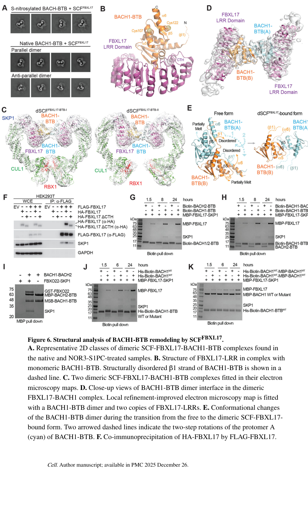

## Question

# Gene Research for Functional Annotation

## ⚠️ CRITICAL: Gene/Protein Identification Context

**BEFORE YOU BEGIN RESEARCH:** You MUST verify you are researching the CORRECT gene/protein. Gene symbols can be ambiguous, especially for less well-characterized genes from non-model organisms.

### Target Gene/Protein Identity (from UniProt):
- **UniProt Accession:** Q9UF56
- **Protein Description:** RecName: Full=F-box/LRR-repeat protein 17 {ECO:0000303|PubMed:24035498}; AltName: Full=F-box and leucine-rich repeat protein 17 {ECO:0000305}; AltName: Full=F-box only protein 13 {ECO:0000250|UniProtKB:Q9QZN1};
- **Gene Information:** Name=FBXL17 {ECO:0000303|PubMed:24035498, ECO:0000312|HGNC:HGNC:13615}; Synonyms=FBL17 {ECO:0000312|HGNC:HGNC:13615}, FBX13 {ECO:0000250|UniProtKB:Q9QZN1}, FBXO13 {ECO:0000312|HGNC:HGNC:13615};
- **Organism (full):** Homo sapiens (Human).
- **Protein Family:** Belongs to the FBXL17 family. .
- **Key Domains:** F-box-like_dom_sf. (IPR036047); F-box_dom. (IPR001810); F-box_LRR-repeat. (IPR050648); FBXL15_LRR. (IPR057207); Leu-rich_rpt. (IPR001611)

### MANDATORY VERIFICATION STEPS:

1. **Check if the gene symbol "FBXL17" matches the protein description above**
2. **Verify the organism is correct:** Homo sapiens (Human).
3. **Check if protein family/domains align with what you find in literature**
4. **If you find literature for a DIFFERENT gene with the same or similar symbol, STOP**

### If Gene Symbol is Ambiguous or You Cannot Find Relevant Literature:

**DO NOT PROCEED WITH RESEARCH ON A DIFFERENT GENE.** Instead:
- State clearly: "The gene symbol 'FBXL17' is ambiguous or literature is limited for this specific protein"
- Explain what you found (e.g., "Found extensive literature on a different gene with the same symbol in a different organism")
- Describe the protein based ONLY on the UniProt information provided above
- Suggest that the protein function can be inferred from domain/family information

### Research Target:

Please provide a comprehensive research report on the gene **FBXL17** (gene ID: FBXL17, UniProt: Q9UF56) in human.

The research report should be a detailed narrative explaining the function, biological processes, and localization of the gene product. Citations should be given for all claims.

You should prioritize authoritative reviews and primary scientific literature when conducting research. You can supplement
this with annotations you find in gene/protein databases, but these can be outdated or inaccurate.

We are specifically interested in the primary function of the gene - for enzymes, what reaction is catalyzed, and what is the substrate specificity? For transporters, what is the substrate? For structural proteins or adapters, what is the broader structural role? For signaling molecules, what is the role in the pathway.

We are interested in where in or outside the cell the gene product carries out its function.

We are also interested in the signaling or biochemical pathways in which the gene functions. We are less interested in broad pleiotropic effects, except where these elucidate the precise role.

Include evidence where possible. We are interested in both experimental evidence as well as inference from structure, evolution, or bioinformatic analysis. Precise studies should be prioritized over high-throughput, where available.

## Output

Question: You are an expert researcher providing comprehensive, well-cited information.

Provide detailed information focusing on:
1. Key concepts and definitions with current understanding
2. Recent developments and latest research (prioritize 2023-2024 sources)
3. Current applications and real-world implementations
4. Expert opinions and analysis from authoritative sources
5. Relevant statistics and data from recent studies

Format as a comprehensive research report with proper citations. Include URLs and publication dates where available.
Always prioritize recent, authoritative sources and provide specific citations for all major claims.

# Gene Research for Functional Annotation

## ⚠️ CRITICAL: Gene/Protein Identification Context

**BEFORE YOU BEGIN RESEARCH:** You MUST verify you are researching the CORRECT gene/protein. Gene symbols can be ambiguous, especially for less well-characterized genes from non-model organisms.

### Target Gene/Protein Identity (from UniProt):
- **UniProt Accession:** Q9UF56
- **Protein Description:** RecName: Full=F-box/LRR-repeat protein 17 {ECO:0000303|PubMed:24035498}; AltName: Full=F-box and leucine-rich repeat protein 17 {ECO:0000305}; AltName: Full=F-box only protein 13 {ECO:0000250|UniProtKB:Q9QZN1};
- **Gene Information:** Name=FBXL17 {ECO:0000303|PubMed:24035498, ECO:0000312|HGNC:HGNC:13615}; Synonyms=FBL17 {ECO:0000312|HGNC:HGNC:13615}, FBX13 {ECO:0000250|UniProtKB:Q9QZN1}, FBXO13 {ECO:0000312|HGNC:HGNC:13615};
- **Organism (full):** Homo sapiens (Human).
- **Protein Family:** Belongs to the FBXL17 family. .
- **Key Domains:** F-box-like_dom_sf. (IPR036047); F-box_dom. (IPR001810); F-box_LRR-repeat. (IPR050648); FBXL15_LRR. (IPR057207); Leu-rich_rpt. (IPR001611)

### MANDATORY VERIFICATION STEPS:

1. **Check if the gene symbol "FBXL17" matches the protein description above**
2. **Verify the organism is correct:** Homo sapiens (Human).
3. **Check if protein family/domains align with what you find in literature**
4. **If you find literature for a DIFFERENT gene with the same or similar symbol, STOP**

### If Gene Symbol is Ambiguous or You Cannot Find Relevant Literature:

**DO NOT PROCEED WITH RESEARCH ON A DIFFERENT GENE.** Instead:
- State clearly: "The gene symbol 'FBXL17' is ambiguous or literature is limited for this specific protein"
- Explain what you found (e.g., "Found extensive literature on a different gene with the same symbol in a different organism")
- Describe the protein based ONLY on the UniProt information provided above
- Suggest that the protein function can be inferred from domain/family information

### Research Target:

Please provide a comprehensive research report on the gene **FBXL17** (gene ID: FBXL17, UniProt: Q9UF56) in human.

The research report should be a detailed narrative explaining the function, biological processes, and localization of the gene product. Citations should be given for all claims.

You should prioritize authoritative reviews and primary scientific literature when conducting research. You can supplement
this with annotations you find in gene/protein databases, but these can be outdated or inaccurate.

We are specifically interested in the primary function of the gene - for enzymes, what reaction is catalyzed, and what is the substrate specificity? For transporters, what is the substrate? For structural proteins or adapters, what is the broader structural role? For signaling molecules, what is the role in the pathway.

We are interested in where in or outside the cell the gene product carries out its function.

We are also interested in the signaling or biochemical pathways in which the gene functions. We are less interested in broad pleiotropic effects, except where these elucidate the precise role.

Include evidence where possible. We are interested in both experimental evidence as well as inference from structure, evolution, or bioinformatic analysis. Precise studies should be prioritized over high-throughput, where available.

# Research Report: Human **FBXL17** (UniProt **Q9UF56**) — Functional Annotation and Current Understanding

## 1. Target verification (identity, domains, and family)

**Gene/protein verified:** The literature summarized here addresses **human FBXL17 (F-box and leucine-rich repeat protein 17)**, consistent with UniProt accession **Q9UF56**, an **SCF (SKP1–CUL1–RBX1) cullin-RING E3 ubiquitin ligase** substrate receptor/adaptor. FBXL17 contains an **F-box domain** (binds SKP1 and enables SCF assembly) and a **C-terminal leucine-rich repeat (LRR) region** (substrate-binding). Experimental studies demonstrate that FBXL17 assembles with SCF subunits and that truncations in the LRR region disrupt SCF subunit association and E3 activity. (mason2020fbxl17isrearranged pages 6-7, mason2020fbxl17isrearranged pages 4-6)

**Subcellular distribution (baseline):** FBXL17 is predominantly **nuclear**, but is also detectable in **cytoplasmic fractions**; immunofluorescence of transfected constructs showed mainly nuclear staining with weaker cytoplasmic signal. (mason2020fbxl17isrearranged pages 6-7)

## 2. Key concepts and definitions (current understanding)

### 2.1 SCF E3 ubiquitin ligases and F-box proteins
**SCF complexes** are modular ubiquitin ligases consisting of a **cullin scaffold (CUL1)**, **RBX1** (recruits E2~ubiquitin), **SKP1**, and an **F-box substrate receptor** that provides specificity by binding substrates and bringing them to the catalytic core. In this paradigm, **FBXL17 is the substrate receptor** that helps determine which proteins are ubiquitinated and often targeted for proteasomal degradation. (raducu2016scf(fbxl17)ubiquitylation pages 1-2, raducu2016scf(fbxl17)ubiquitylation pages 2-3)

### 2.2 Degrons and post-translational modification (PTM)-gated recognition
A **degron** is a substrate feature recognized by an E3 ligase that triggers ubiquitination. A central recent theme for FBXL17 is **non-canonical degron recognition**, including:

* **Quaternary-structure degrons**: degrons created by higher-order assemblies (e.g., dimer interfaces), rather than linear motifs. BACH1’s BTB homodimer can encode such degrons that are decoded by F-box proteins. (cao2024recognitionofbach1 pages 42-45, cao2024recognitionofbach1 pages 1-3)
* **PTM-gated degrons**: PTMs can create or strengthen E3 recognition determinants. For example, PRMT1 acetylation at **K228** promotes FBXL17 binding and degradation. (najar2024theinterplayof pages 11-15, najar2024theinterplayof pages 15-17)

## 3. Experimentally validated molecular functions, substrates/partners, pathways, and localization

### 3.1 **Hedgehog signaling via SUFU ubiquitination (nuclear)**
**Core function:** FBXL17 forms a functional SCF complex and targets the Hedgehog pathway tumor suppressor **SUFU (Suppressor of fused)** for **proteolysis in the nucleus**, enabling release/activation of GLI transcription factors and Hedgehog signal transduction. (raducu2016scf(fbxl17)ubiquitylation pages 1-2)

**Evidence and quantitative data:** FBXL17 co-immunoprecipitates with SKP1/CUL1 and specifically interacts with SUFU among screened F-box proteins; LC-MS/MS from FBXL17 IPs identified SUFU (Mascot score 112; emPAI 0.27) alongside SCF components, with BACH1 also detected (Mascot score 59; emPAI 0.04). (raducu2016scf(fbxl17)ubiquitylation pages 2-3)

**Mechanistic detail (sites):** One analysis summarized SUFU ubiquitination at **Lys257** and regulation by SUFU phosphorylation state (dephosphorylation at **S342/S346** favoring polyubiquitination), consistent with a regulated nuclear turnover model. (mason2020functionalanalysisof pages 45-49)

**Functional consequence (disease model):** FBXL17 depletion led to defective Hedgehog signaling and impaired proliferation and medulloblastoma tumor growth in model systems, supporting a functional FBXL17–SUFU axis in Hedgehog-driven tumor biology. (raducu2016scf(fbxl17)ubiquitylation pages 1-2)

**Publication details:** Raducu et al., *The EMBO Journal*, **May 2016**. URL: https://doi.org/10.15252/embj.201593374 (raducu2016scf(fbxl17)ubiquitylation pages 1-2)

### 3.2 **Oxidative stress / NRF2 transcriptional response via BACH1 turnover**

#### 3.2.1 Foundational mechanism (2013): FBXL17 promotes BACH1 turnover and NRF2 activation
**Core function:** FBXL17 promotes ubiquitination and proteasome-dependent turnover of **BACH1**, a transcriptional repressor whose degradation permits NRF2-driven activation of oxidative stress genes such as **HMOX1**. (tan2013parallelscfadaptor pages 12-14)

**Quantitative data:**
* Hemin-induced **HMOX1 transcript induction** is typically **25–35-fold**; depletion of FBXL17 reduced this induction to **<10-fold** (noting incomplete knockdown with ~20% FBXL17 mRNA remaining). (tan2013parallelscfadaptor pages 12-14)
* In a hydrogen peroxide time course, control cells showed ~**40% decrease** in BACH1 after 30 min, whereas FBXL17 depletion produced a **~2-fold increase** in BACH1; FBXL17 depletion also produced a **~3-fold increase** in ROS after H2O2 priming. (tan2013parallelscfadaptor pages 12-14)

**Publication details:** Tan et al., *Molecular Cell*, **Oct 2013**. URL: https://doi.org/10.1016/j.molcel.2013.08.018 (tan2013parallelscfadaptor pages 12-14)

#### 3.2.2 Major 2024 advance: quaternary-structure degrons and remodeling/monomerization mechanism
**Key concept:** A major 2024 mechanistic advance is that the **BACH1 BTB homodimer encodes quaternary-structure degrons** and is surveilled by distinct SCF ligases. Under oxidative/nitrosative stress, **FBXL17 can recognize a compromised/destabilized BTB dimer and remodel it into monomers** that are ubiquitinated. (cao2024recognitionofbach1 pages 42-45, cao2024recognitionofbach1 pages 1-3)

**Mechanistic details:**
* The Cell 2024 work describes a **β1–α6 cross-protomer degron** in BACH1 BTB recognized by FBXO22 when the BTB dimer is intact; when BTB integrity is compromised (e.g., oxidation/S-nitrosylation), FBXL17 transiently engages the weakened dimer and remodels it into a stably bound monomer for ubiquitination. (cao2024recognitionofbach1 pages 42-45)
* Biophysical/structural evidence includes SEC-MALS complex formation with MBP-FBXL17–SKP1 and BACH1-BTB and cryo-EM visualization of FBXL17-LRR bound to monomeric BACH1-BTB and dimeric SCF-FBXL17–BACH1 complexes. (cao2024recognitionofbach1 pages 35-42, cao2024recognitionofbach1 pages 45-47)

**Data availability (expert-useful resources):** The Cell 2024 paper reports deposition of multiple relevant structures (e.g., PDB entries for FBXL17 complexes including **8UAH, 8UBT, 8UBU, 8UBV**) and associated EM maps and proteomics/HDX-MS datasets. (cao2024recognitionofbach1 pages 45-47)

**Publication details:** Cao et al., *Cell*, **Dec 2024**. URL: https://doi.org/10.1016/j.cell.2024.10.012 (cao2024recognitionofbach1 pages 1-3)

**Visual evidence (from Cell 2024):** Figures depicting the FBXL17-driven remodeling mechanism and pathway model were retrieved from the paper. (cao2024recognitionofbach1 media ec0b2e4d, cao2024recognitionofbach1 media adac7532, cao2024recognitionofbach1 media 611fb043, cao2024recognitionofbach1 media 25687a82)

### 3.3 **PRMT1 homeostasis via an acetylation-dependent FBXL17 “acetyl-degron” (2024)**

**Core finding:** PRMT1 is regulated by SCF(FBXL17) such that **p300-mediated acetylation at PRMT1 K228** promotes FBXL17 binding, **K48-linked polyubiquitination**, and proteasomal degradation. (najar2024theinterplayof pages 11-15, najar2024theinterplayof pages 15-17)

**Evidence:**
* FBXL17 interacts with PRMT1 (co-IP and MS); FBXL17 overexpression lowers endogenous PRMT1, and FBXL17 knockout extends PRMT1 half-life and reduces PRMT1 ubiquitination. (najar2024theinterplayof pages 11-15)
* Site specificity: acetylation at **K228** (not K233) increases FBXL17 interaction and accelerates PRMT1 degradation; K228Q (acetyl-mimic) strongly enhances ubiquitination and lowers half-life, while K228R stabilizes PRMT1. (najar2024theinterplayof pages 11-15)
* A genetic code expansion strategy was used to site-specifically incorporate authentic acetyl-lysine at K228, strengthening mechanistic inference that acetylation itself can be causal for degradation. (najar2024theinterplayof pages 15-17)

**Publication details:** Najar et al., *bioRxiv* preprint, **June 18, 2024**. URL: https://doi.org/10.1101/2024.06.18.599616 (najar2024theinterplayof pages 1-3)

### 3.4 **Neuronal microtubule regulation via SPAST (spastin) turnover; hereditary spastic paraplegia (HSP) context (2022)**

**Core finding:** In neuronal models, SCF(FBXL17) targets **SPAST-M1** (long spastin isoform) for **proteasome-dependent degradation in the nuclear fraction**, with substrate recognition mediated by the **SPAST N-terminal BTB domain**. (kang2022fbxl17spastinaxisas pages 1-2, kang2022fbxl17spastinaxisas pages 7-9)

**Localization:** Endogenous FBXL17 is mainly nuclear; SPAST is distributed in cytoplasm and nucleus and colocalizes with FBXL17 in nuclear compartments. Polyubiquitinated SPAST-M1 was observed only in the nuclear fraction in fractionation experiments. (kang2022fbxl17spastinaxisas pages 9-11)

**Mechanistic details and quantitative elements:**
* FBXL17 expression reduces SPAST-M1 protein without changing mRNA; CHX chase suggests SPAST-M1 half-life decreases from **>4 h to ~3 h** with FBXL17 expression (approximate values from text). (kang2022fbxl17spastinaxisas pages 9-11)
* A key ubiquitination site was implicated: **SPAST K554R** strongly reduced polyubiquitination. (kang2022fbxl17spastinaxisas pages 7-9)
* Modulation by CK2 phosphorylation: SPAST-M1 phosphorylation occurs in cytoplasm; CK2 perturbation affects ubiquitination/stability, with phosphomimetic mutants showing markedly increased stability and reduced ubiquitination. (kang2022fbxl17spastinaxisas pages 11-13)

**Translational implication:** Pharmacologic inhibition of cullin neddylation (MLN4924) or FBXL17 knockdown increased SPAST levels and was reported to improve neuronal phenotypes (axonal/neurite extension; rescue in 3D differentiation models), framing the **FBXL17/SPAST axis** as a potential therapeutic target in HSP models. (kang2022fbxl17spastinaxisas pages 1-2, kang2022fbxl17spastinaxisas pages 13-15)

**Publication details:** Kang et al., *Cell & Bioscience*, **July 2022**. URL: https://doi.org/10.1186/s13578-022-00851-1 (kang2022fbxl17spastinaxisas pages 1-2)

### 3.5 **Protein interaction and metabolic regulation: UAP1 and O-GlcNAcylation (2020)**

**Core findings:** A yeast two-hybrid screen identified **UAP1** as a frequent FBXL17 interactor; cellular assays supported direct binding. Knockdown of FBXL17 increased global **O-GlcNAcylation** in breast cancer cells, and a proposed mechanism is that FBXL17 binding to UAP1 protects UAP1 from inhibitory phosphorylation, maintaining UAP1 activity rather than targeting it for degradation. (mason2020thefbxlfamily pages 9-10, mason2020fbxl17isrearranged pages 6-7)

**Domain dependence and interaction mapping:** UAP1 binding was mapped to the LRR region (e.g., LRR2–8 sufficient for UAP1 binding in one mapping), and LRR truncation disrupted binding. (mason2020fbxl17isrearranged pages 6-7)

**Publication details:** Mason et al., *Cellular and Molecular Life Sciences*, **Sep 2020**. URL: https://doi.org/10.1007/s00018-019-03306-y (mason2020fbxl17isrearranged pages 6-7)

## 4. Recent developments (2023–2024 prioritized)

### 4.1 2024: Structural mechanism for BACH1 quaternary-structure degrons (high impact)
The most substantial recent advance is the **Cell (Dec 2024)** study detailing how FBXL17 decodes oxidative-stress-altered BACH1 BTB assemblies via **remodeling/monomerization**, supported by cryo-EM and complementary biophysical methods, and accompanied by deposition of structural models and proteomics datasets. (cao2024recognitionofbach1 pages 1-3, cao2024recognitionofbach1 pages 45-47)

### 4.2 2024: PTM-gated substrate control via PRMT1 acetylation
The 2024 preprint establishes a detailed model in which **p300-dependent acetylation at PRMT1 K228** acts as an acetyl-degron recognized by FBXL17, linking acetylation to K48 ubiquitination and turnover with extensive genetic and biochemical support. (najar2024theinterplayof pages 11-15, najar2024theinterplayof pages 15-17)

### 4.3 2024: Human genetics association signals (emerging; not mechanistic proof)
A Mendelian randomization analysis of circadian rhythm–related genes reported associations implicating **FBXL17** among candidates related to ulcerative colitis comorbidity with primary sclerosing cholangitis, suggesting possible broader disease relevance (requires mechanistic follow-up). (goretzki2024structuralbasisof pages 1-4)

## 5. Current applications and real-world implementations

### 5.1 Cancer biology: pathway leverage points
* **Hedgehog-driven cancers / medulloblastoma:** The FBXL17–SUFU axis provides a mechanistic lever on GLI activation and proliferation/tumor growth phenotypes in medulloblastoma models, highlighting FBXL17 as a potential pathway-modulating target (though no FBXL17-directed therapeutics are established in the cited primary evidence). (raducu2016scf(fbxl17)ubiquitylation pages 1-2)
* **Oxidative stress response and metastasis biology:** Because BACH1 promotes metastasis when aberrantly accumulated, the 2024 structural work explicitly highlights **therapeutic opportunities to destabilize BACH1** via understanding ligase recognition and degron mechanisms involving FBXL17 (conceptual/early-stage). (cao2024recognitionofbach1 pages 42-45)

### 5.2 Neurobiology: modulation of SCF/CRL activity in HSP models
In HSP-relevant cellular models, **inhibiting cullin neddylation** (MLN4924) and/or downregulating FBXL17 increased SPAST levels and improved neuronal phenotypes (axonal extension/differentiation readouts), representing a concrete experimental “implementation” of pathway modulation. (kang2022fbxl17spastinaxisas pages 1-2, kang2022fbxl17spastinaxisas pages 13-15)

### 5.3 Biomarker/target hypotheses from genetics databases
Open Targets lists multiple disease associations for FBXL17 (e.g., post-traumatic stress disorder, neurotic disorder, smoking initiation), based on aggregated evidence; these should be treated as hypothesis-generating signals rather than direct functional annotation. (OpenTargets Search: -FBXL17)

## 6. Expert opinions and authoritative synthesis

A focused review of the FBXL family emphasizes that FBXL proteins share LRR-based recognition but can have distinct interactomes and regulatory features; for FBXL17, the review highlights **non-degradative functional regulation of UAP1** and discusses predicted additional N-terminal structural features and potential phosphorylation-based regulation. (mason2020thefbxlfamily pages 9-10)

The 2013 Molecular Cell study and the 2024 Cell study (both high-authority sources for mechanistic cell biology) together support the view that FBXL17 is not merely a generic turnover factor but a **specialized adaptor that can decode complex substrate states**, including higher-order assemblies and oxidative/nitrosative stress-induced conformations, making FBXL17 a component of “protein quality control”-like pathways focused on specific transcription factor families. (tan2013parallelscfadaptor pages 12-14, cao2024recognitionofbach1 pages 42-45)

## 7. Statistics and data highlights (from cited studies)

* **BACH1/NRF2 axis:** Hemin induces **HMOX1 25–35×**, reduced to **<10×** with FBXL17 depletion; BACH1 decreases **~40%** after 30 min H2O2 in controls but increases **~2×** with FBXL17 depletion; FBXL17 depletion yields **~3×** ROS increase after H2O2 priming. (tan2013parallelscfadaptor pages 12-14)
* **SUFU interaction proteomics:** SUFU detected in FBXL17 IP LC-MS/MS with Mascot score **112** (emPAI **0.27**); FBXL17 itself Mascot score **33624** (emPAI **178.17**). (raducu2016scf(fbxl17)ubiquitylation pages 2-3)
* **SCF assembly defects in cancer-associated truncations (CMLS 2020):** LRR truncations reduced CUL1 binding by **81–82%** and SKP1 binding by **67–77%** with strong statistical support (p-values ~10^-4 to 10^-6; n=4–5). (mason2020fbxl17isrearranged pages 4-6)
* **SPAST turnover:** FBXL17 expression reduced SPAST-M1 half-life (approx. **>4 h to ~3 h**) and identified a major ubiquitination site (**K554**). (kang2022fbxl17spastinaxisas pages 9-11, kang2022fbxl17spastinaxisas pages 7-9)

## 8. Practical functional annotation summary (best-supported)

**Primary molecular role:** FBXL17 is an **SCF E3 ubiquitin ligase substrate receptor** that recruits specific substrates—often nuclear regulators—for ubiquitination, frequently leading to **proteasomal degradation** (e.g., SUFU, BACH1, PRMT1, SPAST-M1). (raducu2016scf(fbxl17)ubiquitylation pages 1-2, tan2013parallelscfadaptor pages 12-14, najar2024theinterplayof pages 11-15, kang2022fbxl17spastinaxisas pages 1-2)

**Key biological processes/pathways:**
1. **Hedgehog signaling** via nuclear SUFU turnover and GLI activation (tumor biology relevance). (raducu2016scf(fbxl17)ubiquitylation pages 1-2)
2. **Oxidative stress response/NRF2 signaling** via BACH1 turnover, including advanced recognition of oxidative/nitrosative stress-altered BTB assemblies. (tan2013parallelscfadaptor pages 12-14, cao2024recognitionofbach1 pages 42-45)
3. **Protein homeostasis via PTM-gated degradation** (PRMT1 acetyl-degron). (najar2024theinterplayof pages 11-15)
4. **Neuronal microtubule/axon biology** via SPAST-M1 turnover; HSP disease-model relevance. (kang2022fbxl17spastinaxisas pages 1-2)
5. **Metabolic/PTM regulation** via UAP1 interaction and global O-GlcNAcylation changes. (mason2020thefbxlfamily pages 9-10, mason2020fbxl17isrearranged pages 6-7)

**Subcellular localization (where function is carried out):** Strong evidence supports **nuclear FBXL17 activity** for SUFU, BACH1, and SPAST-M1 degradation/ubiquitination; FBXL17 is mainly nuclear but also present in cytoplasmic fractions. (raducu2016scf(fbxl17)ubiquitylation pages 1-2, kang2022fbxl17spastinaxisas pages 9-11, mason2020fbxl17isrearranged pages 6-7)

## 9. Limitations and open questions

* **Substrate scope is incomplete:** FBXL17 likely has additional substrates beyond those validated here; proteomic approaches suggest broader interactomes, but high-confidence, mechanism-resolved substrates remain limited. (tan2013parallelscfadaptor pages 12-14, mason2020fbxl17isrearranged pages 6-7)
* **Degron “rules” are still being defined:** While quaternary-structure degrons (BACH1 BTB) and PTM-gated recognition (PRMT1 K228 acetylation) are now supported, generalizable motifs for FBXL17 are not yet established from the cited evidence. (cao2024recognitionofbach1 pages 42-45, najar2024theinterplayof pages 11-15)
* **Translational readiness:** Therapeutic concepts are emerging (e.g., BACH1 destabilization strategies; CRL inhibition in neuronal models), but FBXL17-specific inhibitors/clinical implementations were not identified in the retrieved evidence. (cao2024recognitionofbach1 pages 42-45, kang2022fbxl17spastinaxisas pages 1-2)

---

## Key references (URLs and dates)

1. Tan MKM et al. *Molecular Cell* (**Oct 2013**): https://doi.org/10.1016/j.molcel.2013.08.018 (tan2013parallelscfadaptor pages 12-14)
2. Raducu M et al. *The EMBO Journal* (**May 2016**): https://doi.org/10.15252/embj.201593374 (raducu2016scf(fbxl17)ubiquitylation pages 1-2)
3. Mason B et al. *Cellular and Molecular Life Sciences* (**Sep 2020**): https://doi.org/10.1007/s00018-019-03306-y (mason2020fbxl17isrearranged pages 6-7)
4. Mason B, Laman H. *Open Biology* (**Nov 2020**): https://doi.org/10.1098/rsob.200319 (mason2020thefbxlfamily pages 9-10)
5. Kang HM et al. *Cell & Bioscience* (**Jul 2022**): https://doi.org/10.1186/s13578-022-00851-1 (kang2022fbxl17spastinaxisas pages 1-2)
6. Cao S et al. *Cell* (**Dec 2024**): https://doi.org/10.1016/j.cell.2024.10.012 (cao2024recognitionofbach1 pages 1-3)
7. Najar MA et al. *bioRxiv* (**Jun 18, 2024**): https://doi.org/10.1101/2024.06.18.599616 (najar2024theinterplayof pages 1-3)

References

1. (mason2020fbxl17isrearranged pages 6-7): Bethany Mason, Susanne Flach, Felipe R Teixeira, Raquel Manzano Garcia, Oscar M Rueda, Jean E Abraham, Carlos Caldas, Paul AW Edwards, and Heike Laman. Fbxl17 is rearranged in breast cancer and loss of its activity leads to increased global o-glcnacylation. Cellular and Molecular Life Sciences: CMLS, 77:2605-2620, Sep 2020. URL: https://doi.org/10.1007/s00018-019-03306-y, doi:10.1007/s00018-019-03306-y. This article has 14 citations.

2. (mason2020fbxl17isrearranged pages 4-6): Bethany Mason, Susanne Flach, Felipe R Teixeira, Raquel Manzano Garcia, Oscar M Rueda, Jean E Abraham, Carlos Caldas, Paul AW Edwards, and Heike Laman. Fbxl17 is rearranged in breast cancer and loss of its activity leads to increased global o-glcnacylation. Cellular and Molecular Life Sciences: CMLS, 77:2605-2620, Sep 2020. URL: https://doi.org/10.1007/s00018-019-03306-y, doi:10.1007/s00018-019-03306-y. This article has 14 citations.

3. (raducu2016scf(fbxl17)ubiquitylation pages 1-2): Madalina Raducu, Ella Fung, Sébastien Serres, Paola Infante, Alessandro Barberis, Roman Fischer, Claire Bristow, Marie‐Laëtitia Thézénas, Csaba Finta, John C Christianson, Francesca M Buffa, Benedikt M Kessler, Nicola R Sibson, Lucia Di Marcotullio, Rune Toftgård, and Vincenzo D'Angiolella. Scf (fbxl17) ubiquitylation of sufu regulates hedgehog signaling and medulloblastoma development. The EMBO Journal, 35:1400-1416, May 2016. URL: https://doi.org/10.15252/embj.201593374, doi:10.15252/embj.201593374. This article has 80 citations.

4. (raducu2016scf(fbxl17)ubiquitylation pages 2-3): Madalina Raducu, Ella Fung, Sébastien Serres, Paola Infante, Alessandro Barberis, Roman Fischer, Claire Bristow, Marie‐Laëtitia Thézénas, Csaba Finta, John C Christianson, Francesca M Buffa, Benedikt M Kessler, Nicola R Sibson, Lucia Di Marcotullio, Rune Toftgård, and Vincenzo D'Angiolella. Scf (fbxl17) ubiquitylation of sufu regulates hedgehog signaling and medulloblastoma development. The EMBO Journal, 35:1400-1416, May 2016. URL: https://doi.org/10.15252/embj.201593374, doi:10.15252/embj.201593374. This article has 80 citations.

5. (cao2024recognitionofbach1 pages 42-45): Shiyun Cao, Sheena Faye Garcia, Huigang Shi, Ellie I James, Yuki Kito, Huigang Shi, Haibin Mao, Sharon Kaisari, G. Róna, Sophia Deng, Hailey V. Goldberg, Jackeline Ponce, Beatrix M. Ueberheide, Luca Lignitto, Miklos Guttman, Michele Pagano, and Ning Zheng. Recognition of bach1 quaternary structure degrons by two f-box proteins under oxidative stress. Dec 2024. URL: https://doi.org/10.1016/j.cell.2024.10.012, doi:10.1016/j.cell.2024.10.012. This article has 40 citations and is from a highest quality peer-reviewed journal.

6. (cao2024recognitionofbach1 pages 1-3): Shiyun Cao, Sheena Faye Garcia, Huigang Shi, Ellie I James, Yuki Kito, Huigang Shi, Haibin Mao, Sharon Kaisari, G. Róna, Sophia Deng, Hailey V. Goldberg, Jackeline Ponce, Beatrix M. Ueberheide, Luca Lignitto, Miklos Guttman, Michele Pagano, and Ning Zheng. Recognition of bach1 quaternary structure degrons by two f-box proteins under oxidative stress. Dec 2024. URL: https://doi.org/10.1016/j.cell.2024.10.012, doi:10.1016/j.cell.2024.10.012. This article has 40 citations and is from a highest quality peer-reviewed journal.

7. (najar2024theinterplayof pages 11-15): Mohd. Altaf Najar, Jenna N. Beyer, Callie E. W. Crawford, and George M. Burslem. The interplay of acetylation and ubiquitination controls prmt1 homeostasis. bioRxiv, Jun 2024. URL: https://doi.org/10.1101/2024.06.18.599616, doi:10.1101/2024.06.18.599616. This article has 3 citations.

8. (najar2024theinterplayof pages 15-17): Mohd. Altaf Najar, Jenna N. Beyer, Callie E. W. Crawford, and George M. Burslem. The interplay of acetylation and ubiquitination controls prmt1 homeostasis. bioRxiv, Jun 2024. URL: https://doi.org/10.1101/2024.06.18.599616, doi:10.1101/2024.06.18.599616. This article has 3 citations.

9. (mason2020functionalanalysisof pages 45-49): Bethany Jane Mason. Functional analysis of the f-box protein fbxl17. ArXiv, Apr 2020. URL: https://doi.org/10.17863/cam.51955, doi:10.17863/cam.51955. This article has 0 citations.

10. (tan2013parallelscfadaptor pages 12-14): Meng-Kwang Marcus Tan, Hui-Jun Lim, Eric J. Bennett, Yang Shi, and J. Wade Harper. Parallel scf adaptor capture proteomics reveals a role for scffbxl17 in nrf2 activation via bach1 repressor turnover. Molecular cell, 52 1:9-24, Oct 2013. URL: https://doi.org/10.1016/j.molcel.2013.08.018, doi:10.1016/j.molcel.2013.08.018. This article has 141 citations and is from a highest quality peer-reviewed journal.

11. (cao2024recognitionofbach1 pages 35-42): Shiyun Cao, Sheena Faye Garcia, Huigang Shi, Ellie I James, Yuki Kito, Huigang Shi, Haibin Mao, Sharon Kaisari, G. Róna, Sophia Deng, Hailey V. Goldberg, Jackeline Ponce, Beatrix M. Ueberheide, Luca Lignitto, Miklos Guttman, Michele Pagano, and Ning Zheng. Recognition of bach1 quaternary structure degrons by two f-box proteins under oxidative stress. Dec 2024. URL: https://doi.org/10.1016/j.cell.2024.10.012, doi:10.1016/j.cell.2024.10.012. This article has 40 citations and is from a highest quality peer-reviewed journal.

12. (cao2024recognitionofbach1 pages 45-47): Shiyun Cao, Sheena Faye Garcia, Huigang Shi, Ellie I James, Yuki Kito, Huigang Shi, Haibin Mao, Sharon Kaisari, G. Róna, Sophia Deng, Hailey V. Goldberg, Jackeline Ponce, Beatrix M. Ueberheide, Luca Lignitto, Miklos Guttman, Michele Pagano, and Ning Zheng. Recognition of bach1 quaternary structure degrons by two f-box proteins under oxidative stress. Dec 2024. URL: https://doi.org/10.1016/j.cell.2024.10.012, doi:10.1016/j.cell.2024.10.012. This article has 40 citations and is from a highest quality peer-reviewed journal.

13. (cao2024recognitionofbach1 media ec0b2e4d): Shiyun Cao, Sheena Faye Garcia, Huigang Shi, Ellie I James, Yuki Kito, Huigang Shi, Haibin Mao, Sharon Kaisari, G. Róna, Sophia Deng, Hailey V. Goldberg, Jackeline Ponce, Beatrix M. Ueberheide, Luca Lignitto, Miklos Guttman, Michele Pagano, and Ning Zheng. Recognition of bach1 quaternary structure degrons by two f-box proteins under oxidative stress. Dec 2024. URL: https://doi.org/10.1016/j.cell.2024.10.012, doi:10.1016/j.cell.2024.10.012. This article has 40 citations and is from a highest quality peer-reviewed journal.

14. (cao2024recognitionofbach1 media adac7532): Shiyun Cao, Sheena Faye Garcia, Huigang Shi, Ellie I James, Yuki Kito, Huigang Shi, Haibin Mao, Sharon Kaisari, G. Róna, Sophia Deng, Hailey V. Goldberg, Jackeline Ponce, Beatrix M. Ueberheide, Luca Lignitto, Miklos Guttman, Michele Pagano, and Ning Zheng. Recognition of bach1 quaternary structure degrons by two f-box proteins under oxidative stress. Dec 2024. URL: https://doi.org/10.1016/j.cell.2024.10.012, doi:10.1016/j.cell.2024.10.012. This article has 40 citations and is from a highest quality peer-reviewed journal.

15. (cao2024recognitionofbach1 media 611fb043): Shiyun Cao, Sheena Faye Garcia, Huigang Shi, Ellie I James, Yuki Kito, Huigang Shi, Haibin Mao, Sharon Kaisari, G. Róna, Sophia Deng, Hailey V. Goldberg, Jackeline Ponce, Beatrix M. Ueberheide, Luca Lignitto, Miklos Guttman, Michele Pagano, and Ning Zheng. Recognition of bach1 quaternary structure degrons by two f-box proteins under oxidative stress. Dec 2024. URL: https://doi.org/10.1016/j.cell.2024.10.012, doi:10.1016/j.cell.2024.10.012. This article has 40 citations and is from a highest quality peer-reviewed journal.

16. (cao2024recognitionofbach1 media 25687a82): Shiyun Cao, Sheena Faye Garcia, Huigang Shi, Ellie I James, Yuki Kito, Huigang Shi, Haibin Mao, Sharon Kaisari, G. Róna, Sophia Deng, Hailey V. Goldberg, Jackeline Ponce, Beatrix M. Ueberheide, Luca Lignitto, Miklos Guttman, Michele Pagano, and Ning Zheng. Recognition of bach1 quaternary structure degrons by two f-box proteins under oxidative stress. Dec 2024. URL: https://doi.org/10.1016/j.cell.2024.10.012, doi:10.1016/j.cell.2024.10.012. This article has 40 citations and is from a highest quality peer-reviewed journal.

17. (najar2024theinterplayof pages 1-3): Mohd. Altaf Najar, Jenna N. Beyer, Callie E. W. Crawford, and George M. Burslem. The interplay of acetylation and ubiquitination controls prmt1 homeostasis. bioRxiv, Jun 2024. URL: https://doi.org/10.1101/2024.06.18.599616, doi:10.1101/2024.06.18.599616. This article has 3 citations.

18. (kang2022fbxl17spastinaxisas pages 1-2): Hyun Mi Kang, Dae Hun Kim, Mijin Kim, Yoohong Min, Bohyeon Jeong, Kyung Hee Noh, Da Yong Lee, Hyun-Soo Cho, Nam-Soon Kim, Cho-Rok Jung, and Jung Hwa Lim. Fbxl17/spastin axis as a novel therapeutic target of hereditary spastic paraplegia. Cell & Bioscience, Jul 2022. URL: https://doi.org/10.1186/s13578-022-00851-1, doi:10.1186/s13578-022-00851-1. This article has 10 citations and is from a peer-reviewed journal.

19. (kang2022fbxl17spastinaxisas pages 7-9): Hyun Mi Kang, Dae Hun Kim, Mijin Kim, Yoohong Min, Bohyeon Jeong, Kyung Hee Noh, Da Yong Lee, Hyun-Soo Cho, Nam-Soon Kim, Cho-Rok Jung, and Jung Hwa Lim. Fbxl17/spastin axis as a novel therapeutic target of hereditary spastic paraplegia. Cell & Bioscience, Jul 2022. URL: https://doi.org/10.1186/s13578-022-00851-1, doi:10.1186/s13578-022-00851-1. This article has 10 citations and is from a peer-reviewed journal.

20. (kang2022fbxl17spastinaxisas pages 9-11): Hyun Mi Kang, Dae Hun Kim, Mijin Kim, Yoohong Min, Bohyeon Jeong, Kyung Hee Noh, Da Yong Lee, Hyun-Soo Cho, Nam-Soon Kim, Cho-Rok Jung, and Jung Hwa Lim. Fbxl17/spastin axis as a novel therapeutic target of hereditary spastic paraplegia. Cell & Bioscience, Jul 2022. URL: https://doi.org/10.1186/s13578-022-00851-1, doi:10.1186/s13578-022-00851-1. This article has 10 citations and is from a peer-reviewed journal.

21. (kang2022fbxl17spastinaxisas pages 11-13): Hyun Mi Kang, Dae Hun Kim, Mijin Kim, Yoohong Min, Bohyeon Jeong, Kyung Hee Noh, Da Yong Lee, Hyun-Soo Cho, Nam-Soon Kim, Cho-Rok Jung, and Jung Hwa Lim. Fbxl17/spastin axis as a novel therapeutic target of hereditary spastic paraplegia. Cell & Bioscience, Jul 2022. URL: https://doi.org/10.1186/s13578-022-00851-1, doi:10.1186/s13578-022-00851-1. This article has 10 citations and is from a peer-reviewed journal.

22. (kang2022fbxl17spastinaxisas pages 13-15): Hyun Mi Kang, Dae Hun Kim, Mijin Kim, Yoohong Min, Bohyeon Jeong, Kyung Hee Noh, Da Yong Lee, Hyun-Soo Cho, Nam-Soon Kim, Cho-Rok Jung, and Jung Hwa Lim. Fbxl17/spastin axis as a novel therapeutic target of hereditary spastic paraplegia. Cell & Bioscience, Jul 2022. URL: https://doi.org/10.1186/s13578-022-00851-1, doi:10.1186/s13578-022-00851-1. This article has 10 citations and is from a peer-reviewed journal.

23. (mason2020thefbxlfamily pages 9-10): Bethany Mason and Heike Laman. The fbxl family of f-box proteins: variations on a theme. Nov 2020. URL: https://doi.org/10.1098/rsob.200319, doi:10.1098/rsob.200319. This article has 51 citations and is from a peer-reviewed journal.

24. (goretzki2024structuralbasisof pages 1-4): Benedikt Goretzki, Maryam Khoshouei, Patrick Penner, Christine Stephan, Dayana Argoti, Nele Dierlamm, Jimena Maria Rada, Sandra Kapps, Zacharias Thiel, Merve Mutlu, David Furkert, Catrin Swantje Müller, Felix Freuler, Simon Haenni, Laurent Tenaillon, Britta Knapp, Alexandra Hinniger, Philipp Hoppe, Sascha Gutmann, Grigory Ryzhakov, Enrico Schmidt, Mario Iurlaro, and César Fernández. Structural basis of dual bach1 regulation by scffbxo22 and scffbxl17. bioRxiv, Jun 2024. URL: https://doi.org/10.1101/2024.06.03.596960, doi:10.1101/2024.06.03.596960. This article has 0 citations.

25. (OpenTargets Search: -FBXL17): Open Targets Query (-FBXL17, 5 results). Buniello, A. et al. (2025). Open Targets Platform: facilitating therapeutic hypotheses building in drug discovery. Nucleic Acids Research.

## Artifacts

## Citations

1. mason2020functionalanalysisof pages 45-49
2. tan2013parallelscfadaptor pages 12-14
3. najar2024theinterplayof pages 11-15
4. najar2024theinterplayof pages 15-17
5. najar2024theinterplayof pages 1-3
6. goretzki2024structuralbasisof pages 1-4
7. mason2020thefbxlfamily pages 9-10
8. https://doi.org/10.15252/embj.201593374
9. https://doi.org/10.1016/j.molcel.2013.08.018
10. https://doi.org/10.1016/j.cell.2024.10.012
11. https://doi.org/10.1101/2024.06.18.599616
12. https://doi.org/10.1186/s13578-022-00851-1
13. https://doi.org/10.1007/s00018-019-03306-y
14. https://doi.org/10.1098/rsob.200319
15. https://doi.org/10.1007/s00018-019-03306-y,
16. https://doi.org/10.15252/embj.201593374,
17. https://doi.org/10.1016/j.cell.2024.10.012,
18. https://doi.org/10.1101/2024.06.18.599616,
19. https://doi.org/10.17863/cam.51955,
20. https://doi.org/10.1016/j.molcel.2013.08.018,
21. https://doi.org/10.1186/s13578-022-00851-1,
22. https://doi.org/10.1098/rsob.200319,
23. https://doi.org/10.1101/2024.06.03.596960,