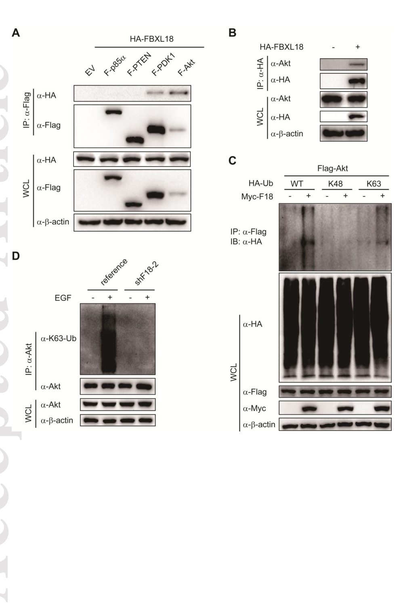

## Question

# Gene Research for Functional Annotation

## ⚠️ CRITICAL: Gene/Protein Identification Context

**BEFORE YOU BEGIN RESEARCH:** You MUST verify you are researching the CORRECT gene/protein. Gene symbols can be ambiguous, especially for less well-characterized genes from non-model organisms.

### Target Gene/Protein Identity (from UniProt):
- **UniProt Accession:** Q96ME1
- **Protein Description:** RecName: Full=F-box/LRR-repeat protein 18; AltName: Full=F-box and leucine-rich repeat protein 18;
- **Gene Information:** Name=FBXL18; Synonyms=FBL18;
- **Organism (full):** Homo sapiens (Human).
- **Protein Family:** Not specified in UniProt
- **Key Domains:** F-box-like_dom_sf. (IPR036047); F-box_dom. (IPR001810); FBXL18_F-box. (IPR047948); FBXL18_LRR. (IPR045627); LRR_dom_sf. (IPR032675)

### MANDATORY VERIFICATION STEPS:

1. **Check if the gene symbol "FBXL18" matches the protein description above**
2. **Verify the organism is correct:** Homo sapiens (Human).
3. **Check if protein family/domains align with what you find in literature**
4. **If you find literature for a DIFFERENT gene with the same or similar symbol, STOP**

### If Gene Symbol is Ambiguous or You Cannot Find Relevant Literature:

**DO NOT PROCEED WITH RESEARCH ON A DIFFERENT GENE.** Instead:
- State clearly: "The gene symbol 'FBXL18' is ambiguous or literature is limited for this specific protein"
- Explain what you found (e.g., "Found extensive literature on a different gene with the same symbol in a different organism")
- Describe the protein based ONLY on the UniProt information provided above
- Suggest that the protein function can be inferred from domain/family information

### Research Target:

Please provide a comprehensive research report on the gene **FBXL18** (gene ID: FBXL18, UniProt: Q96ME1) in human.

The research report should be a detailed narrative explaining the function, biological processes, and localization of the gene product. Citations should be given for all claims.

You should prioritize authoritative reviews and primary scientific literature when conducting research. You can supplement
this with annotations you find in gene/protein databases, but these can be outdated or inaccurate.

We are specifically interested in the primary function of the gene - for enzymes, what reaction is catalyzed, and what is the substrate specificity? For transporters, what is the substrate? For structural proteins or adapters, what is the broader structural role? For signaling molecules, what is the role in the pathway.

We are interested in where in or outside the cell the gene product carries out its function.

We are also interested in the signaling or biochemical pathways in which the gene functions. We are less interested in broad pleiotropic effects, except where these elucidate the precise role.

Include evidence where possible. We are interested in both experimental evidence as well as inference from structure, evolution, or bioinformatic analysis. Precise studies should be prioritized over high-throughput, where available.

## Output

Question: You are an expert researcher providing comprehensive, well-cited information.

Provide detailed information focusing on:
1. Key concepts and definitions with current understanding
2. Recent developments and latest research (prioritize 2023-2024 sources)
3. Current applications and real-world implementations
4. Expert opinions and analysis from authoritative sources
5. Relevant statistics and data from recent studies

Format as a comprehensive research report with proper citations. Include URLs and publication dates where available.
Always prioritize recent, authoritative sources and provide specific citations for all major claims.

# Gene Research for Functional Annotation

## ⚠️ CRITICAL: Gene/Protein Identification Context

**BEFORE YOU BEGIN RESEARCH:** You MUST verify you are researching the CORRECT gene/protein. Gene symbols can be ambiguous, especially for less well-characterized genes from non-model organisms.

### Target Gene/Protein Identity (from UniProt):
- **UniProt Accession:** Q96ME1
- **Protein Description:** RecName: Full=F-box/LRR-repeat protein 18; AltName: Full=F-box and leucine-rich repeat protein 18;
- **Gene Information:** Name=FBXL18; Synonyms=FBL18;
- **Organism (full):** Homo sapiens (Human).
- **Protein Family:** Not specified in UniProt
- **Key Domains:** F-box-like_dom_sf. (IPR036047); F-box_dom. (IPR001810); FBXL18_F-box. (IPR047948); FBXL18_LRR. (IPR045627); LRR_dom_sf. (IPR032675)

### MANDATORY VERIFICATION STEPS:

1. **Check if the gene symbol "FBXL18" matches the protein description above**
2. **Verify the organism is correct:** Homo sapiens (Human).
3. **Check if protein family/domains align with what you find in literature**
4. **If you find literature for a DIFFERENT gene with the same or similar symbol, STOP**

### If Gene Symbol is Ambiguous or You Cannot Find Relevant Literature:

**DO NOT PROCEED WITH RESEARCH ON A DIFFERENT GENE.** Instead:
- State clearly: "The gene symbol 'FBXL18' is ambiguous or literature is limited for this specific protein"
- Explain what you found (e.g., "Found extensive literature on a different gene with the same symbol in a different organism")
- Describe the protein based ONLY on the UniProt information provided above
- Suggest that the protein function can be inferred from domain/family information

### Research Target:

Please provide a comprehensive research report on the gene **FBXL18** (gene ID: FBXL18, UniProt: Q96ME1) in human.

The research report should be a detailed narrative explaining the function, biological processes, and localization of the gene product. Citations should be given for all claims.

You should prioritize authoritative reviews and primary scientific literature when conducting research. You can supplement
this with annotations you find in gene/protein databases, but these can be outdated or inaccurate.

We are specifically interested in the primary function of the gene - for enzymes, what reaction is catalyzed, and what is the substrate specificity? For transporters, what is the substrate? For structural proteins or adapters, what is the broader structural role? For signaling molecules, what is the role in the pathway.

We are interested in where in or outside the cell the gene product carries out its function.

We are also interested in the signaling or biochemical pathways in which the gene functions. We are less interested in broad pleiotropic effects, except where these elucidate the precise role.

Include evidence where possible. We are interested in both experimental evidence as well as inference from structure, evolution, or bioinformatic analysis. Precise studies should be prioritized over high-throughput, where available.

# Research report: Human **FBXL18** (UniProt: **Q96ME1**) functional annotation

## 0) Target verification (identity and scope)
The evidence summarized here pertains to the human gene **FBXL18** encoding **F-box/LRR-repeat protein 18** (UniProt Q96ME1), an F-box protein with leucine-rich repeats consistent with a **substrate-recognition subunit of an SCF (Skp1–Cullin1–Rbx1–F-box)** cullin-RING E3 ubiquitin ligase complex. Mechanistic studies explicitly describe **SCF^FBXL18** complexes and test FBXL18 function by overexpression/knockdown in human cell lines and human tumor tissues, matching the requested target context. (liu2015fboxproteinfbxl18 pages 5-6, ueda2019spironolactone‐inducedxpbdegradation pages 2-3)

## 1) Key concepts and definitions (current understanding)
### 1.1 F-box/LRR proteins and SCF E3 ligases
F-box proteins are substrate receptors within SCF E3 ubiquitin ligases; the **F-box domain** binds Skp1, and additional domains (e.g., **LRR**) typically mediate substrate binding and specificity. FBXL18 is an FBXL-family F-box protein (F-box + LRR), and review syntheses classify FBXL proteins as key determinants of substrate selection in SCF complexes. (tekcham2020fboxproteinsand pages 4-6)

### 1.2 Ubiquitin chain topology as a functional “code”
FBXL18 has been reported to catalyze both:
- **K48-linked polyubiquitination**, which commonly targets proteins for **proteasomal degradation** (e.g., XPB/ERCC3 under spironolactone treatment). (ueda2019spironolactone‐inducedxpbdegradation pages 2-3, ueda2019spironolactone‐inducedxpbdegradation pages 6-8)
- **K63-linked ubiquitination**, a frequently **non-degradative** signal that can modulate protein activity, interactions, or signaling (e.g., AKT, PTEN in cancer signaling contexts). (zhang2017thef‐boxprotein pages 8-11, liu2024fbxl18promotescell pages 4-7)

## 2) Molecular function of FBXL18 (what it “does”)
### 2.1 Core biochemical role
Across mechanistic studies, FBXL18 functions as an **E3 ubiquitin ligase substrate receptor** in an **SCF^FBXL18** complex, recruiting substrates for ubiquitination via its substrate-binding features, and coupling substrate to the cullin-RING catalytic core (Cul1–Rbx1). (ueda2019spironolactone‐inducedxpbdegradation pages 2-3, ueda2019spironolactone‐inducedxpbdegradation pages 3-5)

### 2.2 Experimentally supported direct substrates/targets
A concise evidence-backed substrate/target map is provided below, distinguishing degradative vs signaling ubiquitination.

| Substrate/target | Modification | Key mechanistic details | Model system | Biological outcome/pathway | Reference |
|---|---|---|---|---|---|
| FBXL7 | Polyubiquitylation leading to proteasomal degradation; ubiquitin acceptor Lys109 on FBXL7 | FBXL18 recognizes an N-terminal **FQ motif** in FBXL7; mutation of the FQ motif disrupts binding, and **Lys109** is required as an acceptor site for ubiquitin conjugation | Human HeLa cells; co-IP, peptide pull-down, CHX chase, shRNA depletion | Limits FBXL7-driven apoptosis and affects cell-cycle-associated survival signaling | Liu et al., 2015, *Cell Death & Disease*, https://doi.org/10.1038/cddis.2014.585 (liu2015fboxproteinfbxl18 pages 5-6) |
| AKT | **K63-linked ubiquitination** of AKT; signaling activation rather than degradation | FBXL18 interacts strongly with AKT; knockdown reduces EGF-induced K63 ubiquitination and decreases AKT and FOXO3a phosphorylation; increases **BCL2L11/Bim** expression | Human glioma cell lines U251 and T98; co-IP, ubiquitin mutant assays, Annexin V/PI, soft agar | Promotes glioma growth/survival through the **AKT–FOXO3a–Bim** axis and suppresses apoptosis | Zhang et al., 2017, *FEBS Letters*, https://doi.org/10.1002/1873-3468.12521 (zhang2017thef‐boxprotein pages 11-14, zhang2017thef‐boxprotein pages 8-11, zhang2017thef‐boxprotein pages 14-18) |
| PTEN | **K63-linked ubiquitination** of PTEN; reported inhibition of PTEN activity without marked degradation | FBXL18 binds PTEN, with mapping to the **PTEN C-terminal region/C-tail and PDZ-binding domain**; CHX assays indicate no major shortening of PTEN half-life, consistent with non-proteolytic ubiquitination | HEK293T biochemical assays; human NSCLC cell lines A549, H1299, H460, SPCA-1; 47 paired NSCLC and adjacent tissues | Activates **PI3K/AKT** signaling, increases p-AKT, promotes NSCLC proliferation; high FBXL18 associated with poorer LUAD prognosis | Liu et al., 2024 preprint, https://doi.org/10.21203/rs.3.rs-4980695/v1 (liu2024fbxl18promotescell pages 7-10, liu2024fbxl18promotescell pages 4-7, liu2024fbxl18promotescell pages 1-4, liu2024fbxl18promotescell pages 10-17) |
| XPB / ERCC3 | **K48-linked polyubiquitination** leading to proteasomal degradation | FBXL18 acts in **SCF^FBXL18** (Skp1–Cul1–FBXL18–Rbx1); spironolactone-induced degradation requires **CDK7** activity and **XPB Ser90**; MLN4924 and Cul1 depletion suppress the effect; in vitro ubiquitination supports SCF^FBXL18 specificity | Human cells including HEK293T; siRNA screen of F-box proteins; in vitro ubiquitination; NER/transcription assays under spironolactone treatment | Loss of XPB impairs **NER** and transcriptional functions of TFIIH; sensitizes cells to cisplatin/oxaliplatin and other DNA-damaging stress | Ueda et al., 2019, *Genes to Cells*, https://doi.org/10.1111/gtc.12674 (ueda2019spironolactone‐inducedxpbdegradation pages 2-3, ueda2019spironolactone‐inducedxpbdegradation pages 1-2, ueda2019spironolactone‐inducedxpbdegradation pages 8-9, ueda2019spironolactone‐inducedxpbdegradation pages 5-6, ueda2019spironolactone‐inducedxpbdegradation pages 6-8, ueda2019spironolactone‐inducedxpbdegradation pages 3-5) |
| FBXL18 localization note | Cytoplasm and nucleus | Review table annotation for FBXL18 subcellular localization; not itself a substrate experiment, but consistent with roles in cytoplasmic AKT/PTEN signaling and nuclear XPB regulation | Review synthesis of FBXL proteins | Supports interpretation that FBXL18 can function in both signaling and nuclear quality-control/transcription-related contexts | Tekcham et al., 2020, *Theranostics*, https://doi.org/10.7150/thno.42735 (tekcham2020fboxproteinsand pages 11-12) |

*Table: This table summarizes the main experimentally supported substrates, ubiquitin linkages, mechanistic details, and biological consequences reported for human FBXL18. It is useful for functional annotation because it distinguishes degradative versus non-degradative ubiquitination and links each target to specific pathways and disease contexts.*

#### 2.2.1 FBXL7: degradative ubiquitination controlling apoptosis
A 2015 Cell Death & Disease study identified FBXL7 as a direct target of FBXL18-mediated ubiquitination and proteasomal degradation. FBXL7 is short-lived (half-life ~**1 hour**) and is polyubiquitinated in an FBXL18-dependent fashion. Substrate recognition depends on an N-terminal **FQ docking motif** in FBXL7; mutation of that motif disrupts binding. **Lys109** in FBXL7 was identified as an essential ubiquitin acceptor for FBXL18-mediated ubiquitin conjugation. Functionally, FBXL18 depletion increases apoptosis in a manner largely rescued by codepletion of FBXL7, consistent with FBXL18 restraining FBXL7 pro-apoptotic activity by degrading it. (liu2015fboxproteinfbxl18 pages 5-6)

#### 2.2.2 AKT: K63-linked ubiquitination that promotes signaling and survival
In glioma cell models, FBXL18 physically interacts with AKT and promotes **K63-linked ubiquitination** of AKT (with minimal effect on K48-linked ubiquitination), including reduced EGF-induced K63 ubiquitination upon FBXL18 knockdown. Downstream, FBXL18 knockdown decreased AKT and FOXO3a phosphorylation and increased BCL2L11 (Bim) expression, linking FBXL18 to suppression of apoptosis via the **AKT–FOXO3a–Bim axis**. (zhang2017thef‐boxprotein pages 8-11, zhang2017thef‐boxprotein pages 14-18)

A key supporting ubiquitination panel is shown in the cropped figure region retrieved from the paper. (zhang2017thef‐boxprotein media 3f4bc9e0)

#### 2.2.3 PTEN: K63-linked ubiquitination that correlates with PI3K/AKT activation (2024)
A 2024 preprint reported that FBXL18 binds PTEN (mapping interaction to PTEN’s **C-terminal region/C-tail and PDZ-binding domain**) and promotes **K63-linked ubiquitination** of PTEN in HEK293T and NSCLC models. Importantly, cycloheximide chase experiments were presented as consistent with **non-proteolytic** ubiquitination (i.e., PTEN stability not strongly reduced), while pathway readouts supported enhanced **AKT phosphorylation (S473)** and activation of **PI3K/AKT** signaling. (liu2024fbxl18promotescell pages 4-7)

#### 2.2.4 XPB/ERCC3: CDK7-Ser90 phosphodegron and K48-linked degradation (drug-triggered)
Ueda et al. (Genes to Cells, 2019) established that spironolactone triggers proteasomal degradation of XPB (ERCC3) via **SCF^FBXL18**. A focused siRNA library screen identified FBXL18 as required for spironolactone-induced XPB degradation; Cul1 depletion and inhibition of cullin neddylation (MLN4924) suppressed XPB ubiquitination/degradation, supporting a cullin-RING ligase mechanism. (ueda2019spironolactone‐inducedxpbdegradation pages 3-5)

Mechanistically, **CDK7 kinase activity** is required and **XPB Ser90** is essential: XPB(S90A) is resistant to spironolactone-induced degradation whereas XPB(S515A) is degraded like wild type. Ubiquitin linkage analysis supported **K48-linked polyubiquitination** of XPB under spironolactone exposure. SCF^FBXL18 was biochemically reconstituted/purified (Cul1, Skp1, Rbx1, FBXL18) and shown to ubiquitinate XPB in vitro, supporting direct E3/substrate compatibility. (ueda2019spironolactone‐inducedxpbdegradation pages 2-3, ueda2019spironolactone‐inducedxpbdegradation pages 5-6, ueda2019spironolactone‐inducedxpbdegradation pages 6-8)

## 3) Subcellular localization and where FBXL18 acts
Direct localization experiments were not captured in the retrieved primary evidence excerpts; however, a cancer-focused review table annotates FBXL18 localization as **cytoplasm and nucleus**, consistent with:
- Cytoplasmic signaling substrates (AKT/PTEN)
- Nuclear targets/processes (XPB within TFIIH; transcription/NER) (tekcham2020fboxproteinsand pages 11-12)

## 4) Pathways and biological processes implicating FBXL18
### 4.1 PI3K/AKT signaling and apoptosis control
Multiple studies converge on FBXL18 as a positive regulator of AKT pathway activity through K63 ubiquitination of signaling proteins:
- In glioma models: FBXL18 promotes K63 ubiquitination of AKT and enhances AKT/FOXO3a phosphorylation, suppressing apoptosis via Bim repression. (zhang2017thef‐boxprotein pages 8-11, zhang2017thef‐boxprotein pages 14-18)
- In NSCLC models (2024 preprint): FBXL18 promotes K63 ubiquitination of PTEN and is reported to inhibit PTEN function, correlating with increased pAKT and PI3K/AKT pathway activation. (liu2024fbxl18promotescell pages 4-7, liu2024fbxl18promotescell pages 10-17)

### 4.2 Nucleotide excision repair (NER) and transcription initiation (TFIIH/XPB)
SCF^FBXL18 can mediate degradation of XPB (ERCC3), a TFIIH subunit essential for transcription initiation and NER. Spironolactone-induced XPB degradation was linked to **attenuated repair of UV-induced 6-4 photoproducts (6-4PP)** and broader impairment of NER/transcription-associated processes. (ueda2019spironolactone‐inducedxpbdegradation pages 1-2, ueda2019spironolactone‐inducedxpbdegradation pages 3-5)

## 5) Recent developments (prioritizing 2023–2024)
### 5.1 2024: PTEN K63 ubiquitination in NSCLC (preprint)
The 2024 report positions FBXL18 as an oncogenic driver in NSCLC by connecting FBXL18 upregulation to PTEN K63 ubiquitination and downstream PI3K/AKT activation, and provides both mechanistic assays and clinical association analyses (including paired tumor/adjacent tissues). This expands the substrate repertoire beyond AKT itself to upstream pathway suppressors (PTEN). (liu2024fbxl18promotescell pages 7-10, liu2024fbxl18promotescell pages 4-7, liu2024fbxl18promotescell pages 10-17)

### 5.2 2024: Ovarian cancer FBXL18/AKT axis
A 2024 translational study reports that FBXL18 supports ovarian cancer cell proliferation and migration and that it interacts with AKT and promotes **K63-linked AKT ubiquitination** to activate AKT signaling (with pharmacologic AKT inhibition reversing FBXL18-driven phenotypes). (zhuang2024fbxl18isrequired pages 12-13)

### 5.3 Evidence gap note (2023–2024 vs available full text)
A 2023 HCC mechanism paper (FBXL18–RPS15A–SMAD3) was identified at the abstract level in the retrieved corpus, but full-text evidence was not available in the captured text excerpts for extraction here; therefore, mechanistic and statistical details from that work cannot be reliably summarized in this report. (OpenTargets Search: -FBXL18)

## 6) Current applications and real-world implementations
### 6.1 Drug repurposing / combination therapy rationale: spironolactone → XPB degradation
A concrete translational application of FBXL18 biology is the observation that the approved drug **spironolactone** can trigger XPB degradation through a pathway requiring **CDK7** activity and **SCF^FBXL18**, thereby inhibiting NER and potentiating cytotoxicity of platinum agents (cisplatin/oxaliplatin) in cancer cell contexts. This provides an actionable mechanistic basis for chemosensitization strategies that reduce DNA repair capacity. (ueda2019spironolactone‐inducedxpbdegradation pages 2-3, ueda2019spironolactone‐inducedxpbdegradation pages 8-9)

### 6.2 Biomarker/target rationale in oncology
Recent cancer studies report that FBXL18 is upregulated in tumors and that higher expression is associated with worse prognosis in certain datasets/cohorts, supporting evaluation as a biomarker candidate (e.g., in NSCLC analyses in 2024). (liu2024fbxl18promotescell pages 10-17)

## 7) Expert opinions and synthesis from authoritative sources
Reviews of F-box proteins emphasize that SCF substrate receptors are the specificity-determining modules of ubiquitin ligases and that dysregulated SCF components can be oncogenic or tumor suppressive depending on substrate network context. Within these syntheses, FBXL18 is cataloged as a cancer-relevant FBXL protein with cytoplasm/nucleus localization and with reported substrates including AKT and XPB. (tekcham2020fboxproteinsand pages 11-12, tekcham2020fboxproteinsand pages 4-6)

## 8) Relevant statistics and data points (from available evidence)
- **FBXL7 half-life ~1 hour** (cycloheximide chase), supporting rapid proteasomal turnover regulated by FBXL18. (liu2015fboxproteinfbxl18 pages 5-6)
- **NSCLC cohort size:** **47 paired** NSCLC tumors and adjacent tissues were used to validate FBXL18 upregulation (2024 preprint). (liu2024fbxl18promotescell pages 7-10, liu2024fbxl18promotescell pages 10-17)
- **XPB phosphodegron requirement:** XPB **Ser90Ala** mutation confers resistance to spironolactone-induced degradation (qualitative but mechanistically decisive). (ueda2019spironolactone‐inducedxpbdegradation pages 6-8)
- **Statistical reporting:** glioma and NSCLC studies commonly report mean ± SD from replicated experiments and use p-value thresholds (e.g., *P<0.05, **P<0.01), though effect sizes are not fully extractable from the limited excerpts. (zhang2017thef‐boxprotein pages 14-18, liu2024fbxl18promotescell pages 10-17)

## 9) Summary and functional annotation conclusion
FBXL18 (Q96ME1) is best annotated as an **SCF-family E3 ubiquitin ligase substrate receptor** that regulates cellular phenotypes by deploying **two mechanistic modes of ubiquitination**:
1) **Degradative K48 polyubiquitination** (e.g., XPB/ERCC3 under spironolactone; and FBXL7 via polyubiquitylation and proteasomal degradation), shaping DNA repair/transcription capacity and apoptotic thresholds. (ueda2019spironolactone‐inducedxpbdegradation pages 2-3, liu2015fboxproteinfbxl18 pages 5-6)
2) **Non-degradative K63 ubiquitination** of signaling proteins (AKT, PTEN), promoting **PI3K/AKT signaling** and pro-survival/proliferative outputs in multiple cancer contexts. (zhang2017thef‐boxprotein pages 8-11, liu2024fbxl18promotescell pages 4-7)

## Key references (with URLs and publication dates)
- Liu Y et al. **2015-02**. “F-box protein Fbxl18 mediates polyubiquitylation and proteasomal degradation of the pro-apoptotic SCF subunit Fbxl7.” *Cell Death & Disease*. https://doi.org/10.1038/cddis.2014.585 (liu2015fboxproteinfbxl18 pages 5-6)
- Zhang J et al. **2017-01**. “The F-box protein FBXL18 promotes glioma progression by promoting K63-linked ubiquitination of Akt.” *FEBS Letters*. https://doi.org/10.1002/1873-3468.12521 (zhang2017thef‐boxprotein pages 8-11, zhang2017thef‐boxprotein media 3f4bc9e0)
- Ueda M et al. **2019-04**. “Spironolactone-induced XPB degradation depends on CDK7 kinase and SCF^FBXL18 E3 ligase.” *Genes to Cells*. https://doi.org/10.1111/gtc.12674 (ueda2019spironolactone‐inducedxpbdegradation pages 2-3)
- Tekcham DS et al. **2020-03**. “F-box proteins and cancer: an update…” *Theranostics*. https://doi.org/10.7150/thno.42735 (tekcham2020fboxproteinsand pages 11-12, tekcham2020fboxproteinsand pages 4-6)
- Liu Y et al. **2024-10 (preprint)**. “FBXL18 promotes cell proliferation by inducing K63-linked ubiquitination of PTEN in NSCLC cells.” https://doi.org/10.21203/rs.3.rs-4980695/v1 (liu2024fbxl18promotescell pages 4-7, liu2024fbxl18promotescell pages 10-17)
- Zhuang Y et al. **2024-01**. “FBXL18 is required for ovarian cancer cell proliferation and migration through activating AKT signaling.” *American Journal of Translational Research*. https://doi.org/10.62347/hhxx8166 (zhuang2024fbxl18isrequired pages 12-13)

## Appendix: disease-target association databases (contextual, not mechanistic)
Open Targets lists several FBXL18 disease associations (e.g., neurodegenerative disease, hypothyroidism) based on aggregated evidence; these associations may be hypothesis-generating but do not replace direct mechanistic validation. (OpenTargets Search: -FBXL18)

References

1. (liu2015fboxproteinfbxl18 pages 5-6): Y. Liu, T. Lear, Y. Zhao, J. Zhao, C. Zou, B. Chen, and R. Mallampalli. F-box protein fbxl18 mediates polyubiquitylation and proteasomal degradation of the pro-apoptotic scf subunit fbxl7. Cell Death &amp; Disease, 6:e1630-e1630, Feb 2015. URL: https://doi.org/10.1038/cddis.2014.585, doi:10.1038/cddis.2014.585. This article has 79 citations and is from a peer-reviewed journal.

2. (ueda2019spironolactone‐inducedxpbdegradation pages 2-3): Masanobu Ueda, Kenkyo Matsuura, Hidehiko Kawai, Mitsuo Wakasugi, and Tsukasa Matsunaga. Spironolactone‐induced xpb degradation depends on cdk7 kinase and scffbxl18 e3 ligase. Genes to Cells, 24:284-296, Apr 2019. URL: https://doi.org/10.1111/gtc.12674, doi:10.1111/gtc.12674. This article has 30 citations and is from a peer-reviewed journal.

3. (tekcham2020fboxproteinsand pages 4-6): Dinesh Singh Tekcham, Di Chen, Yu Liu, Ting Ling, Yi Zhang, Huan Chen, Wen Wang, Wuxiyar Otkur, Huan Qi, Tian Xia, Xiaolong Liu, Hai-long Piao, and Hongxu Liu. F-box proteins and cancer: an update from functional and regulatory mechanism to therapeutic clinical prospects. Theranostics, 10:4150-4167, Mar 2020. URL: https://doi.org/10.7150/thno.42735, doi:10.7150/thno.42735. This article has 111 citations and is from a domain leading peer-reviewed journal.

4. (ueda2019spironolactone‐inducedxpbdegradation pages 6-8): Masanobu Ueda, Kenkyo Matsuura, Hidehiko Kawai, Mitsuo Wakasugi, and Tsukasa Matsunaga. Spironolactone‐induced xpb degradation depends on cdk7 kinase and scffbxl18 e3 ligase. Genes to Cells, 24:284-296, Apr 2019. URL: https://doi.org/10.1111/gtc.12674, doi:10.1111/gtc.12674. This article has 30 citations and is from a peer-reviewed journal.

5. (zhang2017thef‐boxprotein pages 8-11): Jindong Zhang, Zhifen Yang, Jiayu Ou, Xiaojun Xia, Feng Zhi, and Jun Cui. The f‐box protein fbxl18 promotes glioma progression by promoting k63‐linked ubiquitination of akt. FEBS Letters, 591:145-154, Jan 2017. URL: https://doi.org/10.1002/1873-3468.12521, doi:10.1002/1873-3468.12521. This article has 37 citations and is from a peer-reviewed journal.

6. (liu2024fbxl18promotescell pages 4-7): Yu Liu, Xiaolong Liu, Hai-long Piao, and Hong-Xu Liu. Fbxl18 promotes cell proliferation by inducing k63-linked ubiquitination of pten in nsclc cells. Unknown journal, Oct 2024. URL: https://doi.org/10.21203/rs.3.rs-4980695/v1, doi:10.21203/rs.3.rs-4980695/v1.

7. (ueda2019spironolactone‐inducedxpbdegradation pages 3-5): Masanobu Ueda, Kenkyo Matsuura, Hidehiko Kawai, Mitsuo Wakasugi, and Tsukasa Matsunaga. Spironolactone‐induced xpb degradation depends on cdk7 kinase and scffbxl18 e3 ligase. Genes to Cells, 24:284-296, Apr 2019. URL: https://doi.org/10.1111/gtc.12674, doi:10.1111/gtc.12674. This article has 30 citations and is from a peer-reviewed journal.

8. (zhang2017thef‐boxprotein pages 11-14): Jindong Zhang, Zhifen Yang, Jiayu Ou, Xiaojun Xia, Feng Zhi, and Jun Cui. The f‐box protein fbxl18 promotes glioma progression by promoting k63‐linked ubiquitination of akt. FEBS Letters, 591:145-154, Jan 2017. URL: https://doi.org/10.1002/1873-3468.12521, doi:10.1002/1873-3468.12521. This article has 37 citations and is from a peer-reviewed journal.

9. (zhang2017thef‐boxprotein pages 14-18): Jindong Zhang, Zhifen Yang, Jiayu Ou, Xiaojun Xia, Feng Zhi, and Jun Cui. The f‐box protein fbxl18 promotes glioma progression by promoting k63‐linked ubiquitination of akt. FEBS Letters, 591:145-154, Jan 2017. URL: https://doi.org/10.1002/1873-3468.12521, doi:10.1002/1873-3468.12521. This article has 37 citations and is from a peer-reviewed journal.

10. (liu2024fbxl18promotescell pages 7-10): Yu Liu, Xiaolong Liu, Hai-long Piao, and Hong-Xu Liu. Fbxl18 promotes cell proliferation by inducing k63-linked ubiquitination of pten in nsclc cells. Unknown journal, Oct 2024. URL: https://doi.org/10.21203/rs.3.rs-4980695/v1, doi:10.21203/rs.3.rs-4980695/v1.

11. (liu2024fbxl18promotescell pages 1-4): Yu Liu, Xiaolong Liu, Hai-long Piao, and Hong-Xu Liu. Fbxl18 promotes cell proliferation by inducing k63-linked ubiquitination of pten in nsclc cells. Unknown journal, Oct 2024. URL: https://doi.org/10.21203/rs.3.rs-4980695/v1, doi:10.21203/rs.3.rs-4980695/v1.

12. (liu2024fbxl18promotescell pages 10-17): Yu Liu, Xiaolong Liu, Hai-long Piao, and Hong-Xu Liu. Fbxl18 promotes cell proliferation by inducing k63-linked ubiquitination of pten in nsclc cells. Unknown journal, Oct 2024. URL: https://doi.org/10.21203/rs.3.rs-4980695/v1, doi:10.21203/rs.3.rs-4980695/v1.

13. (ueda2019spironolactone‐inducedxpbdegradation pages 1-2): Masanobu Ueda, Kenkyo Matsuura, Hidehiko Kawai, Mitsuo Wakasugi, and Tsukasa Matsunaga. Spironolactone‐induced xpb degradation depends on cdk7 kinase and scffbxl18 e3 ligase. Genes to Cells, 24:284-296, Apr 2019. URL: https://doi.org/10.1111/gtc.12674, doi:10.1111/gtc.12674. This article has 30 citations and is from a peer-reviewed journal.

14. (ueda2019spironolactone‐inducedxpbdegradation pages 8-9): Masanobu Ueda, Kenkyo Matsuura, Hidehiko Kawai, Mitsuo Wakasugi, and Tsukasa Matsunaga. Spironolactone‐induced xpb degradation depends on cdk7 kinase and scffbxl18 e3 ligase. Genes to Cells, 24:284-296, Apr 2019. URL: https://doi.org/10.1111/gtc.12674, doi:10.1111/gtc.12674. This article has 30 citations and is from a peer-reviewed journal.

15. (ueda2019spironolactone‐inducedxpbdegradation pages 5-6): Masanobu Ueda, Kenkyo Matsuura, Hidehiko Kawai, Mitsuo Wakasugi, and Tsukasa Matsunaga. Spironolactone‐induced xpb degradation depends on cdk7 kinase and scffbxl18 e3 ligase. Genes to Cells, 24:284-296, Apr 2019. URL: https://doi.org/10.1111/gtc.12674, doi:10.1111/gtc.12674. This article has 30 citations and is from a peer-reviewed journal.

16. (tekcham2020fboxproteinsand pages 11-12): Dinesh Singh Tekcham, Di Chen, Yu Liu, Ting Ling, Yi Zhang, Huan Chen, Wen Wang, Wuxiyar Otkur, Huan Qi, Tian Xia, Xiaolong Liu, Hai-long Piao, and Hongxu Liu. F-box proteins and cancer: an update from functional and regulatory mechanism to therapeutic clinical prospects. Theranostics, 10:4150-4167, Mar 2020. URL: https://doi.org/10.7150/thno.42735, doi:10.7150/thno.42735. This article has 111 citations and is from a domain leading peer-reviewed journal.

17. (zhang2017thef‐boxprotein media 3f4bc9e0): Jindong Zhang, Zhifen Yang, Jiayu Ou, Xiaojun Xia, Feng Zhi, and Jun Cui. The f‐box protein fbxl18 promotes glioma progression by promoting k63‐linked ubiquitination of akt. FEBS Letters, 591:145-154, Jan 2017. URL: https://doi.org/10.1002/1873-3468.12521, doi:10.1002/1873-3468.12521. This article has 37 citations and is from a peer-reviewed journal.

18. (zhuang2024fbxl18isrequired pages 12-13): Yanyan Zhuang, Jiajia Xue, Xiya Qiu, Yue Zhu, Jinxing Lv, and Fei Xia. Fbxl18 is required for ovarian cancer cell proliferation and migration through activating akt signaling. American journal of translational research, 16 5:1977-1990, Jan 2024. URL: https://doi.org/10.62347/hhxx8166, doi:10.62347/hhxx8166. This article has 2 citations and is from a peer-reviewed journal.

19. (OpenTargets Search: -FBXL18): Open Targets Query (-FBXL18, 5 results). Buniello, A. et al. (2025). Open Targets Platform: facilitating therapeutic hypotheses building in drug discovery. Nucleic Acids Research.

## Artifacts

- [Edison artifact artifact-00](FBXL18-deep-research-falcon_artifacts/artifact-00.md)

## Citations

1. tekcham2020fboxproteinsand pages 4-6
2. tekcham2020fboxproteinsand pages 11-12
3. https://doi.org/10.1038/cddis.2014.585
4. https://doi.org/10.1002/1873-3468.12521
5. https://doi.org/10.21203/rs.3.rs-4980695/v1
6. https://doi.org/10.1111/gtc.12674
7. https://doi.org/10.7150/thno.42735
8. https://doi.org/10.62347/hhxx8166
9. https://doi.org/10.1038/cddis.2014.585,
10. https://doi.org/10.1111/gtc.12674,
11. https://doi.org/10.7150/thno.42735,
12. https://doi.org/10.1002/1873-3468.12521,
13. https://doi.org/10.21203/rs.3.rs-4980695/v1,
14. https://doi.org/10.62347/hhxx8166,