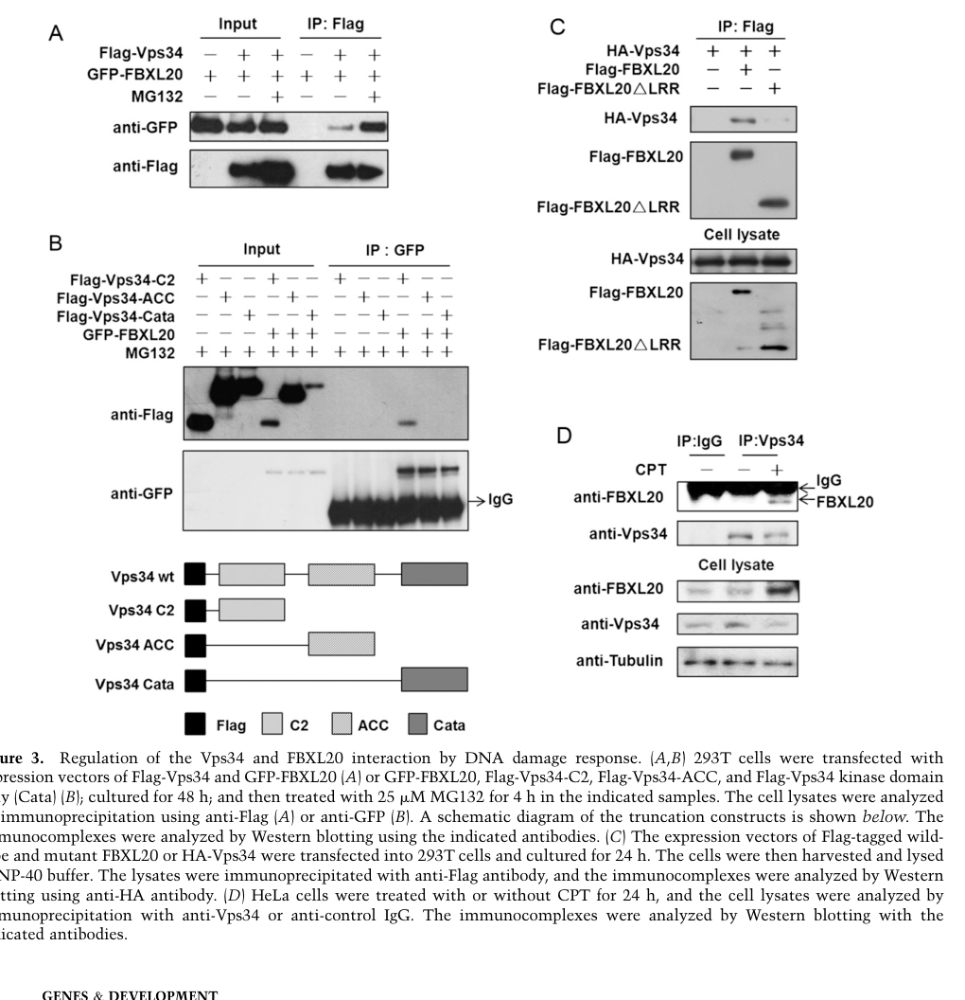

## Question

# Gene Research for Functional Annotation

## ⚠️ CRITICAL: Gene/Protein Identification Context

**BEFORE YOU BEGIN RESEARCH:** You MUST verify you are researching the CORRECT gene/protein. Gene symbols can be ambiguous, especially for less well-characterized genes from non-model organisms.

### Target Gene/Protein Identity (from UniProt):
- **UniProt Accession:** Q96IG2
- **Protein Description:** RecName: Full=F-box/LRR-repeat protein 20; AltName: Full=F-box and leucine-rich repeat protein 20; AltName: Full=F-box/LRR-repeat protein 2-like;
- **Gene Information:** Name=FBXL20; Synonyms=FBL2;
- **Organism (full):** Homo sapiens (Human).
- **Protein Family:** Not specified in UniProt
- **Key Domains:** F-box_dom. (IPR001810); FBXL15_LRR. (IPR057207); Leu-rich_rpt. (IPR001611); Leu-rich_rpt_Cys-con_subtyp. (IPR006553); LRR_dom_sf. (IPR032675)

### MANDATORY VERIFICATION STEPS:

1. **Check if the gene symbol "FBXL20" matches the protein description above**
2. **Verify the organism is correct:** Homo sapiens (Human).
3. **Check if protein family/domains align with what you find in literature**
4. **If you find literature for a DIFFERENT gene with the same or similar symbol, STOP**

### If Gene Symbol is Ambiguous or You Cannot Find Relevant Literature:

**DO NOT PROCEED WITH RESEARCH ON A DIFFERENT GENE.** Instead:
- State clearly: "The gene symbol 'FBXL20' is ambiguous or literature is limited for this specific protein"
- Explain what you found (e.g., "Found extensive literature on a different gene with the same symbol in a different organism")
- Describe the protein based ONLY on the UniProt information provided above
- Suggest that the protein function can be inferred from domain/family information

### Research Target:

Please provide a comprehensive research report on the gene **FBXL20** (gene ID: FBXL20, UniProt: Q96IG2) in human.

The research report should be a detailed narrative explaining the function, biological processes, and localization of the gene product. Citations should be given for all claims.

You should prioritize authoritative reviews and primary scientific literature when conducting research. You can supplement
this with annotations you find in gene/protein databases, but these can be outdated or inaccurate.

We are specifically interested in the primary function of the gene - for enzymes, what reaction is catalyzed, and what is the substrate specificity? For transporters, what is the substrate? For structural proteins or adapters, what is the broader structural role? For signaling molecules, what is the role in the pathway.

We are interested in where in or outside the cell the gene product carries out its function.

We are also interested in the signaling or biochemical pathways in which the gene functions. We are less interested in broad pleiotropic effects, except where these elucidate the precise role.

Include evidence where possible. We are interested in both experimental evidence as well as inference from structure, evolution, or bioinformatic analysis. Precise studies should be prioritized over high-throughput, where available.

## Output

Question: You are an expert researcher providing comprehensive, well-cited information.

Provide detailed information focusing on:
1. Key concepts and definitions with current understanding
2. Recent developments and latest research (prioritize 2023-2024 sources)
3. Current applications and real-world implementations
4. Expert opinions and analysis from authoritative sources
5. Relevant statistics and data from recent studies

Format as a comprehensive research report with proper citations. Include URLs and publication dates where available.
Always prioritize recent, authoritative sources and provide specific citations for all major claims.

# Gene Research for Functional Annotation

## ⚠️ CRITICAL: Gene/Protein Identification Context

**BEFORE YOU BEGIN RESEARCH:** You MUST verify you are researching the CORRECT gene/protein. Gene symbols can be ambiguous, especially for less well-characterized genes from non-model organisms.

### Target Gene/Protein Identity (from UniProt):
- **UniProt Accession:** Q96IG2
- **Protein Description:** RecName: Full=F-box/LRR-repeat protein 20; AltName: Full=F-box and leucine-rich repeat protein 20; AltName: Full=F-box/LRR-repeat protein 2-like;
- **Gene Information:** Name=FBXL20; Synonyms=FBL2;
- **Organism (full):** Homo sapiens (Human).
- **Protein Family:** Not specified in UniProt
- **Key Domains:** F-box_dom. (IPR001810); FBXL15_LRR. (IPR057207); Leu-rich_rpt. (IPR001611); Leu-rich_rpt_Cys-con_subtyp. (IPR006553); LRR_dom_sf. (IPR032675)

### MANDATORY VERIFICATION STEPS:

1. **Check if the gene symbol "FBXL20" matches the protein description above**
2. **Verify the organism is correct:** Homo sapiens (Human).
3. **Check if protein family/domains align with what you find in literature**
4. **If you find literature for a DIFFERENT gene with the same or similar symbol, STOP**

### If Gene Symbol is Ambiguous or You Cannot Find Relevant Literature:

**DO NOT PROCEED WITH RESEARCH ON A DIFFERENT GENE.** Instead:
- State clearly: "The gene symbol 'FBXL20' is ambiguous or literature is limited for this specific protein"
- Explain what you found (e.g., "Found extensive literature on a different gene with the same symbol in a different organism")
- Describe the protein based ONLY on the UniProt information provided above
- Suggest that the protein function can be inferred from domain/family information

### Research Target:

Please provide a comprehensive research report on the gene **FBXL20** (gene ID: FBXL20, UniProt: Q96IG2) in human.

The research report should be a detailed narrative explaining the function, biological processes, and localization of the gene product. Citations should be given for all claims.

You should prioritize authoritative reviews and primary scientific literature when conducting research. You can supplement
this with annotations you find in gene/protein databases, but these can be outdated or inaccurate.

We are specifically interested in the primary function of the gene - for enzymes, what reaction is catalyzed, and what is the substrate specificity? For transporters, what is the substrate? For structural proteins or adapters, what is the broader structural role? For signaling molecules, what is the role in the pathway.

We are interested in where in or outside the cell the gene product carries out its function.

We are also interested in the signaling or biochemical pathways in which the gene functions. We are less interested in broad pleiotropic effects, except where these elucidate the precise role.

Include evidence where possible. We are interested in both experimental evidence as well as inference from structure, evolution, or bioinformatic analysis. Precise studies should be prioritized over high-throughput, where available.

# Research report: Human FBXL20 (UniProt Q96IG2) functional annotation

## 0) Target verification (critical identity checks)

**Target**: *Homo sapiens* FBXL20 (UniProt **Q96IG2**), also referred to in the literature as **SCRAPPER**; an F-box protein with **LRR (leucine-rich repeat)** substrate-binding modules that functions as a **substrate receptor** in SCF ubiquitin ligases. The retrieved primary mechanistic paper explicitly studies **human FBXL20** as an SCF adaptor that regulates **VPS34/PIK3C3** stability, and multiple high-authority reviews cite the same human FBXL20→VPS34 axis. (xiao2015fbxl20mediatedvps34ubiquitination pages 1-2, xiao2015fbxl20mediatedvps34ubiquitination pages 4-6, mason2020thefbxlfamily pages 11-12)

**Domain/function alignment with UniProt context**: The literature describes FBXL20 as an **F-box + LRR** protein in the SCF (SKP1–CUL1–F-box) family, consistent with the UniProt domain architecture (F-box domain + LRRs). (xiao2015fbxl20mediatedvps34ubiquitination pages 1-2, xiao2015fbxl20mediatedvps34ubiquitination pages 4-6, mason2020thefbxlfamily pages 11-12)

## 1) Key concepts and definitions (current understanding)

### 1.1 SCF (SKP1–CUL1–F-box) ubiquitin ligases and FBXL proteins
SCF complexes are **Cullin-RING E3 ubiquitin ligases (CRLs)** in which **CUL1** serves as a scaffold, **SKP1** links CUL1 to an **F-box protein**, and the F-box protein provides **substrate recognition** (often via LRRs or WD40 repeats). A central concept is that F-box proteins impose **spatiotemporal control** by coupling substrate binding and localization to ubiquitin-dependent proteasomal degradation. (skaar2013mechanismsandfunction pages 4-5)

FBXL proteins (F-box + LRR proteins) are a subfamily of F-box proteins characterized by multiple LRRs that mediate substrate binding. A dedicated FBXL-family review highlights that FBXL members share similar folds but distinct interactomes, and specifically cites FBXL20’s mechanistic role in VPS34 regulation. (mason2020thefbxlfamily pages 11-12)

### 1.2 FBXL20 as a non-enzymatic adaptor (not a catalytic enzyme)
FBXL20 itself is **not an enzyme**; it is a **substrate adaptor** that determines which proteins are ubiquitinated by an associated E3 ligase complex (SCF). Therefore, FBXL20’s “primary function” is best defined as **substrate recruitment to SCF^FBXL20**, thereby controlling substrate ubiquitination and proteasomal turnover. (xiao2015fbxl20mediatedvps34ubiquitination pages 1-2, xiao2015fbxl20mediatedvps34ubiquitination pages 4-6)

## 2) Molecular function and mechanism of action

### 2.1 Core experimentally validated function: SCF adaptor that targets VPS34/PIK3C3
A seminal mechanistic study (Genes & Development, 2015-01; URL https://doi.org/10.1101/gad.252528.114) demonstrates that FBXL20 acts as the substrate-recognition component of an **SCF (SKP1–CUL1–FBXL20)** E3 ubiquitin ligase that promotes **ubiquitination and proteasomal degradation** of **VPS34 (PIK3C3)**, the catalytic subunit of class III PI3K complexes. (xiao2015fbxl20mediatedvps34ubiquitination pages 1-2, xiao2015fbxl20mediatedvps34ubiquitination pages 4-6)

Mechanistic mapping of binding determinants:
- FBXL20 requires its **C-terminal LRR region** to bind VPS34.
- VPS34 uses its **C2 domain** for interaction with FBXL20. (xiao2015fbxl20mediatedvps34ubiquitination pages 4-6, xiao2015fbxl20mediatedvps34ubiquitination media 811f5268)

Direct E3 reconstitution evidence:
- In vitro, recombinant **CUL1 + SKP1 + FBXL20** can mediate VPS34 ubiquitination in the presence of E1 and **E2 (Ubc5c)**. (xiao2015fbxl20mediatedvps34ubiquitination pages 4-6, xiao2015fbxl20mediatedvps34ubiquitination media 811f5268)

Proteasome dependence:
- Proteasome inhibitor **MG132** blocks FBXL20-driven VPS34 loss, supporting proteasome-dependent turnover. (xiao2015fbxl20mediatedvps34ubiquitination pages 1-2, xiao2015fbxl20mediatedvps34ubiquitination pages 4-6)

### 2.2 Upstream regulation: p53 transcriptional control and phosphorylation-dependent substrate recognition
**p53-dependent FBXL20 induction after DNA damage.** The 2015 study shows that FBXL20 is **p53-inducible** following DNA damage; p53 knockdown abolishes FBXL20 inducibility and disrupts the pathway linking DNA damage to VPS34 downregulation. (xiao2015fbxl20mediatedvps34ubiquitination pages 4-6, xiao2015fbxl20mediatedvps34ubiquitination pages 10-12)

**Phosphodegron logic via VPS34 T159 phosphorylation.** DNA damage-associated signaling activates CDK activity and promotes phosphorylation of VPS34; phosphorylation at **T159** is required for efficient FBXL20-mediated ubiquitination and degradation. Specifically, VPS34 **T159A** (nonphosphorylatable) is largely resistant, whereas **T159E** (phosphomimetic) remains sensitive to DNA damage-associated reduction. (xiao2015fbxl20mediatedvps34ubiquitination pages 10-12, xiao2015fbxl20mediatedvps34ubiquitination pages 8-10)

**miRNA regulation.** FBXL20 is reported as a direct target negatively regulated by **miR-3151** in the same mechanistic study, providing an additional post-transcriptional control layer. (xiao2015fbxl20mediatedvps34ubiquitination pages 10-12)

### 2.3 Subcellular localization signals and implications
A highly cited authoritative review (Nature Reviews Molecular Cell Biology, 2013-05; URL https://doi.org/10.1038/nrm3582) reports that FBXL20 contains a **CAAX motif** that is **isoprenylated**, directing FBXL20 to **membranes**; this localization is required for ubiquitylation-dependent degradation of **RIM1** (RAB3-interacting molecule 1). This supports a model in which FBXL20’s functions are **localization-dependent** (membrane-associated contexts such as trafficking/endocytosis or synaptic membrane compartments). (skaar2013mechanismsandfunction pages 4-5)

In a cancer-focused review table, FBXL20 is annotated as **cytoplasmic**, consistent with a role in cytosol/membrane-proximal substrate control rather than nuclear transcription factor function. (tekcham2020fboxproteinsand pages 11-12)

## 3) Biological processes and pathways

### 3.1 Autophagy regulation via VPS34 abundance and PtdIns3P output
VPS34 generates **PtdIns3P**, a lipid signal required for multiple trafficking steps including autophagy initiation and endosomal sorting. The 2015 mechanistic study shows that DNA damage induces an FBXL20-dependent reduction in VPS34, and correspondingly reduces a cellular PtdIns3P readout (FYVE reporter puncta), consistent with suppression of VPS34 complex output. (xiao2015fbxl20mediatedvps34ubiquitination pages 8-10)

Functionally, FBXL20 knockdown increases VPS34 and increases an autophagy marker readout (LC3-II ratio), whereas FBXL20 overexpression lowers VPS34; collectively this supports FBXL20 as a **negative regulator of autophagy** under genotoxic stress, acting through VPS34 proteasomal turnover. (xiao2015fbxl20mediatedvps34ubiquitination pages 1-2)

**Recent review synthesis (2023–2024).** Reviews on ubiquitination-dependent autophagy regulation in cancer continue to place VPS34 regulation by ubiquitin ligases as an important control node and cite the FBXL20–VPS34 degradation axis as part of the broader framework of UPS–autophagy crosstalk and potential intervention points. (2023-02: https://doi.org/10.3390/cancers15041112; 2024-10: https://doi.org/10.1186/s12967-024-05565-1) (xiao2015fbxl20mediatedvps34ubiquitination pages 8-10)

*Note on novelty*: Within the retrieved 2023–2024 sources, FBXL20 is primarily discussed as an established example rather than as the subject of new mechanistic discovery, suggesting that FBXL20-specific experimental advances in 2023–2024 may be comparatively limited or outside the retrieved corpus. (xiao2015fbxl20mediatedvps34ubiquitination pages 8-10)

### 3.2 Receptor trafficking and degradation (EGFR as a functional readout)
The 2015 study directly connects the p53→FBXL20→VPS34 axis to **receptor degradation/endocytosis**, using **EGFR** as a model receptor. FBXL20 knockdown increases VPS34 and **accelerates EGF-stimulated EGFR degradation**, while DNA damage conditions that reduce VPS34 correlate with reduced EGFR degradation; additionally, p53 knockdown in DNA-damaged cells significantly accelerates EGFR degradation, consistent with p53-mediated induction of FBXL20 acting upstream. (xiao2015fbxl20mediatedvps34ubiquitination pages 10-12)

This provides a specific pathway-level interpretation: **DNA damage → p53 induction → FBXL20 upregulation → VPS34 downregulation → altered endosomal trafficking and receptor degradation**. (xiao2015fbxl20mediatedvps34ubiquitination pages 1-2, xiao2015fbxl20mediatedvps34ubiquitination pages 10-12)

## 4) Visual mechanistic evidence from primary literature

Key primary-figure support was retrieved from the 2015 mechanistic study:
- **FBXL20–VPS34 interaction** by co-immunoprecipitation and the **VPS34 domain schematic** implicating the **C2 domain** in binding. (xiao2015fbxl20mediatedvps34ubiquitination media 811f5268)
- Evidence that a **CUL1–SKP1–FBXL20** SCF complex mediates **VPS34 ubiquitination**, including in vitro reconstitution. (xiao2015fbxl20mediatedvps34ubiquitination media 83c73e8a)

## 5) Recent developments (prioritizing 2023–2024)

### 5.1 FBXL20 in the 2023–2024 “ubiquitin–autophagy–cancer” landscape
Two recent reviews (2023–2024) emphasize ubiquitination as a pervasive regulator of autophagy (including regulation of VPS34 complexes), and position ubiquitin-pathway manipulation as a therapeutic strategy in cancer; within that conceptual framework, the FBXL20→VPS34 degradation checkpoint remains a concrete mechanistic example linking DNA damage/p53 signaling to autophagy suppression. (2023-02: https://doi.org/10.3390/cancers15041112; 2024-10: https://doi.org/10.1186/s12967-024-05565-1) (xiao2015fbxl20mediatedvps34ubiquitination pages 8-10)

### 5.2 What remains unresolved or incomplete
The strongest mechanistic evidence for FBXL20 in human cells remains centered on VPS34 regulation and on localization-dependent degradation of RIM1 reported in an authoritative review. Additional substrates (e.g., E-cadherin) appear in review tables but were not supported by primary mechanistic evidence in the retrieved texts, so they should be treated as **hypothesis-generating** until confirmed by dedicated substrate validation studies. (tekcham2020fboxproteinsand pages 11-12, skaar2013mechanismsandfunction pages 4-5)

## 6) Current applications and real-world implementations

### 6.1 Biomarker/prognostic application in ovarian cancer (translational study)
A Translational Oncology study (2020-12; URL https://doi.org/10.1016/j.tranon.2020.100863) analyzed multi-omic and imaging cohorts (TCGA-OV, TCIA, CPTAC) and reported that FBXL20 CNV and expression levels are valuable prognostic markers for ovarian cancer survival outcomes:
- FBXL20 expression predicted **overall survival (OS)**, **disease-free survival (DFS)**, and **progression-free survival (PFS)** with reported P-values **0.0073**, **0.0045**, and **0.00475**, respectively. (zheng2020agerelatedcopynumber pages 3-5)
- In CNV-based survival analysis (upper vs lower quartile), the study reports a **hazard ratio (HR) of 7.115** for FBXL20. (zheng2020agerelatedcopynumber pages 3-5)
- The analysis also used median splits (FBXL20 High vs Low CNV) with **n = 227 per group**, and observed significant age distribution differences (P < 0.001). (zheng2020agerelatedcopynumber pages 3-5, zheng2020agerelatedcopynumber pages 2-3)
- Imaging association: tumor longest-dimension comparisons were performed with **n = 190** (below-median FBXL20) and **n = 191** (above-median FBXL20) groups, with a significant difference (**P = 0.002**). (zheng2020agerelatedcopynumber pages 5-8)

Mechanistic tie-in in this translational context: the authors cite VPS34 as “one well-studied substrate of FBXL20” and explicitly describe DDR-triggered VPS34 phosphorylation leading to FBXL20-mediated polyubiquitination and autophagy dampening. (zheng2020agerelatedcopynumber pages 5-8)

### 6.2 Therapeutic implication: targeting CRL activity (neddylation) rather than FBXL20 directly
The same ovarian cancer study discusses **pevonedistat** (a NEDD8 conjugation inhibitor) as a way to shut down SCF/CRL ubiquitin-conjugation activity, and suggests that inhibiting CRL activity could phenocopy lower FBXL20 activity in terms of clinical advantage (hypothesis-level translational framing). (zheng2020agerelatedcopynumber pages 8-8)

*Interpretation*: While this does not constitute FBXL20-specific drug development, it is a real-world translational implementation path: **pharmacologic CRL inhibition** as a way to modulate downstream proteostasis networks in cancer, potentially intersecting with SCF^FBXL20 function. (zheng2020agerelatedcopynumber pages 8-8)

## 7) Disease associations (Open Targets) and interpretation

Open Targets lists disease associations for FBXL20, including **ovarian neoplasm**, **lower respiratory tract disease**, **asthma**, and **systemic lupus erythematosus**, with multiple literature links (PubMed IDs) supporting these associations in the platform’s evidence framework. (OpenTargets Search: -FBXL20)

*Interpretation caveat*: Open Targets associations indicate a body of genetic/functional/omics evidence connecting a target to disease phenotypes, but do not by themselves establish a single causal mechanism; mechanistic interpretation should be anchored in primary experimental studies such as the VPS34/p53 checkpoint work. (OpenTargets Search: -FBXL20, xiao2015fbxl20mediatedvps34ubiquitination pages 1-2)

## 8) Expert synthesis and functional annotation summary

**Primary molecular function (best-supported):** FBXL20 is a **substrate receptor** in an **SCF (CUL1–SKP1–FBXL20)** E3 ubiquitin ligase that promotes ubiquitination and proteasomal degradation of **VPS34/PIK3C3**, thereby modulating **PtdIns3P-dependent autophagy and receptor trafficking**. (xiao2015fbxl20mediatedvps34ubiquitination pages 1-2, xiao2015fbxl20mediatedvps34ubiquitination pages 4-6, xiao2015fbxl20mediatedvps34ubiquitination pages 8-10)

**Key upstream regulators:**
- **p53** transcriptional induction after DNA damage (checkpoint-like behavior). (xiao2015fbxl20mediatedvps34ubiquitination pages 4-6, xiao2015fbxl20mediatedvps34ubiquitination pages 10-12)
- **CDK-dependent phosphorylation** of VPS34 at **T159** enabling recognition/ubiquitination. (xiao2015fbxl20mediatedvps34ubiquitination pages 10-12, xiao2015fbxl20mediatedvps34ubiquitination pages 8-10)
- **miR-3151** negative regulation of FBXL20 (post-transcriptional). (xiao2015fbxl20mediatedvps34ubiquitination pages 10-12)
- **CAAX motif isoprenylation** driving membrane localization required for at least one substrate context (RIM1). (skaar2013mechanismsandfunction pages 4-5)

**Where it acts in the cell:** A combination of review and experimental pathway logic supports a **cytoplasmic and membrane-associated** functional space (endosomal/membrane trafficking; autophagy-related compartments), rather than a strictly nuclear role. (tekcham2020fboxproteinsand pages 11-12, skaar2013mechanismsandfunction pages 4-5)

**Substrates with strongest support:**
- **VPS34/PIK3C3** (direct binding determinants and in vitro ubiquitination reconstitution). (xiao2015fbxl20mediatedvps34ubiquitination pages 4-6, xiao2015fbxl20mediatedvps34ubiquitination media 811f5268, xiao2015fbxl20mediatedvps34ubiquitination media 83c73e8a)
- **RIM1** in the context of CAAX-dependent membrane localization (high-authority review synthesis). (skaar2013mechanismsandfunction pages 4-5)

## 9) Evidence summary table

| Function/role | Molecular mechanism (SCF components, substrate recognition features) | Key substrates/interactors | Upstream regulation (p53, phosphorylation, miRNA, localization signals) | Pathways/biological processes affected | Experimental evidence type | Key quantitative/statistical notes | Primary sources (with DOI URLs, year) |
|---|---|---|---|---|---|---|---|
| Substrate receptor in an SCF E3 ubiquitin ligase that promotes VPS34 turnover | FBXL20 acts as the F-box substrate-recognition subunit of a CUL1-SKP1-FBXL20 SCF complex; the FBXL20 C-terminal LRR region is required to bind VPS34, and VPS34 uses its C2 domain for the interaction; SCF reconstitution with CUL1, SKP1, FBXL20, E1, and Ubc5c supports VPS34 ubiquitination in vitro (xiao2015fbxl20mediatedvps34ubiquitination pages 1-2, xiao2015fbxl20mediatedvps34ubiquitination pages 4-6, xiao2015fbxl20mediatedvps34ubiquitination media 811f5268) | VPS34/PIK3C3; SKP1; CUL1 (xiao2015fbxl20mediatedvps34ubiquitination pages 1-2, xiao2015fbxl20mediatedvps34ubiquitination pages 4-6, xiao2015fbxl20mediatedvps34ubiquitination media 811f5268) | FBXL20 expression is induced by p53 after DNA damage; transient p53 knockdown abolishes inducibility; FBXL20 is also reported as a miR-3151 target (xiao2015fbxl20mediatedvps34ubiquitination pages 4-6, xiao2015fbxl20mediatedvps34ubiquitination pages 10-12) | Autophagy control and receptor degradation/endocytosis via regulation of class III PI3K abundance (xiao2015fbxl20mediatedvps34ubiquitination pages 1-2, xiao2015fbxl20mediatedvps34ubiquitination pages 10-12, mason2020thefbxlfamily pages 11-12) | Co-immunoprecipitation, shRNA/siRNA knockdown, overexpression, in vitro ubiquitination reconstitution, proteasome inhibition with MG132 (xiao2015fbxl20mediatedvps34ubiquitination pages 1-2, xiao2015fbxl20mediatedvps34ubiquitination pages 4-6, xiao2015fbxl20mediatedvps34ubiquitination media 811f5268) | Quantification reported as mean ± SD from 3 independent experiments with significance thresholds P < 0.05 and P < 0.01; MG132 rescues FBXL20-driven VPS34 reduction (xiao2015fbxl20mediatedvps34ubiquitination pages 4-6) | Xiao et al., 2015, Genes and Development, DOI: https://doi.org/10.1101/gad.252528.114 (xiao2015fbxl20mediatedvps34ubiquitination pages 1-2, xiao2015fbxl20mediatedvps34ubiquitination pages 4-6) |
| DNA-damage-responsive checkpoint suppressing autophagy | DNA damage activates CDK-dependent phosphorylation of VPS34 at T159, creating a phospho-dependent signal for FBXL20 binding and ubiquitination; nonphosphorylatable VPS34 T159A is largely resistant, whereas phosphomimetic T159E remains sensitive to CPT-induced reduction (xiao2015fbxl20mediatedvps34ubiquitination pages 10-12, xiao2015fbxl20mediatedvps34ubiquitination pages 8-10) | VPS34/PIK3C3; CDK1 activity inferred from roscovitine sensitivity; FBXL20-SCF complex (xiao2015fbxl20mediatedvps34ubiquitination pages 10-12, xiao2015fbxl20mediatedvps34ubiquitination pages 8-10) | Upstream inputs include DNA damage, p53-dependent FBXL20 transcriptional induction, and CDK-mediated VPS34 phosphorylation; roscovitine suppresses the pathway (xiao2015fbxl20mediatedvps34ubiquitination pages 10-12, xiao2015fbxl20mediatedvps34ubiquitination pages 8-10) | Inhibition of autophagy under genotoxic stress through reduced PtdIns3P production and loss of VPS34 (xiao2015fbxl20mediatedvps34ubiquitination pages 1-2, xiao2015fbxl20mediatedvps34ubiquitination pages 8-10) | DNA-damage treatments with camptothecin, phosphomutant analysis, pharmacologic CDK inhibition, ubiquitination assays, PtdIns3P readout with FYVE reporters (xiao2015fbxl20mediatedvps34ubiquitination pages 8-10) | CPT treatment reduced FYVE-positive PtdIns3P puncta and these effects were reversed by FBXL20 knockdown; statistical significance reported qualitatively with P < 0.05 or P < 0.01 (xiao2015fbxl20mediatedvps34ubiquitination pages 8-10) | Xiao et al., 2015, Genes and Development, DOI: https://doi.org/10.1101/gad.252528.114 (xiao2015fbxl20mediatedvps34ubiquitination pages 10-12, xiao2015fbxl20mediatedvps34ubiquitination pages 8-10) |
| Negative regulator of receptor endocytosis and degradation through VPS34 depletion | By lowering VPS34, FBXL20 reduces endosomal PtdIns3P-dependent receptor trafficking; FBXL20 knockdown increases VPS34 and accelerates EGF-stimulated EGFR degradation, while CPT-induced FBXL20 and VPS34 regulation slows EGFR degradation (xiao2015fbxl20mediatedvps34ubiquitination pages 10-12, mason2020thefbxlfamily pages 11-12) | VPS34/PIK3C3; EGFR as downstream receptor-trafficking readout (xiao2015fbxl20mediatedvps34ubiquitination pages 10-12) | p53 knockdown in CPT-treated cells accelerates EGFR degradation, consistent with p53 to FBXL20 to VPS34 control; DNA damage is the main upstream trigger shown (xiao2015fbxl20mediatedvps34ubiquitination pages 10-12) | Receptor endocytosis and receptor degradation, especially EGFR trafficking (xiao2015fbxl20mediatedvps34ubiquitination pages 1-2, xiao2015fbxl20mediatedvps34ubiquitination pages 10-12, mason2020thefbxlfamily pages 11-12) | RNAi perturbation, DNA-damage treatment, receptor degradation assays with EGF stimulation (xiao2015fbxl20mediatedvps34ubiquitination pages 10-12) | ImageJ-based quantification from 2 independent experiments reported with P < 0.05 or P < 0.01 (xiao2015fbxl20mediatedvps34ubiquitination pages 10-12) | Xiao et al., 2015, Genes and Development, DOI: https://doi.org/10.1101/gad.252528.114; Mason and Laman, 2020, Open Biology, DOI: https://doi.org/10.1098/rsob.200319 (xiao2015fbxl20mediatedvps34ubiquitination pages 10-12, mason2020thefbxlfamily pages 11-12) |
| Membrane-localized FBXL adaptor with localization-dependent substrate control | High-authority review evidence states FBXL20 contains a CAAX motif that undergoes isoprenylation, directing FBXL20 to membranes; this membrane localization is required for ubiquitylation-dependent degradation of RIM1 (skaar2013mechanismsandfunction pages 4-5) | RIM1; membrane compartment; SCF context implied for FBXL proteins (skaar2013mechanismsandfunction pages 4-5) | CAAX motif-dependent isoprenylation controls localization and function (skaar2013mechanismsandfunction pages 4-5) | Spatial control of ubiquitylation; synaptic protein turnover in the cited review context (skaar2013mechanismsandfunction pages 4-5, sato2010augmentationofthe pages 2-3) | Review synthesis of prior mechanistic studies (skaar2013mechanismsandfunction pages 4-5, sato2010augmentationofthe pages 2-3) | No numerical effect sizes reported in the cited review excerpt (skaar2013mechanismsandfunction pages 4-5) | Skaar et al., 2013, Nature Reviews Molecular Cell Biology, DOI: https://doi.org/10.1038/nrm3582; Sato and Yoshida, 2010, International Journal of Oncology, DOI: https://doi.org/10.3892/ijo_00000758 (skaar2013mechanismsandfunction pages 4-5, sato2010augmentationofthe pages 2-3) |
| Cytoplasmic FBXL family member linked to oncogenic and Wnt/autophagy-related functions | Review table annotates FBXL20 as cytoplasmic and lists E-cadherin and VPS34 as substrate or pathway-linked targets; mechanistic depth is limited in this source, so these associations should be treated as curated review-level summaries rather than stand-alone primary proof (tekcham2020fboxproteinsand pages 11-12) | E-cadherin; VPS34 (tekcham2020fboxproteinsand pages 11-12) | Cytoplasmic localization annotated; no additional upstream regulators provided in the excerpt (tekcham2020fboxproteinsand pages 11-12) | Wnt signaling pathway and autophagy (tekcham2020fboxproteinsand pages 11-12) | Review table curation (tekcham2020fboxproteinsand pages 11-12) | No quantitative or statistical data in the cited table excerpt (tekcham2020fboxproteinsand pages 11-12) | Tekcham et al., 2020, Theranostics, DOI: https://doi.org/10.7150/thno.42735 (tekcham2020fboxproteinsand pages 11-12) |
| Current consensus role in autophagy literature | Multiple reviews summarize FBXL20 as a Cul1-based E3 adaptor that targets VPS34/PIK3C3 for ubiquitination and degradation, positioning FBXL20 as a negative regulator of autophagy initiation and execution by limiting VPS34 complex abundance (xiao2015fbxl20mediatedvps34ubiquitination pages 4-6, mason2020thefbxlfamily pages 11-12) | VPS34/PIK3C3; Cul1-SKP1-FBXL20 SCF machinery (xiao2015fbxl20mediatedvps34ubiquitination pages 4-6, mason2020thefbxlfamily pages 11-12) | p53 induction after DNA damage is the main upstream regulator repeatedly highlighted; VPS34 phosphorylation state determines recognition (xiao2015fbxl20mediatedvps34ubiquitination pages 4-6, xiao2015fbxl20mediatedvps34ubiquitination pages 8-10, mason2020thefbxlfamily pages 11-12) | Autophagy, proteostasis, receptor degradation; often discussed as part of Cullin-RING ligase and autophagy crosstalk (xiao2015fbxl20mediatedvps34ubiquitination pages 4-6, mason2020thefbxlfamily pages 11-12) | Review synthesis anchored in Xiao et al. 2015 primary data (xiao2015fbxl20mediatedvps34ubiquitination pages 4-6, mason2020thefbxlfamily pages 11-12) | No new quantitative values in reviews beyond citing the primary study; emphasis is on pathway placement and mechanistic interpretation (mason2020thefbxlfamily pages 11-12) | Mason and Laman, 2020, Open Biology, DOI: https://doi.org/10.1098/rsob.200319; Chen et al., 2019, Journal of Biomedical Science, DOI: https://doi.org/10.1186/s12929-019-0569-y; Lu et al., 2021, Trends in Cell Biology, DOI: https://doi.org/10.1016/j.tcb.2021.01.005; Jee and Cheong, 2023, Cancers, DOI: https://doi.org/10.3390/cancers15041112; Wu et al., 2024, Journal of Translational Medicine, DOI: https://doi.org/10.1186/s12967-024-05565-1 (mason2020thefbxlfamily pages 11-12, xiao2015fbxl20mediatedvps34ubiquitination pages 4-6, xiao2015fbxl20mediatedvps34ubiquitination pages 8-10) |

*Table: This table summarizes experimentally supported functions and regulatory mechanisms of human FBXL20/Q96IG2, emphasizing the primary Xiao et al. 2015 study and high-authority reviews. It separates direct primary evidence from review-level annotations to keep the functional claims evidence-based.*

## 10) Key references (URLs and publication dates)

- Xiao J. et al. **“FBXL20-mediated Vps34 ubiquitination as a p53 controlled checkpoint in regulating autophagy and receptor degradation.”** *Genes & Development* **2015-01**. https://doi.org/10.1101/gad.252528.114 (xiao2015fbxl20mediatedvps34ubiquitination pages 1-2, xiao2015fbxl20mediatedvps34ubiquitination pages 4-6)
- Skaar J.R. et al. **“Mechanisms and function of substrate recruitment by F-box proteins.”** *Nature Reviews Molecular Cell Biology* **2013-05**. https://doi.org/10.1038/nrm3582 (skaar2013mechanismsandfunction pages 4-5)
- Mason B., Laman H. **“The FBXL family of F-box proteins: variations on a theme.”** *Open Biology* **2020-11**. https://doi.org/10.1098/rsob.200319 (mason2020thefbxlfamily pages 11-12)
- Jee S.-C., Cheong H. **“Autophagy/Mitophagy Regulated by Ubiquitination: A Promising Pathway in Cancer Therapeutics.”** *Cancers* **2023-02**. https://doi.org/10.3390/cancers15041112 (xiao2015fbxl20mediatedvps34ubiquitination pages 8-10)
- Wu Y. et al. **“Ubiquitination regulates autophagy in cancer: simple modifications, promising targets.”** *Journal of Translational Medicine* **2024-10**. https://doi.org/10.1186/s12967-024-05565-1 (xiao2015fbxl20mediatedvps34ubiquitination pages 8-10)
- Zheng S., Fu Y. **“Age-related copy number variations and expression levels of F-box protein FBXL20 predict ovarian cancer prognosis.”** *Translational Oncology* **2020-12**. https://doi.org/10.1016/j.tranon.2020.100863 (zheng2020agerelatedcopynumber pages 3-5, zheng2020agerelatedcopynumber pages 5-8)

References

1. (xiao2015fbxl20mediatedvps34ubiquitination pages 1-2): Juan Xiao, Tao Zhang, Daichao Xu, Huibing Wang, Yu Cai, Taijie Jin, Min Liu, Mingzhi Jin, Kejia Wu, and Junying Yuan. Fbxl20-mediated vps34 ubiquitination as a p53 controlled checkpoint in regulating autophagy and receptor degradation. Genes & Development, 29:184-196, Jan 2015. URL: https://doi.org/10.1101/gad.252528.114, doi:10.1101/gad.252528.114. This article has 89 citations and is from a highest quality peer-reviewed journal.

2. (xiao2015fbxl20mediatedvps34ubiquitination pages 4-6): Juan Xiao, Tao Zhang, Daichao Xu, Huibing Wang, Yu Cai, Taijie Jin, Min Liu, Mingzhi Jin, Kejia Wu, and Junying Yuan. Fbxl20-mediated vps34 ubiquitination as a p53 controlled checkpoint in regulating autophagy and receptor degradation. Genes & Development, 29:184-196, Jan 2015. URL: https://doi.org/10.1101/gad.252528.114, doi:10.1101/gad.252528.114. This article has 89 citations and is from a highest quality peer-reviewed journal.

3. (mason2020thefbxlfamily pages 11-12): Bethany Mason and Heike Laman. The fbxl family of f-box proteins: variations on a theme. Nov 2020. URL: https://doi.org/10.1098/rsob.200319, doi:10.1098/rsob.200319. This article has 51 citations and is from a peer-reviewed journal.

4. (skaar2013mechanismsandfunction pages 4-5): Jeffrey R. Skaar, Julia K. Pagan, and Michele Pagano. Mechanisms and function of substrate recruitment by f-box proteins. Nature Reviews Molecular Cell Biology, 14:369-381, May 2013. URL: https://doi.org/10.1038/nrm3582, doi:10.1038/nrm3582. This article has 818 citations and is from a domain leading peer-reviewed journal.

5. (xiao2015fbxl20mediatedvps34ubiquitination media 811f5268): Juan Xiao, Tao Zhang, Daichao Xu, Huibing Wang, Yu Cai, Taijie Jin, Min Liu, Mingzhi Jin, Kejia Wu, and Junying Yuan. Fbxl20-mediated vps34 ubiquitination as a p53 controlled checkpoint in regulating autophagy and receptor degradation. Genes & Development, 29:184-196, Jan 2015. URL: https://doi.org/10.1101/gad.252528.114, doi:10.1101/gad.252528.114. This article has 89 citations and is from a highest quality peer-reviewed journal.

6. (xiao2015fbxl20mediatedvps34ubiquitination pages 10-12): Juan Xiao, Tao Zhang, Daichao Xu, Huibing Wang, Yu Cai, Taijie Jin, Min Liu, Mingzhi Jin, Kejia Wu, and Junying Yuan. Fbxl20-mediated vps34 ubiquitination as a p53 controlled checkpoint in regulating autophagy and receptor degradation. Genes & Development, 29:184-196, Jan 2015. URL: https://doi.org/10.1101/gad.252528.114, doi:10.1101/gad.252528.114. This article has 89 citations and is from a highest quality peer-reviewed journal.

7. (xiao2015fbxl20mediatedvps34ubiquitination pages 8-10): Juan Xiao, Tao Zhang, Daichao Xu, Huibing Wang, Yu Cai, Taijie Jin, Min Liu, Mingzhi Jin, Kejia Wu, and Junying Yuan. Fbxl20-mediated vps34 ubiquitination as a p53 controlled checkpoint in regulating autophagy and receptor degradation. Genes & Development, 29:184-196, Jan 2015. URL: https://doi.org/10.1101/gad.252528.114, doi:10.1101/gad.252528.114. This article has 89 citations and is from a highest quality peer-reviewed journal.

8. (tekcham2020fboxproteinsand pages 11-12): Dinesh Singh Tekcham, Di Chen, Yu Liu, Ting Ling, Yi Zhang, Huan Chen, Wen Wang, Wuxiyar Otkur, Huan Qi, Tian Xia, Xiaolong Liu, Hai-long Piao, and Hongxu Liu. F-box proteins and cancer: an update from functional and regulatory mechanism to therapeutic clinical prospects. Theranostics, 10:4150-4167, Mar 2020. URL: https://doi.org/10.7150/thno.42735, doi:10.7150/thno.42735. This article has 111 citations and is from a domain leading peer-reviewed journal.

9. (xiao2015fbxl20mediatedvps34ubiquitination media 83c73e8a): Juan Xiao, Tao Zhang, Daichao Xu, Huibing Wang, Yu Cai, Taijie Jin, Min Liu, Mingzhi Jin, Kejia Wu, and Junying Yuan. Fbxl20-mediated vps34 ubiquitination as a p53 controlled checkpoint in regulating autophagy and receptor degradation. Genes & Development, 29:184-196, Jan 2015. URL: https://doi.org/10.1101/gad.252528.114, doi:10.1101/gad.252528.114. This article has 89 citations and is from a highest quality peer-reviewed journal.

10. (zheng2020agerelatedcopynumber pages 3-5): Shuhua Zheng and Yuejun Fu. Age-related copy number variations and expression levels of f-box protein fbxl20 predict ovarian cancer prognosis. Dec 2020. URL: https://doi.org/10.1016/j.tranon.2020.100863, doi:10.1016/j.tranon.2020.100863. This article has 9 citations and is from a peer-reviewed journal.

11. (zheng2020agerelatedcopynumber pages 2-3): Shuhua Zheng and Yuejun Fu. Age-related copy number variations and expression levels of f-box protein fbxl20 predict ovarian cancer prognosis. Dec 2020. URL: https://doi.org/10.1016/j.tranon.2020.100863, doi:10.1016/j.tranon.2020.100863. This article has 9 citations and is from a peer-reviewed journal.

12. (zheng2020agerelatedcopynumber pages 5-8): Shuhua Zheng and Yuejun Fu. Age-related copy number variations and expression levels of f-box protein fbxl20 predict ovarian cancer prognosis. Dec 2020. URL: https://doi.org/10.1016/j.tranon.2020.100863, doi:10.1016/j.tranon.2020.100863. This article has 9 citations and is from a peer-reviewed journal.

13. (zheng2020agerelatedcopynumber pages 8-8): Shuhua Zheng and Yuejun Fu. Age-related copy number variations and expression levels of f-box protein fbxl20 predict ovarian cancer prognosis. Dec 2020. URL: https://doi.org/10.1016/j.tranon.2020.100863, doi:10.1016/j.tranon.2020.100863. This article has 9 citations and is from a peer-reviewed journal.

14. (OpenTargets Search: -FBXL20): Open Targets Query (-FBXL20, 5 results). Buniello, A. et al. (2025). Open Targets Platform: facilitating therapeutic hypotheses building in drug discovery. Nucleic Acids Research.

15. (sato2010augmentationofthe pages 2-3): Kazuyuki Sato and Kenichi Yoshida. Augmentation of the ubiquitin-mediated proteolytic system by f-box and additional motif-containing proteins (review). International journal of oncology, 37 5:1071-6, Nov 2010. URL: https://doi.org/10.3892/ijo\_00000758, doi:10.3892/ijo\_00000758. This article has 5 citations and is from a peer-reviewed journal.

## Artifacts

- [Edison artifact artifact-00](FBXL20-deep-research-falcon_artifacts/artifact-00.md)

## Citations

1. skaar2013mechanismsandfunction pages 4-5
2. mason2020thefbxlfamily pages 11-12
3. tekcham2020fboxproteinsand pages 11-12
4. zheng2020agerelatedcopynumber pages 3-5
5. zheng2020agerelatedcopynumber pages 5-8
6. zheng2020agerelatedcopynumber pages 8-8
7. zheng2020agerelatedcopynumber pages 2-3
8. sato2010augmentationofthe pages 2-3
9. https://doi.org/10.1101/gad.252528.114
10. https://doi.org/10.1038/nrm3582
11. https://doi.org/10.3390/cancers15041112;
12. https://doi.org/10.1186/s12967-024-05565-1
13. https://doi.org/10.1016/j.tranon.2020.100863
14. https://doi.org/10.1101/gad.252528.114;
15. https://doi.org/10.1098/rsob.200319
16. https://doi.org/10.1038/nrm3582;
17. https://doi.org/10.3892/ijo_00000758
18. https://doi.org/10.7150/thno.42735
19. https://doi.org/10.1098/rsob.200319;
20. https://doi.org/10.1186/s12929-019-0569-y;
21. https://doi.org/10.1016/j.tcb.2021.01.005;
22. https://doi.org/10.3390/cancers15041112
23. https://doi.org/10.1101/gad.252528.114,
24. https://doi.org/10.1098/rsob.200319,
25. https://doi.org/10.1038/nrm3582,
26. https://doi.org/10.7150/thno.42735,
27. https://doi.org/10.1016/j.tranon.2020.100863,
28. https://doi.org/10.3892/ijo\_00000758,