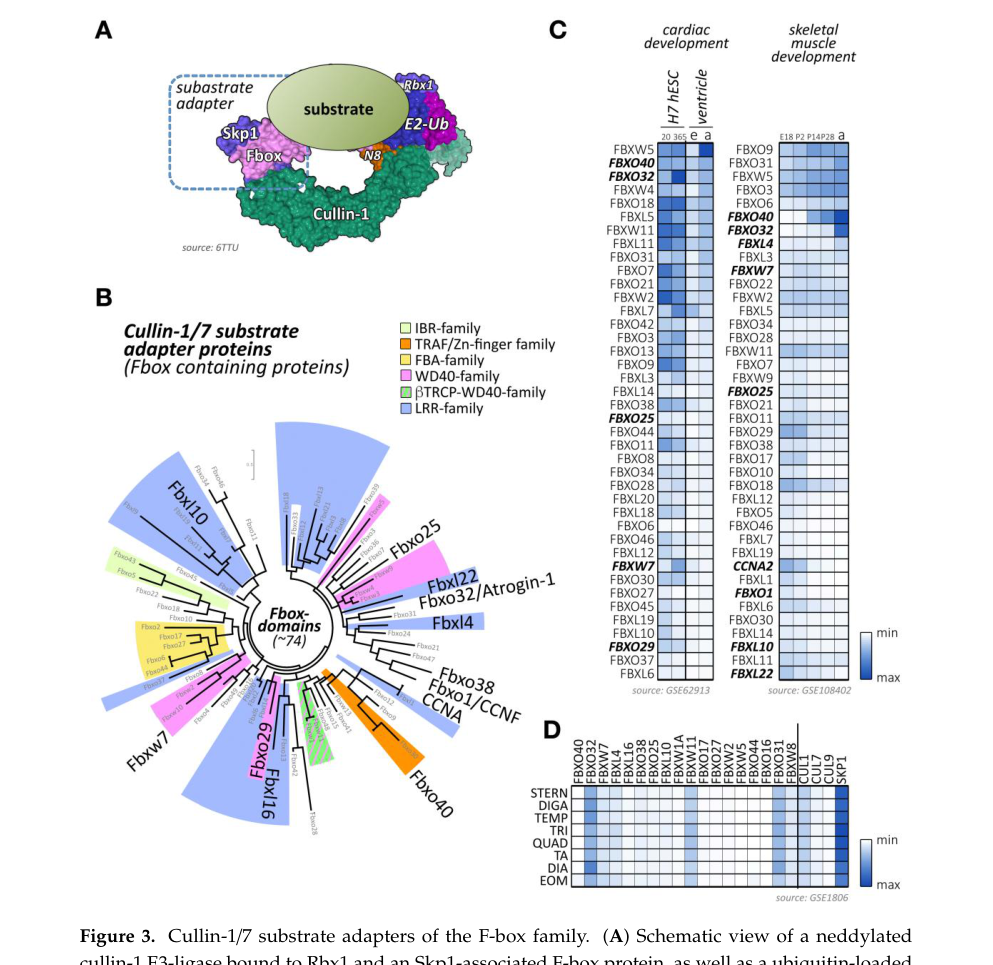

## Question

# Gene Research for Functional Annotation

## ⚠️ CRITICAL: Gene/Protein Identification Context

**BEFORE YOU BEGIN RESEARCH:** You MUST verify you are researching the CORRECT gene/protein. Gene symbols can be ambiguous, especially for less well-characterized genes from non-model organisms.

### Target Gene/Protein Identity (from UniProt):
- **UniProt Accession:** Q6P050
- **Protein Description:** RecName: Full=F-box and leucine-rich protein 22;
- **Gene Information:** Name=FBXL22;
- **Organism (full):** Homo sapiens (Human).
- **Protein Family:** Not specified in UniProt
- **Key Domains:** F-box-like_dom_sf. (IPR036047); F-box_dom. (IPR001810); F-box_LRR-repeat. (IPR050648); Leu-rich_rpt_Cys-con_subtyp. (IPR006553); LRR_dom_sf. (IPR032675)

### MANDATORY VERIFICATION STEPS:

1. **Check if the gene symbol "FBXL22" matches the protein description above**
2. **Verify the organism is correct:** Homo sapiens (Human).
3. **Check if protein family/domains align with what you find in literature**
4. **If you find literature for a DIFFERENT gene with the same or similar symbol, STOP**

### If Gene Symbol is Ambiguous or You Cannot Find Relevant Literature:

**DO NOT PROCEED WITH RESEARCH ON A DIFFERENT GENE.** Instead:
- State clearly: "The gene symbol 'FBXL22' is ambiguous or literature is limited for this specific protein"
- Explain what you found (e.g., "Found extensive literature on a different gene with the same symbol in a different organism")
- Describe the protein based ONLY on the UniProt information provided above
- Suggest that the protein function can be inferred from domain/family information

### Research Target:

Please provide a comprehensive research report on the gene **FBXL22** (gene ID: FBXL22, UniProt: Q6P050) in human.

The research report should be a detailed narrative explaining the function, biological processes, and localization of the gene product. Citations should be given for all claims.

You should prioritize authoritative reviews and primary scientific literature when conducting research. You can supplement
this with annotations you find in gene/protein databases, but these can be outdated or inaccurate.

We are specifically interested in the primary function of the gene - for enzymes, what reaction is catalyzed, and what is the substrate specificity? For transporters, what is the substrate? For structural proteins or adapters, what is the broader structural role? For signaling molecules, what is the role in the pathway.

We are interested in where in or outside the cell the gene product carries out its function.

We are also interested in the signaling or biochemical pathways in which the gene functions. We are less interested in broad pleiotropic effects, except where these elucidate the precise role.

Include evidence where possible. We are interested in both experimental evidence as well as inference from structure, evolution, or bioinformatic analysis. Precise studies should be prioritized over high-throughput, where available.

## Output

Question: You are an expert researcher providing comprehensive, well-cited information.

Provide detailed information focusing on:
1. Key concepts and definitions with current understanding
2. Recent developments and latest research (prioritize 2023-2024 sources)
3. Current applications and real-world implementations
4. Expert opinions and analysis from authoritative sources
5. Relevant statistics and data from recent studies

Format as a comprehensive research report with proper citations. Include URLs and publication dates where available.
Always prioritize recent, authoritative sources and provide specific citations for all major claims.

# Gene Research for Functional Annotation

## ⚠️ CRITICAL: Gene/Protein Identification Context

**BEFORE YOU BEGIN RESEARCH:** You MUST verify you are researching the CORRECT gene/protein. Gene symbols can be ambiguous, especially for less well-characterized genes from non-model organisms.

### Target Gene/Protein Identity (from UniProt):
- **UniProt Accession:** Q6P050
- **Protein Description:** RecName: Full=F-box and leucine-rich protein 22;
- **Gene Information:** Name=FBXL22;
- **Organism (full):** Homo sapiens (Human).
- **Protein Family:** Not specified in UniProt
- **Key Domains:** F-box-like_dom_sf. (IPR036047); F-box_dom. (IPR001810); F-box_LRR-repeat. (IPR050648); Leu-rich_rpt_Cys-con_subtyp. (IPR006553); LRR_dom_sf. (IPR032675)

### MANDATORY VERIFICATION STEPS:

1. **Check if the gene symbol "FBXL22" matches the protein description above**
2. **Verify the organism is correct:** Homo sapiens (Human).
3. **Check if protein family/domains align with what you find in literature**
4. **If you find literature for a DIFFERENT gene with the same or similar symbol, STOP**

### If Gene Symbol is Ambiguous or You Cannot Find Relevant Literature:

**DO NOT PROCEED WITH RESEARCH ON A DIFFERENT GENE.** Instead:
- State clearly: "The gene symbol 'FBXL22' is ambiguous or literature is limited for this specific protein"
- Explain what you found (e.g., "Found extensive literature on a different gene with the same symbol in a different organism")
- Describe the protein based ONLY on the UniProt information provided above
- Suggest that the protein function can be inferred from domain/family information

### Research Target:

Please provide a comprehensive research report on the gene **FBXL22** (gene ID: FBXL22, UniProt: Q6P050) in human.

The research report should be a detailed narrative explaining the function, biological processes, and localization of the gene product. Citations should be given for all claims.

You should prioritize authoritative reviews and primary scientific literature when conducting research. You can supplement
this with annotations you find in gene/protein databases, but these can be outdated or inaccurate.

We are specifically interested in the primary function of the gene - for enzymes, what reaction is catalyzed, and what is the substrate specificity? For transporters, what is the substrate? For structural proteins or adapters, what is the broader structural role? For signaling molecules, what is the role in the pathway.

We are interested in where in or outside the cell the gene product carries out its function.

We are also interested in the signaling or biochemical pathways in which the gene functions. We are less interested in broad pleiotropic effects, except where these elucidate the precise role.

Include evidence where possible. We are interested in both experimental evidence as well as inference from structure, evolution, or bioinformatic analysis. Precise studies should be prioritized over high-throughput, where available.

## Research report: Human **FBXL22** (UniProt **Q6P050**) — functional annotation

### 0) Target verification (critical identity check)
The research target is **human FBXL22** encoding **F-box and leucine-rich protein 22**, explicitly mapped in the FBXL-family review to **UniProt Q6P050 (FXL22_HUMAN)** (https://doi.org/10.1098/rsob.200319; published 2020-11) (mason2020thefbxlfamily pages 4-5). The defining architecture is consistent across sources: an **F-box domain** (Skp1-binding module) plus **C-terminal leucine-rich repeats (LRRs)** (substrate-binding) characteristic of the **FBXL** subfamily (mason2020thefbxlfamily pages 4-5, mason2020thefbxlfamily pages 2-3, mason2020thefbxlfamily pages 3-4). No conflicting gene/protein identity was detected in the retrieved literature set.

### 1) Key concepts and definitions (current understanding)
#### 1.1 F-box proteins and SCF ubiquitin ligases
FBXL22 is best understood as a **substrate-recruitment adaptor** in a **Cullin-RING E3 ubiquitin ligase** of the **SCF class** (Skp1–Cullin1–F-box). In the canonical model, the **F-box (~50 aa)** binds **Skp1**, assembling the adaptor into the SCF complex, while the variable C-terminal domain (here, LRRs) contributes to **substrate recognition** (mason2020thefbxlfamily pages 2-3, mason2020thefbxlfamily pages 3-4). 

#### 1.2 What “function” means for FBXL22
FBXL22 is **not an enzyme that catalyzes a small-molecule reaction**; rather, its primary biochemical role is to **select specific protein substrates** for **ubiquitylation** (typically poly-ubiquitylation) by the SCF E3 ligase machinery, which can route substrates toward **proteasomal degradation** and/or alter their cellular behavior (blondelle2020theroleof pages 13-15).

### 2) Molecular function, substrates, localization, and pathways
#### 2.1 Molecular function and complex membership
Multiple muscle-focused reviews characterize Fbxl22/FBXL22 as a **Cullin-1 (SCF) substrate adapter** in striated muscle (blondelle2020theroleof pages 13-15). A key schematic of SCF architecture and the position of F-box adaptors (including Fbxl22 in the review context) is shown in a retrieved figure (blondelle2020theroleof media d9a83ddb).

#### 2.2 Substrate specificity (best-supported)
The most consistently cited candidate substrates in striated muscle systems are:
- **α-actinin-2 (ACTN2)**
- **filamin-C (FLNC)**

The striated-muscle CRL review reports biochemical evidence that Fbxl22 **binds ACTN2 and FLNC** and that Fbxl22-containing CRLs **poly-ubiquitylate** these proteins, promoting **proteasome-mediated clearance** (blondelle2020theroleof pages 13-15, blondelle2020theroleof media d9a83ddb). These reported targets align with the concept that FBXL22 contributes to **sarcomeric/Z-disk protein turnover**.

#### 2.3 Subcellular localization
Fbxl22 is described as enriched in heart/striated muscle and **localized to the sarcomeric Z-disk**, consistent with its putative role in quality control/turnover of Z-disk structural components (blondelle2020theroleof pages 13-15).

#### 2.4 Biological processes and phenotypes (mechanistic interpretation)
**Cardiac contractility and sarcomere maintenance:** Model-organism evidence summarized in reviews indicates that Fbxl22 loss-of-function in zebrafish leads to **ACTN2 accumulation** and **progressive reduction of cardiac contractility**, consistent with impaired sarcomeric protein turnover (blondelle2020theroleof pages 13-15). Independent cardiac-CRL work also explicitly summarizes FBXL22 as “cardiac-enriched” and “essential for maintenance of contractile function in vivo,” placing it in the mechanistic context of ubiquitin-dependent sarcomeric remodeling (https://doi.org/10.3389/fphys.2023.1134339; published 2023-03) (fischer2023identificationofhypertrophymodulating pages 10-10).

**Skeletal muscle differentiation/atrophy:** The muscle CRL review further notes two splice isoforms in murine skeletal muscle systems, induced during myogenic differentiation and upregulated during neurogenic atrophy/denervation; overexpression phenotypes include myopathic changes (cell infiltration, necrosis, degeneration, centralized nuclei) and altered cytoskeletal protein levels (including ACTN2), with isoform-dependent effects (blondelle2020theroleof pages 13-15).

**Regulatory link to regeneration programs (AP-1):** In zebrafish heart regeneration, AP-1 blockade decreases chromatin accessibility at the **fbxl22 locus**, and the study explicitly describes fbxl22 as regulating **sarcomere disassembly**, a key step for cardiomyocyte regenerative behavior (https://doi.org/10.1161/circresaha.119.316167; published 2020-06) (beisaw2020ap1contributesto pages 1-4). Although this excerpt does not mechanistically connect FBXL22 to ubiquitin/proteasome action, it is consistent with the broader SCF-adaptor function described elsewhere.

### 3) Recent developments (prioritizing 2023–2024)
#### 3.1 Quantitative regulation in denervation atrophy (2023)
A 2023 perspective on E3 ligases in muscle wasting highlights a strong, stimulus-timed induction of Fbxl22 in neurogenic atrophy: **~15-fold mRNA increase at day 3 after denervation** in mouse gastrocnemius complex, returning to baseline by day 7 (https://doi.org/10.1152/ajpcell.00457.2023; published 2023-12) (hughes2023acriticaldiscussion pages 7-10). This supports FBXL22 as part of the acute transcriptional “atrogene-like” response program, though the same article cautions that E3-ligase mRNA does not always track with protein abundance or bulk protein degradation rates (hughes2023acriticaldiscussion pages 7-10).

#### 3.2 Cardiac CRL context and remodeling screens (2023)
A 2023 cardiomyocyte CRL screen/review context highlights the importance of Cullin-RING ligases in hypertrophy and explicitly reiterates the functional framing of FBXL22 as a cardiac-enriched F-box protein regulating sarcomeric protein turnover and contractile function (fischer2023identificationofhypertrophymodulating pages 10-10). This supports continued interest in F-box adaptors as cardiac remodeling regulators.

#### 3.3 Human association resources and genetics (2023–2024)
- **Atrial fibrillation resource:** A 2023 Heart Rhythm study used human left atrial appendage tissue (n=265) to create an eQTL/coexpression resource for AF risk-locus gene prioritization (GSE69890; paper published 2023-09; https://doi.org/10.1016/j.hrthm.2023.05.035) (wass2023novelfunctionalatrial pages 1-3). While the excerpted pages do not name FBXL22 explicitly, Open Targets links the AF association evidence to this paper’s PubMed ID in aggregated evidence (OpenTargets Search: -FBXL22).
- **Open Targets (genetic association aggregation):** Open Targets reports association scores between FBXL22 and multiple diseases, including **atrial fibrillation (score ~0.17)** and neurodegeneration-related phenotypes (scores ~0.40–0.43), based largely on **GWAS credible set** evidence (Open Targets Platform; https://platform.opentargets.org; Open Targets platform paper cited in the tool output) (OpenTargets Search: -FBXL22). These are **association-level** results and do not establish mechanism.

### 4) Current applications and real-world implementations
#### 4.1 Biomarker/target proposals (translational)
The retrieved 2023–2024 set contains mainly **association resources** rather than deployed clinical biomarkers. However, Open Targets association scores are actively used in drug discovery hypothesis generation workflows and thus represent a real-world implementation of aggregated genetics for target prioritization (OpenTargets Search: -FBXL22).

A later (non-priority-year) 2025 study explicitly frames **FBXL22 as an immune biomarker with pan-cancer prognostic value** and proposes therapeutic relevance (particularly in prostate cancer) using TCGA/GTEx and in vitro experiments (https://doi.org/10.3892/ol.2025.15316; published 2025-10) (liu2025fbxl22acircadian‑regulated pages 1-2, liu2025fbxl22acircadian‑regulated pages 14-15). Because this is outside the requested 2023–2024 window, it should be treated as supplemental context.

#### 4.2 Experimental models and assays in current use
Across the evidence base summarized in reviews, FBXL22 function is interrogated through:
- **Zebrafish knockdown/heart regeneration paradigms** linked to sarcomere disassembly/regeneration programs (beisaw2020ap1contributesto pages 1-4)
- **Striated muscle biochemical interaction and ubiquitination assays** (ACTN2/FLNC binding; poly-ubiquitylation) and localization to sarcomeric structures (blondelle2020theroleof pages 13-15)
- **Rodent denervation atrophy paradigms** where Fbxl22 mRNA is strongly induced (hughes2023acriticaldiscussion pages 7-10)

### 5) Expert opinions / authoritative analysis (what experts think is most solid)
Authoritative reviews converge on a core model: FBXL22 is a striated-muscle-enriched **SCF adaptor** localized at the **Z-disk**, implicated in selective turnover of sarcomeric/cytoskeletal proteins (notably ACTN2 and FLNC), and thus in **maintenance/remodeling of contractile structures** (blondelle2020theroleof pages 13-15, fischer2023identificationofhypertrophymodulating pages 10-10). In the muscle-wasting field, expert commentary emphasizes that E3 ligase expression changes (including Fbxl22) must be interpreted cautiously: increased transcript abundance is not necessarily equivalent to increased protein abundance or increased bulk proteolysis (hughes2023acriticaldiscussion pages 7-10).

### 6) Relevant statistics and data (recent)
- **Denervation induction (mouse gastrocnemius):** Fbxl22 mRNA **~15-fold up at day 3** post-denervation; **baseline by day 7** (published 2023-12) (hughes2023acriticaldiscussion pages 7-10).
- **Open Targets disease association scores:** atrial fibrillation **0.1696**; neurodegenerative disease **0.4232**; dementia **0.4264**; Alzheimer disease **0.4003**; type 2 diabetes mellitus **0.2811** (OpenTargets Search: -FBXL22).
- **AF eQTL/coexpression resource sample size:** human left atrial appendage tissues **n=265** (published 2023-09) (wass2023novelfunctionalatrial pages 1-3).

### 7) Evidence gaps and limitations (important for annotation quality)
1. **Primary human mechanistic studies are limited in the retrieved corpus.** Key mechanistic claims (ACTN2/FLNC substrates; Z-disk localization; contractility) are currently best supported via model-organism and review-summarized findings rather than extensive direct human tissue experiments in the accessible text set (blondelle2020theroleof pages 13-15).
2. Some foundational primary literature on FBXL22 cardiac function (2012) and skeletal muscle atrophy-promoting function (2020) was flagged as unobtainable in this run, limiting direct extraction of numeric effect sizes for contractility or muscle mass phenotypes.

### 8) Summary table
The following table consolidates the functional annotation into an evidence-graded view.

| Category | Key points | Evidence type (review/primary/model organism/database) | Key citations |
|---|---|---|---|
| Identity/domains | Human FBXL22 is the UniProt Q6P050/FXL22_HUMAN protein, a member of the FBXL subfamily with an N-terminal F-box domain and C-terminal leucine-rich repeats (LRRs); reviews describe a small FBXL protein with predicted ~3 LRRs and the canonical F-box/LRR architecture expected for substrate-binding adaptors. | Review/family annotation | (mason2020thefbxlfamily pages 4-5, mason2020thefbxlfamily pages 2-3, mason2020thefbxlfamily pages 3-4) |
| Complex | FBXL22 is inferred/assigned as a substrate-recruiting component of a Cullin-1/Skp1 SCF-type E3 ubiquitin ligase complex; FBXL family proteins use the F-box to bind Skp1 and recruit substrates through LRRs. | Review with primary/model-organism support | (mason2020thefbxlfamily pages 2-3, blondelle2020theroleof pages 13-15, blondelle2020theroleof media d9a83ddb) |
| Substrates | Best-supported reported substrates are sarcomeric α-actinin-2 (ACTN2) and filamin-C (FLNC); FBXL22-containing CRLs polyubiquitylate these proteins and promote proteasome-mediated degradation in striated-muscle systems. | Review summarizing primary/model-organism studies | (blondelle2020theroleof pages 13-15, blondelle2020theroleof media d9a83ddb) |
| Localization | FBXL22 is enriched in heart/striated muscle and localizes to the sarcomeric Z-disk, consistent with its proposed role in turnover of Z-disk/cytoskeletal proteins. | Review/model-organism evidence | (blondelle2020theroleof pages 13-15) |
| Regulation | In skeletal muscle atrophy models, Fbxl22 mRNA rises early after denervation (~15-fold at day 3) and returns toward baseline by day 7; reviews also note induction during myogenic differentiation and neurogenic atrophy. Zebrafish regeneration work links fbxl22 expression to AP-1–dependent chromatin accessibility; a 2024 preprint suggests FoxO regulation as a hypothesis under investigation. | Review; model-organism primary; preprint/hypothesis | (hughes2023acriticaldiscussion pages 7-10, blondelle2020theroleof pages 13-15, scalabrin2024alterationsinperoxisomalmitochondrial pages 1-3) |
| Biological roles/phenotypes | Core function is selective sarcomere/cytoskeletal protein quality control. Zebrafish loss of fbxl22 causes ACTN2 accumulation and progressive reduction in cardiac contractility. In murine skeletal muscle, overexpression causes transient muscle-mass increase but also myopathic changes (cell infiltration, necrosis, degeneration, centralized nuclei) and altered dystrophin, desmin, vimentin, and ACTN2; isoform-specific effects have been reported. | Review summarizing primary/model-organism studies | (blondelle2020theroleof pages 13-15) |
| Human genetic/disease association evidence | Direct human functional disease evidence is limited. Human left atrial transcriptomic/coexpression studies include FBXL22 among candidate AF-related genes/resources, and Open Targets lists low-to-moderate association evidence for atrial fibrillation, dementia/Alzheimer disease, neurodegenerative disease, and type 2 diabetes based on aggregated datasets; these are association-level, not mechanistic proof. | Human transcriptomic association/database | (wass2023novelfunctionalatrial pages 1-3, OpenTargets Search: -FBXL22) |

*Table: This table summarizes the currently supported functional annotation for human FBXL22 (UniProt Q6P050), separating well-supported molecular features from more tentative human disease associations. It is useful for distinguishing direct mechanistic evidence from broader association data.*

References

1. (mason2020thefbxlfamily pages 4-5): Bethany Mason and Heike Laman. The fbxl family of f-box proteins: variations on a theme. Nov 2020. URL: https://doi.org/10.1098/rsob.200319, doi:10.1098/rsob.200319. This article has 51 citations and is from a peer-reviewed journal.

2. (mason2020thefbxlfamily pages 2-3): Bethany Mason and Heike Laman. The fbxl family of f-box proteins: variations on a theme. Nov 2020. URL: https://doi.org/10.1098/rsob.200319, doi:10.1098/rsob.200319. This article has 51 citations and is from a peer-reviewed journal.

3. (mason2020thefbxlfamily pages 3-4): Bethany Mason and Heike Laman. The fbxl family of f-box proteins: variations on a theme. Nov 2020. URL: https://doi.org/10.1098/rsob.200319, doi:10.1098/rsob.200319. This article has 51 citations and is from a peer-reviewed journal.

4. (blondelle2020theroleof pages 13-15): Jordan Blondelle, Andrea Biju, and Stephan Lange. The role of cullin-ring ligases in striated muscle development, function, and disease. International Journal of Molecular Sciences, 21:7936, Oct 2020. URL: https://doi.org/10.3390/ijms21217936, doi:10.3390/ijms21217936. This article has 27 citations.

5. (blondelle2020theroleof media d9a83ddb): Jordan Blondelle, Andrea Biju, and Stephan Lange. The role of cullin-ring ligases in striated muscle development, function, and disease. International Journal of Molecular Sciences, 21:7936, Oct 2020. URL: https://doi.org/10.3390/ijms21217936, doi:10.3390/ijms21217936. This article has 27 citations.

6. (fischer2023identificationofhypertrophymodulating pages 10-10): Maximillian Fischer, Moritz Jakab, Marc N. Hirt, Tessa R. Werner, Stefan Engelhardt, and Antonio Sarikas. Identification of hypertrophy-modulating cullin-ring ubiquitin ligases in primary cardiomyocytes. Frontiers in Physiology, Mar 2023. URL: https://doi.org/10.3389/fphys.2023.1134339, doi:10.3389/fphys.2023.1134339. This article has 5 citations.

7. (beisaw2020ap1contributesto pages 1-4): Arica Beisaw, Carsten Kuenne, Stefan Guenther, Julia Dallmann, Chi-Chung Wu, Mette Bentsen, Mario Looso, and Didier Y.R. Stainier. Ap-1 contributes to chromatin accessibility to promote sarcomere disassembly and cardiomyocyte protrusion during zebrafish heart regeneration. Circulation Research, 126:1760-1778, Jun 2020. URL: https://doi.org/10.1161/circresaha.119.316167, doi:10.1161/circresaha.119.316167. This article has 167 citations and is from a highest quality peer-reviewed journal.

8. (hughes2023acriticaldiscussion pages 7-10): David C. Hughes, Craig A. Goodman, Leslie M. Baehr, Paul Gregorevic, and Sue C. Bodine. A critical discussion on the relationship between e3 ubiquitin ligases, protein degradation, and skeletal muscle wasting: it’s not that simple. Dec 2023. URL: https://doi.org/10.1152/ajpcell.00457.2023, doi:10.1152/ajpcell.00457.2023. This article has 41 citations.

9. (wass2023novelfunctionalatrial pages 1-3): Sojin Youn Wass, Erik J. Offerman, Han Sun, Jeffrey Hsu, Julie H. Rennison, Catherine C. Cantlay, Meghan L. McHale, A. Marc Gillinov, Christine Moravec, Jonathan D. Smith, David R. Van Wagoner, John Barnard, and Mina K. Chung. Novel functional atrial fibrillation risk genes and pathways identified from coexpression analyses in human left atria. Heart Rhythm, 20:1219-1226, Sep 2023. URL: https://doi.org/10.1016/j.hrthm.2023.05.035, doi:10.1016/j.hrthm.2023.05.035. This article has 14 citations and is from a peer-reviewed journal.

10. (OpenTargets Search: -FBXL22): Open Targets Query (-FBXL22, 5 results). Buniello, A. et al. (2025). Open Targets Platform: facilitating therapeutic hypotheses building in drug discovery. Nucleic Acids Research.

11. (liu2025fbxl22acircadian‑regulated pages 1-2): Jin Liu, Maoyuan Feng, Jian Zhou, Shijie Yang, Yue Shi, and Wenping Li. Fbxl22, a circadian‑regulated immune biomarker with pan‑cancer prognostic value and therapeutic potential in prostate cancer. Oncology Letters, 30:1-16, Oct 2025. URL: https://doi.org/10.3892/ol.2025.15316, doi:10.3892/ol.2025.15316. This article has 0 citations and is from a peer-reviewed journal.

12. (liu2025fbxl22acircadian‑regulated pages 14-15): Jin Liu, Maoyuan Feng, Jian Zhou, Shijie Yang, Yue Shi, and Wenping Li. Fbxl22, a circadian‑regulated immune biomarker with pan‑cancer prognostic value and therapeutic potential in prostate cancer. Oncology Letters, 30:1-16, Oct 2025. URL: https://doi.org/10.3892/ol.2025.15316, doi:10.3892/ol.2025.15316. This article has 0 citations and is from a peer-reviewed journal.

13. (scalabrin2024alterationsinperoxisomalmitochondrial pages 1-3): Marco Scalabrin, Eloisa Turco, Leonardo Nogara, Gaia Gherardi, Giulia Trani, Samuele Negro, Anais Franco Romero, Yorrick Jaspers, Elisa Baschiera, Rossella De Cegli, Eugenio Del Prete, Tito Cali, Bert Blaauw, Leonardo Salviati, Michela Rigoni, Cristina Mammucari, Sylvie Caspar-Bauguil, Cedric Moro, Marco Sandri, Stephan Kemp, and Vanina Romanello. Alterations in peroxisomal-mitochondrial interplay in skeletal muscle accelerates muscle dysfunction. bioRxiv, Apr 2024. URL: https://doi.org/10.1101/2024.04.25.591056, doi:10.1101/2024.04.25.591056. This article has 4 citations.

## Artifacts

- [Edison artifact artifact-00](FBXL22-deep-research-falcon_artifacts/artifact-00.md)

## Citations

1. mason2020thefbxlfamily pages 4-5
2. blondelle2020theroleof pages 13-15
3. fischer2023identificationofhypertrophymodulating pages 10-10
4. hughes2023acriticaldiscussion pages 7-10
5. wass2023novelfunctionalatrial pages 1-3
6. mason2020thefbxlfamily pages 2-3
7. mason2020thefbxlfamily pages 3-4
8. scalabrin2024alterationsinperoxisomalmitochondrial pages 1-3
9. https://doi.org/10.1098/rsob.200319;
10. https://doi.org/10.3389/fphys.2023.1134339;
11. https://doi.org/10.1161/circresaha.119.316167;
12. https://doi.org/10.1152/ajpcell.00457.2023;
13. https://doi.org/10.1016/j.hrthm.2023.05.035
14. https://platform.opentargets.org;
15. https://doi.org/10.3892/ol.2025.15316;
16. https://doi.org/10.1098/rsob.200319,
17. https://doi.org/10.3390/ijms21217936,
18. https://doi.org/10.3389/fphys.2023.1134339,
19. https://doi.org/10.1161/circresaha.119.316167,
20. https://doi.org/10.1152/ajpcell.00457.2023,
21. https://doi.org/10.1016/j.hrthm.2023.05.035,
22. https://doi.org/10.3892/ol.2025.15316,
23. https://doi.org/10.1101/2024.04.25.591056,