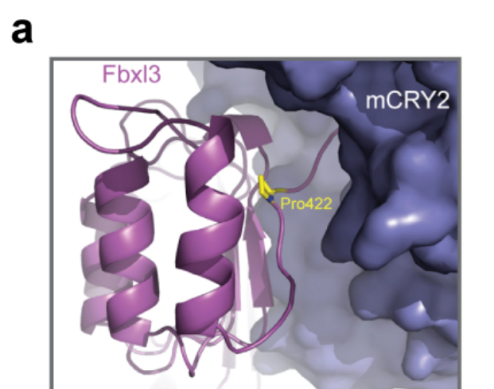

## Question

# Gene Research for Functional Annotation

## ⚠️ CRITICAL: Gene/Protein Identification Context

**BEFORE YOU BEGIN RESEARCH:** You MUST verify you are researching the CORRECT gene/protein. Gene symbols can be ambiguous, especially for less well-characterized genes from non-model organisms.

### Target Gene/Protein Identity (from UniProt):
- **UniProt Accession:** Q9UKT7
- **Protein Description:** RecName: Full=F-box/LRR-repeat protein 3; AltName: Full=F-box and leucine-rich repeat protein 3A; AltName: Full=F-box/LRR-repeat protein 3A;
- **Gene Information:** Name=FBXL3; Synonyms=FBL3A, FBXL3A;
- **Organism (full):** Homo sapiens (Human).
- **Protein Family:** Not specified in UniProt
- **Key Domains:** F-box-like_dom_sf. (IPR036047); F-box_dom. (IPR001810); LRR_dom_sf. (IPR032675); F-box-like (PF12937)

### MANDATORY VERIFICATION STEPS:

1. **Check if the gene symbol "FBXL3" matches the protein description above**
2. **Verify the organism is correct:** Homo sapiens (Human).
3. **Check if protein family/domains align with what you find in literature**
4. **If you find literature for a DIFFERENT gene with the same or similar symbol, STOP**

### If Gene Symbol is Ambiguous or You Cannot Find Relevant Literature:

**DO NOT PROCEED WITH RESEARCH ON A DIFFERENT GENE.** Instead:
- State clearly: "The gene symbol 'FBXL3' is ambiguous or literature is limited for this specific protein"
- Explain what you found (e.g., "Found extensive literature on a different gene with the same symbol in a different organism")
- Describe the protein based ONLY on the UniProt information provided above
- Suggest that the protein function can be inferred from domain/family information

### Research Target:

Please provide a comprehensive research report on the gene **FBXL3** (gene ID: FBXL3, UniProt: Q9UKT7) in human.

The research report should be a detailed narrative explaining the function, biological processes, and localization of the gene product. Citations should be given for all claims.

You should prioritize authoritative reviews and primary scientific literature when conducting research. You can supplement
this with annotations you find in gene/protein databases, but these can be outdated or inaccurate.

We are specifically interested in the primary function of the gene - for enzymes, what reaction is catalyzed, and what is the substrate specificity? For transporters, what is the substrate? For structural proteins or adapters, what is the broader structural role? For signaling molecules, what is the role in the pathway.

We are interested in where in or outside the cell the gene product carries out its function.

We are also interested in the signaling or biochemical pathways in which the gene functions. We are less interested in broad pleiotropic effects, except where these elucidate the precise role.

Include evidence where possible. We are interested in both experimental evidence as well as inference from structure, evolution, or bioinformatic analysis. Precise studies should be prioritized over high-throughput, where available.

## Output

Question: You are an expert researcher providing comprehensive, well-cited information.

Provide detailed information focusing on:
1. Key concepts and definitions with current understanding
2. Recent developments and latest research (prioritize 2023-2024 sources)
3. Current applications and real-world implementations
4. Expert opinions and analysis from authoritative sources
5. Relevant statistics and data from recent studies

Format as a comprehensive research report with proper citations. Include URLs and publication dates where available.
Always prioritize recent, authoritative sources and provide specific citations for all major claims.

# Gene Research for Functional Annotation

## ⚠️ CRITICAL: Gene/Protein Identification Context

**BEFORE YOU BEGIN RESEARCH:** You MUST verify you are researching the CORRECT gene/protein. Gene symbols can be ambiguous, especially for less well-characterized genes from non-model organisms.

### Target Gene/Protein Identity (from UniProt):
- **UniProt Accession:** Q9UKT7
- **Protein Description:** RecName: Full=F-box/LRR-repeat protein 3; AltName: Full=F-box and leucine-rich repeat protein 3A; AltName: Full=F-box/LRR-repeat protein 3A;
- **Gene Information:** Name=FBXL3; Synonyms=FBL3A, FBXL3A;
- **Organism (full):** Homo sapiens (Human).
- **Protein Family:** Not specified in UniProt
- **Key Domains:** F-box-like_dom_sf. (IPR036047); F-box_dom. (IPR001810); LRR_dom_sf. (IPR032675); F-box-like (PF12937)

### MANDATORY VERIFICATION STEPS:

1. **Check if the gene symbol "FBXL3" matches the protein description above**
2. **Verify the organism is correct:** Homo sapiens (Human).
3. **Check if protein family/domains align with what you find in literature**
4. **If you find literature for a DIFFERENT gene with the same or similar symbol, STOP**

### If Gene Symbol is Ambiguous or You Cannot Find Relevant Literature:

**DO NOT PROCEED WITH RESEARCH ON A DIFFERENT GENE.** Instead:
- State clearly: "The gene symbol 'FBXL3' is ambiguous or literature is limited for this specific protein"
- Explain what you found (e.g., "Found extensive literature on a different gene with the same symbol in a different organism")
- Describe the protein based ONLY on the UniProt information provided above
- Suggest that the protein function can be inferred from domain/family information

### Research Target:

Please provide a comprehensive research report on the gene **FBXL3** (gene ID: FBXL3, UniProt: Q9UKT7) in human.

The research report should be a detailed narrative explaining the function, biological processes, and localization of the gene product. Citations should be given for all claims.

You should prioritize authoritative reviews and primary scientific literature when conducting research. You can supplement
this with annotations you find in gene/protein databases, but these can be outdated or inaccurate.

We are specifically interested in the primary function of the gene - for enzymes, what reaction is catalyzed, and what is the substrate specificity? For transporters, what is the substrate? For structural proteins or adapters, what is the broader structural role? For signaling molecules, what is the role in the pathway.

We are interested in where in or outside the cell the gene product carries out its function.

We are also interested in the signaling or biochemical pathways in which the gene functions. We are less interested in broad pleiotropic effects, except where these elucidate the precise role.

Include evidence where possible. We are interested in both experimental evidence as well as inference from structure, evolution, or bioinformatic analysis. Precise studies should be prioritized over high-throughput, where available.

## Research report: Human **FBXL3** (UniProt **Q9UKT7**) functional annotation

### 0) Target verification (mandatory)
The literature retrieved here consistently refers to **FBXL3** as a **human F-box/leucine-rich repeat (LRR) protein** that functions as the substrate-recognition subunit of an **SCF (SKP1–CUL1–RBX1) E3 ubiquitin ligase** targeting **cryptochromes (CRY1/CRY2)** for ubiquitin-dependent proteasomal degradation, matching the UniProt Q9UKT7 description and domain architecture (F-box + LRR) (calloni2023thestructuraland pages 3-4, calloni2023thestructuraland pages 2-3). No conflicting gene with the same symbol in another organism was used for the mechanistic claims.

### 1) Key concepts & definitions (current understanding)

#### 1.1 FBXL3 as an SCF E3 ubiquitin ligase substrate receptor
FBXL3 is an **F-box protein** that specifies substrate recognition within an SCF-type cullin-RING ligase, i.e., **SCF^FBXL3 = SKP1–CUL1–RBX1–FBXL3**, where SKP1 binds the **F-box domain** and FBXL3’s **LRR domain** mediates substrate recognition (yumimoto2013substratebindingpromotes pages 1-2, calloni2023thestructuraland pages 2-3). In circadian biology, SCF^FBXL3 is a core post-translational regulator of the mammalian transcription–translation feedback loop (TTFL) by controlling the **turnover of CRY repressors** (rosensweig2020periodicityrepressionand pages 13-14, calloni2023thestructuraland pages 2-3).

#### 1.2 Primary substrates: CRY1 and CRY2
A central and repeatedly supported function of FBXL3 is to **recognize, ubiquitinate, and promote proteasomal degradation** of the circadian repressors **CRY1 and CRY2**, thereby influencing circadian period length and rhythm robustness (calloni2023thestructuraland pages 3-4, yumimoto2013substratebindingpromotes pages 1-2, rosensweig2020periodicityrepressionand pages 13-14).

#### 1.3 Relationship to FBXL21 and the PER proteins
FBXL3 works in a network of clock-protein stability regulators. A key concept is functional antagonism between **FBXL3** and its paralog **FBXL21**: FBXL21 binds CRYs strongly but ubiquitinates less efficiently, helping stabilize CRYs and antagonize FBXL3-driven degradation (calloni2023thestructuraland pages 3-4, rosensweig2020periodicityrepressionand pages 13-14). PER proteins can also **protect CRYs** by competing with FBXL3 for overlapping binding interfaces on CRY (rosensweig2020periodicityrepressionand pages 13-14, chan2023watchingtheclock pages 6-7).

### 2) Molecular function, mechanism, and pathway placement

#### 2.1 Substrate-dependent SCF^FBXL3 assembly (regulatory logic)
In cells, FBXL3 shows an unusual regulatory feature: **SCF complex formation is strongly promoted by substrate binding**, especially CRY1. In transfected mammalian cells, FBXL3 did not substantially associate with SKP1/CUL1 unless its substrate **CRY1** was expressed; a CRY1-binding-defective FBXL3 mutant failed to form the SCF complex in vivo, supporting a substrate-dependent assembly mechanism (yumimoto2013substratebindingpromotes pages 1-2, yumimoto2013substratebindingpromotes pages 10-10). This implies that CRY availability can regulate FBXL3 E3 ligase assembly/activity.

#### 2.2 Structural mechanism of CRY recognition: “cofactor pocket capture”
Crystal structures show that FBXL3 recognizes CRY through a bipartite interface in which a conserved **C-terminal tail of FBXL3 inserts into the CRY FAD-binding pocket** in the photolyase homology region (PHR), while other contacts engage the broader CRY surface (xing2013scffbxl3ubiquitinligase pages 13-16, calloni2023thestructuraland pages 3-4). The CRY2–FBXL3–SKP1 complex was solved at **2.7 Å** resolution (xing2013scffbxl3ubiquitinligase pages 13-16). This mechanism explains why the CRY cofactor pocket is also a druggable site (see §4).

**Visual evidence:** the insertion of the FBXL3 C-terminal tail into the CRY2 pocket is shown in a structural panel retrieved from the Nature 2013 study (xing2013scffbxl3ubiquitinligase media 0c122a57).

#### 2.3 Competition with FAD and PER proteins
Because FBXL3 occupies the CRY FAD-binding pocket, **FAD can compete with FBXL3** and displace it in vitro; a 2023 review reports measured FAD-binding affinities for *human* CRYs of **Kd ≈ 16 μM (CRY1)** and **Kd ≈ 68 μM (CRY2)**, supporting partial occupancy and potential regulation by local flavin pools (calloni2023thestructuraland pages 3-4). PER proteins can also exclude FBXL3 from CRY complexes because PER and FBXL3 share overlapping binding locations on CRY, thereby stabilizing CRYs against degradation (rosensweig2020periodicityrepressionand pages 13-14, chan2023watchingtheclock pages 6-7).

#### 2.4 Ubiquitination chemistry (linkage type and site breadth)
A recent Endocrinology review states that FBXL3 catalyzes elongation of **K48-linked polyubiquitin** chains on CRYs, consistent with canonical proteasome-targeting ubiquitin signals (sato2023circadianregulationof pages 10-10). A circadian clock structural review also reports that FBXL3 ubiquitinates CRY more efficiently than FBXL21 and that FBXL3 was reported to ubiquitinate **11 lysine residues on CRY1**, whereas FBXL21 targets a single site (K11) in a secondary pocket (rosensweig2020periodicityrepressionand pages 13-14).

#### 2.5 Cellular localization
FBXL3 is described as **nuclear**, while FBXL21 is described as mainly **cytosolic**, with FBXL3–CRY interactions reported as entirely nuclear in a structural circadian clock review (calloni2023thestructuraland pages 3-4, rosensweig2020periodicityrepressionand pages 13-14). This spatial separation supports a model in which FBXL21 can buffer/sequester CRYs outside the nucleus and modulate how much CRY is available for FBXL3-mediated nuclear degradation.

#### 2.6 System-level role in circadian period determination
Mutations that disrupt FBXL3–CRY binding stabilize CRYs and can lengthen circadian period; one review reports in vivo period lengthening to **~26–27 h** in FBXL3 mutant contexts (rosensweig2020periodicityrepressionand pages 13-14, rosensweig2020periodicityrepressionand pages 11-13). This connects the molecular action (CRY degradation) to the macroscopic phenotype (clock period).

### 3) Recent developments (prioritizing 2023–2024)

#### 3.1 Chemical chronobiology: targeting the CRY–FBXL3 interface
A 2023 Cell Chemical Biology review summarizes the most mature chemical strategy: **stabilizing CRY1/2 by blocking FBXL3 access to the FAD pocket**. In a phenotypic circadian screen, **KL001** was identified as a first-in-class **CRY1/2 stabilizer** that produces period lengthening and amplitude reduction by competing with **FBXL3** for binding at the CRY FAD pocket (laothamatas2023metabolicandchemical pages 10-11). The same review describes translational use cases: KL001 can inhibit **glucagon-induced gluconeogenesis in primary hepatocytes** and inhibit **glioblastoma stem cell proliferation**, supporting metabolic and oncology applications of manipulating the CRY–FBXL3 axis (laothamatas2023metabolicandchemical pages 10-11).

The 2023 review also reports development of derivatives, including **KL101** (CRY1-selective), **TH301** (moderate preference for CRY2), and **SHP1703** (a more potent and bioavailable CRY2-selective derivative) with reported survival benefit in **glioblastoma stem cell–transplanted mice** (laothamatas2023metabolicandchemical pages 10-11).

#### 3.2 Clock biology in cancer contexts (biomarker framing)
A 2023 Neuro-Oncology review discusses circadian components as potential biomarkers and therapeutic levers in glioblastoma; mechanistically it notes that PER::CRY complex formation can inhibit FBXL3 targeting of CRY1/2, thereby protecting CRYs from degradation (chan2023watchingtheclock pages 6-7). While this is not FBXL3-only, it places FBXL3-controlled CRY turnover within an emerging “clock as cancer biology” framework.

#### 3.3 Human genetics signals involving FBXL3
A 2024 cohort study of consanguineous families with neurodevelopmental disorders lists a pathogenic **FBXL3 frameshift variant c.884delT, p.(Leu295Tyrfs*25)** (autosomal recessive), supporting that loss-of-function variants in FBXL3 occur in human disease genetics (paracha2024thegeneticcause pages 9-10). Separately, a 2023 review of circadian gene variants summarizes familial advanced sleep-phase disorder (FASPD) mechanisms in which a CRY2 variant is proposed to increase accessibility/affinity for the E3 ligase FBXL3, leading to increased CRY2 degradation; this underscores the physiological importance of the FBXL3–CRY interaction surface even when the variant is in CRY2 rather than FBXL3 (grskovic2023circadiangenevariants pages 8-9).

### 4) Current applications and real-world implementations

#### 4.1 Metabolic regulation (preclinical/experimental)
Chemical stabilization of CRYs at the FBXL3-binding pocket (KL001 class) has been used experimentally to modulate metabolism, including inhibition of glucagon-induced gluconeogenesis in primary hepatocyte culture (laothamatas2023metabolicandchemical pages 10-11). This represents a practical implementation of FBXL3 functional knowledge: modulating the degradation of CRY repressors changes downstream metabolic gene regulation.

#### 4.2 Oncology (preclinical and early translational framing)
The KL001 derivative landscape is explicitly connected to glioblastoma in the 2023 review (inhibition of glioblastoma stem cell proliferation; survival extension in a mouse transplant model for a CRY2-selective derivative) (laothamatas2023metabolicandchemical pages 10-11). 

A 2024 MDPI paper (published 28 Dec 2024) evaluates **TH301** (described as a CRY2 stabilizer) in pancreatic ductal adenocarcinoma (PDAC) cell lines, reporting dose-dependent anti-oncogenic effects and synergy with chloroquine and oxaliplatin (farmakis2024th301emergesas pages 1-2). Although the paper’s mechanistic focus is broader than FBXL3, the chemical premise traces back to blocking FBXL3-mediated degradation at the CRY pocket as summarized in chemical chronobiology reviews (laothamatas2023metabolicandchemical pages 10-11).

### 5) Expert opinions & analysis (authoritative synthesis)
Structural and biochemical reviews emphasize that **protein turnover (especially CRY stability)** is a dominant determinant of circadian periodicity and that FBXL3 functions as a central “timer” by setting CRY degradation kinetics; disruptions of FBXL3–CRY binding stabilize repressors and lengthen the clock (rosensweig2020periodicityrepressionand pages 13-14, rosensweig2020periodicityrepressionand pages 11-13). The 2023 chemical-architecture review frames CRY–FBXL3 pocket competition as a uniquely tractable and validated molecular interface for **drug discovery** within the TTFL, given the combination of structural definition and cell-based phenotypic readouts (laothamatas2023metabolicandchemical pages 10-11).

### 6) Key statistics and quantitative data (from recent and classic mechanistic studies)

* **CRY–FAD affinities relevant to FBXL3 competition:** Kd ~ **16 μM** (human CRY1) and **68 μM** (human CRY2) (calloni2023thestructuraland pages 3-4).
* **Structural evidence:** CRY2–FBXL3–SKP1 complex solved at **2.7 Å** resolution (xing2013scffbxl3ubiquitinligase pages 13-16).
* **Circadian phenotype:** disruption of FBXL3–CRY binding reported to lengthen circadian period to **~26–27 h** (rosensweig2020periodicityrepressionand pages 13-14, rosensweig2020periodicityrepressionand pages 11-13).
* **Ubiquitination breadth:** FBXL3 reported to ubiquitinate **11 lysines** on CRY1 (rosensweig2020periodicityrepressionand pages 13-14).
* **Ubiquitin linkage:** FBXL3 promotes **K48-linked polyubiquitin** chain elongation on CRYs (sato2023circadianregulationof pages 10-10).
* **Disease-burden statistics used in a CRY2-stabilizer translational context:** PDAC estimated **510,566 new cases** and **467,005 deaths** worldwide in 2022; 5-year survival **<13%** (farmakis2024th301emergesas pages 1-2).

### 7) Evidence-backed summary table
The following table consolidates the core annotation points (identity/domains, complex membership, substrates, mechanism, regulation, applications, and genetics) with URLs.

| Category | Key evidence / notes | Reference (year, journal) | URL |
|---|---|---|---|
| Identity / domains | Human FBXL3 (UniProt Q9UKT7) is an F-box/leucine-rich repeat protein; reviews describe it as a canonical F-box protein containing an F-box domain plus LRRs and functioning as the substrate-recognition subunit of an SCF E3 ligase that regulates circadian cryptochromes (calloni2023thestructuraland pages 2-3, calloni2023thestructuraland pages 3-4) | Calloni & Vabulas, 2023, *Front. Mol. Biosci.* | https://doi.org/10.3389/fmolb.2022.1081661 |
| Complex membership | FBXL3 forms an SCF^FBXL3 complex with SKP1, CUL1, and RBX1; substrate binding promotes complex formation in vivo, and Cry1 binding is required for robust SCF assembly in cells (yumimoto2013substratebindingpromotes pages 1-2, yumimoto2013substratebindingpromotes pages 10-10) | Yumimoto et al., 2013, *J. Biol. Chem.* | https://doi.org/10.1074/jbc.M113.511303 |
| Primary substrates | The best-supported FBXL3 substrates are CRY1 and CRY2, which are ubiquitylated and degraded to control the negative arm of the mammalian circadian clock; this was identified by pulldown/mass spectrometry and validated biochemically (calloni2023thestructuraland pages 2-3, calloni2023thestructuraland pages 3-4) | Calloni & Vabulas, 2023, *Front. Mol. Biosci.* | https://doi.org/10.3389/fmolb.2022.1081661 |
| Mechanism of substrate recognition | Structural work showed that FBXL3 captures CRY2 through a bipartite interaction: its C-terminal tail inserts into the CRY FAD-binding pocket while additional contacts involve the PER-binding interface/LRR surface; this explains competition with FAD and PER proteins (xing2013scffbxl3ubiquitinligase pages 13-16, rosensweig2020periodicityrepressionand pages 13-14, xing2013scffbxl3ubiquitinligase media 0c122a57) | Xing et al., 2013, *Nature* | https://doi.org/10.1038/nature11964 |
| Ubiquitin chain / linkage | Recent review evidence states that FBXL3 catalyzes elongation of K48-linked polyubiquitin chains on CRYs; earlier review evidence notes FBXL3 ubiquitylates CRY more efficiently than FBXL21 and targets multiple lysines on CRY1 (11 lysines reported) (sato2023circadianregulationof pages 10-10, rosensweig2020periodicityrepressionand pages 13-14) | Sato & Sato, 2023, *Endocrinology* | https://doi.org/10.1210/endocr/bqad086 |
| Localization | FBXL3 is described as predominantly nuclear, whereas the paralogue FBXL21 is mainly cytosolic (but can also act in nucleus/cytoplasm in some reviews); FBXL3–CRY interaction is reported as entirely nuclear (calloni2023thestructuraland pages 3-4, rosensweig2020periodicityrepressionand pages 13-14) | Calloni & Vabulas, 2023, *Front. Mol. Biosci.* | https://doi.org/10.3389/fmolb.2022.1081661 |
| Regulatory interactions (FBXL21, PER, FAD) | FBXL21 antagonizes FBXL3 by binding CRY more strongly but ubiquitylating it less efficiently, thereby stabilizing/sequestering CRY; PER proteins protect CRY by competing for overlapping binding interfaces; FAD can displace FBXL3 from CRY, and reported human FAD affinities are Kd ≈16 μM for CRY1 and 68 μM for CRY2 (calloni2023thestructuraland pages 3-4, rosensweig2020periodicityrepressionand pages 13-14, chan2023watchingtheclock pages 6-7) | Rosensweig & Green, 2020, *Eur. J. Neurosci.*; Calloni & Vabulas, 2023, *Front. Mol. Biosci.* | https://doi.org/10.1111/ejn.14254 ; https://doi.org/10.3389/fmolb.2022.1081661 |
| Small-molecule modulators / applications | KL001 is a first-in-class CRY1/2 stabilizer that competes with FBXL3 at the CRY FAD pocket, lengthens circadian period, and has been used to inhibit glucagon-induced gluconeogenesis and glioblastoma stem-cell proliferation; derivatives include CRY1-selective KL101 and moderately CRY2-preferring TH301, while SHP1703 is a more potent/bioavailable CRY2-selective derivative that extended survival in GSC-transplanted mice; TH301 also showed anti-oncogenic activity in PDAC cells (laothamatas2023metabolicandchemical pages 10-11, farmakis2024th301emergesas pages 1-2, chawla2024timelyquestionsemerging pages 7-9) | Laothamatas et al., 2023, *Cell Chem. Biol.*; Farmakis et al., 2024/2025, *Int. J. Mol. Sci.* | https://doi.org/10.1016/j.chembiol.2023.08.014 ; https://doi.org/10.3390/ijms26010178 |
| Human genetics / variants | Human disease evidence is limited in the retrieved set, but a reported pathogenic FBXL3 frameshift variant c.884delT, p.(Leu295Tyrfs*25) was listed in a family with autosomal-recessive neurodevelopmental disorder/intellectual disability; circadian-variant reviews also emphasize that altered FBXL3-mediated CRY2 degradation is mechanistically relevant to familial advanced sleep phase through CRY2 Ala260Thr (affinity increase for FBXL3) rather than FBXL3 coding variation itself (paracha2024thegeneticcause pages 9-10, grskovic2023circadiangenevariants pages 8-9) | Paracha et al., 2024, *Front. Med.*; Gršković & Korać, 2023, *Genes* | https://doi.org/10.3389/fmed.2024.1424753 ; https://doi.org/10.3390/genes14091703 |

*Table: This table summarizes the core functional annotation of human FBXL3 (UniProt Q9UKT7), including its domains, SCF complex role, cryptochrome substrates, mechanism, regulation, localization, pharmacology, and limited human genetic evidence. It is useful as a concise evidence-backed reference for the gene’s primary molecular function in circadian clock control.*

### 8) Limitations of this synthesis
The retrieved evidence base strongly supports FBXL3’s **primary molecular function** as an SCF adaptor for CRY turnover, but provides limited direct, human-tissue quantitative expression statistics for FBXL3 itself (as opposed to CRY or cancer datasets). The report therefore prioritizes mechanistic and translational evidence where the causal chain from FBXL3 action to phenotype is best established.

References

1. (calloni2023thestructuraland pages 3-4): Giulia Calloni and R. Martin Vabulas. The structural and functional roles of the flavin cofactor fad in mammalian cryptochromes. Frontiers in Molecular Biosciences, Jan 2023. URL: https://doi.org/10.3389/fmolb.2022.1081661, doi:10.3389/fmolb.2022.1081661. This article has 8 citations.

2. (calloni2023thestructuraland pages 2-3): Giulia Calloni and R. Martin Vabulas. The structural and functional roles of the flavin cofactor fad in mammalian cryptochromes. Frontiers in Molecular Biosciences, Jan 2023. URL: https://doi.org/10.3389/fmolb.2022.1081661, doi:10.3389/fmolb.2022.1081661. This article has 8 citations.

3. (yumimoto2013substratebindingpromotes pages 1-2): Kanae Yumimoto, Tetsuya Muneoka, Tomohiro Tsuboi, and Keiichi I. Nakayama. Substrate binding promotes formation of the skp1-cul1-fbxl3 (scffbxl3) protein complex. Journal of Biological Chemistry, 288:32766-32776, Nov 2013. URL: https://doi.org/10.1074/jbc.m113.511303, doi:10.1074/jbc.m113.511303. This article has 38 citations and is from a domain leading peer-reviewed journal.

4. (rosensweig2020periodicityrepressionand pages 13-14): Clark Rosensweig and Carla B. Green. Periodicity, repression, and the molecular architecture of the mammalian circadian clock. European Journal of Neuroscience, 51:139-165, Dec 2020. URL: https://doi.org/10.1111/ejn.14254, doi:10.1111/ejn.14254. This article has 61 citations and is from a domain leading peer-reviewed journal.

5. (chan2023watchingtheclock pages 6-7): Priscilla Chan, Jeremy N Rich, and Steve A Kay. Watching the clock in glioblastoma. Neuro-Oncology, 25:1932-1946, Jun 2023. URL: https://doi.org/10.1093/neuonc/noad107, doi:10.1093/neuonc/noad107. This article has 48 citations and is from a domain leading peer-reviewed journal.

6. (yumimoto2013substratebindingpromotes pages 10-10): Kanae Yumimoto, Tetsuya Muneoka, Tomohiro Tsuboi, and Keiichi I. Nakayama. Substrate binding promotes formation of the skp1-cul1-fbxl3 (scffbxl3) protein complex. Journal of Biological Chemistry, 288:32766-32776, Nov 2013. URL: https://doi.org/10.1074/jbc.m113.511303, doi:10.1074/jbc.m113.511303. This article has 38 citations and is from a domain leading peer-reviewed journal.

7. (xing2013scffbxl3ubiquitinligase pages 13-16): Weiman Xing, Luca Busino, Thomas R. Hinds, Samuel T. Marionni, Nabiha H. Saifee, Matthew F. Bush, Michele Pagano, and Ning Zheng. Scffbxl3 ubiquitin ligase targets cryptochromes at their cofactor pocket. Mar 2013. URL: https://doi.org/10.1038/nature11964, doi:10.1038/nature11964. This article has 277 citations and is from a highest quality peer-reviewed journal.

8. (xing2013scffbxl3ubiquitinligase media 0c122a57): Weiman Xing, Luca Busino, Thomas R. Hinds, Samuel T. Marionni, Nabiha H. Saifee, Matthew F. Bush, Michele Pagano, and Ning Zheng. Scffbxl3 ubiquitin ligase targets cryptochromes at their cofactor pocket. Mar 2013. URL: https://doi.org/10.1038/nature11964, doi:10.1038/nature11964. This article has 277 citations and is from a highest quality peer-reviewed journal.

9. (sato2023circadianregulationof pages 10-10): Tomoki Sato and Shogo Sato. Circadian regulation of metabolism - commitment to health and diseases. Endocrinology, May 2023. URL: https://doi.org/10.1210/endocr/bqad086, doi:10.1210/endocr/bqad086. This article has 54 citations and is from a domain leading peer-reviewed journal.

10. (rosensweig2020periodicityrepressionand pages 11-13): Clark Rosensweig and Carla B. Green. Periodicity, repression, and the molecular architecture of the mammalian circadian clock. European Journal of Neuroscience, 51:139-165, Dec 2020. URL: https://doi.org/10.1111/ejn.14254, doi:10.1111/ejn.14254. This article has 61 citations and is from a domain leading peer-reviewed journal.

11. (laothamatas2023metabolicandchemical pages 10-11): Isara Laothamatas, Emil Sjulstok Rasmussen, Carla B. Green, and Joseph S. Takahashi. Metabolic and chemical architecture of the mammalian circadian clock. Cell chemical biology, 30:1033-1052, Sep 2023. URL: https://doi.org/10.1016/j.chembiol.2023.08.014, doi:10.1016/j.chembiol.2023.08.014. This article has 99 citations and is from a domain leading peer-reviewed journal.

12. (paracha2024thegeneticcause pages 9-10): Sohail Aziz Paracha, Shoaib Nawaz, Muhammad Tahir Sarwar, Asmat Shaheen, Gohar Zaman, Jawad Ahmed, Fahim Shah, Sundus Khwaja, Abid Jan, Nida Khan, Mohammad Azhar Kamal, Qamre Alam, Safdar Abbas, Saman Farman, Ahmed Waqas, Afnan Alkathiri, Abdullah Hamadi, Federico Santoni, Naseeb Ullah, Bisma Khalid, Stylianos E. Antonarakis, Khalid A Fakhro, Muhammad Umair, and Muhammad Ansar. The genetic cause of neurodevelopmental disorders in 30 consanguineous families. Frontiers in Medicine, Aug 2024. URL: https://doi.org/10.3389/fmed.2024.1424753, doi:10.3389/fmed.2024.1424753. This article has 8 citations.

13. (grskovic2023circadiangenevariants pages 8-9): Paula Gršković and Petra Korać. Circadian gene variants in diseases. Genes, 14:1703, Aug 2023. URL: https://doi.org/10.3390/genes14091703, doi:10.3390/genes14091703. This article has 15 citations.

14. (farmakis2024th301emergesas pages 1-2): Danae Farmakis, Dimitrios J. Stravopodis, and Anastasia Prombona. Th301 emerges as a novel anti-oncogenic agent for human pancreatic cancer cells: the dispensable roles of p53, cry2 and bmal1 in th301-induced cdkn1a/p21cip1/waf1 upregulation. International Journal of Molecular Sciences, 26:178, Dec 2024. URL: https://doi.org/10.3390/ijms26010178, doi:10.3390/ijms26010178. This article has 4 citations.

15. (chawla2024timelyquestionsemerging pages 7-9): Sangeeta Chawla, John O’Neill, Marina I. Knight, Yuqing He, Lei Wang, Erik Maronde, Sergio Gil Rodríguez, Gerben van Ooijen, Eduardo Garbarino-Pico, Eva Wolf, Ouria Dkhissi-Benyahya, Anjoom Nikhat, Shaon Chakrabarti, Shawn D. Youngstedt, Natalie Zi-Ching Mak, Ignacio Provencio, Henrik Oster, Namni Goel, Mario Caba, Maria Oosthuizen, Giles E. Duffield, Christopher Chabot, and Seth J. Davis. Timely questions emerging in chronobiology: the circadian clock keeps on ticking. Journal of Circadian Rhythms, Apr 2024. URL: https://doi.org/10.5334/jcr.237, doi:10.5334/jcr.237. This article has 10 citations and is from a peer-reviewed journal.

## Artifacts

- [Edison artifact artifact-00](FBXL3-deep-research-falcon_artifacts/artifact-00.md)

## Citations

1. calloni2023thestructuraland pages 3-4
2. sato2023circadianregulationof pages 10-10
3. rosensweig2020periodicityrepressionand pages 13-14
4. laothamatas2023metabolicandchemical pages 10-11
5. chan2023watchingtheclock pages 6-7
6. paracha2024thegeneticcause pages 9-10
7. grskovic2023circadiangenevariants pages 8-9
8. calloni2023thestructuraland pages 2-3
9. yumimoto2013substratebindingpromotes pages 1-2
10. yumimoto2013substratebindingpromotes pages 10-10
11. rosensweig2020periodicityrepressionand pages 11-13
12. chawla2024timelyquestionsemerging pages 7-9
13. https://doi.org/10.3389/fmolb.2022.1081661
14. https://doi.org/10.1074/jbc.M113.511303
15. https://doi.org/10.1038/nature11964
16. https://doi.org/10.1210/endocr/bqad086
17. https://doi.org/10.1111/ejn.14254
18. https://doi.org/10.1016/j.chembiol.2023.08.014
19. https://doi.org/10.3390/ijms26010178
20. https://doi.org/10.3389/fmed.2024.1424753
21. https://doi.org/10.3390/genes14091703
22. https://doi.org/10.3389/fmolb.2022.1081661,
23. https://doi.org/10.1074/jbc.m113.511303,
24. https://doi.org/10.1111/ejn.14254,
25. https://doi.org/10.1093/neuonc/noad107,
26. https://doi.org/10.1038/nature11964,
27. https://doi.org/10.1210/endocr/bqad086,
28. https://doi.org/10.1016/j.chembiol.2023.08.014,
29. https://doi.org/10.3389/fmed.2024.1424753,
30. https://doi.org/10.3390/genes14091703,
31. https://doi.org/10.3390/ijms26010178,
32. https://doi.org/10.5334/jcr.237,