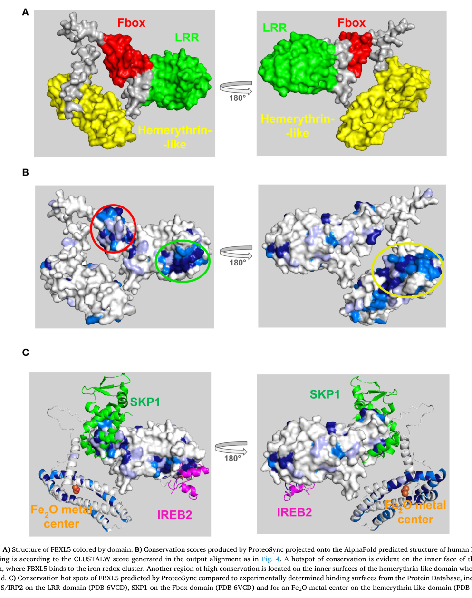

## Question

# Gene Research for Functional Annotation

## ⚠️ CRITICAL: Gene/Protein Identification Context

**BEFORE YOU BEGIN RESEARCH:** You MUST verify you are researching the CORRECT gene/protein. Gene symbols can be ambiguous, especially for less well-characterized genes from non-model organisms.

### Target Gene/Protein Identity (from UniProt):
- **UniProt Accession:** Q9UKA1
- **Protein Description:** RecName: Full=F-box/LRR-repeat protein 5; AltName: Full=F-box and leucine-rich repeat protein 5; AltName: Full=F-box protein FBL4/FBL5; AltName: Full=p45SKP2-like protein;
- **Gene Information:** Name=FBXL5; Synonyms=FBL4, FBL5, FLR1;
- **Organism (full):** Homo sapiens (Human).
- **Protein Family:** Not specified in UniProt
- **Key Domains:** F-box-like_dom_sf. (IPR036047); F-box_dom. (IPR001810); Hemerythrin-like. (IPR012312); Hr_FBXL5. (IPR045808); Leu-rich_rpt. (IPR001611)

### MANDATORY VERIFICATION STEPS:

1. **Check if the gene symbol "FBXL5" matches the protein description above**
2. **Verify the organism is correct:** Homo sapiens (Human).
3. **Check if protein family/domains align with what you find in literature**
4. **If you find literature for a DIFFERENT gene with the same or similar symbol, STOP**

### If Gene Symbol is Ambiguous or You Cannot Find Relevant Literature:

**DO NOT PROCEED WITH RESEARCH ON A DIFFERENT GENE.** Instead:
- State clearly: "The gene symbol 'FBXL5' is ambiguous or literature is limited for this specific protein"
- Explain what you found (e.g., "Found extensive literature on a different gene with the same symbol in a different organism")
- Describe the protein based ONLY on the UniProt information provided above
- Suggest that the protein function can be inferred from domain/family information

### Research Target:

Please provide a comprehensive research report on the gene **FBXL5** (gene ID: FBXL5, UniProt: Q9UKA1) in human.

The research report should be a detailed narrative explaining the function, biological processes, and localization of the gene product. Citations should be given for all claims.

You should prioritize authoritative reviews and primary scientific literature when conducting research. You can supplement
this with annotations you find in gene/protein databases, but these can be outdated or inaccurate.

We are specifically interested in the primary function of the gene - for enzymes, what reaction is catalyzed, and what is the substrate specificity? For transporters, what is the substrate? For structural proteins or adapters, what is the broader structural role? For signaling molecules, what is the role in the pathway.

We are interested in where in or outside the cell the gene product carries out its function.

We are also interested in the signaling or biochemical pathways in which the gene functions. We are less interested in broad pleiotropic effects, except where these elucidate the precise role.

Include evidence where possible. We are interested in both experimental evidence as well as inference from structure, evolution, or bioinformatic analysis. Precise studies should be prioritized over high-throughput, where available.

## Output

Question: You are an expert researcher providing comprehensive, well-cited information.

Provide detailed information focusing on:
1. Key concepts and definitions with current understanding
2. Recent developments and latest research (prioritize 2023-2024 sources)
3. Current applications and real-world implementations
4. Expert opinions and analysis from authoritative sources
5. Relevant statistics and data from recent studies

Format as a comprehensive research report with proper citations. Include URLs and publication dates where available.
Always prioritize recent, authoritative sources and provide specific citations for all major claims.

# Gene Research for Functional Annotation

## ⚠️ CRITICAL: Gene/Protein Identification Context

**BEFORE YOU BEGIN RESEARCH:** You MUST verify you are researching the CORRECT gene/protein. Gene symbols can be ambiguous, especially for less well-characterized genes from non-model organisms.

### Target Gene/Protein Identity (from UniProt):
- **UniProt Accession:** Q9UKA1
- **Protein Description:** RecName: Full=F-box/LRR-repeat protein 5; AltName: Full=F-box and leucine-rich repeat protein 5; AltName: Full=F-box protein FBL4/FBL5; AltName: Full=p45SKP2-like protein;
- **Gene Information:** Name=FBXL5; Synonyms=FBL4, FBL5, FLR1;
- **Organism (full):** Homo sapiens (Human).
- **Protein Family:** Not specified in UniProt
- **Key Domains:** F-box-like_dom_sf. (IPR036047); F-box_dom. (IPR001810); Hemerythrin-like. (IPR012312); Hr_FBXL5. (IPR045808); Leu-rich_rpt. (IPR001611)

### MANDATORY VERIFICATION STEPS:

1. **Check if the gene symbol "FBXL5" matches the protein description above**
2. **Verify the organism is correct:** Homo sapiens (Human).
3. **Check if protein family/domains align with what you find in literature**
4. **If you find literature for a DIFFERENT gene with the same or similar symbol, STOP**

### If Gene Symbol is Ambiguous or You Cannot Find Relevant Literature:

**DO NOT PROCEED WITH RESEARCH ON A DIFFERENT GENE.** Instead:
- State clearly: "The gene symbol 'FBXL5' is ambiguous or literature is limited for this specific protein"
- Explain what you found (e.g., "Found extensive literature on a different gene with the same symbol in a different organism")
- Describe the protein based ONLY on the UniProt information provided above
- Suggest that the protein function can be inferred from domain/family information

### Research Target:

Please provide a comprehensive research report on the gene **FBXL5** (gene ID: FBXL5, UniProt: Q9UKA1) in human.

The research report should be a detailed narrative explaining the function, biological processes, and localization of the gene product. Citations should be given for all claims.

You should prioritize authoritative reviews and primary scientific literature when conducting research. You can supplement
this with annotations you find in gene/protein databases, but these can be outdated or inaccurate.

We are specifically interested in the primary function of the gene - for enzymes, what reaction is catalyzed, and what is the substrate specificity? For transporters, what is the substrate? For structural proteins or adapters, what is the broader structural role? For signaling molecules, what is the role in the pathway.

We are interested in where in or outside the cell the gene product carries out its function.

We are also interested in the signaling or biochemical pathways in which the gene functions. We are less interested in broad pleiotropic effects, except where these elucidate the precise role.

Include evidence where possible. We are interested in both experimental evidence as well as inference from structure, evolution, or bioinformatic analysis. Precise studies should be prioritized over high-throughput, where available.

## Research Report: Human **FBXL5** (UniProt **Q9UKA1**) — Functional Annotation and Current Understanding

### 0) Target verification (mandatory)
The literature summarized here is consistent with the UniProt identity provided: **human FBXL5 (F-box and leucine-rich repeat protein 5; UniProt Q9UKA1)**, an **F-box/LRR protein** containing an **N-terminal hemerythrin-like (Hr) domain** and functioning as a **substrate receptor for an SCF (SKP1–CUL1–F-box) E3 ubiquitin ligase** that regulates iron homeostasis by controlling **IRP2/IREB2 stability**. Domain architecture and SCF interactions are explicitly described and visualized in structural analyses (sicheri2025analysisoffbox pages 4-7, sicheri2025analysisoffbox media b6a989cb).

---

### 1) Key concepts and definitions (current understanding)

#### 1.1 FBXL5 as a substrate receptor in an SCF E3 ubiquitin ligase
**FBXL5** is best understood as a **substrate-adaptor (F-box) protein** that confers substrate specificity to an **SCF E3 ubiquitin ligase**, enabling polyubiquitination and subsequent **proteasomal degradation** of specific client proteins (notably **IRP2/IREB2**) in response to iron/oxygen status (cortadellas2023characterizationofnew pages 41-45, chen2026regulationofmitochondrial pages 4-5).

#### 1.2 IRP/IRE post-transcriptional iron regulation (context for FBXL5 function)
IRP1 and IRP2 are iron regulatory proteins that bind **iron-responsive elements (IREs)** in target mRNAs to coordinate iron uptake, storage, and utilization. IRP2 does **not** assemble an Fe–S cluster (in contrast to IRP1’s aconitase/IRP switch) and is regulated mainly by **iron-dependent degradation** (liang2026thecriticalrole pages 2-3). FBXL5 is a key mediator of that degradation response (liang2026thecriticalrole pages 2-3).

#### 1.3 “Iron/oxygen sensor” concept as applied to FBXL5
FBXL5 is widely described as an **iron- and oxygen-sensitive** regulator: its own stability depends on occupancy of metal cofactors, and its stability controls whether IRP2 is degraded (iron replete) or allowed to accumulate (iron deficiency) (jain2026ironregulationredox pages 8-10, liang2026thecriticalrole pages 2-3).

---

### 2) Molecular function, domains, and mechanism (structure → function)

#### 2.1 Domain architecture (and why it matters)
A structural/functional synthesis of FBXL5 describes three major regions: an **N-terminal hemerythrin-like (Hr) domain**, a **central F-box domain**, and a **C-terminal leucine-rich repeat (LRR) domain** (sicheri2025analysisoffbox pages 4-7). The F-box domain provides a **SKP1-binding interface**, linking FBXL5 to the SCF machinery, while the LRR region mediates key substrate-binding and cofactor-linked regulation (sicheri2025analysisoffbox pages 4-7).

A retrieved figure from a structural analysis visually summarizes this architecture and shows interaction surfaces with **SKP1** and **IREB2 (IRP2)**, as well as a diiron center (sicheri2025analysisoffbox media b6a989cb).

#### 2.2 Iron-dependent regulation of FBXL5 stability and IRP2 ubiquitination
Across mechanistic summaries, a consistent model emerges:

- **High iron:** iron binding stabilizes FBXL5, enabling it (as SCF substrate receptor) to recruit **IRP2** for ubiquitination and **proteasomal degradation** (cortadellas2023characterizationofnew pages 41-45, chen2026regulationofmitochondrial pages 4-5, jain2026ironregulationredox pages 8-10).
- **Low iron:** loss of stabilizing metal cofactor occupancy destabilizes FBXL5, leading to FBXL5 degradation and **IRP2 accumulation**, which then drives the IRP/IRE post-transcriptional iron response (chen2026regulationofmitochondrial pages 4-5, jain2026ironregulationredox pages 8-10).

A structural analysis adds mechanistic detail: FBXL5 contains an Hr-like N-terminus that binds a **diiron metal center** under high iron; loss of metal binding under low-iron conditions promotes conformational changes and FBXL5 turnover (sicheri2025analysisoffbox pages 4-7).

#### 2.3 Oxygen responsiveness and Fe–S cluster-linked sensing
Recent literature continues to emphasize **oxygen sensitivity** in the FBXL5–IRP2 axis. Review-level evidence states that “iron- and oxygen-dependent degradation of IRP2 is mediated by FBXL5 E3 ligase,” and that FBXL5 structural stability is disrupted under iron deficiency, preventing IRP2 degradation (liang2026thecriticalrole pages 2-3).

Mechanistic work cited in 2024 (and discussed in a Molecular Cell 2024 paper’s contextual citations) points to an **oxygen-responsive [2Fe–2S] cluster** as part of FBXL5-linked sensing (ast2024mettl17isan pages 24-26). A structural/functional synthesis further describes a **[2Fe–2S] cluster association** tied to the LRR region and IRP2 recruitment (sicheri2025analysisoffbox pages 4-7), and a review summary likewise states that FBXL5 stability depends on both a **diiron hemerythrin-like domain** and a **[2Fe–2S] cluster** (jain2026ironregulationredox pages 8-10).

#### 2.4 Substrates and interaction partners
The dominant, repeatedly supported substrate is **IRP2 (IREB2)** (chen2026regulationofmitochondrial pages 4-5, cortadellas2023characterizationofnew pages 41-45, jain2026ironregulationredox pages 8-10). Interaction with **SKP1** as part of SCF complex assembly is supported by structural/interaction summaries (sicheri2025analysisoffbox pages 4-7, sicheri2025analysisoffbox media b6a989cb).

#### 2.5 Subcellular localization
Evidence retrieved here is limited and partly inconsistent across summaries. One review places FBXL5 activity “in the nucleus” while also noting IRP2/IRP1 function in the cytosol as RNA-binding proteins (chen2026regulationofmitochondrial pages 4-5). Other sources discuss the pathway without strong compartment specificity (jain2026ironregulationredox pages 8-10, liang2026thecriticalrole pages 2-3). Thus, based strictly on retrieved evidence, **FBXL5 can operate in nuclear-associated contexts**, but the full compartment distribution cannot be conclusively resolved from the current evidence set.

---

### 3) Recent developments and latest research (prioritizing 2023–2024)

#### 3.1 2023 JBC perspective on oxygen modulation of iron homeostasis
A 2023 Journal of Biological Chemistry article on oxygen modulation of iron homeostasis discusses regulation of the IRP system and references **FBXL5 in SCF^FBXL5-mediated control of IRP2**, including Fe–S/iron-linked sensing concepts (publication date: **May 2023**; URL: https://doi.org/10.1016/j.jbc.2023.104701) (guo2024novelbiallelicvariants pages 9-9).

#### 3.2 2024 PNAS work highlighting FBXL5 as an “iron-sensing” [2Fe–2S] case
A 2024 PNAS paper on cytosolic [2Fe–2S] protein biogenesis explicitly frames FBXL5 as an “iron-sensing protein” with a hemerythrin domain and discusses oxygen-dependent binding behavior in the context of Fe–S biology (publication date: **May 2024**; URL: https://doi.org/10.1073/pnas.2400740121) (guo2024novelbiallelicvariants pages 9-9).

#### 3.3 2024 Inorganics review on regulatory/sensing Fe–S clusters
A 2024 review focuses on Fe–S clusters as regulatory sensors and includes FBXL5 among mammalian proteins whose stability/function is tied to Fe–S chemistry and oxygen sensitivity (publication date: **March 2024**; URL: https://doi.org/10.3390/inorganics12040101) (guo2024novelbiallelicvariants pages 9-9).

#### 3.4 2024 Molecular Cell context for oxygen-responsive [2Fe–2S] cluster regulation
A 2024 Molecular Cell study (focused on METTL17) cites mechanistic work describing **FBXL5 regulation via an oxygen-responsive [2Fe–2S] cluster** in iron homeostasis (publication date: **January 2024**; URL: https://doi.org/10.1016/j.molcel.2023.12.016) (ast2024mettl17isan pages 24-26).

---

### 4) Current applications and real-world implementations

#### 4.1 FBXL5 perturbation as a preclinical model of iron overload–driven ferroptosis and liver injury
A translational study used **liver-specific Fbxl5 knockout mice** to create an **iron overload–induced hepatic ferroptosis model** and interrogate injury pathways in ischemia–reperfusion injury (IRI) (matsumoto2025integratedhepaticferroptosis pages 1-5, matsumoto2025integratedhepaticferroptosis pages 8-11). This represents a concrete “implementation” in experimental medicine: **FBXL5 loss** serves as a lever to elevate intracellular iron and sensitize tissue to ferroptotic injury.

#### 4.2 Therapeutic modulation: ferroptosis inhibition (ferrostatin-1)
In the same study, the ferroptosis inhibitor **ferrostatin-1 (Fer-1)** was administered (1 h prior to IRI) and was used to suppress injury readouts in FBXL5 liver-KO mice (matsumoto2025integratedhepaticferroptosis pages 20-23, matsumoto2025integratedhepaticferroptosis pages 11-13). This is an explicit example of **pathway-targeted intervention** built around iron/ferroptosis mechanisms that are unmasked or exacerbated by altered FBXL5 function.

#### 4.3 Biomarker development: “iFerroptosis” hepatic gene signature and iron/lipid-peroxidation markers
The study created an integrated hepatic ferroptosis gene signature (**iFerroptosis**) and applied it to mouse injury models and human liver samples, alongside histochemical iron staining (Perls) and lipid peroxidation markers (e.g., 4-HNE) (matsumoto2025integratedhepaticferroptosis pages 20-23). This constitutes a practical framework for **stratifying ferroptosis-associated pathology** in liver injury settings.

---

### 5) Disease relevance, expert analysis, and authoritative perspectives

#### 5.1 Pathophysiological framing: FBXL5 as a “brake” on iron accumulation
Review-level sources emphasize that the **FBXL5–IRP2 axis** constrains excessive intracellular iron and that disruption of this axis can contribute to oxidative stress and ferroptosis-linked pathology (jain2026ironregulationredox pages 8-10, liang2026thecriticalrole pages 2-3). This aligns with mechanistic disease models where IRP2-dependent iron acquisition programs remain inappropriately active when FBXL5 is destabilized.

#### 5.2 Evidence of clinical or phenotypic association from Open Targets
Open Targets lists FBXL5 disease/trait associations (e.g., neurodegenerative disease and certain syndromic phenotypes) based on linked evidence sets (publication database record; URL not provided in the tool output) (OpenTargets Search: -FBXL5). These associations should be treated as **hypothesis-generating** and interpreted alongside mechanistic evidence.

---

### 6) Relevant statistics and quantitative data from recent studies

#### 6.1 Mouse IRI/ferroptosis intervention study: group sizes and significance thresholds
In the hepatic ischemia–reperfusion model using liver-specific Fbxl5 knockout mice, reported group sizes include: control sham **n=16**, control IRI **n=15**; FBXL5 liver-KO sham **n=10**, FBXL5 liver-KO IRI **n=13**, FBXL5 liver-KO IRI + Fer-1 **n=6** (matsumoto2025integratedhepaticferroptosis pages 20-23). Outcomes included serum enzymes (AST/ALT/LDH), histology, and lipid peroxidation staining, with reported very strong statistical significance in some comparisons (e.g., ****p < 0.0001 in presented analyses) (matsumoto2025integratedhepaticferroptosis pages 20-23).

#### 6.2 Human cohort: iron stratification and clinical correlation
The same work analyzed a human liver resection cohort (**n=174**) and stratified subsets by iron status (**n=143 low-iron** vs **n=31 high-iron**) for certain analyses, reporting that elevated serum iron correlated with sustained/delayed post-operative liver damage recovery (matsumoto2025integratedhepaticferroptosis pages 1-5, matsumoto2025integratedhepaticferroptosis pages 20-23).

---

### 7) Summary table (evidence-grounded functional annotation)

| Functional role | Molecular mechanism | Key domains/cofactors | Key substrates/interactions | Localization/compartment (if evidenced) | Evidence notes with citations placeholders |
|---|---|---|---|---|---|
| Iron-responsive substrate receptor in SCF E3 ubiquitin ligase | Under iron-replete conditions, FBXL5 is stabilized and recruits IRP2/IREB2 for ubiquitination and proteasomal degradation, thereby suppressing IRP2-dependent iron-starvation responses | F-box domain; leucine-rich repeat (LRR) region; N-terminal hemerythrin-like domain; diiron center; [2Fe-2S] cluster reported in LRR-associated sensing model | IRP2/IREB2 substrate; SKP1 interaction as SCF component | Nucleus explicitly mentioned in one review; broader IRP pathway acts in cytoplasmic iron-response circuitry | Human FBXL5 is described as hemerythrin-like/F-box/LRR and as the substrate-recognition component of SCF targeting IRP2 (sicheri2025analysisoffbox pages 4-7, chen2026regulationofmitochondrial pages 4-5, cortadellas2023characterizationofnew pages 41-45) |
| Iron/oxygen sensor controlling its own stability | Iron binding stabilizes FBXL5; low iron destabilizes FBXL5 and permits IRP2 accumulation; oxygen sensitivity has been linked to an oxygen-responsive Fe-S-based mechanism | Hemerythrin-like diiron-binding module; oxygen-responsive [2Fe-2S] cluster mechanism | Functional coupling to IRP2 turnover | Nuclear mention reported; no stronger consensus localization extracted here | Reviews and cited mechanistic work describe FBXL5 as iron- and oxygen-sensitive, with stability governed by metal cofactor occupancy (ast2024mettl17isan pages 24-26, jain2026ironregulationredox pages 8-10, chen2026regulationofmitochondrial pages 4-5) |
| Structural adapter linking metal sensing to ubiquitin machinery | F-box mediates SCF assembly through SKP1, while substrate-binding surfaces in the LRR/other conserved regions support IREB2 recognition | Central F-box (SKP1-binding hotspot); C-terminal LRR substrate-binding region; hemerythrin-like metal-sensing domain | SKP1; IREB2; diiron center visualized in structural summary | Not specifically assigned by structural summary | Structural analysis and retrieved figure summarize domain architecture and interactions with SKP1 and IREB2 (sicheri2025analysisoffbox pages 4-7, sicheri2025analysisoffbox media b6a989cb) |

*Table: This table summarizes the core functional annotation of human FBXL5 (UniProt Q9UKA1) using only evidence established in the conversation. It highlights FBXL5’s role as an iron/oxygen-sensitive SCF substrate receptor for IRP2, the domains/cofactors supporting that function, and the limited localization evidence retrieved.*

---

### 8) Key figure (domain architecture and interactions)
A figure from a structural analysis illustrates FBXL5’s Hr/F-box/LRR architecture and interaction with SCF component SKP1 and substrate IREB2/IRP2 (sicheri2025analysisoffbox media b6a989cb).

---

### 9) Limitations of the current evidence set
- The retrieved evidence strongly supports FBXL5’s core role in the **SCF^FBXL5 → IRP2** degradation pathway and its metal/oxygen-linked sensing features, but provides **limited direct experimental localization** detail (nuclear vs cytosolic distribution) beyond a single review statement (chen2026regulationofmitochondrial pages 4-5).
- While the user requested heavy emphasis on **2023–2024**, many mechanistic details in this evidence set appear in later reviews/analyses or as cited prior work; where possible, 2023–2024 sources are highlighted for the iron/oxygen/Fe–S framing (ast2024mettl17isan pages 24-26, guo2024novelbiallelicvariants pages 9-9).

---

### 10) Source URLs and publication dates (from retrieved context)
- Kuno & Iwai, *J Biol Chem* (May **2023**): https://doi.org/10.1016/j.jbc.2023.104701 (guo2024novelbiallelicvariants pages 9-9)
- Braymer et al., *PNAS* (May **2024**): https://doi.org/10.1073/pnas.2400740121 (guo2024novelbiallelicvariants pages 9-9)
- SantaMaria & Rouault, *Inorganics* (Mar **2024**): https://doi.org/10.3390/inorganics12040101 (guo2024novelbiallelicvariants pages 9-9)
- Ast et al., *Molecular Cell* (Jan **2024**): https://doi.org/10.1016/j.molcel.2023.12.016 (ast2024mettl17isan pages 24-26)
- Matsumoto et al., *Hepatology Communications* / preprint DOI (Oct **2025**, preprint DOI indicates **2024-10-27** submission): https://doi.org/10.1101/2024.10.27.620461 (matsumoto2025integratedhepaticferroptosis pages 1-5, matsumoto2025integratedhepaticferroptosis pages 20-23)
- Guo et al., *Orphanet J Rare Dis* (Nov **2024**): https://doi.org/10.1186/s13023-024-03465-7 (guo2024novelbiallelicvariants pages 9-9)

References

1. (sicheri2025analysisoffbox pages 4-7): Elliot Sicheri, Daniel Mao, Michael Tyers, and Frank Sicheri. Analysis of fbox substrate adapter proteins using proteosync, a program for projection of evolutionary conservation onto protein atomic coordinates. Computational and Structural Biotechnology Journal, 27:4026-4039, Sep 2025. URL: https://doi.org/10.1016/j.csbj.2025.09.012, doi:10.1016/j.csbj.2025.09.012. This article has 0 citations and is from a peer-reviewed journal.

2. (sicheri2025analysisoffbox media b6a989cb): Elliot Sicheri, Daniel Mao, Michael Tyers, and Frank Sicheri. Analysis of fbox substrate adapter proteins using proteosync, a program for projection of evolutionary conservation onto protein atomic coordinates. Computational and Structural Biotechnology Journal, 27:4026-4039, Sep 2025. URL: https://doi.org/10.1016/j.csbj.2025.09.012, doi:10.1016/j.csbj.2025.09.012. This article has 0 citations and is from a peer-reviewed journal.

3. (cortadellas2023characterizationofnew pages 41-45): L Romero Cortadellas. Characterization of new mutations in transferrin, dmt1 and sec23b causing rare iron metabolism-related diseases; and the discovery of racgap1 as the gene …. Unknown journal, 2023.

4. (chen2026regulationofmitochondrial pages 4-5): Xuyang Chen, Saijun Xiao, Ziwei Zhang, Jiapeng Gong, Jiaqi Wu, Jiayi Wu, Liqin Jin, Jianxin Lyu, and Xiaojun Ren. Regulation of mitochondrial iron homeostasis in tumor cells. Molecular Medicine, Feb 2026. URL: https://doi.org/10.1186/s10020-026-01436-1, doi:10.1186/s10020-026-01436-1. This article has 1 citations and is from a peer-reviewed journal.

5. (liang2026thecriticalrole pages 2-3): Tiantian Liang, Jiasen Xu, Yan Zhu, He Zhao, Xiaoyu Zhai, Qi Wang, Xiaohui Ma, Limei Cui, and Yan Sun. The critical role of iron homeostasis in neurodegenerative diseases. Neural regeneration research, Apr 2026. URL: https://doi.org/10.4103/nrr.nrr-d-24-01382, doi:10.4103/nrr.nrr-d-24-01382. This article has 1 citations and is from a peer-reviewed journal.

6. (jain2026ironregulationredox pages 8-10): Chesta Jain and Yatrik M. Shah. Iron: regulation, redox homeostasis, and ferroptosis in cancer. Ferroptosis and oxidative stress, Mar 2026. URL: https://doi.org/10.70401/fos.2026.0022, doi:10.70401/fos.2026.0022. This article has 0 citations.

7. (ast2024mettl17isan pages 24-26): Tslil Ast, Yuzuru Itoh, Shayan Sadre, Jason G. McCoy, Gil Namkoong, Jordan C. Wengrod, Ivan Chicherin, Pallavi R. Joshi, Piotr Kamenski, Daniel L.M. Suess, Alexey Amunts, and Vamsi K. Mootha. Mettl17 is an fe-s cluster checkpoint for mitochondrial translation. Molecular Cell, 84:359-374.e8, Jan 2024. URL: https://doi.org/10.1016/j.molcel.2023.12.016, doi:10.1016/j.molcel.2023.12.016. This article has 54 citations and is from a highest quality peer-reviewed journal.

8. (guo2024novelbiallelicvariants pages 9-9): Zhenglong Guo, Dawei Huo, Yingying Shao, Wenke Yang, Jinming Wang, Yuwei Zhang, Hai Xiao, Bingtao Hao, and Shixiu Liao. Novel biallelic variants in ireb2 cause an early-onset neurodegenerative disorder in a chinese pedigree. Orphanet Journal of Rare Diseases, Nov 2024. URL: https://doi.org/10.1186/s13023-024-03465-7, doi:10.1186/s13023-024-03465-7. This article has 5 citations and is from a peer-reviewed journal.

9. (matsumoto2025integratedhepaticferroptosis pages 1-5): Takashi Matsumoto, Akihiro Nita, Yohei Kanamori, Ayato Maeda, Noriko Yasuda-Yoshihara, Kosuke Mima, Hirohisa Okabe, Katsunori Imai, Hiromitsu Hayashi, Yuta Matsuoka, Katsuya Nagaoka, Keiichi I. Nakayama, Yuki Sugiura, Yasuhito Tanaka, Hideo Baba, and Toshiro Moroishi. Integrated hepatic ferroptosis gene signature dictates pathogenic features of ferroptosis. Hepatology Communications, Oct 2025. URL: https://doi.org/10.1101/2024.10.27.620461, doi:10.1101/2024.10.27.620461. This article has 5 citations and is from a peer-reviewed journal.

10. (matsumoto2025integratedhepaticferroptosis pages 8-11): Takashi Matsumoto, Akihiro Nita, Yohei Kanamori, Ayato Maeda, Noriko Yasuda-Yoshihara, Kosuke Mima, Hirohisa Okabe, Katsunori Imai, Hiromitsu Hayashi, Yuta Matsuoka, Katsuya Nagaoka, Keiichi I. Nakayama, Yuki Sugiura, Yasuhito Tanaka, Hideo Baba, and Toshiro Moroishi. Integrated hepatic ferroptosis gene signature dictates pathogenic features of ferroptosis. Hepatology Communications, Oct 2025. URL: https://doi.org/10.1101/2024.10.27.620461, doi:10.1101/2024.10.27.620461. This article has 5 citations and is from a peer-reviewed journal.

11. (matsumoto2025integratedhepaticferroptosis pages 20-23): Takashi Matsumoto, Akihiro Nita, Yohei Kanamori, Ayato Maeda, Noriko Yasuda-Yoshihara, Kosuke Mima, Hirohisa Okabe, Katsunori Imai, Hiromitsu Hayashi, Yuta Matsuoka, Katsuya Nagaoka, Keiichi I. Nakayama, Yuki Sugiura, Yasuhito Tanaka, Hideo Baba, and Toshiro Moroishi. Integrated hepatic ferroptosis gene signature dictates pathogenic features of ferroptosis. Hepatology Communications, Oct 2025. URL: https://doi.org/10.1101/2024.10.27.620461, doi:10.1101/2024.10.27.620461. This article has 5 citations and is from a peer-reviewed journal.

12. (matsumoto2025integratedhepaticferroptosis pages 11-13): Takashi Matsumoto, Akihiro Nita, Yohei Kanamori, Ayato Maeda, Noriko Yasuda-Yoshihara, Kosuke Mima, Hirohisa Okabe, Katsunori Imai, Hiromitsu Hayashi, Yuta Matsuoka, Katsuya Nagaoka, Keiichi I. Nakayama, Yuki Sugiura, Yasuhito Tanaka, Hideo Baba, and Toshiro Moroishi. Integrated hepatic ferroptosis gene signature dictates pathogenic features of ferroptosis. Hepatology Communications, Oct 2025. URL: https://doi.org/10.1101/2024.10.27.620461, doi:10.1101/2024.10.27.620461. This article has 5 citations and is from a peer-reviewed journal.

13. (OpenTargets Search: -FBXL5): Open Targets Query (-FBXL5, 5 results). Buniello, A. et al. (2025). Open Targets Platform: facilitating therapeutic hypotheses building in drug discovery. Nucleic Acids Research.

## Artifacts

- [Edison artifact artifact-00](FBXL5-deep-research-falcon_artifacts/artifact-00.md)

## Citations

1. liang2026thecriticalrole pages 2-3
2. sicheri2025analysisoffbox pages 4-7
3. jain2026ironregulationredox pages 8-10
4. chen2026regulationofmitochondrial pages 4-5
5. guo2024novelbiallelicvariants pages 9-9
6. matsumoto2025integratedhepaticferroptosis pages 20-23
7. cortadellas2023characterizationofnew pages 41-45
8. matsumoto2025integratedhepaticferroptosis pages 1-5
9. matsumoto2025integratedhepaticferroptosis pages 8-11
10. matsumoto2025integratedhepaticferroptosis pages 11-13
11. 2Fe–2S
12. 2Fe-2S
13. https://doi.org/10.1016/j.jbc.2023.104701
14. https://doi.org/10.1073/pnas.2400740121
15. https://doi.org/10.3390/inorganics12040101
16. https://doi.org/10.1016/j.molcel.2023.12.016
17. https://doi.org/10.1101/2024.10.27.620461
18. https://doi.org/10.1186/s13023-024-03465-7
19. https://doi.org/10.1016/j.csbj.2025.09.012,
20. https://doi.org/10.1186/s10020-026-01436-1,
21. https://doi.org/10.4103/nrr.nrr-d-24-01382,
22. https://doi.org/10.70401/fos.2026.0022,
23. https://doi.org/10.1016/j.molcel.2023.12.016,
24. https://doi.org/10.1186/s13023-024-03465-7,
25. https://doi.org/10.1101/2024.10.27.620461,