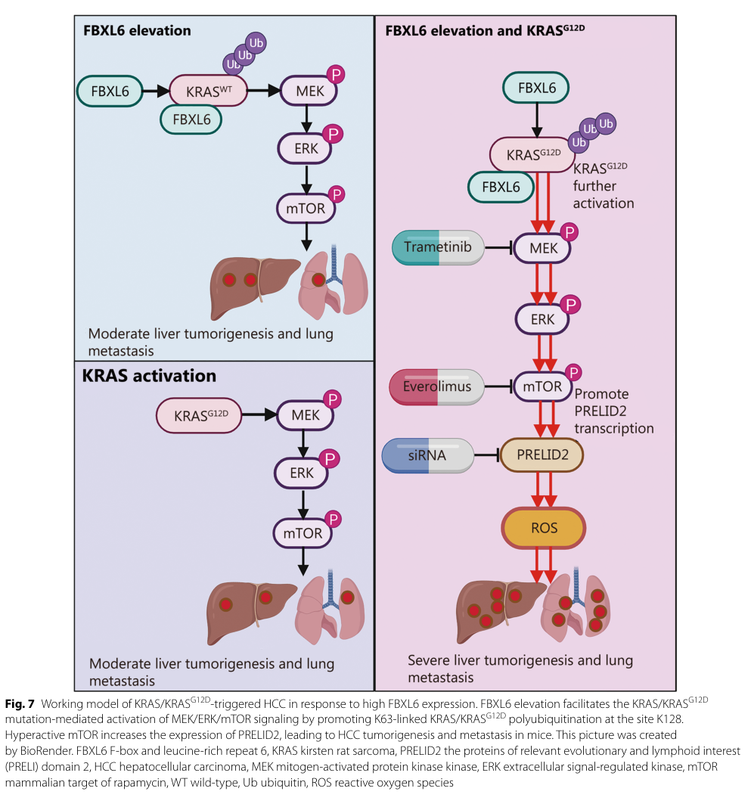

## Question

# Gene Research for Functional Annotation

## ⚠️ CRITICAL: Gene/Protein Identification Context

**BEFORE YOU BEGIN RESEARCH:** You MUST verify you are researching the CORRECT gene/protein. Gene symbols can be ambiguous, especially for less well-characterized genes from non-model organisms.

### Target Gene/Protein Identity (from UniProt):
- **UniProt Accession:** Q8N531
- **Protein Description:** RecName: Full=F-box/LRR-repeat protein 6 {ECO:0000305}; AltName: Full=F-box and leucine-rich repeat protein 6; AltName: Full=F-box protein FBL6; AltName: Full=FBL6A;
- **Gene Information:** Name=FBXL6 {ECO:0000312|HGNC:HGNC:13603}; Synonyms=FBL6;
- **Organism (full):** Homo sapiens (Human).
- **Protein Family:** Not specified in UniProt
- **Key Domains:** F-box-like_dom_sf. (IPR036047); F-box_dom. (IPR001810); FBXL6_F-box. (IPR047922); Leu-rich_rpt. (IPR001611); Leu-rich_rpt_Cys-con_subtyp. (IPR006553)

### MANDATORY VERIFICATION STEPS:

1. **Check if the gene symbol "FBXL6" matches the protein description above**
2. **Verify the organism is correct:** Homo sapiens (Human).
3. **Check if protein family/domains align with what you find in literature**
4. **If you find literature for a DIFFERENT gene with the same or similar symbol, STOP**

### If Gene Symbol is Ambiguous or You Cannot Find Relevant Literature:

**DO NOT PROCEED WITH RESEARCH ON A DIFFERENT GENE.** Instead:
- State clearly: "The gene symbol 'FBXL6' is ambiguous or literature is limited for this specific protein"
- Explain what you found (e.g., "Found extensive literature on a different gene with the same symbol in a different organism")
- Describe the protein based ONLY on the UniProt information provided above
- Suggest that the protein function can be inferred from domain/family information

### Research Target:

Please provide a comprehensive research report on the gene **FBXL6** (gene ID: FBXL6, UniProt: Q8N531) in human.

The research report should be a detailed narrative explaining the function, biological processes, and localization of the gene product. Citations should be given for all claims.

You should prioritize authoritative reviews and primary scientific literature when conducting research. You can supplement
this with annotations you find in gene/protein databases, but these can be outdated or inaccurate.

We are specifically interested in the primary function of the gene - for enzymes, what reaction is catalyzed, and what is the substrate specificity? For transporters, what is the substrate? For structural proteins or adapters, what is the broader structural role? For signaling molecules, what is the role in the pathway.

We are interested in where in or outside the cell the gene product carries out its function.

We are also interested in the signaling or biochemical pathways in which the gene functions. We are less interested in broad pleiotropic effects, except where these elucidate the precise role.

Include evidence where possible. We are interested in both experimental evidence as well as inference from structure, evolution, or bioinformatic analysis. Precise studies should be prioritized over high-throughput, where available.

## Output

Question: You are an expert researcher providing comprehensive, well-cited information.

Provide detailed information focusing on:
1. Key concepts and definitions with current understanding
2. Recent developments and latest research (prioritize 2023-2024 sources)
3. Current applications and real-world implementations
4. Expert opinions and analysis from authoritative sources
5. Relevant statistics and data from recent studies

Format as a comprehensive research report with proper citations. Include URLs and publication dates where available.
Always prioritize recent, authoritative sources and provide specific citations for all major claims.

# Gene Research for Functional Annotation

## ⚠️ CRITICAL: Gene/Protein Identification Context

**BEFORE YOU BEGIN RESEARCH:** You MUST verify you are researching the CORRECT gene/protein. Gene symbols can be ambiguous, especially for less well-characterized genes from non-model organisms.

### Target Gene/Protein Identity (from UniProt):
- **UniProt Accession:** Q8N531
- **Protein Description:** RecName: Full=F-box/LRR-repeat protein 6 {ECO:0000305}; AltName: Full=F-box and leucine-rich repeat protein 6; AltName: Full=F-box protein FBL6; AltName: Full=FBL6A;
- **Gene Information:** Name=FBXL6 {ECO:0000312|HGNC:HGNC:13603}; Synonyms=FBL6;
- **Organism (full):** Homo sapiens (Human).
- **Protein Family:** Not specified in UniProt
- **Key Domains:** F-box-like_dom_sf. (IPR036047); F-box_dom. (IPR001810); FBXL6_F-box. (IPR047922); Leu-rich_rpt. (IPR001611); Leu-rich_rpt_Cys-con_subtyp. (IPR006553)

### MANDATORY VERIFICATION STEPS:

1. **Check if the gene symbol "FBXL6" matches the protein description above**
2. **Verify the organism is correct:** Homo sapiens (Human).
3. **Check if protein family/domains align with what you find in literature**
4. **If you find literature for a DIFFERENT gene with the same or similar symbol, STOP**

### If Gene Symbol is Ambiguous or You Cannot Find Relevant Literature:

**DO NOT PROCEED WITH RESEARCH ON A DIFFERENT GENE.** Instead:
- State clearly: "The gene symbol 'FBXL6' is ambiguous or literature is limited for this specific protein"
- Explain what you found (e.g., "Found extensive literature on a different gene with the same symbol in a different organism")
- Describe the protein based ONLY on the UniProt information provided above
- Suggest that the protein function can be inferred from domain/family information

### Research Target:

Please provide a comprehensive research report on the gene **FBXL6** (gene ID: FBXL6, UniProt: Q8N531) in human.

The research report should be a detailed narrative explaining the function, biological processes, and localization of the gene product. Citations should be given for all claims.

You should prioritize authoritative reviews and primary scientific literature when conducting research. You can supplement
this with annotations you find in gene/protein databases, but these can be outdated or inaccurate.

We are specifically interested in the primary function of the gene - for enzymes, what reaction is catalyzed, and what is the substrate specificity? For transporters, what is the substrate? For structural proteins or adapters, what is the broader structural role? For signaling molecules, what is the role in the pathway.

We are interested in where in or outside the cell the gene product carries out its function.

We are also interested in the signaling or biochemical pathways in which the gene functions. We are less interested in broad pleiotropic effects, except where these elucidate the precise role.

Include evidence where possible. We are interested in both experimental evidence as well as inference from structure, evolution, or bioinformatic analysis. Precise studies should be prioritized over high-throughput, where available.

## Research report: FBXL6 (Human; UniProt Q8N531) functional annotation

### 1) Gene/protein identity verification (critical)
FBXL6 (F-box/LRR-repeat protein 6; UniProt Q8N531) is consistently described in primary literature as an F-box protein with leucine-rich repeats (LRRs), aligning with the UniProt domain architecture (F-box + LRR substrate-binding module) and supporting that the retrieved literature corresponds to the intended human protein rather than a different gene sharing a similar symbol. (li2021fbxl6degradesphosphorylated pages 1-2)

### 2) Key concepts and definitions (current understanding)

#### SCF ubiquitin ligases and F-box proteins
SCF (SKP1–CUL1–F-box) E3 ubiquitin ligases are modular cullin-RING ligases in which the F-box protein functions as the substrate receptor: the F-box domain binds SKP1, and the C-terminal substrate-binding module (LRRs in FBXL proteins) engages substrates, positioning them for ubiquitin transfer by the E2 recruited to the RBX1 RING subunit. (sperk2024fbxl6isa pages 1-2, tan2013parallelscfadaptor pages 1-2)

#### What “FBXL” implies mechanistically
Within the F-box superfamily, the “FBXL” subclass is defined by the presence of C-terminal leucine-rich repeats that mediate substrate interaction, while the N-terminal F-box binds SKP1 to assemble an SCF complex. This implies that FBXL6 is expected to act primarily as an adaptor/substrate receptor—rather than a catalytic enzyme—governing which client proteins are ubiquitinated and what downstream signaling consequences follow. (tan2013parallelscfadaptor pages 1-2, sperk2024fbxl6isa pages 1-2)

### 3) Primary molecular function of FBXL6: validated substrates, ubiquitin linkages, and mechanisms

FBXL6’s most defensible “primary function” from the available literature is as an SCF-type ubiquitin ligase substrate receptor/adaptor that (i) promotes proteasomal degradation of certain targets and (ii) can also add non-degradative ubiquitin chains that stabilize/activate specific client proteins in oncogenic contexts. (shi2020fbxl6governscmyc pages 1-2, sperk2024fbxl6isa pages 1-2)

#### Experimentally supported FBXL6 substrates/interactors
A consolidated view of experimentally supported substrates/interactors and consequences is provided in the table artifact below.

| Substrate/target | Evidence type | Ubiquitin linkage (K48/K63/unspecified) | Modified residue(s) if known | Biological consequence | Key citation (with year, DOI URL) |
|---|---|---|---|---|---|
| p53 (phospho-p53 S315) | Interaction with phospho-p53, polyubiquitination assay, proteasomal degradation studies | Unspecified in primary snippet; summarized as K48-linked in later review table | p53 K291, K292; interaction depends on p53 S315 phosphorylation | FBXL6 promotes p53 degradation, relieving tumor-suppressive signaling and promoting tumor growth | Li et al., 2021, https://doi.org/10.1038/s41418-021-00739-6 (li2021fbxl6degradesphosphorylated pages 1-2, cheng2025fboxproteinsin pages 5-7) |
| HSP90AA1 | IP/MS identification, co-immunoprecipitation, in vivo ubiquitination assay, HCC functional assays | K63 | Not specified in gathered snippets | Stabilizes HSP90AA1, thereby sustaining c-MYC activity and promoting HCC growth | Shi et al., 2020, https://doi.org/10.1186/s12964-020-00604-y (shi2020fbxl6governscmyc pages 1-2) |
| KRAS / KRASG12D | Co-IP, ubiquitination assay, RAS activity assay, transgenic mouse models, patient correlation analyses | Unspecified in primary snippet; summarized as K63-linked in later review table | KRAS K128 | Activates KRAS signaling, increases RAF binding and MEK/ERK/mTOR/PRELID2/ROS signaling, promoting HCC tumorigenesis and lung metastasis | Xiong et al., 2023, https://doi.org/10.1186/s40779-023-00501-8 (xiong2023elevatedfbxl6activates pages 1-2, cheng2025fboxproteinsin pages 5-7) |
| TKT (transketolase) | Mass-spectrometry candidate identification, co-IP, FBXL6 overexpression ubiquitination assay, F-box deletion mutant test, knockdown/inhibition rescue in vitro and in vivo | Unspecified | Recruitment requires TKT Thr287 phosphorylation by VRK2; ubiquitinated lysine(s) not specified | Activates TKT and downstream ROS-mTOR signaling, increasing PD-L1/VRK2, immune evasion, and HCC metastasis | Zhang et al., 2023, https://doi.org/10.1038/s12276-023-01060-7 (zhang2023elevatedfbxl6expression pages 3-4, zhang2023elevatedfbxl6expression pages 1-2) |
| CCNA2 (cyclin A2) | Interaction validation among five substrates; in vivo ubiquitination assay; protein half-life analysis | Unspecified | Not specified | FBXL6-mediated ubiquitination shortens CCNA2 half-life and reduces CCNA2 expression | Chen et al., 2019, https://doi.org/10.1016/j.isci.2019.05.033 (chen2019amultidimensionalcharacterization pages 9-12) |
| VDAC2 | Interaction/ubiquitination assays with HA-Ub and FBXL6 knockdown context | Unspecified | Not specified | FBXL6-associated ubiquitination correlates with reduced VDAC2 expression | Chen et al., 2019, https://doi.org/10.1016/j.isci.2019.05.033 (chen2019amultidimensionalcharacterization pages 9-12) |
| CDK4 | Validated interaction/co-purification in substrate network study | Unspecified | Not specified | Experimental interaction supported, but functional consequence not defined in gathered snippets | Chen et al., 2019, https://doi.org/10.1016/j.isci.2019.05.033 (chen2019amultidimensionalcharacterization pages 9-12) |
| HSPD1 | Validated interaction/co-purification in substrate network study | Unspecified | Not specified | Experimental interaction supported, but functional consequence not defined in gathered snippets | Chen et al., 2019, https://doi.org/10.1016/j.isci.2019.05.033 (chen2019amultidimensionalcharacterization pages 9-12) |
| ETV6 (TEL) | Prior report cited in gathered snippets as ubiquitin-proteasome substrate of FBXL6 | Unspecified | Not specified | FBXL6 promotes ETV6 degradation via the ubiquitin-proteasome system | Reported in Li et al., 2021 background discussion, https://doi.org/10.1038/s41418-021-00739-6 (li2021fbxl6degradesphosphorylated pages 1-2, xiong2023elevatedfbxl6activates pages 1-2) |

*Table: This table summarizes experimentally supported human FBXL6 substrates or interactors, the types of evidence used to support each assignment, and the reported functional consequences. It is useful for distinguishing direct mechanistic evidence from broader association studies and for tracking which ubiquitin linkages or modified residues have actually been reported.*

Key mechanistic examples:

* **p53 (tumor suppressor):** FBXL6 binds phosphorylated p53 (S315) and promotes p53 polyubiquitination at K291/K292 leading to proteasomal degradation, consistent with a role in dampening p53 signaling. (Li et al., 2021; published Feb 2021; https://doi.org/10.1038/s41418-021-00739-6) (li2021fbxl6degradesphosphorylated pages 1-2)

* **HSP90AA1 (molecular chaperone):** FBXL6 promotes **K63-dependent ubiquitination** of HSP90AA1, stabilizing HSP90AA1 and indirectly sustaining c-MYC activation in hepatocellular carcinoma models; this illustrates a non-degradative ubiquitin outcome mediated by FBXL6. (Shi et al., 2020; published Jun 2020; https://doi.org/10.1186/s12964-020-00604-y) (shi2020fbxl6governscmyc pages 1-2)

* **KRAS / KRASG12D:** Elevated FBXL6 promotes polyubiquitination of KRAS and KRASG12D at **KRAS K128**, increasing KRAS activity and downstream MEK/ERK/mTOR signaling in liver cancer models. (Xiong et al., 2023; published Dec 2023; https://doi.org/10.1186/s40779-023-00501-8) (xiong2023elevatedfbxl6activates pages 1-2)

* **Transketolase (TKT; pentose phosphate pathway enzyme):** In mouse and cell models, VRK2-mediated phosphorylation of TKT at **Thr287** recruits FBXL6 to promote TKT ubiquitination and activation; the FBXL6 F-box is required (FBXL6ΔF fails to increase ubiquitination). The precise ubiquitin linkage and ubiquitinated lysine(s) on TKT are not resolved in the cited excerpts. (Zhang et al., 2023; published Sep 2023; https://doi.org/10.1038/s12276-023-01060-7) (zhang2023elevatedfbxl6expression pages 1-2, zhang2023elevatedfbxl6expression pages 3-4)

#### Subcellular localization
The retrieved evidence set did not provide explicit, experimentally determined subcellular localization for FBXL6 in the cited passages. The SCF mechanistic framework implies cytosolic and/or nuclear roles depending on substrate availability, but localization claims should not be inferred beyond what is shown in the cited sources. (tan2013parallelscfadaptor pages 1-2, sperk2024fbxl6isa pages 1-2)

### 4) Recent developments (prioritizing 2023–2024)

#### 4.1 FBXL6 as a driver of aggressive hepatocellular carcinoma programs (2023)
Two mechanistic 2023 studies substantially expanded the known FBXL6 substrate landscape beyond p53/HSP90AA1 toward metabolic signaling and RAS pathway activation.

1) **FBXL6–KRAS axis (ERK/mTOR/PRELID2/ROS):** In transgenic mouse models and patient cohorts, elevated hepatic FBXL6 activates KRAS signaling via ubiquitination at K128 and drives MEK/ERK/mTOR signaling with a PRELID2/ROS component; dual MEK and mTOR inhibition suppressed tumor growth and metastasis in vivo, indicating a candidate therapeutic vulnerability in FBXL6-high tumors. (Xiong et al., 2023; Dec 2023; https://doi.org/10.1186/s40779-023-00501-8) (xiong2023elevatedfbxl6activates pages 1-2)

2) **FBXL6–TKT axis (VRK2→TKT pThr287→FBXL6→ROS–mTOR→PD-L1):** Elevated FBXL6 expression in hepatocytes drove lung metastasis and immune evasion in vivo and was reported to be a stronger driver than several comparator oncogenic mouse models (KrasG12D/+, p53+/−, or Tsc1 loss). Mechanistically, VRK2 phosphorylates TKT at Thr287, recruiting FBXL6 to ubiquitinate/activate TKT, raising PD-L1 via ROS–mTOR and promoting immune evasion. (Zhang et al., 2023; Sep 2023; https://doi.org/10.1038/s12276-023-01060-7) (zhang2023elevatedfbxl6expression pages 1-2)

A schematic summary of the KRAS-centered model from Xiong et al. is captured in their Figure 7. (xiong2023elevatedfbxl6activates media 8978e81a)

#### 4.2 FBXL6 dependency in AML and a major experimental caution (2024)
A 2024 Leukemia paper identified FBXL6 as a prominent dependency in AML cell lines using pooled CRISPR drop-out screening across the full set of 72 human F-box genes. FBXL6 knockout decreased proliferation/viability in multiple assays, with stronger effects in FLT3-ITD–mutated AML lines (e.g., MOLM-13/MV4-11) than OCI-AML3, suggesting genotype-dependent sensitivity. (Sperk et al., 2024; published Jul 2024; https://doi.org/10.1038/s41375-024-02345-0) (sperk2024fbxl6isa pages 1-2)

The same work provides a high-impact methodological warning: apparent lower-molecular-weight FBXL6 species in myeloid lysates can be caused by proteolytic cleavage (linked to cathepsin G activity) and can disappear under denaturing lysis or with specific inhibitors, indicating the risk of artifactual “processing” during sample preparation in myeloid contexts. (Sperk et al., 2024; Jul 2024; https://doi.org/10.1038/s41375-024-02345-0) (sperk2024fbxl6isa pages 4-5, sperk2024fbxl6isa pages 3-4)

### 5) Current applications and real-world implementations

#### Biomarker and stratification uses in oncology research
Across multiple datasets, FBXL6 is treated as a candidate biomarker for tumor progression, prognosis, and pathway activation state, particularly in HCC where it correlates with pathway readouts (p-ERK, p-mTOR, PRELID2) and adverse survival. (xiong2023elevatedfbxl6activates pages 1-2, zhang2023elevatedfbxl6expression pages 3-4)

#### Therapeutic hypothesis generation (pathway-guided rather than FBXL6-directed)
Current “implementations” are best described as *pathway-guided intervention strategies* in FBXL6-high disease contexts:
* In FBXL6/KRAS-driven HCC models, **dual MEK and mTOR inhibition** suppressed tumor growth and metastasis, supporting a translational strategy of targeting downstream signaling nodes rather than FBXL6 itself. (xiong2023elevatedfbxl6activates pages 1-2)
* In the FBXL6–TKT immune-evasion model, **targeting or knocking down TKT** blocked FBXL6-driven immune evasion and metastasis, supporting TKT as a druggable node in the pathway. (zhang2023elevatedfbxl6expression pages 1-2)

No clinical trials specifically targeting FBXL6 were retrieved in this tool run.

### 6) Expert opinions and synthesis (authoritative interpretation)

#### FBXL6 as an oncogenic “signal amplifier” via non-degradative ubiquitination
The body of mechanistic work suggests that FBXL6 can act as an amplifier of oncogenic circuits by stabilizing/activating key signaling or chaperone proteins through non-degradative ubiquitination (e.g., K63-linked ubiquitination of HSP90AA1) while also suppressing tumor suppressor barriers via degradative ubiquitination (p53). (shi2020fbxl6governscmyc pages 1-2, li2021fbxl6degradesphosphorylated pages 1-2)

#### Context-dependence and experimental caveats
Two forms of context dependence emerge from the evidence:
1) **Disease/genotype context:** AML dependency strength appears greater in FLT3-ITD AML lines than in other AML backgrounds. (sperk2024fbxl6isa pages 1-2)
2) **Biochemical context:** Myeloid protease activity can generate artifactual FBXL6 fragments during lysis, requiring stringent sample-prep controls; this is an important expert-level caution for reproducibility and mechanistic interpretation. (sperk2024fbxl6isa pages 4-5)

### 7) Recent quantitative statistics and datasets (from studies in evidence)

* **HCC patient cohort (IHC):** In 108 paired HCC/adjacent tissues, FBXL6 overexpression was reported in **60.2% (65/108)** of tumors and associated with advanced TNM stage, vascular thrombosis, and metastasis; higher FBXL6 protein correlated with worse overall survival by log-rank testing (p < 0.0001 reported in excerpt). (Zhang et al., 2023; Sep 2023; https://doi.org/10.1038/s12276-023-01060-7) (zhang2023elevatedfbxl6expression pages 2-3, zhang2023elevatedfbxl6expression pages 3-4)

* **HCC patient cohort (pathway correlation):** In **129 paired samples**, FBXL6 expression positively correlated with p-ERK (χ² = 85.067, P < 0.001), p-mTOR (χ² = 66.919, P < 0.001), and PRELID2 (χ² = 20.891, P < 0.001); high FBXL6/p-ERK predicted worse OS (log-rank P < 0.001). (Xiong et al., 2023; Dec 2023; https://doi.org/10.1186/s40779-023-00501-8) (xiong2023elevatedfbxl6activates pages 1-2)

* **HCC mouse models:** FBXL6 gain-of-function models (e.g., Fbxl6;Alb-Cre) were monitored longitudinally (up to 310–320 days), and in head-to-head comparisons FBXL6 overexpression was described as a stronger driver of hepatocarcinogenesis and lung metastasis than KrasG12D/+, p53+/−, or Tsc1 loss comparator models. (zhang2023elevatedfbxl6expression pages 3-4, zhang2023elevatedfbxl6expression pages 1-2)

* **AML transcriptomics:** Transcriptomic analysis of **>700 AML patient samples** indicated FBXL6 is among the most highly overexpressed ubiquitin-related genes, with **>90% of AML cases** showing higher FBXL6 mRNA than healthy controls in the cited analysis. (Sperk et al., 2024; Jul 2024; https://doi.org/10.1038/s41375-024-02345-0) (sperk2024fbxl6isa pages 1-2)

### 8) Limitations of this synthesis
Some potentially important recent work was not obtainable in this run (e.g., a 2023 Cell Reports article on mitochondrial ribosomal protein quality control). As a result, FBXL6’s non-cancer cellular roles may be underrepresented here. Additionally, explicit subcellular localization and comprehensive linkage-type mapping for several substrates (e.g., TKT, CCNA2, VDAC2) were not available in the gathered excerpts. (zhang2023elevatedfbxl6expression pages 1-2, chen2019amultidimensionalcharacterization pages 9-12)

### Key sources (publication date; URL)
* Sperk et al. 2024-07 (Leukemia): https://doi.org/10.1038/s41375-024-02345-0 (sperk2024fbxl6isa pages 1-2)
* Xiong et al. 2023-12 (Military Medical Research): https://doi.org/10.1186/s40779-023-00501-8 (xiong2023elevatedfbxl6activates pages 1-2)
* Zhang et al. 2023-09 (Experimental & Molecular Medicine): https://doi.org/10.1038/s12276-023-01060-7 (zhang2023elevatedfbxl6expression pages 1-2)
* Li et al. 2021-02 (Cell Death & Differentiation): https://doi.org/10.1038/s41418-021-00739-6 (li2021fbxl6degradesphosphorylated pages 1-2)
* Shi et al. 2020-06 (Cell Communication and Signaling): https://doi.org/10.1186/s12964-020-00604-y (shi2020fbxl6governscmyc pages 1-2)

References

1. (li2021fbxl6degradesphosphorylated pages 1-2): Yajun Li, Kaisa Cui, Qiang Zhang, Xu Li, Xingrong Lin, Yi Tang, Edward V. Prochownik, and Youjun Li. Fbxl6 degrades phosphorylated p53 to promote tumor growth. Cell Death & Differentiation, 28:2112-2125, Feb 2021. URL: https://doi.org/10.1038/s41418-021-00739-6, doi:10.1038/s41418-021-00739-6. This article has 35 citations and is from a domain leading peer-reviewed journal.

2. (sperk2024fbxl6isa pages 1-2): Anna Sperk, Antje Gabriel, Daniela Koch, Abirami Augsburger, Victoria Sanchez, David Brockelt, Rupert Öllinger, Thomas Engleitner, Piero Giansanti, Romina Ludwig, Priska Auf der Maur, Wencke Walter, Torsten Haferlach, Irmela Jeremias, Roland Rad, Barbara Steigenberger, Bernhard Kuster, Ruth Eichner, and Florian Bassermann. Fbxl6 is a vulnerability in aml and unmasks proteolytic cleavage as a major experimental pitfall in myeloid cells. Leukemia, 38:2027-2031, Jul 2024. URL: https://doi.org/10.1038/s41375-024-02345-0, doi:10.1038/s41375-024-02345-0. This article has 3 citations and is from a highest quality peer-reviewed journal.

3. (tan2013parallelscfadaptor pages 1-2): Meng-Kwang Marcus Tan, Hui-Jun Lim, Eric J. Bennett, Yang Shi, and J. Wade Harper. Parallel scf adaptor capture proteomics reveals a role for scffbxl17 in nrf2 activation via bach1 repressor turnover. Molecular cell, 52 1:9-24, Oct 2013. URL: https://doi.org/10.1016/j.molcel.2013.08.018, doi:10.1016/j.molcel.2013.08.018. This article has 141 citations and is from a highest quality peer-reviewed journal.

4. (shi2020fbxl6governscmyc pages 1-2): Weidong Shi, Lanyun Feng, Shu Dong, Zhouyu Ning, Yongqiang Hua, Luming Liu, Zhen Chen, and Zhiqiang Meng. Fbxl6 governs c-myc to promote hepatocellular carcinoma through ubiquitination and stabilization of hsp90aa1. Cell Communication and Signaling, Jun 2020. URL: https://doi.org/10.1186/s12964-020-00604-y, doi:10.1186/s12964-020-00604-y. This article has 92 citations and is from a peer-reviewed journal.

5. (cheng2025fboxproteinsin pages 5-7): Jingyi Cheng, Ousheng Liu, Xin Bin, and Zhangui Tang. F-box proteins in cancer: from cancer cells to the tumor microenvironment. Cell Communication and Signaling, Oct 2025. URL: https://doi.org/10.1186/s12964-025-02445-z, doi:10.1186/s12964-025-02445-z. This article has 4 citations and is from a peer-reviewed journal.

6. (xiong2023elevatedfbxl6activates pages 1-2): Hao-Jun Xiong, Hong-Qiang Yu, Jie Zhang, Lei Fang, Di Wu, Xiao-Tong Lin, and Chuan-Ming Xie. Elevated fbxl6 activates both wild-type kras and mutant krasg12d and drives hcc tumorigenesis via the erk/mtor/prelid2/ros axis in mice. Military Medical Research, Dec 2023. URL: https://doi.org/10.1186/s40779-023-00501-8, doi:10.1186/s40779-023-00501-8. This article has 46 citations and is from a peer-reviewed journal.

7. (zhang2023elevatedfbxl6expression pages 3-4): Jie Zhang, Xiao-Tong Lin, Hong-Qiang Yu, Lei Fang, Di Wu, Yuan-Deng Luo, Yu-Jun Zhang, and Chuan-Ming Xie. Elevated fbxl6 expression in hepatocytes activates vrk2-transketolase-ros-mtor-mediated immune evasion and liver cancer metastasis in mice. Experimental & Molecular Medicine, 55:2162-2176, Sep 2023. URL: https://doi.org/10.1038/s12276-023-01060-7, doi:10.1038/s12276-023-01060-7. This article has 32 citations and is from a peer-reviewed journal.

8. (zhang2023elevatedfbxl6expression pages 1-2): Jie Zhang, Xiao-Tong Lin, Hong-Qiang Yu, Lei Fang, Di Wu, Yuan-Deng Luo, Yu-Jun Zhang, and Chuan-Ming Xie. Elevated fbxl6 expression in hepatocytes activates vrk2-transketolase-ros-mtor-mediated immune evasion and liver cancer metastasis in mice. Experimental & Molecular Medicine, 55:2162-2176, Sep 2023. URL: https://doi.org/10.1038/s12276-023-01060-7, doi:10.1038/s12276-023-01060-7. This article has 32 citations and is from a peer-reviewed journal.

9. (chen2019amultidimensionalcharacterization pages 9-12): Di Chen, Xiaolong Liu, Tian Xia, Dinesh Singh Tekcham, Wen Wang, Huan Chen, Tongming Li, Chang Lu, Zhen Ning, Xiumei Liu, Jing Liu, Huan Qi, Hui He, and Hai-long Piao. A multidimensional characterization of e3 ubiquitin ligase and substrate interaction network. Jun 2019. URL: https://doi.org/10.1016/j.isci.2019.05.033, doi:10.1016/j.isci.2019.05.033. This article has 31 citations and is from a peer-reviewed journal.

10. (xiong2023elevatedfbxl6activates media 8978e81a): Hao-Jun Xiong, Hong-Qiang Yu, Jie Zhang, Lei Fang, Di Wu, Xiao-Tong Lin, and Chuan-Ming Xie. Elevated fbxl6 activates both wild-type kras and mutant krasg12d and drives hcc tumorigenesis via the erk/mtor/prelid2/ros axis in mice. Military Medical Research, Dec 2023. URL: https://doi.org/10.1186/s40779-023-00501-8, doi:10.1186/s40779-023-00501-8. This article has 46 citations and is from a peer-reviewed journal.

11. (sperk2024fbxl6isa pages 4-5): Anna Sperk, Antje Gabriel, Daniela Koch, Abirami Augsburger, Victoria Sanchez, David Brockelt, Rupert Öllinger, Thomas Engleitner, Piero Giansanti, Romina Ludwig, Priska Auf der Maur, Wencke Walter, Torsten Haferlach, Irmela Jeremias, Roland Rad, Barbara Steigenberger, Bernhard Kuster, Ruth Eichner, and Florian Bassermann. Fbxl6 is a vulnerability in aml and unmasks proteolytic cleavage as a major experimental pitfall in myeloid cells. Leukemia, 38:2027-2031, Jul 2024. URL: https://doi.org/10.1038/s41375-024-02345-0, doi:10.1038/s41375-024-02345-0. This article has 3 citations and is from a highest quality peer-reviewed journal.

12. (sperk2024fbxl6isa pages 3-4): Anna Sperk, Antje Gabriel, Daniela Koch, Abirami Augsburger, Victoria Sanchez, David Brockelt, Rupert Öllinger, Thomas Engleitner, Piero Giansanti, Romina Ludwig, Priska Auf der Maur, Wencke Walter, Torsten Haferlach, Irmela Jeremias, Roland Rad, Barbara Steigenberger, Bernhard Kuster, Ruth Eichner, and Florian Bassermann. Fbxl6 is a vulnerability in aml and unmasks proteolytic cleavage as a major experimental pitfall in myeloid cells. Leukemia, 38:2027-2031, Jul 2024. URL: https://doi.org/10.1038/s41375-024-02345-0, doi:10.1038/s41375-024-02345-0. This article has 3 citations and is from a highest quality peer-reviewed journal.

13. (zhang2023elevatedfbxl6expression pages 2-3): Jie Zhang, Xiao-Tong Lin, Hong-Qiang Yu, Lei Fang, Di Wu, Yuan-Deng Luo, Yu-Jun Zhang, and Chuan-Ming Xie. Elevated fbxl6 expression in hepatocytes activates vrk2-transketolase-ros-mtor-mediated immune evasion and liver cancer metastasis in mice. Experimental & Molecular Medicine, 55:2162-2176, Sep 2023. URL: https://doi.org/10.1038/s12276-023-01060-7, doi:10.1038/s12276-023-01060-7. This article has 32 citations and is from a peer-reviewed journal.

## Artifacts

- [Edison artifact artifact-00](FBXL6-deep-research-falcon_artifacts/artifact-00.md)

## Citations

1. chen2019amultidimensionalcharacterization pages 9-12
2. tan2013parallelscfadaptor pages 1-2
3. cheng2025fboxproteinsin pages 5-7
4. https://doi.org/10.1038/s41418-021-00739-6
5. https://doi.org/10.1186/s12964-020-00604-y
6. https://doi.org/10.1186/s40779-023-00501-8
7. https://doi.org/10.1038/s12276-023-01060-7
8. https://doi.org/10.1016/j.isci.2019.05.033
9. https://doi.org/10.1038/s41375-024-02345-0
10. https://doi.org/10.1038/s41418-021-00739-6,
11. https://doi.org/10.1038/s41375-024-02345-0,
12. https://doi.org/10.1016/j.molcel.2013.08.018,
13. https://doi.org/10.1186/s12964-020-00604-y,
14. https://doi.org/10.1186/s12964-025-02445-z,
15. https://doi.org/10.1186/s40779-023-00501-8,
16. https://doi.org/10.1038/s12276-023-01060-7,
17. https://doi.org/10.1016/j.isci.2019.05.033,