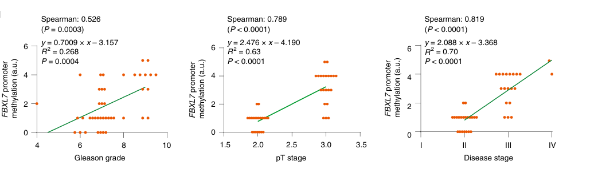

## Question

# Gene Research for Functional Annotation

## ⚠️ CRITICAL: Gene/Protein Identification Context

**BEFORE YOU BEGIN RESEARCH:** You MUST verify you are researching the CORRECT gene/protein. Gene symbols can be ambiguous, especially for less well-characterized genes from non-model organisms.

### Target Gene/Protein Identity (from UniProt):
- **UniProt Accession:** Q9UJT9
- **Protein Description:** RecName: Full=F-box/LRR-repeat protein 7; AltName: Full=F-box and leucine-rich repeat protein 7; AltName: Full=F-box protein FBL6/FBL7;
- **Gene Information:** Name=FBXL7; Synonyms=FBL6, FBL7, KIAA0840;
- **Organism (full):** Homo sapiens (Human).
- **Protein Family:** Belongs to the FBXL7 family. .
- **Key Domains:** F-box-like_dom_sf. (IPR036047); F-box_dom. (IPR001810); FBXL15_LRR. (IPR057207); Leu-rich_rpt_Cys-con_subtyp. (IPR006553); LRR_dom_sf. (IPR032675)

### MANDATORY VERIFICATION STEPS:

1. **Check if the gene symbol "FBXL7" matches the protein description above**
2. **Verify the organism is correct:** Homo sapiens (Human).
3. **Check if protein family/domains align with what you find in literature**
4. **If you find literature for a DIFFERENT gene with the same or similar symbol, STOP**

### If Gene Symbol is Ambiguous or You Cannot Find Relevant Literature:

**DO NOT PROCEED WITH RESEARCH ON A DIFFERENT GENE.** Instead:
- State clearly: "The gene symbol 'FBXL7' is ambiguous or literature is limited for this specific protein"
- Explain what you found (e.g., "Found extensive literature on a different gene with the same symbol in a different organism")
- Describe the protein based ONLY on the UniProt information provided above
- Suggest that the protein function can be inferred from domain/family information

### Research Target:

Please provide a comprehensive research report on the gene **FBXL7** (gene ID: FBXL7, UniProt: Q9UJT9) in human.

The research report should be a detailed narrative explaining the function, biological processes, and localization of the gene product. Citations should be given for all claims.

You should prioritize authoritative reviews and primary scientific literature when conducting research. You can supplement
this with annotations you find in gene/protein databases, but these can be outdated or inaccurate.

We are specifically interested in the primary function of the gene - for enzymes, what reaction is catalyzed, and what is the substrate specificity? For transporters, what is the substrate? For structural proteins or adapters, what is the broader structural role? For signaling molecules, what is the role in the pathway.

We are interested in where in or outside the cell the gene product carries out its function.

We are also interested in the signaling or biochemical pathways in which the gene functions. We are less interested in broad pleiotropic effects, except where these elucidate the precise role.

Include evidence where possible. We are interested in both experimental evidence as well as inference from structure, evolution, or bioinformatic analysis. Precise studies should be prioritized over high-throughput, where available.

## Output

Question: You are an expert researcher providing comprehensive, well-cited information.

Provide detailed information focusing on:
1. Key concepts and definitions with current understanding
2. Recent developments and latest research (prioritize 2023-2024 sources)
3. Current applications and real-world implementations
4. Expert opinions and analysis from authoritative sources
5. Relevant statistics and data from recent studies

Format as a comprehensive research report with proper citations. Include URLs and publication dates where available.
Always prioritize recent, authoritative sources and provide specific citations for all major claims.

# Gene Research for Functional Annotation

## ⚠️ CRITICAL: Gene/Protein Identification Context

**BEFORE YOU BEGIN RESEARCH:** You MUST verify you are researching the CORRECT gene/protein. Gene symbols can be ambiguous, especially for less well-characterized genes from non-model organisms.

### Target Gene/Protein Identity (from UniProt):
- **UniProt Accession:** Q9UJT9
- **Protein Description:** RecName: Full=F-box/LRR-repeat protein 7; AltName: Full=F-box and leucine-rich repeat protein 7; AltName: Full=F-box protein FBL6/FBL7;
- **Gene Information:** Name=FBXL7; Synonyms=FBL6, FBL7, KIAA0840;
- **Organism (full):** Homo sapiens (Human).
- **Protein Family:** Belongs to the FBXL7 family. .
- **Key Domains:** F-box-like_dom_sf. (IPR036047); F-box_dom. (IPR001810); FBXL15_LRR. (IPR057207); Leu-rich_rpt_Cys-con_subtyp. (IPR006553); LRR_dom_sf. (IPR032675)

### MANDATORY VERIFICATION STEPS:

1. **Check if the gene symbol "FBXL7" matches the protein description above**
2. **Verify the organism is correct:** Homo sapiens (Human).
3. **Check if protein family/domains align with what you find in literature**
4. **If you find literature for a DIFFERENT gene with the same or similar symbol, STOP**

### If Gene Symbol is Ambiguous or You Cannot Find Relevant Literature:

**DO NOT PROCEED WITH RESEARCH ON A DIFFERENT GENE.** Instead:
- State clearly: "The gene symbol 'FBXL7' is ambiguous or literature is limited for this specific protein"
- Explain what you found (e.g., "Found extensive literature on a different gene with the same symbol in a different organism")
- Describe the protein based ONLY on the UniProt information provided above
- Suggest that the protein function can be inferred from domain/family information

### Research Target:

Please provide a comprehensive research report on the gene **FBXL7** (gene ID: FBXL7, UniProt: Q9UJT9) in human.

The research report should be a detailed narrative explaining the function, biological processes, and localization of the gene product. Citations should be given for all claims.

You should prioritize authoritative reviews and primary scientific literature when conducting research. You can supplement
this with annotations you find in gene/protein databases, but these can be outdated or inaccurate.

We are specifically interested in the primary function of the gene - for enzymes, what reaction is catalyzed, and what is the substrate specificity? For transporters, what is the substrate? For structural proteins or adapters, what is the broader structural role? For signaling molecules, what is the role in the pathway.

We are interested in where in or outside the cell the gene product carries out its function.

We are also interested in the signaling or biochemical pathways in which the gene functions. We are less interested in broad pleiotropic effects, except where these elucidate the precise role.

Include evidence where possible. We are interested in both experimental evidence as well as inference from structure, evolution, or bioinformatic analysis. Precise studies should be prioritized over high-throughput, where available.

## Research report: Human **FBXL7** (UniProt Q9UJT9) — functional annotation, pathways, and translational relevance

### 0) Target verification (critical identity check)
The literature retrieved and analyzed is consistent with the UniProt entry **Q9UJT9** for **Homo sapiens FBXL7** (F-box/LRR-repeat protein 7). A 2022 expert review explicitly describes **human FBXL7** as a **491-aa** protein on chromosome **5p15.1** containing an **N-terminal F-box motif** (for SCF complex binding) and **~11 C-terminal leucine-rich repeats (LRRs)** (substrate binding), matching the UniProt domain expectations (F-box + LRRs) and the FBXL family classification. (wang2022functionalcharacterizationof pages 2-3, wang2022functionalcharacterizationof pages 1-2)

### 1) Key concepts and definitions (current understanding)

#### 1.1 The SCF E3 ubiquitin ligase and F-box proteins
FBXL7 functions as a **substrate-recognition subunit** of an **SCF-type cullin-RING E3 ubiquitin ligase** (SKP1–CUL1–RBX1–F-box). In this architecture, the **F-box** mediates assembly with SKP1, while **LRRs** provide the primary substrate-binding interface, enabling polyubiquitylation of selected proteins and subsequent proteasomal degradation. This general role of FBXL7 as an SCF substrate adaptor is reiterated across mechanistic and review sources. (wang2022functionalcharacterizationof pages 2-3, wang2022functionalcharacterizationof pages 1-2)

#### 1.2 FBXL7 as a “substrate adaptor” (not an enzyme with a classical catalytic reaction)
FBXL7 is not itself an E2/E3 catalytic domain enzyme; rather, it confers **substrate specificity** to the SCF E3 ligase. Its “primary function” is therefore best described as **directing ubiquitin-dependent degradation of specific protein substrates** that regulate mitosis, survival/apoptosis, EMT/metastasis, and metabolic reprogramming. (wang2022functionalcharacterizationof pages 2-3, wang2022functionalcharacterizationof pages 1-2)

### 2) Molecular function and validated substrates (mechanistic evidence)

#### 2.1 **BIRC5/Survivin** — apoptosis and mitochondrial homeostasis
A foundational mechanistic study demonstrated that SCF–FBXL7 targets the anti-apoptotic protein **survivin (BIRC5)** for **polyubiquitylation and proteasomal degradation**, linking FBXL7 to **pro-apoptotic activity** and **mitochondrial functional regulation**. Key mechanistic details include:
- **Survivin half-life ~2 hours** and stabilization by proteasome inhibition (MG132), supporting proteasome-dependent turnover. (liu2015theproapoptoticfbox pages 4-5)
- Mapping of FBXL7–survivin interaction determinants and ubiquitylation acceptor sites: **E126** is important for recognition, and **K90/K91** serve as ubiquitin acceptors (mutants resist FBXL7-mediated effects). (liu2015theproapoptoticfbox pages 6-8, liu2015theproapoptoticfbox pages 1-2)
- Quantitative phenotype: FBXL7 overexpression reduced **Mfn1 by ~36%** and decreased ATP in a dose-dependent manner, consistent with mitochondrial impairment when survivin is depleted. (liu2015theproapoptoticfbox pages 4-5)

#### 2.2 **SRC (c-SRC)** — EMT and metastasis suppression via degradation of active SRC
A high-impact cancer epigenetics study established FBXL7 as a **metastasis-suppressor axis component** through control of **active c-SRC**: FBXL7 mediates **ubiquitylation and proteasomal degradation of active c-SRC after phosphorylation at Ser104**, and loss of FBXL7 promotes EMT and metastasis. (moro2020epigeneticsilencingof pages 1-2)

A key translational feature is that the FBXL7 promoter can be epigenetically silenced (hypermethylation), and the authors showed that the DNA-demethylating drug **decitabine** can restore FBXL7 and reduce EMT/invasion in a **c-SRC-dependent** manner. (moro2020epigeneticsilencingof pages 1-2)

**Figure-based clinical association:** A panel from this study shows that **FBXL7 promoter methylation correlates positively** with prostate cancer severity metrics (Gleason grade, pT stage, overall stage), supporting clinical relevance of epigenetic silencing during progression. (moro2020epigeneticsilencingof media 119c2419)

#### 2.3 **SNAI1 (Snail1)** — EMT control in pancreatic cancer
In pancreatic cancer models, FBXL7 physically interacts with **Snail1** and promotes its **polyubiquitylation and proteasomal degradation**, thereby suppressing EMT phenotypes and metastasis. (tang2021downregulatedfboxlrrrepeatprotein pages 6-8)

This work includes in vivo metastasis evidence: FBXL7 knockdown increased metastatic burden in liver and lung in tail-vein injection assays (n=10 per cohort reported for metastasis counts) and increased Snail1 staining in tumors, consistent with an FBXL7→Snail1 degradation mechanism controlling metastatic potential. (tang2021downregulatedfboxlrrrepeatprotein pages 8-10)

#### 2.4 **PFKFB4** — glycolysis and hypoxia-driven metabolic reprogramming in NSCLC (2023)
A 2023 Cell Death & Disease study identified **PFKFB4** as a substrate of FBXL7 in NSCLC using tandem affinity purification / mass spectrometry and mechanistic validation. FBXL7 **ubiquitinates and degrades PFKFB4**, suppressing glucose metabolism and malignant phenotypes; in contrast, hypoxia stabilizes PFKFB4 by repressing FBXL7. (zhou2023hypoxiamediatedpromotionof pages 1-2, zhou2023hypoxiamediatedpromotionof pages 6-7)

Mechanistic chain (hypoxia axis): **Hypoxia → HIF-1α up → EZH2 up → FBXL7 transcription repressed → PFKFB4 stabilized → glycolysis and malignant phenotypes increased**, with EZH2 knockdown reducing tumor growth through this axis. (zhou2023hypoxiamediatedpromotionof pages 1-2)

**Quantitative statistic:** Within the same study’s clinical association for the downstream enzyme PFKFB4, higher PFKFB4 expression is associated with worse survival in lung cancer datasets (reported **HR 1.38, 95% CI 1.17–1.63; log-rank P=0.00012**). (zhou2023hypoxiamediatedpromotionof pages 4-5)

#### 2.5 AURKA (Aurora A) — mitosis and centrosomal degradation
Multiple authoritative sources cite **Aurora A kinase (AURKA)** as an early/central FBXL7 substrate, with FBXL7 promoting AURKA polyubiquitylation and degradation during mitosis and associating this with mitotic spindle/cell-cycle phenotypes. (wang2022functionalcharacterizationof pages 2-3, wang2022functionalcharacterizationof pages 1-2)

### 3) Subcellular localization (what can be stated from the evidence)
The most explicit localization evidence in the retrieved corpus is that FBXL7 **colocalizes with Aurora A** and mediates **centrosomal degradation during mitosis**, consistent with a mitotic/cell-cycle compartment for at least one substrate pathway. (wang2022functionalcharacterizationof pages 2-3)

Other substrate contexts imply localization at:
- **Mitochondrial function control** via survivin-dependent mitochondrial phenotypes, although the study emphasizes functional mitochondrial outcomes rather than definitive FBXL7 mitochondrial residency. (liu2015theproapoptoticfbox pages 6-8, liu2015theproapoptoticfbox pages 4-5)
- **SRC/EMT signaling** via degradation of active SRC and EMT-related transcriptional programs, which generally operate at membrane-associated signaling complexes and downstream transcriptional effectors; the mechanistic paper provides direct evidence of SRC degradation and EMT suppression rather than a strict FBXL7 compartment map. (moro2020epigeneticsilencingof pages 1-2)

### 4) Pathways and biological processes (integrated view)
Across mechanistic and review evidence, FBXL7 influences multiple pathways by controlling abundance of key regulatory proteins:

1. **Ubiquitin–proteasome system (UPS) / SCF E3 ligase function** (core molecular role) (wang2022functionalcharacterizationof pages 2-3, wang2022functionalcharacterizationof pages 1-2)
2. **Mitosis / cell-cycle progression** through AURKA degradation at centrosomes (wang2022functionalcharacterizationof pages 2-3)
3. **Apoptosis and mitochondrial bioenergetics** via survivin degradation, with measurable mitochondrial damage and ATP changes (liu2015theproapoptoticfbox pages 4-5)
4. **EMT and metastasis** via degradation of Snail1 and active SRC (tang2021downregulatedfboxlrrrepeatprotein pages 6-8, moro2020epigeneticsilencingof pages 1-2)
5. **Hypoxia-linked glycolysis/metabolic rewiring** via EZH2 repression of FBXL7 and stabilization of PFKFB4 (zhou2023hypoxiamediatedpromotionof pages 1-2)

### 5) Recent developments (prioritizing 2023–2024)

#### 5.1 2023: EZH2/FBXL7/PFKFB4 axis connects epigenetic regulation to tumor glycolysis (NSCLC)
The 2023 NSCLC study advances FBXL7 functional annotation by adding a **metabolic enzyme substrate (PFKFB4)** and a hypoxia-driven epigenetic repression mechanism via **EZH2**. (zhou2023hypoxiamediatedpromotionof pages 1-2)

#### 5.2 2024: Small-molecule natural product (dioscin) leverages FBXL7–survivin degradation (NSCLC)
A 2024 study reports that **dioscin** promotes proteasome-dependent survivin degradation by **strengthening FBXL7–survivin interaction** and increasing survivin ubiquitination; FBXL7 knockdown attenuates survivin loss, caspase-3 activation, and cytotoxicity. Quantitatively, **5 µM dioscin for 72 h reduced NSCLC cell viability by >90%**, and xenograft experiments used **10 mg/kg i.p. every 2 days** (n=6). (wang2024dioscininhibitsnonsmall pages 4-5)

This supports a “functional drug mechanism” in which FBXL7 acts as an E3 adaptor that can be pharmacologically engaged indirectly to deplete survivin. (wang2024dioscininhibitsnonsmall pages 4-5)

#### 5.3 2024: Radioresistance signaling converges on survivin phosphorylation and FBXL7-mediated degradation (NPC)
A 2024 nasopharyngeal carcinoma (NPC) study identifies that TRAF4 promotes radioresistance, and that TRAF4 knockdown increases radiosensitivity possibly via inhibition of Akt/Wee1/CDK1 signaling, suppressing survivin phosphorylation and promoting survivin degradation by FBXL7. The study includes patient tissue work (NPC tumors and matched adjacent tissues, n=67) and notes correlation of TRAF4 with p-Akt and survivin in tissues. (liao2024traf4regulatesubiquitinationmodulated pages 1-2)

#### 5.4 2024: Liquid biopsy implementation — cfDNA 5hmC classifier includes FBXL7 (gastric cancer)
A 2024 Gastric Cancer paper developed a cfDNA **5-hydroxymethylcytosine (5hmC)**-based diagnostic model for gastric cancer and reports strong ROC performance by stage in a GEO testing set (**AUC 0.89 for stage I vs controls; AUC 0.97 for stage II vs controls; AUC 0.89 for stage III–IV vs controls**). The discussion explicitly includes FBXL7 among mechanistically relevant genes, citing its reported interaction with survivin and SCF E3 ligase role. (fu2024genomewide5hydroxymethylcytosinesin pages 9-10, fu2024genomewide5hydroxymethylcytosinesin pages 10-11)

### 6) Current applications and real-world implementations

1. **Epigenetic therapy strategy (preclinical/translational):** FBXL7 promoter hypermethylation can silence its metastasis-suppressor function; decitabine restores FBXL7 and reduces EMT/invasion and metastasis in an FBXL7-dependent manner in preclinical models. This is a concrete “implementation” of FBXL7 biology in a therapeutic concept (epigenetic reactivation to restore substrate degradation such as SRC). (moro2020epigeneticsilencingof pages 1-2)

2. **Biomarker applications in oncology:**
   - **Ovarian cancer chemotherapy response/prognosis:** FBXL7 upregulation is implicated as a predictor of poor outcomes and is associated with paclitaxel resistance in ovarian cancer, including correlations between FBXL7 mRNA and paclitaxel IC50 across cell lines and survival associations in patients (qualitative in extracted pages). (chiu2018fbxl7upregulationpredicts pages 10-12)
   - **UADT tumor methylation biomarker:** FBXL7 gene-body hypomethylation is described as having high discriminatory potential between tumor and non-tumor tissues in UADT cancers, suggesting a biomarker role (quantitative AUC not present in extracted pages). (camuzi2022fbxl7bodyhypomethylation pages 1-2)
   - **cfDNA 5hmC liquid biopsy for gastric cancer:** stage-stratified AUC values suggest near-term translational utility as a noninvasive marker set that includes FBXL7 gene-body 5hmC. (fu2024genomewide5hydroxymethylcytosinesin pages 9-10)

3. **Pharmacologic sensitization concepts (preclinical):**
   - **Dioscin** induces survivin loss via FBXL7-dependent ubiquitination, supporting FBXL7-pathway engagement for cytotoxicity in NSCLC. (wang2024dioscininhibitsnonsmall pages 4-5)
   - **Radiosensitization** via TRAF4/Akt/Wee1/CDK1 modulation leading to FBXL7-mediated survivin degradation. (liao2024traf4regulatesubiquitinationmodulated pages 1-2)

4. **Clinical trials:** Searches did not yield FBXL7-targeted interventional trials in the retrieved trial set, suggesting FBXL7 translation is currently focused on pathway/biomarker integration rather than direct FBXL7-targeted therapeutics. (OpenTargets Search: -FBXL7)

### 7) Expert opinions and authoritative synthesis

- A 2022 review consolidates the concept that FBXL7 can behave as either a tumor suppressor or context-dependent oncogenic factor depending on tissue and dominant substrate network, summarizing upstream regulators and diverse downstream substrates spanning mitosis (AURKA), apoptosis (survivin), EMT/metastasis (SRC/Snail1), and metabolic rewiring. (wang2022functionalcharacterizationof pages 2-3)
- Broader cancer-oriented F-box protein reviews also position FBXL7 among F-box proteins with clinically relevant substrate networks and potential biomarker/therapeutic value, including the Aurora A and survivin axes. (tekcham2020fboxproteinsand pages 4-6)

### 8) Key statistics and data highlights (from retrieved evidence)

- **Survivin half-life ~2 h**; stabilized by MG132, not by lysosome inhibition (leupeptin). (liu2015theproapoptoticfbox pages 4-5)
- **Mfn1 reduced by ~36%** upon FBXL7 overexpression in one model; ATP decreases dose-dependently. (liu2015theproapoptoticfbox pages 4-5)
- **PFKFB4 survival association in lung cancer datasets:** HR 1.38 (95% CI 1.17–1.63), log-rank P=0.00012 (downstream of FBXL7 in NSCLC hypoxia axis). (zhou2023hypoxiamediatedpromotionof pages 4-5)
- **Dioscin cytotoxicity and dosing (NSCLC):** 5 µM for 72 h reduced viability by >90%; xenograft dosing 10 mg/kg i.p. every 2 days, n=6. (wang2024dioscininhibitsnonsmall pages 4-5)
- **cfDNA 5hmC diagnostic performance (gastric cancer, stage-stratified):** AUC 0.89 (stage I), 0.97 (stage II), 0.89 (stage III–IV) vs controls in the GEO testing set. (fu2024genomewide5hydroxymethylcytosinesin pages 9-10)
- **NPC tissue cohort size:** n=67 tumor and matched adjacent non-tumor tissues. (liao2024traf4regulatesubiquitinationmodulated pages 1-2)

### 9) Evidence map (compact summary table)
The following table consolidates domains, substrates, upstream regulators, phenotypes, and quantitative highlights.

| Category | Finding | System/cancer type | Evidence type | Citation IDs | URL and year |
|---|---|---|---|---|---|
| Identity / complex | Human FBXL7 (UniProt Q9UJT9) is a 491-aa FBXL-family F-box protein that serves as the substrate-recognition subunit of SCF (SKP1–CUL1–RBX1–F-box) E3 ubiquitin ligases | Human | Review synthesizing primary studies | (wang2022functionalcharacterizationof pages 2-3, wang2022functionalcharacterizationof pages 1-2) | https://doi.org/10.1038/s41420-022-01143-w (2022) |
| Domains | FBXL7 contains an N-terminal F-box motif for SKP1 binding and ~11 C-terminal leucine-rich repeats (LRRs); review also notes an N-terminal serine-rich region | Human | Review / structural-functional annotation | (wang2022functionalcharacterizationof pages 2-3, wang2022functionalcharacterizationof pages 1-2) | https://doi.org/10.1038/s41420-022-01143-w (2022) |
| Validated substrate | AURKA/Aurora A is a canonical FBXL7 substrate; FBXL7 promotes AURKA polyubiquitylation and turnover, causing centrosomal degradation during mitosis | Cell cycle / mitotic models; cancer context | Primary biochemical/cell biology summarized in review | (wang2022functionalcharacterizationof pages 2-3, wang2022functionalcharacterizationof pages 1-2) | https://doi.org/10.1038/s41420-022-01143-w (2022) |
| Phenotypic output | AURKA degradation by FBXL7 is linked to spindle defects, polyploidy, G2/M arrest, and mitotic arrest | Mitotic models | Primary functional studies summarized in review | (wang2022functionalcharacterizationof pages 2-3, wang2022functionalcharacterizationof pages 1-2) | https://doi.org/10.1038/s41420-022-01143-w (2022) |
| Localization / pathway note | FBXL7 colocalizes with Aurora A and targets it for centrosomal degradation during mitosis | Mitotic models | Primary cell biology summarized in review | (wang2022functionalcharacterizationof pages 2-3) | https://doi.org/10.1038/s41420-022-01143-w (2022) |
| Validated substrate | BIRC5/survivin is directly recognized by SCF-FBXL7 and degraded by the proteasome | Lung epithelial cells / broad cell biology | Primary biochemical study | (liu2015theproapoptoticfbox pages 6-8, liu2015theproapoptoticfbox pages 4-5, liu2015theproapoptoticfbox pages 1-2) | https://doi.org/10.1074/jbc.m114.629931 (2015) |
| Quantitative finding | Endogenous survivin half-life is ~2 h; MG132 stabilizes survivin decay whereas leupeptin does not | Cell culture | Primary kinetics / inhibitor evidence | (liu2015theproapoptoticfbox pages 4-5) | https://doi.org/10.1074/jbc.m114.629931 (2015) |
| Mechanistic detail | Survivin recognition involves residue E126, and Lys90/Lys91 serve as ubiquitin acceptor sites; E126A and K90R/K91R mutants resist FBXL7 effects | Cell culture / biochemical assays | Primary mutational analysis | (liu2015theproapoptoticfbox pages 6-8, liu2015theproapoptoticfbox pages 1-2) | https://doi.org/10.1074/jbc.m114.629931 (2015) |
| Phenotypic output | FBXL7 overexpression impairs mitochondrial function and promotes apoptosis; survivin counters FBXL7-induced mitochondrial defects | Lung epithelial cells | Primary functional study | (liu2015theproapoptoticfbox pages 6-8, liu2015theproapoptoticfbox pages 1-2) | https://doi.org/10.1074/jbc.m114.629931 (2015) |
| Quantitative finding | Overexpression of wild-type FBXL7 reduced Mfn1 protein by 36% and lowered ATP in a dose-dependent manner | MLE cells | Primary quantitative cell biology | (liu2015theproapoptoticfbox pages 4-5) | https://doi.org/10.1074/jbc.m114.629931 (2015) |
| Validated substrate | Active c-SRC is targeted by FBXL7 after phosphorylation at Ser104, leading to ubiquitylation and proteasomal degradation | Prostate and pancreatic cancer | Primary mechanistic cancer study | (moro2020epigeneticsilencingof pages 1-2, wang2022functionalcharacterizationof pages 2-3) | https://doi.org/10.1038/s41556-020-0560-6 (2020) |
| Upstream regulation | FBXL7 promoter hypermethylation lowers FBXL7 mRNA/protein in advanced prostate and pancreatic cancers | Prostate and pancreatic cancer | Primary epigenetic/clinical association | (moro2020epigeneticsilencingof pages 1-2, moro2020epigeneticsilencingof media 119c2419) | https://doi.org/10.1038/s41556-020-0560-6 (2020) |
| Therapeutic modulation | Decitabine restores FBXL7 expression and limits EMT/invasion in a c-SRC-dependent manner; dasatinib suppresses metastasis when FBXL7 is depleted | Prostate and pancreatic cancer | Primary intervention study | (moro2020epigeneticsilencingof pages 1-2) | https://doi.org/10.1038/s41556-020-0560-6 (2020) |
| Phenotypic output | FBXL7 acts as a metastasis suppressor by restraining c-SRC-driven EMT and invasion; depletion increases metastatic burden in vivo | Prostate and pancreatic cancer | Primary in vivo functional study | (moro2020epigeneticsilencingof pages 1-2) | https://doi.org/10.1038/s41556-020-0560-6 (2020) |
| Validated substrate | SNAI1/Snail1 binds FBXL7 and undergoes ubiquitination/proteasomal degradation | Pancreatic cancer | Primary cancer study | (wang2022functionalcharacterizationof pages 2-3) | https://doi.org/10.1038/s41420-022-01143-w (2022) |
| Phenotypic output | Through Snail1 degradation, FBXL7 suppresses EMT, invasion, and metastasis | Pancreatic cancer | Primary cancer study summarized in review | (wang2022functionalcharacterizationof pages 2-3) | https://doi.org/10.1038/s41420-022-01143-w (2022) |
| Validated substrate | PFKFB4 was identified as an FBXL7 substrate; FBXL7 ubiquitinates and degrades PFKFB4 | NSCLC | Primary 2023 study | (zhou2023hypoxiamediatedpromotionof pages 6-7, zhou2023hypoxiamediatedpromotionof pages 1-2) | https://doi.org/10.1038/s41419-023-05795-z (2023) |
| Upstream regulation | Hypoxia increases HIF-1α, which elevates EZH2; EZH2 represses FBXL7 transcription, stabilizing PFKFB4 and enhancing glycolysis | NSCLC under hypoxia | Primary mechanistic study | (zhou2023hypoxiamediatedpromotionof pages 6-7, zhou2023hypoxiamediatedpromotionof pages 1-2) | https://doi.org/10.1038/s41419-023-05795-z (2023) |
| Phenotypic output | FBXL7 re-expression suppresses viability, migration, invasion, glucose metabolism, and promotes apoptosis; effects are significant across repeated experiments | NSCLC (A549, H1650) | Primary functional study | (zhou2023hypoxiamediatedpromotionof pages 4-5, zhou2023hypoxiamediatedpromotionof pages 6-7) | https://doi.org/10.1038/s41419-023-05795-z (2023) |
| Quantitative finding | Higher PFKFB4 expression is associated with worse survival in lung cancer: HR 1.38, 95% CI 1.17–1.63, log-rank P=0.00012 | LUAD/LUSC datasets | Clinical association within mechanistic paper | (zhou2023hypoxiamediatedpromotionof pages 4-5) | https://doi.org/10.1038/s41419-023-05795-z (2023) |
| Upstream regulation | AURKA negatively regulates FBXL7 at transcriptional and translational levels through a FOXP1–FBXL7 axis, thereby limiting survivin degradation | Gastric cancer | Primary mechanistic cancer study | (tekcham2020fboxproteinsand pages 4-6) | https://doi.org/10.7150/thno.42735 (2020) |
| Network effect | AURKA restricts FBXL7-mediated survivin ubiquitylation, contributing to drug resistance | Gastric cancer | Review summarizing primary study | (tekcham2020fboxproteinsand pages 4-6) | https://doi.org/10.7150/thno.42735 (2020) |
| Drug-response application | In ovarian cancer, high FBXL7 transcript is associated with poor prognosis and unfavorable paclitaxel response; FBXL7 expression correlates with paclitaxel IC50 across cell lines | Ovarian cancer | Primary translational study summarized in search results | (tekcham2020fboxproteinsand pages 4-6) | https://doi.org/10.3390/jcm7100330 (2018) |
| Drug-response mechanism | Dioscin promotes proteasome-dependent survivin degradation by strengthening FBXL7–survivin interaction; FBXL7 knockdown blunts dioscin cytotoxicity | NSCLC | Primary 2024 pharmacology study | (wang2024dioscininhibitsnonsmall pages 4-5) | https://doi.org/10.7150/jca.89831 (2024) |
| Quantitative finding | In NSCLC cells, 5 μM dioscin for 72 h reduced viability by >90%; xenograft dosing was 10 mg/kg i.p. every 2 days (n=6/cohort) | NSCLC xenograft and cell lines | Primary 2024 preclinical study | (wang2024dioscininhibitsnonsmall pages 4-5) | https://doi.org/10.7150/jca.89831 (2024) |
| Biomarker / epigenetics | FBXL7 gene body hypomethylation is frequent in upper aerodigestive tract tumors, correlates with gene expression, and has high discriminatory potential between tumor and non-tumor tissue | ESCC, OCSCC, LSCC, OPSCC | Primary biomarker study | (camuzi2022fbxl7bodyhypomethylation pages 1-2) | https://doi.org/10.3390/ijms23147801 (2022) |
| Figure-based clinicopathology | FBXL7 promoter methylation positively correlates with Gleason grade, pathological stage, and overall disease stage in prostate cancer | Prostate cancer | Figure-derived clinical association | (moro2020epigeneticsilencingof media 119c2419) | https://doi.org/10.1038/s41556-020-0560-6 (2020) |
| Expert synthesis | Reviews place FBXL7 at the intersection of apoptosis, mitosis/cell-cycle control, mitochondrial homeostasis, EMT/metastasis, glucose metabolism, and drug response | Human cancers | Expert review | (wang2022functionalcharacterizationof pages 2-3, wang2022functionalcharacterizationof pages 1-2) | https://doi.org/10.1038/s41420-022-01143-w (2022) |
| Evidence gap / implementation | No FBXL7-targeted clinical trials were retrieved; current real-world implementation is mainly as a candidate biomarker/therapeutic axis rather than a validated drug target | Clinical translation | Negative search finding / evidence synthesis | (OpenTargets Search: -FBXL7) | Open Targets search context (accessed via tool; latest indexed evidence includes 2023–2024 literature) |

*Table: This table summarizes the core functional annotation of human FBXL7 (UniProt Q9UJT9), including its SCF-complex role, validated substrates, upstream regulators, phenotypic consequences, and key quantitative findings from primary and review literature. It is useful as a compact evidence map for molecular function, pathway context, and translational relevance.*

### 10) Limitations and evidence gaps
- **Localization detail** is partial in the retrieved texts: centrosomal/mitotic colocalization is well-supported (AURKA axis), but comprehensive subcellular mapping (e.g., cytosol vs nucleus vs membrane-associated pools) is not fully defined in the extracted pages. (wang2022functionalcharacterizationof pages 2-3)
- Several biomarker-oriented reports (e.g., UADT methylation discriminatory power; ovarian cancer survival hazard ratios) are described qualitatively in the extracted segments but lack numeric effect sizes in the pulled text, and would require additional full-text sections for exact AUC/HR estimates. (camuzi2022fbxl7bodyhypomethylation pages 1-2, chiu2018fbxl7upregulationpredicts pages 10-12)

### 11) URLs and publication dates (selected primary sources prioritized to 2023–2024)
- Zhou J. et al. **Cell Death & Disease** (May 2023): EZH2/FBXL7/PFKFB4 axis in NSCLC. https://doi.org/10.1038/s41419-023-05795-z (zhou2023hypoxiamediatedpromotionof pages 1-2)
- Wang R. et al. **Journal of Cancer** (Jan 2024): Dioscin promotes FBXL7-mediated survivin degradation in NSCLC. https://doi.org/10.7150/jca.89831 (wang2024dioscininhibitsnonsmall pages 4-5)
- Liao J. et al. **International Journal of Biological Sciences** (Published Jan 1, 2024): TRAF4 regulates survivin turnover; FBXL7 implicated in survivin degradation and radioresistance. https://doi.org/10.7150/ijbs.87180 (liao2024traf4regulatesubiquitinationmodulated pages 1-2)
- Fu Y. et al. **Gastric Cancer** (Apr 2024): cfDNA 5hmC diagnostic markers including FBXL7; stage ROC AUCs. https://doi.org/10.1007/s10120-024-01493-7 (fu2024genomewide5hydroxymethylcytosinesin pages 9-10)

### 12) Conclusion
Human FBXL7 (UniProt Q9UJT9) is best supported as an **SCF E3 ligase substrate adaptor** whose LRR domain selects substrates for ubiquitin-dependent proteasomal degradation. Experimentally validated substrates include **survivin (BIRC5)** (apoptosis/mitochondrial function), **active c-SRC** and **Snail1** (EMT/metastasis), **AURKA** (mitosis/centrosome), and **PFKFB4** (glycolysis/metabolic phenotypes in NSCLC). Recent (2023–2024) studies expand FBXL7 biology into **hypoxia–EZH2–metabolic rewiring**, **drug-induced enhancement of FBXL7–survivin interaction**, **radioresistance signaling**, and **liquid biopsy epigenomic marker panels**, positioning FBXL7 as a cross-cutting node in cancer cell-cycle, survival, metastasis, and metabolic programs with emerging translational relevance. (wang2022functionalcharacterizationof pages 2-3, moro2020epigeneticsilencingof pages 1-2, zhou2023hypoxiamediatedpromotionof pages 1-2, wang2024dioscininhibitsnonsmall pages 4-5, liao2024traf4regulatesubiquitinationmodulated pages 1-2, fu2024genomewide5hydroxymethylcytosinesin pages 9-10)

References

1. (wang2022functionalcharacterizationof pages 2-3): Yue Wang, Xiao Shen, Longyuan Gong, Yongchao Zhao, and Xiufang Xiong. Functional characterization of fbxl7 as a novel player in human cancers. Cell Death Discovery, Jul 2022. URL: https://doi.org/10.1038/s41420-022-01143-w, doi:10.1038/s41420-022-01143-w. This article has 12 citations and is from a peer-reviewed journal.

2. (wang2022functionalcharacterizationof pages 1-2): Yue Wang, Xiao Shen, Longyuan Gong, Yongchao Zhao, and Xiufang Xiong. Functional characterization of fbxl7 as a novel player in human cancers. Cell Death Discovery, Jul 2022. URL: https://doi.org/10.1038/s41420-022-01143-w, doi:10.1038/s41420-022-01143-w. This article has 12 citations and is from a peer-reviewed journal.

3. (liu2015theproapoptoticfbox pages 4-5): Yuan Liu, Travis Lear, Olivia Iannone, Sruti Shiva, Catherine Corey, Shristi Rajbhandari, Jacob Jerome, Bill B. Chen, and Rama K. Mallampalli. The proapoptotic f-box protein fbxl7 regulates mitochondrial function by mediating the ubiquitylation and proteasomal degradation of survivin. Journal of Biological Chemistry, 290:11843-11852, May 2015. URL: https://doi.org/10.1074/jbc.m114.629931, doi:10.1074/jbc.m114.629931. This article has 81 citations and is from a domain leading peer-reviewed journal.

4. (liu2015theproapoptoticfbox pages 6-8): Yuan Liu, Travis Lear, Olivia Iannone, Sruti Shiva, Catherine Corey, Shristi Rajbhandari, Jacob Jerome, Bill B. Chen, and Rama K. Mallampalli. The proapoptotic f-box protein fbxl7 regulates mitochondrial function by mediating the ubiquitylation and proteasomal degradation of survivin. Journal of Biological Chemistry, 290:11843-11852, May 2015. URL: https://doi.org/10.1074/jbc.m114.629931, doi:10.1074/jbc.m114.629931. This article has 81 citations and is from a domain leading peer-reviewed journal.

5. (liu2015theproapoptoticfbox pages 1-2): Yuan Liu, Travis Lear, Olivia Iannone, Sruti Shiva, Catherine Corey, Shristi Rajbhandari, Jacob Jerome, Bill B. Chen, and Rama K. Mallampalli. The proapoptotic f-box protein fbxl7 regulates mitochondrial function by mediating the ubiquitylation and proteasomal degradation of survivin. Journal of Biological Chemistry, 290:11843-11852, May 2015. URL: https://doi.org/10.1074/jbc.m114.629931, doi:10.1074/jbc.m114.629931. This article has 81 citations and is from a domain leading peer-reviewed journal.

6. (moro2020epigeneticsilencingof pages 1-2): Loredana Moro, Daniele Simoneschi, Emma Kurz, Arnaldo A. Arbini, Shaowen Jang, Nicoletta Guaragnella, Sergio Giannattasio, Wei Wang, Yu-An Chen, Geoffrey Pires, Andrew Dang, Elizabeth Hernandez, Payal Kapur, Ankita Mishra, Aristotelis Tsirigos, George Miller, Jer-Tsong Hsieh, and Michele Pagano. Epigenetic silencing of the ubiquitin ligase subunit fbxl7 impairs c-src degradation and promotes epithelial-to-mesenchymal transition and metastasis. Aug 2020. URL: https://doi.org/10.1038/s41556-020-0560-6, doi:10.1038/s41556-020-0560-6. This article has 54 citations and is from a highest quality peer-reviewed journal.

7. (moro2020epigeneticsilencingof media 119c2419): Loredana Moro, Daniele Simoneschi, Emma Kurz, Arnaldo A. Arbini, Shaowen Jang, Nicoletta Guaragnella, Sergio Giannattasio, Wei Wang, Yu-An Chen, Geoffrey Pires, Andrew Dang, Elizabeth Hernandez, Payal Kapur, Ankita Mishra, Aristotelis Tsirigos, George Miller, Jer-Tsong Hsieh, and Michele Pagano. Epigenetic silencing of the ubiquitin ligase subunit fbxl7 impairs c-src degradation and promotes epithelial-to-mesenchymal transition and metastasis. Aug 2020. URL: https://doi.org/10.1038/s41556-020-0560-6, doi:10.1038/s41556-020-0560-6. This article has 54 citations and is from a highest quality peer-reviewed journal.

8. (tang2021downregulatedfboxlrrrepeatprotein pages 6-8): Liang Tang, Meng Ji, Xing Liang, Danlei Chen, Anan Liu, Guang Yang, Ligang Shi, Zhiping Fu, and Chenghao Shao. Downregulated f-box/lrr-repeat protein 7 facilitates pancreatic cancer metastasis by regulating snail1 for proteasomal degradation. Frontiers in Genetics, Jun 2021. URL: https://doi.org/10.3389/fgene.2021.650090, doi:10.3389/fgene.2021.650090. This article has 5 citations and is from a peer-reviewed journal.

9. (tang2021downregulatedfboxlrrrepeatprotein pages 8-10): Liang Tang, Meng Ji, Xing Liang, Danlei Chen, Anan Liu, Guang Yang, Ligang Shi, Zhiping Fu, and Chenghao Shao. Downregulated f-box/lrr-repeat protein 7 facilitates pancreatic cancer metastasis by regulating snail1 for proteasomal degradation. Frontiers in Genetics, Jun 2021. URL: https://doi.org/10.3389/fgene.2021.650090, doi:10.3389/fgene.2021.650090. This article has 5 citations and is from a peer-reviewed journal.

10. (zhou2023hypoxiamediatedpromotionof pages 1-2): Jing Zhou, Yang Lin, Xiuhua Kang, Zhicheng Liu, Juntao Zou, and Fei Xu. Hypoxia-mediated promotion of glucose metabolism in non-small cell lung cancer correlates with activation of the ezh2/fbxl7/pfkfb4 axis. May 2023. URL: https://doi.org/10.1038/s41419-023-05795-z, doi:10.1038/s41419-023-05795-z. This article has 22 citations and is from a peer-reviewed journal.

11. (zhou2023hypoxiamediatedpromotionof pages 6-7): Jing Zhou, Yang Lin, Xiuhua Kang, Zhicheng Liu, Juntao Zou, and Fei Xu. Hypoxia-mediated promotion of glucose metabolism in non-small cell lung cancer correlates with activation of the ezh2/fbxl7/pfkfb4 axis. May 2023. URL: https://doi.org/10.1038/s41419-023-05795-z, doi:10.1038/s41419-023-05795-z. This article has 22 citations and is from a peer-reviewed journal.

12. (zhou2023hypoxiamediatedpromotionof pages 4-5): Jing Zhou, Yang Lin, Xiuhua Kang, Zhicheng Liu, Juntao Zou, and Fei Xu. Hypoxia-mediated promotion of glucose metabolism in non-small cell lung cancer correlates with activation of the ezh2/fbxl7/pfkfb4 axis. May 2023. URL: https://doi.org/10.1038/s41419-023-05795-z, doi:10.1038/s41419-023-05795-z. This article has 22 citations and is from a peer-reviewed journal.

13. (wang2024dioscininhibitsnonsmall pages 4-5): Ruirui Wang, Xiaoying Li, Yujie Gan, Jinzhuang Liao, Shuangze Han, Wei Li, and Gaoyan Deng. Dioscin inhibits non-small cell lung cancer cells and activates apoptosis by downregulation of survivin. Journal of Cancer, 15:1366-1377, Jan 2024. URL: https://doi.org/10.7150/jca.89831, doi:10.7150/jca.89831. This article has 9 citations and is from a peer-reviewed journal.

14. (liao2024traf4regulatesubiquitinationmodulated pages 1-2): Jinzhuang Liao, Xiang Qing, Xiaoying Li, Yujie Gan, Ruirui Wang, Shuangze Han, Wei Li, and Wei Song. Traf4 regulates ubiquitination-modulated survivin turnover and confers radioresistance. International Journal of Biological Sciences, 20:182-199, Jan 2024. URL: https://doi.org/10.7150/ijbs.87180, doi:10.7150/ijbs.87180. This article has 20 citations and is from a peer-reviewed journal.

15. (fu2024genomewide5hydroxymethylcytosinesin pages 9-10): Yingli Fu, Jing Jiang, Yanhua Wu, Donghui Cao, Zhifang Jia, Yangyu Zhang, Dongming Li, Yingnan Cui, Yuzheng Zhang, and Xueyuan Cao. Genome-wide 5-hydroxymethylcytosines in circulating cell-free dna as noninvasive diagnostic markers for gastric cancer. Gastric cancer : official journal of the International Gastric Cancer Association and the Japanese Gastric Cancer Association, 27:735-746, Apr 2024. URL: https://doi.org/10.1007/s10120-024-01493-7, doi:10.1007/s10120-024-01493-7. This article has 12 citations.

16. (fu2024genomewide5hydroxymethylcytosinesin pages 10-11): Yingli Fu, Jing Jiang, Yanhua Wu, Donghui Cao, Zhifang Jia, Yangyu Zhang, Dongming Li, Yingnan Cui, Yuzheng Zhang, and Xueyuan Cao. Genome-wide 5-hydroxymethylcytosines in circulating cell-free dna as noninvasive diagnostic markers for gastric cancer. Gastric cancer : official journal of the International Gastric Cancer Association and the Japanese Gastric Cancer Association, 27:735-746, Apr 2024. URL: https://doi.org/10.1007/s10120-024-01493-7, doi:10.1007/s10120-024-01493-7. This article has 12 citations.

17. (chiu2018fbxl7upregulationpredicts pages 10-12): Hui-Wen Chiu, Jeng-Shou Chang, Hui-Yu Lin, Hsun-Hua Lee, Chia-Hao Kuei, Che-Hsuan Lin, Huei-Mei Huang, and Yuan-Feng Lin. Fbxl7 upregulation predicts a poor prognosis and associates with a possible mechanism for paclitaxel resistance in ovarian cancer. Journal of Clinical Medicine, 7:330, Oct 2018. URL: https://doi.org/10.3390/jcm7100330, doi:10.3390/jcm7100330. This article has 18 citations.

18. (camuzi2022fbxl7bodyhypomethylation pages 1-2): Diego Camuzi, Luisa Aguirre Buexm, Simone de Queiroz Chaves Lourenço, Rachele Grazziotin, Simone Guaraldi, Priscila Valverde, Davy Rapozo, Jill M. Brooks, Hisham Mehanna, Luis Felipe Ribeiro Pinto, and Sheila Coelho Soares-Lima. Fbxl7 body hypomethylation is frequent in tumors from the digestive and respiratory tracts and is associated with risk-factor exposure. International Journal of Molecular Sciences, 23:7801, Jul 2022. URL: https://doi.org/10.3390/ijms23147801, doi:10.3390/ijms23147801. This article has 4 citations.

19. (OpenTargets Search: -FBXL7): Open Targets Query (-FBXL7, 5 results). Buniello, A. et al. (2025). Open Targets Platform: facilitating therapeutic hypotheses building in drug discovery. Nucleic Acids Research.

20. (tekcham2020fboxproteinsand pages 4-6): Dinesh Singh Tekcham, Di Chen, Yu Liu, Ting Ling, Yi Zhang, Huan Chen, Wen Wang, Wuxiyar Otkur, Huan Qi, Tian Xia, Xiaolong Liu, Hai-long Piao, and Hongxu Liu. F-box proteins and cancer: an update from functional and regulatory mechanism to therapeutic clinical prospects. Theranostics, 10:4150-4167, Mar 2020. URL: https://doi.org/10.7150/thno.42735, doi:10.7150/thno.42735. This article has 111 citations and is from a domain leading peer-reviewed journal.

## Artifacts

- [Edison artifact artifact-00](FBXL7-deep-research-falcon_artifacts/artifact-00.md)

## Citations

1. liu2015theproapoptoticfbox pages 4-5
2. moro2020epigeneticsilencingof pages 1-2
3. tang2021downregulatedfboxlrrrepeatprotein pages 6-8
4. tang2021downregulatedfboxlrrrepeatprotein pages 8-10
5. zhou2023hypoxiamediatedpromotionof pages 1-2
6. zhou2023hypoxiamediatedpromotionof pages 4-5
7. wang2022functionalcharacterizationof pages 2-3
8. wang2024dioscininhibitsnonsmall pages 4-5
9. tekcham2020fboxproteinsand pages 4-6
10. wang2022functionalcharacterizationof pages 1-2
11. liu2015theproapoptoticfbox pages 6-8
12. liu2015theproapoptoticfbox pages 1-2
13. zhou2023hypoxiamediatedpromotionof pages 6-7
14. https://doi.org/10.1038/s41420-022-01143-w
15. https://doi.org/10.1074/jbc.m114.629931
16. https://doi.org/10.1038/s41556-020-0560-6
17. https://doi.org/10.1038/s41419-023-05795-z
18. https://doi.org/10.7150/thno.42735
19. https://doi.org/10.3390/jcm7100330
20. https://doi.org/10.7150/jca.89831
21. https://doi.org/10.3390/ijms23147801
22. https://doi.org/10.7150/ijbs.87180
23. https://doi.org/10.1007/s10120-024-01493-7
24. https://doi.org/10.1038/s41420-022-01143-w,
25. https://doi.org/10.1074/jbc.m114.629931,
26. https://doi.org/10.1038/s41556-020-0560-6,
27. https://doi.org/10.3389/fgene.2021.650090,
28. https://doi.org/10.1038/s41419-023-05795-z,
29. https://doi.org/10.7150/jca.89831,
30. https://doi.org/10.7150/ijbs.87180,
31. https://doi.org/10.1007/s10120-024-01493-7,
32. https://doi.org/10.3390/jcm7100330,
33. https://doi.org/10.3390/ijms23147801,
34. https://doi.org/10.7150/thno.42735,