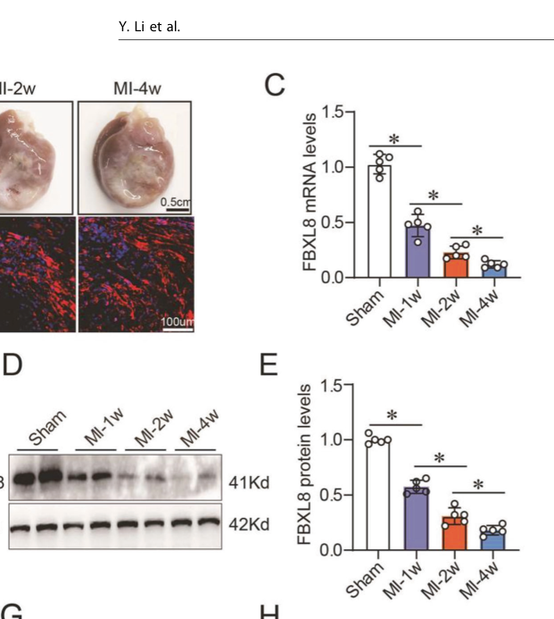

## Question

# Gene Research for Functional Annotation

## ⚠️ CRITICAL: Gene/Protein Identification Context

**BEFORE YOU BEGIN RESEARCH:** You MUST verify you are researching the CORRECT gene/protein. Gene symbols can be ambiguous, especially for less well-characterized genes from non-model organisms.

### Target Gene/Protein Identity (from UniProt):
- **UniProt Accession:** Q96CD0
- **Protein Description:** RecName: Full=F-box/LRR-repeat protein 8; AltName: Full=F-box and leucine-rich repeat protein 8; AltName: Full=F-box protein FBL8;
- **Gene Information:** Name=FBXL8; Synonyms=FBL8;
- **Organism (full):** Homo sapiens (Human).
- **Protein Family:** Not specified in UniProt
- **Key Domains:** F-box-like_dom_sf. (IPR036047); F-box_dom. (IPR001810); LRR_dom_sf. (IPR032675); F-box-like (PF12937)

### MANDATORY VERIFICATION STEPS:

1. **Check if the gene symbol "FBXL8" matches the protein description above**
2. **Verify the organism is correct:** Homo sapiens (Human).
3. **Check if protein family/domains align with what you find in literature**
4. **If you find literature for a DIFFERENT gene with the same or similar symbol, STOP**

### If Gene Symbol is Ambiguous or You Cannot Find Relevant Literature:

**DO NOT PROCEED WITH RESEARCH ON A DIFFERENT GENE.** Instead:
- State clearly: "The gene symbol 'FBXL8' is ambiguous or literature is limited for this specific protein"
- Explain what you found (e.g., "Found extensive literature on a different gene with the same symbol in a different organism")
- Describe the protein based ONLY on the UniProt information provided above
- Suggest that the protein function can be inferred from domain/family information

### Research Target:

Please provide a comprehensive research report on the gene **FBXL8** (gene ID: FBXL8, UniProt: Q96CD0) in human.

The research report should be a detailed narrative explaining the function, biological processes, and localization of the gene product. Citations should be given for all claims.

You should prioritize authoritative reviews and primary scientific literature when conducting research. You can supplement
this with annotations you find in gene/protein databases, but these can be outdated or inaccurate.

We are specifically interested in the primary function of the gene - for enzymes, what reaction is catalyzed, and what is the substrate specificity? For transporters, what is the substrate? For structural proteins or adapters, what is the broader structural role? For signaling molecules, what is the role in the pathway.

We are interested in where in or outside the cell the gene product carries out its function.

We are also interested in the signaling or biochemical pathways in which the gene functions. We are less interested in broad pleiotropic effects, except where these elucidate the precise role.

Include evidence where possible. We are interested in both experimental evidence as well as inference from structure, evolution, or bioinformatic analysis. Precise studies should be prioritized over high-throughput, where available.

## Output

Question: You are an expert researcher providing comprehensive, well-cited information.

Provide detailed information focusing on:
1. Key concepts and definitions with current understanding
2. Recent developments and latest research (prioritize 2023-2024 sources)
3. Current applications and real-world implementations
4. Expert opinions and analysis from authoritative sources
5. Relevant statistics and data from recent studies

Format as a comprehensive research report with proper citations. Include URLs and publication dates where available.
Always prioritize recent, authoritative sources and provide specific citations for all major claims.

# Gene Research for Functional Annotation

## ⚠️ CRITICAL: Gene/Protein Identification Context

**BEFORE YOU BEGIN RESEARCH:** You MUST verify you are researching the CORRECT gene/protein. Gene symbols can be ambiguous, especially for less well-characterized genes from non-model organisms.

### Target Gene/Protein Identity (from UniProt):
- **UniProt Accession:** Q96CD0
- **Protein Description:** RecName: Full=F-box/LRR-repeat protein 8; AltName: Full=F-box and leucine-rich repeat protein 8; AltName: Full=F-box protein FBL8;
- **Gene Information:** Name=FBXL8; Synonyms=FBL8;
- **Organism (full):** Homo sapiens (Human).
- **Protein Family:** Not specified in UniProt
- **Key Domains:** F-box-like_dom_sf. (IPR036047); F-box_dom. (IPR001810); LRR_dom_sf. (IPR032675); F-box-like (PF12937)

### MANDATORY VERIFICATION STEPS:

1. **Check if the gene symbol "FBXL8" matches the protein description above**
2. **Verify the organism is correct:** Homo sapiens (Human).
3. **Check if protein family/domains align with what you find in literature**
4. **If you find literature for a DIFFERENT gene with the same or similar symbol, STOP**

### If Gene Symbol is Ambiguous or You Cannot Find Relevant Literature:

**DO NOT PROCEED WITH RESEARCH ON A DIFFERENT GENE.** Instead:
- State clearly: "The gene symbol 'FBXL8' is ambiguous or literature is limited for this specific protein"
- Explain what you found (e.g., "Found extensive literature on a different gene with the same symbol in a different organism")
- Describe the protein based ONLY on the UniProt information provided above
- Suggest that the protein function can be inferred from domain/family information

### Research Target:

Please provide a comprehensive research report on the gene **FBXL8** (gene ID: FBXL8, UniProt: Q96CD0) in human.

The research report should be a detailed narrative explaining the function, biological processes, and localization of the gene product. Citations should be given for all claims.

You should prioritize authoritative reviews and primary scientific literature when conducting research. You can supplement
this with annotations you find in gene/protein databases, but these can be outdated or inaccurate.

We are specifically interested in the primary function of the gene - for enzymes, what reaction is catalyzed, and what is the substrate specificity? For transporters, what is the substrate? For structural proteins or adapters, what is the broader structural role? For signaling molecules, what is the role in the pathway.

We are interested in where in or outside the cell the gene product carries out its function.

We are also interested in the signaling or biochemical pathways in which the gene functions. We are less interested in broad pleiotropic effects, except where these elucidate the precise role.

Include evidence where possible. We are interested in both experimental evidence as well as inference from structure, evolution, or bioinformatic analysis. Precise studies should be prioritized over high-throughput, where available.

## Research Report: Human **FBXL8** (UniProt **Q96CD0**) – Functional Annotation, Mechanisms, and Translational Relevance

### 0) Target verification (critical disambiguation)
The literature synthesized here is consistent with the UniProt target **Q96CD0**, annotated as **F-box/LRR-repeat protein 8 (FBXL8)** in **Homo sapiens**. Experimental studies explicitly manipulate **FBXL8 F-box** and **LRR** regions (ΔFbox and ΔLRR constructs) to test SCF-complex binding and substrate turnover, aligning with the UniProt-described domain architecture and SCF-adaptor role (yao2023scf‐fbxl8contributesto pages 7-10, yao2023scf‐fbxl8contributesto pages 10-14).

### 1) Key concepts and definitions (current understanding)

#### 1.1 The SCF ubiquitin-ligase concept
FBXL8 is best understood as a **substrate receptor/adaptor** within an **SCF-type E3 ubiquitin ligase**. In the SCF architecture, F-box proteins recruit substrates while SCF core proteins (e.g., SKP1, CUL1, RBX1) provide the catalytic scaffold to support ubiquitin transfer and (often) proteasome-directed degradation (mason2020thefbxlfamily pages 1-2).

#### 1.2 FBXL-family structural logic (F-box + LRR)
A key organizing principle is that **FBXL** proteins contain (i) an **F-box domain** that engages SCF core components and (ii) **leucine-rich repeats (LRRs)** that mediate protein–protein interactions underlying substrate selectivity. Review synthesis emphasizes that despite similar LRR architectures across FBXL proteins, substrate specificity can diverge substantially, producing distinct interactomes (mason2020thefbxlfamily pages 1-2). Structural modeling in an FBXL-family review includes FBXL8 among family members, emphasizing diversity in predicted conformations and confidence values within this subfamily (mason2020thefbxlfamily pages 5-6).

### 2) Molecular function of FBXL8: what it does biochemically

#### 2.1 Core molecular role
Across multiple primary studies, FBXL8 functions as an **SCF E3 ligase adaptor** that promotes **substrate ubiquitination**, frequently leading to **proteasome-dependent degradation** of specific targets (yao2023scf‐fbxl8contributesto pages 1-3, bajpai2022ubiquitylationofunphosphorylated pages 88-95, li2024fbxl8inhibitspostmyocardial pages 1-2, yoshida2021fbxl8suppresseslymphoma pages 9-11).

#### 2.2 Experimentally supported substrate/target set (with evidence strength)
FBXL8 has been linked to several substrates across contexts:

**(A) TP53 (p53) – colorectal cancer context (strong biochemical + functional evidence)**
FBXL8 physically associates with p53 (co-immunoprecipitation), increases p53 ubiquitination, and accelerates p53 turnover in cycloheximide chase experiments; **both the F-box and LRR regions are required** for this effect, because ΔFbox and ΔLRR constructs fail to influence p53 stability like full-length FBXL8 (yao2023scf‐fbxl8contributesto pages 7-10, yao2023scf‐fbxl8contributesto pages 10-14). Functionally, FBXL8 knockout reduces CRC cell growth/migration and stemness markers, while p53 knockdown rescues key anti-tumor effects, supporting an **SCF–FBXL8–p53 axis** (yao2023scf‐fbxl8contributesto pages 10-14).

**(B) Snail1 – cardiac fibrosis after MI (strong biochemical + in vivo evidence; 2024 development)**
In post-myocardial infarction (MI) remodeling, FBXL8 interacts with **Snail1** and promotes its **ubiquitin–proteasome degradation**, with a defined interaction requirement (FBXL8 ΔC3 domain requirement). This down-modulates downstream **RhoA activation** and dampens myofibroblast differentiation (li2024fbxl8inhibitspostmyocardial pages 1-2). Figure evidence in the same paper shows FBXL8 downregulation after MI/TGFβ, and experimental support for Snail1 ubiquitination/stability changes with FBXL8 modulation (li2024fbxl8inhibitspostmyocardial media 22acda4a).

**(C) Cyclin D3 (CCND3), specifically phospho-Thr283 cyclin D3 – lymphoma context (strong biochemical + functional evidence)**
FBXL8 (as SCF-FBXL8) recognizes **Thr-283 phosphorylated cyclin D3**, polyubiquitylates it, and drives proteasomal degradation. Proliferation attenuation depends on Thr-283 because a non-phosphorylatable cyclin D3T283A mutant rescues the phenotype. Xenograft results show tumor suppression when FBXL8 is overexpressed, whereas an FBXL8ΔF mutant loses that effect (yoshida2021fbxl8suppresseslymphoma pages 9-11).

**(D) c-MYC – cancer cell-cycle proteostasis (strong biochemical evidence; pool-specific model)**
FBXL8 recognizes and ubiquitylates **unphosphorylated c-MYC**, distinct from the canonical phospho-degron recognition by FBXW7. Concurrent loss of FBXL8 and FBXW7 additively elevates c-MYC, consistent with regulation of distinct c-MYC pools. The study also reports heterotypic K48/K63 ubiquitin linkages on c-MYC by FBXL8 and suggests FBXL8 is largely cytoplasmic, with knockout causing nuclear c-MYC accumulation (bajpai2022ubiquitylationofunphosphorylated pages 95-99).

**(E) CCND2 and IRF5 – breast-cancer context (moderate evidence: association + inverse protein correlation)**
In breast-cancer studies, CCND2 and IRF5 are reported as FBXL8-associated tumor suppressors that accumulate upon FBXL8 knockdown and are detected in FBXL8-containing complexes, suggesting regulation through FBXL8-mediated turnover; however, compared with p53/CCND3/Snail1/c-MYC, the mechanistic chain (direct ubiquitination reconstitution) is less extensively shown in the excerpted evidence (chang2020humanfbxl8is pages 12-15, chang2020globalrnaseqidentified pages 20-23).

### 3) Subcellular and tissue localization

#### 3.1 Cell-level localization
In the c-MYC study, FBXL8 is described as **exclusively cytoplasmic**, with FBXL8 loss associated with increased nuclear c-MYC, consistent with FBXL8 regulating a **cytoplasmic c-MYC pool** (bajpai2022ubiquitylationofunphosphorylated pages 95-99). (Note: this is study-specific and may vary by cell type.)

#### 3.2 Tissue and cell-type enrichment (cardiac system)
In the post-MI fibrosis model, FBXL8 is reported as **primarily expressed in cardiac fibroblasts** with minimal signal in cardiomyocytes. Co-localization with α-SMA-positive cells in LV sections supports enrichment in activated fibroblast/myofibroblast populations (li2024fbxl8inhibitspostmyocardial pages 2-4). Figure panels supporting these localization/expression conclusions were retrieved from the original paper (li2024fbxl8inhibitspostmyocardial media 22acda4a).

### 4) Pathways and biological processes linked to FBXL8

FBXL8 appears to sit at the intersection of ubiquitin-mediated proteostasis and several high-impact pathways:

1. **p53 tumor suppressor pathway (CRC)**: FBXL8 ubiquitinates and destabilizes p53, promoting proliferation, migration/invasion, and stem-like markers; p53 downregulation reverses major anti-tumor effects of FBXL8 loss, supporting pathway dependence (yao2023scf‐fbxl8contributesto pages 10-14).
2. **EMT/fibrosis axis via Snail1 → RhoA signaling (post-MI heart)**: FBXL8 promotes Snail1 degradation, reducing RhoA activation and myofibroblast behaviors (li2024fbxl8inhibitspostmyocardial pages 1-2, li2024fbxl8inhibitspostmyocardial pages 2-4, li2024fbxl8inhibitspostmyocardial media 22acda4a).
3. **Cell-cycle control via Cyclin D3 → RB phosphorylation and proliferation (lymphoma)**: FBXL8-mediated degradation of phospho-cyclin D3 reduces phospho-RB and proliferation markers (Ki67) in tumor models (yoshida2021fbxl8suppresseslymphoma pages 9-11).
4. **MYC proteostasis and G1/S progression**: FBXL8 controls an underphosphorylated c-MYC pool with distinct ubiquitin-linkage features (K48/K63 heterotypic chains) and additive interplay with FBXW7 (bajpai2022ubiquitylationofunphosphorylated pages 95-99).
5. **Tumor microenvironment/inflammatory signaling (breast cancer)**: FBXL8 knockdown reduced multiple cytokines/chemokines and induced apoptosis while suppressing migration/invasion, consistent with a role in shaping a pro-tumor cytokine milieu (chang2020humanfbxl8is pages 12-15, chang2020globalrnaseqidentified pages 7-11).

### 5) Recent developments (prioritizing 2023–2024)

#### 5.1 2023: FBXL8 drives CRC liver metastasis and stem-like traits via p53 degradation
A 2023 study proposes that FBXL8 is upregulated in CRC and associates with poor prognosis, promoting invasion/migration and stem-like features. Mechanistically, FBXL8 binds p53 and promotes its ubiquitination and degradation; ΔFbox and ΔLRR mutants fail to phenocopy full-length FBXL8, indicating **both SCF engagement and substrate-binding modules are required** (yao2023scf‐fbxl8contributesto pages 1-3, yao2023scf‐fbxl8contributesto pages 7-10, yao2023scf‐fbxl8contributesto pages 10-14).

In vivo, xenograft and spleen-injection metastasis models show that **FBXL8 knockout reduces tumor growth and liver metastasis** (12 mice total; 6 per group; p<0.001 reported for comparisons) (yao2023scf‐fbxl8contributesto pages 10-14).

**Publication**: 2023-02 (Clinical and Translational Medicine). URL: https://doi.org/10.1002/ctm2.1208 (yao2023scf‐fbxl8contributesto pages 1-3).

#### 5.2 2024: FBXL8 attenuates post-MI cardiac fibrosis by degrading Snail1
A 2024 Cell Death & Disease paper positions FBXL8 as an anti-fibrotic regulator in the injured heart. FBXL8 is reduced after MI and after TGFβ stimulation in cardiac fibroblasts, and AAV9-mediated FBXL8 overexpression improves function and reduces fibrosis. Mechanistically, FBXL8 targets Snail1 for ubiquitin–proteasome degradation and reduces RhoA activation; domain mapping indicates a specific binding interface requirement (li2024fbxl8inhibitspostmyocardial pages 1-2, li2024fbxl8inhibitspostmyocardial pages 2-4, li2024fbxl8inhibitspostmyocardial media 22acda4a).

Quantitatively, FBXL8 knockdown increased TGFβ-induced fibroblast migration and proliferation by **~1.4-fold and ~1.3-fold**, and increased active **RhoA-GTP ~2.9-fold**; time-course heart expression studies used **n=5** and in vitro quantifications used **n=3** (li2024fbxl8inhibitspostmyocardial pages 2-4). These primary conclusions are supported by figure panels retrieved from the article (li2024fbxl8inhibitspostmyocardial media 22acda4a).

**Publication**: 2024-04 (Cell Death & Disease). URL: https://doi.org/10.1038/s41419-024-06646-1 (li2024fbxl8inhibitspostmyocardial pages 1-2).

### 6) Current applications and real-world implementations

#### 6.1 Therapeutic targeting logic: adaptor proteins as drug targets
An authoritative 2023 editorial argues that **ubiquitin ligases and adaptors** represent a large and incompletely exploited space of therapeutic targets; it explicitly mentions **FBXL8** (with FZR1) as potential targets in breast cancer, framing ligase adaptors as actionable nodes once cancer-specific dependencies are established (vriend2023roleofubiquitin pages 1-2).

**Publication**: 2023-07-01 (Cancers, editorial). URL: https://doi.org/10.3390/cancers15133460 (vriend2023roleofubiquitin pages 1-2).

#### 6.2 Gene therapy direction in fibrosis/heart disease
The post-MI study provides a concrete translational prototype: **AAV9-mediated FBXL8 overexpression** in vivo improved cardiac outcomes and reduced fibrosis burden (li2024fbxl8inhibitspostmyocardial pages 1-2, li2024fbxl8inhibitspostmyocardial media 22acda4a). While not yet a clinical therapy, this is a real-world implementable modality (cardiac AAV gene transfer) with mechanistic anchoring in Snail1 degradation.

#### 6.3 Oncology: biomarker and pathway-stratification possibilities
FBXL8 is presented as (i) a candidate **prognostic marker** in CRC (high FBXL8 associated with worse overall survival) and (ii) a potential **therapeutic axis** via restoring p53 signaling (yao2023scf‐fbxl8contributesto pages 1-3, yao2023scf‐fbxl8contributesto pages 10-14). In lymphoma, the opposite direction is suggested—FBXL8 appears tumor-suppressive by degrading cyclin D3 (yoshida2021fbxl8suppresseslymphoma pages 9-11). Together, this implies **context-dependent stratification** would be essential for any FBXL8-based therapy.

### 7) Expert opinions and authoritative synthesis

A dedicated FBXL-family review emphasizes that F-box proteins are substrate-recruiting subunits of SCF ligases and that the FBXL subfamily’s LRRs mediate selective substrate engagement, but family-wide structural similarity does not guarantee functional similarity—an expert framing consistent with FBXL8’s diverse substrate set across tissues (mason2020thefbxlfamily pages 1-2). This viewpoint supports an interpretive model where FBXL8’s biological effects are dominated by **which substrates are expressed/accessible and which post-translational states are present** in a given tissue.

### 8) Relevant statistics and quantitative data (recent and foundational)

Key quantitative findings extracted from the available full text include:

- **Breast cancer cell models (preprint):** FBXL8 reported 23-fold (MCF7) and 15-fold (MDA-MB231) higher vs MCF10A; knockdown up to 95% reduced viability by ~52.5% at 48 h, reduced proliferation 2–3-fold, increased early apoptosis to ~20% and ~24%, slowed migration (14% in MCF7; 40% in MDA-MB231 over 30 h), and reduced invasion 4–8-fold (chang2020globalrnaseqidentified pages 7-11).
- **Breast cancer patient-scale analysis (journal article):** stage-associated increases in FBXL8 reported with p<0.01 to p<0.001 in cohorts including n=134 (Taiwan BioBank) and n=1215 (TCGA), and an ex vivo analysis n=1349 matched tissues is described (chang2020humanfbxl8is pages 12-15, chang2020humanfbxl8is pages 1-3).
- **CRC clinical cohort:** 100 CRC patients (36 non-metastatic; 64 with liver metastasis) (yao2023scf‐fbxl8contributesto pages 1-3).
- **CRC in vivo models:** xenograft and metastasis experiments used 12 nude mice total, split 6/6 per condition; liver metastasis and tumor metrics reported with p<0.001 (yao2023scf‐fbxl8contributesto pages 10-14).
- **Post-MI cardiac remodeling:** heart time-course measures n=5; TGFβ fibroblast quantitation n=3; FBXL8 knockdown increased migration/proliferation by 1.4-fold/1.3-fold and increased RhoA-GTP by 2.9-fold (li2024fbxl8inhibitspostmyocardial pages 2-4). Supporting figure panels were retrieved (li2024fbxl8inhibitspostmyocardial media 22acda4a).
- **Lymphoma functional models:** low-density growth assays used 1×10^4 CA46 cells (n=4; p=0.02 and p<0.01). Xenograft experiments injected 2×10^6 CA46 cells into SCID mice (n=10), with significant tumor volume and weight reductions reported (p-values including 0.02, 0.03, and <0.01) (yoshida2021fbxl8suppresseslymphoma pages 9-11).

### 9) Synthesis: primary functional annotation and context dependence

#### 9.1 Primary functional role (most supported)
The most defensible functional annotation for human FBXL8 is:

**FBXL8 is an SCF-type E3 ubiquitin ligase substrate receptor (F-box + LRR protein) that determines substrate specificity and promotes ubiquitination of distinct targets in a context-dependent manner**, influencing proteasomal degradation or other ubiquitin-mediated outcomes (mason2020thefbxlfamily pages 1-2, yao2023scf‐fbxl8contributesto pages 7-10).

#### 9.2 Why context dependence is central for FBXL8
FBXL8 has been reported to **promote tumor aggressiveness** in breast cancer and CRC (via cytokine milieu changes and p53 destabilization, respectively) yet **suppress lymphoma growth** by degrading cyclin D3, and **protect the heart** after MI by degrading Snail1 and suppressing fibrotic signaling (chang2020humanfbxl8is pages 12-15, yao2023scf‐fbxl8contributesto pages 1-3, yoshida2021fbxl8suppresseslymphoma pages 9-11, li2024fbxl8inhibitspostmyocardial pages 1-2). This argues against a single “oncogene vs tumor suppressor” label and supports a **substrate-availability and signaling-state model**.

### Evidence map (summary table)
| Aspect | Key findings | Evidence type | Key citations with year and DOI URL |
|---|---|---|---|
| Identity/domains | FBXL8 matches the UniProt target Q96CD0: a human FBXL-family F-box protein with leucine-rich repeats (LRRs), consistent with an SCF substrate receptor architecture. Review-level structural analysis places FBXL proteins as substrate-recruiting subunits of SKP1-CUL1-RBX1 E3 ligases; Yao 2023 experimentally showed both the F-box and LRR regions are required for FBXL8-mediated p53 ubiquitination and degradation. (mason2020thefbxlfamily pages 1-2, yao2023scf‐fbxl8contributesto pages 7-10) | Review, biochemical, cell | Mason and Laman 2020, Open Biology, https://doi.org/10.1098/rsob.200319; Yao et al. 2023, Clinical and Translational Medicine, https://doi.org/10.1002/ctm2.1208 |
| SCF complex role | FBXL8 functions as the substrate-recognition adaptor of an SCF E3 ubiquitin ligase. Breast-cancer and CRC studies support interaction with SCF components, while Yao 2023 showed full-length FBXL8, but not ΔFbox or ΔLRR mutants, supports p53 destabilization and oncogenic phenotypes. (chang2020globalrnaseqidentified pages 7-11, yao2023scf‐fbxl8contributesto pages 7-10, yao2023scf‐fbxl8contributesto pages 10-14) | Biochemical, cell | Chang et al. 2020, medRxiv, https://doi.org/10.1101/2020.06.09.20127068; Yao et al. 2023, Clinical and Translational Medicine, https://doi.org/10.1002/ctm2.1208 |
| Validated substrates | Experimentally supported FBXL8-associated substrates or interactors include TP53 in CRC, unphosphorylated c-MYC, phospho-Thr283 cyclin D3, and Snail1 in cardiac fibroblasts. CCND2 and IRF5 were found in FBXL8-containing complexes in breast-cancer cells and increase upon FBXL8 knockdown, but evidence there is strongest for association or candidate degradation rather than full biochemical reconstitution. (yao2023scf‐fbxl8contributesto pages 1-3, bajpai2022ubiquitylationofunphosphorylated pages 95-99, bajpai2022ubiquitylationofunphosphorylated pages 88-95, li2024fbxl8inhibitspostmyocardial pages 1-2, chang2020humanfbxl8is pages 12-15) | Biochemical, cell, in vivo | Yao et al. 2023, https://doi.org/10.1002/ctm2.1208; Bajpai et al. 2022, https://doi.org/10.1080/15384047.2022.2061279; Yoshida et al. 2021, https://doi.org/10.1038/s41388-020-01532-4; Li et al. 2024, https://doi.org/10.1038/s41419-024-06646-1; Chang et al. 2020, Cancers, https://doi.org/10.3390/cancers12082210 |
| Localization | Available evidence suggests FBXL8 is largely cytoplasmic in the c-MYC study, where loss of FBXL8 caused nuclear c-MYC accumulation, implying regulation of a cytoplasmic c-MYC pool. In heart, FBXL8 is enriched in cardiac fibroblasts and co-localizes with α-SMA-positive cells, with little signal in cardiomyocytes. (bajpai2022ubiquitylationofunphosphorylated pages 95-99, li2024fbxl8inhibitspostmyocardial pages 2-4) | Cell, imaging | Bajpai et al. 2022, https://doi.org/10.1080/15384047.2022.2061279; Li et al. 2024, https://doi.org/10.1038/s41419-024-06646-1 |
| Pathways | Current evidence links FBXL8 to p53 tumor-suppressor control in CRC, c-MYC proteostasis and G1-S progression, cyclin D3-Rb-Ki67 cell-cycle regulation in lymphoma, and Snail1-RhoA-α-SMA fibrotic signaling after MI. In breast cancer, FBXL8 also shapes a pro-tumor cytokine and chemokine milieu, connecting ubiquitin signaling to tumor microenvironment regulation. (yao2023scf‐fbxl8contributesto pages 1-3, bajpai2022ubiquitylationofunphosphorylated pages 95-99, yoshida2021fbxl8suppresseslymphoma pages 9-11, li2024fbxl8inhibitspostmyocardial pages 1-2, chang2020humanfbxl8is pages 12-15) | Biochemical, cell, in vivo | Yao et al. 2023, https://doi.org/10.1002/ctm2.1208; Bajpai et al. 2022, https://doi.org/10.1080/15384047.2022.2061279; Yoshida et al. 2021, https://doi.org/10.1038/s41388-020-01532-4; Li et al. 2024, https://doi.org/10.1038/s41419-024-06646-1; Chang et al. 2020, Cancers, https://doi.org/10.3390/cancers12082210 |
| Disease contexts | FBXL8 shows context-dependent disease associations: oncogenic in breast cancer and colorectal cancer, but tumor-suppressive in lymphoma models and anti-fibrotic after myocardial infarction. This makes FBXL8 notable as a context-dependent SCF adaptor rather than a uniformly oncogenic or suppressive factor. (chang2020humanfbxl8is pages 12-15, yao2023scf‐fbxl8contributesto pages 1-3, yoshida2021fbxl8suppresseslymphoma pages 9-11, li2024fbxl8inhibitspostmyocardial pages 1-2) | Cell, in vivo, clinical correlation | Chang et al. 2020, Cancers, https://doi.org/10.3390/cancers12082210; Yao et al. 2023, https://doi.org/10.1002/ctm2.1208; Yoshida et al. 2021, https://doi.org/10.1038/s41388-020-01532-4; Li et al. 2024, https://doi.org/10.1038/s41419-024-06646-1 |
| Quantitative findings/statistics | Breast cancer: FBXL8 mRNA was reported 23-fold higher in MCF7 and 15-fold in MDA-MB231 versus MCF10A; siRNA knockdown reached up to 95 percent, reduced viability by about 52.5 percent at 48 h, reduced proliferation 2 to 3-fold, increased early apoptosis to 20 percent and 24 percent, slowed migration by 14 percent and 40 percent, and reduced invasion 4 to 8-fold; patient-scale analyses included n = 1349 matched tissues and stage-associated increases with p < 0.01 to p < 0.001. CRC: 100 patients were analyzed, including 36 non-metastatic and 64 liver-metastatic cases; xenograft and metastasis studies used 12 nude mice total, 6 per group, with FBXL8 knockout reducing tumor burden and liver metastasis at p < 0.001. Cardiac fibrosis: rat heart time-course n = 5 and cardiac-fibroblast western quantitation n = 3; FBXL8 knockdown increased TGFβ-induced cardiac-fibroblast migration and proliferation by 1.4-fold and 1.3-fold, and RhoA-GTP rose 2.9-fold. Lymphoma: low-density assays used 1 × 10^4 cells, n = 4, with p = 0.02 and p < 0.01; xenografts used 2 × 10^6 CA46 cells in SCID mice, n = 10, with tumor-volume and tumor-weight reductions reported at p = 0.02, p = 0.02, p = 0.03, and p < 0.01. (chang2020globalrnaseqidentified pages 7-11, chang2020humanfbxl8is pages 12-15, yao2023scf‐fbxl8contributesto pages 1-3, yao2023scf‐fbxl8contributesto pages 10-14, li2024fbxl8inhibitspostmyocardial pages 2-4, yoshida2021fbxl8suppresseslymphoma pages 9-11) | Cell, in vivo, clinical correlation | Chang et al. 2020, medRxiv, https://doi.org/10.1101/2020.06.09.20127068; Chang et al. 2020, Cancers, https://doi.org/10.3390/cancers12082210; Yao et al. 2023, https://doi.org/10.1002/ctm2.1208; Li et al. 2024, https://doi.org/10.1038/s41419-024-06646-1; Yoshida et al. 2021, https://doi.org/10.1038/s41388-020-01532-4 |
| Applications/therapeutic angle | No FBXL8-targeted therapy is established clinically, but the literature repeatedly frames FBXL8 as a potential therapeutic node: inhibition may be attractive in breast and colorectal cancer where FBXL8 promotes tumor traits, whereas augmentation or gene delivery may be beneficial after MI where AAV9-FBXL8 reduced fibrosis. Editorial commentary highlights ubiquitin-ligase adaptors such as FBXL8 as promising but underdeveloped therapeutic targets, including in targeted protein degradation strategies. (yao2023scf‐fbxl8contributesto pages 1-3, li2024fbxl8inhibitspostmyocardial pages 1-2, vriend2023roleofubiquitin pages 1-2) | Editorial, translational interpretation, in vivo | Vriend 2023, Cancers, https://doi.org/10.3390/cancers15133460; Yao et al. 2023, https://doi.org/10.1002/ctm2.1208; Li et al. 2024, https://doi.org/10.1038/s41419-024-06646-1 |

*Table: This table summarizes the main functional-annotation evidence for human FBXL8 or Q96CD0 across molecular function, substrates, localization, pathways, disease roles, and translational implications. It is useful as a compact evidence map that distinguishes validated findings from broader review and editorial interpretation.*

### Key figures retrieved (visual evidence)
- Post-MI downregulation of FBXL8 in heart and reduction with TGFβ in cardiac fibroblasts; and anti-fibrotic effects of AAV9-FBXL8 plus Snail1 ubiquitination/stability evidence (li2024fbxl8inhibitspostmyocardial media 22acda4a).

### References (URLs and publication dates where available)
- Mason B, Laman H. *Open Biology*. **2020-11**. “The FBXL family of F-box proteins: variations on a theme.” https://doi.org/10.1098/rsob.200319 (mason2020thefbxlfamily pages 1-2, mason2020thefbxlfamily pages 5-6)
- Chang S-C et al. *Cancers (Basel)*. **2020-08**. “Human FBXL8 Is a Novel E3 Ligase…” https://doi.org/10.3390/cancers12082210 (chang2020humanfbxl8is pages 1-3, chang2020humanfbxl8is pages 12-15)
- Bajpai S et al. *Cancer Biology & Therapy*. **2022-04**. “Ubiquitylation of unphosphorylated c-myc…” https://doi.org/10.1080/15384047.2022.2061279 (bajpai2022ubiquitylationofunphosphorylated pages 95-99, bajpai2022ubiquitylationofunphosphorylated pages 88-95)
- Yao J et al. *Clinical and Translational Medicine*. **2023-02**. “SCF-FBXL8 contributes to liver metastasis…” https://doi.org/10.1002/ctm2.1208 (yao2023scf‐fbxl8contributesto pages 1-3, yao2023scf‐fbxl8contributesto pages 7-10, yao2023scf‐fbxl8contributesto pages 10-14)
- Vriend J. *Cancers (Editorial)*. **2023-07-01**. “Role of Ubiquitin Ligases and Conjugases in Targeted Cancer Therapy.” https://doi.org/10.3390/cancers15133460 (vriend2023roleofubiquitin pages 1-2)
- Li Y et al. *Cell Death & Disease*. **2024-04**. “FBXL8 inhibits post-MI cardiac fibrosis…” https://doi.org/10.1038/s41419-024-06646-1 (li2024fbxl8inhibitspostmyocardial pages 1-2, li2024fbxl8inhibitspostmyocardial pages 2-4, li2024fbxl8inhibitspostmyocardial media 22acda4a)
- Yoshida A et al. *Oncogene*. **2021-10**. “Fbxl8 suppresses lymphoma growth…” https://doi.org/10.1038/s41388-020-01532-4 (yoshida2021fbxl8suppresseslymphoma pages 9-11)

References

1. (yao2023scf‐fbxl8contributesto pages 7-10): Jing Yao, Xin‐Ping Wang, Jun Yang, Zhe Yang, and Zheng‐Yun Zhang. Scf‐fbxl8 contributes to liver metastasis and stem‐cell‐like features in colorectal cancer cells by mediating ubiquitination and degradation of tp53. Clinical and Translational Medicine, Feb 2023. URL: https://doi.org/10.1002/ctm2.1208, doi:10.1002/ctm2.1208. This article has 12 citations and is from a peer-reviewed journal.

2. (yao2023scf‐fbxl8contributesto pages 10-14): Jing Yao, Xin‐Ping Wang, Jun Yang, Zhe Yang, and Zheng‐Yun Zhang. Scf‐fbxl8 contributes to liver metastasis and stem‐cell‐like features in colorectal cancer cells by mediating ubiquitination and degradation of tp53. Clinical and Translational Medicine, Feb 2023. URL: https://doi.org/10.1002/ctm2.1208, doi:10.1002/ctm2.1208. This article has 12 citations and is from a peer-reviewed journal.

3. (mason2020thefbxlfamily pages 1-2): Bethany Mason and Heike Laman. The fbxl family of f-box proteins: variations on a theme. Open Biology, Nov 2020. URL: https://doi.org/10.1098/rsob.200319, doi:10.1098/rsob.200319. This article has 51 citations and is from a peer-reviewed journal.

4. (mason2020thefbxlfamily pages 5-6): Bethany Mason and Heike Laman. The fbxl family of f-box proteins: variations on a theme. Open Biology, Nov 2020. URL: https://doi.org/10.1098/rsob.200319, doi:10.1098/rsob.200319. This article has 51 citations and is from a peer-reviewed journal.

5. (yao2023scf‐fbxl8contributesto pages 1-3): Jing Yao, Xin‐Ping Wang, Jun Yang, Zhe Yang, and Zheng‐Yun Zhang. Scf‐fbxl8 contributes to liver metastasis and stem‐cell‐like features in colorectal cancer cells by mediating ubiquitination and degradation of tp53. Clinical and Translational Medicine, Feb 2023. URL: https://doi.org/10.1002/ctm2.1208, doi:10.1002/ctm2.1208. This article has 12 citations and is from a peer-reviewed journal.

6. (bajpai2022ubiquitylationofunphosphorylated pages 88-95): Sagar Bajpai, Hong Ri Jin, Bartosz Mucha, and J. Alan Diehl. Ubiquitylation of unphosphorylated c-myc by novel e3 ligase scffbxl8. Cancer Biology & Therapy, 23:348-357, Apr 2022. URL: https://doi.org/10.1080/15384047.2022.2061279, doi:10.1080/15384047.2022.2061279. This article has 6 citations and is from a peer-reviewed journal.

7. (li2024fbxl8inhibitspostmyocardial pages 1-2): Ya Li, Caojian Zuo, Xiaoyu Wu, Yu Ding, Yong Wei, Songwen Chen, Xiaofeng Lu, Juan Xu, Shaowen Liu, Genqing Zhou, and Lidong Cai. Fbxl8 inhibits post-myocardial infarction cardiac fibrosis by targeting snail1 for ubiquitin-proteasome degradation. Cell Death &amp; Disease, Apr 2024. URL: https://doi.org/10.1038/s41419-024-06646-1, doi:10.1038/s41419-024-06646-1. This article has 9 citations and is from a peer-reviewed journal.

8. (yoshida2021fbxl8suppresseslymphoma pages 9-11): A. Yoshida, A. Yoshida, Jaewoo Choi, H. Jin, Yan Li, Sagar Bajpai, Sagar Bajpai, Shuo Qie, and J. Diehl. Fbxl8 suppresses lymphoma growth and hematopoietic transformation through degradation of cyclin d3. Oncogene, 40:292-306, Oct 2021. URL: https://doi.org/10.1038/s41388-020-01532-4, doi:10.1038/s41388-020-01532-4. This article has 33 citations and is from a domain leading peer-reviewed journal.

9. (li2024fbxl8inhibitspostmyocardial media 22acda4a): Ya Li, Caojian Zuo, Xiaoyu Wu, Yu Ding, Yong Wei, Songwen Chen, Xiaofeng Lu, Juan Xu, Shaowen Liu, Genqing Zhou, and Lidong Cai. Fbxl8 inhibits post-myocardial infarction cardiac fibrosis by targeting snail1 for ubiquitin-proteasome degradation. Cell Death &amp; Disease, Apr 2024. URL: https://doi.org/10.1038/s41419-024-06646-1, doi:10.1038/s41419-024-06646-1. This article has 9 citations and is from a peer-reviewed journal.

10. (bajpai2022ubiquitylationofunphosphorylated pages 95-99): Sagar Bajpai, Hong Ri Jin, Bartosz Mucha, and J. Alan Diehl. Ubiquitylation of unphosphorylated c-myc by novel e3 ligase scffbxl8. Cancer Biology & Therapy, 23:348-357, Apr 2022. URL: https://doi.org/10.1080/15384047.2022.2061279, doi:10.1080/15384047.2022.2061279. This article has 6 citations and is from a peer-reviewed journal.

11. (chang2020humanfbxl8is pages 12-15): Shu-Chun Chang, Wayne Hsu, Emily Chia-Yu Su, Chin-Sheng Hung, and Jeak Ling Ding. Human fbxl8 is a novel e3 ligase which promotes brca metastasis by stimulating pro-tumorigenic cytokines and inhibiting tumor suppressors. Cancers, 12:2210, Aug 2020. URL: https://doi.org/10.3390/cancers12082210, doi:10.3390/cancers12082210. This article has 19 citations.

12. (chang2020globalrnaseqidentified pages 20-23): Shu-Chun Chang, Wayne Hsu, Emily Chia-Yu Su, Chin-Sheng Hung, and Jeak Ling Ding. Global rna-seq identified fbxl8 as a novel e3 ligase which modulates tumor suppressors to promote brca advancement. medRxiv, Jun 2020. URL: https://doi.org/10.1101/2020.06.09.20127068, doi:10.1101/2020.06.09.20127068. This article has 0 citations.

13. (li2024fbxl8inhibitspostmyocardial pages 2-4): Ya Li, Caojian Zuo, Xiaoyu Wu, Yu Ding, Yong Wei, Songwen Chen, Xiaofeng Lu, Juan Xu, Shaowen Liu, Genqing Zhou, and Lidong Cai. Fbxl8 inhibits post-myocardial infarction cardiac fibrosis by targeting snail1 for ubiquitin-proteasome degradation. Cell Death &amp; Disease, Apr 2024. URL: https://doi.org/10.1038/s41419-024-06646-1, doi:10.1038/s41419-024-06646-1. This article has 9 citations and is from a peer-reviewed journal.

14. (chang2020globalrnaseqidentified pages 7-11): Shu-Chun Chang, Wayne Hsu, Emily Chia-Yu Su, Chin-Sheng Hung, and Jeak Ling Ding. Global rna-seq identified fbxl8 as a novel e3 ligase which modulates tumor suppressors to promote brca advancement. medRxiv, Jun 2020. URL: https://doi.org/10.1101/2020.06.09.20127068, doi:10.1101/2020.06.09.20127068. This article has 0 citations.

15. (vriend2023roleofubiquitin pages 1-2): Jerry Vriend. Role of ubiquitin ligases and conjugases in targeted cancer therapy. Cancers, 15:3460, Jul 2023. URL: https://doi.org/10.3390/cancers15133460, doi:10.3390/cancers15133460. This article has 1 citations.

16. (chang2020humanfbxl8is pages 1-3): Shu-Chun Chang, Wayne Hsu, Emily Chia-Yu Su, Chin-Sheng Hung, and Jeak Ling Ding. Human fbxl8 is a novel e3 ligase which promotes brca metastasis by stimulating pro-tumorigenic cytokines and inhibiting tumor suppressors. Cancers, 12:2210, Aug 2020. URL: https://doi.org/10.3390/cancers12082210, doi:10.3390/cancers12082210. This article has 19 citations.

## Artifacts

- [Edison artifact artifact-00](FBXL8-deep-research-falcon_artifacts/artifact-00.md)

## Citations

1. mason2020thefbxlfamily pages 1-2
2. mason2020thefbxlfamily pages 5-6
3. bajpai2022ubiquitylationofunphosphorylated pages 95-99
4. vriend2023roleofubiquitin pages 1-2
5. chang2020globalrnaseqidentified pages 7-11
6. bajpai2022ubiquitylationofunphosphorylated pages 88-95
7. chang2020globalrnaseqidentified pages 20-23
8. https://doi.org/10.1002/ctm2.1208
9. https://doi.org/10.1038/s41419-024-06646-1
10. https://doi.org/10.3390/cancers15133460
11. https://doi.org/10.1098/rsob.200319;
12. https://doi.org/10.1101/2020.06.09.20127068;
13. https://doi.org/10.1002/ctm2.1208;
14. https://doi.org/10.1080/15384047.2022.2061279;
15. https://doi.org/10.1038/s41388-020-01532-4;
16. https://doi.org/10.1038/s41419-024-06646-1;
17. https://doi.org/10.3390/cancers12082210
18. https://doi.org/10.3390/cancers12082210;
19. https://doi.org/10.1038/s41388-020-01532-4
20. https://doi.org/10.3390/cancers15133460;
21. https://doi.org/10.1098/rsob.200319
22. https://doi.org/10.1080/15384047.2022.2061279
23. https://doi.org/10.1002/ctm2.1208,
24. https://doi.org/10.1098/rsob.200319,
25. https://doi.org/10.1080/15384047.2022.2061279,
26. https://doi.org/10.1038/s41419-024-06646-1,
27. https://doi.org/10.1038/s41388-020-01532-4,
28. https://doi.org/10.3390/cancers12082210,
29. https://doi.org/10.1101/2020.06.09.20127068,
30. https://doi.org/10.3390/cancers15133460,