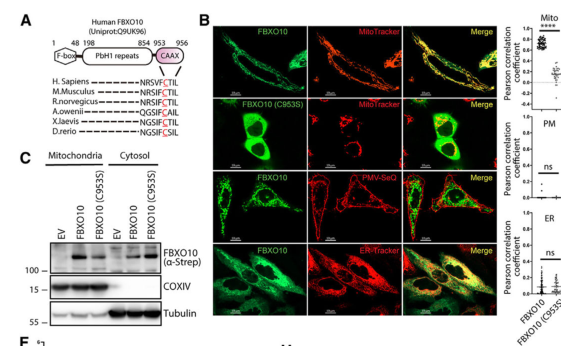

## Question

# Gene Research for Functional Annotation

## ⚠️ CRITICAL: Gene/Protein Identification Context

**BEFORE YOU BEGIN RESEARCH:** You MUST verify you are researching the CORRECT gene/protein. Gene symbols can be ambiguous, especially for less well-characterized genes from non-model organisms.

### Target Gene/Protein Identity (from UniProt):
- **UniProt Accession:** Q9UK96
- **Protein Description:** RecName: Full=F-box only protein 10;
- **Gene Information:** Name=FBXO10; Synonyms=FBX10, PRMT11;
- **Organism (full):** Homo sapiens (Human).
- **Protein Family:** Not specified in UniProt
- **Key Domains:** Beta_helix. (IPR039448); Carb-bd_sugar_hydrolysis-dom. (IPR006633); F-box-like_dom_sf. (IPR036047); F-box_dom. (IPR001810); NosD_dom. (IPR007742)

### MANDATORY VERIFICATION STEPS:

1. **Check if the gene symbol "FBXO10" matches the protein description above**
2. **Verify the organism is correct:** Homo sapiens (Human).
3. **Check if protein family/domains align with what you find in literature**
4. **If you find literature for a DIFFERENT gene with the same or similar symbol, STOP**

### If Gene Symbol is Ambiguous or You Cannot Find Relevant Literature:

**DO NOT PROCEED WITH RESEARCH ON A DIFFERENT GENE.** Instead:
- State clearly: "The gene symbol 'FBXO10' is ambiguous or literature is limited for this specific protein"
- Explain what you found (e.g., "Found extensive literature on a different gene with the same symbol in a different organism")
- Describe the protein based ONLY on the UniProt information provided above
- Suggest that the protein function can be inferred from domain/family information

### Research Target:

Please provide a comprehensive research report on the gene **FBXO10** (gene ID: FBXO10, UniProt: Q9UK96) in human.

The research report should be a detailed narrative explaining the function, biological processes, and localization of the gene product. Citations should be given for all claims.

You should prioritize authoritative reviews and primary scientific literature when conducting research. You can supplement
this with annotations you find in gene/protein databases, but these can be outdated or inaccurate.

We are specifically interested in the primary function of the gene - for enzymes, what reaction is catalyzed, and what is the substrate specificity? For transporters, what is the substrate? For structural proteins or adapters, what is the broader structural role? For signaling molecules, what is the role in the pathway.

We are interested in where in or outside the cell the gene product carries out its function.

We are also interested in the signaling or biochemical pathways in which the gene functions. We are less interested in broad pleiotropic effects, except where these elucidate the precise role.

Include evidence where possible. We are interested in both experimental evidence as well as inference from structure, evolution, or bioinformatic analysis. Precise studies should be prioritized over high-throughput, where available.

## Output

Question: You are an expert researcher providing comprehensive, well-cited information.

Provide detailed information focusing on:
1. Key concepts and definitions with current understanding
2. Recent developments and latest research (prioritize 2023-2024 sources)
3. Current applications and real-world implementations
4. Expert opinions and analysis from authoritative sources
5. Relevant statistics and data from recent studies

Format as a comprehensive research report with proper citations. Include URLs and publication dates where available.
Always prioritize recent, authoritative sources and provide specific citations for all major claims.

# Gene Research for Functional Annotation

## ⚠️ CRITICAL: Gene/Protein Identification Context

**BEFORE YOU BEGIN RESEARCH:** You MUST verify you are researching the CORRECT gene/protein. Gene symbols can be ambiguous, especially for less well-characterized genes from non-model organisms.

### Target Gene/Protein Identity (from UniProt):
- **UniProt Accession:** Q9UK96
- **Protein Description:** RecName: Full=F-box only protein 10;
- **Gene Information:** Name=FBXO10; Synonyms=FBX10, PRMT11;
- **Organism (full):** Homo sapiens (Human).
- **Protein Family:** Not specified in UniProt
- **Key Domains:** Beta_helix. (IPR039448); Carb-bd_sugar_hydrolysis-dom. (IPR006633); F-box-like_dom_sf. (IPR036047); F-box_dom. (IPR001810); NosD_dom. (IPR007742)

### MANDATORY VERIFICATION STEPS:

1. **Check if the gene symbol "FBXO10" matches the protein description above**
2. **Verify the organism is correct:** Homo sapiens (Human).
3. **Check if protein family/domains align with what you find in literature**
4. **If you find literature for a DIFFERENT gene with the same or similar symbol, STOP**

### If Gene Symbol is Ambiguous or You Cannot Find Relevant Literature:

**DO NOT PROCEED WITH RESEARCH ON A DIFFERENT GENE.** Instead:
- State clearly: "The gene symbol 'FBXO10' is ambiguous or literature is limited for this specific protein"
- Explain what you found (e.g., "Found extensive literature on a different gene with the same symbol in a different organism")
- Describe the protein based ONLY on the UniProt information provided above
- Suggest that the protein function can be inferred from domain/family information

### Research Target:

Please provide a comprehensive research report on the gene **FBXO10** (gene ID: FBXO10, UniProt: Q9UK96) in human.

The research report should be a detailed narrative explaining the function, biological processes, and localization of the gene product. Citations should be given for all claims.

You should prioritize authoritative reviews and primary scientific literature when conducting research. You can supplement
this with annotations you find in gene/protein databases, but these can be outdated or inaccurate.

We are specifically interested in the primary function of the gene - for enzymes, what reaction is catalyzed, and what is the substrate specificity? For transporters, what is the substrate? For structural proteins or adapters, what is the broader structural role? For signaling molecules, what is the role in the pathway.

We are interested in where in or outside the cell the gene product carries out its function.

We are also interested in the signaling or biochemical pathways in which the gene functions. We are less interested in broad pleiotropic effects, except where these elucidate the precise role.

Include evidence where possible. We are interested in both experimental evidence as well as inference from structure, evolution, or bioinformatic analysis. Precise studies should be prioritized over high-throughput, where available.

## Research report: Human FBXO10 (UniProt Q9UK96) functional annotation

### 0) Target verification (gene/protein identity)
FBXO10 (F-box only protein 10) is the human gene/protein associated with UniProt accession Q9UK96 and is functionally characterized in the literature as an F-box substrate receptor within SCF (SKP1–CUL1–F-box) E3 ubiquitin ligase complexes (“SCF(FBXO10)” or “SCF^FBXO10”). Primary studies show FBXO10 binds core SCF components SKP1 and CUL1 and controls substrate ubiquitination and degradation, confirming the identity matches the requested target rather than other similarly named F-box proteins (e.g., FBXO11/FBXL10). (chiorazzi2013relatedfboxproteins pages 4-5, chiorazzi2013relatedfboxproteins pages 3-4, bhat2024geranylgeranylatedscffbxo10regulates pages 5-6)

---

### 1) Key concepts and definitions (current understanding)

#### 1.1 F-box proteins and SCF E3 ligases
F-box proteins are substrate-recognition subunits of SCF (SKP1–CUL1–F-box) E3 ubiquitin ligase complexes. SCF complexes include invariant components (CUL1 scaffold, SKP1 adaptor, RBX1/2 RING subunit) and a variable F-box protein that confers substrate specificity by binding degron motifs on targets—often regulated by post-translational modifications such as phosphorylation. (wang2014rolesoffbox pages 1-3, tekcham2020fboxproteinsand pages 1-3)

In cancer biology, dysregulated SCF/F-box-mediated proteolysis can promote or suppress tumorigenesis depending on the substrates affected, and F-box proteins are thus discussed as mechanistically important and potentially druggable nodes in ubiquitin-mediated regulation. (wang2014rolesoffbox pages 1-3, wang2014rolesoffbox pages 14-16)

#### 1.2 What FBXO10 does (high-level definition)
FBXO10 is an FBXO-class F-box protein that acts primarily as a substrate receptor: it recruits specific proteins to an SCF-type E3 ubiquitin ligase for ubiquitination, thereby controlling their stability and downstream pathway activity. In the best-established lymphoma context, a major substrate is the anti-apoptotic protein BCL2, with FBXO10 acting as a tumor-suppressive regulator by promoting BCL2 ubiquitination and degradation. (yang2015proteinubiquitinationin pages 11-13, chiorazzi2013relatedfboxproteins pages 4-5)

---

### 2) Molecular function, substrates, localization, and pathways

#### 2.1 Canonical lymphoma axis: FBXO10 → BCL2 turnover → apoptosis
**Mechanism and evidence.** In human lymphoma models, FBXO10 physically associates with BCL2 and SCF components and promotes BCL2 ubiquitination and destabilization. Loss-of-function or hypomorphic lymphoma-derived FBXO10 mutations (e.g., R44H in the F-box) impair SKP1 binding/SCF assembly and diminish BCL2 destabilization and pro-apoptotic effects. (chiorazzi2013relatedfboxproteins pages 4-5, chiorazzi2013relatedfboxproteins pages 3-4)

**Functional consequences.** Forced expression of FBXO10 induces apoptosis in multiple lymphoma cell lines, as measured by apoptotic markers (e.g., activated caspase-3, cleaved PARP), and ectopic BCL2 partially rescues cells from FBXO10-induced death—supporting BCL2 as a key functional substrate in this context. (chiorazzi2013relatedfboxproteins pages 5-6)

**Pathway context.** This axis places FBXO10 as a post-translational brake on the mitochondrial apoptosis checkpoint regulated by BCL2. (yang2015proteinubiquitinationin pages 11-13, choi2019e3ubiquitinligases pages 8-9)

#### 2.2 Mantle cell lymphoma (MCL): FBXO10 deficiency and BTK/NF-κB-driven BCL2 elevation
In mantle cell lymphoma models, BCL2 elevation is attributed to both transcriptional upregulation (via BTK-mediated canonical NF-κB activation) and impaired proteasomal degradation due to absent/very low FBXO10 expression. FBXO10 silencing stabilizes BCL2 in cycloheximide-chase experiments. Pharmacologically, combining BCL2 inhibition (ABT-199/venetoclax) with BTK inhibition (ibrutinib) shows synergistic activity in vitro and in vivo in this mechanistic framework. (li2016fbxo10deficiencyand pages 1-2, li2016fbxo10deficiencyand pages 8-9)

#### 2.3 Inflammatory receptor proteostasis: FBXO10 targets RAGE
FBXO10 was identified in an F-box screen as a factor that decreases RAGE protein levels and accelerates RAGE degradation. FBXO10 depletion stabilizes RAGE, supporting endogenous control. RAGE recognition involves specific cytoplasmic residues (e.g., K374 and S391), consistent with the general paradigm that degrons and post-translational modification states influence SCF substrate engagement. In this study, RAGE undergoes monoubiquitination and is routed to lysosomal degradation. (evankovich2017receptorforadvanced pages 5-7, evankovich2017receptorforadvanced pages 1-2)

#### 2.4 Subcellular targeting by lipidation: new 2024 mitochondrial mechanism
A major 2024 advance is that FBXO10 can be **post-translationally geranylgeranylated** at a C-terminal CaaX motif (C953), which is required for its stable targeting to the **outer mitochondrial membrane (OMM)**. This lipidation enables mitochondrial delivery via a PDE6δ/HSP90-dependent pathway linked to TOM70 docking, forming a mitochondrial SCF(FBXO10) complex with SKP1 and CUL1 at the OMM. (bhat2024geranylgeranylatedscffbxo10regulates pages 1-3, bhat2024geranylgeranylatedscffbxo10regulates pages 8-9)

**Substrate and function at mitochondria.** Proteomics and biochemical assays support **PGAM5** (a mitochondrial phosphatase) as an FBXO10-regulated OMM substrate: FBXO10 promotes PGAM5 polyubiquitylation and degradation in a manner sensitive to proteasome inhibition and cullin neddylation blockade. Loss of FBXO10 or expression of prenylation-deficient FBXO10(C953S) prevents PGAM5 degradation, disrupts mitochondrial morphology and bioenergetics, and impairs myogenic differentiation in human and murine myogenic models. (bhat2024geranylgeranylatedscffbxo10regulates pages 9-11, bhat2024geranylgeranylatedscffbxo10regulates pages 11-13)

**Visual evidence from the 2024 study.** The paper contains microscopy and biochemical panels showing WT FBXO10 mitochondrial localization versus cytosolic distribution of the C953S mutant, and TUBE-based evidence of PGAM5 polyubiquitination dependent on WT FBXO10. (bhat2024geranylgeranylatedscffbxo10regulates media 66ac8191, bhat2024geranylgeranylatedscffbxo10regulates media 6d0eb518)

#### 2.5 Ferroptosis and immunotherapy resistance (2023): FBXO10 and ACSL4
A 2023 Cell Death & Disease study links FBXO10 to ferroptosis regulation and anti-PD-1 response in colorectal cancer via a **CYP1B1 → 20-HETE → PKC → FBXO10** axis. 20-HETE induces FBXO10 (blocked by PKC inhibition), and the pathway promotes ACSL4 polyubiquitination and decreases ACSL4 half-life/protein abundance. Because ACSL4 promotes PUFA lipid remodeling and ferroptosis sensitivity, its loss reduces ferroptosis and is associated with reduced anti-PD-1 efficacy in vivo; CYP1B1 knockdown improved response to anti-mPD-1 and increased 4-HNE (lipid peroxidation marker). (chen2023cyp1b1inhibitsferroptosis pages 2-6, chen2023cyp1b1inhibitsferroptosis pages 6-8)

#### 2.6 BCR signaling and HGAL turnover (review-supported mechanistic model; 2023–2024)
A 2023 review of HGAL biology describes a spatially regulated mechanism in which B-cell receptor engagement induces rapid, reversible **palmitoylation** of SCF(FBXO10), relocalizing FBXO10 to the plasma membrane where it binds HGAL and triggers HGAL ubiquitination and proteasomal degradation. The reported interaction depends on a conserved HGAL residue (H91) and is described as phosphorylation-independent. (jiang2023roleofan pages 3-5, jiang2023roleofan pages 5-7)

---

### 3) Recent developments and latest research (prioritizing 2023–2024)

#### 3.1 2024: FBXO10 as a prenylation-controlled mitochondrial E3 (Cell Reports)
The 2024 Cell Reports study reframes FBXO10 biology by adding a **mitochondrial OMM-localized pool** that is controlled by geranylgeranylation and acts on OMM proteostasis (not just cytosolic/membrane receptors or BCL2). This introduces new mechanistic concepts for FBXO10: lipidation-dependent trafficking, OMM-delivered SCF activity, and control of mitochondrial network state, respiratory capacity, and differentiation outcomes via substrates such as PGAM5. (bhat2024geranylgeranylatedscffbxo10regulates pages 1-3, bhat2024geranylgeranylatedscffbxo10regulates pages 9-11, bhat2024geranylgeranylatedscffbxo10regulates pages 11-13)

#### 3.2 2023: FBXO10 in ferroptosis and immunotherapy response (Cell Death & Disease)
The 2023 CRC study connects FBXO10-mediated ubiquitination to ferroptosis sensitivity and immune checkpoint blockade efficacy. It also provides human-tissue correlative observations (IHC negative correlation between CYP1B1 and ACSL4; high CYP1B1 associated with worse survival), positioning the FBXO10–ACSL4 arm as part of a clinically relevant resistance axis. (chen2023cyp1b1inhibitsferroptosis pages 6-8, chen2023cyp1b1inhibitsferroptosis pages 1-2)

#### 3.3 2023: BCR/HGAL axis synthesis (review)
A 2023 review consolidates mechanistic evidence that HGAL protein levels are controlled post-translationally by FBXO10 in response to BCR activation via palmitoylation-driven FBXO10 membrane translocation, emphasizing temporally and spatially gated substrate access. (jiang2023roleofan pages 3-5, jiang2023roleofan pages 5-7)

---

### 4) Current applications and real-world implementations

#### 4.1 Lymphoma therapeutic implications (indirect targeting through BCL2)
Although FBXO10 itself is not currently a standard drug target, its best-established substrate (BCL2) is directly druggable. Mechanistic evidence in mantle cell lymphoma supports that defects in FBXO10-mediated degradation contribute to BCL2 protein persistence and apoptosis resistance, and that BCL2 inhibition (ABT-199/venetoclax) can be required to enhance BTK inhibitor activity (e.g., ibrutinib), including in resistant settings. (li2016fbxo10deficiencyand pages 1-2, li2016fbxo10deficiencyand pages 8-9)

#### 4.2 Immuno-oncology/ferroptosis axis (CRC)
The 2023 CRC work suggests that upstream blockade of the CYP1B1/20-HETE/PKC pathway could downregulate FBXO10 and restore ACSL4, increasing ferroptosis and improving anti-PD-1 response. This is an example of a real-world implementation path: rather than targeting FBXO10 directly, intervening upstream or at ferroptosis nodes may modulate an FBXO10-dependent phenotype. (chen2023cyp1b1inhibitsferroptosis pages 6-8, chen2023cyp1b1inhibitsferroptosis pages 1-2)

#### 4.3 Mitochondrial disease and differentiation contexts (emerging)
The 2024 mitochondrial study points to potential future applications in muscle biology and mitochondrial quality-control disorders, as FBXO10 loss or prenylation blockade impaired bioenergetics and differentiation in myogenic models. This is currently preclinical mechanistic work but suggests new application areas beyond hematologic malignancies. (bhat2024geranylgeranylatedscffbxo10regulates pages 9-11, bhat2024geranylgeranylatedscffbxo10regulates pages 11-13)

#### 4.4 Clinical trial landscape
A ClinicalTrials.gov-style query for “FBXO10” did not yield clearly FBXO10-targeted interventional trials in the retrieved results, consistent with FBXO10 being an emerging mechanistic node rather than a mature clinical target at present. (wang2014rolesoffbox pages 14-16)

---

### 5) Expert opinions and authoritative analysis

#### 5.1 FBXO10 as a tumor suppressor in lymphoma via BCL2 control
Lymphoma-focused reviews and primary work interpret FBXO10 as a tumor-suppressive SCF substrate receptor in germinal-center–type DLBCL, where reduced FBXO10 expression and/or coding mutations impair BCL2 degradation and thereby enhance survival signaling. (yang2015proteinubiquitinationin pages 11-13)

#### 5.2 Context dependence and redundancy (species and pathway context)
A mouse genetics study engineered Fbxo10 loss-of-function alleles and observed no discernible increase in BCL2 protein or B-cell accumulation in mice, concluding that FBXO10 either does not regulate BCL2 in mice or functions redundantly with other ligases (suggesting candidates such as FBXO11 or ARTS-XIAP). This highlights that FBXO10 biology can be context- and species-dependent, and functional redundancy may mask phenotypes in some systems. (maslefarquhar2021lossoffunctionoffbxo10 pages 1-2)

#### 5.3 FBXO10 as a multi-compartment E3 substrate receptor
Across the evidence base, FBXO10 is increasingly understood not as a single-compartment factor but as a substrate receptor whose effective substrate spectrum depends on regulated localization—e.g., plasma membrane (palmitoylation; HGAL pathway per review), cytoplasmic/mitochondria-associated pools (BCL2), endomembrane/lysosomal trafficking (RAGE), and OMM targeting controlled by geranylgeranylation (PGAM5). (evankovich2017receptorforadvanced pages 1-2, bhat2024geranylgeranylatedscffbxo10regulates pages 11-13, jiang2023roleofan pages 5-7)

---

### 6) Relevant statistics and data points from studies

* **DLBCL mutation frequency (FBXO10):** In a lymphoma review summarizing sequencing cohorts, coding-region mutations in FBXO10 were found in approximately **~5% of GCB DLBCL** and **~1% of ABC DLBCL**, and these mutations include frameshift and missense variants (e.g., R44H) that impair SCF association and/or BCL2 destabilization. (yang2015proteinubiquitinationin pages 11-13)
* **Cell-line sensitivity to FBXO10-induced apoptosis:** In the foundational PNAS study, FBXO10 expression was toxic to multiple lymphoma lines, affecting **5/6 ABC DLBCL, 4/8 GCB DLBCL, 4/6 MCL, and 1/3 PMBL** cell lines tested; ectopic BCL2 partially rescued viability in an example experiment. (chiorazzi2013relatedfboxproteins pages 4-5)
* **MCL tissue microarray size:** The MCL mechanistic study reports analyzing a **62-sample** mantle cell lymphoma tissue microarray when examining BCL2/BTK relationships (specific quantitative correlation values are not available in the excerpted evidence). (li2016fbxo10deficiencyand pages 1-2)
* **OpenTargets evidence volume:** OpenTargets lists FBXO10 associations with several diseases (e.g., hepatocellular carcinoma; kidney disease) with small evidence counts (e.g., 5 items per association in the retrieved output), indicating emerging/limited curated genetic/functional evidence rather than a mature clinical association profile. (OpenTargets Search: -FBXO10)

---

### Summary of experimentally supported functions (at a glance)
| Substrate/Process | Evidence type (binding/ubiquitination/degradation/phenotype) | Cell/tissue context | Subcellular localization of FBXO10 action | Key mechanistic notes (e.g., SCF complex, PTM required) | Primary citation (author-year, DOI URL, pub date) |
|---|---|---|---|---|---|
| BCL2 | Binding to BCL2; promotion of BCL2 ubiquitination; accelerated degradation/shortened half-life; apoptosis induction in lymphoma cells; hypomorphic cancer mutations reduce activity | Human DLBCL and mantle cell lymphoma cell lines; lymphoma tumor context | Predominantly cytoplasmic, acting on mitochondrial outer membrane-associated/anti-apoptotic BCL2 pool | FBXO10 is the substrate-recognition subunit of an SCF (SKP1-CUL1-F-box) E3 ligase; intact F-box needed for SKP1 binding/SCF assembly; tumor mutations include R44H (F-box), V762L and R825W (CASH/PbH1 region), impairing BCL2 destabilization; reduced FBXO10 expression/mutation linked to elevated BCL2 and survival signaling (chiorazzi2013relatedfboxproteins pages 5-6, yang2015proteinubiquitinationin pages 11-13, chiorazzi2013relatedfboxproteins pages 4-5, chiorazzi2013relatedfboxproteins pages 3-4, li2016fbxo10deficiencyand pages 1-2) | Chiorazzi et al. 2013, https://doi.org/10.1073/pnas.1217271110, Feb 2013; Li et al. 2016, https://doi.org/10.1038/onc.2016.155, Dec 2016 |
| RAGE | FBXO10 identified in F-box screen; binding/association with RAGE; increased ubiquitination; enhanced degradation rate in cycloheximide chase; stabilization after FBXO10 knockdown | Human cell culture models studying inflammatory receptor turnover | Endomembrane/lysosomal pathway after receptor internalization | FBXO10 associates with SKP1/CUL1 consistent with SCF complex; RAGE recognition depends on cytoplasmic K374 and phosphorylation-sensitive S391; ODN2006 and PKCζ signaling promote degradation; reported endpoint is lysosomal degradation rather than classic solely proteasomal turnover (evankovich2017receptorforadvanced pages 5-7, evankovich2017receptorforadvanced pages 1-2) | Evankovich et al. 2017, https://doi.org/10.1096/fj.201700031r, Sep 2017 |
| PGAM5 | OMM-dependent binding; polyubiquitylation detected by TUBE pulldown; timed degradation during differentiation; loss of FBXO10 impairs mitochondrial ATP production, membrane potential, morphology, mitophagy resolution, and myotube formation | Human iPSC-derived myogenic cells, HeLa localization systems, murine C2C12 myoblast differentiation models | Outer mitochondrial membrane (OMM) | Major 2024 advance: FBXO10 is geranylgeranylated at C953 in a C-terminal CaaX motif; this PTM is required for OMM targeting via PDE6δ/HSP90/TOM70-linked delivery; WT but not C953S mutant localizes to mitochondria and assembles mitochondrial SCF(FBXO10); cullin neddylation/proteasome activity required for PGAM5 turnover (bhat2024geranylgeranylatedscffbxo10regulates pages 5-6, bhat2024geranylgeranylatedscffbxo10regulates pages 1-3, bhat2024geranylgeranylatedscffbxo10regulates pages 36-38, bhat2024geranylgeranylatedscffbxo10regulates pages 3-5, bhat2024geranylgeranylatedscffbxo10regulates pages 9-11, bhat2024geranylgeranylatedscffbxo10regulates pages 11-13, bhat2024geranylgeranylatedscffbxo10regulates pages 8-9, bhat2024geranylgeranylatedscffbxo10regulates media 66ac8191) | Bhat et al. 2024, https://doi.org/10.1016/j.celrep.2024.114783, Oct 2024 |
| ACSL4 | Increased FBXO10 expression downstream of CYP1B1/20-HETE/PKC; ACSL4 polyubiquitination and reduced half-life/protein abundance; ferroptosis suppression; reduced anti-PD-1 response in vivo when pathway is active | Colorectal cancer cell lines and mouse tumor models | Not definitively localized in the cited study; function inferred in cytoplasmic/endomembrane protein quality-control context affecting lipid metabolism | Study places FBXO10 in a CYP1B1 → 20-HETE → PKC → FBXO10 axis; elevated FBXO10 promotes ACSL4 degradation, lowering ferroptosis sensitivity and contributing to immunotherapy resistance; evidence for FBXO10 as ACSL4 E3 is strong but upstream signaling focus is on CYP1B1 (chen2023cyp1b1inhibitsferroptosis pages 2-6, chen2023cyp1b1inhibitsferroptosis pages 6-8, chen2023cyp1b1inhibitsferroptosis pages 1-2, chen2023cyp1b1inhibitsferroptosis pages 8-8) | Chen et al. 2023, https://doi.org/10.1038/s41419-023-05803-2, Apr 2023 |
| HGAL | Review-based summary of prior experimental work: BCR-triggered FBXO10 relocalization enables HGAL binding, ubiquitination, and proteasomal degradation | Germinal-center B cells / DLBCL and Burkitt lymphoma signaling context after BCR engagement | Plasma membrane/cell membrane-associated compartment after BCR stimulation, followed by cytoplasmic proteasomal turnover | FBXO10 undergoes rapid, reversible palmitoylation after BCR engagement; palmitoylation drives relocation to the plasma membrane where FBXO10 binds HGAL; interaction reported as phosphorylation-independent and dependent on HGAL H91; included here as review-supported rather than directly re-read primary data in current context (jiang2023roleofan pages 3-5, jiang2023roleofan pages 5-7) | Jiang & Lossos 2023, https://doi.org/10.37349/ei.2023.00097, Jun 2023 |
| Mitochondrial proteostasis / myogenic differentiation (process-level) | Comparative mitochondrial proteomics; localization assays; respiration, membrane potential, mitophagy, morphology, and differentiation phenotypes | Human and murine myogenic models | Outer mitochondrial membrane | FBXO10 acts as a prenylated mitochondrial SCF E3 controlling selective OMM proteostasis; ~18 candidate OMM/OMM-associated proteins changed reciprocally with WT versus C953S FBXO10, indicating broader substrate scope beyond PGAM5; WT promotes hyperfused/perinuclear mitochondrial networks, whereas prenylation-deficient or ΔF-box forms act dominantly negative (bhat2024geranylgeranylatedscffbxo10regulates pages 5-6, bhat2024geranylgeranylatedscffbxo10regulates pages 1-3, bhat2024geranylgeranylatedscffbxo10regulates pages 3-5, bhat2024geranylgeranylatedscffbxo10regulates pages 9-11, bhat2024geranylgeranylatedscffbxo10regulates pages 22-26) | Bhat et al. 2024, https://doi.org/10.1016/j.celrep.2024.114783, Oct 2024 |

*Table: This table summarizes experimentally supported or review-supported FBXO10 substrates/processes, the kinds of evidence behind each assignment, and the cellular compartment where FBXO10 acts. It is useful for distinguishing well-established lymphoma-related roles from newer 2023-2024 findings in mitochondrial proteostasis and ferroptosis-related pathways.*

---

### References (URLs and publication dates)
The citations embedded above include DOI URLs and month/year publication metadata as captured in the retrieved sources, including: Chiorazzi et al., PNAS (Feb 2013) https://doi.org/10.1073/pnas.1217271110; Yang & Staudt, Immunological Reviews (Jan 2015) https://doi.org/10.1111/imr.12247; Li et al., Oncogene (Dec 2016) https://doi.org/10.1038/onc.2016.155; Evankovich et al., FASEB J (Sep 2017) https://doi.org/10.1096/fj.201700031r; Jiang & Lossos (Jun 2023) https://doi.org/10.37349/ei.2023.00097; Chen et al., Cell Death & Disease (Apr 2023) https://doi.org/10.1038/s41419-023-05803-2; Bhat et al., Cell Reports (Oct 2024) https://doi.org/10.1016/j.celrep.2024.114783. (chiorazzi2013relatedfboxproteins pages 5-6, li2016fbxo10deficiencyand pages 1-2, evankovich2017receptorforadvanced pages 5-7, jiang2023roleofan pages 3-5, chen2023cyp1b1inhibitsferroptosis pages 2-6, bhat2024geranylgeranylatedscffbxo10regulates pages 1-3)

References

1. (chiorazzi2013relatedfboxproteins pages 4-5): Michael Chiorazzi, Lixin Rui, Yandan Yang, Michele Ceribelli, Nima Tishbi, Carine W. Maurer, Stella M. Ranuncolo, Hong Zhao, Weihong Xu, Wing-Chung C. Chan, Elaine S. Jaffe, Randy D. Gascoyne, Elias Campo, Andreas Rosenwald, German Ott, Jan Delabie, Lisa M. Rimsza, Shai Shaham, and Louis M. Staudt. Related f-box proteins control cell death in caenorhabditis elegans and human lymphoma. Proceedings of the National Academy of Sciences, 110:3943-3948, Feb 2013. URL: https://doi.org/10.1073/pnas.1217271110, doi:10.1073/pnas.1217271110. This article has 84 citations and is from a highest quality peer-reviewed journal.

2. (chiorazzi2013relatedfboxproteins pages 3-4): Michael Chiorazzi, Lixin Rui, Yandan Yang, Michele Ceribelli, Nima Tishbi, Carine W. Maurer, Stella M. Ranuncolo, Hong Zhao, Weihong Xu, Wing-Chung C. Chan, Elaine S. Jaffe, Randy D. Gascoyne, Elias Campo, Andreas Rosenwald, German Ott, Jan Delabie, Lisa M. Rimsza, Shai Shaham, and Louis M. Staudt. Related f-box proteins control cell death in caenorhabditis elegans and human lymphoma. Proceedings of the National Academy of Sciences, 110:3943-3948, Feb 2013. URL: https://doi.org/10.1073/pnas.1217271110, doi:10.1073/pnas.1217271110. This article has 84 citations and is from a highest quality peer-reviewed journal.

3. (bhat2024geranylgeranylatedscffbxo10regulates pages 5-6): Sameer Ahmed Bhat, Zahra Vasi, Liping Jiang, Shruthi Selvaraj, Rachel Ferguson, Sanaz Salarvand, Anish Gudur, Ritika Adhikari, Veronica Castillo, Hagar Ismail, Avantika Dhabaria, Beatrix Ueberheide, and Shafi Kuchay. Geranylgeranylated scffbxo10 regulates selective outer mitochondrial membrane proteostasis and function. Oct 2024. URL: https://doi.org/10.1016/j.celrep.2024.114783, doi:10.1016/j.celrep.2024.114783. This article has 11 citations and is from a highest quality peer-reviewed journal.

4. (wang2014rolesoffbox pages 1-3): Zhiwei Wang, Pengda Liu, Hiroyuki Inuzuka, and Wenyi Wei. Roles of f-box proteins in cancer. Nature Reviews Cancer, 14:233-247, Mar 2014. URL: https://doi.org/10.1038/nrc3700, doi:10.1038/nrc3700. This article has 586 citations and is from a domain leading peer-reviewed journal.

5. (tekcham2020fboxproteinsand pages 1-3): Dinesh Singh Tekcham, Di Chen, Yu Liu, Ting Ling, Yi Zhang, Huan Chen, Wen Wang, Wuxiyar Otkur, Huan Qi, Tian Xia, Xiaolong Liu, Hai-long Piao, and Hongxu Liu. F-box proteins and cancer: an update from functional and regulatory mechanism to therapeutic clinical prospects. Theranostics, 10:4150-4167, Mar 2020. URL: https://doi.org/10.7150/thno.42735, doi:10.7150/thno.42735. This article has 111 citations and is from a domain leading peer-reviewed journal.

6. (wang2014rolesoffbox pages 14-16): Zhiwei Wang, Pengda Liu, Hiroyuki Inuzuka, and Wenyi Wei. Roles of f-box proteins in cancer. Nature Reviews Cancer, 14:233-247, Mar 2014. URL: https://doi.org/10.1038/nrc3700, doi:10.1038/nrc3700. This article has 586 citations and is from a domain leading peer-reviewed journal.

7. (yang2015proteinubiquitinationin pages 11-13): Yibin Yang and Louis M. Staudt. Protein ubiquitination in lymphoid malignancies. Immunological Reviews, 263:240-256, Jan 2015. URL: https://doi.org/10.1111/imr.12247, doi:10.1111/imr.12247. This article has 32 citations and is from a domain leading peer-reviewed journal.

8. (chiorazzi2013relatedfboxproteins pages 5-6): Michael Chiorazzi, Lixin Rui, Yandan Yang, Michele Ceribelli, Nima Tishbi, Carine W. Maurer, Stella M. Ranuncolo, Hong Zhao, Weihong Xu, Wing-Chung C. Chan, Elaine S. Jaffe, Randy D. Gascoyne, Elias Campo, Andreas Rosenwald, German Ott, Jan Delabie, Lisa M. Rimsza, Shai Shaham, and Louis M. Staudt. Related f-box proteins control cell death in caenorhabditis elegans and human lymphoma. Proceedings of the National Academy of Sciences, 110:3943-3948, Feb 2013. URL: https://doi.org/10.1073/pnas.1217271110, doi:10.1073/pnas.1217271110. This article has 84 citations and is from a highest quality peer-reviewed journal.

9. (choi2019e3ubiquitinligases pages 8-9): Jaewoo Choi and Luca Busino. E3 ubiquitin ligases in b-cell malignancies. Cellular immunology, 340:103905, Jun 2019. URL: https://doi.org/10.1016/j.cellimm.2019.02.004, doi:10.1016/j.cellimm.2019.02.004. This article has 8 citations and is from a peer-reviewed journal.

10. (li2016fbxo10deficiencyand pages 1-2): Yangguang Li, Myriam N Bouchlaka, J. Wolff, K. Grindle, Li Lu, S. Qian, Xuehua Zhong, N. Pflum, P. Jobin, B. S. Kahl, B. S. Kahl, Jens C. Eickhoff, S. Wuerzberger-Davis, Shigeki Miyamoto, Craig J Thomas, David T. Yang, C. Capitini, and L. Rui. Fbxo10 deficiency and btk activation upregulate bcl2 expression in mantle cell lymphoma. Oncogene, 35:6223-6234, Dec 2016. URL: https://doi.org/10.1038/onc.2016.155, doi:10.1038/onc.2016.155. This article has 74 citations and is from a domain leading peer-reviewed journal.

11. (li2016fbxo10deficiencyand pages 8-9): Yangguang Li, Myriam N Bouchlaka, J. Wolff, K. Grindle, Li Lu, S. Qian, Xuehua Zhong, N. Pflum, P. Jobin, B. S. Kahl, B. S. Kahl, Jens C. Eickhoff, S. Wuerzberger-Davis, Shigeki Miyamoto, Craig J Thomas, David T. Yang, C. Capitini, and L. Rui. Fbxo10 deficiency and btk activation upregulate bcl2 expression in mantle cell lymphoma. Oncogene, 35:6223-6234, Dec 2016. URL: https://doi.org/10.1038/onc.2016.155, doi:10.1038/onc.2016.155. This article has 74 citations and is from a domain leading peer-reviewed journal.

12. (evankovich2017receptorforadvanced pages 5-7): John Evankovich, Travis Lear, Alison Mckelvey, Sarah Dunn, James Londino, Yuan Liu, Bill B. Chen, and Rama K. Mallampalli. Receptor for advanced glycation end products is targeted by fbxo10 for ubiquitination and degradation. Sep 2017. URL: https://doi.org/10.1096/fj.201700031r, doi:10.1096/fj.201700031r. This article has 24 citations.

13. (evankovich2017receptorforadvanced pages 1-2): John Evankovich, Travis Lear, Alison Mckelvey, Sarah Dunn, James Londino, Yuan Liu, Bill B. Chen, and Rama K. Mallampalli. Receptor for advanced glycation end products is targeted by fbxo10 for ubiquitination and degradation. Sep 2017. URL: https://doi.org/10.1096/fj.201700031r, doi:10.1096/fj.201700031r. This article has 24 citations.

14. (bhat2024geranylgeranylatedscffbxo10regulates pages 1-3): Sameer Ahmed Bhat, Zahra Vasi, Liping Jiang, Shruthi Selvaraj, Rachel Ferguson, Sanaz Salarvand, Anish Gudur, Ritika Adhikari, Veronica Castillo, Hagar Ismail, Avantika Dhabaria, Beatrix Ueberheide, and Shafi Kuchay. Geranylgeranylated scffbxo10 regulates selective outer mitochondrial membrane proteostasis and function. Oct 2024. URL: https://doi.org/10.1016/j.celrep.2024.114783, doi:10.1016/j.celrep.2024.114783. This article has 11 citations and is from a highest quality peer-reviewed journal.

15. (bhat2024geranylgeranylatedscffbxo10regulates pages 8-9): Sameer Ahmed Bhat, Zahra Vasi, Liping Jiang, Shruthi Selvaraj, Rachel Ferguson, Sanaz Salarvand, Anish Gudur, Ritika Adhikari, Veronica Castillo, Hagar Ismail, Avantika Dhabaria, Beatrix Ueberheide, and Shafi Kuchay. Geranylgeranylated scffbxo10 regulates selective outer mitochondrial membrane proteostasis and function. Oct 2024. URL: https://doi.org/10.1016/j.celrep.2024.114783, doi:10.1016/j.celrep.2024.114783. This article has 11 citations and is from a highest quality peer-reviewed journal.

16. (bhat2024geranylgeranylatedscffbxo10regulates pages 9-11): Sameer Ahmed Bhat, Zahra Vasi, Liping Jiang, Shruthi Selvaraj, Rachel Ferguson, Sanaz Salarvand, Anish Gudur, Ritika Adhikari, Veronica Castillo, Hagar Ismail, Avantika Dhabaria, Beatrix Ueberheide, and Shafi Kuchay. Geranylgeranylated scffbxo10 regulates selective outer mitochondrial membrane proteostasis and function. Oct 2024. URL: https://doi.org/10.1016/j.celrep.2024.114783, doi:10.1016/j.celrep.2024.114783. This article has 11 citations and is from a highest quality peer-reviewed journal.

17. (bhat2024geranylgeranylatedscffbxo10regulates pages 11-13): Sameer Ahmed Bhat, Zahra Vasi, Liping Jiang, Shruthi Selvaraj, Rachel Ferguson, Sanaz Salarvand, Anish Gudur, Ritika Adhikari, Veronica Castillo, Hagar Ismail, Avantika Dhabaria, Beatrix Ueberheide, and Shafi Kuchay. Geranylgeranylated scffbxo10 regulates selective outer mitochondrial membrane proteostasis and function. Oct 2024. URL: https://doi.org/10.1016/j.celrep.2024.114783, doi:10.1016/j.celrep.2024.114783. This article has 11 citations and is from a highest quality peer-reviewed journal.

18. (bhat2024geranylgeranylatedscffbxo10regulates media 66ac8191): Sameer Ahmed Bhat, Zahra Vasi, Liping Jiang, Shruthi Selvaraj, Rachel Ferguson, Sanaz Salarvand, Anish Gudur, Ritika Adhikari, Veronica Castillo, Hagar Ismail, Avantika Dhabaria, Beatrix Ueberheide, and Shafi Kuchay. Geranylgeranylated scffbxo10 regulates selective outer mitochondrial membrane proteostasis and function. Oct 2024. URL: https://doi.org/10.1016/j.celrep.2024.114783, doi:10.1016/j.celrep.2024.114783. This article has 11 citations and is from a highest quality peer-reviewed journal.

19. (bhat2024geranylgeranylatedscffbxo10regulates media 6d0eb518): Sameer Ahmed Bhat, Zahra Vasi, Liping Jiang, Shruthi Selvaraj, Rachel Ferguson, Sanaz Salarvand, Anish Gudur, Ritika Adhikari, Veronica Castillo, Hagar Ismail, Avantika Dhabaria, Beatrix Ueberheide, and Shafi Kuchay. Geranylgeranylated scffbxo10 regulates selective outer mitochondrial membrane proteostasis and function. Oct 2024. URL: https://doi.org/10.1016/j.celrep.2024.114783, doi:10.1016/j.celrep.2024.114783. This article has 11 citations and is from a highest quality peer-reviewed journal.

20. (chen2023cyp1b1inhibitsferroptosis pages 2-6): Congcong Chen, Yabing Yang, Yanguan Guo, Jiashuai He, Zuyang Chen, Shenghui Qiu, Yiran Zhang, Hui Ding, Jinghua Pan, and Yunlong Pan. Cyp1b1 inhibits ferroptosis and induces anti-pd-1 resistance by degrading acsl4 in colorectal cancer. Cell Death &amp; Disease, Apr 2023. URL: https://doi.org/10.1038/s41419-023-05803-2, doi:10.1038/s41419-023-05803-2. This article has 123 citations and is from a peer-reviewed journal.

21. (chen2023cyp1b1inhibitsferroptosis pages 6-8): Congcong Chen, Yabing Yang, Yanguan Guo, Jiashuai He, Zuyang Chen, Shenghui Qiu, Yiran Zhang, Hui Ding, Jinghua Pan, and Yunlong Pan. Cyp1b1 inhibits ferroptosis and induces anti-pd-1 resistance by degrading acsl4 in colorectal cancer. Cell Death &amp; Disease, Apr 2023. URL: https://doi.org/10.1038/s41419-023-05803-2, doi:10.1038/s41419-023-05803-2. This article has 123 citations and is from a peer-reviewed journal.

22. (jiang2023roleofan pages 3-5): Xiaoyu Jiang and Izidore S. Lossos. Role of an adaptor protein human germinal center-associated lymphoma (hgal) in cell signaling and lymphomagenesis. Exploration of Immunology, pages 186-206, Jun 2023. URL: https://doi.org/10.37349/ei.2023.00097, doi:10.37349/ei.2023.00097. This article has 1 citations.

23. (jiang2023roleofan pages 5-7): Xiaoyu Jiang and Izidore S. Lossos. Role of an adaptor protein human germinal center-associated lymphoma (hgal) in cell signaling and lymphomagenesis. Exploration of Immunology, pages 186-206, Jun 2023. URL: https://doi.org/10.37349/ei.2023.00097, doi:10.37349/ei.2023.00097. This article has 1 citations.

24. (chen2023cyp1b1inhibitsferroptosis pages 1-2): Congcong Chen, Yabing Yang, Yanguan Guo, Jiashuai He, Zuyang Chen, Shenghui Qiu, Yiran Zhang, Hui Ding, Jinghua Pan, and Yunlong Pan. Cyp1b1 inhibits ferroptosis and induces anti-pd-1 resistance by degrading acsl4 in colorectal cancer. Cell Death &amp; Disease, Apr 2023. URL: https://doi.org/10.1038/s41419-023-05803-2, doi:10.1038/s41419-023-05803-2. This article has 123 citations and is from a peer-reviewed journal.

25. (maslefarquhar2021lossoffunctionoffbxo10 pages 1-2): Etienne Masle-Farquhar, Amanda Russell, Yangguang Li, Fen Zhu, Lixin Rui, Robert Brink, and Christopher C. Goodnow. Loss-of-function of fbxo10, encoding a post-translational regulator of bcl2 in lymphomas, has no discernible effect on bcl2 or b lymphocyte accumulation in mice. PLOS ONE, 16:e0237830, Apr 2021. URL: https://doi.org/10.1371/journal.pone.0237830, doi:10.1371/journal.pone.0237830. This article has 5 citations and is from a peer-reviewed journal.

26. (OpenTargets Search: -FBXO10): Open Targets Query (-FBXO10, 5 results). Buniello, A. et al. (2025). Open Targets Platform: facilitating therapeutic hypotheses building in drug discovery. Nucleic Acids Research.

27. (bhat2024geranylgeranylatedscffbxo10regulates pages 36-38): Sameer Ahmed Bhat, Zahra Vasi, Liping Jiang, Shruthi Selvaraj, Rachel Ferguson, Sanaz Salarvand, Anish Gudur, Ritika Adhikari, Veronica Castillo, Hagar Ismail, Avantika Dhabaria, Beatrix Ueberheide, and Shafi Kuchay. Geranylgeranylated scffbxo10 regulates selective outer mitochondrial membrane proteostasis and function. Oct 2024. URL: https://doi.org/10.1016/j.celrep.2024.114783, doi:10.1016/j.celrep.2024.114783. This article has 11 citations and is from a highest quality peer-reviewed journal.

28. (bhat2024geranylgeranylatedscffbxo10regulates pages 3-5): Sameer Ahmed Bhat, Zahra Vasi, Liping Jiang, Shruthi Selvaraj, Rachel Ferguson, Sanaz Salarvand, Anish Gudur, Ritika Adhikari, Veronica Castillo, Hagar Ismail, Avantika Dhabaria, Beatrix Ueberheide, and Shafi Kuchay. Geranylgeranylated scffbxo10 regulates selective outer mitochondrial membrane proteostasis and function. Oct 2024. URL: https://doi.org/10.1016/j.celrep.2024.114783, doi:10.1016/j.celrep.2024.114783. This article has 11 citations and is from a highest quality peer-reviewed journal.

29. (chen2023cyp1b1inhibitsferroptosis pages 8-8): Congcong Chen, Yabing Yang, Yanguan Guo, Jiashuai He, Zuyang Chen, Shenghui Qiu, Yiran Zhang, Hui Ding, Jinghua Pan, and Yunlong Pan. Cyp1b1 inhibits ferroptosis and induces anti-pd-1 resistance by degrading acsl4 in colorectal cancer. Cell Death &amp; Disease, Apr 2023. URL: https://doi.org/10.1038/s41419-023-05803-2, doi:10.1038/s41419-023-05803-2. This article has 123 citations and is from a peer-reviewed journal.

30. (bhat2024geranylgeranylatedscffbxo10regulates pages 22-26): Sameer Ahmed Bhat, Zahra Vasi, Liping Jiang, Shruthi Selvaraj, Rachel Ferguson, Sanaz Salarvand, Anish Gudur, Ritika Adhikari, Veronica Castillo, Hagar Ismail, Avantika Dhabaria, Beatrix Ueberheide, and Shafi Kuchay. Geranylgeranylated scffbxo10 regulates selective outer mitochondrial membrane proteostasis and function. Oct 2024. URL: https://doi.org/10.1016/j.celrep.2024.114783, doi:10.1016/j.celrep.2024.114783. This article has 11 citations and is from a highest quality peer-reviewed journal.

## Artifacts

- [Edison artifact artifact-00](FBXO10-deep-research-falcon_artifacts/artifact-00.md)

## Citations

1. chiorazzi2013relatedfboxproteins pages 5-6
2. wang2014rolesoffbox pages 14-16
3. yang2015proteinubiquitinationin pages 11-13
4. chiorazzi2013relatedfboxproteins pages 4-5
5. chiorazzi2013relatedfboxproteins pages 3-4
6. wang2014rolesoffbox pages 1-3
7. tekcham2020fboxproteinsand pages 1-3
8. evankovich2017receptorforadvanced pages 5-7
9. evankovich2017receptorforadvanced pages 1-2
10. jiang2023roleofan pages 3-5
11. jiang2023roleofan pages 5-7
12. https://doi.org/10.1073/pnas.1217271110,
13. https://doi.org/10.1038/onc.2016.155,
14. https://doi.org/10.1096/fj.201700031r,
15. https://doi.org/10.1016/j.celrep.2024.114783,
16. https://doi.org/10.1038/s41419-023-05803-2,
17. https://doi.org/10.37349/ei.2023.00097,
18. https://doi.org/10.1073/pnas.1217271110;
19. https://doi.org/10.1111/imr.12247;
20. https://doi.org/10.1038/onc.2016.155;
21. https://doi.org/10.1096/fj.201700031r;
22. https://doi.org/10.37349/ei.2023.00097;
23. https://doi.org/10.1038/s41419-023-05803-2;
24. https://doi.org/10.1016/j.celrep.2024.114783.
25. https://doi.org/10.1038/nrc3700,
26. https://doi.org/10.7150/thno.42735,
27. https://doi.org/10.1111/imr.12247,
28. https://doi.org/10.1016/j.cellimm.2019.02.004,
29. https://doi.org/10.1371/journal.pone.0237830,