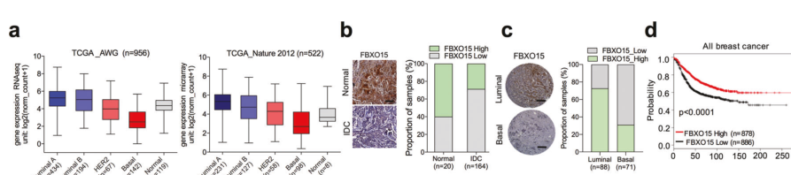

## Question

# Gene Research for Functional Annotation

## ⚠️ CRITICAL: Gene/Protein Identification Context

**BEFORE YOU BEGIN RESEARCH:** You MUST verify you are researching the CORRECT gene/protein. Gene symbols can be ambiguous, especially for less well-characterized genes from non-model organisms.

### Target Gene/Protein Identity (from UniProt):
- **UniProt Accession:** Q8NCQ5
- **Protein Description:** RecName: Full=F-box only protein 15;
- **Gene Information:** Name=FBXO15; Synonyms=FBX15;
- **Organism (full):** Homo sapiens (Human).
- **Protein Family:** Not specified in UniProt
- **Key Domains:** F-box-like_dom_sf. (IPR036047); F-box_dom. (IPR001810); F-box-like (PF12937)

### MANDATORY VERIFICATION STEPS:

1. **Check if the gene symbol "FBXO15" matches the protein description above**
2. **Verify the organism is correct:** Homo sapiens (Human).
3. **Check if protein family/domains align with what you find in literature**
4. **If you find literature for a DIFFERENT gene with the same or similar symbol, STOP**

### If Gene Symbol is Ambiguous or You Cannot Find Relevant Literature:

**DO NOT PROCEED WITH RESEARCH ON A DIFFERENT GENE.** Instead:
- State clearly: "The gene symbol 'FBXO15' is ambiguous or literature is limited for this specific protein"
- Explain what you found (e.g., "Found extensive literature on a different gene with the same symbol in a different organism")
- Describe the protein based ONLY on the UniProt information provided above
- Suggest that the protein function can be inferred from domain/family information

### Research Target:

Please provide a comprehensive research report on the gene **FBXO15** (gene ID: FBXO15, UniProt: Q8NCQ5) in human.

The research report should be a detailed narrative explaining the function, biological processes, and localization of the gene product. Citations should be given for all claims.

You should prioritize authoritative reviews and primary scientific literature when conducting research. You can supplement
this with annotations you find in gene/protein databases, but these can be outdated or inaccurate.

We are specifically interested in the primary function of the gene - for enzymes, what reaction is catalyzed, and what is the substrate specificity? For transporters, what is the substrate? For structural proteins or adapters, what is the broader structural role? For signaling molecules, what is the role in the pathway.

We are interested in where in or outside the cell the gene product carries out its function.

We are also interested in the signaling or biochemical pathways in which the gene functions. We are less interested in broad pleiotropic effects, except where these elucidate the precise role.

Include evidence where possible. We are interested in both experimental evidence as well as inference from structure, evolution, or bioinformatic analysis. Precise studies should be prioritized over high-throughput, where available.

## Output

Question: You are an expert researcher providing comprehensive, well-cited information.

Provide detailed information focusing on:
1. Key concepts and definitions with current understanding
2. Recent developments and latest research (prioritize 2023-2024 sources)
3. Current applications and real-world implementations
4. Expert opinions and analysis from authoritative sources
5. Relevant statistics and data from recent studies

Format as a comprehensive research report with proper citations. Include URLs and publication dates where available.
Always prioritize recent, authoritative sources and provide specific citations for all major claims.

# Gene Research for Functional Annotation

## ⚠️ CRITICAL: Gene/Protein Identification Context

**BEFORE YOU BEGIN RESEARCH:** You MUST verify you are researching the CORRECT gene/protein. Gene symbols can be ambiguous, especially for less well-characterized genes from non-model organisms.

### Target Gene/Protein Identity (from UniProt):
- **UniProt Accession:** Q8NCQ5
- **Protein Description:** RecName: Full=F-box only protein 15;
- **Gene Information:** Name=FBXO15; Synonyms=FBX15;
- **Organism (full):** Homo sapiens (Human).
- **Protein Family:** Not specified in UniProt
- **Key Domains:** F-box-like_dom_sf. (IPR036047); F-box_dom. (IPR001810); F-box-like (PF12937)

### MANDATORY VERIFICATION STEPS:

1. **Check if the gene symbol "FBXO15" matches the protein description above**
2. **Verify the organism is correct:** Homo sapiens (Human).
3. **Check if protein family/domains align with what you find in literature**
4. **If you find literature for a DIFFERENT gene with the same or similar symbol, STOP**

### If Gene Symbol is Ambiguous or You Cannot Find Relevant Literature:

**DO NOT PROCEED WITH RESEARCH ON A DIFFERENT GENE.** Instead:
- State clearly: "The gene symbol 'FBXO15' is ambiguous or literature is limited for this specific protein"
- Explain what you found (e.g., "Found extensive literature on a different gene with the same symbol in a different organism")
- Describe the protein based ONLY on the UniProt information provided above
- Suggest that the protein function can be inferred from domain/family information

### Research Target:

Please provide a comprehensive research report on the gene **FBXO15** (gene ID: FBXO15, UniProt: Q8NCQ5) in human.

The research report should be a detailed narrative explaining the function, biological processes, and localization of the gene product. Citations should be given for all claims.

You should prioritize authoritative reviews and primary scientific literature when conducting research. You can supplement
this with annotations you find in gene/protein databases, but these can be outdated or inaccurate.

We are specifically interested in the primary function of the gene - for enzymes, what reaction is catalyzed, and what is the substrate specificity? For transporters, what is the substrate? For structural proteins or adapters, what is the broader structural role? For signaling molecules, what is the role in the pathway.

We are interested in where in or outside the cell the gene product carries out its function.

We are also interested in the signaling or biochemical pathways in which the gene functions. We are less interested in broad pleiotropic effects, except where these elucidate the precise role.

Include evidence where possible. We are interested in both experimental evidence as well as inference from structure, evolution, or bioinformatic analysis. Precise studies should be prioritized over high-throughput, where available.

## Research report: Human **FBXO15** (UniProt **Q8NCQ5**) functional annotation

### 0) Target verification (critical identity checks)

The research target in the retrieved literature is **human FBXO15 (F-box protein 15; also written FBX15)**, an **F-box** protein acting as a substrate-recruiting component of an **SCF-type E3 ubiquitin ligase** (Skp1–Cullin1–F-box). This matches the UniProt-provided description “F-box only protein 15” and the expected role of an F-box domain protein as a substrate receptor for SCF ubiquitin ligases. Primary studies explicitly refer to **Skp1–Cullin1–FBXO15** / **SCF^FBXO15** complexes and experimentally test FBXO15-dependent ubiquitination/degradation of multiple substrates (katayama2013fbxo15regulatesp‐glycoproteinabcb1 pages 1-2, chen2014e3ligasesubunit pages 4-6).

### 1) Key concepts and definitions (current understanding)

#### 1.1 FBXO15 as an SCF E3 ligase substrate receptor
SCF E3 ligases are a major class of Cullin-RING ubiquitin ligases in which **CUL1** serves as a scaffold, **SKP1** as an adaptor, **RBX1/2** as the RING component, and an **F-box protein** provides **substrate specificity** by recognizing degrons in target proteins (tekcham2020fboxproteinsand pages 1-3). In this framework, **FBXO15** is the variable F-box subunit proposed/validated to recruit particular substrates for polyubiquitination and **26S proteasome-mediated degradation** (chen2014e3ligasesubunit pages 4-6, katayama2013fbxo15regulatesp‐glycoproteinabcb1 pages 5-7).

#### 1.2 Degrons and post-translational regulation
A recurrent principle in SCF biology is that substrates are frequently recruited via degrons that depend on post-translational modifications (e.g., phosphorylation, acetylation). For FBXO15-associated biology:

* **Phosphorylation-dependent recruitment** is supported in the CLS1 pathway (Thr219 as a critical docking/recognition site in CLS1 associated with PINK1-dependent phosphorylation; see below) (chen2014e3ligasesubunit pages 4-6, chen2014e3ligasesubunit pages 7-9).
* **Acetylation-dependent degrons (“acetyldegrons”)** are supported in mouse embryonic stem cells, where acetylation of a specific lysine in the substrate KBP enables recognition by SCF^Fbxo15 (werner2017poweringstemcell pages 1-2).

### 2) Core molecular function of FBXO15 (best-supported substrates and mechanisms)

FBXO15 is not an enzyme that catalyzes a small-molecule reaction; its primary biochemical role is **protein–protein interaction–mediated substrate recruitment** to an SCF-type E3 ligase, enabling **target protein polyubiquitination** and **proteasomal degradation**.

#### 2.1 FBXO15 targets **cardiolipin synthase 1 (CLS1)** in a PINK1-linked pathway
A primary mechanistic study identified CLS1 as a substrate regulated by FBXO15 in the context of pneumonia and mitochondrial dysfunction. Key mechanistic points:

* In an unbiased screen of >27 F-box proteins, **FBXO15 uniquely associated with endogenous CLS1**, and **only FBXO15 expression decreased CLS1 levels** (chen2014e3ligasesubunit pages 2-4).
* CLS1 binding/recognition determinants were mapped: the **CLS1 ~200–250 aa region** is implicated in docking; **Thr219** is required for FBXO15 binding (CLS1-T219A failed to bind FBXO15), consistent with a phospho-dependent recognition mechanism (chen2014e3ligasesubunit pages 4-6).
* A specific ubiquitin acceptor site was implicated: **CLS1 Lys174**; the **K174R** mutant shows partial resistance to SCF^FBXO15-directed polyubiquitination and increased half-life compared with WT CLS1 (chen2014e3ligasesubunit pages 4-6).
* **PINK1** regulates this axis: PINK1 overexpression decreases CLS1/cardiolipin/ATP; PINK1 knockdown increases CLS1/cardiolipin, consistent with phosphorylation-dependent coupling to FBXO15-mediated turnover (chen2014e3ligasesubunit pages 4-6).

Functional consequences tied to substrate loss include reduced cardiolipin content, mitochondrial depolarization, and decreased ATP (chen2014e3ligasesubunit pages 4-6).

#### 2.2 FBXO15 targets **P-glycoprotein (P-gp/ABCB1/MDR1)** and modulates drug efflux
In cancer cells, FBXO15 was experimentally linked to post-translational control of the drug efflux transporter ABCB1:

* FBXO15 is described as part of a **Skp1–Cullin1–FBXO15** E3 complex and physically associates with **P-gp** by co-immunoprecipitation (katayama2013fbxo15regulatesp‐glycoproteinabcb1 pages 1-2, katayama2013fbxo15regulatesp‐glycoproteinabcb1 pages 3-5).
* FBXO15 cooperates with the E2 enzyme **Ube2r1/Cdc34**, and combined perturbation supports its role in P-gp ubiquitination (katayama2013fbxo15regulatesp‐glycoproteinabcb1 pages 3-5, katayama2013fbxo15regulatesp‐glycoproteinabcb1 pages 7-8).
* Functionally, FBXO15 knockdown increases P-gp protein and activity (reduced intracellular rhodamine-123), increasing drug resistance to vincristine (katayama2013fbxo15regulatesp‐glycoproteinabcb1 pages 7-8).

This constitutes direct evidence that FBXO15 can regulate plasma-membrane transporter abundance via ubiquitin–proteasome pathway control (katayama2013fbxo15regulatesp‐glycoproteinabcb1 pages 3-5).

#### 2.3 FBXO15 targets **SOX2** and **STAT3** in breast cancer (tumor suppressor context)
A 2021 study in breast cancer models provides mechanistic evidence that FBXO15 suppresses EMT/CSC phenotypes by degrading stemness/signaling factors:

* FBXO15 overexpression decreases **SOX2 protein stability** (CHX chase) and increases **SOX2 ubiquitination**, with FBXO15–SOX2 association shown by co-IP and in situ assays (zhao2021fbxo15playsa pages 1-3).
* FBXO15 also decreases **STAT3 protein** (not mRNA) and promotes **STAT3 ubiquitination and degradation**, with interaction evidence by co-IP/in situ assays (zhao2021fbxo15playsa pages 1-3, zhao2021fbxo15playsa pages 3-4).
* Downstream pathway effects include reduced **EGFR** and **p-EGFR**, and negative regulation of **ERK and STAT3 signaling** (zhao2021fbxo15playsa pages 1-3).

This work supports FBXO15 as a substrate receptor that can directly reduce levels of transcriptional/signaling regulators (SOX2, STAT3) with major phenotypic consequences in cancer cells (zhao2021fbxo15playsa pages 1-3, zhao2021fbxo15playsa pages 3-4).

#### 2.4 Stem-cell biology (mechanistic inference from mouse ESCs)
While not human-specific evidence, a high-quality mechanistic study in mouse ESCs provides a clear molecular paradigm for FBXO15 substrate recognition:

* The **TDH–GCN5L1–Fbxo15–KBP** axis: GCN5L1-dependent acetylation of **KBP Lys501** (driven by mitochondrial acetyl-CoA production) enables KBP recognition by Fbxo15, triggering its proteasomal degradation (werner2017poweringstemcell pages 1-2).
* FBXO15 is **preferentially expressed in undifferentiated cells** and is **transcriptionally silenced at differentiation onset** (werner2017poweringstemcell pages 1-2).

This provides a concrete “acetyldegron” mechanism that could be relevant to human FBXO15 substrate selection, though direct human validation is not established within the retrieved evidence (werner2017poweringstemcell pages 1-2).

### 3) Subcellular localization and site of action

#### 3.1 ER/cytosol-associated action in CLS1 turnover
In the CLS1 pathway, fractionation and mechanistic interpretation support that FBXO15 does **not** act inside mitochondria:

* Mitochondria were reported as **devoid of significant FBXO15** under native or ectopic expression conditions (chen2014e3ligasesubunit pages 7-9).
* The authors propose FBXO15 mediates CLS1 ubiquitination and degradation **within the endoplasmic reticulum (ER) after biosynthesis**, consistent with an ER/cytosolic quality-control or feedback mechanism that limits mitochondrial delivery of CLS1 (chen2014e3ligasesubunit pages 7-9).

#### 3.2 Nuclear/cytosolic functional contexts (cancer/stemness factors)
For SOX2/STAT3 and P-gp/ABCB1, the retrieved excerpts demonstrate ubiquitination/degradation and binding but do not cleanly resolve compartment-specific ubiquitination sites. However, the substrates themselves (SOX2, STAT3) function largely in transcriptional regulation and signaling, consistent with cytosolic/nuclear pools being relevant (zhao2021fbxo15playsa pages 1-3). Direct compartment assignment is strongest for the CLS1 ER-linked model (chen2014e3ligasesubunit pages 7-9).

### 4) Pathway context

FBXO15’s clearest pathway embedding is within:

1. **Ubiquitin–proteasome system (UPS)** via SCF complexes (tekcham2020fboxproteinsand pages 1-3).
2. **Mitochondrial lipid homeostasis pathway (cardiolipin synthesis)** via turnover of CLS1 in a PINK1-linked regulatory module (chen2014e3ligasesubunit pages 4-6, chen2014e3ligasesubunit pages 7-9).
3. **Cancer signaling and stemness pathways** by modulating SOX2/STAT3 and impacting EGFR/ERK/STAT3 signaling outputs (zhao2021fbxo15playsa pages 1-3).
4. **Drug transport and chemoresistance** by controlling ABCB1/P-gp stability and efflux function (katayama2013fbxo15regulatesp‐glycoproteinabcb1 pages 3-5, katayama2013fbxo15regulatesp‐glycoproteinabcb1 pages 7-8).

### 5) Recent developments (prioritizing 2023–2024 where available)

Direct 2023–2024 primary mechanistic studies on human FBXO15 were limited in the retrieved corpus. The most actionable “recent” signals come from:

* **Human genetics / GWAS evidence aggregation**: Open Targets (platform paper cited as 2025 NAR) lists GWAS credible-set associations linking **FBXO15 (ENSG00000141665)** to phenotypes including **bacterial disease**, **abruptio placentae**, **body weight gain**, **glomerulonephritis**, and **smoking initiation**, supported by recent GWAS PMIDs (e.g., 40770095, 40069456, 39024449) (OpenTargets Search: -FBXO15). This provides a 2023–2025 direction for potential human trait relevance, though effect sizes must be pulled from the underlying GWAS publications.
* **2023 clinical genetics example**: a spine genetics study reported a strong (though not genome-wide significant) signal near an intergenic region between LINC02582 and **FBXO15** (P = 1.12 × 10−7), indicating continued emergence of FBXO15-proximal loci in complex trait analysis (OpenTargets Search: -FBXO15).

### 6) Current applications and real-world implementations

#### 6.1 Chemotherapy resistance modulation via ABCB1/P-gp
FBXO15’s regulation of ABCB1/P-gp provides a direct mechanistic link to drug efflux and chemotherapy response:

* In vincristine assays, experimental design included **n = 6** and reported a significant change in vincristine sensitivity with **P < 0.002** upon FBXO15 knockdown (katayama2013fbxo15regulatesp‐glycoproteinabcb1 pages 7-8).

This suggests a potential translational angle: modulating an E3 substrate receptor (FBXO15) could alter ABCB1 abundance and affect multidrug resistance phenotypes (katayama2013fbxo15regulatesp‐glycoproteinabcb1 pages 3-5, katayama2013fbxo15regulatesp‐glycoproteinabcb1 pages 7-8).

#### 6.2 Lung injury / pneumonia models implicating FBXO15–PINK1–CLS1 axis
FBXO15 has been implemented experimentally in in vivo pneumonia models:

* **S. aureus intratracheal infection** models and physiological endpoints (Flexivent-measured compliance/resistance/elastance), lavage protein/cell counts, and cardiolipin levels were used with defined group sizes (e.g., **n = 6/group** for WT vs Pink1−/− at 24 h) and statistically significant outcomes (*p < 0.05) (chen2014e3ligasesubunit pages 7-9).
* **Lentiviral gene transfer** of Fbxo15 in mice (reported **n = 4/group**) caused adverse lung mechanics and edema and decreased CLS1, linking FBXO15 overexpression to lung injury phenotypes (chen2014e3ligasesubunit pages 6-7).
* Human lung tissue comparisons were also included (**n = 6 control and n = 6 pneumonia** samples), indicating a bridge to clinical sample relevance (chen2014e3ligasesubunit pages 6-7).

These constitute real-world implementations in disease modeling and human tissue measurement (chen2014e3ligasesubunit pages 6-7, chen2014e3ligasesubunit pages 7-9).

#### 6.3 Breast cancer prognostic/biomarker potential
Multiple breast cancer datasets and experiments support FBXO15 as a prognostic-associated factor:

* Kaplan–Meier analyses reported that higher FBXO15 expression correlates with improved survival (zhao2021fbxo15playsa pages 1-3, zhao2021fbxo15playsa pages 3-4), with a representative survival panel shown in retrieved figure crops (zhao2021fbxo15playsa media 5744e420, zhao2021fbxo15playsa media edf7edde).
* Expression differences: higher FBXO15 in luminal vs basal subtypes and higher in normal tissue vs invasive ductal carcinoma (IDC) were reported, supporting biomarker interpretation (zhao2021fbxo15playsa pages 1-3).

### 7) Expert opinions and authoritative synthesis

High-authority reviews frame FBXO15 within broader F-box protein biology:

* Nature Reviews Cancer highlights FBXO15 as connected to pluripotency/iPSC contexts and notes that Fbxo15−/− mice were viable without obvious tumor phenotypes (suggesting context-dependent roles) (wang2014rolesoffbox pages 11-13).
* A cancer-focused review describes SCF architecture and F-box subfamily distinctions (FBXO = “F-box only”), providing conceptual grounding for interpreting FBXO15 as a substrate receptor rather than a catalytic enzyme (tekcham2020fboxproteinsand pages 1-3).

### 8) Key statistics/data points (from recent and foundational studies)

* **Breast cancer expression (dataset analysis)**: FBXO15 protein elevated **~3.6–5.2-fold** across breast cancer stages 0–IV vs normal (***p < 0.001); FBXO15 mRNA upregulated in cancer cell lines vs non-cancer (***p < 0.001) (chang2021anovelsignature pages 7-10).
* **Breast cancer transcriptomics**: up to **7.7-fold** increase in FBXO15 mRNA in paired tumor vs normal tissues (chang2021anovelsignature pages 2-5).
* **Drug resistance assay**: vincristine sensitivity effect with **n = 6; P < 0.002** under FBXO15 knockdown conditions (katayama2013fbxo15regulatesp‐glycoproteinabcb1 pages 7-8).
* **Pneumonia models**: Pink1−/− vs WT **n = 6/group**, intratracheal S. aureus **10^5 cfu/mouse**, 24 h readouts; multiple physiologic/lavage endpoints significant at *p < 0.05 (chen2014e3ligasesubunit pages 7-9). Lentiviral Fbxo15 transfer: **n = 4/group** and significant lung injury phenotypes (chen2014e3ligasesubunit pages 6-7).

### 9) Evidence map (structured summary)

| Category | Protein class/domain | Complex | Validated substrates | Recognition/degron determinants | Subcellular localization/site of action | Biological processes | Disease/clinical links | Key quantitative/statistical findings | Key references with year/DOI |
|---|---|---|---|---|---|---|---|---|---|
| CLS1/PINK1 pneumonia axis | FBXO15 is an FBXO-family F-box substrate receptor in the ubiquitin-proteasome system (chen2014e3ligasesubunit pages 4-6, tekcham2020fboxproteinsand pages 1-3) | SCF^FBXO15; literature explicitly refers to an SCF^Fbxo15 complex targeting CLS1 (chen2014e3ligasesubunit pages 4-6, chen2014e3ligasesubunit pages 7-9) | Cardiolipin synthase 1 (CLS1) (chen2014e3ligasesubunit pages 2-4, chen2014e3ligasesubunit pages 4-6) | CLS1 aa ~200–250 docking region; Thr219 required for FBXO15 binding and acts as a PINK1-related phospho-recognition site; Lys174 is a ubiquitin acceptor, with K174R partially resistant to polyubiquitination and degradation (chen2014e3ligasesubunit pages 4-6, chen2014e3ligasesubunit pages 7-9) | FBXO15 was not detected in mitochondria; authors propose ubiquitination/degradation of CLS1 occurs in ER/cytosol after biosynthesis, limiting mitochondrial delivery of CLS1 (chen2014e3ligasesubunit pages 7-9) | Cardiolipin homeostasis, mitochondrial membrane potential, ATP production, lung injury responses in pneumonia (chen2014e3ligasesubunit pages 2-4, chen2014e3ligasesubunit pages 4-6, chen2014e3ligasesubunit pages 7-9) | Experimental pneumonia; human pneumonia lung tissue also examined for FBXO15/PINK1/CLS1 changes (chen2014e3ligasesubunit pages 6-7) | PINK1 overexpression decreased CLS1/cardiolipin/ATP; PINK1 knockdown increased CLS1/cardiolipin (*p<0.05 for cardiolipin, *p<0.01 for ATP); S. aureus pneumonia models used n=4 or n=6/group depending experiment; infection doses reported as 10^7 cfu/mouse at early time points and 10^5 cfu/mouse at 24 h; multiple physiologic endpoints significant at *p<0.05 (chen2014e3ligasesubunit pages 4-6, chen2014e3ligasesubunit pages 6-7, chen2014e3ligasesubunit pages 7-9) | Chen et al., 2014, Cell Reports, doi:10.1016/j.celrep.2014.02.048 (chen2014e3ligasesubunit pages 2-4, chen2014e3ligasesubunit pages 4-6) |
| ABCB1/P-gp drug resistance | FBXO15 functions as an F-box substrate receptor controlling membrane transporter abundance post-translationally (katayama2013fbxo15regulatesp‐glycoproteinabcb1 pages 3-5, katayama2013fbxo15regulatesp‐glycoproteinabcb1 pages 1-2) | Skp1-Cullin1-FBXO15 / SCF^Fbx15 with E2 Ube2r1/Cdc34 (katayama2013fbxo15regulatesp‐glycoproteinabcb1 pages 1-2) | P-glycoprotein / ABCB1 / MDR1 (katayama2013fbxo15regulatesp‐glycoproteinabcb1 pages 3-5) | No degron residue mapped in the retrieved evidence; FBXO15 binds P-gp and promotes ubiquitination in cooperation with Ube2r1 (katayama2013fbxo15regulatesp‐glycoproteinabcb1 pages 3-5) | No compartment resolved in extracted text; ubiquitination demonstrated in cell lysates with MG132, consistent with proteasomal turnover of P-gp (katayama2013fbxo15regulatesp‐glycoproteinabcb1 pages 3-5) | Drug efflux regulation and multidrug resistance via control of P-gp protein stability, not MDR1 mRNA (katayama2013fbxo15regulatesp‐glycoproteinabcb1 pages 3-5, katayama2013fbxo15regulatesp‐glycoproteinabcb1 pages 5-7) | Cancer chemoresistance / vincristine sensitivity (katayama2013fbxo15regulatesp‐glycoproteinabcb1 pages 5-7, katayama2013fbxo15regulatesp‐glycoproteinabcb1 pages 7-8) | Preliminary vincristine IC50 values: ~100 nM (HCT-15, HT1080/3HisMDR), 10 nM (SW620-14), 2 nM (HT1080); FBXO15 knockdown increased resistance to vincristine and reduced rhodamine-123 accumulation; VCR assay n=6, *P<0.002 (katayama2013fbxo15regulatesp‐glycoproteinabcb1 pages 5-7, katayama2013fbxo15regulatesp‐glycoproteinabcb1 pages 7-8) | Katayama et al., 2013, Cancer Science, doi:10.1111/cas.12145 (katayama2013fbxo15regulatesp‐glycoproteinabcb1 pages 3-5, katayama2013fbxo15regulatesp‐glycoproteinabcb1 pages 5-7) |
| SOX2/STAT3/EGFR breast cancer axis | FBXO15 acts as a tumor-suppressive F-box protein in breast cancer (zhao2021fbxo15playsa pages 1-3, huang2025fboxinbreast pages 6-7) | SCF-type role inferred from F-box identity; direct assays show FBXO15 interaction with SOX2 and STAT3 and promotion of their ubiquitination/degradation (zhao2021fbxo15playsa pages 1-3, zhao2021fbxo15playsa pages 3-4) | SOX2 and STAT3 are directly supported; EGFR is regulated downstream through SOX2 stabilization and signaling effects (zhao2021fbxo15playsa pages 1-3, zhao2021fbxo15playsa pages 3-4) | CHX pulse-chase, ubiquitination assays, co-IP and in situ assays support degradation of SOX2 and STAT3; no specific degron residue reported in extracted text (zhao2021fbxo15playsa pages 1-3, zhao2021fbxo15playsa pages 3-4) | Compartment not explicitly resolved in extracted text; IHC and in situ assays support tumor-cell expression and interactions (zhao2021fbxo15playsa pages 1-3) | Suppression of EMT and cancer stem-cell programs; inhibition of EGFR/ERK/STAT3 signaling; reduced growth, invasion, migration, sphere formation, anchorage-independent growth, xenograft burden and lung metastasis (zhao2021fbxo15playsa pages 1-3) | Breast cancer prognosis/biomarker potential; FBXO15 higher in normal tissue than IDC and higher in luminal than basal tumors; high expression associated with improved survival and independent disease-free survival association (zhao2021fbxo15playsa pages 1-3, zhao2021fbxo15playsa pages 3-4) | Orthotopic xenografts used n=5/group; qualitative survival benefit by Kaplan–Meier; no hazard ratio extracted from available text (zhao2021fbxo15playsa pages 3-4); mechanistic figure panels available for expression/survival/model (zhao2021fbxo15playsa media 5744e420, zhao2021fbxo15playsa media edf7edde, zhao2021fbxo15playsa media c6587a16) | Zhao et al., 2021, Signal Transduction and Targeted Therapy, doi:10.1038/s41392-021-00605-4 (zhao2021fbxo15playsa pages 1-3, zhao2021fbxo15playsa pages 3-4) |
| Stem cell mitochondrial biogenesis acetyl-degron | FBXO15 is a stem-cell-preferential F-box substrate adaptor; review/commentary explicitly places it in SCF complexes (werner2017poweringstemcell pages 1-2) | SCF^FBXO15 in mouse ESCs (werner2017poweringstemcell pages 1-2) | KBP/KIF1BP in mESCs (mouse evidence; useful for mechanistic inference, not direct human validation) (werner2017poweringstemcell pages 1-2) | Acetylation-dependent degron: GCN5L1 and TDH-driven mitochondrial acetyl-CoA promote KBP Lys501 acetylation, enabling recognition by Fbxo15; K→R mutation blocks degradation (werner2017poweringstemcell pages 1-2) | Fractionation evidence indicates compartmental regulation linked to mitochondrial biogenesis; retrieved review/commentary emphasizes mitochondrial metabolic coupling, though exact human localization is not established (werner2017poweringstemcell pages 1-2, donato2017thetdh–gcn5l1–fbxo15–kbpaxis pages 10-14) | Limits mitochondrial biogenesis in self-renewing ESCs; links metabolism, acetylation, ubiquitination, respiration, ROS, proliferation, and differentiation competence (werner2017poweringstemcell pages 1-2) | Stem-cell state marker and pluripotency-associated pathway; mainly developmental/stem-cell biology rather than direct human disease evidence in retrieved texts (werner2017poweringstemcell pages 1-2) | FBXO15 is preferentially expressed in undifferentiated cells and silenced at differentiation onset; stabilization of KBP increases mitochondrial mass, respiration and ROS, while ectopic FBXO15 impairs differentiation (werner2017poweringstemcell pages 1-2) | Donato et al., 2017, Nature Cell Biology, doi:10.1038/ncb3491; Werner & Rape, 2017, Cell Death Differ., doi:10.1038/cdd.2017.142 (werner2017poweringstemcell pages 1-2) |
| Expression in breast cancer datasets | FBXO15 is part of an SCF/F-box transcriptional signature in breast cancer datasets (chang2021anovelsignature pages 2-5) | Not a mechanistic complex study; expression profiling context (chang2021anovelsignature pages 2-5) | Not applicable | Not applicable | Tissue/tumor expression by RNA-seq, TCGA and IHC (chang2021anovelsignature pages 2-5, chang2021anovelsignature pages 7-10) | Tumor-associated expression program; possible biomarker/signature component (chang2021anovelsignature pages 2-5, chang2021anovelsignature pages 7-10) | Breast carcinoma profiling/signature studies (chang2021anovelsignature pages 2-5, chang2021anovelsignature pages 7-10) | FBXO15 mRNA increased up to 7.7-fold in paired breast carcinoma vs normal tissue; protein elevated ~3.6–5.2-fold across BRCA stages 0–IV vs normal (***p<0.001); mRNA increased in MCF7 and MDA-MB231 vs MCF10A (***p<0.001); ~89% knockdown had no detectable effect on viability/proliferation in that assay context (chang2021anovelsignature pages 2-5, chang2021anovelsignature pages 7-10) | Chang et al., 2021, Cancers, doi:10.3390/cancers13122873 (chang2021anovelsignature pages 2-5, chang2021anovelsignature pages 7-10) |
| General SCF/F-box definition | F-box proteins are substrate receptors; SCF contains SKP1 adaptor, CUL1 scaffold, RBX1/2 RING protein, plus variable F-box protein; FBXO subfamily are “F-box only” proteins lacking LRR/WD40 repeat classes (tekcham2020fboxproteinsand pages 1-3) | Canonical SCF (SKP1-CUL1-RBX1/2-F-box) (tekcham2020fboxproteinsand pages 1-3) | Not applicable | Many SCF substrates require post-translationally generated degrons; FBXO15-specific examples include phospho- and acetyldegron recognition from other rows (chen2014e3ligasesubunit pages 4-6, werner2017poweringstemcell pages 1-2, tekcham2020fboxproteinsand pages 1-3) | Ubiquitin-proteasome system; compartment varies by substrate (tekcham2020fboxproteinsand pages 1-3) | Protein homeostasis, signaling, cell cycle, differentiation, stress responses, cancer biology (tekcham2020fboxproteinsand pages 1-3) | Framework for interpreting FBXO15 as a substrate-recognition module in disease pathways (tekcham2020fboxproteinsand pages 1-3) | Review notes ~37 human FBXO-family members (tekcham2020fboxproteinsand pages 1-3) | Tekcham et al., 2020, Theranostics, doi:10.7150/thno.42735 (tekcham2020fboxproteinsand pages 1-3) |
| OpenTargets GWAS credible sets | Human FBXO15 is recognized as an approved target/gene entity in Open Targets (ENSG00000141665) (OpenTargets Search: -FBXO15) | Not a mechanistic protein complex entry | Not applicable | Not applicable | Genetics/association layer rather than localization data (OpenTargets Search: -FBXO15) | Suggests possible roles in complex traits/disease susceptibility but not mechanism (OpenTargets Search: -FBXO15) | Reported associations include bacterial disease, body weight gain, smoking initiation, Abruptio Placentae, and glomerulonephritis (OpenTargets Search: -FBXO15) | Open Targets scores: bacterial disease 0.3129; Abruptio Placentae 0.3000; body weight gain 0.2461; glomerulonephritis 0.1654; smoking initiation 0.1477. Evidence count=4, from GWAS credible sets; cited PMIDs include 40770095, 40069456, 39024449, but effect sizes were not available in retrieved context (OpenTargets Search: -FBXO15) | Open Targets Platform query (context evidence generated from current platform output; article cited by platform: Buniello et al., 2025, Nucleic Acids Res.) (OpenTargets Search: -FBXO15) |

*Table: This table summarizes experimentally supported functions, substrates, mechanisms, localization, and disease relevance of human FBXO15, with emphasis on primary mechanistic studies and recent genetic-association context. It is designed as a compact evidence map for interpreting FBXO15 as an SCF-type F-box substrate receptor.*

### 10) Representative visual evidence (expression/survival and mechanism)

A representative set of cropped figure panels from Zhao et al. (2021) illustrating (i) FBXO15 expression/survival association, (ii) IHC relationship with SOX2/EGFR, and (iii) a mechanistic model of the FBXO15–SOX2/STAT3/EGFR axis were retrieved (zhao2021fbxo15playsa media 5744e420, zhao2021fbxo15playsa media edf7edde, zhao2021fbxo15playsa media c6587a16).

### 11) Limitations and gaps

* **UniProt accession confirmation within retrieved texts**: Although functional and organism context strongly match human FBXO15, the retrieved excerpts do not explicitly mention UniProt accession Q8NCQ5.
* **2023–2024 FBXO15-specific mechanistic literature**: Within the retrieved corpus, most mechanistic primary data are pre-2023 (2013–2021), with recent developments appearing mainly as genetics aggregation (Open Targets) and trait association pointers rather than new biochemical substrate discovery (OpenTargets Search: -FBXO15).
* **Degron mapping breadth**: Detailed degron mapping is strong for CLS1 (T219 docking, K174 acceptor) but not available in extracted text for ABCB1, SOX2, or STAT3 (chen2014e3ligasesubunit pages 4-6, katayama2013fbxo15regulatesp‐glycoproteinabcb1 pages 3-5).

### 12) Key references (URLs and publication dates)

* Chen BB et al. **E3 Ligase Subunit Fbxo15 and PINK1 Kinase Regulate Cardiolipin Synthase 1 Stability and Mitochondrial Function in Pneumonia**. *Cell Reports*. **Apr 2014**. https://doi.org/10.1016/j.celrep.2014.02.048 (chen2014e3ligasesubunit pages 4-6)
* Katayama K et al. **FBXO15 regulates P-glycoprotein/ABCB1 expression through the ubiquitin–proteasome pathway in cancer cells**. *Cancer Science*. **Jun 2013**. https://doi.org/10.1111/cas.12145 (katayama2013fbxo15regulatesp‐glycoproteinabcb1 pages 5-7)
* Zhao Y et al. **FBXO15 plays a critical suppressive functional role in regulation of breast cancer progression**. *Signal Transduction and Targeted Therapy*. **Jun 2021**. https://doi.org/10.1038/s41392-021-00605-4 (zhao2021fbxo15playsa pages 1-3)
* Donato V et al. **The TDH–GCN5L1–Fbxo15–KBP axis limits mitochondrial biogenesis in mouse embryonic stem cells**. *Nature Cell Biology*. **Mar 2017**. https://doi.org/10.1038/ncb3491 (werner2017poweringstemcell pages 1-2)
* Werner A, Rape M. **Powering stem cell decisions with ubiquitin**. *Cell Death & Differentiation*. **Sep 2017**. https://doi.org/10.1038/cdd.2017.142 (werner2017poweringstemcell pages 1-2)
* Tekcham DS et al. **F-box proteins and cancer: an update from functional and regulatory mechanism to therapeutic clinical prospects**. *Theranostics*. **Mar 2020**. https://doi.org/10.7150/thno.42735 (tekcham2020fboxproteinsand pages 1-3)
* Open Targets Platform: FBXO15 disease/trait associations (GWAS credible sets; PMIDs include 40770095, 40069456, 39024449). Accessed via tool output (OpenTargets Search: -FBXO15).

References

1. (katayama2013fbxo15regulatesp‐glycoproteinabcb1 pages 1-2): Kazuhiro Katayama, Kohji Noguchi, and Yoshikazu Sugimoto. Fbxo15 regulates p‐glycoprotein/abcb1 expression through the ubiquitin–proteasome pathway in cancer cells. Cancer Science, 104:694-702, Jun 2013. URL: https://doi.org/10.1111/cas.12145, doi:10.1111/cas.12145. This article has 77 citations and is from a peer-reviewed journal.

2. (chen2014e3ligasesubunit pages 4-6): Bill B. Chen, Tiffany A. Coon, Jennifer R. Glasser, Chunbin Zou, Bryon Ellis, Tuhin Das, Alison C. McKelvey, Shristi Rajbhandari, Travis Lear, Christelle Kamga, Sruti Shiva, Chenjian Li, Joseph M. Pilewski, Jason Callio, Charleen T. Chu, Anuradha Ray, Prabir Ray, Yulia Y. Tyurina, Valerian E. Kagan, and Rama K. Mallampalli. E3 ligase subunit fbxo15 and pink1 kinase regulate cardiolipin synthase 1 stability and mitochondrial function in pneumonia. Cell reports, 7:476-487, Apr 2014. URL: https://doi.org/10.1016/j.celrep.2014.02.048, doi:10.1016/j.celrep.2014.02.048. This article has 57 citations and is from a highest quality peer-reviewed journal.

3. (tekcham2020fboxproteinsand pages 1-3): Dinesh Singh Tekcham, Di Chen, Yu Liu, Ting Ling, Yi Zhang, Huan Chen, Wen Wang, Wuxiyar Otkur, Huan Qi, Tian Xia, Xiaolong Liu, Hai-long Piao, and Hongxu Liu. F-box proteins and cancer: an update from functional and regulatory mechanism to therapeutic clinical prospects. Theranostics, 10:4150-4167, Mar 2020. URL: https://doi.org/10.7150/thno.42735, doi:10.7150/thno.42735. This article has 111 citations and is from a domain leading peer-reviewed journal.

4. (katayama2013fbxo15regulatesp‐glycoproteinabcb1 pages 5-7): Kazuhiro Katayama, Kohji Noguchi, and Yoshikazu Sugimoto. Fbxo15 regulates p‐glycoprotein/abcb1 expression through the ubiquitin–proteasome pathway in cancer cells. Cancer Science, 104:694-702, Jun 2013. URL: https://doi.org/10.1111/cas.12145, doi:10.1111/cas.12145. This article has 77 citations and is from a peer-reviewed journal.

5. (chen2014e3ligasesubunit pages 7-9): Bill B. Chen, Tiffany A. Coon, Jennifer R. Glasser, Chunbin Zou, Bryon Ellis, Tuhin Das, Alison C. McKelvey, Shristi Rajbhandari, Travis Lear, Christelle Kamga, Sruti Shiva, Chenjian Li, Joseph M. Pilewski, Jason Callio, Charleen T. Chu, Anuradha Ray, Prabir Ray, Yulia Y. Tyurina, Valerian E. Kagan, and Rama K. Mallampalli. E3 ligase subunit fbxo15 and pink1 kinase regulate cardiolipin synthase 1 stability and mitochondrial function in pneumonia. Cell reports, 7:476-487, Apr 2014. URL: https://doi.org/10.1016/j.celrep.2014.02.048, doi:10.1016/j.celrep.2014.02.048. This article has 57 citations and is from a highest quality peer-reviewed journal.

6. (werner2017poweringstemcell pages 1-2): Achim Werner and Michael Rape. Powering stem cell decisions with ubiquitin. Cell Death and Differentiation, 24:1823-1824, Sep 2017. URL: https://doi.org/10.1038/cdd.2017.142, doi:10.1038/cdd.2017.142. This article has 3 citations and is from a domain leading peer-reviewed journal.

7. (chen2014e3ligasesubunit pages 2-4): Bill B. Chen, Tiffany A. Coon, Jennifer R. Glasser, Chunbin Zou, Bryon Ellis, Tuhin Das, Alison C. McKelvey, Shristi Rajbhandari, Travis Lear, Christelle Kamga, Sruti Shiva, Chenjian Li, Joseph M. Pilewski, Jason Callio, Charleen T. Chu, Anuradha Ray, Prabir Ray, Yulia Y. Tyurina, Valerian E. Kagan, and Rama K. Mallampalli. E3 ligase subunit fbxo15 and pink1 kinase regulate cardiolipin synthase 1 stability and mitochondrial function in pneumonia. Cell reports, 7:476-487, Apr 2014. URL: https://doi.org/10.1016/j.celrep.2014.02.048, doi:10.1016/j.celrep.2014.02.048. This article has 57 citations and is from a highest quality peer-reviewed journal.

8. (katayama2013fbxo15regulatesp‐glycoproteinabcb1 pages 3-5): Kazuhiro Katayama, Kohji Noguchi, and Yoshikazu Sugimoto. Fbxo15 regulates p‐glycoprotein/abcb1 expression through the ubiquitin–proteasome pathway in cancer cells. Cancer Science, 104:694-702, Jun 2013. URL: https://doi.org/10.1111/cas.12145, doi:10.1111/cas.12145. This article has 77 citations and is from a peer-reviewed journal.

9. (katayama2013fbxo15regulatesp‐glycoproteinabcb1 pages 7-8): Kazuhiro Katayama, Kohji Noguchi, and Yoshikazu Sugimoto. Fbxo15 regulates p‐glycoprotein/abcb1 expression through the ubiquitin–proteasome pathway in cancer cells. Cancer Science, 104:694-702, Jun 2013. URL: https://doi.org/10.1111/cas.12145, doi:10.1111/cas.12145. This article has 77 citations and is from a peer-reviewed journal.

10. (zhao2021fbxo15playsa pages 1-3): Yi Zhao, Nayeon Shim, Yan-Hong Cui, Jae-Hyeok Kang, Ki-Chun Yoo, Seungmo Kim, Joo Mi Yi, Min-Jung Kim, Jai Hoon Yoon, and Su-Jae Lee. Fbxo15 plays a critical suppressive functional role in regulation of breast cancer progression. Signal Transduction and Targeted Therapy, Jun 2021. URL: https://doi.org/10.1038/s41392-021-00605-4, doi:10.1038/s41392-021-00605-4. This article has 8 citations and is from a peer-reviewed journal.

11. (zhao2021fbxo15playsa pages 3-4): Yi Zhao, Nayeon Shim, Yan-Hong Cui, Jae-Hyeok Kang, Ki-Chun Yoo, Seungmo Kim, Joo Mi Yi, Min-Jung Kim, Jai Hoon Yoon, and Su-Jae Lee. Fbxo15 plays a critical suppressive functional role in regulation of breast cancer progression. Signal Transduction and Targeted Therapy, Jun 2021. URL: https://doi.org/10.1038/s41392-021-00605-4, doi:10.1038/s41392-021-00605-4. This article has 8 citations and is from a peer-reviewed journal.

12. (OpenTargets Search: -FBXO15): Open Targets Query (-FBXO15, 5 results). Buniello, A. et al. (2025). Open Targets Platform: facilitating therapeutic hypotheses building in drug discovery. Nucleic Acids Research.

13. (chen2014e3ligasesubunit pages 6-7): Bill B. Chen, Tiffany A. Coon, Jennifer R. Glasser, Chunbin Zou, Bryon Ellis, Tuhin Das, Alison C. McKelvey, Shristi Rajbhandari, Travis Lear, Christelle Kamga, Sruti Shiva, Chenjian Li, Joseph M. Pilewski, Jason Callio, Charleen T. Chu, Anuradha Ray, Prabir Ray, Yulia Y. Tyurina, Valerian E. Kagan, and Rama K. Mallampalli. E3 ligase subunit fbxo15 and pink1 kinase regulate cardiolipin synthase 1 stability and mitochondrial function in pneumonia. Cell reports, 7:476-487, Apr 2014. URL: https://doi.org/10.1016/j.celrep.2014.02.048, doi:10.1016/j.celrep.2014.02.048. This article has 57 citations and is from a highest quality peer-reviewed journal.

14. (zhao2021fbxo15playsa media 5744e420): Yi Zhao, Nayeon Shim, Yan-Hong Cui, Jae-Hyeok Kang, Ki-Chun Yoo, Seungmo Kim, Joo Mi Yi, Min-Jung Kim, Jai Hoon Yoon, and Su-Jae Lee. Fbxo15 plays a critical suppressive functional role in regulation of breast cancer progression. Signal Transduction and Targeted Therapy, Jun 2021. URL: https://doi.org/10.1038/s41392-021-00605-4, doi:10.1038/s41392-021-00605-4. This article has 8 citations and is from a peer-reviewed journal.

15. (zhao2021fbxo15playsa media edf7edde): Yi Zhao, Nayeon Shim, Yan-Hong Cui, Jae-Hyeok Kang, Ki-Chun Yoo, Seungmo Kim, Joo Mi Yi, Min-Jung Kim, Jai Hoon Yoon, and Su-Jae Lee. Fbxo15 plays a critical suppressive functional role in regulation of breast cancer progression. Signal Transduction and Targeted Therapy, Jun 2021. URL: https://doi.org/10.1038/s41392-021-00605-4, doi:10.1038/s41392-021-00605-4. This article has 8 citations and is from a peer-reviewed journal.

16. (wang2014rolesoffbox pages 11-13): Zhiwei Wang, Pengda Liu, Hiroyuki Inuzuka, and Wenyi Wei. Roles of f-box proteins in cancer. Nature Reviews Cancer, 14:233-247, Mar 2014. URL: https://doi.org/10.1038/nrc3700, doi:10.1038/nrc3700. This article has 586 citations and is from a domain leading peer-reviewed journal.

17. (chang2021anovelsignature pages 7-10): Shu-Chun Chang, Chin-Sheng Hung, Bo-Xiang Zhang, Tsung-Han Hsieh, Wayne Hsu, and Jeak Ding. A novel signature of ccnf-associated e3 ligases collaborate and counter each other in breast cancer. Cancers, 13:2873, Jun 2021. URL: https://doi.org/10.3390/cancers13122873, doi:10.3390/cancers13122873. This article has 23 citations.

18. (chang2021anovelsignature pages 2-5): Shu-Chun Chang, Chin-Sheng Hung, Bo-Xiang Zhang, Tsung-Han Hsieh, Wayne Hsu, and Jeak Ding. A novel signature of ccnf-associated e3 ligases collaborate and counter each other in breast cancer. Cancers, 13:2873, Jun 2021. URL: https://doi.org/10.3390/cancers13122873, doi:10.3390/cancers13122873. This article has 23 citations.

19. (huang2025fboxinbreast pages 6-7): Qi-yan Huang, Ye Ma, Wen-yi Sheng, Shi-qi Liu, Jia-le Cheng, Wen-jie Wang, and You Meng. F-box in breast cancer: mechanism of action and therapeutic potential. American Journal of Translational Research, 17:8203-8221, Jan 2025. URL: https://doi.org/10.62347/devn4395, doi:10.62347/devn4395. This article has 0 citations and is from a peer-reviewed journal.

20. (zhao2021fbxo15playsa media c6587a16): Yi Zhao, Nayeon Shim, Yan-Hong Cui, Jae-Hyeok Kang, Ki-Chun Yoo, Seungmo Kim, Joo Mi Yi, Min-Jung Kim, Jai Hoon Yoon, and Su-Jae Lee. Fbxo15 plays a critical suppressive functional role in regulation of breast cancer progression. Signal Transduction and Targeted Therapy, Jun 2021. URL: https://doi.org/10.1038/s41392-021-00605-4, doi:10.1038/s41392-021-00605-4. This article has 8 citations and is from a peer-reviewed journal.

21. (donato2017thetdh–gcn5l1–fbxo15–kbpaxis pages 10-14): Valerio Donato, Massimo Bonora, Daniele Simoneschi, Davide Sartini, Yasusei Kudo, Anita Saraf, Laurence Florens, Michael P. Washburn, Matthias Stadtfeld, Paolo Pinton, and Michele Pagano. The tdh–gcn5l1–fbxo15–kbp axis limits mitochondrial biogenesis in mouse embryonic stem cells. Nature Cell Biology, 19(4):341-351, Mar 2017. URL: https://doi.org/10.1038/ncb3491, doi:10.1038/ncb3491. This article has 60 citations and is from a highest quality peer-reviewed journal.

## Artifacts

- [Edison artifact artifact-00](FBXO15-deep-research-falcon_artifacts/artifact-00.md)

## Citations

1. tekcham2020fboxproteinsand pages 1-3
2. werner2017poweringstemcell pages 1-2
3. wang2014rolesoffbox pages 11-13
4. chang2021anovelsignature pages 7-10
5. chang2021anovelsignature pages 2-5
6. huang2025fboxinbreast pages 6-7
7. https://doi.org/10.1016/j.celrep.2014.02.048
8. https://doi.org/10.1111/cas.12145
9. https://doi.org/10.1038/s41392-021-00605-4
10. https://doi.org/10.1038/ncb3491
11. https://doi.org/10.1038/cdd.2017.142
12. https://doi.org/10.7150/thno.42735
13. https://doi.org/10.1111/cas.12145,
14. https://doi.org/10.1016/j.celrep.2014.02.048,
15. https://doi.org/10.7150/thno.42735,
16. https://doi.org/10.1038/cdd.2017.142,
17. https://doi.org/10.1038/s41392-021-00605-4,
18. https://doi.org/10.1038/nrc3700,
19. https://doi.org/10.3390/cancers13122873,
20. https://doi.org/10.62347/devn4395,
21. https://doi.org/10.1038/ncb3491,