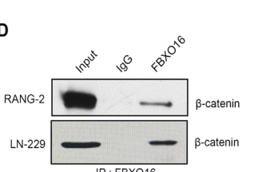

## Question

# Gene Research for Functional Annotation

## ⚠️ CRITICAL: Gene/Protein Identification Context

**BEFORE YOU BEGIN RESEARCH:** You MUST verify you are researching the CORRECT gene/protein. Gene symbols can be ambiguous, especially for less well-characterized genes from non-model organisms.

### Target Gene/Protein Identity (from UniProt):
- **UniProt Accession:** Q8IX29
- **Protein Description:** RecName: Full=F-box only protein 16;
- **Gene Information:** Name=FBXO16; Synonyms=FBX16;
- **Organism (full):** Homo sapiens (Human).
- **Protein Family:** Not specified in UniProt
- **Key Domains:** F-box-like_dom_sf. (IPR036047); F-box_dom. (IPR001810); GEF_Ubiquitin-Prot_Reg. (IPR052805); F-box-like (PF12937)

### MANDATORY VERIFICATION STEPS:

1. **Check if the gene symbol "FBXO16" matches the protein description above**
2. **Verify the organism is correct:** Homo sapiens (Human).
3. **Check if protein family/domains align with what you find in literature**
4. **If you find literature for a DIFFERENT gene with the same or similar symbol, STOP**

### If Gene Symbol is Ambiguous or You Cannot Find Relevant Literature:

**DO NOT PROCEED WITH RESEARCH ON A DIFFERENT GENE.** Instead:
- State clearly: "The gene symbol 'FBXO16' is ambiguous or literature is limited for this specific protein"
- Explain what you found (e.g., "Found extensive literature on a different gene with the same symbol in a different organism")
- Describe the protein based ONLY on the UniProt information provided above
- Suggest that the protein function can be inferred from domain/family information

### Research Target:

Please provide a comprehensive research report on the gene **FBXO16** (gene ID: FBXO16, UniProt: Q8IX29) in human.

The research report should be a detailed narrative explaining the function, biological processes, and localization of the gene product. Citations should be given for all claims.

You should prioritize authoritative reviews and primary scientific literature when conducting research. You can supplement
this with annotations you find in gene/protein databases, but these can be outdated or inaccurate.

We are specifically interested in the primary function of the gene - for enzymes, what reaction is catalyzed, and what is the substrate specificity? For transporters, what is the substrate? For structural proteins or adapters, what is the broader structural role? For signaling molecules, what is the role in the pathway.

We are interested in where in or outside the cell the gene product carries out its function.

We are also interested in the signaling or biochemical pathways in which the gene functions. We are less interested in broad pleiotropic effects, except where these elucidate the precise role.

Include evidence where possible. We are interested in both experimental evidence as well as inference from structure, evolution, or bioinformatic analysis. Precise studies should be prioritized over high-throughput, where available.

## Output

Question: You are an expert researcher providing comprehensive, well-cited information.

Provide detailed information focusing on:
1. Key concepts and definitions with current understanding
2. Recent developments and latest research (prioritize 2023-2024 sources)
3. Current applications and real-world implementations
4. Expert opinions and analysis from authoritative sources
5. Relevant statistics and data from recent studies

Format as a comprehensive research report with proper citations. Include URLs and publication dates where available.
Always prioritize recent, authoritative sources and provide specific citations for all major claims.

# Gene Research for Functional Annotation

## ⚠️ CRITICAL: Gene/Protein Identification Context

**BEFORE YOU BEGIN RESEARCH:** You MUST verify you are researching the CORRECT gene/protein. Gene symbols can be ambiguous, especially for less well-characterized genes from non-model organisms.

### Target Gene/Protein Identity (from UniProt):
- **UniProt Accession:** Q8IX29
- **Protein Description:** RecName: Full=F-box only protein 16;
- **Gene Information:** Name=FBXO16; Synonyms=FBX16;
- **Organism (full):** Homo sapiens (Human).
- **Protein Family:** Not specified in UniProt
- **Key Domains:** F-box-like_dom_sf. (IPR036047); F-box_dom. (IPR001810); GEF_Ubiquitin-Prot_Reg. (IPR052805); F-box-like (PF12937)

### MANDATORY VERIFICATION STEPS:

1. **Check if the gene symbol "FBXO16" matches the protein description above**
2. **Verify the organism is correct:** Homo sapiens (Human).
3. **Check if protein family/domains align with what you find in literature**
4. **If you find literature for a DIFFERENT gene with the same or similar symbol, STOP**

### If Gene Symbol is Ambiguous or You Cannot Find Relevant Literature:

**DO NOT PROCEED WITH RESEARCH ON A DIFFERENT GENE.** Instead:
- State clearly: "The gene symbol 'FBXO16' is ambiguous or literature is limited for this specific protein"
- Explain what you found (e.g., "Found extensive literature on a different gene with the same symbol in a different organism")
- Describe the protein based ONLY on the UniProt information provided above
- Suggest that the protein function can be inferred from domain/family information

### Research Target:

Please provide a comprehensive research report on the gene **FBXO16** (gene ID: FBXO16, UniProt: Q8IX29) in human.

The research report should be a detailed narrative explaining the function, biological processes, and localization of the gene product. Citations should be given for all claims.

You should prioritize authoritative reviews and primary scientific literature when conducting research. You can supplement
this with annotations you find in gene/protein databases, but these can be outdated or inaccurate.

We are specifically interested in the primary function of the gene - for enzymes, what reaction is catalyzed, and what is the substrate specificity? For transporters, what is the substrate? For structural proteins or adapters, what is the broader structural role? For signaling molecules, what is the role in the pathway.

We are interested in where in or outside the cell the gene product carries out its function.

We are also interested in the signaling or biochemical pathways in which the gene functions. We are less interested in broad pleiotropic effects, except where these elucidate the precise role.

Include evidence where possible. We are interested in both experimental evidence as well as inference from structure, evolution, or bioinformatic analysis. Precise studies should be prioritized over high-throughput, where available.

# Research Report: Human **FBXO16** (UniProt Q8IX29) — Functional Annotation

## 0) Target verification (mandatory)

The literature gathered here consistently studies **FBXO16 (F-box only protein 16)** as an **F-box domain–containing** substrate-receptor component of **CRL1/SCF (CUL1–SKP1–RBX1)** ubiquitin ligase complexes, matching the target identity and domain logic in UniProt (F-box domain(s) plus additional C-terminal substrate-recognition region). No evidence reviewed corresponded to a different gene with a confusingly similar symbol. (ji2021fbxo16mediatedhnrnplubiquitination pages 1-2, ji2021fbxo16mediatedhnrnplubiquitination pages 6-8, ji2021fbxo16mediatedhnrnplubiquitination pages 4-6)

## 1) Key concepts & definitions (current understanding)

### 1.1 F-box proteins and SCF/CRL1 E3 ligases
F-box proteins are generally understood to function as **substrate-recognition receptors** in **SCF/CRL1** E3 ubiquitin ligase complexes, where the **F-box motif** mediates association with **SKP1**, and the cullin scaffold (**CUL1**) with **RBX1** recruits an E2 enzyme to catalyze ubiquitin transfer to substrates. FBXO16 behaves consistently with this architecture: its **F-box domain is required for assembling functional ubiquitin-ligase activity**, whereas a **C-terminal region mediates substrate binding/recognition**. (ji2021fbxo16mediatedhnrnplubiquitination pages 6-8, ji2021fbxo16mediatedhnrnplubiquitination pages 4-6, khan2019attenuationoftumor pages 4-6, sugimotoishige2025fbxo16mediatesdegradation pages 8-9)

### 1.2 What “E3 ligase substrate receptor” means for FBXO16 function
For FBXO16, the “primary function” is not to catalyze a chemical reaction like an enzyme active site; rather, it **confers substrate specificity** on a ubiquitin ligase complex by binding selected proteins and positioning them for **polyubiquitination** and usually **proteasomal degradation** (often via **K48-linked** polyubiquitin). (khan2019attenuationoftumor pages 4-6, zhang2024mir937amplificationpotentiates pages 7-10, ji2021fbxo16mediatedhnrnplubiquitination pages 8-9)

## 2) FBXO16 molecular function: substrates, mechanisms, and domains

### 2.1 Validated substrates (experimentally supported)
Across primary mechanistic studies, FBXO16 has been experimentally validated to target multiple proteins for ubiquitin-dependent degradation:

1. **β-catenin (CTNNB1)**: FBXO16 physically interacts with β-catenin and promotes **K48-linked polyubiquitination** and **proteasome-mediated degradation** of the **nuclear pool** of β-catenin, suppressing Wnt/TCF transcriptional output. (khan2019attenuationoftumor pages 1-2, khan2019attenuationoftumor pages 4-6)
2. **hnRNPL**: FBXO16 assembles a canonical SCF complex via its F-box domain and targets **hnRNPL** for ubiquitination and degradation; substrate recognition maps to the **FBXO16 C-terminus**, binding the **RRM3** domain of hnRNPL. (ji2021fbxo16mediatedhnrnplubiquitination pages 1-2, ji2021fbxo16mediatedhnrnplubiquitination pages 6-8, ji2021fbxo16mediatedhnrnplubiquitination pages 8-9)
3. **ULK1**: In ovarian cancer models, FBXO16 binds ULK1 and promotes **K48-linked polyubiquitination** and reduced ULK1 protein abundance, thereby suppressing autophagy outputs. (zhang2024mir937amplificationpotentiates pages 7-10)
4. **NF-κB p65/RELA** (functional substrate in immune context): Fbxo16 was identified as a substrate-recognition component in a **PDLIM2-containing CRL1 complex** that promotes p65 polyubiquitination and degradation in nuclear compartments, suppressing NF-κB activation. (sugimotoishige2025fbxo16mediatesdegradation pages 6-7, sugimotoishige2025fbxo16mediatesdegradation pages 8-9)

### 2.2 Domain logic (F-box vs. substrate-binding region)
Two consistent structure–function principles emerge:

- The **F-box domain** is required for **complex formation and ubiquitination function** (e.g., ΔF-box mutants fail to promote ubiquitination of targets or to form productive complexes). (ji2021fbxo16mediatedhnrnplubiquitination pages 6-8, sugimotoishige2025fbxo16mediatesdegradation pages 8-9)
- The **C-terminal region** is repeatedly implicated in **substrate recognition**:
  - For β-catenin, a **C-terminal deletion abolishes binding** to β-catenin, while F-box or N-terminal deletions can retain interaction, indicating substrate binding is C-terminally mediated. (khan2019attenuationoftumor pages 4-6, khan2019attenuationoftumor pages 2-3)
  - For hnRNPL, FBXO16 binds hnRNPL via its **C-terminal region** to hnRNPL’s **RRM3** domain. (ji2021fbxo16mediatedhnrnplubiquitination pages 1-2, ji2021fbxo16mediatedhnrnplubiquitination pages 8-9)
  - For ULK1, the study explicitly tests an FBXO16 **ΔCTD** construct in functional assays, implying CTD importance for FBXO16 inhibitory function. (zhang2024mir937amplificationpotentiates pages 7-10)

### 2.3 Mechanistic visualization (figure evidence)
Khan et al. provide direct figure-level evidence supporting: (i) FBXO16–β-catenin interaction, (ii) increased total and **K48-linked** ubiquitination of nuclear β-catenin with FBXO16 expression, and (iii) domain mapping showing the **C-terminus is essential for β-catenin interaction**. (khan2019attenuationoftumor media a83ab1b6)

## 3) Cellular localization & where FBXO16 acts

FBXO16 functional evidence strongly emphasizes **nuclear** contexts:

- In glioblastoma models, FBXO16 targets the **nuclear fraction** of β-catenin for K48-linked polyubiquitination and degradation. (khan2019attenuationoftumor pages 1-2, khan2019attenuationoftumor pages 4-6)
- In ovarian cancer, FBXO16 is reported as **mainly nuclear** and targets nuclear hnRNPL, consistent with its substrate being a predominantly nuclear RNA-binding protein. (ji2021fbxo16mediatedhnrnplubiquitination pages 4-6, ji2021fbxo16mediatedhnrnplubiquitination pages 1-2)
- In immune signaling studies, Fbxo16 promotes p65 degradation in **nuclear/intranuclear compartments** and shifts p65 to an **insoluble nuclear fraction** prior to proteasomal degradation. (sugimotoishige2025fbxo16mediatesdegradation pages 8-9)

Taken together, FBXO16 appears to be a **nuclear-relevant CRL1 substrate receptor** with substrate-dependent localization (and some evidence for both cytoplasmic and nuclear presence in the NF-κB study’s discussion referencing HPA). (sugimotoishige2025fbxo16mediatesdegradation pages 7-8)

## 4) Pathways and biological processes regulated by FBXO16

### 4.1 Wnt/β-catenin signaling (tumor suppression via β-catenin turnover)
FBXO16 suppresses Wnt signaling by promoting nuclear β-catenin degradation. In glioblastoma models, this is linked to reduced expression of canonical β-catenin/TCF outputs such as **c-Myc** and **Cyclin D1**, reduced TOPFlash reporter activity, and reduced malignant phenotypes. (khan2019attenuationoftumor pages 4-6, khan2019attenuationoftumor pages 1-2)

### 4.2 RNA-binding protein regulation and oncogenic pathway control (hnRNPL axis)
In ovarian cancer models, FBXO16-mediated hnRNPL degradation is associated with suppression of malignant phenotypes and reduction of multiple oncogenic signaling outputs. In FBXO16 KO conditions, hnRNPL knockdown was sufficient to reverse activation of **MAPK, RAS, and Wnt signaling** described in that study. (ji2021fbxo16mediatedhnrnplubiquitination pages 8-9)

### 4.3 Autophagy initiation (ULK1 axis)
A 2024 study identifies ULK1 as a degradation substrate of FBXO16 and links FBXO16 to **autophagy suppression**: FBXO16 overexpression reduces ULK1 and shifts autophagy markers (e.g., lower LC3II/I ratio, increased p62), while FBXO16 knockdown increases ULK1 protein. (zhang2024mir937amplificationpotentiates pages 7-10)

### 4.4 NF-κB inflammatory signaling (p65/RELA axis)
In dendritic cell contexts, Fbxo16 functions as a substrate receptor for p65 in a PDLIM2-containing CRL1 complex; Fbxo16 promotes p65 degradation and thereby limits NF-κB transactivation and pro-inflammatory cytokine expression (e.g., IL-6). (sugimotoishige2025fbxo16mediatesdegradation pages 6-7, sugimotoishige2025fbxo16mediatesdegradation pages 8-9)

## 5) Recent developments (prioritizing 2023–2024)

### 5.1 2024: MIR937 amplification → FBXO16 downregulation → ULK1 stabilization → increased autophagy
Zhang et al. (published **Oct 2024** in *Cell Death & Disease*) propose and experimentally support a regulatory axis where **MIR937 amplification** increases **miR-937-5p**, which targets the **3′ UTR of FBXO16**, reducing FBXO16 levels and thereby restricting FBXO16’s degradative effect on **ULK1**, promoting autophagy and proliferative capacity in high-grade serous ovarian cancer models. (zhang2024mir937amplificationpotentiates pages 7-10)

### 5.2 2023: disease-association and systems evidence (database aggregation)
Open Targets aggregates genetic/literature evidence linking FBXO16 to neoplasm-related terms and specific cancers (e.g., **ovarian cancer**, **glioblastoma multiforme**) and also reports associations for **amyotrophic lateral sclerosis (ALS)** in its evidence set. While these are not mechanistic proofs, they are useful for prioritizing disease contexts for follow-up experimentation. (OpenTargets Search: -FBXO16)

## 6) Current applications and real-world implementations

### 6.1 Biomarker and mechanistic target candidate in oncology
Primary mechanistic studies support FBXO16 as a **tumor-suppressive regulator** through degradation of oncogenic effectors (β-catenin, hnRNPL, ULK1-mediated autophagy), suggesting potential translational applications:

- **Biomarker concept**: low FBXO16 expression can be interpreted as permissive for elevated Wnt signaling (via β-catenin) or increased autophagy (via ULK1), depending on tumor type and context. (khan2019attenuationoftumor pages 1-2, zhang2024mir937amplificationpotentiates pages 7-10)
- **Therapeutic hypothesis**: strategies that restore FBXO16 function or mimic its substrate-degradation effects might suppress tumor growth programs mediated by β-catenin, hnRNPL, or ULK1. These are still preclinical hypotheses grounded in cell and xenograft models rather than clinical trials. (khan2019attenuationoftumor pages 4-6, ji2021fbxo16mediatedhnrnplubiquitination pages 8-9, zhang2024mir937amplificationpotentiates pages 7-10)

### 6.2 Targeting upstream regulators (noncoding RNA axes)
The 2024 MIR937/miR-937-5p → FBXO16 → ULK1 axis provides a concrete example of a potentially druggable regulatory layer: **blocking miR-937-5p** or **restoring FBXO16** could reduce ULK1-mediated autophagy that supports tumor cell fitness. (zhang2024mir937amplificationpotentiates pages 7-10)

## 7) Expert interpretation and analysis (evidence-weighted)

### 7.1 Most confident functional statement
The strongest, repeatedly supported functional annotation is:

> **FBXO16 is a CRL1/SCF substrate-recognition protein that drives K48-linked polyubiquitination and proteasomal degradation of select substrates, with prominent nuclear activity.**

This is supported by multiple primary mechanistic datasets across different substrates and contexts (β-catenin, hnRNPL, ULK1; nuclear p65 in immune context). (khan2019attenuationoftumor pages 4-6, ji2021fbxo16mediatedhnrnplubiquitination pages 8-9, zhang2024mir937amplificationpotentiates pages 7-10, sugimotoishige2025fbxo16mediatesdegradation pages 8-9)

### 7.2 Substrate selectivity and context dependence
FBXO16 substrates appear **context-dependent** (tumor type, cell state, and possibly binding partners like PDLIM2). For example, ULK1 is prominent in one ovarian cancer mechanism, while hnRNPL is emphasized in another; the ULK1-focused study notes hnRNPL is not altered in that specific context, implying separable substrate modules. (zhang2024mir937amplificationpotentiates pages 7-10)

### 7.3 C-terminal substrate-recognition as a unifying mechanistic theme
Independent substrate-mapping experiments converge on the FBXO16 **C-terminus** as a key substrate-binding interface (β-catenin, hnRNPL; likely ULK1). This suggests that perturbations in the C-terminal region (mutation, truncation, binding competition) could broadly disable FBXO16 substrate recognition even if SCF assembly remains intact. (khan2019attenuationoftumor pages 4-6, ji2021fbxo16mediatedhnrnplubiquitination pages 8-9)

## 8) Statistics and quantitative data from recent/primary studies

- **Ovarian cancer clinical specimens (hnRNPL axis):** In **68** ovarian cancer specimens, FBXO16 expression was negatively correlated with hnRNPL (χ² = **14.81**, **P < 0.001**). (ji2021fbxo16mediatedhnrnplubiquitination pages 8-9)
- **In vivo tumor growth (hnRNPL recognition domain):** In SKOV3 xenografts (injection **1×10^7 cells**; **n = 5 mice**), expression of hnRNPL lacking the FBXO16-recognition domain (ΔRRM3) increased tumor growth (**P < 0.001**), consistent with impaired FBXO16-mediated hnRNPL degradation promoting tumor growth. (ji2021fbxo16mediatedhnrnplubiquitination pages 8-9)
- **β-catenin nuclear puncta:** FBXO16 overexpression produced an approximately **4-fold reduction** in nuclear RFP-β-catenin speckles in glioblastoma models, alongside reduced Wnt reporter output and downstream targets. (khan2019attenuationoftumor pages 4-6)
- **Migration phenotype:** FBXO16 overexpression reduced migration by ~**30%** (P ≤ 0.008) in the glioblastoma study excerpt. (khan2019attenuationoftumor pages 4-6)
- **Disease association evidence counts (Open Targets):** Open Targets lists FBXO16 associations for several diseases with **evidence_size = 5** in its returned summary for diseases including glioblastoma multiforme, neoplasm, cervical carcinoma, ALS, and ovarian cancer. (OpenTargets Search: -FBXO16)

## 9) Evidence map summary table

The following table consolidates substrates, mechanisms, domains, localization, contexts, and key quantitative points.

| Substrate/Interactor | Evidence type (co-IP, ubiquitination, degradation, functional assay) | Ubiquitin linkage / degradation mechanism | Required FBXO16 domain(s) | Cellular compartment | Biological context (cell type/cancer) | Key quantitative data (n, fold-changes, p-values) | Publication (authors, journal, year, date) | URL | Citation context ID |
|---|---|---|---|---|---|---|---|---|---|
| β-catenin (CTNNB1) | IP/co-IP interaction in RANG-2 and LN229; nuclear-fraction ubiquitination assays; MG132 rescue; TOPFlash Wnt reporter; migration/proliferation/xenograft assays | K48-linked polyubiquitination of nuclear β-catenin followed by proteasome-dependent degradation; reported GSK3β-independent | C-terminal region required for β-catenin interaction; ΔC loses binding, while ΔF and N-terminal deletion retain interaction | Predominantly nuclear β-catenin pool | Human glioblastoma models (RANG-2, LN229; xenografts) | ~4-fold reduction in nuclear RFP-β-catenin speckles with FBXO16 overexpression; ~30% reduced migration (P≤0.008); decreased TOPFlash, c-Myc, Cyclin D1; qRT-PCR cohort glioma n=11 vs normal brain n=4; xenograft tumor volume ~800 mm^3 ±71.6 in model context; n=3 for some assays, P≤0.001 | Khan, Muzumdar, Shiras; *Neoplasia*; 2019; Jan | https://doi.org/10.1016/j.neo.2018.11.005 | (khan2019attenuationoftumor pages 4-6, khan2019attenuationoftumor pages 1-2, khan2019attenuationoftumor pages 2-3, khan2019attenuationoftumor media a83ab1b6) |
| hnRNPL | BioGRID-guided candidate identification; co-IP and GST pull-down; TUBE2 ubiquitination enrichment; CHX half-life; MG132 rescue; in vitro ubiquitination with Cul1-Skp1-Rbx1 + FBXO16; rescue/phenocopy functional assays | SCF/CUL1-SKP1-RBX1-dependent ubiquitination and proteasomal degradation of hnRNPL | F-box required for ubiquitination activity; C-terminal region required for substrate recognition; binds hnRNPL RRM3 domain | FBXO16 reported mainly nuclear; hnRNPL mainly nuclear | Human ovarian cancer cells; SKOV3 xenograft | Negative FBXO16-hnRNPL correlation in 68 ovarian cancer specimens (χ²=14.81, P<0.001); hnRNPL ΔRRM3 xenograft using 1×10^7 cells, n=5 mice, significantly increased tumor growth (P<0.001); FBXO16 loss increased proliferation, clonogenicity, invasion | Ji et al.; *Cell Death & Disease*; 2021; Jul | https://doi.org/10.1038/s41419-021-04040-9 | (ji2021fbxo16mediatedhnrnplubiquitination pages 1-2, ji2021fbxo16mediatedhnrnplubiquitination pages 6-8, ji2021fbxo16mediatedhnrnplubiquitination pages 4-6, ji2021fbxo16mediatedhnrnplubiquitination pages 8-9) |
| ULK1 | Co-IP/in vitro interaction; ubiquitination assays; FBXO16 knockdown/overexpression; autophagy and proliferation assays; truncation-mutant testing | K48-linked polyubiquitination of ULK1 with proteasomal targeting; FBXO16 suppresses ULK1-dependent autophagy | C-terminal region implicated based on ΔCTD testing in binding and functional assays | Not explicitly localized in excerpt; mechanism studied in cellular protein turnover/autophagy context | Human high-grade serous ovarian cancer models | FBXO16 knockdown increased ULK1 protein while not affecting ATG7/ATG13/Beclin-1; FBXO16 overexpression decreased ULK1, lowered LC3II/I ratio, increased p62; no cohort HR/effect size reported in excerpt | Zhang et al.; *Cell Death & Disease*; 2024; Oct | https://doi.org/10.1038/s41419-024-07120-8 | (zhang2024mir937amplificationpotentiates pages 7-10) |
| NF-κB p65 (RELA) | siRNA screen of 39 Fbxo genes; co-IP with PDLIM2/CUL1/SKP1; polyubiquitination assays; nuclear fractionation; ELAM-1 luciferase; knockdown/deficiency functional assays | Polyubiquitination and proteasomal degradation of p65 within a PDLIM2-containing CRL1/SCF-like complex; loss of Fbxo16 increases nuclear p65 and inflammatory cytokines | F-box domain required for CUL1/PDLIM2 complex formation and p65 polyubiquitination; ΔF mutant impaired | Nuclear/intranuclear, including insoluble nuclear fraction | Dendritic cells; HEK293T, BMDCs, MEFs; inflammatory signaling rather than cancer | Screened 39 Fbxo genes; Fbxo16 deficiency caused striking augmentation of LPS-induced IL-6 and enhanced nuclear p65; WT but not ΔF suppressed NF-κB luciferase activity; no hazard ratios reported | Sugimoto-Ishige, Jodo, Tanaka; *Frontiers in Immunology*; 2025; Jun | https://doi.org/10.3389/fimmu.2025.1524110 | (sugimotoishige2025fbxo16mediatesdegradation pages 8-9, sugimotoishige2025fbxo16mediatesdegradation pages 6-7, sugimotoishige2025fbxo16mediatesdegradation pages 12-13, sugimotoishige2025fbxo16mediatesdegradation pages 7-8, sugimotoishige2025fbxo16mediatesdegradation pages 5-6) |
| SKP1 / CUL1 / RBX1 (SCF components) | Interaction/co-complex evidence; in vitro ubiquitination with Cul1-Skp1-Rbx1 plus FBXO16; co-IP with CUL1/SKP1; dominant-negative CUL1 effects | Supports FBXO16 as the substrate-recognition module of canonical SCF/CRL1 E3 ligase rather than a substrate itself | F-box domain mediates SCF assembly/function | Nuclear context emphasized in ovarian cancer and p65 studies; broader cytoplasmic+nuclear localization also reported | Human ovarian cancer cells; HEK293T; dendritic cell signaling | Dominant-negative CUL1 caused hnRNPL accumulation; Fbxo16 binds CUL1/SKP1 but not CUL2/CUL3 in immune study; quantitative interaction values not provided | Ji et al.; *Cell Death & Disease*; 2021; Jul; Sugimoto-Ishige et al.; *Frontiers in Immunology*; 2025; Jun | https://doi.org/10.1038/s41419-021-04040-9 ; https://doi.org/10.3389/fimmu.2025.1524110 | (ji2021fbxo16mediatedhnrnplubiquitination pages 6-8, ji2021fbxo16mediatedhnrnplubiquitination pages 4-6, sugimotoishige2025fbxo16mediatesdegradation pages 6-7) |
| PDLIM2 | Co-IP/complex assembly evidence in p65-targeting study | Partner in a PDLIM2-containing CRL1 complex that enables p65 recruitment, polyubiquitination, and degradation | F-box domain needed for proper complex formation with CUL1/PDLIM2 | Nuclear/intranuclear | Dendritic cells; HEK293T reconstitution system | Fbxo16 knockdown was the key hit reverting PDLIM2-dependent p65 decrease in screen-derived follow-up; no explicit effect size in excerpt | Sugimoto-Ishige, Jodo, Tanaka; *Frontiers in Immunology*; 2025; Jun | https://doi.org/10.3389/fimmu.2025.1524110 | (sugimotoishige2025fbxo16mediatesdegradation pages 8-9, sugimotoishige2025fbxo16mediatesdegradation pages 6-7, sugimotoishige2025fbxo16mediatesdegradation pages 5-6) |

*Table: This table compiles experimentally supported evidence for human FBXO16 (UniProt Q8IX29), emphasizing validated substrates, SCF/CRL1 complex partners, domain requirements, compartment, biological context, and quantitative findings. It is useful as a compact functional-annotation map grounded in primary literature and citeable context IDs.*

## 10) Limitations and open questions

1. **UniProt accession reporting:** The primary papers reviewed typically refer to FBXO16 by gene/protein name rather than explicitly stating UniProt **Q8IX29**; identity matching is therefore based on symbol/function/domain congruence rather than explicit accession mention. (ji2021fbxo16mediatedhnrnplubiquitination pages 1-2, khan2019attenuationoftumor pages 4-6)
2. **Incomplete substrate landscape:** While β-catenin, hnRNPL, ULK1, and p65 have evidence, the full substrate repertoire and recognition motifs remain incompletely defined. Context-dependent substrate selection is likely. (zhang2024mir937amplificationpotentiates pages 7-10)
3. **Clinical translation:** Evidence is largely mechanistic and preclinical (cell and xenograft models); no FBXO16-directed therapies or clinical trials were identified in the gathered evidence.

## Key primary sources (with publication dates and URLs)

- Khan M, Muzumdar D, Shiras A. **Attenuation of tumor suppressive function of FBXO16 ubiquitin ligase activates Wnt signaling in glioblastoma.** *Neoplasia*. **Jan 2019**. https://doi.org/10.1016/j.neo.2018.11.005 (khan2019attenuationoftumor pages 4-6, khan2019attenuationoftumor media a83ab1b6)
- Ji M et al. **FBXO16-mediated hnRNPL ubiquitination and degradation plays a tumor suppressor role in ovarian cancer.** *Cell Death & Disease*. **Jul 2021**. https://doi.org/10.1038/s41419-021-04040-9 (ji2021fbxo16mediatedhnrnplubiquitination pages 1-2, ji2021fbxo16mediatedhnrnplubiquitination pages 8-9)
- Zhang Z et al. **MIR937 amplification potentiates ovarian cancer progression by attenuating FBXO16 inhibition on ULK1-mediated autophagy.** *Cell Death & Disease*. **Oct 2024**. https://doi.org/10.1038/s41419-024-07120-8 (zhang2024mir937amplificationpotentiates pages 7-10)

- Open Targets Platform (disease–target association aggregation for FBXO16). Accessed via tool output. https://platform.opentargets.org/ (OpenTargets Search: -FBXO16)

References

1. (ji2021fbxo16mediatedhnrnplubiquitination pages 1-2): Mei Ji, Zhao Zhao, Yue Li, Penglin Xu, Jia Shi, Zhe Li, Kaige Wang, Xiaotian Huang, Jing Ji, Wei Liu, and Bin Liu. Fbxo16-mediated hnrnpl ubiquitination and degradation plays a tumor suppressor role in ovarian cancer. Cell Death & Disease, Jul 2021. URL: https://doi.org/10.1038/s41419-021-04040-9, doi:10.1038/s41419-021-04040-9. This article has 34 citations and is from a peer-reviewed journal.

2. (ji2021fbxo16mediatedhnrnplubiquitination pages 6-8): Mei Ji, Zhao Zhao, Yue Li, Penglin Xu, Jia Shi, Zhe Li, Kaige Wang, Xiaotian Huang, Jing Ji, Wei Liu, and Bin Liu. Fbxo16-mediated hnrnpl ubiquitination and degradation plays a tumor suppressor role in ovarian cancer. Cell Death & Disease, Jul 2021. URL: https://doi.org/10.1038/s41419-021-04040-9, doi:10.1038/s41419-021-04040-9. This article has 34 citations and is from a peer-reviewed journal.

3. (ji2021fbxo16mediatedhnrnplubiquitination pages 4-6): Mei Ji, Zhao Zhao, Yue Li, Penglin Xu, Jia Shi, Zhe Li, Kaige Wang, Xiaotian Huang, Jing Ji, Wei Liu, and Bin Liu. Fbxo16-mediated hnrnpl ubiquitination and degradation plays a tumor suppressor role in ovarian cancer. Cell Death & Disease, Jul 2021. URL: https://doi.org/10.1038/s41419-021-04040-9, doi:10.1038/s41419-021-04040-9. This article has 34 citations and is from a peer-reviewed journal.

4. (khan2019attenuationoftumor pages 4-6): Mohsina Khan, Dattatraya Muzumdar, and Anjali Shiras. Attenuation of tumor suppressive function of fbxo16 ubiquitin ligase activates wnt signaling in glioblastoma. Jan 2019. URL: https://doi.org/10.1016/j.neo.2018.11.005, doi:10.1016/j.neo.2018.11.005. This article has 35 citations and is from a domain leading peer-reviewed journal.

5. (sugimotoishige2025fbxo16mediatesdegradation pages 8-9): Akiko Sugimoto-Ishige, Aya Jodo, and Takashi Tanaka. Fbxo16 mediates degradation of nf-κb p65 subunit and inhibits inflammatory response in dendritic cells. Frontiers in Immunology, Jun 2025. URL: https://doi.org/10.3389/fimmu.2025.1524110, doi:10.3389/fimmu.2025.1524110. This article has 3 citations and is from a peer-reviewed journal.

6. (zhang2024mir937amplificationpotentiates pages 7-10): Zhen Zhang, Xinkui Liu, Chu Chu, Yingjie Zhang, Wei Li, Xiaoyan Yu, Qiaoqiao Han, Haoyu Sun, Yunhong Zhang, Xiaoxiao Zhu, Liang Chen, Ran Wei, Nannan Fan, Miaomiao Zhou, and Xia Li. Mir937 amplification potentiates ovarian cancer progression by attenuating fbxo16 inhibition on ulk1-mediated autophagy. Cell Death &amp; Disease, Oct 2024. URL: https://doi.org/10.1038/s41419-024-07120-8, doi:10.1038/s41419-024-07120-8. This article has 5 citations and is from a peer-reviewed journal.

7. (ji2021fbxo16mediatedhnrnplubiquitination pages 8-9): Mei Ji, Zhao Zhao, Yue Li, Penglin Xu, Jia Shi, Zhe Li, Kaige Wang, Xiaotian Huang, Jing Ji, Wei Liu, and Bin Liu. Fbxo16-mediated hnrnpl ubiquitination and degradation plays a tumor suppressor role in ovarian cancer. Cell Death & Disease, Jul 2021. URL: https://doi.org/10.1038/s41419-021-04040-9, doi:10.1038/s41419-021-04040-9. This article has 34 citations and is from a peer-reviewed journal.

8. (khan2019attenuationoftumor pages 1-2): Mohsina Khan, Dattatraya Muzumdar, and Anjali Shiras. Attenuation of tumor suppressive function of fbxo16 ubiquitin ligase activates wnt signaling in glioblastoma. Jan 2019. URL: https://doi.org/10.1016/j.neo.2018.11.005, doi:10.1016/j.neo.2018.11.005. This article has 35 citations and is from a domain leading peer-reviewed journal.

9. (sugimotoishige2025fbxo16mediatesdegradation pages 6-7): Akiko Sugimoto-Ishige, Aya Jodo, and Takashi Tanaka. Fbxo16 mediates degradation of nf-κb p65 subunit and inhibits inflammatory response in dendritic cells. Frontiers in Immunology, Jun 2025. URL: https://doi.org/10.3389/fimmu.2025.1524110, doi:10.3389/fimmu.2025.1524110. This article has 3 citations and is from a peer-reviewed journal.

10. (khan2019attenuationoftumor pages 2-3): Mohsina Khan, Dattatraya Muzumdar, and Anjali Shiras. Attenuation of tumor suppressive function of fbxo16 ubiquitin ligase activates wnt signaling in glioblastoma. Jan 2019. URL: https://doi.org/10.1016/j.neo.2018.11.005, doi:10.1016/j.neo.2018.11.005. This article has 35 citations and is from a domain leading peer-reviewed journal.

11. (khan2019attenuationoftumor media a83ab1b6): Mohsina Khan, Dattatraya Muzumdar, and Anjali Shiras. Attenuation of tumor suppressive function of fbxo16 ubiquitin ligase activates wnt signaling in glioblastoma. Jan 2019. URL: https://doi.org/10.1016/j.neo.2018.11.005, doi:10.1016/j.neo.2018.11.005. This article has 35 citations and is from a domain leading peer-reviewed journal.

12. (sugimotoishige2025fbxo16mediatesdegradation pages 7-8): Akiko Sugimoto-Ishige, Aya Jodo, and Takashi Tanaka. Fbxo16 mediates degradation of nf-κb p65 subunit and inhibits inflammatory response in dendritic cells. Frontiers in Immunology, Jun 2025. URL: https://doi.org/10.3389/fimmu.2025.1524110, doi:10.3389/fimmu.2025.1524110. This article has 3 citations and is from a peer-reviewed journal.

13. (OpenTargets Search: -FBXO16): Open Targets Query (-FBXO16, 5 results). Buniello, A. et al. (2025). Open Targets Platform: facilitating therapeutic hypotheses building in drug discovery. Nucleic Acids Research.

14. (sugimotoishige2025fbxo16mediatesdegradation pages 12-13): Akiko Sugimoto-Ishige, Aya Jodo, and Takashi Tanaka. Fbxo16 mediates degradation of nf-κb p65 subunit and inhibits inflammatory response in dendritic cells. Frontiers in Immunology, Jun 2025. URL: https://doi.org/10.3389/fimmu.2025.1524110, doi:10.3389/fimmu.2025.1524110. This article has 3 citations and is from a peer-reviewed journal.

15. (sugimotoishige2025fbxo16mediatesdegradation pages 5-6): Akiko Sugimoto-Ishige, Aya Jodo, and Takashi Tanaka. Fbxo16 mediates degradation of nf-κb p65 subunit and inhibits inflammatory response in dendritic cells. Frontiers in Immunology, Jun 2025. URL: https://doi.org/10.3389/fimmu.2025.1524110, doi:10.3389/fimmu.2025.1524110. This article has 3 citations and is from a peer-reviewed journal.

## Artifacts

- [Edison artifact artifact-00](FBXO16-deep-research-falcon_artifacts/artifact-00.md)

## Citations

1. khan2019attenuationoftumor pages 4-6
2. khan2019attenuationoftumor pages 1-2
3. khan2019attenuationoftumor pages 2-3
4. https://doi.org/10.1016/j.neo.2018.11.005
5. https://doi.org/10.1038/s41419-021-04040-9
6. https://doi.org/10.1038/s41419-024-07120-8
7. https://doi.org/10.3389/fimmu.2025.1524110
8. https://platform.opentargets.org/
9. https://doi.org/10.1038/s41419-021-04040-9,
10. https://doi.org/10.1016/j.neo.2018.11.005,
11. https://doi.org/10.3389/fimmu.2025.1524110,
12. https://doi.org/10.1038/s41419-024-07120-8,