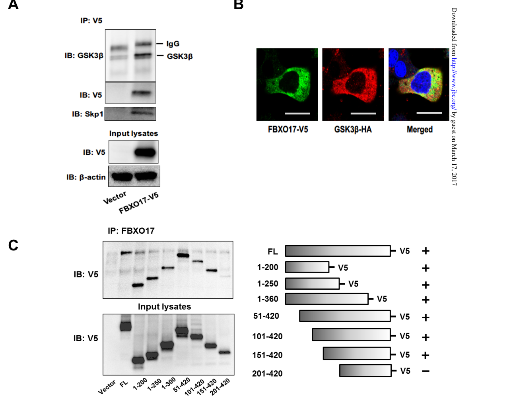

## Question

# Gene Research for Functional Annotation

## ⚠️ CRITICAL: Gene/Protein Identification Context

**BEFORE YOU BEGIN RESEARCH:** You MUST verify you are researching the CORRECT gene/protein. Gene symbols can be ambiguous, especially for less well-characterized genes from non-model organisms.

### Target Gene/Protein Identity (from UniProt):
- **UniProt Accession:** Q96EF6
- **Protein Description:** RecName: Full=F-box only protein 17; AltName: Full=F-box only protein 26;
- **Gene Information:** Name=FBXO17; Synonyms=FBG4, FBX17, FBX26, FBXO26;
- **Organism (full):** Homo sapiens (Human).
- **Protein Family:** Not specified in UniProt
- **Key Domains:** F-box-assoc_dom. (IPR007397); F-box-like_dom_sf. (IPR036047); F-box_dom. (IPR001810); F-box_only. (IPR039752); Galactose-bd-like_sf. (IPR008979)

### MANDATORY VERIFICATION STEPS:

1. **Check if the gene symbol "FBXO17" matches the protein description above**
2. **Verify the organism is correct:** Homo sapiens (Human).
3. **Check if protein family/domains align with what you find in literature**
4. **If you find literature for a DIFFERENT gene with the same or similar symbol, STOP**

### If Gene Symbol is Ambiguous or You Cannot Find Relevant Literature:

**DO NOT PROCEED WITH RESEARCH ON A DIFFERENT GENE.** Instead:
- State clearly: "The gene symbol 'FBXO17' is ambiguous or literature is limited for this specific protein"
- Explain what you found (e.g., "Found extensive literature on a different gene with the same symbol in a different organism")
- Describe the protein based ONLY on the UniProt information provided above
- Suggest that the protein function can be inferred from domain/family information

### Research Target:

Please provide a comprehensive research report on the gene **FBXO17** (gene ID: FBXO17, UniProt: Q96EF6) in human.

The research report should be a detailed narrative explaining the function, biological processes, and localization of the gene product. Citations should be given for all claims.

You should prioritize authoritative reviews and primary scientific literature when conducting research. You can supplement
this with annotations you find in gene/protein databases, but these can be outdated or inaccurate.

We are specifically interested in the primary function of the gene - for enzymes, what reaction is catalyzed, and what is the substrate specificity? For transporters, what is the substrate? For structural proteins or adapters, what is the broader structural role? For signaling molecules, what is the role in the pathway.

We are interested in where in or outside the cell the gene product carries out its function.

We are also interested in the signaling or biochemical pathways in which the gene functions. We are less interested in broad pleiotropic effects, except where these elucidate the precise role.

Include evidence where possible. We are interested in both experimental evidence as well as inference from structure, evolution, or bioinformatic analysis. Precise studies should be prioritized over high-throughput, where available.

## Output

Question: You are an expert researcher providing comprehensive, well-cited information.

Provide detailed information focusing on:
1. Key concepts and definitions with current understanding
2. Recent developments and latest research (prioritize 2023-2024 sources)
3. Current applications and real-world implementations
4. Expert opinions and analysis from authoritative sources
5. Relevant statistics and data from recent studies

Format as a comprehensive research report with proper citations. Include URLs and publication dates where available.
Always prioritize recent, authoritative sources and provide specific citations for all major claims.

# Gene Research for Functional Annotation

## ⚠️ CRITICAL: Gene/Protein Identification Context

**BEFORE YOU BEGIN RESEARCH:** You MUST verify you are researching the CORRECT gene/protein. Gene symbols can be ambiguous, especially for less well-characterized genes from non-model organisms.

### Target Gene/Protein Identity (from UniProt):
- **UniProt Accession:** Q96EF6
- **Protein Description:** RecName: Full=F-box only protein 17; AltName: Full=F-box only protein 26;
- **Gene Information:** Name=FBXO17; Synonyms=FBG4, FBX17, FBX26, FBXO26;
- **Organism (full):** Homo sapiens (Human).
- **Protein Family:** Not specified in UniProt
- **Key Domains:** F-box-assoc_dom. (IPR007397); F-box-like_dom_sf. (IPR036047); F-box_dom. (IPR001810); F-box_only. (IPR039752); Galactose-bd-like_sf. (IPR008979)

### MANDATORY VERIFICATION STEPS:

1. **Check if the gene symbol "FBXO17" matches the protein description above**
2. **Verify the organism is correct:** Homo sapiens (Human).
3. **Check if protein family/domains align with what you find in literature**
4. **If you find literature for a DIFFERENT gene with the same or similar symbol, STOP**

### If Gene Symbol is Ambiguous or You Cannot Find Relevant Literature:

**DO NOT PROCEED WITH RESEARCH ON A DIFFERENT GENE.** Instead:
- State clearly: "The gene symbol 'FBXO17' is ambiguous or literature is limited for this specific protein"
- Explain what you found (e.g., "Found extensive literature on a different gene with the same symbol in a different organism")
- Describe the protein based ONLY on the UniProt information provided above
- Suggest that the protein function can be inferred from domain/family information

### Research Target:

Please provide a comprehensive research report on the gene **FBXO17** (gene ID: FBXO17, UniProt: Q96EF6) in human.

The research report should be a detailed narrative explaining the function, biological processes, and localization of the gene product. Citations should be given for all claims.

You should prioritize authoritative reviews and primary scientific literature when conducting research. You can supplement
this with annotations you find in gene/protein databases, but these can be outdated or inaccurate.

We are specifically interested in the primary function of the gene - for enzymes, what reaction is catalyzed, and what is the substrate specificity? For transporters, what is the substrate? For structural proteins or adapters, what is the broader structural role? For signaling molecules, what is the role in the pathway.

We are interested in where in or outside the cell the gene product carries out its function.

We are also interested in the signaling or biochemical pathways in which the gene functions. We are less interested in broad pleiotropic effects, except where these elucidate the precise role.

Include evidence where possible. We are interested in both experimental evidence as well as inference from structure, evolution, or bioinformatic analysis. Precise studies should be prioritized over high-throughput, where available.

## Research Report: Human **FBXO17** (UniProt **Q96EF6**) Functional Annotation

### 1) Target verification and identity (critical disambiguation)

**Target**: *Homo sapiens* **FBXO17** (F-box only protein 17; UniProt Q96EF6). The mechanistic primary literature retrieved uses the gene/protein name **FBXO17** and studies its function as an F-box protein in the **SKP1–CUL1–F-box (SCF)** ubiquitin ligase system, consistent with the UniProt description of an F-box protein with an F-box–associated region and predicted sugar-binding-like features (as expected for “FBA-family” FBXO proteins). (suber2017scffbxo17e3ligase pages 4-5, skaar2013mechanismsandfunction pages 1-2)

**Synonymy seen in literature**: In a core mechanistic paper, FBXO17 is explicitly stated to be “also known as **FBG4**,” confirming at least one UniProt synonym in the experimental literature base. (suber2017scffbxo17e3ligase pages 4-5)

**Canonical SCF role (definition)**: Authoritative reviews summarize that **SCF E3 ubiquitin ligases use F-box proteins as substrate adaptors**; the ~40-aa **F-box domain** binds **SKP1**, linking the variable substrate-recognition module to the CUL1-RBX1 catalytic core. (skaar2013mechanismsandfunction pages 1-2)

### 2) Key concepts and current understanding

#### 2.1 What FBXO17 is (conceptual definition)
FBXO17 is best understood as a **substrate-recognition adaptor** for an SCF-type E3 ubiquitin ligase (SCF^FBXO17), where FBXO17 contributes **substrate specificity** by binding target proteins and positioning them for ubiquitin transfer and subsequent proteasomal degradation. (suber2017scffbxo17e3ligase pages 1-2, skaar2013mechanismsandfunction pages 1-2)

#### 2.2 Two mechanistic “modes” of FBXO17 function
Available evidence supports **two separable functional modes**:

1) **Canonical SCF ubiquitin-ligase adaptor mode**: FBXO17 binds targets (experimentally demonstrated for **GSK3β**) and promotes their ubiquitination and proteasomal degradation. (suber2017scffbxo17e3ligase pages 1-2, suber2017scffbxo17e3ligase pages 14-16, suber2017scffbxo17e3ligase pages 2-3)

2) **Non-canonical signaling-scaffold mode**: FBXO17 can regulate signaling **independently of its canonical SCF function** by recruiting **PP2A** to the transcription factor **IRF3** to promote IRF3 dephosphorylation and suppress type I interferon signaling. This is explicitly described as not requiring the F-box domain and using the “F-box associated region.” (peng2017anovelfunction pages 1-2)

### 3) Experimentally supported molecular functions

#### 3.1 FBXO17 as an SCF adaptor that targets **GSK3β** for degradation
A detailed biochemical study in lung epithelial cells shows that **FBXO17 associates with GSK3β**, promotes **polyubiquitination** of GSK3β, and drives **proteasome-dependent turnover** of GSK3β. (suber2017scffbxo17e3ligase pages 1-2, suber2017scffbxo17e3ligase pages 14-16, suber2017scffbxo17e3ligase pages 2-3)

**Mechanistic details supported by experiments** include:
- FBXO17 being an “authentic subunit” of SCF E3 ligase machinery and identifying **GSK3β as an SCF^FBXO17 substrate**. (suber2017scffbxo17e3ligase pages 4-5)
- **Cytoplasmic colocalization** of FBXO17 and GSK3β (cellular localization for the functional interaction). (suber2017scffbxo17e3ligase pages 4-5, suber2017scffbxo17e3ligase media b09b278e)
- Mapping a **putative GSK3β-binding region** in FBXO17 (amino acids **151–200** required for association in the reported assays). (suber2017scffbxo17e3ligase pages 4-5)

**Visual evidence**: Cropped figure panels show co-immunoprecipitation and cytoplasmic colocalization of FBXO17 with GSK3β, plus downstream cytokine outcomes (see §3.2). (suber2017scffbxo17e3ligase media b09b278e)

#### 3.2 Functional consequence in lung epithelia: dampening inflammatory cytokines
In lung epithelial cells, overexpression of FBXO17 reduces pro-inflammatory cytokine production after innate immune stimuli, consistent with FBXO17 limiting a GSK3β-dependent inflammatory program:
- FBXO17 overexpression reduces **TNFα- and LPS-induced IL-6 and KC/CXCL1**. (suber2017scffbxo17e3ligase pages 1-2, suber2017scffbxo17e3ligase pages 14-16, suber2017scffbxo17e3ligase pages 4-5)
- Re-expression of GSK3β partially rescues the KC suppression, linking the phenotype to the **FBXO17→GSK3β** axis. (suber2017scffbxo17e3ligase pages 4-5, suber2017scffbxo17e3ligase media b09b278e)

**Visual evidence**: Cropped cytokine panels (IL-6 and KC) following TNFα/LPS stimulation are shown in the retrieved figure crops. (suber2017scffbxo17e3ligase media b09b278e)

#### 3.3 Antiviral innate immunity: negative regulation of type I IFN signaling (IRF3/PP2A)
A mechanistic immunology study reports that FBXO17 **specifically interacts with IRF3** and negatively regulates type I interferon signaling by recruiting **PP2A** to promote **IRF3 dephosphorylation**, and emphasizes that this action is **independent of canonical SCF E3 ligase function** (does not require the F-box domain). (peng2017anovelfunction pages 1-2)

This positions FBXO17 as a dual-function regulator: a classical E3-adaptor in some contexts and a phosphatase-recruiting scaffold in others. (peng2017anovelfunction pages 1-2)

#### 3.4 Cancer cell biology contexts: divergent pathway effects across models
Available primary studies suggest FBXO17 can be pro- or anti-proliferative depending on context:

**Lung adenocarcinoma (A549)**: FBXO17 overexpression increases proliferation and is associated with increased activation of **Akt/PDK1**, **ERK1/2**, and downstream signaling (e.g., RPS6, CREB), while knockdown reduces growth and reduces ERK phosphorylation. (suber2018fbxo17promotescell pages 4-7)

**Endometrial cancer model (Ishikawa cells)**: FBXO17 overexpression suppresses proliferation and is associated with reduced Wnt/β-catenin output (reduced β-catenin targets such as cyclin D1 and c-Myc, reduced Axin2 mRNA) and altered EMT markers (↑E-cadherin, ↓N-cadherin). (zheng2022fbxo17inhibitsthe pages 4-7)

Interpretation: these studies indicate FBXO17 influences major signaling hubs (GSK3β, Akt/ERK, Wnt/β-catenin), but the **directionality** of pathway changes is model-dependent and not yet reconciled into a single unified mechanism across tissues. (zheng2022fbxo17inhibitsthe pages 4-7, suber2018fbxo17promotescell pages 4-7)

### 4) Subcellular localization (where the protein acts)

Direct experimental localization in the mechanistic SCF substrate study indicates **cytoplasmic colocalization** of FBXO17 with its demonstrated substrate GSK3β. (suber2017scffbxo17e3ligase pages 4-5, suber2017scffbxo17e3ligase media b09b278e)

In the interferon/IRF3 context, the functional description implies FBXO17 engages **cytosolic antiviral signaling components** (IRF3 prior to nuclear translocation), consistent with a cytoplasm-accessible regulatory role, though the excerpted evidence is primarily functional/interaction-based rather than microscopy-based. (peng2017anovelfunction pages 1-2)

### 5) Pathways and biological processes implicated

#### 5.1 Ubiquitin–proteasome system (UPS) / SCF E3 ligases
FBXO17 is part of the F-box protein family that serves as substrate adaptors for SCF E3 ubiquitin ligases. This is both generally described in authoritative reviews and experimentally demonstrated for FBXO17 via SCF^FBXO17-mediated ubiquitination/degradation of GSK3β. (skaar2013mechanismsandfunction pages 1-2, suber2017scffbxo17e3ligase pages 1-2, suber2017scffbxo17e3ligase pages 14-16)

#### 5.2 GSK3β-centered signaling
GSK3β is a multifunctional kinase connected to inflammatory signaling and Wnt/β-catenin regulation. FBXO17 directly controls GSK3β abundance through proteasomal degradation in lung epithelium. (suber2017scffbxo17e3ligase pages 1-2, suber2017scffbxo17e3ligase pages 14-16)

#### 5.3 Type I interferon signaling (IRF3 axis)
FBXO17 negatively regulates type I IFN signaling by recruiting PP2A to deactivate IRF3 via dephosphorylation, described explicitly as a non-canonical F-box protein function. (peng2017anovelfunction pages 1-2)

#### 5.4 Wnt/β-catenin pathway in cancer contexts
In an endometrial cancer model, FBXO17 overexpression suppresses Wnt/β-catenin pathway markers and proliferation. (zheng2022fbxo17inhibitsthe pages 4-7)

### 6) Recent developments (prioritizing 2023–2024)

#### 6.1 2023–2024 literature availability specific to FBXO17 mechanisms
Within the retrieved corpus, **FBXO17-focused mechanistic primary papers in 2023–2024 were not identified**; the most direct mechanistic evidence remains from 2017–2018 primary work plus a 2022 cancer model paper. (suber2017scffbxo17e3ligase pages 1-2, peng2017anovelfunction pages 1-2, suber2018fbxo17promotescell pages 4-7, zheng2022fbxo17inhibitsthe pages 4-7)

However, FBXO17 appears in **recent (2024) systems-level and pathway/therapeutics discussions** that contextualize SCF/CRL regulation as druggable:
- A 2024 review of E3 ligases in hepatocellular carcinoma (HCC) frames the therapeutic potential of E3 ligase targeting in tumor microenvironment modulation (general E3/UPS context rather than FBXO17-specific mechanism). (wang2024roleandtherapeutic pages 1-3)
- A 2024 cancer bioinformatics paper on neddylation landscapes explicitly includes **FBXO17** among neddylation-related genes, placing it within the broader CRL/UPS regulatory ecosystem that is pharmacologically targetable via NAE inhibition (MLN4924/pevonedistat). (liu2024evaluatingtherole pages 2-4)

#### 6.2 2023–2024 quantitative cohort/omics implementations where FBXO17 is a feature
A 2024 multi-omics glioma classification study reports that **FBXO17** is among the gene features contributing to discrimination of glioblastoma vs lower-grade gliomas in a supervised multi-omics integration framework, demonstrating real-world usage as a potential biomarker feature in computational pipelines (not a mechanistic validation). (vieira2024integrationofmultiomics pages 4-5)

### 7) Current applications and real-world implementations

1) **Biomarker nomination in computational oncology**: FBXO17 is used as a discriminative feature in multi-omics models distinguishing glioma types, exemplifying how FBXO17 expression can be incorporated into diagnostic/prognostic ML workflows (implementation-level use rather than causal biology). (vieira2024integrationofmultiomics pages 4-5)

2) **UPS/CRL pathway therapeutic strategies relevant to FBXO17 biology**:
   - **Neddylation inhibition** (e.g., MLN4924/pevonedistat) is widely used in experimental oncology to inactivate cullin-RING ligases (CRLs). Since SCF complexes are CRLs (CUL1-based), this strategy is mechanistically relevant to FBXO17-dependent SCF activity even if not FBXO17-specific. (liu2024evaluatingtherole pages 2-4)

3) **Target/disease association resources**: Open Targets links FBXO17 to disease areas including hepatocellular carcinoma (evidence-backed association score and literature link), offering a starting point for translational prioritization. (OpenTargets Search: hepatocellular carcinoma,glioma,type 2 diabetes mellitus,infection,neoplasm-FBXO17)

### 8) Expert opinions and authoritative synthesis

- A highly cited Nature Reviews Molecular Cell Biology review emphasizes that substrate recognition by F-box proteins is central to SCF specificity, and that many F-box proteins historically lacked known substrates (“orphan” adaptors). This contextualizes why experimentally validated substrates like **GSK3β** are particularly valuable for FBXO17 annotation. (skaar2013mechanismsandfunction pages 1-2)

- The “cytosolic N-glycans” review highlights that F-box proteins act as SCF substrate-recognition subunits and places FBXO17 in a phylogenetic context with related glycan-recognizing FBXOs, consistent with the idea that FBXO17 may possess carbohydrate-recognition-like features (though substrate glycan recognition is not directly validated in the retrieved core mechanistic papers). (yoshida2018cytosolicnglycanstriggers pages 5-6)

### 9) Relevant statistics and quantitative data from recent studies

**From primary mechanistic FBXO17 studies** (quantitative directionality reported; numeric effect sizes are largely in figures rather than extracted in the text snippets):
- FBXO17 overexpression reduces TNFα/LPS-induced cytokines (IL-6, KC) and this is partially rescued by GSK3β re-expression. (suber2017scffbxo17e3ligase pages 4-5, suber2017scffbxo17e3ligase media b09b278e)

**From 2023–2024 computational/clinical cohort studies (non-mechanistic)**:
- Glioblastoma long-term survival prediction ROC AUCs for top genes reported (contextual example of the kind of metrics used in real-world TCGA analyses; not FBXO17-specific in that paper section). AUC values include ATP5C1 0.682 (2.5-year) and 0.814 (5-year), etc. (yoon2023thegenessignificantly pages 8-10)
- Glioma multi-omics classifier reports overall accuracy ~98% and identifies FBXO17 among influential GBM-discriminating gene features. (vieira2024integrationofmultiomics pages 4-5)

**From Open Targets association scoring**:
- FBXO17–hepatocellular carcinoma association score is reported (0.0358) with linked literature evidence. (OpenTargets Search: hepatocellular carcinoma,glioma,type 2 diabetes mellitus,infection,neoplasm-FBXO17)

### 10) Evidence summary table (key studies)

| Biological context/model (cell type/organism) | Molecular role | Direct substrates/interactors | Downstream pathway effects | Key readouts/quantitative outcomes | Evidence type | Publication (authors, journal) | Year | DOI/URL | Notes/limitations |
|---|---|---|---|---|---|---|---|---|---|
| Lung epithelium; MLE-12 cells / mouse, with human FBXO17 constructs | SCF substrate receptor | GSK3β; Skp1 | Promotes K48-linked proteasomal turnover of GSK3β; dampens pro-inflammatory signaling | FBXO17 overexpression lowers GSK3β protein; FBXO17 silencing increases GSK3β half-life; reduced TNFα/LPS-induced IL-6 and KC/CXCL1; KC suppression partially rescued by GSK3β re-expression (suber2017scffbxo17e3ligase pages 1-2, suber2017scffbxo17e3ligase pages 14-16, suber2017scffbxo17e3ligase pages 4-5, suber2017scffbxo17e3ligase pages 2-3, suber2017scffbxo17e3ligase media b09b278e) | Co-IP, IF colocalization, CHX chase, MG132 rescue, ubiquitination assay, siRNA knockdown, cytokine assays (suber2017scffbxo17e3ligase pages 14-16, suber2017scffbxo17e3ligase pages 7-8, suber2017scffbxo17e3ligase media b09b278e) | Suber et al., *J. Biol. Chem.* (suber2017scffbxo17e3ligase pages 1-2, suber2017scffbxo17e3ligase pages 14-16) | 2017 | https://doi.org/10.1074/jbc.m116.771667 | Strongest direct mechanistic evidence for FBXO17 as SCF adaptor; primary functional work is in murine lung epithelial cells rather than human tissues (suber2017scffbxo17e3ligase pages 1-2, suber2017scffbxo17e3ligase pages 14-16) |
| Antiviral innate immune signaling; mammalian cells / human-focused signaling study | Non-canonical scaffold (SCF-independent for this function) | IRF3; PP2A | Negative regulation of type I IFN signaling via IRF3 dephosphorylation/inactivation | FBXO17 specifically interacts with IRF3 and recruits PP2A; this recruitment uses the F-box-associated region and is reported as independent of canonical SCF E3 ligase function, enhancing IRF3 dephosphorylation and suppressing IFN-I signaling (peng2017anovelfunction pages 1-2) | Interaction assays and signaling/functional immune assays summarized in text evidence (peng2017anovelfunction pages 1-2) | Peng et al., *J. Immunol.* (peng2017anovelfunction pages 1-2) | 2017 | https://doi.org/10.4049/jimmunol.1601009 | Evidence supports a signaling-scaffold role rather than a demonstrated ubiquitin substrate in this context; quantitative effect sizes not available in provided context (peng2017anovelfunction pages 1-2) |
| Lung adenocarcinoma; A549 and other lung cancer cell lines / human | Likely SCF-linked regulator; mechanistically tied to GSK3β turnover | GSK3β; Akt-pathway mediators (PDK1, ERK1/2, RPS6, CREB as downstream readouts) | Activates Akt/ERK/mTOR-related signaling and promotes proliferation/survival | FBXO17 overexpression increases cell number, metabolic activity, and S-phase fraction; increases p-Akt (Thr308, modestly Ser473), PDK1, p-ERK1/2, p-CREB, and p-RPS6; knockdown reduces growth and p-ERK1/2, with trend toward reduced p-Akt Ser473; 212 genes altered after knockdown (suber2018fbxo17promotescell pages 1-2, suber2018fbxo17promotescell pages 4-7) | Overexpression/knockdown, immunoblotting, BrdU/MTS/cell-cycle assays, transcriptomics (suber2018fbxo17promotescell pages 4-7) | Suber et al., *Respir. Res.* (suber2018fbxo17promotescell pages 1-2, suber2018fbxo17promotescell pages 4-7) | 2018 | https://doi.org/10.1186/s12931-018-0910-0 | Direct SCF assembly was not biochemically shown in the provided excerpt; pathway links are strong but substrate causality beyond prior GSK3β work is indirect here (suber2018fbxo17promotescell pages 4-7) |
| Endometrial carcinoma; Ishikawa cells / human | Putative SCF-linked tumor suppressive regulator | Wnt/β-catenin pathway components; β-catenin, GSK3β, pGSK3β measured as affected proteins | Inhibits Wnt/β-catenin signaling; suppresses proliferation and EMT-like changes | FBXO17 overexpression reduces proliferation (CCK-8, RTCA, colony formation, EdU), increases apoptosis and G1 arrest; decreases β-catenin, GSK3β, pGSK3β, cyclin D1, c-Myc, and Axin2 mRNA; increases E-cadherin and decreases N-cadherin (zheng2022fbxo17inhibitsthe pages 4-7) | Lentiviral overexpression, proliferation/apoptosis/cell-cycle assays, western blotting, qPCR, bioinformatics pathway analysis (zheng2022fbxo17inhibitsthe pages 4-7) | Zheng et al., *Int. J. Med. Sci.* (zheng2022fbxo17inhibitsthe pages 4-7) | 2022 | https://doi.org/10.7150/ijms.60335 | Functional evidence is strong for pathway/cell phenotype, but no direct ubiquitination substrate or Co-IP evidence for FBXO17 targets was provided in the excerpt; reported decrease in total GSK3β differs from expectation based on lung studies and may be context-dependent (zheng2022fbxo17inhibitsthe pages 4-7) |

*Table: This table summarizes the main experimentally supported functions of human FBXO17 across the four key studies available in context. It separates canonical SCF-associated substrate-receptor activity from non-canonical signaling-scaffold behavior and highlights the strongest evidence, readouts, and study limitations.*

### 11) Conclusions and research gaps

**Best-supported primary function**: FBXO17 is an SCF-type E3 ubiquitin ligase substrate adaptor that can directly bind and promote proteasomal degradation of **GSK3β**, thereby modulating inflammatory signaling in lung epithelium. (suber2017scffbxo17e3ligase pages 1-2, suber2017scffbxo17e3ligase pages 14-16, suber2017scffbxo17e3ligase pages 4-5, suber2017scffbxo17e3ligase media b09b278e)

**Additional validated role**: FBXO17 negatively regulates antiviral type I interferon signaling by recruiting PP2A to IRF3 for dephosphorylation, a mechanism explicitly described as independent of the canonical SCF function. (peng2017anovelfunction pages 1-2)

**Major open questions**:
- Tissue-specific directionality (oncogenic vs tumor-suppressive) and reconciliation of pathway effects across cancer models remain unresolved. (zheng2022fbxo17inhibitsthe pages 4-7, suber2018fbxo17promotescell pages 4-7)
- Beyond GSK3β and IRF3/PP2A scaffolding, additional direct substrates of FBXO17 in human tissues are not established in the retrieved corpus and represent a key opportunity for future work. (skaar2013mechanismsandfunction pages 1-2, suber2017scffbxo17e3ligase pages 4-5)

### Key URLs (publication landing pages)
- Suber et al., J Biol Chem (2017-03): https://doi.org/10.1074/jbc.m116.771667 (suber2017scffbxo17e3ligase pages 1-2)
- Peng et al., J Immunol (2017-01): https://doi.org/10.4049/jimmunol.1601009 (peng2017anovelfunction pages 1-2)
- Suber et al., Respir Res (2018-10): https://doi.org/10.1186/s12931-018-0910-0 (suber2018fbxo17promotescell pages 1-2)
- Zheng et al., Int J Med Sci (2022-08): https://doi.org/10.7150/ijms.60335 (zheng2022fbxo17inhibitsthe pages 4-7)
- Wang et al., Front Immunol (2024-10-31): https://doi.org/10.3389/fimmu.2024.1483721 (wang2024roleandtherapeutic pages 1-3)
- Liu et al., Pharmaceuticals (2024-05): https://doi.org/10.3390/ph17050635 (liu2024evaluatingtherole pages 2-4)
- Vieira et al., Bioinformatics and Biology Insights (2024-01): https://doi.org/10.1177/11779322241249563 (vieira2024integrationofmultiomics pages 4-5)
- Open Targets FBXO17 associations (accessed via tool; evidence-linked): https://platform.opentargets.org/target/ENSG00000269190 (OpenTargets Search: hepatocellular carcinoma,glioma,type 2 diabetes mellitus,infection,neoplasm-FBXO17)

References

1. (suber2017scffbxo17e3ligase pages 4-5): Tomeka Suber, Jianxin Wei, Anastasia M. Jacko, Ina Nikolli, Yutong Zhao, Jing Zhao, and Rama K. Mallampalli. Scffbxo17 e3 ligase modulates inflammation by regulating proteasomal degradation of glycogen synthase kinase-3β in lung epithelia. The Journal of Biological Chemistry, 292:7452-7461, Mar 2017. URL: https://doi.org/10.1074/jbc.m116.771667, doi:10.1074/jbc.m116.771667. This article has 32 citations.

2. (skaar2013mechanismsandfunction pages 1-2): Jeffrey R. Skaar, Julia K. Pagan, and Michele Pagano. Mechanisms and function of substrate recruitment by f-box proteins. Nature Reviews Molecular Cell Biology, 14:369-381, May 2013. URL: https://doi.org/10.1038/nrm3582, doi:10.1038/nrm3582. This article has 818 citations and is from a domain leading peer-reviewed journal.

3. (suber2017scffbxo17e3ligase pages 1-2): Tomeka Suber, Jianxin Wei, Anastasia M. Jacko, Ina Nikolli, Yutong Zhao, Jing Zhao, and Rama K. Mallampalli. Scffbxo17 e3 ligase modulates inflammation by regulating proteasomal degradation of glycogen synthase kinase-3β in lung epithelia. The Journal of Biological Chemistry, 292:7452-7461, Mar 2017. URL: https://doi.org/10.1074/jbc.m116.771667, doi:10.1074/jbc.m116.771667. This article has 32 citations.

4. (suber2017scffbxo17e3ligase pages 14-16): Tomeka Suber, Jianxin Wei, Anastasia M. Jacko, Ina Nikolli, Yutong Zhao, Jing Zhao, and Rama K. Mallampalli. Scffbxo17 e3 ligase modulates inflammation by regulating proteasomal degradation of glycogen synthase kinase-3β in lung epithelia. The Journal of Biological Chemistry, 292:7452-7461, Mar 2017. URL: https://doi.org/10.1074/jbc.m116.771667, doi:10.1074/jbc.m116.771667. This article has 32 citations.

5. (suber2017scffbxo17e3ligase pages 2-3): Tomeka Suber, Jianxin Wei, Anastasia M. Jacko, Ina Nikolli, Yutong Zhao, Jing Zhao, and Rama K. Mallampalli. Scffbxo17 e3 ligase modulates inflammation by regulating proteasomal degradation of glycogen synthase kinase-3β in lung epithelia. The Journal of Biological Chemistry, 292:7452-7461, Mar 2017. URL: https://doi.org/10.1074/jbc.m116.771667, doi:10.1074/jbc.m116.771667. This article has 32 citations.

6. (peng2017anovelfunction pages 1-2): Di Peng, Zining Wang, Anfei Huang, Yong Zhao, and F. Xiao-Feng Qin. A novel function of f-box protein fbxo17 in negative regulation of type i ifn signaling by recruiting pp2a for ifn regulatory factor 3 deactivation. The Journal of Immunology, 198:808-819, Jan 2017. URL: https://doi.org/10.4049/jimmunol.1601009, doi:10.4049/jimmunol.1601009. This article has 38 citations.

7. (suber2017scffbxo17e3ligase media b09b278e): Tomeka Suber, Jianxin Wei, Anastasia M. Jacko, Ina Nikolli, Yutong Zhao, Jing Zhao, and Rama K. Mallampalli. Scffbxo17 e3 ligase modulates inflammation by regulating proteasomal degradation of glycogen synthase kinase-3β in lung epithelia. The Journal of Biological Chemistry, 292:7452-7461, Mar 2017. URL: https://doi.org/10.1074/jbc.m116.771667, doi:10.1074/jbc.m116.771667. This article has 32 citations.

8. (suber2018fbxo17promotescell pages 4-7): Tomeka L. Suber, Ina Nikolli, Michael E. O’Brien, James Londino, Jing Zhao, Kong Chen, Rama K. Mallampalli, and Yutong Zhao. Fbxo17 promotes cell proliferation through activation of akt in lung adenocarcinoma cells. Respiratory Research, Oct 2018. URL: https://doi.org/10.1186/s12931-018-0910-0, doi:10.1186/s12931-018-0910-0. This article has 33 citations and is from a domain leading peer-reviewed journal.

9. (zheng2022fbxo17inhibitsthe pages 4-7): Zi-Meng Zheng, Ying-Ying Wang, Min Chen, Hui-Li Yang, Zhen-Zhen Lai, Ming-Qing Li, and Jun Shao. Fbxo17 inhibits the wnt/β-catenin pathway and proliferation of ishikawa cells. International Journal of Medical Sciences, 19:1430-1441, Aug 2022. URL: https://doi.org/10.7150/ijms.60335, doi:10.7150/ijms.60335. This article has 5 citations and is from a peer-reviewed journal.

10. (wang2024roleandtherapeutic pages 1-3): Hailin Wang, Qiang Li, Qinqin Tang, Gang Shi, Guo Wu, Xingbo Mao, Changkang Wu, Lixin Zhang, Jie Liu, Jingdong Li, and Bo Li. Role and therapeutic potential of e3s in the tumor microenvironment of hepatocellular carcinoma. Frontiers in Immunology, Oct 2024. URL: https://doi.org/10.3389/fimmu.2024.1483721, doi:10.3389/fimmu.2024.1483721. This article has 5 citations and is from a peer-reviewed journal.

11. (liu2024evaluatingtherole pages 2-4): Dequan Liu, Guangzhen Wu, Shijin Wang, Xu Zheng, and Xiangyu Che. Evaluating the role of neddylation modifications in kidney renal clear cell carcinoma: an integrated approach using bioinformatics, mln4924 dosing experiments, and rna sequencing. Pharmaceuticals, 17:635, May 2024. URL: https://doi.org/10.3390/ph17050635, doi:10.3390/ph17050635. This article has 4 citations.

12. (vieira2024integrationofmultiomics pages 4-5): Francisca G. Vieira, Regina Bispo, and Marta B. Lopes. Integration of multi-omics data for the classification of glioma types and identification of novel biomarkers. Bioinformatics and Biology Insights, Jan 2024. URL: https://doi.org/10.1177/11779322241249563, doi:10.1177/11779322241249563. This article has 19 citations and is from a peer-reviewed journal.

13. (OpenTargets Search: hepatocellular carcinoma,glioma,type 2 diabetes mellitus,infection,neoplasm-FBXO17): Open Targets Query (hepatocellular carcinoma,glioma,type 2 diabetes mellitus,infection,neoplasm-FBXO17, 1 results). Buniello, A. et al. (2025). Open Targets Platform: facilitating therapeutic hypotheses building in drug discovery. Nucleic Acids Research.

14. (yoshida2018cytosolicnglycanstriggers pages 5-6): Yukiko Yoshida and Keiji Tanaka. Cytosolic n-glycans: triggers for ubiquitination directing proteasomal and autophagic degradation: molecular systems for monitoring cytosolic n-glycans as signals for unwanted proteins and organelles. BioEssays : news and reviews in molecular, cellular and developmental biology, Feb 2018. URL: https://doi.org/10.1002/bies.201700215, doi:10.1002/bies.201700215. This article has 19 citations.

15. (yoon2023thegenessignificantly pages 8-10): Hong Gyu Yoon, Jin Hwan Cheong, Je Il Ryu, Yu Deok Won, Kyueng-Whan Min, and Myung-Hoon Han. The genes significantly associated with an improved prognosis and long-term survival of glioblastoma. PLOS ONE, 18:e0295061, Nov 2023. URL: https://doi.org/10.1371/journal.pone.0295061, doi:10.1371/journal.pone.0295061. This article has 9 citations and is from a peer-reviewed journal.

16. (suber2017scffbxo17e3ligase pages 7-8): Tomeka Suber, Jianxin Wei, Anastasia M. Jacko, Ina Nikolli, Yutong Zhao, Jing Zhao, and Rama K. Mallampalli. Scffbxo17 e3 ligase modulates inflammation by regulating proteasomal degradation of glycogen synthase kinase-3β in lung epithelia. The Journal of Biological Chemistry, 292:7452-7461, Mar 2017. URL: https://doi.org/10.1074/jbc.m116.771667, doi:10.1074/jbc.m116.771667. This article has 32 citations.

17. (suber2018fbxo17promotescell pages 1-2): Tomeka L. Suber, Ina Nikolli, Michael E. O’Brien, James Londino, Jing Zhao, Kong Chen, Rama K. Mallampalli, and Yutong Zhao. Fbxo17 promotes cell proliferation through activation of akt in lung adenocarcinoma cells. Respiratory Research, Oct 2018. URL: https://doi.org/10.1186/s12931-018-0910-0, doi:10.1186/s12931-018-0910-0. This article has 33 citations and is from a domain leading peer-reviewed journal.

## Artifacts

- [Edison artifact artifact-00](FBXO17-deep-research-falcon_artifacts/artifact-00.md)

## Citations

1. skaar2013mechanismsandfunction pages 1-2
2. peng2017anovelfunction pages 1-2
3. wang2024roleandtherapeutic pages 1-3
4. liu2024evaluatingtherole pages 2-4
5. vieira2024integrationofmultiomics pages 4-5
6. yoshida2018cytosolicnglycanstriggers pages 5-6
7. yoon2023thegenessignificantly pages 8-10
8. https://doi.org/10.1074/jbc.m116.771667
9. https://doi.org/10.4049/jimmunol.1601009
10. https://doi.org/10.1186/s12931-018-0910-0
11. https://doi.org/10.7150/ijms.60335
12. https://doi.org/10.3389/fimmu.2024.1483721
13. https://doi.org/10.3390/ph17050635
14. https://doi.org/10.1177/11779322241249563
15. https://platform.opentargets.org/target/ENSG00000269190
16. https://doi.org/10.1074/jbc.m116.771667,
17. https://doi.org/10.1038/nrm3582,
18. https://doi.org/10.4049/jimmunol.1601009,
19. https://doi.org/10.1186/s12931-018-0910-0,
20. https://doi.org/10.7150/ijms.60335,
21. https://doi.org/10.3389/fimmu.2024.1483721,
22. https://doi.org/10.3390/ph17050635,
23. https://doi.org/10.1177/11779322241249563,
24. https://doi.org/10.1002/bies.201700215,
25. https://doi.org/10.1371/journal.pone.0295061,