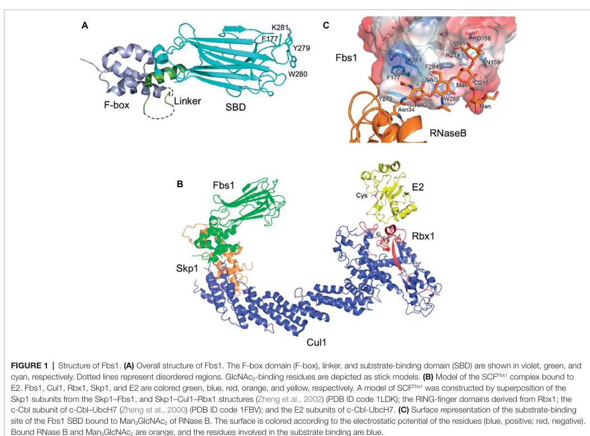

## Question

# Gene Research for Functional Annotation

## ⚠️ CRITICAL: Gene/Protein Identification Context

**BEFORE YOU BEGIN RESEARCH:** You MUST verify you are researching the CORRECT gene/protein. Gene symbols can be ambiguous, especially for less well-characterized genes from non-model organisms.

### Target Gene/Protein Identity (from UniProt):
- **UniProt Accession:** Q9UK22
- **Protein Description:** RecName: Full=F-box only protein 2;
- **Gene Information:** Name=FBXO2; Synonyms=FBX2;
- **Organism (full):** Homo sapiens (Human).
- **Protein Family:** Not specified in UniProt
- **Key Domains:** F-box-assoc_dom. (IPR007397); F-box-like_dom_sf. (IPR036047); F-box_dom. (IPR001810); F-box_only. (IPR039752); Galactose-bd-like_sf. (IPR008979)

### MANDATORY VERIFICATION STEPS:

1. **Check if the gene symbol "FBXO2" matches the protein description above**
2. **Verify the organism is correct:** Homo sapiens (Human).
3. **Check if protein family/domains align with what you find in literature**
4. **If you find literature for a DIFFERENT gene with the same or similar symbol, STOP**

### If Gene Symbol is Ambiguous or You Cannot Find Relevant Literature:

**DO NOT PROCEED WITH RESEARCH ON A DIFFERENT GENE.** Instead:
- State clearly: "The gene symbol 'FBXO2' is ambiguous or literature is limited for this specific protein"
- Explain what you found (e.g., "Found extensive literature on a different gene with the same symbol in a different organism")
- Describe the protein based ONLY on the UniProt information provided above
- Suggest that the protein function can be inferred from domain/family information

### Research Target:

Please provide a comprehensive research report on the gene **FBXO2** (gene ID: FBXO2, UniProt: Q9UK22) in human.

The research report should be a detailed narrative explaining the function, biological processes, and localization of the gene product. Citations should be given for all claims.

You should prioritize authoritative reviews and primary scientific literature when conducting research. You can supplement
this with annotations you find in gene/protein databases, but these can be outdated or inaccurate.

We are specifically interested in the primary function of the gene - for enzymes, what reaction is catalyzed, and what is the substrate specificity? For transporters, what is the substrate? For structural proteins or adapters, what is the broader structural role? For signaling molecules, what is the role in the pathway.

We are interested in where in or outside the cell the gene product carries out its function.

We are also interested in the signaling or biochemical pathways in which the gene functions. We are less interested in broad pleiotropic effects, except where these elucidate the precise role.

Include evidence where possible. We are interested in both experimental evidence as well as inference from structure, evolution, or bioinformatic analysis. Precise studies should be prioritized over high-throughput, where available.

## Output

Question: You are an expert researcher providing comprehensive, well-cited information.

Provide detailed information focusing on:
1. Key concepts and definitions with current understanding
2. Recent developments and latest research (prioritize 2023-2024 sources)
3. Current applications and real-world implementations
4. Expert opinions and analysis from authoritative sources
5. Relevant statistics and data from recent studies

Format as a comprehensive research report with proper citations. Include URLs and publication dates where available.
Always prioritize recent, authoritative sources and provide specific citations for all major claims.

# Gene Research for Functional Annotation

## ⚠️ CRITICAL: Gene/Protein Identification Context

**BEFORE YOU BEGIN RESEARCH:** You MUST verify you are researching the CORRECT gene/protein. Gene symbols can be ambiguous, especially for less well-characterized genes from non-model organisms.

### Target Gene/Protein Identity (from UniProt):
- **UniProt Accession:** Q9UK22
- **Protein Description:** RecName: Full=F-box only protein 2;
- **Gene Information:** Name=FBXO2; Synonyms=FBX2;
- **Organism (full):** Homo sapiens (Human).
- **Protein Family:** Not specified in UniProt
- **Key Domains:** F-box-assoc_dom. (IPR007397); F-box-like_dom_sf. (IPR036047); F-box_dom. (IPR001810); F-box_only. (IPR039752); Galactose-bd-like_sf. (IPR008979)

### MANDATORY VERIFICATION STEPS:

1. **Check if the gene symbol "FBXO2" matches the protein description above**
2. **Verify the organism is correct:** Homo sapiens (Human).
3. **Check if protein family/domains align with what you find in literature**
4. **If you find literature for a DIFFERENT gene with the same or similar symbol, STOP**

### If Gene Symbol is Ambiguous or You Cannot Find Relevant Literature:

**DO NOT PROCEED WITH RESEARCH ON A DIFFERENT GENE.** Instead:
- State clearly: "The gene symbol 'FBXO2' is ambiguous or literature is limited for this specific protein"
- Explain what you found (e.g., "Found extensive literature on a different gene with the same symbol in a different organism")
- Describe the protein based ONLY on the UniProt information provided above
- Suggest that the protein function can be inferred from domain/family information

### Research Target:

Please provide a comprehensive research report on the gene **FBXO2** (gene ID: FBXO2, UniProt: Q9UK22) in human.

The research report should be a detailed narrative explaining the function, biological processes, and localization of the gene product. Citations should be given for all claims.

You should prioritize authoritative reviews and primary scientific literature when conducting research. You can supplement
this with annotations you find in gene/protein databases, but these can be outdated or inaccurate.

We are specifically interested in the primary function of the gene - for enzymes, what reaction is catalyzed, and what is the substrate specificity? For transporters, what is the substrate? For structural proteins or adapters, what is the broader structural role? For signaling molecules, what is the role in the pathway.

We are interested in where in or outside the cell the gene product carries out its function.

We are also interested in the signaling or biochemical pathways in which the gene functions. We are less interested in broad pleiotropic effects, except where these elucidate the precise role.

Include evidence where possible. We are interested in both experimental evidence as well as inference from structure, evolution, or bioinformatic analysis. Precise studies should be prioritized over high-throughput, where available.

# Research report: Human **FBXO2** (UniProt **Q9UK22**) — functional annotation

## 0) Mandatory identity verification (correct gene/protein)

**Target identity**: The body of evidence retrieved is consistent with **human FBXO2** (also called **Fbs1** in the lectin-type F-box literature) being a **glycan-binding F-box protein** that functions as the substrate-recognition subunit of an **SCF (SKP1–CUL1–RBX1–F-box)** E3 ubiquitin ligase. This matches the UniProt-provided description “**F-box only protein 2**” for **Homo sapiens**, and aligns with UniProt-listed domains (F-box plus a C-terminal sugar-binding/galactose-binding–like fold) because the literature describes an **N-terminal F-box** (SKP1-binding) and a **C-terminal substrate-binding domain (SBD)** that binds the **innermost N-glycan core** (Man3GlcNAc2). (suzuki2021foldingandquality pages 15-16, yoshida2019sugarrecognizingubiquitinligases pages 2-4)

## 1) Key concepts and definitions (current understanding)

### 1.1 FBXO2 as an SCF E3 ligase “adaptor” (not an enzyme)
FBXO2 is best understood as a **substrate-recognition adaptor** that confers specificity to an SCF E3 ligase complex (SKP1–CUL1–RBX1–FBXO2). In this architecture, the **F-box** binds **SKP1**, which bridges to **CUL1/RBX1**, while FBXO2’s C-terminal region binds the substrate; ubiquitin transfer is executed by the RBX1-associated E2 enzyme. (suzuki2021foldingandquality pages 15-16, yoshida2018cytosolicnglycanstriggers pages 5-6)

### 1.2 “Sugar degron” recognition and glycan specificity
A central concept for FBXO2/Fbs1 is that it recognizes a **glycan-based degradation signal (“sugar degron”)**: it binds the **innermost N-glycan core** (described as **Man3GlcNAc2** / innermost GlcNAc2 moiety) using a **small hydrophobic pocket** in its SBD, with preference for **high-mannose N-glycans** and **denatured/misfolded glycoproteins** (where the core glycan becomes accessible). (yoshida2019sugarrecognizingubiquitinligases pages 2-4, yoshida2018cytosolicnglycanstriggers pages 5-6)

*Visual evidence*: Structural and schematic support for FBXO2/Fbs1 domain organization, SCF assembly, and Man3GlcNAc2 recognition pocket are shown in Yoshida et al. 2019 (Figures summarizing domain map/SCF model and glycan-binding pocket). (yoshida2019sugarrecognizingubiquitinligases media c9dd2277)

### 1.3 Relationship to ER protein quality control and ERAD
Although N-glycoproteins are produced in the ER/secretory pathway, lectin-type F-box proteins such as FBXO2 are described as operating in the **nucleocytoplasmic compartment**, where they can recognize **retrotranslocated ER glycoproteins** and promote their ubiquitination as part of **ER-associated degradation (ERAD)** and broader proteostasis mechanisms. (yoshida2019sugarrecognizingubiquitinligases pages 2-4, yoshida2019sugarrecognizingubiquitinligases pages 4-5)

## 2) Molecular function, pathways, and cellular localization

### 2.1 Mechanistic role in glycoprotein quality control (ERAD substrates)
Authoritative reviews describe SCF(Fbs1/FBXO2) and SCF(Fbs2) as binding the innermost N-glycan core and acting on **ERAD substrates**. Examples of glycoprotein targets/processes cited in the mechanistic literature include **integrin β1, TCRα, asialoglycoprotein receptor H2a**, and **CFTRΔF508** as glycoproteins in the orbit of Fbs1/Fbs2-mediated quality control. (yoshida2019sugarrecognizingubiquitinligases pages 4-5)

### 2.2 Neuronal proteostasis and the APP/BACE1 axis (Alzheimer’s-relevant)
Reviews summarizing primary work report that FBXO2/Fbs1 can modulate the amyloid pathway by promoting degradation of **BACE1** (β-secretase) and by regulating **APP** levels/processing; FBXO2 is described as neuron/brain enriched in these accounts. (suzuki2021foldingandquality pages 15-16, yoshida2019sugarrecognizingubiquitinligases pages 5-6)

A **2024 preprint** further leverages this biology to build a *human iPSC-derived cortical neuron* model in which **early downregulation of FBXO2** is reported to lead to **Aβ aggregation, tau hyperphosphorylation, and neuronal network impairment**, positioning FBXO2 reduction as a potential driver of sporadic AD-like phenotypes in vitro (note: preprint, not yet peer reviewed). URL and date: bioRxiv (Sep 2024) https://doi.org/10.1101/2024.09.01.610673. (xue2024skp2mediatedfbxo2proteasomal pages 1-5)

### 2.3 Lysosome quality control/lysophagy in CNS (Niemann–Pick C context)
A peer-reviewed primary study (JCI Insight, Oct 2020; https://doi.org/10.1172/jci.insight.136676) reports that Fbxo2 functions as part of an SCF complex and **mediates clearance of damaged lysosomes** in CNS contexts. Loss of Fbxo2 **delayed clearance of damaged lysosomes** and reduced viability after lysosomal damage in mouse primary cortical cultures; in an NPC disease model, Fbxo2 deficiency **exacerbated neurodegeneration and reduced survival**. (liu2020fbxo2mediatesclearance pages 1-2)

### 2.4 Subcellular localization
Direct localization evidence in human cancer cells is available from a 2024 study in papillary thyroid carcinoma (PTC), where immunofluorescence localized FBXO2 **mainly to the cytoplasm** of PTC cells. (Scientific Reports, Sep 2024; https://doi.org/10.1038/s41598-024-73455-z). (guo2024fbxo2promotesthe pages 3-5)

## 3) Recent developments and latest research (prioritizing 2023–2024)

### 3.1 Glioblastoma recurrence and tumor–microenvironment interactions (2023)
A Neuro-Oncology study (Jul 2023; https://doi.org/10.1093/neuonc/noac169) used SWATH-MS proteomics across paired primary and recurrent glioblastomas and identified **FBXO2 as consistently upregulated at recurrence**, validated by immunohistochemistry. Functionally, **FBXO2 knockout** in human glioma cells conferred a **survival benefit** in orthotopic xenograft mouse models and reduced invasive growth in organotypic brain slice cultures, consistent with a protumorigenic role in this context. FBXO2 expression was reported enriched in the **tumor infiltration zone**, and FBXO2-positive cancer cells associated with synaptic signaling programs. (buehler2023quantitativeproteomiclandscapes pages 1-2)

### 3.2 Papillary thyroid carcinoma: FBXO2 targets p53 for degradation (2024, peer reviewed)
A Scientific Reports paper (Sep 2024; https://doi.org/10.1038/s41598-024-73455-z) reports that FBXO2 is overexpressed in PTC and that FBXO2 **binds p53** and promotes **p53 ubiquitination and degradation**. Experimentally, the study used co-immunoprecipitation/GST pulldown and ubiquitination assays (MG132-treated cells; p53 IP; ubiquitin detection) and showed that FBXO2 knockdown reduced proliferation and increased apoptosis, with xenograft tumor growth suppressed upon FBXO2 targeting. Clinically, FBXO2 expression correlated with tumor size and metastatic/invasive features (as reported by the authors). (guo2024fbxo2promotesthe pages 7-8, guo2024fbxo2promotesthe pages 2-3)

### 3.3 Hepatocellular carcinoma: SKP2–FBXO2–Hsp47 axis (2024, preprint)
A bioRxiv preprint (Mar 2024; https://doi.org/10.1101/2024.03.28.586926) proposes FBXO2 acts as a **tumor suppressor** in HCC by binding and promoting ubiquitination/proteasomal degradation of **Hsp47/SERPINH1**. A key quantitative datapoint reported is that FBXO2 protein was frequently downregulated in HCC tissues by IHC: **149/258 tumors** classified as low FBXO2 (P<0.001). The authors also describe a regulatory mechanism in which DNA-PKcs-mediated phosphorylation at **S17** enables **SKP2-mediated ubiquitination** (at **K79**) and proteasomal degradation of FBXO2. (xue2024skp2mediatedfbxo2proteasomal pages 5-8, xue2024skp2mediatedfbxo2proteasomal pages 11-14)

### 3.4 High-grade serous ovarian cancer (HGSOC): chemoresistance biomarker and functional support (2024)
A Heliyon study (Apr 2024; https://doi.org/10.1016/j.heliyon.2024.e28490) integrated scRNA-seq and bulk RNA-seq and identified **FBXO2** as a candidate biomarker associated with **chemoresistance**. The authors describe FBXO2 as an ER-associated F-box component implicated in protein processing in the ER, report higher FBXO2 expression in malignant epithelial cells, and present functional evidence that **silencing FBXO2 lowered cisplatin IC50** in A2780 and SKOV3 ovarian cancer cell lines. The study further reports that high FBXO2 associates with worse overall and disease-free survival in their computational analyses. (lai2024integratedanalysisof pages 10-11)

## 4) Current applications and real-world implementations

### 4.1 Biomarker and prognostic use cases
Recent studies position FBXO2 as a potential **biomarker** or **stratification variable** in multiple cancers:
- **Glioblastoma**: FBXO2 abundance increases at recurrence and correlates with infiltrative-zone programs; FBXO2 genetic loss reduces tumor aggressiveness in models, making it a candidate dependency/biomarker for recurrence biology. (buehler2023quantitativeproteomiclandscapes pages 1-2)
- **HGSOC**: FBXO2 is proposed as a biomarker for chemoresistance and prognosis, with supporting in vitro cisplatin-sensitization upon knockdown. (lai2024integratedanalysisof pages 10-11)
- **PTC**: FBXO2 expression correlates with aggressive clinicopathologic features and mechanistically impacts p53 stability, suggesting diagnostic/prognostic relevance. (guo2024fbxo2promotesthe pages 7-8)

### 4.2 Therapeutic implications (expert analysis)
From an E3-ligase biology perspective, FBXO2 is not a catalytic enzyme but a **specificity factor**; thus, interventions could conceptually target (i) its **substrate-binding interface** (glycan pocket / substrate docking), (ii) its **SCF assembly** (F-box–SKP1 interaction), or (iii) upstream regulatory nodes that tune FBXO2 abundance (e.g., the SKP2 axis proposed in HCC). The 2019 mechanistic synthesis emphasizes that identifying physiological substrates and complex components is essential for understanding pathophysiological roles—an argument that remains salient given context-dependent oncogenic vs tumor-suppressive roles across cancers. (yoshida2019sugarrecognizingubiquitinligases pages 5-6, xue2024skp2mediatedfbxo2proteasomal pages 11-14)

## 5) Expert opinions and authoritative synthesis

Mechanistic reviews by Yoshida/Tanaka and colleagues provide a coherent expert framework: **cytosolic exposure of N-glycans** (from ER retrotranslocation or membrane damage) is interpreted as a signal of unwanted proteins/organelles, and lectin-type SCF complexes (including SCF(Fbs1/FBXO2)) translate this signal into ubiquitination and degradation (proteasome and, in related paralogs, autophagy). These reviews highlight structural determinants of glycan recognition and caution that detailed physiological substrate mapping is still needed to understand tissue- and disease-specific outcomes. (yoshida2019sugarrecognizingubiquitinligases pages 2-4, yoshida2018cytosolicnglycanstriggers pages 5-6)

## 6) Summary of substrates/processes and evidence strength

A concise cross-study summary is provided in the table below.

| FBXO2/Fbs1 role | Key substrate(s) / process | Main evidence type | Recent source(s) (2023–2024) | Foundational source(s) | Year(s) | DOI / URL | Citation |
|---|---|---|---|---|---|---|---|
| SCF-type F-box substrate receptor for glycoprotein quality control; binds innermost **Man3GlcNAc2** N-glycan core via substrate-binding domain after SKP1 association through the F-box domain | Recognition of misfolded/high-mannose glycoproteins in ERAD; broad lectin-like glycan sensing rather than classical enzyme catalysis | Structural biology, SCF complex modeling, glycan-binding biochemistry, review synthesis | — | Yoshida et al., *Front Physiol* (2019); Suzuki & Fujihira, *Comprehensive Glycoscience* (2021) | 2019, 2021 | https://doi.org/10.3389/fphys.2019.00104 ; https://doi.org/10.1016/B978-0-12-409547-2.14947-9 | (yoshida2019sugarrecognizingubiquitinligases pages 2-4, suzuki2021foldingandquality pages 15-16, yoshida2019sugarrecognizingubiquitinligases media c9dd2277) |
| Glycan-directed ER-associated degradation adaptor in the cytosol/nucleocytoplasm | ERAD substrates cited for Fbs1/Fbs2 pathway include **CFTRΔF508, TCRα, integrin β1, asialoglycoprotein receptor H2a** | Review of primary ERAD studies; substrate lists from prior cell-based and biochemical work | HGSOC biomarker study links FBXO2 to ER protein processing and chemoresistance-related ER pathways | Yoshida et al., *Front Physiol* (2019); Yoshida & Tanaka, *BioEssays* (2018) | 2018, 2019, 2024 | https://doi.org/10.3389/fphys.2019.00104 ; https://doi.org/10.1002/bies.201700215 ; https://doi.org/10.1016/j.heliyon.2024.e28490 | (yoshida2019sugarrecognizingubiquitinligases pages 4-5, yoshida2018cytosolicnglycanstriggers pages 5-6, lai2024integratedanalysisof pages 10-11) |
| Neuron-enriched SCF adaptor regulating APP pathway glycoproteins | **APP** is a reported FBXO2 substrate; FBXO2 also reduces **BACE1** levels, lowering amyloidogenic processing | In vitro/in vivo substrate studies, knockout mouse/neuron experiments, disease-focused reviews | 2024 preprint: FBXO2 downregulation in human iPSC-derived neurons induces Aβ aggregation and tau hyperphosphorylation | Atkin et al., *J Biol Chem* (2014); Suzuki & Fujihira (2021); Yoshida et al. (2019) | 2014, 2019, 2021, 2024 | https://doi.org/10.1074/jbc.M113.515056 ; https://doi.org/10.3389/fphys.2019.00104 ; https://doi.org/10.1016/B978-0-12-409547-2.14947-9 ; https://doi.org/10.1101/2024.09.01.610673 | (suzuki2021foldingandquality pages 15-16, yoshida2019sugarrecognizingubiquitinligases pages 4-5, yoshida2019sugarrecognizingubiquitinligases pages 5-6) |
| Metabolic regulator when induced in liver; still acting through ubiquitin-ligase substrate recognition rather than catalysis | **Insulin receptor** ubiquitination reported in obese liver context, disrupting glucose homeostasis | Review synthesis of prior mechanistic studies | — | Yoshida & Tanaka, *BioEssays* (2018) | 2018 | https://doi.org/10.1002/bies.201700215 | (yoshida2018cytosolicnglycanstriggers pages 5-6) |
| CNS lysosomal quality-control factor; glycan-binding F-box protein in an SCF complex | **Damaged lysosome clearance / lysophagy** in CNS; loss delays damaged lysosome clearance and reduces viability after lysosomal injury | Mouse primary cortical culture assays, NPC human fibroblast sensitivity assays, knockout disease model | — | Liu et al., *JCI Insight* (2020) | 2020 | https://doi.org/10.1172/jci.insight.136676 | (liu2020fbxo2mediatesclearance pages 1-2) |
| Recurrent glioblastoma-associated FBXO2 program, likely via tumor–microenvironment interactions | Increased FBXO2 abundance in recurrent glioblastoma; enriched in tumor infiltration zone; associated with synaptic signaling processes | SWATH-MS proteomics, immunohistochemistry, CRISPR/KO, orthotopic xenografts, organotypic brain slices | Buehler et al., *Neuro-Oncology* (2023) | — | 2023 | https://doi.org/10.1093/neuonc/noac169 | (buehler2023quantitativeproteomiclandscapes pages 1-2) |
| Oncogenic FBXO2 in papillary thyroid carcinoma acting through ubiquitin-mediated substrate turnover | **p53** direct binding, ubiquitination, and degradation; FBXO2 overexpression correlates with tumor size, lymph-node metastasis, and invasion; mainly cytoplasmic localization in PTC cells | Co-IP, GST pulldown, in vivo ubiquitination assay, IF/IHC, xenografts, proliferation/apoptosis assays | Guo et al., *Scientific Reports* (2024) | — | 2024 | https://doi.org/10.1038/s41598-024-73455-z | (guo2024fbxo2promotesthe pages 7-8, guo2024fbxo2promotesthe pages 2-3, guo2024fbxo2promotesthe pages 3-5) |
| Tumor-suppressive FBXO2 in hepatocellular carcinoma through degradation of a pro-fibrotic chaperone | **Hsp47/SERPINH1** ubiquitination and proteasomal degradation; FBXO2 protein low in **149/258** HCCs; low FBXO2 associated with advanced stage and worse median survival | Human tumor IHC, ubiquitination and half-life studies, phospho-regulation analysis, hepatocyte-specific knockout mice, metastasis assays | Xue et al., bioRxiv (2024) | — | 2024 | https://doi.org/10.1101/2024.03.28.586926 | (xue2024skp2mediatedfbxo2proteasomal pages 5-8, xue2024skp2mediatedfbxo2proteasomal pages 1-5, xue2024skp2mediatedfbxo2proteasomal pages 11-14) |
| Candidate biomarker/therapeutic target in ovarian chemoresistance with ER-processing links | High FBXO2 associated with worse OS/DFS; FBXO2 knockdown lowers cisplatin IC50 in A2780 and SKOV3 cells | scRNA-seq + bulk RNA-seq integration, survival analysis, cisplatin-response assays, knockdown | Lai et al., *Heliyon* (2024) | — | 2024 | https://doi.org/10.1016/j.heliyon.2024.e28490 | (lai2024integratedanalysisof pages 10-11) |

*Table: This table summarizes the best-supported molecular roles, substrates/processes, and evidence types for human FBXO2/Fbs1, contrasting recent 2023–2024 disease studies with foundational mechanistic literature on SCF assembly and glycan recognition.*

## 7) Disease/target association landscape (database evidence)

Open Targets lists disease associations for **FBXO2** including hepatocellular carcinoma, papillary thyroid carcinoma, hearing loss/deafness, and neurodegenerative disease, with underlying evidence including recent literature links (via PubMed IDs) and functional genomics screens. This supports that FBXO2 is repeatedly implicated across cancer and neurological phenotypes, though the mechanistic directionality is context dependent. (OpenTargets Search: -FBXO2)

## References (URLs and publication dates)

- Yoshida Y, Mizushima T, Tanaka K. *Sugar-recognizing ubiquitin ligases: action mechanisms and physiology.* Frontiers in Physiology. **Feb 2019**. https://doi.org/10.3389/fphys.2019.00104 (yoshida2019sugarrecognizingubiquitinligases pages 2-4)
- Yoshida Y, Tanaka K. *Cytosolic N-Glycans: Triggers for Ubiquitination…* BioEssays. **Feb 2018**. https://doi.org/10.1002/bies.201700215 (yoshida2018cytosolicnglycanstriggers pages 5-6)
- Liu EA et al. *Fbxo2 mediates clearance of damaged lysosomes…* JCI Insight. **Oct 2020**. https://doi.org/10.1172/jci.insight.136676 (liu2020fbxo2mediatesclearance pages 1-2)
- Buehler M et al. *Quantitative proteomic landscapes of primary and recurrent glioblastoma…* Neuro-Oncology. **Jul 2023**. https://doi.org/10.1093/neuonc/noac169 (buehler2023quantitativeproteomiclandscapes pages 1-2)
- Guo W et al. *FBXO2 promotes the progression of papillary thyroid carcinoma through the p53 pathway.* Scientific Reports. **Sep 2024**. https://doi.org/10.1038/s41598-024-73455-z (guo2024fbxo2promotesthe pages 7-8)
- Lai W et al. *Integrated analysis… identifies FBXO2 as a candidate biomarker associated with chemoresistance in HGSOC.* Heliyon. **Apr 2024**. https://doi.org/10.1016/j.heliyon.2024.e28490 (lai2024integratedanalysisof pages 10-11)
- Xue C et al. *SKP2-mediated FBXO2 proteasomal degradation drives HCC progression via stabilizing Hsp47.* bioRxiv. **Mar 2024** (preprint). https://doi.org/10.1101/2024.03.28.586926 (xue2024skp2mediatedfbxo2proteasomal pages 5-8)

*Note on evidence quality*: Two key 2024 items are preprints (bioRxiv) and should be interpreted as provisional until peer-reviewed; core mechanistic aspects of FBXO2 glycan recognition and SCF adaptor function are supported by peer-reviewed reviews and established structural work summarized therein. (yoshida2019sugarrecognizingubiquitinligases pages 2-4, yoshida2018cytosolicnglycanstriggers pages 5-6)

References

1. (suzuki2021foldingandquality pages 15-16): Tadashi Suzuki and Haruhiko Fujihira. Folding and quality control of glycoproteins. Comprehensive Glycoscience, pages 1-28, Dec 2021. URL: https://doi.org/10.1016/b978-0-12-409547-2.14947-9, doi:10.1016/b978-0-12-409547-2.14947-9. This article has 12 citations.

2. (yoshida2019sugarrecognizingubiquitinligases pages 2-4): Yukiko Yoshida, Tsunehiro Mizushima, and Keiji Tanaka. Sugar-recognizing ubiquitin ligases: action mechanisms and physiology. Frontiers in Physiology, Feb 2019. URL: https://doi.org/10.3389/fphys.2019.00104, doi:10.3389/fphys.2019.00104. This article has 31 citations.

3. (yoshida2018cytosolicnglycanstriggers pages 5-6): Yukiko Yoshida and Keiji Tanaka. Cytosolic n-glycans: triggers for ubiquitination directing proteasomal and autophagic degradation: molecular systems for monitoring cytosolic n-glycans as signals for unwanted proteins and organelles. BioEssays : news and reviews in molecular, cellular and developmental biology, Feb 2018. URL: https://doi.org/10.1002/bies.201700215, doi:10.1002/bies.201700215. This article has 19 citations.

4. (yoshida2019sugarrecognizingubiquitinligases media c9dd2277): Yukiko Yoshida, Tsunehiro Mizushima, and Keiji Tanaka. Sugar-recognizing ubiquitin ligases: action mechanisms and physiology. Frontiers in Physiology, Feb 2019. URL: https://doi.org/10.3389/fphys.2019.00104, doi:10.3389/fphys.2019.00104. This article has 31 citations.

5. (yoshida2019sugarrecognizingubiquitinligases pages 4-5): Yukiko Yoshida, Tsunehiro Mizushima, and Keiji Tanaka. Sugar-recognizing ubiquitin ligases: action mechanisms and physiology. Frontiers in Physiology, Feb 2019. URL: https://doi.org/10.3389/fphys.2019.00104, doi:10.3389/fphys.2019.00104. This article has 31 citations.

6. (yoshida2019sugarrecognizingubiquitinligases pages 5-6): Yukiko Yoshida, Tsunehiro Mizushima, and Keiji Tanaka. Sugar-recognizing ubiquitin ligases: action mechanisms and physiology. Frontiers in Physiology, Feb 2019. URL: https://doi.org/10.3389/fphys.2019.00104, doi:10.3389/fphys.2019.00104. This article has 31 citations.

7. (xue2024skp2mediatedfbxo2proteasomal pages 1-5): Cailin Xue, Fei Yang, Guojian Bao, Jiawu Yan, Rao Fu, Minglu Zhang, Jialu Ding, Jiale Feng, Jianbo Han, Xihu Qin, Hua Su, and Beicheng Sun. Skp2-mediated fbxo2 proteasomal degradation drives hepatocellular carcinoma progression via stabilizing hsp47. bioRxiv, Mar 2024. URL: https://doi.org/10.1101/2024.03.28.586926, doi:10.1101/2024.03.28.586926. This article has 0 citations.

8. (liu2020fbxo2mediatesclearance pages 1-2): Elaine A. Liu, Mark L. Schultz, Chisaki Mochida, Chan Chung, Henry L. Paulson, and Andrew P. Lieberman. Fbxo2 mediates clearance of damaged lysosomes and modifies neurodegeneration in the niemann-pick c brain. JCI Insight, Oct 2020. URL: https://doi.org/10.1172/jci.insight.136676, doi:10.1172/jci.insight.136676. This article has 53 citations and is from a domain leading peer-reviewed journal.

9. (guo2024fbxo2promotesthe pages 3-5): Wenke Guo, Yaoqiang Ren, and Xinguang Qiu. Fbxo2 promotes the progression of papillary thyroid carcinoma through the p53 pathway. Scientific Reports, Sep 2024. URL: https://doi.org/10.1038/s41598-024-73455-z, doi:10.1038/s41598-024-73455-z. This article has 9 citations and is from a peer-reviewed journal.

10. (buehler2023quantitativeproteomiclandscapes pages 1-2): Marcel Buehler, Xiao Yi, Weigang Ge, Peter Blattmann, Elisabeth Rushing, Guido Reifenberger, Joerg Felsberg, Charles Yeh, Jacob E Corn, Luca Regli, Junyi Zhang, Ann Cloos, Vidhya M Ravi, Benedikt Wiestler, Dieter Henrik Heiland, Ruedi Aebersold, Michael Weller, Tiannan Guo, and Tobias Weiss. Quantitative proteomic landscapes of primary and recurrent glioblastoma reveal a protumorigeneic role for fbxo2-dependent glioma-microenvironment interactions. Neuro-oncology, 25:290-302, Jul 2023. URL: https://doi.org/10.1093/neuonc/noac169, doi:10.1093/neuonc/noac169. This article has 32 citations and is from a domain leading peer-reviewed journal.

11. (guo2024fbxo2promotesthe pages 7-8): Wenke Guo, Yaoqiang Ren, and Xinguang Qiu. Fbxo2 promotes the progression of papillary thyroid carcinoma through the p53 pathway. Scientific Reports, Sep 2024. URL: https://doi.org/10.1038/s41598-024-73455-z, doi:10.1038/s41598-024-73455-z. This article has 9 citations and is from a peer-reviewed journal.

12. (guo2024fbxo2promotesthe pages 2-3): Wenke Guo, Yaoqiang Ren, and Xinguang Qiu. Fbxo2 promotes the progression of papillary thyroid carcinoma through the p53 pathway. Scientific Reports, Sep 2024. URL: https://doi.org/10.1038/s41598-024-73455-z, doi:10.1038/s41598-024-73455-z. This article has 9 citations and is from a peer-reviewed journal.

13. (xue2024skp2mediatedfbxo2proteasomal pages 5-8): Cailin Xue, Fei Yang, Guojian Bao, Jiawu Yan, Rao Fu, Minglu Zhang, Jialu Ding, Jiale Feng, Jianbo Han, Xihu Qin, Hua Su, and Beicheng Sun. Skp2-mediated fbxo2 proteasomal degradation drives hepatocellular carcinoma progression via stabilizing hsp47. bioRxiv, Mar 2024. URL: https://doi.org/10.1101/2024.03.28.586926, doi:10.1101/2024.03.28.586926. This article has 0 citations.

14. (xue2024skp2mediatedfbxo2proteasomal pages 11-14): Cailin Xue, Fei Yang, Guojian Bao, Jiawu Yan, Rao Fu, Minglu Zhang, Jialu Ding, Jiale Feng, Jianbo Han, Xihu Qin, Hua Su, and Beicheng Sun. Skp2-mediated fbxo2 proteasomal degradation drives hepatocellular carcinoma progression via stabilizing hsp47. bioRxiv, Mar 2024. URL: https://doi.org/10.1101/2024.03.28.586926, doi:10.1101/2024.03.28.586926. This article has 0 citations.

15. (lai2024integratedanalysisof pages 10-11): Wenwen Lai, Ruixiang Xie, Chen Chen, Weiming Lou, Haiyan Yang, Libin Deng, Quqin Lu, and Xiaoli Tang. Integrated analysis of scrna-seq and bulk rna-seq identifies fbxo2 as a candidate biomarker associated with chemoresistance in hgsoc. Apr 2024. URL: https://doi.org/10.1016/j.heliyon.2024.e28490, doi:10.1016/j.heliyon.2024.e28490. This article has 8 citations.

16. (OpenTargets Search: -FBXO2): Open Targets Query (-FBXO2, 35 results). Buniello, A. et al. (2025). Open Targets Platform: facilitating therapeutic hypotheses building in drug discovery. Nucleic Acids Research.

## Artifacts

- [Edison artifact artifact-00](FBXO2-deep-research-falcon_artifacts/artifact-00.md)

## Citations

1. yoshida2019sugarrecognizingubiquitinligases pages 4-5
2. buehler2023quantitativeproteomiclandscapes pages 1-2
3. lai2024integratedanalysisof pages 10-11
4. yoshida2018cytosolicnglycanstriggers pages 5-6
5. yoshida2019sugarrecognizingubiquitinligases pages 2-4
6. suzuki2021foldingandquality pages 15-16
7. yoshida2019sugarrecognizingubiquitinligases pages 5-6
8. https://doi.org/10.1101/2024.09.01.610673.
9. https://doi.org/10.1172/jci.insight.136676
10. https://doi.org/10.1038/s41598-024-73455-z
11. https://doi.org/10.1093/neuonc/noac169
12. https://doi.org/10.1101/2024.03.28.586926
13. https://doi.org/10.1016/j.heliyon.2024.e28490
14. https://doi.org/10.3389/fphys.2019.00104
15. https://doi.org/10.1016/B978-0-12-409547-2.14947-9
16. https://doi.org/10.1002/bies.201700215
17. https://doi.org/10.1074/jbc.M113.515056
18. https://doi.org/10.1101/2024.09.01.610673
19. https://doi.org/10.1016/b978-0-12-409547-2.14947-9,
20. https://doi.org/10.3389/fphys.2019.00104,
21. https://doi.org/10.1002/bies.201700215,
22. https://doi.org/10.1101/2024.03.28.586926,
23. https://doi.org/10.1172/jci.insight.136676,
24. https://doi.org/10.1038/s41598-024-73455-z,
25. https://doi.org/10.1093/neuonc/noac169,
26. https://doi.org/10.1016/j.heliyon.2024.e28490,