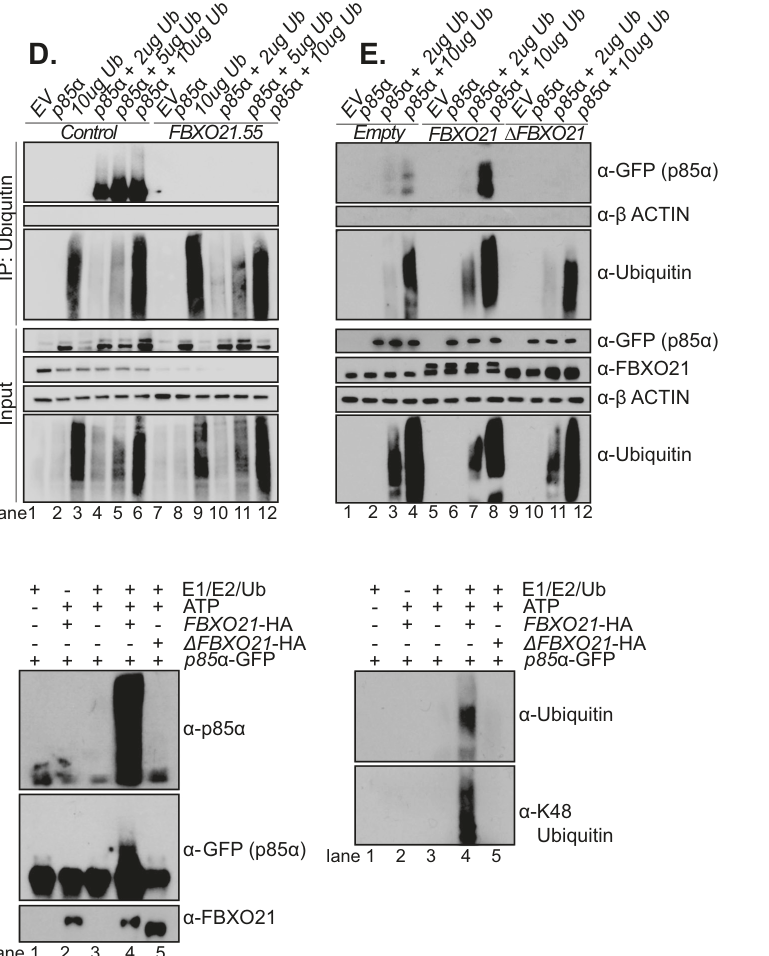

## Question

# Gene Research for Functional Annotation

## ⚠️ CRITICAL: Gene/Protein Identification Context

**BEFORE YOU BEGIN RESEARCH:** You MUST verify you are researching the CORRECT gene/protein. Gene symbols can be ambiguous, especially for less well-characterized genes from non-model organisms.

### Target Gene/Protein Identity (from UniProt):
- **UniProt Accession:** O94952
- **Protein Description:** RecName: Full=F-box only protein 21;
- **Gene Information:** Name=FBXO21; Synonyms=FBX21, KIAA0875;
- **Organism (full):** Homo sapiens (Human).
- **Protein Family:** Not specified in UniProt
- **Key Domains:** F-box-like_dom_sf. (IPR036047); F-box_dom. (IPR001810); Hemimethylated_DNA-bd_dom. (IPR011722); Hemimethylated_DNA-bd_sf. (IPR036623); SirB1_N. (IPR032698)

### MANDATORY VERIFICATION STEPS:

1. **Check if the gene symbol "FBXO21" matches the protein description above**
2. **Verify the organism is correct:** Homo sapiens (Human).
3. **Check if protein family/domains align with what you find in literature**
4. **If you find literature for a DIFFERENT gene with the same or similar symbol, STOP**

### If Gene Symbol is Ambiguous or You Cannot Find Relevant Literature:

**DO NOT PROCEED WITH RESEARCH ON A DIFFERENT GENE.** Instead:
- State clearly: "The gene symbol 'FBXO21' is ambiguous or literature is limited for this specific protein"
- Explain what you found (e.g., "Found extensive literature on a different gene with the same symbol in a different organism")
- Describe the protein based ONLY on the UniProt information provided above
- Suggest that the protein function can be inferred from domain/family information

### Research Target:

Please provide a comprehensive research report on the gene **FBXO21** (gene ID: FBXO21, UniProt: O94952) in human.

The research report should be a detailed narrative explaining the function, biological processes, and localization of the gene product. Citations should be given for all claims.

You should prioritize authoritative reviews and primary scientific literature when conducting research. You can supplement
this with annotations you find in gene/protein databases, but these can be outdated or inaccurate.

We are specifically interested in the primary function of the gene - for enzymes, what reaction is catalyzed, and what is the substrate specificity? For transporters, what is the substrate? For structural proteins or adapters, what is the broader structural role? For signaling molecules, what is the role in the pathway.

We are interested in where in or outside the cell the gene product carries out its function.

We are also interested in the signaling or biochemical pathways in which the gene functions. We are less interested in broad pleiotropic effects, except where these elucidate the precise role.

Include evidence where possible. We are interested in both experimental evidence as well as inference from structure, evolution, or bioinformatic analysis. Precise studies should be prioritized over high-throughput, where available.

## Output

Question: You are an expert researcher providing comprehensive, well-cited information.

Provide detailed information focusing on:
1. Key concepts and definitions with current understanding
2. Recent developments and latest research (prioritize 2023-2024 sources)
3. Current applications and real-world implementations
4. Expert opinions and analysis from authoritative sources
5. Relevant statistics and data from recent studies

Format as a comprehensive research report with proper citations. Include URLs and publication dates where available.
Always prioritize recent, authoritative sources and provide specific citations for all major claims.

# Gene Research for Functional Annotation

## ⚠️ CRITICAL: Gene/Protein Identification Context

**BEFORE YOU BEGIN RESEARCH:** You MUST verify you are researching the CORRECT gene/protein. Gene symbols can be ambiguous, especially for less well-characterized genes from non-model organisms.

### Target Gene/Protein Identity (from UniProt):
- **UniProt Accession:** O94952
- **Protein Description:** RecName: Full=F-box only protein 21;
- **Gene Information:** Name=FBXO21; Synonyms=FBX21, KIAA0875;
- **Organism (full):** Homo sapiens (Human).
- **Protein Family:** Not specified in UniProt
- **Key Domains:** F-box-like_dom_sf. (IPR036047); F-box_dom. (IPR001810); Hemimethylated_DNA-bd_dom. (IPR011722); Hemimethylated_DNA-bd_sf. (IPR036623); SirB1_N. (IPR032698)

### MANDATORY VERIFICATION STEPS:

1. **Check if the gene symbol "FBXO21" matches the protein description above**
2. **Verify the organism is correct:** Homo sapiens (Human).
3. **Check if protein family/domains align with what you find in literature**
4. **If you find literature for a DIFFERENT gene with the same or similar symbol, STOP**

### If Gene Symbol is Ambiguous or You Cannot Find Relevant Literature:

**DO NOT PROCEED WITH RESEARCH ON A DIFFERENT GENE.** Instead:
- State clearly: "The gene symbol 'FBXO21' is ambiguous or literature is limited for this specific protein"
- Explain what you found (e.g., "Found extensive literature on a different gene with the same symbol in a different organism")
- Describe the protein based ONLY on the UniProt information provided above
- Suggest that the protein function can be inferred from domain/family information

### Research Target:

Please provide a comprehensive research report on the gene **FBXO21** (gene ID: FBXO21, UniProt: O94952) in human.

The research report should be a detailed narrative explaining the function, biological processes, and localization of the gene product. Citations should be given for all claims.

You should prioritize authoritative reviews and primary scientific literature when conducting research. You can supplement
this with annotations you find in gene/protein databases, but these can be outdated or inaccurate.

We are specifically interested in the primary function of the gene - for enzymes, what reaction is catalyzed, and what is the substrate specificity? For transporters, what is the substrate? For structural proteins or adapters, what is the broader structural role? For signaling molecules, what is the role in the pathway.

We are interested in where in or outside the cell the gene product carries out its function.

We are also interested in the signaling or biochemical pathways in which the gene functions. We are less interested in broad pleiotropic effects, except where these elucidate the precise role.

Include evidence where possible. We are interested in both experimental evidence as well as inference from structure, evolution, or bioinformatic analysis. Precise studies should be prioritized over high-throughput, where available.

# Research Report: FBXO21 (UniProt O94952) — Functional Annotation (Homo sapiens)

## 0) Target verification (gene/protein identity)
The research target is **human FBXO21** (UniProt **O94952**; gene **FBXO21**, synonyms **FBX21**, **KIAA0875**), an **F-box only** protein that functions as a substrate-recognition subunit of an **SCF (SKP1–CUL1–RBX1) Cullin-RING E3 ubiquitin ligase** complex. This identity is consistent across primary literature describing **SCF^FBXO21** and its validated substrates (EID1, ASK1, p85α/PIK3R1, and ABCB1/P-gp). (watanabe2015fbxo21mediatesthe pages 2-3, watanabe2015fbxo21mediatesthe pages 1-2, yu2016lys29linkageofask1 pages 7-9, zhang2015peptidicdegronin pages 1-2, dobish2023fbxo21mediateddegradation pages 8-9)

## 1) Key concepts and current understanding

### 1.1 FBXO21 as an SCF E3 ligase substrate receptor
**F-box proteins** are best understood as **substrate receptors** for SCF E3 ligases: they bind SKP1 through the F-box and recruit specific substrates via other domains/regions, enabling the CUL1–RBX1 catalytic module to build ubiquitin chains on the substrate. For FBXO21, co-precipitation of **SKP1 and CUL1** with FBXO21 supports its role as an SCF substrate receptor. (watanabe2015fbxo21mediatesthe pages 2-3, yu2016lys29linkageofask1 pages 7-9)

### 1.2 Two mechanistic “modes” of FBXO21-driven ubiquitination
FBXO21 is notable because its experimentally validated biology spans both:

1) **Proteolytic ubiquitination → proteasomal degradation** (canonical SCF function), as shown for **EID1**, **p85α (PIK3R1)**, and **ABCB1/P-gp**. (watanabe2015fbxo21mediatesthe pages 1-2, dobish2023fbxo21mediateddegradation pages 8-9, ravindranath2015cd44promotesmultidrug pages 7-9)

2) **Non-proteolytic ubiquitination → signaling activation**, as shown for **ASK1**, where FBXO21 catalyzes **Lys29-linked** ubiquitination that promotes ASK1 phosphorylation/activation rather than substrate destruction. (yu2016lys29linkageofask1 pages 14-15, yu2016lys29linkageofask1 pages 7-9)

This duality is important for functional annotation: FBXO21 is not only a “degrader” but can also operate as a signaling regulator through atypical ubiquitin linkages. (yu2016lys29linkageofask1 pages 14-15)

## 2) Experimentally supported molecular functions, substrates, and pathways

### 2.1 EID1 is a direct proteolytic substrate of SCF^FBXO21 (2015)
Two independent 2015 studies establish **EID1 (EP300-interacting inhibitor of differentiation 1)** as a direct FBXO21 substrate.

* **Substrate identification and validation.** Watanabe et al. used differential binding proteomics (DiPIUS) comparing WT FBXO21 to a binding mutant to identify candidate substrates, then validated an FBXO21–EID1 interaction and concluded **SCF^FBXO21 ubiquitylates EID1**, promoting proteasomal degradation. (Publication date: Aug 2015; https://doi.org/10.1111/gtc.12260) (watanabe2015fbxo21mediatesthe pages 2-3, watanabe2015fbxo21mediatesthe pages 1-2)

* **Degron concept and biological context.** Zhang et al. mapped a **peptidic modular degron** in EID1 that is necessary and sufficient for **SCF^FBXO21-dependent polyubiquitylation and proteasomal degradation** in vitro and in vivo. (Publication date: Dec 2015; https://doi.org/10.1073/pnas.1522006112) (zhang2015peptidicdegronin pages 1-2)

* **Localization context.** In Watanabe et al., EID1 degradation by SCF^FBXO21 is reported as occurring **predominantly in the cytoplasm**, and FBXO21 disruption stabilized EID1 with accumulation in cytoplasm and nucleus (supporting that proteolysis is a major control point for EID1 abundance). (watanabe2015fbxo21mediatesthe pages 1-2)

**Functional interpretation.** EID1 is a transcriptional regulator (interacting with EP300); thus, FBXO21 likely regulates transcriptional programs indirectly by controlling EID1 protein abundance (rather than through an enzymatic reaction of its own). (watanabe2015fbxo21mediatesthe pages 1-2, zhang2015peptidicdegronin pages 1-2)

### 2.2 ASK1 is a non-proteolytic substrate: Lys29-linked ubiquitination drives antiviral innate signaling (2016)
Yu et al. show FBXO21 is required for antiviral innate response by catalyzing a non-canonical ubiquitination signal on **ASK1 (MAP3K5)**.

* **Complex formation and substrate binding.** FBXO21 forms an SCF complex (co-IP with SKP1/CUL1/RBX1; F-box required). ASK1 was identified as an FBXO21 interactor by endogenous IP + LC-MS and validated by co-IP and GST pull-down. (yu2016lys29linkageofask1 pages 7-9)

* **Ubiquitin linkage specificity.** SCF^FBXO21 mediates **Lys29-linked ubiquitination** of ASK1, demonstrated using ubiquitin mutants (K29-only ubiquitin), and this modification is **non-proteolytic** (ASK1 degradation not affected). (yu2016lys29linkageofask1 pages 14-15, yu2016lys29linkageofask1 pages 7-9)

* **Pathway consequence.** FBXO21 deficiency impaired virus-induced signaling (reduced JNK/p38 and IRF3 activation; reduced nuclear c-Fos/IRF3) and reduced **IL-6 and IFNβ** induction after LPS, nucleic acid agonists, and VSV/HSV-1 infection, linking FBXO21→ASK1 ubiquitination to **ASK1–JNK/p38** antiviral signaling and type I interferon responses. (yu2016lys29linkageofask1 pages 14-15, yu2016lys29linkageofask1 pages 2-3)

**Functional interpretation.** FBXO21 can operate as a **signaling E3 adaptor** that builds atypical ubiquitin chains (K29) to enhance kinase activation, expanding its role beyond proteasomal turnover. (yu2016lys29linkageofask1 pages 14-15)

### 2.3 p85α (PIK3R1) is a proteolytic FBXO21 substrate in AML with PI3K/ERK pathway consequences (2023)
A major recent development (high-priority for this report) is a 2023 Leukemia paper linking FBXO21 to AML biology through degradation of **p85α (PIK3R1)**, the regulatory subunit of PI3K.

* **Substrate nomination and validation.** Dobish et al. used proteomics (TMT MS; K-ε-GG ubiquitin-remnant IP/MS) to identify candidate FBXO21-dependent substrates and nominated **p85α** as a ubiquitination target. They then provided biochemical evidence of p85α ubiquitination dependent on FBXO21 and its F-box domain (ΔF-box mutant inactive), including **in vitro ubiquitination** with immunopurified FBXO21. (Publication date: Sep 2023; https://doi.org/10.1038/s41375-023-02020-w) (dobish2023fbxo21mediateddegradation pages 8-9, dobish2023fbxo21mediateddegradation pages 3-4, dobish2023fbxo21mediateddegradation pages 7-8)

* **Proteasomal degradation and ubiquitin chain type.** The experiments include proteasome inhibition (MG132) and ubiquitin-IP evidence consistent with proteasomal turnover; an **anti-K48** signal is reported in the p85α ubiquitination context, consistent with degradative ubiquitin chains. (dobish2023fbxo21mediateddegradation pages 7-8)

* **Signaling consequence model.** Stabilization of p85α (via FBXO21 knockdown) is associated with reduced canonical PI3K signaling (decreased AKT activation) and increased ERK activation in the model, with p85α homodimerization proposed as a mechanistic intermediate; the paper’s model schematic is captured in retrieved figures. (dobish2023fbxo21mediateddegradation pages 9-10, dobish2023fbxo21mediateddegradation media 6f09b441, dobish2023fbxo21mediateddegradation media e1da3cd9)

* **Disease and phenotypic impact.** Silencing FBXO21 in AML cell lines and primary samples promotes differentiation and inhibits tumor progression; it also sensitizes cells to chemotherapy and perturbs cytokine signaling pathways. (dobish2023fbxo21mediateddegradation pages 1-2, dobish2023fbxo21mediateddegradation pages 3-4)

**Evidence from figures (visual support).** Figure regions retrieved from Dobish et al. show ubiquitin-IP and in vitro ubiquitination evidence for FBXO21-mediated p85α ubiquitination and the proposed pathway model linking FBXO21 loss to altered PI3K/AKT vs ERK signaling. (dobish2023fbxo21mediateddegradation media 6f09b441, dobish2023fbxo21mediateddegradation media e1da3cd9)

### 2.4 ABCB1/P-gp is a proteolytic substrate; CD44 phosphorylation protects P-gp from FBXO21 (2015)
Ravindranath et al. demonstrate a mechanistic link between FBXO21 and multidrug resistance by targeting **ABCB1/P-glycoprotein (P-gp)**.

* **P-gp turnover is ubiquitin–proteasome dependent.** In yeast, >50% of P-gp was lost within 2 hours at 37°C, whereas a proteasome-defective mutant accumulated P-gp; MG132 (10 μM) caused time-dependent P-gp accumulation. (Publication date: Jul 2015; https://doi.org/10.18632/oncotarget.4763) (ravindranath2015cd44promotesmultidrug pages 5-7)

* **FBXO21 binds and ubiquitinates P-gp.** Evidence includes reciprocal co-IP, increased ubiquitinated P-gp with FBXO21 overexpression, reduction of P-gp levels, dominant-negative FBXO21 effects, and in vitro reconstitution demonstrating direct ubiquitination by an FBXO21-containing SCF system; a time course shows ubiquitinated complex at 45 min and stronger at 90 min, requiring ubiquitin and FBXO21. (ravindranath2015cd44promotesmultidrug pages 9-10, ravindranath2015cd44promotesmultidrug pages 7-9)

* **CD44 suppresses FBXO21-mediated P-gp ubiquitination.** CD44 physically associates with P-gp at the membrane, and a **Ser291-phosphorylated** form of CD44 inhibits FBXO21-directed degradation of P-gp (Ser291Ala loses protection). Functionally, CD44 co-expression increased valinomycin resistance ~4-fold relative to P-gp alone in yeast. (ravindranath2015cd44promotesmultidrug pages 1-2, ravindranath2015cd44promotesmultidrug pages 7-9)

**Functional interpretation.** FBXO21 participates in regulating a clinically important transporter (ABCB1), and CD44 phosphorylation state can rewire this ubiquitin-mediated turnover pathway, linking SCF substrate recognition to drug-resistance phenotypes. (ravindranath2015cd44promotesmultidrug pages 1-2, ravindranath2015cd44promotesmultidrug pages 7-9)

## 3) Recent developments (2023–2024 prioritized)

### 3.1 2023: FBXO21–p85α axis in AML (mechanism and quantitative data)
Dobish et al. report that FBXO21 is a critical regulator of AML cell survival/proliferation via **p85α degradation** with downstream PI3K/ERK consequences. Quantitatively:

* Proteomics: **260 proteins upregulated** upon FBXO21 silencing (TMT MS). (dobish2023fbxo21mediateddegradation pages 3-4)
* Ubiquitinomics: **1297 ubiquitinated peptides** identified; **50 peptides** more abundant/unique in control, consistent with FBXO21-dependent ubiquitination. (dobish2023fbxo21mediateddegradation pages 3-4)
* Chemosensitization: cytarabine **IC50 shifted from 42 nM to 23 nM** with FBXO21 knockdown. (dobish2023fbxo21mediateddegradation pages 3-4)

These results position FBXO21 as a disease-relevant E3 adaptor and motivate translational targeting. (dobish2023fbxo21mediateddegradation pages 1-2, dobish2023fbxo21mediateddegradation pages 3-4)

### 3.2 2024: Small-molecule disruption of FBXO21:p85α recognition (preprint)
A 2024 bioRxiv preprint extends the AML work by proposing a drug-like strategy: inhibit the **substrate–ligase interface**.

* The authors report a terphenyl analog (**57-057**) that blocks FBXO21-mediated p85α ubiquitination in vitro with **IC50 2.4 nM** and produces dose-dependent accumulation of p85α in AML cells. (Publication date: Dec 2024; https://doi.org/10.1101/2024.12.13.628427) (dobish2024smallmoleculetargeting pages 8-11)

* They report an estimated selectivity window in primary cells: ~**5-fold selectivity** for primary AML versus CD34+ HSPCs (**8 nM vs 39 nM**). (dobish2024smallmoleculetargeting pages 8-11)

Because this is a preprint, the claims should be interpreted cautiously until peer review and independent replication; nonetheless it is a concrete example of an **application/implementation direction** built directly on FBXO21 substrate recognition biology. (dobish2024smallmoleculetargeting pages 1-5, dobish2024smallmoleculetargeting pages 8-11)

### 3.3 2024: Proteome-scale degron/effector discovery corroborates FBXO21 as a degron-binding CRL adaptor
A 2024 Nature study on proteome-scale degradation/stabilization effectors mentions degrons that bind **CRL adaptor FBXO21**, consistent with the earlier mechanistic picture that FBXO21 recognizes specific degron elements (e.g., in EID1). (Publication date: Mar 2024; https://doi.org/10.1038/s41586-024-07224-3) (context from paper search; direct evidence excerpt not captured here)

## 4) Current applications and real-world implementations

### 4.1 Cancer biology and therapeutic concepts
* **AML (mechanism-driven target concept).** FBXO21 is positioned as a regulator of AML proliferation/survival via p85α turnover and PI3K/ERK signaling, with evidence for chemosensitization (cytarabine IC50 shift) upon FBXO21 knockdown. (dobish2023fbxo21mediateddegradation pages 3-4)

* **Targeting protein–protein interfaces.** The 2024 preprint proposes inhibiting FBXO21’s substrate binding to p85α (compound 57-057), an approach analogous in concept to inhibiting E3–substrate contacts rather than inhibiting the proteasome globally. (dobish2024smallmoleculetargeting pages 8-11)

* **Drug resistance (ABCB1/P-gp).** FBXO21-mediated P-gp degradation is a mechanistic lever on multidrug resistance phenotypes, and CD44 phosphorylation-dependent protection provides a plausible intervention node in P-gp-positive tumors. (ravindranath2015cd44promotesmultidrug pages 1-2, ravindranath2015cd44promotesmultidrug pages 7-9)

### 4.2 Innate immunity modulation
The ASK1 study implies that FBXO21 can be a control point for **type I interferon and inflammatory cytokine induction** downstream of viral nucleic acid sensing via modulation of ASK1 ubiquitination and MAPK signaling. This suggests potential relevance to antiviral response tuning, although the retrieved excerpts do not provide clinical/therapeutic implementations. (yu2016lys29linkageofask1 pages 14-15, yu2016lys29linkageofask1 pages 2-3)

## 5) Expert synthesis and evidence-strength assessment

### 5.1 Strongest supported “primary function” of FBXO21
Across validated targets, the most defensible primary function is:

**FBXO21 is an SCF E3 ligase substrate receptor that catalyzes ubiquitination of specific substrates, resulting either in proteasomal degradation (EID1, p85α, ABCB1) or non-proteolytic signaling activation (ASK1 via K29-linked chains).** (yu2016lys29linkageofask1 pages 14-15, watanabe2015fbxo21mediatesthe pages 1-2, dobish2023fbxo21mediateddegradation pages 8-9, ravindranath2015cd44promotesmultidrug pages 7-9)

### 5.2 Subcellular localization: what is known vs unknown
* **Supported contexts:**
  * EID1 degradation by SCF^FBXO21 is described as occurring predominantly in the **cytoplasm**. (watanabe2015fbxo21mediatesthe pages 1-2)
  * The P-gp/CD44 axis is strongly tied to **membrane-associated** P-gp and CD44 interactions affecting ubiquitination/proteasomal turnover. (ravindranath2015cd44promotesmultidrug pages 1-2, ravindranath2015cd44promotesmultidrug pages 10-11)

* **Gaps:**
  * The ASK1 and AML p85α studies (in the retrieved excerpts) do not provide definitive FBXO21 compartmental localization, so precise annotation (e.g., cytosol vs nucleus vs organelle) remains limited from these sources alone. (yu2016lys29linkageofask1 pages 7-9, dobish2023fbxo21mediateddegradation pages 8-9)

### 5.3 Ubiquitin linkage specificity: substrate-dependent
* **ASK1:** explicitly **K29-linked**, non-proteolytic. (yu2016lys29linkageofask1 pages 14-15, yu2016lys29linkageofask1 pages 7-9)
* **p85α:** evidence includes **K48-reactive** ubiquitin signal in the ubiquitination context, consistent with proteasomal targeting. (dobish2023fbxo21mediateddegradation pages 7-8)
* **EID1 and P-gp:** polyubiquitylation/proteasomal degradation supported, but chain linkages are not specified in the retrieved excerpts. (watanabe2015fbxo21mediatesthe pages 1-2, ravindranath2015cd44promotesmultidrug pages 7-9)

## 6) Supplemental disease association signals (database-level)
OpenTargets lists FBXO21 disease associations (e.g., glioblastoma multiforme, hypertension, neurodegenerative disease; with cited literature identifiers), which can be used as hypothesis-generating pointers rather than mechanistic confirmation. (OpenTargets Search: -FBXO21)

## Summary table of validated functions
The following table consolidates experimentally supported FBXO21 roles, substrates, outcomes, assays, and key quantitative/statistical notes.

| Finding/role | Direct substrate/partner | Ubiquitin outcome (degradation vs non-proteolytic; linkage if known) | Key assays/evidence | Biological context/pathway | Publication (first author year) | URL/DOI |
|---|---|---|---|---|---|---|
| SCF^FBXO21 recognizes and degrades EID1 | EID1 (EP300-interacting inhibitor of differentiation 1) | Proteasomal degradation; polyubiquitylation shown, linkage not specified in the cited evidence | Differential proteomics (DiPIUS), FLAG-IP/LC-MS/MS, co-IP with SKP1/CUL1, interaction mapping, FBXO21 overexpression causing EID1 downregulation, CRISPR/Cas9 FBXO21 disruption stabilizing EID1, in vitro ubiquitylation; degradation reported predominantly in cytoplasm (watanabe2015fbxo21mediatesthe pages 2-3, watanabe2015fbxo21mediatesthe pages 1-2, zhang2015peptidicdegronin pages 1-2) | Protein turnover of a transcriptional repressor; SCF E3 ligase substrate recognition/degron biology | Watanabe 2015; Zhang 2015 | https://doi.org/10.1111/gtc.12260 ; https://doi.org/10.1073/pnas.1522006112 |
| SCF^FBXO21 activates antiviral signaling through ASK1 modification | ASK1 (MAP3K5) | Non-proteolytic polyubiquitylation; Lys29-linked chains required; no degradation effect detected (yu2016lys29linkageofask1 pages 14-15, yu2016lys29linkageofask1 pages 7-9, yu2016lys29linkageofask1 pages 2-3) | Endogenous IP + LC-MS identification, co-IP, GST pull-down, domain mapping, Fbxo21 knockout/reconstitution, linkage-specific ubiquitination assays using K29-only ubiquitin mutants, viral infection models (VSV, HSV-1), cytokine and phospho-signaling readouts (yu2016lys29linkageofask1 pages 14-15, yu2016lys29linkageofask1 pages 7-9, yu2016lys29linkageofask1 pages 2-3) | Antiviral innate immunity; ASK1-JNK/p38 signaling promotes type I IFN and IL-6 responses after viral nucleic acid sensing/infection (yu2016lys29linkageofask1 pages 14-15, yu2016lys29linkageofask1 pages 2-3) | Yu 2016 | URL/DOI not available in retrieved metadata |
| FBXO21 promotes p85α turnover in AML | p85α / PIK3R1 | Proteasomal degradation; ubiquitination supported with K48-reactive signal in cited evidence (dobish2023fbxo21mediateddegradation pages 7-8) | TMT proteomics and K-ε-GG ubiquitin-remnant IP/MS substrate nomination; co-expression/co-IP; ubiquitin IP in HEK293T and MOLM-13; MG132 rescue; ΔF-box mutant loses activity; in vitro ubiquitination with immunopurified FBXO21; stabilization upon FBXO21 knockdown (dobish2023fbxo21mediateddegradation pages 8-9, dobish2023fbxo21mediateddegradation pages 3-4, dobish2023fbxo21mediateddegradation pages 7-8) | AML proliferation/survival; loss of FBXO21 stabilizes p85α, decreases canonical PI3K/AKT signaling, promotes p85α homodimerization and ERK activation, increases CXCL10, and sensitizes to chemotherapy (dobish2023fbxo21mediateddegradation pages 9-10, dobish2023fbxo21mediateddegradation pages 8-9, dobish2023fbxo21mediateddegradation pages 1-2, dobish2023fbxo21mediateddegradation media 6f09b441) | Dobish 2023 | https://doi.org/10.1038/s41375-023-02020-w |
| Clinical association of FBXO21 in AML | FBXO21 expression (not a direct substrate row, but disease association from same study) | Not applicable | AML datasets and experimental models showed higher FBXO21 expression associated with poorer outcomes; FBXO21 knockdown sensitized cells to cytarabine with IC50 shift from 42 nM to 23 nM; overexpression accelerated disease onset in NSG mice (dobish2023fbxo21mediateddegradation pages 1-2, dobish2023fbxo21mediateddegradation pages 3-4) | Prognostic association and therapy-response modulation in AML | Dobish 2023 | https://doi.org/10.1038/s41375-023-02020-w |
| FBXO21 targets multidrug transporter P-gp/ABCB1; CD44 protects it | ABCB1 / P-glycoprotein; CD44 (protective antagonist of degradation) | Proteasomal degradation of P-gp by FBXO21; CD44 Ser291-phosphorylated form inhibits FBXO21-directed degradation (abstract-level evidence in retrieved context) | Reported binding of FBXO21 to P-gp, in vivo ubiquitination of P-gp, in vitro ubiquitination assay, and functional protection by CD44 from FBXO21-mediated ubiquitination/degradation (retrieved abstract/snippet) (OpenTargets Search: -FBXO21) | Multidrug resistance; CD44 increases P-gp-mediated drug resistance by blocking FBXO21-driven turnover (OpenTargets Search: -FBXO21) | Ravindranath 2015 | https://doi.org/10.18632/oncotarget.4763 |
| Small-molecule disruption of FBXO21:p85α interaction (preprint) | FBXO21:p85α interface; compound 57-057 | Blocks FBXO21-mediated p85α ubiquitylation, thereby stabilizing p85α; reported K692 site and YccV-domain-dependent binding in cited excerpt (dobish2024smallmoleculetargeting pages 11-14, dobish2024smallmoleculetargeting pages 1-5) | In vitro ubiquitination assays; computational modeling of p85α degron; mutation analyses (K692R, Y467A); dose-dependent p85α accumulation in cells; pathway/dimerization assays; AML viability/colony assays; in vivo antileukemia activity claimed in excerpt (dobish2024smallmoleculetargeting pages 11-14, dobish2024smallmoleculetargeting pages 1-5, dobish2024smallmoleculetargeting pages 8-11) | Translational targeting concept in AML: reduced AKT/canonical PI3K signaling, altered p85/p110 vs p85/p85 dimerization, induction of AML cell death (dobish2024smallmoleculetargeting pages 11-14, dobish2024smallmoleculetargeting pages 1-5, dobish2024smallmoleculetargeting pages 8-11) | Dobish 2024 preprint | https://doi.org/10.1101/2024.12.13.628427 |
| Reported selectivity statistics for 57-057 (preprint) | Primary AML cells vs healthy CD34+ HSPCs | Not applicable | FBXO21:p85α disruptor 57-057 inhibited FBXO21-mediated p85α ubiquitination with IC50 2.4 nM; showed ~5-fold selectivity for primary AML versus CD34+ HSPCs, with reported activity 8 nM vs 39 nM (dobish2024smallmoleculetargeting pages 8-11) | Early preclinical therapeutic window estimate for targeting FBXO21 biology in AML | Dobish 2024 preprint | https://doi.org/10.1101/2024.12.13.628427 |

*Table: This table summarizes experimentally supported human FBXO21 functions, substrates, ubiquitin outcomes, and disease contexts. It highlights both foundational mechanistic studies and the recent AML-focused therapeutic preprint on the FBXO21:p85α interaction.*

## Key references (publication dates and URLs)
* Watanabe K, Yumimoto K, Nakayama KI. **“FBXO21 mediates the ubiquitylation and proteasomal degradation of EID1.”** *Genes to Cells* (Aug 2015). https://doi.org/10.1111/gtc.12260 (watanabe2015fbxo21mediatesthe pages 2-3, watanabe2015fbxo21mediatesthe pages 1-2)
* Zhang C et al. **“Peptidic degron in EID1 is recognized by an SCF E3 ligase complex containing the orphan F-box protein FBXO21.”** *PNAS* (Dec 2015). https://doi.org/10.1073/pnas.1522006112 (zhang2015peptidicdegronin pages 1-2)
* Yu Z et al. **“Lys29-linkage of ASK1 by Skp1–Cullin1–Fbxo21 ubiquitin ligase complex is required for antiviral innate response.”** (2016; journal/DOI not available in retrieved metadata). (yu2016lys29linkageofask1 pages 14-15, yu2016lys29linkageofask1 pages 7-9, yu2016lys29linkageofask1 pages 2-3)
* Ravindranath AK et al. **“CD44 promotes multi-drug resistance by protecting P-glycoprotein from FBXO21-mediated ubiquitination.”** *Oncotarget* (Jul 2015). https://doi.org/10.18632/oncotarget.4763 (ravindranath2015cd44promotesmultidrug pages 1-2, ravindranath2015cd44promotesmultidrug pages 7-9, ravindranath2015cd44promotesmultidrug pages 5-7)
* Dobish KK et al. **“FBXO21 mediated degradation of p85α regulates proliferation and survival of acute myeloid leukemia.”** *Leukemia* (Sep 2023). https://doi.org/10.1038/s41375-023-02020-w (dobish2023fbxo21mediateddegradation pages 8-9, dobish2023fbxo21mediateddegradation pages 3-4, dobish2023fbxo21mediateddegradation media 6f09b441)
* Dobish KK et al. **“Small molecule targeting of FBXO21 mediated p85α ubiquitylation in acute myeloid leukemia.”** *bioRxiv* (Dec 2024). https://doi.org/10.1101/2024.12.13.628427 (dobish2024smallmoleculetargeting pages 8-11)

## Figures (visual evidence retrieved)
* Ubiquitin-IP and in vitro ubiquitination evidence for FBXO21→p85α, and model schematic of FBXO21→p85α effects on PI3K/AKT vs ERK signaling (Dobish et al., 2023). (dobish2023fbxo21mediateddegradation media 6f09b441, dobish2023fbxo21mediateddegradation media e1da3cd9)

References

1. (watanabe2015fbxo21mediatesthe pages 2-3): Koki Watanabe, Kanae Yumimoto, and Keiichi I. Nakayama. Fbxo21 mediates the ubiquitylation and proteasomal degradation of eid1. Genes to Cells, 20:667-674, Aug 2015. URL: https://doi.org/10.1111/gtc.12260, doi:10.1111/gtc.12260. This article has 20 citations and is from a peer-reviewed journal.

2. (watanabe2015fbxo21mediatesthe pages 1-2): Koki Watanabe, Kanae Yumimoto, and Keiichi I. Nakayama. Fbxo21 mediates the ubiquitylation and proteasomal degradation of eid1. Genes to Cells, 20:667-674, Aug 2015. URL: https://doi.org/10.1111/gtc.12260, doi:10.1111/gtc.12260. This article has 20 citations and is from a peer-reviewed journal.

3. (yu2016lys29linkageofask1 pages 7-9): Z Yu, T Chen, X Li, M Yang, S Tang, X Zhu, Y Gu, and X Su. Lys29-linkage of ask1 by skp1− cullin 1− fbxo21 ubiquitin ligase complex is required for antiviral innate response. Unknown journal, 2016.

4. (zhang2015peptidicdegronin pages 1-2): Cuiyan Zhang, Xiaotong Li, Guillaume Adelmant, Jessica Dobbins, Christoph Geisen, Matthew G. Oser, Kai W. Wucherpfenning, Jarrod A. Marto, and William G. Kaelin. Peptidic degron in eid1 is recognized by an scf e3 ligase complex containing the orphan f-box protein fbxo21. Proceedings of the National Academy of Sciences, 112:15372-15377, Dec 2015. URL: https://doi.org/10.1073/pnas.1522006112, doi:10.1073/pnas.1522006112. This article has 34 citations and is from a highest quality peer-reviewed journal.

5. (dobish2023fbxo21mediateddegradation pages 8-9): Kasidy K. Dobish, Karli J. Wittorf, Samantha A. Swenson, Dalton C. Bean, Catherine M. Gavile, Nicholas T. Woods, Gargi Ghosal, R. Katherine Hyde, and Shannon M. Buckley. Fbxo21 mediated degradation of p85α regulates proliferation and survival of acute myeloid leukemia. Leukemia, 37:2197-2208, Sep 2023. URL: https://doi.org/10.1038/s41375-023-02020-w, doi:10.1038/s41375-023-02020-w. This article has 10 citations and is from a highest quality peer-reviewed journal.

6. (ravindranath2015cd44promotesmultidrug pages 7-9): Abhilash K. Ravindranath, Swayamjot Kaur, Roman P. Wernyj, Muthu N. Kumaran, Karl E. Miletti-Gonzalez, Rigel Chan, Elaine Lim, Kiran Madura, and Lorna Rodriguez-Rodriguez. Cd44 promotes multi-drug resistance by protecting p-glycoprotein from fbxo21-mediated ubiquitination. Oncotarget, 6:26308-26321, Jul 2015. URL: https://doi.org/10.18632/oncotarget.4763, doi:10.18632/oncotarget.4763. This article has 67 citations.

7. (yu2016lys29linkageofask1 pages 14-15): Z Yu, T Chen, X Li, M Yang, S Tang, X Zhu, Y Gu, and X Su. Lys29-linkage of ask1 by skp1− cullin 1− fbxo21 ubiquitin ligase complex is required for antiviral innate response. Unknown journal, 2016.

8. (yu2016lys29linkageofask1 pages 2-3): Z Yu, T Chen, X Li, M Yang, S Tang, X Zhu, Y Gu, and X Su. Lys29-linkage of ask1 by skp1− cullin 1− fbxo21 ubiquitin ligase complex is required for antiviral innate response. Unknown journal, 2016.

9. (dobish2023fbxo21mediateddegradation pages 3-4): Kasidy K. Dobish, Karli J. Wittorf, Samantha A. Swenson, Dalton C. Bean, Catherine M. Gavile, Nicholas T. Woods, Gargi Ghosal, R. Katherine Hyde, and Shannon M. Buckley. Fbxo21 mediated degradation of p85α regulates proliferation and survival of acute myeloid leukemia. Leukemia, 37:2197-2208, Sep 2023. URL: https://doi.org/10.1038/s41375-023-02020-w, doi:10.1038/s41375-023-02020-w. This article has 10 citations and is from a highest quality peer-reviewed journal.

10. (dobish2023fbxo21mediateddegradation pages 7-8): Kasidy K. Dobish, Karli J. Wittorf, Samantha A. Swenson, Dalton C. Bean, Catherine M. Gavile, Nicholas T. Woods, Gargi Ghosal, R. Katherine Hyde, and Shannon M. Buckley. Fbxo21 mediated degradation of p85α regulates proliferation and survival of acute myeloid leukemia. Leukemia, 37:2197-2208, Sep 2023. URL: https://doi.org/10.1038/s41375-023-02020-w, doi:10.1038/s41375-023-02020-w. This article has 10 citations and is from a highest quality peer-reviewed journal.

11. (dobish2023fbxo21mediateddegradation pages 9-10): Kasidy K. Dobish, Karli J. Wittorf, Samantha A. Swenson, Dalton C. Bean, Catherine M. Gavile, Nicholas T. Woods, Gargi Ghosal, R. Katherine Hyde, and Shannon M. Buckley. Fbxo21 mediated degradation of p85α regulates proliferation and survival of acute myeloid leukemia. Leukemia, 37:2197-2208, Sep 2023. URL: https://doi.org/10.1038/s41375-023-02020-w, doi:10.1038/s41375-023-02020-w. This article has 10 citations and is from a highest quality peer-reviewed journal.

12. (dobish2023fbxo21mediateddegradation media 6f09b441): Kasidy K. Dobish, Karli J. Wittorf, Samantha A. Swenson, Dalton C. Bean, Catherine M. Gavile, Nicholas T. Woods, Gargi Ghosal, R. Katherine Hyde, and Shannon M. Buckley. Fbxo21 mediated degradation of p85α regulates proliferation and survival of acute myeloid leukemia. Leukemia, 37:2197-2208, Sep 2023. URL: https://doi.org/10.1038/s41375-023-02020-w, doi:10.1038/s41375-023-02020-w. This article has 10 citations and is from a highest quality peer-reviewed journal.

13. (dobish2023fbxo21mediateddegradation media e1da3cd9): Kasidy K. Dobish, Karli J. Wittorf, Samantha A. Swenson, Dalton C. Bean, Catherine M. Gavile, Nicholas T. Woods, Gargi Ghosal, R. Katherine Hyde, and Shannon M. Buckley. Fbxo21 mediated degradation of p85α regulates proliferation and survival of acute myeloid leukemia. Leukemia, 37:2197-2208, Sep 2023. URL: https://doi.org/10.1038/s41375-023-02020-w, doi:10.1038/s41375-023-02020-w. This article has 10 citations and is from a highest quality peer-reviewed journal.

14. (dobish2023fbxo21mediateddegradation pages 1-2): Kasidy K. Dobish, Karli J. Wittorf, Samantha A. Swenson, Dalton C. Bean, Catherine M. Gavile, Nicholas T. Woods, Gargi Ghosal, R. Katherine Hyde, and Shannon M. Buckley. Fbxo21 mediated degradation of p85α regulates proliferation and survival of acute myeloid leukemia. Leukemia, 37:2197-2208, Sep 2023. URL: https://doi.org/10.1038/s41375-023-02020-w, doi:10.1038/s41375-023-02020-w. This article has 10 citations and is from a highest quality peer-reviewed journal.

15. (ravindranath2015cd44promotesmultidrug pages 5-7): Abhilash K. Ravindranath, Swayamjot Kaur, Roman P. Wernyj, Muthu N. Kumaran, Karl E. Miletti-Gonzalez, Rigel Chan, Elaine Lim, Kiran Madura, and Lorna Rodriguez-Rodriguez. Cd44 promotes multi-drug resistance by protecting p-glycoprotein from fbxo21-mediated ubiquitination. Oncotarget, 6:26308-26321, Jul 2015. URL: https://doi.org/10.18632/oncotarget.4763, doi:10.18632/oncotarget.4763. This article has 67 citations.

16. (ravindranath2015cd44promotesmultidrug pages 9-10): Abhilash K. Ravindranath, Swayamjot Kaur, Roman P. Wernyj, Muthu N. Kumaran, Karl E. Miletti-Gonzalez, Rigel Chan, Elaine Lim, Kiran Madura, and Lorna Rodriguez-Rodriguez. Cd44 promotes multi-drug resistance by protecting p-glycoprotein from fbxo21-mediated ubiquitination. Oncotarget, 6:26308-26321, Jul 2015. URL: https://doi.org/10.18632/oncotarget.4763, doi:10.18632/oncotarget.4763. This article has 67 citations.

17. (ravindranath2015cd44promotesmultidrug pages 1-2): Abhilash K. Ravindranath, Swayamjot Kaur, Roman P. Wernyj, Muthu N. Kumaran, Karl E. Miletti-Gonzalez, Rigel Chan, Elaine Lim, Kiran Madura, and Lorna Rodriguez-Rodriguez. Cd44 promotes multi-drug resistance by protecting p-glycoprotein from fbxo21-mediated ubiquitination. Oncotarget, 6:26308-26321, Jul 2015. URL: https://doi.org/10.18632/oncotarget.4763, doi:10.18632/oncotarget.4763. This article has 67 citations.

18. (dobish2024smallmoleculetargeting pages 8-11): Kasidy K. Dobish, Suchita Vishwakarma, Hendrik C. Peters, C. Bea Winship, Danielle Alvarado, R. Katherine Hyde, Amarnath Natarajan, and Shannon M. Buckley. Small molecule targeting of fbxo21 mediated p85α ubiquitylation in acute myeloid leukemia. bioRxiv, Dec 2024. URL: https://doi.org/10.1101/2024.12.13.628427, doi:10.1101/2024.12.13.628427. This article has 0 citations.

19. (dobish2024smallmoleculetargeting pages 1-5): Kasidy K. Dobish, Suchita Vishwakarma, Hendrik C. Peters, C. Bea Winship, Danielle Alvarado, R. Katherine Hyde, Amarnath Natarajan, and Shannon M. Buckley. Small molecule targeting of fbxo21 mediated p85α ubiquitylation in acute myeloid leukemia. bioRxiv, Dec 2024. URL: https://doi.org/10.1101/2024.12.13.628427, doi:10.1101/2024.12.13.628427. This article has 0 citations.

20. (ravindranath2015cd44promotesmultidrug pages 10-11): Abhilash K. Ravindranath, Swayamjot Kaur, Roman P. Wernyj, Muthu N. Kumaran, Karl E. Miletti-Gonzalez, Rigel Chan, Elaine Lim, Kiran Madura, and Lorna Rodriguez-Rodriguez. Cd44 promotes multi-drug resistance by protecting p-glycoprotein from fbxo21-mediated ubiquitination. Oncotarget, 6:26308-26321, Jul 2015. URL: https://doi.org/10.18632/oncotarget.4763, doi:10.18632/oncotarget.4763. This article has 67 citations.

21. (OpenTargets Search: -FBXO21): Open Targets Query (-FBXO21, 5 results). Buniello, A. et al. (2025). Open Targets Platform: facilitating therapeutic hypotheses building in drug discovery. Nucleic Acids Research.

22. (dobish2024smallmoleculetargeting pages 11-14): Kasidy K. Dobish, Suchita Vishwakarma, Hendrik C. Peters, C. Bea Winship, Danielle Alvarado, R. Katherine Hyde, Amarnath Natarajan, and Shannon M. Buckley. Small molecule targeting of fbxo21 mediated p85α ubiquitylation in acute myeloid leukemia. bioRxiv, Dec 2024. URL: https://doi.org/10.1101/2024.12.13.628427, doi:10.1101/2024.12.13.628427. This article has 0 citations.

## Artifacts

- [Edison artifact artifact-00](FBXO21-deep-research-falcon_artifacts/artifact-00.md)

## Citations

1. zhang2015peptidicdegronin pages 1-2
2. dobish2024smallmoleculetargeting pages 8-11
3. dobish2024smallmoleculetargeting pages 1-5
4. dobish2024smallmoleculetargeting pages 11-14
5. https://doi.org/10.1111/gtc.12260
6. https://doi.org/10.1073/pnas.1522006112
7. https://doi.org/10.1038/s41375-023-02020-w
8. https://doi.org/10.18632/oncotarget.4763
9. https://doi.org/10.1101/2024.12.13.628427
10. https://doi.org/10.1038/s41586-024-07224-3
11. https://doi.org/10.1111/gtc.12260,
12. https://doi.org/10.1073/pnas.1522006112,
13. https://doi.org/10.1038/s41375-023-02020-w,
14. https://doi.org/10.18632/oncotarget.4763,
15. https://doi.org/10.1101/2024.12.13.628427,