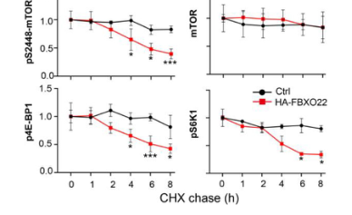

## Question

# Gene Research for Functional Annotation

## ⚠️ CRITICAL: Gene/Protein Identification Context

**BEFORE YOU BEGIN RESEARCH:** You MUST verify you are researching the CORRECT gene/protein. Gene symbols can be ambiguous, especially for less well-characterized genes from non-model organisms.

### Target Gene/Protein Identity (from UniProt):
- **UniProt Accession:** Q8NEZ5
- **Protein Description:** RecName: Full=F-box only protein 22; AltName: Full=F-box protein FBX22p44;
- **Gene Information:** Name=FBXO22; Synonyms=FBX22;
- **Organism (full):** Homo sapiens (Human).
- **Protein Family:** Not specified in UniProt
- **Key Domains:** F-box-like_dom_sf. (IPR036047); F-box_dom. (IPR001810); FIST_C. (IPR019494); F-box (PF00646); FIST_C (PF10442)

### MANDATORY VERIFICATION STEPS:

1. **Check if the gene symbol "FBXO22" matches the protein description above**
2. **Verify the organism is correct:** Homo sapiens (Human).
3. **Check if protein family/domains align with what you find in literature**
4. **If you find literature for a DIFFERENT gene with the same or similar symbol, STOP**

### If Gene Symbol is Ambiguous or You Cannot Find Relevant Literature:

**DO NOT PROCEED WITH RESEARCH ON A DIFFERENT GENE.** Instead:
- State clearly: "The gene symbol 'FBXO22' is ambiguous or literature is limited for this specific protein"
- Explain what you found (e.g., "Found extensive literature on a different gene with the same symbol in a different organism")
- Describe the protein based ONLY on the UniProt information provided above
- Suggest that the protein function can be inferred from domain/family information

### Research Target:

Please provide a comprehensive research report on the gene **FBXO22** (gene ID: FBXO22, UniProt: Q8NEZ5) in human.

The research report should be a detailed narrative explaining the function, biological processes, and localization of the gene product. Citations should be given for all claims.

You should prioritize authoritative reviews and primary scientific literature when conducting research. You can supplement
this with annotations you find in gene/protein databases, but these can be outdated or inaccurate.

We are specifically interested in the primary function of the gene - for enzymes, what reaction is catalyzed, and what is the substrate specificity? For transporters, what is the substrate? For structural proteins or adapters, what is the broader structural role? For signaling molecules, what is the role in the pathway.

We are interested in where in or outside the cell the gene product carries out its function.

We are also interested in the signaling or biochemical pathways in which the gene functions. We are less interested in broad pleiotropic effects, except where these elucidate the precise role.

Include evidence where possible. We are interested in both experimental evidence as well as inference from structure, evolution, or bioinformatic analysis. Precise studies should be prioritized over high-throughput, where available.

## Output

Question: You are an expert researcher providing comprehensive, well-cited information.

Provide detailed information focusing on:
1. Key concepts and definitions with current understanding
2. Recent developments and latest research (prioritize 2023-2024 sources)
3. Current applications and real-world implementations
4. Expert opinions and analysis from authoritative sources
5. Relevant statistics and data from recent studies

Format as a comprehensive research report with proper citations. Include URLs and publication dates where available.
Always prioritize recent, authoritative sources and provide specific citations for all major claims.

# Gene Research for Functional Annotation

## ⚠️ CRITICAL: Gene/Protein Identification Context

**BEFORE YOU BEGIN RESEARCH:** You MUST verify you are researching the CORRECT gene/protein. Gene symbols can be ambiguous, especially for less well-characterized genes from non-model organisms.

### Target Gene/Protein Identity (from UniProt):
- **UniProt Accession:** Q8NEZ5
- **Protein Description:** RecName: Full=F-box only protein 22; AltName: Full=F-box protein FBX22p44;
- **Gene Information:** Name=FBXO22; Synonyms=FBX22;
- **Organism (full):** Homo sapiens (Human).
- **Protein Family:** Not specified in UniProt
- **Key Domains:** F-box-like_dom_sf. (IPR036047); F-box_dom. (IPR001810); FIST_C. (IPR019494); F-box (PF00646); FIST_C (PF10442)

### MANDATORY VERIFICATION STEPS:

1. **Check if the gene symbol "FBXO22" matches the protein description above**
2. **Verify the organism is correct:** Homo sapiens (Human).
3. **Check if protein family/domains align with what you find in literature**
4. **If you find literature for a DIFFERENT gene with the same or similar symbol, STOP**

### If Gene Symbol is Ambiguous or You Cannot Find Relevant Literature:

**DO NOT PROCEED WITH RESEARCH ON A DIFFERENT GENE.** Instead:
- State clearly: "The gene symbol 'FBXO22' is ambiguous or literature is limited for this specific protein"
- Explain what you found (e.g., "Found extensive literature on a different gene with the same symbol in a different organism")
- Describe the protein based ONLY on the UniProt information provided above
- Suggest that the protein function can be inferred from domain/family information

### Research Target:

Please provide a comprehensive research report on the gene **FBXO22** (gene ID: FBXO22, UniProt: Q8NEZ5) in human.

The research report should be a detailed narrative explaining the function, biological processes, and localization of the gene product. Citations should be given for all claims.

You should prioritize authoritative reviews and primary scientific literature when conducting research. You can supplement
this with annotations you find in gene/protein databases, but these can be outdated or inaccurate.

We are specifically interested in the primary function of the gene - for enzymes, what reaction is catalyzed, and what is the substrate specificity? For transporters, what is the substrate? For structural proteins or adapters, what is the broader structural role? For signaling molecules, what is the role in the pathway.

We are interested in where in or outside the cell the gene product carries out its function.

We are also interested in the signaling or biochemical pathways in which the gene functions. We are less interested in broad pleiotropic effects, except where these elucidate the precise role.

Include evidence where possible. We are interested in both experimental evidence as well as inference from structure, evolution, or bioinformatic analysis. Precise studies should be prioritized over high-throughput, where available.

## Research report: Human **FBXO22** (UniProt **Q8NEZ5**) — functional annotation, mechanisms, and applications

### 0) Target identity verification (mandatory)
FBXO22 (F-box only protein 22; UniProt Q8NEZ5) is consistently described in the primary literature as an **F-box substrate-receptor** that assembles with **SKP1–CUL1–RBX1 (ROC1)** to form an **SCF (CRL1) E3 ubiquitin ligase**. SCF composition and FBXO22’s role as the substrate-recognition subunit are explicitly stated in mechanistic and review sources, matching the UniProt description. (johmura2020fbxo22anepigenetic pages 1-2, tan2011scffbxo22regulateshistone pages 4-5, cheng2020emergingroleof pages 1-2)

Domain/function mapping in experimental work aligns with UniProt’s F-box and FIST_C annotations: FBXO22 contains an N-terminal **F-box domain** mediating SCF assembly via SKP1, and a C-terminal **FIST/FIST-C** substrate-binding region (e.g., KDM4A binding mapped to the FBXO22 FIST-C domain). (tan2011scffbxo22regulateshistone pages 4-5)

### 1) Key concepts and definitions (current understanding)

#### 1.1 SCF E3 ubiquitin ligases and F-box proteins
SCF (SKP1–CUL1–RBX1–F-box) complexes are **Cullin–RING E3 ligases** in which **F-box proteins select substrates** for ubiquitination. FBXO22 is an “FBXO” class F-box protein that specifies substrate selection for a particular SCF complex (SCF^FBXO22^). (cheng2020emergingroleof pages 1-2, johmura2020fbxo22anepigenetic pages 1-2)

#### 1.2 What FBXO22 “does” at the molecular level
Across studies, FBXO22’s primary biochemical function is best defined as:
- **Substrate recognition** (often **phosphorylation- or modification-dependent**) and recruitment to SCF,
- followed by **ubiquitination** that can lead to **proteasomal degradation** (frequently K48-linked) or sometimes altered function depending on ubiquitin linkage/context.

A canonical example is KDM4A turnover: KDM4A requires **K48-linked ubiquitin** for normal turnover and displays a **~2 h half-life**, extended to **~5 h** upon proteasome inhibition (MG132), consistent with FBXO22-driven proteasomal control. (tan2011scffbxo22regulateshistone pages 4-5)

### 2) Core functional annotation of FBXO22: mechanisms, substrates, pathways, and localization

#### 2.1 SCF complex assembly and subcellular distribution
FBXO22 forms an SCF complex with SKP1 and CUL1; this is supported by proteomics and co-immunoprecipitation experiments recovering SKP1/CUL1 with FBXO22 or FBXO22-associated substrate complexes. (tan2011scffbxo22regulateshistone pages 4-5, li2024fbxo22inhibitscolitis pages 5-6)

Cell fractionation studies (HeLa) indicate **KDM4A is nuclear**, while **FBXO22 is primarily cytoplasmic with detectable nuclear presence**, supporting the idea that FBXO22 can regulate both cytoplasmic and nuclear targets depending on context and substrate access. (tan2011scffbxo22regulateshistone pages 4-5)

#### 2.2 Established substrate mechanisms (selected high-confidence examples)

##### (A) Epigenetic regulators: KDM4A and KDM4B
**KDM4A (histone demethylase)**
- FBXO22 associates with KDM4A and SCF components and promotes **K48-dependent ubiquitin–proteasome degradation** of KDM4A. (tan2011scffbxo22regulateshistone pages 4-5)
- Binding is mediated by the **FBXO22 FIST-C domain** to the **KDM4A catalytic JmjN/JmjC region**, linking FBXO22 domain architecture to substrate selection. (tan2011scffbxo22regulateshistone pages 4-5)

**KDM4B (histone demethylase) and endocrine response**
- In ER-positive breast cancer models, **SCF^FBXO22^ ubiquitylates and degrades KDM4B** when KDM4B is **complexed with tamoxifen-bound ER**, which in turn **releases steroid receptor coactivator (SRC)** from ER and shapes SERM pharmacology. (johmura2018fbxo22mediatedkdm4bdegradation pages 1-2)
- Proteasome inhibition (MG132) interferes with these tamoxifen-driven cofactor dynamics and maintains expression of ER target transcripts (e.g., GREB1/EBAG9 kinetics described). (johmura2018fbxo22mediatedkdm4bdegradation pages 1-2)

##### (B) p53 network and senescence control
FBXO22 is transcriptionally induced in a **p53-dependent manner** in senescence settings, and **SCF^FBXO22^-KDM4A** targets **methylated p53** for degradation as part of a negative-feedback loop needed for late senescence programs (including p16 and SASP regulation). (johmura2016scffbxo22kdm4atargetsmethylated pages 1-2, johmura2020fbxo22anepigenetic pages 1-2)

##### (C) Nuclear tumor suppressor PTEN
A key compartment-specific mechanism is **nuclear PTEN degradation**:
- FBXO22 **ubiquitylates nuclear (but not cytoplasmic) PTEN** at **lysine 221**, leading to proteasome-mediated degradation and nuclear PTEN depletion. (ge2020fbxo22degradesnuclear pages 1-2)
- Proteasome inhibitors (MG132; bortezomib) preferentially accumulate nuclear PTEN in tested systems, supporting a proteasome-dependent regulatory axis. (ge2020fbxo22degradesnuclear pages 1-2)

##### (D) Immune checkpoint regulation: PD-L1
In NSCLC cells, FBXO22 promotes **PD-L1 ubiquitination and degradation**, increasing sensitivity to DNA-damaging therapies (ionizing radiation and cisplatin). (de2021theubiquitine3 pages 1-2)

Upstream regulation in this context includes **CDK5**, reported to regulate FBXO22 such that **inhibiting or reducing CDK5 increases FBXO22**, decreases PD-L1, and sensitizes to DNA damage—providing a mechanistic rationale for combination strategies. (de2021theubiquitine3 pages 1-2)

##### (E) Phosphodegron logic and the ERK–FBXO22–BAG3 axis
A 2022 systems/biochemical study defined a **FBXO22-recognized phosphodegron motif** **XXPpSPXPXX** and validated **BAG3** as a bona fide FBXO22 substrate. BAG3 degradation requires **ERK-dependent phosphorylation at S377**, establishing an ERK→FBXO22→BAG3 axis linked to tumorigenesis phenotypes. (liu2022globalidentificationof pages 1-2)

##### (F) 2024 advance: phospho-specific degradation of pS2448-mTOR in colitis/CRC
A major 2024 development is identification of a phospho-state selective mTOR mechanism:
- FBXO22 targets the **S2448-phosphorylated form of mTOR (pS2448-mTOR)** for ubiquitination and proteasomal degradation, supported by co-IP/colocalization and phosphopeptide binding/competition assays. (li2024fbxo22inhibitscolitis pages 5-6)
- A biotinylated phosphopeptide (BT-PS2448) binds FBXO22 more effectively than the unphosphorylated peptide (BT-S2448), and BT-PS2448 competes with endogenous pS2448-mTOR for FBXO22 binding—evidence for phospho-specific recognition. (li2024fbxo22inhibitscolitis pages 5-6, li2024fbxo22inhibitscolitis media c1302dda)
- Statistical testing is explicitly indicated for multiple immunoblot quantifications (*P < 0.05, **P < 0.01, ***P < 0.001). (li2024fbxo22inhibitscolitis pages 5-6)

**Visual evidence:** cropped Figure 4 panels supporting the phospho-specific FBXO22–pS2448-mTOR interaction and peptide competition are available. (li2024fbxo22inhibitscolitis media c1302dda)

### 3) Recent developments and latest research (prioritizing 2023–2024)

#### 3.1 FBXO22 as a recruitable E3 ligase for targeted protein degradation (TPD)
Two complementary 2024 lines of work position FBXO22 as an “actionable” E3 ligase beyond CRBN/VHL:

**(i) Covalent recruitment via Cys326 (Nature Communications, 18 Jun 2024; accepted 18 June 2024)**
- Alkylamine-tethered degraders can be metabolized to an **active aldehyde** that **covalently adduces Cys326** in the FBXO22 C-terminal domain.
- This Cys326 engagement is described as **critical for ternary complex formation, ubiquitylation and degradation**, establishing a generalizable strategy for hijacking SCF^FBXO22^. (kagiou2024alkylaminetetheredmoleculesrecruit pages 1-2)

**(ii) CRISPR activation screen identifies FBXO22 as enabling PROTAC-like degradation (bioRxiv 15 Sep 2023; Nature Chemical Biology Jul 2024)**
- A pooled CRISPRa screen used **3,520 sgRNAs targeting 680 E3 ligases** (5 sgRNAs/gene) and identified FBXO22 as enabling FKBP12 degradation by a heterobifunctional electrophilic compound. (basu2023acrispractivation pages 3-5)
- Mechanistic dependencies: degradation was rescued by **MG132** (proteasome), **MLN4924** (cullin neddylation/CRL activity), and competition with the FKBP12 ligand (SLF), and was rapid (near complete within **~2 h**). (basu2023acrispractivation pages 3-5)

Together these studies represent a 2023–2024 shift in viewing FBXO22 not only as a cancer-/stress-related E3 adaptor but also as a **drug-development handle** for induced proximity/TPD. (kagiou2024alkylaminetetheredmoleculesrecruit pages 1-2, basu2023acrispractivation pages 3-5)

#### 3.2 Human genetics: FBXO22 deficiency syndrome (2024 preprint)
A 2024 medRxiv report proposes that **biallelic loss-of-function FBXO22 variants** cause a **pleiotropic developmental syndrome** (growth restriction, neurodevelopmental delay, multisystem anomalies). Patient-derived fibroblasts lacked FBXO22 protein and showed **increased KDM4B**, consistent with KDM4B as an FBXO22 substrate and supporting a chromatin-centered pathogenesis model. (ramakrishna2024fbxo22deficiencydefines pages 1-4)

This genetics report is also reflected in curated disease-target associations (OpenTargets) for neurodevelopmental phenotypes including a named syndrome association in their output. (OpenTargets Search: -FBXO22)

### 4) Current applications and real-world implementations

#### 4.1 Biomarkers and therapy response: ER+ breast cancer endocrine treatment
FBXO22 is implicated as a determinant of **tamoxifen/SERM response** through KDM4B degradation dynamics. The JCI 2018 study reports clinical associations where **low FBXO22 in tumors predicts poorer outcome** in ER-positive/HER2-negative breast cancer, independent of some established markers. (johmura2018fbxo22mediatedkdm4bdegradation pages 1-2)

The same paper provides clinically relevant context statistics for endocrine therapy: **~70% of breast cancers are ER-positive**, and **up to 25% of early-stage tamoxifen-treated patients relapse within 15 years**, emphasizing the clinical need for stratification/alternative strategies. (johmura2018fbxo22mediatedkdm4bdegradation pages 1-2)

#### 4.2 Immuno-oncology and DNA damage therapy sensitization (NSCLC)
FBXO22-driven PD-L1 degradation suggests a therapeutic logic where increasing FBXO22 activity (or indirectly increasing FBXO22 via CDK5 inhibition) could lower PD-L1 and sensitize to **DNA-damaging therapy**, potentially complementing immune checkpoint blockade. (de2021theubiquitine3 pages 1-2)

#### 4.3 Inflammation/CRC axis: pS2448-mTOR degradation
In a 2024 PNAS study, FBXO22 is positioned as protective in intestinal injury/CRC contexts by degrading **pS2448-mTOR**, a key node in mTOR signaling. Mechanistically anchored phospho-specific recognition (peptide competition; S2448A mutant weakening binding) provides a tractable substrate-state mechanism that could inform pathway-level interventions or biomarker development around phospho-mTOR states. (li2024fbxo22inhibitscolitis pages 5-6, li2024fbxo22inhibitscolitis media c1302dda)

#### 4.4 Targeted protein degradation R&D
FBXO22 is now a demonstrated **TPD-recruitable E3** via covalent chemistry (aldehyde/Cys326) and via genetic screens that nominate it as a functional ligase for induced degradation—an application area with immediate translational interest in oncology and beyond. (kagiou2024alkylaminetetheredmoleculesrecruit pages 1-2, basu2023acrispractivation pages 3-5)

### 5) Expert opinions and authoritative synthesis
Two reviews consolidate FBXO22 as a multi-context regulator in cancer-related biology:
- A focused review characterizes FBXO22 as coordinating senescence, hormone signaling, and metastasis through defined substrates (methylated p53; KDM4B; Bach1) and frames FBXO22 as an “epigenetic multiplayer” in cancer biology. (Johmura et al., July 2020; https://doi.org/10.1111/cas.14534) (johmura2020fbxo22anepigenetic pages 1-2)
- A broader review summarizes reported FBXO22 substrates spanning cell cycle regulators and tumor suppressors and emphasizes upstream regulation (e.g., p53, miR-155 and other ncRNAs), highlighting context-dependent oncogenic vs metastasis-suppressive roles. (Cheng et al., July 2020; https://doi.org/10.1038/s41420-020-00303-0) (cheng2020emergingroleof pages 2-3, cheng2020emergingroleof pages 1-2)

### 6) Statistics and quantitative data highlights (from recent and key studies)
- **KDM4A turnover:** half-life ~**2 h**, extended to ~**5 h** with MG132; K48 ubiquitin requirement demonstrated by ubiquitin replacement experiments. (Tan et al., 2011; https://doi.org/10.1128/mcb.05746-11) (tan2011scffbxo22regulateshistone pages 4-5)
- **Tamoxifen clinical context:** ~**70%** of breast cancers are ER-positive; **up to 25%** of early-stage tamoxifen-treated patients relapse within **15 years**. (Johmura et al., 2018; https://doi.org/10.1172/JCI121679) (johmura2018fbxo22mediatedkdm4bdegradation pages 1-2)
- **CRISPRa TPD screen scale:** **3,520 sgRNAs** targeting **680 E3 ligases**; FKBP12 degradation nearly complete within **~2 h** and dependent on proteasome and CRL activity (MG132; MLN4924 rescue). (Basu et al., 2023 preprint; https://doi.org/10.1101/2023.09.15.557708) (basu2023acrispractivation pages 3-5)
- **pS2448-mTOR degradation assays:** repeated quantifications with explicit significance thresholds (*P < 0.05, **P < 0.01, ***P < 0.001). (Li et al., 2024; https://doi.org/10.1073/pnas.2402035121) (li2024fbxo22inhibitscolitis pages 5-6)

### 7) Consolidated evidence map (substrates, mechanisms, contexts)
The table below compiles the most directly evidenced substrates/partners, their ubiquitin outcomes, recognition logic, cellular context, and application relevance.

| Substrate/Binding partner | Modification/outcome | Upstream signal/recognition motif | Cellular compartment/context | Key phenotypic consequence/application | Key source with year + URL |
|---|---|---|---|---|---|
| KDM4A | SCF^FBXO22^-dependent ubiquitin-proteasome turnover; requires K48-linked ubiquitin; KDM4A half-life ~2 h, extended to ~5 h with MG132 | FBXO22 C-terminal FIST-C binds KDM4A catalytic JmjN/JmjC region | KDM4A nuclear; FBXO22 mainly cytoplasmic with some nuclear presence; chromatin/histone methylation context | Regulates histone H3K9/H3K36 methylation states through demethylase abundance control (tan2011scffbxo22regulateshistone pages 4-5) | Tan 2011 — https://doi.org/10.1128/mcb.05746-11 (tan2011scffbxo22regulateshistone pages 4-5) |
| Methylated p53 (with KDM4A complex) | Ubiquitylation and degradation by SCF^FBXO22^-KDM4A | p53-dependent induction of FBXO22 during late senescence; substrate is methylated p53 | Senescent cells; late senescence program | Required for p16 induction and SASP; Fbxo22 loss causes p53 accumulation and reduced body size in mice (johmura2020fbxo22anepigenetic pages 1-2, johmura2016scffbxo22kdm4atargetsmethylated pages 1-2) | Johmura 2016 — https://doi.org/10.1038/ncomms10574 (johmura2016scffbxo22kdm4atargetsmethylated pages 1-2) |
| KDM4B (complexed with tamoxifen-bound ER) | SCF^FBXO22^-mediated ubiquitylation and degradation; releases SRC from ER | Tamoxifen/4-OHT-bound ER; proteasome sensitive (MG132 blocks cofactor dynamics) | ER-positive/HER2-negative breast cancer; ER enhancers/promoters | Determines SERM antagonism; tamoxifen failed to suppress growth when FBXO22 was depleted; ~70% of breast cancers are ER+, and up to 25% of early-stage tamoxifen-treated patients relapse within 15 years (johmura2018fbxo22mediatedkdm4bdegradation pages 1-2) | Johmura 2018 — https://doi.org/10.1172/JCI121679 (johmura2018fbxo22mediatedkdm4bdegradation pages 1-2) |
| PD-L1 | Ubiquitination and proteasomal degradation | FBXO22 activation by phosphorylation; CDK5 inhibition increases FBXO22 and lowers PD-L1 | NSCLC | Sensitizes cancer cells to ionizing radiation and cisplatin; supports rationale for combining CDK5 inhibition with checkpoint/DNA-damage therapy (de2021theubiquitine3 pages 1-2) | De 2021 — https://doi.org/10.1073/pnas.2112674118 (de2021theubiquitine3 pages 1-2) |
| Nuclear PTEN | Ubiquitylation of nuclear PTEN at Lys221 and proteasomal degradation; selective for nuclear, not cytoplasmic PTEN | Nuclear PTEN instability; accumulation with MG132/Bortezomib | Nucleus; colorectal cancer and other cancers | Nuclear PTEN downregulation promotes tumorigenesis; suggests strategy to reactivate nuclear PTEN by blocking FBXO22 axis (ge2020fbxo22degradesnuclear pages 1-2) | Ge 2020 — https://doi.org/10.1038/s41467-020-15578-1 (ge2020fbxo22degradesnuclear pages 1-2) |
| BAG3 | Ubiquitination and degradation by SCF^FBXO22^ | ERK-dependent phosphorylation at S377; FBXO22-recognized phosphodegron motif XXPpSPXPXX | Tumorigenesis context; apoptosis/cell-cycle regulation | FBXO22 depletion or stable BAG3 S377A mutant promotes tumor growth in vitro and in vivo; defines ERK-FBXO22-BAG3 axis (liu2022globalidentificationof pages 1-2) | Liu 2022 — https://doi.org/10.1038/s41418-021-00827-7 (liu2022globalidentificationof pages 1-2) |
| pS2448-mTOR | Ubiquitination and proteasomal degradation of the S2448-phosphorylated form of mTOR | Phospho-specific recognition of pS2448; BT-PS2448 peptide binds FBXO22 better than non-phospho peptide; S2448A weakens interaction; AKT activity supports pS2448 state | Colon epithelium; HCT116/MC38 cells; colitis/colorectal carcinogenesis | FBXO22 restrains colitis and CRC-associated signaling by lowering pS2448-mTOR; effects supported by co-IP, colocalization, and peptide competition assays (li2024fbxo22inhibitscolitis pages 5-6, li2024fbxo22inhibitscolitis media c1302dda) | Li 2024 — https://doi.org/10.1073/pnas.2402035121 (li2024fbxo22inhibitscolitis pages 5-6, li2024fbxo22inhibitscolitis media c1302dda) |
| Cys326 in FBXO22 C-terminal domain (ligase recruitment site) | Covalent adduction by aldehyde metabolite enables ternary complex formation, ubiquitylation, and degradation of recruited targets | Alkylamine-tethered degraders metabolized to active aldehyde; Cys326 is critical | Targeted protein degradation (TPD) chemical biology | Establishes FBXO22 as a druggable E3 for TPD; demonstrated with FKBP12 and noted as a generalizable strategy for alkylamine-based degraders (kagiou2024alkylaminetetheredmoleculesrecruit pages 1-2) | Kagiou 2024 — https://doi.org/10.1038/s41467-024-49739-3 (kagiou2024alkylaminetetheredmoleculesrecruit pages 1-2) |
| FKBP12 (neo-substrate in degrader system) via FBXO22 | PROTAC/molecular glue-like FBXO22-dependent degradation; proteasome-, CRL-, and target-binding dependent | CRISPRa screen with 3,520 sgRNAs targeting 680 E3 ligases identified FBXO22; 22-SLF hit; rescued by MG132, MLN4924, and SLF; nearly complete degradation within ~2 h | Engineered TPD reporter systems | Demonstrates FBXO22 can support induced degradation of multiple neo-substrates and expands E3 ligase toolbox for TPD (basu2023acrispractivation pages 3-5) | Basu 2023/2024 — https://doi.org/10.1101/2023.09.15.557708 ; https://doi.org/10.1038/s41589-024-01655-9 (basu2023acrispractivation pages 3-5, basu2024acrispractivation pages 1-6) |
| FBXO22 loss-of-function / KDM4B accumulation | Loss of FBXO22 protein in patient fibroblasts leads to increased known substrate KDM4B | Homozygous frameshift LOF variants p.(Arg53Serfs*13), p.(Pro3Leufs*3), p.(Val240Alafs*6) | Human developmental disorder; peripheral blood epigenetic signature; patient fibroblasts | Defines FBXO22 deficiency syndrome with prenatal-onset growth restriction, neurodevelopmental delay, and multisystem anomalies across 14 cases from 12 families (ramakrishna2024fbxo22deficiencydefines pages 1-4, OpenTargets Search: -FBXO22) | Ramakrishna 2024 — https://doi.org/10.1101/2024.09.28.24314530 (ramakrishna2024fbxo22deficiencydefines pages 1-4, OpenTargets Search: -FBXO22) |

*Table: This table summarizes experimentally supported human FBXO22 functions, substrates, recognition mechanisms, and disease or translational implications. It is useful as a compact evidence map linking molecular biochemistry to cellular context and emerging therapeutic applications.*

### 8) Curated disease-target associations (database support; interpret cautiously)
OpenTargets reports disease associations for FBXO22 including **neurodevelopmental disorder** and **Tayoun-Maawali syndrome** (and others in their list). These associations help prioritize phenotypic domains but should be traced to primary evidence for mechanism. (OpenTargets Search: -FBXO22)

### 9) Conclusions and functional annotation summary
FBXO22 (Q8NEZ5) is best annotated as a **substrate receptor of SCF (CRL1) ubiquitin ligases** that:
1) recognizes specific substrates—often via **post-translational marks** (methylation; phosphorylation-defined degrons; phospho-state-specific sites such as **pS2448-mTOR**),
2) mediates ubiquitination leading frequently to **proteasomal degradation**, and
3) thereby regulates key pathways spanning **chromatin/epigenetic control (KDM4A/KDM4B), senescence feedback (methylated p53), immune checkpoint abundance (PD-L1), compartment-specific tumor suppression (nuclear PTEN), stress/tumorigenesis (ERK–BAG3), and intestinal injury/CRC signaling (pS2448-mTOR)**. (tan2011scffbxo22regulateshistone pages 4-5, johmura2016scffbxo22kdm4atargetsmethylated pages 1-2, johmura2018fbxo22mediatedkdm4bdegradation pages 1-2, de2021theubiquitine3 pages 1-2, ge2020fbxo22degradesnuclear pages 1-2, liu2022globalidentificationof pages 1-2, li2024fbxo22inhibitscolitis pages 5-6)

Recent 2024 research substantially expands FBXO22’s translational relevance by (i) identifying **pS2448-mTOR** as a phospho-state selective substrate in colitis/CRC biology and (ii) establishing **covalent hijacking of FBXO22 (Cys326)** as a generalizable **targeted protein degradation** strategy. (li2024fbxo22inhibitscolitis pages 5-6, kagiou2024alkylaminetetheredmoleculesrecruit pages 1-2)

References

1. (johmura2020fbxo22anepigenetic pages 1-2): Yoshikazu Johmura, Alexander S. Harris, Tomohiko Ohta, and Makoto Nakanishi. Fbxo22, an epigenetic multiplayer coordinating senescence, hormone signaling, and metastasis. Cancer Science, 111:2718-2725, Jul 2020. URL: https://doi.org/10.1111/cas.14534, doi:10.1111/cas.14534. This article has 32 citations and is from a peer-reviewed journal.

2. (tan2011scffbxo22regulateshistone pages 4-5): Meng-Kwang Marcus Tan, Hui-Jun Lim, and J. Wade Harper. Scffbxo22 regulates histone h3 lysine 9 and 36 methylation levels by targeting histone demethylase kdm4a for ubiquitin-mediated proteasomal degradation. Sep 2011. URL: https://doi.org/10.1128/mcb.05746-11, doi:10.1128/mcb.05746-11. This article has 154 citations and is from a domain leading peer-reviewed journal.

3. (cheng2020emergingroleof pages 1-2): Jiangting Cheng, Min Lin, Man Chu, Longyuan Gong, Yanli Bi, and Yongchao Zhao. Emerging role of fbxo22 in carcinogenesis. Cell Death Discovery, Jul 2020. URL: https://doi.org/10.1038/s41420-020-00303-0, doi:10.1038/s41420-020-00303-0. This article has 46 citations and is from a peer-reviewed journal.

4. (li2024fbxo22inhibitscolitis pages 5-6): Minle Li, Xuan Chen, Pengfei Qu, Zhiying Shao, Lei Shi, Haoyu Quan, Xue Zhao, Jian Xu, Luling Shi, Silu Chen, Junnian Zheng, Zhen-Qiang Pan, and Jin Bai. Fbxo22 inhibits colitis and colorectal carcinogenesis by regulating the degradation of the s2448-phosphorylated form of mtor. Proceedings of the National Academy of Sciences of the United States of America, Nov 2024. URL: https://doi.org/10.1073/pnas.2402035121, doi:10.1073/pnas.2402035121. This article has 6 citations and is from a highest quality peer-reviewed journal.

5. (johmura2018fbxo22mediatedkdm4bdegradation pages 1-2): Yoshikazu Johmura, Ichiro Maeda, Narumi Suzuki, Wenwen Wu, Atsushi Goda, Mariko Morita, Kiyoshi Yamaguchi, Mizuki Yamamoto, Satoi Nagasawa, Yasuyuki Kojima, Koichiro Tsugawa, Natsuko Inoue, Yasuo Miyoshi, Tomo Osako, Futoshi Akiyama, Reo Maruyama, Jun-ichiro Inoue, Yoichi Furukawa, Tomohiko Ohta, and Makoto Nakanishi. Fbxo22-mediated kdm4b degradation determines selective estrogen receptor modulator activity in breast cancer. Journal of Clinical Investigation, 128:5603–5619, Nov 2018. URL: https://doi.org/10.1172/jci121679, doi:10.1172/jci121679. This article has 63 citations and is from a highest quality peer-reviewed journal.

6. (johmura2016scffbxo22kdm4atargetsmethylated pages 1-2): Yoshikazu Johmura, Jia Sun, Kyoko Kitagawa, Keiko Nakanishi, Toshiya Kuno, Aya Naiki-Ito, Yumi Sawada, Tomomi Miyamoto, Atsushi Okabe, Hiroyuki Aburatani, ShengFan Li, Ichiro Miyoshi, Satoru Takahashi, Masatoshi Kitagawa, and Makoto Nakanishi. Scffbxo22-kdm4a targets methylated p53 for degradation and regulates senescence. Nature Communications, Feb 2016. URL: https://doi.org/10.1038/ncomms10574, doi:10.1038/ncomms10574. This article has 137 citations and is from a highest quality peer-reviewed journal.

7. (ge2020fbxo22degradesnuclear pages 1-2): Meng-Kai Ge, Na Zhang, Li Xia, Cheng Zhang, Shuang-Shu Dong, Zhan-Ming Li, Yan Ji, Min-Hua Zheng, Jing Sun, Guo-Qiang Chen, and Shao-Ming Shen. Fbxo22 degrades nuclear pten to promote tumorigenesis. Nature Communications, Apr 2020. URL: https://doi.org/10.1038/s41467-020-15578-1, doi:10.1038/s41467-020-15578-1. This article has 103 citations and is from a highest quality peer-reviewed journal.

8. (de2021theubiquitine3 pages 1-2): Sarmishtha De, Elise G. Holvey-Bates, Kala Mahen, Belinda Willard, and George R. Stark. The ubiquitin e3 ligase fbxo22 degrades pd-l1 and sensitizes cancer cells to dna damage. Proceedings of the National Academy of Sciences, Nov 2021. URL: https://doi.org/10.1073/pnas.2112674118, doi:10.1073/pnas.2112674118. This article has 96 citations and is from a highest quality peer-reviewed journal.

9. (liu2022globalidentificationof pages 1-2): Ping Liu, Xiaoji Cong, Shengjie Liao, Xinglong Jia, Xiaomin Wang, Wei Dai, Linhui Zhai, Lei Zhao, Jing Ji, Duan Ni, Zhiwei Liu, Yulu Chen, Lulu Pan, Wei Liu, Jian Zhang, Min Huang, Bin Liu, and Minjia Tan. Global identification of phospho-dependent scf substrates reveals a fbxo22 phosphodegron and an erk-fbxo22-bag3 axis in tumorigenesis. Cell Death & Differentiation, 29:1-13, Jul 2022. URL: https://doi.org/10.1038/s41418-021-00827-7, doi:10.1038/s41418-021-00827-7. This article has 43 citations and is from a domain leading peer-reviewed journal.

10. (li2024fbxo22inhibitscolitis media c1302dda): Minle Li, Xuan Chen, Pengfei Qu, Zhiying Shao, Lei Shi, Haoyu Quan, Xue Zhao, Jian Xu, Luling Shi, Silu Chen, Junnian Zheng, Zhen-Qiang Pan, and Jin Bai. Fbxo22 inhibits colitis and colorectal carcinogenesis by regulating the degradation of the s2448-phosphorylated form of mtor. Proceedings of the National Academy of Sciences of the United States of America, Nov 2024. URL: https://doi.org/10.1073/pnas.2402035121, doi:10.1073/pnas.2402035121. This article has 6 citations and is from a highest quality peer-reviewed journal.

11. (kagiou2024alkylaminetetheredmoleculesrecruit pages 1-2): Chrysanthi Kagiou, Jose A. Cisneros, Jakob Farnung, Joanna Liwocha, Fabian Offensperger, Kevin Dong, Ka Yang, Gary Tin, Christina S. Horstmann, Matthias Hinterndorfer, Joao A. Paulo, Natalie S. Scholes, Juan Sanchez Avila, Michaela Fellner, Florian Andersch, J. Thomas Hannich, Johannes Zuber, Stefan Kubicek, Steven P. Gygi, Brenda A. Schulman, and Georg E. Winter. Alkylamine-tethered molecules recruit fbxo22 for targeted protein degradation. Nature Communications, Jun 2024. URL: https://doi.org/10.1038/s41467-024-49739-3, doi:10.1038/s41467-024-49739-3. This article has 50 citations and is from a highest quality peer-reviewed journal.

12. (basu2023acrispractivation pages 3-5): Ananya A. Basu, Chenlu Zhang, Isabella A. Riha, Assa Magassa, Felicia Ko, and Xiaoyu Zhang. A crispr activation screen identifies fbxo22 as an e3 ligase supporting targeted protein degradation. bioRxiv, Sep 2023. URL: https://doi.org/10.1101/2023.09.15.557708, doi:10.1101/2023.09.15.557708. This article has 4 citations.

13. (ramakrishna2024fbxo22deficiencydefines pages 1-4): Navin B. Ramakrishna, Yoshikazu Johmura, Nur Ain Ali, Umar Bin Mohamad Sahari, Malak Alghamdi, Peter Bauer, Suliman Khan, Natalia Ordoñez, Mariana Ferreira, Jorge Pinto Basto, Fowzan S. Alkuraya, Eissa Ali Faqeih, Mari Mori, Naif A. M. Almontashiri, Aisha Al Shamsi, Gehad ElGhazali, Hala Abu Subieh, Mode Al Ojaimi, Ayman W. El-Hattab, Said Ahmed Said Al-Kindi, Nadia Alhashmi, Fahad Alhabshan, Abdulaziz Al Saman, Hala Tfayli, Mariam Arabi, Simone Khalifeh, Alan Taylor, Majid Alfadhel, Ruchi Jain, Shruti Sinha, Shruti Shenbagam, Revathy Ramachandran, Umut Altunoğlu, Anju Jacob, Nandu Thalange, Jay W. Shin, Almundher Al-Maawali, Azza Al-Shidhani, Amna Al-Futaisi, Fatma Rabea, Ikram Chekroun, Mohamed Al Marri, Tomohiko Ohta, Makoto Nakanishi, Alawi Alsheikh-Ali, Fahad R. Ali, Aida M. Bertoli-Avella, Bruno Reversade, and Ahmad Abou Tayoun. Fbxo22 deficiency defines a pleiotropic syndrome of growth restriction and multi-system anomalies associated with a unique epigenetic signature. American journal of human genetics, Oct 2024. URL: https://doi.org/10.1101/2024.09.28.24314530, doi:10.1101/2024.09.28.24314530. This article has 1 citations and is from a highest quality peer-reviewed journal.

14. (OpenTargets Search: -FBXO22): Open Targets Query (-FBXO22, 5 results). Buniello, A. et al. (2025). Open Targets Platform: facilitating therapeutic hypotheses building in drug discovery. Nucleic Acids Research.

15. (cheng2020emergingroleof pages 2-3): Jiangting Cheng, Min Lin, Man Chu, Longyuan Gong, Yanli Bi, and Yongchao Zhao. Emerging role of fbxo22 in carcinogenesis. Cell Death Discovery, Jul 2020. URL: https://doi.org/10.1038/s41420-020-00303-0, doi:10.1038/s41420-020-00303-0. This article has 46 citations and is from a peer-reviewed journal.

16. (basu2024acrispractivation pages 1-6): Ananya A. Basu, Chenlu Zhang, Isabella A. Riha, Assa Magassa, Miguel A. Campos, Alana G. Caldwell, Felicia Ko, and Xiaoyu Zhang. A crispr activation screen identifies fbxo22 supporting targeted protein degradation. Nature chemical biology, 20:1608-1616, Jul 2024. URL: https://doi.org/10.1038/s41589-024-01655-9, doi:10.1038/s41589-024-01655-9. This article has 51 citations and is from a highest quality peer-reviewed journal.

## Artifacts

- [Edison artifact artifact-00](FBXO22-deep-research-falcon_artifacts/artifact-00.md)

## Citations

1. liu2022globalidentificationof pages 1-2
2. kagiou2024alkylaminetetheredmoleculesrecruit pages 1-2
3. basu2023acrispractivation pages 3-5
4. cheng2020emergingroleof pages 1-2
5. cheng2020emergingroleof pages 2-3
6. basu2024acrispractivation pages 1-6
7. https://doi.org/10.1111/cas.14534
8. https://doi.org/10.1038/s41420-020-00303-0
9. https://doi.org/10.1128/mcb.05746-11
10. https://doi.org/10.1172/JCI121679
11. https://doi.org/10.1101/2023.09.15.557708
12. https://doi.org/10.1073/pnas.2402035121
13. https://doi.org/10.1038/ncomms10574
14. https://doi.org/10.1073/pnas.2112674118
15. https://doi.org/10.1038/s41467-020-15578-1
16. https://doi.org/10.1038/s41418-021-00827-7
17. https://doi.org/10.1038/s41467-024-49739-3
18. https://doi.org/10.1038/s41589-024-01655-9
19. https://doi.org/10.1101/2024.09.28.24314530
20. https://doi.org/10.1111/cas.14534,
21. https://doi.org/10.1128/mcb.05746-11,
22. https://doi.org/10.1038/s41420-020-00303-0,
23. https://doi.org/10.1073/pnas.2402035121,
24. https://doi.org/10.1172/jci121679,
25. https://doi.org/10.1038/ncomms10574,
26. https://doi.org/10.1038/s41467-020-15578-1,
27. https://doi.org/10.1073/pnas.2112674118,
28. https://doi.org/10.1038/s41418-021-00827-7,
29. https://doi.org/10.1038/s41467-024-49739-3,
30. https://doi.org/10.1101/2023.09.15.557708,
31. https://doi.org/10.1101/2024.09.28.24314530,
32. https://doi.org/10.1038/s41589-024-01655-9,