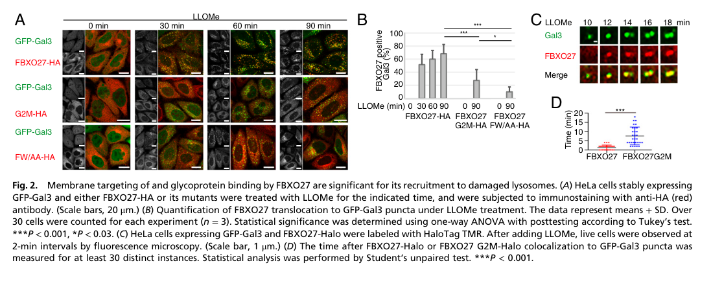

## Question

# Gene Research for Functional Annotation

## ⚠️ CRITICAL: Gene/Protein Identification Context

**BEFORE YOU BEGIN RESEARCH:** You MUST verify you are researching the CORRECT gene/protein. Gene symbols can be ambiguous, especially for less well-characterized genes from non-model organisms.

### Target Gene/Protein Identity (from UniProt):
- **UniProt Accession:** Q8NI29
- **Protein Description:** RecName: Full=F-box only protein 27; AltName: Full=F-box/G-domain protein 5;
- **Gene Information:** Name=FBXO27; Synonyms=FBG5, FBX27;
- **Organism (full):** Homo sapiens (Human).
- **Protein Family:** Not specified in UniProt
- **Key Domains:** F-box-assoc_dom. (IPR007397); F-box-like_dom_sf. (IPR036047); F-box_dom. (IPR001810); F-box_only. (IPR039752); Galactose-bd-like_sf. (IPR008979)

### MANDATORY VERIFICATION STEPS:

1. **Check if the gene symbol "FBXO27" matches the protein description above**
2. **Verify the organism is correct:** Homo sapiens (Human).
3. **Check if protein family/domains align with what you find in literature**
4. **If you find literature for a DIFFERENT gene with the same or similar symbol, STOP**

### If Gene Symbol is Ambiguous or You Cannot Find Relevant Literature:

**DO NOT PROCEED WITH RESEARCH ON A DIFFERENT GENE.** Instead:
- State clearly: "The gene symbol 'FBXO27' is ambiguous or literature is limited for this specific protein"
- Explain what you found (e.g., "Found extensive literature on a different gene with the same symbol in a different organism")
- Describe the protein based ONLY on the UniProt information provided above
- Suggest that the protein function can be inferred from domain/family information

### Research Target:

Please provide a comprehensive research report on the gene **FBXO27** (gene ID: FBXO27, UniProt: Q8NI29) in human.

The research report should be a detailed narrative explaining the function, biological processes, and localization of the gene product. Citations should be given for all claims.

You should prioritize authoritative reviews and primary scientific literature when conducting research. You can supplement
this with annotations you find in gene/protein databases, but these can be outdated or inaccurate.

We are specifically interested in the primary function of the gene - for enzymes, what reaction is catalyzed, and what is the substrate specificity? For transporters, what is the substrate? For structural proteins or adapters, what is the broader structural role? For signaling molecules, what is the role in the pathway.

We are interested in where in or outside the cell the gene product carries out its function.

We are also interested in the signaling or biochemical pathways in which the gene functions. We are less interested in broad pleiotropic effects, except where these elucidate the precise role.

Include evidence where possible. We are interested in both experimental evidence as well as inference from structure, evolution, or bioinformatic analysis. Precise studies should be prioritized over high-throughput, where available.

## Output

Question: You are an expert researcher providing comprehensive, well-cited information.

Provide detailed information focusing on:
1. Key concepts and definitions with current understanding
2. Recent developments and latest research (prioritize 2023-2024 sources)
3. Current applications and real-world implementations
4. Expert opinions and analysis from authoritative sources
5. Relevant statistics and data from recent studies

Format as a comprehensive research report with proper citations. Include URLs and publication dates where available.
Always prioritize recent, authoritative sources and provide specific citations for all major claims.

# Gene Research for Functional Annotation

## ⚠️ CRITICAL: Gene/Protein Identification Context

**BEFORE YOU BEGIN RESEARCH:** You MUST verify you are researching the CORRECT gene/protein. Gene symbols can be ambiguous, especially for less well-characterized genes from non-model organisms.

### Target Gene/Protein Identity (from UniProt):
- **UniProt Accession:** Q8NI29
- **Protein Description:** RecName: Full=F-box only protein 27; AltName: Full=F-box/G-domain protein 5;
- **Gene Information:** Name=FBXO27; Synonyms=FBG5, FBX27;
- **Organism (full):** Homo sapiens (Human).
- **Protein Family:** Not specified in UniProt
- **Key Domains:** F-box-assoc_dom. (IPR007397); F-box-like_dom_sf. (IPR036047); F-box_dom. (IPR001810); F-box_only. (IPR039752); Galactose-bd-like_sf. (IPR008979)

### MANDATORY VERIFICATION STEPS:

1. **Check if the gene symbol "FBXO27" matches the protein description above**
2. **Verify the organism is correct:** Homo sapiens (Human).
3. **Check if protein family/domains align with what you find in literature**
4. **If you find literature for a DIFFERENT gene with the same or similar symbol, STOP**

### If Gene Symbol is Ambiguous or You Cannot Find Relevant Literature:

**DO NOT PROCEED WITH RESEARCH ON A DIFFERENT GENE.** Instead:
- State clearly: "The gene symbol 'FBXO27' is ambiguous or literature is limited for this specific protein"
- Explain what you found (e.g., "Found extensive literature on a different gene with the same symbol in a different organism")
- Describe the protein based ONLY on the UniProt information provided above
- Suggest that the protein function can be inferred from domain/family information

### Research Target:

Please provide a comprehensive research report on the gene **FBXO27** (gene ID: FBXO27, UniProt: Q8NI29) in human.

The research report should be a detailed narrative explaining the function, biological processes, and localization of the gene product. Citations should be given for all claims.

You should prioritize authoritative reviews and primary scientific literature when conducting research. You can supplement
this with annotations you find in gene/protein databases, but these can be outdated or inaccurate.

We are specifically interested in the primary function of the gene - for enzymes, what reaction is catalyzed, and what is the substrate specificity? For transporters, what is the substrate? For structural proteins or adapters, what is the broader structural role? For signaling molecules, what is the role in the pathway.

We are interested in where in or outside the cell the gene product carries out its function.

We are also interested in the signaling or biochemical pathways in which the gene functions. We are less interested in broad pleiotropic effects, except where these elucidate the precise role.

Include evidence where possible. We are interested in both experimental evidence as well as inference from structure, evolution, or bioinformatic analysis. Precise studies should be prioritized over high-throughput, where available.

# Research report: Human **FBXO27** (UniProt **Q8NI29**) — functional annotation

## 0) Identity verification (critical disambiguation)
The target protein is **human FBXO27**, also described in the literature as **Fbs3** and **FBG5** (consistent with UniProt Q8NI29 context). Fbs3/FBG5/FBXO27 is grouped with **glycoprotein-binding “lectin-type” F-box proteins** (FBA family) that recognize **N-glycans** on glycoproteins and act as substrate receptors for SCF ubiquitin ligases. (kumanomidou2015thestructuraldifferences pages 1-2, yoshida2018cytosolicnglycanstriggers pages 5-6)

## 1) Key concepts and definitions (current understanding)

### 1.1 SCF E3 ubiquitin ligase and F-box proteins
F-box proteins serve as interchangeable **substrate-recognition adaptors** in SCF (Skp1–Cullin1–F-box) E3 ubiquitin ligases. In the SCF architecture, **CUL1** provides the scaffold and associates with the catalytic RING protein (RBX1), while **SKP1** binds the F-box domain of the adaptor; the adaptor’s other domain(s) provide substrate specificity. Understanding the biological role of an F-box protein largely depends on identifying its substrates, and many F-box proteins historically lacked known substrates (“orphan” F-box proteins). (skaar2013mechanismsandfunction pages 1-2, skaar2013mechanismsandfunction pages 11-11)

### 1.2 Lectin-like F-box (FBA) family and glycan recognition
FBXO27 is part of the **FBA/lectin-like family** (FBXO2, FBXO6, FBXO17, FBXO27, FBXO44). These proteins contain a **conserved glycan-binding “G domain”** that mediates binding to glycan motifs on glycoproteins; glycan-array and mutagenesis data show that the G domain forms a hydrophobic pocket essential for glycan binding. (glenn2008diversityintissue pages 1-2, glenn2008diversityintissue pages 3-4)

### 1.3 Lysophagy and the endo-lysosomal damage response
**Lysophagy** is selective autophagy that removes damaged lysosomes. A key early step after lysosomal membrane damage is **ubiquitylation** of damaged-lysosome-associated proteins, enabling recruitment of autophagy receptors/adaptors and LC3-family proteins. A 2024 authoritative synthesis frames FBXO27 as one of several E3-associated factors implicated in damage-induced lysosomal ubiquitylation, but also notes redundancy and cell-type specificity in this response. (meyer2024theendolysosomaldamage pages 11-12)

## 2) Molecular function of FBXO27

### 2.1 Primary biochemical role
FBXO27 functions as the **substrate-recognition subunit** of an SCF-type E3 ubiquitin ligase (**SCF^FBXO27**), directing ubiquitylation of substrates that present accessible **N-glycans**. (yoshida2017ubiquitinationofexposed pages 1-2, yoshida2018cytosolicnglycanstriggers pages 5-6)

### 2.2 Substrate specificity: what does FBXO27 recognize?
Evidence across the lectin-F-box literature supports that FBXO27 binds **N-glycans**, with emphasis on **high-mannose** recognition (and broader N-glycan compatibility in later mechanistic work). In a conceptual synthesis, FBXO27 (with FBXO2/FBXO6) is described as recognizing the core **Man3GlcNAc2** motif and preferentially binding high-mannose glycans while also engaging complex-type N-glycans—consistent with FBXO27’s ability to act on diverse glycoproteins once their luminal glycans become exposed to the cytosol during damage. (yoshida2018cytosolicnglycanstriggers pages 5-6)

A foundational experimental comparison of the FBA family supports family-level binding to high-mannose and sulfated glycoproteins, with FBXO27 showing measurable glycan-array binding in at least some array conditions and mapping binding determinants to the G domain. (glenn2008diversityintissue pages 7-9, glenn2008diversityintissue pages 3-4)

### 2.3 Key cellular substrates and pathways

#### Lysosomal membrane glycoproteins (LAMP2 and LAMP1)
A central mechanistic finding is that after lysosomal membrane rupture, SCF^FBXO27 ubiquitylates **luminally glycosylated regions** of lysosomal membrane proteins, prominently **LAMP2** (and also LAMP1). In LLOMe-induced lysosomal damage models, FBXO27-dependent ubiquitylation of LAMP2 facilitates recruitment of autophagy machinery (e.g., p62 and LC3), thereby promoting lysophagy. (yoshida2017ubiquitinationofexposed pages 2-3, yoshida2017ubiquitinationofexposed pages 5-6, yoshida2017ubiquitinationofexposed pages 6-6)

Proteomics in the same framework also highlighted additional candidate glycoprotein targets associated with damaged lysosomes (e.g., VAMP3, VAMP7, GNS, PSAP, TMEM192), supporting a model where FBXO27 is a damage-triggered adaptor acting on a set of exposed glycoproteins rather than a single substrate. (yoshida2017ubiquitinationofexposed pages 1-2, yoshida2017ubiquitinationofexposed pages 3-4)

## 3) Subcellular localization and mechanism of recruitment

### 3.1 Membrane association via N-myristoylation
FBXO27 is distinguished among glycoprotein-binding F-box proteins by **N-terminal myristoylation**, conferring **membrane association** that is required for efficient recruitment to damaged lysosomes. In the PNAS lysophagy study, myristoylation-defective mutants become cytosolic and fail to support normal damage-site recruitment. (yoshida2017ubiquitinationofexposed pages 2-3, yoshida2017ubiquitinationofexposed pages 3-4)

### 3.2 Damage sensing: glycan exposure after rupture
Under steady-state conditions, FBXO27 is positioned on the cytosolic face of membranes and cannot access luminal glycoprotein glycans. After **lysosomal membrane damage**, luminal glycan chains become exposed to the cytosol; FBXO27 rapidly accumulates at these sites and drives ubiquitylation of exposed glycoproteins (especially LAMP2), promoting recruitment of LC3 and p62 and lysophagic clearance. (yoshida2017ubiquitinationofexposed pages 5-6, yoshida2018cytosolicnglycanstriggers pages 5-6)

## 4) Recent developments and latest research (prioritizing 2023–2024)

### 4.1 2024 expert synthesis: FBXO27 in the endo-lysosomal damage response
A 2024 *Annual Review of Biochemistry* review summarizes FBXO27 (and FBXO2) as glycan-binding F-box proteins acting as SCF substrate adaptors that contribute to damage-induced ubiquitylation; FBXO27 is specifically described as triggering ubiquitylation of luminal parts of glycosylated **LAMP2** after lysosomal damage. The review emphasizes **partial contribution** of FBXO27 to total lysosomal ubiquitylation and notes **non-ubiquitous expression**, suggesting **cell-type specificity** and/or redundancy among ligases. It also highlights unresolved questions, including which ligases initiate particular ubiquitin linkages (e.g., K63 chains) and what molecular cues (glycan exposure vs lipid alterations) dominate recruitment/activation in different contexts. (meyer2024theendolysosomaldamage pages 11-12)

### 4.2 2023 mechanistic disease-context study: cardiomyocyte autophagy and diabetic cardiomyopathy
A 2023 primary study proposes a **CREG1–FBXO27–LAMP2 axis** in cardiomyocytes in which CREG1 suppresses FBXO27 and thereby stabilizes LAMP2, supporting autophagy and mitigating diabetic cardiomyopathy phenotypes. In neonatal mouse cardiomyocytes, FBXO27 overexpression decreased LAMP2 protein (reported **p < 0.01**) and increased autophagy markers **LC3II and P62**, interpreted as autophagy inhibition/flux disruption; FBXO27 overexpression also reversed the pro-autophagy effect of CREG1 (**p < 0.05**). Pharmacologic inhibition data supported substantial proteasome involvement in LAMP2 turnover in the model (MG132 strongly increased LAMP2 in palmitate-treated cells; **p < 0.01**). (liu2023thecreg1fbxo27lamp2axis pages 9-10, liu2023thecreg1fbxo27lamp2axis pages 10-13, liu2023thecreg1fbxo27lamp2axis pages 1-2)

Interpretation/connection to core FBXO27 biology: these findings are consistent with the established role of FBXO27 in acting on LAMP2 (lysosomal glycoprotein) and suggest that, in cardiomyocytes, dysregulated FBXO27 levels may influence autophagy via altered LAMP2 stability. (liu2023thecreg1fbxo27lamp2axis pages 9-10, yoshida2017ubiquitinationofexposed pages 5-6)

### 4.3 2023 neuronal lysophagy under high glucose
In a 2023 neuronal lysophagy study (high-glucose models linked to lysosomal dysfunction), FBXO27 was evaluated among lysophagy-related factors. Importantly, **silencing FBXO27 impaired clearance of galectin-3 (LGALS3) after lysosomal damage** and reduced LysoTracker signal intensity, supporting a functional role for FBXO27 in lysosomal quality control in neurons under these stress conditions. (chae2023trim16mediatedlysophagysuppresses pages 10-11)

## 5) Current applications and real-world implementations

### 5.1 FBXO27 as a mechanistic handle on lysophagy
FBXO27 provides a concrete mechanistic entry point to manipulate **lysophagy**, because it couples a physically interpretable damage cue (exposed glycans on ruptured lysosomes) to ubiquitin signaling and autophagy recruitment. This is principally implemented in cell biology via lysosomal damage models such as **LLOMe**, with readouts including galectin puncta, ubiquitin accumulation, LC3 recruitment, and damaged-organelle clearance. (yoshida2017ubiquitinationofexposed pages 5-6, yoshida2017ubiquitinationofexposed media f2bb0dcd, yoshida2017ubiquitinationofexposed media 88318014)

### 5.2 Translational hypothesis space: cardiometabolic and neurodegenerative contexts
The cardiomyocyte study suggests that modulating the **CREG1–FBXO27–LAMP2** relationship could be explored as a strategy to restore autophagy in diabetic cardiomyopathy models, although direct FBXO27-targeting therapeutics are not established. (liu2023thecreg1fbxo27lamp2axis pages 1-2, liu2023thecreg1fbxo27lamp2axis pages 9-10)

In neuronal models, FBXO27 knockdown impacts lysosomal damage handling, indicating a potential relevance for conditions where lysosomal integrity and clearance are compromised under metabolic stress (e.g., hyperglycemia-related dysfunction). (chae2023trim16mediatedlysophagysuppresses pages 10-11)

### 5.3 Potential biomarker associations in cancer transcriptomics
In squamous-cell lung carcinoma (SqCLC), FBXO27 was reported as upregulated across multiple datasets. While this is not a direct functional annotation, it suggests FBXO27 expression can vary in disease tissue contexts and could be explored as part of broader ubiquitin/autophagy pathway signatures. (wang2018identificationofaberrantly pages 4-6)

## 6) Expert opinions, limitations, and open questions

### 6.1 Substrate identification and “orphan” F-box context
A widely cited review emphasizes that many F-box proteins historically lacked known substrates and that identifying substrates is essential to assign biological roles. This perspective is relevant to FBXO27 because its best-supported substrates are damage-exposed lysosomal glycoproteins (notably LAMP2), while the broader substrate space across tissues and conditions remains incompletely defined. (skaar2013mechanismsandfunction pages 1-2, yoshida2017ubiquitinationofexposed pages 5-6)

### 6.2 Redundancy and cell-type specificity in lysosomal ubiquitylation
The 2024 expert synthesis explicitly notes FBXO27 only **partially** accounts for damage-induced lysosomal ubiquitylation and is not ubiquitously expressed, implying redundancy with other pathways (e.g., TRIM16-linked mechanisms) and cell-type-dependent deployment of different ubiquitin ligases/E2s in lysophagy. (meyer2024theendolysosomaldamage pages 11-12)

### 6.3 Mechanistic gaps highlighted by primary data
The primary lysophagy work reported uncertainty about why **LAMP2 is more effectively ubiquitylated than LAMP1** despite both being major lysosomal glycoproteins, and noted that LAMP2 ubiquitylation sites were not previously referenced in proteomic databases at the time—indicating incomplete understanding of substrate selection and modification topology. (yoshida2017ubiquitinationofexposed pages 5-6)

## 7) Relevant statistics and data highlights

### 7.1 Quantitative cancer expression statistics (2018)
In a SqCLC expression study, FBXO27 showed strong upregulation (EdgeR: **logFC = 3.16**, **FC = 8.67**, **p = 3.62×10−35**, **FDR = 3.16×10−34**; DESeq: logFC = 3.12, p adj = 7.98×10−18). Across study aggregation, five datasets were analyzed (4 GEO + TCGA) totaling **594 SqCLC cases** and **174 non-tumor tissues**. A Cox analysis reported p = 0.40 (HR 1.17; 95% CI 0.82–1.67), suggesting no strong survival association in that analysis; the authors also noted that FBXO27 did not remain in the most stringent final DEG list after adjustment. (wang2018identificationofaberrantly pages 6-7, wang2018identificationofaberrantly pages 4-6)

### 7.2 Quantitative mechanistic cardiomyocyte data (2023)
In cardiomyocytes, FBXO27 overexpression decreased LAMP2 (reported **p < 0.01**), increased LC3II and P62, and counteracted CREG1-driven pro-autophagy effects (reported **p < 0.05**). MG132 (proteasome inhibitor) increased LAMP2 in palmitate-treated cells (reported **p < 0.01**), supporting proteasome-linked turnover for LAMP2 in that model. (liu2023thecreg1fbxo27lamp2axis pages 9-10, liu2023thecreg1fbxo27lamp2axis pages 10-13)

### 7.3 Open Targets association statistics (curated database signal; interpret cautiously)
Open Targets lists modest disease–target associations for FBXO27 (ENSG00000161243), supported primarily by IMPC animal-model evidence and at least one GWAS credible-set evidence record linked to **PubMed 37958966**, with association-level scores such as ~0.236 for IgA glomerulonephritis and lower scores for other traits. These signals are not direct proof of causality but can motivate hypothesis generation. (OpenTargets Search: -FBXO27)

## 8) Figure-supported mechanistic evidence (visual)
The core mechanistic steps—FBXO27 recruitment to damaged lysosomes, increased LAMP2 ubiquitylation after LLOMe, and a schematic model of SCF^FBXO27-mediated lysophagy—are captured in figure regions retrieved from the 2017 PNAS study. (yoshida2017ubiquitinationofexposed media f2bb0dcd, yoshida2017ubiquitinationofexposed media 4c6e0dad, yoshida2017ubiquitinationofexposed media 88318014)

## 9) Consolidated evidence map
The following table summarizes major claims, evidence types, and source metadata for FBXO27.

| Claim/Aspect | Key findings | Evidence type | Source (first author, journal) | Year | URL | Citation ID(s) |
|---|---|---|---|---|---|---|
| Identity / synonyms | Human FBXO27 corresponds to FBG5/Fbs3; verified as a lectin-type F-box protein studied in the glycoprotein-recognition literature, matching UniProt Q8NI29 context. | Primary experiment / review | Kumanomidou, *PLoS ONE*; Yoshida, *BioEssays* | 2015; 2018 | https://doi.org/10.1371/journal.pone.0140366 ; https://doi.org/10.1002/bies.201700215 | (kumanomidou2015thestructuraldifferences pages 1-2, yoshida2018cytosolicnglycanstriggers pages 5-6) |
| Domains / family | FBXO27 is part of the FBA/lectin-like F-box family; contains the canonical F-box for SKP1 binding plus a conserved glycan-binding G domain that mediates substrate recognition. | Primary experiment | Glenn, *Journal of Biological Chemistry* | 2008 | https://doi.org/10.1074/jbc.m709508200 | (glenn2008diversityintissue pages 1-2, glenn2008diversityintissue pages 3-4) |
| Glycan specificity | Family-level assays show FBA proteins bind high-mannose and some sulfated glycoproteins; FBXO27 recognizes N-glycans, including high-mannose motifs, and can engage complex-type N-glycans in later work. | Primary experiment / review | Glenn, *Journal of Biological Chemistry*; Yoshida, *BioEssays* | 2008; 2018 | https://doi.org/10.1074/jbc.m709508200 ; https://doi.org/10.1002/bies.201700215 | (glenn2008diversityintissue pages 7-9, yoshida2018cytosolicnglycanstriggers pages 5-6) |
| SCF complex role | FBXO27 functions as the interchangeable substrate-recognition subunit of an SCF ubiquitin ligase composed of SKP1-CUL1-RBX1 plus FBXO27; all FBA proteins co-precipitated canonical SCF components. | Primary experiment / review | Glenn, *Journal of Biological Chemistry*; Yoshida, *PNAS* | 2008; 2017 | https://doi.org/10.1074/jbc.m709508200 ; https://doi.org/10.1073/pnas.1702615114 | (glenn2008diversityintissue pages 1-2, yoshida2017ubiquitinationofexposed pages 1-2, yoshida2017ubiquitinationofexposed pages 4-5) |
| Lysophagy mechanism | After lysosomal membrane damage (e.g., LLOMe), luminal glycans become exposed to the cytosol; membrane-bound, N-myristoylated FBXO27 is recruited, ubiquitinates exposed lysosomal glycoproteins, and promotes p62/LC3 recruitment for lysophagy. | Primary experiment / review | Yoshida, *PNAS*; Meyer, *Annual Review of Biochemistry* | 2017; 2024 | https://doi.org/10.1073/pnas.1702615114 ; https://doi.org/10.1146/annurev-biochem-030222-102505 | (yoshida2017ubiquitinationofexposed pages 2-3, yoshida2017ubiquitinationofexposed pages 6-6, yoshida2017ubiquitinationofexposed pages 5-6, meyer2024theendolysosomaldamage pages 11-12) |
| Key substrates | Experimentally supported lysosomal targets include LAMP2 and LAMP1; proteomics also identified other candidate damaged-lysosome glycoproteins such as VAMP3, VAMP7, GNS, PSAP, and TMEM192. LAMP2 is highlighted as especially important for lysophagy initiation. | Primary experiment / review | Yoshida, *PNAS*; Yoshida, *BioEssays* | 2017; 2018 | https://doi.org/10.1073/pnas.1702615114 ; https://doi.org/10.1002/bies.201700215 | (yoshida2017ubiquitinationofexposed pages 1-2, yoshida2017ubiquitinationofexposed pages 3-4, yoshida2018cytosolicnglycanstriggers pages 5-6) |
| Localization | FBXO27 is membrane-associated rather than purely cytosolic because of N-terminal myristoylation; this membrane targeting is required for efficient recruitment to damaged lysosomes. | Primary experiment | Yoshida, *PNAS* | 2017 | https://doi.org/10.1073/pnas.1702615114 | (yoshida2017ubiquitinationofexposed pages 2-3, yoshida2017ubiquitinationofexposed pages 3-4) |
| Disease / cancer association | In squamous-cell lung carcinoma datasets, FBXO27 was consistently upregulated across 4 GEO datasets plus TCGA (5 datasets total; 594 tumors, 174 non-tumor tissues). One analysis reported logFC 3.16, FC 8.67, p=3.62E-35, FDR=3.16E-34, though FBXO27 did not remain among the most stringent final DEGs after adjustment. Open Targets shows modest association-level evidence, largely from animal models and one GWAS credible-set record. | Primary expression analysis / database association | Wang, *J Cancer Res Clin Oncol*; Open Targets | 2018; 2025 platform citation | https://doi.org/10.1007/s00432-018-2653-1 ; https://platform.opentargets.org/target/ENSG00000161243 | (wang2018identificationofaberrantly pages 6-7, wang2018identificationofaberrantly pages 4-6, OpenTargets Search: -FBXO27) |
| Cardiomyocyte autophagy / diabetic cardiomyopathy | 2023 work proposed a CREG1-FBXO27-LAMP2 axis: CREG1 suppresses FBXO27, thereby stabilizing LAMP2 and supporting autophagy in cardiomyocytes. FBXO27 overexpression lowers LAMP2 and impairs autophagy markers; proteasome inhibition increases LAMP2 under pathologic conditions. In vivo, CREG1 deficiency worsened diabetic cardiomyopathy phenotypes, whereas overexpression was protective. | Primary experiment | Liu, *Experimental & Molecular Medicine* | 2023 | https://doi.org/10.1038/s12276-023-01081-2 | (liu2023thecreg1fbxo27lamp2axis pages 9-10, liu2023thecreg1fbxo27lamp2axis pages 10-13, liu2023thecreg1fbxo27lamp2axis pages 1-2) |
| Neuronal lysophagy / high glucose | In high-glucose neuronal models, FBXO27 was evaluated among lysophagy factors. FBXO27 knockdown impaired LGALS3/galectin-3 clearance after lysosomal damage and reduced LysoTracker signal, supporting a role in neuronal lysophagy, although TRIM16 emerged as the dominant regulated factor in that study. | Primary experiment | Chae, *Autophagy* | 2023 | https://doi.org/10.1080/15548627.2023.2229659 | (chae2023trim16mediatedlysophagysuppresses pages 10-11, chae2023trim16mediatedlysophagysuppresses pages 2-5) |
| Knowledge gaps | Earlier expert review classified many sugar-binding/orphan F-box proteins as lacking well-defined substrates; for FBXO27 specifically, later reviews note partial contribution to total lysosomal ubiquitination, likely cell-type specificity, and unresolved questions about redundancy with ligases such as TRIM16, exact recruitment cues, ubiquitin-linkage logic, and why LAMP2 is favored over LAMP1. | Review / expert analysis | Skaar, *Nature Reviews Molecular Cell Biology*; Meyer, *Annual Review of Biochemistry*; Yoshida, *PNAS* | 2013; 2024; 2017 | https://doi.org/10.1038/nrm3582 ; https://doi.org/10.1146/annurev-biochem-030222-102505 ; https://doi.org/10.1073/pnas.1702615114 | (skaar2013mechanismsandfunction pages 1-2, skaar2013mechanismsandfunction pages 4-5, skaar2013mechanismsandfunction pages 11-11, yoshida2017ubiquitinationofexposed pages 5-6, meyer2024theendolysosomaldamage pages 11-12) |

*Table: This table consolidates the main experimentally supported and review-level findings for human FBXO27/Q8NI29, including identity, molecular function, lysophagy role, and disease relevance. It is useful as a compact evidence map for functional annotation with direct source links and citation IDs.*

## 10) Key references (with URLs and publication dates)
- Yoshida Y. et al. “Ubiquitination of exposed glycoproteins by SCF^FBXO27 directs damaged lysosomes for autophagy.” *PNAS* (Jul 2017). https://doi.org/10.1073/pnas.1702615114 (yoshida2017ubiquitinationofexposed pages 2-3)
- Meyer H., Kravic B. “The Endo-Lysosomal Damage Response.” *Annual Review of Biochemistry* (Aug 2024). https://doi.org/10.1146/annurev-biochem-030222-102505 (meyer2024theendolysosomaldamage pages 11-12)
- Liu D. et al. “The CREG1-FBXO27-LAMP2 axis alleviates diabetic cardiomyopathy by promoting autophagy in cardiomyocytes.” *Experimental & Molecular Medicine* (Sep 2023). https://doi.org/10.1038/s12276-023-01081-2 (liu2023thecreg1fbxo27lamp2axis pages 1-2)
- Chae C.W. et al. “TRIM16-mediated lysophagy suppresses high-glucose-accumulated neuronal Aβ.” *Autophagy* (Jul 2023). https://doi.org/10.1080/15548627.2023.2229659 (chae2023trim16mediatedlysophagysuppresses pages 10-11)
- Glenn K.A. et al. “Diversity in tissue expression, substrate binding, and SCF complex formation for a lectin family of ubiquitin ligases.” *J Biol Chem* (May 2008). https://doi.org/10.1074/jbc.m709508200 (glenn2008diversityintissue pages 1-2)
- Kumanomidou T. et al. “The structural differences between… Fbs1 and… FBG3.” *PLoS ONE* (Oct 2015). https://doi.org/10.1371/journal.pone.0140366 (kumanomidou2015thestructuraldifferences pages 1-2)
- Skaar J.R. et al. “Mechanisms and function of substrate recruitment by F-box proteins.” *Nat Rev Mol Cell Biol* (May 2013). https://doi.org/10.1038/nrm3582 (skaar2013mechanismsandfunction pages 1-2)
- Open Targets Platform (target: FBXO27 / ENSG00000161243). https://platform.opentargets.org/target/ENSG00000161243 (access via tool context). (OpenTargets Search: -FBXO27)

References

1. (kumanomidou2015thestructuraldifferences pages 1-2): Taichi Kumanomidou, Kazuya Nishio, Kenji Takagi, Tomomi Nakagawa, Atsuo Suzuki, Takashi Yamane, Fuminori Tokunaga, Kazuhiro Iwai, Arisa Murakami, Yukiko Yoshida, Keiji Tanaka, and Tsunehiro Mizushima. The structural differences between a glycoprotein specific f-box protein fbs1 and its homologous protein fbg3. PLoS ONE, 10:e0140366, Oct 2015. URL: https://doi.org/10.1371/journal.pone.0140366, doi:10.1371/journal.pone.0140366. This article has 24 citations and is from a peer-reviewed journal.

2. (yoshida2018cytosolicnglycanstriggers pages 5-6): Yukiko Yoshida and Keiji Tanaka. Cytosolic n-glycans: triggers for ubiquitination directing proteasomal and autophagic degradation: molecular systems for monitoring cytosolic n-glycans as signals for unwanted proteins and organelles. BioEssays : news and reviews in molecular, cellular and developmental biology, Feb 2018. URL: https://doi.org/10.1002/bies.201700215, doi:10.1002/bies.201700215. This article has 19 citations.

3. (skaar2013mechanismsandfunction pages 1-2): Jeffrey R. Skaar, Julia K. Pagan, and Michele Pagano. Mechanisms and function of substrate recruitment by f-box proteins. Nature Reviews Molecular Cell Biology, 14:369-381, May 2013. URL: https://doi.org/10.1038/nrm3582, doi:10.1038/nrm3582. This article has 818 citations and is from a domain leading peer-reviewed journal.

4. (skaar2013mechanismsandfunction pages 11-11): Jeffrey R. Skaar, Julia K. Pagan, and Michele Pagano. Mechanisms and function of substrate recruitment by f-box proteins. Nature Reviews Molecular Cell Biology, 14:369-381, May 2013. URL: https://doi.org/10.1038/nrm3582, doi:10.1038/nrm3582. This article has 818 citations and is from a domain leading peer-reviewed journal.

5. (glenn2008diversityintissue pages 1-2): Kevin A. Glenn, Rick F. Nelson, Hsiang M. Wen, Adam J. Mallinger, and Henry L. Paulson. Diversity in tissue expression, substrate binding, and scf complex formation for a lectin family of ubiquitin ligases*. Journal of Biological Chemistry, 283:12717-12729, May 2008. URL: https://doi.org/10.1074/jbc.m709508200, doi:10.1074/jbc.m709508200. This article has 106 citations and is from a domain leading peer-reviewed journal.

6. (glenn2008diversityintissue pages 3-4): Kevin A. Glenn, Rick F. Nelson, Hsiang M. Wen, Adam J. Mallinger, and Henry L. Paulson. Diversity in tissue expression, substrate binding, and scf complex formation for a lectin family of ubiquitin ligases*. Journal of Biological Chemistry, 283:12717-12729, May 2008. URL: https://doi.org/10.1074/jbc.m709508200, doi:10.1074/jbc.m709508200. This article has 106 citations and is from a domain leading peer-reviewed journal.

7. (meyer2024theendolysosomaldamage pages 11-12): Hemmo Meyer and Bojana Kravic. The endo-lysosomal damage response. Aug 2024. URL: https://doi.org/10.1146/annurev-biochem-030222-102505, doi:10.1146/annurev-biochem-030222-102505. This article has 67 citations and is from a domain leading peer-reviewed journal.

8. (yoshida2017ubiquitinationofexposed pages 1-2): Yukiko Yoshida, Sayaka Yasuda, Toshiharu Fujita, Maho Hamasaki, Arisa Murakami, Junko Kawawaki, Kazuhiro Iwai, Yasushi Saeki, Tamotsu Yoshimori, Noriyuki Matsuda, and Keiji Tanaka. Ubiquitination of exposed glycoproteins by scffbxo27 directs damaged lysosomes for autophagy. Proceedings of the National Academy of Sciences, 114:8574-8579, Jul 2017. URL: https://doi.org/10.1073/pnas.1702615114, doi:10.1073/pnas.1702615114. This article has 153 citations and is from a highest quality peer-reviewed journal.

9. (glenn2008diversityintissue pages 7-9): Kevin A. Glenn, Rick F. Nelson, Hsiang M. Wen, Adam J. Mallinger, and Henry L. Paulson. Diversity in tissue expression, substrate binding, and scf complex formation for a lectin family of ubiquitin ligases*. Journal of Biological Chemistry, 283:12717-12729, May 2008. URL: https://doi.org/10.1074/jbc.m709508200, doi:10.1074/jbc.m709508200. This article has 106 citations and is from a domain leading peer-reviewed journal.

10. (yoshida2017ubiquitinationofexposed pages 2-3): Yukiko Yoshida, Sayaka Yasuda, Toshiharu Fujita, Maho Hamasaki, Arisa Murakami, Junko Kawawaki, Kazuhiro Iwai, Yasushi Saeki, Tamotsu Yoshimori, Noriyuki Matsuda, and Keiji Tanaka. Ubiquitination of exposed glycoproteins by scffbxo27 directs damaged lysosomes for autophagy. Proceedings of the National Academy of Sciences, 114:8574-8579, Jul 2017. URL: https://doi.org/10.1073/pnas.1702615114, doi:10.1073/pnas.1702615114. This article has 153 citations and is from a highest quality peer-reviewed journal.

11. (yoshida2017ubiquitinationofexposed pages 5-6): Yukiko Yoshida, Sayaka Yasuda, Toshiharu Fujita, Maho Hamasaki, Arisa Murakami, Junko Kawawaki, Kazuhiro Iwai, Yasushi Saeki, Tamotsu Yoshimori, Noriyuki Matsuda, and Keiji Tanaka. Ubiquitination of exposed glycoproteins by scffbxo27 directs damaged lysosomes for autophagy. Proceedings of the National Academy of Sciences, 114:8574-8579, Jul 2017. URL: https://doi.org/10.1073/pnas.1702615114, doi:10.1073/pnas.1702615114. This article has 153 citations and is from a highest quality peer-reviewed journal.

12. (yoshida2017ubiquitinationofexposed pages 6-6): Yukiko Yoshida, Sayaka Yasuda, Toshiharu Fujita, Maho Hamasaki, Arisa Murakami, Junko Kawawaki, Kazuhiro Iwai, Yasushi Saeki, Tamotsu Yoshimori, Noriyuki Matsuda, and Keiji Tanaka. Ubiquitination of exposed glycoproteins by scffbxo27 directs damaged lysosomes for autophagy. Proceedings of the National Academy of Sciences, 114:8574-8579, Jul 2017. URL: https://doi.org/10.1073/pnas.1702615114, doi:10.1073/pnas.1702615114. This article has 153 citations and is from a highest quality peer-reviewed journal.

13. (yoshida2017ubiquitinationofexposed pages 3-4): Yukiko Yoshida, Sayaka Yasuda, Toshiharu Fujita, Maho Hamasaki, Arisa Murakami, Junko Kawawaki, Kazuhiro Iwai, Yasushi Saeki, Tamotsu Yoshimori, Noriyuki Matsuda, and Keiji Tanaka. Ubiquitination of exposed glycoproteins by scffbxo27 directs damaged lysosomes for autophagy. Proceedings of the National Academy of Sciences, 114:8574-8579, Jul 2017. URL: https://doi.org/10.1073/pnas.1702615114, doi:10.1073/pnas.1702615114. This article has 153 citations and is from a highest quality peer-reviewed journal.

14. (liu2023thecreg1fbxo27lamp2axis pages 9-10): Dan Liu, Ruinan Xing, Quanyu Zhang, Xiaoxiang Tian, Yanping Qi, Haixu Song, Yanxia Liu, Haibo Yu, Xiaolin Zhang, Quanmin Jing, Chenghui Yan, and Yaling Han. The creg1-fbxo27-lamp2 axis alleviates diabetic cardiomyopathy by promoting autophagy in cardiomyocytes. Experimental & Molecular Medicine, 55:2025-2038, Sep 2023. URL: https://doi.org/10.1038/s12276-023-01081-2, doi:10.1038/s12276-023-01081-2. This article has 36 citations and is from a peer-reviewed journal.

15. (liu2023thecreg1fbxo27lamp2axis pages 10-13): Dan Liu, Ruinan Xing, Quanyu Zhang, Xiaoxiang Tian, Yanping Qi, Haixu Song, Yanxia Liu, Haibo Yu, Xiaolin Zhang, Quanmin Jing, Chenghui Yan, and Yaling Han. The creg1-fbxo27-lamp2 axis alleviates diabetic cardiomyopathy by promoting autophagy in cardiomyocytes. Experimental & Molecular Medicine, 55:2025-2038, Sep 2023. URL: https://doi.org/10.1038/s12276-023-01081-2, doi:10.1038/s12276-023-01081-2. This article has 36 citations and is from a peer-reviewed journal.

16. (liu2023thecreg1fbxo27lamp2axis pages 1-2): Dan Liu, Ruinan Xing, Quanyu Zhang, Xiaoxiang Tian, Yanping Qi, Haixu Song, Yanxia Liu, Haibo Yu, Xiaolin Zhang, Quanmin Jing, Chenghui Yan, and Yaling Han. The creg1-fbxo27-lamp2 axis alleviates diabetic cardiomyopathy by promoting autophagy in cardiomyocytes. Experimental & Molecular Medicine, 55:2025-2038, Sep 2023. URL: https://doi.org/10.1038/s12276-023-01081-2, doi:10.1038/s12276-023-01081-2. This article has 36 citations and is from a peer-reviewed journal.

17. (chae2023trim16mediatedlysophagysuppresses pages 10-11): Chang Woo Chae, Jee Hyeon Yoon, Jae Ryong Lim, Ji Yong Park, Ji Hyeon Cho, Young Hyun Jung, Gee Euhn Choi, Hyun Jik Lee, and Ho Jae Han. Trim16-mediated lysophagy suppresses high-glucose-accumulated neuronal aβ. Autophagy, 19:2752-2768, Jul 2023. URL: https://doi.org/10.1080/15548627.2023.2229659, doi:10.1080/15548627.2023.2229659. This article has 37 citations and is from a domain leading peer-reviewed journal.

18. (yoshida2017ubiquitinationofexposed media f2bb0dcd): Yukiko Yoshida, Sayaka Yasuda, Toshiharu Fujita, Maho Hamasaki, Arisa Murakami, Junko Kawawaki, Kazuhiro Iwai, Yasushi Saeki, Tamotsu Yoshimori, Noriyuki Matsuda, and Keiji Tanaka. Ubiquitination of exposed glycoproteins by scffbxo27 directs damaged lysosomes for autophagy. Proceedings of the National Academy of Sciences, 114:8574-8579, Jul 2017. URL: https://doi.org/10.1073/pnas.1702615114, doi:10.1073/pnas.1702615114. This article has 153 citations and is from a highest quality peer-reviewed journal.

19. (yoshida2017ubiquitinationofexposed media 88318014): Yukiko Yoshida, Sayaka Yasuda, Toshiharu Fujita, Maho Hamasaki, Arisa Murakami, Junko Kawawaki, Kazuhiro Iwai, Yasushi Saeki, Tamotsu Yoshimori, Noriyuki Matsuda, and Keiji Tanaka. Ubiquitination of exposed glycoproteins by scffbxo27 directs damaged lysosomes for autophagy. Proceedings of the National Academy of Sciences, 114:8574-8579, Jul 2017. URL: https://doi.org/10.1073/pnas.1702615114, doi:10.1073/pnas.1702615114. This article has 153 citations and is from a highest quality peer-reviewed journal.

20. (wang2018identificationofaberrantly pages 4-6): Kai Wang, Xiao Qu, Shaorui Liu, Xudong Yang, Fenglong Bie, Yu Wang, Cuicui Huang, and Jiajun Du. Identification of aberrantly expressed f-box proteins in squamous-cell lung carcinoma. Journal of Cancer Research and Clinical Oncology, 144:1509-1521, May 2018. URL: https://doi.org/10.1007/s00432-018-2653-1, doi:10.1007/s00432-018-2653-1. This article has 33 citations and is from a peer-reviewed journal.

21. (wang2018identificationofaberrantly pages 6-7): Kai Wang, Xiao Qu, Shaorui Liu, Xudong Yang, Fenglong Bie, Yu Wang, Cuicui Huang, and Jiajun Du. Identification of aberrantly expressed f-box proteins in squamous-cell lung carcinoma. Journal of Cancer Research and Clinical Oncology, 144:1509-1521, May 2018. URL: https://doi.org/10.1007/s00432-018-2653-1, doi:10.1007/s00432-018-2653-1. This article has 33 citations and is from a peer-reviewed journal.

22. (OpenTargets Search: -FBXO27): Open Targets Query (-FBXO27, 5 results). Buniello, A. et al. (2025). Open Targets Platform: facilitating therapeutic hypotheses building in drug discovery. Nucleic Acids Research.

23. (yoshida2017ubiquitinationofexposed media 4c6e0dad): Yukiko Yoshida, Sayaka Yasuda, Toshiharu Fujita, Maho Hamasaki, Arisa Murakami, Junko Kawawaki, Kazuhiro Iwai, Yasushi Saeki, Tamotsu Yoshimori, Noriyuki Matsuda, and Keiji Tanaka. Ubiquitination of exposed glycoproteins by scffbxo27 directs damaged lysosomes for autophagy. Proceedings of the National Academy of Sciences, 114:8574-8579, Jul 2017. URL: https://doi.org/10.1073/pnas.1702615114, doi:10.1073/pnas.1702615114. This article has 153 citations and is from a highest quality peer-reviewed journal.

24. (yoshida2017ubiquitinationofexposed pages 4-5): Yukiko Yoshida, Sayaka Yasuda, Toshiharu Fujita, Maho Hamasaki, Arisa Murakami, Junko Kawawaki, Kazuhiro Iwai, Yasushi Saeki, Tamotsu Yoshimori, Noriyuki Matsuda, and Keiji Tanaka. Ubiquitination of exposed glycoproteins by scffbxo27 directs damaged lysosomes for autophagy. Proceedings of the National Academy of Sciences, 114:8574-8579, Jul 2017. URL: https://doi.org/10.1073/pnas.1702615114, doi:10.1073/pnas.1702615114. This article has 153 citations and is from a highest quality peer-reviewed journal.

25. (chae2023trim16mediatedlysophagysuppresses pages 2-5): Chang Woo Chae, Jee Hyeon Yoon, Jae Ryong Lim, Ji Yong Park, Ji Hyeon Cho, Young Hyun Jung, Gee Euhn Choi, Hyun Jik Lee, and Ho Jae Han. Trim16-mediated lysophagy suppresses high-glucose-accumulated neuronal aβ. Autophagy, 19:2752-2768, Jul 2023. URL: https://doi.org/10.1080/15548627.2023.2229659, doi:10.1080/15548627.2023.2229659. This article has 37 citations and is from a domain leading peer-reviewed journal.

26. (skaar2013mechanismsandfunction pages 4-5): Jeffrey R. Skaar, Julia K. Pagan, and Michele Pagano. Mechanisms and function of substrate recruitment by f-box proteins. Nature Reviews Molecular Cell Biology, 14:369-381, May 2013. URL: https://doi.org/10.1038/nrm3582, doi:10.1038/nrm3582. This article has 818 citations and is from a domain leading peer-reviewed journal.

## Artifacts

- [Edison artifact artifact-00](FBXO27-deep-research-falcon_artifacts/artifact-00.md)

## Citations

1. meyer2024theendolysosomaldamage pages 11-12
2. yoshida2018cytosolicnglycanstriggers pages 5-6
3. wang2018identificationofaberrantly pages 4-6
4. yoshida2017ubiquitinationofexposed pages 5-6
5. yoshida2017ubiquitinationofexposed pages 2-3
6. glenn2008diversityintissue pages 1-2
7. kumanomidou2015thestructuraldifferences pages 1-2
8. skaar2013mechanismsandfunction pages 1-2
9. skaar2013mechanismsandfunction pages 11-11
10. glenn2008diversityintissue pages 3-4
11. yoshida2017ubiquitinationofexposed pages 1-2
12. glenn2008diversityintissue pages 7-9
13. yoshida2017ubiquitinationofexposed pages 6-6
14. yoshida2017ubiquitinationofexposed pages 3-4
15. wang2018identificationofaberrantly pages 6-7
16. yoshida2017ubiquitinationofexposed pages 4-5
17. skaar2013mechanismsandfunction pages 4-5
18. https://doi.org/10.1371/journal.pone.0140366
19. https://doi.org/10.1002/bies.201700215
20. https://doi.org/10.1074/jbc.m709508200
21. https://doi.org/10.1073/pnas.1702615114
22. https://doi.org/10.1146/annurev-biochem-030222-102505
23. https://doi.org/10.1007/s00432-018-2653-1
24. https://platform.opentargets.org/target/ENSG00000161243
25. https://doi.org/10.1038/s12276-023-01081-2
26. https://doi.org/10.1080/15548627.2023.2229659
27. https://doi.org/10.1038/nrm3582
28. https://doi.org/10.1371/journal.pone.0140366,
29. https://doi.org/10.1002/bies.201700215,
30. https://doi.org/10.1038/nrm3582,
31. https://doi.org/10.1074/jbc.m709508200,
32. https://doi.org/10.1146/annurev-biochem-030222-102505,
33. https://doi.org/10.1073/pnas.1702615114,
34. https://doi.org/10.1038/s12276-023-01081-2,
35. https://doi.org/10.1080/15548627.2023.2229659,
36. https://doi.org/10.1007/s00432-018-2653-1,