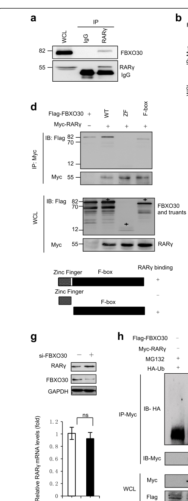

## Question

# Gene Research for Functional Annotation

## ⚠️ CRITICAL: Gene/Protein Identification Context

**BEFORE YOU BEGIN RESEARCH:** You MUST verify you are researching the CORRECT gene/protein. Gene symbols can be ambiguous, especially for less well-characterized genes from non-model organisms.

### Target Gene/Protein Identity (from UniProt):
- **UniProt Accession:** Q8TB52
- **Protein Description:** RecName: Full=F-box only protein 30;
- **Gene Information:** Name=FBXO30; Synonyms=FBX30;
- **Organism (full):** Homo sapiens (Human).
- **Protein Family:** Not specified in UniProt
- **Key Domains:** F-box-like_dom_sf. (IPR036047); F-box_dom. (IPR001810); Fbxo30/Fbxo40. (IPR031890); Znf_RING/FYVE/PHD. (IPR013083); Znf_TRAF. (IPR001293)

### MANDATORY VERIFICATION STEPS:

1. **Check if the gene symbol "FBXO30" matches the protein description above**
2. **Verify the organism is correct:** Homo sapiens (Human).
3. **Check if protein family/domains align with what you find in literature**
4. **If you find literature for a DIFFERENT gene with the same or similar symbol, STOP**

### If Gene Symbol is Ambiguous or You Cannot Find Relevant Literature:

**DO NOT PROCEED WITH RESEARCH ON A DIFFERENT GENE.** Instead:
- State clearly: "The gene symbol 'FBXO30' is ambiguous or literature is limited for this specific protein"
- Explain what you found (e.g., "Found extensive literature on a different gene with the same symbol in a different organism")
- Describe the protein based ONLY on the UniProt information provided above
- Suggest that the protein function can be inferred from domain/family information

### Research Target:

Please provide a comprehensive research report on the gene **FBXO30** (gene ID: FBXO30, UniProt: Q8TB52) in human.

The research report should be a detailed narrative explaining the function, biological processes, and localization of the gene product. Citations should be given for all claims.

You should prioritize authoritative reviews and primary scientific literature when conducting research. You can supplement
this with annotations you find in gene/protein databases, but these can be outdated or inaccurate.

We are specifically interested in the primary function of the gene - for enzymes, what reaction is catalyzed, and what is the substrate specificity? For transporters, what is the substrate? For structural proteins or adapters, what is the broader structural role? For signaling molecules, what is the role in the pathway.

We are interested in where in or outside the cell the gene product carries out its function.

We are also interested in the signaling or biochemical pathways in which the gene functions. We are less interested in broad pleiotropic effects, except where these elucidate the precise role.

Include evidence where possible. We are interested in both experimental evidence as well as inference from structure, evolution, or bioinformatic analysis. Precise studies should be prioritized over high-throughput, where available.

## Output

Question: You are an expert researcher providing comprehensive, well-cited information.

Provide detailed information focusing on:
1. Key concepts and definitions with current understanding
2. Recent developments and latest research (prioritize 2023-2024 sources)
3. Current applications and real-world implementations
4. Expert opinions and analysis from authoritative sources
5. Relevant statistics and data from recent studies

Format as a comprehensive research report with proper citations. Include URLs and publication dates where available.
Always prioritize recent, authoritative sources and provide specific citations for all major claims.

# Gene Research for Functional Annotation

## ⚠️ CRITICAL: Gene/Protein Identification Context

**BEFORE YOU BEGIN RESEARCH:** You MUST verify you are researching the CORRECT gene/protein. Gene symbols can be ambiguous, especially for less well-characterized genes from non-model organisms.

### Target Gene/Protein Identity (from UniProt):
- **UniProt Accession:** Q8TB52
- **Protein Description:** RecName: Full=F-box only protein 30;
- **Gene Information:** Name=FBXO30; Synonyms=FBX30;
- **Organism (full):** Homo sapiens (Human).
- **Protein Family:** Not specified in UniProt
- **Key Domains:** F-box-like_dom_sf. (IPR036047); F-box_dom. (IPR001810); Fbxo30/Fbxo40. (IPR031890); Znf_RING/FYVE/PHD. (IPR013083); Znf_TRAF. (IPR001293)

### MANDATORY VERIFICATION STEPS:

1. **Check if the gene symbol "FBXO30" matches the protein description above**
2. **Verify the organism is correct:** Homo sapiens (Human).
3. **Check if protein family/domains align with what you find in literature**
4. **If you find literature for a DIFFERENT gene with the same or similar symbol, STOP**

### If Gene Symbol is Ambiguous or You Cannot Find Relevant Literature:

**DO NOT PROCEED WITH RESEARCH ON A DIFFERENT GENE.** Instead:
- State clearly: "The gene symbol 'FBXO30' is ambiguous or literature is limited for this specific protein"
- Explain what you found (e.g., "Found extensive literature on a different gene with the same symbol in a different organism")
- Describe the protein based ONLY on the UniProt information provided above
- Suggest that the protein function can be inferred from domain/family information

### Research Target:

Please provide a comprehensive research report on the gene **FBXO30** (gene ID: FBXO30, UniProt: Q8TB52) in human.

The research report should be a detailed narrative explaining the function, biological processes, and localization of the gene product. Citations should be given for all claims.

You should prioritize authoritative reviews and primary scientific literature when conducting research. You can supplement
this with annotations you find in gene/protein databases, but these can be outdated or inaccurate.

We are specifically interested in the primary function of the gene - for enzymes, what reaction is catalyzed, and what is the substrate specificity? For transporters, what is the substrate? For structural proteins or adapters, what is the broader structural role? For signaling molecules, what is the role in the pathway.

We are interested in where in or outside the cell the gene product carries out its function.

We are also interested in the signaling or biochemical pathways in which the gene functions. We are less interested in broad pleiotropic effects, except where these elucidate the precise role.

Include evidence where possible. We are interested in both experimental evidence as well as inference from structure, evolution, or bioinformatic analysis. Precise studies should be prioritized over high-throughput, where available.

## Research report: Human **FBXO30** (UniProt **Q8TB52**) — functional annotation and current evidence base

### 0) Target verification (gene/protein identity)
The gene symbol **FBXO30** corresponds to **F-box only protein 30** (synonym **FBX30**) in **Homo sapiens**, consistent with the human experimental literature that explicitly studies “FBXO30/F-box protein 30” as an F-box–containing ubiquitin-ligase component. In a human mechanistic study, FBXO30 was mapped to contain an **F-box domain** (aa **373–409**) and a **zinc-finger domain** (aa **48–109**), matching the domain expectations for an F-box substrate receptor with additional protein–protein interaction motifs (cheng2019fboxproteinfbxo30 pages 4-7). 

### 1) Key concepts and definitions (current understanding)

#### 1.1 F-box proteins and SCF/Cullin-RING E3 ligases
F-box proteins are substrate-recognition modules within **SKP1–CUL1–F-box (SCF)** E3 ubiquitin ligase complexes. SCF/CRL architecture typically includes a **cullin scaffold (e.g., CUL1)** and **ROC1/RBX1** to recruit the ubiquitin-charged E2 enzyme, while the **F-box protein provides substrate specificity** (fischer2023identificationofhypertrophymodulating pages 1-2). This conceptual framework is essential for interpreting FBXO30: it is not an enzyme that catalyzes a small-molecule reaction; rather, it confers target specificity for **ubiquitylation leading to proteasomal degradation**.

#### 1.2 Molecular function of FBXO30 (what it “does”)
Across human and mouse experimental systems, the evidence supports FBXO30 as an **SCF-type F-box adaptor/E3 ligase component** that promotes **ubiquitin-dependent, proteasome-mediated turnover** of specific protein substrates in a **context- and tissue-dependent** manner. Human work directly demonstrates FBXO30-mediated ubiquitylation of **RARγ** and proteasome-dependent regulation of **HIF-1α** (cheng2019fboxproteinfbxo30 pages 4-7, yuan2023fbxo30functionsas pages 4-6).

### 2) Domain architecture and subcellular localization

#### 2.1 Domain architecture
In human cells, FBXO30 contains:
- **Zinc finger domain** (aa 48–109)
- **F-box domain** (aa 373–409)
These features were experimentally used for interaction mapping with RARγ (cheng2019fboxproteinfbxo30 pages 4-7) and are also shown in the extracted figure panel(s) (cheng2019fboxproteinfbxo30 media aa47de8f).

#### 2.2 Subcellular localization
A human study reports FBXO30 is **predominantly cytoplasmic**, and FBXO30 and RARγ show **cytoplasmic colocalization** by immunofluorescence (cheng2019fboxproteinfbxo30 pages 4-7). In mouse oocytes, Fbxo30 displays **dynamic localization**: nuclear at GV stage, then cytoplasmic with enrichment around chromosomes after GVBD, and spindle-associated at Pro-MI/MI (jin2019fbxo30regulateschromosome pages 4-6, jin2019fbxo30regulateschromosome pages 1-2). These observations are consistent with a protein whose functional localization depends on cellular state and substrate.

### 3) Experimentally supported substrates, pathways, and mechanisms

| Evidence type | Molecular role | Validated substrates | Pathway/process | Subcellular localization | Key quantitative findings | Diseases/phenotypes | Primary reference (year) | DOI URL |
|---|---|---|---|---|---|---|---|---|
| Human; in vitro (HEK293, NT2/D1), human fetal tissue | F-box protein functioning as E3 ubiquitin ligase/SCF-type substrate adaptor for proteasomal turnover | RARγ | RA/RARγ-BMP signaling; positive regulation of BMP signaling via RARγ degradation | Predominantly cytoplasmic; cytoplasmic colocalization with RARγ; domains mapped: zinc finger aa48-109, F-box aa373-409 | RARγ half-life ~4 h; FBXO30 knockdown RNA-seq: 86 upregulated and 78 downregulated genes; positive correlation with ID2 r=0.672 (p<0.05); negative correlation with chordin r=-0.515 (p<0.05); NanoString n=10; some WB n=3; human NTD retinoid values reported up to ~9.31 ng/mg in anencephaly vs up to ~3.70 ng/mg in controls (cheng2019fboxproteinfbxo30 pages 4-7, cheng2019fboxproteinfbxo30 pages 11-14, cheng2019fboxproteinfbxo30 media aa47de8f) | Neural tube defects; aberrant FBXO30 levels/downregulation in high-retinol NTD samples; reduced BMP target gene expression (cheng2019fboxproteinfbxo30 pages 1-2, cheng2019fboxproteinfbxo30 pages 4-7, cheng2019fboxproteinfbxo30 pages 11-14) | Cheng et al. (2019) (cheng2019fboxproteinfbxo30 pages 1-2, cheng2019fboxproteinfbxo30 pages 4-7) | https://doi.org/10.1038/s41419-019-1783-y |
| Human; in vitro and in vivo (ccRCC cell lines, xenograft/metastasis models), human tumor cohorts | F-box protein in SCF-type E3 ligase complexes; tumor-suppressive E3 ligase promoting proteasome-dependent HIF-1α degradation in hZIP1/Zn2+-dependent axis | HIF-1α | Hypoxia/HIF-1α regulation; hZIP1/Zn2+/FBXO30/HIF-1α axis | Not established in gathered 2023 ccRCC evidence | TCGA analyses used 533 ccRCC vs 72 adjacent normal tissues in one report; another excerpt reports 253 renal cancer tissues vs 72 normal tissues; clinical validation included 20 paired tumors for WB and 24 paired tumors for RT-qPCR; xenograft n=5/group; lung metastasis assay n=3/group; higher FBXO30 associated with better overall survival using 50% cutoff (yuan2023fbxo30functionsas pages 3-4, yuan2023fbxo30functionsas pages 4-6, yuan2023fbxo30functionsas pages 1-2) | Clear cell renal cell carcinoma; FBXO30 downregulated with higher grade/stage; FBXO30 overexpression suppresses proliferation, invasion, EMT, tumorigenesis, metastasis (yuan2023fbxo30functionsas pages 3-4, yuan2023fbxo30functionsas pages 4-6) | Yuan et al. (2023) (yuan2023fbxo30functionsas pages 3-4, yuan2023fbxo30functionsas pages 4-6, yuan2023fbxo30functionsas pages 1-2) | https://doi.org/10.3892/ijo.2023.5488 |
| Mouse; in vivo mammary gland plus biochemical/cell-based assays | SCF adaptor/E3 ligase component; binds SKP1 and CUL1 and ubiquitinates substrate | Eg5/KIF11 | Mitosis, centrosome homeostasis, spindle assembly, mammopoiesis | Not established in gathered excerpts | Mass spectrometry identified 7 unique EG5 peptides; co-IP recovered EG5, SKP1, CUL1; Eg5-binding region mapped to C-terminus likely aa812-1052; rescue of Fbxo30-/- defects by shRNA or EG5 inhibitor demonstrated functional specificity (liu2016fbxo30regulatesmammopoiesis pages 1-3, liu2016fbxo30regulatesmammopoiesis pages 3-4, liu2016fbxo30regulatesmammopoiesis pages 16-20) | Mammary gland developmental defects; impaired mammary stem/progenitor function; centrosome and spindle abnormalities when Fbxo30 lost (liu2016fbxo30regulatesmammopoiesis pages 1-3, liu2016fbxo30regulatesmammopoiesis pages 16-20) | Liu et al. (2016) (liu2016fbxo30regulatesmammopoiesis pages 1-3, liu2016fbxo30regulatesmammopoiesis pages 3-4, liu2016fbxo30regulatesmammopoiesis pages 16-20) | https://doi.org/10.1016/j.celrep.2016.03.083 |
| Mouse; oocyte RNAi, proteomics, immunofluorescence, transfected cells | F-box protein/SCF-family substrate selector promoting ubiquitin-proteasome turnover | SLBP | Oocyte meiosis; chromosome condensation/segregation via SLBP-histone H3 control | Nuclear at GV; cytoplasmic after GVBD with enrichment around chromosomes; spindle-associated at Pro-MI/MI; minimal at MII (jin2019fbxo30regulateschromosome pages 4-6, jin2019fbxo30regulateschromosome pages 1-2) | iTRAQ used 3000 MI oocytes/group; 238 Fbxo30-associated proteins identified; 13 unique SLBP peptides detected; MG132 4 μM for 6 h used in ubiquitination/proteasome assays (jin2019fbxo30regulateschromosome pages 4-6, jin2019fbxo30regulateschromosome pages 2-4) | Meiotic arrest, failure of polar body extrusion, chromosome overcondensation and segregation defects after Fbxo30 depletion; rescue by SLBP knockdown (jin2019fbxo30regulateschromosome pages 4-6, jin2019fbxo30regulateschromosome pages 2-4, jin2019fbxo30regulateschromosome pages 1-2) | Jin et al. (2019) (jin2019fbxo30regulateschromosome pages 4-6, jin2019fbxo30regulateschromosome pages 2-4, jin2019fbxo30regulateschromosome pages 1-2) | https://doi.org/10.1007/s00018-019-03038-z |
| Cross-source synthesis: human primary evidence plus mouse functional orthology | Overall current annotation: substrate-recognition F-box protein in SCF/CUL1-RING ubiquitin ligase complexes, with context-dependent substrates rather than enzymatic small-molecule catalysis | Human: RARγ, HIF-1α; Mouse: Eg5/KIF11, SLBP | Developmental signaling (RA/BMP), hypoxia signaling, mitotic control, chromosome segregation | Context-dependent; cytoplasmic in human RARγ study; spindle/chromosome-associated in mouse oocytes (cheng2019fboxproteinfbxo30 pages 4-7, jin2019fbxo30regulateschromosome pages 4-6, jin2019fbxo30regulateschromosome pages 1-2) | Recent review notes many F-box proteins in spermatogenesis remain incompletely defined; for FBXO30, mechanistic evidence is still substrate- and tissue-specific rather than system-wide (OpenTargets Search: -FBXO30) | Disease links supported in Open Targets include neural tube defect and nonpapillary renal cell carcinoma, but evidence base is limited and literature-driven rather than genetically definitive (OpenTargets Search: -FBXO30) | Open Targets / literature-supported synthesis (2024 update context) (OpenTargets Search: -FBXO30) | https://platform.opentargets.org/target/ENSG00000118496 |

*Table: This table summarizes experimentally supported functional annotation for human FBXO30 (UniProt Q8TB52) and the most relevant orthologous mouse evidence. It organizes validated substrates, pathways, localization, quantitative findings, and disease links so the evidence base can be assessed at a glance.*

#### 3.1 FBXO30 → RARγ ubiquitylation links retinoic acid signaling to BMP pathway control (development/NTD)
**Mechanism (human cells):** FBXO30 interacts with **retinoic acid receptor γ (RARγ)** (identified by IP/MS and validated by co-IP) and promotes **ubiquitylation** of RARγ (cheng2019fboxproteinfbxo30 pages 4-7). Truncation mapping indicates the **F-box domain** is necessary/sufficient for the FBXO30–RARγ interaction (cheng2019fboxproteinfbxo30 pages 4-7); the domain schematic and mapping are visible in the extracted figure region (cheng2019fboxproteinfbxo30 media aa47de8f). 

**Pathway consequence:** The study positions FBXO30 as a **positive regulator of BMP signaling** by destabilizing RARγ, thereby modulating RA-mediated suppression of BMP outputs (cheng2019fboxproteinfbxo30 pages 4-7, cheng2019fboxproteinfbxo30 pages 1-2). BMP pathway readouts (e.g., BRE reporter activity, p-Smad1/5) and RARγ ubiquitylation assays are shown in the extracted figures (cheng2019fboxproteinfbxo30 media aa47de8f, cheng2019fboxproteinfbxo30 media 665338cd, cheng2019fboxproteinfbxo30 media 0fad8d55).

**Quantitative data:** RARγ is described as a short-lived protein with **~4 h half-life** (cheng2019fboxproteinfbxo30 pages 4-7). RNA-seq after FBXO30 depletion identified **86 upregulated and 78 downregulated genes** (cheng2019fboxproteinfbxo30 pages 4-7). In NTD-associated tissue analyses, correlations with BMP-related genes included **FBXO30–ID2 r = 0.672 (p < 0.05)** and **FBXO30–chordin r = −0.515 (p < 0.05)** (cheng2019fboxproteinfbxo30 pages 11-14).

**Human disease/tissue evidence:** FBXO30 protein was reported as **significantly downregulated** in **human fetal brain tissue** from neural tube defect (NTD) cases relative to controls (cheng2019fboxproteinfbxo30 pages 4-7). A clinical table in the same study reports higher retinoid values in anencephaly samples (up to ~**9.31 ng/mg**) compared with controls (up to ~**3.70 ng/mg**) (cheng2019fboxproteinfbxo30 pages 11-14), and this table is present in the extracted visual content (cheng2019fboxproteinfbxo30 media aa47de8f, cheng2019fboxproteinfbxo30 media eab6c99f).

**Interpretation:** The most direct mechanistic chain supported by experimental evidence is: **retinoid/RA exposure → reduced FBXO30 levels → altered RARγ stability → altered BMP signaling outputs**, which provides a plausible molecular link between environmental vitamin A derivatives and developmental signaling defects (cheng2019fboxproteinfbxo30 pages 1-2, cheng2019fboxproteinfbxo30 pages 11-14).

#### 3.2 FBXO30 → HIF-1α degradation axis in clear cell renal cell carcinoma (2023)
A 2023 study in clear cell renal cell carcinoma (ccRCC) reports that FBXO30 **mediates ubiquitination and proteasomal degradation of HIF‑1α under normoxia**, functioning as a tumor suppressor in their models (yuan2023fbxo30functionsas pages 4-6, yuan2023fbxo30functionsas pages 1-2). 

**Cohorts and models (quantitative details):**
- TCGA-level comparisons described include **533 ccRCC vs 72 adjacent normal tissues** in one excerpted analysis (yuan2023fbxo30functionsas pages 3-4) and **253 renal cancer tissues vs 72 normal tissues** in another excerpt (yuan2023fbxo30functionsas pages 4-6). 
- Clinical validation included **20 paired** ccRCC/adjacent tissues by western blot and **24 paired** samples by RT-qPCR (yuan2023fbxo30functionsas pages 4-6). 
- In vivo assays reported **n=5 mice/group** for subcutaneous xenografts and **n=3 mice/group** for lung metastasis models (yuan2023fbxo30functionsas pages 3-4).

**Mechanistic evidence:** FBXO30 altered HIF‑1α at the protein (not mRNA) level, and the proteasome inhibitor **MG132** reversed FBXO30’s negative regulation, consistent with proteasome-dependent turnover (yuan2023fbxo30functionsas pages 4-6). The paper proposes an upstream **hZIP1/Zn2+** regulation of FBXO30 and HIF‑1α (yuan2023fbxo30functionsas pages 1-2). 

**Interpretation and limitations:** The study provides a coherent E3-ligase mechanism in a specific tumor context but, in the retrieved excerpts, does not provide hazard ratios or detailed effect-size statistics beyond survival stratification and experimental sample sizes (yuan2023fbxo30functionsas pages 4-6).

#### 3.3 Cross-species mechanistic substrates informing conserved biology (mouse evidence)
Although the user’s target is the **human** protein, mechanistic studies of the **mouse ortholog** provide strong biochemical evidence for SCF assembly and substrate specificity that plausibly generalizes to the human protein family member.

**Eg5/KIF11 (mitosis; mammopoiesis):** In a mouse study, Fbxo30 physically associates with **Skp1 and Cul1** and targets the mitotic kinesin **Eg5/KIF11** for ubiquitin-dependent regulation. Mass spectrometry recovered SCF components and Eg5 peptides; co-IPs and in vitro ubiquitination assays support Eg5 as a substrate; and genetic/chemical normalization of Eg5 activity rescued mammary epithelial proliferation and mammopoiesis defects in Fbxo30−/− mice (liu2016fbxo30regulatesmammopoiesis pages 3-4, liu2016fbxo30regulatesmammopoiesis pages 16-20).

**SLBP (chromosome segregation; oocyte meiosis):** Another mouse study identified **SLBP** as an Fbxo30-associated protein by IP-MS, with **13 unique peptides** detected; depletion of Fbxo30 caused meiotic arrest and chromosome segregation defects that were rescued by SLBP knockdown, consistent with SLBP being a functional substrate (jin2019fbxo30regulateschromosome pages 4-6, jin2019fbxo30regulateschromosome pages 2-4, jin2019fbxo30regulateschromosome pages 1-2).

### 4) Recent developments (prioritizing 2023–2024)

#### 4.1 2023: FBXO30 as a putative tumor suppressor E3 ligase in ccRCC via HIF‑1α turnover
The clearest 2023 advance specific to FBXO30 is the ccRCC mechanism implicating FBXO30 in **HIF‑1α degradation** and tumor suppression phenotypes across in vitro assays and mouse xenograft/metastasis models, supported by patient-tissue comparisons (yuan2023fbxo30functionsas pages 3-4, yuan2023fbxo30functionsas pages 4-6).

#### 4.2 2023: Phenotypic screening implicates Fbxo30 in cardiomyocyte hypertrophy modulation
A 2023 functional genomics screen of Cullin-RING ligase components in neonatal rat cardiomyocytes identified **Fbxo30** as a hit where **siRNA depletion increased cardiomyocyte cell size under basal conditions**, suggesting a negative regulatory role in hypertrophy pathways (fischer2023identificationofhypertrophymodulating pages 1-2, fischer2023identificationofhypertrophymodulating pages 6-8). The paper provides expert caveats common to CRL screens (e.g., limited mechanistic data for many F-box proteins and expression–function disconnects), which is relevant for interpreting FBXO30 as under-characterized outside a few substrate-defined contexts (fischer2023identificationofhypertrophymodulating pages 6-8).

#### 4.3 2024: Continued emphasis on tissue-specific roles of F-box proteins; limited direct FBXO30 review coverage
A 2024 review of F-box proteins in spermatogenesis provides broader SCF context and highlights that many F-box proteins remain incompletely characterized at the substrate level; however, in the retrieved excerpt it does not directly discuss FBXO30 (xuan2024theemergingand pages 11-12). This underscores a field-wide gap: FBXO30 currently has **few well-validated substrates** compared with prominent F-box proteins (xuan2024theemergingand pages 11-12).

### 5) Current applications and real-world implementations

#### 5.1 Biomarker/target hypotheses in cancer and developmental disorders
- **Cancer:** The ccRCC study positions FBXO30 expression and its regulation of HIF‑1α as potentially relevant for prognosis/therapeutic targeting, though the retrieved excerpt does not provide complete clinical performance statistics (yuan2023fbxo30functionsas pages 4-6). 
- **Developmental biology/NTD:** The RARγ/BMP mechanism suggests FBXO30 could be considered in mechanistic interpretations of **retinoid-associated teratogenicity** and BMP pathway dysregulation, including in human fetal tissue contexts (cheng2019fboxproteinfbxo30 pages 4-7, cheng2019fboxproteinfbxo30 pages 11-14).

#### 5.2 Translational strategy context: targeting ubiquitin ligase pathways
In general, SCF-type E3 ligase components are increasingly viewed as druggable nodes (e.g., via ligase-substrate interaction disruption or targeted protein degradation approaches). However, no direct FBXO30-targeting therapeutic modality was identified in the retrieved 2023–2024 literature set; current evidence best supports FBXO30 as a **biologically relevant node** with **context-dependent substrates** rather than an established drug target.

### 6) Expert opinion / authoritative synthesis (from sources retrieved here)
- The cardiomyocyte CRL screening study provides an “expert-methods” lens: F-box proteins are interchangeable substrate receptors within CRLs/SCFs, and phenotypic screens can identify candidate regulators (including FBXO30), but many hits lack deep mechanistic characterization and require substrate identification follow-up (fischer2023identificationofhypertrophymodulating pages 6-8). 
- Open Targets provides a synthesis of genetics and literature that places FBXO30 among modestly supported associations with **neoplasm**, **nonpapillary renal cell carcinoma**, and **neural tube defect**, emphasizing that current human disease linkage is largely literature-driven with relatively modest association scores (OpenTargets Search: -FBXO30).

### 7) Disease associations and supporting statistics (Open Targets and primary literature)
Open Targets (target **ENSG00000118496**) lists associations (each showing **3 evidences** in the extract) with **neoplasm**, **nonpapillary renal cell carcinoma**, **neural tube defect**, **hair color**, and **abnormality of the skeletal system**, supported by literature (Europe PMC) and GWAS credible sets. Two key supporting references in the Open Targets extract are PubMed **31320612** (2019; PMCID **PMC6639381**) and PubMed **36799168** (2023; PMCID **PMC9946804**), corresponding to the mechanistic NTD and ccRCC evidence base; the association scores shown are modest (e.g., neoplasm ~0.088; nonpapillary RCC ~0.074; neural tube defect ~0.058; skeletal system abnormality ~0.133) (OpenTargets Search: -FBXO30). 

### 8) Summary: primary functional annotation (best-supported)
The best-supported primary function of **human FBXO30 (Q8TB52)** is as an **F-box substrate-recognition component of an SCF/CUL1-type E3 ubiquitin ligase**, mediating **ubiquitylation and proteasome-dependent degradation** of specific substrates. Two human substrates have direct mechanistic evidence in the retrieved corpus: **RARγ** (linking retinoic acid signaling to BMP pathway outputs in development/NTD) and **HIF‑1α** (tumor biology in ccRCC, including a proposed hZIP1/Zn2+ upstream axis). Mouse ortholog studies extend mechanistic breadth, identifying **Eg5/KIF11** and **SLBP** as context-specific substrates involved in mitosis/mammopoiesis and oocyte chromosome segregation, respectively, and provide direct biochemical evidence for SCF assembly (cheng2019fboxproteinfbxo30 pages 4-7, yuan2023fbxo30functionsas pages 4-6, liu2016fbxo30regulatesmammopoiesis pages 16-20, jin2019fbxo30regulateschromosome pages 2-4).

---

### Key sources (publication dates and URLs)
- **Yuan et al.** “FBXO30 functions as a tumor suppressor and an E3 ubiquitin ligase for hZIP1-mediated HIF-1α degradation in renal cell carcinoma.” *International Journal of Oncology* (**Feb 2023**). https://doi.org/10.3892/ijo.2023.5488 (yuan2023fbxo30functionsas pages 3-4, yuan2023fbxo30functionsas pages 4-6)
- **Fischer et al.** “Identification of hypertrophy-modulating Cullin-RING ubiquitin ligases in primary cardiomyocytes.” *Frontiers in Physiology* (**Mar 2023**). https://doi.org/10.3389/fphys.2023.1134339 (fischer2023identificationofhypertrophymodulating pages 1-2, fischer2023identificationofhypertrophymodulating pages 6-8)
- **Cheng et al.** “F-box protein FBXO30 mediates retinoic acid receptor γ ubiquitination and regulates BMP signaling in neural tube defects.” *Cell Death & Disease* (**Jul 2019**). https://doi.org/10.1038/s41419-019-1783-y (cheng2019fboxproteinfbxo30 pages 4-7, cheng2019fboxproteinfbxo30 pages 11-14)
- **Liu et al.** “Fbxo30 Regulates Mammopoiesis by Targeting the Bipolar Mitotic Kinesin Eg5.” *Cell Reports* (**May 2016**). https://doi.org/10.1016/j.celrep.2016.03.083 (liu2016fbxo30regulatesmammopoiesis pages 3-4, liu2016fbxo30regulatesmammopoiesis pages 16-20)
- **Jin et al.** “Fbxo30 regulates chromosome segregation of oocyte meiosis.” *Cellular and Molecular Life Sciences* (**Apr 2019**). https://doi.org/10.1007/s00018-019-03038-z (jin2019fbxo30regulateschromosome pages 4-6, jin2019fbxo30regulateschromosome pages 2-4)
- **Open Targets Platform**: FBXO30 (ENSG00000118496) disease associations (accessed via tool; platform reference cited in extract). https://platform.opentargets.org/target/ENSG00000118496 (OpenTargets Search: -FBXO30)

References

1. (cheng2019fboxproteinfbxo30 pages 4-7): Xiyue Cheng, Pei Pei, Juan Yu, Qin Zhang, Dan Li, Xiaolu Xie, Jianxin Wu, Shan Wang, and Ting Zhang. F-box protein fbxo30 mediates retinoic acid receptor γ ubiquitination and regulates bmp signaling in neural tube defects. Cell Death & Disease, Jul 2019. URL: https://doi.org/10.1038/s41419-019-1783-y, doi:10.1038/s41419-019-1783-y. This article has 30 citations and is from a peer-reviewed journal.

2. (fischer2023identificationofhypertrophymodulating pages 1-2): Maximillian Fischer, Moritz Jakab, Marc N. Hirt, Tessa R. Werner, Stefan Engelhardt, and Antonio Sarikas. Identification of hypertrophy-modulating cullin-ring ubiquitin ligases in primary cardiomyocytes. Frontiers in Physiology, Mar 2023. URL: https://doi.org/10.3389/fphys.2023.1134339, doi:10.3389/fphys.2023.1134339. This article has 5 citations.

3. (yuan2023fbxo30functionsas pages 4-6): Yulin Yuan, Zimeng Liu, Bohan Li, Zheng Gong, Chiyuan Piao, Zhuonan Liu, Zhe Zhang, and Xiao Dong. Fbxo30 functions as a tumor suppressor and an e3 ubiquitin ligase for hzip1-mediated hif-1α degradation in renal cell carcinoma. International Journal of Oncology, Feb 2023. URL: https://doi.org/10.3892/ijo.2023.5488, doi:10.3892/ijo.2023.5488. This article has 8 citations and is from a peer-reviewed journal.

4. (cheng2019fboxproteinfbxo30 media aa47de8f): Xiyue Cheng, Pei Pei, Juan Yu, Qin Zhang, Dan Li, Xiaolu Xie, Jianxin Wu, Shan Wang, and Ting Zhang. F-box protein fbxo30 mediates retinoic acid receptor γ ubiquitination and regulates bmp signaling in neural tube defects. Cell Death & Disease, Jul 2019. URL: https://doi.org/10.1038/s41419-019-1783-y, doi:10.1038/s41419-019-1783-y. This article has 30 citations and is from a peer-reviewed journal.

5. (jin2019fbxo30regulateschromosome pages 4-6): Yimei Jin, Mo Yang, Chang Gao, Wei Yue, Xiaoling Liang, Bingteng Xie, Xiaohui Zhu, Shangrong Fan, Rong Li, and Mo Li. Fbxo30 regulates chromosome segregation of oocyte meiosis. Cellular and Molecular Life Sciences, 76:2217-2229, Apr 2019. URL: https://doi.org/10.1007/s00018-019-03038-z, doi:10.1007/s00018-019-03038-z. This article has 26 citations and is from a domain leading peer-reviewed journal.

6. (jin2019fbxo30regulateschromosome pages 1-2): Yimei Jin, Mo Yang, Chang Gao, Wei Yue, Xiaoling Liang, Bingteng Xie, Xiaohui Zhu, Shangrong Fan, Rong Li, and Mo Li. Fbxo30 regulates chromosome segregation of oocyte meiosis. Cellular and Molecular Life Sciences, 76:2217-2229, Apr 2019. URL: https://doi.org/10.1007/s00018-019-03038-z, doi:10.1007/s00018-019-03038-z. This article has 26 citations and is from a domain leading peer-reviewed journal.

7. (cheng2019fboxproteinfbxo30 pages 11-14): Xiyue Cheng, Pei Pei, Juan Yu, Qin Zhang, Dan Li, Xiaolu Xie, Jianxin Wu, Shan Wang, and Ting Zhang. F-box protein fbxo30 mediates retinoic acid receptor γ ubiquitination and regulates bmp signaling in neural tube defects. Cell Death & Disease, Jul 2019. URL: https://doi.org/10.1038/s41419-019-1783-y, doi:10.1038/s41419-019-1783-y. This article has 30 citations and is from a peer-reviewed journal.

8. (cheng2019fboxproteinfbxo30 pages 1-2): Xiyue Cheng, Pei Pei, Juan Yu, Qin Zhang, Dan Li, Xiaolu Xie, Jianxin Wu, Shan Wang, and Ting Zhang. F-box protein fbxo30 mediates retinoic acid receptor γ ubiquitination and regulates bmp signaling in neural tube defects. Cell Death & Disease, Jul 2019. URL: https://doi.org/10.1038/s41419-019-1783-y, doi:10.1038/s41419-019-1783-y. This article has 30 citations and is from a peer-reviewed journal.

9. (yuan2023fbxo30functionsas pages 3-4): Yulin Yuan, Zimeng Liu, Bohan Li, Zheng Gong, Chiyuan Piao, Zhuonan Liu, Zhe Zhang, and Xiao Dong. Fbxo30 functions as a tumor suppressor and an e3 ubiquitin ligase for hzip1-mediated hif-1α degradation in renal cell carcinoma. International Journal of Oncology, Feb 2023. URL: https://doi.org/10.3892/ijo.2023.5488, doi:10.3892/ijo.2023.5488. This article has 8 citations and is from a peer-reviewed journal.

10. (yuan2023fbxo30functionsas pages 1-2): Yulin Yuan, Zimeng Liu, Bohan Li, Zheng Gong, Chiyuan Piao, Zhuonan Liu, Zhe Zhang, and Xiao Dong. Fbxo30 functions as a tumor suppressor and an e3 ubiquitin ligase for hzip1-mediated hif-1α degradation in renal cell carcinoma. International Journal of Oncology, Feb 2023. URL: https://doi.org/10.3892/ijo.2023.5488, doi:10.3892/ijo.2023.5488. This article has 8 citations and is from a peer-reviewed journal.

11. (liu2016fbxo30regulatesmammopoiesis pages 1-3): Yan Liu, Yin Wang, Zhanwen Du, Xiaoli Yan, Pan Zheng, and Yang Liu. Fbxo30 regulates mammopoiesis by targeting the bipolar mitotic kinesin eg5. Cell reports, 15 5:1111-1122, May 2016. URL: https://doi.org/10.1016/j.celrep.2016.03.083, doi:10.1016/j.celrep.2016.03.083. This article has 15 citations and is from a highest quality peer-reviewed journal.

12. (liu2016fbxo30regulatesmammopoiesis pages 3-4): Yan Liu, Yin Wang, Zhanwen Du, Xiaoli Yan, Pan Zheng, and Yang Liu. Fbxo30 regulates mammopoiesis by targeting the bipolar mitotic kinesin eg5. Cell reports, 15 5:1111-1122, May 2016. URL: https://doi.org/10.1016/j.celrep.2016.03.083, doi:10.1016/j.celrep.2016.03.083. This article has 15 citations and is from a highest quality peer-reviewed journal.

13. (liu2016fbxo30regulatesmammopoiesis pages 16-20): Yan Liu, Yin Wang, Zhanwen Du, Xiaoli Yan, Pan Zheng, and Yang Liu. Fbxo30 regulates mammopoiesis by targeting the bipolar mitotic kinesin eg5. Cell reports, 15 5:1111-1122, May 2016. URL: https://doi.org/10.1016/j.celrep.2016.03.083, doi:10.1016/j.celrep.2016.03.083. This article has 15 citations and is from a highest quality peer-reviewed journal.

14. (jin2019fbxo30regulateschromosome pages 2-4): Yimei Jin, Mo Yang, Chang Gao, Wei Yue, Xiaoling Liang, Bingteng Xie, Xiaohui Zhu, Shangrong Fan, Rong Li, and Mo Li. Fbxo30 regulates chromosome segregation of oocyte meiosis. Cellular and Molecular Life Sciences, 76:2217-2229, Apr 2019. URL: https://doi.org/10.1007/s00018-019-03038-z, doi:10.1007/s00018-019-03038-z. This article has 26 citations and is from a domain leading peer-reviewed journal.

15. (OpenTargets Search: -FBXO30): Open Targets Query (-FBXO30, 5 results). Buniello, A. et al. (2025). Open Targets Platform: facilitating therapeutic hypotheses building in drug discovery. Nucleic Acids Research.

16. (cheng2019fboxproteinfbxo30 media 665338cd): Xiyue Cheng, Pei Pei, Juan Yu, Qin Zhang, Dan Li, Xiaolu Xie, Jianxin Wu, Shan Wang, and Ting Zhang. F-box protein fbxo30 mediates retinoic acid receptor γ ubiquitination and regulates bmp signaling in neural tube defects. Cell Death & Disease, Jul 2019. URL: https://doi.org/10.1038/s41419-019-1783-y, doi:10.1038/s41419-019-1783-y. This article has 30 citations and is from a peer-reviewed journal.

17. (cheng2019fboxproteinfbxo30 media 0fad8d55): Xiyue Cheng, Pei Pei, Juan Yu, Qin Zhang, Dan Li, Xiaolu Xie, Jianxin Wu, Shan Wang, and Ting Zhang. F-box protein fbxo30 mediates retinoic acid receptor γ ubiquitination and regulates bmp signaling in neural tube defects. Cell Death & Disease, Jul 2019. URL: https://doi.org/10.1038/s41419-019-1783-y, doi:10.1038/s41419-019-1783-y. This article has 30 citations and is from a peer-reviewed journal.

18. (cheng2019fboxproteinfbxo30 media eab6c99f): Xiyue Cheng, Pei Pei, Juan Yu, Qin Zhang, Dan Li, Xiaolu Xie, Jianxin Wu, Shan Wang, and Ting Zhang. F-box protein fbxo30 mediates retinoic acid receptor γ ubiquitination and regulates bmp signaling in neural tube defects. Cell Death & Disease, Jul 2019. URL: https://doi.org/10.1038/s41419-019-1783-y, doi:10.1038/s41419-019-1783-y. This article has 30 citations and is from a peer-reviewed journal.

19. (fischer2023identificationofhypertrophymodulating pages 6-8): Maximillian Fischer, Moritz Jakab, Marc N. Hirt, Tessa R. Werner, Stefan Engelhardt, and Antonio Sarikas. Identification of hypertrophy-modulating cullin-ring ubiquitin ligases in primary cardiomyocytes. Frontiers in Physiology, Mar 2023. URL: https://doi.org/10.3389/fphys.2023.1134339, doi:10.3389/fphys.2023.1134339. This article has 5 citations.

20. (xuan2024theemergingand pages 11-12): Zhuang Xuan, Jun Ruan, Canquan Zhou, and Zhi-ming Li. The emerging and diverse roles of f-box proteins in spermatogenesis and male infertility. Cell Regeneration, Jun 2024. URL: https://doi.org/10.1186/s13619-024-00196-9, doi:10.1186/s13619-024-00196-9. This article has 5 citations.

## Artifacts

- [Edison artifact artifact-00](FBXO30-deep-research-falcon_artifacts/artifact-00.md)

## Citations

1. fischer2023identificationofhypertrophymodulating pages 1-2
2. fischer2023identificationofhypertrophymodulating pages 6-8
3. xuan2024theemergingand pages 11-12
4. https://doi.org/10.1038/s41419-019-1783-y
5. https://doi.org/10.3892/ijo.2023.5488
6. https://doi.org/10.1016/j.celrep.2016.03.083
7. https://doi.org/10.1007/s00018-019-03038-z
8. https://platform.opentargets.org/target/ENSG00000118496
9. https://doi.org/10.3389/fphys.2023.1134339
10. https://doi.org/10.1038/s41419-019-1783-y,
11. https://doi.org/10.3389/fphys.2023.1134339,
12. https://doi.org/10.3892/ijo.2023.5488,
13. https://doi.org/10.1007/s00018-019-03038-z,
14. https://doi.org/10.1016/j.celrep.2016.03.083,
15. https://doi.org/10.1186/s13619-024-00196-9,