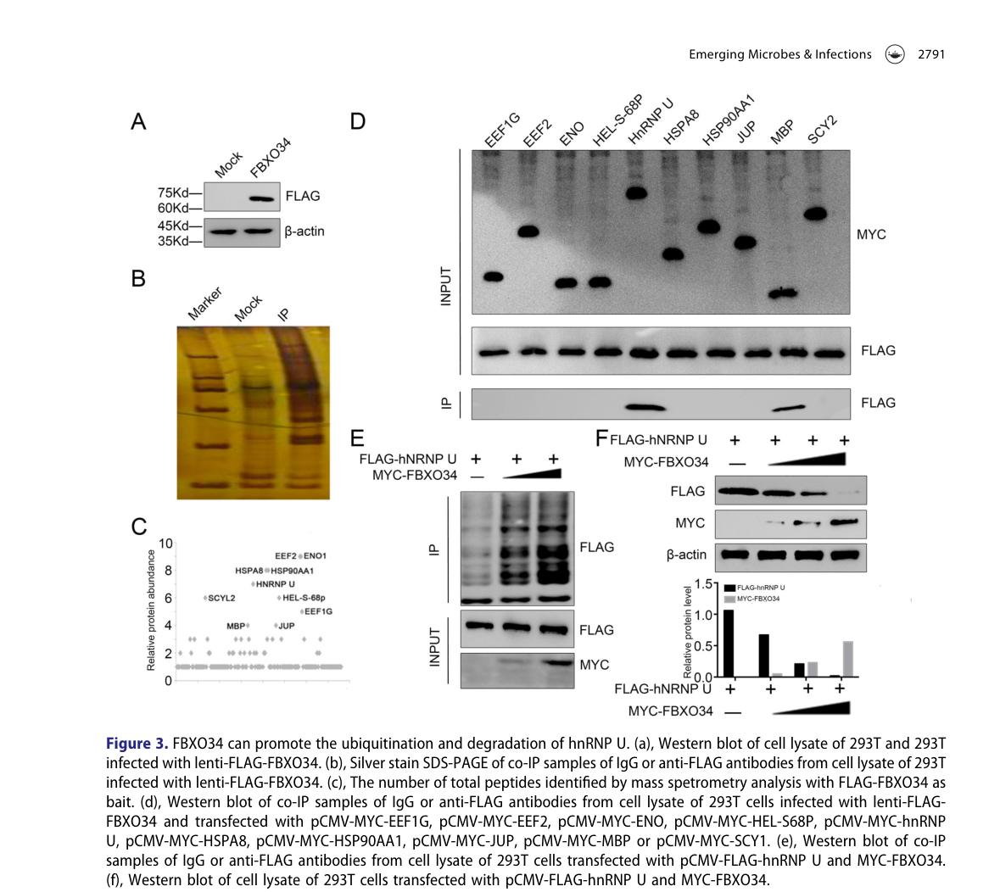

## Question

# Gene Research for Functional Annotation

## ⚠️ CRITICAL: Gene/Protein Identification Context

**BEFORE YOU BEGIN RESEARCH:** You MUST verify you are researching the CORRECT gene/protein. Gene symbols can be ambiguous, especially for less well-characterized genes from non-model organisms.

### Target Gene/Protein Identity (from UniProt):
- **UniProt Accession:** Q9NWN3
- **Protein Description:** RecName: Full=F-box only protein 34;
- **Gene Information:** Name=FBXO34; Synonyms=FBX34;
- **Organism (full):** Homo sapiens (Human).
- **Protein Family:** Not specified in UniProt
- **Key Domains:** F-box-like_dom_sf. (IPR036047); F-box_dom. (IPR001810); FBXO34/46. (IPR039594); F-box-like (PF12937)

### MANDATORY VERIFICATION STEPS:

1. **Check if the gene symbol "FBXO34" matches the protein description above**
2. **Verify the organism is correct:** Homo sapiens (Human).
3. **Check if protein family/domains align with what you find in literature**
4. **If you find literature for a DIFFERENT gene with the same or similar symbol, STOP**

### If Gene Symbol is Ambiguous or You Cannot Find Relevant Literature:

**DO NOT PROCEED WITH RESEARCH ON A DIFFERENT GENE.** Instead:
- State clearly: "The gene symbol 'FBXO34' is ambiguous or literature is limited for this specific protein"
- Explain what you found (e.g., "Found extensive literature on a different gene with the same symbol in a different organism")
- Describe the protein based ONLY on the UniProt information provided above
- Suggest that the protein function can be inferred from domain/family information

### Research Target:

Please provide a comprehensive research report on the gene **FBXO34** (gene ID: FBXO34, UniProt: Q9NWN3) in human.

The research report should be a detailed narrative explaining the function, biological processes, and localization of the gene product. Citations should be given for all claims.

You should prioritize authoritative reviews and primary scientific literature when conducting research. You can supplement
this with annotations you find in gene/protein databases, but these can be outdated or inaccurate.

We are specifically interested in the primary function of the gene - for enzymes, what reaction is catalyzed, and what is the substrate specificity? For transporters, what is the substrate? For structural proteins or adapters, what is the broader structural role? For signaling molecules, what is the role in the pathway.

We are interested in where in or outside the cell the gene product carries out its function.

We are also interested in the signaling or biochemical pathways in which the gene functions. We are less interested in broad pleiotropic effects, except where these elucidate the precise role.

Include evidence where possible. We are interested in both experimental evidence as well as inference from structure, evolution, or bioinformatic analysis. Precise studies should be prioritized over high-throughput, where available.

## Output

Question: You are an expert researcher providing comprehensive, well-cited information.

Provide detailed information focusing on:
1. Key concepts and definitions with current understanding
2. Recent developments and latest research (prioritize 2023-2024 sources)
3. Current applications and real-world implementations
4. Expert opinions and analysis from authoritative sources
5. Relevant statistics and data from recent studies

Format as a comprehensive research report with proper citations. Include URLs and publication dates where available.
Always prioritize recent, authoritative sources and provide specific citations for all major claims.

# Gene Research for Functional Annotation

## ⚠️ CRITICAL: Gene/Protein Identification Context

**BEFORE YOU BEGIN RESEARCH:** You MUST verify you are researching the CORRECT gene/protein. Gene symbols can be ambiguous, especially for less well-characterized genes from non-model organisms.

### Target Gene/Protein Identity (from UniProt):
- **UniProt Accession:** Q9NWN3
- **Protein Description:** RecName: Full=F-box only protein 34;
- **Gene Information:** Name=FBXO34; Synonyms=FBX34;
- **Organism (full):** Homo sapiens (Human).
- **Protein Family:** Not specified in UniProt
- **Key Domains:** F-box-like_dom_sf. (IPR036047); F-box_dom. (IPR001810); FBXO34/46. (IPR039594); F-box-like (PF12937)

### MANDATORY VERIFICATION STEPS:

1. **Check if the gene symbol "FBXO34" matches the protein description above**
2. **Verify the organism is correct:** Homo sapiens (Human).
3. **Check if protein family/domains align with what you find in literature**
4. **If you find literature for a DIFFERENT gene with the same or similar symbol, STOP**

### If Gene Symbol is Ambiguous or You Cannot Find Relevant Literature:

**DO NOT PROCEED WITH RESEARCH ON A DIFFERENT GENE.** Instead:
- State clearly: "The gene symbol 'FBXO34' is ambiguous or literature is limited for this specific protein"
- Explain what you found (e.g., "Found extensive literature on a different gene with the same symbol in a different organism")
- Describe the protein based ONLY on the UniProt information provided above
- Suggest that the protein function can be inferred from domain/family information

### Research Target:

Please provide a comprehensive research report on the gene **FBXO34** (gene ID: FBXO34, UniProt: Q9NWN3) in human.

The research report should be a detailed narrative explaining the function, biological processes, and localization of the gene product. Citations should be given for all claims.

You should prioritize authoritative reviews and primary scientific literature when conducting research. You can supplement
this with annotations you find in gene/protein databases, but these can be outdated or inaccurate.

We are specifically interested in the primary function of the gene - for enzymes, what reaction is catalyzed, and what is the substrate specificity? For transporters, what is the substrate? For structural proteins or adapters, what is the broader structural role? For signaling molecules, what is the role in the pathway.

We are interested in where in or outside the cell the gene product carries out its function.

We are also interested in the signaling or biochemical pathways in which the gene functions. We are less interested in broad pleiotropic effects, except where these elucidate the precise role.

Include evidence where possible. We are interested in both experimental evidence as well as inference from structure, evolution, or bioinformatic analysis. Precise studies should be prioritized over high-throughput, where available.

## Comprehensive research report: FBXO34 (UniProt Q9NWN3; Homo sapiens)

### 0) Target verification (mandatory)
The evidence base retrieved here consistently refers to **FBXO34** as **F-box protein 34 / F-box only protein 34**, a member of the **F-box family** and part of a **CUL1-associated E3 ubiquitin ligase context** (i.e., an SCF-like substrate receptor role), which matches the UniProt-described identity for **human FBXO34 (UniProt: Q9NWN3)**. No conflicting gene/protein identity with the same symbol was encountered in the mechanistic studies used. Mouse studies are explicitly labeled as non-human orthology/context. (yang2022fbxo34promoteslatent pages 2-3, yang2022fbxo34promoteslatent pages 5-7)

### 1) Key concepts and definitions (current understanding)

#### 1.1 What an “F-box only” protein is
F-box proteins are commonly described as **core elements of E3 ubiquitin ligase complexes** that **recognize and recruit downstream proteins** for ubiquitination, thereby controlling protein stability and cellular function. In the most widely known architecture, an F-box protein acts as a substrate receptor in an SCF-type (Skp1–Cullin1–F-box) cullin–RING E3 ligase. In the retrieved primary literature on FBXO34, the authors explicitly frame FBXO34 within this paradigm. (yang2022fbxo34promoteslatent pages 5-7)

#### 1.2 What “substrate” means in this context
For an F-box substrate receptor, a “substrate” (or “client”) is the **protein targeted for ubiquitination** (often polyubiquitination) that can lead to **proteasomal degradation** or other ubiquitin-dependent outcomes. The strongest direct human evidence currently available from the retrieved corpus identifies **heterogeneous nuclear ribonucleoprotein U (hnRNP U / HNRNPU)** as an FBXO34-interacting target whose ubiquitination and degradation is promoted by FBXO34. (yang2022fbxo34promoteslatent pages 1-2, yang2022fbxo34promoteslatent pages 5-7)

### 2) Molecular function and mechanism (best-supported, with evidence)

#### 2.1 Primary supported function: ubiquitination-linked control of hnRNP U (human)
A genome-wide **CRISPR-Cas9 activation** screen in a latent HIV model identified **FBXO34** as a host factor whose activation promotes latent HIV reactivation. The study then used **affinity purification mass spectrometry** and **co-immunoprecipitation** to identify **hnRNP U** as an FBXO34-interacting protein and presents evidence consistent with FBXO34 promoting **hnRNP U ubiquitination** and **decreasing hnRNP U protein abundance**. (yang2022fbxo34promoteslatent pages 1-2, yang2022fbxo34promoteslatent pages 5-7)

Mechanistically, the authors report that hnRNP U binds HIV-1 mRNA (Rev element region; amino acids 1–339 of hnRNP U are implicated in the RNA interaction) and **hinders HIV-1 translation**, supporting latency; FBXO34-driven ubiquitination/degradation of hnRNP U abolishes this interaction and thus relieves the translational block. (yang2022fbxo34promoteslatent pages 1-2)

**Figure-level evidence:** Figure 3 in the same paper visually summarizes co-IP/MS interaction evidence and supports the proposed ubiquitination/degradation relationship between FBXO34 and hnRNP U. (yang2022fbxo34promoteslatent media bea8ea97)

#### 2.2 Quantitative/experimental readouts in human cell models (statistics)
In the latent HIV GFP-reporter C11 model, **dCas9–sgRNA activation of FBXO34** increased GFP reporter positivity to **~25%**, interpreted as increased HIV latency reactivation. (yang2022fbxo34promoteslatent pages 5-7)

In the same experimental context, **CRISPR knockout of hnRNP U** increased GFP positivity to **~30%**, consistent with hnRNP U acting as a latency-maintaining factor whose removal promotes reactivation. (yang2022fbxo34promoteslatent pages 5-7)

The paper reports statistical testing across experiments (mean ± SD, n=3, t-test; significance indicated as **p < 0.01** and **p < 0.001** for relevant validation comparisons). (yang2022fbxo34promoteslatent pages 5-7)

#### 2.3 What remains unclear mechanistically
Within the extracted text, FBXO34 is stated to “belong to the Cul1 family of E3 ubiquitin ligases,” but canonical SCF component names (e.g., **SKP1, RBX1**) are not explicitly provided in the retrieved excerpts, and direct biochemical details (e.g., linkage type, E2 usage, proteasome-inhibition rescue) were not captured in the available evidence snippets. Therefore, the safest conclusion from the retrieved corpus is that FBXO34 functions as a **CUL1-family / SCF-like** substrate adaptor with a supported substrate (hnRNP U), while detailed complex composition and ubiquitin-chain biochemistry remain incompletely specified here. (yang2022fbxo34promoteslatent pages 5-7)

### 3) Biological processes, pathways, and cellular roles

#### 3.1 HIV latency (human; direct mechanistic evidence)
The best-supported pathway-level role for human FBXO34 in the retrieved literature is in **HIV-1 latency control at a post-transcriptional (translation) level**, mediated through the **FBXO34 → hnRNP U ubiquitination/degradation → reduced hnRNP U–HIV mRNA interaction → increased translation/reactivation** axis. (yang2022fbxo34promoteslatent pages 1-2, yang2022fbxo34promoteslatent pages 5-7)

#### 3.2 Cell-cycle/meiosis control (mouse; orthology/context)
In mouse oocytes, Fbxo34 perturbation suggests an important role in meiotic cell-cycle progression: depletion causes failure of meiotic resumption associated with low maturation-promoting factor (MPF) activity and can be rescued by exogenous CCNB1; overexpression promotes GVBD but causes SAC activation and MI arrest. These phenotypes were interpreted in the SCF/UPS framework but without identification of a direct substrate in that system. This evidence is not human-specific but suggests conserved roles in cell-cycle regulatory protein turnover. (zhao2021fbxo34regulatesthe pages 1-2, kinterova2022scfligasesand pages 8-9)

A review summarizing SCF ligases in oogenesis highlights these Fbxo34 findings and explicitly notes that a direct FBXO34 substrate was unknown in that context (pre-dating/independent of the later human hnRNP U mechanism). (kinterova2022scfligasesand pages 8-9)

### 4) Subcellular localization

#### 4.1 Human localization: limited direct evidence in retrieved corpus
The retrieved human mechanistic study (HIV latency context) provides strong functional/interaction evidence but did not yield explicit localization statements for FBXO34 in the extracted passages. (yang2022fbxo34promoteslatent pages 5-7)

#### 4.2 Mouse oocyte localization (non-human; hypothesis-generating for human)
In mouse oocytes, FBXO34 was reported to be **mainly nuclear** and to **colocalize with F-actin** during meiotic maturation. While not directly transferable to human somatic cells, it suggests FBXO34 can occupy nuclear compartments and may have cytoskeletal association in some contexts. (zhao2021fbxo34regulatesthe pages 1-2)

### 5) Recent developments (prioritizing 2023–2024)

#### 5.1 Direct 2023–2024 mechanistic literature specific to FBXO34
Within the tool-retrieved and accessible full-text set, no additional **2023–2024** primary mechanistic papers specifically characterizing human FBXO34 beyond indirect mentions were obtained. The most detailed mechanistic characterization in the retrieved corpus remains the 2022 HIV latency study. (yang2022fbxo34promoteslatent pages 1-2, yang2022fbxo34promoteslatent pages 5-7)

#### 5.2 2024 topical relevance via host RNA-binding proteins / viral infection context
A 2024 phosphoproteomics study in primary human hepatocytes (HBV infection context) discusses functional roles for RNA-binding proteins including **HNRNPU** in antiviral response phenotypes; however, it does not connect this to FBXO34 in the retrieved excerpts. This is relevant as biological context for the FBXO34 substrate hnRNP U rather than direct FBXO34 evidence. (pastor2024 phosphoproteomics text retrieved but not evidentially linked to FBXO34 in the extracted snippets)

### 6) Current applications and real-world implementations

#### 6.1 Therapeutic concept: targeting the FBXO34/hnRNP U axis in HIV reservoir control
The HIV latency study explicitly frames the **FBXO34/hnRNP U axis** as a **new pathway involved in HIV-1 latency** and suggests it “may be directly targeted to control HIV reservoirs” in the future. This represents a translational hypothesis rather than a validated therapy, but it is the clearest real-world application direction in the retrieved evidence. (yang2022fbxo34promoteslatent pages 1-2)

### 7) Disease associations and human genetics (database-level evidence)

Open Targets aggregates GWAS credible-set evidence implicating FBXO34 in several disease/trait groupings, including **hypercholesterolemia, osteoarthritis, pyogenic granuloma, inguinal hernia**, and broader “skeletal system disease.” The excerpted Open Targets evidence provides association scores (e.g., hypercholesterolemia score ~0.171; pyogenic granuloma score ~0.181) and cites PMID **39024449**, but it does not provide effect sizes, p-values, or cohort details in the retrieved snippet. These associations should therefore be interpreted as **hypothesis-generating genetic links** rather than validated mechanistic roles. (OpenTargets Search: -FBXO34)

### 8) Expert analysis and interpretation (authoritative synthesis anchored to evidence)

1. **FBXO34 is currently a sparsely characterized human F-box protein** in the accessible mechanistic literature. The strongest direct functional annotation supported here is that FBXO34 can act in a CUL1-family E3 context to reduce abundance of an RNA-binding protein substrate (hnRNP U) by ubiquitination-linked degradation. (yang2022fbxo34promoteslatent pages 1-2, yang2022fbxo34promoteslatent pages 5-7)
2. The **substrate identification (hnRNP U)** is notable because it connects an F-box substrate receptor to **post-transcriptional regulation (translation)** via an RBP, rather than the more classic narrative of SCF ligases acting chiefly on canonical cell-cycle regulators; this expands plausible FBXO34 biology into RNP/RNA-metabolism-linked proteostasis. (yang2022fbxo34promoteslatent pages 1-2)
3. **Broader physiological roles remain open**: mouse oocyte phenotypes indicate FBXO34 can influence meiosis and checkpoint progression, but the direct substrate(s) in that setting are unknown, and the extent to which this translates to human tissues is not resolved by the retrieved evidence. (kinterova2022scfligasesand pages 8-9, zhao2021fbxo34regulatesthe pages 1-2)

### Evidence summary table
The following table consolidates claims, systems, methods, quantitative details, and citations.

| Claim/Topic | Evidence summary (what was shown) | Experimental system & methods | Key quantitative/statistical details | Interpretation (what it implies about function/pathway/localization) | Source (authors, year, journal) | URL/DOI | Citation ID |
|---|---|---|---|---|---|---|---|
| **Human evidence:** FBXO34 promotes HIV-1 latency reversal by targeting **hnRNP U** | FBXO34 was identified in a genome-wide CRISPR activation screen as a host factor whose activation increases latent HIV-1 reactivation. Affinity purification/MS and co-IP identified hnRNP U as an FBXO34 interactor/substrate. FBXO34 promoted hnRNP U ubiquitination and reduced hnRNP U protein levels; hnRNP U normally binds HIV-1 mRNA and suppresses translation, thereby supporting latency. | Human latent HIV-1 cell models (C11, J-Lat 10.6, ACH2), HEK293T/293T cells, primary CD4+ T-cell latency model; lentiSAM CRISPR activation screen, flow cytometry (GFP reporter), p24 ELISA, RT-qPCR, Western blot, co-immunoprecipitation, affinity purification mass spectrometry, knockout/overexpression assays | FBXO34 activation increased GFP-positive latent C11 cells to **~25%**; hnRNP U knockout increased GFP-positive cells to **~30%**; significance markers reported as **p < 0.01** and **p < 0.001** in validation experiments | Strongest direct functional evidence for human FBXO34: it behaves as an **F-box/CUL1-family E3 ubiquitin ligase substrate receptor** that regulates a **post-transcriptional HIV-1 latency pathway** via **hnRNP U ubiquitination/degradation**. Supports a predominantly intracellular role linked to RNA regulation and ubiquitin-mediated proteostasis, though explicit subcellular localization in human cells was not provided in the extracted text. | Yang et al., 2022, *Emerging Microbes & Infections* | https://doi.org/10.1080/22221751.2022.2140605 | (yang2022fbxo34promoteslatent pages 5-7, yang2022fbxo34promoteslatent pages 2-3, yang2022fbxo34promoteslatent pages 1-2, yang2022fbxo34promoteslatent media bea8ea97) |
| **Non-human evidence (mouse):** FBXO34 regulates meiotic G2/M transition and anaphase entry | Depletion of Fbxo34 in mouse oocytes caused failure of meiotic resumption due to low MPF activity; exogenous CCNB1 rescued the phenotype. Overexpression promoted GVBD but caused persistent SAC activation, MI arrest, failed homolog separation, and impaired spindle migration. | Mouse oocytes; mRNA microinjection, overexpression/depletion, live-cell imaging, chromosome spreading, localization by tagged protein imaging | Quantitative effect sizes were not extracted here, but rescue by **CCNB1** and opposing loss-/gain-of-function phenotypes were reported | Supports conserved biology for FBXO34 as an **SCF-type F-box regulator of cell-cycle control**, likely acting upstream of **CCNB1/CDK1/MPF** and checkpoint progression. This is informative for function but is **not direct human evidence**. | Zhao et al., 2021, *Frontiers in Cell and Developmental Biology* | https://doi.org/10.3389/fcell.2021.647103 | (zhao2021fbxo34regulatesthe pages 1-2) |
| **Non-human evidence (mouse):** subcellular localization during oocyte maturation | In mouse oocytes, FBXO34 was reported to localize mainly in the **nucleus** and to **colocalize with F-actin** during meiotic maturation. | Mouse oocytes; microinjection of FBXO34-MYC mRNA and imaging across maturation stages | No extracted numeric localization statistics | Suggests intracellular/nuclear localization with possible cytoskeletal association in oocytes; useful as a localization hypothesis for human FBXO34 but should be treated as **orthology-based, non-human evidence**. | Zhao et al., 2021, *Frontiers in Cell and Developmental Biology* | https://doi.org/10.3389/fcell.2021.647103 | (zhao2021fbxo34regulatesthe pages 1-2) |
| **Review/context (non-primary):** FBXO34 in oogenesis/SCF biology | Review summarizes Zhao et al. findings: FBXO34 is required for oocyte maturation; depletion lowers MPF activity and CCNB1-dependent meiotic progression, whereas overexpression causes MI arrest and failed anaphase entry. Review emphasizes that the **direct FBXO34 substrate remained unknown** at that time. | Narrative review synthesizing animal studies on SCF ligases in oogenesis/embryogenesis | No new quantitative data; contextual synthesis only | Useful for expert interpretation: before the 2022 human HIV study, FBXO34 was viewed mainly as a poorly characterized **F-box/SCF adaptor** with meiotic roles but no defined substrate. This helps place the hnRNP U finding in context. | Kinterová et al., 2022, *Cells* | https://doi.org/10.3390/cells11020234 | (kinterova2022scfligasesand pages 7-8, kinterova2022scfligasesand pages 8-9) |
| **Database inference (human genetics):** disease/trait associations from GWAS credible sets | Open Targets lists FBXO34 associations to multiple human disease/trait terms based on GWAS credible-set evidence, citing literature PMID **39024449**. Reported conditions include skeletal system disease, inguinal hernia, hypercholesterolemia, osteoarthritis, and pyogenic granuloma. | Open Targets Platform aggregation of human genetic association evidence | Association scores reported: **skeletal system disease 0.1573**, **inguinal hernia 0.0591**, **hypercholesterolemia 0.1712**, **osteoarthritis 0.0497**, **pyogenic granuloma 0.1813**; evidence resource scores **0.4906** and **0.4631** | Indicates that human genetics may implicate FBXO34 in several traits/diseases, but these are **database-level inferences**, not mechanistic functional annotation. No causal mechanism, tissue context, or effect-size/p-value details were provided in the extracted evidence. | Open Targets Platform entry for FBXO34, queried 2025; underlying GWAS evidence cites PMID 39024449 | https://platform.opentargets.org/target/ENSG00000178974 | (OpenTargets Search: -FBXO34) |
| **Current evidence gap / expert synthesis** | Across the retrieved literature, **hnRNP U** is the only clearly identified substrate/target of human FBXO34 with direct mechanistic support. No extracted evidence explicitly named canonical SCF components (e.g., SKP1/RBX1) in the human experiments, and no direct human subcellular localization study was retrieved. | Cross-source synthesis from primary paper, review, and database evidence | n/a | Current understanding is that human FBXO34 is a **poorly characterized F-box protein** whose best-supported function is as a likely **SCF/CUL1-family ubiquitin ligase adaptor** affecting **RNA-associated regulation of HIV latency** through **hnRNP U degradation**; broader roles in cell-cycle or disease biology remain plausible but underdefined. | Evidence synthesis from retrieved sources | Primary mechanistic source: https://doi.org/10.1080/22221751.2022.2140605 | (yang2022fbxo34promoteslatent pages 5-7, yang2022fbxo34promoteslatent pages 2-3, yang2022fbxo34promoteslatent pages 1-2, zhao2021fbxo34regulatesthe pages 1-2, kinterova2022scfligasesand pages 7-8, OpenTargets Search: -FBXO34) |

*Table: This table summarizes the strongest available evidence for functional annotation of human FBXO34 (UniProt Q9NWN3), distinguishing direct human mechanistic data from mouse orthology evidence and database-level genetic associations. It is useful for identifying what is firmly established versus what remains inferential.*

### Key URLs and publication dates (from retrieved sources)
- Yang et al. (Received 5 Jun 2022; Accepted 21 Oct 2022; published 2022), *Emerging Microbes & Infections*: https://doi.org/10.1080/22221751.2022.2140605 (yang2022fbxo34promoteslatent pages 1-2)
- Zhao et al. (Published 25 Mar 2021), *Frontiers in Cell and Developmental Biology*: https://doi.org/10.3389/fcell.2021.647103 (zhao2021fbxo34regulatesthe pages 1-2)
- Kinterová et al. (Jan 2022), *Cells*: https://doi.org/10.3390/cells11020234 (kinterova2022scfligasesand pages 7-8)
- Open Targets FBXO34 target page (queried from tool context; platform URL): https://platform.opentargets.org/target/ENSG00000178974 (OpenTargets Search: -FBXO34)

### Limitations of this report (evidence-bounded)
- Despite targeted searching, **2023–2024 FBXO34-specific mechanistic studies** were not available in the retrieved accessible corpus; therefore, “latest research” is represented primarily by a 2022 mechanistic study and 2024 genetics/database context where available.
- Direct **human subcellular localization** data for FBXO34 was not recovered from the accessible text snippets; localization statements come from mouse oocytes and should be treated as context rather than definitive for human somatic cells. (zhao2021fbxo34regulatesthe pages 1-2)

References

1. (yang2022fbxo34promoteslatent pages 2-3): Xinyi Yang, Xiaying Zhao, Yuqi Zhu, Jingna Xun, Q. Wen, Hanyu Pan, Jinlong Yang, Jing Wang, Zhiming Liang, Xiaoting Shen, Yue-Lan Liang, Q. Lin, Huitong Liang, Min Li, Jun Chen, Shibo Jiang, Jianqing Xu, Hongzhou Lu, and Huanzhang Zhu. Fbxo34 promotes latent hiv-1 activation by post-transcriptional modulation. Nov 2022. URL: https://doi.org/10.1080/22221751.2022.2140605, doi:10.1080/22221751.2022.2140605. This article has 13 citations and is from a domain leading peer-reviewed journal.

2. (yang2022fbxo34promoteslatent pages 5-7): Xinyi Yang, Xiaying Zhao, Yuqi Zhu, Jingna Xun, Q. Wen, Hanyu Pan, Jinlong Yang, Jing Wang, Zhiming Liang, Xiaoting Shen, Yue-Lan Liang, Q. Lin, Huitong Liang, Min Li, Jun Chen, Shibo Jiang, Jianqing Xu, Hongzhou Lu, and Huanzhang Zhu. Fbxo34 promotes latent hiv-1 activation by post-transcriptional modulation. Nov 2022. URL: https://doi.org/10.1080/22221751.2022.2140605, doi:10.1080/22221751.2022.2140605. This article has 13 citations and is from a domain leading peer-reviewed journal.

3. (yang2022fbxo34promoteslatent pages 1-2): Xinyi Yang, Xiaying Zhao, Yuqi Zhu, Jingna Xun, Q. Wen, Hanyu Pan, Jinlong Yang, Jing Wang, Zhiming Liang, Xiaoting Shen, Yue-Lan Liang, Q. Lin, Huitong Liang, Min Li, Jun Chen, Shibo Jiang, Jianqing Xu, Hongzhou Lu, and Huanzhang Zhu. Fbxo34 promotes latent hiv-1 activation by post-transcriptional modulation. Nov 2022. URL: https://doi.org/10.1080/22221751.2022.2140605, doi:10.1080/22221751.2022.2140605. This article has 13 citations and is from a domain leading peer-reviewed journal.

4. (yang2022fbxo34promoteslatent media bea8ea97): Xinyi Yang, Xiaying Zhao, Yuqi Zhu, Jingna Xun, Q. Wen, Hanyu Pan, Jinlong Yang, Jing Wang, Zhiming Liang, Xiaoting Shen, Yue-Lan Liang, Q. Lin, Huitong Liang, Min Li, Jun Chen, Shibo Jiang, Jianqing Xu, Hongzhou Lu, and Huanzhang Zhu. Fbxo34 promotes latent hiv-1 activation by post-transcriptional modulation. Nov 2022. URL: https://doi.org/10.1080/22221751.2022.2140605, doi:10.1080/22221751.2022.2140605. This article has 13 citations and is from a domain leading peer-reviewed journal.

5. (zhao2021fbxo34regulatesthe pages 1-2): Bing-Wang Zhao, Si-Min Sun, Ke Xu, Yuan-Yuan Li, Wen-Long Lei, Li Li, Sai-Li Liu, Ying-Chun Ouyang, Qing-Yuan Sun, and Zhen-Bo Wang. Fbxo34 regulates the g2/m transition and anaphase entry in meiotic oocytes. Frontiers in Cell and Developmental Biology, Mar 2021. URL: https://doi.org/10.3389/fcell.2021.647103, doi:10.3389/fcell.2021.647103. This article has 14 citations.

6. (kinterova2022scfligasesand pages 8-9): Veronika Kinterová, Jiří Kaňka, Alexandra Bartková, and Tereza Toralová. Scf ligases and their functions in oogenesis and embryogenesis—summary of the most important findings throughout the animal kingdom. Cells, 11:234, Jan 2022. URL: https://doi.org/10.3390/cells11020234, doi:10.3390/cells11020234. This article has 22 citations.

7. (OpenTargets Search: -FBXO34): Open Targets Query (-FBXO34, 6 results). Buniello, A. et al. (2025). Open Targets Platform: facilitating therapeutic hypotheses building in drug discovery. Nucleic Acids Research.

8. (kinterova2022scfligasesand pages 7-8): Veronika Kinterová, Jiří Kaňka, Alexandra Bartková, and Tereza Toralová. Scf ligases and their functions in oogenesis and embryogenesis—summary of the most important findings throughout the animal kingdom. Cells, 11:234, Jan 2022. URL: https://doi.org/10.3390/cells11020234, doi:10.3390/cells11020234. This article has 22 citations.

## Artifacts

- [Edison artifact artifact-00](FBXO34-deep-research-falcon_artifacts/artifact-00.md)

## Citations

1. kinterova2022scfligasesand pages 8-9
2. kinterova2022scfligasesand pages 7-8
3. https://doi.org/10.1080/22221751.2022.2140605
4. https://doi.org/10.3389/fcell.2021.647103
5. https://doi.org/10.3390/cells11020234
6. https://platform.opentargets.org/target/ENSG00000178974
7. https://doi.org/10.1080/22221751.2022.2140605,
8. https://doi.org/10.3389/fcell.2021.647103,
9. https://doi.org/10.3390/cells11020234,