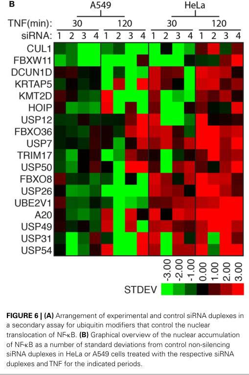

## Question

# Gene Research for Functional Annotation

## ⚠️ CRITICAL: Gene/Protein Identification Context

**BEFORE YOU BEGIN RESEARCH:** You MUST verify you are researching the CORRECT gene/protein. Gene symbols can be ambiguous, especially for less well-characterized genes from non-model organisms.

### Target Gene/Protein Identity (from UniProt):
- **UniProt Accession:** Q8NEA4
- **Protein Description:** RecName: Full=F-box only protein 36;
- **Gene Information:** Name=FBXO36; Synonyms=FBX36;
- **Organism (full):** Homo sapiens (Human).
- **Protein Family:** Not specified in UniProt
- **Key Domains:** F-box-like_dom_sf. (IPR036047); F-box_dom. (IPR001810); SCF_F-box/WD-repeat. (IPR052301); F-box-like (PF12937)

### MANDATORY VERIFICATION STEPS:

1. **Check if the gene symbol "FBXO36" matches the protein description above**
2. **Verify the organism is correct:** Homo sapiens (Human).
3. **Check if protein family/domains align with what you find in literature**
4. **If you find literature for a DIFFERENT gene with the same or similar symbol, STOP**

### If Gene Symbol is Ambiguous or You Cannot Find Relevant Literature:

**DO NOT PROCEED WITH RESEARCH ON A DIFFERENT GENE.** Instead:
- State clearly: "The gene symbol 'FBXO36' is ambiguous or literature is limited for this specific protein"
- Explain what you found (e.g., "Found extensive literature on a different gene with the same symbol in a different organism")
- Describe the protein based ONLY on the UniProt information provided above
- Suggest that the protein function can be inferred from domain/family information

### Research Target:

Please provide a comprehensive research report on the gene **FBXO36** (gene ID: FBXO36, UniProt: Q8NEA4) in human.

The research report should be a detailed narrative explaining the function, biological processes, and localization of the gene product. Citations should be given for all claims.

You should prioritize authoritative reviews and primary scientific literature when conducting research. You can supplement
this with annotations you find in gene/protein databases, but these can be outdated or inaccurate.

We are specifically interested in the primary function of the gene - for enzymes, what reaction is catalyzed, and what is the substrate specificity? For transporters, what is the substrate? For structural proteins or adapters, what is the broader structural role? For signaling molecules, what is the role in the pathway.

We are interested in where in or outside the cell the gene product carries out its function.

We are also interested in the signaling or biochemical pathways in which the gene functions. We are less interested in broad pleiotropic effects, except where these elucidate the precise role.

Include evidence where possible. We are interested in both experimental evidence as well as inference from structure, evolution, or bioinformatic analysis. Precise studies should be prioritized over high-throughput, where available.

## Output

Question: You are an expert researcher providing comprehensive, well-cited information.

Provide detailed information focusing on:
1. Key concepts and definitions with current understanding
2. Recent developments and latest research (prioritize 2023-2024 sources)
3. Current applications and real-world implementations
4. Expert opinions and analysis from authoritative sources
5. Relevant statistics and data from recent studies

Format as a comprehensive research report with proper citations. Include URLs and publication dates where available.
Always prioritize recent, authoritative sources and provide specific citations for all major claims.

# Gene Research for Functional Annotation

## ⚠️ CRITICAL: Gene/Protein Identification Context

**BEFORE YOU BEGIN RESEARCH:** You MUST verify you are researching the CORRECT gene/protein. Gene symbols can be ambiguous, especially for less well-characterized genes from non-model organisms.

### Target Gene/Protein Identity (from UniProt):
- **UniProt Accession:** Q8NEA4
- **Protein Description:** RecName: Full=F-box only protein 36;
- **Gene Information:** Name=FBXO36; Synonyms=FBX36;
- **Organism (full):** Homo sapiens (Human).
- **Protein Family:** Not specified in UniProt
- **Key Domains:** F-box-like_dom_sf. (IPR036047); F-box_dom. (IPR001810); SCF_F-box/WD-repeat. (IPR052301); F-box-like (PF12937)

### MANDATORY VERIFICATION STEPS:

1. **Check if the gene symbol "FBXO36" matches the protein description above**
2. **Verify the organism is correct:** Homo sapiens (Human).
3. **Check if protein family/domains align with what you find in literature**
4. **If you find literature for a DIFFERENT gene with the same or similar symbol, STOP**

### If Gene Symbol is Ambiguous or You Cannot Find Relevant Literature:

**DO NOT PROCEED WITH RESEARCH ON A DIFFERENT GENE.** Instead:
- State clearly: "The gene symbol 'FBXO36' is ambiguous or literature is limited for this specific protein"
- Explain what you found (e.g., "Found extensive literature on a different gene with the same symbol in a different organism")
- Describe the protein based ONLY on the UniProt information provided above
- Suggest that the protein function can be inferred from domain/family information

### Research Target:

Please provide a comprehensive research report on the gene **FBXO36** (gene ID: FBXO36, UniProt: Q8NEA4) in human.

The research report should be a detailed narrative explaining the function, biological processes, and localization of the gene product. Citations should be given for all claims.

You should prioritize authoritative reviews and primary scientific literature when conducting research. You can supplement
this with annotations you find in gene/protein databases, but these can be outdated or inaccurate.

We are specifically interested in the primary function of the gene - for enzymes, what reaction is catalyzed, and what is the substrate specificity? For transporters, what is the substrate? For structural proteins or adapters, what is the broader structural role? For signaling molecules, what is the role in the pathway.

We are interested in where in or outside the cell the gene product carries out its function.

We are also interested in the signaling or biochemical pathways in which the gene functions. We are less interested in broad pleiotropic effects, except where these elucidate the precise role.

Include evidence where possible. We are interested in both experimental evidence as well as inference from structure, evolution, or bioinformatic analysis. Precise studies should be prioritized over high-throughput, where available.

## Research report: Human **FBXO36** (UniProt **Q8NEA4**) — functional annotation status, evidence, and gaps

### 0) Target verification (critical identity checks)
The research target in this report is **human FBXO36** (gene symbol **FBXO36**, synonym **FBX36**), encoding **F-box only protein 36**, consistent with the user-provided UniProt record **Q8NEA4**. The available direct literature evidence retrieved here explicitly refers to **FBXO36** as a member of the **F-box protein family** (i.e., a presumptive substrate-recognition component of an SCF-type E3 ubiquitin ligase complex) and evaluates **FBXO36** perturbation in human cell lines and human cohort data; no evidence in this run indicated a different organism or a different “FBXO36” entity. (fraser2014ahighcontentrnai pages 11-12, riverosmckay2020theinfluenceof pages 3-4, riverosmckay2020theinfluenceof pages 1-2)

**Domain context (from the UniProt/InterPro context provided by the user):** FBXO36 contains an **F-box domain** (InterPro IPR001810; PFAM-class F-box-like), which typically mediates binding to **SKP1** and incorporation into **SCF (SKP1–CUL1–RBX1–F-box protein)** ubiquitin ligase complexes. This supports the *inferred* molecular role of FBXO36 as a **substrate-recognition adaptor** that can promote ubiquitination (often proteasomal degradation) of specific target proteins, although **no endogenous FBXO36 substrate has been directly validated** in the retrieved literature below. (fraser2014ahighcontentrnai pages 11-12, riverosmckay2020theinfluenceof pages 8-9)

### 1) Key concepts and definitions (current understanding)

#### 1.1 F-box proteins and SCF E3 ubiquitin ligases
F-box proteins are generally understood as **substrate receptors** within SCF E3 ubiquitin ligase complexes, helping determine which proteins are ubiquitinated in response to signaling cues. In a TNF/NF-κB-focused functional screen, FBXO36 is treated as part of the ubiquitin-modifier landscape capable of altering TNF pathway outputs, consistent with this canonical adaptor concept for F-box proteins. (fraser2014ahighcontentrnai pages 9-11, fraser2014ahighcontentrnai pages 7-9)

#### 1.2 What “function” means for FBXO36 given current evidence
For FBXO36 specifically, “function” currently rests on **(i) domain-based inference** (F-box → likely SCF adaptor) and **(ii) perturbation phenotypes** (siRNA depletion alters TNF signaling readouts, apoptosis; human genetics association with a lipid biomarker). The literature retrieved does **not** provide a definitive biochemical reaction/substrate specificity (as would be expected for enzymes), because FBXO36 is not itself the catalytic ligase; rather, it likely confers **substrate specificity** to an SCF complex. (fraser2014ahighcontentrnai pages 11-12, fraser2014ahighcontentrnai pages 9-11, riverosmckay2020theinfluenceof pages 3-4)

### 2) Mechanistic and functional evidence for FBXO36

#### 2.1 TNF → NF-κB pathway modulation (cell-based functional evidence)
The strongest direct functional evidence retrieved for FBXO36 comes from a **high-content siRNA screen** for ubiquitin pathway regulators of **TNF-dependent nuclear accumulation of NF-κB** in human cells (Fraser et al., *Frontiers in Immunology*, **July 2014**, https://doi.org/10.3389/fimmu.2014.00322). FBXO36 was among modifiers detected at **120 min TNF** in HeLa cells and validated in A549 cells using at least **two non-overlapping siRNAs**. (fraser2014ahighcontentrnai pages 7-9)

**NF-κB nuclear localization phenotype:** In secondary validation, depletion of FBXO36 increased nuclear NF-κB after **120 min TNF** exposure (noted in A549 cells), consistent with FBXO36 acting as a negative regulator or timing modulator of NF-κB nuclear accumulation in that assay context. (fraser2014ahighcontentrnai pages 7-9, fraser2014ahighcontentrnai media ce70cdf7)

**I-κB phosphorylation/turnover:** Follow-up assays reported that FBXO36 loss did **not** produce “noticeable effects” on overall I-κB stability dynamics, but did cause **persistent late-stage phosphorylation of I-κB** (late time point context), suggesting altered TNF kinase relay signaling rather than a simple block in I-κB degradation. (fraser2014ahighcontentrnai pages 9-11, fraser2014ahighcontentrnai media c4737aa2)

**JNK signaling:** FBXO36 knockdown caused a “moderate, but reproducible prolonged phosphorylation of JNK” after TNF stimulation, again consistent with enhanced or prolonged signaling through the TNF kinase cascade. (fraser2014ahighcontentrnai pages 9-11, fraser2014ahighcontentrnai media 29ae2710)

**TNF-induced apoptosis sensitization:** In the same study, loss of FBXO36 enhanced apoptosis induced by **TNF + cycloheximide (CHX)** as measured by a **TUNEL assay**, particularly at earlier time points (reported in the figure-associated summary). (fraser2014ahighcontentrnai pages 11-12, fraser2014ahighcontentrnai media 07aba2ec)

**Interpretation caveats (author perspective):** The study frames FBXO36 as a *candidate* ubiquitin-pathway modifier of TNF outcomes; it emphasizes that NF-κB localization was measured rather than downstream transcriptional activity, and that additional validation would be needed to establish mechanism and direct targets. (fraser2014ahighcontentrnai pages 11-12)

#### 2.2 Putative link to SCF/βTrCP axis via β-catenin (indirect mechanistic hint)
Fraser et al. also observed that depletion of FBXO36 increased steady-state **β-catenin** levels. They interpreted this as supportive of a possible role as a modifier of the **SCF–βTrCP** axis (βTrCP is the well-established F-box substrate receptor for β-catenin and I-κB in many contexts). Importantly, this does **not** establish β-catenin as a direct FBXO36 substrate; rather, it suggests FBXO36 perturbation may impact components or regulation of SCF-dependent proteolysis. (fraser2014ahighcontentrnai pages 11-12)

### 3) Subcellular localization and expression

#### 3.1 Localization
No definitive subcellular localization for human FBXO36 (e.g., nucleus vs cytosol, membrane association, organelles) was identified in the retrieved texts. Functional phenotypes in Fraser et al. are consistent with FBXO36 acting in the **intracellular signaling milieu** that controls I-κB/JNK phosphorylation and NF-κB trafficking, but this remains indirect. (fraser2014ahighcontentrnai pages 9-11, fraser2014ahighcontentrnai media ce70cdf7)

#### 3.2 Testis-enriched expression (recent review synthesis)
A 2024 review on F-box proteins in spermatogenesis and male infertility (Xuan et al., *Cell Regeneration*, **June 2024**, https://doi.org/10.1186/s13619-024-00196-9) lists **FBXO36 among F-box proteins found at the highest levels in testis**, implying testis-enriched expression and potential relevance to spermatogenesis. The retrieved review pages do not provide mechanistic FBXO36 data (substrates, knockout phenotypes, infertility causality). (xuan2024theemergingand pages 7-8)

### 4) Disease associations and human cohort evidence

#### 4.1 Rare-variant metabolomics association (lipid biomarker)
A sequencing-based metabolomics genetics study of **7,142 participants** measuring **226 serum lipoproteins, lipids, and amino acids** reported FBXO36 as a **novel gene-trait association** at a gene-level threshold of **p < 2.5×10−6** (Riveros-McKay et al., *PLOS Genetics*, **March 2020**, https://doi.org/10.1371/journal.pgen.1008605). (riverosmckay2020theinfluenceof pages 1-2)

More specifically, gene-based MCAP+LoF analysis associated **FBXO36** with **IDL-CE%** (cholesterol esters to total lipids ratio in IDL) with meta-analysis **p = 1.98×10−6**. The association was indicated as **driven by a single variant** (signal disappears after conditioning on the top variant). Variant counts reported: WES tested **5 variants** (allele count **62**; p = 1.62×10−5) and WGS tested **2 variants** (allele count **43**; p = 2.56×10−2), with **one overlapping** variant between WES/WGS. The paper notes this meets the standard gene-level threshold but not a more stringent multi-phenotype threshold (p < 1.32×10−7). (riverosmckay2020theinfluenceof pages 3-4, aguilera2019geneticstudiesof pages 113-116)

The authors explicitly caution that FBXO36 has **no obvious prior link** to lipid metabolism beyond being an F-box protein involved in ubiquitination and that **replication** would be needed to establish a novel link between FBXO36 and lipid traits. (riverosmckay2020theinfluenceof pages 8-9)

#### 4.2 Cancer association (expression/prognosis; indirect)
In a TCGA-based analysis of lung adenocarcinoma (LUAD) stratified by TP53 status and tumor mutation burden (Fu et al., *Translational Cancer Research*, **September 2021**, https://doi.org/10.21037/tcr-21-565), “good survival outcomes correlated positively with **FBXO36** expression levels” in a DEG-based survival risk analysis. The retrieved text does not provide FBXO36-specific hazard ratios or effect sizes; figure fragments suggest significance but are not interpretable enough here to report a precise statistic. (fu2021aspecialprognostic pages 1-2, fu2021aspecialprognostic pages 12-12)

#### 4.3 Aggregated disease links (Open Targets)
Open Targets aggregates disease–target evidence for FBXO36 (ENSG00000153832), reporting associations (with evidence counts of 5 in the retrieved record) including neurodegenerative disease, hypertrophic cardiomyopathy, sarcoidosis, diabetes mellitus, and MRSA infection. Example association scores reported in the retrieved record include ~0.533 (neurodegenerative disease) and ~0.294 (hypertrophic cardiomyopathy). These should be interpreted as **hypothesis-generating** aggregates rather than FBXO36-focused mechanistic validation. (OpenTargets Search: -FBXO36)

### 5) Current applications and real-world implementations

*Direct* translational applications specifically targeting FBXO36 (e.g., drugs, diagnostics, clinical trials) were not identified in the retrieved evidence.

However, the current evidence base suggests several *indirect* real-world uses:
- **Pathway modifier hypothesis (TNF/NF-κB):** FBXO36 emerged from a functional screen of TNF signaling outputs, suggesting FBXO36 could be explored as a **candidate modifier** of inflammatory signaling or cell death sensitivity in experimental systems. (fraser2014ahighcontentrnai pages 11-12, fraser2014ahighcontentrnai pages 9-11)
- **Biomarker genetics (lipoprotein traits):** Rare-variant associations with IDL lipid composition could motivate FBXO36 inclusion in **gene-based panels** for lipid biomarker discovery/validation studies, with the important caveat that the signal appeared single-variant-driven and needs replication. (riverosmckay2020theinfluenceof pages 3-4, riverosmckay2020theinfluenceof pages 8-9)
- **Reproductive biology candidate:** Testis-enriched expression noted in a 2024 review suggests a plausible role in spermatogenesis, motivating targeted functional work (e.g., testis-specific perturbation models) rather than immediate clinical deployment. (xuan2024theemergingand pages 7-8)

### 6) Recent developments (2023–2024 priority)
The most relevant 2023–2024 item retrieved that directly mentions FBXO36 is a **2024** review of F-box proteins in spermatogenesis that highlights FBXO36 among testis-highly expressed F-box genes, while explicitly reflecting the broader problem that many F-box proteins remain poorly characterized. This represents a “state-of-the-field” update rather than a new mechanism. (xuan2024theemergingand pages 7-8)

No 2023–2024 primary mechanistic studies establishing FBXO36 substrates, structural mechanisms, or cellular localization were retrieved in this run.

### 7) Expert analysis: synthesis and key gaps

#### 7.1 Most defensible functional statement today
Based on domain inference plus perturbation phenotypes, the most conservative, evidence-aligned statement is:

> **FBXO36 is likely an F-box adaptor protein that can modulate SCF-dependent ubiquitin signaling, with experimental evidence that FBXO36 depletion alters TNF pathway signaling outputs (NF-κB nuclear accumulation kinetics, I-κB and JNK phosphorylation dynamics, and TNF+CHX apoptosis sensitivity) in human cell lines.** (fraser2014ahighcontentrnai pages 9-11, fraser2014ahighcontentrnai pages 7-9, fraser2014ahighcontentrnai media 07aba2ec)

#### 7.2 What is *not* established
- **No validated endogenous substrates** of FBXO36 were identified in the retrieved literature; β-catenin changes were reported but do not establish direct targeting. (fraser2014ahighcontentrnai pages 11-12)
- **No confirmed subcellular localization** was retrieved (e.g., direct microscopy localization of tagged or endogenous FBXO36). (fraser2014ahighcontentrnai pages 9-11)
- **Disease causality** is not established; genetics and aggregated associations are suggestive but require replication and mechanistic linkage. (riverosmckay2020theinfluenceof pages 3-4, OpenTargets Search: -FBXO36)

#### 7.3 Recommended experimental directions (inference grounded in evidence gaps)
Given the absence of substrate identification, the next high-yield steps for functional annotation would be: (i) mapping FBXO36 interactome (SKP1/CUL1 binding; substrate capture), (ii) ubiquitin-proteomics after FBXO36 perturbation in TNF-responsive cells, and (iii) testis-focused expression and loss-of-function studies aligned with the 2024 review’s expression emphasis. These are not claims of completed work, but follow logically from the specific gaps documented above. (xuan2024theemergingand pages 7-8, fraser2014ahighcontentrnai pages 11-12)

### 8) Evidence summary table
| Evidence type | Key finding | Experimental system/cohort | Quantitative/statistical details | Source (first author year, journal) | Publication date (month/year) | URL |
|---|---|---|---|---|---|---|
| RNAi screen / functional follow-up | FBXO36 was identified as a candidate regulator of TNF-dependent NF-κB nuclear accumulation; knockdown increased nuclear NF-κB at 120 min after TNF in secondary validation, and follow-up assays suggested enhanced TNF pathway signaling rather than a clear block in I-κB degradation. | High-content siRNA screen in HeLa cells with validation in A549 cells; orthogonal assays included qPCR and Western blotting for I-κB and phospho-JNK. | Primary/validation hit at 120 min TNF; at least 2 non-overlapping siRNAs supported the phenotype; knockdown caused persistent late-stage I-κB phosphorylation and moderate prolonged JNK phosphorylation; study-wide false discovery rate reported as 0.501; one-way ANOVA used vs non-silencing controls, but no FBXO36-specific fold change reported (fraser2014ahighcontentrnai pages 9-11, fraser2014ahighcontentrnai pages 7-9). | Fraser 2014, *Frontiers in Immunology* | Jul 2014 | https://doi.org/10.3389/fimmu.2014.00322 |
| RNAi screen / apoptosis follow-up | Loss of FBXO36 enhanced TNF + cycloheximide-induced apoptosis, consistent with altered TNF signaling output. | HeLa cell apoptosis follow-up after siRNA depletion; TUNEL-based assay. | Increased apoptosis particularly at early time points (2 h and 4 h noted in figure summary); no gene-specific fold change or p-value reported in extracted text (fraser2014ahighcontentrnai pages 11-12, fraser2014ahighcontentrnai media ce70cdf7). | Fraser 2014, *Frontiers in Immunology* | Jul 2014 | https://doi.org/10.3389/fimmu.2014.00322 |
| Functional inference / pathway context | FBXO36 depletion increased steady-state β-catenin levels, which the authors interpreted as supporting a possible role as a modifier of the SCF–βTrCP E3 ligase axis and thereby a potential link to I-κB ubiquitylation/NF-κB signaling. | Cell-based siRNA depletion in the Fraser TNF-signaling study. | Qualitative effect reported; no substrate of FBXO36 was directly validated and no numerical effect size was provided (fraser2014ahighcontentrnai pages 11-12). | Fraser 2014, *Frontiers in Immunology* | Jul 2014 | https://doi.org/10.3389/fimmu.2014.00322 |
| Review / expression evidence | A 2024 review of F-box proteins in spermatogenesis lists FBXO36 among F-box genes expressed at high levels in testis, suggesting possible relevance to spermatogenesis, but gives no direct function, substrate, or infertility mechanism for FBXO36. | Review synthesis of F-box protein literature/expression data. | Expression-level note only; no mechanistic or statistical detail reported for FBXO36 in the extracted review text (xuan2024theemergingand pages 7-8). | Xuan 2024, *Cell Regeneration* | Jun 2024 | https://doi.org/10.1186/s13619-024-00196-9 |
| Genetics / metabolomics association | Rare-variant gene-based analysis linked FBXO36 to circulating lipid metabolite variation, specifically IDL-CE% (cholesterol esters to total lipids ratio in IDL), representing a putative novel link between FBXO36 and lipid metabolism. | Sequencing-based metabolomics study of 7,142 participants measuring 226 serum lipoproteins, lipids, and amino acids. | Meta-analysis p = 1.98×10^-6 for IDL-CE% in MCAP+LoF analysis; WES: 5 variants, allele count 62, p = 1.62×10^-5; WGS: 2 variants, allele count 43, p = 2.56×10^-2; signal marked as driven by a single variant after conditioning; meets standard gene-level threshold p < 2.5×10^-6 but not stricter phenotype-adjusted threshold p < 1.32×10^-7 (riverosmckay2020theinfluenceof pages 3-4, aguilera2019geneticstudiesof pages 113-116). | Riveros-McKay 2020, *PLOS Genetics* | Mar 2020 | https://doi.org/10.1371/journal.pgen.1008605 |
| Genetics / interpretation note | Authors explicitly noted that FBXO36 had no obvious prior link to lipid metabolism beyond being an F-box family member involved in protein ubiquitination, and that replication would be needed to establish the association. | Same 7,142-participant sequencing/metabolomics study. | Reported as a novel association at lower stringency threshold p < 2.5×10^-6; replication recommended (riverosmckay2020theinfluenceof pages 1-2, riverosmckay2020theinfluenceof pages 8-9). | Riveros-McKay 2020, *PLOS Genetics* | Mar 2020 | https://doi.org/10.1371/journal.pgen.1008605 |
| Cancer association / prognosis | In TP53-mutant lung adenocarcinoma, higher FBXO36 expression was reported to correlate with better survival outcome in DEG-based survival analysis. | TCGA lung adenocarcinoma dataset; 469 LUAD samples divided into TP53-wild-type and TP53-mutant groups; analyses also incorporated tumor mutation burden and immune infiltration. | Statement reported qualitatively; extracted text did not provide FBXO36-specific hazard ratio, median survival, or AUC; fragmentary figure text suggests significance at P < 0.05 but does not allow reliable extraction of a complete statistic (fu2021aspecialprognostic pages 1-2, fu2021aspecialprognostic pages 12-12). | Fu 2021, *Translational Cancer Research* | Sep 2021 | https://doi.org/10.21037/tcr-21-565 |
| OpenTargets association | Open Targets lists FBXO36 disease associations, but current evidence appears indirect/sparse and largely derives from aggregated genetics/functional-screen resources rather than FBXO36-focused mechanistic studies. | Open Targets platform aggregation for target ENSG00000153832 / FBXO36. | Example overall association scores: neurodegenerative disease 0.5331; hypertrophic cardiomyopathy 0.2942; sarcoidosis 0.2691; diabetes mellitus 0.1478; MRSA infection 0.1139. Evidence count shown as 5 for each listed disease in the retrieved record (OpenTargets Search: -FBXO36). | Open Targets platform entry for FBXO36 | Accessed 2026 | https://platform.opentargets.org/target/ENSG00000153832 |
| Overall evidence gap | Across the retrieved literature, no direct endogenous substrate, catalytic reaction, or definitive subcellular localization for human FBXO36 was experimentally established; current understanding is dominated by inference from its F-box domain and limited perturbation/association data. | Cross-source synthesis of available direct evidence for human FBXO36. | Evidence is sparse and mostly indirect; strongest direct functional data come from a 2014 TNF/NF-κB RNAi study, while later data are expression or association based (fraser2014ahighcontentrnai pages 11-12, xuan2024theemergingand pages 7-8, riverosmckay2020theinfluenceof pages 3-4, fu2021aspecialprognostic pages 1-2). | Cross-source synthesis | 2014-2024 | Multiple URLs above |

*Table: This table compiles the most directly relevant evidence located for human FBXO36/Q8NEA4, spanning functional RNAi data, expression review evidence, human genetics/metabolomics associations, cancer prognosis associations, and Open Targets disease links. It is useful because the published literature on FBXO36 is sparse and fragmented, so the table highlights both what is known and the major evidence gaps.*

### 9) Key visual evidence (from Fraser et al., 2014)
The following retrieved figure panels provide visual support for the reported FBXO36 phenotypes in TNF signaling assays:
- NF-κB nuclear accumulation z-score heatmap including FBXO36 (fraser2014ahighcontentrnai media ce70cdf7)
- Persistent late-stage phospho-I-κB with FBXO36 siRNA (fraser2014ahighcontentrnai media c4737aa2)
- Prolonged phospho-JNK with FBXO36 siRNA (fraser2014ahighcontentrnai media 29ae2710)
- Increased TUNEL apoptosis signal with TNF+CHX after FBXO36 depletion (fraser2014ahighcontentrnai media 07aba2ec)

## References (URLs and publication dates)
- Fraser B, Maranchuk RA, Foley E. *A High-Content RNAi Screen Identifies Ubiquitin Modifiers That Regulate TNF-Dependent Nuclear Accumulation of NF-κB.* **Jul 2014.** https://doi.org/10.3389/fimmu.2014.00322 (fraser2014ahighcontentrnai pages 11-12, fraser2014ahighcontentrnai pages 9-11, fraser2014ahighcontentrnai pages 7-9)
- Xuan Z, Ruan J, Zhou C, Li Z. *The emerging and diverse roles of F-box proteins in spermatogenesis and male infertility.* **Jun 2024.** https://doi.org/10.1186/s13619-024-00196-9 (xuan2024theemergingand pages 7-8)
- Riveros-McKay F, Oliver-Williams C, Karthikeyan S, et al. *The influence of rare variants in circulating metabolic biomarkers.* **Mar 2020.** https://doi.org/10.1371/journal.pgen.1008605 (riverosmckay2020theinfluenceof pages 3-4, riverosmckay2020theinfluenceof pages 1-2, riverosmckay2020theinfluenceof pages 8-9)
- Fu J, Li Y, Li C, et al. *A special prognostic indicator: tumor mutation burden combined with immune infiltrates in lung adenocarcinoma with TP53 mutation.* **Sep 2021.** https://doi.org/10.21037/tcr-21-565 (fu2021aspecialprognostic pages 1-2, fu2021aspecialprognostic pages 12-12)
- Open Targets Platform, FBXO36 (ENSG00000153832) target page. https://platform.opentargets.org/target/ENSG00000153832 (retrieved record in this run) (OpenTargets Search: -FBXO36)

References

1. (fraser2014ahighcontentrnai pages 11-12): Brittany Fraser, Robert A. Maranchuk, and Edan Foley. A high-content rnai screen identifies ubiquitin modifiers that regulate tnf-dependent nuclear accumulation of nf-κb. Frontiers in Immunology, Jul 2014. URL: https://doi.org/10.3389/fimmu.2014.00322, doi:10.3389/fimmu.2014.00322. This article has 5 citations and is from a peer-reviewed journal.

2. (riverosmckay2020theinfluenceof pages 3-4): Fernando Riveros-Mckay, Clare Oliver-Williams, Savita Karthikeyan, Klaudia Walter, Kousik Kundu, Willem H. Ouwehand, David Roberts, Emanuele Di Angelantonio, Nicole Soranzo, John Danesh, Eleanor Wheeler, Eleftheria Zeggini, Adam S. Butterworth, and Inês Barroso. The influence of rare variants in circulating metabolic biomarkers. PLOS Genetics, 16:e1008605, Mar 2020. URL: https://doi.org/10.1371/journal.pgen.1008605, doi:10.1371/journal.pgen.1008605. This article has 19 citations and is from a domain leading peer-reviewed journal.

3. (riverosmckay2020theinfluenceof pages 1-2): Fernando Riveros-Mckay, Clare Oliver-Williams, Savita Karthikeyan, Klaudia Walter, Kousik Kundu, Willem H. Ouwehand, David Roberts, Emanuele Di Angelantonio, Nicole Soranzo, John Danesh, Eleanor Wheeler, Eleftheria Zeggini, Adam S. Butterworth, and Inês Barroso. The influence of rare variants in circulating metabolic biomarkers. PLOS Genetics, 16:e1008605, Mar 2020. URL: https://doi.org/10.1371/journal.pgen.1008605, doi:10.1371/journal.pgen.1008605. This article has 19 citations and is from a domain leading peer-reviewed journal.

4. (riverosmckay2020theinfluenceof pages 8-9): Fernando Riveros-Mckay, Clare Oliver-Williams, Savita Karthikeyan, Klaudia Walter, Kousik Kundu, Willem H. Ouwehand, David Roberts, Emanuele Di Angelantonio, Nicole Soranzo, John Danesh, Eleanor Wheeler, Eleftheria Zeggini, Adam S. Butterworth, and Inês Barroso. The influence of rare variants in circulating metabolic biomarkers. PLOS Genetics, 16:e1008605, Mar 2020. URL: https://doi.org/10.1371/journal.pgen.1008605, doi:10.1371/journal.pgen.1008605. This article has 19 citations and is from a domain leading peer-reviewed journal.

5. (fraser2014ahighcontentrnai pages 9-11): Brittany Fraser, Robert A. Maranchuk, and Edan Foley. A high-content rnai screen identifies ubiquitin modifiers that regulate tnf-dependent nuclear accumulation of nf-κb. Frontiers in Immunology, Jul 2014. URL: https://doi.org/10.3389/fimmu.2014.00322, doi:10.3389/fimmu.2014.00322. This article has 5 citations and is from a peer-reviewed journal.

6. (fraser2014ahighcontentrnai pages 7-9): Brittany Fraser, Robert A. Maranchuk, and Edan Foley. A high-content rnai screen identifies ubiquitin modifiers that regulate tnf-dependent nuclear accumulation of nf-κb. Frontiers in Immunology, Jul 2014. URL: https://doi.org/10.3389/fimmu.2014.00322, doi:10.3389/fimmu.2014.00322. This article has 5 citations and is from a peer-reviewed journal.

7. (fraser2014ahighcontentrnai media ce70cdf7): Brittany Fraser, Robert A. Maranchuk, and Edan Foley. A high-content rnai screen identifies ubiquitin modifiers that regulate tnf-dependent nuclear accumulation of nf-κb. Frontiers in Immunology, Jul 2014. URL: https://doi.org/10.3389/fimmu.2014.00322, doi:10.3389/fimmu.2014.00322. This article has 5 citations and is from a peer-reviewed journal.

8. (fraser2014ahighcontentrnai media c4737aa2): Brittany Fraser, Robert A. Maranchuk, and Edan Foley. A high-content rnai screen identifies ubiquitin modifiers that regulate tnf-dependent nuclear accumulation of nf-κb. Frontiers in Immunology, Jul 2014. URL: https://doi.org/10.3389/fimmu.2014.00322, doi:10.3389/fimmu.2014.00322. This article has 5 citations and is from a peer-reviewed journal.

9. (fraser2014ahighcontentrnai media 29ae2710): Brittany Fraser, Robert A. Maranchuk, and Edan Foley. A high-content rnai screen identifies ubiquitin modifiers that regulate tnf-dependent nuclear accumulation of nf-κb. Frontiers in Immunology, Jul 2014. URL: https://doi.org/10.3389/fimmu.2014.00322, doi:10.3389/fimmu.2014.00322. This article has 5 citations and is from a peer-reviewed journal.

10. (fraser2014ahighcontentrnai media 07aba2ec): Brittany Fraser, Robert A. Maranchuk, and Edan Foley. A high-content rnai screen identifies ubiquitin modifiers that regulate tnf-dependent nuclear accumulation of nf-κb. Frontiers in Immunology, Jul 2014. URL: https://doi.org/10.3389/fimmu.2014.00322, doi:10.3389/fimmu.2014.00322. This article has 5 citations and is from a peer-reviewed journal.

11. (xuan2024theemergingand pages 7-8): Zhuang Xuan, Jun Ruan, Canquan Zhou, and Zhi-ming Li. The emerging and diverse roles of f-box proteins in spermatogenesis and male infertility. Cell Regeneration, Jun 2024. URL: https://doi.org/10.1186/s13619-024-00196-9, doi:10.1186/s13619-024-00196-9. This article has 5 citations.

12. (aguilera2019geneticstudiesof pages 113-116): Fernando Riveros Mckay Aguilera. Genetic studies of cardiometabolic traits. ArXiv, Jul 2019. URL: https://doi.org/10.17863/cam.36670, doi:10.17863/cam.36670. This article has 0 citations.

13. (fu2021aspecialprognostic pages 1-2): Jing Fu, Yaonan Li, Cuidan Li, Yuyang Tong, Mengyuan Li, and Shundong Cang. A special prognostic indicator: tumor mutation burden combined with immune infiltrates in lung adenocarcinoma with tp53 mutation. Translational Cancer Research, 10:3963-3978, Sep 2021. URL: https://doi.org/10.21037/tcr-21-565, doi:10.21037/tcr-21-565. This article has 17 citations.

14. (fu2021aspecialprognostic pages 12-12): Jing Fu, Yaonan Li, Cuidan Li, Yuyang Tong, Mengyuan Li, and Shundong Cang. A special prognostic indicator: tumor mutation burden combined with immune infiltrates in lung adenocarcinoma with tp53 mutation. Translational Cancer Research, 10:3963-3978, Sep 2021. URL: https://doi.org/10.21037/tcr-21-565, doi:10.21037/tcr-21-565. This article has 17 citations.

15. (OpenTargets Search: -FBXO36): Open Targets Query (-FBXO36, 5 results). Buniello, A. et al. (2025). Open Targets Platform: facilitating therapeutic hypotheses building in drug discovery. Nucleic Acids Research.

## Artifacts

- [Edison artifact artifact-00](FBXO36-deep-research-falcon_artifacts/artifact-00.md)

## Citations

1. fraser2014ahighcontentrnai pages 7-9
2. fraser2014ahighcontentrnai pages 11-12
3. xuan2024theemergingand pages 7-8
4. riverosmckay2020theinfluenceof pages 1-2
5. riverosmckay2020theinfluenceof pages 8-9
6. fraser2014ahighcontentrnai pages 9-11
7. riverosmckay2020theinfluenceof pages 3-4
8. aguilera2019geneticstudiesof pages 113-116
9. fu2021aspecialprognostic pages 1-2
10. fu2021aspecialprognostic pages 12-12
11. https://doi.org/10.3389/fimmu.2014.00322
12. https://doi.org/10.1186/s13619-024-00196-9
13. https://doi.org/10.1371/journal.pgen.1008605
14. https://doi.org/10.21037/tcr-21-565
15. https://platform.opentargets.org/target/ENSG00000153832
16. https://doi.org/10.3389/fimmu.2014.00322,
17. https://doi.org/10.1371/journal.pgen.1008605,
18. https://doi.org/10.1186/s13619-024-00196-9,
19. https://doi.org/10.17863/cam.36670,
20. https://doi.org/10.21037/tcr-21-565,