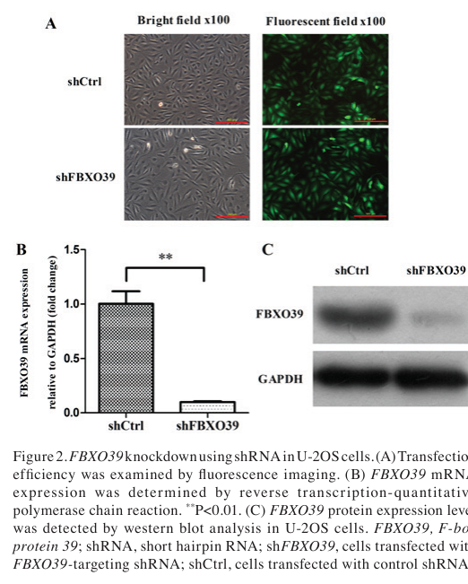

## Question

# Gene Research for Functional Annotation

## ⚠️ CRITICAL: Gene/Protein Identification Context

**BEFORE YOU BEGIN RESEARCH:** You MUST verify you are researching the CORRECT gene/protein. Gene symbols can be ambiguous, especially for less well-characterized genes from non-model organisms.

### Target Gene/Protein Identity (from UniProt):
- **UniProt Accession:** Q8N4B4
- **Protein Description:** RecName: Full=F-box only protein 39;
- **Gene Information:** Name=FBXO39; Synonyms=FBX39;
- **Organism (full):** Homo sapiens (Human).
- **Protein Family:** Not specified in UniProt
- **Key Domains:** F-box-like_dom_sf. (IPR036047); F-box_dom. (IPR001810); FBXO31/39. (IPR045048); Leu-rich_rpt. (IPR001611); LRR_dom_sf. (IPR032675)

### MANDATORY VERIFICATION STEPS:

1. **Check if the gene symbol "FBXO39" matches the protein description above**
2. **Verify the organism is correct:** Homo sapiens (Human).
3. **Check if protein family/domains align with what you find in literature**
4. **If you find literature for a DIFFERENT gene with the same or similar symbol, STOP**

### If Gene Symbol is Ambiguous or You Cannot Find Relevant Literature:

**DO NOT PROCEED WITH RESEARCH ON A DIFFERENT GENE.** Instead:
- State clearly: "The gene symbol 'FBXO39' is ambiguous or literature is limited for this specific protein"
- Explain what you found (e.g., "Found extensive literature on a different gene with the same symbol in a different organism")
- Describe the protein based ONLY on the UniProt information provided above
- Suggest that the protein function can be inferred from domain/family information

### Research Target:

Please provide a comprehensive research report on the gene **FBXO39** (gene ID: FBXO39, UniProt: Q8N4B4) in human.

The research report should be a detailed narrative explaining the function, biological processes, and localization of the gene product. Citations should be given for all claims.

You should prioritize authoritative reviews and primary scientific literature when conducting research. You can supplement
this with annotations you find in gene/protein databases, but these can be outdated or inaccurate.

We are specifically interested in the primary function of the gene - for enzymes, what reaction is catalyzed, and what is the substrate specificity? For transporters, what is the substrate? For structural proteins or adapters, what is the broader structural role? For signaling molecules, what is the role in the pathway.

We are interested in where in or outside the cell the gene product carries out its function.

We are also interested in the signaling or biochemical pathways in which the gene functions. We are less interested in broad pleiotropic effects, except where these elucidate the precise role.

Include evidence where possible. We are interested in both experimental evidence as well as inference from structure, evolution, or bioinformatic analysis. Precise studies should be prioritized over high-throughput, where available.

## Output

Question: You are an expert researcher providing comprehensive, well-cited information.

Provide detailed information focusing on:
1. Key concepts and definitions with current understanding
2. Recent developments and latest research (prioritize 2023-2024 sources)
3. Current applications and real-world implementations
4. Expert opinions and analysis from authoritative sources
5. Relevant statistics and data from recent studies

Format as a comprehensive research report with proper citations. Include URLs and publication dates where available.
Always prioritize recent, authoritative sources and provide specific citations for all major claims.

# Gene Research for Functional Annotation

## ⚠️ CRITICAL: Gene/Protein Identification Context

**BEFORE YOU BEGIN RESEARCH:** You MUST verify you are researching the CORRECT gene/protein. Gene symbols can be ambiguous, especially for less well-characterized genes from non-model organisms.

### Target Gene/Protein Identity (from UniProt):
- **UniProt Accession:** Q8N4B4
- **Protein Description:** RecName: Full=F-box only protein 39;
- **Gene Information:** Name=FBXO39; Synonyms=FBX39;
- **Organism (full):** Homo sapiens (Human).
- **Protein Family:** Not specified in UniProt
- **Key Domains:** F-box-like_dom_sf. (IPR036047); F-box_dom. (IPR001810); FBXO31/39. (IPR045048); Leu-rich_rpt. (IPR001611); LRR_dom_sf. (IPR032675)

### MANDATORY VERIFICATION STEPS:

1. **Check if the gene symbol "FBXO39" matches the protein description above**
2. **Verify the organism is correct:** Homo sapiens (Human).
3. **Check if protein family/domains align with what you find in literature**
4. **If you find literature for a DIFFERENT gene with the same or similar symbol, STOP**

### If Gene Symbol is Ambiguous or You Cannot Find Relevant Literature:

**DO NOT PROCEED WITH RESEARCH ON A DIFFERENT GENE.** Instead:
- State clearly: "The gene symbol 'FBXO39' is ambiguous or literature is limited for this specific protein"
- Explain what you found (e.g., "Found extensive literature on a different gene with the same symbol in a different organism")
- Describe the protein based ONLY on the UniProt information provided above
- Suggest that the protein function can be inferred from domain/family information

### Research Target:

Please provide a comprehensive research report on the gene **FBXO39** (gene ID: FBXO39, UniProt: Q8N4B4) in human.

The research report should be a detailed narrative explaining the function, biological processes, and localization of the gene product. Citations should be given for all claims.

You should prioritize authoritative reviews and primary scientific literature when conducting research. You can supplement
this with annotations you find in gene/protein databases, but these can be outdated or inaccurate.

We are specifically interested in the primary function of the gene - for enzymes, what reaction is catalyzed, and what is the substrate specificity? For transporters, what is the substrate? For structural proteins or adapters, what is the broader structural role? For signaling molecules, what is the role in the pathway.

We are interested in where in or outside the cell the gene product carries out its function.

We are also interested in the signaling or biochemical pathways in which the gene functions. We are less interested in broad pleiotropic effects, except where these elucidate the precise role.

Include evidence where possible. We are interested in both experimental evidence as well as inference from structure, evolution, or bioinformatic analysis. Precise studies should be prioritized over high-throughput, where available.

# Research Report: Human **FBXO39** (UniProt **Q8N4B4**) – Functional Annotation

## 0) Target verification (mandatory)

**Gene/protein identity.** The evidence set consistently refers to the human gene **FBXO39** (approved symbol FBXO39; approved name “F-box protein 39”), matching the target described as **F-box only protein 39** (UniProt Q8N4B4) (OpenTargets Search: -FBXO39). The same symbol is used in multiple human cancer and transcriptomic studies, without evidence of symbol collision in another organism in the retrieved sources (zheng2018knockdownoffbxo39 pages 3-5, azimi2025cancertestisantigensfbxo39 pages 10-13).

**Organism.** All mechanistic/biomarker studies cited here are in human tissues/cell lines or human datasets (TCGA/CGGA) (zheng2018knockdownoffbxo39 pages 3-5, azimi2025cancertestisantigensfbxo39 pages 10-13, motalebzadeh2018prognosticvalueof pages 1-2).

**Domain expectations vs retrieved literature.** UniProt/domain databases describe Q8N4B4 as containing an **F-box** and **leucine-rich repeats (LRR)** (user-provided UniProt/domain context). The retrieved *review* literature provides the general, canonical mapping: F-box proteins have an **F-box motif** binding **SKP1** and variable C-terminal substrate-recognition domains; domain-based subclasses include **FBXL (LRR)**, **FBXW (WD40)**, and **FBXO (other domains)** (xuan2024theemergingand pages 1-2, wang2014rolesoffbox pages 1-3). However, the retrieved primary FBXO39 papers do **not** directly re-demonstrate FBXO39’s specific LRR architecture or binding to SKP1/CUL1/RBX1; therefore, these features should be treated as **domain-informed inference**, not FBXO39-specific experimental proof in this evidence set.

## 1) Key concepts and definitions (current understanding)

### 1.1 F-box proteins and SCF E3 ligases

**SCF/CRL1 concept.** F-box proteins are widely defined as **substrate-recognition subunits** of the **SCF (SKP1–CUL1–RBX1–F-box)** E3 ubiquitin ligase family (also called CRL1), which ubiquitinates target proteins for proteasomal degradation (xuan2024theemergingand pages 1-2, wang2014rolesoffbox pages 1-3). The SCF core is relatively invariant (SKP1, CUL1, RBX1), whereas the F-box protein is variable and confers substrate specificity (wang2014rolesoffbox pages 1-3).

**Domain logic.** Canonically, an F-box protein contains:
- an **F-box motif** that mediates binding to **SKP1**; and
- a **C-terminal substrate-recognition region** that binds degrons (often post-translationally modified) in substrates (wang2014rolesoffbox pages 1-3).

**Degron recognition.** Substrate binding often depends on **degrons**, frequently **phosphodegrons**, but can involve other motifs including glycosylation-dependent recognition (examples in review: FBXO6 recognition of a glycosylated degron; FBXO2 binding high-mannose motifs) (xuan2024theemergingand pages 1-2, wang2014rolesoffbox pages 1-3).

### 1.2 Cancer/testis antigens (CTAs)

**Definition.** CTAs are typically expressed in testis (and sometimes placenta) with limited expression in normal somatic tissues, but are aberrantly re-expressed in cancers—making them attractive targets for immunotherapy and biomarkers (azimi2025cancertestisantigensfbxo39 pages 15-16, zhuo2024unveilingthesignificance pages 1-2). FBXO39 is repeatedly discussed in the CTA context and is also known as **BCP-20** in older SEREX discovery literature, as summarized in later studies (azimi2025cancertestisantigensfbxo39 pages 15-16, motalebzadeh2018prognosticvalueof pages 1-2).

## 2) FBXO39: current functional understanding (direct evidence vs inference)

### 2.1 Putative molecular function (inference from F-box biology)

Given UniProt/domain context (F-box + LRR) and general F-box protein principles, the **most plausible primary molecular function** for FBXO39 is as a **substrate adaptor** in an SCF-type E3 ligase, coupling specific substrates to ubiquitination and consequent changes in stability or function. This is strongly supported as a *family-level mechanism* (xuan2024theemergingand pages 1-2, wang2014rolesoffbox pages 1-3), but **FBXO39-specific substrate repertoire remains poorly established** in the retrieved 2023–2024 literature.

### 2.2 Experimentally supported cellular phenotypes (primary evidence)

**Osteosarcoma cell growth and apoptosis.** In human osteosarcoma U-2OS cells, lentiviral shRNA knockdown of FBXO39 reduced proliferation (Celigo-based counts; MTT assays) and increased apoptosis (Annexin V flow cytometry; caspase 3/7 activity), with reported significance thresholds including P<0.01 for caspase activation (zheng2018knockdownoffbxo39 pages 3-5). These findings are visually supported by the paper’s figures showing knockdown validation and phenotypic assays (zheng2018knockdownoffbxo39 media ae423a55, zheng2018knockdownoffbxo39 media 416a7e10, zheng2018knockdownoffbxo39 media b61568b9).

**Interpretation.** This establishes FBXO39 as functionally relevant for tumor cell viability in at least one in vitro cancer model, but does not identify the direct biochemical substrate(s) or cellular compartment where FBXO39 acts (zheng2018knockdownoffbxo39 pages 3-5).

### 2.3 Substrates and mechanistic pathways

**Evidence status in 2023–2024.** In the retrieved 2023–2024 sources, FBXO39 is mainly treated as a biomarker/CTA; **no experimentally validated substrates** for FBXO39 are reported in those snippets (azimi2025cancertestisantigensfbxo39 pages 10-13, zhuo2024unveilingthesignificance pages 1-2).

**Later mechanistic report (post-2024, included for completeness).** A 2026 colorectal cancer study proposes a specific mechanism: FBXO39 promotes colorectal cancer progression and LDHA-mediated aerobic glycolysis via **p53 degradation**, supported by co-immunoprecipitation, ubiquitination assays with proteasome inhibition (MG132), chromatin immunoprecipitation and promoter assays for LDHA regulation by p53, Seahorse metabolic flux assays, and xenografts (n=5) (liu2026fbxo39promotesldhamediated pages 4-6). Because this is 2026, it is outside the user’s preferred 2023–2024 window and should be treated as **emerging** rather than established.

### 2.4 Subcellular localization

No direct subcellular localization experiments for FBXO39 (e.g., IF microscopy, cell fractionation) were found in the retrieved evidence snippets (zheng2018knockdownoffbxo39 pages 3-5, azimi2025cancertestisantigensfbxo39 pages 10-13). Consequently, localization is currently **undetermined** in this evidence set.

## 3) Expression patterns and biology

### 3.1 Testis enrichment and reproductive context

A 2024 review of F-box proteins in spermatogenesis/male infertility lists **FBXO39 among F-box proteins found at the highest levels in the testis** (without giving FBXO39-specific mechanistic data) (xuan2024theemergingand pages 7-8). The same review provides a conceptual framework that SCF/F-box complexes regulate germ cell development through regulated proteolysis and that many testis-enriched F-box proteins remain mechanistically uncharacterized (xuan2024theemergingand pages 1-2, xuan2024theemergingand pages 7-8).

### 3.2 Cancer/testis antigen status and cancer expression

**CTA identity and discovery.** Multiple sources summarize FBXO39 as a CTA identified in colon cancer by SEREX and known as **BCP-20/FBXO39** (azimi2025cancertestisantigensfbxo39 pages 15-16, motalebzadeh2018prognosticvalueof pages 1-2).

**Colorectal cancer tissue restriction.** In a cohort of 36 Iranian colorectal cancer patients, FBXO39 expression measured by RT-PCR was reported as **restricted to tumor tissues**, with testis as positive control; expression was detected in all stage-0 tumor samples and associated with lymph node involvement (motalebzadeh2018prognosticvalueof pages 1-2).

## 4) Recent developments (prioritizing 2023–2024)

### 4.1 Glioma/GBM prognostic signatures (2023)

A 2023 glioma paper constructed an HHV-6/HHV-7 infection-related signature (HI model) including **FBXO39** with a reported coefficient of **0.223492** in the risk score formula (azimi2025cancertestisantigensfbxo39 pages 10-13). This is a computational prognostic signature and should be interpreted as association rather than proof of causality.

### 4.2 CTA-focused glioma review and functional claims (2024)

A 2024 CTA review of glioma describes FBXO39 as associated with poorer GBM prognosis and summarizes that FBXO39 may enhance invasion/migration and promote growth/stemness of glioma stem cells (zhuo2024unveilingthesignificance pages 1-2). The excerpt is qualitative and does not provide study design details or effect sizes.

### 4.3 Digestive tract cancer CTA immunotherapy landscape (2023)

A 2023 review of CTAs in digestive tract cancers lists FBXO39 (BCP-20) among CTAs frequently expressed in colorectal cancer, positioning it as a potential immunotherapy target class (azimi2025cancertestisantigensfbxo39 pages 15-16). The review-level evidence supports **rationale** for targeting CTAs but does not constitute FBXO39-specific clinical validation.

## 5) Disease associations, expert synthesis, and quantitative statistics

### 5.1 Disease associations (aggregated and literature-linked)

Open Targets aggregates FBXO39 associations with multiple cancers, including glioblastoma multiforme, cervical carcinoma/cervical squamous cell carcinoma, colorectal carcinoma, and breast cancer, with linked literature identifiers (OpenTargets Search: -FBXO39). These are useful for triangulating relevance but are not mechanistic proof.

### 5.2 Quantitative prognostic statistics (available in retrieved papers)

**GBM survival analyses (2025; included for quantitative detail).** In a 2025 GBM CTA-focused study, Cox model outputs for FBXO39 were reported as:
- TCGA cohort: β = −0.354; HR = 0.702 (95% CI 0.218–2.263); P = 0.554
- CGGA cohort: β = 0.196; HR = 1.217 (95% CI 0.957–1.547); P = 0.109
and a local cohort showed no significant survival difference (P = 0.12), despite reporting FBXO39 upregulation in 29 GBM tissues vs 2 normal tissues (azimi2025cancertestisantigensfbxo39 pages 10-13).

**CRC clinicopathologic association (2018).** FBXO39 expression showed a “significant relation” with lymph node involvement in the CRC cohort, though the excerpt did not provide the exact p-value or effect size (motalebzadeh2018prognosticvalueof pages 1-2).

## 6) Current applications and real-world implementations

### 6.1 Biomarker use (research and translational)

- **Cancer biomarker/prognosis:** Multiple studies treat FBXO39 expression as a candidate prognostic biomarker (CRC, glioma/GBM), though the strength of association varies across cohorts and sometimes lacks significance in multivariable survival models (azimi2025cancertestisantigensfbxo39 pages 10-13, motalebzadeh2018prognosticvalueof pages 1-2, zhuo2024unveilingthesignificance pages 1-2).
- **Immunotherapy target class:** As a CTA (BCP-20/FBXO39), it is of interest for cancer vaccines/immune targeting in digestive cancers and glioma, but no FBXO39-specific clinical trial evidence was identified in the retrieved set (azimi2025cancertestisantigensfbxo39 pages 15-16, zhuo2024unveilingthesignificance pages 1-2).

### 6.2 Functional targeting (preclinical)

The strongest direct functional evidence in the retrieved set is the osteosarcoma knockdown work showing reduced proliferation and increased apoptosis after FBXO39 silencing, supporting the general concept that FBXO39 could be a vulnerability in certain tumor contexts (zheng2018knockdownoffbxo39 pages 3-5, zheng2018knockdownoffbxo39 media ae423a55).

## 7) Evidence gaps and recommended next steps for functional annotation

1. **Direct SCF complex membership evidence:** No co-IP evidence demonstrating FBXO39 interaction with **SKP1/CUL1/RBX1** was found in the retrieved snippets; confirming SCF assembly would substantially strengthen mechanistic annotation.
2. **Validated substrates:** 2023–2024 evidence lacks FBXO39 substrates. The 2026 p53 model is plausible given SCF biology but requires independent confirmation and mapping of degron recognition (liu2026fbxo39promotesldhamediated pages 4-6).
3. **Subcellular localization:** No localization assays were retrieved; this remains a critical annotation gap (zheng2018knockdownoffbxo39 pages 3-5).
4. **Tissue specificity and epigenetic regulation:** CTA expression often involves epigenetic dysregulation (e.g., methylation changes) in tumors; FBXO39-specific regulation is not demonstrated in the retrieved snippets, beyond CTA classification (azimi2025cancertestisantigensfbxo39 pages 15-16).

## Evidence summary table

| Evidence category | Key findings | Study type/methods | Quantitative/statistical data (HR/beta/p-values/sample size) | Year | Citation ID |
|---|---|---|---|---|---|
| identity/domains | FBXO39 is the human gene/protein matching UniProt Q8N4B4 and is described in the literature as F-box protein 39, a member of the F-box family; available snippets support SCF E3 ligase adaptor context but do not provide direct experimental confirmation of its LRR domains or family-specific biochemistry. | Database/disease-association aggregation; family-context statements in experimental papers and reviews | Open Targets lists approved symbol FBXO39 linked to ENSG00000177294; no direct domain statistics in retrieved snippets | 2025/NA | (OpenTargets Search: -FBXO39, zheng2018knockdownoffbxo39 pages 3-5) |
| molecular function | Available direct evidence supports a pro-proliferative, anti-apoptotic role in U-2OS osteosarcoma cells; broader literature frames FBXO39 as an F-box protein involved in substrate recognition for SCF ubiquitin ligases. | Lentiviral shRNA knockdown, RT-qPCR, western blot, Celigo cell counting, MTT, caspase 3/7 assay, Annexin V FACS | Knockdown increased caspase 3/7 activity vs control (P<0.01) and significantly reduced proliferation; statistical threshold reported as P<0.05/P<0.01 | 2018 | (zheng2018knockdownoffbxo39 pages 3-5, zheng2018knockdownoffbxo39 media ae423a55) |
| substrates/mechanism | No experimentally validated substrate is provided in the 2018 osteosarcoma or 2025 GBM snippets. A later mechanistic report (outside the user's 2023–2024 priority window) proposes that FBXO39 promotes colorectal cancer by mediating p53 degradation, increasing LDHA-driven aerobic glycolysis. | Mechanistic cancer study using Co-IP, ubiquitination assay, MG132 treatment, ChIP-qPCR, dual-luciferase assay, Seahorse OCR/ECAR, xenografts | Xenograft design included 1×10^6 CRC cells, n=5 mice; excerpt states FBXO39 was an independent risk factor, but no HR/p-value numbers were provided in the snippet | 2026 | (liu2026fbxo39promotesldhamediated pages 4-6) |
| localization | No direct subcellular localization data for FBXO39 were present in the retrieved evidence snippets. | No direct localization assay in retrieved snippets | Not reported | NA | (zheng2018knockdownoffbxo39 pages 3-5, azimi2025cancertestisantigensfbxo39 pages 10-13) |
| expression/CTA | FBXO39 is repeatedly described as a cancer-testis antigen (CTA), originally identified as BCP-20/FBXO39 in colon cancer by SEREX; expression is characterized as testis-restricted among normal tissues and aberrantly expressed in multiple cancers. In CRC, one study found expression restricted to tumor tissues, using testis as positive control. | SEREX discovery; RT-PCR in tumor vs adjacent normal tissue; review/bioinformatic synthesis | CRC cohort n=36; FBXO39 expression detected in all stage-0 tumor samples; no FBXO39-specific p-value given in the excerpt for tumor restriction | 2018–2025 | (azimi2025cancertestisantigensfbxo39 pages 15-16, motalebzadeh2018prognosticvalueof pages 1-2, czerewaty2024expressionofcancer pages 10-11) |
| disease associations/prognosis | CRC: FBXO39 expression associated with lymph node involvement and proposed prognostic value. GBM: expression reported upregulated in 29 tumors vs 2 normals, but Cox results in TCGA/CGGA were not statistically significant in the provided excerpt. Glioma/GBM reviews also summarize links to poorer prognosis, invasion, migration, growth, and stemness. Open Targets lists disease associations for glioblastoma, cervical carcinoma, cervical squamous cell carcinoma, colorectal carcinoma, and breast cancer. | RT-PCR; TCGA/CGGA bioinformatics; Kaplan-Meier/Cox analyses; review synthesis; Open Targets evidence aggregation | CRC cohort n=36; GBM local cohort 29 tumors vs 2 normals; TCGA Cox: β=-0.354, HR=0.702, 95% CI 0.218–2.263, P=0.554; CGGA Cox: β=0.196, HR=1.217, 95% CI 0.957–1.547, P=0.109; local cohort survival P=0.12 | 2018–2025 | (azimi2025cancertestisantigensfbxo39 pages 10-13, motalebzadeh2018prognosticvalueof pages 1-2, zhuo2024unveilingthesignificance pages 1-2, OpenTargets Search: -FBXO39) |
| applications/therapeutics | Current translational relevance is mainly as a biomarker/immunotherapy candidate rather than a validated drug target. CTA-focused reviews identify FBXO39 as a potential immunotherapy antigen in digestive cancers and glioma, and a 2025 GBM study concluded FBXO39 expression measurement may have prognostic biomarker utility. No FBXO39-specific clinical trial was identified in the retrieved evidence. | CTA reviews; bioinformatic/clinical biomarker study | Open Targets evidence size = 3 for each listed disease association in retrieved output; GBM validation cohort n=29 | 2023–2025 | (azimi2025cancertestisantigensfbxo39 pages 15-16, zhuo2024unveilingthesignificance pages 1-2, OpenTargets Search: -FBXO39) |

*Table: This table consolidates the retrieved evidence for human FBXO39/Q8N4B4 across identity, function, mechanism, expression, prognosis, and translational relevance. It highlights where evidence is direct versus limited, which is useful for cautious functional annotation of this poorly characterized gene.*

## Key URLs (from retrieved sources)

- Xuan et al., *Cell Regeneration* (Jun 2024): https://doi.org/10.1186/s13619-024-00196-9 (xuan2024theemergingand pages 1-2)
- Zhuo et al., *Discover Oncology* (Oct 2024): https://doi.org/10.1007/s12672-024-01449-4 (zhuo2024unveilingthesignificance pages 1-2)
- Chen et al., *Journal of Medical Virology* (Nov 2023): https://doi.org/10.1002/jmv.28285 (azimi2025cancertestisantigensfbxo39 pages 10-13)
- Zheng et al., *Oncology Letters* (Jun 2018): https://doi.org/10.3892/ol.2018.8876 (zheng2018knockdownoffbxo39 pages 3-5)
- Motalebzadeh et al., *APJCP* (May 2018): https://doi.org/10.22034/apjcp.2018.19.5.1357 (motalebzadeh2018prognosticvalueof pages 1-2)
- Azimi et al., *PLOS One* (Jun 2025): https://doi.org/10.1371/journal.pone.0326054 (azimi2025cancertestisantigensfbxo39 pages 10-13)

## Visual evidence (figures)

- FBXO39 knockdown validation and proliferation/apoptosis assays in U-2OS osteosarcoma cells (zheng2018knockdownoffbxo39 media ae423a55, zheng2018knockdownoffbxo39 media 416a7e10, zheng2018knockdownoffbxo39 media b61568b9)

References

1. (OpenTargets Search: -FBXO39): Open Targets Query (-FBXO39, 5 results). Buniello, A. et al. (2025). Open Targets Platform: facilitating therapeutic hypotheses building in drug discovery. Nucleic Acids Research.

2. (zheng2018knockdownoffbxo39 pages 3-5): Jianrong Zheng, Wei You, Chuanxi Zheng, Peng Wan, Jinquan Chen, Xiaochun Jiang, Zhixiang Zhu, Zhixiong Zhang, Anqi Gong, Wei Li, Jifeng Tan, Tao Ji, Wei Guo, and Shiquan Zhang. Knockdown of fbxo39 inhibits proliferation and promotes apoptosis of human osteosarcoma u-2os cells. Oncology letters, 16 2:1849-1854, Jun 2018. URL: https://doi.org/10.3892/ol.2018.8876, doi:10.3892/ol.2018.8876. This article has 10 citations and is from a peer-reviewed journal.

3. (azimi2025cancertestisantigensfbxo39 pages 10-13): Parisa Azimi, Maryam Bazrgar, Taravat Yazdanian, Mehdi Totonchi, and Abolhassan Ahmadiani. Cancer/testis antigens fbxo39 and cep55 expression correlates with survival in gbm patients. PLOS One, 20:e0326054, Jun 2025. URL: https://doi.org/10.1371/journal.pone.0326054, doi:10.1371/journal.pone.0326054. This article has 1 citations and is from a peer-reviewed journal.

4. (motalebzadeh2018prognosticvalueof pages 1-2): Jamshid Motalebzadeh, Samira Shabani, S. Rezayati, N. Shakournia, R. Mirzaei, B. Mahjoubi, K. Hoseini, and F. Mahjoubi. Prognostic value of fbxo39 and ets-1 but not bmi-1 in iranian colorectal cancer patients. Asian Pacific Journal of Cancer Prevention : APJCP, 19:1357-1362, May 2018. URL: https://doi.org/10.22034/apjcp.2018.19.5.1357, doi:10.22034/apjcp.2018.19.5.1357. This article has 10 citations.

5. (xuan2024theemergingand pages 1-2): Zhuang Xuan, Jun Ruan, Canquan Zhou, and Zhi-ming Li. The emerging and diverse roles of f-box proteins in spermatogenesis and male infertility. Cell Regeneration, Jun 2024. URL: https://doi.org/10.1186/s13619-024-00196-9, doi:10.1186/s13619-024-00196-9. This article has 5 citations.

6. (wang2014rolesoffbox pages 1-3): Zhiwei Wang, Pengda Liu, Hiroyuki Inuzuka, and Wenyi Wei. Roles of f-box proteins in cancer. Nature Reviews Cancer, 14:233-247, Mar 2014. URL: https://doi.org/10.1038/nrc3700, doi:10.1038/nrc3700. This article has 586 citations and is from a domain leading peer-reviewed journal.

7. (azimi2025cancertestisantigensfbxo39 pages 15-16): Parisa Azimi, Maryam Bazrgar, Taravat Yazdanian, Mehdi Totonchi, and Abolhassan Ahmadiani. Cancer/testis antigens fbxo39 and cep55 expression correlates with survival in gbm patients. PLOS One, 20:e0326054, Jun 2025. URL: https://doi.org/10.1371/journal.pone.0326054, doi:10.1371/journal.pone.0326054. This article has 1 citations and is from a peer-reviewed journal.

8. (zhuo2024unveilingthesignificance pages 1-2): Shenghua Zhuo, Shuo Yang, Shenbo Chen, Yueju Ding, Honglei Cheng, Liangwang Yang, Kai Wang, and Kun Yang. Unveiling the significance of cancer-testis antigens and their implications for immunotherapy in glioma. Discover Oncology, Oct 2024. URL: https://doi.org/10.1007/s12672-024-01449-4, doi:10.1007/s12672-024-01449-4. This article has 5 citations.

9. (zheng2018knockdownoffbxo39 media ae423a55): Jianrong Zheng, Wei You, Chuanxi Zheng, Peng Wan, Jinquan Chen, Xiaochun Jiang, Zhixiang Zhu, Zhixiong Zhang, Anqi Gong, Wei Li, Jifeng Tan, Tao Ji, Wei Guo, and Shiquan Zhang. Knockdown of fbxo39 inhibits proliferation and promotes apoptosis of human osteosarcoma u-2os cells. Oncology letters, 16 2:1849-1854, Jun 2018. URL: https://doi.org/10.3892/ol.2018.8876, doi:10.3892/ol.2018.8876. This article has 10 citations and is from a peer-reviewed journal.

10. (zheng2018knockdownoffbxo39 media 416a7e10): Jianrong Zheng, Wei You, Chuanxi Zheng, Peng Wan, Jinquan Chen, Xiaochun Jiang, Zhixiang Zhu, Zhixiong Zhang, Anqi Gong, Wei Li, Jifeng Tan, Tao Ji, Wei Guo, and Shiquan Zhang. Knockdown of fbxo39 inhibits proliferation and promotes apoptosis of human osteosarcoma u-2os cells. Oncology letters, 16 2:1849-1854, Jun 2018. URL: https://doi.org/10.3892/ol.2018.8876, doi:10.3892/ol.2018.8876. This article has 10 citations and is from a peer-reviewed journal.

11. (zheng2018knockdownoffbxo39 media b61568b9): Jianrong Zheng, Wei You, Chuanxi Zheng, Peng Wan, Jinquan Chen, Xiaochun Jiang, Zhixiang Zhu, Zhixiong Zhang, Anqi Gong, Wei Li, Jifeng Tan, Tao Ji, Wei Guo, and Shiquan Zhang. Knockdown of fbxo39 inhibits proliferation and promotes apoptosis of human osteosarcoma u-2os cells. Oncology letters, 16 2:1849-1854, Jun 2018. URL: https://doi.org/10.3892/ol.2018.8876, doi:10.3892/ol.2018.8876. This article has 10 citations and is from a peer-reviewed journal.

12. (liu2026fbxo39promotesldhamediated pages 4-6): Jipeng Liu, Taifu Xiao, and Jun Huang. Fbxo39 promotes ldha-mediated aerobic glycolysis and colorectal cancer progression by p53 degradation. Journal of Translational Medicine, Apr 2026. URL: https://doi.org/10.1186/s12967-026-08056-7, doi:10.1186/s12967-026-08056-7. This article has 0 citations and is from a peer-reviewed journal.

13. (xuan2024theemergingand pages 7-8): Zhuang Xuan, Jun Ruan, Canquan Zhou, and Zhi-ming Li. The emerging and diverse roles of f-box proteins in spermatogenesis and male infertility. Cell Regeneration, Jun 2024. URL: https://doi.org/10.1186/s13619-024-00196-9, doi:10.1186/s13619-024-00196-9. This article has 5 citations.

14. (czerewaty2024expressionofcancer pages 10-11): M Czerewaty and M Tarnowski. Expression of cancer testis genes in gastric neoplasms—a preliminary study. Unknown journal, 2024.

## Artifacts

- [Edison artifact artifact-00](FBXO39-deep-research-falcon_artifacts/artifact-00.md)

## Citations

1. wang2014rolesoffbox pages 1-3
2. xuan2024theemergingand pages 7-8
3. motalebzadeh2018prognosticvalueof pages 1-2
4. zhuo2024unveilingthesignificance pages 1-2
5. xuan2024theemergingand pages 1-2
6. czerewaty2024expressionofcancer pages 10-11
7. https://doi.org/10.1186/s13619-024-00196-9
8. https://doi.org/10.1007/s12672-024-01449-4
9. https://doi.org/10.1002/jmv.28285
10. https://doi.org/10.3892/ol.2018.8876
11. https://doi.org/10.22034/apjcp.2018.19.5.1357
12. https://doi.org/10.1371/journal.pone.0326054
13. https://doi.org/10.3892/ol.2018.8876,
14. https://doi.org/10.1371/journal.pone.0326054,
15. https://doi.org/10.22034/apjcp.2018.19.5.1357,
16. https://doi.org/10.1186/s13619-024-00196-9,
17. https://doi.org/10.1038/nrc3700,
18. https://doi.org/10.1007/s12672-024-01449-4,
19. https://doi.org/10.1186/s12967-026-08056-7,