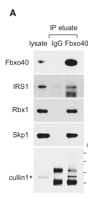

## Question

# Gene Research for Functional Annotation

## ⚠️ CRITICAL: Gene/Protein Identification Context

**BEFORE YOU BEGIN RESEARCH:** You MUST verify you are researching the CORRECT gene/protein. Gene symbols can be ambiguous, especially for less well-characterized genes from non-model organisms.

### Target Gene/Protein Identity (from UniProt):
- **UniProt Accession:** Q9UH90
- **Protein Description:** RecName: Full=F-box only protein 40; AltName: Full=Muscle disease-related protein;
- **Gene Information:** Name=FBXO40; Synonyms=FBX40, KIAA1195;
- **Organism (full):** Homo sapiens (Human).
- **Protein Family:** Not specified in UniProt
- **Key Domains:** F-box-like_dom_sf. (IPR036047); F-box_dom. (IPR001810); Fbxo30/Fbxo40. (IPR031890); Znf_RING/FYVE/PHD. (IPR013083); Znf_TRAF. (IPR001293)

### MANDATORY VERIFICATION STEPS:

1. **Check if the gene symbol "FBXO40" matches the protein description above**
2. **Verify the organism is correct:** Homo sapiens (Human).
3. **Check if protein family/domains align with what you find in literature**
4. **If you find literature for a DIFFERENT gene with the same or similar symbol, STOP**

### If Gene Symbol is Ambiguous or You Cannot Find Relevant Literature:

**DO NOT PROCEED WITH RESEARCH ON A DIFFERENT GENE.** Instead:
- State clearly: "The gene symbol 'FBXO40' is ambiguous or literature is limited for this specific protein"
- Explain what you found (e.g., "Found extensive literature on a different gene with the same symbol in a different organism")
- Describe the protein based ONLY on the UniProt information provided above
- Suggest that the protein function can be inferred from domain/family information

### Research Target:

Please provide a comprehensive research report on the gene **FBXO40** (gene ID: FBXO40, UniProt: Q9UH90) in human.

The research report should be a detailed narrative explaining the function, biological processes, and localization of the gene product. Citations should be given for all claims.

You should prioritize authoritative reviews and primary scientific literature when conducting research. You can supplement
this with annotations you find in gene/protein databases, but these can be outdated or inaccurate.

We are specifically interested in the primary function of the gene - for enzymes, what reaction is catalyzed, and what is the substrate specificity? For transporters, what is the substrate? For structural proteins or adapters, what is the broader structural role? For signaling molecules, what is the role in the pathway.

We are interested in where in or outside the cell the gene product carries out its function.

We are also interested in the signaling or biochemical pathways in which the gene functions. We are less interested in broad pleiotropic effects, except where these elucidate the precise role.

Include evidence where possible. We are interested in both experimental evidence as well as inference from structure, evolution, or bioinformatic analysis. Precise studies should be prioritized over high-throughput, where available.

## Output

Question: You are an expert researcher providing comprehensive, well-cited information.

Provide detailed information focusing on:
1. Key concepts and definitions with current understanding
2. Recent developments and latest research (prioritize 2023-2024 sources)
3. Current applications and real-world implementations
4. Expert opinions and analysis from authoritative sources
5. Relevant statistics and data from recent studies

Format as a comprehensive research report with proper citations. Include URLs and publication dates where available.
Always prioritize recent, authoritative sources and provide specific citations for all major claims.

# Gene Research for Functional Annotation

## ⚠️ CRITICAL: Gene/Protein Identification Context

**BEFORE YOU BEGIN RESEARCH:** You MUST verify you are researching the CORRECT gene/protein. Gene symbols can be ambiguous, especially for less well-characterized genes from non-model organisms.

### Target Gene/Protein Identity (from UniProt):
- **UniProt Accession:** Q9UH90
- **Protein Description:** RecName: Full=F-box only protein 40; AltName: Full=Muscle disease-related protein;
- **Gene Information:** Name=FBXO40; Synonyms=FBX40, KIAA1195;
- **Organism (full):** Homo sapiens (Human).
- **Protein Family:** Not specified in UniProt
- **Key Domains:** F-box-like_dom_sf. (IPR036047); F-box_dom. (IPR001810); Fbxo30/Fbxo40. (IPR031890); Znf_RING/FYVE/PHD. (IPR013083); Znf_TRAF. (IPR001293)

### MANDATORY VERIFICATION STEPS:

1. **Check if the gene symbol "FBXO40" matches the protein description above**
2. **Verify the organism is correct:** Homo sapiens (Human).
3. **Check if protein family/domains align with what you find in literature**
4. **If you find literature for a DIFFERENT gene with the same or similar symbol, STOP**

### If Gene Symbol is Ambiguous or You Cannot Find Relevant Literature:

**DO NOT PROCEED WITH RESEARCH ON A DIFFERENT GENE.** Instead:
- State clearly: "The gene symbol 'FBXO40' is ambiguous or literature is limited for this specific protein"
- Explain what you found (e.g., "Found extensive literature on a different gene with the same symbol in a different organism")
- Describe the protein based ONLY on the UniProt information provided above
- Suggest that the protein function can be inferred from domain/family information

### Research Target:

Please provide a comprehensive research report on the gene **FBXO40** (gene ID: FBXO40, UniProt: Q9UH90) in human.

The research report should be a detailed narrative explaining the function, biological processes, and localization of the gene product. Citations should be given for all claims.

You should prioritize authoritative reviews and primary scientific literature when conducting research. You can supplement
this with annotations you find in gene/protein databases, but these can be outdated or inaccurate.

We are specifically interested in the primary function of the gene - for enzymes, what reaction is catalyzed, and what is the substrate specificity? For transporters, what is the substrate? For structural proteins or adapters, what is the broader structural role? For signaling molecules, what is the role in the pathway.

We are interested in where in or outside the cell the gene product carries out its function.

We are also interested in the signaling or biochemical pathways in which the gene functions. We are less interested in broad pleiotropic effects, except where these elucidate the precise role.

Include evidence where possible. We are interested in both experimental evidence as well as inference from structure, evolution, or bioinformatic analysis. Precise studies should be prioritized over high-throughput, where available.

## Research report: FBXO40 (human; UniProt Q9UH90) — functional annotation and translational context

### 0) Target verification (critical identity check)
FBXO40 (UniProt **Q9UH90**) is the human gene encoding **F-box only protein 40** (also historically referenced as **KIAA1195 / FBX40**). The core functional literature on “Fbxo40/FBXO40” in mammals describes a **muscle-enriched F-box protein** that functions as the **substrate-recognition module** of an **SCF (SKP1–CUL1–RBX1) Cullin-RING E3 ubiquitin ligase** and targets **IRS1** for ubiquitin-mediated proteasomal degradation (shi2011thescffbxo40complex pages 4-5, shi2011thescffbxo40complex pages 1-2, zhang2020stat3activationinduces pages 1-4). This aligns with the UniProt-provided identity and domain expectation for an F-box protein (adapter in an SCF complex), and the biology is consistent across primary and review sources (shi2011thescffbxo40complex pages 9-10, blondelle2020theroleof pages 11-13, zhang2020stat3activationinduces pages 1-4).

### 1) Key concepts and definitions (current understanding)

#### 1.1 F-box proteins and SCF E3 ubiquitin ligases
F-box proteins are typically substrate-recognition adaptors in **SCF E3 ubiquitin ligase complexes**, which minimally comprise **SKP1, CUL1, RBX1** plus an **F-box substrate adaptor**. The SCF complex promotes substrate ubiquitination, often leading to **proteasomal degradation**.

For FBXO40 specifically, co-immunoprecipitation experiments show that **IRS1 and each SCF component (Skp1, Cullin1, Rbx1)** can be co-precipitated with Fbxo40, consistent with SCF assembly and adaptor function (shi2011thescffbxo40complex pages 4-5). Cropped figure panels in Shi et al. visually document this SCF-FBXO40 complex formation and associated assays (shi2011thescffbxo40complex media 7fb258a5, shi2011thescffbxo40complex media a3adc8ae, shi2011thescffbxo40complex media 6e110724, shi2011thescffbxo40complex media 54b10505).

#### 1.2 Primary molecular function (what FBXO40 “does”)
**Primary function:** FBXO40 acts as the **substrate-recognition subunit** of an SCF E3 ligase complex (**SCF-FBXO40**) that **ubiquitinates IRS1**, promoting its **ubiquitin–proteasome-dependent degradation** in skeletal muscle, thereby **limiting IGF-1/insulin signaling** through the IRS1–PI3K–AKT axis (shi2011thescffbxo40complex pages 9-10, shi2011thescffbxo40complex pages 4-5, shi2011thescffbxo40complex pages 1-2).

This makes FBXO40 a **regulatory node** controlling **growth-factor signal transduction**, not an enzyme that catalyzes a small-molecule reaction.

#### 1.3 Substrate specificity and regulation by phosphorylation
Shi et al. report that **tyrosine phosphorylation** of IRS1 (in the context of **IGF1R activation**) markedly enhances IRS1 polyubiquitination by SCF-Fbxo40 in vitro, supporting phosphorylation-dependent substrate recognition/processing (shi2011thescffbxo40complex pages 4-5).

### 2) Mechanistic evidence (primary studies) — pathways, substrates, phenotypes

#### 2.1 Direct biochemical evidence: IRS1 ubiquitination by SCF-FBXO40
Shi et al. (Developmental Cell; Nov 2011; DOI: https://doi.org/10.1016/j.devcel.2011.09.011) provide direct evidence that immunoprecipitated **SCF-Fbxo40** ubiquitinates **recombinant IRS1** in vitro (shi2011thescffbxo40complex pages 6-8, shi2011thescffbxo40complex pages 4-5). The same work shows SCF complex membership (Skp1/Cul1/Rbx1 association) and IGF1R dependence for IRS1 turnover (shi2011thescffbxo40complex pages 4-5).

**Quantitative datapoints (from reported excerpts):**
- In differentiated myotubes, **Fbxo40 knockdown** prolonged IRS1 half-life to **>6 hours** (shi2011thescffbxo40complex pages 4-5).
- In vivo, Fbxo40 knockout muscle shows increased IRS1 protein by densitometry (IRS1/eIF4E WT **1 ± 0.28** vs KO **2.97 ± 0.56**) (shi2011thescffbxo40complex pages 9-10). 

#### 2.2 Tissue specificity and cellular context
FBXO40 expression is described as **almost exclusively in heart and skeletal muscle** (at the mRNA level) and increases during myogenic differentiation, supporting a **striated-muscle-enriched** role (shi2011thescffbxo40complex pages 4-5). A cullin-RING ligase review similarly emphasizes muscle enrichment and links FBXO40 to denervation contexts (blondelle2020theroleof pages 11-13).

#### 2.3 IGF-1/insulin signaling pathway impact
By driving IRS1 turnover, FBXO40 dampens IGF-1 signaling output. Shi et al. show that Fbxo40 depletion preserves downstream AKT phosphorylation under IGF-1 stimulation and that hypertrophy from Fbxo40 knockdown is **IRS1-dependent** (shi2011thescffbxo40complex pages 8-9).

#### 2.4 Organism-level phenotypes (loss of function)
In mice, Fbxo40 knockout leads to increased growth and muscle mass:
- Body weight differences in growth phase were highly significant (*p < 0.0001 KO vs WT for both sexes) with sample sizes **n=26 KO females vs 22 WT females; n=19 KO males vs 15 WT males** (shi2011thescffbxo40complex pages 9-10).
- At ~6 weeks, muscle wet weights (e.g., TA, EDL, PLA) were increased (*p < 0.05) with **n=33 KO vs n=20 WT** (shi2011thescffbxo40complex pages 6-8, shi2011thescffbxo40complex pages 9-10).

These phenotypes are consistent with FBXO40 acting as a negative regulator of anabolic IGF-1/IRS1 signaling (shi2011thescffbxo40complex pages 9-10, shi2011thescffbxo40complex pages 8-9).

### 3) Regulation in catabolic/inflammatory states (STAT3/IL-6 axis)
Zhang et al. (AJP Endocrinology and Metabolism; May 2020; DOI: https://doi.org/10.1152/ajpendo.00480.2019) connect FBXO40 to inflammation-driven insulin resistance: **STAT3 activation** (e.g., via **IL-6**) increases Fbxo40 expression, reducing IRS1 and p-AKT; Fbxo40 knockdown preserves IRS1/p-AKT despite IL-6 (zhang2020stat3activationinduces pages 1-4).

They further report that **pharmacologic STAT3 inhibition (TTI-101)** improved glucose tolerance and muscle insulin signaling in mouse models (CKD or high-fat diet), and muscle-specific Stat3 knockout improved glucose tolerance on high-fat diet (zhang2020stat3activationinduces pages 1-4). These data support an upstream inflammatory transcriptional control layer over FBXO40 in skeletal muscle.

### 4) Subcellular localization
High-confidence subcellular localization data for endogenous human FBXO40 is limited in the gathered primary excerpts. A focused review notes that **forced expression** in muscle cells yields a **diffuse cytoplasmic localization** (blondelle2020theroleof pages 11-13). Given IRS1 and much of proximal IGF-1/insulin signaling occurs in the cytoplasm and at the membrane-proximal signaling complex, this is consistent with function, but additional high-resolution localization studies would strengthen the annotation.

### 5) Recent developments (2023–2024 prioritized)
Direct “new” mechanistic discoveries about FBXO40’s biochemical role remain dominated by the 2011–2020 literature in the retrieved corpus; however, 2023–2024 work extends translational and systems-level contexts.

#### 5.1 Cachexia intervention study implicating FBXO-40 (2023)
Yuan et al. (Journal of Cachexia, Sarcopenia and Muscle; Nov 2023; DOI: https://doi.org/10.1002/jcsm.13116) report in animal cachexia models that S-oxprenolol improved anabolic/catabolic signaling and **significantly reduced FBXO-40 expression** compared with placebo and R-oxprenolol, interpreting this as consistent with improved IRS1/anabolic signaling (yuan2023theatypicalβ‐blocker pages 4-6). The paper provides quantitative organ weight outcomes (e.g., in an LLC mouse model: gastrocnemius 75±2 mg placebo vs 87±2 mg with 10 mg S-oxprenolol; tibialis 25±1 vs 27±1 mg) (yuan2023theatypicalβ‐blocker pages 4-6).

While this does not prove FBXO40 is the sole driver of benefit, it strengthens the real-world relevance of the IRS1-targeting E3-ligase axis in muscle wasting pharmacology.

#### 5.2 Reviews and disease-context placement (2023–2024)
- A burn-wasting review in JCSM (Feb 2023; DOI: https://doi.org/10.1002/jcsm.13188) lists Fbxo40 among “less elaborated” muscle E3 ligases involved in regulating the IGF-1/insulin pathway in atrophy contexts, illustrating its incorporation into current conceptual frameworks of atrogenes and muscle wasting (dombrecht2023molecularmechanismsof pages 4-5).
- A 2024 review of F-box proteins in spermatogenesis notes FBXO40 is expressed at very low levels or not expressed in testis, consistent with muscle-enriched expression patterns rather than germline-essential roles (Jun 2024; DOI: https://doi.org/10.1186/s13619-024-00196-9) (xuan2024theemergingand pages 2-5).

#### 5.3 Cancer-associated bioinformatics signal (human) (2023)
A TCGA-based prognostic model study in endometrial cancer (World Journal of Surgical Oncology; Jan 2023; DOI: https://doi.org/10.1186/s12957-022-02875-w) reports that **FBXO40 expression** (among ubiquitination-related genes) was associated with **pathological grade** (wang2023genesignatureand pages 4-7). This is an association study rather than mechanistic validation.

### 6) Current applications and real-world implementations

#### 6.1 Genetic manipulation to alter muscle mass (animal models)
A cullin-RING ligase review summarizes that **CRISPR/Cas9 Fbxo40 knockout pigs** show ~**4% increased muscle mass** with elevated IRS1 and stimulated IGF1–AKT signaling (blondelle2020theroleof pages 11-13). Together with mouse knockout data, this supports FBXO40 as a tractable target for modulating muscle growth in preclinical/livestock contexts (shi2011thescffbxo40complex pages 9-10).

#### 6.2 Therapeutic strategy logic: modulating upstream regulators
The STAT3–FBXO40 axis suggests therapeutic leverage points upstream of FBXO40 transcription (e.g., STAT3 inhibitors in inflammatory catabolic states) to improve insulin/anabolic signaling in muscle (zhang2020stat3activationinduces pages 1-4). This is supported experimentally in mice but is not yet a validated clinical approach specific to FBXO40.

#### 6.3 Biomarker-style use in muscle wasting
Expert synthesis indicates FBXO40 is induced by **denervation** (and not necessarily by starvation-induced atrophy) and decreased in limb–girdle muscular dystrophy patients, implying potential context-specific biomarker relevance (blondelle2020theroleof pages 11-13). However, robust clinical biomarker validation metrics (sensitivity/specificity; prospective cohorts) were not present in the retrieved excerpts.

### 7) Expert opinion / authoritative synthesis
The 2020 review on cullin-RING ligases in striated muscle positions FBXO40 as a muscle-specific SCF substrate adaptor that regulates **IGF1–AKT signaling** via **IRS1 degradation**, and highlights denervation induction and disease-associated expression changes as important contexts (blondelle2020theroleof pages 11-13). This aligns with the primary mechanistic findings (shi2011thescffbxo40complex pages 4-5).

### 8) Disease associations and database evidence (human)
Open Targets lists only **weak, sparse disease-target associations** for FBXO40 (ENSG00000163833), with low scores and limited evidence count (e.g., “central nervous system cancer”, “ovarian dysfunction”, etc.), indicating that direct human genetics/clinical evidence linking FBXO40 to specific diseases remains limited in this resource (OpenTargets Search: -FBXO40). This supports a cautious interpretation: FBXO40 is mechanistically well-defined in muscle signaling, but disease causality/clinical utility remains underdeveloped.

### 9) Summary functional annotation (recommended concise statement)
FBXO40 (UniProt Q9UH90) is a **muscle-enriched F-box protein** that serves as the **substrate-recognition adaptor** in an **SCF (SKP1–CUL1–RBX1) E3 ubiquitin ligase complex**. Its best-supported direct substrate is **IRS1**, which it ubiquitinates (enhanced by IGF1R-dependent IRS1 tyrosine phosphorylation) to promote **proteasomal degradation**, thereby **attenuating IGF-1/insulin → IRS1 → PI3K/AKT signaling** and limiting muscle hypertrophy. FBXO40 expression/function is responsive to anabolic IGF-1 stimulation and can be transcriptionally upregulated by inflammatory **STAT3** signaling (e.g., IL-6), linking it to catabolic insulin resistance contexts. Loss of Fbxo40 increases IRS1 abundance and produces muscle hypertrophy in animal models, including mice and pigs (shi2011thescffbxo40complex pages 4-5, zhang2020stat3activationinduces pages 1-4, shi2011thescffbxo40complex pages 9-10).

---

### Evidence summary table
| Topic | Key findings | Evidence type | Year | Citation |
|---|---|---|---|---|
| identity/domains | Human FBXO40 corresponds to UniProt Q9UH90 and is consistently described in the literature as a muscle-enriched F-box protein; this matches its expected role as an SCF substrate-recognition component rather than a catalytic enzyme. | Database + review + primary | 2011–2020 | UniProt Q9UH90 / FBXO40; Shi et al., *SCF-Fbxo40 complex induces IRS1 ubiquitination* — https://doi.org/10.1016/j.devcel.2011.09.011; Blondelle et al., *Role of Cullin-RING Ligases in Striated Muscle* — https://doi.org/10.3390/ijms21217936 (shi2011thescffbxo40complex pages 9-10, blondelle2020theroleof pages 11-13) |
| molecular function | FBXO40 functions as a substrate-recognition subunit of a Cullin-RING E3 ubiquitin ligase that promotes ubiquitin-proteasome-dependent degradation of IRS1, thereby limiting IGF1/insulin signaling in skeletal muscle. | Primary | 2011 | Shi et al., *SCF-Fbxo40 complex induces IRS1 ubiquitination* — https://doi.org/10.1016/j.devcel.2011.09.011 (shi2011thescffbxo40complex pages 9-10, shi2011thescffbxo40complex pages 4-5, shi2011thescffbxo40complex pages 1-2) |
| E3 complex | FBXO40 co-immunoprecipitates with IRS1 and canonical SCF components Skp1, Cullin1, and Rbx1; immunoprecipitated SCF-FBXO40 ubiquitinates recombinant IRS1 in vitro. | Primary | 2011 | Shi et al., *SCF-Fbxo40 complex induces IRS1 ubiquitination* — https://doi.org/10.1016/j.devcel.2011.09.011 (shi2011thescffbxo40complex pages 6-8, shi2011thescffbxo40complex pages 4-5, shi2011thescffbxo40complex media 7fb258a5) |
| confirmed substrate | IRS1 is the best-supported direct substrate. Its ubiquitination is enhanced by tyrosine phosphorylation and IGF1R activation; FBXO40 knockdown prolongs IRS1 half-life to >6 h and increases muscle IRS1 protein without changing Irs1 mRNA. | Primary | 2011 | Shi et al., *SCF-Fbxo40 complex induces IRS1 ubiquitination* — https://doi.org/10.1016/j.devcel.2011.09.011 (shi2011thescffbxo40complex pages 4-5, shi2011thescffbxo40complex pages 8-8) |
| regulation | IGF1 signaling promotes FBXO40-dependent IRS1 turnover in differentiated myotubes. In inflammatory/catabolic settings, STAT3 binds the Fbxo40 promoter; IL-6/STAT3 raises Fbxo40 expression and lowers IRS1 and p-Akt, while Fbxo40 knockdown preserves IRS1/p-Akt. | Primary | 2011, 2020 | Shi et al., *SCF-Fbxo40 complex induces IRS1 ubiquitination* — https://doi.org/10.1016/j.devcel.2011.09.011; Zhang et al., *Stat3 activation induces insulin resistance via Fbxo40* — https://doi.org/10.1152/ajpendo.00480.2019 (shi2011thescffbxo40complex pages 4-5, zhang2020stat3activationinduces pages 1-4) |
| tissue/cell type | FBXO40 is expressed almost exclusively in skeletal muscle and heart, increases during myogenic differentiation, and is implicated mainly in differentiated myotubes/myofibers rather than broadly across tissues. | Primary + review | 2011, 2020 | Shi et al., *SCF-Fbxo40 complex induces IRS1 ubiquitination* — https://doi.org/10.1016/j.devcel.2011.09.011; Blondelle et al., *Role of Cullin-RING Ligases in Striated Muscle* — https://doi.org/10.3390/ijms21217936 (shi2011thescffbxo40complex pages 4-5, blondelle2020theroleof pages 11-13) |
| subcellular localization | Review evidence describes exogenous/forced FBXO40 as showing diffuse cytoplasmic localization in muscle cells; direct high-resolution localization evidence remains limited in the gathered sources. | Review | 2020 | Blondelle et al., *Role of Cullin-RING Ligases in Striated Muscle* — https://doi.org/10.3390/ijms21217936 (blondelle2020theroleof pages 11-13) |
| phenotypes | Fbxo40 knockdown causes myotube hypertrophy and this depends on IRS1. Fbxo40 knockout mice show increased IRS1 protein and larger body/muscle size during growth; one summary reports IRS1/eIF4E densitometry ~1.0 in WT vs ~2.97 in KO muscle. Review evidence also notes CRISPR Fbxo40 knockout pigs with ~4% higher muscle mass. | Primary + review | 2011, 2020 | Shi et al., *SCF-Fbxo40 complex induces IRS1 ubiquitination* — https://doi.org/10.1016/j.devcel.2011.09.011; Blondelle et al., *Role of Cullin-RING Ligases in Striated Muscle* — https://doi.org/10.3390/ijms21217936 (shi2011thescffbxo40complex pages 9-10, shi2011thescffbxo40complex pages 8-9, blondelle2020theroleof pages 11-13) |
| 2023-2024 developments/applications | Recent literature uses FBXO40 mainly as a mechanistic/therapeutic node in muscle wasting and insulin-resistance contexts rather than as a validated clinical target. Open Targets shows only weak, sparse disease associations outside muscle-focused literature, underscoring limited direct human disease validation so far. | Database | 2023–2024 platform context | Open Targets FBXO40 disease-association summary — https://platform.opentargets.org/target/ENSG00000163833 (OpenTargets Search: -FBXO40) |

*Table: This table compacts the strongest gathered evidence for human FBXO40/Q9UH90, emphasizing its role as a muscle-enriched SCF E3-ligase substrate receptor for IRS1. It also distinguishes primary mechanistic evidence from review and database-level associations to support functional annotation.*

---

### Figures supporting core mechanistic claims (from primary paper)
Cropped figure panels from Shi et al. (2011) show the core biochemical and phenotypic evidence: SCF complex co-IP and in vitro IRS1 ubiquitination, IRS1 elevation in KO muscle, and muscle hypertrophy quantification (shi2011thescffbxo40complex media 7fb258a5, shi2011thescffbxo40complex media a3adc8ae, shi2011thescffbxo40complex media 6e110724, shi2011thescffbxo40complex media 54b10505).

### Limitations of the current evidence package
- **Subcellular localization**: high-resolution localization of endogenous human FBXO40 was not directly retrieved; available statements are largely review-level and/or based on forced expression (blondelle2020theroleof pages 11-13).
- **2023–2024 mechanistic novelty**: most direct mechanistic substrate work remains anchored by Shi et al. (2011) and follow-on mechanistic studies; 2023–2024 literature in this retrieval mainly extends translational contexts (cachexia interventions; bioinformatic cancer signatures) rather than redefining FBXO40’s molecular function.

References

1. (shi2011thescffbxo40complex pages 4-5): Jun Shi, Liqing Luo, John Eash, Chikwendu Ibebunjo, and David J. Glass. The scf-fbxo40 complex induces irs1 ubiquitination in skeletal muscle, limiting igf1 signaling. Developmental cell, 21 5:835-47, Nov 2011. URL: https://doi.org/10.1016/j.devcel.2011.09.011, doi:10.1016/j.devcel.2011.09.011. This article has 170 citations and is from a highest quality peer-reviewed journal.

2. (shi2011thescffbxo40complex pages 1-2): Jun Shi, Liqing Luo, John Eash, Chikwendu Ibebunjo, and David J. Glass. The scf-fbxo40 complex induces irs1 ubiquitination in skeletal muscle, limiting igf1 signaling. Developmental cell, 21 5:835-47, Nov 2011. URL: https://doi.org/10.1016/j.devcel.2011.09.011, doi:10.1016/j.devcel.2011.09.011. This article has 170 citations and is from a highest quality peer-reviewed journal.

3. (zhang2020stat3activationinduces pages 1-4): Liping Zhang, Zihong Chen, Ying Wang, David J. Tweardy, and William E. Mitch. Stat3 activation induces insulin resistance via a muscle-specific e3 ubiquitin ligase fbxo40. May 2020. URL: https://doi.org/10.1152/ajpendo.00480.2019, doi:10.1152/ajpendo.00480.2019. This article has 47 citations.

4. (shi2011thescffbxo40complex pages 9-10): Jun Shi, Liqing Luo, John Eash, Chikwendu Ibebunjo, and David J. Glass. The scf-fbxo40 complex induces irs1 ubiquitination in skeletal muscle, limiting igf1 signaling. Developmental cell, 21 5:835-47, Nov 2011. URL: https://doi.org/10.1016/j.devcel.2011.09.011, doi:10.1016/j.devcel.2011.09.011. This article has 170 citations and is from a highest quality peer-reviewed journal.

5. (blondelle2020theroleof pages 11-13): Jordan Blondelle, Andrea Biju, and Stephan Lange. The role of cullin-ring ligases in striated muscle development, function, and disease. International Journal of Molecular Sciences, 21:7936, Oct 2020. URL: https://doi.org/10.3390/ijms21217936, doi:10.3390/ijms21217936. This article has 27 citations.

6. (shi2011thescffbxo40complex media 7fb258a5): Jun Shi, Liqing Luo, John Eash, Chikwendu Ibebunjo, and David J. Glass. The scf-fbxo40 complex induces irs1 ubiquitination in skeletal muscle, limiting igf1 signaling. Developmental cell, 21 5:835-47, Nov 2011. URL: https://doi.org/10.1016/j.devcel.2011.09.011, doi:10.1016/j.devcel.2011.09.011. This article has 170 citations and is from a highest quality peer-reviewed journal.

7. (shi2011thescffbxo40complex media a3adc8ae): Jun Shi, Liqing Luo, John Eash, Chikwendu Ibebunjo, and David J. Glass. The scf-fbxo40 complex induces irs1 ubiquitination in skeletal muscle, limiting igf1 signaling. Developmental cell, 21 5:835-47, Nov 2011. URL: https://doi.org/10.1016/j.devcel.2011.09.011, doi:10.1016/j.devcel.2011.09.011. This article has 170 citations and is from a highest quality peer-reviewed journal.

8. (shi2011thescffbxo40complex media 6e110724): Jun Shi, Liqing Luo, John Eash, Chikwendu Ibebunjo, and David J. Glass. The scf-fbxo40 complex induces irs1 ubiquitination in skeletal muscle, limiting igf1 signaling. Developmental cell, 21 5:835-47, Nov 2011. URL: https://doi.org/10.1016/j.devcel.2011.09.011, doi:10.1016/j.devcel.2011.09.011. This article has 170 citations and is from a highest quality peer-reviewed journal.

9. (shi2011thescffbxo40complex media 54b10505): Jun Shi, Liqing Luo, John Eash, Chikwendu Ibebunjo, and David J. Glass. The scf-fbxo40 complex induces irs1 ubiquitination in skeletal muscle, limiting igf1 signaling. Developmental cell, 21 5:835-47, Nov 2011. URL: https://doi.org/10.1016/j.devcel.2011.09.011, doi:10.1016/j.devcel.2011.09.011. This article has 170 citations and is from a highest quality peer-reviewed journal.

10. (shi2011thescffbxo40complex pages 6-8): Jun Shi, Liqing Luo, John Eash, Chikwendu Ibebunjo, and David J. Glass. The scf-fbxo40 complex induces irs1 ubiquitination in skeletal muscle, limiting igf1 signaling. Developmental cell, 21 5:835-47, Nov 2011. URL: https://doi.org/10.1016/j.devcel.2011.09.011, doi:10.1016/j.devcel.2011.09.011. This article has 170 citations and is from a highest quality peer-reviewed journal.

11. (shi2011thescffbxo40complex pages 8-9): Jun Shi, Liqing Luo, John Eash, Chikwendu Ibebunjo, and David J. Glass. The scf-fbxo40 complex induces irs1 ubiquitination in skeletal muscle, limiting igf1 signaling. Developmental cell, 21 5:835-47, Nov 2011. URL: https://doi.org/10.1016/j.devcel.2011.09.011, doi:10.1016/j.devcel.2011.09.011. This article has 170 citations and is from a highest quality peer-reviewed journal.

12. (yuan2023theatypicalβ‐blocker pages 4-6): Luping Yuan, Jochen Springer, Sandra Palus, Silvia Busquets, Queralt Jové, Edson Alves de Lima Junior, Markus S. Anker, Stephan von Haehling, Natalia Álvarez Ladrón, Oliver Millman, Annemijn Oosterlee, Agata Szymczyk, Francisco Javier López‐Soriano, Stefan D. Anker, Andrew J.S. Coats, and Josep M. Argiles. The atypical β‐blocker s‐oxprenolol reduces cachexia and improves survival in a rat cancer cachexia model. Journal of Cachexia, Sarcopenia and Muscle, 14:653-660, Nov 2023. URL: https://doi.org/10.1002/jcsm.13116, doi:10.1002/jcsm.13116. This article has 17 citations and is from a domain leading peer-reviewed journal.

13. (dombrecht2023molecularmechanismsof pages 4-5): Dorien Dombrecht, Ulrike Van Daele, Birgit Van Asbroeck, David Schieffelers, Pieter‐Jan Guns, Nick Gebruers, Jill Meirte, and Eric van Breda. Molecular mechanisms of post‐burn muscle wasting and the therapeutic potential of physical exercise. Journal of Cachexia, Sarcopenia and Muscle, 14:758-770, Feb 2023. URL: https://doi.org/10.1002/jcsm.13188, doi:10.1002/jcsm.13188. This article has 31 citations and is from a domain leading peer-reviewed journal.

14. (xuan2024theemergingand pages 2-5): Zhuang Xuan, Jun Ruan, Canquan Zhou, and Zhi-ming Li. The emerging and diverse roles of f-box proteins in spermatogenesis and male infertility. Cell Regeneration, Jun 2024. URL: https://doi.org/10.1186/s13619-024-00196-9, doi:10.1186/s13619-024-00196-9. This article has 5 citations.

15. (wang2023genesignatureand pages 4-7): Ziwei Wang, Shuangshuang Cheng, Y. Liu, Rong-wei Zhao, Jun Zhang, Xing Zhou, Wan Shu, Dilu Feng, and Hongbo Wang. Gene signature and prognostic value of ubiquitination-related genes in endometrial cancer. World Journal of Surgical Oncology, Jan 2023. URL: https://doi.org/10.1186/s12957-022-02875-w, doi:10.1186/s12957-022-02875-w. This article has 14 citations and is from a peer-reviewed journal.

16. (OpenTargets Search: -FBXO40): Open Targets Query (-FBXO40, 5 results). Buniello, A. et al. (2025). Open Targets Platform: facilitating therapeutic hypotheses building in drug discovery. Nucleic Acids Research.

17. (shi2011thescffbxo40complex pages 8-8): Jun Shi, Liqing Luo, John Eash, Chikwendu Ibebunjo, and David J. Glass. The scf-fbxo40 complex induces irs1 ubiquitination in skeletal muscle, limiting igf1 signaling. Developmental cell, 21 5:835-47, Nov 2011. URL: https://doi.org/10.1016/j.devcel.2011.09.011, doi:10.1016/j.devcel.2011.09.011. This article has 170 citations and is from a highest quality peer-reviewed journal.

## Artifacts

- [Edison artifact artifact-00](FBXO40-deep-research-falcon_artifacts/artifact-00.md)

## Citations

1. blondelle2020theroleof pages 11-13
2. dombrecht2023molecularmechanismsof pages 4-5
3. xuan2024theemergingand pages 2-5
4. wang2023genesignatureand pages 4-7
5. https://doi.org/10.1016/j.devcel.2011.09.011
6. https://doi.org/10.1152/ajpendo.00480.2019
7. https://doi.org/10.1002/jcsm.13116
8. https://doi.org/10.1002/jcsm.13188
9. https://doi.org/10.1186/s13619-024-00196-9
10. https://doi.org/10.1186/s12957-022-02875-w
11. https://doi.org/10.1016/j.devcel.2011.09.011;
12. https://doi.org/10.3390/ijms21217936
13. https://platform.opentargets.org/target/ENSG00000163833
14. https://doi.org/10.1016/j.devcel.2011.09.011,
15. https://doi.org/10.1152/ajpendo.00480.2019,
16. https://doi.org/10.3390/ijms21217936,
17. https://doi.org/10.1002/jcsm.13116,
18. https://doi.org/10.1002/jcsm.13188,
19. https://doi.org/10.1186/s13619-024-00196-9,
20. https://doi.org/10.1186/s12957-022-02875-w,