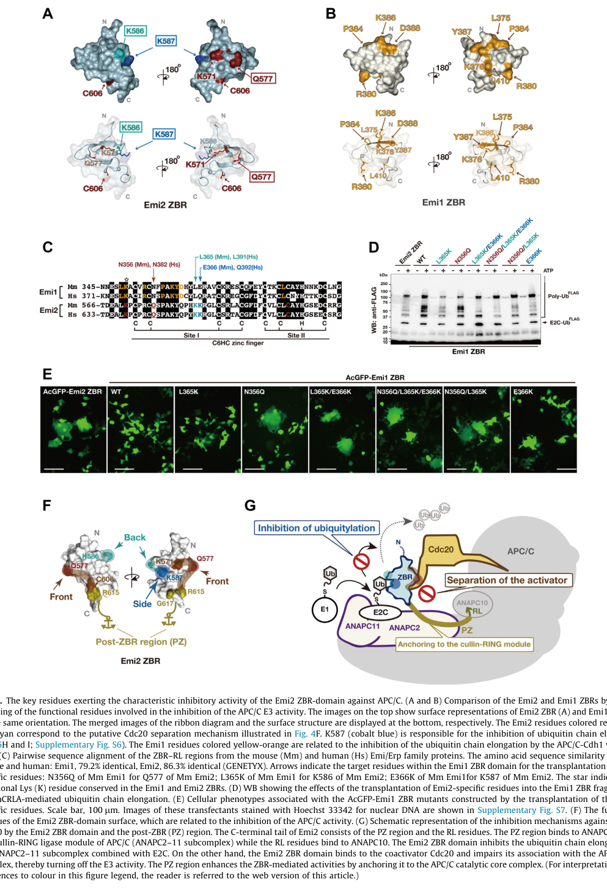

## Question

# Gene Research for Functional Annotation

## ⚠️ CRITICAL: Gene/Protein Identification Context

**BEFORE YOU BEGIN RESEARCH:** You MUST verify you are researching the CORRECT gene/protein. Gene symbols can be ambiguous, especially for less well-characterized genes from non-model organisms.

### Target Gene/Protein Identity (from UniProt):
- **UniProt Accession:** Q4G163
- **Protein Description:** RecName: Full=F-box only protein 43; AltName: Full=Endogenous meiotic inhibitor 2;
- **Gene Information:** Name=FBXO43; Synonyms=EMI2;
- **Organism (full):** Homo sapiens (Human).
- **Protein Family:** Not specified in UniProt
- **Key Domains:** F-box_dom. (IPR001810); FBX5_43. (IPR047147); IBR_dom. (IPR002867); ZF_ZBR. (IPR044064); F-box (PF00646)

### MANDATORY VERIFICATION STEPS:

1. **Check if the gene symbol "FBXO43" matches the protein description above**
2. **Verify the organism is correct:** Homo sapiens (Human).
3. **Check if protein family/domains align with what you find in literature**
4. **If you find literature for a DIFFERENT gene with the same or similar symbol, STOP**

### If Gene Symbol is Ambiguous or You Cannot Find Relevant Literature:

**DO NOT PROCEED WITH RESEARCH ON A DIFFERENT GENE.** Instead:
- State clearly: "The gene symbol 'FBXO43' is ambiguous or literature is limited for this specific protein"
- Explain what you found (e.g., "Found extensive literature on a different gene with the same symbol in a different organism")
- Describe the protein based ONLY on the UniProt information provided above
- Suggest that the protein function can be inferred from domain/family information

### Research Target:

Please provide a comprehensive research report on the gene **FBXO43** (gene ID: FBXO43, UniProt: Q4G163) in human.

The research report should be a detailed narrative explaining the function, biological processes, and localization of the gene product. Citations should be given for all claims.

You should prioritize authoritative reviews and primary scientific literature when conducting research. You can supplement
this with annotations you find in gene/protein databases, but these can be outdated or inaccurate.

We are specifically interested in the primary function of the gene - for enzymes, what reaction is catalyzed, and what is the substrate specificity? For transporters, what is the substrate? For structural proteins or adapters, what is the broader structural role? For signaling molecules, what is the role in the pathway.

We are interested in where in or outside the cell the gene product carries out its function.

We are also interested in the signaling or biochemical pathways in which the gene functions. We are less interested in broad pleiotropic effects, except where these elucidate the precise role.

Include evidence where possible. We are interested in both experimental evidence as well as inference from structure, evolution, or bioinformatic analysis. Precise studies should be prioritized over high-throughput, where available.

## Output

Question: You are an expert researcher providing comprehensive, well-cited information.

Provide detailed information focusing on:
1. Key concepts and definitions with current understanding
2. Recent developments and latest research (prioritize 2023-2024 sources)
3. Current applications and real-world implementations
4. Expert opinions and analysis from authoritative sources
5. Relevant statistics and data from recent studies

Format as a comprehensive research report with proper citations. Include URLs and publication dates where available.
Always prioritize recent, authoritative sources and provide specific citations for all major claims.

# Gene Research for Functional Annotation

## ⚠️ CRITICAL: Gene/Protein Identification Context

**BEFORE YOU BEGIN RESEARCH:** You MUST verify you are researching the CORRECT gene/protein. Gene symbols can be ambiguous, especially for less well-characterized genes from non-model organisms.

### Target Gene/Protein Identity (from UniProt):
- **UniProt Accession:** Q4G163
- **Protein Description:** RecName: Full=F-box only protein 43; AltName: Full=Endogenous meiotic inhibitor 2;
- **Gene Information:** Name=FBXO43; Synonyms=EMI2;
- **Organism (full):** Homo sapiens (Human).
- **Protein Family:** Not specified in UniProt
- **Key Domains:** F-box_dom. (IPR001810); FBX5_43. (IPR047147); IBR_dom. (IPR002867); ZF_ZBR. (IPR044064); F-box (PF00646)

### MANDATORY VERIFICATION STEPS:

1. **Check if the gene symbol "FBXO43" matches the protein description above**
2. **Verify the organism is correct:** Homo sapiens (Human).
3. **Check if protein family/domains align with what you find in literature**
4. **If you find literature for a DIFFERENT gene with the same or similar symbol, STOP**

### If Gene Symbol is Ambiguous or You Cannot Find Relevant Literature:

**DO NOT PROCEED WITH RESEARCH ON A DIFFERENT GENE.** Instead:
- State clearly: "The gene symbol 'FBXO43' is ambiguous or literature is limited for this specific protein"
- Explain what you found (e.g., "Found extensive literature on a different gene with the same symbol in a different organism")
- Describe the protein based ONLY on the UniProt information provided above
- Suggest that the protein function can be inferred from domain/family information

### Research Target:

Please provide a comprehensive research report on the gene **FBXO43** (gene ID: FBXO43, UniProt: Q4G163) in human.

The research report should be a detailed narrative explaining the function, biological processes, and localization of the gene product. Citations should be given for all claims.

You should prioritize authoritative reviews and primary scientific literature when conducting research. You can supplement
this with annotations you find in gene/protein databases, but these can be outdated or inaccurate.

We are specifically interested in the primary function of the gene - for enzymes, what reaction is catalyzed, and what is the substrate specificity? For transporters, what is the substrate? For structural proteins or adapters, what is the broader structural role? For signaling molecules, what is the role in the pathway.

We are interested in where in or outside the cell the gene product carries out its function.

We are also interested in the signaling or biochemical pathways in which the gene functions. We are less interested in broad pleiotropic effects, except where these elucidate the precise role.

Include evidence where possible. We are interested in both experimental evidence as well as inference from structure, evolution, or bioinformatic analysis. Precise studies should be prioritized over high-throughput, where available.

## Research report: Human **FBXO43 / EMI2** (UniProt **Q4G163**) — functional annotation

### 0) Target verification (gene/protein identity)
The requested target is the human protein **FBXO43** (UniProt **Q4G163**), also widely referred to in the cell-cycle and reproductive biology literature as **EMI2** (Endogenous meiotic inhibitor 2) and **Erp1/XERP1**. Multiple sources explicitly equate **EMI2** with gene symbol **FBXO43** and place it within the **FBXO (F-box only) subclass** of F-box proteins. (vadhan2020emi2expressionas pages 1-3, shoji2014thezincbindingregion pages 1-2)

### 1) Key concepts and current understanding

#### 1.1 What FBXO43/EMI2 is (definitions)
FBXO43/EMI2 is best understood functionally as a **meiotic inhibitor of the anaphase-promoting complex/cyclosome (APC/C)**—a multi-subunit E3 ubiquitin ligase controlling anaphase onset and exit from M phase. In vertebrate oocytes, APC/C inhibition is the core biochemical requirement for maintaining **metaphase II arrest** (cytostatic factor/CSF arrest) until fertilization. (ohe2010emi2inhibitionof pages 1-2, tang2010regulationofanaphase pages 88-95)

#### 1.2 Molecular mechanism: how EMI2 inhibits APC/C
Experimental and structural studies converge on a model in which EMI2 uses **C-terminal inhibitory modules** to suppress APC/C activity.

* **Zinc-binding region (ZBR):** A C-terminal **ZBR** is central to inhibition. In vitro and cellular assays show this region contributes major inhibitory activity against APC/C rather than acting solely through substrate mimicry. (tang2010regulationofanaphase pages 95-100, shoji2014thezincbindingregion pages 13-14)
* **Dual inhibitory mechanisms of the ZBR:** Structural/biochemical work indicates the ZBR can (i) **impair association of the APC/C coactivator CDC20 with the APC/C core**, and (ii) **inhibit APC/C catalytic activity**, including UBE2C-dependent ubiquitin chain formation/elongation steps—implying EMI2 is not merely a stoichiometric blocker but directly perturbs APC/C function. (shoji2014thezincbindingregion pages 1-2, shoji2014thezincbindingregion pages 13-14)
* **C-terminal RL tail as an APC/C docking module:** EMI2 requires a short **C-terminal RL tail** for physical docking to the APC/C; this docking is required for inhibitory activity, facilitating the functional engagement of other inhibitory regions (including ZBR). (ohe2010emi2inhibitionof pages 1-2)

**Visual mechanistic evidence:** Shoji et al. provide structural representations of the ZBR and a mechanism schematic integrating ZBR and post-ZBR regions in APC/C inhibition. (shoji2014thezincbindingregion media 5e46d904)

#### 1.3 Pathway context: cytostatic factor (CSF) arrest in meiosis II
In vertebrate oocytes, metaphase II arrest is maintained by sustaining high MPF/CDK1 activity (via cyclin B stability), which requires suppressing APC/C-mediated cyclin B destruction. EMI2 is a key molecular component that enforces this state by inhibiting APC/C^CDC20. (tang2010regulationofanaphase pages 88-95, ohe2010emi2inhibitionof pages 1-2)

### 2) Regulation, timing, and localization (where/when FBXO43 acts)

#### 2.1 Regulation by phosphorylation and ubiquitin-mediated degradation
Mechanistic studies in vertebrate oocyte systems describe EMI2 as a **highly regulated switch** whose abundance and APC/C binding are controlled by phosphorylation and ubiquitin-dependent turnover:

* **Fertilization-triggered destruction:** Ca2+-activated signaling (via **CaMKII**) and **Plx1/Plk1** phosphorylation leads to **β-TrCP recognition**, ubiquitination, and degradation of EMI2, thereby releasing APC/C inhibition and allowing meiotic exit. (tang2010regulationofanaphase pages 57-65)
* **Meiosis I–II transition control:** EMI2 undergoes Cdc2/CDK1-driven multisite phosphorylation during meiosis I that promotes degradation; subsequent stabilization allows accumulation to establish/maintain APC/C inhibition in meiosis II. (tang2010regulationofanaphase pages 88-95)
* **Phosphorylation-dependent APC/C binding:** Clinical oncology-focused synthesis similarly describes Cdc2 phosphorylation of EMI2 C-terminal sites as weakening EMI2–APC/C interaction and enabling APC/C activation, while dephosphorylation can re-stabilize EMI2 association. (vadhan2020emi2expressionas pages 1-3)

#### 2.2 Subcellular localization (operational localization)
Functionally, EMI2 acts in the **oocyte cytoplasm in association with APC/C complexes**; the requirement for an RL tail docking motif implies a direct physical interaction with APC/C as a proximal regulatory mechanism. (ohe2010emi2inhibitionof pages 1-2)

### 3) Recent developments (emphasis 2023–2024)

#### 3.1 Germline biology and infertility (2024 synthesis)
A 2024 review focusing on F-box proteins in spermatogenesis highlights FBXO43 as a meiosis-related factor and compiles genetic evidence linking **biallelic FBXO43 variants** (including truncating and missense alleles) to **male infertility**, alongside mouse model evidence of meiotic defects. (Xuan et al., 2024; https://doi.org/10.1186/s13619-024-00196-9) (xuan2024theemergingand pages 2-5)

#### 3.2 Expansion beyond gametogenesis: multiciliated cell differentiation (2022 primary; still a “recent” conceptual expansion)
Although not 2023–2024, a notable recent mechanistic expansion is that **emi2/fbxo43** can act in a **post-mitotic somatic differentiation context**. In multiciliated cell progenitors (Xenopus), emi2 is upregulated after cell-cycle exit and transiently inhibits **APC/C^Cdh1**, enabling **Plk1 activation** and multiple steps required for centriole amplification and basal body formation. This supports a broader interpretation of FBXO43 as an APC/C-modulating factor outside meiosis. (Kim et al., 2022; https://doi.org/10.1126/sciadv.abm7538) (kim2022emi2enablescentriole pages 1-2)

#### 3.3 Cancer/bioinformatics associations (limited mechanistic depth in available evidence)
Available 2024 sources in this tool run provide **association-level** rather than mechanistic evidence for FBXO43 in cancer. For example, hepatocellular carcinoma (HCC) modeling studies include FBXO43 among gene sets with diagnostic/prognostic relevance, but these are primarily computational signatures. (sucularlı2025machinelearningbasedidentification pages 1-2)

### 4) Current applications and real-world implementations

#### 4.1 Reproductive genetics and assisted reproduction
Human genetic studies support the use of FBXO43 as a **candidate gene in infertility variant panels**, particularly for severe male-factor phenotypes such as teratozoospermia and possibly for embryo developmental failure contexts (via its core role in meiotic/early embryonic cell-cycle control). Evidence includes segregation of rare homozygous variants with infertility phenotypes and adverse IVF/ICSI outcomes. (ma2019anovelhomozygous pages 1-2)

#### 4.2 Oncology: candidate biomarker (IHC and transcriptomic signatures)
FBXO43/EMI2 has been proposed as a **biomarker** in cancer contexts.

* In breast cancer, an immunohistochemistry study reported that **105/192 (54.7%)** tumors had high EMI2 expression, which associated with adverse clinicopathologic features and worse survival, and reported **hazard ratio = 3.93** for high EMI2 as a risk factor. (Vadhan et al., 2020; https://doi.org/10.1002/kjm2.12208) (vadhan2020emi2expressionas pages 1-3)
* In HCC, machine-learning models identified FBXO43 among diagnostic gene sets with high AUC performance across datasets; however, these studies do not establish FBXO43 mechanism, only diagnostic separability at the expression level. (sucularlı2025machinelearningbasedidentification pages 1-2)

### 5) Expert opinions and analysis (authoritative synthesis)

* The oocyte-meiosis literature frames EMI2/FBXO43 as a **physiologically central APC/C inhibitor** in CSF arrest, with regulation tightly coupled to phosphorylation-dependent degradation pathways that permit fertilization-induced release from arrest. (tang2010regulationofanaphase pages 57-65, tang2010regulationofanaphase pages 88-95)
* Structural and biochemical studies strengthen the view that EMI2 inhibition involves **direct interference with APC/C activation/coactivator engagement and ubiquitination chemistry**, not solely competition for substrate binding. (shoji2014thezincbindingregion pages 1-2, shoji2014thezincbindingregion pages 13-14)
* The 2024 spermatogenesis review characterizes FBXO43 as among the emerging F-box proteins with infertility relevance, while emphasizing that many germline F-box mechanisms remain incompletely defined and require further mechanistic work. (xuan2024theemergingand pages 2-5)

### 6) Recent statistics and data highlights

#### 6.1 Human infertility genetics (primary clinical statistics)
In a consanguineous family study:

* A homozygous FBXO43 variant **p.G664D** segregated with male infertility/teratozoospermia.
* The homozygous variant was reported absent from **1000 Genomes** and **ExAC**.
* In **124** sporadic teratozoospermia cases, **4** additional heterozygous FBXO43 variants were found, while **0** were found in **200** fertile controls.
* IVF/ICSI outcomes in two affected brothers showed poor embryo quality and no live birth, with one pregnancy ending in miscarriage at gestational week 9. (Ma et al., 2019; https://doi.org/10.1016/j.fertnstert.2019.01.007) (ma2019anovelhomozygous pages 1-2)

#### 6.2 Breast cancer association (IHC cohort statistics)
* **192** breast cancer patients: **105 (54.7%)** high EMI2 expression.
* High EMI2 associated with grade (P=0.006), tumor size (P<0.001), and lymph-node metastasis (P=0.008), and high EMI2 was reported as a risk factor with **hazard ratio 3.93**. (Vadhan et al., 2020; https://doi.org/10.1002/kjm2.12208; April 2020) (vadhan2020emi2expressionas pages 1-3)

#### 6.3 HCC diagnostic modeling (dataset sizes and AUC)
An HCC machine-learning study (2025) reported:

* TCGA LIHC: tumors **n=371**, normals **n=50**, with an SVM-RFE AUC of **1.0**.
* External datasets: GSE77509 AUC **0.95** (tumor n=20/normal n=20) and GSE144269 AUC **0.879** (tumor n=70/normal n=70).
* FBXO43 was among nine genes with robust individual diagnostic performance (AUCs > 0.81). (Sucularlı, 2025; https://doi.org/10.1371/journal.pone.0331118) (sucularlı2025machinelearningbasedidentification pages 1-2)

### 7) Consolidated evidence summary table

| Aspect | Key findings | Evidence type (review/primary; organism) | Representative source(s) with year and URL | Citation ID(s) |
|---|---|---|---|---|
| Identity/domains | Human FBXO43 is the same protein as EMI2/Erp1/XERP1; it is an FBXO-class F-box protein and contains a C-terminal zinc-binding region (ZBR/IBR-like region) central to APC/C inhibition. Structural work maps distinct inhibitory surfaces within the ZBR and a post-ZBR segment that contacts APC/C. | Primary biochemical/structural; vertebrate/human protein context | Shoji et al., 2014, FEBS Open Bio, https://doi.org/10.1016/j.fob.2014.06.010; Vadhan et al., 2020, Kaohsiung J Med Sci, https://doi.org/10.1002/kjm2.12208 | (shoji2014thezincbindingregion pages 1-2, shoji2014thezincbindingregion pages 13-14, vadhan2020emi2expressionas pages 1-3) |
| Mechanism | FBXO43/EMI2 is the key APC/C inhibitor underlying cytostatic factor arrest in mature oocytes. The ZBR impairs Cdc20 association with the APC/C core and inhibits APC/C-mediated ubiquitylation, including UBE2C/Ube2S-dependent steps; Emi2 can act catalytically/substoichiometrically rather than as a simple pseudosubstrate. | Primary mechanistic biochemistry; Xenopus/vertebrate oocyte systems | Shoji et al., 2014, https://doi.org/10.1016/j.fob.2014.06.010; Sako et al., 2014, https://doi.org/10.1038/ncomms4667; Tang, 2010 review of primary literature | (shoji2014thezincbindingregion pages 1-2, shoji2014thezincbindingregion pages 13-14, tang2010regulationofanaphase pages 105-113, tang2010regulationofanaphase pages 95-100, tang2010regulationofanaphase pages 88-95) |
| Regulation | Emi2 activity/stability is controlled by multisite phosphorylation. Cdc2/Cdk1 phosphorylation destabilizes Emi2 around MI; CaMKII and Plx1 phosphorylation at fertilization promotes β-TrCP recognition, ubiquitination, and degradation, relieving APC/C inhibition for meiotic exit. PP2A antagonizes destabilizing phosphorylation and helps restabilize APC/C binding. | Primary + synthesis/review; Xenopus/vertebrate oocyte systems | Ohe et al., 2010, Mol Biol Cell, https://doi.org/10.1091/mbc.e09-11-0974; Tang, 2010; Vadhan et al., 2020, https://doi.org/10.1002/kjm2.12208 | (ohe2010emi2inhibitionof pages 1-2, tang2010regulationofanaphase pages 57-65, tang2010regulationofanaphase pages 88-95, vadhan2020emi2expressionas pages 1-3) |
| Localization | Function is executed in the oocyte cytoplasm on/with the APC/C during meiotic metaphase II; docking requires a short C-terminal RL tail that mediates Emi2 association with APC/C, enabling D-box and ZBR inhibitory actions. | Primary cell-cycle biochemistry; vertebrate oocyte systems | Ohe et al., 2010, https://doi.org/10.1091/mbc.e09-11-0974 | (ohe2010emi2inhibitionof pages 1-2) |
| Biological processes | Canonical role is maintenance of metaphase II arrest and prevention of premature cyclin B destruction in oocytes, thereby preserving MPF/Cdk1 activity until fertilization-triggered Ca2+ signaling. Additional meiosis-related roles are reported in spermatogenesis, where loss causes meiotic failure and male infertility in mice. | Review + primary genetics; vertebrates/mouse | Madgwick & Jones, 2007, https://doi.org/10.1186/1747-1028-2-4; Gopinathan et al., 2017, https://doi.org/10.1016/j.celrep.2017.06.033; Xuan et al., 2024, https://doi.org/10.1186/s13619-024-00196-9 | (xuan2024theemergingand pages 2-5, ma2019anovelhomozygous pages 1-2) |
| Human genetics | In a consanguineous Chinese family, a homozygous FBXO43 missense variant p.G664D segregated with male infertility/teratozoospermia; the variant was absent from 1000 Genomes and ExAC. Among 124 sporadic teratozoospermia cases, 4 additional heterozygous FBXO43 variants were found, versus none in 200 fertile controls; IVF/ICSI outcomes in affected brothers showed poor embryo quality and no live birth. A 2024 review also cites homozygous p.Q583X and p.G664D variants associated with male infertility. | Primary human genetics + review; human | Ma et al., 2019, Fertil Steril, https://doi.org/10.1016/j.fertnstert.2019.01.007; Xuan et al., 2024, https://doi.org/10.1186/s13619-024-00196-9 | (ma2019anovelhomozygous pages 1-2, xuan2024theemergingand pages 2-5) |
| Cancer associations | FBXO43/EMI2 is emerging as a cancer-associated marker, but evidence is less mature than for reproductive biology. In breast cancer IHC, 105/192 tumors (54.7%) had high EMI2; high expression associated with higher grade, larger tumor size, lymph-node metastasis, and worse survival, with reported HR 3.93. Recent HCC transcriptomic models also include FBXO43 as part of poor-risk/diagnostic signatures, though these are primarily bioinformatic rather than mechanistic. | Primary clinical association + bioinformatics; human | Vadhan et al., 2020, https://doi.org/10.1002/kjm2.12208; Gao et al., 2024, https://doi.org/10.31083/j.fbl2905202; Sucularlı, 2025, https://doi.org/10.1371/journal.pone.0331118 | (vadhan2020emi2expressionas pages 1-3, sucularlı2025machinelearningbasedidentification pages 1-2) |
| Other roles | Beyond meiosis, emi2/fbxo43 is up-regulated in multiciliated cell progenitors and transiently inhibits APC/C^Cdh1 after cell-cycle exit, enabling Plk1 activation and centriole amplification/basal-body formation during ciliogenesis. This supports a broader APC/C-modulatory role outside gametogenesis. | Primary developmental cell biology; Xenopus | Kim et al., 2022, Science Advances, https://doi.org/10.1126/sciadv.abm7538 | (kim2022emi2enablescentriole pages 1-2) |
| Structural/mechanistic visual evidence | Figure-level evidence shows the Emi2 ZBR structure, sequence conservation, and a model in which the ZBR/post-ZBR region both disrupts APC/C-Cdc20 association and inhibits the APC/C catalytic module. Useful for mapping UniProt domain annotations to experimentally defined inhibitory functions. | Image/structure from primary paper; vertebrate protein | Shoji et al., 2014, Figure 7, https://doi.org/10.1016/j.fob.2014.06.010 | (shoji2014thezincbindingregion media 5e46d904) |

*Table: This table condenses the main experimentally supported functions, mechanisms, regulation, localization, and disease links for human FBXO43/EMI2. It is useful as a source-mapped annotation summary that distinguishes well-established meiotic APC/C inhibition from newer infertility and cancer associations.*

### 8) Limitations of the current evidence set (important)
* The strongest mechanistic evidence available here comes from **vertebrate oocyte systems** (frequently Xenopus and mouse), which are widely considered relevant for human biology but are not always direct human-cell experiments. (tang2010regulationofanaphase pages 57-65, tang2010regulationofanaphase pages 88-95)
* Within this tool run, **2023–2024 primary mechanistic human-cell studies** on FBXO43 in cancer (e.g., defined substrates, ubiquitination targets, structural biology of full-length protein) were not successfully retrieved as full-text evidence; thus, cancer-related statements are restricted to **association-level** evidence currently in context (IHC associations; bioinformatic signatures). (vadhan2020emi2expressionas pages 1-3, sucularlı2025machinelearningbasedidentification pages 1-2)

### Key figure cited
Shoji et al. 2014 Figure 7 provides a structure-and-mechanism summary of how the EMI2 ZBR and post-ZBR segment inhibit APC/C function, supporting domain-to-function mapping for UniProt Q4G163 annotations. (shoji2014thezincbindingregion media 5e46d904)

References

1. (vadhan2020emi2expressionas pages 1-3): Anupama Vadhan, Yen‐Yun Wang, Shyng‐Shiou F. Yuan, Yi‐Chen Lee, Stephen Chu‐Sung Hu, Jyun‐Yuan Huang, Takashi Ishikawa, and Ming‐Feng Hou. Emi2 expression as a poor prognostic factor in patients with breast cancer. The Kaohsiung Journal of Medical Sciences, 36:640-648, Apr 2020. URL: https://doi.org/10.1002/kjm2.12208, doi:10.1002/kjm2.12208. This article has 17 citations.

2. (shoji2014thezincbindingregion pages 1-2): Shisako Shoji, Yutaka Muto, Mariko Ikeda, Fahu He, Kengo Tsuda, Noboru Ohsawa, Ryogo Akasaka, Takaho Terada, Motoaki Wakiyama, Mikako Shirouzu, and Shigeyuki Yokoyama. The zinc-binding region (zbr) fragment of emi2 can inhibit apc/c by targeting its association with the coactivator cdc20 and ube2c-mediated ubiquitylation. FEBS Open Bio, 4:689-703, Jul 2014. URL: https://doi.org/10.1016/j.fob.2014.06.010, doi:10.1016/j.fob.2014.06.010. This article has 28 citations and is from a peer-reviewed journal.

3. (ohe2010emi2inhibitionof pages 1-2): Munemichi Ohe, Yoshiko Kawamura, Hiroyuki Ueno, Daigo Inoue, Yoshinori Kanemori, Chiharu Senoo, Michitaka Isoda, Nobushige Nakajo, and Noriyuki Sagata. Emi2 inhibition of the anaphase-promoting complex/cyclosome absolutely requires emi2 binding via the c-terminal rl tail. Mar 2010. URL: https://doi.org/10.1091/mbc.e09-11-0974, doi:10.1091/mbc.e09-11-0974. This article has 46 citations and is from a domain leading peer-reviewed journal.

4. (tang2010regulationofanaphase pages 88-95): W Tang. Regulation of anaphase promoting complex/cyclosome to control m phase exit. Unknown journal, 2010.

5. (tang2010regulationofanaphase pages 95-100): W Tang. Regulation of anaphase promoting complex/cyclosome to control m phase exit. Unknown journal, 2010.

6. (shoji2014thezincbindingregion pages 13-14): Shisako Shoji, Yutaka Muto, Mariko Ikeda, Fahu He, Kengo Tsuda, Noboru Ohsawa, Ryogo Akasaka, Takaho Terada, Motoaki Wakiyama, Mikako Shirouzu, and Shigeyuki Yokoyama. The zinc-binding region (zbr) fragment of emi2 can inhibit apc/c by targeting its association with the coactivator cdc20 and ube2c-mediated ubiquitylation. FEBS Open Bio, 4:689-703, Jul 2014. URL: https://doi.org/10.1016/j.fob.2014.06.010, doi:10.1016/j.fob.2014.06.010. This article has 28 citations and is from a peer-reviewed journal.

7. (shoji2014thezincbindingregion media 5e46d904): Shisako Shoji, Yutaka Muto, Mariko Ikeda, Fahu He, Kengo Tsuda, Noboru Ohsawa, Ryogo Akasaka, Takaho Terada, Motoaki Wakiyama, Mikako Shirouzu, and Shigeyuki Yokoyama. The zinc-binding region (zbr) fragment of emi2 can inhibit apc/c by targeting its association with the coactivator cdc20 and ube2c-mediated ubiquitylation. FEBS Open Bio, 4:689-703, Jul 2014. URL: https://doi.org/10.1016/j.fob.2014.06.010, doi:10.1016/j.fob.2014.06.010. This article has 28 citations and is from a peer-reviewed journal.

8. (tang2010regulationofanaphase pages 57-65): W Tang. Regulation of anaphase promoting complex/cyclosome to control m phase exit. Unknown journal, 2010.

9. (xuan2024theemergingand pages 2-5): Zhuang Xuan, Jun Ruan, Canquan Zhou, and Zhi-ming Li. The emerging and diverse roles of f-box proteins in spermatogenesis and male infertility. Cell Regeneration, Jun 2024. URL: https://doi.org/10.1186/s13619-024-00196-9, doi:10.1186/s13619-024-00196-9. This article has 5 citations.

10. (kim2022emi2enablescentriole pages 1-2): Seongjae Kim, Yuan-Hung Chien, Amy Ryan, and Chris Kintner. Emi2 enables centriole amplification during multiciliated cell differentiation. Science Advances, Apr 2022. URL: https://doi.org/10.1126/sciadv.abm7538, doi:10.1126/sciadv.abm7538. This article has 18 citations and is from a highest quality peer-reviewed journal.

11. (sucularlı2025machinelearningbasedidentification pages 1-2): Ceren Sucularlı. Machine learning-based identification of diagnostic and prognostic mitotic cell cycle genes in hepatocellular carcinoma. PLOS One, 20(8):e0331118, Aug 2025. URL: https://doi.org/10.1371/journal.pone.0331118, doi:10.1371/journal.pone.0331118. This article has 1 citations and is from a peer-reviewed journal.

12. (ma2019anovelhomozygous pages 1-2): Ying Ma, Ning Xie, Dingxiong Xie, Litao Sun, Shuyan Li, Peiqiang Li, Yi Li, Jin Li, Zhilong Dong, and Xiaodong Xie. A novel homozygous fbxo43 mutation associated with male infertility and teratozoospermia in a consanguineous chinese family. Fertility and sterility, 111 5:909-917.e1, May 2019. URL: https://doi.org/10.1016/j.fertnstert.2019.01.007, doi:10.1016/j.fertnstert.2019.01.007. This article has 37 citations and is from a highest quality peer-reviewed journal.

13. (tang2010regulationofanaphase pages 105-113): W Tang. Regulation of anaphase promoting complex/cyclosome to control m phase exit. Unknown journal, 2010.

## Artifacts

- [Edison artifact artifact-00](FBXO43-deep-research-falcon_artifacts/artifact-00.md)

## Citations

1. tang2010regulationofanaphase pages 57-65
2. tang2010regulationofanaphase pages 88-95
3. xuan2024theemergingand pages 2-5
4. sucularlı2025machinelearningbasedidentification pages 1-2
5. ma2019anovelhomozygous pages 1-2
6. shoji2014thezincbindingregion pages 1-2
7. tang2010regulationofanaphase pages 95-100
8. shoji2014thezincbindingregion pages 13-14
9. tang2010regulationofanaphase pages 105-113
10. https://doi.org/10.1186/s13619-024-00196-9
11. https://doi.org/10.1126/sciadv.abm7538
12. https://doi.org/10.1002/kjm2.12208
13. https://doi.org/10.1016/j.fertnstert.2019.01.007
14. https://doi.org/10.1002/kjm2.12208;
15. https://doi.org/10.1371/journal.pone.0331118
16. https://doi.org/10.1016/j.fob.2014.06.010;
17. https://doi.org/10.1038/ncomms4667;
18. https://doi.org/10.1091/mbc.e09-11-0974;
19. https://doi.org/10.1091/mbc.e09-11-0974
20. https://doi.org/10.1186/1747-1028-2-4;
21. https://doi.org/10.1016/j.celrep.2017.06.033;
22. https://doi.org/10.1016/j.fertnstert.2019.01.007;
23. https://doi.org/10.31083/j.fbl2905202;
24. https://doi.org/10.1016/j.fob.2014.06.010
25. https://doi.org/10.1002/kjm2.12208,
26. https://doi.org/10.1016/j.fob.2014.06.010,
27. https://doi.org/10.1091/mbc.e09-11-0974,
28. https://doi.org/10.1186/s13619-024-00196-9,
29. https://doi.org/10.1126/sciadv.abm7538,
30. https://doi.org/10.1371/journal.pone.0331118,
31. https://doi.org/10.1016/j.fertnstert.2019.01.007,