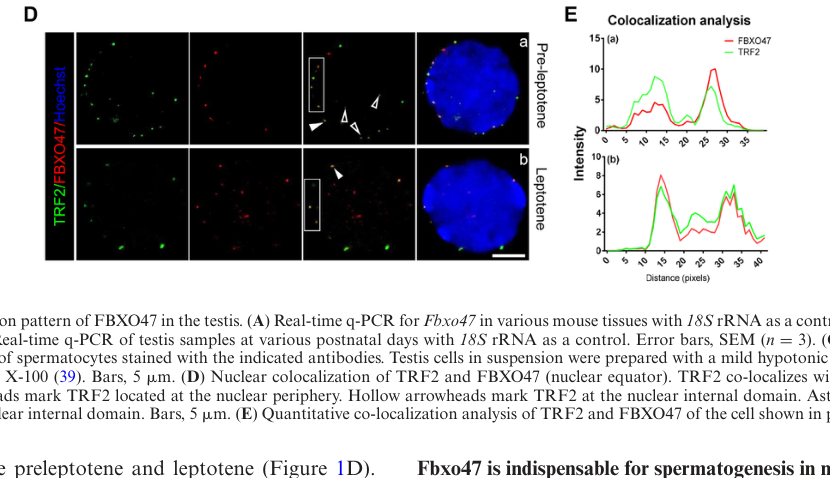

## Question

# Gene Research for Functional Annotation

## ⚠️ CRITICAL: Gene/Protein Identification Context

**BEFORE YOU BEGIN RESEARCH:** You MUST verify you are researching the CORRECT gene/protein. Gene symbols can be ambiguous, especially for less well-characterized genes from non-model organisms.

### Target Gene/Protein Identity (from UniProt):
- **UniProt Accession:** Q5MNV8
- **Protein Description:** RecName: Full=F-box only protein 47;
- **Gene Information:** Name=FBXO47 {ECO:0000303|PubMed:28397838, ECO:0000312|HGNC:HGNC:31969};
- **Organism (full):** Homo sapiens (Human).
- **Protein Family:** Not specified in UniProt
- **Key Domains:** ARM_FBXO47. (IPR056622); F-box-like_dom_sf. (IPR036047); F-box_dom. (IPR001810); FBXO47. (IPR038946); ARM_FBXO47 (PF24467)

### MANDATORY VERIFICATION STEPS:

1. **Check if the gene symbol "FBXO47" matches the protein description above**
2. **Verify the organism is correct:** Homo sapiens (Human).
3. **Check if protein family/domains align with what you find in literature**
4. **If you find literature for a DIFFERENT gene with the same or similar symbol, STOP**

### If Gene Symbol is Ambiguous or You Cannot Find Relevant Literature:

**DO NOT PROCEED WITH RESEARCH ON A DIFFERENT GENE.** Instead:
- State clearly: "The gene symbol 'FBXO47' is ambiguous or literature is limited for this specific protein"
- Explain what you found (e.g., "Found extensive literature on a different gene with the same symbol in a different organism")
- Describe the protein based ONLY on the UniProt information provided above
- Suggest that the protein function can be inferred from domain/family information

### Research Target:

Please provide a comprehensive research report on the gene **FBXO47** (gene ID: FBXO47, UniProt: Q5MNV8) in human.

The research report should be a detailed narrative explaining the function, biological processes, and localization of the gene product. Citations should be given for all claims.

You should prioritize authoritative reviews and primary scientific literature when conducting research. You can supplement
this with annotations you find in gene/protein databases, but these can be outdated or inaccurate.

We are specifically interested in the primary function of the gene - for enzymes, what reaction is catalyzed, and what is the substrate specificity? For transporters, what is the substrate? For structural proteins or adapters, what is the broader structural role? For signaling molecules, what is the role in the pathway.

We are interested in where in or outside the cell the gene product carries out its function.

We are also interested in the signaling or biochemical pathways in which the gene functions. We are less interested in broad pleiotropic effects, except where these elucidate the precise role.

Include evidence where possible. We are interested in both experimental evidence as well as inference from structure, evolution, or bioinformatic analysis. Precise studies should be prioritized over high-throughput, where available.

## Output

Question: You are an expert researcher providing comprehensive, well-cited information.

Provide detailed information focusing on:
1. Key concepts and definitions with current understanding
2. Recent developments and latest research (prioritize 2023-2024 sources)
3. Current applications and real-world implementations
4. Expert opinions and analysis from authoritative sources
5. Relevant statistics and data from recent studies

Format as a comprehensive research report with proper citations. Include URLs and publication dates where available.
Always prioritize recent, authoritative sources and provide specific citations for all major claims.

# Gene Research for Functional Annotation

## ⚠️ CRITICAL: Gene/Protein Identification Context

**BEFORE YOU BEGIN RESEARCH:** You MUST verify you are researching the CORRECT gene/protein. Gene symbols can be ambiguous, especially for less well-characterized genes from non-model organisms.

### Target Gene/Protein Identity (from UniProt):
- **UniProt Accession:** Q5MNV8
- **Protein Description:** RecName: Full=F-box only protein 47;
- **Gene Information:** Name=FBXO47 {ECO:0000303|PubMed:28397838, ECO:0000312|HGNC:HGNC:31969};
- **Organism (full):** Homo sapiens (Human).
- **Protein Family:** Not specified in UniProt
- **Key Domains:** ARM_FBXO47. (IPR056622); F-box-like_dom_sf. (IPR036047); F-box_dom. (IPR001810); FBXO47. (IPR038946); ARM_FBXO47 (PF24467)

### MANDATORY VERIFICATION STEPS:

1. **Check if the gene symbol "FBXO47" matches the protein description above**
2. **Verify the organism is correct:** Homo sapiens (Human).
3. **Check if protein family/domains align with what you find in literature**
4. **If you find literature for a DIFFERENT gene with the same or similar symbol, STOP**

### If Gene Symbol is Ambiguous or You Cannot Find Relevant Literature:

**DO NOT PROCEED WITH RESEARCH ON A DIFFERENT GENE.** Instead:
- State clearly: "The gene symbol 'FBXO47' is ambiguous or literature is limited for this specific protein"
- Explain what you found (e.g., "Found extensive literature on a different gene with the same symbol in a different organism")
- Describe the protein based ONLY on the UniProt information provided above
- Suggest that the protein function can be inferred from domain/family information

### Research Target:

Please provide a comprehensive research report on the gene **FBXO47** (gene ID: FBXO47, UniProt: Q5MNV8) in human.

The research report should be a detailed narrative explaining the function, biological processes, and localization of the gene product. Citations should be given for all claims.

You should prioritize authoritative reviews and primary scientific literature when conducting research. You can supplement
this with annotations you find in gene/protein databases, but these can be outdated or inaccurate.

We are specifically interested in the primary function of the gene - for enzymes, what reaction is catalyzed, and what is the substrate specificity? For transporters, what is the substrate? For structural proteins or adapters, what is the broader structural role? For signaling molecules, what is the role in the pathway.

We are interested in where in or outside the cell the gene product carries out its function.

We are also interested in the signaling or biochemical pathways in which the gene functions. We are less interested in broad pleiotropic effects, except where these elucidate the precise role.

Include evidence where possible. We are interested in both experimental evidence as well as inference from structure, evolution, or bioinformatic analysis. Precise studies should be prioritized over high-throughput, where available.

## Research report: Human **FBXO47** (UniProt **Q5MNV8**) — functional annotation

### 0) Target verification (critical identity checks)
The target gene/protein in this report is **human FBXO47** (F‑box only protein 47), matching UniProt accession **Q5MNV8** and the expected functional class of an **F‑box protein**, i.e., a substrate-recognition factor that typically binds **SKP1** within a **SCF (SKP1–CUL1–F‑box)** E3 ubiquitin ligase. Evidence discussed below consistently treats FBXO47 as an F‑box protein that physically interacts with **SKP1** and regulates key meiotic proteins (TRF2; HORMAD1), aligning with the UniProt-provided identity and domain expectations (F-box-like domain). (hua2019fbxo47regulatestelomereinner pages 10-11, ma2024fbxo47regulatescentromere pages 8-9)

### 1) Key concepts and definitions (current understanding)

#### 1.1 F‑box proteins and SCF E3 ubiquitin ligases
F‑box proteins are generally understood as **substrate adaptors** of SCF-type E3 ubiquitin ligase complexes, enabling selective ubiquitination that can lead to proteasomal degradation or other ubiquitin-dependent regulation of target proteins. In the FBXO47 context, primary studies explicitly show **FBXO47–SKP1 interaction**, consistent with SCF membership, and functional ubiquitination-related assays affecting meiotic proteins (TRF2; HORMAD1; SKP1) (hua2019fbxo47regulatestelomereinner pages 10-11, ma2024fbxo47regulatescentromere pages 8-9).

#### 1.2 Meiotic telomere–nuclear envelope attachment (“bouquet”) and shelterin factors
During meiotic prophase I, **telomeres tether to the inner nuclear membrane (INM)** and cluster (bouquet stage), helping homolog pairing and recombination. A central telomere complex is **shelterin**, including TRF1/TRF2. In a key mechanistic study, FBXO47 is positioned as a regulator of telomere–INM integration by influencing shelterin component stability—particularly **TRF2** (hua2019fbxo47regulatestelomereinner pages 8-10, hua2019fbxo47regulatestelomereinner pages 10-11).

#### 1.3 Centromere pairing and synapsis integrity
Beyond telomeres, meiotic chromosome behavior depends on **centromere pairing** and synaptonemal complex organization. A 2024 study proposes FBXO47 functions in a **centromeric SCF** module that maintains centromeric SCF components (notably SKP1) to promote centromere pairing and pachytene progression (ma2024fbxo47regulatescentromere pages 1-2, ma2024fbxo47regulatescentromere pages 8-9).

### 2) Molecular function of FBXO47: mechanisms, partners, substrates

#### 2.1 FBXO47 interacts with SCF core component SKP1
Evidence from co-immunoprecipitation indicates FBXO47 **interacts with SKP1**, supporting a model in which FBXO47 can act as an F-box/SCF-associated factor (hua2019fbxo47regulatestelomereinner pages 10-11). A more recent mechanistic proposal highlights FBXO47–SKP1 binding and argues FBXO47 helps preserve SKP1 by modulating its ubiquitination (ma2024fbxo47regulatescentromere pages 8-9).

#### 2.2 Regulation of telomere proteins TRF1/TRF2; stabilization of TRF2
A central mechanistic claim is that FBXO47 interacts with TRF1 and TRF2 and preferentially **stabilizes TRF2**:
* Co-IP experiments support FBXO47 interaction with **TRF1/TRF2** (hua2019fbxo47regulatestelomereinner pages 11-11).
* Ubiquitination assays indicate FBXO47 overexpression can **impair TRF2 ubiquitination** (without similarly affecting TRF1), consistent with **TRF2 stabilization** (hua2019fbxo47regulatestelomereinner pages 11-11).
* Quantitative immunofluorescence intensity measurements reported TRF1 signal intensity was not reduced in knockouts (8.769 ± 0.351 vs 9.786 ± 0.6768), while **TRF2 intensity decreased** in Fbxo47−/− spermatocytes across stages (e.g., zygotene 38.046 ± 7.281 vs 18.953 ± 13.110) (hua2019fbxo47regulatestelomereinner pages 10-11).

Interpretation: in the meiotic context, FBXO47 may function less like a “classic” SCF adaptor that triggers target degradation, and more like a regulator that **prevents inappropriate ubiquitination/turnover** of TRF2 during meiotic telomere–INM integration (hua2019fbxo47regulatestelomereinner pages 11-11, hua2019fbxo47regulatestelomereinner pages 10-11).

#### 2.3 Connection to HORMAD1 and meiotic DSB homeostasis
A 2022 Nucleic Acids Research study (focused on SCF core factor SKP1 in meiosis) reports a mechanistic link wherein **FBXO47 interacts with SKP1 and HORMAD1 and targets HORMAD1 for polyubiquitination and degradation in HEK293T cells**, supporting a model where SCF helps restrain hyperactive DSB formation by modulating HORMAD1 abundance and upstream DSB machinery recruitment (hua2019fbxo47regulatestelomereinner pages 4-4). In 2024, a centromere-focused study further interprets that FBXO47 “probably regulates HORMAD1” (building on prior work) to ensure proper HORMAD1 unloading from synapsed regions (ma2024fbxo47regulatescentromere pages 8-9).

#### 2.4 Proposed centromeric SCF mechanism via SKP1 stabilization (2024)
Ma et al. (Communications Biology, published online 2024-09; https://doi.org/10.1038/s42003-024-06782-6) propose FBXO47 is a component of a **centromeric SCF E3 ligase** and that FBXO47 can **reduce SKP1 ubiquitination**, helping preserve SKP1 levels at centromeres/chromosome axes. They report a quantitative metric: average **SKP1 centromeric-end/counterpart signal ratio = 3.62**, and multiple significant comparisons in figures (p = 0.0003, p = 0.0016, p < 0.0001) (ma2024fbxo47regulatescentromere pages 8-9).

### 3) Biological processes and pathways

#### 3.1 Meiotic prophase I progression, homolog synapsis, and telomere–INM integration
A mechanistic study (Nucleic Acids Research, 2019-11; https://doi.org/10.1093/nar/gkz992) positions FBXO47 as required for proper telomere–INM integration: FBXO47 localizes to the nuclear periphery in early prophase and co-localizes with TRF2, and loss of Fbxo47 leads to increased detached/internal telomeres measured as internal TRF1 foci (n > 30 cells/genotype; ***P < 0.001) (hua2019fbxo47regulatestelomereinner pages 8-10, hua2019fbxo47regulatestelomereinner media f09c33b9, hua2019fbxo47regulatestelomereinner media c8432221). 

These findings support a pathway-level role: **FBXO47 → TRF2 stabilization → telomere attachment/bouquet progression → synapsis and recombination fidelity** (hua2019fbxo47regulatestelomereinner pages 8-10, hua2019fbxo47regulatestelomereinner pages 10-11).

#### 3.2 Meiotic DSB regulation via SCF components and axis proteins
The SCF ubiquitin ligase system is implicated in restraining excessive DSB formation and coordinating recombination; a key mechanistic component is HORMAD1 accumulation and its influence on the pre-DSB complex. Evidence supports FBXO47 as one meiotic F-box protein that can link SCF to **HORMAD1 ubiquitin-dependent turnover** (in cell assays), providing a plausible pathway connection: **FBXO47–SCF → HORMAD1 regulation → DSB homeostasis and synapsis initiation** (hua2019fbxo47regulatestelomereinner pages 4-4).

#### 3.3 Centromere pairing and pachytene progression (2024 model)
Ma et al. (2024-09) propose that a centromeric SCF including FBXO47 promotes **centromere pairing** and synapsis integrity; knockout phenotypes described include leptotene/zygotene delay, pachytene-like arrest, crossover failure, and altered HORMAD1 behavior at centromeric ends (ma2024fbxo47regulatescentromere pages 8-9, ma2024fbxo47regulatescentromere pages 1-2).

### 4) Subcellular localization and where the gene product acts

#### 4.1 Nuclear periphery / telomere–INM interface
FBXO47 was reported to form foci on the nuclear surface during early meiotic prophase I and co-localize with TRF2 at the nuclear periphery, consistent with a role at telomeres as they attach to the INM (hua2019fbxo47regulatestelomereinner pages 5-6, hua2019fbxo47regulatestelomereinner media f09c33b9).

#### 4.2 Centromeres / chromosome axes (alternative or additional localization)
A 2024 Communications Biology paper emphasizes **centromeric localization** of FBXO47 and interprets FBXO47 as part of a centromeric SCF module that affects centromere pairing and synapsis integrity (ma2024fbxo47regulatescentromere pages 1-2, ma2024fbxo47regulatescentromere pages 8-9).

#### 4.3 Current uncertainty: telomere-centric vs centromere-centric models
The 2024 centromere-focused paper explicitly notes **conflicting prior reports** emphasizing telomere roles and suggests technical factors (e.g., antibody quality; KO methods) may contribute to discrepancies (ma2024fbxo47regulatescentromere pages 1-2). A 2024 review focused on spermatogenesis largely frames FBXO47 as telomere/NE-associated (xuan2024theemergingand pages 5-7, xuan2024theemergingand pages 7-8). Overall, the most defensible current view is that FBXO47 is a **meiotic nuclear protein** that may function at **multiple chromosome subcompartments** (telomere/NE interface and/or centromeres) through SCF-related regulation (ma2024fbxo47regulatescentromere pages 8-9, xuan2024theemergingand pages 7-8).

### 5) Recent developments and latest research (prioritizing 2023–2024)

#### 5.1 2024: FBXO47 as a centromeric SCF component regulating SKP1 ubiquitination
The major 2024 primary advance is the proposal and supporting evidence that FBXO47 participates in a **centromeric SCF E3 ligase** in spermatocytes, binds SKP1, and reduces SKP1 ubiquitination, maintaining centromeric SKP1 abundance and centromere pairing (Communications Biology; 2024-09; https://doi.org/10.1038/s42003-024-06782-6) (ma2024fbxo47regulatescentromere pages 8-9, ma2024fbxo47regulatescentromere pages 1-2).

#### 5.2 2024: Expert synthesis (review) emphasizing telomere–NE and meiotic arrest phenotypes
A 2024 review in Cell Regeneration (published 2024-06; https://doi.org/10.1186/s13619-024-00196-9) summarizes FBXO47 as a **meiotic F-box protein** involved in telomere–NE integration; the review interprets knockout phenotypes (late-zygotene arrest, incomplete synapsis, impaired DSB repair signals such as autosomal γH2AX retention, lack of XY bodies) as evidence FBXO47 is necessary for telomere-mediated meiotic progression and male fertility (xuan2024theemergingand pages 7-8).

### 6) Human disease relevance, applications, and real-world implementations

#### 6.1 Evidence for association with male infertility/azoospermia
Open Targets reports an association between human **FBXO47 (ENSG00000204952)** and **azoospermia** (evidence score ~0.105; 5 evidence items) (OpenTargets Search: -FBXO47). While the strongest mechanistic evidence is from mouse genetics and cell assays, the disease association is biologically plausible given the meiosis-specific roles described in mammalian spermatocytes (hua2019fbxo47regulatestelomereinner pages 8-10, ma2024fbxo47regulatescentromere pages 8-9).

#### 6.2 Epidemiology/statistics: azoospermia burden (context for applications)
A Scientific Reports analysis of azoospermia/male infertility transcriptomic datasets notes that azoospermia affects **~1% of all men** and is prevalent in up to **10–15% of infertile males**, highlighting clinical relevance and diagnostic need (published 2022-02; https://doi.org/10.1038/s41598-022-06476-1) (omolaoye2022usingpubliclyavailable pages 8-9).

#### 6.3 Diagnostics/biomarkers: current state
A 2022 paper mining public testis transcriptomic datasets discusses the limited literature tying F-box proteins to male infertility and largely cites model-organism mechanisms (including FBXO47’s role with TRF1/2 and bouquet progression) rather than presenting FBXO47 as a validated human biomarker with effect sizes in patient cohorts (omolaoye2022usingpubliclyavailable pages 8-9). Therefore, FBXO47 is best viewed currently as a **candidate** gene for mechanistic panels and sequencing-based etiologic workups, rather than a stand-alone clinically validated biomarker in routine diagnostics (OpenTargets Search: -FBXO47, omolaoye2022usingpubliclyavailable pages 8-9).

#### 6.4 Therapeutics and contraception: present limitations
Given FBXO47’s essential role in meiosis and its highly germline-enriched functional framing, it is conceptually relevant to non-hormonal male contraception and infertility therapeutics; however, no FBXO47-targeted interventions or trials were identified in the clinical-trials search performed here, indicating **no direct clinical implementation** at present (OpenTargets Search: -FBXO47).

### 7) Evidence-backed statistics and data highlights
* Detached telomeres / internal TRF1 foci: **n > 30** cells per genotype; **P < 0.001** in Fbxo47−/− vs wild type (Hua et al. 2019; figure-based quantification) (hua2019fbxo47regulatestelomereinner pages 8-10, hua2019fbxo47regulatestelomereinner media c8432221).
* TRF1 vs TRF2 quantitative intensity (meiotic spreads): TRF1 not reduced (8.769 ± 0.351 vs 9.786 ± 0.6768), but TRF2 reduced in Fbxo47−/− spermatocytes (examples reported for leptotene and zygotene) (hua2019fbxo47regulatestelomereinner pages 10-11).
* Centromeric SKP1 signal metric (2024): SKP1 centromeric-end/counterpart signal ratio **3.62**; multiple significant comparisons (p = 0.0003, p = 0.0016, p < 0.0001) (ma2024fbxo47regulatescentromere pages 8-9).
* Clinical prevalence context: azoospermia affects **~1%** of all men; up to **10–15%** of infertile males (Omolaoye et al. 2022) (omolaoye2022usingpubliclyavailable pages 8-9).

### 8) Visual evidence from primary literature
Key figure panels from Hua et al. (2019) show (i) FBXO47 colocalization with TRF2 at the nuclear periphery and (ii) quantification of detached/internal telomeres using internal TRF1 foci counts and bar graphs with **n > 30** and **P < 0.001** (hua2019fbxo47regulatestelomereinner media f09c33b9, hua2019fbxo47regulatestelomereinner media c8432221).

### 9) Summary and consensus functional annotation (with explicit uncertainty)
**Most supported primary function:** FBXO47 is a meiosis-associated F‑box protein that interacts with SCF machinery (via SKP1) and regulates key meiotic chromosomal proteins to ensure proper meiotic prophase progression. The strongest mechanistic evidence links FBXO47 to **telomere–INM integration** via **TRF2 stabilization** and to broader SCF-mediated control of meiotic chromosome axis factors (HORMAD1) influencing recombination/DSB homeostasis (hua2019fbxo47regulatestelomereinner pages 10-11, hua2019fbxo47regulatestelomereinner pages 4-4).

**Localization:** Evidence supports action at the **nuclear periphery/telomere–NE interface** during early meiotic prophase (hua2019fbxo47regulatestelomereinner pages 5-6, hua2019fbxo47regulatestelomereinner media f09c33b9). Newer 2024 work argues for an additional or alternative **centromeric** SCF role influencing centromere pairing and SKP1 stability (ma2024fbxo47regulatescentromere pages 8-9, ma2024fbxo47regulatescentromere pages 1-2). 

**Human relevance:** Direct human functional studies remain limited in the retrieved corpus, but aggregated disease-genetics resources associate FBXO47 with **azoospermia**, consistent with compelling meiotic phenotypes in mammalian systems (OpenTargets Search: -FBXO47, xuan2024theemergingand pages 7-8).

---

### Evidence summary table
| Evidence type | Biological context (meiosis stage/cell type) | Molecular function claim | Key partners/substrates | Subcellular localization | Experimental approach | Quantitative/statistical notes | Species (mouse/human cells) | Citation (include DOI URL + year) |
|---|---|---|---|---|---|---|---|---|
| Primary | Early meiotic prophase I spermatocytes; bouquet/telomere attachment stage | FBXO47 is an F-box/SCF-associated factor required for telomere-inner nuclear envelope integration and stabilizes TRF2 rather than promoting its degradation | SKP1; TRF1; TRF2 | Nuclear periphery; telomere-associated sites at the inner nuclear membrane | CRISPR FLAG knock-in, co-immunoprecipitation, HEK293T co-expression, ubiquitination assays, cycloheximide chase, IF on chromosome spreads, EM/FIB-SEM | n > 30 cells/genotype for internal TRF1 foci; P < 0.001; TRF1 intensity not decreased (8.769 ± 0.351 vs 9.786 ± 0.6768), while TRF2 intensity decreased in knockout spermatocytes (leptotene 23.873 ± 5.414 vs 19.660 ± 4.207; zygotene 38.046 ± 7.281 vs 18.953 ± 13.110) | Mouse testes/spermatocytes; human HEK293T cells | Hua et al., Nucleic Acids Research, 2019, https://doi.org/10.1093/nar/gkz992 (hua2019fbxo47regulatestelomereinner pages 4-4, hua2019fbxo47regulatestelomereinner pages 8-10, hua2019fbxo47regulatestelomereinner pages 11-11, hua2019fbxo47regulatestelomereinner pages 5-6, hua2019fbxo47regulatestelomereinner pages 4-5, hua2019fbxo47regulatestelomereinner pages 10-11, hua2019fbxo47regulatestelomereinner media f09c33b9) |
| Primary | Early meiotic recombination in spermatocytes | FBXO47 acts as a meiosis-specific F-box protein interacting with SKP1 and HORMAD1 and can target HORMAD1 for polyubiquitination/degradation, linking SCF activity to control of meiotic DSB homeostasis | SKP1; HORMAD1 | Meiotic chromosomal axis context inferred from HORMAD1 biology; exact FBXO47 localization not the main focus in extracted evidence | Mouse meiotic genetics plus HEK293T interaction/ubiquitination assays | No specific numeric effect sizes extracted here for FBXO47 itself; study supports mechanism that SCF restrains hyperactive DSB formation through HORMAD1 turnover | Mouse germ cells; human HEK293T cells | Guan et al., Nucleic Acids Research, 2022, https://doi.org/10.1093/nar/gkac304 (hua2019fbxo47regulatestelomereinner pages 10-11) |
| Primary | Zygotene-to-pachytene spermatocytes; centromere pairing and pachynema progression | FBXO47 is proposed as a centromeric SCF E3 ligase component that stabilizes SKP1 by suppressing its ubiquitination and thereby promotes centromere pairing, synapsis integrity, and meiotic progression | SKP1; HORMAD1 (regulatory connection proposed) | Centromeres; chromosome axes; study also notes effects on telomere-NE attachment | Co-IP in HEK293T, ubiquitination assays, chromosome spreads, IF localization across meiotic stages | Reported centromeric-end/counterpart SKP1 signal ratio 3.62; figure-level significance includes p = 0.0003, p = 0.0016, p < 0.0001; knockout causes leptotene/zygotene delay, pachytene-like arrest, crossover failure | Mouse spermatocytes; human HEK293T cells | Ma et al., Communications Biology, 2024, https://doi.org/10.1038/s42003-024-06782-6 (ma2024fbxo47regulatescentromere pages 1-2, ma2024fbxo47regulatescentromere pages 8-9) |
| Review | Spermatogenesis, especially meiotic prophase I in spermatocytes | Expert synthesis: FBXO47 is a meiotic F-box protein essential for telomere-NE integration, homologous chromosome synapsis, bouquet-stage progression, and male fertility; current literature supports a telomere-centric role, though newer work introduces centromere-focused models | TRF1; TRF2; broader SCF machinery | Nuclear surface/telomere-NE interface during meiosis | Narrative review of primary literature in mouse and comparative systems | Summarizes phenotypes such as reduced testis weight, abnormal spermatocyte-like cells, late-zygotene arrest, autosomal gamma-H2AX retention, and absence of XY bodies; no new original quantitative dataset | Review of mouse and other model-organism data | Xuan et al., Cell Regeneration, 2024, https://doi.org/10.1186/s13619-024-00196-9 (xuan2024theemergingand pages 5-7, xuan2024theemergingand pages 7-8) |
| Database | Human disease association landscape | Human FBXO47 is associated most strongly with azoospermia in Open Targets, consistent with meiosis/spermatogenesis biology; other weaker associations are present but less biologically specific | Disease association evidence linked to literature rather than direct substrate data | Not applicable | Integrated disease-target evidence aggregation | Open Targets evidence score for azoospermia association 0.1046948485 with 5 evidence items; additional lower-confidence associations include hypertension, hypothyroidism, facial pain, and partial chromosome Y deletion | Human | Open Targets Platform, FBXO47 target page, https://platform.opentargets.org/target/ENSG00000204952 (OpenTargets Search: -FBXO47) |

*Table: This table summarizes the main functional annotation evidence for human FBXO47 by integrating primary mechanistic studies, a recent review, and a disease-association database. It highlights the current consensus and controversy around FBXO47's meiotic role, binding partners, localization, and links to male infertility.*

References

1. (hua2019fbxo47regulatestelomereinner pages 10-11): Rong Hua, Huafang Wei, Chao Liu, Yue Zhang, Siyu Liu, Yueshuai Guo, Yiqiang Cui, Xin Zhang, Xuejiang Guo, Wei Li, and Mingxi Liu. Fbxo47 regulates telomere-inner nuclear envelope integration by stabilizing trf2 during meiosis. Nucleic Acids Research, 47:11755-11770, Nov 2019. URL: https://doi.org/10.1093/nar/gkz992, doi:10.1093/nar/gkz992. This article has 60 citations and is from a highest quality peer-reviewed journal.

2. (ma2024fbxo47regulatescentromere pages 8-9): Ani Ma, Yali Yang, Lianbao Cao, Lijun Chen, and Jian V. Zhang. Fbxo47 regulates centromere pairing as key component of centromeric scf e3 ligase in mouse spermatocytes. Communications Biology, Sep 2024. URL: https://doi.org/10.1038/s42003-024-06782-6, doi:10.1038/s42003-024-06782-6. This article has 7 citations and is from a peer-reviewed journal.

3. (hua2019fbxo47regulatestelomereinner pages 8-10): Rong Hua, Huafang Wei, Chao Liu, Yue Zhang, Siyu Liu, Yueshuai Guo, Yiqiang Cui, Xin Zhang, Xuejiang Guo, Wei Li, and Mingxi Liu. Fbxo47 regulates telomere-inner nuclear envelope integration by stabilizing trf2 during meiosis. Nucleic Acids Research, 47:11755-11770, Nov 2019. URL: https://doi.org/10.1093/nar/gkz992, doi:10.1093/nar/gkz992. This article has 60 citations and is from a highest quality peer-reviewed journal.

4. (ma2024fbxo47regulatescentromere pages 1-2): Ani Ma, Yali Yang, Lianbao Cao, Lijun Chen, and Jian V. Zhang. Fbxo47 regulates centromere pairing as key component of centromeric scf e3 ligase in mouse spermatocytes. Communications Biology, Sep 2024. URL: https://doi.org/10.1038/s42003-024-06782-6, doi:10.1038/s42003-024-06782-6. This article has 7 citations and is from a peer-reviewed journal.

5. (hua2019fbxo47regulatestelomereinner pages 11-11): Rong Hua, Huafang Wei, Chao Liu, Yue Zhang, Siyu Liu, Yueshuai Guo, Yiqiang Cui, Xin Zhang, Xuejiang Guo, Wei Li, and Mingxi Liu. Fbxo47 regulates telomere-inner nuclear envelope integration by stabilizing trf2 during meiosis. Nucleic Acids Research, 47:11755-11770, Nov 2019. URL: https://doi.org/10.1093/nar/gkz992, doi:10.1093/nar/gkz992. This article has 60 citations and is from a highest quality peer-reviewed journal.

6. (hua2019fbxo47regulatestelomereinner pages 4-4): Rong Hua, Huafang Wei, Chao Liu, Yue Zhang, Siyu Liu, Yueshuai Guo, Yiqiang Cui, Xin Zhang, Xuejiang Guo, Wei Li, and Mingxi Liu. Fbxo47 regulates telomere-inner nuclear envelope integration by stabilizing trf2 during meiosis. Nucleic Acids Research, 47:11755-11770, Nov 2019. URL: https://doi.org/10.1093/nar/gkz992, doi:10.1093/nar/gkz992. This article has 60 citations and is from a highest quality peer-reviewed journal.

7. (hua2019fbxo47regulatestelomereinner media f09c33b9): Rong Hua, Huafang Wei, Chao Liu, Yue Zhang, Siyu Liu, Yueshuai Guo, Yiqiang Cui, Xin Zhang, Xuejiang Guo, Wei Li, and Mingxi Liu. Fbxo47 regulates telomere-inner nuclear envelope integration by stabilizing trf2 during meiosis. Nucleic Acids Research, 47:11755-11770, Nov 2019. URL: https://doi.org/10.1093/nar/gkz992, doi:10.1093/nar/gkz992. This article has 60 citations and is from a highest quality peer-reviewed journal.

8. (hua2019fbxo47regulatestelomereinner media c8432221): Rong Hua, Huafang Wei, Chao Liu, Yue Zhang, Siyu Liu, Yueshuai Guo, Yiqiang Cui, Xin Zhang, Xuejiang Guo, Wei Li, and Mingxi Liu. Fbxo47 regulates telomere-inner nuclear envelope integration by stabilizing trf2 during meiosis. Nucleic Acids Research, 47:11755-11770, Nov 2019. URL: https://doi.org/10.1093/nar/gkz992, doi:10.1093/nar/gkz992. This article has 60 citations and is from a highest quality peer-reviewed journal.

9. (hua2019fbxo47regulatestelomereinner pages 5-6): Rong Hua, Huafang Wei, Chao Liu, Yue Zhang, Siyu Liu, Yueshuai Guo, Yiqiang Cui, Xin Zhang, Xuejiang Guo, Wei Li, and Mingxi Liu. Fbxo47 regulates telomere-inner nuclear envelope integration by stabilizing trf2 during meiosis. Nucleic Acids Research, 47:11755-11770, Nov 2019. URL: https://doi.org/10.1093/nar/gkz992, doi:10.1093/nar/gkz992. This article has 60 citations and is from a highest quality peer-reviewed journal.

10. (xuan2024theemergingand pages 5-7): Zhuang Xuan, Jun Ruan, Canquan Zhou, and Zhi-ming Li. The emerging and diverse roles of f-box proteins in spermatogenesis and male infertility. Cell Regeneration, Jun 2024. URL: https://doi.org/10.1186/s13619-024-00196-9, doi:10.1186/s13619-024-00196-9. This article has 5 citations.

11. (xuan2024theemergingand pages 7-8): Zhuang Xuan, Jun Ruan, Canquan Zhou, and Zhi-ming Li. The emerging and diverse roles of f-box proteins in spermatogenesis and male infertility. Cell Regeneration, Jun 2024. URL: https://doi.org/10.1186/s13619-024-00196-9, doi:10.1186/s13619-024-00196-9. This article has 5 citations.

12. (OpenTargets Search: -FBXO47): Open Targets Query (-FBXO47, 5 results). Buniello, A. et al. (2025). Open Targets Platform: facilitating therapeutic hypotheses building in drug discovery. Nucleic Acids Research.

13. (omolaoye2022usingpubliclyavailable pages 8-9): Temidayo S. Omolaoye, Mahmood Yaseen Hachim, and Stefan S. du Plessis. Using publicly available transcriptomic data to identify mechanistic and diagnostic biomarkers in azoospermia and overall male infertility. Scientific Reports, Feb 2022. URL: https://doi.org/10.1038/s41598-022-06476-1, doi:10.1038/s41598-022-06476-1. This article has 32 citations and is from a peer-reviewed journal.

14. (hua2019fbxo47regulatestelomereinner pages 4-5): Rong Hua, Huafang Wei, Chao Liu, Yue Zhang, Siyu Liu, Yueshuai Guo, Yiqiang Cui, Xin Zhang, Xuejiang Guo, Wei Li, and Mingxi Liu. Fbxo47 regulates telomere-inner nuclear envelope integration by stabilizing trf2 during meiosis. Nucleic Acids Research, 47:11755-11770, Nov 2019. URL: https://doi.org/10.1093/nar/gkz992, doi:10.1093/nar/gkz992. This article has 60 citations and is from a highest quality peer-reviewed journal.

## Artifacts

- [Edison artifact artifact-00](FBXO47-deep-research-falcon_artifacts/artifact-00.md)

## Citations

1. xuan2024theemergingand pages 7-8
2. omolaoye2022usingpubliclyavailable pages 8-9
3. xuan2024theemergingand pages 5-7
4. https://doi.org/10.1038/s42003-024-06782-6
5. https://doi.org/10.1093/nar/gkz992
6. https://doi.org/10.1186/s13619-024-00196-9
7. https://doi.org/10.1038/s41598-022-06476-1
8. https://doi.org/10.1093/nar/gkac304
9. https://platform.opentargets.org/target/ENSG00000204952
10. https://doi.org/10.1093/nar/gkz992,
11. https://doi.org/10.1038/s42003-024-06782-6,
12. https://doi.org/10.1186/s13619-024-00196-9,
13. https://doi.org/10.1038/s41598-022-06476-1,