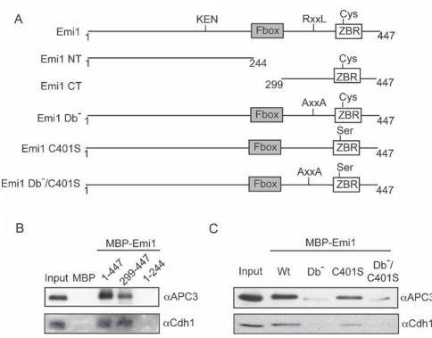

## Question

# Gene Research for Functional Annotation

## ⚠️ CRITICAL: Gene/Protein Identification Context

**BEFORE YOU BEGIN RESEARCH:** You MUST verify you are researching the CORRECT gene/protein. Gene symbols can be ambiguous, especially for less well-characterized genes from non-model organisms.

### Target Gene/Protein Identity (from UniProt):
- **UniProt Accession:** Q9UKT4
- **Protein Description:** RecName: Full=F-box only protein 5 {ECO:0000305}; AltName: Full=Early mitotic inhibitor 1 {ECO:0000303|PubMed:15148369};
- **Gene Information:** Name=FBXO5 {ECO:0000312|HGNC:HGNC:13584}; Synonyms=EMI1 {ECO:0000303|PubMed:11988738}, FBX5 {ECO:0000312|HGNC:HGNC:13584};
- **Organism (full):** Homo sapiens (Human).
- **Protein Family:** Not specified in UniProt
- **Key Domains:** F-box_dom. (IPR001810); FBX5_43. (IPR047147); ZF_ZBR. (IPR044064); F-box (PF00646); IBR_1 (PF22191)

### MANDATORY VERIFICATION STEPS:

1. **Check if the gene symbol "FBXO5" matches the protein description above**
2. **Verify the organism is correct:** Homo sapiens (Human).
3. **Check if protein family/domains align with what you find in literature**
4. **If you find literature for a DIFFERENT gene with the same or similar symbol, STOP**

### If Gene Symbol is Ambiguous or You Cannot Find Relevant Literature:

**DO NOT PROCEED WITH RESEARCH ON A DIFFERENT GENE.** Instead:
- State clearly: "The gene symbol 'FBXO5' is ambiguous or literature is limited for this specific protein"
- Explain what you found (e.g., "Found extensive literature on a different gene with the same symbol in a different organism")
- Describe the protein based ONLY on the UniProt information provided above
- Suggest that the protein function can be inferred from domain/family information

### Research Target:

Please provide a comprehensive research report on the gene **FBXO5** (gene ID: FBXO5, UniProt: Q9UKT4) in human.

The research report should be a detailed narrative explaining the function, biological processes, and localization of the gene product. Citations should be given for all claims.

You should prioritize authoritative reviews and primary scientific literature when conducting research. You can supplement
this with annotations you find in gene/protein databases, but these can be outdated or inaccurate.

We are specifically interested in the primary function of the gene - for enzymes, what reaction is catalyzed, and what is the substrate specificity? For transporters, what is the substrate? For structural proteins or adapters, what is the broader structural role? For signaling molecules, what is the role in the pathway.

We are interested in where in or outside the cell the gene product carries out its function.

We are also interested in the signaling or biochemical pathways in which the gene functions. We are less interested in broad pleiotropic effects, except where these elucidate the precise role.

Include evidence where possible. We are interested in both experimental evidence as well as inference from structure, evolution, or bioinformatic analysis. Precise studies should be prioritized over high-throughput, where available.

## Output

Question: You are an expert researcher providing comprehensive, well-cited information.

Provide detailed information focusing on:
1. Key concepts and definitions with current understanding
2. Recent developments and latest research (prioritize 2023-2024 sources)
3. Current applications and real-world implementations
4. Expert opinions and analysis from authoritative sources
5. Relevant statistics and data from recent studies

Format as a comprehensive research report with proper citations. Include URLs and publication dates where available.
Always prioritize recent, authoritative sources and provide specific citations for all major claims.

# Gene Research for Functional Annotation

## ⚠️ CRITICAL: Gene/Protein Identification Context

**BEFORE YOU BEGIN RESEARCH:** You MUST verify you are researching the CORRECT gene/protein. Gene symbols can be ambiguous, especially for less well-characterized genes from non-model organisms.

### Target Gene/Protein Identity (from UniProt):
- **UniProt Accession:** Q9UKT4
- **Protein Description:** RecName: Full=F-box only protein 5 {ECO:0000305}; AltName: Full=Early mitotic inhibitor 1 {ECO:0000303|PubMed:15148369};
- **Gene Information:** Name=FBXO5 {ECO:0000312|HGNC:HGNC:13584}; Synonyms=EMI1 {ECO:0000303|PubMed:11988738}, FBX5 {ECO:0000312|HGNC:HGNC:13584};
- **Organism (full):** Homo sapiens (Human).
- **Protein Family:** Not specified in UniProt
- **Key Domains:** F-box_dom. (IPR001810); FBX5_43. (IPR047147); ZF_ZBR. (IPR044064); F-box (PF00646); IBR_1 (PF22191)

### MANDATORY VERIFICATION STEPS:

1. **Check if the gene symbol "FBXO5" matches the protein description above**
2. **Verify the organism is correct:** Homo sapiens (Human).
3. **Check if protein family/domains align with what you find in literature**
4. **If you find literature for a DIFFERENT gene with the same or similar symbol, STOP**

### If Gene Symbol is Ambiguous or You Cannot Find Relevant Literature:

**DO NOT PROCEED WITH RESEARCH ON A DIFFERENT GENE.** Instead:
- State clearly: "The gene symbol 'FBXO5' is ambiguous or literature is limited for this specific protein"
- Explain what you found (e.g., "Found extensive literature on a different gene with the same symbol in a different organism")
- Describe the protein based ONLY on the UniProt information provided above
- Suggest that the protein function can be inferred from domain/family information

### Research Target:

Please provide a comprehensive research report on the gene **FBXO5** (gene ID: FBXO5, UniProt: Q9UKT4) in human.

The research report should be a detailed narrative explaining the function, biological processes, and localization of the gene product. Citations should be given for all claims.

You should prioritize authoritative reviews and primary scientific literature when conducting research. You can supplement
this with annotations you find in gene/protein databases, but these can be outdated or inaccurate.

We are specifically interested in the primary function of the gene - for enzymes, what reaction is catalyzed, and what is the substrate specificity? For transporters, what is the substrate? For structural proteins or adapters, what is the broader structural role? For signaling molecules, what is the role in the pathway.

We are interested in where in or outside the cell the gene product carries out its function.

We are also interested in the signaling or biochemical pathways in which the gene functions. We are less interested in broad pleiotropic effects, except where these elucidate the precise role.

Include evidence where possible. We are interested in both experimental evidence as well as inference from structure, evolution, or bioinformatic analysis. Precise studies should be prioritized over high-throughput, where available.

## Research report: Human **FBXO5 / EMI1** (UniProt **Q9UKT4**) — functional annotation

### 0) Mandatory identity verification (correct gene/protein)
The UniProt accession **Q9UKT4** corresponds to **human FBXO5**, also known as **EMI1 (Early Mitotic Inhibitor 1)** and annotated as an **F-box protein** (FBXO5) involved in cell-cycle regulation. The primary literature consistently uses the synonym **Emi1** for the same protein that inhibits APC/C during interphase and is required for proper cyclin accumulation and mitotic entry (miller2006emi1stablybinds pages 1-2, miller2006emi1stablybinds pages 2-4). A schematic from the Emi1 mechanistic paper depicts **Emi1 domain architecture** including an **N-terminal F-box** and a **C-terminal D-box (RxxL) and zinc-binding region (ZBR)** (miller2006emi1stablybinds media 1fa855a3). These features match the provided UniProt description for Q9UKT4 (F-box domain and ZBR/IBR-type zinc-binding region). 

### 1) Key concepts and definitions (current understanding)

#### 1.1 FBXO5/EMI1 is an interphase inhibitor of APC/C
The **anaphase-promoting complex/cyclosome (APC/C)** is a multi-subunit E3 ubiquitin ligase that drives cell-cycle transitions by ubiquitinating key regulators for proteasomal degradation. In proliferating somatic cells, **Emi1/FBXO5 acts as a principal interphase inhibitor of APC/C**, particularly **APC/C activated by Cdh1 (APC/C^CDH1)**, thereby preventing premature degradation of cyclins and enabling progression toward mitosis (miller2006emi1stablybinds pages 2-4). 

#### 1.2 “Pseudosubstrate inhibition” of APC/C by EMI1
A central concept is that Emi1 inhibits APC/C **as a pseudosubstrate**: it carries an APC/C-recognition degron (D-box) that docks into APC/C’s substrate-recognition machinery but—due to additional inhibitory elements—does not proceed efficiently through ubiquitination and degradation under interphase conditions (miller2006emi1stablybinds pages 1-2, miller2006emi1stablybinds pages 5-6). 

#### 1.3 Modular inhibitory elements: D-box and ZBR
Mechanistic mapping shows Emi1 uses at least two C-terminal modules:
- A **destruction box (D-box)** that provides high-affinity docking/competition at the APC/C D-box receptor (miller2006emi1stablybinds pages 1-2, miller2006emi1stablybinds pages 5-6).
- A **zinc-binding region (ZBR)** (sometimes discussed as an IBR/ZBR-type zinc-binding region) that provides an additional inhibitory function, including preventing Emi1 from being efficiently ubiquitinated by APC/C and contributing to APC/C shutdown (miller2006emi1stablybinds pages 6-7).

#### 1.4 Subcellular localization (functional context)
Biochemical fractionation and co-purification from interphase cells support that **Emi1 and APC/C are largely nuclear in interphase** and physically associate as nuclear complexes, consistent with Emi1’s interphase role in restraining nuclear APC/C activity (miller2006emi1stablybinds pages 2-4).

### 2) Molecular function, pathway placement, and mechanism (primary evidence)

#### 2.1 Direct binding to APC/C and coactivator Cdh1
Emi1/FBXO5 forms complexes with APC/C subunits and with the APC/C coactivator **Cdh1**. In one biochemical purification scheme from interphase HeLa cells, Emi1 co-eluted and co-immunoprecipitated with APC/C and Cdh1, supporting direct association (miller2006emi1stablybinds pages 2-4). 

#### 2.2 How Emi1 inhibits APC/C (mechanistic model)
Primary biochemical assays support a **multimodal shutdown** in which Emi1:
1) **Competes with canonical D-box substrates** for APC/C binding via its own D-box (miller2006emi1stablybinds pages 1-2, miller2006emi1stablybinds pages 5-6).
2) Uses the **ZBR** to provide inhibitory activity beyond mere docking—consistent with **blocking APC/C function and/or substrate access** and helping convert Emi1 from a substrate into an inhibitor (miller2006emi1stablybinds pages 6-7, miller2006emi1stablybinds pages 5-6).

A key experimental result: **mutating the ZBR converts Emi1 into an APC/C substrate** that becomes efficiently ubiquitinated in a D-box-dependent manner, while wild-type Emi1 is a poor substrate, supporting the pseudosubstrate-inhibitor model in which the ZBR “protects” Emi1 from APC/C-mediated ubiquitination (miller2006emi1stablybinds pages 6-7).

#### 2.3 Pathway dynamics: Emi1 destruction enables APC/C activation in mitosis
Emi1 must be removed to permit APC/C activation at mitotic entry. A mechanistic model supported by the same foundational work is that Emi1 is **destroyed in mitosis by an SCF(βTrCP/TrCP) ubiquitin ligase pathway**, and this destruction is **PLK1-dependent**, allowing subsequent APC/C-driven degradation of cyclins (miller2006emi1stablybinds pages 2-4). 

#### 2.4 FBXO5 as an F-box protein in SCF complexes (additional role)
Beyond APC/C inhibition, a 2024 study explicitly frames **EMI1 (FBXO5)** as an **F-box protein** that can serve as the variable substrate receptor in an **SCF^EMI1** ubiquitin ligase complex (core SCF components SKP1–CUL1–RBX1 plus the F-box protein) and cites **RAD51** as an SCF^EMI1 substrate targeted for proteolytic degradation (gudino2024lossofemi1 pages 1-2). This is important for annotation: while the best-established function is APC/C inhibition, FBXO5 also has literature-supported connections to SCF biology.

### 3) Domain architecture (evidence-aligned)
A key schematic in the foundational Emi1 paper depicts the **F-box**, **D-box (RxxL)**, and **ZBR** modules (miller2006emi1stablybinds media 1fa855a3). This domain architecture aligns with the UniProt context supplied in the prompt and provides experimentally grounded anchors for functional inference (pseudosubstrate docking via D-box; inhibition/protection via ZBR). 

### 4) Recent developments (2023–2024 prioritized)

#### 4.1 Epitranscriptomic regulation in breast cancer: METTL16→m6A→FBXO5
A 2024 paper reports that **METTL16 stabilizes FBXO5 mRNA via m6A modification** in breast cancer models. METTL16 is upregulated in breast cancer tissues/cells and shows a positive correlation with FBXO5; mechanistically, METTL16 binds FBXO5 mRNA and increases its stability in an m6A-dependent fashion. Functionally, METTL16 knockdown reduces FBXO5 levels and suppresses proliferation, migration, invasion, EMT, tumor growth, and lung metastasis in vivo; FBXO5 overexpression partially rescues METTL16-knockdown phenotypes (wang2024mettl16regulatesthe pages 8-11). These results position FBXO5 as a downstream effector of epitranscriptomic control with potential diagnostic/therapeutic relevance (wang2024mettl16regulatesthe pages 8-11).

#### 4.2 Splicing regulation and senescence in lung adenocarcinoma: PTBP1→FBXO5 isoforms
A 2024 lung adenocarcinoma study reports that the splicing factor **PTBP1** regulates **FBXO5** splicing. PTBP1 knockdown promotes **exon 3 skipping**, generating a less stable splice isoform (**FBXO5-S**) and reducing overall FBXO5 expression. FBXO5 knockdown induced senescence and cell-cycle arrest phenotypes in LUAD cell lines, supporting a functional link between FBXO5 abundance/isoform regulation and senescence control (li2024downregulationofsplicing pages 9-12, li2024downregulationofsplicing pages 12-14). 

#### 4.3 Chromosome instability and early colorectal cancer biology: consequences of EMI1 loss
A 2024 British Journal of Cancer study argues that **reduced EMI1 expression drives chromosome instability (CIN)** and is associated with DNA damage and transformation phenotypes in colonic epithelial contexts (gudino2024lossofemi1 pages 1-2). Importantly, this work emphasizes that EMI1 biology can be context-dependent: although EMI1 is often discussed in oncogenic contexts, **loss of EMI1** can promote genome instability and transformation, consistent with a potential role in early CRC development (gudino2024lossofemi1 pages 1-2).

#### 4.4 Kinase–ubiquitin coupling at G2/M: PLK1 and SCFβTrCP programs
A 2024 Cell Reports proteomics study identifies a **PLK1-dependent G2/M degradation program** mediated via SCF ligases including **SCFβTrCP**, reinforcing that kinase signaling can orchestrate broad ubiquitin-mediated proteome remodeling at mitotic entry (mouery2024proteomicanalysisreveals pages 1-3). This is directly relevant to Emi1 biology because classical Emi1 turnover is PLK1/SCFβTrCP-dependent (miller2006emi1stablybinds pages 2-4, mouery2024proteomicanalysisreveals pages 1-3).

#### 4.5 Pharmacologic modulation examples: licochalcone A reduces FBXO5 expression in LSCC models
A 2023 Oncology Reports study tested **licochalcone A** in lung squamous cell carcinoma models and reported that it decreased FBXO5 protein expression (along with MAPK signaling changes) and inhibited tumor growth in xenografts (fan2023licochalconeainduces pages 1-2). This is an example of a compound whose anti-tumor activity was associated with modulation of FBXO5 expression, though the accessed pages emphasized dosing and assay design more than final numeric effect sizes (fan2023licochalconeainduces pages 1-2).

### 5) Current applications and real-world implementations

1) **Cancer-biology target/biomarker exploration**: Multiple 2023–2024 studies treat FBXO5 (EMI1) as a candidate **oncogenic effector** (e.g., in breast cancer METTL16→FBXO5 axis) and as a potentially actionable node for intervention (wang2024mettl16regulatesthe pages 8-11). 

2) **Genome instability phenotyping and early cancer mechanisms**: In CRC-relevant models, EMI1 reduction is used experimentally to induce CIN and study transformation mechanisms, connecting Emi1 biology to clinically relevant aneuploidy and genome instability (gudino2024lossofemi1 pages 4-5, gudino2024lossofemi1 pages 1-2).

3) **Splicing-targeting concepts**: PTBP1-mediated FBXO5 splicing changes illustrate how **splicing factor perturbation** might be leveraged to modulate FBXO5 abundance and trigger senescence programs, a concept often considered in translational RNA biology (li2024downregulationofsplicing pages 12-14).

4) **Systems and proteomics frameworks for mitotic regulation**: PLK1-dependent degradation programs provide a broader implementable framework for mapping mitotic proteolysis (including known Emi1-turnover logic), informing drug-discovery contexts targeting kinases or ubiquitin ligases (mouery2024proteomicanalysisreveals pages 1-3).

### 6) Relevant statistics and quantitative data (recent studies)

- **CRC patient genomics (TCGA-based analyses in Gudino 2024):** ~**12%** of colorectal cancer cases show **EMI1 copy-number losses**, associated with significantly reduced EMI1 mRNA and significantly higher fraction of genome altered and aneuploidy scores (Mann–Whitney p < 0.0001) and worse disease-specific and progression-free survival (gudino2024lossofemi1 pages 4-5).
- **CIN effect sizes in cell models (Gudino 2024):** Reduced EMI1 increased aberrant chromosome spreads by **~2.6–3.0×** and micronucleus formation by **~2.2–2.5×** in siRNA models; knockdown reduced EMI1 to **~3–16%** of control; endoreduplication-like spreads were observed at **~33%** in HCT116 and **~60%** in SW48 (gudino2024lossofemi1 pages 4-5).
- **DNA damage statistics (Gudino 2024):** EMI1+/− clones had higher baseline double-strand break markers with highly significant differences (e.g., γ-H2AX and 53BP1 metrics; ****p < 0.0001; >200 nuclei per condition in selected comparisons) (gudino2024lossofemi1 pages 10-11).
- **Splicing-scale statistics (Li 2024):** PTBP1 knockdown produced **756 alternative splicing events** (rMATS; FDR ≤ 0.01 and |IncLevelDifference| ≥ 0.1) and FBXO5-S exhibited significantly faster degradation than FBXO5-L (p < 0.001) (li2024downregulationofsplicing pages 9-12).
- **Pharmacology experimental ranges (Fan 2023):** Licochalcone A tested across **0–40 µM** in LSCC cells (and up to 80 µM in bronchial epithelial cells) across 24–72 h assays; associated with G1 accumulation, apoptosis, reduced MAPK signaling, and reduced FBXO5 expression (fan2023licochalconeainduces pages 1-2).

### 7) Expert interpretation and synthesis (evidence-based)

1) **Primary molecular role is APC/C inhibition, not enzymatic catalysis.** FBXO5/EMI1 is best annotated as a **regulatory inhibitor/adaptor** that restrains APC/C activity during interphase; it achieves inhibition using a “pseudosubstrate” logic (D-box docking) combined with ZBR-dependent inhibitory activity that prevents Emi1 from being processed as a substrate (miller2006emi1stablybinds pages 6-7, miller2006emi1stablybinds pages 5-6).

2) **A recurring regulatory theme is “release of inhibition by timed destruction.”** Emi1 must be removed at mitotic entry, and the PLK1-dependent SCFβTrCP pathway provides a well-supported mechanism linking kinase signaling to the ubiquitin system to switch APC/C from “off” (interphase) to “on” (mitosis) (miller2006emi1stablybinds pages 2-4, mouery2024proteomicanalysisreveals pages 1-3).

3) **Cancer relevance is bidirectional and context-dependent.** Recent studies emphasize oncogenic phenotypes associated with elevated FBXO5 (e.g., breast cancer METTL16→FBXO5 axis) (wang2024mettl16regulatesthe pages 8-11), while other work highlights that **loss** of EMI1 can drive CIN and transformation (CRC contexts) (gudino2024lossofemi1 pages 4-5, gudino2024lossofemi1 pages 1-2). These are not contradictory: APC/C timing and genome stability are dosage-sensitive, and either excessive inhibition or insufficient control can plausibly perturb cell-cycle fidelity.

4) **RNA-layer regulation is an emerging 2024 theme.** Two independent 2024 studies highlight that FBXO5 abundance is strongly shaped by **post-transcriptional regulation**—m6A-dependent stabilization (METTL16) and splicing-mediated isoform stability (PTBP1) (wang2024mettl16regulatesthe pages 8-11, li2024downregulationofsplicing pages 12-14). This suggests functional annotation should include RNA regulatory control points, not only protein-domain mechanisms.

### 8) Evidence map (table)
The following table compiles the key evidence used for annotation, including publication dates and URLs/DOIs.

| Category | Specific finding | Evidence type (primary, review, database, figure) | Publication (authors/year/journal) | URL/DOI | Key notes |
|---|---|---|---|---|---|
| Identity/domains/localization | UniProt Q9UKT4 matches human FBXO5 or EMI1; Emi1 is a somatic APC/C inhibitor, largely nuclear in interphase, and figure evidence supports an N-terminal F-box plus C-terminal D-box and ZBR architecture. | Primary, figure | Miller et al., 2006, Genes and Development | https://doi.org/10.1101/gad.1454006 | Identity aligns with user-supplied UniProt entry and literature synonymy FBXO5 equals EMI1; figure schematic shows F-box, D-box, and ZBR; nuclear APC/C association described (miller2006emi1stablybinds pages 2-4, miller2006emi1stablybinds media 1fa855a3, miller2006emi1stablybinds media 93006fad) |
| Identity/domains/localization | Human Emi1 or FBXO5 is described as the somatic paralogue in the Emi family; the ZBR domain is recognized in Emi1, supporting the UniProt domain assignment. | Primary | Shoji et al., 2014, FEBS Open Bio | https://doi.org/10.1016/j.fob.2014.06.010 | Supports domain and family alignment and correct human-gene identity (shoji2014thezincbindingregion pages 1-2) |
| Core molecular function | FBXO5 or EMI1 inhibits APC/C, especially APC/C with CDH1, as a high-affinity pseudosubstrate inhibitor required in interphase to permit cyclin accumulation and mitotic entry. | Primary | Miller et al., 2006, Genes and Development | https://doi.org/10.1101/gad.1454006 | Emi1 binds tightly to APC/C and Cdh1 and prevents premature APC/C activity during S and G2 (miller2006emi1stablybinds pages 1-2, miller2006emi1stablybinds pages 2-4) |
| Core molecular function | The Emi1 D-box mediates high-affinity docking to the APC/C D-box receptor, while the ZBR provides a second inhibitory activity that blocks APC/C function and prevents Emi1 from becoming a normal APC/C substrate. | Primary | Miller et al., 2006, Genes and Development | https://doi.org/10.1101/gad.1454006 | Mutation of the ZBR converts Emi1 into a D-box-dependent APC/C substrate; both D-box and ZBR are needed for full inhibition (miller2006emi1stablybinds pages 5-6, miller2006emi1stablybinds pages 6-7) |
| Key interactors/complexes | EMI1 physically associates with APC/C core subunits and coactivator Cdh1 in large nuclear complexes; reported APC/C partners include APC1, APC3 or Cdc27, APC4, APC5, APC6 or Cdc16, APC7, APC8 or Cdc23, and APC11. | Primary | Miller et al., 2006, Genes and Development | https://doi.org/10.1101/gad.1454006 | Establishes pathway placement and direct biochemical interaction with APC/C machinery (miller2006emi1stablybinds pages 2-4) |
| Key interactors/complexes | Beyond APC/C inhibition, EMI1 is also described as an F-box protein capable of serving as the variable substrate receptor in an SCF EMI1 complex, with RAD51 cited as a substrate. | Primary | Gudino et al., 2024, British Journal of Cancer | https://doi.org/10.1038/s41416-024-02855-9 | Important nuance: FBXO5 has both a canonical F-box family identity and a better-established role as APC/C inhibitor; SCF adaptor role is noted in this recent paper (gudino2024lossofemi1 pages 1-2) |
| Regulation/turnover | EMI1 is destroyed at mitotic entry through a PLK1-dependent SCF beta TrCP or TrCP pathway, relieving APC/C inhibition and enabling degradation of cyclins A and B. | Primary | Miller et al., 2006, Genes and Development | https://doi.org/10.1101/gad.1454006 | Classic turnover mechanism linking kinase signaling to ubiquitin-mediated release of APC/C inhibition (miller2006emi1stablybinds pages 2-4, miller2006emi1stablybinds pages 6-7) |
| Regulation/turnover | APC/C with CDH1 can also reduce Emi1 levels under some experimental conditions, particularly when ZBR-dependent protection is lost, indicating Emi1 inhibitory domains normally protect it from APC/C-mediated ubiquitination. | Primary | Miller et al., 2006, Genes and Development | https://doi.org/10.1101/gad.1454006 | Helps explain why ZBR mutation shifts Emi1 from inhibitor to APC/C substrate (miller2006emi1stablybinds pages 6-7) |
| Recent 2023-2024 developments | In breast cancer, METTL16 stabilizes FBXO5 mRNA through m6A modification; METTL16 knockdown lowers FBXO5 and suppresses proliferation, migration, invasion, epithelial to mesenchymal transition, tumor growth, and lung metastasis. | Primary | Wang et al., 2024, Cancer and Metabolism | https://doi.org/10.1186/s40170-024-00351-5 | Positions FBXO5 as an epitranscriptomically regulated oncogenic effector and potential therapeutic target (wang2024mettl16regulatesthe pages 1-2, wang2024mettl16regulatesthe pages 8-11) |
| Recent 2023-2024 developments | In lung adenocarcinoma, PTBP1 controls FBXO5 splicing; PTBP1 knockdown promotes exon 3 skipping to generate an unstable FBXO5-S isoform, decreasing total FBXO5 and promoting cellular senescence. | Primary | Li et al., 2024, Current Issues in Molecular Biology | https://doi.org/10.3390/cimb46070458 | Suggests a PTBP1 to FBXO5 splicing to senescence axis with translational relevance for cancer biology (li2024downregulationofsplicing pages 9-12, li2024downregulationofsplicing pages 12-14) |
| Recent 2023-2024 developments | Reduced EMI1 expression in colonic epithelial models increases chromosome instability, DNA damage, and transformation phenotypes, supporting a role for EMI1 loss in early colorectal tumorigenesis. | Primary | Gudino et al., 2024, British Journal of Cancer | https://doi.org/10.1038/s41416-024-02855-9 | Important counterpoint to EMI1 as purely oncogenic: insufficient EMI1 can destabilize chromosomes and promote transformation (gudino2024lossofemi1 pages 10-11, gudino2024lossofemi1 pages 1-2) |
| Recent 2023-2024 developments | Quantitative proteomics in 2024 highlighted a broad PLK1-dependent G2 to M degradation program mediated partly by SCF beta TrCP, reinforcing the established mitotic-degradation axis relevant to EMI1 turnover. | Primary | Mouery et al., 2024, Cell Reports | https://doi.org/10.1016/j.celrep.2024.114510 | The paper notes FBXO5 or EMI1 among proteins whose mitotic degradation had previously been shown to be PLK1 dependent (mouery2024proteomicanalysisreveals pages 1-3) |
| Recent 2023-2024 developments | A pharmacologic example is licochalcone A, which suppresses FBXO5 expression along with MAPK signaling and inhibits lung squamous cell carcinoma growth in vitro and in xenografts. | Primary | Fan et al., 2023, Oncology Reports | https://doi.org/10.3892/or.2023.8651 | Shows real-world experimental modulation of FBXO5 in a cancer model, though accessed pages contained limited numeric outcome values (fan2023licochalconeainduces pages 1-2) |
| Quantitative statistics | In colorectal cancer datasets, about 12 percent of cases show EMI1 copy-number loss; these losses correlate with reduced EMI1 mRNA, higher fraction of genome altered, higher aneuploidy score, and worse disease-specific and progression-free survival. | Primary | Gudino et al., 2024, British Journal of Cancer | https://doi.org/10.1038/s41416-024-02855-9 | Reported significance includes Mann-Whitney test p less than 0.0001 for copy-loss associations (gudino2024lossofemi1 pages 4-5) |
| Quantitative statistics | In colorectal cancer cell models, EMI1 depletion reduced EMI1 abundance to about 3 to 16 percent of control, increased aberrant chromosome spreads by 2.6 to 3.0 fold, and increased micronucleus formation by about 2.1 to 2.5 fold; endoreduplication-like spreads reached about 33 percent in HCT116 and about 60 percent in SW48. | Primary | Gudino et al., 2024, British Journal of Cancer | https://doi.org/10.1038/s41416-024-02855-9 | Provides direct functional effect sizes for chromosome-instability phenotypes after EMI1 reduction (gudino2024lossofemi1 pages 4-5) |
| Quantitative statistics | In heterozygous EMI1 plus or minus colon-cell clones, chromosome-instability and DNA-damage readouts were significantly elevated, including gamma H2AX and 53BP1, with more than 200 nuclei analyzed per condition and p less than 0.0001 in selected comparisons. | Primary | Gudino et al., 2024, British Journal of Cancer | https://doi.org/10.1038/s41416-024-02855-9 | Strong statistical support for genome-instability and DNA-damage phenotypes (gudino2024lossofemi1 pages 10-11) |
| Quantitative statistics | PTBP1 knockdown in A549 cells yielded 756 alternative splicing events under rMATS criteria false discovery rate at or below 0.01 and inclusion-level difference magnitude at or above 0.1; differential-expression analyses used log fold change magnitude at or above 0.5 and adjusted p below 0.05; FBXO5-S decayed faster than FBXO5-L with p below 0.001. | Primary | Li et al., 2024, Current Issues in Molecular Biology | https://doi.org/10.3390/cimb46070458 | Quantifies the scale and significance thresholds of the PTBP1 to FBXO5 splicing mechanism (li2024downregulationofsplicing pages 9-12) |
| Quantitative statistics | Licochalcone A was tested at 0, 2, 5, 10, 20, and 40 micromolar in lung squamous cell carcinoma cells and 0 to 80 micromolar in bronchial epithelial cells across 24 to 72 hour assays; it increased G1 fraction and apoptosis and reduced xenograft tumor volume and weight. | Primary | Fan et al., 2023, Oncology Reports | https://doi.org/10.3892/or.2023.8651 | Accessed pages reported dosing and assay design but not all final IC50 or fold-change values (fan2023licochalconeainduces pages 1-2) |
| Recent 2023-2024 developments | Open Targets lists FBXO5 disease associations including ovarian neoplasm, neurodegenerative disease, hyperaldosteronism, genital-system abnormality, and lysosomal storage disease, but evidence counts are low and should be treated as hypothesis-generating. | Database | Open Targets Platform | https://platform.opentargets.org/ | Useful for triangulation, not strong causal inference; ovarian neoplasm evidence size equals 2 in retrieved context (OpenTargets Search: -FBXO5) |

*Table: This table summarizes verified identity, mechanism, regulation, recent literature, and quantitative evidence for human FBXO5 or EMI1, UniProt Q9UKT4. It is useful as a compact evidence map linking canonical APC/C biology to recent cancer and chromosome-instability studies.*

### 9) Key mechanistic figure evidence (visual corroboration)
The extracted figure panels show Emi1’s **domain organization** (including the F-box, D-box, and ZBR) and provide a **conceptual model** of Emi1-mediated APC/C inhibition (miller2006emi1stablybinds media 1fa855a3, miller2006emi1stablybinds media 93006fad).

### 10) Selected references (URLs/DOIs and publication dates)
- Miller JJ et al. **2006-09**. *Genes & Development.* “Emi1 stably binds and inhibits the anaphase-promoting complex/cyclosome as a pseudosubstrate inhibitor.” https://doi.org/10.1101/gad.1454006 (miller2006emi1stablybinds pages 1-2)
- Shoji S et al. **2014-07**. *FEBS Open Bio.* “The ZBR fragment of Emi2 can inhibit APC/C …” https://doi.org/10.1016/j.fob.2014.06.010 (context for Emi family and Emi1 ZBR) (shoji2014thezincbindingregion pages 1-2)
- Fan X et al. **2023-10**. *Oncology Reports.* “Licochalcone A induces cell cycle arrest and apoptosis … suppressing … FBXO5 …” https://doi.org/10.3892/or.2023.8651 (fan2023licochalconeainduces pages 1-2)
- Wang R et al. **2024-07**. *Cancer & Metabolism.* “METTL16 regulates the mRNA stability of FBXO5 via m6A …” https://doi.org/10.1186/s40170-024-00351-5 (wang2024mettl16regulatesthe pages 8-11)
- Li H et al. **2024-07**. *Current Issues in Molecular Biology.* “Downregulation of PTBP1 curtails FBXO5 expression to promote cellular senescence …” https://doi.org/10.3390/cimb46070458 (li2024downregulationofsplicing pages 9-12)
- Gudiño RC et al. **2024-10**. *British Journal of Cancer.* “Loss of EMI1 compromises chromosome stability …” https://doi.org/10.1038/s41416-024-02855-9 (gudino2024lossofemi1 pages 4-5)
- Mouery RD et al. **2024-08**. *Cell Reports.* “Proteomic analysis reveals a PLK1-dependent G2/M degradation program …” https://doi.org/10.1016/j.celrep.2024.114510 (mouery2024proteomicanalysisreveals pages 1-3)
- Open Targets Platform (accessed via tool; disease associations listed with limited evidence counts). https://platform.opentargets.org/ (OpenTargets Search: -FBXO5)

References

1. (miller2006emi1stablybinds pages 1-2): Julie J. Miller, Matthew K. Summers, David V. Hansen, Maxence V. Nachury, Norman L. Lehman, Alex Loktev, and Peter K. Jackson. Emi1 stably binds and inhibits the anaphase-promoting complex/cyclosome as a pseudosubstrate inhibitor. Genes & development, 20 17:2410-20, Sep 2006. URL: https://doi.org/10.1101/gad.1454006, doi:10.1101/gad.1454006. This article has 262 citations and is from a highest quality peer-reviewed journal.

2. (miller2006emi1stablybinds pages 2-4): Julie J. Miller, Matthew K. Summers, David V. Hansen, Maxence V. Nachury, Norman L. Lehman, Alex Loktev, and Peter K. Jackson. Emi1 stably binds and inhibits the anaphase-promoting complex/cyclosome as a pseudosubstrate inhibitor. Genes & development, 20 17:2410-20, Sep 2006. URL: https://doi.org/10.1101/gad.1454006, doi:10.1101/gad.1454006. This article has 262 citations and is from a highest quality peer-reviewed journal.

3. (miller2006emi1stablybinds media 1fa855a3): Julie J. Miller, Matthew K. Summers, David V. Hansen, Maxence V. Nachury, Norman L. Lehman, Alex Loktev, and Peter K. Jackson. Emi1 stably binds and inhibits the anaphase-promoting complex/cyclosome as a pseudosubstrate inhibitor. Genes & development, 20 17:2410-20, Sep 2006. URL: https://doi.org/10.1101/gad.1454006, doi:10.1101/gad.1454006. This article has 262 citations and is from a highest quality peer-reviewed journal.

4. (miller2006emi1stablybinds pages 5-6): Julie J. Miller, Matthew K. Summers, David V. Hansen, Maxence V. Nachury, Norman L. Lehman, Alex Loktev, and Peter K. Jackson. Emi1 stably binds and inhibits the anaphase-promoting complex/cyclosome as a pseudosubstrate inhibitor. Genes & development, 20 17:2410-20, Sep 2006. URL: https://doi.org/10.1101/gad.1454006, doi:10.1101/gad.1454006. This article has 262 citations and is from a highest quality peer-reviewed journal.

5. (miller2006emi1stablybinds pages 6-7): Julie J. Miller, Matthew K. Summers, David V. Hansen, Maxence V. Nachury, Norman L. Lehman, Alex Loktev, and Peter K. Jackson. Emi1 stably binds and inhibits the anaphase-promoting complex/cyclosome as a pseudosubstrate inhibitor. Genes & development, 20 17:2410-20, Sep 2006. URL: https://doi.org/10.1101/gad.1454006, doi:10.1101/gad.1454006. This article has 262 citations and is from a highest quality peer-reviewed journal.

6. (gudino2024lossofemi1 pages 1-2): Rubi Campos Gudiño, Nicole M. Neudorf, Demi Andromidas, Zelda Lichtensztejn, and Kirk J. McManus. Loss of emi1 compromises chromosome stability and is associated with cellular transformation in colonic epithelial cell contexts. British Journal of Cancer, 131:1516-1528, Oct 2024. URL: https://doi.org/10.1038/s41416-024-02855-9, doi:10.1038/s41416-024-02855-9. This article has 3 citations and is from a domain leading peer-reviewed journal.

7. (wang2024mettl16regulatesthe pages 8-11): Runying Wang, Xingjie Gao, Luhan Xie, Jia-Lin Lin#, and Yanying Ren. Mettl16 regulates the mrna stability of fbxo5 via m6a modification to facilitate the malignant behavior of breast cancer. Cancer & Metabolism, Jul 2024. URL: https://doi.org/10.1186/s40170-024-00351-5, doi:10.1186/s40170-024-00351-5. This article has 15 citations and is from a peer-reviewed journal.

8. (li2024downregulationofsplicing pages 9-12): Haoyu Li, Xiaoxiao Sun, Yuanyuan Lv, Gang Wei, Ting Ni, Wenxin Qin, Haojie Jin, and Qi Jia. Downregulation of splicing factor ptbp1 curtails fbxo5 expression to promote cellular senescence in lung adenocarcinoma. Current Issues in Molecular Biology, 46:7730-7744, Jul 2024. URL: https://doi.org/10.3390/cimb46070458, doi:10.3390/cimb46070458. This article has 8 citations.

9. (li2024downregulationofsplicing pages 12-14): Haoyu Li, Xiaoxiao Sun, Yuanyuan Lv, Gang Wei, Ting Ni, Wenxin Qin, Haojie Jin, and Qi Jia. Downregulation of splicing factor ptbp1 curtails fbxo5 expression to promote cellular senescence in lung adenocarcinoma. Current Issues in Molecular Biology, 46:7730-7744, Jul 2024. URL: https://doi.org/10.3390/cimb46070458, doi:10.3390/cimb46070458. This article has 8 citations.

10. (mouery2024proteomicanalysisreveals pages 1-3): Ryan D. Mouery, Kimberly Lukasik, Carolyn Hsu, Thomas Bonacci, Derek L. Bolhuis, Xianxi Wang, C. Allie Mills, E. Drew Toomer, Owen G. Canterbury, Kevin C. Robertson, Timothy B. Branigan, Nicholas G. Brown, Laura E. Herring, Stephanie L. Gupton, and Michael J. Emanuele. Proteomic analysis reveals a plk1-dependent g2/m degradation program and a role for akap2 in coordinating the mitotic cytoskeleton. Aug 2024. URL: https://doi.org/10.1016/j.celrep.2024.114510, doi:10.1016/j.celrep.2024.114510. This article has 11 citations and is from a highest quality peer-reviewed journal.

11. (fan2023licochalconeainduces pages 1-2): Xiaoli Fan, Guoqiang Guan, Juan Wang, Meihua Jin, Liming Wang, and Xiaoqun Duan. Licochalcone a induces cell cycle arrest and apoptosis via suppressing mapk signaling pathway and the expression of fbxo5 in lung squamous cell cancer. Oncology Reports, Oct 2023. URL: https://doi.org/10.3892/or.2023.8651, doi:10.3892/or.2023.8651. This article has 14 citations and is from a peer-reviewed journal.

12. (gudino2024lossofemi1 pages 4-5): Rubi Campos Gudiño, Nicole M. Neudorf, Demi Andromidas, Zelda Lichtensztejn, and Kirk J. McManus. Loss of emi1 compromises chromosome stability and is associated with cellular transformation in colonic epithelial cell contexts. British Journal of Cancer, 131:1516-1528, Oct 2024. URL: https://doi.org/10.1038/s41416-024-02855-9, doi:10.1038/s41416-024-02855-9. This article has 3 citations and is from a domain leading peer-reviewed journal.

13. (gudino2024lossofemi1 pages 10-11): Rubi Campos Gudiño, Nicole M. Neudorf, Demi Andromidas, Zelda Lichtensztejn, and Kirk J. McManus. Loss of emi1 compromises chromosome stability and is associated with cellular transformation in colonic epithelial cell contexts. British Journal of Cancer, 131:1516-1528, Oct 2024. URL: https://doi.org/10.1038/s41416-024-02855-9, doi:10.1038/s41416-024-02855-9. This article has 3 citations and is from a domain leading peer-reviewed journal.

14. (miller2006emi1stablybinds media 93006fad): Julie J. Miller, Matthew K. Summers, David V. Hansen, Maxence V. Nachury, Norman L. Lehman, Alex Loktev, and Peter K. Jackson. Emi1 stably binds and inhibits the anaphase-promoting complex/cyclosome as a pseudosubstrate inhibitor. Genes & development, 20 17:2410-20, Sep 2006. URL: https://doi.org/10.1101/gad.1454006, doi:10.1101/gad.1454006. This article has 262 citations and is from a highest quality peer-reviewed journal.

15. (shoji2014thezincbindingregion pages 1-2): Shisako Shoji, Yutaka Muto, Mariko Ikeda, Fahu He, Kengo Tsuda, Noboru Ohsawa, Ryogo Akasaka, Takaho Terada, Motoaki Wakiyama, Mikako Shirouzu, and Shigeyuki Yokoyama. The zinc-binding region (zbr) fragment of emi2 can inhibit apc/c by targeting its association with the coactivator cdc20 and ube2c-mediated ubiquitylation. FEBS Open Bio, 4:689-703, Jul 2014. URL: https://doi.org/10.1016/j.fob.2014.06.010, doi:10.1016/j.fob.2014.06.010. This article has 28 citations and is from a peer-reviewed journal.

16. (wang2024mettl16regulatesthe pages 1-2): Runying Wang, Xingjie Gao, Luhan Xie, Jia-Lin Lin#, and Yanying Ren. Mettl16 regulates the mrna stability of fbxo5 via m6a modification to facilitate the malignant behavior of breast cancer. Cancer & Metabolism, Jul 2024. URL: https://doi.org/10.1186/s40170-024-00351-5, doi:10.1186/s40170-024-00351-5. This article has 15 citations and is from a peer-reviewed journal.

17. (OpenTargets Search: -FBXO5): Open Targets Query (-FBXO5, 6 results). Buniello, A. et al. (2025). Open Targets Platform: facilitating therapeutic hypotheses building in drug discovery. Nucleic Acids Research.

## Artifacts

- [Edison artifact artifact-00](FBXO5-deep-research-falcon_artifacts/artifact-00.md)

## Citations

1. mouery2024proteomicanalysisreveals pages 1-3
2. fan2023licochalconeainduces pages 1-2
3. li2024downregulationofsplicing pages 12-14
4. li2024downregulationofsplicing pages 9-12
5. shoji2014thezincbindingregion pages 1-2
6. https://doi.org/10.1101/gad.1454006
7. https://doi.org/10.1016/j.fob.2014.06.010
8. https://doi.org/10.1038/s41416-024-02855-9
9. https://doi.org/10.1186/s40170-024-00351-5
10. https://doi.org/10.3390/cimb46070458
11. https://doi.org/10.1016/j.celrep.2024.114510
12. https://doi.org/10.3892/or.2023.8651
13. https://platform.opentargets.org/
14. https://doi.org/10.1101/gad.1454006,
15. https://doi.org/10.1038/s41416-024-02855-9,
16. https://doi.org/10.1186/s40170-024-00351-5,
17. https://doi.org/10.3390/cimb46070458,
18. https://doi.org/10.1016/j.celrep.2024.114510,
19. https://doi.org/10.3892/or.2023.8651,
20. https://doi.org/10.1016/j.fob.2014.06.010,