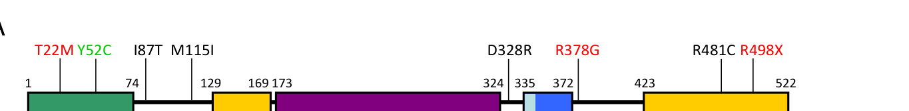

## Question

# Gene Research for Functional Annotation

## ⚠️ CRITICAL: Gene/Protein Identification Context

**BEFORE YOU BEGIN RESEARCH:** You MUST verify you are researching the CORRECT gene/protein. Gene symbols can be ambiguous, especially for less well-characterized genes from non-model organisms.

### Target Gene/Protein Identity (from UniProt):
- **UniProt Accession:** Q9Y3I1
- **Protein Description:** RecName: Full=F-box only protein 7;
- **Gene Information:** Name=FBXO7; Synonyms=FBX7;
- **Organism (full):** Homo sapiens (Human).
- **Protein Family:** Not specified in UniProt
- **Key Domains:** F-box-like_dom_sf. (IPR036047); F-box_dom. (IPR001810); Fbxo7. (IPR047118); PI31_Prot_N. (IPR021625); Ubiquitin-like_domsf. (IPR029071)

### MANDATORY VERIFICATION STEPS:

1. **Check if the gene symbol "FBXO7" matches the protein description above**
2. **Verify the organism is correct:** Homo sapiens (Human).
3. **Check if protein family/domains align with what you find in literature**
4. **If you find literature for a DIFFERENT gene with the same or similar symbol, STOP**

### If Gene Symbol is Ambiguous or You Cannot Find Relevant Literature:

**DO NOT PROCEED WITH RESEARCH ON A DIFFERENT GENE.** Instead:
- State clearly: "The gene symbol 'FBXO7' is ambiguous or literature is limited for this specific protein"
- Explain what you found (e.g., "Found extensive literature on a different gene with the same symbol in a different organism")
- Describe the protein based ONLY on the UniProt information provided above
- Suggest that the protein function can be inferred from domain/family information

### Research Target:

Please provide a comprehensive research report on the gene **FBXO7** (gene ID: FBXO7, UniProt: Q9Y3I1) in human.

The research report should be a detailed narrative explaining the function, biological processes, and localization of the gene product. Citations should be given for all claims.

You should prioritize authoritative reviews and primary scientific literature when conducting research. You can supplement
this with annotations you find in gene/protein databases, but these can be outdated or inaccurate.

We are specifically interested in the primary function of the gene - for enzymes, what reaction is catalyzed, and what is the substrate specificity? For transporters, what is the substrate? For structural proteins or adapters, what is the broader structural role? For signaling molecules, what is the role in the pathway.

We are interested in where in or outside the cell the gene product carries out its function.

We are also interested in the signaling or biochemical pathways in which the gene functions. We are less interested in broad pleiotropic effects, except where these elucidate the precise role.

Include evidence where possible. We are interested in both experimental evidence as well as inference from structure, evolution, or bioinformatic analysis. Precise studies should be prioritized over high-throughput, where available.

## Output

Question: You are an expert researcher providing comprehensive, well-cited information.

Provide detailed information focusing on:
1. Key concepts and definitions with current understanding
2. Recent developments and latest research (prioritize 2023-2024 sources)
3. Current applications and real-world implementations
4. Expert opinions and analysis from authoritative sources
5. Relevant statistics and data from recent studies

Format as a comprehensive research report with proper citations. Include URLs and publication dates where available.
Always prioritize recent, authoritative sources and provide specific citations for all major claims.

# Gene Research for Functional Annotation

## ⚠️ CRITICAL: Gene/Protein Identification Context

**BEFORE YOU BEGIN RESEARCH:** You MUST verify you are researching the CORRECT gene/protein. Gene symbols can be ambiguous, especially for less well-characterized genes from non-model organisms.

### Target Gene/Protein Identity (from UniProt):
- **UniProt Accession:** Q9Y3I1
- **Protein Description:** RecName: Full=F-box only protein 7;
- **Gene Information:** Name=FBXO7; Synonyms=FBX7;
- **Organism (full):** Homo sapiens (Human).
- **Protein Family:** Not specified in UniProt
- **Key Domains:** F-box-like_dom_sf. (IPR036047); F-box_dom. (IPR001810); Fbxo7. (IPR047118); PI31_Prot_N. (IPR021625); Ubiquitin-like_domsf. (IPR029071)

### MANDATORY VERIFICATION STEPS:

1. **Check if the gene symbol "FBXO7" matches the protein description above**
2. **Verify the organism is correct:** Homo sapiens (Human).
3. **Check if protein family/domains align with what you find in literature**
4. **If you find literature for a DIFFERENT gene with the same or similar symbol, STOP**

### If Gene Symbol is Ambiguous or You Cannot Find Relevant Literature:

**DO NOT PROCEED WITH RESEARCH ON A DIFFERENT GENE.** Instead:
- State clearly: "The gene symbol 'FBXO7' is ambiguous or literature is limited for this specific protein"
- Explain what you found (e.g., "Found extensive literature on a different gene with the same symbol in a different organism")
- Describe the protein based ONLY on the UniProt information provided above
- Suggest that the protein function can be inferred from domain/family information

### Research Target:

Please provide a comprehensive research report on the gene **FBXO7** (gene ID: FBXO7, UniProt: Q9Y3I1) in human.

The research report should be a detailed narrative explaining the function, biological processes, and localization of the gene product. Citations should be given for all claims.

You should prioritize authoritative reviews and primary scientific literature when conducting research. You can supplement
this with annotations you find in gene/protein databases, but these can be outdated or inaccurate.

We are specifically interested in the primary function of the gene - for enzymes, what reaction is catalyzed, and what is the substrate specificity? For transporters, what is the substrate? For structural proteins or adapters, what is the broader structural role? For signaling molecules, what is the role in the pathway.

We are interested in where in or outside the cell the gene product carries out its function.

We are also interested in the signaling or biochemical pathways in which the gene functions. We are less interested in broad pleiotropic effects, except where these elucidate the precise role.

Include evidence where possible. We are interested in both experimental evidence as well as inference from structure, evolution, or bioinformatic analysis. Precise studies should be prioritized over high-throughput, where available.

# Research Report: Human **FBXO7** (UniProt **Q9Y3I1**) — Functional Annotation and Translational Relevance

## 0) Target verification (mandatory)

**Identity confirmed.** The literature retrieved consistently describes **human FBXO7** as **F-box only protein 7** (also PARK15/FBX7), a substrate-recognition adaptor in **SCF (SKP1–CUL1–RBX1) Cullin-RING E3 ubiquitin ligase complexes**, with the domain architecture matching the UniProt context (Ubl/ubiquitin-like at the N-terminus in isoform 1; FP/PI31-interaction domain; F-box; proline-rich region). These features, along with the key interaction with **SKP1** (F-box) and **PI31/PSMF1** (FP domain), and disease linkage to PARK15, align with the UniProt target description and avoid symbol ambiguity. (randle2017structureandfunction pages 5-7, randle2017structureandfunction pages 17-21, wang2021analysisofthe pages 17-21)

**Visual evidence:** FBXO7 domain organization and SCF schematic are shown in Randle & Laman (2017), with Ubl/FP/F-box/PRR annotated, and FBXO7 positioned as the substrate receptor within SCF. (randle2017structureandfunction media caeb42e9, randle2017structureandfunction media 1a872076)

---

## 1) Key concepts and definitions (current understanding)

### 1.1 SCF E3 ubiquitin ligase adaptor (core molecular function)
FBXO7 is best understood as a **substrate-specifying adaptor** of an **SCF-type E3 ubiquitin ligase**, where its **F-box domain binds SKP1**, linking FBXO7 to the **CUL1–RBX1** catalytic core that recruits an E2~ubiquitin and transfers ubiquitin to substrates. (randle2017structureandfunction pages 5-7, randle2017structureandfunction pages 17-21, zhou2018pathophysiologicalmechanismslinking pages 2-3, randle2017structureandfunction media caeb42e9, randle2017structureandfunction media 1a872076)

A key conceptual point is that **FBXO7-driven ubiquitination is not exclusively degradative**. It can generate **K48-linked polyubiquitin** (often proteasome-targeting) or **K63-linked chains** (often non-proteolytic signaling/trafficking/autophagy-related roles), depending on the substrate and context. (randle2017structureandfunction pages 5-7, zhou2018pathophysiologicalmechanismslinking pages 2-3, teixeira2016gsk3βandtomm20 pages 1-2)

### 1.2 Domain architecture and isoforms
The review literature describes human FBXO7 (isoform 1, ~522 aa) as containing:
- **N-terminal ubiquitin-like (Ubl) domain** (present in isoform 1; isoform 2 lacks this N-terminus),
- **FP domain** (FBXO7/PI31 interaction and dimerization module),
- **F-box domain** (SKP1 binding; also contains a nuclear export signal),
- **C-terminal proline-rich region (PRR)** (substrate interaction and regulatory interactions). (randle2017structureandfunction pages 5-7, randle2017structureandfunction pages 11-13, randle2017structureandfunction pages 7-9)

### 1.3 Subcellular localization (where FBXO7 acts)
FBXO7 displays **regulated nucleo-cytoplasmic shuttling** and can also function in **mitochondrial quality control pathways**. Reduced SKP1 binding can promote **CRM1/exportin-mediated cytoplasmic accumulation**, and cellular stress can promote mitochondrial translocation in PARK15-linked biology. (randle2017structureandfunction pages 5-7, randle2017structureandfunction pages 17-21)

---

## 2) Biological functions and pathways (mechanistic functional annotation)

### 2.1 Proteasome regulation and proteostasis (proteasome assembly/function)
A foundational in vivo mechanistic link is that FBXO7 is **proteasome-associated** and supports **proteasome assembly/activity** through ubiquitin signaling on proteasomal components.

- In mouse models, **loss of Fbxo7** leads to **reduced proteasome activity** and a **parkinsonism-like phenotype**, supporting a role for FBXO7 in neuronal proteostasis. (Vingill et al., *EMBO J*, 2016, https://doi.org/10.15252/embj.201593585) (vingill2016lossoffbxo7 pages 1-2)
- Mechanistically, FBXO7-SCF can bind/ubiquitinate proteasome subunits (e.g., **PSMA2**), and this is frequently discussed as **K63-linked** and **non-proteolytic** in the context of assembly control. (dontcheva2017functionalanalysisof pages 14-18, joseph2018mechanisticcontributionsof pages 8-10)

**Functional interpretation:** FBXO7 is not a proteasome enzyme; it is an **E3 ligase adaptor** that tunes **proteasome composition/assembly** and thereby affects proteolytic capacity, particularly relevant in long-lived cells like neurons. (vingill2016lossoffbxo7 pages 1-2, joseph2018mechanisticcontributionsof pages 8-10)

### 2.2 Mitophagy / mitochondrial quality control (PINK1–Parkin axis)
FBXO7 participates in mitochondrial quality control by interacting with **PINK1 and Parkin** and facilitating Parkin recruitment to damaged mitochondria in PARK15 biology. Disease-linked mutations can impair these interactions (notably **T22M** reducing Parkin binding). (randle2017structureandfunction pages 17-21, randle2017structureandfunction pages 11-13, randle2017structureandfunction pages 7-9, joseph2018mechanisticcontributionsof pages 5-6)

### 2.3 Substrate ubiquitination with disease-relevant outputs

#### 2.3.1 GSK3β and TOMM20 as SCF^FBXO7 substrates (PD-relevant)
Teixeira et al. (2016) validated **GSK3β** and **TOMM20** as SCF^FBXO7 substrates:
- FBXO7 modifies **GSK3β with K63-linked ubiquitin**, regulating kinase **activity** rather than abundance/localization.
- FBXO7 ubiquitinates **TOMM20** with effects consistent with **stabilization** and linkage to mitophagy-related processes. (Teixeira et al., *Biochem J*, 2016, https://doi.org/10.1042/BCJ20160387) (teixeira2016gsk3βandtomm20 pages 1-2)

#### 2.3.2 SIRT7 degradation under oxidative stress (2023 mechanistic advance)
Lee et al. (2023) established a detailed ubiquitination mechanism for an FBXO7 substrate:
- FBXO7 promotes **K48-linked polyubiquitination** of **SIRT7** on **K292, K395, K397, K398**, leading to **proteasomal degradation**.
- In **SH-SY5Y** cells exposed to **500 μM H2O2 for 6 h**, FBXO7-mediated SIRT7 loss contributes to **cell death**, and a ubiquitination-resistant **SIRT7-4KR** mutant resists degradation and displays stronger functional activity.
- PD-linked FBXO7 mutants show differential ability to destabilize SIRT7: **R498X** failed to reduce SIRT7 stability, while **T22M and R378G** behaved more like WT in this assay context. (Lee et al., *J Biol Chem*, 2023-03, https://doi.org/10.1016/j.jbc.2023.102909) (lee2023e3ligaseadaptor pages 9-11, lee2023e3ligaseadaptor pages 12-13)

**Interpretation:** This work provides unusually specific annotation: **substrate (SIRT7), linkage (K48), and lysine sites**, supporting a direct molecular function assignment for FBXO7 as a **degradative E3 adaptor** in oxidative-stress contexts. (lee2023e3ligaseadaptor pages 9-11)

#### 2.3.3 INF2 degradation and mitochondrial division control in endometrial carcinoma (2023)
Zhang et al. (2023) identify FBXO7 as a **tumor suppressor** mechanism in endometrial carcinoma by targeting INF2:
- FBXO7 physically associates with **INF2**; FBXO7 was the **top FBXO family interactor** in FLAG-INF2 AP-MS (3 peptides/3 unique peptides).
- The **FBXO7 UBL domain (aa 1–74)** is required for INF2 binding.
- FBXO7 catalyzes predominantly **K48-linked polyubiquitination** of INF2, shortening INF2 half-life.
- Clinically, **FBXO7 is downregulated and mutated in 5.87%** of endometrial carcinoma cases (**31/528** in TCGA). Dataset sizes used include TCGA mRNA tumor **n=546** vs normal **n=35** (paired **n=23**) and CPTAC protein tumor **n=100** vs normal **n=31** (paired **n=30**), all with ***p<0.001** differences reported for expression comparisons.
- Low FBXO7 correlates with elevated INF2 and dysregulated INF2–DRP1-driven mitochondrial division. (Zhang et al., *Cell Death & Disease*, 2023-06, https://doi.org/10.1038/s41419-023-05891-0) (zhang2023fbxo7atumor pages 1-3, zhang2023fbxo7atumor pages 3-5)

#### 2.3.4 PRMT1 degradation and serine metabolism in hepatocellular carcinoma (2024)
Luo et al. (2024) show FBXO7 suppresses HCC growth by degrading PRMT1:
- FBXO7 directly binds **PRMT1** and promotes **PRMT1 ubiquitination at K37 (lysine 37)**; the **K37R** mutant is resistant.
- FBXO7 knockdown increases PRMT1 protein (without changing mRNA), prolongs PRMT1 half-life (CHX chase), and effects are proteasome-dependent (MG132/bortezomib blockade).
- Mechanistic axis: FBXO7 → ↓PRMT1 → ↓PHGDH methylation (R236) and activation → ↓serine synthesis, ↑ROS, ↓tumor growth.
- The binding interfaces include FBXO7 UBL (1–78) and FP (181–324) domains and the PRMT1 catalytic domain (23–162).
- Experimental details include ubiquitination assays with **MG132 25 μM for 6 h** and CHX **50 μg/mL**; results were repeated and quantified (n=3). (Luo et al., *Nature Communications*, 2024-06, https://doi.org/10.1038/s41467-024-49087-2) (luo2024fbxo7ubiquitinatesprmt1 pages 2-3, luo2024fbxo7ubiquitinatesprmt1 pages 4-5, luo2024fbxo7ubiquitinatesprmt1 pages 5-6, luo2024fbxo7ubiquitinatesprmt1 pages 1-2)

---

## 3) Recent developments (prioritizing 2023–2024)

### 3.1 Upstream regulation of FBXO7 stability by USP7 (2023)
Lee & Chung (2023) identify **USP7** as a regulator that stabilizes FBXO7:
- USP7 deubiquitinates FBXO7 by removing **K48-linked ubiquitin chains**, preventing FBXO7 proteasomal degradation.
- Under tunicamycin-induced ER stress, **USP7−/− HeLa** cells show substantially higher apoptosis markers (e.g., **7.8-fold higher cleaved PARP1**) and restoring FBXO7 reduced ER-stress cytotoxicity by ~**10%**.
- In SH-SY5Y cells, USP7 overexpression reduced cytotoxicity by ~**8%**, while FBXO7 knockdown reduced this protective effect (cytotoxicity increased by ~**5%** in the combined condition).
These results connect **deubiquitinase control of FBXO7** to cell survival pathways under ER stress. (Lee & Chung, *PLOS ONE*, 2023-10, https://doi.org/10.1371/journal.pone.0290371) (lee2023usp7attenuatesendoplasmic pages 9-11, lee2023usp7attenuatesendoplasmic pages 1-2, lee2023usp7attenuatesendoplasmic pages 4-5)

### 3.2 Cancer mechanisms expand FBXO7 substrate space (2023–2024)
Two high-impact directions emerge from 2023–2024 cancer literature:
1) **Mitochondrial dynamics control** via **INF2 degradation** in endometrial carcinoma (mutation frequency 5.87% in TCGA). (zhang2023fbxo7atumor pages 1-3)
2) **Metabolic rewiring** via **PRMT1 degradation** and downstream PHGDH methylation and serine synthesis control in HCC. (luo2024fbxo7ubiquitinatesprmt1 pages 1-2, luo2024fbxo7ubiquitinatesprmt1 pages 5-6)

**Expert interpretation:** Together, these studies support FBXO7 as a context-dependent tumor suppressor via **mitochondrial homeostasis** and **amino-acid metabolism**, consistent with an E3 adaptor that tunes proteostasis, mitochondria, and stress responses. (zhang2023fbxo7atumor pages 3-5, luo2024fbxo7ubiquitinatesprmt1 pages 1-2)

---

## 4) Current applications and real-world implementations

### 4.1 Human disease association and genetics (PARK15)
FBXO7 is a recognized autosomal-recessive cause of **PARK15 / parkinsonian–pyramidal syndrome**, with heterogeneous clinical presentations that can include classic PD features and pyramidal signs. Patients often respond to **L-Dopa** but may experience early complications such as disabling dyskinesia and psychosis, as described in expert reviews. (Joseph et al., *J Neurochem*, 2018-01, https://doi.org/10.1111/jnc.14253) (joseph2018mechanisticcontributionsof pages 3-5)

OpenTargets disease–target evidence also links FBXO7 to **Parkinson disease** and **parkinsonian-pyramidal syndrome**, supporting continued clinical interest. (OpenTargets Search: -FBXO7)

### 4.2 Therapeutic strategy concepts (mechanism-driven)
No FBXO7-targeted therapy is established clinically in the retrieved sources; however, several plausible, mechanism-driven translational directions are supported:

1) **Stabilizing FBXO7 protein** by modulating its deubiquitination axis (USP7→FBXO7) in stress-related contexts, supported by ER-stress apoptosis protection upon FBXO7 stabilization/restoration. (lee2023usp7attenuatesendoplasmic pages 9-11, lee2023usp7attenuatesendoplasmic pages 1-2)

2) **Targeting the PI31/proteasome pathway** downstream of FBXO7 dysfunction is an established conceptual strategy in PARK15 biology, given FBXO7–PI31 linkage and proteasome assembly/transport relevance (primarily supported by foundational mechanistic work and reviews). (randle2017structureandfunction pages 17-21, joseph2018mechanisticcontributionsof pages 8-10)

3) **Drugging the SCF machinery**: A 2024 chemical biology advance demonstrates that **SKP1** (the SCF adaptor that binds FBXO7 and other F-box proteins) can be covalently recruited and used in PROTAC-like targeted protein degradation to degrade neo-substrates (BRD4, AR) in cells, illustrating a generalizable method to harness the **SKP1–CUL1–F-box** system. While not specific to FBXO7 diseases, it provides a real-world implementation route for SCF-engineering and may influence future FBXO7-pathway targeting strategies. (Hong et al., *ACS Chem Biol*, 2024-02, https://doi.org/10.1021/acschembio.3c00642) (hong2024exploitingthecullin pages 6-8)

### 4.3 Cancer implementation relevance (biomarker/stratification concepts)
Endometrial carcinoma and HCC studies suggest that **FBXO7 downregulation/mutation** may stratify tumors by:
- **Mitochondrial division phenotypes** (INF2/DRP1 axis) in endometrial carcinoma. (zhang2023fbxo7atumor pages 1-3)
- **Serine synthesis dependency and PRMT1/PHGDH methylation state** in HCC, with FBXO7 as a negative regulator of PRMT1 abundance. (luo2024fbxo7ubiquitinatesprmt1 pages 1-2, luo2024fbxo7ubiquitinatesprmt1 pages 5-6)

---

## 5) Statistics and data highlights (from recent studies)

- **Endometrial carcinoma (TCGA):** FBXO7 mutation frequency **5.87% (31/528)**; expression comparisons used **n=546 tumor vs n=35 normal** (paired n=23) and CPTAC protein **n=100 tumor vs n=31 normal** (paired n=30), with ***p<0.001** reported. (zhang2023fbxo7atumor pages 1-3)
- **INF2–FBXO7 interaction proteomics:** AP-MS peptide counts for FBXO7 in INF2 complex (3 peptides/3 unique peptides) and docking Z-score **20.46** (method-dependent statistic). (zhang2023fbxo7atumor pages 3-5)
- **SIRT7 ubiquitination details (JBC 2023):** K48-linked polyubiquitination of SIRT7 at **K292/K395/K397/K398**, defining concrete ubiquitin-site annotation for FBXO7 function. (lee2023e3ligaseadaptor pages 9-11)
- **ER stress apoptosis (PLOS ONE 2023):** **7.8-fold higher cleaved PARP1** in USP7−/− under tunicamycin; FBXO7 restoration reduces cytotoxicity by ~**10%**; USP7 overexpression reduces cytotoxicity by ~**8%** in SH-SY5Y, with FBXO7 knockdown partially reversing the effect (~**5%**). (lee2023usp7attenuatesendoplasmic pages 9-11)
- **PRMT1 ubiquitination (Nat Commun 2024):** FBXO7-mediated ubiquitination centered on **PRMT1 K37**, and K37R increases PRMT1 stability and blocks ubiquitination response in assays. (luo2024fbxo7ubiquitinatesprmt1 pages 4-5, luo2024fbxo7ubiquitinatesprmt1 pages 5-6)

---

## 6) Consolidated evidence map

| Functional role/pathway | Key substrates/interactors | Ubiquitin linkage/site | Experimental system | 2023-2024 highlights and quantitative stats | Representative citation IDs |
|---|---|---|---|---|---|
| SCF E3 ligase adaptor / core architecture | SKP1, CUL1, RBX1; PI31/PSMF1 via FP domain; PRR and Ubl domains contribute substrate/receptor interactions | F-box mediates SKP1 binding; linkage varies by substrate | Domain mapping/review synthesis; cultured mammalian cells | Human FBXO7 isoform 1 contains Ubl, FP, F-box, and PRR domains; dynamic nucleo-cytoplasmic localization and SCF assembly are central to function | (randle2017structureandfunction pages 5-7, randle2017structureandfunction pages 17-21, wang2021analysisofthe pages 17-21, randle2017structureandfunction media caeb42e9, randle2017structureandfunction media 1a872076) |
| Proteasome assembly / proteostasis | PSMA2, PI31/PSMF1, proteasome holoenzyme | PSMA2 mainly K63-linked ubiquitination; PI31 binds but is not established as a degradative substrate | Mouse systemic and neuron-specific Fbxo7 knockout; patient fibroblasts; biochemical assays | FBXO7 loss reduces proteasome activity and causes parkinsonism-like phenotypes in mice; FBXO7 associates with proteasome and promotes assembly; brain proteasome activity reduced in knockout models | (vingill2016lossoffbxo7 pages 1-2, dontcheva2017functionalanalysisof pages 14-18, joseph2018mechanisticcontributionsof pages 8-10) |
| Mitophagy / mitochondrial quality control | Parkin, PINK1, TOMM20, GSK3β | TOMM20 ubiquitinated with stabilizing non-degradative effect; GSK3β modified with K63-linked chains | HEK293/cell-based ubiquitination assays; neuronal and fly/mouse disease models | FBXO7 promotes Parkin recruitment to damaged mitochondria; PD-linked T22M disrupts Parkin binding; R378G impairs Skp1 binding/localization; GSK3β and TOMM20 validated as SCF^FBXO7 substrates linked to PD-relevant pathways | (randle2017structureandfunction pages 17-21, randle2017structureandfunction pages 11-13, randle2017structureandfunction pages 7-9, teixeira2016gsk3βandtomm20 pages 1-2, joseph2018mechanisticcontributionsof pages 5-6) |
| ER stress / apoptosis regulation upstream of FBXO7 | USP7, FBXO7 | USP7 removes K48-linked ubiquitin from FBXO7, stabilizing it | HEK293 co-IP/GST pull-down; USP7+/+ and USP7-/- HeLa; SH-SY5Y cells; tunicamycin stress | USP7-/- cells showed ~7.8-fold higher cleaved PARP1 under ER stress; restoring FBXO7 in USP7-/- cells reduced tunicamycin-induced cytotoxicity by ~10% and lowered cleaved PARP1 by ~1.5-fold; USP7 overexpression reduced cytotoxicity by ~8%, while FBXO7 knockdown blunted this protection by ~5% | (lee2023usp7attenuatesendoplasmic pages 4-5, lee2023usp7attenuatesendoplasmic pages 9-11, lee2023usp7attenuatesendoplasmic pages 1-2) |
| Oxidative stress / apoptosis downstream of FBXO7 | SIRT7 | K48-linked polyubiquitination of SIRT7 at K292, K395, K397, K398 | HEK293 transfection; SH-SY5Y cells treated with 500 μM H2O2 for 6 h; mouse brain lysates | FBXO7 promotes proteasomal degradation of SIRT7 and enhances H2O2-induced cell death; SIRT7-4KR mutant resists FBXO7-mediated ubiquitination/degradation and shows stronger deacetylase/repressor activity; PD-linked R498X fails to destabilize SIRT7 unlike WT/T22M/R378G FBXO7 | (lee2023e3ligaseadaptor pages 12-13, lee2023e3ligaseadaptor pages 9-11) |
| Endometrial carcinoma / mitochondrial dynamics tumor suppression | INF2, DRP1/DNM1L axis | Predominantly K48-linked polyubiquitination of INF2; FBXO7 UBL domain (aa 1-74) required for INF2 binding | AN3 CA and HEC-1-A endometrial carcinoma cells; TCGA/CPTAC datasets; AP-MS/co-IP; MG132 20 μM for 8 h | FBXO7 downregulated in ECa; mutation frequency 31/528 (5.87%) in TCGA; TCGA mRNA cohorts: tumor n=546 vs normal n=35, paired n=23; CPTAC protein cohorts: tumor n=100 vs normal n=31, paired n=30; FBXO7 was top INF2-associated FBX protein (3 peptides/3 unique peptides), docking Z-score 20.46; low FBXO7 correlated with high INF2 and mitochondrial hyper-division | (zhang2023fbxo7atumor pages 3-5, zhang2023fbxo7atumor pages 1-3) |
| Hepatocellular carcinoma / serine synthesis metabolism | PRMT1, PHGDH | PRMT1 ubiquitination at K37; proteasome-dependent degradation; ΔF-box mutant loses activity | Huh7 and PLC/PRF/5 HCC cells; HEK293T co-IP; GST pull-down; MG132 25 μM for 6 h; CHX 50 μg/mL | FBXO7 is significantly downregulated in HCC and inversely associated with PRMT1 protein and PHGDH methylation; FBXO7 loss increases PRMT1 stability, PHGDH R236 methylation, serine synthesis, and tumor growth, whereas FBXO7 suppresses these processes; K37R PRMT1 resists FBXO7-mediated ubiquitination and has longer half-life | (luo2024fbxo7ubiquitinatesprmt1 pages 1-2, luo2024fbxo7ubiquitinatesprmt1 pages 4-5, luo2024fbxo7ubiquitinatesprmt1 pages 2-3, luo2024fbxo7ubiquitinatesprmt1 pages 5-6, luo2024fbxo7ubiquitinatesprmt1 pages 3-4) |
| Clinical / translational relevance | FBXO7 in PARK15/parkinsonian-pyramidal syndrome; PI31 pathway; SKP1/SCF machinery | Not a single linkage; disease relevance arises from disrupted SCF, proteasome, and mitophagy functions | Human genetics, mouse models, OpenTargets, chemical biology | OpenTargets links FBXO7 to Parkinson disease and parkinsonian-pyramidal syndrome; patients often respond to L-Dopa but can develop early dyskinesia/psychosis; translational strategies include restoring FBXO7 function, modulating USP7-FBXO7 stability, targeting PI31/proteasome pathway, and exploiting SKP1-SCF for degrader design | (OpenTargets Search: -FBXO7, joseph2018mechanisticcontributionsof pages 3-5, randle2017structureandfunction pages 1-5, hong2024exploitingthecullin pages 6-8) |

*Table: This table summarizes experimentally supported roles, interactors, ubiquitination features, model systems, and quantitative highlights for human FBXO7/Q9Y3I1. It is designed to support a concise evidence-based overview of FBXO7 biology and translational relevance.*

---

## 7) Summary (functional annotation statement)

**Primary function:** Human FBXO7 (Q9Y3I1) is an **SCF E3 ubiquitin ligase adaptor** that selects substrates for ubiquitination, producing substrate- and context-dependent outcomes including **proteasomal degradation (commonly K48-linked)** and **non-proteolytic signaling/assembly regulation (commonly K63-linked)**. (randle2017structureandfunction pages 5-7, teixeira2016gsk3βandtomm20 pages 1-2, lee2023e3ligaseadaptor pages 9-11)

**Key biological processes and locations:** FBXO7 acts in **proteostasis/proteasome regulation**, **mitochondrial quality control/mitophagy**, and **stress-response apoptosis**, with regulated **nuclear–cytoplasmic** distribution and disease-relevant mitochondrial engagement. (randle2017structureandfunction pages 5-7, randle2017structureandfunction pages 17-21, vingill2016lossoffbxo7 pages 1-2, lee2023usp7attenuatesendoplasmic pages 9-11)

**Recent (2023–2024) advances:** Mechanistically resolved degradative substrates include **SIRT7** (K48-linked ubiquitination at defined lysines) and cancer-relevant substrates/axes including **INF2** (K48-linked ubiquitination; endometrial carcinoma) and **PRMT1 K37 ubiquitination** (serine synthesis control in HCC). (lee2023e3ligaseadaptor pages 9-11, zhang2023fbxo7atumor pages 3-5, luo2024fbxo7ubiquitinatesprmt1 pages 5-6)

**Translational relevance:** FBXO7 is a Mendelian PD gene (PARK15) and a mechanistic node connecting proteasome function, mitophagy, and stress apoptosis; emerging drug-development approaches may target the pathway via (i) stabilizing FBXO7 (USP7 axis), (ii) downstream proteasome/PI31 mechanisms, or (iii) leveraging SCF machinery such as SKP1 in targeted protein degradation technologies. (joseph2018mechanisticcontributionsof pages 3-5, lee2023usp7attenuatesendoplasmic pages 9-11, hong2024exploitingthecullin pages 6-8, OpenTargets Search: -FBXO7)

References

1. (randle2017structureandfunction pages 5-7): Suzanne J. Randle and Heike Laman. Structure and function of fbxo7/park15 in parkinson's disease. Current protein & peptide science, 18 7:715-724, Jun 2017. URL: https://doi.org/10.2174/1389203717666160311121433, doi:10.2174/1389203717666160311121433. This article has 30 citations and is from a peer-reviewed journal.

2. (randle2017structureandfunction pages 17-21): Suzanne J. Randle and Heike Laman. Structure and function of fbxo7/park15 in parkinson's disease. Current protein & peptide science, 18 7:715-724, Jun 2017. URL: https://doi.org/10.2174/1389203717666160311121433, doi:10.2174/1389203717666160311121433. This article has 30 citations and is from a peer-reviewed journal.

3. (wang2021analysisofthe pages 17-21): Quan Wang. Analysis of the interaction of the parkinsonism-associated protein fbxo7 with the bag6 complex. Dissertation, Jan 2021. URL: https://doi.org/10.18154/rwth-2022-00532, doi:10.18154/rwth-2022-00532. This article has 0 citations.

4. (randle2017structureandfunction media caeb42e9): Suzanne J. Randle and Heike Laman. Structure and function of fbxo7/park15 in parkinson's disease. Current protein & peptide science, 18 7:715-724, Jun 2017. URL: https://doi.org/10.2174/1389203717666160311121433, doi:10.2174/1389203717666160311121433. This article has 30 citations and is from a peer-reviewed journal.

5. (randle2017structureandfunction media 1a872076): Suzanne J. Randle and Heike Laman. Structure and function of fbxo7/park15 in parkinson's disease. Current protein & peptide science, 18 7:715-724, Jun 2017. URL: https://doi.org/10.2174/1389203717666160311121433, doi:10.2174/1389203717666160311121433. This article has 30 citations and is from a peer-reviewed journal.

6. (zhou2018pathophysiologicalmechanismslinking pages 2-3): Zhi Dong Zhou, Ji Chao Tristan Lee, and Eng King Tan. Pathophysiological mechanisms linking f-box only protein 7 (fbxo7) and parkinson's disease (pd). Mutation research, 778:72-78, Oct 2018. URL: https://doi.org/10.1016/j.mrrev.2018.10.001, doi:10.1016/j.mrrev.2018.10.001. This article has 56 citations and is from a peer-reviewed journal.

7. (teixeira2016gsk3βandtomm20 pages 1-2): Felipe Roberti Teixeira, Suzanne J. Randle, Shachi P. Patel, Tycho E.T. Mevissen, Grasilda Zenkeviciute, Tie Koide, David Komander, and Heike Laman. Gsk3β and tomm20 are substrates of the scffbxo7/park15 ubiquitin ligase associated with parkinson's disease. Biochemical Journal, 473:3563-3580, Oct 2016. URL: https://doi.org/10.1042/bcj20160387, doi:10.1042/bcj20160387. This article has 60 citations and is from a domain leading peer-reviewed journal.

8. (randle2017structureandfunction pages 11-13): Suzanne J. Randle and Heike Laman. Structure and function of fbxo7/park15 in parkinson's disease. Current protein & peptide science, 18 7:715-724, Jun 2017. URL: https://doi.org/10.2174/1389203717666160311121433, doi:10.2174/1389203717666160311121433. This article has 30 citations and is from a peer-reviewed journal.

9. (randle2017structureandfunction pages 7-9): Suzanne J. Randle and Heike Laman. Structure and function of fbxo7/park15 in parkinson's disease. Current protein & peptide science, 18 7:715-724, Jun 2017. URL: https://doi.org/10.2174/1389203717666160311121433, doi:10.2174/1389203717666160311121433. This article has 30 citations and is from a peer-reviewed journal.

10. (vingill2016lossoffbxo7 pages 1-2): Siv Vingill, David Brockelt, Camille Lancelin, Lars Tatenhorst, Guergana Dontcheva, Christian Preisinger, Nicola Schwedhelm‐Domeyer, Sabitha Joseph, Miso Mitkovski, Sandra Goebbels, Klaus‐Armin Nave, Jörg B Schulz, Till Marquardt, Paul Lingor, and Judith Stegmüller. Loss of fbxo7 (park15) results in reduced proteasome activity and models a parkinsonism‐like phenotype in mice. The EMBO Journal, 35:2008-2025, Sep 2016. URL: https://doi.org/10.15252/embj.201593585, doi:10.15252/embj.201593585. This article has 81 citations.

11. (dontcheva2017functionalanalysisof pages 14-18): Guergana Ivanova Dontcheva. Functional analysis of the parkinsonism-associated protein fbxo7 (park15) in neurons. Unknown journal, 2017. URL: https://doi.org/10.53846/goediss-6469, doi:10.53846/goediss-6469.

12. (joseph2018mechanisticcontributionsof pages 8-10): Sabitha Joseph, Jörg Bernhard Schulz, and Judith Stegmüller. Mechanistic contributions of fbxo7 to parkinson disease. Journal of Neurochemistry, 144:118-127, Jan 2018. URL: https://doi.org/10.1111/jnc.14253, doi:10.1111/jnc.14253. This article has 46 citations and is from a domain leading peer-reviewed journal.

13. (joseph2018mechanisticcontributionsof pages 5-6): Sabitha Joseph, Jörg Bernhard Schulz, and Judith Stegmüller. Mechanistic contributions of fbxo7 to parkinson disease. Journal of Neurochemistry, 144:118-127, Jan 2018. URL: https://doi.org/10.1111/jnc.14253, doi:10.1111/jnc.14253. This article has 46 citations and is from a domain leading peer-reviewed journal.

14. (lee2023e3ligaseadaptor pages 9-11): Su Hyoun Lee, Yun Ju Lee, Sungyeon Jung, and Kwang Chul Chung. E3 ligase adaptor fbxo7 contributes to ubiquitination and proteasomal degradation of sirt7 and promotes cell death in response to hydrogen peroxide. Journal of Biological Chemistry, 299:102909, Mar 2023. URL: https://doi.org/10.1016/j.jbc.2023.102909, doi:10.1016/j.jbc.2023.102909. This article has 13 citations and is from a domain leading peer-reviewed journal.

15. (lee2023e3ligaseadaptor pages 12-13): Su Hyoun Lee, Yun Ju Lee, Sungyeon Jung, and Kwang Chul Chung. E3 ligase adaptor fbxo7 contributes to ubiquitination and proteasomal degradation of sirt7 and promotes cell death in response to hydrogen peroxide. Journal of Biological Chemistry, 299:102909, Mar 2023. URL: https://doi.org/10.1016/j.jbc.2023.102909, doi:10.1016/j.jbc.2023.102909. This article has 13 citations and is from a domain leading peer-reviewed journal.

16. (zhang2023fbxo7atumor pages 1-3): Hui Zhang, Yiting Zhao, Jie Wang, Jinyun Li, Jingyi Xia, Yan Lin, Yeling Zhong, Xinyi Cao, Jiabei Jin, Xinming Li, Weili Yang, Meng Ye, and Xiaofeng Jin. Fbxo7, a tumor suppressor in endometrial carcinoma, suppresses inf2-associated mitochondrial division. Cell Death &amp; Disease, Jun 2023. URL: https://doi.org/10.1038/s41419-023-05891-0, doi:10.1038/s41419-023-05891-0. This article has 17 citations and is from a peer-reviewed journal.

17. (zhang2023fbxo7atumor pages 3-5): Hui Zhang, Yiting Zhao, Jie Wang, Jinyun Li, Jingyi Xia, Yan Lin, Yeling Zhong, Xinyi Cao, Jiabei Jin, Xinming Li, Weili Yang, Meng Ye, and Xiaofeng Jin. Fbxo7, a tumor suppressor in endometrial carcinoma, suppresses inf2-associated mitochondrial division. Cell Death &amp; Disease, Jun 2023. URL: https://doi.org/10.1038/s41419-023-05891-0, doi:10.1038/s41419-023-05891-0. This article has 17 citations and is from a peer-reviewed journal.

18. (luo2024fbxo7ubiquitinatesprmt1 pages 2-3): Li Luo, Xingyun Wu, Jiawu Fan, Lixia Dong, Mao Wang, Yan Zeng, Sijia Li, Wenyong Yang, Jingwen Jiang, and Kui Wang. Fbxo7 ubiquitinates prmt1 to suppress serine synthesis and tumor growth in hepatocellular carcinoma. Nature Communications, Jun 2024. URL: https://doi.org/10.1038/s41467-024-49087-2, doi:10.1038/s41467-024-49087-2. This article has 70 citations and is from a highest quality peer-reviewed journal.

19. (luo2024fbxo7ubiquitinatesprmt1 pages 4-5): Li Luo, Xingyun Wu, Jiawu Fan, Lixia Dong, Mao Wang, Yan Zeng, Sijia Li, Wenyong Yang, Jingwen Jiang, and Kui Wang. Fbxo7 ubiquitinates prmt1 to suppress serine synthesis and tumor growth in hepatocellular carcinoma. Nature Communications, Jun 2024. URL: https://doi.org/10.1038/s41467-024-49087-2, doi:10.1038/s41467-024-49087-2. This article has 70 citations and is from a highest quality peer-reviewed journal.

20. (luo2024fbxo7ubiquitinatesprmt1 pages 5-6): Li Luo, Xingyun Wu, Jiawu Fan, Lixia Dong, Mao Wang, Yan Zeng, Sijia Li, Wenyong Yang, Jingwen Jiang, and Kui Wang. Fbxo7 ubiquitinates prmt1 to suppress serine synthesis and tumor growth in hepatocellular carcinoma. Nature Communications, Jun 2024. URL: https://doi.org/10.1038/s41467-024-49087-2, doi:10.1038/s41467-024-49087-2. This article has 70 citations and is from a highest quality peer-reviewed journal.

21. (luo2024fbxo7ubiquitinatesprmt1 pages 1-2): Li Luo, Xingyun Wu, Jiawu Fan, Lixia Dong, Mao Wang, Yan Zeng, Sijia Li, Wenyong Yang, Jingwen Jiang, and Kui Wang. Fbxo7 ubiquitinates prmt1 to suppress serine synthesis and tumor growth in hepatocellular carcinoma. Nature Communications, Jun 2024. URL: https://doi.org/10.1038/s41467-024-49087-2, doi:10.1038/s41467-024-49087-2. This article has 70 citations and is from a highest quality peer-reviewed journal.

22. (lee2023usp7attenuatesendoplasmic pages 9-11): Su Hyoun Lee and Kwang Chul Chung. Usp7 attenuates endoplasmic reticulum stress-induced apoptotic cell death through deubiquitination and stabilization of fbxo7. PLOS ONE, 18:e0290371, Oct 2023. URL: https://doi.org/10.1371/journal.pone.0290371, doi:10.1371/journal.pone.0290371. This article has 11 citations and is from a peer-reviewed journal.

23. (lee2023usp7attenuatesendoplasmic pages 1-2): Su Hyoun Lee and Kwang Chul Chung. Usp7 attenuates endoplasmic reticulum stress-induced apoptotic cell death through deubiquitination and stabilization of fbxo7. PLOS ONE, 18:e0290371, Oct 2023. URL: https://doi.org/10.1371/journal.pone.0290371, doi:10.1371/journal.pone.0290371. This article has 11 citations and is from a peer-reviewed journal.

24. (lee2023usp7attenuatesendoplasmic pages 4-5): Su Hyoun Lee and Kwang Chul Chung. Usp7 attenuates endoplasmic reticulum stress-induced apoptotic cell death through deubiquitination and stabilization of fbxo7. PLOS ONE, 18:e0290371, Oct 2023. URL: https://doi.org/10.1371/journal.pone.0290371, doi:10.1371/journal.pone.0290371. This article has 11 citations and is from a peer-reviewed journal.

25. (joseph2018mechanisticcontributionsof pages 3-5): Sabitha Joseph, Jörg Bernhard Schulz, and Judith Stegmüller. Mechanistic contributions of fbxo7 to parkinson disease. Journal of Neurochemistry, 144:118-127, Jan 2018. URL: https://doi.org/10.1111/jnc.14253, doi:10.1111/jnc.14253. This article has 46 citations and is from a domain leading peer-reviewed journal.

26. (OpenTargets Search: -FBXO7): Open Targets Query (-FBXO7, 5 results). Buniello, A. et al. (2025). Open Targets Platform: facilitating therapeutic hypotheses building in drug discovery. Nucleic Acids Research.

27. (hong2024exploitingthecullin pages 6-8): Seong Ho Hong, Anand Divakaran, Akane Osa, Oscar W. Huang, Ingrid E. Wertz, and Daniel K. Nomura. Exploiting the cullin e3 ligase adaptor protein skp1 for targeted protein degradation. ACS chemical biology, 19:442-450, Feb 2024. URL: https://doi.org/10.1021/acschembio.3c00642, doi:10.1021/acschembio.3c00642. This article has 35 citations and is from a domain leading peer-reviewed journal.

28. (luo2024fbxo7ubiquitinatesprmt1 pages 3-4): Li Luo, Xingyun Wu, Jiawu Fan, Lixia Dong, Mao Wang, Yan Zeng, Sijia Li, Wenyong Yang, Jingwen Jiang, and Kui Wang. Fbxo7 ubiquitinates prmt1 to suppress serine synthesis and tumor growth in hepatocellular carcinoma. Nature Communications, Jun 2024. URL: https://doi.org/10.1038/s41467-024-49087-2, doi:10.1038/s41467-024-49087-2. This article has 70 citations and is from a highest quality peer-reviewed journal.

29. (randle2017structureandfunction pages 1-5): Suzanne J. Randle and Heike Laman. Structure and function of fbxo7/park15 in parkinson's disease. Current protein & peptide science, 18 7:715-724, Jun 2017. URL: https://doi.org/10.2174/1389203717666160311121433, doi:10.2174/1389203717666160311121433. This article has 30 citations and is from a peer-reviewed journal.

## Artifacts

- [Edison artifact artifact-00](FBXO7-deep-research-falcon_artifacts/artifact-00.md)

## Citations

1. joseph2018mechanisticcontributionsof pages 3-5
2. hong2024exploitingthecullin pages 6-8
3. randle2017structureandfunction pages 5-7
4. randle2017structureandfunction pages 17-21
5. wang2021analysisofthe pages 17-21
6. zhou2018pathophysiologicalmechanismslinking pages 2-3
7. randle2017structureandfunction pages 11-13
8. randle2017structureandfunction pages 7-9
9. dontcheva2017functionalanalysisof pages 14-18
10. joseph2018mechanisticcontributionsof pages 8-10
11. joseph2018mechanisticcontributionsof pages 5-6
12. randle2017structureandfunction pages 1-5
13. https://doi.org/10.15252/embj.201593585
14. https://doi.org/10.1042/BCJ20160387
15. https://doi.org/10.1016/j.jbc.2023.102909
16. https://doi.org/10.1038/s41419-023-05891-0
17. https://doi.org/10.1038/s41467-024-49087-2
18. https://doi.org/10.1371/journal.pone.0290371
19. https://doi.org/10.1111/jnc.14253
20. https://doi.org/10.1021/acschembio.3c00642
21. https://doi.org/10.2174/1389203717666160311121433,
22. https://doi.org/10.18154/rwth-2022-00532,
23. https://doi.org/10.1016/j.mrrev.2018.10.001,
24. https://doi.org/10.1042/bcj20160387,
25. https://doi.org/10.15252/embj.201593585,
26. https://doi.org/10.53846/goediss-6469,
27. https://doi.org/10.1111/jnc.14253,
28. https://doi.org/10.1016/j.jbc.2023.102909,
29. https://doi.org/10.1038/s41419-023-05891-0,
30. https://doi.org/10.1038/s41467-024-49087-2,
31. https://doi.org/10.1371/journal.pone.0290371,
32. https://doi.org/10.1021/acschembio.3c00642,