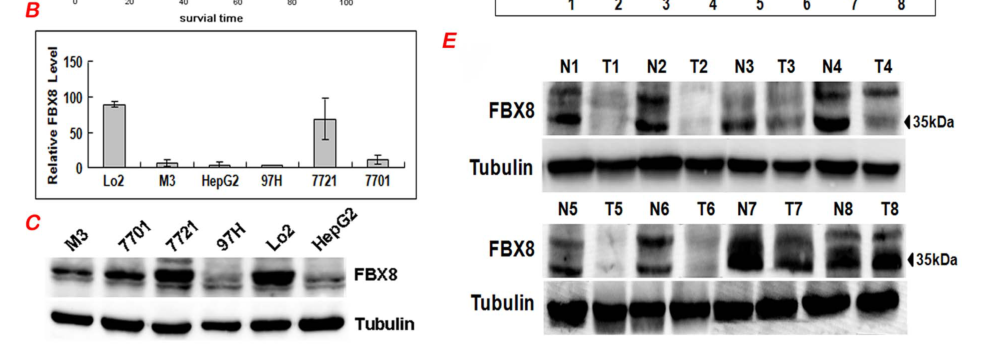

## Question

# Gene Research for Functional Annotation

## ⚠️ CRITICAL: Gene/Protein Identification Context

**BEFORE YOU BEGIN RESEARCH:** You MUST verify you are researching the CORRECT gene/protein. Gene symbols can be ambiguous, especially for less well-characterized genes from non-model organisms.

### Target Gene/Protein Identity (from UniProt):
- **UniProt Accession:** Q9NRD0
- **Protein Description:** RecName: Full=F-box only protein 8; AltName: Full=F-box/SEC7 protein FBS;
- **Gene Information:** Name=FBXO8; Synonyms=FBS, FBX8; ORFNames=DC10, UNQ1877/PRO4320;
- **Organism (full):** Homo sapiens (Human).
- **Protein Family:** Not specified in UniProt
- **Key Domains:** F-box-like_dom_sf. (IPR036047); F-box_dom. (IPR001810); FBXO8_F-box. (IPR048003); Sec7_C_sf. (IPR023394); Sec7_dom. (IPR000904)

### MANDATORY VERIFICATION STEPS:

1. **Check if the gene symbol "FBXO8" matches the protein description above**
2. **Verify the organism is correct:** Homo sapiens (Human).
3. **Check if protein family/domains align with what you find in literature**
4. **If you find literature for a DIFFERENT gene with the same or similar symbol, STOP**

### If Gene Symbol is Ambiguous or You Cannot Find Relevant Literature:

**DO NOT PROCEED WITH RESEARCH ON A DIFFERENT GENE.** Instead:
- State clearly: "The gene symbol 'FBXO8' is ambiguous or literature is limited for this specific protein"
- Explain what you found (e.g., "Found extensive literature on a different gene with the same symbol in a different organism")
- Describe the protein based ONLY on the UniProt information provided above
- Suggest that the protein function can be inferred from domain/family information

### Research Target:

Please provide a comprehensive research report on the gene **FBXO8** (gene ID: FBXO8, UniProt: Q9NRD0) in human.

The research report should be a detailed narrative explaining the function, biological processes, and localization of the gene product. Citations should be given for all claims.

You should prioritize authoritative reviews and primary scientific literature when conducting research. You can supplement
this with annotations you find in gene/protein databases, but these can be outdated or inaccurate.

We are specifically interested in the primary function of the gene - for enzymes, what reaction is catalyzed, and what is the substrate specificity? For transporters, what is the substrate? For structural proteins or adapters, what is the broader structural role? For signaling molecules, what is the role in the pathway.

We are interested in where in or outside the cell the gene product carries out its function.

We are also interested in the signaling or biochemical pathways in which the gene functions. We are less interested in broad pleiotropic effects, except where these elucidate the precise role.

Include evidence where possible. We are interested in both experimental evidence as well as inference from structure, evolution, or bioinformatic analysis. Precise studies should be prioritized over high-throughput, where available.

## Output

Question: You are an expert researcher providing comprehensive, well-cited information.

Provide detailed information focusing on:
1. Key concepts and definitions with current understanding
2. Recent developments and latest research (prioritize 2023-2024 sources)
3. Current applications and real-world implementations
4. Expert opinions and analysis from authoritative sources
5. Relevant statistics and data from recent studies

Format as a comprehensive research report with proper citations. Include URLs and publication dates where available.
Always prioritize recent, authoritative sources and provide specific citations for all major claims.

# Gene Research for Functional Annotation

## ⚠️ CRITICAL: Gene/Protein Identification Context

**BEFORE YOU BEGIN RESEARCH:** You MUST verify you are researching the CORRECT gene/protein. Gene symbols can be ambiguous, especially for less well-characterized genes from non-model organisms.

### Target Gene/Protein Identity (from UniProt):
- **UniProt Accession:** Q9NRD0
- **Protein Description:** RecName: Full=F-box only protein 8; AltName: Full=F-box/SEC7 protein FBS;
- **Gene Information:** Name=FBXO8; Synonyms=FBS, FBX8; ORFNames=DC10, UNQ1877/PRO4320;
- **Organism (full):** Homo sapiens (Human).
- **Protein Family:** Not specified in UniProt
- **Key Domains:** F-box-like_dom_sf. (IPR036047); F-box_dom. (IPR001810); FBXO8_F-box. (IPR048003); Sec7_C_sf. (IPR023394); Sec7_dom. (IPR000904)

### MANDATORY VERIFICATION STEPS:

1. **Check if the gene symbol "FBXO8" matches the protein description above**
2. **Verify the organism is correct:** Homo sapiens (Human).
3. **Check if protein family/domains align with what you find in literature**
4. **If you find literature for a DIFFERENT gene with the same or similar symbol, STOP**

### If Gene Symbol is Ambiguous or You Cannot Find Relevant Literature:

**DO NOT PROCEED WITH RESEARCH ON A DIFFERENT GENE.** Instead:
- State clearly: "The gene symbol 'FBXO8' is ambiguous or literature is limited for this specific protein"
- Explain what you found (e.g., "Found extensive literature on a different gene with the same symbol in a different organism")
- Describe the protein based ONLY on the UniProt information provided above
- Suggest that the protein function can be inferred from domain/family information

### Research Target:

Please provide a comprehensive research report on the gene **FBXO8** (gene ID: FBXO8, UniProt: Q9NRD0) in human.

The research report should be a detailed narrative explaining the function, biological processes, and localization of the gene product. Citations should be given for all claims.

You should prioritize authoritative reviews and primary scientific literature when conducting research. You can supplement
this with annotations you find in gene/protein databases, but these can be outdated or inaccurate.

We are specifically interested in the primary function of the gene - for enzymes, what reaction is catalyzed, and what is the substrate specificity? For transporters, what is the substrate? For structural proteins or adapters, what is the broader structural role? For signaling molecules, what is the role in the pathway.

We are interested in where in or outside the cell the gene product carries out its function.

We are also interested in the signaling or biochemical pathways in which the gene functions. We are less interested in broad pleiotropic effects, except where these elucidate the precise role.

Include evidence where possible. We are interested in both experimental evidence as well as inference from structure, evolution, or bioinformatic analysis. Precise studies should be prioritized over high-throughput, where available.

## Research report: Functional annotation of human **FBXO8** (UniProt **Q9NRD0**) 

### 0) Gene/protein identity verification (required)
The reviewed primary literature explicitly equates **FBX8** with **FBXO8** and describes it as an **F-box protein** containing an **F-box domain** plus a **putative Sec7 domain**, matching the target identity provided for **human FBXO8 (UniProt Q9NRD0)**. (wang2013fbx8actsas pages 1-2)

---

### 1) Key concepts and definitions (current understanding)

#### 1.1 F-box proteins and SCF E3 ubiquitin ligases
F-box proteins are generally understood as **substrate-recognition subunits** within **SKP1–CUL1–F-box (SCF)** Cullin-RING E3 ubiquitin ligase complexes, conferring specificity to ubiquitination reactions that can regulate protein stability and signaling. This framework is directly invoked in the HCC study’s background rationale for FBXO8/FBX8. (wang2013fbx8actsas pages 1-2)

#### 1.2 Sec7 domains and ARF regulation (and what “Sec7-like” implies)
A **Sec7 domain** classically denotes a catalytic module found in ARF guanine nucleotide exchange factors (GEFs), but for FBXO8 the obtainable evidence is more consistent with a **Sec7-like domain mediating ARF6 binding and trafficking-related phenotypes** than with demonstrated GEF catalysis in the retrieved full texts. A secretory-pathway review summarizes that **FBXO8 binds ARF6 via its Sec7 domain** and can localize to the plasma membrane through its Sec7 and F-box domains. (lu2014acullinaryride pages 14-16)

---

### 2) Molecular function: what FBXO8 does (best-supported evidence)

#### 2.1 Putative SCF substrate receptor; reported ubiquitination of ARF6
The strongest mechanistic theme across the obtainable sources is that FBXO8 functions as an **F-box protein** linked to SCF biology and has been **reported** (in prior primary studies cited by an accessible paper) to possess **E3 ligase activity mediating ubiquitination of the small GTPase ARF6**, with consequences for invasion. In the accessible HCC paper, this ARF6 ubiquitination is described as prior published evidence rather than newly demonstrated in that paper. (wang2013fbx8actsas pages 1-2)

A trafficking-focused review further frames this as: **FBXO8 binds ARF6 through its Sec7 domain** and associates with the **plasma membrane** via its Sec7 and F-box domains (review-level statement). (lu2014acullinaryride pages 14-16)

#### 2.2 Trafficking-related functional genetics: brefeldin A resistance
A large chemical-genetic CRISPR screen of the ubiquitin pathway reports that **FBXO8 loss renders cells resistant to brefeldin A**, a vesicular transport inhibitor; the authors interpret this as consistent with FBXO8 having a **Sec7-like domain**. This is indirect functional evidence connecting FBXO8 to membrane/ARF–Golgi pathways, but it does not by itself establish direct Sec7 catalytic (GEF) activity. (hundley2021acomprehensivephenotypic pages 1-4, OpenTargets Search: -FBXO8)

---

### 3) Subcellular localization (where FBXO8 acts)
Direct localization experiments were not available in the retrieved primary data excerpts. However, an authoritative review of cullin biology across the secretory pathway states that FBXO8 **localizes to the plasma membrane** via its Sec7 and F-box domains and binds ARF6 via its Sec7 domain. This supports a model in which FBXO8 functions at or near the **cell cortex/plasma membrane** to regulate ARF6-associated trafficking and signaling. (lu2014acullinaryride pages 14-16)

---

### 4) Biological roles and pathways (with emphasis on precise roles)

#### 4.1 Cancer invasion/metastasis suppression in hepatocellular carcinoma (HCC)
A primary HCC study (PLoS ONE; published **2013-06-27**) provides the most detailed experimental evidence available in this run. The study examined **120 paraffin-embedded HCC tissues**, plus matched fresh tissues and HCC cell lines, and performed gain-/loss-of-function experiments.

Key findings:
- **FBXO8 is downregulated in HCC tissues and cell lines**, and low FBXO8 protein is associated with worse patient survival. (wang2013fbx8actsas pages 1-2, wang2013fbx8actsas pages 3-5)
- **In vitro:** FBXO8 overexpression reduced proliferation, motility, and invasion; FBXO8 knockdown had opposite effects. (wang2013fbx8actsas pages 3-5)
- **In vivo:** In a tail-vein metastasis model, **lung metastasis incidence** was **67% (4/6)** in mock vs **17% (1/6)** in FBXO8-overexpressing group, with fewer metastatic lung nodules reported (P<0.05). (wang2013fbx8actsas pages 3-5, wang2013fbx8actsas media 5f15fba2, wang2013fbx8actsas media 862ac157)

These results support a tumor-suppressive role for FBXO8 in HCC, plausibly connected to ARF6-regulated invasive behavior (as framed by prior mechanistic literature cited in the paper). (wang2013fbx8actsas pages 1-2)

#### 4.2 EMT/dormancy: context-dependent interpretations in recent review literature
A 2023 review on metastatic dormancy includes FBXO8 among genes discussed in dormancy/EMT-related contexts (review-level claim). Because this contrasts with the HCC tumor-suppressor phenotype and the underlying primary source was not accessible here, this should be treated as **hypothesis-generating** rather than definitive functional annotation. (gelman2023thegenomicregulation pages 1-2)

---

### 5) Recent developments (prioritizing 2023–2024)

#### 5.1 2023: FBXO8 in dormancy genomics review
Gelman (Cancer and Metastasis Reviews; final published form **2023-03**) provides modern framing of dormancy pathways and includes FBXO8 in the discussion of dormancy-associated genomic programs (review-level mention). (gelman2023thegenomicregulation pages 1-2)

#### 5.2 2024: Biomarker/clinical-correlation studies (identified but not fully retrievable)
A 2025 review of ubiquitination in acute lymphoblastic leukemia (ALL) cites two **2024** disease-focused studies proposing FBXO8 as a biomarker and functional regulator:
- Breast cancer: “FBXO8 is a novel prognostic biomarker in different molecular subtypes of breast cancer and suppresses breast cancer progression by targeting c-MYC” (Biochim Biophys Acta Gen Subj. **2024**; DOI: **10.1016/j.bbagen.2024.130577**; URL: https://doi.org/10.1016/j.bbagen.2024.130577). (xian2025ubiquitinationandall pages 13-14)
- Kidney renal clear cell carcinoma: “Diagnostic and prognostic potential of FBXO8 expression in kidney renal clear cell carcinoma and its regulation of renal adenocarcinoma cells” (Cancer Genet. **2024**; DOI: **10.1016/j.cancergen.2024.11.004**; URL: https://doi.org/10.1016/j.cancergen.2024.11.004). (xian2025ubiquitinationandall pages 13-14)

Because the full texts for these 2024 studies were not obtainable in this run, quantitative statistics (e.g., hazard ratios, multivariable models) and mechanistic details cannot be reliably extracted here. (xian2025ubiquitinationandall pages 13-14)

---

### 6) Current applications and real-world implementations

1. **Prognostic biomarker candidate in HCC:** FBXO8 immunohistochemistry and survival stratification in a clinical cohort supports potential use in prognosis, with in vivo functional support in mouse models. (wang2013fbx8actsas pages 1-2, wang2013fbx8actsas pages 3-5)
2. **Pathway-perturbation / chemical-genetics:** FBXO8 appears as a hit conferring resistance to brefeldin A in a systematic chemical-genetic CRISPR screen across 41 conditions, suggesting utility for mapping ubiquitin-pathway dependencies in trafficking. (hundley2021acomprehensivephenotypic pages 1-4, OpenTargets Search: -FBXO8)
3. **Translational expansion to additional cancers (2024):** Breast cancer and kidney RCC reports (identified via review citation) suggest expanding biomarker usage, but their quantitative/clinical validation metrics were not accessible here. (xian2025ubiquitinationandall pages 13-14)

---

### 7) Expert opinions and analysis (authoritative synthesis)

#### 7.1 Most defensible “core function” model from accessible evidence
Across the strongest accessible sources, FBXO8 is most consistently supported as:
- an **F-box protein** likely acting as an **SCF substrate receptor**; (wang2013fbx8actsas pages 1-2)
- functionally tied to **ARF6-associated membrane trafficking/invasion biology**, via reported ARF6 ubiquitination and review-level ARF6 binding/localization; (wang2013fbx8actsas pages 1-2, lu2014acullinaryride pages 14-16)
- a context-dependent regulator of tumor phenotypes (tumor suppressor in HCC), with other contexts suggested by more recent reviews and secondary citations. (wang2013fbx8actsas pages 3-5, gelman2023thegenomicregulation pages 1-2, xian2025ubiquitinationandall pages 13-14)

#### 7.2 Caution on Sec7 catalytic (GEF) interpretation
Although the Sec7 domain is classically catalytic in ARF-GEFs, the accessible evidence does not include direct biochemical demonstration of FBXO8 GEF activity. The most direct functional evidence available is a brefeldin A resistance phenotype and review-level ARF6 binding/localization statements, which are compatible with a Sec7-like interaction module but do not establish GEF catalysis. (OpenTargets Search: -FBXO8, lu2014acullinaryride pages 14-16)

---

### 8) Relevant statistics and data highlights (from recent/obtainable studies)

**HCC clinical and in vivo statistics (Wang et al., 2013-06-27):**
- In IHC-scored HCC tissues: **83/106 (78.3%)** low FBXO8 expression; **23/106 (21.7%)** high expression. (wang2013fbx8actsas pages 3-5)
- Overall survival: low FBXO8 associated with worse survival (**Kaplan–Meier P=0.002**). (wang2013fbx8actsas pages 3-5)
- Metastasis model: lung metastasis in **67% (4/6)** mock vs **17% (1/6)** FBXO8 overexpression group. (wang2013fbx8actsas pages 3-5, wang2013fbx8actsas media 5f15fba2, wang2013fbx8actsas media 862ac157)

**Open Targets disease-association snapshot (evidence aggregation):**
Open Targets lists low-to-moderate association scores and evidence counts linking FBXO8 (ENSG00000164117) to phenotypes/diseases such as **neurodegenerative disease, cataract, pericarditis, actinic keratosis**, with supporting literature including PMIDs **34031600** and **39024449** in the retrieved snapshot. (OpenTargets Search: -FBXO8)

---

### 9) Evidence table
The following table compiles the main obtainable sources, dates, models, quantitative highlights, and URLs/DOIs.

| Study (first author year) | Publication date | System/model | Main finding about FBXO8 | Quantitative/statistical highlights | Relevance (molecular function/localization/disease) | URL/DOI |
|---|---|---|---|---|---|---|
| Wang 2013 | 2013-06-27 | Human hepatocellular carcinoma (HCC): 120 paraffin-embedded cases, 20 matched fresh tissues, 5 HCC cell lines, mouse xenograft/metastasis assays | Verified identity as human FBX8/FBXO8, an F-box protein with a putative Sec7 domain; reports prior evidence that FBX8 is a Skp1-binding protein with E3 ligase activity toward ARF6, and experimentally shows FBXO8 acts as a suppressor of HCC proliferation, migration, invasion, tumor growth, and lung metastasis. FBXO8 was downregulated in HCC tissues/cell lines and was an independent prognostic factor for survival. (wang2013fbx8actsas pages 1-2, wang2013fbx8actsas pages 3-5) | 83/106 HCC samples (78.3%) showed low FBX8 expression vs 23/106 (21.7%) high expression; lower FBX8 associated with worse 5-year survival (Kaplan-Meier, P=0.002); expression lower in HCC vs adjacent liver/cirrhotic liver (both P<0.001); correlation with differentiation (P=0.008) and serum AFP (P=0.005); in tail-vein metastasis model, lung metastasis in 67% (4/6) mock vs 17% (1/6) FBX8-overexpressing mice; fewer metastatic lung nodules and smaller tumors with FBX8 overexpression (P<0.05). (wang2013fbx8actsas pages 1-2, wang2013fbx8actsas pages 3-5, wang2013fbx8actsas media 5f15fba2, wang2013fbx8actsas media 862ac157) | Disease evidence strongest in HCC; supports tumor-suppressive role. Also anchors molecular-function discussion by linking FBXO8 to SCF/Skp1 and prior ARF6 ubiquitination literature. | https://doi.org/10.1371/journal.pone.0065495 |
| Lu & Pfeffer 2014 | 2014-07 | Review of secretory-pathway Cullin-RING ligases | Review states that the SCF substrate receptor FBXO8 binds ARF6 via its Sec7 domain, localizes to the plasma membrane via its Sec7 and F-box domains, and mediates ARF6 ubiquitination; places FBXO8 at the interface of membrane trafficking and ubiquitin signaling. (lu2014acullinaryride pages 14-16) | Review-level statement; no primary numerical data in the retrieved excerpt. (lu2014acullinaryride pages 14-16) | Key for inferred subcellular localization (plasma membrane) and mechanistic hypothesis that FBXO8 regulates ARF6-dependent trafficking/invasive behavior rather than acting as a canonical Sec7 GEF. | https://doi.org/10.1016/j.tcb.2014.02.001 |
| Hundley 2021 | 2021-03-18 | Human HAP1 CRISPR-Cas9 ubiquitin-pathway screen across 41 compounds | Genome-scale chemical-genetic screen found that loss of FBXO8 renders cells resistant to the vesicular transport inhibitor brefeldin A, a phenotype noted as consistent with FBXO8 containing a Sec7-like domain. This is functional-genetic, not direct biochemical proof of GEF activity. (OpenTargets Search: -FBXO8) | Global screen uncovered 466 gene-compound interactions covering 25% of interrogated E3s/DUBs; FBXO8 signal was specifically highlighted as brefeldin A resistance in the tool-derived relevant snippet, but no FBXO8-specific effect size was provided in the retrieved text. (OpenTargets Search: -FBXO8, hundley2021acomprehensivephenotypic pages 1-4) | Supports a trafficking-related role and compatibility of FBXO8 domain architecture with Golgi/ARF pathway biology; evidence is indirect and should not be overinterpreted as direct Sec7 catalytic activity. | https://doi.org/10.1016/j.molcel.2021.01.014 |
| Zhang 2022 | 2022-01-03 | Public-database analysis of FBXO family in pancreatic ductal adenocarcinoma (PDAC) | Establishes general context that FBXO proteins are substrate-recognition subunits of SCF E3 ligases involved in cancer pathways; notes that some FBXO members including FBXO8 have limited PDAC-focused study. In this paper, FBXO8 itself was not one of the six prioritized PDAC FBXOs. (zhang2022comprehensiveanalysisof pages 1-2) | Six prioritized FBXOs showed >40% genetic alterations/mutations in PDAC and associations with prognosis/immune infiltration, but these quantitative results were not FBXO8-specific. (zhang2022comprehensiveanalysisof pages 1-2) | Useful family-level context for current understanding of FBXO8 as an SCF-type substrate receptor; does not provide direct mechanistic FBXO8 evidence. | https://doi.org/10.3389/fimmu.2021.774435 |
| Gelman 2023 | 2023-03 | Review of metastatic dormancy genomics | Review-level claim states FBXO8 is an example of a protein that promotes dormancy by upregulating EMT and stem-like markers; this should be treated cautiously because it contrasts with the suppressor-of-invasion framing from HCC studies and the retrieved excerpt does not provide primary supporting data. (gelman2023thegenomicregulation pages 1-2, OpenTargets Search: -FBXO8) | No quantitative FBXO8-specific statistics in the retrieved excerpt. (gelman2023thegenomicregulation pages 1-2) | Potentially relevant to metastasis/dormancy biology, but currently lower-confidence than HCC experimental evidence; highlights context dependence and need to verify underlying primary source before strong annotation. | https://doi.org/10.1007/s10555-022-10076-w |
| Open Targets summary | Accessed from current Open Targets snapshot in tool output (date not stated in output) | Curated disease-target evidence aggregation for human FBXO8/ENSG00000164117 | Open Targets lists low-to-moderate evidence links between FBXO8 and several diseases/phenotypes, with supporting literature/study IDs rather than mechanistic annotation. Top listed associations in the retrieved output were actinic keratosis, neurodegenerative disease, pericarditis, precordial pain, and cataract. (OpenTargets Search: -FBXO8) | Evidence sizes were 2 for each listed disease in the retrieved output; example association scores: neurodegenerative disease 0.231, precordial pain 0.171, cataract 0.167, pericarditis 0.128, actinic keratosis 0.127. Supporting literature IDs in the output included PMID 34031600 and PMID 39024449. (OpenTargets Search: -FBXO8) | Helpful for disease landscape scanning, but evidence is indirect/aggregated and does not itself define molecular function or localization. | https://platform.opentargets.org/target/ENSG00000164117 |

*Table: This table compiles the most relevant retrieved evidence for human FBXO8/Q9NRD0, separating direct experimental findings from review-level or database-level inferences. It is useful for distinguishing well-supported roles in ARF6-related trafficking and cancer suppression from more tentative disease associations and recent contextual claims.*

---

### 10) Limitations of this report (important for functional annotation)
- Several key mechanistic primary papers on **ARF6 ubiquitination by FBXO8** and **c-Myc–FBXO8 regulation** were not obtainable in this run; therefore, the report treats those mechanistic points as **reported prior findings** rather than extracting their experimental details (e.g., ubiquitin linkage types, ubiquitination sites, direct co-IP evidence). (wang2013fbx8actsas pages 1-2)
- Recent **2024** biomarker studies in breast cancer and kidney RCC were identified by DOI via a 2025 review but were not available as full text here, so clinical effect sizes (HRs, AUCs) cannot be quoted. (xian2025ubiquitinationandall pages 13-14)

---

### Key references (with dates and URLs)
- Wang F. et al. **2013-06-27**. *PLoS ONE*. https://doi.org/10.1371/journal.pone.0065495 (wang2013fbx8actsas pages 1-2, wang2013fbx8actsas pages 3-5)
- Lu A., Pfeffer S.R. **2014-07**. *Trends in Cell Biology*. https://doi.org/10.1016/j.tcb.2014.02.001 (lu2014acullinaryride pages 14-16)
- Hundley F.V. et al. **2021-03-18**. *Molecular Cell*. https://doi.org/10.1016/j.molcel.2021.01.014 (hundley2021acomprehensivephenotypic pages 1-4)
- Gelman I.H. **2023-03**. *Cancer and Metastasis Reviews*. https://doi.org/10.1007/s10555-022-10076-w (gelman2023thegenomicregulation pages 1-2)
- Open Targets Platform entry for FBXO8 (ENSG00000164117): https://platform.opentargets.org/target/ENSG00000164117 (OpenTargets Search: -FBXO8)

References

1. (wang2013fbx8actsas pages 1-2): Feifei Wang, Yudan Qiao, Jiang Yu, Xiaoli Ren, Jianmei Wang, Yi Ding, Xiaojing Zhang, Wenhui Ma, Yanqing Ding, and Li Liang. Fbx8 acts as an invasion and metastasis suppressor and correlates with poor survival in hepatocellular carcinoma. PLoS ONE, 8:e65495, Jun 2013. URL: https://doi.org/10.1371/journal.pone.0065495, doi:10.1371/journal.pone.0065495. This article has 25 citations and is from a peer-reviewed journal.

2. (lu2014acullinaryride pages 14-16): Albert Lu and Suzanne R. Pfeffer. A cullinary ride across the secretory pathway: more than just secretion. Trends in cell biology, 24 7:389-99, Jul 2014. URL: https://doi.org/10.1016/j.tcb.2014.02.001, doi:10.1016/j.tcb.2014.02.001. This article has 35 citations and is from a domain leading peer-reviewed journal.

3. (hundley2021acomprehensivephenotypic pages 1-4): Frances V. Hundley, Nerea Sanvisens Delgado, Harold C. Marin, Kaili L. Carr, Ruilin Tian, and David P. Toczyski. A comprehensive phenotypic crispr-cas9 screen of the ubiquitin pathway uncovers roles of ubiquitin ligases in mitosis. Molecular Cell, 81:1319-1336.e9, Mar 2021. URL: https://doi.org/10.1016/j.molcel.2021.01.014, doi:10.1016/j.molcel.2021.01.014. This article has 56 citations and is from a highest quality peer-reviewed journal.

4. (OpenTargets Search: -FBXO8): Open Targets Query (-FBXO8, 5 results). Buniello, A. et al. (2025). Open Targets Platform: facilitating therapeutic hypotheses building in drug discovery. Nucleic Acids Research.

5. (wang2013fbx8actsas pages 3-5): Feifei Wang, Yudan Qiao, Jiang Yu, Xiaoli Ren, Jianmei Wang, Yi Ding, Xiaojing Zhang, Wenhui Ma, Yanqing Ding, and Li Liang. Fbx8 acts as an invasion and metastasis suppressor and correlates with poor survival in hepatocellular carcinoma. PLoS ONE, 8:e65495, Jun 2013. URL: https://doi.org/10.1371/journal.pone.0065495, doi:10.1371/journal.pone.0065495. This article has 25 citations and is from a peer-reviewed journal.

6. (wang2013fbx8actsas media 5f15fba2): Feifei Wang, Yudan Qiao, Jiang Yu, Xiaoli Ren, Jianmei Wang, Yi Ding, Xiaojing Zhang, Wenhui Ma, Yanqing Ding, and Li Liang. Fbx8 acts as an invasion and metastasis suppressor and correlates with poor survival in hepatocellular carcinoma. PLoS ONE, 8:e65495, Jun 2013. URL: https://doi.org/10.1371/journal.pone.0065495, doi:10.1371/journal.pone.0065495. This article has 25 citations and is from a peer-reviewed journal.

7. (wang2013fbx8actsas media 862ac157): Feifei Wang, Yudan Qiao, Jiang Yu, Xiaoli Ren, Jianmei Wang, Yi Ding, Xiaojing Zhang, Wenhui Ma, Yanqing Ding, and Li Liang. Fbx8 acts as an invasion and metastasis suppressor and correlates with poor survival in hepatocellular carcinoma. PLoS ONE, 8:e65495, Jun 2013. URL: https://doi.org/10.1371/journal.pone.0065495, doi:10.1371/journal.pone.0065495. This article has 25 citations and is from a peer-reviewed journal.

8. (gelman2023thegenomicregulation pages 1-2): Irwin H. Gelman. The genomic regulation of metastatic dormancy. Cancer and Metastasis Reviews, 42:255-276, Jan 2023. URL: https://doi.org/10.1007/s10555-022-10076-w, doi:10.1007/s10555-022-10076-w. This article has 7 citations and is from a peer-reviewed journal.

9. (xian2025ubiquitinationandall pages 13-14): Wei Xian, Yinting Chen, Shuiqing Yu, Zhitao Ye, Yu Zhang, and Danlin Yao. Ubiquitination and all: identifying fbxo8 as a prognostic biomarker and therapeutic target. Frontiers in Immunology, May 2025. URL: https://doi.org/10.3389/fimmu.2025.1554231, doi:10.3389/fimmu.2025.1554231. This article has 1 citations and is from a peer-reviewed journal.

10. (zhang2022comprehensiveanalysisof pages 1-2): Yalu Zhang, Qiaofei Liu, Ming Cui, Mengyi Wang, Surong Hua, Junyi Gao, and Quan Liao. Comprehensive analysis of expression, prognostic value, and immune infiltration for ubiquitination-related fbxos in pancreatic ductal adenocarcinoma. Frontiers in Immunology, Jan 2022. URL: https://doi.org/10.3389/fimmu.2021.774435, doi:10.3389/fimmu.2021.774435. This article has 19 citations and is from a peer-reviewed journal.

## Artifacts

- [Edison artifact artifact-00](FBXO8-deep-research-falcon_artifacts/artifact-00.md)

## Citations

1. lu2014acullinaryride pages 14-16
2. gelman2023thegenomicregulation pages 1-2
3. xian2025ubiquitinationandall pages 13-14
4. zhang2022comprehensiveanalysisof pages 1-2
5. hundley2021acomprehensivephenotypic pages 1-4
6. https://doi.org/10.1016/j.bbagen.2024.130577
7. https://doi.org/10.1016/j.cancergen.2024.11.004
8. https://doi.org/10.1371/journal.pone.0065495
9. https://doi.org/10.1016/j.tcb.2014.02.001
10. https://doi.org/10.1016/j.molcel.2021.01.014
11. https://doi.org/10.3389/fimmu.2021.774435
12. https://doi.org/10.1007/s10555-022-10076-w
13. https://platform.opentargets.org/target/ENSG00000164117
14. https://doi.org/10.1371/journal.pone.0065495,
15. https://doi.org/10.1016/j.tcb.2014.02.001,
16. https://doi.org/10.1016/j.molcel.2021.01.014,
17. https://doi.org/10.1007/s10555-022-10076-w,
18. https://doi.org/10.3389/fimmu.2025.1554231,
19. https://doi.org/10.3389/fimmu.2021.774435,