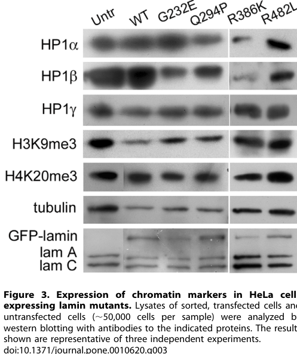

## Question

# Gene Research for Functional Annotation

## ⚠️ CRITICAL: Gene/Protein Identification Context

**BEFORE YOU BEGIN RESEARCH:** You MUST verify you are researching the CORRECT gene/protein. Gene symbols can be ambiguous, especially for less well-characterized genes from non-model organisms.

### Target Gene/Protein Identity (from UniProt):
- **UniProt Accession:** Q5XX13
- **Protein Description:** RecName: Full=F-box/WD repeat-containing protein 10; AltName: Full=F-box and WD-40 domain-containing protein 10; AltName: Full=Ubiquitin ligase-specificity factor;
- **Gene Information:** Name=FBXW10;
- **Organism (full):** Homo sapiens (Human).
- **Protein Family:** Not specified in UniProt
- **Key Domains:** F-box-like_dom_sf. (IPR036047); SCF_subunit_WD-repeat. (IPR051075); WD40/YVTN_repeat-like_dom_sf. (IPR015943); WD40_PAC1. (IPR020472); WD40_repeat_CS. (IPR019775)

### MANDATORY VERIFICATION STEPS:

1. **Check if the gene symbol "FBXW10" matches the protein description above**
2. **Verify the organism is correct:** Homo sapiens (Human).
3. **Check if protein family/domains align with what you find in literature**
4. **If you find literature for a DIFFERENT gene with the same or similar symbol, STOP**

### If Gene Symbol is Ambiguous or You Cannot Find Relevant Literature:

**DO NOT PROCEED WITH RESEARCH ON A DIFFERENT GENE.** Instead:
- State clearly: "The gene symbol 'FBXW10' is ambiguous or literature is limited for this specific protein"
- Explain what you found (e.g., "Found extensive literature on a different gene with the same symbol in a different organism")
- Describe the protein based ONLY on the UniProt information provided above
- Suggest that the protein function can be inferred from domain/family information

### Research Target:

Please provide a comprehensive research report on the gene **FBXW10** (gene ID: FBXW10, UniProt: Q5XX13) in human.

The research report should be a detailed narrative explaining the function, biological processes, and localization of the gene product. Citations should be given for all claims.

You should prioritize authoritative reviews and primary scientific literature when conducting research. You can supplement
this with annotations you find in gene/protein databases, but these can be outdated or inaccurate.

We are specifically interested in the primary function of the gene - for enzymes, what reaction is catalyzed, and what is the substrate specificity? For transporters, what is the substrate? For structural proteins or adapters, what is the broader structural role? For signaling molecules, what is the role in the pathway.

We are interested in where in or outside the cell the gene product carries out its function.

We are also interested in the signaling or biochemical pathways in which the gene functions. We are less interested in broad pleiotropic effects, except where these elucidate the precise role.

Include evidence where possible. We are interested in both experimental evidence as well as inference from structure, evolution, or bioinformatic analysis. Precise studies should be prioritized over high-throughput, where available.

## Output

Question: You are an expert researcher providing comprehensive, well-cited information.

Provide detailed information focusing on:
1. Key concepts and definitions with current understanding
2. Recent developments and latest research (prioritize 2023-2024 sources)
3. Current applications and real-world implementations
4. Expert opinions and analysis from authoritative sources
5. Relevant statistics and data from recent studies

Format as a comprehensive research report with proper citations. Include URLs and publication dates where available.
Always prioritize recent, authoritative sources and provide specific citations for all major claims.

# Gene Research for Functional Annotation

## ⚠️ CRITICAL: Gene/Protein Identification Context

**BEFORE YOU BEGIN RESEARCH:** You MUST verify you are researching the CORRECT gene/protein. Gene symbols can be ambiguous, especially for less well-characterized genes from non-model organisms.

### Target Gene/Protein Identity (from UniProt):
- **UniProt Accession:** Q5XX13
- **Protein Description:** RecName: Full=F-box/WD repeat-containing protein 10; AltName: Full=F-box and WD-40 domain-containing protein 10; AltName: Full=Ubiquitin ligase-specificity factor;
- **Gene Information:** Name=FBXW10;
- **Organism (full):** Homo sapiens (Human).
- **Protein Family:** Not specified in UniProt
- **Key Domains:** F-box-like_dom_sf. (IPR036047); SCF_subunit_WD-repeat. (IPR051075); WD40/YVTN_repeat-like_dom_sf. (IPR015943); WD40_PAC1. (IPR020472); WD40_repeat_CS. (IPR019775)

### MANDATORY VERIFICATION STEPS:

1. **Check if the gene symbol "FBXW10" matches the protein description above**
2. **Verify the organism is correct:** Homo sapiens (Human).
3. **Check if protein family/domains align with what you find in literature**
4. **If you find literature for a DIFFERENT gene with the same or similar symbol, STOP**

### If Gene Symbol is Ambiguous or You Cannot Find Relevant Literature:

**DO NOT PROCEED WITH RESEARCH ON A DIFFERENT GENE.** Instead:
- State clearly: "The gene symbol 'FBXW10' is ambiguous or literature is limited for this specific protein"
- Explain what you found (e.g., "Found extensive literature on a different gene with the same symbol in a different organism")
- Describe the protein based ONLY on the UniProt information provided above
- Suggest that the protein function can be inferred from domain/family information

### Research Target:

Please provide a comprehensive research report on the gene **FBXW10** (gene ID: FBXW10, UniProt: Q5XX13) in human.

The research report should be a detailed narrative explaining the function, biological processes, and localization of the gene product. Citations should be given for all claims.

You should prioritize authoritative reviews and primary scientific literature when conducting research. You can supplement
this with annotations you find in gene/protein databases, but these can be outdated or inaccurate.

We are specifically interested in the primary function of the gene - for enzymes, what reaction is catalyzed, and what is the substrate specificity? For transporters, what is the substrate? For structural proteins or adapters, what is the broader structural role? For signaling molecules, what is the role in the pathway.

We are interested in where in or outside the cell the gene product carries out its function.

We are also interested in the signaling or biochemical pathways in which the gene functions. We are less interested in broad pleiotropic effects, except where these elucidate the precise role.

Include evidence where possible. We are interested in both experimental evidence as well as inference from structure, evolution, or bioinformatic analysis. Precise studies should be prioritized over high-throughput, where available.

## Research Report: Human **FBXW10** (UniProt **Q5XX13**) — Functional Annotation, Evidence, and Current Understanding

### 1) Target verification (gene/protein identity)
The literature evidence retrieved matches the specified target: **human FBXW10** encoding **F-box/WD repeat-containing protein 10**, UniProt **Q5XX13**. A curated interactome/UPS resource explicitly lists **FBXW10** as **UniProt Q5XX13**, **1052 aa**, annotated as an **E3 CRL adaptor** with **F-box domain + WD repeats**, consistent with an SCF-type substrate receptor architecture (Poirson et al., 2017-10, FEBS J; https://doi.org/10.1111/febs.14193) (poirson2017mappingtheinteractome pages 23-23). Review literature also classifies FBXW10 as a **WD40-repeat F-box (FBXW-class) protein** (Sahasrabuddhe & Elenitoba-Johnson, 2015-01, Immunol Rev; https://doi.org/10.1111/imr.12236) (sahasrabuddhe2015roleofthe pages 4-5).

### 2) Key concepts and definitions (current understanding)

#### 2.1 SCF E3 ubiquitin ligases and F-box proteins
F-box proteins are best understood as **substrate-recognition subunits** of **SCF (SKP1–CUL1–F-box)** cullin-RING E3 ubiquitin ligase complexes, where the F-box motif supports binding to Skp1 and additional domains (e.g., WD40 repeats) support substrate recruitment. In the UPS interactome mapping paper, FBXW10 is explicitly categorized as an **E3 CRL adaptor** with **F-box + WD repeats** (poirson2017mappingtheinteractome pages 23-23). In a hematologic malignancy review, FBXW10 is described as a **WD40-repeat F-box protein** (FBXW class) and discussed in the context of substrate specificity in SCF E3 ligases (sahasrabuddhe2015roleofthe pages 4-5).

#### 2.2 Domain architecture and inferred biochemical role
FBXW10’s **F-box** plus **WD40/β-propeller** domain architecture is typical of F-box substrate receptors, in which WD40 repeats form a propeller-like scaffold enabling selective protein–protein interactions. Consistent with this, a 2023 hereditary thyroid cancer genetics study interpreted a disease-candidate variant (p.Ile440del) within the **WD-repeat propeller**, using an AlphaFold model for **human FBXW10 (Q5XX13)** and noting high model confidence (pLDDT > 90) near the affected region (Majdalani et al., 2023-05, IJMS; https://doi.org/10.3390/ijms24098233) (majdalani2023novelsusceptibilitygenes pages 5-7).

### 3) Experimentally supported functional evidence (what FBXW10 does)

#### 3.1 Strongest direct experimental evidence: FBXW10 links to proteasome-dependent HP1α/HP1β depletion in a laminopathy-relevant cellular context
A central mechanistic study (Chaturvedi & Parnaik, 2010-05, PLoS ONE; https://doi.org/10.1371/journal.pone.0010620) reports that lamin A rod-domain disease mutants in HeLa cells are associated with proteasomal depletion of **heterochromatin protein 1 (HP1) isoforms** and that **FBXW10** is induced and sufficient to drive depletion of specific HP1 isoforms (chaturvedi2010laminarod pages 1-2).

Key findings:
- **FBXW10 induction**: qRT-PCR (Table 3) shows FBXW10 transcript levels increased in lamin-mutant contexts (e.g., **G232E: 5.64 ± 0.49** vs GFP control **1.71 ± 0.43**; **R386K: 2.35 ± 0.44**), consistent with several-fold induction (chaturvedi2010laminarod pages 5-7).
- **Isoform specificity**: Ectopic expression of FBXW10 caused depletion of **HP1α and HP1β** but not **HP1γ** (HP1c) (chaturvedi2010laminarod pages 1-2, chaturvedi2010laminarod pages 5-7).
- **Cell-level penetrance**: FBXW10 overexpression depleted HP1α/β in **~80–90%** of cells (chaturvedi2010laminarod pages 5-7).
- **Proteasome dependence / pharmacologic rescue**: Proteasome inhibitors restored HP1 and partially corrected lamin mutant phenotypes. For example, MG132 increased nuclear rim localization of lamin mutants from **19.6% ± 6.09 → 83.2% ± 6.11** (G232E) and **15.4% ± 5.11 → 61.0% ± 6.40** (R386K); lactacystin also improved rim localization (**G232E 73.2% ± 9.07; R386K 39.8% ± 8.57**) (chaturvedi2010laminarod pages 5-7). In the same work, HP1-positive-cell frequencies (immunofluorescence) were markedly restored by MG132/lactacystin for multiple lamin mutants (chaturvedi2010laminarod pages 2-4).

Interpretation for functional annotation:
- These results support FBXW10 as an **E3-ligase adaptor/substrate receptor** that can promote (directly or indirectly via SCF) the **ubiquitin–proteasome-dependent turnover** of **HP1α/HP1β** under specific cellular conditions (chaturvedi2010laminarod pages 1-2, chaturvedi2010laminarod pages 5-7, chaturvedi2010laminarod pages 2-4).
- However, the study does **not** establish purified-complex biochemistry (e.g., reconstituted SCF-FBXW10 ubiquitination of HP1 in vitro) and is largely based on induction/overexpression and proteasome-inhibitor phenotypic rescue; thus, HP1 isoforms are best treated as **supported candidate substrates/affected proteins** rather than definitively validated direct substrates of SCF-FBXW10 (chaturvedi2010laminarod pages 1-2, chaturvedi2010laminarod pages 5-7).

**Visual evidence (figures/tables)**: The paper contains Western blot and tabular qRT-PCR evidence of HP1 depletion/FBXW10 induction and the ability of FBXW10 overexpression to deplete HP1α/β (chaturvedi2010laminarod media 9af6f79a, chaturvedi2010laminarod media 7bc1e356, chaturvedi2010laminarod media 2d73f981).

#### 3.2 Subcellular localization and cellular compartment context
The functional evidence above places the FBXW10-associated phenotype in **nuclear organization/heterochromatin maintenance pathways**, via effects on HP1α/β and lamin mutant nuclear morphology in cultured cells (chaturvedi2010laminarod pages 1-2, chaturvedi2010laminarod pages 2-4). While the provided excerpts do not directly map FBXW10 itself to a specific subcellular compartment by microscopy under endogenous expression, the implicated pathway is nuclear: HP1 proteins are heterochromatin-associated and lamin A mutants perturb nuclear architecture (chaturvedi2010laminarod pages 1-2, chaturvedi2010laminarod pages 2-4).

### 4) Human genetics and disease associations (2023–2024 emphasis where possible)

#### 4.1 Familial non-medullary thyroid cancer (FNMTC) candidate variant (2023)
A 2023 whole-exome sequencing study of a large consanguineous kindred with FNMTC nominated FBXW10 among candidate susceptibility genes (Majdalani et al., 2023-05; https://doi.org/10.3390/ijms24098233) (majdalani2023novelsusceptibilitygenes pages 4-5).

- Variant: **FBXW10 c.1317_1319delCAT (p.Ile440del; chr17:18661699)**, heterozygous in multiple family members and discussed as a candidate with incomplete penetrance (majdalani2023novelsusceptibilitygenes pages 5-7, majdalani2023novelsusceptibilitygenes pages 4-5).
- Structural interpretation: Ile440 is evolutionarily conserved down to placental mammals and lies in a **β-hairpin of a WD-propeller blade**; deletion was predicted to disrupt local hydrogen-bond networks; AlphaFold confidence around the region was reported as **pLDDT > 90** (majdalani2023novelsusceptibilitygenes pages 5-7).
- Importantly, the authors ranked FBXW10 as a **second-priority** candidate relative to ARHGEF28, noting low normal thyroid expression and lack of a connected PPI network to known thyroid pathways in their analysis (majdalani2023novelsusceptibilitygenes pages 9-10).

This constitutes **recent genetics evidence** suggesting potential involvement in thyroid cancer predisposition, but not causal proof (majdalani2023novelsusceptibilitygenes pages 5-7, majdalani2023novelsusceptibilitygenes pages 9-10).

#### 4.2 Hematologic malignancy genetics: mutations reported in T-PLL (reviewed)
A 2015 review of the ubiquitin-proteasome system in hematologic malignancies reports that FBXW10 harbors **missense, nonsense, and frameshift mutations** in **T-cell prolymphocytic leukemia (T-PLL)** (e.g., **R318N, R416*, K966fs**) (Sahasrabuddhe & Elenitoba-Johnson, 2015-01; https://doi.org/10.1111/imr.12236) (sahasrabuddhe2015roleofthe pages 4-5). The review emphasizes that **very little is known** about FBXW10’s function and that identifying substrates would be critical to understand consequences of inactivation in T-PLL (sahasrabuddhe2015roleofthe pages 4-5). 

### 5) Recent developments and latest research (prioritizing 2023–2024)

#### 5.1 Pan-cancer bioinformatics: expression/prognosis associations (2024)
A 2024 pan-cancer analysis of the FBXW family reports that FBXW10 shows tumor-type-specific expression differences (Huang et al., 2024-12, Front Immunol; https://doi.org/10.3389/fimmu.2022.1084339) (huang2024pancanceranalysisof pages 5-7).

- Expression: FBXW10 is reported as higher in several cancers (e.g., **LUAD, LUSC, LIHC, PRAD, STAD**) and reduced in **KICH, KIRC, THCA** versus normal tissues (huang2024pancanceranalysisof pages 5-7).
- Prognosis statements in the excerpt: FBXW10 is described as a “dangerous factor in **KIRC**” and high FBXW10 expression associated with worse prognosis in **KIRP, THCA, THYM** (huang2024pancanceranalysisof pages 7-10).
- Stemness metrics: FBXW10 expression was negatively related with **DNAss in OV** and negatively related with **RNAss in THYM** (huang2024pancanceranalysisof pages 7-10).

Limitations: The accessible text excerpt does not provide hazard ratios, coefficients, or p-values; those may be contained in the figures or supplementary material (huang2024pancanceranalysisof pages 7-10, huang2024pancanceranalysisof pages 5-7).

#### 5.2 Human genetics + protein structure inference (2023)
Majdalani et al. (2023) exemplifies a current trend in functional annotation that combines **human genetics** with **AlphaFold-based structural reasoning** to prioritize candidate variants in less-characterized proteins, here mapping p.Ile440del to a WD-propeller structural element with high confidence (majdalani2023novelsusceptibilitygenes pages 5-7).

### 6) Current applications and real-world implementations

#### 6.1 Biomarker-style applications in oncology and human genetics
Based on the evidence available in this run, current “applications” of FBXW10 are primarily:
- **Candidate-gene prioritization** in hereditary cancer studies using WES plus segregation and structural prediction (e.g., FNMTC candidate p.Ile440del) (majdalani2023novelsusceptibilitygenes pages 5-7, majdalani2023novelsusceptibilitygenes pages 4-5).
- **Pan-cancer transcriptomic association analyses** to identify cancer types where FBXW10 expression correlates with stage/prognosis features, potentially motivating future validation as a biomarker or mechanistic node (huang2024pancanceranalysisof pages 7-10, huang2024pancanceranalysisof pages 5-7).

#### 6.2 Mechanistic inference for nuclear architecture/heterochromatin biology
Chaturvedi & Parnaik (2010) provide a conceptual application in cell biology: using lamin mutant phenotypes and proteasome modulation to infer that FBXW10 is part of a pathway connecting **nuclear lamina disruption** to **proteasome-dependent loss of heterochromatin regulators (HP1α/β)** (chaturvedi2010laminarod pages 1-2, chaturvedi2010laminarod pages 5-7, chaturvedi2010laminarod pages 2-4). While not a “clinical implementation,” it is a real-world experimental implementation informing laminopathy-related hypotheses.

### 7) Expert opinions and authoritative analysis (from retrieved sources)
A key expert/authoritative assessment comes from the Immunological Reviews article, which notes reported FBXW10 mutations in T-PLL but explicitly states that **“very little is known”** about FBXW10 function and that substrate identification would be important for understanding disease consequences (sahasrabuddhe2015roleofthe pages 4-5). This aligns with the evidence landscape in this run: strong domain-based inference and one direct cellular study, but limited substrate-validated biochemistry.

### 8) Summary of quantitative/statistical evidence (from recent/available studies)
- **FBXW10 induction (qRT-PCR)** in lamin-mutant contexts: values ranging from ~1.7 (controls) to **5.64 ± 0.49** (G232E), and **2.35 ± 0.44** (R386K) (chaturvedi2010laminarod pages 5-7).
- **Phenotype penetrance**: FBXW10 overexpression depleted HP1α/β in **~80–90%** of cells (chaturvedi2010laminarod pages 5-7).
- **Proteasome inhibitor rescue**: MG132 increased rim localization for lamin mutants (e.g., **19.6% → 83.2%** for G232E), with additional rescue by lactacystin (chaturvedi2010laminarod pages 5-7). HP1-positive-cell frequencies in lamin mutant-expressing cells increased substantially with MG132/lactacystin across multiple mutants (chaturvedi2010laminarod pages 2-4).
- **Human genetics**: a specific 2023 candidate variant **p.Ile440del** with genomic coordinate (**chr17:18661699**) and conservation/structural interpretation using AlphaFold confidence (pLDDT > 90) (majdalani2023novelsusceptibilitygenes pages 5-7).

### 9) Evidence table
The following table consolidates the evidence types, assays, key quantitative results, and limitations.

| Evidence type | Key finding | System/assay | Quantitative/statistical detail | Source (authors, year, journal) | URL/DOI | Notes/limitations |
|---|---|---|---|---|---|---|
| Domain/complex | Human FBXW10 is identified as UniProt Q5XX13, a 1052-aa F-box/WD-repeat protein annotated as an “E3 CRL adaptor,” consistent with an SCF-type substrate receptor architecture. (poirson2017mappingtheinteractome pages 23-23) | Proteome/interactome annotation table | Length reported as 1052 aa; row annotated with F-box domain and WD repeats. (poirson2017mappingtheinteractome pages 23-23) | Poirson et al., 2017, *The FEBS Journal* | https://doi.org/10.1111/febs.14193 | Classification/annotation evidence rather than direct biochemical demonstration of SCF assembly or substrate binding. |
| Substrate/function | Lamin A rod-domain mutants induce FBXW10, and ectopic FBXW10 is sufficient to deplete HP1α and HP1β, but not HP1γ, supporting a role in selective ubiquitin-proteasome-mediated turnover of HP1 isoforms. (chaturvedi2010laminarod pages 1-2, chaturvedi2010laminarod pages 5-7) | HeLa cell expression studies; immunofluorescence; western blot; qRT-PCR | FBXW10 qRT-PCR: GFP 1.71 ± 0.43, WT lamin A 1.66 ± 0.70, G232E 5.64 ± 0.49, R386K 2.35 ± 0.44; ectopic FBXW10 depleted HP1α/β in 80–90% of cells. (chaturvedi2010laminarod pages 5-7) | Chaturvedi & Parnaik, 2010, *PLoS ONE* | https://doi.org/10.1371/journal.pone.0010620 | Evidence is from overexpression/mutant-lamin context; direct ubiquitination of HP1 by purified SCF-FBXW10 was not shown. |
| Substrate/rescue | HP1α/β loss in lamin-mutant cells is proteasome-dependent, and proteasome inhibition restores HP1 and partially rescues lamin/emerin nuclear-rim localization, linking FBXW10-associated phenotype to proteasomal degradation. (chaturvedi2010laminarod pages 1-2, chaturvedi2010laminarod pages 5-7, chaturvedi2010laminarod pages 2-4) | HeLa cells treated with MG132 or lactacystin; immunofluorescence; western blot | MG132 restored G232E rim localization from 19.6% ± 6.09 to 83.2% ± 6.11 and R386K from 15.4% ± 5.11 to 61.0% ± 6.40; lactacystin restored G232E to 73.2% ± 9.07 and R386K to 39.8% ± 8.57; HP1-positive cells also increased markedly with inhibitors. (chaturvedi2010laminarod pages 5-7, chaturvedi2010laminarod pages 2-4) | Chaturvedi & Parnaik, 2010, *PLoS ONE* | https://doi.org/10.1371/journal.pone.0010620 | Rescue implicates the proteasome but does not by itself prove FBXW10 is the only E3 responsible. |
| Disease/genetics | FBXW10 has been reported mutated in T-cell prolymphocytic leukemia (T-PLL), supporting possible disease relevance of loss/alteration of function. (sahasrabuddhe2015roleofthe pages 4-5) | Literature review of hematologic malignancy genetics | Reported variants include missense, nonsense, and frameshift changes such as R318N, R416*, and K966fs. (sahasrabuddhe2015roleofthe pages 4-5) | Sahasrabuddhe & Elenitoba-Johnson, 2015, *Immunological Reviews* | https://doi.org/10.1111/imr.12236 | Review explicitly states that very little is known about FBXW10 biology and substrates; mutation significance remains uncertain. |
| Disease/variant interpretation | In familial non-medullary thyroid cancer (FNMTC), FBXW10 was nominated as a candidate susceptibility gene carrying a heterozygous in-frame deletion p.Ile440del. (majdalani2023novelsusceptibilitygenes pages 5-7, majdalani2023novelsusceptibilitygenes pages 4-5) | Whole-exome sequencing and pedigree segregation analysis | Variant: c.1317_1319delCAT; p.Ile440del; chr17:18661699; segregated in heterozygous state in multiple family members with incomplete penetrance. (majdalani2023novelsusceptibilitygenes pages 5-7, majdalani2023novelsusceptibilitygenes pages 4-5) | Majdalani et al., 2023, *International Journal of Molecular Sciences* | https://doi.org/10.3390/ijms24098233 | Candidate-gene evidence only; authors prioritized ARHGEF28 over FBXW10 as the strongest causal candidate. |
| Domain/structure | The p.Ile440del candidate variant lies in the WD-repeat propeller region, where structural modeling predicts disruption of a beta-hairpin within a propeller blade. (majdalani2023novelsusceptibilitygenes pages 5-7) | Conservation analysis and AlphaFold-based structural interpretation | Ile440 conserved down to placental mammals; AlphaFold model around site reported with pLDDT > 90; ACMG evidence listed as PM2, PM4. (majdalani2023novelsusceptibilitygenes pages 5-7) | Majdalani et al., 2023, *International Journal of Molecular Sciences* | https://doi.org/10.3390/ijms24098233 | Inference is structural/computational, not functional validation in cells or animals. |
| Expression/cancer association | FBXW10 shows differential expression across cancers in pan-cancer analysis, with higher expression in several tumor types and lower expression in some kidney cancers and thyroid cancer. (huang2024pancanceranalysisof pages 5-7) | TCGA-based pan-cancer expression analysis | Higher in LUAD, LUSC, LIHC, PRAD, STAD; reduced in KICH, KIRC, THCA versus normal tissues. (huang2024pancanceranalysisof pages 5-7) | Huang et al., 2024, *Frontiers in Immunology* | https://doi.org/10.3389/fimmu.2022.1084339 | Expression correlations do not establish mechanism, substrate specificity, or causal function in these cancers. |

*Table: This table summarizes the main published evidence supporting functional annotation of human FBXW10/Q5XX13, including domain architecture, experimentally supported substrate-linked effects, disease-associated variants, and cancer-expression findings. It is useful for distinguishing direct evidence from inference and highlighting the major limitations of the current literature.*

### 10) Practical functional annotation (evidence-weighted)

**Most defensible annotation (supported by evidence):** FBXW10 is an **F-box/WD-repeat cullin-RING E3 ligase adaptor/substrate receptor** (consistent with SCF-type E3 complexes) and can promote **proteasome-dependent depletion of HP1α/HP1β** in a lamin-mutant nuclear stress context (poirson2017mappingtheinteractome pages 23-23, chaturvedi2010laminarod pages 1-2, chaturvedi2010laminarod pages 5-7).

**Likely cellular role (inference plus context):** Through protein–protein interactions mediated by its WD-repeat propeller, FBXW10 likely contributes to selective ubiquitination pathways affecting **nuclear/heterochromatin proteins**, but direct substrate validation beyond the HP1-linked cellular evidence remains limited in the retrieved corpus (chaturvedi2010laminarod pages 1-2, sahasrabuddhe2015roleofthe pages 4-5).

**Disease relevance (current status):** FBXW10 has (i) **reported mutations in T-PLL** (reviewed) (sahasrabuddhe2015roleofthe pages 4-5), (ii) a 2023 **candidate hereditary thyroid cancer variant** with structural rationale but not definitive causality (majdalani2023novelsusceptibilitygenes pages 5-7, majdalani2023novelsusceptibilitygenes pages 9-10), and (iii) **pan-cancer expression/prognostic associations** without mechanistic resolution in the accessible excerpt (huang2024pancanceranalysisof pages 7-10, huang2024pancanceranalysisof pages 5-7).

### 11) External authoritative database URLs (for reference; not used as primary evidence here)
These database pages can be consulted for curated annotations, isoforms, and cross-references:
- UniProt Q5XX13 (FBXW10): https://www.uniprot.org/uniprotkb/Q5XX13
- InterPro (domain signatures; e.g., F-box-like, WD40 repeats): https://www.ebi.ac.uk/interpro/

### 12) Key limitations and evidence gaps
- The strongest mechanistic evidence in the retrieved corpus is from **2010**, and it is largely cellular/phenotypic; **direct biochemical demonstration** of SCF-FBXW10 ubiquitination of specific substrates (including HP1 isoforms) was not available in the retrieved texts (chaturvedi2010laminarod pages 1-2, chaturvedi2010laminarod pages 5-7).
- Recent (2023–2024) evidence accessible here is primarily **human genetics/structure inference** and **TCGA-scale expression/prognosis association**, which are valuable for hypothesis generation but do not substitute for substrate validation and pathway dissection (majdalani2023novelsusceptibilitygenes pages 5-7, huang2024pancanceranalysisof pages 7-10).

### References (retrieved and cited)
- Chaturvedi P, Parnaik VK. 2010-05. *PLoS ONE*. “Lamin A Rod Domain Mutants Target Heterochromatin Protein 1α and β for Proteasomal Degradation by Activation of F-Box Protein, FBXW10.” https://doi.org/10.1371/journal.pone.0010620 (chaturvedi2010laminarod pages 1-2, chaturvedi2010laminarod pages 5-7, chaturvedi2010laminarod pages 2-4).
- Poirson J, et al. 2017-10. *The FEBS Journal*. “Mapping the interactome of HPV E6 and E7 oncoproteins with the ubiquitin-proteasome system.” https://doi.org/10.1111/febs.14193 (poirson2017mappingtheinteractome pages 23-23).
- Sahasrabuddhe AA, Elenitoba-Johnson KSJ. 2015-01. *Immunological Reviews*. “Role of the ubiquitin proteasome system in hematologic malignancies.” https://doi.org/10.1111/imr.12236 (sahasrabuddhe2015roleofthe pages 4-5).
- Majdalani P, et al. 2023-05. *International Journal of Molecular Sciences*. “Novel Susceptibility Genes Drive Familial Non-Medullary Thyroid Cancer in a Large Consanguineous Kindred.” https://doi.org/10.3390/ijms24098233 (majdalani2023novelsusceptibilitygenes pages 5-7, majdalani2023novelsusceptibilitygenes pages 4-5, majdalani2023novelsusceptibilitygenes pages 9-10).
- Huang T, et al. 2024-12. *Frontiers in Immunology*. “Pan-cancer analysis of FBXW family with potential implications in prognosis and immune infiltration.” https://doi.org/10.3389/fimmu.2022.1084339 (huang2024pancanceranalysisof pages 7-10, huang2024pancanceranalysisof pages 5-7).

References

1. (poirson2017mappingtheinteractome pages 23-23): Juline Poirson, Elise Biquand, Marie‐Laure Straub, Patricia Cassonnet, Yves Nominé, Louis Jones, Sylvie van der Werf, Gilles Travé, Katia Zanier, Yves Jacob, Caroline Demeret, and Murielle Masson. Mapping the interactome of hpv e6 and e7 oncoproteins with the ubiquitin‐proteasome system. The FEBS Journal, 284:3171-3201, Oct 2017. URL: https://doi.org/10.1111/febs.14193, doi:10.1111/febs.14193. This article has 74 citations.

2. (sahasrabuddhe2015roleofthe pages 4-5): Anagh A. Sahasrabuddhe and Kojo S. J. Elenitoba‐Johnson. Role of the ubiquitin proteasome system in hematologic malignancies. Immunological Reviews, 263:224-239, Jan 2015. URL: https://doi.org/10.1111/imr.12236, doi:10.1111/imr.12236. This article has 45 citations and is from a domain leading peer-reviewed journal.

3. (majdalani2023novelsusceptibilitygenes pages 5-7): Pierre Majdalani, Uri Yoel, Tayseer Nasasra, Merav Fraenkel, Alon Haim, Neta Loewenthal, Raz Zarivach, Eli Hershkovitz, and Ruti Parvari. Novel susceptibility genes drive familial non-medullary thyroid cancer in a large consanguineous kindred. International Journal of Molecular Sciences, 24:8233, May 2023. URL: https://doi.org/10.3390/ijms24098233, doi:10.3390/ijms24098233. This article has 4 citations.

4. (chaturvedi2010laminarod pages 1-2): Pankaj Chaturvedi and Veena K. Parnaik. Lamin a rod domain mutants target heterochromatin protein 1α and β for proteasomal degradation by activation of f-box protein, fbxw10. PLoS ONE, 5:e10620, May 2010. URL: https://doi.org/10.1371/journal.pone.0010620, doi:10.1371/journal.pone.0010620. This article has 59 citations and is from a peer-reviewed journal.

5. (chaturvedi2010laminarod pages 5-7): Pankaj Chaturvedi and Veena K. Parnaik. Lamin a rod domain mutants target heterochromatin protein 1α and β for proteasomal degradation by activation of f-box protein, fbxw10. PLoS ONE, 5:e10620, May 2010. URL: https://doi.org/10.1371/journal.pone.0010620, doi:10.1371/journal.pone.0010620. This article has 59 citations and is from a peer-reviewed journal.

6. (chaturvedi2010laminarod pages 2-4): Pankaj Chaturvedi and Veena K. Parnaik. Lamin a rod domain mutants target heterochromatin protein 1α and β for proteasomal degradation by activation of f-box protein, fbxw10. PLoS ONE, 5:e10620, May 2010. URL: https://doi.org/10.1371/journal.pone.0010620, doi:10.1371/journal.pone.0010620. This article has 59 citations and is from a peer-reviewed journal.

7. (chaturvedi2010laminarod media 9af6f79a): Pankaj Chaturvedi and Veena K. Parnaik. Lamin a rod domain mutants target heterochromatin protein 1α and β for proteasomal degradation by activation of f-box protein, fbxw10. PLoS ONE, 5:e10620, May 2010. URL: https://doi.org/10.1371/journal.pone.0010620, doi:10.1371/journal.pone.0010620. This article has 59 citations and is from a peer-reviewed journal.

8. (chaturvedi2010laminarod media 7bc1e356): Pankaj Chaturvedi and Veena K. Parnaik. Lamin a rod domain mutants target heterochromatin protein 1α and β for proteasomal degradation by activation of f-box protein, fbxw10. PLoS ONE, 5:e10620, May 2010. URL: https://doi.org/10.1371/journal.pone.0010620, doi:10.1371/journal.pone.0010620. This article has 59 citations and is from a peer-reviewed journal.

9. (chaturvedi2010laminarod media 2d73f981): Pankaj Chaturvedi and Veena K. Parnaik. Lamin a rod domain mutants target heterochromatin protein 1α and β for proteasomal degradation by activation of f-box protein, fbxw10. PLoS ONE, 5:e10620, May 2010. URL: https://doi.org/10.1371/journal.pone.0010620, doi:10.1371/journal.pone.0010620. This article has 59 citations and is from a peer-reviewed journal.

10. (majdalani2023novelsusceptibilitygenes pages 4-5): Pierre Majdalani, Uri Yoel, Tayseer Nasasra, Merav Fraenkel, Alon Haim, Neta Loewenthal, Raz Zarivach, Eli Hershkovitz, and Ruti Parvari. Novel susceptibility genes drive familial non-medullary thyroid cancer in a large consanguineous kindred. International Journal of Molecular Sciences, 24:8233, May 2023. URL: https://doi.org/10.3390/ijms24098233, doi:10.3390/ijms24098233. This article has 4 citations.

11. (majdalani2023novelsusceptibilitygenes pages 9-10): Pierre Majdalani, Uri Yoel, Tayseer Nasasra, Merav Fraenkel, Alon Haim, Neta Loewenthal, Raz Zarivach, Eli Hershkovitz, and Ruti Parvari. Novel susceptibility genes drive familial non-medullary thyroid cancer in a large consanguineous kindred. International Journal of Molecular Sciences, 24:8233, May 2023. URL: https://doi.org/10.3390/ijms24098233, doi:10.3390/ijms24098233. This article has 4 citations.

12. (huang2024pancanceranalysisof pages 5-7): Tingting Huang, XIaoxiao OuYang, Jiwei Li, Bingbing Shi, Zhengda Shan, Zhiyuan Shi, and Zhangru Yang. Pan-cancer analysis of fbxw family with potential implications in prognosis and immune infiltration. Frontiers in Immunology, Dec 2024. URL: https://doi.org/10.3389/fimmu.2022.1084339, doi:10.3389/fimmu.2022.1084339. This article has 6 citations and is from a peer-reviewed journal.

13. (huang2024pancanceranalysisof pages 7-10): Tingting Huang, XIaoxiao OuYang, Jiwei Li, Bingbing Shi, Zhengda Shan, Zhiyuan Shi, and Zhangru Yang. Pan-cancer analysis of fbxw family with potential implications in prognosis and immune infiltration. Frontiers in Immunology, Dec 2024. URL: https://doi.org/10.3389/fimmu.2022.1084339, doi:10.3389/fimmu.2022.1084339. This article has 6 citations and is from a peer-reviewed journal.

## Artifacts

- [Edison artifact artifact-00](FBXW10-deep-research-falcon_artifacts/artifact-00.md)

## Citations

1. poirson2017mappingtheinteractome pages 23-23
2. sahasrabuddhe2015roleofthe pages 4-5
3. majdalani2023novelsusceptibilitygenes pages 5-7
4. chaturvedi2010laminarod pages 1-2
5. chaturvedi2010laminarod pages 5-7
6. chaturvedi2010laminarod pages 2-4
7. majdalani2023novelsusceptibilitygenes pages 4-5
8. majdalani2023novelsusceptibilitygenes pages 9-10
9. huang2024pancanceranalysisof pages 5-7
10. huang2024pancanceranalysisof pages 7-10
11. https://doi.org/10.1111/febs.14193
12. https://doi.org/10.1111/imr.12236
13. https://doi.org/10.3390/ijms24098233
14. https://doi.org/10.1371/journal.pone.0010620
15. https://doi.org/10.3389/fimmu.2022.1084339
16. https://www.uniprot.org/uniprotkb/Q5XX13
17. https://www.ebi.ac.uk/interpro/
18. https://doi.org/10.1111/febs.14193,
19. https://doi.org/10.1111/imr.12236,
20. https://doi.org/10.3390/ijms24098233,
21. https://doi.org/10.1371/journal.pone.0010620,
22. https://doi.org/10.3389/fimmu.2022.1084339,