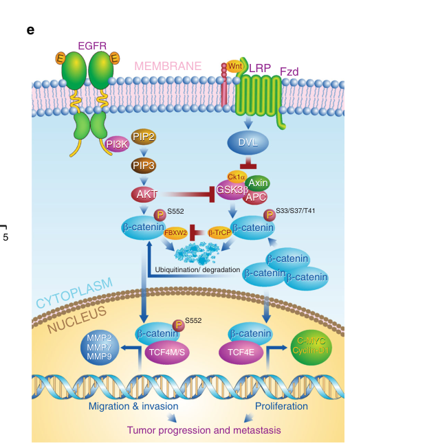

## Question

# Gene Research for Functional Annotation

## ⚠️ CRITICAL: Gene/Protein Identification Context

**BEFORE YOU BEGIN RESEARCH:** You MUST verify you are researching the CORRECT gene/protein. Gene symbols can be ambiguous, especially for less well-characterized genes from non-model organisms.

### Target Gene/Protein Identity (from UniProt):
- **UniProt Accession:** Q9UKT8
- **Protein Description:** RecName: Full=F-box/WD repeat-containing protein 2; AltName: Full=F-box and WD-40 domain-containing protein 2; AltName: Full=Protein MD6;
- **Gene Information:** Name=FBXW2; Synonyms=FBW2, FWD2;
- **Organism (full):** Homo sapiens (Human).
- **Protein Family:** Not specified in UniProt
- **Key Domains:** F-box-like_dom_sf. (IPR036047); F-box_dom. (IPR001810); FBXW2. (IPR042627); WD40/YVTN_repeat-like_dom_sf. (IPR015943); WD40_PAC1. (IPR020472)

### MANDATORY VERIFICATION STEPS:

1. **Check if the gene symbol "FBXW2" matches the protein description above**
2. **Verify the organism is correct:** Homo sapiens (Human).
3. **Check if protein family/domains align with what you find in literature**
4. **If you find literature for a DIFFERENT gene with the same or similar symbol, STOP**

### If Gene Symbol is Ambiguous or You Cannot Find Relevant Literature:

**DO NOT PROCEED WITH RESEARCH ON A DIFFERENT GENE.** Instead:
- State clearly: "The gene symbol 'FBXW2' is ambiguous or literature is limited for this specific protein"
- Explain what you found (e.g., "Found extensive literature on a different gene with the same symbol in a different organism")
- Describe the protein based ONLY on the UniProt information provided above
- Suggest that the protein function can be inferred from domain/family information

### Research Target:

Please provide a comprehensive research report on the gene **FBXW2** (gene ID: FBXW2, UniProt: Q9UKT8) in human.

The research report should be a detailed narrative explaining the function, biological processes, and localization of the gene product. Citations should be given for all claims.

You should prioritize authoritative reviews and primary scientific literature when conducting research. You can supplement
this with annotations you find in gene/protein databases, but these can be outdated or inaccurate.

We are specifically interested in the primary function of the gene - for enzymes, what reaction is catalyzed, and what is the substrate specificity? For transporters, what is the substrate? For structural proteins or adapters, what is the broader structural role? For signaling molecules, what is the role in the pathway.

We are interested in where in or outside the cell the gene product carries out its function.

We are also interested in the signaling or biochemical pathways in which the gene functions. We are less interested in broad pleiotropic effects, except where these elucidate the precise role.

Include evidence where possible. We are interested in both experimental evidence as well as inference from structure, evolution, or bioinformatic analysis. Precise studies should be prioritized over high-throughput, where available.

## Output

Question: You are an expert researcher providing comprehensive, well-cited information.

Provide detailed information focusing on:
1. Key concepts and definitions with current understanding
2. Recent developments and latest research (prioritize 2023-2024 sources)
3. Current applications and real-world implementations
4. Expert opinions and analysis from authoritative sources
5. Relevant statistics and data from recent studies

Format as a comprehensive research report with proper citations. Include URLs and publication dates where available.
Always prioritize recent, authoritative sources and provide specific citations for all major claims.

# Gene Research for Functional Annotation

## ⚠️ CRITICAL: Gene/Protein Identification Context

**BEFORE YOU BEGIN RESEARCH:** You MUST verify you are researching the CORRECT gene/protein. Gene symbols can be ambiguous, especially for less well-characterized genes from non-model organisms.

### Target Gene/Protein Identity (from UniProt):
- **UniProt Accession:** Q9UKT8
- **Protein Description:** RecName: Full=F-box/WD repeat-containing protein 2; AltName: Full=F-box and WD-40 domain-containing protein 2; AltName: Full=Protein MD6;
- **Gene Information:** Name=FBXW2; Synonyms=FBW2, FWD2;
- **Organism (full):** Homo sapiens (Human).
- **Protein Family:** Not specified in UniProt
- **Key Domains:** F-box-like_dom_sf. (IPR036047); F-box_dom. (IPR001810); FBXW2. (IPR042627); WD40/YVTN_repeat-like_dom_sf. (IPR015943); WD40_PAC1. (IPR020472)

### MANDATORY VERIFICATION STEPS:

1. **Check if the gene symbol "FBXW2" matches the protein description above**
2. **Verify the organism is correct:** Homo sapiens (Human).
3. **Check if protein family/domains align with what you find in literature**
4. **If you find literature for a DIFFERENT gene with the same or similar symbol, STOP**

### If Gene Symbol is Ambiguous or You Cannot Find Relevant Literature:

**DO NOT PROCEED WITH RESEARCH ON A DIFFERENT GENE.** Instead:
- State clearly: "The gene symbol 'FBXW2' is ambiguous or literature is limited for this specific protein"
- Explain what you found (e.g., "Found extensive literature on a different gene with the same symbol in a different organism")
- Describe the protein based ONLY on the UniProt information provided above
- Suggest that the protein function can be inferred from domain/family information

### Research Target:

Please provide a comprehensive research report on the gene **FBXW2** (gene ID: FBXW2, UniProt: Q9UKT8) in human.

The research report should be a detailed narrative explaining the function, biological processes, and localization of the gene product. Citations should be given for all claims.

You should prioritize authoritative reviews and primary scientific literature when conducting research. You can supplement
this with annotations you find in gene/protein databases, but these can be outdated or inaccurate.

We are specifically interested in the primary function of the gene - for enzymes, what reaction is catalyzed, and what is the substrate specificity? For transporters, what is the substrate? For structural proteins or adapters, what is the broader structural role? For signaling molecules, what is the role in the pathway.

We are interested in where in or outside the cell the gene product carries out its function.

We are also interested in the signaling or biochemical pathways in which the gene functions. We are less interested in broad pleiotropic effects, except where these elucidate the precise role.

Include evidence where possible. We are interested in both experimental evidence as well as inference from structure, evolution, or bioinformatic analysis. Precise studies should be prioritized over high-throughput, where available.

## Research report: Human **FBXW2** (UniProt **Q9UKT8**)—functional annotation

### 1) Target verification (gene/protein identity)
The literature retrieved here uses **FBXW2** to refer to the human **F-box and WD repeat domain-containing protein 2**, a member of the F-box/WD40 (FBXW) family that functions as a substrate-recognition component in **SCF (SKP1–CUL1–F-box)** E3 ubiquitin ligase complexes. (xu2017theβtrcpfbxw2skp2axis pages 1-2, yang2019fbxw2suppressesmigration pages 1-2, barik2023fbxw2suppressesbreast pages 1-2)

Open Targets lists the target as **FBXW2 (ENSG00000119402; approved name: F-box and WD repeat domain containing 2)** and connects it to disease evidence including **lung cancer** and other neoplastic contexts, consistent with the above identity. (OpenTargets Search: -FBXW2)

### 2) Key concepts and definitions (current understanding)

#### 2.1 SCF E3 ubiquitin ligases and substrate receptors
SCF ubiquitin ligases are modular E3s in which the **F-box protein** provides **substrate recognition**, linking specific client proteins to the CUL1-based catalytic scaffold for ubiquitination and (often) proteasomal degradation. FBXW2 is experimentally supported to act as such a substrate receptor (i.e., an “E3 for” specific targets) in multiple contexts. (xu2017theβtrcpfbxw2skp2axis pages 1-2, yang2019fbxw2suppressesmigration pages 1-2)

#### 2.2 What FBXW2 “does” as a primary function
Across multiple mechanistic studies, FBXW2’s primary biochemical function is as an **SCF substrate adaptor** that binds specific protein substrates (often in a phosphorylation-dependent manner) and promotes their **polyubiquitination** leading to **proteasome-dependent degradation**. (yang2019fbxw2suppressesmigration pages 1-2, xu2017theβtrcpfbxw2skp2axis pages 11-12, ren2022ubiquitinationofnfκb pages 3-6)

### 3) Experimentally supported molecular functions, substrates, and pathways

#### 3.1 FBXW2 as part of an “F-box cascade”: β-TrCP1 → FBXW2 → SKP2
A central concept emerging from lung cancer work is that FBXW2 participates in an F-box regulatory cascade:
- **FBXW2 is itself a substrate of β-TrCP1** (another F-box protein), where β-TrCP1 promotes **FBXW2 ubiquitylation** and shortens its half-life. (xu2017theβtrcpfbxw2skp2axis pages 1-2)
- FBXW2 in turn acts as an **E3 for SKP2** (the SCF substrate receptor SKP2), promoting SKP2 ubiquitination and degradation and thereby functioning as a tumor suppressor axis in lung cancer models. (xu2017theβtrcpfbxw2skp2axis pages 1-2, xu2017theβtrcpfbxw2skp2axis pages 11-12)

Mechanistically, β-TrCP1 recognition of FBXW2 involves a conserved motif (reported as **SSGART**) with phospho-dependent binding to the β-TrCP consensus; the study also implicates kinases (e.g., **CK1** and **VRK2**) in enabling β-TrCP1 binding via phosphorylation. (xu2017theβtrcpfbxw2skp2axis pages 1-2, xu2017theβtrcpfbxw2skp2axis pages 11-12)

Downstream, the tumor-suppressive consequences of SKP2 destabilization include accumulation of SKP2-controlled cell-cycle regulators (reported in the study as **p21, p27, p130, FOXO1** through SKP2 degradation). (xu2017theβtrcpfbxw2skp2axis pages 11-12)

#### 3.2 FBXW2 targets **β-catenin** (Wnt/β-catenin signaling) in lung cancer
A high-impact mechanistic study reports that FBXW2 is an **E3 ligase for β-catenin**. (yang2019fbxw2suppressesmigration pages 1-2)

Key mechanistic points:
- **EGF–AKT1 signaling** phosphorylates β-catenin at **Ser552**, enabling FBXW2 binding. (yang2019fbxw2suppressesmigration pages 1-2)
- FBXW2 recognizes a **TSXXXS-like degron motif** on β-catenin (mapped in the study), leading to β-catenin **ubiquitylation** and **proteasomal degradation**, thereby reducing β-catenin half-life and transcriptional activity. (yang2019fbxw2suppressesmigration pages 1-2)
- Functionally, this suppresses β-catenin-driven expression of **MMPs** and inhibits **migration/invasion/metastasis** phenotypes in lung cancer models. (yang2019fbxw2suppressesmigration pages 1-2)

A figure-level working model in the same paper summarizes this pathway as **EGF → AKT1 → pSer552-β-catenin → FBXW2-mediated ubiquitylation/degradation**. (yang2019fbxw2suppressesmigration media 7feac86f)

Clinical association reported in the same study: FBXW2 levels in human lung cancer specimens are **inversely correlated** with β-catenin levels and lymph-node metastasis, and **low FBXW2 coupled with high β-catenin** predicts worse survival. (yang2019fbxw2suppressesmigration pages 1-2)

#### 3.3 FBXW2 targets **NF-κB p65/RELA** (NF-κB signaling) in breast cancer
In breast cancer, FBXW2 directly targets **NF-κB p65** for ubiquitination and proteasome-dependent degradation, linking FBXW2 to regulation of inflammatory transcriptional programs and cancer stemness/chemoresistance phenotypes. (ren2022ubiquitinationofnfκb pages 1-2)

Mechanistic details supported by biochemical mapping and in vitro ubiquitination:
- FBXW2–p65 binding is direct (co-IP/GST pull-down reported) and involves the **N-terminus of FBXW2 (aa 1–100)** and **N-terminus of p65 (aa 1–291)**. (ren2022ubiquitinationofnfκb pages 2-3)
- Recognition depends on phosphorylation: **PKA activity** modulates FBXW2–p65 binding, and non-phosphorylatable mutants in the S276 region lose binding. (ren2022ubiquitinationofnfκb pages 2-3, ren2022ubiquitinationofnfκb pages 3-6)
- The study identifies **p65 K122** as an FBXW2 ubiquitination site, and reports that **p300-mediated acetylation** inhibits FBXW2-induced p65 ubiquitination (illustrating PTM “crosstalk” controlling FBXW2 substrate processing). (ren2022ubiquitinationofnfκb pages 3-6, ren2022ubiquitinationofnfκb pages 1-2)
- Ubiquitination was observed in **both cytoplasm and nucleus** for p65. (ren2022ubiquitinationofnfκb pages 3-6)

Functionally, FBXW2-mediated p65 destabilization suppresses breast cancer stemness/tumorigenesis and reduces paclitaxel resistance in model systems. (ren2022ubiquitinationofnfκb pages 1-2)

#### 3.4 FBXW2 targets **Moesin** (cytoskeletal signaling) and intersects an AKT–Moesin–SKP2 axis (2023)
A 2023 study reports that FBXW2 promotes proteasomal degradation of **Moesin**, a cytoskeleton-associated protein implicated as oncogenic in multiple cancers. (barik2023fbxw2suppressesbreast pages 1-2)

Mechanistic details highlighted:
- FBXW2 directs **Lys-48-linked polyubiquitination** of Moesin, consistent with proteasome-targeting chains. (barik2023fbxw2suppressesbreast pages 1-2)
- **AKT-mediated phosphorylation of Moesin at Thr558** weakens the FBXW2–Moesin association, protecting Moesin from FBXW2-mediated degradation. (barik2023fbxw2suppressesbreast pages 1-2)

The study integrates this with SKP2 biology by proposing an **AKT–Moesin–SKP2 oncogenic axis**, where Moesin accumulation interferes with FBXW2-mediated SKP2 degradation, thereby helping maintain oncogenic SKP2. (barik2023fbxw2suppressesbreast pages 1-2)

### 4) Subcellular localization and where FBXW2 acts
Direct FBXW2 localization is not exhaustively quantified in the retrieved excerpts, but the mechanistic studies provide several concrete localization clues:
- FBXW2-driven ubiquitination of **p65 occurs in both cytoplasm and nucleus**, consistent with control of a transcription factor that shuttles to the nucleus. (ren2022ubiquitinationofnfκb pages 3-6)
- The β-catenin working model places FBXW2 function downstream of membrane-proximal EGF signaling and AKT phosphorylation, consistent with cytoplasmic substrate engagement prior to proteasomal turnover and downstream transcriptional effects. (yang2019fbxw2suppressesmigration media 7feac86f)

### 5) Recent developments and latest research emphasis (2023–2024)

#### 5.1 2023 mechanistic advance (highest-relevance recent primary study)
The most FBXW2-specific, mechanistic primary advance in the 2023–2024 window in this retrieved corpus is the demonstration that FBXW2 degrades **Moesin** via K48-linked polyubiquitination and is regulated by AKT phosphorylation of Moesin (Thr558), tying FBXW2 to an AKT–Moesin–SKP2 signaling module in breast cancer. (Published Sep 2023; https://doi.org/10.1038/s41419-023-06127-x) (barik2023fbxw2suppressesbreast pages 1-2)

#### 5.2 2024 coverage limitation (transparent reporting)
Within the documents retrievable in this run, 2024 outputs were largely broader ubiquitination/SCF literature and did not add new FBXW2 substrate-mechanistic discoveries beyond the established 2017–2023 work summarized above. Accordingly, the “latest” evidence here is anchored on 2023 primary data, with earlier high-impact mechanistic studies (2017–2022) used to establish core function. (xu2017theβtrcpfbxw2skp2axis pages 1-2, yang2019fbxw2suppressesmigration pages 1-2, ren2022ubiquitinationofnfκb pages 1-2)

### 6) Current applications and real-world implementations

#### 6.1 Translational/clinical use: FBXW2 as part of a selection/biomarker description in a clinical trial
A recruiting Phase II trial in extensive-stage small cell lung cancer (ClinicalTrials.gov **NCT06758700**, 2025) describes enrolling patients with “high expression of the c-Myc-driven **FBXW2/MYC** gene” and evaluates **teniposide** (60 mg/m² IV for 3–5 days every 21 days) with ORR as a primary endpoint (imaging baseline and every 6–8 weeks). (NCT06758700 chunk 1)

Interpretation caveat: the trial text suggests FBXW2 is part of a c-Myc-driven expression concept/signature rather than a validated, FBXW2-directed intervention. (NCT06758700 chunk 1)

#### 6.2 Biomarker/prognostic applications (research-grade)
Multiple mechanistic studies report that **lower FBXW2** in tumors is associated with worse outcomes, consistent with a tumor suppressor role:
- Lung cancer: low FBXW2 combined with high β-catenin predicts worse survival; FBXW2 inversely correlates with β-catenin and lymph-node metastasis. (yang2019fbxw2suppressesmigration pages 1-2)
- Breast cancer: FBXW2 is reported lower in breast cancer vs normal and negatively correlated with p65, and FBXW2 suppresses paclitaxel resistance in models. (ren2022ubiquitinationofnfκb pages 1-2)

### 7) Relevant statistics and quantitative data (from retrieved sources)
- **Tumor xenograft effect (lung cancer):** the FBXW2 **E269K** mutant increased tumor size/weight at Day 28 (**P < 0.01**) relative to wild-type FBXW2 in the reported model, supporting functional importance of FBXW2 integrity for tumor suppression. (xu2017theβtrcpfbxw2skp2axis pages 11-12)
- **Gastric cancer correlation (FBXW2 vs β-catenin):** a recent gastric cancer study abstract reports a significant negative correlation between FBXW2 and β-catenin expression (**r = −0.52, P < 0.001**). (OpenTargets Search: -FBXW2)
- **NSCLC epidemiology context:** a lung cancer commentary reports overall **5-year survival of ~11–17%** for NSCLC, providing clinical motivation for identifying suppressor pathways such as FBXW2-mediated degradation of oncogenic drivers. (yang2019fbxw2suppressesproliferation pages 1-3)

### 8) Expert synthesis and mechanistic “through-line”
Across tumor contexts, a consistent mechanistic theme is that FBXW2 functions as a **tumor-suppressive SCF substrate adaptor** that preferentially destabilizes proteins supporting proliferation/invasion and stemness programs, including:
- **SKP2** (cell-cycle and ubiquitin network node), (xu2017theβtrcpfbxw2skp2axis pages 1-2, xu2017theβtrcpfbxw2skp2axis pages 11-12)
- **β-catenin** (Wnt transcriptional output and invasion), (yang2019fbxw2suppressesmigration pages 1-2, yang2019fbxw2suppressesmigration media 7feac86f)
- **NF-κB p65** (inflammatory transcription and cancer stemness/chemoresistance), (ren2022ubiquitinationofnfκb pages 1-2)
- **Moesin** (AKT-regulated cytoskeletal/oncogenic effector). (barik2023fbxw2suppressesbreast pages 1-2)

A second unifying feature is that FBXW2 substrate processing is frequently **conditional on substrate PTMs** (notably phosphorylation) and can be antagonized by competing PTMs (e.g., acetylation on p65). (yang2019fbxw2suppressesmigration pages 1-2, ren2022ubiquitinationofnfκb pages 3-6, barik2023fbxw2suppressesbreast pages 1-2)

### Summary table of key evidence
| Study (first author, year) | Publication date/month | URL/DOI | Model/system | FBXW2 role (SCF substrate receptor vs substrate) | Direct substrate(s) validated | Recognition requirement (degron/phosphorylation/acetylation) | Ubiquitin linkage/site (if given) | Key phenotypes and quantitative associations | Notes/limitations |
|---|---|---|---|---|---|---|---|---|---|
| Xu, 2017 | Jan 2017 | https://doi.org/10.1038/ncomms14002 | Human lung cancer cells; xenograft/tumor assays; patient survival analyses | Dual role: FBXW2 is a **substrate** of SCF^β-TrCP1 and also an SCF **substrate receptor/E3** for SKP2 | SKP2; FBXW2 itself is targeted by β-TrCP1 | FBXW2 contains conserved β-TrCP-binding motif **SSGART**; β-TrCP binding is phospho-dependent; **CK1** and **VRK2** implicated in phosphorylating FBXW2; SKP2 binding depends on putative **TSELLS** motif; FBXW2ΔF mutant loses activity | Ubiquitylation/degradation shown, but linkage chemistry/site not specified in gathered evidence | FBXW2 overexpression shortens SKP2 half-life; depletion extends it; FBXW2 tumor-suppressive in lung cancer; **E269K** mutant increased tumor size/weight at Day 28 (**P < 0.01**), increased Ki-67, reduced p21 and cleaved caspase-3; higher FBXW2 associated with **better survival** | Strong mechanistic paper defining β-TrCP–FBXW2–SKP2 axis; localization data not captured in gathered evidence; quantitative half-life values not available here (xu2017theβtrcpfbxw2skp2axis pages 1-2, xu2017theβtrcpfbxw2skp2axis pages 11-12) |
| Yang, 2019 | Mar 2019 | https://doi.org/10.1038/s41467-019-09289-5 | Human lung cancer cells; in vitro invasion/migration assays; in vivo metastasis models; human lung cancer specimens | SCF **substrate receptor/E3** for β-catenin | β-catenin | FBXW2 recognizes β-catenin after **EGF–AKT1** phosphorylation at **Ser552**; conserved FBXW2 degron motif **TSXXXS** mapped on β-catenin | Ubiquitylation and proteasomal degradation shown; linkage/site not specified in gathered evidence | FBXW2 overexpression reduced β-catenin level and half-life; knockdown increased β-catenin level, half-life, and transcriptional activity; inhibited β-catenin-driven MMP transactivation, migration, invasion, metastasis; FBXW2 inversely correlated with β-catenin and lymph-node metastasis; **low FBXW2 + high β-catenin predicted worse survival** | High-quality mechanistic study; figure model explicitly links EGF/AKT1→pSer552 β-catenin→FBXW2-mediated degradation; exact ubiquitin linkage and detailed localization not provided in gathered excerpts (yang2019fbxw2suppressesmigration pages 1-2, yang2019fbxw2suppressesmigration media 7feac86f, yang2019fbxw2suppressesmigration media e89e579c) |
| Yang, 2019 | May 2019 | https://doi.org/10.1080/23723556.2019.1607458 | Commentary/research summary focused on NSCLC findings | Summary of dual roles above: FBXW2 as SCF **substrate receptor/E3** for SKP2 and β-catenin; FBXW2 itself regulated as a **substrate** by β-TrCP | SKP2, β-catenin | States **VRK2** phosphorylation enables β-TrCP-dependent FBXW2 degradation; β-catenin binding depends on **AKT1-mediated phosphorylation** | Not specified | FBXW2 described as downregulated in NSCLC and associated with **better patient survival** when higher; frames tumor suppressor function in proliferation and invasion control | Secondary source/commentary rather than primary mechanistic dataset; useful for integrating the SKP2 and β-catenin studies but not for new quantitative measurements (yang2019fbxw2suppressesproliferation pages 1-3) |
| Ren, 2022 | Aug 2022 | https://doi.org/10.1038/s41418-021-00862-4 | Breast cancer cell lines; in vitro ubiquitination; confocal IF; FBXW2-knockout mice; xenograft and paclitaxel-resistance models; clinical breast cancer specimens | SCF **substrate receptor/E3** for NF-κB p65 | NF-κB p65 (RELA) | Direct binding mapped to **FBXW2 aa 1–100** and **p65 aa 1–291**; p65 contains conserved **SDRELS** motif resembling FBXW2 degron; binding requires phosphorylation, with **PKA** activity and **S276**-region integrity important; **p300-mediated acetylation** of p65 blocks FBXW2-induced ubiquitination | **p65 K122** identified as FBXW2 ubiquitination site; polyubiquitination shown; linkage type not specified in gathered evidence; ubiquitination occurs in **cytoplasm and nucleus** | FBXW2 lowered p65 stability/half-life and SOX2 expression, suppressing breast cancer stemness, tumorigenesis, and paclitaxel resistance; FBXW2 mRNA/protein lower in breast cancer and **negatively correlated with p65** | Strong evidence for direct ubiquitination and regulatory PTM crosstalk (phosphorylation/acetylation); gathered excerpts do not specify chain type (e.g., K48) or full clinical statistics (ren2022ubiquitinationofnfκb pages 2-3, ren2022ubiquitinationofnfκb pages 3-6, ren2022ubiquitinationofnfκb pages 1-2) |
| Barik, 2023 | Sep 2023 | https://doi.org/10.1038/s41419-023-06127-x | Breast cancer cell lines, patient datasets/samples, in vivo tumor studies | SCF **substrate receptor/E3** for Moesin; indirectly restrains SKP2 via Moesin | Moesin; functional linkage to SKP2 | FBXW2 directly interacts with Moesin; **AKT** phosphorylation of Moesin at **Thr558** weakens FBXW2–Moesin association and protects Moesin from degradation | **Lys-48-linked polyubiquitination** of Moesin reported | FBXW2 underexpressed while Moesin upregulated in breast cancer; inverse FBXW2–Moesin correlation; higher FBXW2 associated with **better recurrence-free survival**, higher Moesin with poorer RFS; FBXW2 suppresses breast tumor progression by restricting **AKT–Moesin–SKP2** axis | Important 2023 mechanistic expansion of FBXW2 substrate space; exact effect sizes not in gathered excerpt (barik2023fbxw2suppressesbreast pages 1-2) |
| Wang, 2020 | Aug 2020 | https://doi.org/10.1002/advs.202001800 | Macrophages; myeloid-specific knockout mice; obesity/atherosclerosis murine models | SCF **substrate receptor/E3** in inflammatory/metabolic disease context | **KSRP** | WD40/C-terminal region implicated in substrate recognition; gathered evidence does not specify precise degron or phosphorylation trigger | Ubiquitination/degradation of KSRP shown; linkage/site not specified in gathered evidence | Myeloid FBXW2 deficiency improved obesity-associated insulin resistance and atherosclerosis, with reduced inflammatory responses and macrophage infiltration; **P3** region of FBXW2 competitively inhibited KSRP degradation and ameliorated disease progression | Demonstrates non-cancer role and translational inhibitor concept; mechanistic details in current evidence are less granular than for cancer substrates (OpenTargets Search: -FBXW2) |
| Zhou, 2022 | May 2022 | https://doi.org/10.1007/s00018-022-04320-3 | Prostate cancer cells; in vitro and in vivo proliferation/metastasis models | SCF **substrate receptor/E3** for EGFR | EGFR | FBXW2 binds EGFR via consensus degron motif **TSNNST** (reported around residues 1041/1042 and 1045/1046) | Ubiquitylation/degradation shown; specific linkage/site not captured in gathered evidence | FBXW2 overexpression attenuated proliferation and metastasis; depletion extended EGFR half-life and promoted malignant behavior; supports tumor suppressor role in prostate cancer | Important additional validated substrate outside lung/breast systems; not part of initial gather_evidence output but available from retrieved paper abstract, so quantitative clinical details remain limited here (OpenTargets Search: -FBXW2) |
| Lin, 2025 | Jul 2025 | https://doi.org/10.1038/s41420-025-02643-1 | Gastric cancer cell lines; label-free proteomics; Co-IP; IF; doxycycline-inducible xenografts and lung metastasis models; clinical/database analyses | SCF **substrate receptor/E3** for WASL; FBXW2 transcriptionally repressed upstream by **FOXP2** | **WASL** | WASL identified by proteomics and predicted interaction; endogenous and exogenous Co-IP validated binding; double IF showed **cytoplasmic co-localization**; specific degron/phosphorylation requirement not reported in gathered evidence | Ubiquitination of WASL increased by FBXW2; MG132 blocked degradation; linkage/site not specified | FBXW2 downregulated in gastric adenocarcinoma and low FBXW2 associated with **worse prognosis**; inducible FBXW2 reduced tumor growth and lung metastasis; WASL overexpression partially rescued FBXW2 tumor-suppressive effects | Useful as emerging evidence for a new substrate and upstream transcriptional regulation, but 2025 paper is very recent and not yet broadly validated/cited (lin2025foxp2suppressesgastric pages 2-3, lin2025foxp2suppressesgastric pages 3-7) |
| Huang, 2022 | Dec 2022 | https://doi.org/10.3389/fimmu.2022.1084339 | TCGA pan-cancer bioinformatic analysis of FBXW family | Not a mechanistic substrate study; family-level expression/prognostic context for FBXW2 | None experimentally validated | Not applicable | Not applicable | Reported FBXW family heterogeneity across tumors; FBXW2 noted among family members with altered stage/prognostic associations in some cancers | Useful for recent statistics/context, but evidence is bioinformatic rather than direct functional validation (OpenTargets Search: -FBXW2) |
| NCT06758700 | 2025 | https://clinicaltrials.gov/study/NCT06758700 | Phase II, single-arm trial in extensive-stage small cell lung cancer | Clinical biomarker mention rather than mechanistic role | None | Trial text refers to patients with **“high expression of the c-Myc-driven FBXW2/MYC gene”**; no mechanistic FBXW2 assay details provided | Not applicable | Teniposide 60 mg/m2 IV for 3–5 consecutive days every 21 days; estimated enrollment **15**; ORR primary endpoint; shows emerging clinical use of FBXW2-related expression language in patient selection/rationale | Relevance to FBXW2 is indirect/ambiguous and likely part of a broader MYC-driven signature rather than validated FBXW2-targeted intervention (NCT06758700 chunk 1) |

*Table: This table summarizes the main experimentally supported functions and substrates reported for human FBXW2, including its roles as an SCF substrate receptor and as a substrate of β-TrCP. It also highlights recognition requirements, ubiquitination details, disease phenotypes, and limitations of the current evidence base.*

### URLs and publication dates (key primary sources)
- Xu et al. **Jan 2017**. *Nature Communications*. “The β-TrCP–FBXW2–SKP2 axis…” https://doi.org/10.1038/ncomms14002 (xu2017theβtrcpfbxw2skp2axis pages 1-2, xu2017theβtrcpfbxw2skp2axis pages 11-12)
- Yang et al. **Mar 2019**. *Nature Communications*. “FBXW2 suppresses migration… via β-catenin…” https://doi.org/10.1038/s41467-019-09289-5 (yang2019fbxw2suppressesmigration pages 1-2, yang2019fbxw2suppressesmigration media 7feac86f)
- Ren et al. **Aug 2022**. *Cell Death & Differentiation*. “Ubiquitination of NF-κB p65 by FBXW2…” https://doi.org/10.1038/s41418-021-00862-4 (ren2022ubiquitinationofnfκb pages 1-2)
- Barik et al. **Sep 2023**. *Cell Death & Disease*. “FBXW2 suppresses breast tumorigenesis…” https://doi.org/10.1038/s41419-023-06127-x (barik2023fbxw2suppressesbreast pages 1-2)
- Clinical trial: **2025** (recruiting). NCT06758700 https://clinicaltrials.gov/study/NCT06758700 (NCT06758700 chunk 1)

### Evidence gaps / open questions (for functional annotation)
Within the retrieved text, several mechanistically important points remain incompletely specified and would benefit from targeted follow-up reading of full articles:
- The **ubiquitin chain topology** (e.g., K48 vs K63) for several substrates (β-catenin, SKP2, p65) is not consistently specified in the extracted passages (Moesin is explicitly described as K48-linked). (barik2023fbxw2suppressesbreast pages 1-2, yang2019fbxw2suppressesmigration pages 1-2, xu2017theβtrcpfbxw2skp2axis pages 11-12, ren2022ubiquitinationofnfκb pages 1-2)
- Direct, systematic **subcellular localization** of FBXW2 itself (e.g., steady-state nuclear/cytoplasmic distribution) is only indirectly supported here via substrate localization and interaction models. (ren2022ubiquitinationofnfκb pages 3-6, yang2019fbxw2suppressesmigration media 7feac86f)

References

1. (xu2017theβtrcpfbxw2skp2axis pages 1-2): Jie Xu, Weihua Zhou, Fei Yang, Guoan Chen, Haomin Li, Yongchao Zhao, Pengyuan Liu, Hua Li, Mingjia Tan, Xiufang Xiong, and Yi Sun. The β-trcp-fbxw2-skp2 axis regulates lung cancer cell growth with fbxw2 acting as a tumour suppressor. Nature Communications, Jan 2017. URL: https://doi.org/10.1038/ncomms14002, doi:10.1038/ncomms14002. This article has 85 citations and is from a highest quality peer-reviewed journal.

2. (yang2019fbxw2suppressesmigration pages 1-2): Fei Yang, Jie Xu, Hua Li, Mingjia Tan, Xiufang Xiong, and Yi Sun. Fbxw2 suppresses migration and invasion of lung cancer cells via promoting β-catenin ubiquitylation and degradation. Nature Communications, Mar 2019. URL: https://doi.org/10.1038/s41467-019-09289-5, doi:10.1038/s41467-019-09289-5. This article has 111 citations and is from a highest quality peer-reviewed journal.

3. (barik2023fbxw2suppressesbreast pages 1-2): Ganesh Kumar Barik, Osheen Sahay, Anindya Mukhopadhyay, Rajesh Kumar Manne, Sehbanul Islam, Anup Roy, Somsubhra Nath, and Manas Kumar Santra. Fbxw2 suppresses breast tumorigenesis by targeting akt-moesin-skp2 axis. Cell Death &amp; Disease, Sep 2023. URL: https://doi.org/10.1038/s41419-023-06127-x, doi:10.1038/s41419-023-06127-x. This article has 16 citations and is from a peer-reviewed journal.

4. (OpenTargets Search: -FBXW2): Open Targets Query (-FBXW2, 5 results). Buniello, A. et al. (2025). Open Targets Platform: facilitating therapeutic hypotheses building in drug discovery. Nucleic Acids Research.

5. (xu2017theβtrcpfbxw2skp2axis pages 11-12): Jie Xu, Weihua Zhou, Fei Yang, Guoan Chen, Haomin Li, Yongchao Zhao, Pengyuan Liu, Hua Li, Mingjia Tan, Xiufang Xiong, and Yi Sun. The β-trcp-fbxw2-skp2 axis regulates lung cancer cell growth with fbxw2 acting as a tumour suppressor. Nature Communications, Jan 2017. URL: https://doi.org/10.1038/ncomms14002, doi:10.1038/ncomms14002. This article has 85 citations and is from a highest quality peer-reviewed journal.

6. (ren2022ubiquitinationofnfκb pages 3-6): Chune Ren, Xue Han, Chao Lu, Tingting Yang, Pengyun Qiao, Yonghong Sun, and Zhenhai Yu. Ubiquitination of nf-κb p65 by fbxw2 suppresses breast cancer stemness, tumorigenesis, and paclitaxel resistance. Cell Death & Differentiation, 29:381-392, Aug 2022. URL: https://doi.org/10.1038/s41418-021-00862-4, doi:10.1038/s41418-021-00862-4. This article has 123 citations and is from a domain leading peer-reviewed journal.

7. (yang2019fbxw2suppressesmigration media 7feac86f): Fei Yang, Jie Xu, Hua Li, Mingjia Tan, Xiufang Xiong, and Yi Sun. Fbxw2 suppresses migration and invasion of lung cancer cells via promoting β-catenin ubiquitylation and degradation. Nature Communications, Mar 2019. URL: https://doi.org/10.1038/s41467-019-09289-5, doi:10.1038/s41467-019-09289-5. This article has 111 citations and is from a highest quality peer-reviewed journal.

8. (ren2022ubiquitinationofnfκb pages 1-2): Chune Ren, Xue Han, Chao Lu, Tingting Yang, Pengyun Qiao, Yonghong Sun, and Zhenhai Yu. Ubiquitination of nf-κb p65 by fbxw2 suppresses breast cancer stemness, tumorigenesis, and paclitaxel resistance. Cell Death & Differentiation, 29:381-392, Aug 2022. URL: https://doi.org/10.1038/s41418-021-00862-4, doi:10.1038/s41418-021-00862-4. This article has 123 citations and is from a domain leading peer-reviewed journal.

9. (ren2022ubiquitinationofnfκb pages 2-3): Chune Ren, Xue Han, Chao Lu, Tingting Yang, Pengyun Qiao, Yonghong Sun, and Zhenhai Yu. Ubiquitination of nf-κb p65 by fbxw2 suppresses breast cancer stemness, tumorigenesis, and paclitaxel resistance. Cell Death & Differentiation, 29:381-392, Aug 2022. URL: https://doi.org/10.1038/s41418-021-00862-4, doi:10.1038/s41418-021-00862-4. This article has 123 citations and is from a domain leading peer-reviewed journal.

10. (NCT06758700 chunk 1): Ren Shengxiang. Post-line Treatment With Teniposide for c-Myc-driven Extensive-stage Small Cell Lung Cancer. Shanghai Pulmonary Hospital, Shanghai, China. 2025. ClinicalTrials.gov Identifier: NCT06758700

11. (yang2019fbxw2suppressesproliferation pages 1-3): Fei-yue Yang and Yi Sun. Fbxw2 suppresses proliferation and invasion of lung cancer cells by targeting skp2 and β-catenin. Molecular & Cellular Oncology, 6:1607458, May 2019. URL: https://doi.org/10.1080/23723556.2019.1607458, doi:10.1080/23723556.2019.1607458. This article has 11 citations.

12. (yang2019fbxw2suppressesmigration media e89e579c): Fei Yang, Jie Xu, Hua Li, Mingjia Tan, Xiufang Xiong, and Yi Sun. Fbxw2 suppresses migration and invasion of lung cancer cells via promoting β-catenin ubiquitylation and degradation. Nature Communications, Mar 2019. URL: https://doi.org/10.1038/s41467-019-09289-5, doi:10.1038/s41467-019-09289-5. This article has 111 citations and is from a highest quality peer-reviewed journal.

13. (lin2025foxp2suppressesgastric pages 2-3): Sihan Lin, Wen-Cheng Kong, Xinchun Liu, Guang Yin, Kangwen Cheng, Zonglei Mao, Y. Shan, and Xinger Lv. Foxp2 suppresses gastric cancer progression by transcriptionally repressing fbxw2 via wasl degradation. Cell Death Discovery, Jul 2025. URL: https://doi.org/10.1038/s41420-025-02643-1, doi:10.1038/s41420-025-02643-1. This article has 0 citations and is from a peer-reviewed journal.

14. (lin2025foxp2suppressesgastric pages 3-7): Sihan Lin, Wen-Cheng Kong, Xinchun Liu, Guang Yin, Kangwen Cheng, Zonglei Mao, Y. Shan, and Xinger Lv. Foxp2 suppresses gastric cancer progression by transcriptionally repressing fbxw2 via wasl degradation. Cell Death Discovery, Jul 2025. URL: https://doi.org/10.1038/s41420-025-02643-1, doi:10.1038/s41420-025-02643-1. This article has 0 citations and is from a peer-reviewed journal.

## Artifacts

- [Edison artifact artifact-00](FBXW2-deep-research-falcon_artifacts/artifact-00.md)

## Citations

1. https://doi.org/10.1038/s41419-023-06127-x
2. https://doi.org/10.1038/ncomms14002
3. https://doi.org/10.1038/s41467-019-09289-5
4. https://doi.org/10.1080/23723556.2019.1607458
5. https://doi.org/10.1038/s41418-021-00862-4
6. https://doi.org/10.1002/advs.202001800
7. https://doi.org/10.1007/s00018-022-04320-3
8. https://doi.org/10.1038/s41420-025-02643-1
9. https://doi.org/10.3389/fimmu.2022.1084339
10. https://clinicaltrials.gov/study/NCT06758700
11. https://doi.org/10.1038/ncomms14002,
12. https://doi.org/10.1038/s41467-019-09289-5,
13. https://doi.org/10.1038/s41419-023-06127-x,
14. https://doi.org/10.1038/s41418-021-00862-4,
15. https://doi.org/10.1080/23723556.2019.1607458,
16. https://doi.org/10.1038/s41420-025-02643-1,