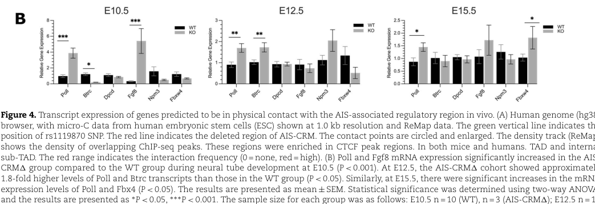

## Question

# Gene Research for Functional Annotation

## ⚠️ CRITICAL: Gene/Protein Identification Context

**BEFORE YOU BEGIN RESEARCH:** You MUST verify you are researching the CORRECT gene/protein. Gene symbols can be ambiguous, especially for less well-characterized genes from non-model organisms.

### Target Gene/Protein Identity (from UniProt):
- **UniProt Accession:** P57775
- **Protein Description:** RecName: Full=F-box/WD repeat-containing protein 4; AltName: Full=Dactylin; AltName: Full=F-box and WD-40 domain-containing protein 4;
- **Gene Information:** Name=FBXW4; Synonyms=FBW4, SHFM3;
- **Organism (full):** Homo sapiens (Human).
- **Protein Family:** Not specified in UniProt
- **Key Domains:** F-box-like_dom_sf. (IPR036047); F-box_dom. (IPR001810); SCF_F-box/WD-repeat. (IPR052301); WD40/YVTN_repeat-like_dom_sf. (IPR015943); WD40_repeat_dom_sf. (IPR036322)

### MANDATORY VERIFICATION STEPS:

1. **Check if the gene symbol "FBXW4" matches the protein description above**
2. **Verify the organism is correct:** Homo sapiens (Human).
3. **Check if protein family/domains align with what you find in literature**
4. **If you find literature for a DIFFERENT gene with the same or similar symbol, STOP**

### If Gene Symbol is Ambiguous or You Cannot Find Relevant Literature:

**DO NOT PROCEED WITH RESEARCH ON A DIFFERENT GENE.** Instead:
- State clearly: "The gene symbol 'FBXW4' is ambiguous or literature is limited for this specific protein"
- Explain what you found (e.g., "Found extensive literature on a different gene with the same symbol in a different organism")
- Describe the protein based ONLY on the UniProt information provided above
- Suggest that the protein function can be inferred from domain/family information

### Research Target:

Please provide a comprehensive research report on the gene **FBXW4** (gene ID: FBXW4, UniProt: P57775) in human.

The research report should be a detailed narrative explaining the function, biological processes, and localization of the gene product. Citations should be given for all claims.

You should prioritize authoritative reviews and primary scientific literature when conducting research. You can supplement
this with annotations you find in gene/protein databases, but these can be outdated or inaccurate.

We are specifically interested in the primary function of the gene - for enzymes, what reaction is catalyzed, and what is the substrate specificity? For transporters, what is the substrate? For structural proteins or adapters, what is the broader structural role? For signaling molecules, what is the role in the pathway.

We are interested in where in or outside the cell the gene product carries out its function.

We are also interested in the signaling or biochemical pathways in which the gene functions. We are less interested in broad pleiotropic effects, except where these elucidate the precise role.

Include evidence where possible. We are interested in both experimental evidence as well as inference from structure, evolution, or bioinformatic analysis. Precise studies should be prioritized over high-throughput, where available.

## Output

Question: You are an expert researcher providing comprehensive, well-cited information.

Provide detailed information focusing on:
1. Key concepts and definitions with current understanding
2. Recent developments and latest research (prioritize 2023-2024 sources)
3. Current applications and real-world implementations
4. Expert opinions and analysis from authoritative sources
5. Relevant statistics and data from recent studies

Format as a comprehensive research report with proper citations. Include URLs and publication dates where available.
Always prioritize recent, authoritative sources and provide specific citations for all major claims.

# Gene Research for Functional Annotation

## ⚠️ CRITICAL: Gene/Protein Identification Context

**BEFORE YOU BEGIN RESEARCH:** You MUST verify you are researching the CORRECT gene/protein. Gene symbols can be ambiguous, especially for less well-characterized genes from non-model organisms.

### Target Gene/Protein Identity (from UniProt):
- **UniProt Accession:** P57775
- **Protein Description:** RecName: Full=F-box/WD repeat-containing protein 4; AltName: Full=Dactylin; AltName: Full=F-box and WD-40 domain-containing protein 4;
- **Gene Information:** Name=FBXW4; Synonyms=FBW4, SHFM3;
- **Organism (full):** Homo sapiens (Human).
- **Protein Family:** Not specified in UniProt
- **Key Domains:** F-box-like_dom_sf. (IPR036047); F-box_dom. (IPR001810); SCF_F-box/WD-repeat. (IPR052301); WD40/YVTN_repeat-like_dom_sf. (IPR015943); WD40_repeat_dom_sf. (IPR036322)

### MANDATORY VERIFICATION STEPS:

1. **Check if the gene symbol "FBXW4" matches the protein description above**
2. **Verify the organism is correct:** Homo sapiens (Human).
3. **Check if protein family/domains align with what you find in literature**
4. **If you find literature for a DIFFERENT gene with the same or similar symbol, STOP**

### If Gene Symbol is Ambiguous or You Cannot Find Relevant Literature:

**DO NOT PROCEED WITH RESEARCH ON A DIFFERENT GENE.** Instead:
- State clearly: "The gene symbol 'FBXW4' is ambiguous or literature is limited for this specific protein"
- Explain what you found (e.g., "Found extensive literature on a different gene with the same symbol in a different organism")
- Describe the protein based ONLY on the UniProt information provided above
- Suggest that the protein function can be inferred from domain/family information

### Research Target:

Please provide a comprehensive research report on the gene **FBXW4** (gene ID: FBXW4, UniProt: P57775) in human.

The research report should be a detailed narrative explaining the function, biological processes, and localization of the gene product. Citations should be given for all claims.

You should prioritize authoritative reviews and primary scientific literature when conducting research. You can supplement
this with annotations you find in gene/protein databases, but these can be outdated or inaccurate.

We are specifically interested in the primary function of the gene - for enzymes, what reaction is catalyzed, and what is the substrate specificity? For transporters, what is the substrate? For structural proteins or adapters, what is the broader structural role? For signaling molecules, what is the role in the pathway.

We are interested in where in or outside the cell the gene product carries out its function.

We are also interested in the signaling or biochemical pathways in which the gene functions. We are less interested in broad pleiotropic effects, except where these elucidate the precise role.

Include evidence where possible. We are interested in both experimental evidence as well as inference from structure, evolution, or bioinformatic analysis. Precise studies should be prioritized over high-throughput, where available.

# Research report: Human **FBXW4** (UniProt **P57775**) functional annotation

## 0. Target verification (gene/protein identity)
The literature retrieved for **FBXW4** consistently refers to the human gene at the **10q24** locus historically connected to **SHFM3** (split-hand/foot malformation type 3) and to the ortholog of mouse **dactylin (Fbxw4)**. In particular, Lockwood et al. biochemically characterize **FBXW4** as an **F-box and WD40-repeat containing protein** that forms an **SCF-type E3 ubiquitin ligase complex**, matching the provided UniProt description (F-box + WD-repeat domains; alias **dactylin**) and therefore supporting that the report is about the correct **human FBXW4/P57775** target (Lockwood et al., 2013; https://doi.org/10.1371/journal.pone.0063610) (lockwood2013thenovelubiquitin pages 1-2, lockwood2013thenovelubiquitin pages 8-9).

## 1. Key concepts and definitions (current understanding)

### 1.1 FBXW4 as an F-box/WD-repeat substrate receptor in SCF E3 ubiquitin ligases
**SCF (SKP1–CUL1–RBX1) complexes** are multi-subunit **E3 ubiquitin ligases** in which **F-box proteins** provide **substrate recognition**: the F-box domain binds **SKP1**, coupling a variable substrate receptor to the CUL1–RBX1 catalytic core. **WD40 repeats** typically form a β-propeller scaffold that mediates protein–protein interactions, often contributing directly to substrate binding.

For FBXW4 specifically, biochemical evidence demonstrates it assembles with canonical SCF core components and regulatory machinery, strongly supporting its classification as an **SCF substrate-recognition subunit** (rather than an enzyme with an intrinsic catalytic reaction): FBXW4 co-purifies/interacts with **SKP1, CUL1, RBX1** and multiple **COP9 signalosome (COPS)** subunits, and these interactions are **F-box dependent** (Lockwood et al., 2013; https://doi.org/10.1371/journal.pone.0063610) (lockwood2013thenovelubiquitin pages 1-2, lockwood2013thenovelubiquitin pages 2-3, lockwood2013thenovelubiquitin pages 3-4).

### 1.2 COP9 signalosome coupling
The **COP9 signalosome (CSN)** regulates cullin-RING ligases (including SCF complexes) via deneddylation and other mechanisms. FBXW4’s interaction with multiple CSN subunits is consistent with a regulated SCF ligase module and suggests FBXW4-containing SCF complexes are integrated into canonical ubiquitin–proteasome regulation (Lockwood et al., 2013) (lockwood2013thenovelubiquitin pages 1-2, lockwood2013thenovelubiquitin pages 2-3).

### 1.3 SHFM3/10q24 rearrangements as a “regulatory neighborhood” disorder
A major body of FBXW4-related human genetics concerns **structural variants (SVs)** at **10q24.31–10q24.32**. Recurrent (and also nonrecurrent) duplications frequently include **FBXW4** along with neighboring genes (e.g., **LBX1, BTRC, POLL, DPCD**, sometimes near **FGF8** depending on breakpoint). Multiple papers argue the phenotype is not readily explained by a single coding mutation in FBXW4; rather, SVs likely perturb **cis-regulatory elements**, **3D chromatin architecture**, and/or coordinated expression of multiple genes in the region (Lyle et al., 2006; Dimitrov et al., 2010; Dai et al., 2013; Li et al., 2015) (lyle2006split‐handsplit‐footmalformation3 pages 8-10, dimitrov2010distallimbdeficiencies pages 9-11, dai2013discontinuousmicroduplicationsat pages 3-5, li2015identificationofcritical pages 1-3).

## 2. Functional evidence for FBXW4

### 2.1 Molecular function: SCF complex assembly and ubiquitin-pathway engagement
Lockwood et al. provide direct biochemical support that FBXW4 operates in ubiquitin-mediated proteolysis as part of an SCF complex:
- FBXW4 associates with **SKP1/CUL1/RBX1** and **COP9 signalosome** components, requiring an intact **F-box** (lockwood2013thenovelubiquitin pages 1-2, lockwood2013thenovelubiquitin pages 2-3, lockwood2013thenovelubiquitin pages 3-4).
- FBXW4 interacts with **ubiquitinated cellular proteins**, and the interaction increases with **proteasome inhibition (MG132)** in an **F-box-dependent** manner, consistent with substrate engagement in ubiquitin-dependent turnover pathways (lockwood2013thenovelubiquitin pages 4-6, lockwood2013thenovelubiquitin pages 3-4).

**Key limitation:** The specific endogenous **substrate(s)** targeted by SCF^FBXW4 remain insufficiently defined in the retrieved evidence; the 2013 study frames substrate identification as a future direction (lockwood2013thenovelubiquitin pages 8-8).

### 2.2 Domain architecture relevance
Cancer-associated truncating mutations described by Lockwood et al. include a frameshift predicted to remove the last ~2.5 WD-repeat motifs, and missense mutations predicted to disrupt function, implying the **WD-repeat region** is functionally important (e.g., for substrate binding or complex integrity) (lockwood2013thenovelubiquitin pages 6-8, lockwood2013thenovelubiquitin pages 4-6).

### 2.3 Subcellular localization
The retrieved primary sources do not provide a definitive, direct experimental statement of **subcellular localization** for endogenous human FBXW4 (e.g., nuclear vs cytosolic vs specific organelles). The functional context—assembly into SCF/COP9-regulated ubiquitin ligase machinery—supports an **intracellular** role, but more targeted localization experiments (immunofluorescence, fractionation, proximity labeling) would be needed for a high-confidence localization claim from primary data in this corpus (lockwood2013thenovelubiquitin pages 1-2, lockwood2013thenovelubiquitin pages 2-3).

## 3. FBXW4 in pathways and biological processes

### 3.1 Ubiquitin–proteasome system (UPS)
FBXW4’s best-supported pathway placement is within the **UPS** as an SCF E3 ligase substrate receptor (lockwood2013thenovelubiquitin pages 1-2, lockwood2013thenovelubiquitin pages 2-3, lockwood2013thenovelubiquitin pages 3-4). Reviews on F-box proteins emphasize that substrate specificity is primarily controlled at the **substrate-receptor (F-box protein)** level, situating FBXW4 conceptually alongside other FBXW family members that direct degradation of key signaling and cell-cycle regulators (Sato & Yoshida, 2010; https://doi.org/10.3892/ijo_00000758) (sato2010augmentationofthe pages 3-5).

### 3.2 Developmental genetics: 10q24 SVs and limb development (SHFM3)
Although FBXW4 protein biochemistry points to the UPS, the clearest human phenotype link is via **10q24 duplications** associated with **SHFM3**, where FBXW4 is frequently duplicated or partially duplicated, often with breakpoints in the gene.

Mechanistic themes supported in the literature include:
- **Breakpoint clustering and recurrent interval:** duplications commonly fall in the ~440–570 kb range, and distal breakpoints frequently lie within **FBXW4** (5′ UTR, introns 2 and 5 are repeatedly noted) (Li et al., 2015) (li2015identificationofcritical pages 1-3).
- **Misexpression model:** early work observed significant upregulation of **BTRC** and **SUFU** in patient lymphoblastoid cells, consistent with dosage/misexpression effects (Lyle et al., 2006) (lyle2006split‐handsplit‐footmalformation3 pages 8-10).
- **Cis-regulatory element disruption:** discontinuous duplications can separate or duplicate enhancer elements; Dai et al. describe a limb enhancer (hs326) located between two duplicated blocks and argue that partial duplication of FBXW4 plus regulatory perturbation supports a non-simple dosage model (Dai et al., 2013; https://doi.org/10.1186/1471-2350-14-45) (dai2013discontinuousmicroduplicationsat pages 3-5).
- **3D-regulatory neighborhood concept:** Dimitrov et al. emphasize that phenotype severity does not map cleanly to duplication size and suggest disturbed interactions among multiple cis-acting regulatory elements and their target genes (Dimitrov et al., 2010; https://doi.org/10.1136/jmg.2008.065888) (dimitrov2010distallimbdeficiencies pages 9-11).

## 4. Recent developments (prioritizing 2023–2024)

### 4.1 2024: Family WGS confirmation of 10q24.32 duplication including FBXW4, with mosaic transmission
A 2024 Frontiers in Genetics case report used **whole-genome sequencing** to identify a **10q24.32 microduplication** spanning **BTRC, POLL, FBXW4, and LBX1** at coordinates **chr10:102,934,495–103,496,555**, validated in multiple family members and found to be **mosaic** in an unaffected grandmother, providing a clinically relevant example of variable expressivity and mosaic transmission (Akimova et al., 2024; https://doi.org/10.3389/fgene.2023.1303807) (singh2025uncoveringthegenetic pages 2-4).

### 4.2 2024: Regulatory genomics links enhancer perturbation near LBX1 to increased Fbxw4 expression in vivo (mouse)
A 2024 Human Molecular Genetics study deleted a conserved AIS-associated regulatory module (**AIS-CRM**) near **Lbx1** in mice and measured expression of multiple genes in the local contact domain. Importantly, **Fbxw4 mRNA increased ~1.8-fold vs WT at E15.5**, while **Poll** increased ~1.7-fold; a gene outside the TAD (**Npm3**) showed no expression change, supporting a chromatin-domain constrained regulatory effect (McCallum-Loudeac et al., 2024; https://doi.org/10.1093/hmg/ddae011) (mccallumloudeac2024deletionofa pages 5-6, mccallumloudeac2024deletionofa pages 7-8).

The paper’s contact map and expression figure provide visual evidence that noncoding perturbations in the LBX1 neighborhood can alter expression of **Fbxw4**, reinforcing interpretations of 10q24 SVs (including SHFM3-associated duplications) as affecting a **regulatory neighborhood** rather than only a single gene’s coding sequence (mccallumloudeac2024deletionofa media 8cd1b654, mccallumloudeac2024deletionofa media 7c90f5c8).

## 5. Current applications and real-world implementations

### 5.1 Clinical genetics: CNV/SV testing for SHFM3 locus
Multiple studies highlight that **array CGH**, **qPCR**, and now **WGS** are used to detect 10q24 duplications/triplications and mosaicism relevant for SHFM3 diagnosis and genetic counseling (Dimitrov et al., 2010; Akimova et al., 2024) (dimitrov2010distallimbdeficiencies pages 11-14, singh2025uncoveringthegenetic pages 2-4).

### 5.2 Genetic counseling implications: mosaicism and variable expressivity
Somatic/gonadal mosaicism can explain unaffected carriers and recurrence risk:
- Dimitrov et al. report an apparently healthy mother with **~30% somatic mosaicism** by FISH and a **qPCR fold-difference ~1.25** consistent with mosaic duplication in blood, underscoring counseling complexity (dimitrov2010distallimbdeficiencies pages 11-14).
- Akimova et al. similarly report mosaic duplication in an unaffected grandmother detected by WGS validation across family members (singh2025uncoveringthegenetic pages 2-4).

### 5.3 Translational oncology hypothesis (research-stage)
Lockwood et al. report that **FBXW4 is mutated, lost, and under-expressed in human cancers** and argue this pattern is consistent with a potential **tumor suppressor** role, though definitive causal substrates/pathways remain unclear (Lockwood et al., 2013) (lockwood2013thenovelubiquitin pages 2-3, lockwood2013thenovelubiquitin pages 6-8).

## 6. Expert synthesis and interpretation (authoritative analyses)

### 6.1 What the evidence most strongly supports
1. **Primary molecular role:** FBXW4 functions as an **SCF-type E3 ubiquitin ligase substrate-recognition component** interacting with SKP1/CUL1/RBX1 and the COP9 signalosome, and engaging ubiquitinated proteins in cells (lockwood2013thenovelubiquitin pages 1-2, lockwood2013thenovelubiquitin pages 2-3, lockwood2013thenovelubiquitin pages 3-4).
2. **Developmental genetics linkage:** FBXW4 lies within a recurrently rearranged 10q24 interval associated with SHFM3 and related phenotypes, but multiple authors emphasize a **cis-regulatory / multi-gene misexpression** mechanism rather than a simple coding mutation effect of FBXW4 alone (dimitrov2010distallimbdeficiencies pages 9-11, dai2013discontinuousmicroduplicationsat pages 3-5, li2015identificationofcritical pages 1-3, lyle2006split‐handsplit‐footmalformation3 pages 8-10).

### 6.2 Key open questions
- **Endogenous substrates of SCF^FBXW4:** not established in the retrieved biochemical literature, limiting precise pathway placement beyond “UPS/SCF biology” (lockwood2013thenovelubiquitin pages 8-8).
- **Which gene(s) drive SHFM3 phenotypes:** breakpoint mapping suggests a shared interval often involving FBXW4, but at least one systematic review maps a critical region to **BTRC exon 1**, illustrating that FBXW4 may be a consistent bystander/participant in a broader regulatory syndrome (li2015identificationofcritical pages 1-3).

## 7. Quantitative statistics and data (recent/representative)

### 7.1 SHFM3 duplication sizes and coordinates
- Common SHFM3 duplications often cluster around **~440–570 kb**; specific reported examples include **514 kb (chr10:102,962,134–103,476,346; hg19)** and others (li2015identificationofcritical pages 1-3).
- A 2024 WGS-confirmed duplication spanning **chr10:102,934,495–103,496,555** encompassed **BTRC, POLL, FBXW4, LBX1** (singh2025uncoveringthegenetic pages 2-4).
- Discontinuous duplications can include a **~247–260 kb** centromeric block and a **~114–125 kb** telomeric block partially duplicating **FBXW4**, with an enhancer coordinate reported at **chr10:103,266,649–103,267,972** (Dai et al., 2013) (dai2013discontinuousmicroduplicationsat pages 3-5).

### 7.2 Mosaicism and triplication measurements
- Dimitrov et al. report **triplication** in one individual (qPCR fold-difference ~2) and **~30% mosaic duplication** in an unaffected mother (qPCR fold-difference ~1.25; FISH-confirmed mosaicism) (dimitrov2010distallimbdeficiencies pages 11-14).

### 7.3 Regulatory perturbation effect sizes on Fbxw4 expression (mouse)
- AIS-CRM deletion produced **~1.8-fold upregulation of Fbxw4 at E15.5** (mccallumloudeac2024deletionofa pages 5-6), supported by the figure panel extracted (mccallumloudeac2024deletionofa media 8cd1b654, mccallumloudeac2024deletionofa media 7c90f5c8).

## 8. Disease associations (database-level summary)
Open Targets lists FBXW4 disease associations including **split hand-foot malformation 3** and broader SHFM terms, alongside other associations (e.g., atrial fibrillation, uterine fibroid, neurodegenerative disease) with modest evidence scores; these should be interpreted as hypothesis-generating unless supported by focused mechanistic studies (Open Targets platform; evidence snapshot in this run) (OpenTargets Search: -FBXW4).

## Evidence summary table
The following table consolidates biochemical, genetic, and regulatory evidence for FBXW4.

| Area | Key finding | Evidence type | Quantitative data | Implication for FBXW4 function | Source (paper + year + URL) and context citation id |
|---|---|---|---|---|---|
| Protein biochemistry | Human/murine FBXW4 (dactylin) is an F-box/WD40 protein that assembles with core SCF ubiquitin ligase components and COP9 signalosome proteins in an F-box-dependent manner. | FLAG co-IP, mass spectrometry, gel filtration, mutant analysis | Fbxw4 reported to contain an F-box domain and five WD-40 motifs; deletion of the F-box abolished copurification with E3 ligase/COP9 components. | Strongest direct evidence that FBXW4 functions as an SCF-type substrate-recognition subunit rather than an enzyme or transporter. | Lockwood et al., 2013, https://doi.org/10.1371/journal.pone.0063610 (lockwood2013thenovelubiquitin pages 1-2, lockwood2013thenovelubiquitin pages 2-3, lockwood2013thenovelubiquitin pages 3-4) |
| Protein biochemistry | FBXW4 associates with ubiquitinated cellular proteins, and this interaction increases after proteasome inhibition. | IP/Western blot with MG132 treatment | MG132 increased association of Fbxw4 with ubiquitinated proteins; effect required an intact F-box. | Supports a role in ubiquitin-dependent substrate handling/proteolysis, consistent with SCF substrate recruitment. | Lockwood et al., 2013, https://doi.org/10.1371/journal.pone.0063610 (lockwood2013thenovelubiquitin pages 4-6, lockwood2013thenovelubiquitin pages 3-4) |
| Protein biochemistry | Cancer-associated truncating/missense alterations affect FBXW4 WD-repeat region; the locus is also reported lost/under-expressed in cancers. | Mutation mapping, cancer genomic/expression analysis | Frameshift E245fs* predicted to remove the last ~2.5 WD motifs; paper also reports frequent loss/under-expression in human cancers. | WD repeats are likely functionally important for substrate recognition; data suggest possible tumor-suppressive relevance, though specific substrates remain unknown. | Lockwood et al., 2013, https://doi.org/10.1371/journal.pone.0063610 (lockwood2013thenovelubiquitin pages 6-8, lockwood2013thenovelubiquitin pages 4-6) |
| Developmental genetics | SHFM3-associated duplications at 10q24 commonly include FBXW4 together with nearby genes (e.g., LBX1, BTRC, POLL, DPCD), but the causal mechanism appears more regulatory than simple FBXW4 coding dosage. | Literature synthesis, microarray breakpoint mapping | Reported recurrent duplications cluster around ~440-570 kb; examples include 447 kb, 512 kb, and 514 kb (chr10:102,962,134-103,476,346; hg19). Distal breakpoints often fall within FBXW4 (5' UTR, intron 2, intron 5). | FBXW4 is a consistent positional candidate at the SHFM3 locus, but evidence points to locus-level cis-regulatory disruption/misexpression rather than isolated FBXW4 coding mutation. | Li et al., 2015, https://doi.org/10.3390/microarrays5010002 (li2015identificationofcritical pages 1-3) |
| Developmental genetics | Early SHFM3 mapping identified duplications spanning the human ortholog of mouse dactylin/Fbxw4; expression data in patient lymphoblasts favored misexpression of neighboring genes. | FISH, duplication mapping, expression assays | Largest duplicated segment contained HUG1, TLX1, LBX1, BTRC, POLL, and SHFM3/FBXW4; minimal duplication ~325 kb; previous rearrangement ~500 kb in 7 families. BTRC and SUFU were significantly upregulated in lymphoblastoid cells. | Supports a model in which FBXW4 sits within a pathogenic regulatory interval whose rearrangement perturbs multiple genes involved in limb development. | Lyle et al., 2006, https://doi.org/10.1002/ajmg.a.31247 (lyle2006split‐handsplit‐footmalformation3 pages 8-10) |
| Developmental genetics | A Chinese SHFM family carried two discontinuous 10q24 duplications, one partially duplicating FBXW4; authors favored altered regulatory architecture over simple gene overexpression. | Array CGH, qPCR, family segregation | Centromeric duplicated block ~247-260 kb; telomeric block ~114-125 kb including DPCD and part of FBXW4. Limb enhancer hs326 mapped to chr10:103,266,649-103,267,972 between the duplicated blocks. | Partial FBXW4 duplication plus enhancer disruption is consistent with cis-regulatory misexpression affecting the locus during limb development. | Dai et al., 2013, https://doi.org/10.1186/1471-2350-14-45 (dai2013discontinuousmicroduplicationsat pages 3-5) |
| Developmental genetics | Syndromic and nonsyndromic SHFM3/related distal limb deficiency cases show variable 10q24 duplications including the whole FBXW4 gene; phenotype severity does not track cleanly with duplication size. | Array CGH, FISH, qPCR | Six patients had duplications roughly ~500-650 kb; one interval listed as 102,870,153-103,528,589 bp. One patient had triplication (qPCR fold difference ~2) and more severe defects. One unaffected mother showed ~30% somatic mosaicism in blood with qPCR fold difference ~1.25. | Indicates dosage/regulatory complexity at the locus; FBXW4-containing rearrangements can be pathogenic, variably expressive, and modified by mosaicism/triplication. | Dimitrov et al., 2010, https://doi.org/10.1136/jmg.2008.065888 (dimitrov2010distallimbdeficiencies pages 11-14, dimitrov2010distallimbdeficiencies pages 9-11) |
| Developmental genetics | Recent family WGS further confirmed pathogenic 10q24.32 microduplication spanning FBXW4 with variable expressivity and mosaic transmission. | Whole-genome sequencing, family validation | Microduplication chr10:102,934,495-103,496,555 encompassing BTRC, POLL, FBXW4, and LBX1; mosaic duplication detected in unaffected paternal grandmother. | Reinforces current clinical use of structural variant testing at the FBXW4-containing SHFM3 locus and the importance of mosaicism in counseling. | Akimova et al., 2024, https://doi.org/10.3389/fgene.2023.1303807 (singh2025uncoveringthegenetic pages 2-4) |
| Regulatory genomics | Deletion of a conserved AIS-associated enhancer region near Lbx1 in mice dysregulated several genes in the local contact domain, including Fbxw4. | Mouse CRISPR enhancer deletion, RT-qPCR/expression analysis, chromatin contact mapping | AIS-CRM located ~7.8 kb downstream of Lbx1. At E15.5, Fbxw4 mRNA increased to ~1.8-fold versus WT; Poll increased ~1.7-fold; Npm3 outside the TAD showed no change. | Demonstrates that local noncoding regulatory elements can modulate Fbxw4 expression, supporting a broader regulatory-genomic model for the 10q24 neighborhood. | McCallum-Loudeac et al., 2024, https://doi.org/10.1093/hmg/ddae011 (mccallumloudeac2024deletionofa pages 5-6, mccallumloudeac2024deletionofa pages 7-8) |
| Regulatory genomics | The LBX1/AIS-CRM contact domain spans multiple neighboring genes, providing a structural explanation for why noncoding perturbations can alter Fbxw4 expression without FBXW4 coding mutation. | Micro-C/contact map figure and staged expression profiling | Long-range contacts extended ~550 kbp downstream from the LBX1-centered region; significant staged effects included E15.5 Fbxw4 upregulation (P < 0.05). | Offers mechanistic support for interpreting SHFM3 and other 10q24 phenotypes as 3D-regulatory neighborhood disorders that include FBXW4 among the affected targets. | McCallum-Loudeac et al., 2024, https://doi.org/10.1093/hmg/ddae011 (mccallumloudeac2024deletionofa pages 7-8, mccallumloudeac2024deletionofa media 8cd1b654, mccallumloudeac2024deletionofa media 7c90f5c8) |

*Table: This table consolidates the main biochemical, developmental-genetic, and regulatory-genomic evidence relevant to human FBXW4. It is useful for separating what is directly shown for the FBXW4 protein from what is inferred from 10q24 structural variation and enhancer perturbation studies.*

## Visual evidence (figures)
McCallum-Loudeac et al. (2024) Figure 4A–B provides a contact-domain view around LBX1/AIS-CRM and staged expression data showing **Fbxw4 upregulation** after enhancer deletion (mccallumloudeac2024deletionofa media 8cd1b654, mccallumloudeac2024deletionofa media 7c90f5c8).

## References (URLs and publication dates)
- Lockwood WW et al. **May 2013**. *PLoS ONE*. “The Novel Ubiquitin Ligase Complex, SCF^Fbxw4, Interacts with the COP9 Signalosome…” https://doi.org/10.1371/journal.pone.0063610 (lockwood2013thenovelubiquitin pages 1-2)
- Dimitrov B et al. **Jul 2010**. *Journal of Medical Genetics*. “Distal limb deficiencies… caused by chromosome 10q genomic rearrangements” https://doi.org/10.1136/jmg.2008.065888 (dimitrov2010distallimbdeficiencies pages 11-14)
- Dai L et al. **Apr 2013**. *BMC Medical Genetics*. “Discontinuous microduplications at chromosome 10q24.31…” https://doi.org/10.1186/1471-2350-14-45 (dai2013discontinuousmicroduplicationsat pages 3-5)
- Lyle R et al. **Jul 2006**. *American Journal of Medical Genetics A*. “Split-hand/split-foot malformation 3 (SHFM3) at 10q24…” https://doi.org/10.1002/ajmg.a.31247 (lyle2006split‐handsplit‐footmalformation3 pages 8-10)
- Li CF et al. **Dec 2015**. *Microarrays*. “Identification of Critical Region Responsible for SHFM3…” https://doi.org/10.3390/microarrays5010002 (li2015identificationofcritical pages 1-3)
- Akimova D et al. **Jan 2024**. *Frontiers in Genetics*. “Variable clinical presentation… microduplication of 10q24.32” https://doi.org/10.3389/fgene.2023.1303807 (singh2025uncoveringthegenetic pages 2-4)
- McCallum-Loudeac J et al. **Jan 2024**. *Human Molecular Genetics*. “Deletion of a conserved genomic region associated with AIS…” https://doi.org/10.1093/hmg/ddae011 (mccallumloudeac2024deletionofa pages 5-6)

References

1. (lockwood2013thenovelubiquitin pages 1-2): William W. Lockwood, Sahiba K. Chandel, Greg L. Stewart, Hediye Erdjument-Bromage, and Levi J. Beverly. The novel ubiquitin ligase complex, scffbxw4, interacts with the cop9 signalosome in an f-box dependent manner, is mutated, lost and under-expressed in human cancers. PLoS ONE, 8:e63610, May 2013. URL: https://doi.org/10.1371/journal.pone.0063610, doi:10.1371/journal.pone.0063610. This article has 29 citations and is from a peer-reviewed journal.

2. (lockwood2013thenovelubiquitin pages 8-9): William W. Lockwood, Sahiba K. Chandel, Greg L. Stewart, Hediye Erdjument-Bromage, and Levi J. Beverly. The novel ubiquitin ligase complex, scffbxw4, interacts with the cop9 signalosome in an f-box dependent manner, is mutated, lost and under-expressed in human cancers. PLoS ONE, 8:e63610, May 2013. URL: https://doi.org/10.1371/journal.pone.0063610, doi:10.1371/journal.pone.0063610. This article has 29 citations and is from a peer-reviewed journal.

3. (lockwood2013thenovelubiquitin pages 2-3): William W. Lockwood, Sahiba K. Chandel, Greg L. Stewart, Hediye Erdjument-Bromage, and Levi J. Beverly. The novel ubiquitin ligase complex, scffbxw4, interacts with the cop9 signalosome in an f-box dependent manner, is mutated, lost and under-expressed in human cancers. PLoS ONE, 8:e63610, May 2013. URL: https://doi.org/10.1371/journal.pone.0063610, doi:10.1371/journal.pone.0063610. This article has 29 citations and is from a peer-reviewed journal.

4. (lockwood2013thenovelubiquitin pages 3-4): William W. Lockwood, Sahiba K. Chandel, Greg L. Stewart, Hediye Erdjument-Bromage, and Levi J. Beverly. The novel ubiquitin ligase complex, scffbxw4, interacts with the cop9 signalosome in an f-box dependent manner, is mutated, lost and under-expressed in human cancers. PLoS ONE, 8:e63610, May 2013. URL: https://doi.org/10.1371/journal.pone.0063610, doi:10.1371/journal.pone.0063610. This article has 29 citations and is from a peer-reviewed journal.

5. (lyle2006split‐handsplit‐footmalformation3 pages 8-10): Robert Lyle, Uppala Radhakrishna, Jean‐Louis Blouin, Sarantis Gagos, David B. Everman, Corinne Gehrig, Celia Delozier‐Blanchet, Jitendra V. Solanki, Uday C. Patel, Swapan K. Nath, Fiorella Gurrieri, Giovanni Neri, Charles E. Schwartz, and Stylianos E. Antonarakis. Split‐hand/split‐foot malformation 3 (shfm3) at 10q24, development of rapid diagnostic methods and gene expression from the region. American Journal of Medical Genetics Part A, 140A:1384-1395, Jul 2006. URL: https://doi.org/10.1002/ajmg.a.31247, doi:10.1002/ajmg.a.31247. This article has 55 citations.

6. (dimitrov2010distallimbdeficiencies pages 9-11): B. Dimitrov, T. de Ravel, J. Van Driessche, C. D. de Die-Smulders, A. Toutain, J. Vermeesch, J. Fryns, K. Devriendt, and P. Debeer. Distal limb deficiencies, micrognathia syndrome, and syndromic forms of split hand foot malformation (shfm) are caused by chromosome 10q genomic rearrangements. Jul 2010. URL: https://doi.org/10.1136/jmg.2008.065888, doi:10.1136/jmg.2008.065888. This article has 43 citations and is from a domain leading peer-reviewed journal.

7. (dai2013discontinuousmicroduplicationsat pages 3-5): Li Dai, Ying Deng, Nana Li, Liang Xie, Meng Mao, and Jun Zhu. Discontinuous microduplications at chromosome 10q24.31 identified in a chinese family with split hand and foot malformation. BMC Medical Genetics, 14:45-45, Apr 2013. URL: https://doi.org/10.1186/1471-2350-14-45, doi:10.1186/1471-2350-14-45. This article has 21 citations and is from a peer-reviewed journal.

8. (li2015identificationofcritical pages 1-3): Catherine F. Li, Katie Angione, and J. Milunsky. Identification of critical region responsible for split hand/foot malformation type 3 (shfm3) phenotype through systematic review of literature and mapping of breakpoints using microarray data. Microarrays, 5:2, Dec 2015. URL: https://doi.org/10.3390/microarrays5010002, doi:10.3390/microarrays5010002. This article has 16 citations.

9. (lockwood2013thenovelubiquitin pages 4-6): William W. Lockwood, Sahiba K. Chandel, Greg L. Stewart, Hediye Erdjument-Bromage, and Levi J. Beverly. The novel ubiquitin ligase complex, scffbxw4, interacts with the cop9 signalosome in an f-box dependent manner, is mutated, lost and under-expressed in human cancers. PLoS ONE, 8:e63610, May 2013. URL: https://doi.org/10.1371/journal.pone.0063610, doi:10.1371/journal.pone.0063610. This article has 29 citations and is from a peer-reviewed journal.

10. (lockwood2013thenovelubiquitin pages 8-8): William W. Lockwood, Sahiba K. Chandel, Greg L. Stewart, Hediye Erdjument-Bromage, and Levi J. Beverly. The novel ubiquitin ligase complex, scffbxw4, interacts with the cop9 signalosome in an f-box dependent manner, is mutated, lost and under-expressed in human cancers. PLoS ONE, 8:e63610, May 2013. URL: https://doi.org/10.1371/journal.pone.0063610, doi:10.1371/journal.pone.0063610. This article has 29 citations and is from a peer-reviewed journal.

11. (lockwood2013thenovelubiquitin pages 6-8): William W. Lockwood, Sahiba K. Chandel, Greg L. Stewart, Hediye Erdjument-Bromage, and Levi J. Beverly. The novel ubiquitin ligase complex, scffbxw4, interacts with the cop9 signalosome in an f-box dependent manner, is mutated, lost and under-expressed in human cancers. PLoS ONE, 8:e63610, May 2013. URL: https://doi.org/10.1371/journal.pone.0063610, doi:10.1371/journal.pone.0063610. This article has 29 citations and is from a peer-reviewed journal.

12. (sato2010augmentationofthe pages 3-5): Kazuyuki Sato and Kenichi Yoshida. Augmentation of the ubiquitin-mediated proteolytic system by f-box and additional motif-containing proteins (review). International journal of oncology, 37 5:1071-6, Nov 2010. URL: https://doi.org/10.3892/ijo\_00000758, doi:10.3892/ijo\_00000758. This article has 5 citations and is from a peer-reviewed journal.

13. (singh2025uncoveringthegenetic pages 2-4): Arati Singh, Gayatri Nerakh, and Shagun Aggarwal. Uncovering the genetic basis of recurrent split hand/foot malformation: a case report and review. Journal of Fetal Medicine, 12:130-133, Sep 2025. URL: https://doi.org/10.1055/s-0045-1814130, doi:10.1055/s-0045-1814130. This article has 0 citations.

14. (mccallumloudeac2024deletionofa pages 5-6): Jeremy McCallum-Loudeac, Edward Moody, Jack Williams, Georgia Johnstone, Kathleen J Sircombe, Andrew N Clarkson, and Megan J Wilson. Deletion of a conserved genomic region associated with adolescent idiopathic scoliosis leads to vertebral rotation in mice. Human Molecular Genetics, 33:787-801, Jan 2024. URL: https://doi.org/10.1093/hmg/ddae011, doi:10.1093/hmg/ddae011. This article has 7 citations and is from a domain leading peer-reviewed journal.

15. (mccallumloudeac2024deletionofa pages 7-8): Jeremy McCallum-Loudeac, Edward Moody, Jack Williams, Georgia Johnstone, Kathleen J Sircombe, Andrew N Clarkson, and Megan J Wilson. Deletion of a conserved genomic region associated with adolescent idiopathic scoliosis leads to vertebral rotation in mice. Human Molecular Genetics, 33:787-801, Jan 2024. URL: https://doi.org/10.1093/hmg/ddae011, doi:10.1093/hmg/ddae011. This article has 7 citations and is from a domain leading peer-reviewed journal.

16. (mccallumloudeac2024deletionofa media 8cd1b654): Jeremy McCallum-Loudeac, Edward Moody, Jack Williams, Georgia Johnstone, Kathleen J Sircombe, Andrew N Clarkson, and Megan J Wilson. Deletion of a conserved genomic region associated with adolescent idiopathic scoliosis leads to vertebral rotation in mice. Human Molecular Genetics, 33:787-801, Jan 2024. URL: https://doi.org/10.1093/hmg/ddae011, doi:10.1093/hmg/ddae011. This article has 7 citations and is from a domain leading peer-reviewed journal.

17. (mccallumloudeac2024deletionofa media 7c90f5c8): Jeremy McCallum-Loudeac, Edward Moody, Jack Williams, Georgia Johnstone, Kathleen J Sircombe, Andrew N Clarkson, and Megan J Wilson. Deletion of a conserved genomic region associated with adolescent idiopathic scoliosis leads to vertebral rotation in mice. Human Molecular Genetics, 33:787-801, Jan 2024. URL: https://doi.org/10.1093/hmg/ddae011, doi:10.1093/hmg/ddae011. This article has 7 citations and is from a domain leading peer-reviewed journal.

18. (dimitrov2010distallimbdeficiencies pages 11-14): B. Dimitrov, T. de Ravel, J. Van Driessche, C. D. de Die-Smulders, A. Toutain, J. Vermeesch, J. Fryns, K. Devriendt, and P. Debeer. Distal limb deficiencies, micrognathia syndrome, and syndromic forms of split hand foot malformation (shfm) are caused by chromosome 10q genomic rearrangements. Jul 2010. URL: https://doi.org/10.1136/jmg.2008.065888, doi:10.1136/jmg.2008.065888. This article has 43 citations and is from a domain leading peer-reviewed journal.

19. (OpenTargets Search: -FBXW4): Open Targets Query (-FBXW4, 5 results). Buniello, A. et al. (2025). Open Targets Platform: facilitating therapeutic hypotheses building in drug discovery. Nucleic Acids Research.

## Artifacts

- [Edison artifact artifact-00](FBXW4-deep-research-falcon_artifacts/artifact-00.md)

## Citations

1. lockwood2013thenovelubiquitin pages 8-8
2. sato2010augmentationofthe pages 3-5
3. li2015identificationofcritical pages 1-3
4. dai2013discontinuousmicroduplicationsat pages 3-5
5. dimitrov2010distallimbdeficiencies pages 9-11
6. singh2025uncoveringthegenetic pages 2-4
7. dimitrov2010distallimbdeficiencies pages 11-14
8. mccallumloudeac2024deletionofa pages 5-6
9. lockwood2013thenovelubiquitin pages 1-2
10. lockwood2013thenovelubiquitin pages 8-9
11. lockwood2013thenovelubiquitin pages 2-3
12. lockwood2013thenovelubiquitin pages 3-4
13. lockwood2013thenovelubiquitin pages 4-6
14. lockwood2013thenovelubiquitin pages 6-8
15. mccallumloudeac2024deletionofa pages 7-8
16. https://doi.org/10.1371/journal.pone.0063610
17. https://doi.org/10.3892/ijo_00000758
18. https://doi.org/10.1186/1471-2350-14-45
19. https://doi.org/10.1136/jmg.2008.065888
20. https://doi.org/10.3389/fgene.2023.1303807
21. https://doi.org/10.1093/hmg/ddae011
22. https://doi.org/10.3390/microarrays5010002
23. https://doi.org/10.1002/ajmg.a.31247
24. https://doi.org/10.1371/journal.pone.0063610,
25. https://doi.org/10.1002/ajmg.a.31247,
26. https://doi.org/10.1136/jmg.2008.065888,
27. https://doi.org/10.1186/1471-2350-14-45,
28. https://doi.org/10.3390/microarrays5010002,
29. https://doi.org/10.3892/ijo\_00000758,
30. https://doi.org/10.1055/s-0045-1814130,
31. https://doi.org/10.1093/hmg/ddae011,